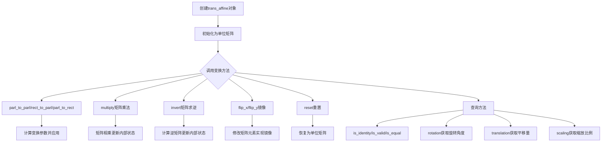
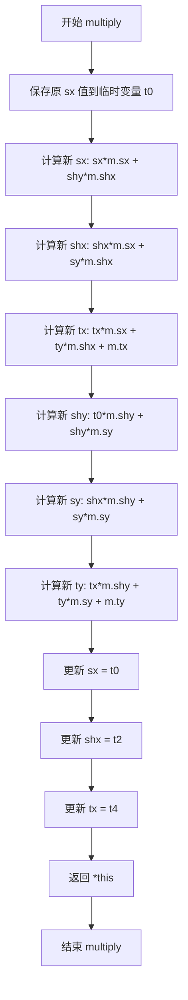
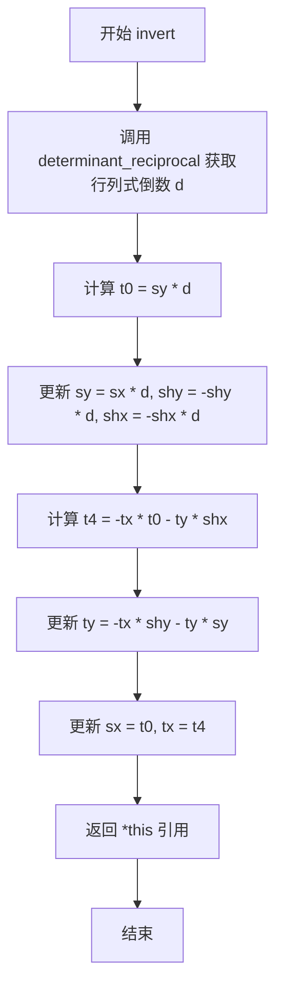
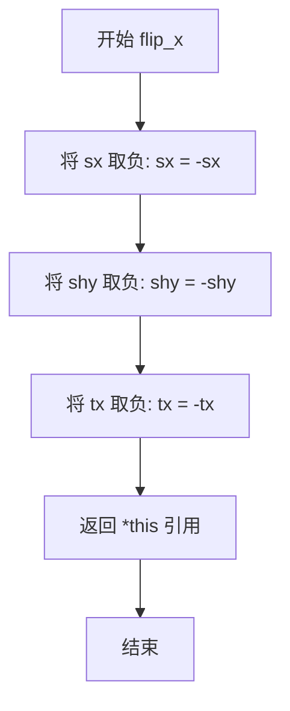
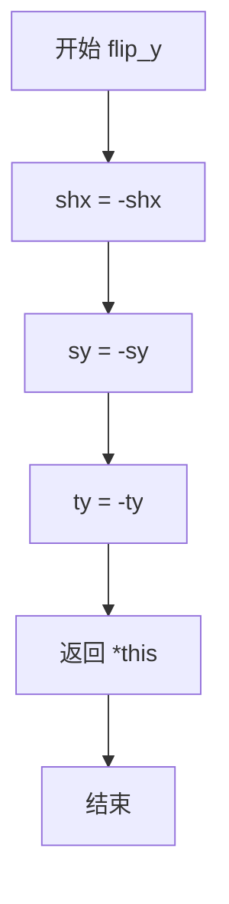
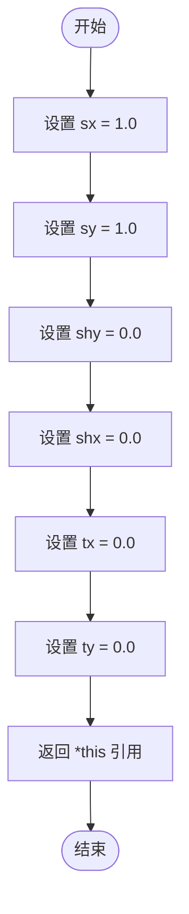
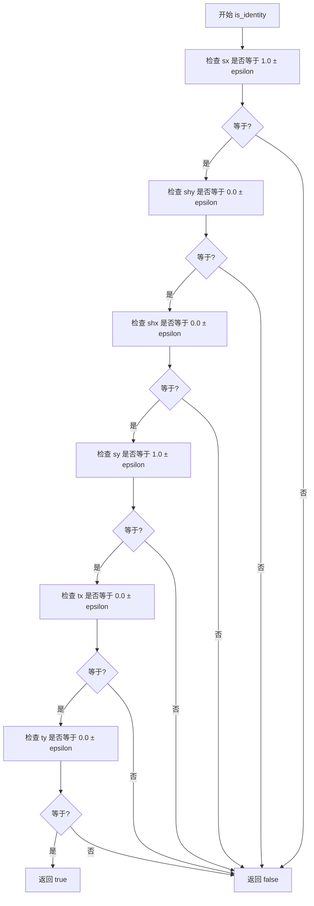
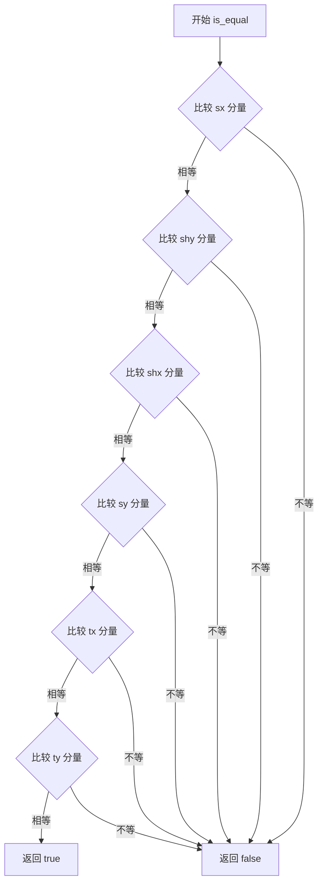
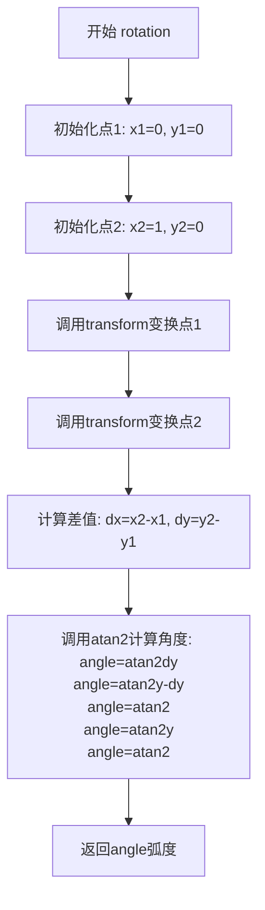
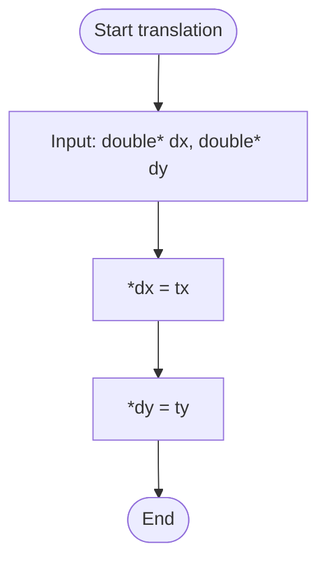

# `matplotlib\extern\agg24-svn\src\agg_trans_affine.cpp` 详细设计文档

这是Anti-Geometry库中的2D仿射变换实现类trans_affine，提供了旋转、缩放、平移、剪切等几何变换功能，支持矩阵乘法、求逆、单位矩阵检测等操作

## 整体流程



## 类结构

```
agg (命名空间)
└── trans_affine (仿射变换类)
    ├── 成员变量 (6个)
    │   ├── sx, sy (缩放)
    │   ├── shx, shy (剪切)
    │   └── tx, ty (平移)
    └── 成员方法 (14个)
        ├── 变换构造方法
        ├── 矩阵运算方法
        ├── 状态查询方法
        └── 属性获取方法
```

## 全局变量及字段


### `trans_affine.sx`
    
X轴缩放因子，控制沿x方向的缩放比例

类型：`double`
    


### `trans_affine.sy`
    
Y轴缩放因子，控制沿y方向的缩放比例

类型：`double`
    


### `trans_affine.shx`
    
X轴剪切因子，控制沿x方向对y轴的倾斜程度

类型：`double`
    


### `trans_affine.shy`
    
Y轴剪切因子，控制沿y方向对x轴的倾斜程度

类型：`double`
    


### `trans_affine.tx`
    
X轴平移量，控制沿x方向的位移

类型：`double`
    


### `trans_affine.ty`
    
Y轴平移量，控制沿y方向的位移

类型：`double`
    
    

## 全局函数及方法


### `trans_affine.parl_to_parl`

该函数实现从源平行四边形到目标平行四边形的仿射变换矩阵构建，通过计算源平行四边形的边向量作为变换基向量，设置平移量为源平行四边形原点，然后求逆并乘以目标平行四边形对应的变换矩阵，最终得到完整的仿射变换关系。

参数：

- `src`：`const double*`，源平行四边形的顶点坐标数组，包含6个double值（依次为顶点0的x、y坐标，顶点1的x、y坐标，顶点2的x、y坐标），定义源平行四边形的三个顶点（第四个顶点由前三个隐含确定）
- `dst`：`const double*`，目标平行四边形的顶点坐标数组，包含6个double值（依次为顶点0的x、y坐标，顶点1的x、y坐标，顶点2的x、y坐标），定义目标平行四边形的三个顶点

返回值：`const trans_affine&`，返回变换矩阵自身的引用，支持链式调用

#### 流程图

```mermaid
flowchart TD
    A[开始 parl_to_parl] --> B[计算源平行四边形边向量<br/>sx = src[2] - src[0]<br/>shy = src[3] - src[1]]
    B --> C[计算源平行四边形边向量<br/>shx = src[4] - src[0]<br/>sy = src[5] - src[1]]
    C --> D[设置平移向量<br/>tx = src[0]<br/>ty = src[1]]
    D --> E[对当前矩阵求逆<br/>invert]
    E --> F[创建目标平行四边形变换矩阵<br/>sx = dst[2]-dst[0]<br/>shy = dst[3]-dst[1]<br/>shx = dst[4]-dst[0]<br/>sy = dst[5]-dst[1]<br/>tx = dst[0]<br/>ty = dst[1]]
    F --> G[矩阵乘法合成<br/>multiply目标矩阵]
    G --> H[返回自身引用<br/>return \*this]
```

#### 带注释源码

```cpp
//----------------------------------------------------------------------------
// Anti-Grain Geometry - Version 2.4
// 仿射变换实现 - 平行四边形到平行四边形的变换
//----------------------------------------------------------------------------

    //------------------------------------------------------------------------
    // 从源平行四边形到目标平行四边形的仿射变换
    // 参数:
    //   src - 源平行四边形的顶点坐标数组[6]，按顺序为:
    //         src[0]=x0, src[1]=y0 (第一个顶点，通常为原点)
    //         src[2]=x1, src[3]=y1 (第二个顶点，边向量终点)
    //         src[4]=x2, src[5]=y2 (第三个顶点，另一个边向量终点)
    //   dst - 目标平行四边形的顶点坐标数组[6]，格式同上
    // 返回:
    //   变换矩阵自身的引用，支持链式调用
    //------------------------------------------------------------------------
    const trans_affine& trans_affine::parl_to_parl(const double* src, 
                                                   const double* dst)
    {
        // 计算源平行四边形的两个边向量
        // 边向量1: 从顶点0到顶点1
        sx  = src[2] - src[0];  // 缩放x分量（平行四边形的宽度向量x）
        shy = src[3] - src[1];  // 剪切y分量（平行四边形的宽度向量y）
        
        // 边向量2: 从顶点0到顶点2
        shx = src[4] - src[0];  // 剪切x分量（平行四边形的高度向量x）
        sy  = src[5] - src[1];  // 缩放y分量（平行四边形的高度向量y）
        
        // 设置平移分量，使用源平行四边形的原点作为变换起点
        tx  = src[0];           // 源平行四边形原点的x坐标
        ty  = src[1];           // 源平行四边形原点的y坐标
        
        // 对当前矩阵求逆
        // 这一步将当前矩阵转换为从目标空间到源空间的逆变换
        // 目的是为了后续与目标变换矩阵相乘时，能够正确合成复合变换
        invert();
        
        // 创建目标平行四边形的变换矩阵并与当前矩阵相乘
        // 目标矩阵同样使用边向量方式构建:
        //   sx, shy  = 第一个边向量 (dst[1] - dst[0])
        //   shx, sy  = 第二个边向量 (dst[2] - dst[0])
        //   tx, ty   = 原点坐标 dst[0]
        // 乘法操作将源到单位空间的变换与目标空间的变换合成
        multiply(trans_affine(dst[2] - dst[0], dst[3] - dst[1], 
                              dst[4] - dst[0], dst[5] - dst[1],
                              dst[0], dst[1]));
        
        // 返回当前变换矩阵的引用，支持链式调用
        return *this;
    }
```

---

**补充说明**

| 项目 | 说明 |
|------|------|
| **设计目标** | 将任意源平行四边形区域映射到任意目标平行四边形区域，常用于图像透视校正、坐标系统转换等场景 |
| **数学原理** | 仿射变换矩阵由两个线性无关的边向量确定，通过构建源→单位正方形→目标的复合变换实现任意平行四边形间的映射 |
| **输入约束** | 源和目标顶点必须不共线（即两个边向量线性无关），否则行列式为0，矩阵不可逆 |
| **错误处理** | 当源平行四边形退化为直线或点时，`invert()`调用`determinant_reciprocal()`会返回0或无穷大，导致未定义行为 |
| **依赖方法** | `invert()` - 求逆矩阵；`multiply()` - 矩阵乘法；`trans_affine`构造函数 |


### trans_affine.rect_to_parl

该函数用于构建一个仿射变换矩阵，将一个由两个对角点定义的矩形映射到一个由三个顶点定义的平行四边形。

参数：

- `x1`：`double`，矩形第一个顶点的 X 坐标。
- `y1`：`double`，矩形第一个顶点的 Y 坐标。
- `x2`：`double`，矩形对角顶点的 X 坐标。
- `y2`：`double`，矩形对角顶点的 Y 坐标。
- `parl`：`const double*`，指向目标平行四边形三个顶点坐标数组（长度为 6 的数组，首元素为 x1）的指针。

返回值：`const trans_affine&`，返回对象自身的引用（`trans_affine`），支持链式调用。

#### 流程图

```mermaid
flowchart TD
    A[开始 rect_to_parl] --> B[定义临时数组 src[6]]
    B --> C[填充 src 数组:<br/>src[0,1]=x1,y1<br/>src[2,3]=x2,y1<br/>src[4,5]=x2,y2]
    C --> D[调用内部方法 parl_to_parl<br/>参数: src, parl]
    D --> E[返回 *this]
    E --> F[结束]
```

#### 带注释源码

```cpp
//------------------------------------------------------------------------
// 将矩形映射到平行四边形的仿射变换
// x1, y1: 矩形的一个角
// x2, y2: 矩形的对角
// parl: 指向目标平行四边形顶点数组的指针
//------------------------------------------------------------------------
const trans_affine& trans_affine::rect_to_parl(double x1, double y1, 
                                               double x2, double y2, 
                                               const double* parl)
{
    // 定义一个包含3个点的数组来描述矩形
    // 这里使用 (x1,y1), (x2,y1), (x2,y2) 三个点确定矩形（实际上是直角矩形）
    double src[6];
    src[0] = x1; src[1] = y1; // 第一个点
    src[2] = x2; src[3] = y1; // 第二个点 (水平方向延伸)
    src[4] = x2; src[5] = y2; // 第三个点 (对角点)
    
    // 调用核心的平行四边形到平行四边形变换方法
    // 该方法会计算矩阵系数并赋值给当前对象的 sx, sy, shx, shy, tx, ty
    parl_to_parl(src, parl);
    
    // 返回当前对象的引用，以支持链式操作（如 t.rect_to_parl(...).rotate(...)）
    return *this;
}
```


### `trans_affine.parl_to_rect`

该方法实现了从平行四边形（parallelogram）到矩形（rectangle）的仿射变换。通过构建目标矩形的四个顶点坐标数组，调用内部方法 `parl_to_parl` 完成坐标映射变换，并返回对自身的引用以支持链式调用。

参数：

- `parl`：`const double*`，指向源平行四边形6个顶点坐标的数组指针，顺序为 (x0, y0, x1, y1, x2, y2)，其中 (x0,y0) 为原点，(x1,y1) 和 (x2,y2) 分别为平行四边形的另外两个顶点
- `x1`：`double`，目标矩形左下角的 x 坐标
- `y1`：`double`，目标矩形左下角的 y 坐标
- `x2`：`double`，目标矩形右上角的 x 坐标
- `y2`：`double`，目标矩形右上角的 y 坐标

返回值：`const trans_affine&`，返回对当前 trans_affine 对象的引用，支持链式调用

#### 流程图

```mermaid
flowchart TD
    A[开始 parl_to_rect] --> B[构建目标矩形坐标数组 dst[6]]
    B --> C[dst[0]=x1, dst[1]=y1<br/>dst[2]=x2, dst[3]=y1<br/>dst[4]=x2, dst[5]=y2]
    C --> D[调用 parl_to_parl 进行仿射变换]
    D --> E[返回 *this 引用]
    
    style A fill:#e1f5fe
    style E fill:#e8f5e8
```

#### 带注释源码

```
//------------------------------------------------------------------------
// 从平行四边形到矩形的仿射变换
// src: 源平行四边形顶点坐标 (x0,y0,x1,y1,x2,y2)
// x1,y1: 目标矩形左下角坐标
// x2,y2: 目标矩形右上角坐标
// 返回: 对自身的引用，支持链式调用
//------------------------------------------------------------------------
const trans_affine& trans_affine::parl_to_rect(const double* parl, 
                                               double x1, double y1, 
                                               double x2, double y2)
{
    // 创建目标矩形坐标数组 dst[6]
    // 矩形的四个顶点按顺序为:
    // (x1,y1) - 左下角
    // (x2,y1) - 右下角  
    // (x2,y2) - 右上角
    double dst[6];
    dst[0] = x1; dst[1] = y1;  // 左下角 (x1, y1)
    dst[2] = x2; dst[3] = y1;  // 右下角 (x2, y1)
    dst[4] = x2; dst[5] = y2;  // 右上角 (x2, y2)
    
    // 调用 parl_to_parl 执行实际的仿射变换
    // 该方法将源平行四边形映射到目标矩形
    parl_to_parl(parl, dst);
    
    // 返回对自身的引用，支持级联调用
    return *this;
}
```


### `trans_affine::multiply`

该方法是仿射变换类的矩阵乘法操作，通过将当前变换矩阵与输入的另一个仿射变换矩阵相乘，实现变换的组合。这是图形变换中常用的操作，允许将多个独立的变换（缩放、旋转、平移、剪切）合并为一个复合变换。

参数：

- `m`：`const trans_affine&`，要乘入的仿射变换矩阵（右侧矩阵），代表第二个变换操作

返回值：`const trans_affine&`，返回当前对象的引用，支持链式调用（连续多次乘法）

#### 流程图



#### 带注释源码

```cpp
//------------------------------------------------------------------------
// trans_affine::multiply - 矩阵乘法，组合两个仿射变换
// 当前变换矩阵左乘输入矩阵 m，结果存储在当前对象中
// 矩阵乘法满足结合律但不满足交换律
//------------------------------------------------------------------------
const trans_affine& trans_affine::multiply(const trans_affine& m)
{
    // 保存原 sx 值，因为后续计算会覆盖 sx
    double t0 = sx  * m.sx + shy * m.shx;
    
    // 计算新的 shx 分量（剪切 x）
    double t2 = shx * m.sx + sy  * m.shx;
    
    // 计算新的 tx 分量（平移 x），包含平移变换的叠加
    double t4 = tx  * m.sx + ty  * m.shx + m.tx;
    
    // 计算新的 shy 分量（剪切 y），使用保存的原 sx 值
    shy = sx  * m.shy + shy * m.sy;
    
    // 计算新的 sy 分量（缩放 y）
    sy  = shx * m.shy + sy  * m.sy;
    
    // 计算新的 ty 分量（平移 y），包含平移变换的叠加
    ty  = tx  * m.shy + ty  * m.sy + m.ty;
    
    // 更新缩放 x 分量
    sx  = t0;
    
    // 更新剪切 x 分量
    shx = t2;
    
    // 更新平移 x 分量
    tx  = t4;
    
    // 返回当前对象引用，支持链式调用
    return *this;
}
```

#### 仿射变换矩阵说明

该类使用标准的 2D 仿射变换矩阵表示：

| 分量 | 含义 |
|------|------|
| sx | X 轴缩放 |
| sy | Y 轴缩放 |
| shx | X 方向剪切 |
| shy | Y 方向剪切 |
| tx | X 方向平移 |
| ty | Y 方向平移 |

矩阵形式：
```
| sx  shx tx |
| shy sy  ty |
| 0    0   1 |
```


### `trans_affine.invert`

该方法用于对仿射变换矩阵进行求逆计算，通过计算行列式的倒数并重新排列矩阵元素来实现矩阵逆变换。这是一个就地操作（in-place operation），直接修改对象的内部状态，并返回引用以支持方法链式调用。

参数：无

返回值：`const trans_affine&`，返回对当前对象的引用，用于链式调用

#### 流程图



#### 带注释源码

```cpp
//------------------------------------------------------------------------
const trans_affine& trans_affine::invert()
{
    // 获取行列式的倒数，用于归一化逆矩阵计算
    // determinant_reciprocal() 返回 1/det(matrix)
    double d  = determinant_reciprocal();

    // 计算逆矩阵的第一行第一列元素 sx'
    // 原始 sy 值在下一行计算前需要保存到临时变量 t0
    double t0  =  sy  * d;
           sy  =  sx  * d;      // 逆矩阵的 (2,2) 位置
           shy = -shy * d;      // 逆矩阵的 (2,1) 位置，添加负号
           shx = -shx * d;      // 逆矩阵的 (1,2) 位置，添加负号

    // 计算逆矩阵的平移向量 tx'
    // 使用之前保存的 t0 值和更新后的 shx, sy 值
    double t4 = -tx * t0  - ty * shx;
           ty = -tx * shy - ty * sy;

    // 完成逆矩阵的更新
    sx = t0;    // 逆矩阵的 (1,1) 位置
    tx = t4;    // 逆矩阵的 (1,3) 位置，即逆变换的 x 平移量
    
    // 返回引用以支持链式调用，如 a.invert().multiply(b)
    return *this;
}
```


### `trans_affine.flip_x`

该方法执行X轴镜像变换（水平翻转），通过将仿射变换矩阵的sx（水平缩放）、shy（垂直倾斜）和tx（水平平移）分量取负来实现，使变换后的坐标在X轴方向上镜像对称，并返回自身引用以支持链式调用。

参数：
- （无参数）

返回值：`const trans_affine&`，返回*this引用，支持链式调用

#### 流程图



#### 带注释源码

```cpp
//------------------------------------------------------------------------
// X轴镜像变换（水平翻转）
// 通过将仿射矩阵中与X轴相关的分量取反来实现镜像效果
//------------------------------------------------------------------------
const trans_affine& trans_affine::flip_x()
{
    // 水平缩放分量取反，实现X轴镜像
    sx  = -sx;
    
    // 垂直倾斜分量取反，保持镜像变换的一致性
    shy = -shy;
    
    // 水平平移分量取反，确保镜像后的位置正确
    tx  = -tx;
    
    // 返回自身引用，支持链式调用（如 t.flip_x().flip_y()）
    return *this;
}
```


### `trans_affine.flip_y`

对变换矩阵进行Y轴镜像操作，即沿水平方向翻转图形。该方法通过将变换矩阵中的shx（剪切X）、sy（缩放Y）和ty（平移Y）分量取负来实现Y轴翻转效果。

参数：

- （无显式参数）

返回值：`const trans_affine&`，返回对当前对象的引用，支持链式调用

#### 流程图



#### 带注释源码

```cpp
//------------------------------------------------------------------------
// Y轴镜像变换（水平翻转）
// 通过将shx、sy、ty分量取负来实现Y轴翻转
//------------------------------------------------------------------------
const trans_affine& trans_affine::flip_y()
{
    shx = -shx;    // 将X方向剪切分量取反，实现水平镜像
    sy  = -sy;     // 将Y方向缩放分量取反，实现垂直翻转
    ty  = -ty;     // 将Y方向平移分量取反，调整翻转后的位置
    return *this;  // 返回引用，支持链式调用
}
```


### `trans_affine::reset`

该函数是 `trans_affine` 类的成员方法，用于将仿射变换矩阵重置为单位矩阵（identity matrix），即使得变换回到初始状态。

参数： 无

返回值：`const trans_affine&`，返回对当前 `trans_affine` 对象的引用，支持链式调用。

#### 流程图



#### 带注释源码

```cpp
//------------------------------------------------------------------------
// 重置仿射变换矩阵为单位矩阵
// 单位矩阵:
// | 1  0  0 |
// | 0  1  0 |
//------------------------------------------------------------------------
const trans_affine& trans_affine::reset()
{
    // 设置缩放因子 sx 和 sy 为 1.0（保持原有尺度）
    sx  = sy  = 1.0; 
    // 设置剪切因子 shy 和 shx 为 0.0（无剪切）
    // 设置平移因子 tx 和 ty 为 0.0（无平移）
    shy = shx = tx = ty = 0.0;
    // 返回对自身的引用，支持链式操作
    return *this;
}
```


### `trans_affine.is_identity`

该方法用于检查仿射变换矩阵是否为单位矩阵（即不包含任何旋转、缩放、剪切或平移变换）。通过将矩阵的各个分量与单位矩阵的标准值进行比较来判断，使用 epsilon 作为浮点数比较的容差。

参数：

- `epsilon`：`double`，容差值，用于浮点数比较的 tolerance，允许在一定误差范围内的相等判断

返回值：`bool`，如果矩阵为单位矩阵则返回 true，否则返回 false

#### 流程图



#### 带注释源码

```cpp
//------------------------------------------------------------------------
// 检查仿射变换矩阵是否为单位矩阵
// 单位矩阵表示无任何变换：sx=1, sy=1, shx=0, shy=0, tx=0, ty=0
//------------------------------------------------------------------------
bool trans_affine::is_identity(double epsilon) const
{
    // 检查 sx 分量（X 方向缩放）是否接近 1.0
    // 使用 is_equal_eps 进行带容差的浮点数比较
    return is_equal_eps(sx,  1.0, epsilon) &&
           // 检查 shy 分量（Y 方向剪切）是否接近 0.0
           is_equal_eps(shy, 0.0, epsilon) &&
           // 检查 shx 分量（X 方向剪切）是否接近 0.0
           is_equal_eps(shx, 0.0, epsilon) && 
           // 检查 sy 分量（Y 方向缩放）是否接近 1.0
           is_equal_eps(sy,  1.0, epsilon) &&
           // 检查 tx 分量（X 方向平移）是否接近 0.0
           is_equal_eps(tx,  0.0, epsilon) &&
           // 检查 ty 分量（Y 方向平移）是否接近 0.0
           is_equal_eps(ty,  0.0, epsilon);
}
```


### `trans_affine.is_valid`

检查仿射变换矩阵是否有效（非奇异）。通过判断矩阵的缩放分量 sx 和 sy 的绝对值是否大于指定的容差值来确定矩阵是否可逆。

参数：

- `epsilon`：`double`，容差值，用于判断矩阵是否有效。当 sx 或 sy 的绝对值小于等于此值时，认为矩阵无效（奇异）

返回值：`bool`，如果矩阵有效（非奇异）返回 true，否则返回 false

#### 流程图

```mermaid
flowchart TD
    A[开始 is_valid] --> B{abs(sx) > epsilon?}
    B -->|否| C[返回 false]
    B -->|是| D{abs(sy) > epsilon?}
    D -->|否| C
    D -->|是| E[返回 true]
    C --> F[结束]
    E --> F
```

#### 带注释源码

```
//------------------------------------------------------------------------
// 检查仿射变换矩阵是否有效（非奇异）
// 通过检查 sx 和 sy 是否大于容差值来判断矩阵是否可逆
// 参数:
//   epsilon - 容差值，用于判断矩阵是否有效
// 返回值:
//   bool - 矩阵有效返回 true，否则返回 false
//------------------------------------------------------------------------
bool trans_affine::is_valid(double epsilon) const
{
    // 检查水平缩放分量 sx 的绝对值是否大于容差
    // 检查垂直缩放分量 sy 的绝对值是否大于容差
    // 两个条件都满足时矩阵才是可逆的（非奇异）
    return fabs(sx) > epsilon && fabs(sy) > epsilon;
}
```


### `trans_affine.is_equal`

该方法用于比较两个仿射变换矩阵是否相等，通过对矩阵的六个分量（sx, shy, shx, sy, tx, ty）分别进行带误差容忍度的比较来判断，支持浮点数比较时的精度问题。

参数：

- `m`：`const trans_affine&`，要比较的另一个仿射变换矩阵
- `epsilon`：`double`，比较的误差容忍度，用于处理浮点数精度问题

返回值：`bool`，如果两个矩阵的所有分量在 epsilon 范围内相等则返回 true，否则返回 false

#### 流程图



#### 带注释源码

```cpp
//------------------------------------------------------------------------
// 比较两个仿射变换矩阵是否相等
// 该方法通过比较矩阵的六个分量来判断两个矩阵是否相等
// 使用 is_equal_eps 进行带误差容忍度的比较，支持浮点数精度问题
//------------------------------------------------------------------------
bool trans_affine::is_equal(const trans_affine& m, double epsilon) const
{
    // 比较 sx 分量（缩放x）
    // 使用 is_equal_eps 函数进行比较，允许 epsilon 的误差范围
    return is_equal_eps(sx,  m.sx,  epsilon) &&
           // 比较 shy 分量（剪切y）
           is_equal_eps(shy, m.shy, epsilon) &&
           // 比较 shx 分量（剪切x）
           is_equal_eps(shx, m.shx, epsilon) && 
           // 比较 sy 分量（缩放y）
           is_equal_eps(sy,  m.sy,  epsilon) &&
           // 比较 tx 分量（平移x）
           is_equal_eps(tx,  m.tx,  epsilon) &&
           // 比较 ty 分量（平移y）
           is_equal_eps(ty,  m.ty,  epsilon);
}
```


### `trans_affine.rotation`

获取变换矩阵的旋转角度（以弧度为单位）。该方法通过变换两个参考点（原点(0,0)和水平点(1,0)），计算变换后两点连线与水平线的夹角，从而得出仿射变换的旋转角度。

参数：
- 无

返回值：`double`，返回旋转角度，单位为弧度（radians）。

#### 流程图



#### 带注释源码

```cpp
//------------------------------------------------------------------------
// 获取旋转角度（弧度）
// 原理：通过变换两个参考点来计算旋转角度
// 参考点1: (0,0) - 原点
// 参考点2: (1,0) - 水平向右的单位向量
// 变换后，这两点连线的角度即为旋转角度
//------------------------------------------------------------------------
double trans_affine::rotation() const
{
    // 定义参考点1：原点(0,0)
    double x1 = 0.0;
    double y1 = 0.0;
    
    // 定义参考点2：水平向右的单位向量端点(1,0)
    // 这两个点的连线在没有旋转时是水平的（角度为0）
    double x2 = 1.0;
    double y2 = 0.0;
    
    // 使用仿射变换矩阵变换这两个点
    // transform是trans_affine类的成员函数
    // 根据矩阵变换:
    // new_x = sx*x + shx*y + tx
    // new_y = shy*x + sy*y + ty
    transform(&x1, &y1);
    transform(&x2, &y2);
    
    // 计算变换后两点连线的角度
    // atan2(y, x) 返回从x轴正方向到点(x,y)的角度（弧度）
    // dx = x2 - x1: 变换后水平分量的变化
    // dy = y2 - y1: 变换后垂直分量的变化
    // 这就是整个仿射变换的旋转角度
    return atan2(y2 - y1, x2 - x1);
}
```


### `trans_affine.translation`

获取当前仿射变换矩阵中的平移分量（Translation），即x轴和y轴的平移量。

参数：

- `dx`：`double*`，指向用于存储x轴平移量的double变量的指针。
- `dy`：`double*`，指向用于存储y轴平移量的double变量的指针。

返回值：`void`，该方法无直接返回值，结果通过指针参数`dx`和`dy`输出。

#### 流程图



#### 带注释源码

```cpp
    //------------------------------------------------------------------------
    // 获取仿射变换的平移分量
    //------------------------------------------------------------------------
    void trans_affine::translation(double* dx, double* dy) const
    {
        // 将矩阵中的x轴平移参数(tx)解引用并赋值给输入指针dx
        *dx = tx;
        
        // 将矩阵中的y轴平移参数(ty)解引用并赋值给输入指针dy
        *dy = ty;
    }
```


### `trans_affine.scaling`

该方法用于获取仿射变换的缩放比例（X轴和Y轴方向的缩放因子）。它通过逆旋转变换矩阵后变换标准坐标点，计算变换前后的距离来确定缩放比例。

参数：

- `x`：`double*`，输出参数，存储X轴方向的缩放比例
- `y`：`double*`，输出参数，存储Y轴方向的缩放比例

返回值：`void`，无返回值，结果通过输出参数返回

#### 流程图

```mermaid
flowchart TD
    A[开始 scaling 方法] --> B[初始化点1: x1=0.0, y1=0.0]
    B --> C[初始化点2: x2=1.0, y2=1.0]
    C --> D[复制当前变换矩阵到t]
    D --> E[计算旋转角度并逆旋转: t *= trans_affine_rotation&#40;-rotation&#40;&#41;)]
    E --> F[变换点1: t.transform&#40;&x1, &y1&#41;]
    F --> G[变换点2: t.transform&#40;&x2, &y2&#41;]
    G --> H[计算x缩放: *x = x2 - x1]
    H --> I[计算y缩放: *y = y2 - y1]
    I --> J[结束]
```

#### 带注释源码

```cpp
//------------------------------------------------------------------------
// 获取仿射变换的缩放比例
// 该方法通过消除旋转变换的影响，计算纯缩放因子
//------------------------------------------------------------------------
void trans_affine::scaling(double* x, double* y) const
{
    // 定义两个测试点：(0,0) 和 (1,1)
    // 变换这两个点可以计算出缩放比例
    double x1 = 0.0;
    double y1 = 0.0;
    double x2 = 1.0;
    double y2 = 1.0;
    
    // 复制当前仿射变换矩阵
    trans_affine t(*this);
    
    // 逆旋转：先获取当前旋转角度，然后反向旋转
    // 这样可以去掉旋转成分，只保留缩放和剪切成分
    t *= trans_affine_rotation(-rotation());
    
    // 变换两个测试点
    t.transform(&x1, &y1);
    t.transform(&x2, &y2);
    
    // 计算缩放比例：变换后点2减去点1的距离
    // 这就是X和Y方向的缩放因子
    *x = x2 - x1;
    *y = y2 - y1;
}
```

## 关键组件


### trans_affine 仿射变换类

核心仿射变换矩阵类，实现二维仿射变换功能，支持旋转、缩放、平移、倾斜等操作，通过6个矩阵参数(sx, sy, shx, shy, tx, ty)管理变换状态。

### 仿射变换矩阵参数

类字段，包含sx(水平缩放)、sy(垂直缩放)、shx(水平倾斜)、shy(垂直倾斜)、tx(水平平移)、ty(垂直平移)六个double类型成员，完整定义2D仿射变换矩阵的所有元素。

### parl_to_parl 平行四边形变换方法

将源平行四边形映射到目标平行四边形的变换方法，通过计算两组顶点差异构建变换矩阵，支持任意四边形的仿射变换。

### rect_to_parl 矩形到平行四边形变换

将矩形区域变换为任意平行四边形的方法，内部构建矩形顶点数组后调用parl_to_parl完成变换。

### parl_to_rect 平行四边形到矩形变换

将平行四边形区域映射到矩形区域的方法，与rect_to_parl互为逆操作，内部构建目标矩形顶点后调用parl_to_parl。

### multiply 矩阵乘法方法

实现当前变换矩阵与输入矩阵的乘法运算，执行仿射变换的组合操作，支持连续变换的矩阵累积。

### invert 矩阵求逆方法

计算仿射变换矩阵的逆矩阵，使变换可逆，支持坐标的逆向变换操作。

### flip_x/flip_y 镜像翻转方法

分别实现X轴和Y轴方向的镜像翻转功能，通过取反相应矩阵参数实现坐标反射。

### reset 单位矩阵重置方法

将变换矩阵重置为单位矩阵，等同于无变换状态，清除所有累积的变换参数。

### is_identity/is_valid/is_equal 状态查询方法

is_identity检查是否为单位矩阵，is_valid验证矩阵有效性(缩放分量非零)，is_equal比较两个矩阵是否相等(带epsilon精度)。

### rotation 旋转角度计算方法

通过变换前后两个特征点的位置变化计算旋转角度，返回弧度表示的旋转量。

### translation/scaling 平移缩放获取方法

translation提取平移分量，scaling计算缩放比例(考虑旋转变换后的真实缩放)。

### transform 坐标变换方法

将输入坐标(x, y)根据当前仿射矩阵进行变换，是类外部声明的关联方法，实现点的坐标映射。


## 问题及建议


### 已知问题

- **缺少异常安全机制**：`invert()` 方法在行列式为零时未进行有效检查，可能导致除零操作，产生未定义行为
- **设计不一致**：成员函数返回 `const trans_affine&` 但实际修改了对象本身（如 `parl_to_parl`、`multiply`、`invert` 等），这种链式调用设计容易引起误解
- **C风格数组使用**：使用裸指针 `double*` 和 C 风格数组 `double src[6]`/`double dst[6]`，缺乏类型安全和边界检查
- **浮点数比较风险**：`is_identity`、`is_valid`、`is_equal` 等方法依赖 `epsilon` 参数，但未对 epsilon 的合法性进行校验
- **数值稳定性**：`invert()` 方法中直接使用 `determinant_reciprocal()`，未处理极端小值或接近零的行列式情况
- **代码完整性缺失**：大量依赖头文件中未定义的函数（如 `is_equal_eps`、`determinant_reciprocal`），导致代码难以独立分析和维护

### 优化建议

- **添加防御性检查**：在 `invert()` 方法中检查行列式是否接近零，若接近则抛出异常或返回恒等变换
- **使用现代C++容器**：用 `std::array<double, 6>` 或 `std::vector<double>` 替代 C 风格数组，提高类型安全
- **改进API设计**：考虑将修改性方法与查询性方法分离，或返回非 const 引用以避免语义混淆
- **添加 epsilon 校验**：在比较函数中检查 epsilon 是否为正数且在合理范围内
- **考虑数值稳定性**：使用更鲁棒的矩阵求逆算法，处理病态矩阵情况
- **添加文档注释**：为关键方法添加详细的数学说明和边界条件说明
- **考虑添加单元测试**：针对奇异矩阵、非仿射变换等情况编写测试用例


## 其它


### 设计目标与约束

该代码旨在提供二维仿射变换的完整实现，支持旋转、缩放、平移、镜像等基本变换操作。设计目标包括：1）提供高效的矩阵运算能力；2）支持多种坐标系统间的转换（如矩形到平行四边形、平行四边形到矩形）；3）保持变换精度，使用epsilon处理浮点数比较；4）实现链式变换操作。约束条件包括：仅支持二维变换，不处理三维情况；所有运算使用double类型保证精度；要求调用者保证矩阵可逆性（求逆操作）。

### 错误处理与异常设计

本代码采用值返回错误处理模式而非异常机制。关键错误处理包括：1）invert()方法通过determinant_reciprocal()检查行列式是否为零，若为零则返回0.0导致后续计算异常，调用者需预先调用is_valid()检查；2）所有比较方法接受epsilon参数用于浮点数容差控制，默认使用系统epsilon；3）is_valid()检查sx和sy的绝对值是否大于epsilon，确保变换矩阵有效性；4）对于无效输入（如NaN或Inf），is_equal_eps()将返回false，调用者需自行处理边界情况。

### 数据流与状态机

该类不涉及复杂的状态机，主要体现为矩阵状态的转换流程。数据流如下：1）初始状态通过reset()设置为单位矩阵；2）通过multiply()与其他变换矩阵相乘实现链式变换；3）通过parl_to_parl()、rect_to_parl()、parl_to_rect()等方法实现坐标系统转换；4）通过invert()求逆变换；5）通过flip_x()和flip_y()实现镜像变换。每个变换方法都返回*this以支持方法链式调用，形成流畅的API设计。

### 外部依赖与接口契约

外部依赖包括：1）agg命名空间下的辅助函数is_equal_eps()和determinant_reciprocal()（未在此文件中实现）；2）标准库数学函数fabs()和atan2()。接口契约规定：1）所有变换方法返回const trans_affine&以支持链式调用；2）参数类型统一使用double；3）矩阵采用列主序存储（sx, shy, shx, sy, tx, ty）；4）调用者负责保证输入参数有效性；5）矩阵乘法不满足交换律，操作顺序影响最终结果。

### 性能考虑与优化空间

性能特点：1）所有方法均为内联友好型设计，返回引用而非值，避免不必要的拷贝；2）矩阵乘法使用12次乘法运算和6次加法，属于O(1)复杂度；3）求逆操作包含多个临时变量，可能产生寄存器压力。优化建议：1）可考虑使用SIMD指令集加速矩阵运算；2）对于连续多次小变换，可考虑缓存中间结果；3）某些场景可使用近似算法替代精确求逆；4）可添加move语义支持以优化临时对象构造。

### 线程安全性

该类本身不包含任何线程同步机制，属于非线程安全类。多个线程同时访问同一个trans_affine对象进行读写操作需要外部同步。设计决策：1）所有成员变量（sx, shy, shx, sy, tx, ty）均为可变的；2）所有方法均非const（除is_identity、is_valid、is_equal等查询方法），允许在多线程环境下出现数据竞争。最佳实践：每个线程使用独立的trans_affine实例，或使用锁保护共享实例的访问。

### 内存管理

该类采用值语义设计，所有成员为基本类型double，不涉及动态内存分配。内存布局紧凑，总共6个double类型成员，约48字节。无需显式的拷贝构造和赋值操作，默认行为即可满足需求。移动语义在C++11+环境下可进一步优化临时对象的传递效率。

### 兼容性考虑

该代码使用标准C++编写，无平台特定依赖。兼容C++03及以上标准。浮点数比较使用epsilon机制适应不同精度要求的运行环境。命名空间agg避免与第三方库冲突。API设计保持向后兼容，新增方法不会影响现有调用。

### 使用示例与常见用例

典型用例包括：1）图像变换：创建旋转、缩放、平移矩阵应用到图形渲染；2）坐标系统转换：在窗口坐标与世界坐标间转换；3）并行四边形校正：将任意四边形区域映射为矩形；4）图形裁剪：计算裁剪区域的变换矩阵。使用模式：trans_affine t; t.multiply(rotation_matrix).multiply(scaling_matrix); point = t.transform(point);

### 数学原理说明

仿射变换矩阵为2x3矩阵，形式为[sx shy shx sy tx ty]，满足齐次坐标变换。矩阵满足：x' = sx*x + shx*y + tx; y' = shy*x + sy*y + ty。矩阵可分解为：旋转角θ、缩放因子(sx, sy)、平移向量(tx, ty)、 shear分量(shx, shy)。rotation()通过变换单位向量后计算atan2得到旋转角度；scaling()通过逆旋转后测量变换向量的长度得到缩放因子。


    