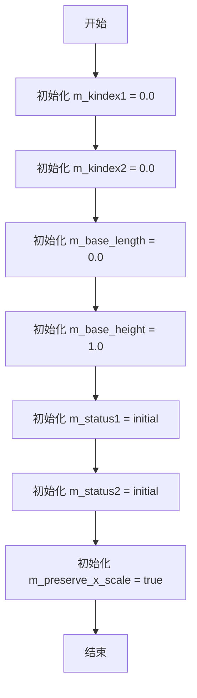
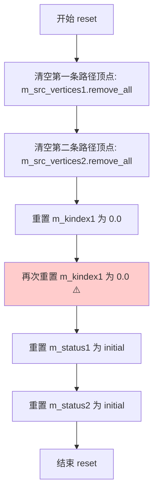
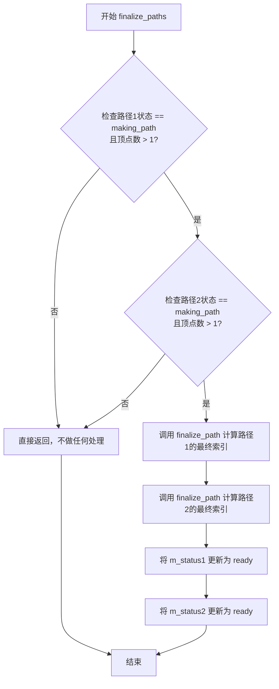
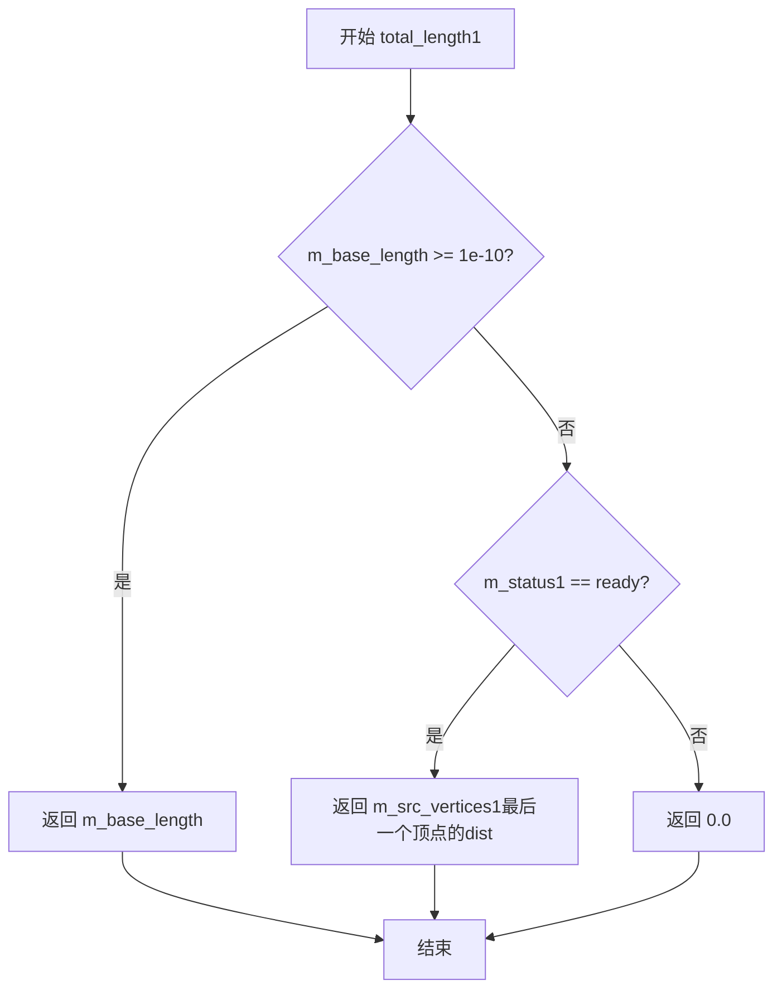

# `matplotlib\extern\agg24-svn\src\agg_trans_double_path.cpp` 详细设计文档

该代码是 Anti-Grain Geometry (AGG) 库中 trans_double_path 类的实现，提供了一种基于双路径插值的二维坐标变换功能。核心算法通过接收两条路径（路径1和路径2），并在它们之间对输入坐标进行混合变换，常用于图像扭曲、纹理映射或路径变形等图形处理场景。

## 整体流程

```mermaid
graph TD
    Start([初始化]) --> StatusInit{状态检查}
    StatusInit -- 初始状态 --> Input1[调用 move_to1/line_to1 定义路径1]
    Input1 --> Status1Check{路径1状态}
    Status1Check -- making_path --> Input2[调用 move_to2/line_to2 定义路径2]
    Input2 --> Status2Check{路径2状态}
    Status2Check -- making_path --> Finalize[调用 finalize_paths 结束路径]
    Finalize --> CalcIndex[计算路径索引 kindex 和总长度]
    CalcIndex --> Ready[状态置为 Ready]
    Ready --> TransformCall[外部调用 transform(x, y)]
    TransformCall --> Interpolate1[调用 transform1 映射路径1坐标 (x1, y1)]
    Interpolate1 --> Interpolate2[调用 transform1 映射路径2坐标 (x2, y2)]
    Interpolate2 --> Blend[线性混合: x = x1 + y * (x2-x1)/h, y = y1 + y * (y2-y1)/h]
    Blend --> Result([返回变换后的坐标])
```

## 类结构

```
trans_double_path (核心变换类)
├── vertex_storage (依赖类: 顶点存储容器)
├── vertex_dist (依赖结构: 顶点坐标与距离)
└── Status (枚举: initial, making_path, ready)
```

## 全局变量及字段


### `initial`
    
路径初始状态常量，表示路径尚未开始构建

类型：`int`
    


### `making_path`
    
路径构建中状态常量，表示路径正在被定义

类型：`int`
    


### `ready`
    
路径已完成状态常量，表示路径已结束并可用于变换

类型：`int`
    


### `trans_double_path.m_src_vertices1`
    
存储路径1的顶点序列

类型：`vertex_storage`
    


### `trans_double_path.m_src_vertices2`
    
存储路径2的顶点序列

类型：`vertex_storage`
    


### `trans_double_path.m_kindex1`
    
路径1的索引缩放因子，用于快速查找

类型：`double`
    


### `trans_double_path.m_kindex2`
    
路径2的索引缩放因子

类型：`double`
    


### `trans_double_path.m_base_length`
    
变换的基准长度，若大于0则忽略实际路径长度

类型：`double`
    


### `trans_double_path.m_base_height`
    
基准高度，用于Y轴方向的缩放混合

类型：`double`
    


### `trans_double_path.m_status1`
    
路径1的当前状态 (initial/making_path/ready)

类型：`int`
    


### `trans_double_path.m_status2`
    
路径2的当前状态

类型：`int`
    


### `trans_double_path.m_preserve_x_scale`
    
标记是否使用精确的X轴比例查找（true）或近似查找（false）

类型：`bool`
    
    

## 全局函数及方法


### `trans_double_path::finalize_path`

该方法负责计算路径的距离场，将顶点链转化为距离索引链。它首先关闭路径并检查是否需要合并短边，然后遍历所有顶点计算累积距离，最后返回用于插值的缩放因子。

参数：

- `vertices`：`vertex_storage&`，顶点存储对象的引用，包含路径的顶点数据（vertex_dist 数组）

返回值：`double`，返回 `(顶点数量 - 1) / 总距离`，作为后续坐标变换的缩放因子（kindex）

#### 流程图

```mermaid
flowchart TD
    A[开始 finalize_path] --> B[调用 vertices.close关闭路径]
    B --> C{顶点数量 > 2?}
    C -->|否| D[初始化 dist = 0]
    C -->|是| E{倒数第二个顶点距离 * 10 < 倒数第三个顶点距离?}
    E -->|否| D
    E -->|是| F[合并最后两个顶点]
    F --> G[重新计算合并后的距离]
    G --> D
    D --> H[遍历所有顶点 i = 0 到 size-1]
    H --> I[保存当前顶点的原始距离 d]
    I --> J[将累积距离存入顶点.dist]
    J --> K[累加 dist += d]
    K --> L{还有更多顶点?}
    L -->|是| H
    L -->|否| M[返回 (size - 1) / dist]
    M --> N[结束]
```

#### 带注释源码

```cpp
//----------------------------------------------------------------------------
// 计算路径的距离场，将顶点链转化为距离索引链
//----------------------------------------------------------------------------
double trans_double_path::finalize_path(vertex_storage& vertices)
{
    unsigned i;      // 循环计数器
    double dist;     // 累积距离
    double d;        // 临时变量，存储原始距离

    // 1. 关闭路径，确保路径闭合
    vertices.close(false);

    // 2. 检查是否需要合并短边（消除路径末端异常短的边）
    if(vertices.size() > 2)
    {
        // 如果倒数第二个顶点的距离乘以10仍小于倒数第三个顶点的距离，
        // 说明存在一个非常短的边（可能是噪声），需要合并
        if(vertices[vertices.size() - 2].dist * 10.0 < 
           vertices[vertices.size() - 3].dist)
        {
            // 计算合并后的累积距离
            d = vertices[vertices.size() - 3].dist + 
                vertices[vertices.size() - 2].dist;

            // 用最后一个顶点替换倒数第二个顶点
            vertices[vertices.size() - 2] = 
                vertices[vertices.size() - 1];

            // 删除最后一个顶点（已被复制到倒数第二位）
            vertices.remove_last();

            // 更新合并后顶点的距离为累积距离
            vertices[vertices.size() - 2].dist = d;
        }
    }

    // 3. 计算距离场：将每个顶点的 dist 字段改为累积距离
    dist = 0;  // 初始化累积距离为0
    for(i = 0; i < vertices.size(); i++)
    {
        vertex_dist& v = vertices[i];  // 获取当前顶点引用
        d = v.dist;                    // 保存原始距离（该点到前一点的距离）
        v.dist = dist;                 // 将累积距离存入 dist 字段
        dist += d;                     // 累加到总距离
    }

    // 4. 返回插值缩放因子：(顶点数-1) / 总距离
    // 用于后续 transform1 中的坐标插值计算
    return (vertices.size() - 1) / dist;
}
```


### `trans_double_path.transform1`

该方法实现了坐标沿路径的线性/非线性映射，通过二分查找优化在路径上定位坐标点，支持左侧/右侧外推和区间插值三种模式，能够根据顶点间的累积距离进行精确的几何变换。

参数：

- `vertices`：`const vertex_storage&`，顶点存储对象，包含路径上的所有顶点及其累积距离信息
- `kindex`：`double`，索引缩放因子，用于非等距路径的快速查找
- `kx`：`double`，x坐标的缩放因子
- `x`：`double*`，输入输出参数，指向x坐标的指针，方法会修改此值
- `y`：`double*`，输入输出参数，指向y坐标的指针，方法会修改此值

返回值：`void`，无返回值，结果通过指针参数x和y返回

#### 流程图

```mermaid
flowchart TD
    A[开始 transform1] --> B[初始化局部变量 x1, y1, dx, dy, d, dd]
    B --> C[*x *= kx 缩放x坐标]
    C --> D{判断: *x < 0?}
    D -->|Yes| E[左侧外推: 获取顶点0和1]
    E --> F[计算方向向量 dx, dy 和距离差 dd]
    F --> G[d = *x]
    D -->|No| H{判断: *x > 最后一个顶点.dist?}
    H -->|Yes| I[右侧外推: 获取最后两个顶点]
    I --> J[计算方向向量 dx, dy 和距离差 dd]
    J --> K[d = *x - 最后一个顶点.dist]
    H -->|No| L[区间插值]
    L --> M{m_preserve_x_scale?}
    M -->|Yes| N[二分查找定位顶点索引 i, j]
    M -->|No| O[直接计算索引: i = unsigned(*x * kindex)]
    N --> P[计算d和dd]
    O --> P
    P --> Q[获取顶点i和j的坐标]
    Q --> R[计算方向向量 dx, dy]
    R --> S[*x = x1 + dx * d / dd]
    S --> T[*y = y1 + dy * d / dd]
    T --> U[结束]
    
    G --> S
    K --> S
```

#### 带注释源码

```cpp
//------------------------------------------------------------------------
// 该方法实现了坐标沿路径的线性/非线性映射
// 通过二分查找优化在路径上定位坐标点
// 支持三种模式：左侧外推、右侧外推、区间插值
//------------------------------------------------------------------------
void trans_double_path::transform1(const vertex_storage& vertices, 
                                   double kindex, double kx, 
                                   double *x, double* y) const
{
    // 局部变量初始化
    double x1 = 0.0;  // 起始点x坐标
    double y1 = 0.0;  // 起始点y坐标
    double dx = 1.0;  // x方向增量
    double dy = 1.0;  // y方向增量
    double d  = 0.0;  // 当前距离偏移
    double dd = 1.0;  // 区间距离长度
    
    // 对x坐标应用缩放因子kx
    *x *= kx;
    
    // 判断是否在路径左侧（小于起点）
    if(*x < 0.0)
    {
        // 左侧外推处理
        // 使用路径起始段进行线性外推
        //--------------------------
        x1 = vertices[0].x;                      // 取第一个顶点作为起点
        y1 = vertices[0].y;
        dx = vertices[1].x - x1;                // 计算第一个段的方向向量
        dy = vertices[1].y - y1;
        dd = vertices[1].dist - vertices[0].dist;  // 第一个段的累积距离
        d  = *x;                                 // 距离偏移为负值
    }
    else
    // 判断是否在路径右侧（大于终点）
    if(*x > vertices[vertices.size() - 1].dist)
    {
        // 右侧外推处理
        // 使用路径末尾段进行线性外推
        //--------------------------
        unsigned i = vertices.size() - 2;        // 倒数第二个顶点索引
        unsigned j = vertices.size() - 1;        // 最后一个顶点索引
        x1 = vertices[j].x;                     // 取最后一个顶点作为起点
        y1 = vertices[j].y;
        dx = x1 - vertices[i].x;                // 计算最后一段的方向向量
        dy = y1 - vertices[i].y;
        dd = vertices[j].dist - vertices[i].dist;  // 最后一段的累积距离
        d  = *x - vertices[j].dist;              // 距离偏移为正值
    }
    else
    {
        // 区间插值处理
        // 在路径内部进行线性插值
        //--------------------------
        unsigned i = 0;
        unsigned j = vertices.size() - 1;
        
        // 根据标志选择插值方式
        if(m_preserve_x_scale)
        {
            // 二分查找优化：精确定位
            // 适用于非等距分布的顶点
            unsigned k;
            for(i = 0; (j - i) > 1; ) 
            {
                // 计算中间位置
                if(*x < vertices[k = (i + j) >> 1].dist) 
                {
                    j = k;    // 目标在左半区
                }
                else 
                {
                    i = k;    // 目标在右半区
                }
            }
            // 计算相对距离
            d  = vertices[i].dist;
            dd = vertices[j].dist - d;
            d  = *x - d;
        }
        else
        {
            // 直接索引计算：快速近似
            // 适用于等距分布的顶点
            i = unsigned(*x * kindex);
            j = i + 1;
            dd = vertices[j].dist - vertices[i].dist;
            d = ((*x * kindex) - i) * dd;
        }
        
        // 获取插值区间端点坐标
        x1 = vertices[i].x;
        y1 = vertices[i].y;
        dx = vertices[j].x - x1;
        dy = vertices[j].y - y1;
    }
    
    // 根据距离比例计算目标坐标（线性插值/外推）
    *x = x1 + dx * d / dd;
    *y = y1 + dy * d / dd;
}
```


### `trans_double_path::transform`

该方法实现了基于两条路径的双线性或仿射变换混合逻辑，通过对两条路径分别进行坐标变换，然后根据输入点的y坐标在两条路径的结果之间进行线性插值，生成最终的变换坐标。

参数：

- `x`：`double*`，输入输出参数，表示变换前的x坐标，变换后输出变换后的x坐标
- `y`：`double*`，输入输出参数，表示变换前的y坐标，变换后输出变换后的y坐标

返回值：`void`，无返回值，结果通过指针参数输出

#### 流程图

```mermaid
flowchart TD
    A[开始 transform] --> B{m_status1 == ready<br/>&& m_status2 == ready?}
    B -->|否| Z[结束 不做任何变换]
    B -->|是| C{m_base_length > 1e-10?}
    C -->|是| D[调整x坐标<br/>x *= 最后一顶点距离/base_length]
    C -->|否| E[保持x不变]
    D --> F[保存原始x, y值到临时变量]
    E --> F
    F --> G[计算dd = 路径2总长度/路径1总长度]
    G --> H[调用transform1对路径1进行变换<br/>得到x1, y1]
    H --> I[调用transform1对路径2进行变换<br/>使用dd作为kx参数 得到x2, y2]
    I --> J[计算最终x坐标<br/>x = x1 + y * (x2 - x1) / m_base_height]
    J --> K[计算最终y坐标<br/>y = y1 + y * (y2 - y1) / m_base_height]
    K --> Z
```

#### 带注释源码

```cpp
//------------------------------------------------------------------------
// 双线性/仿射变换混合主方法
// 该方法根据两条路径进行坐标变换，并混合结果
//------------------------------------------------------------------------
void trans_double_path::transform(double *x, double *y) const
{
    // 检查两条路径是否都已完成构建（状态为ready）
    if(m_status1 == ready && m_status2 == ready)
    {
        // 如果设置了基础长度，则按比例缩放输入x坐标
        // 这用于将输入坐标映射到路径的坐标空间
        if(m_base_length > 1e-10)
        {
            *x *= m_src_vertices1[m_src_vertices1.size() - 1].dist / 
                  m_base_length;
        }

        // 保存原始输入坐标到临时变量
        double x1 = *x;
        double y1 = *y;
        double x2 = *x;
        double y2 = *y;
        
        // 计算两条路径的长度比例
        // 这个比例用于在两条路径的变换结果之间进行插值
        double dd = m_src_vertices2[m_src_vertices2.size() - 1].dist /
                    m_src_vertices1[m_src_vertices1.size() - 1].dist;

        // 对第一条路径进行坐标变换
        // kx=1.0表示使用路径1的原始比例
        transform1(m_src_vertices1, m_kindex1, 1.0, &x1, &y1);
        
        // 对第二条路径进行坐标变换
        // kx=dd表示使用两条路径的长度比例
        transform1(m_src_vertices2, m_kindex2, dd,  &x2, &y2);

        // 双线性混合：基于输入y坐标在两条路径的变换结果之间进行线性插值
        // m_base_height控制插值的范围/强度
        *x = x1 + *y * (x2 - x1) / m_base_height;
        *y = y1 + *y * (y2 - y1) / m_base_height;
    }
    // 如果路径未就绪，则不进行任何变换，保留原坐标
}
```


### `trans_double_path.trans_double_path()`

构造函数，初始化所有成员变量为默认值，包括路径索引、基础长度和高度、状态标志以及缩放选项。

参数：
- 无

返回值：
- 无（构造函数）

#### 流程图



#### 带注释源码

```
//------------------------------------------------------------------------
// trans_double_path::trans_double_path()
// 构造函数，初始化所有成员变量为默认值
//------------------------------------------------------------------------
trans_double_path::trans_double_path() :
    m_kindex1(0.0),        // 路径1的索引值，用于插值计算
    m_kindex2(0.0),        // 路径2的索引值，用于插值计算
    m_base_length(0.0),    // 基础长度，用于缩放计算
    m_base_height(1.0),    // 基础高度，用于Y轴变换
    m_status1(initial),    // 路径1的状态，初始为initial
    m_status2(initial),    // 路径2的状态，初始为initial
    m_preserve_x_scale(true) // 是否保留X轴缩放，默认为true
{
}
```


### `trans_double_path.reset`

该方法用于重置双路径变换器，清空两条路径的所有顶点数据并将状态标志重置为初始状态。

参数：
- （无参数）

返回值：`void`，无返回值

#### 流程图



#### 带注释源码

```cpp
//------------------------------------------------------------------------
// 重置双路径变换器，清空所有顶点数据并重置状态
//------------------------------------------------------------------------
void trans_double_path::reset()
{
    // 清空第一条路径的所有顶点
    m_src_vertices1.remove_all();
    
    // 清空第二条路径的所有顶点
    m_src_vertices2.remove_all();
    
    // 重置第一条路径的索引值
    m_kindex1 = 0.0;
    
    // 注意：此处存在重复赋值，应改为 m_kindex2 = 0.0;
    // 这是一个潜在的技术债务
    m_kindex1 = 0.0;
    
    // 重置第一条路径的状态为初始状态
    m_status1 = initial;
    
    // 重置第二条路径的状态为初始状态
    m_status2 = initial;
}
```


### `trans_double_path::move_to1`

设置路径1的起点坐标。当路径状态处于initial时，通过modify_last方法修改最后一个顶点为指定坐标(x, y)，并将状态切换为making_path；否则调用line_to1方法添加新的顶点。

参数：

- `x`：`double`，目标点的X坐标
- `y`：`double`，目标点的Y坐标

返回值：`void`，无返回值

#### 流程图

```mermaid
graph TD
    A[开始 move_to1] --> B{m_status1 == initial?}
    B -- 是 --> C[调用 m_src_vertices1.modify_last<br/>vertex_dist(x, y)]
    C --> D[设置 m_status1 = making_path]
    D --> E[结束]
    B -- 否 --> F[调用 line_to1(x, y)]
    F --> E
```

#### 带注释源码

```cpp
//------------------------------------------------------------------------
// 设置路径1的起点
//------------------------------------------------------------------------
void trans_double_path::move_to1(double x, double y)
{
    // 判断当前路径1的状态是否为初始状态
    if(m_status1 == initial)
    {
        // 在初始状态下，修改最后一个顶点为指定坐标(x, y)
        // 这里实际上是设置路径的起点
        m_src_vertices1.modify_last(vertex_dist(x, y));
        
        // 将状态切换为"正在构建路径"
        m_status1 = making_path;
    }
    else
    {
        // 非初始状态下，调用line_to1方法添加新的线段顶点
        line_to1(x, y);
    }
}
```


### `trans_double_path.line_to1`

该方法用于向路径1（第一个路径）的顶点序列中添加一个新的线段终点（顶点）。它检查当前路径1的状态，只有在路径处于构建中（`making_path`）状态时，才将新的顶点坐标添加到内部的顶点容器中；否则不做任何操作。

参数：
- `x`：`double`，要添加的顶点的 X 坐标。
- `y`：`double`，要添加的顶点的 Y 坐标。

返回值：`void`，该方法没有返回值。

#### 流程图

```mermaid
flowchart TD
    A([开始 line_to1]) --> B{检查状态: m_status1 == making_path?}
    B -- 否 (状态为initial或ready) --> C([结束 - 不添加顶点])
    B -- 是 --> D[构造顶点对象 vertex_dist(x, y)]
    D --> E[调用 m_src_vertices1.add 添加顶点]
    E --> F([结束])
```

#### 带注释源码

```cpp
    //------------------------------------------------------------------------
    // 向路径1添加一个顶点
    //------------------------------------------------------------------------
    void trans_double_path::line_to1(double x, double y)
    {
        // 只有当路径1当前处于 'making_path' 状态时才执行添加操作。
        // 初始状态(initial)下不应直接调用 line_to1，而应先调用 move_to1。
        // 如果路径已经完成(finalize_paths 被调用)，状态变为 ready，则不允许再添加顶点。
        if(m_status1 == making_path)
        {
            // 创建一个包含坐标和距离信息的顶点结构体，并添加到路径1的顶点容器中
            m_src_vertices1.add(vertex_dist(x, y));
        }
    }
```


### `trans_double_path.move_to2`

设置路径2的起点。如果路径2处于初始状态，则将给定点作为路径的起始点（修改最后一个顶点），并切换状态为"制作路径中"；否则调用line_to2方法继续绘制路径。

参数：

- `x`：`double`，目标点的X坐标
- `y`：`double`，目标点的Y坐标

返回值：`void`，无返回值

#### 流程图

```mermaid
flowchart TD
    A[开始 move_to2] --> B{状态m_status2是否为initial?}
    B -->|是| C[调用m_src_vertices2.modify_last<br/>将点(x,y)作为路径起点]
    C --> D[设置m_status2 = making_path]
    D --> F[结束]
    B -->|否| E[调用line_to2方法<br/>继续绘制路径]
    E --> F
```

#### 带注释源码

```cpp
//------------------------------------------------------------------------
// 设置路径2的起点
// 参数: x, y - 起点坐标
//------------------------------------------------------------------------
void trans_double_path::move_to2(double x, double y)
{
    // 判断路径2是否处于初始状态
    if(m_status2 == initial)
    {
        // 如果是初始状态，将给定点(x,y)作为路径的起始点
        // 通过modify_last方法修改最后一个顶点（初始状态下只有一个占位顶点）
        m_src_vertices2.modify_last(vertex_dist(x, y));
        
        // 将状态切换为"制作路径中"
        m_status2 = making_path;
    }
    else
    {
        // 如果已经不是初始状态，说明路径已经开始构建
        // 调用line_to2方法继续添加路径点
        line_to2(x, y);
    }
}
```


### `trans_double_path::line_to2`

向路径2添加一个顶点。只有当路径2处于制作状态（making_path）时，才会将顶点添加到顶点存储中。

参数：

- `x`：`double`，目标顶点的X坐标
- `y`：`double`，目标顶点的Y坐标

返回值：`void`，无返回值

#### 流程图

```mermaid
flowchart TD
    A[开始 line_to2] --> B{m_status2 == making_path?}
    B -->|是| C[m_src_vertices2.add<br/>(vertex_dist(x, y))]
    B -->|否| D[什么都不做]
    C --> E[结束]
    D --> E
    style C fill:#90EE90
    style D fill:#FFB6C1
```

#### 带注释源码

```cpp
//------------------------------------------------------------------------
// 向路径2添加一个顶点
//------------------------------------------------------------------------
void trans_double_path::line_to2(double x, double y)
{
    // 检查路径2是否处于制作状态(making_path)
    // 只有在路径已经开始创建但尚未完成时才能添加顶点
    if(m_status2 == making_path)
    {
        // 将新的顶点(x, y)添加到路径2的顶点存储中
        // vertex_dist是一个包含坐标和距离信息的结构体
        m_src_vertices2.add(vertex_dist(x, y));
    }
    // 如果状态不是making_path，则忽略此调用
    // 这防止了在路径未正确初始化或已完成后意外添加顶点
}
```


### `trans_double_path::finalize_path`

这是一个私有方法，用于计算并填充顶点集合中每个顶点的累积距离(dist)，同时返回总长度的倒数（即索引比例），以便后续变换操作中进行插值计算。

参数：

- `vertices`：`vertex_storage&`，顶点存储对象的引用，包含需要计算累积距离的顶点序列

返回值：`double`，返回`(顶点数-1) / 总距离`，即总长度的倒数，用于后续变换时的索引计算

#### 流程图

```mermaid
flowchart TD
    A[开始 finalize_path] --> B[调用 vertices.close false 关闭路径]
    B --> C{顶点数 > 2?}
    C -->|是| D{最后一个顶点距离 × 10 < 倒数第三个顶点距离?}
    C -->|否| E[跳过合并检查]
    D -->|是| F[合并最后两个顶点<br/>更新累积距离]
    D -->|否| E
    E --> G[初始化 dist = 0]
    G --> H[遍历所有顶点 i = 0 到 size-1]
    H --> I[获取当前顶点 v]
    I --> J[保存当前距离 d = v.dist]
    J --> K[设置 v.dist = dist<br/>累积距离]
    K --> L[dist += d]
    L --> M{还有更多顶点?}
    M -->|是| H
    M -->|否| N[返回 (size-1) / dist]
    N --> O[结束]
```

#### 带注释源码

```cpp
//------------------------------------------------------------------------
// 计算并填充每个顶点的累积距离，返回总长度的倒数(索引)
//------------------------------------------------------------------------
double trans_double_path::finalize_path(vertex_storage& vertices)
{
    unsigned i;       // 循环计数器
    double dist;      // 累积距离
    double d;         // 临时距离变量

    // 关闭路径，确保路径闭合
    vertices.close(false);
    
    // 如果顶点数大于2，进行合并优化检查
    if(vertices.size() > 2)
    {
        // 检查倒数第二个顶点的距离是否远小于倒数第三个
        // 这是一个优化：如果某个段非常短（小于前一段的1/10），则合并它们
        if(vertices[vertices.size() - 2].dist * 10.0 < 
           vertices[vertices.size() - 3].dist)
        {
            // 计算合并后的距离
            d = vertices[vertices.size() - 3].dist + 
                vertices[vertices.size() - 2].dist;

            // 用最后一个顶点替换倒数第二个顶点
            vertices[vertices.size() - 2] = 
                vertices[vertices.size() - 1];

            // 删除最后一个顶点
            vertices.remove_last();
            
            // 更新新的倒数第二个顶点的累积距离
            vertices[vertices.size() - 2].dist = d;
        }
    }

    // 初始化累积距离为0
    dist = 0;
    
    // 遍历所有顶点，计算累积距离
    for(i = 0; i < vertices.size(); i++)
    {
        vertex_dist& v = vertices[i];  // 获取当前顶点引用
        d = v.dist;                     // 保存当前段的原始距离
        v.dist = dist;                  // 设置为累积距离
        dist += d;                      // 累加到总距离
    }

    // 返回总长度的倒数(索引)
    // (顶点数-1) / 总距离，用于后续变换时的参数插值
    return (vertices.size() - 1) / dist;
}
```

---

### 1. 一段话描述

`trans_double_path`类实现了一个双路径坐标变换系统，通过维护两条路径（基准路径和目标路径）的顶点数据，在变换时根据输入坐标在这两条路径之间进行线性插值，实现类似沿路径变形的几何变换效果。该类常用于图形处理中的路径扭曲、波形变换等应用场景。

### 2. 文件的整体运行流程

该文件实现了一个几何变换类`trans_double_path`，其运行流程如下：

1. **初始化阶段**：创建`trans_double_path`对象，初始化状态为`initial`
2. **路径构建阶段**：通过`move_to1/line_to1`和`move_to2/line_to2`分别构建两条路径的顶点序列
3. **路径完成阶段**：调用`finalize_paths`方法，对两条路径调用`finalize_path`进行最终处理
4. **变换阶段**：调用`transform`方法，根据输入的(x, y)坐标，在两条路径之间进行插值计算，输出变换后的坐标

### 3. 类的详细信息

#### 3.1 类字段

| 字段名称 | 类型 | 描述 |
|---------|------|------|
| `m_kindex1` | `double` | 第一条路径的索引系数，用于非等距插值 |
| `m_kindex2` | `double` | 第二条路径的索引系数 |
| `m_base_length` | `double` | 基准长度，用于缩放变换 |
| `m_base_height` | `double` | 基准高度，用于Y方向变换比例 |
| `m_status1` | `status` | 第一条路径的当前状态（initial/making_path/ready） |
| `m_status2` | `status` | 第二条路径的当前状态 |
| `m_preserve_x_scale` | `bool` | 是否保持X轴缩放 |
| `m_src_vertices1` | `vertex_storage` | 第一条路径的顶点存储 |
| `m_src_vertices2` | `vertex_storage` | 第二条路径的顶点存储 |

#### 3.2 类方法

| 方法名称 | 描述 |
|---------|------|
| `trans_double_path()` | 构造函数，初始化所有成员变量 |
| `reset()` | 重置所有状态和顶点数据 |
| `move_to1(double x, double y)` | 添加第一路径的起点 |
| `line_to1(double x, double y)` | 添加第一路径的中间点 |
| `move_to2(double x, double y)` | 添加第二路径的起点 |
| `line_to2(double x, double y)` | 添加第二路径的中间点 |
| `finalize_path(vertex_storage& vertices)` | **核心方法**，计算累积距离并返回索引 |
| `finalize_paths()` | 完成两条路径的最终处理 |
| `total_length1()` | 获取第一条路径的总长度 |
| `total_length2()` | 获取第二条路径的总长度 |
| `transform1(...)` | 单路径变换的内部实现 |
| `transform(double* x, double* y)` | 对外的主要变换接口 |

### 4. 关键组件信息

| 组件名称 | 一句话描述 |
|---------|-----------|
| `vertex_storage` | 顶点存储容器，管理顶点序列和累积距离 |
| `vertex_dist` | 顶点距离结构体，包含坐标(x, y)和累积距离(dist) |
| `status` | 路径状态枚举，表示路径构建的不同阶段 |
| `m_kindex` | 索引系数，用于加速非均匀路径的查找 |

### 5. 潜在的技术债务或优化空间

1. **赋值错误**：在`reset()`方法中存在`m_kindex1 = 0.0; m_kindex1 = 0.0;`，第二个应该是`m_kindex2`，这是一个明显的复制粘贴错误

2. **合并逻辑简化**：`finalize_path`中的顶点合并逻辑可以提取为独立方法，提高代码可读性

3. **浮点数比较**：使用固定阈值`1e-10`进行浮点数比较，可以考虑使用`std::numeric_limits`的epsilon值

4. **冗余计算**：在`transform1`中，当`m_preserve_x_scale`为false时使用线性查找，可以考虑统一使用二分查找以简化代码

### 6. 其它项目

#### 设计目标与约束

- **目标**：实现沿双路径的几何变换，支持任意路径变形
- **约束**：输入路径必须至少包含2个顶点才能进行有效变换

#### 错误处理与异常设计

- 当路径状态不是`making_path`时，`line_to`操作会被忽略
- 当顶点数不足时，`finalize_path`不会执行合并逻辑
- 变换操作仅在两条路径都处于`ready`状态时才会执行

#### 数据流与状态机

```
initial -> making_path -> ready
```

路径状态转换：
- 调用`move_to`时从`initial`转到`making_path`
- 调用`finalize_paths`后从`making_path`转到`ready`
- 只有在`ready`状态下才能进行有效的坐标变换

#### 外部依赖与接口契约

- 依赖`agg_math.h`和`agg_trans_double_path.h`
- 使用`vertex_storage`和`vertex_dist`作为顶点数据的存储和表示
- `transform`方法接受指向`double`的指针，通过指针参数返回变换结果


### `trans_double_path::finalize_paths`

显式结束两条路径的定义，调用 finalize_path 函数分别计算两条路径的最终索引（kindex），并将两条路径的状态更新为 ready，表示路径已准备就绪可供变换使用。

参数： 无

返回值：`void`，无返回值

#### 流程图



#### 带注释源码

```cpp
//------------------------------------------------------------------------
// finalize_paths - 显式结束路径定义
// 该方法检查两条路径是否都已完成定义（状态为 making_path 且顶点数 > 1）
// 如果满足条件，则计算两条路径的最终索引，并将状态更新为 ready
//------------------------------------------------------------------------
void trans_double_path::finalize_paths()
{
    // 检查路径1和路径2是否都处于 making_path 状态
    // 且各自至少包含2个顶点（需要至少2个顶点才能构成一条路径）
    if(m_status1 == making_path && m_src_vertices1.size() > 1 &&
       m_status2 == making_path && m_src_vertices2.size() > 1)
    {
        // 对两条路径分别调用 finalize_path，计算路径的最终索引
        // finalize_path 会：
        // 1. 关闭路径（close）
        // 2. 移除冗余顶点（如果倒数第二个顶点的距离过小）
        // 3. 重新计算累积距离
        // 4. 返回路径的 kindex（顶点数/总长度）
        m_kindex1 = finalize_path(m_src_vertices1);
        m_kindex2 = finalize_path(m_src_vertices2);
        
        // 将两条路径的状态更新为 ready，表示路径已准备就绪
        // 只有在 ready 状态下，transform 方法才会执行变换操作
        m_status1 = ready;
        m_status2 = ready;
    }
    // 如果任一路径不满足条件（例如未完成定义或顶点数不足），则不进行任何操作
}
```


### `trans_double_path.total_length1`

获取路径1的总长度。如果设置了基础长度（m_base_length），则返回该值；否则返回路径1最后一个顶点的累积距离。

参数：无

返回值：`double`，返回路径1的总长度

#### 流程图



#### 带注释源码

```cpp
//------------------------------------------------------------------------
// 获取路径1的总长度
//------------------------------------------------------------------------
double trans_double_path::total_length1() const
{
    // 如果基础长度已设置（大于等于1e-10），直接返回基础长度
    // 这允许用户覆盖自动计算的长度
    if(m_base_length >= 1e-10) return m_base_length;
    
    // 否则，如果路径1已准备就绪，返回最后一个顶点的累积距离
    // 这代表了路径的实际几何长度
    return (m_status1 == ready) ? 
        m_src_vertices1[m_src_vertices1.size() - 1].dist :
        0.0;  // 路径未就绪时返回0
}
```

#### 相关上下文信息

- **m_base_length**：基础长度（double），用户设置的目标长度，用于缩放
- **m_status1**：路径1状态（枚举：initial/making_path/ready），表示路径构建阶段
- **m_src_vertices1**：路径1顶点存储（vertex_storage），包含所有顶点的几何信息和累积距离


### `trans_double_path.total_length2()`

返回路径2的总长度。如果设置了基础长度，则返回该基础长度；否则返回路径2中最后一个顶点的累积距离。

参数：无

返回值：`double`，返回路径2的总长度

#### 流程图


#### 带注释源码

```cpp
//------------------------------------------------------------------------
// 返回路径2的总长度
// 如果设置了基础长度(m_base_length >= 1e-10)，则返回该基础长度
// 否则返回路径2顶点存储中最后一个顶点的累积距离
// 如果路径2尚未准备完成(m_status2 != ready)，返回0.0
//------------------------------------------------------------------------
double trans_double_path::total_length2() const
{
    // 如果设置了基础长度，直接返回基础长度
    if(m_base_length >= 1e-10) return m_base_length;
    
    // 检查路径2是否已准备完成
    // 如果准备完成，返回路径2最后一个顶点的累积距离（即总长度）
    // 如果未准备完成，返回0.0
    return (m_status2 == ready) ? 
        m_src_vertices2[m_src_vertices2.size() - 1].dist :
        0.0;
}
```


### `trans_double_path.transform1`

单路径变换核心函数，负责处理顶点数组的坐标变换，根据输入x坐标值判断是进行插值计算还是左侧/右侧外推，并输出变换后的坐标(x, y)。该函数支持两种插值模式：精确二分查找模式和平滑索引模式。

参数：

- `vertices`：`const vertex_storage&`，输入的顶点存储数组，包含顶点的x、y坐标和累计距离信息
- `kindex`：`double`，用于平滑索引模式的缩放因子，表示顶点数与总距离的比值
- `kx`：`double`，x坐标的缩放因子，用于调整输入x值的尺度
- `x`：`double*`，输入输出参数，变换前的x坐标（已乘以kx），变换后的x坐标
- `y`：`double*`，输出参数，变换后的y坐标

返回值：`void`，无返回值，结果通过指针参数x和y输出

#### 流程图

```mermaid
flowchart TD
    A[开始 transform1] --> B{输入x是否小于0?}
    B -->|是| C[左侧外推模式]
    B -->|否| D{输入x是否大于最后顶点距离?}
    D -->|是| E[右侧外推模式]
    D -->|否| F[插值模式]
    
    C --> C1[取首顶点坐标<br/>x1=vertices[0].x<br/>y1=vertices[0].y]
    C --> C2[计算首段方向向量<br/>dx=vertices[1].x-x1<br/>dy=vertices[1].y-y1]
    C --> C3[计算段长度<br/>dd=vertices[1].dist-vertices[0].dist]
    C --> C4[设置相对距离d=*x]
    
    E --> E1[取末顶点坐标<br/>x1=vertices[j].x<br/>y1=vertices[j].y]
    E --> E2[计算末段方向向量<br/>dx=x1-vertices[i].x<br/>dy=y1-vertices[i].y]
    E --> E3[计算段长度<br/>dd=vertices[j].dist-vertices[i].dist]
    E --> E4[设置相对距离d=*x-vertices[j].dist]
    
    F --> F1{m_preserve_x_scale?}
    F1 -->|是| F2[二分查找定位区间<br/>使用二分搜索找到i和j]
    F1 -->|否| F3[平滑索引定位<br/>i=unsigned(*x*kindex)]
    F2 --> F4[计算相对位置d和段长度dd]
    F3 --> F4
    
    C4 --> G[计算输出坐标<br/>*x=x1+dx*d/dd<br/>*y=y1+dy*d/dd]
    E4 --> G
    F4 --> G
    
    G --> H[结束]
```

#### 带注释源码

```cpp
//------------------------------------------------------------------------
// 单路径变换核心函数 - 处理插值、左侧外推和右侧外推
// transform1: 对单条路径进行坐标变换
//------------------------------------------------------------------------
void trans_double_path::transform1(const vertex_storage& vertices, 
                                   double kindex, double kx, 
                                   double *x, double* y) const
{
    // 初始化局部变量
    double x1 = 0.0;    // 区间起点的x坐标
    double y1 = 0.0;    // 区间起点的y坐标
    double dx = 1.0;    // 区间方向向量的x分量
    double dy = 1.0;    // 区间方向向量的y分量
    double d  = 0.0;    // 输入坐标在当前区间内的相对位置
    double dd = 1.0;    // 当前区间的长度（距离差）
    
    // 对输入x坐标应用缩放因子kx
    *x *= kx;
    
    // 判断处理模式：左侧外推、右侧外推或区间内插值
    if(*x < 0.0)
    {
        // 左侧外推：当x小于0时，使用第一个线段进行外推
        //--------------------------
        x1 = vertices[0].x;                  // 取第一个顶点的x坐标
        y1 = vertices[0].y;                  // 取第一个顶点的y坐标
        dx = vertices[1].x - x1;             // 计算第一个线段的x方向增量
        dy = vertices[1].y - y1;             // 计算第一个线段的y方向增量
        dd = vertices[1].dist - vertices[0].dist;  // 计算第一个线段的长度
        d  = *x;                             // 相对距离为负数，向左侧外推
    }
    else
    if(*x > vertices[vertices.size() - 1].dist)
    {
        // 右侧外推：当x超过总路径长度时，使用最后一个线段进行外推
        //--------------------------
        unsigned i = vertices.size() - 2;   // 倒数第二个顶点的索引
        unsigned j = vertices.size() - 1;   // 最后一个顶点的索引
        x1 = vertices[j].x;                  // 取最后一个顶点的x坐标
        y1 = vertices[j].y;                  // 取最后一个顶点的y坐标
        dx = x1 - vertices[i].x;             // 计算最后一个线段的x方向增量
        dy = y1 - vertices[i].y;             // 计算最后一个线段的y方向增量
        dd = vertices[j].dist - vertices[i].dist;  // 计算最后一个线段的长度
        d  = *x - vertices[j].dist;          // 超出部分作为相对距离
    }
    else
    {
        // 区间内插值：当x在路径范围内时，进行线性插值
        //--------------------------
        unsigned i = 0;                     // 区间起点索引
        unsigned j = vertices.size() - 1;   // 区间终点索引
        
        if(m_preserve_x_scale)
        {
            // 模式1：精确模式 - 使用二分查找定位区间
            // 适用于需要精确坐标映射的场景
            unsigned k;
            for(i = 0; (j - i) > 1; ) 
            {
                // 二分查找：比较x与中点顶点的距离
                if(*x < vertices[k = (i + j) >> 1].dist) 
                {
                    j = k;                  // 目标在左半区间
                }
                else 
                {
                    i = k;                  // 目标在右半区间
                }
            }
            d  = vertices[i].dist;          // 区间起点的累计距离
            dd = vertices[j].dist - d;       // 区间长度
            d  = *x - d;                     // 在区间内的相对位置
        }
        else
        {
            // 模式2：快速模式 - 使用平滑索引计算区间
            // 适用于大规模点集的快速近似查询
            i = unsigned(*x * kindex);       // 直接计算区间索引
            j = i + 1;                       // 下一个顶点
            dd = vertices[j].dist - vertices[i].dist;  // 区间长度
            d = ((*x * kindex) - i) * dd;    // 在区间内的相对位置
        }
        
        // 获取区间端点坐标
        x1 = vertices[i].x;
        y1 = vertices[i].y;
        dx = vertices[j].x - x1;             // 区间x方向增量
        dy = vertices[j].y - y1;             // 区间y方向增量
    }
    
    // 线性插值计算输出坐标
    // 使用公式: result = start + direction * (relative_distance / segment_length)
    *x = x1 + dx * d / dd;
    *y = y1 + dy * d / dd;
}
```


### `trans_double_path::transform`

该方法是对外的主变换接口，执行双路径坐标变换核心逻辑。它接收一对坐标(x, y)，分别计算x在路径1和路径2上的映射位置，然后根据y值对两个映射结果进行线性插值混合，最终输出变换后的坐标。

参数：

- `x`：`double*`，指向x坐标的指针，兼作输入和输出参数
- `y`：`double*`，指向y坐标的指针，兼作输入和输出参数

返回值：`void`，无返回值，但通过指针修改x和y的值

#### 流程图

```mermaid
flowchart TD
    A[开始 transform] --> B{路径1和路径2<br/>是否都就绪?}
    B -->|否| C[直接返回, 不做任何变换]
    B -->|是| D{base_length<br/>> 1e-10?}
    D -->|是| E[按比例缩放x坐标<br/>x *= path1_length / base_length]
    D -->|否| F[保持x不变]
    E --> G[复制x到x1, y1和x2, y2]
    F --> G
    G --> H[调用transform1<br/>变换到路径1得到x1, y1]
    H --> I[调用transform1<br/>变换到路径2得到x2, y2]
    I --> J[计算缩放因子dd<br/>= path2_length / path1_length]
    J --> K[线性插值计算最终x<br/>x = x1 + y * (x2 - x1) / base_height]
    K --> L[线性插值计算最终y<br/>y = y1 + y * (y2 - y1) / base_height]
    L --> M[结束 transform]
```

#### 带注释源码

```cpp
//------------------------------------------------------------------------
// trans_double_path::transform
// 对外接口，主变换逻辑
// 计算x在路径1和路径2上的映射位置，并根据y进行线性插值混合
//------------------------------------------------------------------------
void trans_double_path::transform(double *x, double *y) const
{
    // 检查两个路径是否都已准备就绪（已完成路径定义和finalize）
    if(m_status1 == ready && m_status2 == ready)
    {
        // 如果设置了基础长度，按比例缩放x坐标
        // 这允许用户使用归一化或指定长度的x值进行变换
        if(m_base_length > 1e-10)
        {
            *x *= m_src_vertices1[m_src_vertices1.size() - 1].dist / 
                  m_base_length;
        }

        // 保存原始坐标到临时变量
        double x1 = *x;
        double y1 = *y;
        double x2 = *x;
        double y2 = *y;
        
        // 计算路径2相对于路径1的长度比例
        // 用于在不同长度的路径间进行正确的坐标映射
        double dd = m_src_vertices2[m_src_vertices2.size() - 1].dist /
                    m_src_vertices1[m_src_vertices1.size() - 1].dist;

        // 对路径1进行坐标变换（保持原始x比例）
        transform1(m_src_vertices1, m_kindex1, 1.0, &x1, &y1);
        
        // 对路径2进行坐标变换（应用长度比例缩放）
        transform1(m_src_vertices2, m_kindex2, dd,  &x2, &y2);

        // 根据y值在两个路径变换结果间进行线性插值
        // y=0时返回路径1上的点，y=base_height时返回路径2上的点
        // 中间值按比例混合两个路径的结果
        *x = x1 + *y * (x2 - x1) / m_base_height;
        *y = y1 + *y * (y2 - y1) / m_base_height;
    }
    // 如果路径未就绪，直接返回，不修改x和y的值
}
```

## 关键组件


### trans_double_path 类

核心变换类，负责管理两条路径并进行双路径插值变换，将输入坐标通过两条参考路径进行线性插值映射。

### 路径存储组件 (m_src_vertices1, m_src_vertices2)

存储两条路径的顶点数据，每个顶点包含坐标(x,y)和累积距离信息，用于后续的插值计算。

### 状态管理组件 (m_status1, m_status2)

跟踪两条路径的构建状态，包括initial、making_path、ready三种状态，确保路径正确构建后才执行变换。

### 索引计算组件 (m_kindex1, m_kindex2)

存储路径的索引系数，用于二分查找优化加速插值计算，在finalize_path中根据路径长度和顶点数计算。

### finalize_path 函数

路径终结处理函数，计算每个顶点到起点的累积距离，处理路径末端的特殊情况（如最后一段过短），返回用于缩放的系数。

### transform1 函数

单路径变换核心函数，根据输入的x坐标在路径上进行插值或外推，计算对应的y坐标。支持三种模式：左侧外推、右侧外推、中间插值。

### transform 函数

双路径组合变换函数，使用两条路径进行插值，将输入坐标(x,y)映射到目标坐标，实现基于两条路径的仿射变换效果。

### 外推与插值逻辑

处理路径边界情况的组件，在输入坐标超出路径范围时进行线性外推，在路径内部进行二分查找或线性插值计算。

### 路径构建接口 (move_to1/line_to1, move_to2/line_to2)

提供两条路径的构建接口，支持MoveTo和LineTo操作，累积顶点数据到存储容器中。


## 问题及建议


### 已知问题

-   **reset()函数中存在复制粘贴错误**：m_kindex1被重复赋值两次（m_kindex1 = 0.0; m_kindex1 = 0.0;），而m_kindex2未被正确重置为0.0
-   **move_to1/move_to2的初始状态处理逻辑不当**：在initial状态下调用modify_last()修改最后一个顶点，但如果顶点容器为空（初始状态），这会导致未定义行为或数组越界
-   **finalize_path函数缺少边界检查**：访问vertices[vertices.size() - 2]和vertices[vertices.size() - 3]前未检查size是否≥3，虽然前面有size>2的检查，但逻辑不够严谨
-   **transform1函数缺少边界检查**：直接访问vertices[0]、vertices[1]等元素前未验证容器大小是否足够
-   **魔法数字硬编码**：代码中多处使用1e-10、10.0等魔法数字，缺乏有意义的常量定义
-   **缺少拷贝构造和赋值运算符**：类包含动态容器成员但未显式定义拷贝/移动语义，可能导致浅拷贝问题
-   **transform函数无状态保护**：当m_status1或m_status2不为ready时，函数直接返回而不产生任何错误提示或日志

### 优化建议

-   **修复reset()函数**：将第二行m_kindex1改为m_kindex2 = 0.0
-   **修复move_to逻辑**：在initial状态下应使用add()添加顶点而非modify_last()，或在使用前检查容器是否为空
-   **增加防御性编程**：在访问数组元素前进行边界检查，确保容器大小足够
-   **提取魔法数字为常量**：将1e-10定义为EPSILON，10.0定义为COLLINEAR_THRESHOLD等有意义的常量
-   **添加拷贝控制成员**：显式定义或删除拷贝构造函数和赋值运算符
-   **增加错误处理机制**：transform等函数在状态不正确时可通过断言、异常或返回错误码来提示开发者
-   **优化transform1的二分查找**：考虑使用std::lower_bound或更高效的查找算法替代手写循环
-   **添加类和方法文档注释**：提高代码可维护性和可读性


## 其它


### 设计目标与约束

该类的设计目标是提供一种基于两条路径的几何变换机制，允许用户定义两条路径并通过它们之间的映射关系对坐标进行变换。约束条件包括：1) 两条路径必须都处于"making_path"状态且包含至少2个顶点才能完成路径初始化；2) base_length和base_height用于控制变换的基本尺度，默认base_height为1.0，base_length为0.0；3) preserve_x_scale标志控制是否使用二分查找进行精确插值。

### 错误处理与异常设计

代码中未使用异常机制，而是通过状态机进行错误处理。主要错误处理方式包括：1) 在transform方法中检查两条路径状态是否为ready，非ready状态则不执行变换；2) finalize_paths方法验证路径有效性后才更新状态为ready；3) 使用数值比较（1e-10）处理浮点数精度问题，避免除零错误。

### 数据流与状态机

该类采用双状态机设计，每条路径独立维护状态。状态流转如下：initial -> making_path -> ready。初始状态为initial，调用move_to方法后进入making_path状态，调用finalize_paths且满足条件后进入ready状态。transform方法仅在两条路径都处于ready状态时才执行实际变换操作。

### 外部依赖与接口契约

该类依赖以下外部组件：1) agg_math.h提供数学辅助函数；2) agg_trans_double_path.h中定义的vertex_storage和vertex_dist类型；3) agg::vertex_storage类用于存储顶点序列；4) agg::vertex_dist结构体包含x、y坐标和dist累积距离。调用者必须保证在调用transform前完成路径定义和finalize_paths调用。

### 性能考虑

transform1方法中根据preserve_x_scale标志采用两种算法：当preserve_x_scale为true时使用二分查找（时间复杂度O(log n)），否则使用线性索引（时间复杂度O(1)）。对于需要高精度的场景应使用二分查找，对于性能敏感的场景可关闭该选项。路径顶点存储使用动态数组，频繁调用move_to和line_to时应预分配合理容量。

### 线程安全性

该类是非线程安全的。多个线程同时访问和修改同一trans_double_path对象可能导致数据竞争。需要在外部进行同步控制，或为每个线程分配独立的实例。

### 内存管理

顶点数据存储在m_src_vertices1和m_src_vertices2两个vertex_storage对象中，使用remove_all方法可清空顶点。finalize_path方法会修改vertices数组内容（包括移除最后一项），调用者需注意。transform方法返回后输入坐标x、y会被修改为变换结果。

### 兼容性考虑

该代码为Anti-Grain Geometry 2.4版本的一部分，遵循其许可证条款。代码使用标准C++编写，依赖AGG框架的其他组件。与其他图形库集成时需确保vertex_storage和vertex_dist类型定义兼容。浮点数比较使用硬编码的1e-10阈值，在不同平台可能需要调整。

    