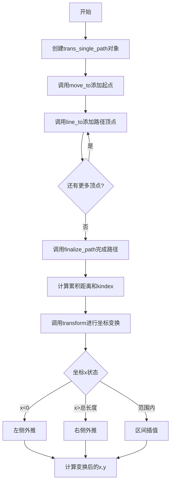
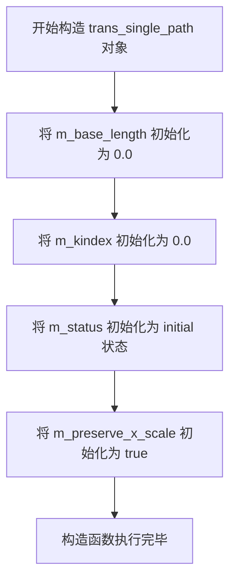
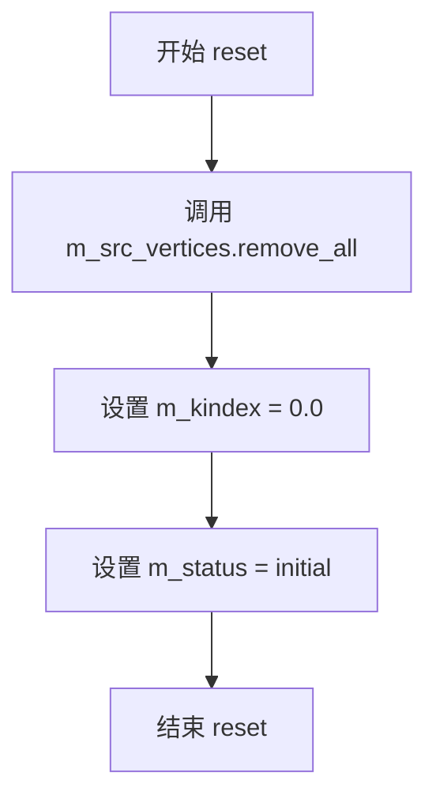
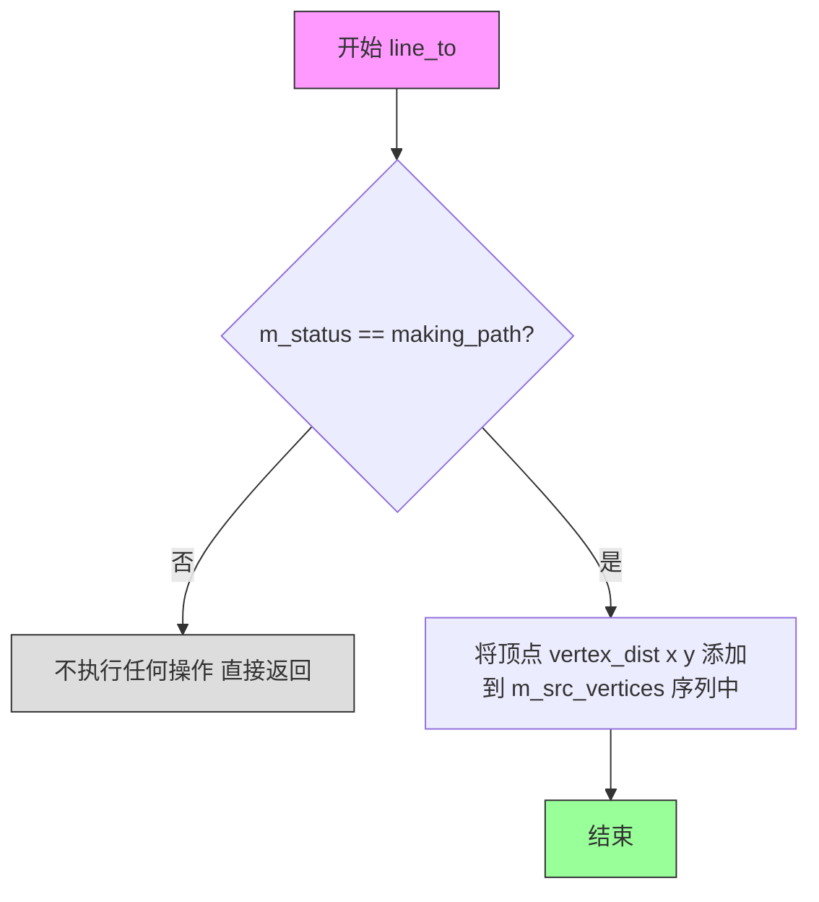
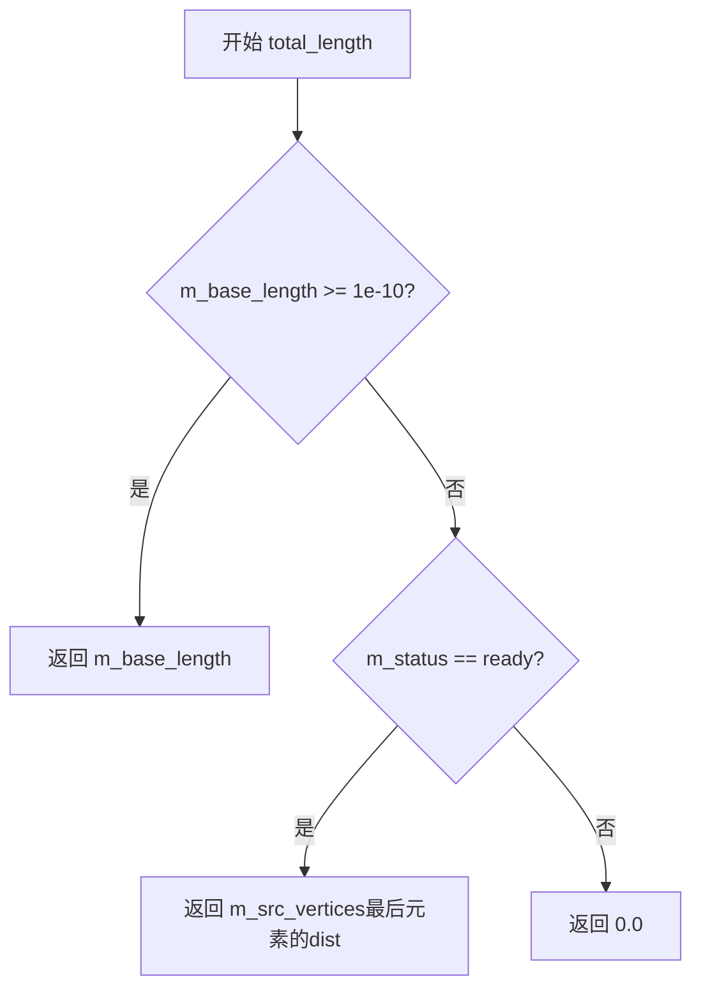
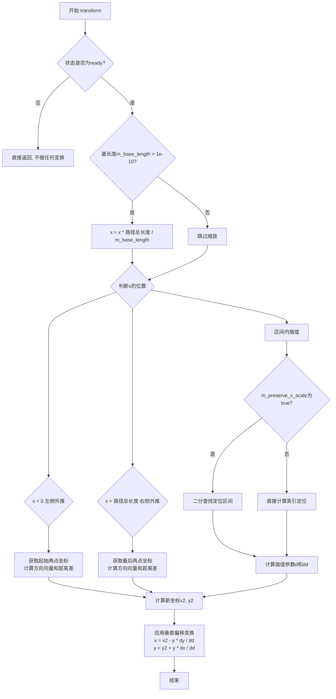

# `matplotlib\extern\agg24-svn\src\agg_trans_single_path.cpp` 详细设计文档

Anti-Grain Geometry库中的trans_single_path类实现了一个路径坐标变换器，将一维路径距离坐标转换为二维平面坐标(x,y)。该类通过存储顶点序列并根据路径上的累积距离进行线性插值或外推，实现路径的坐标映射功能。

## 整体流程



## 类结构

```
agg命名空间
└── trans_single_path类
    ├── 构造函数
    ├── reset() - 重置路径
    ├── move_to() - 移动到起点
    ├── line_to() - 画线到目标点
    ├── finalize_path() - 完成路径并计算距离
    ├── total_length() - 获取路径总长度
    └── transform() - 坐标变换核心方法
```

## 全局变量及字段


### `trans_single_path.m_base_length`
    
基础长度，用于缩放路径坐标

类型：`double`
    


### `trans_single_path.m_kindex`
    
索引系数，用于快速查找顶点

类型：`double`
    


### `trans_single_path.m_status`
    
路径构建状态（initial/making_path/ready）

类型：`状态枚举`
    


### `trans_single_path.m_preserve_x_scale`
    
是否保留X轴缩放

类型：`bool`
    


### `trans_single_path.m_src_vertices`
    
顶点序列，存储路径顶点及累积距离

类型：`vertex_sequence<vertex_dist>`
    
    

## 全局函数及方法


### `trans_single_path.trans_single_path()`

这是 `trans_single_path` 类的构造函数，用于初始化该类的所有成员变量，将路径长度相关参数、插值索引、路径状态和X轴比例保留标志设置为默认值，为后续的路径变换操作做准备。

参数：
- 该函数无参数（无参构造函数）

返回值：
- 无返回值（构造函数）

#### 流程图



#### 带注释源码

```cpp
//------------------------------------------------------------------------
// trans_single_path::trans_single_path()
// 构造函数，负责初始化所有成员变量
//------------------------------------------------------------------------
trans_single_path::trans_single_path() :
    m_base_length(0.0),      // 基础路径长度，0.0表示使用实际路径长度
    m_kindex(0.0),           // 插值索引，用于路径坐标计算
    m_status(initial),      // 路径状态，初始为initial状态
    m_preserve_x_scale(true) // 是否保留X轴比例，true为保留
{
    // 构造函数体为空，所有初始化工作在初始化列表中完成
    // m_src_vertices 使用容器类的默认构造函数初始化为空序列
}
```


### `trans_single_path::reset()`

该方法用于重置路径状态，清空所有顶点数据，将路径索引归零，并将内部状态机恢复为初始状态，以便重新构建新的路径。

参数： 无

返回值： `void`，无返回值

#### 流程图



#### 带注释源码

```
//------------------------------------------------------------------------
// 重置路径，清空顶点序列，输出名称
//------------------------------------------------------------------------
void trans_single_path::reset()
{
    // 清除所有顶点数据，将顶点容器置空
    m_src_vertices.remove_all();
    
    // 重置路径索引值为0.0
    m_kindex = 0.0;
    
    // 将状态机重置为初始状态（initial）
    m_status = initial;
}
```


### `trans_single_path.move_to`

该方法用于在单路径变换器中添加路径的起点或继续添加路径顶点。当状态为初始状态时，修改最后一个顶点并转入路径制作状态；否则调用 line_to 方法继续添加顶点。

参数：

- `x`：`double`，目标点的 X 坐标
- `y`：`double`，目标点的 Y 坐标

返回值：`void`，无返回值

#### 流程图

```mermaid
flowchart TD
    A[开始 move_to] --> B{m_status == initial?}
    B -->|是| C[调用 m_src_vertices.modify_last<br/>将顶点设为 vertex_dist(x, y)]
    C --> D[设置 m_status = making_path]
    D --> E[结束]
    B -->|否| F[调用 line_to(x, y)]
    F --> E
```

#### 带注释源码

```
//----------------------------------------------------------------------------
// 方法: trans_single_path::move_to
// 功能: 添加路径起点或调用 line_to 继续添加路径顶点
// 参数: 
//   x - double 类型，目标点的 X 坐标
//   y - double 类型，目标点的 Y 坐标
// 返回: void
//----------------------------------------------------------------------------
void trans_single_path::move_to(double x, double y)
{
    // 检查当前状态是否为初始状态
    if(m_status == initial)
    {
        // 状态为 initial 时，修改最后一个顶点为新的坐标
        // 这是因为初始时会有一个虚拟顶点占位
        m_src_vertices.modify_last(vertex_dist(x, y));
        
        // 将状态切换为 making_path，表示正在构建路径
        m_status = making_path;
    }
    else
    {
        // 状态不是 initial 时，调用 line_to 方法添加新顶点
        // 这用于添加路径的后续顶点
        line_to(x, y);
    }
}
```


### `trans_single_path::line_to`

该方法用于向当前正在构建的路径添加一个新的顶点坐标点，是构建单条路径几何图形的关键操作。只有在路径处于 `making_path` 状态时才会将顶点添加到顶点序列中。

参数：

- `x`：`double`，要添加的顶点的X坐标
- `y`：`double`，要添加的顶点的Y坐标

返回值：`void`，无返回值

#### 流程图



#### 带注释源码

```cpp
//------------------------------------------------------------------------
// 向路径添加一个顶点
// 仅在路径处于 making_path 状态时执行添加操作
//------------------------------------------------------------------------
void trans_single_path::line_to(double x, double y)
{
    // 检查当前状态是否为 making_path（正在构建路径）
    if(m_status == making_path)
    {
        // 将新的顶点坐标 (x, y) 添加到顶点序列中
        // vertex_dist 包含位置信息和到前一个顶点的距离
        m_src_vertices.add(vertex_dist(x, y));
    }
}
```

#### 关键设计说明

| 项目 | 说明 |
|------|------|
| **前置条件** | 调用前需先通过 `move_to` 方法启动路径构建 |
| **状态依赖** | 仅在 `m_status == making_path` 时才添加顶点 |
| **数据存储** | 顶点被封装为 `vertex_dist` 对象存储在 `m_src_vertices` 序列容器中 |
| **序列要求** | 顶点序列使用 `vertex_sequence` 模板类管理，支持动态添加和访问 |


### `trans_single_path::finalize_path`

该方法完成路径构建的最终处理，包括移除短边冗余顶点、计算累积距离、生成索引因子并将状态切换为就绪，从而为后续的坐标变换操作做好准备。

参数：该方法无显式参数（隐式使用类的成员变量 `m_src_vertices` 和 `m_status`）

返回值：`void`，无返回值

#### 流程图

```mermaid
flowchart TD
    A[开始 finalize_path] --> B{状态是否为 making_path<br/>且顶点数 > 1?}
    B -->|否| Z[直接返回, 不做任何处理]
    B -->|是| C[调用 m_src_vertices.close(false)<br/>闭合路径]
    C --> D{顶点数 > 2?}
    D -->|否| G[跳过短边移除逻辑]
    D -->|是| E{倒数第二个顶点距离 * 10.0<br/>< 小 于倒数第三个顶点距离?}
    E -->|否| G
    E -->|是| F[合并最后两个顶点<br/>移除冗余短边]
    F --> G
    G --> H[初始化累积距离 dist = 0.0]
    H --> I[遍历所有顶点]
    I --> J[将当前顶点距离累加到累积距离<br/>并将原距离作为该顶点的累积距离]
    J --> K{遍历完成?}
    K -->|否| I
    K -->|是| L[计算 m_kindex = (size - 1) / dist]
    L --> M[设置 m_status = ready]
    M --> N[结束]
```

#### 带注释源码

```cpp
//------------------------------------------------------------------------
// finalize_path
// 完成路径构建的最终处理:
// 1. 移除短边冗余顶点以优化路径
// 2. 计算每个顶点的累积距离
// 3. 生成索引因子用于后续坐标变换
// 4. 将状态切换为 ready 以启用变换功能
//------------------------------------------------------------------------
void trans_single_path::finalize_path()
{
    // 检查路径状态是否为正在构建中(making_path)且顶点数大于1
    // 只有满足这两个条件时才进行最终处理
    if(m_status == making_path && m_src_vertices.size() > 1)
    {
        unsigned i;
        double dist;
        double d;

        // 步骤1: 关闭路径(但不真正闭合,只是标记处理)
        m_src_vertices.close(false);

        // 步骤2: 移除短边冗余顶点
        // 当倒数第二个顶点的距离小于倒数第三个顶点的十分之一时
        // 说明存在极短的边(可能是噪声),需要合并到前一个顶点
        if(m_src_vertices.size() > 2)
        {
            // 检查是否存在短边(长度小于前一边长度的10%)
            // 这种短边通常由坐标精度问题产生,会影响后续插值计算
            if(m_src_vertices[m_src_vertices.size() - 2].dist * 10.0 < 
               m_src_vertices[m_src_vertices.size() - 3].dist)
            {
                // 计算合并后的距离: 倒数第三 + 倒数第二的距离之和
                d = m_src_vertices[m_src_vertices.size() - 3].dist + 
                    m_src_vertices[m_src_vertices.size() - 2].dist;

                // 用最后一个顶点替换倒数第二个顶点(移除倒数第二个)
                m_src_vertices[m_src_vertices.size() - 2] = 
                    m_src_vertices[m_src_vertices.size() - 1];

                // 删除最后一个顶点(已被复制到倒数第二的位置)
                m_src_vertices.remove_last();

                // 将合并后的距离写入新的倒数第二个顶点
                m_src_vertices[m_src_vertices.size() - 2].dist = d;
            }
        }

        // 步骤3: 计算累积距离
        // 遍历所有顶点,将每个顶点的原距离值替换为从起点到该顶点的累积距离
        // 这样便于后续进行线性插值计算
        dist = 0.0;
        for(i = 0; i < m_src_vertices.size(); i++)
        {
            // 获取当前顶点的原始区间距离
            vertex_dist& v = m_src_vertices[i];
            double d = v.dist;
            
            // 将当前累积距离写入顶点,作为该顶点的新距离值
            v.dist = dist;
            
            // 累加原始距离到累积距离变量
            dist += d;
        }

        // 步骤4: 计算索引因子 m_kindex
        // 索引因子 = (顶点数 - 1) / 总路径长度
        // 用于在没有 preserve_x_scale 模式下快速计算顶点索引
        m_kindex = (m_src_vertices.size() - 1) / dist;

        // 步骤5: 将状态切换为 ready
        // 表示路径已构建完成,可以进行坐标变换操作
        m_status = ready;
    }
}
```


### `trans_single_path::total_length`

获取当前路径的总长度，如果存在预设的基础长度则返回该值，否则返回实际计算的路径长度。

参数：
- （无参数）

返回值：`double`，返回路径的总长度。如果设置了基础长度（`m_base_length`）且大于1e-10，则返回该基础长度；否则如果路径状态为`ready`，返回最后一个顶点累积的距离（即路径实际长度），否则返回0.0。

#### 流程图



#### 带注释源码

```cpp
//------------------------------------------------------------------------
// 返回路径的总长度
// 如果m_base_length >= 1e-10，则返回预设的基础长度
// 否则根据当前状态返回实际计算的路径长度或0
//------------------------------------------------------------------------
double trans_single_path::total_length() const
{
    // 如果设置了基础长度（用于缩放），则直接返回
    if(m_base_length >= 1e-10) 
        return m_base_length;
    
    // 否则，如果路径已准备就绪，返回实际累积距离
    // 即最后一个顶点的dist值（这是路径的完整长度）
    return (m_status == ready) ? 
        m_src_vertices[m_src_vertices.size() - 1].dist :
        0.0;  // 路径尚未完成，返回0
}
```


### `trans_single_path::transform`

将一维距离坐标转换为二维平面坐标。根据输入的一维距离值（x）和垂直偏移（y），结合预定义的路径顶点，计算并输出对应的二维坐标点。支持路径左侧、右侧的外推以及路径区间内的插值计算。

参数：

- `x`：`double *`，一维距离坐标的指针，作为输入表示沿路径的距离，输出变换后的二维x坐标
- `y`：`double *`，垂直偏移量的指针，输入表示到路径的垂直距离，输出变换后的二维y坐标

返回值：`void`，无返回值，结果通过指针参数直接修改

#### 流程图



#### 带注释源码

```cpp
//------------------------------------------------------------------------
// 将一维距离坐标转换为二维坐标
// 输入: x - 沿路径的距离, y - 到路径的垂直距离
// 输出: x, y - 变换后的二维坐标
//------------------------------------------------------------------------
void trans_single_path::transform(double *x, double *y) const
{
    // 仅在路径已准备好的状态下执行变换
    if(m_status == ready)
    {
        // 如果设置了基长度，则对输入距离进行缩放
        // 这允许用户自定义路径的总长度
        if(m_base_length > 1e-10)
        {
            *x *= m_src_vertices[m_src_vertices.size() - 1].dist / 
                  m_base_length;
        }

        // 初始化局部变量用于插值计算
        double x1 = 0.0;  // 起点x坐标
        double y1 = 0.0;  // 起点y坐标
        double dx = 1.0;  // x方向增量
        double dy = 1.0;  // y方向增量
        double d  = 0.0;  // 当前距离到区间起点的距离
        double dd = 1.0;  // 区间总长度

        // 情况1: x小于0，路径左侧外推
        if(*x < 0.0)
        {
            // Extrapolation on the left
            //--------------------------
            // 使用前两个顶点进行线性外推
            x1 = m_src_vertices[0].x;
            y1 = m_src_vertices[0].y;
            dx = m_src_vertices[1].x - x1;
            dy = m_src_vertices[1].y - y1;
            dd = m_src_vertices[1].dist - m_src_vertices[0].dist;
            d  = *x;  // 负值向外延伸
        }
        else
        // 情况2: x大于路径总长度，路径右侧外推
        if(*x > m_src_vertices[m_src_vertices.size() - 1].dist)
        {
            // Extrapolation on the right
            //--------------------------
            // 使用最后两个顶点进行线性外推
            unsigned i = m_src_vertices.size() - 2;  // 倒数第二个顶点
            unsigned j = m_src_vertices.size() - 1;  // 最后一个顶点
            x1 = m_src_vertices[j].x;
            y1 = m_src_vertices[j].y;
            dx = x1 - m_src_vertices[i].x;
            dy = y1 - m_src_vertices[i].y;
            dd = m_src_vertices[j].dist - m_src_vertices[i].dist;
            d  = *x - m_src_vertices[j].dist;  // 超出部分
        }
        else
        {
            // 情况3: x在路径区间内，进行插值
            //--------------------------
            unsigned i = 0;
            unsigned j = m_src_vertices.size() - 1;
            
            // 根据preserve_x_scale标志选择查找方式
            if(m_preserve_x_scale)
            {
                // 使用二分查找精确定位区间
                unsigned k;
                for(i = 0; (j - i) > 1; ) 
                {
                    if(*x < m_src_vertices[k = (i + j) >> 1].dist) 
                    {
                        j = k; 
                    }
                    else 
                    {
                        i = k;
                    }
                }
                d  = m_src_vertices[i].dist;
                dd = m_src_vertices[j].dist - d;
                d  = *x - d;  // 在区间内的相对位置
            }
            else
            {
                // 使用索引直接计算近似位置
                i = unsigned(*x * m_kindex);
                j = i + 1;
                dd = m_src_vertices[j].dist - m_src_vertices[i].dist;
                d = ((*x * m_kindex) - i) * dd;
            }
            
            // 获取区间端点坐标
            x1 = m_src_vertices[i].x;
            y1 = m_src_vertices[i].y;
            dx = m_src_vertices[j].x - x1;
            dy = m_src_vertices[j].y - y1;
        }
        
        // 计算插值后的基点坐标
        double x2 = x1 + dx * d / dd;
        double y2 = y1 + dy * d / dd;
        
        // 应用垂直偏移变换
        // 根据输入的y值（到路径的垂直距离）计算最终的二维坐标
        *x = x2 - *y * dy / dd;
        *y = y2 + *y * dx / dd;
    }
}
```


## 关键组件


### trans_single_path 类

路径变换核心类，负责将输入坐标沿预定义路径进行插值或外推变换，支持基于累积距离的线性插值和可选的X轴比例保持策略。

### 顶点序列管理 (m_src_vertices)

使用 vertex_dist 序列存储路径顶点及其累积距离信息，通过 close() 方法闭合路径并优化最后一段的精度。

### 状态机 (m_status)

管理路径构建的生命周期，包含 initial（初始）、making_path（构建中）、ready（就绪）三种状态，确保变换操作仅在路径完成后执行。

### transform() 方法

核心坐标变换函数，支持三种模式：左侧外推、右侧外推和区间插值。使用二分查找或直接索引实现高效查找，并通过线性插值计算目标坐标。

### finalize_path() 方法

路径完成处理函数，计算每个顶点的累积距离并更新索引系数 m_kindex，同时处理路径末端简化逻辑以提高精度。

### 累积距离索引 (m_kindex)

预计算的缩放因子 (vertices_count-1)/total_distance，用于将输入 X 坐标快速映射到顶点索引区间，实现 O(1) 查表性能。

### 路径端点外推逻辑

当输入坐标超出路径范围时，使用相邻顶点向量进行线性外推，保持变换连续性，支持无限域坐标变换。

### X轴比例保持策略 (m_preserve_x_scale)

布尔控制标志，决定插值查找算法：true 时使用二分查找保证精确性，false 时使用直接索引保证性能。


## 问题及建议


### 已知问题

-   **Magic Numbers 缺乏注释**：`1e-10`、`10.0` 等数值散落在代码中，缺乏统一常量定义，导致可读性和可维护性差
-   **边界条件风险**：`finalize_path()` 中访问 `m_src_vertices[size()-2]` 和 `m_src_vertices[size()-3]` 前仅检查 `size()>1`，但实际需要 `size()>2` 才能安全访问
-   **重复代码模式**：`transform()` 方法中多次使用 `m_src_vertices[m_src_vertices.size() - 1]` 模式，容易造成索引计算错误
-   **状态机不完整**：`m_status` 使用枚举但仅定义了 `initial`、`making_path`、`ready`，缺乏错误状态和文档说明
-   **API 设计不一致**：`move_to()` 在 `initial` 状态时调用 `modify_last()`，但在 `making_path` 状态时调用 `line_to()`，行为不对称容易导致调用者困惑
-   **缺乏异常处理**：当顶点数量不足或状态不正确时，方法静默失败而非抛出明确错误
-   **类型安全缺失**：大量使用裸指针 `double *x, *y` 进行坐标变换，缺乏 const 正确性

### 优化建议

-   **提取常量**：将 `1e-10` 改为具名常量如 `epsilon`，将 `10.0` 改为 `shortest_dist_threshold`
-   **添加边界检查**：在 `finalize_path()` 中使用 `size() > 2` 和 `size() > 3` 的明确检查
-   **减少重复计算**：将 `m_src_vertices.size() - 1` 等常用索引提取为局部变量
-   **完善状态枚举**：添加 `status_error` 等状态，并添加类级别文档说明状态转换图
-   **统一 API 语义**：考虑将 `move_to` 在非 initial 状态时的行为改为显式报错或明确文档说明
-   **改进参数传递**：考虑使用 `double&` 引用或返回新点对象替代指针参数，提高 const 安全性
-   **添加断言/异常**：在关键路径添加编译期断言或运行时检查，确保前置条件满足


## 其它


### 设计目标与约束

本类的设计目标是实现一个单路径变换器，将一维参数坐标映射到二维平面路径上，支持线性插值和外推操作。设计约束包括：1) 仅支持单路径变换，不支持多路径；2) 要求路径至少包含2个顶点；3) transform方法要求路径状态为ready才能执行；4) 依赖vertex_sequence容器存储顶点数据。

### 错误处理与异常设计

1) 状态检查：transform方法在状态不为ready时直接返回，不执行变换；2) 边界检查：finalize_path要求顶点数量大于1，否则不执行完成操作；3) 数值保护：使用1e-10作为epsilon判断浮点数是否接近零，避免除零错误；4) 索引保护：transform方法中访问顶点时使用.size()进行边界检查，防止越界访问。

### 数据流与状态机

状态机包含三个状态：initial（初始状态）、making_path（构建路径中）、ready（路径就绪）。数据流：1) move_to/line_to接收(x,y)坐标，添加到m_src_vertices序列；2) finalize_path计算累积距离并设置状态为ready；3) transform接收一维坐标x，通过二分查找或线性计算找到对应区间，进行插值或外推得到二维坐标(x,y)。

### 外部依赖与接口契约

外部依赖包括：1) agg_math.h - 数学辅助函数；2) agg_vertex_sequence.h - 顶点序列容器；3) agg_trans_single_path.h - 头文件声明。接口契约：1) 调用者必须在transform前调用finalize_path；2) move_to的第一个调用会将坐标modify_last而非add；3) total_length在base_length>0时返回base_length，否则返回实际路径长度；4) transform的参数为指针类型，直接修改原值。

### 关键算法说明

1) 路径完成时的最后一点优化：当倒数第二个顶点的距离小于倒数第三个的1/10时，移除倒数第二个顶点并合并距离；2) 累积距离计算：finalize_path中遍历所有顶点，将每个顶点的dist改为到起点的累积距离；3) transform的查找策略：根据preserve_x_scale标志选择二分查找或直接索引；4) 外推计算：超出路径范围时使用边界线段进行线性外推。

### 线程安全性

本类不包含任何线程同步机制，属于非线程安全类。如果在多线程环境下使用，需要调用者自行保证互斥访问。

### 性能考量

1) transform方法中大量使用直接数组访问而非迭代器，减少开销；2) 二分查找使用位运算(i+j)>>1替代除法；3) 避免在循环中重复计算size()；4) transform为const方法，可供多个变换对象共享使用。

### 配置参数说明

m_preserve_x_scale：控制x坐标到路径位置的映射策略。true时使用二分查找精确匹配，false时使用线性索引加速但精度较低。m_base_length：允许用户指定路径的规范化长度，用于拉伸或压缩实际路径。


    