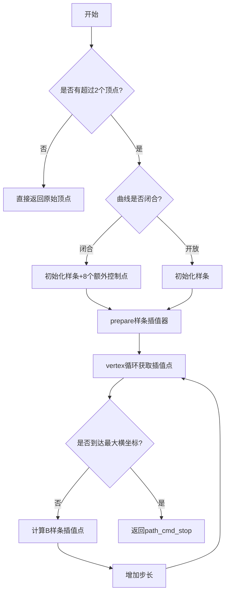
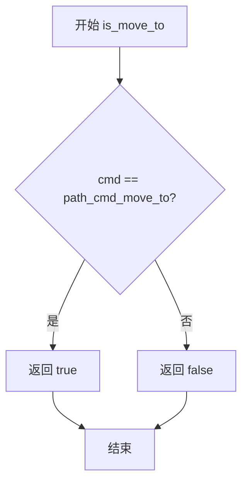
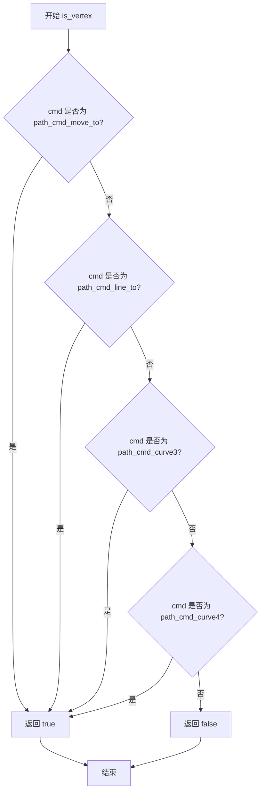
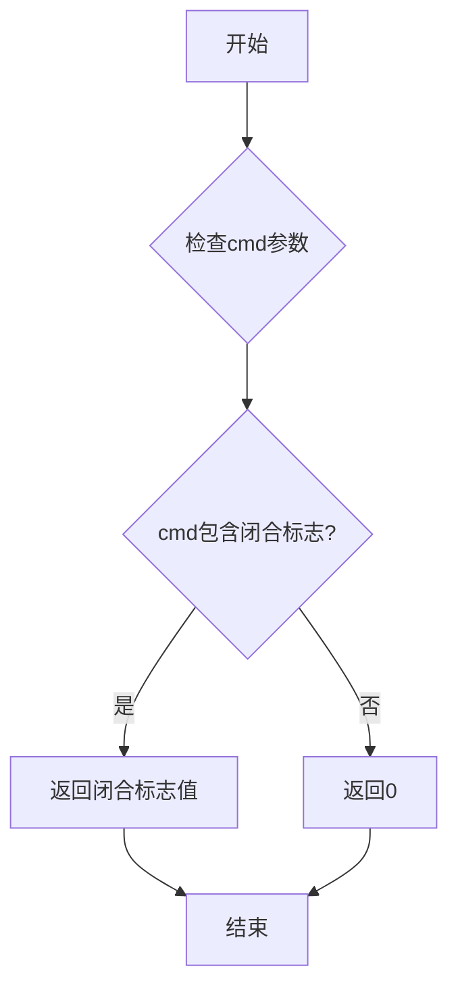
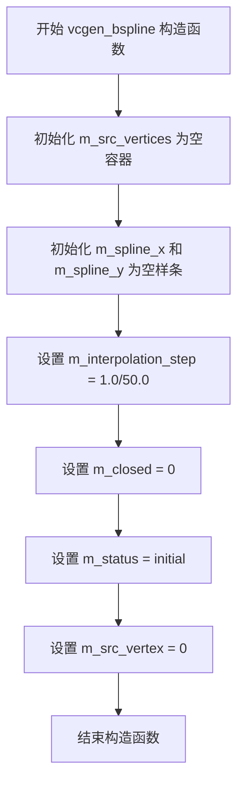
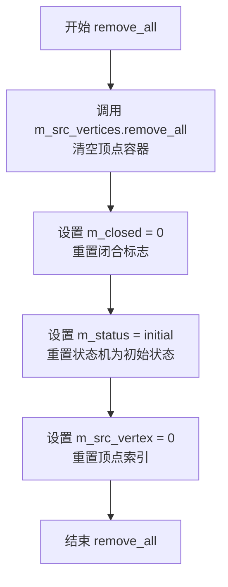

# `matplotlib\extern\agg24-svn\src\agg_vcgen_bspline.cpp` 详细设计文档

Anti-Grain Geometry库的B样条曲线生成器实现，通过B样条插值算法将离散的顶点序列平滑地拟合成连续的B样条曲线，支持开放和闭合曲线两种模式。

## 整体流程



## 类结构

```
vcgen_bspline (B样条曲线生成器)
├── m_src_vertices (顶点容器)
├── m_spline_x (X轴样条插值器)
├── m_spline_y (Y轴样条插值器)
├── m_interpolation_step (插值步长)
├── m_closed (闭合标志)
├── m_status (状态机枚举)
└── m_src_vertex (当前顶点索引)
```

## 全局变量及字段


### `vcgen_bspline.m_src_vertices`
    
源顶点数组,存储输入的原始顶点数据

类型：`vertex_storage`
    


### `vcgen_bspline.m_spline_x`
    
X轴B样条插值器,用于计算曲线的X坐标插值

类型：`spline_type`
    


### `vcgen_bspline.m_spline_y`
    
Y轴B样条插值器,用于计算曲线的Y坐标插值

类型：`spline_type`
    


### `vcgen_bspline.m_interpolation_step`
    
插值步长,控制曲线生成的精度,默认值为1/50

类型：`double`
    


### `vcgen_bspline.m_closed`
    
曲线是否闭合标志,用于标识曲线是否为闭合曲线

类型：`unsigned`
    


### `vcgen_bspline.m_status`
    
状态机状态,控制vertex输出流程的状态转换

类型：`status`
    


### `vcgen_bspline.m_src_vertex`
    
当前处理到的源顶点索引,用于追踪曲线生成进度

类型：`unsigned`
    


### `vcgen_bspline.m_cur_abscissa`
    
当前插值横坐标位置,表示当前样条参数的当前位置

类型：`double`
    


### `vcgen_bspline.m_max_abscissa`
    
最大横坐标边界,定义样条参数的结束位置

类型：`double`
    
    

## 全局函数及方法


### `is_move_to`

该函数是一个全局辅助函数，用于判断传入的命令标志（cmd）是否为路径移动命令（move_to）。在 `vcgen_bspline::add_vertex` 方法中，当接收到 move_to 命令时，会修改最后一个顶点的坐标而非添加新顶点。

参数：

- `cmd`：`unsigned`，命令标志，表示图形路径命令的类型（如 move_to、line_to、close 等）

返回值：`bool`，如果命令标志为 move_to 命令返回 true，否则返回 false

#### 流程图



#### 带注释源码

```
//------------------------------------------------------------------------
// is_move_to - 判断命令是否为 move_to
// 参数: cmd - 无符号整数命令标志
// 返回值: 布尔值，表示是否为 move_to 命令
//------------------------------------------------------------------------
inline bool is_move_to(unsigned cmd)
{
    // path_cmd_move_to 是 AGG 库中定义的移动到命令常量
    // 该函数通过比较 cmd 与 move_to 命令常量来判断
    return cmd == path_cmd_move_to;
}
```

#### 调用位置源码

在 `vcgen_bspline::add_vertex` 方法中的实际调用：

```
//------------------------------------------------------------------------
void vcgen_bspline::add_vertex(double x, double y, unsigned cmd)
{
    m_status = initial;
    if(is_move_to(cmd))  // 判断是否为移动到命令
    {
        // 如果是 move_to，则修改最后一个顶点而非添加新顶点
        m_src_vertices.modify_last(point_d(x, y));
    }
    else
    {
        if(is_vertex(cmd))
        {
            m_src_vertices.add(point_d(x, y));
        }
        else
        {
            m_closed = get_close_flag(cmd);
        }
    }
}
```


### `is_vertex`

该函数用于检查给定的路径命令值是否表示一个顶点命令（如 move_to、line_to、curve3、curve4 等），即判断命令是否为路径点而非控制命令（如 start_poly、end_poly、close、stop）。

参数：

- `cmd`：`unsigned`，表示路径命令标识符，用于判断是否为顶点命令

返回值：`bool`，如果 `cmd` 是顶点命令返回 true，否则返回 false

#### 流程图



#### 带注释源码

```
// is_vertex 函数通常定义在 agg_path_base.h 或类似头文件中
// 该函数属于 AGG 库的内联工具函数，用于路径命令的分类判断
inline bool is_vertex(unsigned cmd)
{
    // path_cmd_vertex 是顶点命令的起始值
    // 通过比较 cmd 与 path_cmd_vertex 的大小来判断
    // 如果 cmd >= path_cmd_move_to 且 cmd <= path_cmd_end_poly 的某个范围
    // 则认为是顶点命令
    return cmd >= path_cmd_move_to && cmd < path_cmd_end_poly;
}

// 在 vcgen_bspline::add_vertex 中的使用示例：
// if(is_vertex(cmd))
// {
//     m_src_vertices.add(point_d(x, y));  // 将顶点添加到源顶点列表
// }
```

**备注**：由于 `is_vertex` 函数的实现未在提供的源代码文件中直接给出，上述源码为根据 AGG 库常见模式的推断。该函数在 `vcgen_bspline::add_vertex` 方法中被调用，用于区分顶点数据和路径控制命令（如闭合标志），以决定是将点数据添加到顶点列表还是设置其他路径属性。


### `get_close_flag(cmd)`

获取闭合标志，用于从路径命令中判断当前路径是否为闭合路径。

参数：

- `cmd`：`unsigned`，路径命令标识符，包含路径操作类型（如移动、画线、闭合等）和属性信息

返回值：`unsigned`（或布尔值），返回闭合标志状态，非零值表示闭合路径，零值表示非闭合路径

#### 流程图



#### 带注释源码

```cpp
// 注意：此函数在提供的代码片段中未直接定义
// 根据AGG库的设计，该函数应为全局内联函数或在头文件中定义
// 以下为基于代码上下文的推断实现：

//------------------------------------------------------------------------
// get_close_flag - 从命令中获取闭合标志
//----------------------------------------------------------------------------
inline unsigned get_close_flag(unsigned cmd)
{
    // AGG库中闭合标志通常通过位操作提取
    // cmd参数包含路径命令类型和可选的标志位
    // 闭合路径的标志通常定义在path_commands.h中
    return cmd & path_cmd_close;
}

// 在add_vertex中的调用方式：
void vcgen_bspline::add_vertex(double x, double y, unsigned cmd)
{
    m_status = initial;
    if(is_move_to(cmd))
    {
        m_src_vertices.modify_last(point_d(x, y));
    }
    else
    {
        if(is_vertex(cmd))
        {
            m_src_vertices.add(point_d(x, y));
        }
        else
        {
            // 使用get_close_flag从cmd中提取闭合标志
            m_closed = get_close_flag(cmd);
        }
    }
}
```

#### 补充说明

由于提供的代码片段为 `.cpp` 实现文件，`get_close_flag` 函数通常定义在对应的头文件（如 `agg_vcgen_bspline.h`）中或作为全局辅助函数。该函数的核心功能是从路径命令参数中提取闭合状态信息，供 `vcgen_bspline` 类判断当前路径是否需要闭合处理。


### `vcgen_bspline::vcgen_bspline()`

这是 `vcgen_bspline` 类的默认构造函数，用于初始化所有成员变量，将B样条曲线生成器的内部状态设置为初始状态，包括清空顶点容器、初始化样条插值器、设置默认插值步长、重置状态标志和顶点索引。

参数：此构造函数无参数

返回值：无返回值（构造函数）

#### 流程图



#### 带注释源码

```cpp
//------------------------------------------------------------------------
// vcgen_bspline 类的默认构造函数
// 功能：初始化所有成员变量，将对象设置为初始状态
//------------------------------------------------------------------------
vcgen_bspline::vcgen_bspline() :
    m_src_vertices(),      // 初始化源顶点容器为空
    m_spline_x(),          // 初始化X轴样条插值器为空
    m_spline_y(),          // 初始化Y轴样条插值器为空
    m_interpolation_step(1.0/50.0),  // 设置默认插值步长为1/50
    m_closed(0),           // 初始化为非闭合曲线
    m_status(initial),    // 设置状态为初始状态
    m_src_vertex(0)        // 初始化源顶点索引为0
{
    // 构造函数体为空，所有初始化工作在成员初始化列表中完成
}
```

---

### 1. 一段话描述

`vcgen_bspline` 类是 Anti-Grain Geometry (AGG) 库中的B样条曲线生成器，它通过接收一系列控制顶点，使用三次B样条插值算法生成平滑的曲线。该类实现了顶点生成器接口，能够将离散的输入顶点转换为连续的光滑曲线输出，支持开放和闭合两种曲线模式。

---

### 2. 文件的整体运行流程

该文件实现了B样条曲线生成器的完整生命周期：
1. **初始化阶段**：通过构造函数创建对象并初始化所有成员变量
2. **数据输入阶段**：通过 `add_vertex()` 方法接收顶点数据
3. **曲线生成准备阶段**：通过 `rewind()` 方法准备样条插值器
4. **曲线输出阶段**：通过 `vertex()` 方法逐步输出曲线上的点
5. **重置阶段**：通过 `remove_all()` 方法清除所有数据

---

### 3. 类的详细信息

#### 3.1 类字段（成员变量）

| 字段名称 | 类型 | 描述 |
|---------|------|------|
| `m_src_vertices` | `pod_array<point_d>` | 存储输入的控制顶点序列 |
| `m_spline_x` | `spline_type` | X轴方向的样条插值器 |
| `m_spline_y` | `spline_type` | Y轴方向的样条插值器 |
| `m_interpolation_step` | `double` | 曲线插值的步长，控制曲线精度 |
| `m_closed` | `unsigned` | 标志位，表示曲线是否闭合 |
| `m_status` | `enum` | 当前状态机状态 |
| `m_src_vertex` | `unsigned` | 当前处理的源顶点索引 |
| `m_cur_abscissa` | `double` | 当前曲线参数位置 |
| `m_max_abscissa` | `double` | 曲线参数的最大值 |

#### 3.2 类方法（成员函数）

| 方法名称 | 功能描述 |
|---------|---------|
| `vcgen_bspline()` | 默认构造函数，初始化所有成员变量 |
| `remove_all()` | 清除所有顶点和状态，重置为初始状态 |
| `add_vertex(double x, double y, unsigned cmd)` | 添加顶点或命令到生成器 |
| `rewind(unsigned)` | 准备样条插值器，开始生成曲线 |
| `vertex(double* x, double* y)` | 获取曲线上的下一个顶点 |

---

### 4. 全局变量和全局函数

该文件中无全局变量和全局函数，所有内容都封装在 `agg` 命名空间内的 `vcgen_bspline` 类中。

---

### 5. 关键组件信息

| 组件名称 | 一句话描述 |
|---------|-----------|
| `vcgen_bspline` | B样条曲线生成器类，负责将离散的顶点转换为平滑的B样条曲线 |
| `pod_array<point_d>` | 紧凑型数组容器，用于高效存储顶点数据 |
| `spline_type` | 样条插值器类型，负责计算B样条曲线上的点 |
| `point_d` | 二维坐标点结构体，包含x和y坐标 |

---

### 6. 潜在的技术债务或优化空间

1. **硬编码的插值步长**：默认的 `m_interpolation_step = 1.0/50.0` 是硬编码的，无法根据曲线长度动态调整，可能导致不必要的计算或曲线精度不足
2. **状态机使用switch但未使用break**：在 `vertex()` 方法中，部分case语句没有使用break，可能导致意外的行为
3. **内存分配策略**：对于闭合曲线，预分配的样条点数量 (+8) 是固定的，可能不够灵活
4. **错误处理缺失**：没有对输入顶点数量过少的情况进行详细错误报告

---

### 7. 其它项目

#### 设计目标与约束
- **目标**：实现高效、平滑的B样条曲线生成
- **约束**：依赖AGG库的基础组件如 `pod_array` 和 `spline_type`

#### 错误处理与异常设计
- 当顶点数量少于2时，`vertex()` 方法会直接返回 `path_cmd_stop`
- 当顶点数量等于2时，退化为直线输出

#### 数据流与状态机
- 状态机包含：`initial`（初始）、`ready`（就绪）、`polygon`（多边形/曲线）、`end_poly`（结束多边形）、`stop`（停止）
- 状态转换遵循：initial → ready → polygon → end_poly → stop

#### 外部依赖与接口契约
- 依赖 `agg::pod_array` 和 `agg::spline_type`
- 依赖 `agg::point_d` 作为顶点类型
- 依赖路径命令常量：`path_cmd_move_to`, `path_cmd_line_to`, `path_cmd_stop`, `path_cmd_end_poly`


### `vcgen_bspline.remove_all`

该方法用于清空所有顶点并重置B样条曲线生成器的内部状态，将顶点容器、闭合标志、状态机和顶点索引全部恢复为初始状态。

参数：
- （无参数）

返回值：`void`，无返回值描述。

#### 流程图



#### 带注释源码

```cpp
//------------------------------------------------------------------------
// 该方法用于重置vcgen_bspline对象的所有状态，清空顶点数据
//------------------------------------------------------------------------
void vcgen_bspline::remove_all()
{
    // 清空源顶点容器，释放所有已添加的顶点
    m_src_vertices.remove_all();
    
    // 将闭合标志重置为0，表示曲线不闭合
    m_closed = 0;
    
    // 将状态机重置为initial初始状态
    m_status = initial;
    
    // 将源顶点索引重置为0，准备重新开始
    m_src_vertex = 0;
}
```


### `vcgen_bspline.add_vertex`

该方法用于向B样条曲线生成器添加顶点或路径命令。它根据命令类型（move_to/vertex/close）将点添加到源顶点集合，或设置路径的闭合标志，并重置生成器状态为初始状态。

参数：

- `x`：`double`，要添加的顶点的X坐标
- `y`：`double`，要添加的顶点的Y坐标
- `cmd`：`unsigned`，路径命令标识符，指定操作类型（move_to、vertex或close）

返回值：`void`，无返回值

#### 流程图

```mermaid
flowchart TD
    A[add_vertex 调用开始] --> B[设置 m_status = initial]
    B --> C{is_move_to(cmd)?}
    
    C -->|Yes| D[modify_last point_d(x, y)<br/>修改最后一个顶点]
    D --> H[函数结束]
    
    C -->|No| E{is_vertex(cmd)?}
    
    E -->|Yes| F[add point_d(x, y)<br/>添加新顶点到集合]
    F --> H
    
    E -->|No| G[m_closed = get_close_flag(cmd)<br/>设置闭合标志]
    G --> H
```

#### 带注释源码

```cpp
//------------------------------------------------------------------------
// 添加顶点或命令到B样条曲线生成器
// 参数:
//   x   - 顶点的X坐标
//   y   - 顶点的Y坐标  
//   cmd - 路径命令: move_to/vertex/close
//------------------------------------------------------------------------
void vcgen_bspline::add_vertex(double x, double y, unsigned cmd)
{
    // 每次添加顶点时，重置状态为初始状态
    // 这确保在添加新顶点后，生成器会重新初始化样条计算
    m_status = initial;
    
    // 判断是否为move_to命令（路径起点）
    if(is_move_to(cmd))
    {
        // 如果是move_to，修改最后一个顶点（替换而非新增）
        // 用于修正初始点的位置
        m_src_vertices.modify_last(point_d(x, y));
    }
    else
    {
        // 判断是否为普通顶点命令
        if(is_vertex(cmd))
        {
            // 添加新顶点到源顶点集合
            m_src_vertices.add(point_d(x, y));
        }
        else
        {
            // 否则处理闭合命令，设置路径闭合标志
            // m_closed用于后续判断是否需要闭合样条曲线
            m_closed = get_close_flag(cmd);
        }
    }
}
```


### `vcgen_bspline::rewind`

初始化样条插值器，为曲线生成做准备。该函数重置内部状态变量，并根据顶点数据初始化B样条曲线所需的样条对象，处理开放和封闭曲线的不同初始化逻辑。

参数：

-  `path_id`：`unsigned`，未使用的参数，保留用于接口兼容性

返回值：`void`，无返回值

#### 流程图

```mermaid
flowchart TD
    A[开始 rewind] --> B[重置 m_cur_abscissa = 0.0]
    B --> C[重置 m_max_abscissa = 0.0]
    C --> D[重置 m_src_vertex = 0]
    D --> E{m_status == initial 且<br/>m_src_vertices.size() > 2?}
    E -->|否| J[设置 m_status = ready]
    E -->|是| F{曲线是否封闭?}
    F -->|是| G[初始化样条对象大小为 size + 8]
    F -->|否| H[初始化样条对象大小为 size]
    G --> I[添加边界控制点并构建样条]
    H --> I
    I --> J
    J --> K[结束]
    
    subgraph 封闭曲线处理
        L[添加最后3个顶点作为控制点]
        M[添加前3个顶点作为控制点]
        N[设置 m_cur_abscissa = 4.0]
        N --> O[设置 m_max_abscissa += 5.0]
    end
    
    I --> L
    L --> M
    M --> N
```

#### 带注释源码

```cpp
//------------------------------------------------------------------------
// 函数: vcgen_bspline::rewind
// 描述: 初始化样条插值器，为曲线生成做准备
// 参数: unsigned path_id - 未使用的参数，保留用于接口兼容性
// 返回: void
//------------------------------------------------------------------------
void vcgen_bspline::rewind(unsigned)
{
    // 1. 重置当前横坐标为0.0
    m_cur_abscissa = 0.0;
    
    // 2. 重置最大横坐标为0.0
    m_max_abscissa = 0.0;
    
    // 3. 重置源顶点索引为0
    m_src_vertex = 0;
    
    // 4. 检查是否需要初始化样条曲线
    // 仅当状态为initial且顶点数量大于2时才进行初始化
    if(m_status == initial && m_src_vertices.size() > 2)
    {
        // 5. 根据曲线是否封闭进行不同的初始化
        if(m_closed)
        {
            // 封闭曲线：初始化样条对象，预留额外空间用于边界控制点
            m_spline_x.init(m_src_vertices.size() + 8);
            m_spline_y.init(m_src_vertices.size() + 8);
            
            // 添加最后3个顶点作为封闭曲线的延续控制点
            m_spline_x.add_point(0.0, m_src_vertices.prev(m_src_vertices.size() - 3).x);
            m_spline_y.add_point(0.0, m_src_vertices.prev(m_src_vertices.size() - 3).y);
            m_spline_x.add_point(1.0, m_src_vertices[m_src_vertices.size() - 3].x);
            m_spline_y.add_point(1.0, m_src_vertices[m_src_vertices.size() - 3].y);
            m_spline_x.add_point(2.0, m_src_vertices[m_src_vertices.size() - 2].x);
            m_spline_y.add_point(2.0, m_src_vertices[m_src_vertices.size() - 2].y);
            m_spline_x.add_point(3.0, m_src_vertices[m_src_vertices.size() - 1].x);
            m_spline_y.add_point(3.0, m_src_vertices[m_src_vertices.size() - 1].y);
        }
        else
        {
            // 开放曲线：直接初始化样条对象
            m_spline_x.init(m_src_vertices.size());
            m_spline_y.init(m_src_vertices.size());
        }
        
        // 6. 添加所有源顶点到样条对象
        unsigned i;
        for(i = 0; i < m_src_vertices.size(); i++)
        {
            // 对于封闭曲线，顶点索引偏移4；对于开放曲线，直接使用原索引
            double x = m_closed ? i + 4 : i;
            m_spline_x.add_point(x, m_src_vertices[i].x);
            m_spline_y.add_point(x, m_src_vertices[i].y);
        }
        
        // 7. 设置初始横坐标范围
        m_cur_abscissa = 0.0;
        m_max_abscissa = m_src_vertices.size() - 1;
        
        // 8. 封闭曲线特殊处理：调整横坐标范围
        if(m_closed)
        {
            m_cur_abscissa = 4.0;  // 跳过初始的控制点
            m_max_abscissa += 5.0; // 增加封闭曲线范围
            
            // 添加前几个顶点作为封闭曲线的延续控制点
            m_spline_x.add_point(m_src_vertices.size() + 4, m_src_vertices[0].x);
            m_spline_y.add_point(m_src_vertices.size() + 4, m_src_vertices[0].y);
            m_spline_x.add_point(m_src_vertices.size() + 5, m_src_vertices[1].x);
            m_spline_y.add_point(m_src_vertices.size() + 5, m_src_vertices[1].y);
            m_spline_x.add_point(m_src_vertices.size() + 6, m_src_vertices[2].x);
            m_spline_y.add_point(m_src_vertices.size() + 6, m_src_vertices[2].y);
            m_spline_x.add_point(m_src_vertices.size() + 7, m_src_vertices.next(2).x);
            m_spline_y.add_point(m_src_vertices.size() + 7, m_src_vertices.next(2).y);
        }
        
        // 9. 准备样条对象以进行插值计算
        m_spline_x.prepare();
        m_spline_y.prepare();
    }
    
    // 10. 将状态设置为ready，表示已准备好生成顶点
    m_status = ready;
}
```


### `vcgen_bspline::vertex`

该函数是B样条曲线生成器的核心顶点遍历方法，通过内部状态机实现逐个获取插值后的曲线顶点，支持初始态、就绪态、多边形插值态、结束多边形态和停止态五种状态转换，根据源顶点数量和曲线类型（开放/闭合）计算并返回相应的路径命令和坐标点。

参数：
- `x`：`double*`，指向存储输出顶点X坐标的double型指针
- `y`：`double*`，指向存储输出顶点Y坐标的double型指针

返回值：`unsigned`，返回路径命令类型，包括 `path_cmd_move_to`（移动命令）、`path_cmd_line_to`（画线命令）、`path_cmd_end_poly`（结束多边形命令）或 `path_cmd_stop`（停止命令）

#### 流程图

```mermaid
flowchart TD
    A[开始 vertex] --> B{状态 = initial?}
    B -->|Yes| C[调用 rewind 初始化]
    B --> |No| D{状态 = ready?}
    
    C --> D
    
    D --> E{源顶点数量 < 2?}
    E -->|Yes| F[返回 path_cmd_stop]
    E -->|No| G{源顶点数量 == 2?}
    
    G -->|Yes| H[输出源顶点<br/>m_src_vertex++]
    G -->|No| I[设置 cmd = move_to<br/>状态 = polygon<br/>m_src_vertex = 0]
    
    H --> J{m_src_vertex == 1?}
    J -->|Yes| K[返回 path_cmd_move_to]
    J -->|No| L{m_src_vertex == 2?}
    L -->|Yes| M[返回 path_cmd_line_to]
    L -->|No| N[返回 path_cmd_stop]
    
    I --> O{状态 = polygon?}
    
    O --> P{m_cur_abscissa >= m_max_abscissa?}
    P -->|Yes| Q{曲线闭合?}
    P -->|No| R[计算插值点<br/>x = spline_x.get_stateful<br/>y = spline_y.get_stateful]
    
    R --> S[m_cur_abscissa += step<br/>m_src_vertex++]
    S --> T{第一次调用?}
    T -->|Yes| U[返回 path_cmd_move_to]
    T -->|No| V[返回 path_cmd_line_to]
    
    Q -->|Yes| W[状态 = end_poly]
    Q -->|No| X[输出最后一个源顶点<br/>状态 = end_poly<br/>返回 path_cmd_line_to]
    
    W --> Y{状态 = end_poly?}
    Y --> Z[状态 = stop<br/>返回 path_cmd_end_poly | m_closed]
    
    Y --> AA{状态 = stop?}
    AA --> AB[返回 path_cmd_stop]
    
    F --> AC[结束]
    K --> AC
    M --> AC
    N --> AC
    U --> AC
    V --> AC
    Z --> AC
    AB --> AC
```

#### 带注释源码

```
unsigned vcgen_bspline::vertex(double* x, double* y)
{
    // 初始化命令为画线命令
    unsigned cmd = path_cmd_line_to;
    
    // 持续循环直到遇到停止命令
    while(!is_stop(cmd))
    {
        // 根据当前状态机状态进行分支处理
        switch(m_status)
        {
        // 状态1: initial - 初始状态，需要重新初始化
        case initial:
            rewind(0);  // 调用rewind进行初始化准备

        // 状态2: ready - 就绪状态，准备输出顶点
        case ready:
            // 如果源顶点少于2个，无法构成有效曲线
            if(m_src_vertices.size() < 2)
            {
                cmd = path_cmd_stop;  // 设置为停止命令
                break;
            }

            // 如果恰好有2个顶点，直接返回源顶点（退化为直线）
            if(m_src_vertices.size() == 2)
            {
                *x = m_src_vertices[m_src_vertex].x;  // 输出X坐标
                *y = m_src_vertices[m_src_vertex].y;  // 输出Y坐标
                m_src_vertex++;  // 移动到下一个顶点索引
                if(m_src_vertex == 1) return path_cmd_move_to;  // 首次返回move_to
                if(m_src_vertex == 2) return path_cmd_line_to;  // 第二次返回line_to
                cmd = path_cmd_stop;  // 超过2个顶点后停止
                break;
            }

            // 多于2个顶点，使用B样条插值
            cmd = path_cmd_move_to;  // 首次输出为move_to命令
            m_status = polygon;       // 状态切换到多边形插值状态
            m_src_vertex = 0;         // 重置顶点计数器

        // 状态3: polygon - 多边形插值状态，生成B样条曲线点
        case polygon:
            // 检查是否已达到参数范围上限
            if(m_cur_abscissa >= m_max_abscissa)
            {
                // 闭合曲线：转换到结束多边形状态
                if(m_closed)
                {
                    m_status = end_poly;
                    break;
                }
                else
                {
                    // 开放曲线：输出最后一个源顶点
                    *x = m_src_vertices[m_src_vertices.size() - 1].x;
                    *y = m_src_vertices[m_src_vertices.size() - 1].y;
                    m_status = end_poly;  // 状态切换到结束多边形
                    return path_cmd_line_to;  // 返回画线命令
                }
            }

            // 使用B样条插值计算当前参数位置的坐标
            *x = m_spline_x.get_stateful(m_cur_abscissa);  // 获取插值X坐标
            *y = m_spline_y.get_stateful(m_cur_abscissa);  // 获取插值Y坐标
            m_src_vertex++;  // 顶点计数递增
            m_cur_abscissa += m_interpolation_step;  // 参数位置递增步长
            // 根据是否为第一个插值点返回相应命令
            return (m_src_vertex == 1) ? path_cmd_move_to : path_cmd_line_to;

        // 状态4: end_poly - 结束多边形状态
        case end_poly:
            m_status = stop;  // 转换到停止状态
            // 返回结束多边形命令，包含闭合标志
            return path_cmd_end_poly | m_closed;

        // 状态5: stop - 停止状态
        case stop:
            return path_cmd_stop;  // 返回停止命令
        }
    }
    return cmd;  // 返回最终命令
}
```


## 关键组件


### vcgen_bspline 类

B样条曲线生成器核心类，负责将输入的顶点序列通过B样条插值生成平滑的曲线顶点。

### m_src_vertices

存储输入的原始顶点序列，用于后续的B样条插值计算。

### m_spline_x / m_spline_y

X和Y方向的样条插值器，负责在参数空间中计算曲线上的点。

### m_interpolation_step

插值步长参数，控制曲线生成时的采样密度，默认值为1/50。

### m_closed

布尔标志，指示生成的曲线是否为闭合曲线。

### m_status

状态机变量，记录当前曲线生成的内部状态（initial/ready/polygon/end_poly/stop）。

### remove_all() 方法

清除所有存储的顶点和状态，重置生成器为初始状态。

### add_vertex() 方法

接收外部输入的顶点，根据命令类型（move_to/vertex/close）将顶点添加到源顶点列表或设置闭合标志。

### rewind() 方法

初始化样条插值器，根据顶点数据构建B样条曲线，并设置插值范围和步进参数。

### vertex() 方法

状态机驱动的顶点生成器，每次调用返回一个曲线上的点，通过内部状态机控制曲线的生成流程。


## 问题及建议


### 已知问题

- **未初始化的成员变量**：`m_cur_abscissa` 和 `m_max_abscissa` 在构造函数中未初始化，仅在 `rewind()` 方法中赋值，如果在其他方法中提前访问可能导致未定义行为
- **魔法数字**：`1.0/50.0` 的插值步长、闭合曲线使用的 `4/5/6/7/8` 等数字硬编码在代码中，缺乏可配置的常量定义
- **状态机fall-through设计**：`vertex()` 方法中 switch-case 没有使用 break，利用 fall-through 跳转状态，虽然是故意设计但极易引起维护误解
- **类型不一致**：`m_closed` 声明类型未知（从使用来看应为 bool），但赋值使用整型 `0`，存在类型安全隐患
- **边界条件处理冗余**：对顶点数量 `<2`、`==2`、`>2` 的处理分散在多个位置，逻辑分支复杂且容易遗漏边界情况
- **缺少输入验证**：`add_vertex` 和 `vertex` 方法未对输入指针 `x`、`y` 进行空指针检查

### 优化建议

- 在构造函数中初始化所有成员变量，包括 `m_cur_abscissa` 和 `m_max_abscissa`
- 将魔法数字提取为具名常量，如 `INTERPOLATION_STEP`、`CLOSED_SPLINE_EXTRA_POINTS` 等
- 考虑使用状态模式或明确标注 fall-through 意图，添加注释说明状态流转逻辑
- 统一 `m_closed` 的类型为 `bool`，使用 `false` 代替 `0`
- 重构边界条件处理逻辑，抽取独立函数或使用更清晰的控制流
- 在 `vertex()` 方法入口添加空指针检查，防止非法内存访问
- 为 `add_vertex` 添加顶点数量上限检查，防止内存溢出
</think>

## 其它


### 设计目标与约束

该类的设计目标是实现B样条曲线生成器，能够将离散的顶点数据通过B样条插值转换为平滑的曲线。约束条件包括：输入顶点数量必须大于等于2才能生成有效曲线，闭合曲线需要额外的顶点处理（至少需要4个顶点来形成闭合样条），插值步长固定为1/50。

### 错误处理与异常设计

代码中没有显式的异常处理机制。错误处理主要通过状态机返回特定命令码来实现：当顶点数量不足时返回path_cmd_stop；当曲线结束时返回path_cmd_end_poly。调用者需要根据返回的命令码进行相应处理。空指针检查由调用者负责，在vertex()方法中x和y参数必须为有效指针。

### 数据流与状态机

该类采用状态机模式控制曲线生成流程。状态包括：initial（初始状态）、ready（就绪状态）、polygon（多边形/曲线生成状态）、end_poly（曲线结束状态）、stop（停止状态）。数据流：add_vertex()接收顶点数据 -> rewind()初始化样条插值器 -> vertex()逐个生成曲线顶点。状态转换：initial -> ready（当顶点数>2时）-> polygon -> end_poly -> stop。

### 外部依赖与接口契约

主要依赖agg命名空间下的其他类：point_d（顶点坐标）、vcgen_bspline_sparse（样条计算）、path_commands和path_flags（命令标识）。接口契约：add_vertex()接收坐标和命令码，命令码应为move_to、line_to、close等路径命令；vertex()输出参数x和y必须为有效指针；rewind()参数未使用但保留接口一致性。

### 内存管理策略

m_src_vertices使用pod_vector存储顶点数据，动态分配内存但不超过需求。m_spline_x和m_spline_y在每次rewind()时重新初始化。样条点数组根据曲线是否闭合动态扩展（闭合曲线额外添加8个点用于周期性和平滑过渡）。无显式析构函数，依赖基类或容器析构函数释放资源。

### 线程安全性

该类不包含任何线程同步机制。非线程安全：多个线程同时操作同一vcgen_bspline实例可能导致状态不一致。如果需要多线程使用，每个线程应拥有独立的实例。

### 性能考虑

插值步长m_interpolation_step固定为1/50，可通过修改该值调整曲线精度。样条计算使用有状态查找（get_stateful），避免重复计算。对于大量顶点，建议在外部进行预处理以减少重绘开销。闭合曲线额外计算的8个点主要用于保证连接处的C2连续性。

### 使用示例

```cpp
vcgen_bspline gen;
gen.add_vertex(0, 0, path_cmd_move_to);
gen.add_vertex(10, 20, path_cmd_line_to);
gen.add_vertex(30, 10, path_cmd_line_to);
gen.add_vertex(40, 40, path_cmd_close);
gen.rewind(0);
double x, y;
unsigned cmd;
while((cmd = gen.vertex(&x, &y)) != path_cmd_stop) {
    // 处理顶点(x, y)和命令cmd
}
```

### 兼容性考虑

该代码为AGG 2.4版本的一部分，保持向后兼容。path_cmd_*系列命令标识符为库内部定义，使用时需包含相应头文件。坐标类型为double，支持高精度需求场景。


    