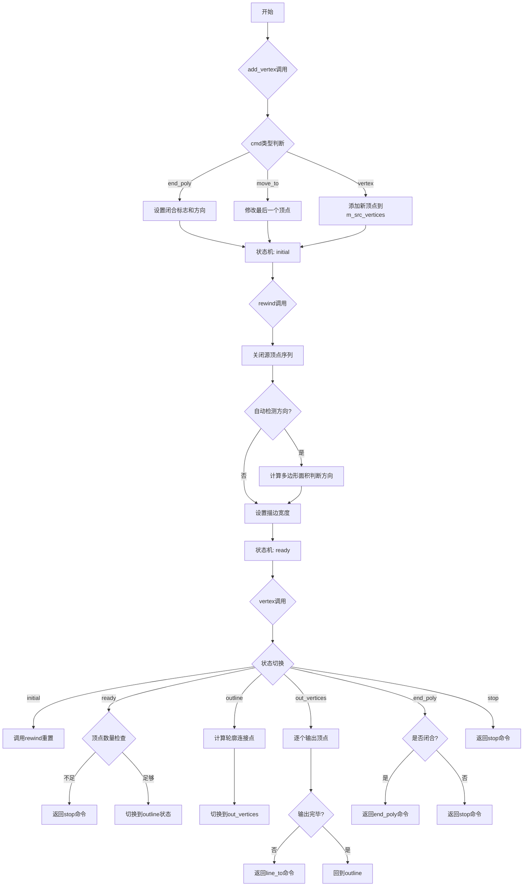
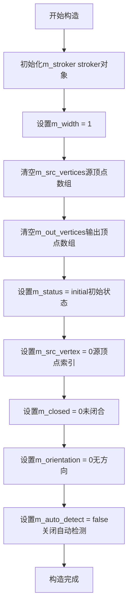
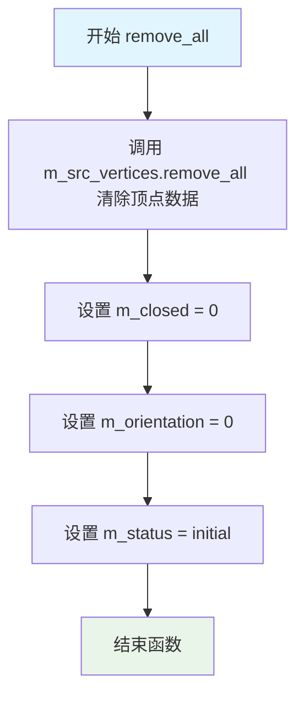
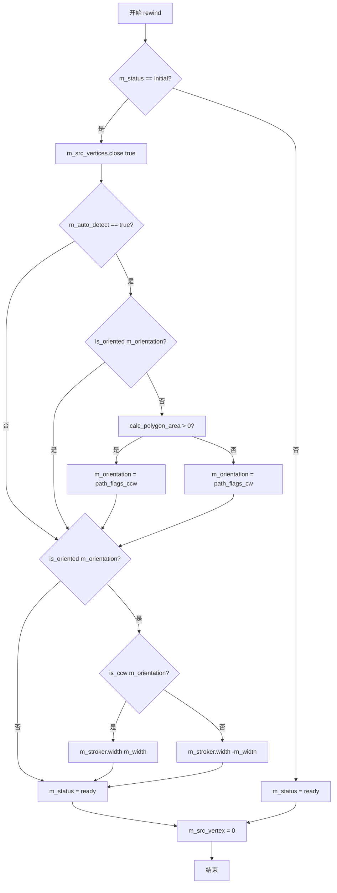
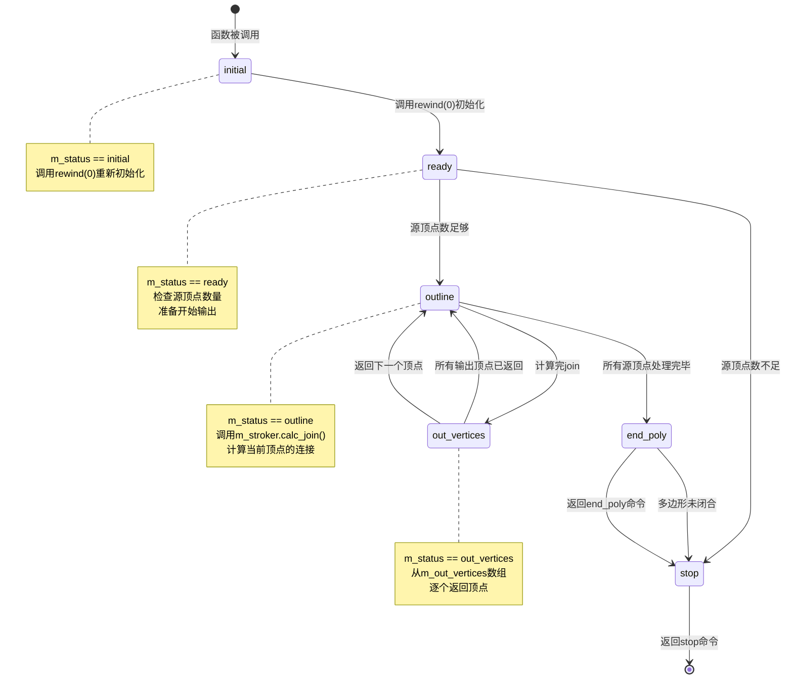
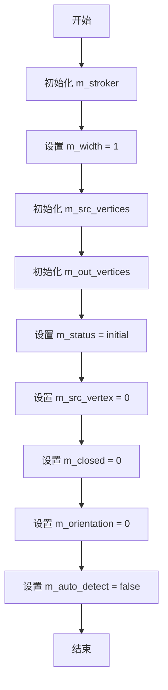
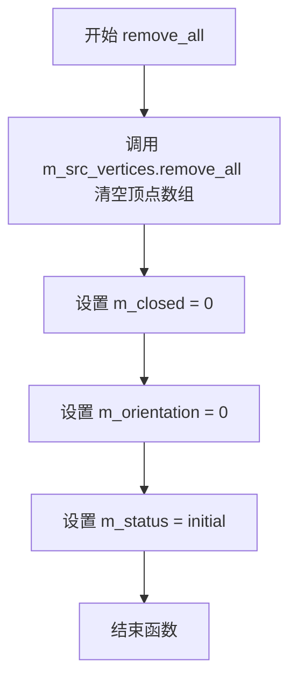
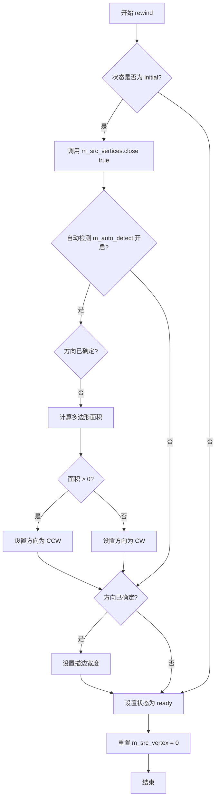
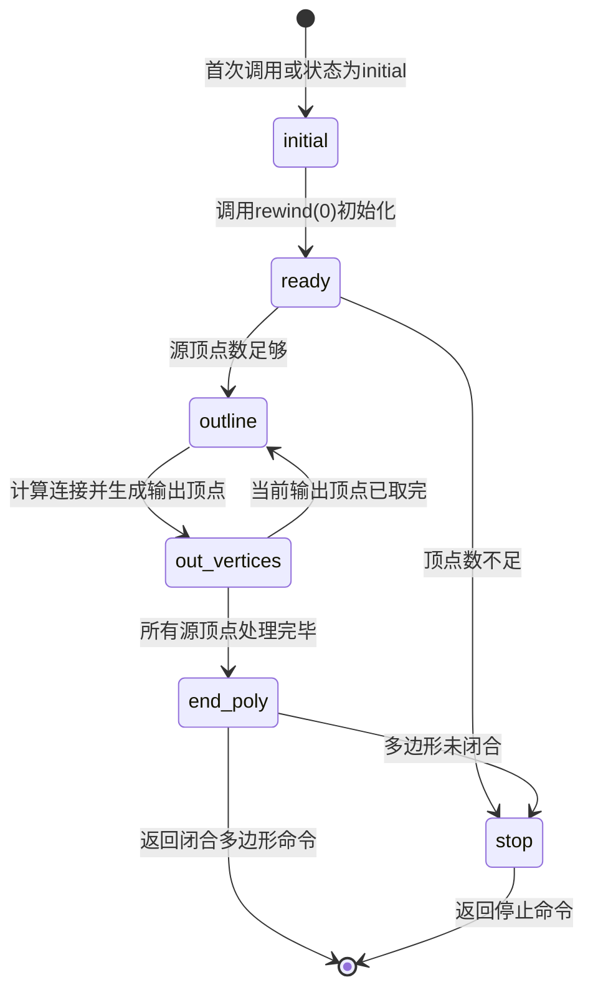

# `matplotlib\extern\agg24-svn\src\agg_vcgen_contour.cpp` 详细设计文档

这是Anti-Grain Geometry库中的轮廓生成器(Contour Generator)，用于将输入路径转换为具有指定宽度的轮廓线（描边效果）。该类通过状态机控制，根据输入顶点序列自动检测多边形方向，计算并输出轮廓的顶点数据，支持自动方向检测和多种路径标志。

## 整体流程



## 类结构

```
agg (命名空间)
└── vcgen_contour (轮廓生成器类)
    ├── 状态枚举: initial → ready → outline → out_vertices → end_poly → stop
    ├── 依赖: m_stroker (vcgen_stroke描边器)
    └── 依赖: vertex_dist (顶点距离结构)
    └── 依赖: point_d (二维点结构)
```

## 全局变量及字段


### `vcgen_contour.m_stroker`
    
描边器对象，用于计算轮廓线

类型：`vcgen_stroke`
    


### `vcgen_contour.m_width`
    
轮廓线宽度，默认为1

类型：`double`
    


### `vcgen_contour.m_src_vertices`
    
存储输入源顶点序列

类型：`顶点容器类型`
    


### `vcgen_contour.m_out_vertices`
    
存储计算后的输出顶点

类型：`顶点容器类型`
    


### `vcgen_contour.m_status`
    
当前状态机状态

类型：`状态枚举类型`
    


### `vcgen_contour.m_src_vertex`
    
当前源顶点索引

类型：`int`
    


### `vcgen_contour.m_out_vertex`
    
当前输出顶点索引

类型：`int`
    


### `vcgen_contour.m_closed`
    
多边形闭合标志

类型：`int`
    


### `vcgen_contour.m_orientation`
    
路径方向标志(cw/ccw)

类型：`int`
    


### `vcgen_contour.m_auto_detect`
    
是否自动检测方向

类型：`bool`
    
    

## 全局函数及方法


### `vcgen_contour::vcgen_contour`

vcgen_contour类的构造函数，负责初始化轮廓生成器的所有成员变量，将状态设置为初始值，并配置默认参数（如轮廓宽度为1、自动检测关闭等）。

参数：
- 无参数（构造函数）

返回值：无返回值（构造函数）

#### 流程图



#### 带注释源码

```cpp
//------------------------------------------------------------------------
// vcgen_contour类的构造函数实现
// 初始化所有成员变量为默认值
//------------------------------------------------------------------------
vcgen_contour::vcgen_contour() :
    m_stroker(),           // 初始化轮廓描边器对象
    m_width(1),           // 默认轮廓宽度为1个单位
    m_src_vertices(),     // 初始化源顶点数组为空
    m_out_vertices(),     // 初始化输出顶点数组为空
    m_status(initial),    // 初始状态设为initial
    m_src_vertex(0),      // 源顶点索引从0开始
    m_closed(0),          // 初始为非闭合路径
    m_orientation(0),     // 初始无方向定义
    m_auto_detect(false)  // 关闭自动方向检测
{
    // 构造函数体为空，所有初始化工作在初始化列表中完成
}
```

#### 补充：类字段完整信息

| 字段名称 | 类型 | 描述 |
|---------|------|------|
| m_stroker | stroker类型 | 轮廓描边器，用于计算轮廓线 |
| m_width | double | 轮廓线的宽度 |
| m_src_vertices | vertex_storage类型 | 存储输入的源顶点序列 |
| m_out_vertices | vertex_storage类型 | 存储输出的轮廓顶点 |
| m_status | 状态枚举 | 当前生成器状态（initial/ready/outline/out_vertices/end_poly/stop） |
| m_src_vertex | unsigned | 当前处理的源顶点索引 |
| m_closed | unsigned | 路径闭合标志（0为开放，非0为闭合） |
| m_orientation | unsigned | 路径方向标志（顺时针/逆时针/无方向） |
| m_auto_detect | bool | 是否自动检测路径方向 |

#### 补充：类方法完整列表

| 方法名称 | 功能描述 |
|---------|---------|
| vcgen_contour | 构造函数，初始化所有成员变量 |
| remove_all | 清除所有顶点和状态重置 |
| add_vertex | 添加顶点或命令到源顶点序列 |
| rewind | 重置生成器到起始位置，准备生成轮廓 |
| vertex | 生成并返回轮廓顶点（主生成方法） |


### `vcgen_contour.remove_all`

该方法用于重置轮廓生成器的内部状态，清除所有已存储的顶点数据并将状态标志恢复为初始值，相当于对整个轮廓生成器进行"软复位"操作。

参数： 无

返回值：`void`，无返回值描述

#### 流程图



#### 带注释源码

```cpp
//------------------------------------------------------------------------
// 该方法执行"软复位"操作，清除所有内部状态和数据
// 不释放内存，仅重置状态标志和清空顶点容器
//------------------------------------------------------------------------
void vcgen_contour::remove_all()
{
    // 清除源顶点容器中的所有顶点数据
    m_src_vertices.remove_all();
    
    // 重置闭合标志，0表示路径当前为非闭合状态
    m_closed = 0;
    
    // 重置方向标志为0，表示未确定方向（无方向）
    m_orientation = 0;
    
    // 将状态机重置为initial状态，准备接收新的顶点数据
    m_status = initial;
}
```


### `vcgen_contour::add_vertex`

该方法用于向轮廓生成器添加顶点，根据命令类型（move_to、vertex或end_poly）将顶点数据存储到源顶点容器中，或处理多边形的闭合标志和方向。

参数：

- `x`：`double`，顶点的X坐标
- `y`：`double`，顶点的Y坐标
- `cmd`：`unsigned`，命令类型，标识顶点类型（move_to、vertex、end_poly等）

返回值：`void`，无返回值

#### 流程图

```mermaid
flowchart TD
    A[开始 add_vertex] --> B[设置 m_status = initial]
    B --> C{is_move_to(cmd)?}
    C -->|是| D[修改最后一个顶点为 vertex_dist(x, y)]
    C -->|否| E{is_vertex(cmd)?}
    E -->|是| F[添加新顶点 vertex_dist(x, y) 到 m_src_vertices]
    E -->|否| G{is_end_poly(cmd)?}
    G -->|是| H[设置 m_closed = get_close_flag(cmd)]
    H --> I{m_orientation == path_flags_none?}
    I -->|是| J[m_orientation = get_orientation(cmd)]
    I -->|否| K[结束]
    J --> K
    G -->|否| K
    D --> K
    F --> K
```

#### 带注释源码

```cpp
//------------------------------------------------------------------------
// 添加顶点到轮廓生成器
// 参数:
//   x   - 顶点的X坐标
//   y   - 顶点的Y坐标
//   cmd - 命令类型（path_cmd_move_to, path_cmd_line_to, path_cmd_end_poly等）
//------------------------------------------------------------------------
void vcgen_contour::add_vertex(double x, double y, unsigned cmd)
{
    // 每次添加顶点时，将状态重置为initial，表示需要重新处理
    m_status = initial;
    
    // 检查命令类型
    if(is_move_to(cmd))
    {
        // 如果是move_to命令，修改最后一个顶点的坐标
        // 这用于更新多边形的起始点
        m_src_vertices.modify_last(vertex_dist(x, y));
    }
    else
    {
        // 如果不是move_to命令
        if(is_vertex(cmd))
        {
            // 如果是普通顶点命令，添加新的顶点到顶点容器
            m_src_vertices.add(vertex_dist(x, y));
        }
        else
        {
            // 否则检查是否是结束多边形命令
            if(is_end_poly(cmd))
            {
                // 设置闭合标志（判断多边形是否闭合）
                m_closed = get_close_flag(cmd);
                
                // 如果方向未设置，则从命令中获取方向
                if(m_orientation == path_flags_none) 
                {
                    m_orientation = get_orientation(cmd);
                }
            }
            // 对于其他命令类型（如stop），不进行任何处理
        }
    }
}
```


### `vcgen_contour::rewind`

该方法用于重新初始化轮廓生成器的内部状态，准备开始生成轮廓线。它检查当前状态如果是初始状态，则执行多边形方向自动检测和描边宽度设置，最后将状态设为就绪并重置顶点索引。

参数：

- `（匿名）`：`unsigned`，未使用的参数，为保持接口一致性而保留

返回值：`void`，无返回值

#### 流程图



#### 带注释源码

```cpp
//------------------------------------------------------------------------
// 重置轮廓生成器的内部状态，准备生成轮廓线
//------------------------------------------------------------------------
void vcgen_contour::rewind(unsigned)
{
    // 只有在初始状态下才执行完整的初始化逻辑
    if(m_status == initial)
    {
        // 关闭源顶点集合，确保多边形闭合
        m_src_vertices.close(true);
        
        // 如果启用了自动方向检测功能
        if(m_auto_detect)
        {
            // 如果当前方向未确定（path_flags_none）
            if(!is_oriented(m_orientation))
            {
                // 通过计算多边形面积来确定方向
                // 面积大于0为逆时针(CW)，小于0为顺时针(CCW)
                m_orientation = (calc_polygon_area(m_src_vertices) > 0.0) ? 
                                path_flags_ccw : 
                                path_flags_cw;
            }
        }
        
        // 如果方向已经确定（无论是手动设置还是自动检测）
        if(is_oriented(m_orientation))
        {
            // 根据多边形方向设置描边宽度
            // 逆时针方向使用正宽度，顺时针方向使用负宽度
            // 这样可以保证轮廓生成的方向与原多边形一致
            m_stroker.width(is_ccw(m_orientation) ? m_width : -m_width);
        }
    }
    
    // 将状态设置为就绪，表示可以开始生成轮廓线
    m_status = ready;
    
    // 重置源顶点索引，从第一个顶点开始处理
    m_src_vertex = 0;
}
```


### `vcgen_contour::vertex`

该函数是轮廓生成器的核心状态机实现，通过维护内部状态（initial/ready/outline/out_vertices/end_poly/stop）逐步将输入的源顶点序列转换为带有一个像素宽度轮廓的输出顶点序列。每次调用返回一个轮廓顶点及其对应的路径命令类型。

参数：
- `x`：`double*`，输出参数，指向用于存储输出顶点x坐标的内存位置
- `y`：`double*`，输出参数，指向用于存储输出顶点y坐标的内存位置

返回值：`unsigned`，返回当前的路径命令类型（如 `path_cmd_move_to`、`path_cmd_line_to`、`path_cmd_end_poly`、`path_cmd_stop` 等），用于指示当前输出顶点的语义

#### 流程图



#### 带注释源码

```cpp
//------------------------------------------------------------------------
// vcgen_contour::vertex
// 生成轮廓顶点的核心状态机函数
// 参数:
//   x - 输出参数，返回顶点的x坐标
//   y - 输出参数，返回顶点的y坐标
// 返回值:
//   unsigned - 路径命令类型
//------------------------------------------------------------------------
unsigned vcgen_contour::vertex(double* x, double* y)
{
    // 初始化命令为 line_to，表示普通连线命令
    unsigned cmd = path_cmd_line_to;
    
    // 持续循环直到遇到停止命令
    while(!is_stop(cmd))
    {
        // 根据当前状态机状态进行相应处理
        switch(m_status)
        {
        case initial:
            // 初始状态：调用rewind进行初始化准备
            rewind(0);
            // 注意：此处没有break，继续执行后续case

        case ready:
            // 就绪状态：检查源顶点是否足够形成轮廓
            // 需要至少2个顶点，如果是闭合多边形则需要3个
            if(m_src_vertices.size() < 2 + unsigned(m_closed != 0))
            {
                cmd = path_cmd_stop;  // 顶点不足，设置停止命令
                break;
            }
            // 状态转为轮廓处理，开始输出
            m_status = outline;
            cmd = path_cmd_move_to;   // 第一个顶点用move_to命令
            m_src_vertex = 0;         // 重置源顶点索引
            m_out_vertex = 0;         // 重置输出顶点索引

        case outline:
            // 轮廓处理状态：处理源顶点序列
            if(m_src_vertex >= m_src_vertices.size())
            {
                // 所有源顶点处理完毕，转入结束多边形状态
                m_status = end_poly;
                break;
            }
            // 调用stroker计算当前顶点的连接（join）
            // 传入：输出顶点数组、前一个顶点、当前顶点、下一个顶点、前一顶点距离、当前顶点距离
            m_stroker.calc_join(m_out_vertices, 
                                m_src_vertices.prev(m_src_vertex),    // 前一个顶点
                                m_src_vertices.curr(m_src_vertex),    // 当前顶点
                                m_src_vertices.next(m_src_vertex),   // 下一个顶点
                                m_src_vertices.prev(m_src_vertex).dist, // 前一顶点距离
                                m_src_vertices.curr(m_src_vertex).dist); // 当前顶点距离
            ++m_src_vertex;           // 移动到下一个源顶点
            m_status = out_vertices;  // 状态转入输出顶点
            m_out_vertex = 0;         // 重置输出顶点索引

        case out_vertices:
            // 输出顶点状态：从calc_join产生的顶点中逐个返回
            if(m_out_vertex >= m_out_vertices.size())
            {
                // 当前顶点的所有输出顶点已返回完，继续处理下一个源顶点
                m_status = outline;
            }
            else
            {
                // 从输出顶点数组中取出一个顶点
                const point_d& c = m_out_vertices[m_out_vertex++];
                *x = c.x;              // 设置x坐标
                *y = c.y;              // 设置y坐标
                return cmd;           // 返回当前命令（move_to或line_to）
            }
            break;

        case end_poly:
            // 结束多边形状态
            if(!m_closed) return path_cmd_stop;  // 如果多边形未闭合，直接停止
            m_status = stop;
            // 返回结束多边形命令，包含闭合标志和CCW方向
            return path_cmd_end_poly | path_flags_close | path_flags_ccw;

        case stop:
            // 停止状态：返回停止命令，结束迭代
            return path_cmd_stop;
        }
    }
    return cmd;  // 返回最后的命令（通常是stop）
}
```


### `vcgen_contour::vcgen_contour()`

构造函数，用于初始化 `vcgen_contour` 类的所有成员变量，将其设置为初始状态。该类是 Anti-Grain Geometry 库中的轮廓生成器，用于将输入路径转换为带有宽度和轮廓特性的输出路径。

参数：
- 无

返回值：无返回值（构造函数）

#### 流程图



#### 带注释源码

```cpp
//------------------------------------------------------------------------
// 构造函数：vcgen_contour
// 功能：初始化 vcgen_contour 类的所有成员变量为默认值
//------------------------------------------------------------------------
vcgen_contour::vcgen_contour() :
    m_stroker(),            // 初始化描边器对象，使用默认构造
    m_width(1),             // 设置轮廓宽度为1个单位（默认线宽）
    m_src_vertices(),       // 初始化源顶点队列，用于存储输入路径的顶点
    m_out_vertices(),       // 初始化输出顶点队列，用于存储生成轮廓的顶点
    m_status(initial),      // 设置状态机为初始状态
    m_src_vertex(0),        // 当前处理的源顶点索引，0表示从第一个顶点开始
    m_closed(0),            // 路径是否闭合的标志，0表示开放路径
    m_orientation(0),      // 路径方向标志，0表示未确定方向
    m_auto_detect(false)    // 是否自动检测路径方向的标志，false表示不自动检测
{
    // 构造函数体为空，所有初始化工作在初始化列表中完成
}
```

#### 成员变量初始化说明

| 成员变量 | 类型 | 初始值 | 描述 |
|---------|------|--------|------|
| `m_stroker` | `stroker` 类型 | 默认构造 | 负责根据路径和宽度生成轮廓边的描边器 |
| `m_width` | `double` | `1` | 轮廓的宽度，决定生成轮廓的粗细 |
| `m_src_vertices` | `vertex_queue` | 空队列 | 存储输入路径的顶点序列 |
| `m_out_vertices` | `pod_deque<point_d>` | 空队列 | 存储计算过程中生成的临时顶点 |
| `m_status` | 枚举类型 | `initial` | 状态机当前状态，控制轮廓生成流程 |
| `m_src_vertex` | `unsigned` | `0` | 当前正在处理的源顶点索引 |
| `m_closed` | `unsigned` | `0` | 标志位，指示输入路径是否为闭合路径 |
| `m_orientation` | `unsigned` | `0` | 路径方向标志，区分顺时针/逆时针 |
| `m_auto_detect` | `bool` | `false` | 是否在重绕时自动检测路径方向 |


### `vcgen_contour.remove_all`

该函数用于清除轮廓生成器的所有顶点和状态重置，将内部状态恢复为初始状态，包括清空源顶点数组、重置闭合标志、方向标志和状态机状态。

参数： 无

返回值：`void`，无返回值

#### 流程图



#### 带注释源码

```cpp
//------------------------------------------------------------------------
// 该方法清除所有累积的顶点数据并将生成器状态重置为初始状态
//------------------------------------------------------------------------
void vcgen_contour::remove_all()
{
    // 清空源顶点容器，释放所有已添加的顶点
    m_src_vertices.remove_all();
    
    // 重置闭合标志，表示路径当前为开放路径
    m_closed = 0;
    
    // 重置方向标志为无方向状态
    m_orientation = 0;
    
    // 将状态机重置为initial状态，准备接收新的顶点数据
    m_status = initial;
}
```


### `vcgen_contour.add_vertex`

该方法是轮廓生成器的顶点添加接口，负责将输入的几何顶点（点坐标和命令）添加到源顶点序列中，并根据命令类型（移动到、线段顶点、结束多边形）执行相应的操作，包括修改最后顶点、添加新顶点或设置多边形的闭合标志和方向。

参数：
- `x`：`double`，顶点的X坐标
- `y`：`double`，顶点的Y坐标
- `cmd`：`unsigned`，顶点命令标志，标识顶点的类型（如move_to、line_to、end_poly等）

返回值：`void`，该方法无返回值

#### 流程图

```mermaid
flowchart TD
    A[开始 add_vertex] --> B[设置 m_status = initial]
    B --> C{is_move_to(cmd)?}
    C -->|Yes| D[修改最后顶点为vertex_dist(x, y)]
    C -->|No| E{is_vertex(cmd)?}
    E -->|Yes| F[添加新顶点vertex_dist(x, y)到源序列]
    E -->|No| G{is_end_poly(cmd)?}
    G -->|Yes| H[设置 m_closed = get_close_flag(cmd)]
    H --> I{m_orientation == path_flags_none?}
    I -->|Yes| J[设置 m_orientation = get_orientation(cmd)]
    I -->|No| K[结束]
    J --> K
    G -->|No| K
    D --> K
    F --> K
```

#### 带注释源码

```
//------------------------------------------------------------------------
// 添加顶点到源序列
// 参数:
//   x   - 顶点的X坐标
//   y   - 顶点的Y坐标
//   cmd - 顶点命令标志 (path_cmd_move_to, path_cmd_line_to, path_cmd_end_poly 等)
//------------------------------------------------------------------------
void vcgen_contour::add_vertex(double x, double y, unsigned cmd)
{
    // 每次添加顶点时都将状态重置为initial，确保重新开始处理
    m_status = initial;
    
    // 判断是否为移动到命令（path_cmd_move_to）
    if(is_move_to(cmd))
    {
        // 修改源顶点序列中的最后一个顶点
        // 这用于更新move_to的目标位置
        m_src_vertices.modify_last(vertex_dist(x, y));
    }
    else
    {
        // 判断是否为普通顶点命令（path_cmd_line_to等）
        if(is_vertex(cmd))
        {
            // 将新顶点添加到源顶点序列
            m_src_vertices.add(vertex_dist(x, y));
        }
        else
        {
            // 判断是否为结束多边形命令（path_cmd_end_poly）
            if(is_end_poly(cmd))
            {
                // 设置多边形闭合标志
                m_closed = get_close_flag(cmd);
                
                // 如果方向尚未确定，则从命令中获取方向
                if(m_orientation == path_flags_none) 
                {
                    m_orientation = get_orientation(cmd);
                }
            }
            // 其他命令类型（如path_cmd_stop）直接忽略
        }
    }
}
```


### `vcgen_contour::rewind`

该函数是轮廓生成器的重绕操作，用于将生成器状态重置为就绪状态，准备生成轮廓输出。如果当前状态为初始状态（initial），会先关闭顶点数组、自动检测多边形方向（如果启用），并根据方向设置描边器的宽度。

参数：

- `unsigned`：未使用参数，保留用于接口兼容性

返回值：`void`，无返回值

#### 流程图



#### 带注释源码

```cpp
//------------------------------------------------------------------------
// 重绕到起点，准备生成轮廓
//------------------------------------------------------------------------
void vcgen_contour::rewind(unsigned)
{
    // 如果当前状态为初始状态，需要进行初始化操作
    if(m_status == initial)
    {
        // 关闭顶点数组，确保顶点数据完整
        m_src_vertices.close(true);
        
        // 如果启用了自动方向检测
        if(m_auto_detect)
        {
            // 如果方向尚未确定
            if(!is_oriented(m_orientation))
            {
                // 根据多边形面积计算方向：面积为正则是逆时针(CW)，否则为顺时针(CCW)
                // 注：这里注释可能有误，AGG中通常面积>0为CCW
                m_orientation = (calc_polygon_area(m_src_vertices) > 0.0) ? 
                                path_flags_ccw : 
                                path_flags_cw;
            }
        }
        
        // 如果方向已确定，根据方向设置描边宽度
        // 逆时针方向使用正宽度，顺时针方向使用负宽度
        if(is_oriented(m_orientation))
        {
            m_stroker.width(is_ccw(m_orientation) ? m_width : -m_width);
        }
    }
    
    // 将状态设置为就绪状态，准备输出顶点
    m_status = ready;
    
    // 重置源顶点索引，从第一个顶点开始处理
    m_src_vertex = 0;
}
```

#### 关键变量依赖

- `m_status`：控制生成器状态机流程
- `m_src_vertices`：源顶点数组
- `m_auto_detect`：是否自动检测方向
- `m_orientation`：路径方向标志
- `m_stroker`：描边器对象
- `m_width`：轮廓宽度
- `m_src_vertex`：当前处理的源顶点索引

#### 技术说明

该函数是轮廓生成器的关键初始化函数，主要完成：
1. **顶点数组闭合**：确保源顶点形成封闭多边形
2. **方向自动检测**：通过计算多边形面积判断顺时针或逆时针方向
3. **描边器配置**：根据方向设置描边宽度（正负值决定渲染方向）
4. **状态重置**：将生成器恢复到就绪状态，准备输出轮廓顶点

此函数通常在开始生成轮廓前被调用，与`vertex()`方法配合构成完整的状态机。


### vcgen_contour.vertex

该函数是轮廓生成器的核心状态机方法，通过维护内部状态机（initial→ready→outline→out_vertices→end_poly→stop）逐步生成轮廓线的顶点序列。每次调用返回一个顶点及其关联的路径命令，用于渲染抗锯齿轮廓线。

参数：
- `x`：`double*`，指向输出顶点X坐标的指针，函数通过此指针返回计算得到的顶点X坐标
- `y`：`double*`，指向输出顶点Y坐标的指针，函数通过此指针返回计算得到的顶点Y坐标

返回值：`unsigned`，返回当前顶点的路径命令（如 path_cmd_move_to、path_cmd_line_to、path_cmd_end_poly、path_cmd_stop 等），用于指示顶点的类型和后续连接方式

#### 流程图



#### 带注释源码

```cpp
//------------------------------------------------------------------------
// 获取下一个输出顶点 - 轮廓生成器的核心状态机方法
//------------------------------------------------------------------------
unsigned vcgen_contour::vertex(double* x, double* y)
{
    // 默认命令为 line_to，表示普通线段顶点
    unsigned cmd = path_cmd_line_to;
    
    // 状态机主循环，持续运行直到遇到停止命令
    while(!is_stop(cmd))
    {
        // 根据当前状态处理不同的逻辑
        switch(m_status)
        {
        // 初始状态：需要重新初始化
        case initial:
            rewind(0);  // 调用rewind方法重新扫描顶点序列

        // 就绪状态：准备开始生成轮廓
        case ready:
            // 检查源顶点数是否足够（至少2个顶点，闭合多边形需要3个）
            if(m_src_vertices.size() < 2 + unsigned(m_closed != 0))
            {
                cmd = path_cmd_stop;  // 顶点数不足，直接停止
                break;
            }
            m_status = outline;  // 转入轮廓生成状态
            cmd = path_cmd_move_to;  // 第一个顶点使用 move_to 命令
            m_src_vertex = 0;
            m_out_vertex = 0;

        // 轮廓状态：处理源顶点，计算连接
        case outline:
            // 所有源顶点已处理完毕，转入结束多边形状态
            if(m_src_vertex >= m_src_vertices.size())
            {
                m_status = end_poly;
                break;
            }
            // 使用 stroker 计算当前顶点的连接形状（处理线宽、转角等）
            m_stroker.calc_join(m_out_vertices, 
                                m_src_vertices.prev(m_src_vertex),    // 前一个顶点
                                m_src_vertices.curr(m_src_vertex),    // 当前顶点
                                m_src_vertices.next(m_src_vertex),    // 后一个顶点
                                m_src_vertices.prev(m_src_vertex).dist,  // 前一段长度
                                m_src_vertices.curr(m_src_vertex).dist); // 当前段长度
            ++m_src_vertex;  // 移动到下一个源顶点
            m_status = out_vertices;  // 转入输出顶点状态
            m_out_vertex = 0;

        // 输出顶点状态：从计算结果中逐个取出顶点
        case out_vertices:
            // 当前输出顶点已全部取出，返回轮廓状态继续处理下一个源顶点
            if(m_out_vertex >= m_out_vertices.size())
            {
                m_status = outline;
            }
            else
            {
                // 取出一个输出顶点
                const point_d& c = m_out_vertices[m_out_vertex++];
                *x = c.x;  // 返回X坐标
                *y = c.y;  // 返回Y坐标
                return cmd;  // 返回当前命令（move_to 或 line_to）
            }
            break;

        // 结束多边形状态
        case end_poly:
            // 如果多边形未闭合，直接停止
            if(!m_closed) return path_cmd_stop;
            // 返回闭合多边形命令，标志位包含 close、ccw
            m_status = stop;
            return path_cmd_end_poly | path_flags_close | path_flags_ccw;

        // 停止状态
        case stop:
            return path_cmd_stop;
        }
    }
    return cmd;
}
```


## 关键组件


### vcgen_contour 类

vcgen_contour 是轮廓生成器类，负责将输入的顶点序列转换为具有指定宽度的轮廓多边形。该类通过内部状态机控制生成流程，使用描边器（stroker）计算轮廓的连接点。

### 顶点容器 (m_src_vertices, m_out_vertices)

m_src_vertices 存储输入的原始顶点（包含距离信息），m_out_vertices 存储描边计算后的输出顶点。这两个容器实现了惰性加载机制，仅在需要时计算和填充顶点数据。

### 状态机 (m_status)

通过枚举状态（initial, ready, outline, out_vertices, end_poly, stop）控制轮廓生成流程。状态机确保顶点生成的正确顺序，实现按需生成的惰性加载模式。

### 描边器 (m_stroker)

内部包含计算轮廓几何形状的逻辑，根据当前顶点、前一个顶点、后一个顶点以及宽度信息，计算出轮廓的连接点（join），支持不同方向的轮廓生成。

### add_vertex 方法

负责接收外部输入的顶点数据，根据命令类型（move_to, line_to, end_poly）将顶点添加到源顶点集合中，并记录多边形的闭合标志和方向。

### rewind 方法

初始化方法，重置状态机并准备生成轮廓。在首次生成前，如果启用自动检测（m_auto_detect），会根据多边形面积计算方向（顺时针或逆时针）。

### vertex 方法

核心生成方法，通过状态机驱动逐个生成轮廓顶点。该方法实现了惰性加载模式，每次调用返回下一个顶点，直到生成完整个轮廓。

### 方向与宽度控制 (m_orientation, m_width)

m_orientation 记录多边形方向（顺时针/逆时针），m_width 控制轮廓宽度。根据方向自动调整描边宽度方向，实现双向轮廓生成。


## 问题及建议


### 已知问题

- **状态机fall-through设计风险**：vertex()方法中的switch-case使用了fall-through（无break），这虽然可能是故意设计，但极易造成维护人员的误解，且容易引入隐藏bug
- **成员变量m_out_vertex未在当前代码中声明**：在vertex()方法中使用了m_out_vertex成员，但当前代码片段中未看到其声明（可能位于头文件），存在一致性风险
- **输入参数缺乏验证**：add_vertex()方法未对x、y坐标的有效性进行检查（如NaN、无穷大等），可能导致后续计算出现未定义行为
- **magic number硬编码**：轮廓宽度默认值1以硬编码形式存在，缺乏有意义的常量命名，降低了代码可读性和可维护性
- **auto_detect时序依赖问题**：方向自动检测只在rewind()时执行一次，如果源顶点在rewind()后被修改，可能导致方向判断错误
- **缺乏错误状态反馈**：stroker操作（calc_join）没有错误检查机制，无法及时发现和处理异常情况
- **边界条件处理不完整**：当顶点数少于2时的处理逻辑较为简单，可能在特殊输入下产生非预期结果

### 优化建议

- 为switch-case添加明确的注释说明fall-through意图，或重构为更清晰的状态转换逻辑
- 确保所有成员变量在头文件中完整声明，并初始化
- 在add_vertex()中添加输入参数验证（检查NaN、无穷大等）
- 将m_width默认值提取为具名常量，如kDefaultContourWidth
- 在顶点数据变更后重新触发方向检测，或提供手动重新检测的接口
- 为关键操作添加错误码返回或异常处理机制
- 补充边界条件的测试用例，确保各种输入情况下的正确性
- 考虑使用reserve()预分配顶点容器容量，减少动态内存分配开销
- 添加线程安全注释或同步机制（如需要支持多线程）


## 其它


### 设计目标与约束

设计目标：实现一个轮廓生成器，能够将一系列输入顶点转换为具有指定宽度的轮廓线，支持自动方向检测和多边形闭合处理。

主要约束：
- 依赖vcgen_stroke类进行实际描边操作
- 输入顶点必须符合agg的顶点命令规范
- 宽度必须为非零值才能产生有效轮廓
- 自动方向检测仅在m_auto_detect为true时生效

### 错误处理与异常设计

代码采用状态机和返回值机制处理错误：
1. 当顶点数量不足时返回path_cmd_stop
2. 当轮廓未闭合且到达end_poly状态时直接返回stop
3. 未使用C++异常机制，保持轻量级错误处理
4. 所有错误通过path_cmd_*常量标识

建议改进：
- 可添加更详细的错误码枚举
- 可考虑在无效状态转换时抛出断言

### 数据流与状态机

状态机包含6个状态：
- initial：初始状态，调用rewind后转为ready
- ready：准备就绪，检查顶点数量后转入outline
- outline：处理轮廓线，计算连接点
- out_vertices：输出顶点循环
- end_poly：处理多边形闭合
- stop：结束状态

数据流：
输入顶点 → m_src_vertices存储 → rewind预处理（方向检测、宽度设置）→ vertex()迭代输出 → m_stroker计算连接点 → m_out_vertices输出

### 外部依赖与接口契约

外部依赖：
- agg::vcgen_stroke：描边生成器
- agg::vertex_dist：带距离信息的顶点
- agg::point_d：二维点坐标
- path命令常量（path_cmd_line_to, path_cmd_move_to等）

接口契约：
- add_vertex(x, y, cmd)：添加顶点或命令
- rewind(idx)：重置迭代器，准备输出
- vertex(x, y)：获取下一个输出顶点，返回命令类型

### 性能考虑

优化点：
1. 使用预先分配的数组m_src_vertices和m_out_vertices，避免运行时分配
2. 状态机避免递归调用
3. m_src_vertex和m_out_vertex索引避免重复计算
4. prev/next/curr方法内联访问

潜在瓶颈：
- calc_join每次调用都有多次顶点访问
- 自动方向检测时需要遍历所有顶点计算面积

### 内存管理

- m_src_vertices和m_out_vertices使用agg的pod_array类型
- 内存分配由agg的allocator管理
- remove_all()显式释放源顶点内存
- 无裸指针，所有权明确

### 线程安全性

该类非线程安全：
- 成员变量m_status、m_src_vertex等无同步保护
- 多线程并发访问需要外部加锁
- 建议：每个线程独立实例化vcgen_contour对象

### 平台兼容性

- 标准C++实现，无平台特定代码
- 依赖标准数学库<math.h>
- 适用于Windows、Linux、macOS等主流平台
- 编译器要求：支持C++98及以上

### 测试策略

建议测试用例：
1. 简单多边形：三角形、正方形、五边形的轮廓生成
2. 方向测试：顺时针和逆时针多边形的自动检测
3. 闭合测试：闭合多边形与开放路径的处理
4. 宽度测试：正负宽度值的效果
5. 边界条件：单顶点、零顶点、连续move_to的情况
6. 性能测试：大量顶点（如10000+）的处理时间

### 使用示例

```cpp
// 基本用法
agg::vcgen_contour contour;
contour.width(5.0);
contour.auto_detect_orientation(true);

// 添加顶点
contour.add_vertex(0, 0, path_cmd_move_to);
contour.add_vertex(100, 0, path_cmd_line_to);
contour.add_vertex(100, 100, path_cmd_line_to);
contour.add_vertex(0, 100, path_cmd_line_to);
contour.add_vertex(0, 0, path_cmd_end_poly | path_flags_close);

// 获取轮廓顶点
contour.rewind(0);
double x, y;
unsigned cmd;
while((cmd = contour.vertex(&x, &y)) != path_cmd_stop) {
    // 处理轮廓顶点
}
```

    