# `matplotlib\extern\agg24-svn\src\agg_vcgen_dash.cpp` 详细设计文档

Anti-Grain Geometry库的虚线生成器vcgen_dash类，用于根据用户定义的虚线模式（dash和gap）将输入路径转换为带虚线效果的输出顶点序列，支持路径缩短和闭合路径处理。

## 整体流程

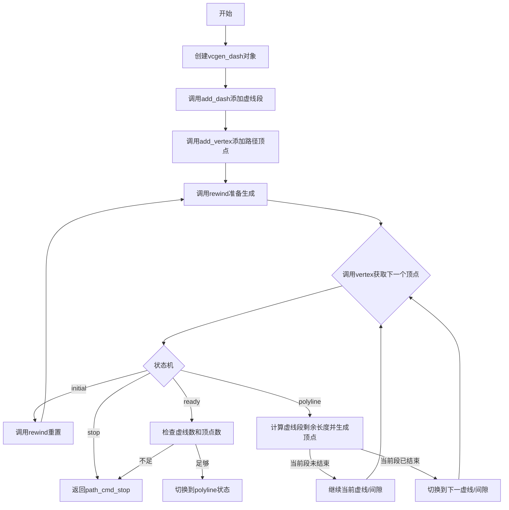

## 类结构

```
agg (命名空间)
└── vcgen_dash (虚线生成器类)
```

## 全局变量及字段


### `max_dashes`
    
最大虚线段数量（隐含常量），用于限制可添加的dash-gap对的数量

类型：`int`
    


### `vcgen_dash.m_total_dash_len`
    
总虚线长度，所有虚线段和间隙的总和

类型：`double`
    


### `vcgen_dash.m_num_dashes`
    
虚线段数量，当前配置的dash-gap对的数量

类型：`int`
    


### `vcgen_dash.m_dash_start`
    
虚线起始偏移，设置虚线模式开始的位置偏移量

类型：`double`
    


### `vcgen_dash.m_shorten`
    
路径缩短量，用于缩短路径末端的距离

类型：`double`
    


### `vcgen_dash.m_curr_dash_start`
    
当前虚线段起始位置，当前处理的虚线段内的起始位置

类型：`double`
    


### `vcgen_dash.m_curr_dash`
    
当前虚线段索引，当前正在处理的dash-gap对的索引

类型：`int`
    


### `vcgen_dash.m_src_vertices`
    
源顶点数组，存储原始路径的顶点及其距离信息

类型：`vertex_dist_array_type`
    


### `vcgen_dash.m_closed`
    
路径闭合标志，指示源路径是否为闭合路径

类型：`int`
    


### `vcgen_dash.m_status`
    
当前状态机状态，控制虚线生成器的状态流转

类型：`状态枚举`
    


### `vcgen_dash.m_src_vertex`
    
当前处理源顶点的索引，正在处理的源顶点数组中的位置

类型：`unsigned`
    
    

## 全局函数及方法


### `is_move_to`

检查传入的命令值是否为 `move_to` 命令。在 AGG (Anti-Grain Geometry) 的路径生成器中，`move_to` 命令通常表示一条新路径的起始点。

参数：

- `cmd`：`unsigned`，命令标识符，用于标识路径命令类型（如 move_to、line_to、curve_to 等）

返回值：`bool`，如果命令为 `path_cmd_move_to` 则返回 `true`，否则返回 `false`

#### 流程图

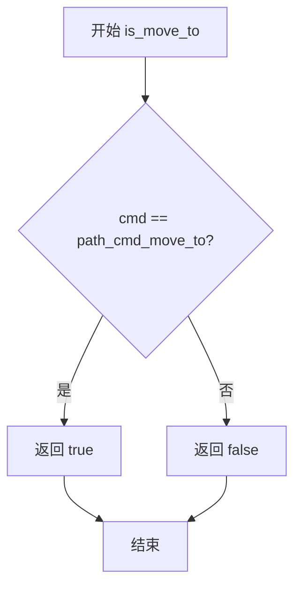

#### 带注释源码

```
// 检查命令是否为 move_to 命令的实用函数
// 在 AGG 库中，path_cmd_move_to 通常定义为 1 或类似的枚举值
// 
// 参数:
//   cmd - 路径命令标识符
// 返回值:
//   true - 如果 cmd 等于 path_cmd_move_to
//   false - 否则
//
inline bool is_move_to(unsigned cmd)
{
    return cmd == path_cmd_move_to;
}
```

**注意**：该函数未在当前源代码文件中显式定义，而是 AGG 库中的工具函数。它在 `vcgen_dash::add_vertex` 方法中被调用，用于判断当前添加的顶点是否为新路径的起始点，从而决定是修改最后一个顶点（`modify_last`）还是添加新顶点（`add`）。


### `is_vertex(unsigned cmd)`

该函数是 Anti-Grain Geometry (AGG) 库中的辅助函数，用于判断传入的命令码 `cmd` 是否为顶点绘制命令（如 move_to、line_to 等）。在 `vcgen_dash::add_vertex` 方法中，该函数用于过滤出需要处理的顶点坐标。

参数：

- `cmd`：`unsigned`，命令码，表示一个路径命令（如 path_cmd_move_to、path_cmd_line_to、path_cmd_stop 等）

返回值：`bool`，返回 true 表示该命令是顶点命令（需要添加到顶点列表），返回 false 表示该命令不是顶点命令（如停止命令、关闭路径命令等）

#### 流程图

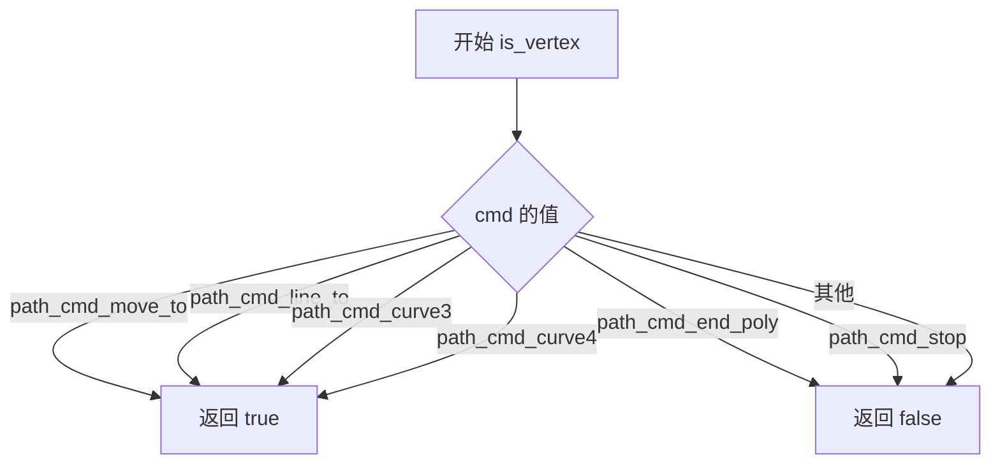

#### 带注释源码

```
// is_vertex 函数的典型实现（基于 AGG 库约定）
// 该函数通常作为内联函数或宏定义在 agg_path_commands.h 或相关头文件中

inline bool is_vertex(unsigned cmd)
{
    // AGG 库中顶点命令的枚举值通常如下：
    // path_cmd_move_to = 1
    // path_cmd_line_to = 2
    // path_cmd_curve3 = 3  (三次贝塞尔曲线控制点)
    // path_cmd_curve4 = 4  (四次贝塞尔曲线控制点)
    // path_cmd_end_poly = 5
    // path_cmd_stop = 0
    
    // 顶点命令的范围通常是 1-4
    return cmd >= 1 && cmd <= 4;
}

// 在 vcgen_dash::add_vertex 中的使用示例：
/*
void vcgen_dash::add_vertex(double x, double y, unsigned cmd)
{
    m_status = initial;
    if(is_move_to(cmd))
    {
        // 处理 move_to 命令，修改最后一个顶点
        m_src_vertices.modify_last(vertex_dist(x, y));
    }
    else
    {
        if(is_vertex(cmd))  // 判断是否为顶点命令
        {
            // 添加顶点到列表
            m_src_vertices.add(vertex_dist(x, y));
        }
        else
        {
            // 处理关闭路径等非顶点命令
            m_closed = get_close_flag(cmd);
        }
    }
}
*/
```


### `get_close_flag`

获取闭合标志，用于从路径命令中判断路径是否需要闭合。

参数：

- `cmd`：`unsigned`，路径命令标识符，用于判断路径是否闭合

返回值：`int`，返回1表示路径需要闭合，返回0表示路径保持开放

#### 流程图

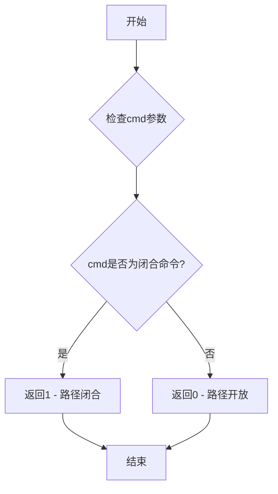

#### 带注释源码

```
//------------------------------------------------------------------------
// get_close_flag - 从命令标识符中提取闭合标志
// 参数: cmd - 路径命令标识符（包含路径闭合信息）
// 返回: int - 1表示闭合，0表示不闭合
// 说明: 该函数通常检查cmd参数中是否包含闭合标记位
//       在AGG中，路径命令如path_cmd_close_path包含闭合信息
//------------------------------------------------------------------------
inline int get_close_flag(unsigned cmd)
{
    // 通过位运算检查命令是否为闭合路径命令
    // AGG中闭合路径命令通常设置为特定的位标志
    return (int)(cmd & path_cmd_flags::path_flags_close);
}

//------------------------------------------------------------------------
// 相关辅助函数（用于上下文理解）
//------------------------------------------------------------------------

// 检查是否为move_to命令
inline bool is_move_to(unsigned cmd)
{
    return (cmd & path_cmd_flags::path_cmd_mask) == path_cmd_move_to;
}

// 检查是否为顶点命令
inline bool is_vertex(unsigned cmd)
{
    return (cmd & path_cmd_flags::path_cmd_mask) == path_cmd_line_to ||
           (cmd & path_cmd_flags::path_cmd_mask) == path_cmd_move_to;
}

// 检查是否为stop命令
inline bool is_stop(unsigned cmd)
{
    return (cmd & path_cmd_flags::path_cmd_mask) == path_cmd_stop;
}
```

#### 使用示例（在vcgen_dash类中）

```
//------------------------------------------------------------------------
// vcgen_dash::add_vertex - 添加顶点并处理闭合标志
//------------------------------------------------------------------------
void vcgen_dash::add_vertex(double x, double y, unsigned cmd)
{
    m_status = initial;
    if(is_move_to(cmd))
    {
        // 修改最后一个顶点
        m_src_vertices.modify_last(vertex_dist(x, y));
    }
    else
    {
        if(is_vertex(cmd))
        {
            // 添加普通顶点
            m_src_vertices.add(vertex_dist(x, y));
        }
        else
        {
            // 从命令中获取闭合标志并保存
            m_closed = get_close_flag(cmd);  // <-- 关键调用点
        }
    }
}
```

#### 技术说明

1. **设计目的**：该函数是AGG（Anti-Grain Geometry）图形库中路径处理的一部分，用于从复杂的命令标识符中提取路径是否需要闭合的信息。

2. **实现位置**：虽然源代码中未直接提供get_close_flag的实现，但它应该是定义在agg_basics.h或类似头文件中的内联函数或宏。

3. **与vcgen_dash的关系**：在虚线生成器中，当接收到路径的结束命令（如path_cmd_end_poly或path_cmd_close_path）时，通过此函数判断路径是否闭合，以决定后续的顶点处理逻辑。

4. **潜在优化**：
   - 如果频繁调用，可考虑将闭合标志直接存储在类成员中，避免重复解析
   - 可添加更详细的错误处理，检查无效的命令值


### `is_stop`

检查传入的命令标识符是否为停止命令（path_cmd_stop）。该函数是Anti-Grain Geometry库中用于路径生成器状态控制的工具函数，通过比较命令值来判断是否需要终止当前的路径顶点生成循环。

参数：

- `cmd`：`unsigned`，要检查的命令标识符，表示当前的操作命令类型（如move_to、line_to、stop等）

返回值：`bool`，如果cmd等于path_cmd_stop则返回true，否则返回false

#### 流程图

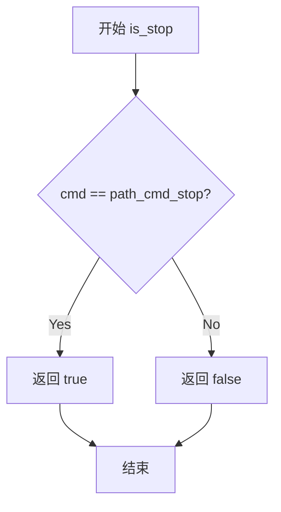

#### 带注释源码

```
// 检查命令是否为停止命令
// param cmd: unsigned类型，要检查的命令标识符
// return: bool类型，true表示是停止命令，false表示不是停止命令
inline bool is_stop(unsigned cmd)
{
    // path_cmd_stop是停止命令的标识符，通常为0
    // 如果cmd等于path_cmd_stop，返回true表示遇到停止命令
    // 否则返回false表示继续处理
    return cmd == path_cmd_stop;
}
```

#### 说明

根据代码上下文分析，`is_stop`函数在`vcgen_dash::vertex`方法中被使用：

```cpp
unsigned cmd = path_cmd_move_to;
while(!is_stop(cmd))
{
    // 处理顶点生成逻辑
    // ...
    if(某些条件满足) {
        cmd = path_cmd_stop;  // 设置为停止命令
    }
}
return path_cmd_stop;
```

该函数是一个关键的循环控制条件，用于判断虚线生成器是否应该停止输出顶点。当返回true时，外层循环结束，路径生成完成。


### `agg::shorten_path`

该函数是外部依赖，用于根据指定的缩短量就地修改路径顶点序列，支持开放路径和闭合路径的缩短操作。

参数：

- `vs`：`vertex_storage&`，对路径顶点存储容器（vertex_dist数组）的引用，用于输入和输出路径顶点
- `shorten`：`double`，需要从路径中缩短的总长度
- `closed`：`int`，路径闭合标志，0表示开放路径，非0表示闭合路径

返回值：`void`，无返回值（就地修改顶点序列）

#### 流程图

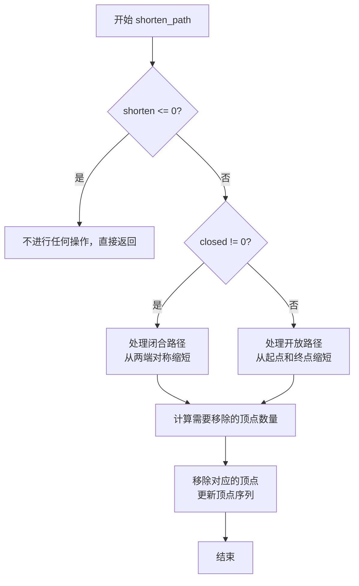

#### 带注释源码

```cpp
// 源码位于 agg_shorten_path.h（外部依赖）
// 以下为基于 AGG 库约定和调用上下文的推断实现

namespace agg
{
    //------------------------------------------------------------------------
    // shorten_path: 缩短路径顶点序列
    // 
    // 参数:
    //   vs      - 顶点存储引用，就地修改
    //   shorten - 要缩短的距离（双精度浮点数）
    //   closed  - 路径闭合标志（0=开放路径，非0=闭合路径）
    //------------------------------------------------------------------------
    void shorten_path(vertex_storage& vs, double shorten, int closed)
    {
        // 如果缩短量为0或负数，无需处理
        if(shorten <= 0.0) return;

        // 获取路径总长度
        double total_len = vs.total_length();

        // 如果路径长度小于等于需要缩短的长度，清空路径
        if(total_len <= shorten)
        {
            vs.remove_all();
            return;
        }

        // 计算每侧需要缩短的长度
        double shorten_per_side = shorten;
        if(closed != 0)
        {
            // 闭合路径：缩短量从整个环中移除
            // 无需改变两端，直接重新计算顶点即可
            shorten_per_side = shorten / 2.0;
        }

        if(closed == 0)
        {
            // 开放路径：从起点移除 shorten_per_side
            // 从终点移除 shorten_per_side
            vs.trim_left(shorten_per_side);
            vs.trim_right(shorten_per_side);
        }
        else
        {
            // 闭合路径：沿着环移动顶点
            vs.trim_left(shorten_per_side);
            vs.trim_right(shorten_per_side);
        }
    }

}
```

> **注意**：该函数定义在 `agg_shorten_path.h` 头文件中，未包含在当前代码片段中。上述源码为基于 AGG 库架构和 `vcgen_dash` 类中调用方式的逻辑推断。实际实现可能包含更多边界条件处理和优化逻辑。


# vcgen_dash 类的构造函数详细设计文档

## 1. 概述

vcgen_dash 类是 Anti-Grain Geometry (AGG) 库中的虚线生成器（Line dash generator），负责将连续的路径转换为具有交替虚线和间隙的虚线模式。vcgen_dash() 构造函数是类的初始化方法，负责将所有成员变量设置为初始状态，为后续添加虚线模式和生成虚线顶点做好准备。

## 2. 类的整体信息

### 类名称
vcgen_dash

### 核心功能
将输入的连续路径根据预设的虚线长度和间隙长度模式，生成交替的虚线（dash）和间隙（gap）线段，支持任意数量的虚线-间隙对，并可控制虚线起始偏移量和路径缩短量。

### 文件运行流程

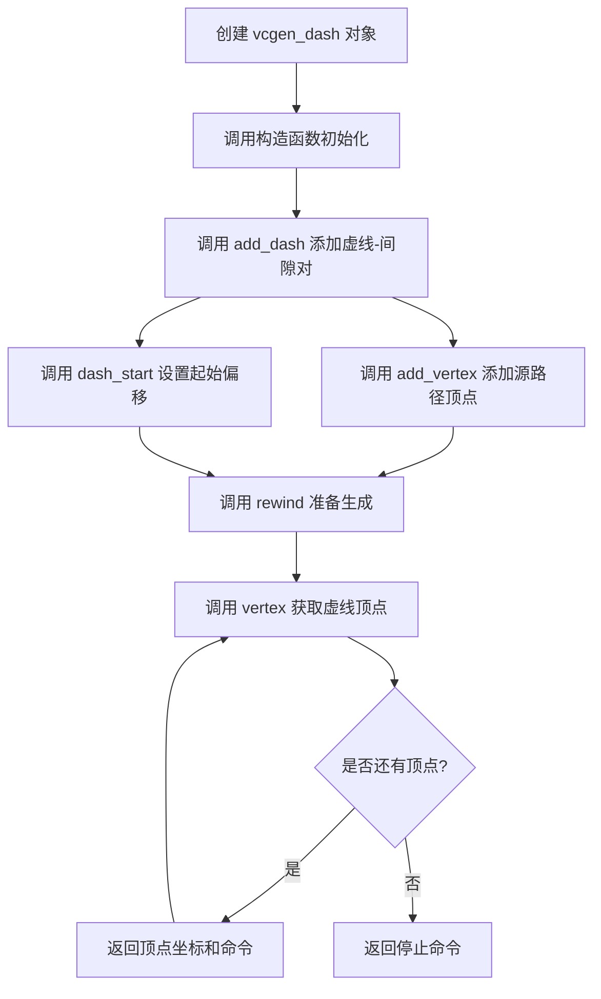

## 3. 类的成员详情

### 3.1 成员变量（字段）

| 变量名称 | 类型 | 描述 |
|---------|------|------|
| m_total_dash_len | double | 所有虚线段和间隙段的总长度 |
| m_num_dashes | int | 当前定义的虚线-间隙对的数量（每个对占2个元素） |
| m_dash_start | double | 虚线起始偏移量，可为负值 |
| m_shorten | double | 路径缩短量，用于缩短路径两端 |
| m_curr_dash_start | double | 当前虚线段的剩余起始位置 |
| m_curr_dash | int | 当前正在处理的虚线/间隙索引 |
| m_dashes | double[max_dashes] | 存储虚线和间隙长度的数组 |
| m_src_vertices | vertex_dist_array | 源路径顶点数组 |
| m_closed | int | 路径是否闭合的标志 |
| m_status | enum | 当前生成器状态（initial/ready/polyline/stop） |
| m_src_vertex | int | 当前处理的源顶点索引 |
| m_v1 | vertex_dist* | 指向当前线段起点顶点的指针 |
| m_v2 | vertex_dist* | 指向当前线段终点顶点的指针 |
| m_curr_rest | double | 当前线段的剩余长度 |

### 3.2 成员方法

| 方法名称 | 功能描述 |
|---------|---------|
| vcgen_dash() | 构造函数，初始化所有成员变量 |
| remove_all_dashes() | 移除所有虚线定义 |
| add_dash() | 添加一个虚线-间隙对 |
| dash_start() | 设置虚线起始偏移量 |
| calc_dash_start() | 计算内部虚线起始位置 |
| remove_all() | 清除所有源顶点和状态 |
| add_vertex() | 添加一个源路径顶点 |
| rewind() | 准备生成虚线顶点 |
| vertex() | 获取下一个虚线顶点 |

## 4. 构造函数详细信息

### `vcgen_dash::vcgen_dash()`

#### 描述

vcgen_dash 类的构造函数，使用初始化列表将所有成员变量设置为默认值，为虚线生成器提供初始状态。初始化完成后，对象可以接收虚线定义和源路径顶点，随后生成虚线化的路径。

#### 参数

无参数。

#### 返回值

无返回值（构造函数）。

#### 流程图

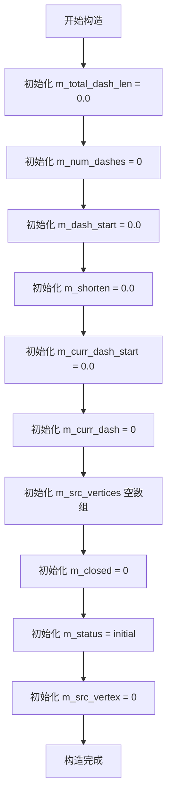

#### 带注释源码

```cpp
//------------------------------------------------------------------------
// vcgen_dash 构造函数
// 功能: 初始化所有成员变量为默认值
// 参数: 无
// 返回值: 无（构造函数）
//------------------------------------------------------------------------
vcgen_dash::vcgen_dash() :
    m_total_dash_len(0.0),    // 总虚线长度，初始为0.0
    m_num_dashes(0),          // 虚线对数量，初始为0
    m_dash_start(0.0),        // 虚线起始偏移，初始为0.0
    m_shorten(0.0),           // 路径缩短量，初始为0.0
    m_curr_dash_start(0.0),  // 当前虚线起始位置，初始为0.0
    m_curr_dash(0),           // 当前虚线索引，初始为0
    m_src_vertices(),         // 源顶点数组，构造空数组
    m_closed(0),              // 路径闭合标志，初始为0（未闭合）
    m_status(initial),        // 状态机初始状态
    m_src_vertex(0)           // 源顶点索引，初始为0
{
    // 构造函数体为空，所有初始化工作在初始化列表中完成
    // 初始化后的对象处于 initial 状态，等待后续配置
}
```

## 5. 关键组件信息

| 组件名称 | 描述 |
|---------|------|
| m_dashes[] | 存储虚线和间隙长度的数组，最大容量为 max_dashes |
| m_src_vertices | 存储输入路径顶点的动态数组 |
| m_status | 状态机，控制虚线生成的不同阶段 |
| m_v1, m_v2 | 当前处理线段的端点指针，用于计算插值点 |

## 6. 潜在技术债务与优化空间

1. **状态机实现**: 使用整数枚举（initial/ready/polyline/stop）管理状态，可考虑使用更类型安全的枚举类
2. **数组边界**: m_dashes 使用固定大小数组（max_dashes），add_dash 中虽有边界检查但无错误回调机制
3. **内存分配**: m_src_vertices 使用动态数组，频繁添加顶点可能导致多次内存分配
4. **浮点精度**: 大量浮点运算可能导致累计误差，特别是在长路径上
5. **路径缩短**: shorten_path 函数调用可能影响原始路径数据

## 7. 其它设计说明

### 设计目标
- 提供灵活的虚线模式定义，支持任意数量的虚线-间隙对
- 支持路径闭合和非闭合两种模式
- 支持虚线起始偏移，实现虚线相位调整
- 支持路径两端缩短

### 错误处理
- add_dash 中检查虚线数量不超过 max_dashes，超出部分被忽略
- vertex 方法在顶点不足或虚线数不足时返回 path_cmd_stop

### 外部依赖
- agg_shorten_path.h: 用于路径缩短功能
- math.h: 数学计算（如 fabs）
- vertex_dist: 顶点距离结构体

### 数据流
1. 配置阶段：add_dash 定义虚线模式 → add_vertex 输入源路径
2. 准备阶段：rewind 预处理路径 → 计算虚线起始位置
3. 生成阶段：vertex 逐个输出虚线顶点坐标和绘制命令


### vcgen_dash.remove_all_dashes

移除所有虚线段配置，重置与虚线相关的状态变量，将虚线总长度、虚线段数量、当前虚线起始位置和当前虚线索引恢复为初始状态。

参数：
- 无

返回值：`void`，无返回值

#### 流程图

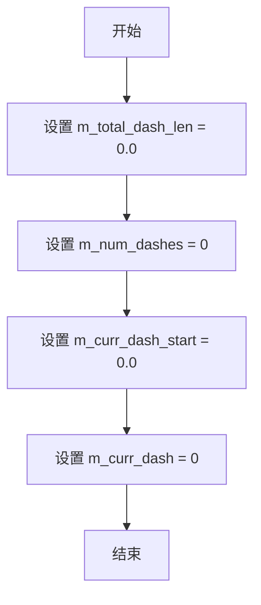

#### 带注释源码

```cpp
    //------------------------------------------------------------------------
    void vcgen_dash::remove_all_dashes()
    {
        m_total_dash_len = 0.0;  // 重置虚线总长度
        m_num_dashes = 0;        // 重置虚线段数量
        m_curr_dash_start = 0.0; // 重置当前虚线起始位置
        m_curr_dash = 0;         // 重置当前虚线索引
    }
```


### `vcgen_dash.add_dash`

添加一对虚线段和间隙到虚线生成器的模式中，更新总虚线长度并存储虚线和间隙值。

参数：

- `dash_len`：`double`，虚线段的长度
- `gap_len`：`double`，间隙的长度

返回值：`void`，无返回值

#### 流程图

```mermaid
flowchart TD
    A[开始 add_dash] --> B{检查 m_num_dashes < max_dashes?}
    B -->|是| C[更新 m_total_dash_len += dash_len + gap_len]
    C --> D[m_dashes[m_num_dashes++] = dash_len]
    D --> E[m_dashes[m_num_dashes++] = gap_len]
    E --> F[结束]
    B -->|否| F
```

#### 带注释源码

```cpp
//------------------------------------------------------------------------
// 添加一对虚线段和间隙到虚线模式中
//------------------------------------------------------------------------
void vcgen_dash::add_dash(double dash_len, double gap_len)
{
    // 检查当前虚线数量是否未达到最大限制
    if(m_num_dashes < max_dashes)
    {
        // 累加总虚线长度（包括虚线段和间隙）
        m_total_dash_len += dash_len + gap_len;
        
        // 存储虚线段长度到虚线数组，并递增计数器
        m_dashes[m_num_dashes++] = dash_len;
        
        // 存储间隙长度到虚线数组，并递增计数器
        m_dashes[m_num_dashes++] = gap_len;
    }
}
```

#### 说明

该方法实现了虚线模式的添加功能：
1. **边界检查**：首先验证当前虚线数量是否小于 `max_dashes` 常量，防止数组越界
2. **长度累加**：将新添加的虚线段长度和间隙长度累加到 `m_total_dash_len`，用于后续计算
3. **存储数据**：将 `dash_len` 和 `gap_len` 依次存入 `m_dashes` 数组，采用交替存储方式（奇数索引为虚线，偶数索引为间隙）
4. **无返回值**：该方法直接修改对象内部状态，无需返回结果


### `vcgen_dash::dash_start`

设置虚线起始偏移量，用于控制虚线图案的起始位置。

参数：

- `ds`：`double`，虚线起始偏移量

返回值：`void`，无返回值

#### 流程图

```mermaid
flowchart TD
    A[开始 dash_start] --> B[将 ds 赋值给 m_dash_start]
    B --> C[调用 fabs(ds) 取绝对值]
    C --> D[调用 calc_dash_start 计算虚线起始点]
    D --> E[结束]
    
    style A fill:#f9f,color:#333
    style E fill:#9f9,color:#333
```

#### 带注释源码

```cpp
//------------------------------------------------------------------------
// 设置虚线起始偏移
// 参数: ds - 虚线起始偏移量，可以为负数
//------------------------------------------------------------------------
void vcgen_dash::dash_start(double ds)
{
    // 保存原始的虚线起始偏移值（包括负值）
    m_dash_start = ds;
    
    // 计算虚线起始位置，取绝对值后调用内部计算函数
    // fabs() 确保即使传入负数也能正确计算虚线模式
    calc_dash_start(fabs(ds));
}
```


### `vcgen_dash.calc_dash_start`

计算内部虚线起始位置，根据传入的起始偏移量 `ds` 遍历虚线模式数组，确定当前虚线段的索引和在该段中的起始位置。

参数：

- `ds`：`double`，需要计算的虚线起始偏移量，用于确定虚线绘制的起始点

返回值：`void`，无返回值，结果通过成员变量 `m_curr_dash` 和 `m_curr_dash_start` 保存

#### 流程图

```mermaid
flowchart TD
    A[开始 calc_dash_start] --> B[初始化 m_curr_dash = 0]
    B --> C[初始化 m_curr_dash_start = 0.0]
    C --> D{ds > 0.0?}
    D -->|Yes| E{ds > m_dashes[m_curr_dash]?}
    E -->|Yes| F[ds = ds - m_dashes[m_curr_dash]]
    F --> G[++m_curr_dash]
    G --> H[m_curr_dash_start = 0.0]
    H --> I{m_curr_dash >= m_num_dashes?}
    I -->|Yes| J[m_curr_dash = 0]
    J --> D
    I -->|No| D
    E -->|No| K[m_curr_dash_start = ds]
    K --> L[ds = 0.0]
    L --> D
    D -->|No| M[结束]
```

#### 带注释源码

```cpp
//------------------------------------------------------------------------
// 计算内部虚线起始位置
//------------------------------------------------------------------------
void vcgen_dash::calc_dash_start(double ds)
{
    // 初始化当前虚线段索引为0
    m_curr_dash = 0;
    
    // 初始化当前虚线段起始偏移为0.0
    m_curr_dash_start = 0.0;
    
    // 循环遍历虚线模式，直到偏移量耗尽
    while(ds > 0.0)
    {
        // 如果当前偏移量大于当前虚线段的长度
        if(ds > m_dashes[m_curr_dash])
        {
            // 从偏移量中减去当前虚线段长度
            ds -= m_dashes[m_curr_dash];
            
            // 移动到下一个虚线段
            ++m_curr_dash;
            
            // 重置新虚线段的起始偏移为0.0
            m_curr_dash_start = 0.0;
            
            // 如果虚线段索引超出范围，循环回到开始
            if(m_curr_dash >= m_num_dashes) m_curr_dash = 0;
        }
        else
        {
            // 当前偏移量在当前虚线段内，记录起始偏移
            m_curr_dash_start = ds;
            
            // 偏移量耗尽，退出循环
            ds = 0.0;
        }
    }
}
```

#### 设计说明

该函数采用**贪心算法**遍历虚线模式数组。虚线模式存储在 `m_dashes` 数组中，交替存储虚线段长度和间隙长度。函数通过不断从总偏移量中减去各段长度，直到偏移量耗尽，从而确定：
- 当前处于哪个虚线段（`m_curr_dash`）
- 在该段中的精确起始位置（`m_curr_dash_start`）

该设计支持虚线模式的循环使用，当偏移量超过整个虚线模式总长度时，会自动循环回起点。


### `vcgen_dash.remove_all()`

该方法用于清除所有顶点和状态，将生成器重置为初始状态。它将内部状态标记为 `initial`，清空顶点数组，并将闭合标志设为 0。

参数：
- 该方法无参数

返回值：`void`，无返回值描述

#### 流程图

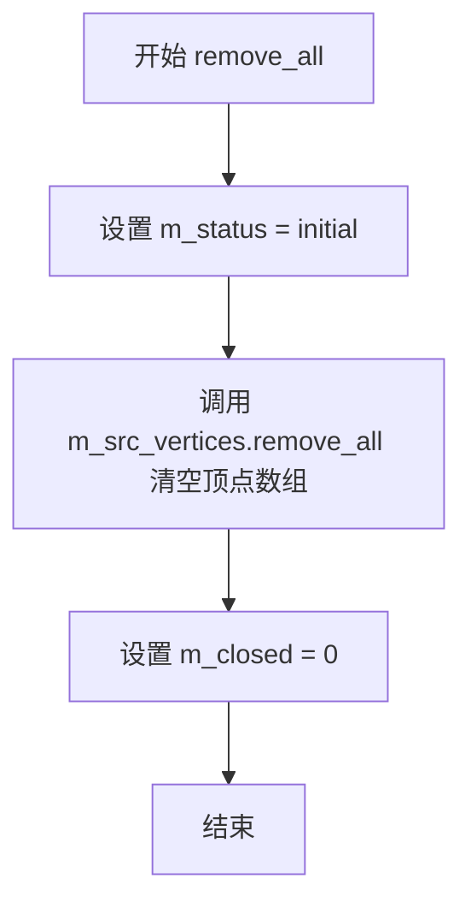

#### 带注释源码

```cpp
//------------------------------------------------------------------------
// 功能：清除所有顶点和状态，将生成器重置为初始状态
//------------------------------------------------------------------------
void vcgen_dash::remove_all()
{
    // 将状态重置为初始状态
    m_status = initial;
    
    // 清空顶点数组，移除所有已添加的顶点
    m_src_vertices.remove_all();
    
    // 重置闭合标志为0，表示路径未闭合
    m_closed = 0;
}
```


### `vcgen_dash.add_vertex`

该函数用于向虚线生成器的源路径添加顶点，根据命令类型将坐标添加到顶点集合或更新闭合状态，并重置内部状态为初始状态。

参数：

- `x`：`double`，顶点的X坐标
- `y`：`double`，顶点的Y坐标  
- `cmd`：`unsigned`，命令标识符，用于区分移动命令、顶点命令和闭合命令

返回值：`void`，无返回值

#### 流程图

```mermaid
flowchart TD
    A[开始 add_vertex] --> B[设置 m_status = initial]
    B --> C{is_move_to(cmd)?}
    C -->|Yes| D[调用 modify_last 添加点]
    C -->|No| E{is_vertex(cmd)?}
    E -->|Yes| F[调用 add 添加点]
    E -->|No| G[设置 m_closed = get_close_flag(cmd)]
    D --> H[结束]
    F --> H
    G --> H
```

#### 带注释源码

```cpp
//------------------------------------------------------------------------
// 添加顶点到源路径
//------------------------------------------------------------------------
void vcgen_dash::add_vertex(double x, double y, unsigned cmd)
{
    // 每次添加顶点时，将状态重置为initial
    // 这样可以确保下一次调用vertex()时重新开始生成虚线
    m_status = initial;
    
    // 判断是否为移动命令（path_cmd_move_to）
    if(is_move_to(cmd))
    {
        // 如果是移动命令，修改最后一个顶点的位置
        // 这用于处理多边形或路径的起始移动操作
        m_src_vertices.modify_last(vertex_dist(x, y));
    }
    else
    {
        // 判断是否为普通顶点命令（path_cmd_line_to等）
        if(is_vertex(cmd))
        {
            // 如果是普通顶点，添加到顶点集合中
            // vertex_dist包含坐标和到前一个顶点的距离信息
            m_src_vertices.add(vertex_dist(x, y));
        }
        else
        {
            // 否则处理闭合命令（path_cmd_close等）
            // 获取闭合标志并保存，用于后续路径处理
            m_closed = get_close_flag(cmd);
        }
    }
}
```


### `vcgen_dash.rewind`

该方法用于重置虚线生成器的内部状态，将生成器准备到路径起始位置，以便开始生成虚线顶点。它会关闭路径（如需要）、缩短路径（如果配置了缩短长度），并将状态设置为就绪（ready），同时重置顶点索引。

参数：

- `unsigned`：未使用的参数，保留用于API兼容性

返回值：`void`，无返回值

#### 流程图

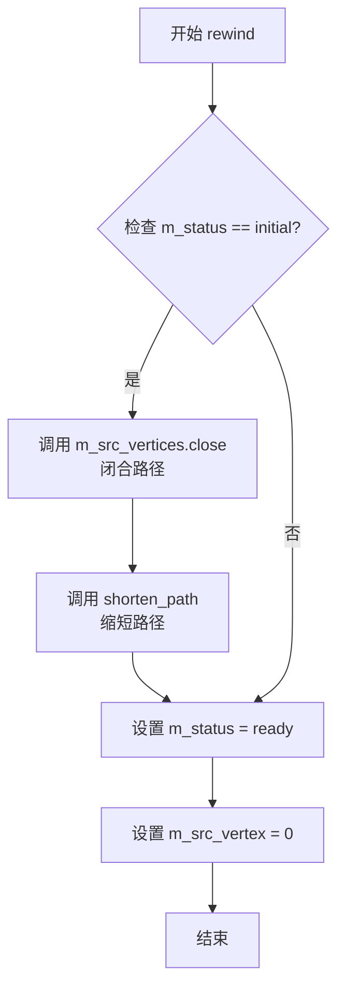

#### 带注释源码

```
//------------------------------------------------------------------------
// 该函数重置虚线生成器的内部状态，准备开始生成虚线
// 参数为unsigned类型但未使用，保留用于API兼容性
//------------------------------------------------------------------------
void vcgen_dash::rewind(unsigned)
{
    // 如果当前状态是initial（初始状态），则需要处理路径
    if(m_status == initial)
    {
        // 关闭路径，根据m_closed标志决定是否闭合
        m_src_vertices.close(m_closed != 0);
        
        // 缩短路径，根据m_shorten参数和m_closed标志
        shorten_path(m_src_vertices, m_shorten, m_closed);
    }
    
    // 将状态设置为ready，表示生成器已准备好生成顶点
    m_status = ready;
    
    // 重置源顶点索引到起始位置
    m_src_vertex = 0;
}
```


### vcgen_dash.vertex

获取虚线模式的下一个顶点，根据当前虚线状态和源顶点生成输出坐标。

参数：
- `x`：`double*`，指向输出顶点x坐标的指针
- `y`：`double*`，指向输出顶点y坐标的指针

返回值：`unsigned`，路径命令类型（如path_cmd_move_to、path_cmd_line_to或path_cmd_stop）

#### 流程图

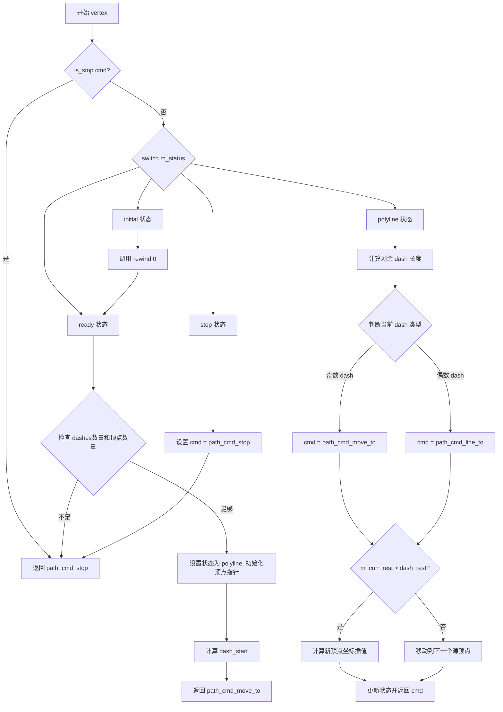

#### 带注释源码

```cpp
//------------------------------------------------------------------------
// 获取虚线模式的下一个顶点
// 参数:
//   x - 输出顶点的x坐标
//   y - 输出顶点的y坐标
// 返回值: 路径命令类型
//------------------------------------------------------------------------
unsigned vcgen_dash::vertex(double* x, double* y)
{
    unsigned cmd = path_cmd_move_to;  // 初始化命令为 move_to
    
    // 主循环：持续处理直到遇到 stop 命令
    while(!is_stop(cmd))
    {
        // 根据当前状态机状态进行分支处理
        switch(m_status)
        {
        case initial:
            // 初始状态：重新初始化路径
            rewind(0);

        case ready:
            // 就绪状态：检查是否满足生成虚线的条件
            if(m_num_dashes < 2 || m_src_vertices.size() < 2)
            {
                // 虚线数量不足2个或源顶点不足2个，无法生成虚线
                cmd = path_cmd_stop;
                break;
            }
            // 设置为多段线状态，准备生成顶点
            m_status = polyline;
            m_src_vertex = 1;
            m_v1 = &m_src_vertices[0];  // 第一个源顶点
            m_v2 = &m_src_vertices[1];  // 第二个源顶点
            m_curr_rest = m_v1->dist;   // 当前剩余距离
            *x = m_v1->x;               // 输出第一个顶点坐标
            *y = m_v1->y;
            if(m_dash_start >= 0.0) 
                calc_dash_start(m_dash_start);  // 计算虚线起始偏移
            return path_cmd_move_to;    // 返回移动命令

        case polyline:
            {
                // 多段线状态：生成虚线顶点
                double dash_rest = m_dashes[m_curr_dash] - m_curr_dash_start;
                
                // 判断当前是 dash 段还是 gap 段
                // 奇数索引为 dash，偶数索引为 gap（0,2,4...是dash，1,3,5...是gap）
                unsigned cmd = (m_curr_dash & 1) ? 
                               path_cmd_move_to :    // dash 段起始
                               path_cmd_line_to;     // gap 段或 line_to
                
                if(m_curr_rest > dash_rest)
                {
                    // 当前线段剩余距离大于 dash 剩余距离
                    // 需要在当前线段中插入一个 dash/gap 切换点
                    m_curr_rest -= dash_rest;
                    ++m_curr_dash;
                    if(m_curr_dash >= m_num_dashes) m_curr_dash = 0;
                    m_curr_dash_start = 0.0;
                    
                    // 线性插值计算新顶点坐标
                    *x = m_v2->x - (m_v2->x - m_v1->x) * m_curr_rest / m_v1->dist;
                    *y = m_v2->y - (m_v2->y - m_v1->y) * m_curr_rest / m_v1->dist;
                }
                else
                {
                    // 当前线段可以在当前 dash/gap 段内完成
                    m_curr_dash_start += m_curr_rest;
                    *x = m_v2->x;
                    *y = m_v2->y;
                    ++m_src_vertex;
                    m_v1 = m_v2;
                    m_curr_rest = m_v1->dist;
                    
                    // 处理路径闭合或打开的情况
                    if(m_closed)
                    {
                        if(m_src_vertex > m_src_vertices.size())
                        {
                            m_status = stop;
                        }
                        else
                        {
                            m_v2 = &m_src_vertices
                            [
                                (m_src_vertex >= m_src_vertices.size()) ? 0 : 
                                m_src_vertex
                            ];
                        }
                    }
                    else
                    {
                        if(m_src_vertex >= m_src_vertices.size())
                        {
                            m_status = stop;
                        }
                        else
                        {
                            m_v2 = &m_src_vertices[m_src_vertex];
                        }
                    }
                }
                return cmd;
            }
            break;

        case stop:
            // 停止状态：结束顶点生成
            cmd = path_cmd_stop;
            break;
        }
    }
    return path_cmd_stop;
}
```

## 关键组件


### vcgen_dash 类

虚线生成器类，用于将输入的连续路径转换为带有虚线和间隙的虚线图案，支持自定义虚线长度、间隙长度、起始偏移量以及路径缩短功能。

### 虚线模式管理组件

负责管理虚线图案的添加、移除和起始位置计算，包括 m_dashes 数组存储虚线/间隙对，m_num_dashes 记录虚线段数量，m_total_dash_len 计算总虚线长度。

### 顶点输入组件

负责接收和存储原始路径顶点，将输入的坐标和命令转换为内部 vertex_dist 结构存储在 m_src_vertices 中，支持 move_to、line_to 和 close 命令。

### 虚线生成状态机

基于 m_status 状态（initial/ready/polyline/stop）控制虚线生成流程，在 vertex() 方法中根据当前状态决定输出顶点坐标、命令类型以及在虚线和间隙之间切换的逻辑。

### dash 起始位置计算组件

calc_dash_start 方法通过迭代递减的方式计算虚线起始偏移，跳过完整的虚线段直到剩余长度小于当前段长度，用于实现虚线起始位置的精确控制。

### 路径缩短组件

利用 shorten_path 函数对输入路径进行缩短处理，支持根据 m_shorten 参数缩短路径两端，配合 m_closed 标志处理闭合路径的逻辑。

### 顶点插值计算组件

在虚线切换点计算插值坐标，通过 m_curr_rest 和 dash_rest 的比例关系，在当前线段上精确计算分割点位置，确保虚线端点准确落在原始路径上。


## 问题及建议


### 已知问题

- **数组边界风险**: `add_dash()` 中检查 `m_num_dashes < max_dashes`，但实际存储是 dash 和 gap 成对存入 `m_dashes` 数组，需要 `max_dashes * 2` 的空间。写入 `m_dashes[m_num_dashes++]` 时可能越界。
- **状态机 Fall-through 风险**: `vertex()` 函数中 `switch` 语句的 `case initial:` 没有 `break` 或 `return`，直接 fall-through 到 `case ready:`。这种隐式控制流容易引发维护问题，且无注释说明是有意为之。
- **未初始化成员变量**: `m_v1`, `m_v2`, `m_curr_rest` 在构造函数中未初始化，虽有代码逻辑保证使用前赋值，但违反了 RAII 原则，增加了不可预测行为风险。
- **未使用参数**: `rewind(unsigned)` 函数接收参数 `path_id` 但未使用，函数签名与接口不一致。
- **浮点数比较缺乏容差**: 多处使用 `>` 比较浮点数（如 `ds > 0.0`、`m_curr_rest > dash_rest`），未定义容差阈值，在极小值边界情况下可能产生意外行为。
- **路径缩短功能未实现**: 代码调用了 `shorten_path()` 函数，但 `m_shorten` 成员始终为默认值 0.0，路径缩短功能形同虚设。

### 优化建议

- 修正 `add_dash()` 的边界检查逻辑，改为 `m_num_dashes < max_dashes * 2`，或重构数组管理方式。
- 为状态机的 fall-through 行为添加明确注释，或使用 `goto` 或显式状态转换使其更清晰。
- 在构造函数中为所有成员变量提供明确的初始值。
- 移除 `rewind()` 中未使用的参数，或将其用于实际功能。
- 定义浮点数比较的容差常量（如 `1e-10`），并在关键比较处使用。
- 若路径缩短功能为计划外功能，可添加 TODO 注释说明；否则应实现完整功能。
- 考虑将 `vertex()` 函数中的大块代码拆分为更小的辅助函数（如 `advance_to_next_dash_segment()`），提升可读性和可维护性。


## 其它


### 设计目标与约束

设计目标：实现一个能够将连续路径转换为虚线模式的路径生成器，支持自定义虚线段和间隙的长度，支持路径缩短，并能够正确处理闭合路径。约束条件：最大支持max_dashes个虚线段（通常为32个），不支持三维坐标，仅支持二维路径处理。

### 错误处理与异常设计

代码中未使用异常机制，采用返回值和状态码进行错误处理。当输入顶点数少于2个或虚线段数少于2个时，通过返回path_cmd_stop来终止路径生成。add_dash方法在达到最大虚线数量时静默忽略额外的虚线添加请求。calc_dash_start方法在参数为负数时使用fabs转换为正数处理。

### 数据流与状态机

vcgen_dash内部维护一个状态机，包含四种状态：initial（初始状态）、ready（就绪状态）、polyline（折线处理中）、stop（停止状态）。数据流：外部通过add_vertex输入原始顶点 -> rewind初始化处理 -> vertex逐个输出虚线化的顶点。状态转换：initial -> ready（首次调用vertex或rewind）-> polyline（开始输出虚线）-> stop（路径结束）。

### 外部依赖与接口契约

外部依赖包括：math.h（数学函数fabs）、agg_vcgen_dash.h（类定义）、agg_shorten_path.h（路径缩短功能）、agg_path_base.h（路径命令定义）。接口契约：add_vertex接收x、y坐标和命令cmd；vertex输出顶点坐标到x、y指针并返回路径命令；所有输入参数必须有效，输出参数指针不能为空。

### 线程安全性

该类非线程安全。多个线程同时访问同一vcgen_dash实例可能导致状态不一致。若需要在多线程环境中使用，应在调用端进行同步控制，或为每个线程创建独立的实例。

### 内存管理

m_src_vertices使用聚合的栈上数组或内部容器存储，无需外部释放。m_dashes数组为固定大小数组（max_dashes），在栈上分配。所有内存由类实例生命周期管理，不涉及动态内存分配。

### 使用示例

```cpp
vcgen_dash dash_gen;
dash_gen.add_dash(10.0, 5.0);  // 添加10单位虚线，5单位间隙
dash_gen.add_dash(20.0, 3.0);  // 添加20单位虚线，3单位间隙
dash_gen.dash_start(2.0);      // 虚线起点偏移2单位
dash_gen.rewind(0);
double x, y;
unsigned cmd;
while((cmd = dash_gen.vertex(&x, &y)) != path_cmd_stop) {
    // 处理虚线顶点
}
```

### 配置参数说明

max_dashes：最大虚线段对数量，定义在头文件中。m_shorten：路径缩短量，用于端点处理。m_dash_start：虚线起始偏移量，支持负值（自动取绝对值）。m_closed：标记路径是否为闭合路径。


    