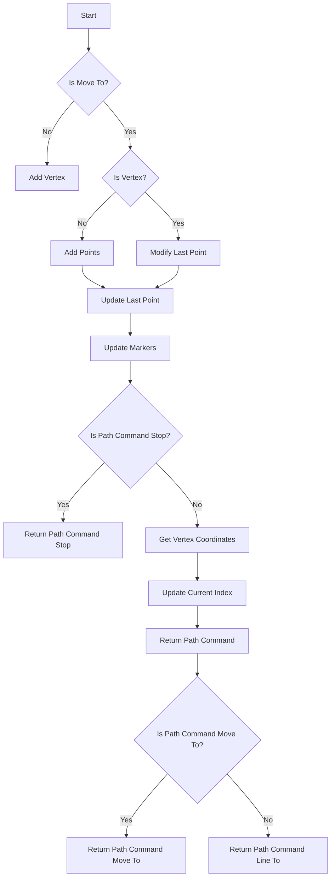
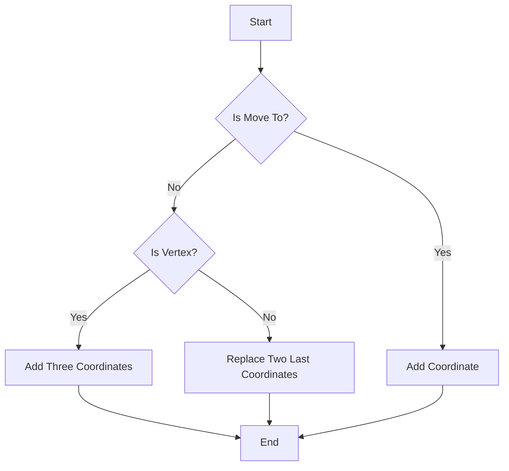
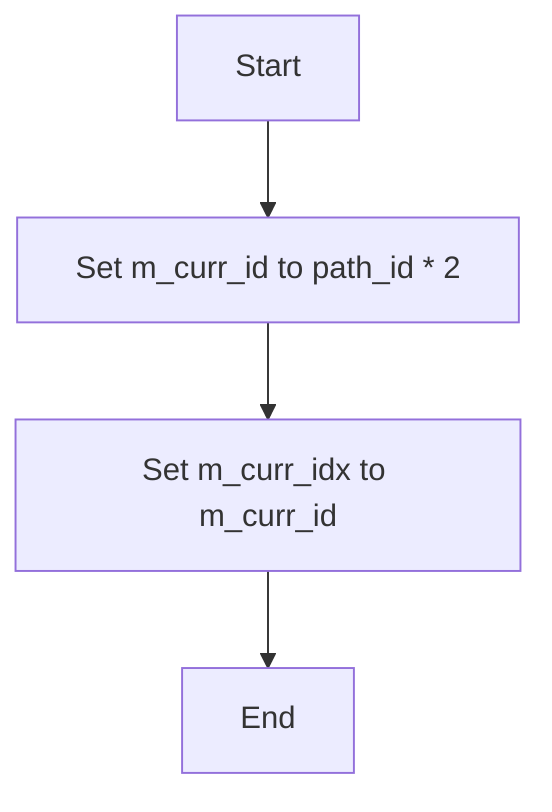
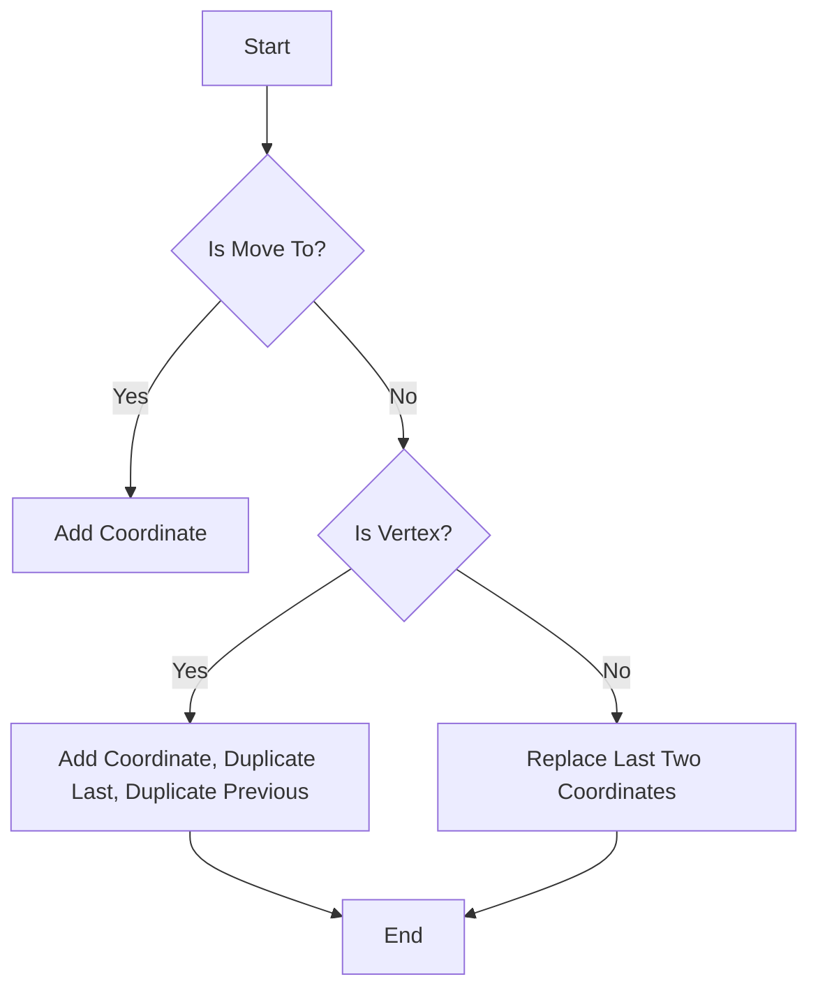
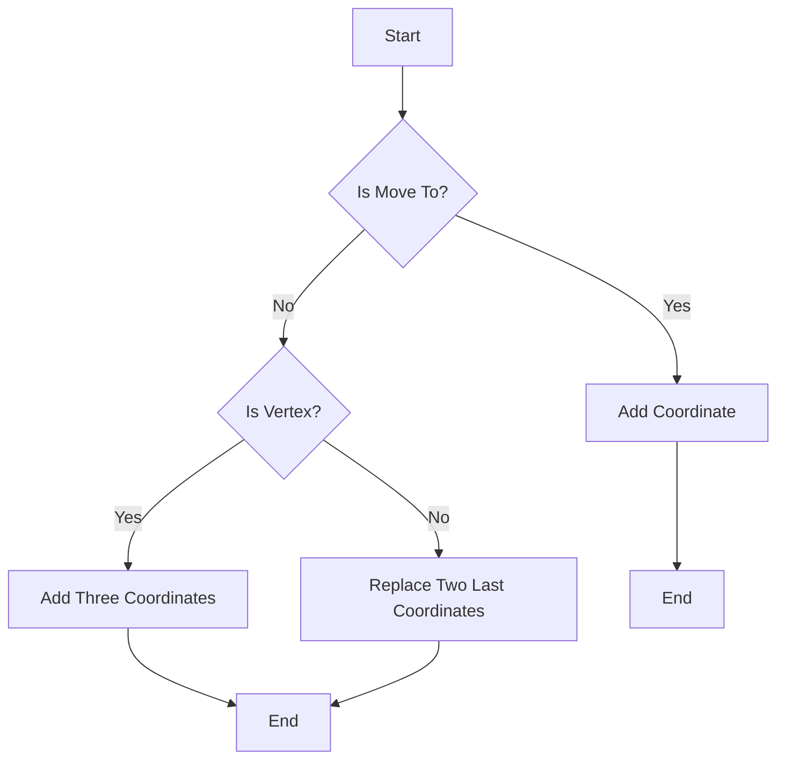
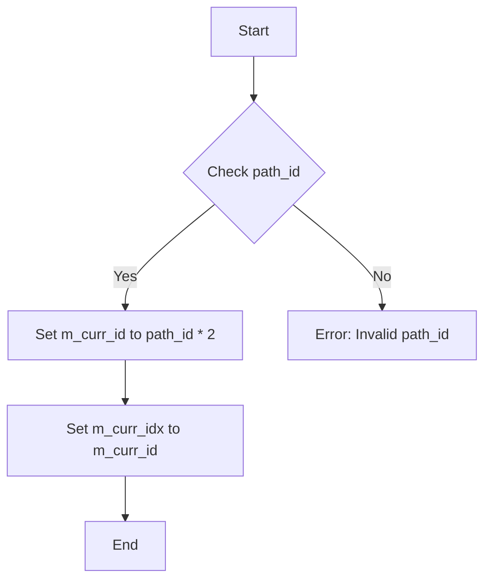

# `matplotlib\extern\agg24-svn\src\agg_vcgen_markers_term.cpp` 详细设计文档

This code defines a class for generating terminal markers for vector graphics, such as arrowheads and arrowtails, using the Anti-Grain Geometry library.

## 整体流程



## 类结构

```
vcgen_markers_term (Class)
```

## 全局变量及字段


### `m_markers`
    
Stores the coordinates of the markers.

类型：`std::vector<agg::coord_type>`
    


### `m_curr_id`
    
Current ID for the path, used for rewind operation.

类型：`unsigned`
    


### `m_curr_idx`
    
Current index within the markers vector, used for vertex retrieval.

类型：`unsigned`
    


### `vcgen_markers_term.m_markers`
    
Stores the coordinates of the markers.

类型：`std::vector<agg::coord_type>`
    


### `vcgen_markers_term.m_curr_id`
    
Current ID for the path, used for rewind operation.

类型：`unsigned`
    


### `vcgen_markers_term.m_curr_idx`
    
Current index within the markers vector, used for vertex retrieval.

类型：`unsigned`
    
    

## 全局函数及方法


### `vcgen_markers_term::remove_all`

移除所有标记点。

参数：

- 无

返回值：无

#### 流程图

```mermaid
graph TD
    A[Start] --> B[Call m_markers.remove_all()]
    B --> C[End]
```

#### 带注释源码

```cpp
    //------------------------------------------------------------------------
    void vcgen_markers_term::remove_all()
    {
        m_markers.remove_all(); // 移除所有标记点
    }
```


### `vcgen_markers_term::add_vertex`

添加一个顶点到标记生成器。

参数：

- `x`：`double`，顶点的x坐标
- `y`：`double`，顶点的y坐标
- `cmd`：`unsigned`，命令代码，用于确定如何处理顶点

返回值：`void`，无返回值

#### 流程图



#### 带注释源码

```cpp
void vcgen_markers_term::add_vertex(double x, double y, unsigned cmd)
{
    if(is_move_to(cmd))
    {
        if(m_markers.size() & 1)
        {
            // Initial state, the first coordinate was added.
            // If two of more calls of start_vertex() occures
            // we just modify the last one.
            m_markers.modify_last(coord_type(x, y));
        }
        else
        {
            m_markers.add(coord_type(x, y));
        }
    }
    else
    {
        if(is_vertex(cmd))
        {
            if(m_markers.size() & 1)
            {
                // Initial state, the first coordinate was added.
                // Add three more points, 0,1,1,0
                m_markers.add(coord_type(x, y));
                m_markers.add(m_markers[m_markers.size() - 1]);
                m_markers.add(m_markers[m_markers.size() - 3]);
            }
            else
            {
                if(m_markers.size())
                {
                    // Replace two last points: 0,1,1,0 -> 0,1,2,1
                    m_markers[m_markers.size() - 1] = m_markers[m_markers.size() - 2];
                    m_markers[m_markers.size() - 2] = coord_type(x, y);
                }
            }
        }
    }
}
```


### `vcgen_markers_term::rewind`

Rewind the current position to the specified path ID.

参数：

- `path_id`：`unsigned`，The ID of the path to rewind to. The path ID is used to determine the starting position in the marker sequence.

返回值：`void`，No return value.

#### 流程图



#### 带注释源码

```cpp
    //------------------------------------------------------------------------
    void vcgen_markers_term::rewind(unsigned path_id)
    {
        m_curr_id = path_id * 2;
        m_curr_idx = m_curr_id;
    }
```


### `vcgen_markers_term::add_vertex`

将顶点添加到标记生成器中。

参数：

- `x`：`double`，顶点的x坐标
- `y`：`double`，顶点的y坐标
- `cmd`：`unsigned`，命令代码，用于确定如何处理顶点

返回值：`void`，无返回值

#### 流程图



#### 带注释源码

```cpp
void vcgen_markers_term::add_vertex(double x, double y, unsigned cmd)
{
    if(is_move_to(cmd))
    {
        if(m_markers.size() & 1)
        {
            // Initial state, the first coordinate was added.
            // If two of more calls of start_vertex() occures
            // we just modify the last one.
            m_markers.modify_last(coord_type(x, y));
        }
        else
        {
            m_markers.add(coord_type(x, y));
        }
    }
    else
    {
        if(is_vertex(cmd))
        {
            if(m_markers.size() & 1)
            {
                // Initial state, the first coordinate was added.
                // Add three more points, 0,1,1,0
                m_markers.add(coord_type(x, y));
                m_markers.add(m_markers[m_markers.size() - 1]);
                m_markers.add(m_markers[m_markers.size() - 3]);
            }
            else
            {
                if(m_markers.size())
                {
                    // Replace two last points: 0,1,1,0 -> 0,1,2,1
                    m_markers[m_markers.size() - 1] = m_markers[m_markers.size() - 2];
                    m_markers[m_markers.size() - 2] = coord_type(x, y);
                }
            }
        }
    }
}
```


### `vcgen_markers_term::remove_all`

移除所有终端标记。

参数：

- 无

返回值：无

#### 流程图

```mermaid
graph TD
    A[Start] --> B[Call m_markers.remove_all()]
    B --> C[End]
```

#### 带注释源码

```cpp
    void vcgen_markers_term::remove_all()
    {
        m_markers.remove_all();
    }
```


### `vcgen_markers_term::add_vertex`

添加一个顶点到终端标记生成器。

参数：

- `x`：`double`，顶点的x坐标
- `y`：`double`，顶点的y坐标
- `cmd`：`unsigned`，命令代码，用于确定如何处理顶点

返回值：`void`，无返回值

#### 流程图



#### 带注释源码

```cpp
void vcgen_markers_term::add_vertex(double x, double y, unsigned cmd)
{
    if(is_move_to(cmd))
    {
        if(m_markers.size() & 1)
        {
            // Initial state, the first coordinate was added.
            // If two of more calls of start_vertex() occures
            // we just modify the last one.
            m_markers.modify_last(coord_type(x, y));
        }
        else
        {
            m_markers.add(coord_type(x, y));
        }
    }
    else
    {
        if(is_vertex(cmd))
        {
            if(m_markers.size() & 1)
            {
                // Initial state, the first coordinate was added.
                // Add three more points, 0,1,1,0
                m_markers.add(coord_type(x, y));
                m_markers.add(m_markers[m_markers.size() - 1]);
                m_markers.add(m_markers[m_markers.size() - 3]);
            }
            else
            {
                if(m_markers.size())
                {
                    // Replace two last points: 0,1,1,0 -> 0,1,2,1
                    m_markers[m_markers.size() - 1] = m_markers[m_markers.size() - 2];
                    m_markers[m_markers.size() - 2] = coord_type(x, y);
                }
            }
        }
    }
}
```


### `vcgen_markers_term::rewind`

Rewind the marker generator to a specific path ID.

参数：

- `path_id`：`unsigned`，The ID of the path to rewind to. The path ID is used to determine the starting point of the marker generation.

返回值：`void`，No return value.

#### 流程图



#### 带注释源码

```cpp
    //------------------------------------------------------------------------
    void vcgen_markers_term::rewind(unsigned path_id)
    {
        m_curr_id = path_id * 2;
        m_curr_idx = m_curr_id;
    }
```


### `vcgen_markers_term::vertex`

This function retrieves the next vertex from the marker path.

参数：

- `x`：`double*`，A pointer to a double where the x-coordinate of the vertex will be stored.
- `y`：`double*`，A pointer to a double where the y-coordinate of the vertex will be stored.

返回值：`unsigned`，The path command associated with the vertex. It can be `path_cmd_stop`, `path_cmd_line_to`, or `path_cmd_move_to`.

#### 流程图

```mermaid
graph TD
    A[Start] --> B{Check m_curr_id > 2 or m_curr_idx >= m_markers.size()}
    B -- Yes --> C[Return path_cmd_stop]
    B -- No --> D[Check m_curr_idx & 1]
    D -- Yes --> E[Set *x = c.x, *y = c.y, m_curr_idx += 3, Return path_cmd_line_to]
    D -- No --> F[Set *x = c.x, *y = c.y, ++m_curr_idx, Return path_cmd_move_to]
    E --> G[End]
    F --> G
```

#### 带注释源码

```cpp
    unsigned vcgen_markers_term::vertex(double* x, double* y)
    {
        if(m_curr_id > 2 || m_curr_idx >= m_markers.size()) 
        {
            return path_cmd_stop;
        }
        const coord_type& c = m_markers[m_curr_idx];
        *x = c.x;
        *y = c.y;
        if(m_curr_idx & 1)
        {
            m_curr_idx += 3;
            return path_cmd_line_to;
        }
        ++m_curr_idx;
        return path_cmd_move_to;
    }
```


## 关键组件


### 张量索引与惰性加载

张量索引与惰性加载是代码中用于高效访问和操作数据结构的关键组件，它允许在需要时才计算或加载数据，从而优化内存使用和性能。

### 反量化支持

反量化支持是代码中用于处理和转换数据量化的组件，它确保数据在不同量化级别之间能够正确转换，以适应不同的计算需求。

### 量化策略

量化策略是代码中用于确定数据量化方法和参数的组件，它影响数据的精度和计算效率，是优化性能的关键因素。


## 问题及建议


### 已知问题

-   **代码复杂度**：代码中存在一些复杂的逻辑，如`add_vertex`方法中的条件判断和坐标点的处理，这可能会增加代码的维护难度。
-   **性能问题**：在`vertex`方法中，频繁的数组访问和条件判断可能会影响性能，尤其是在处理大量数据时。
-   **代码可读性**：代码中的一些变量命名和注释不够清晰，可能会影响其他开发者对代码的理解。

### 优化建议

-   **重构复杂逻辑**：考虑将`add_vertex`方法中的复杂逻辑分解为更小的函数，以提高代码的可读性和可维护性。
-   **优化性能**：在`vertex`方法中，可以通过缓存一些计算结果来减少重复计算，例如缓存`m_curr_idx`的值，避免在每次调用时都进行计算。
-   **改进代码可读性**：对代码中的变量进行更清晰的命名，并添加必要的注释，以提高代码的可读性。
-   **使用设计模式**：考虑使用设计模式，如命令模式，来处理不同的命令，这可能会使代码更加模块化和易于维护。
-   **代码审查**：进行代码审查，以发现潜在的问题并改进代码质量。


## 其它


### 设计目标与约束

- 设计目标：实现一个高效的终端标记生成器，用于生成箭头头尾等终端标记。
- 约束条件：代码应保持高效，且易于维护和扩展。

### 错误处理与异常设计

- 错误处理：代码中未明确处理错误情况，但应确保在异常情况下（如索引越界）返回适当的错误代码。
- 异常设计：未使用异常处理机制，但应考虑在未来的版本中引入异常处理，以提高代码的健壮性。

### 数据流与状态机

- 数据流：数据流从外部输入（如坐标和命令）开始，经过处理，最终生成标记。
- 状态机：代码中存在状态机逻辑，如`m_curr_id`和`m_curr_idx`用于跟踪当前处理的位置。

### 外部依赖与接口契约

- 外部依赖：代码依赖于`agg_vcgen_markers_term.h`头文件，可能依赖于其他`agg`库的组件。
- 接口契约：`vcgen_markers_term`类提供了接口，用于添加顶点、移除所有标记、重置路径和获取顶点信息。

### 测试与验证

- 测试策略：应编写单元测试来验证每个方法的功能和边界条件。
- 验证方法：通过比较生成的标记与预期结果来验证代码的正确性。

### 性能分析

- 性能指标：分析代码的执行时间和内存使用情况，确保满足性能要求。
- 性能优化：考虑优化数据结构和算法，以提高代码的效率。

### 安全性

- 安全风险：确保代码不会受到缓冲区溢出等安全漏洞的影响。
- 安全措施：实施适当的输入验证和错误处理，以防止安全风险。

### 维护与扩展

- 维护策略：编写清晰的文档和注释，以便于未来的维护和修改。
- 扩展性：设计代码时考虑可扩展性，以便于添加新的功能或修改现有功能。


    