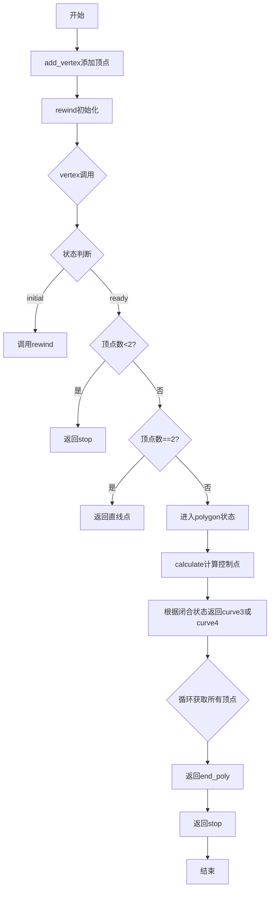
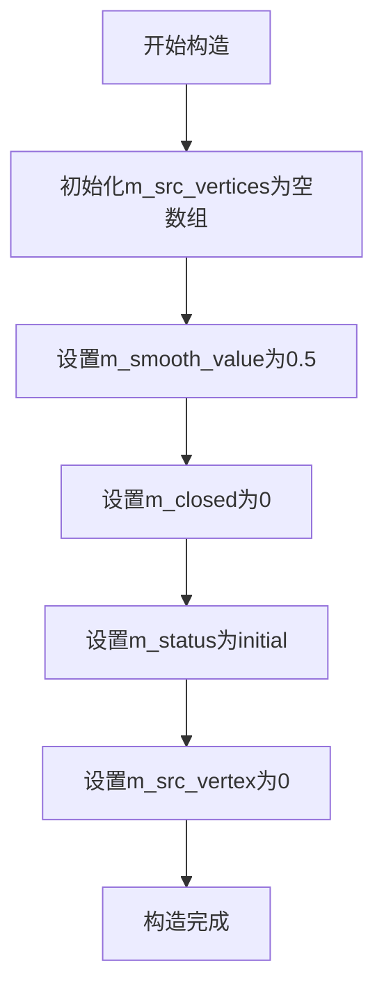
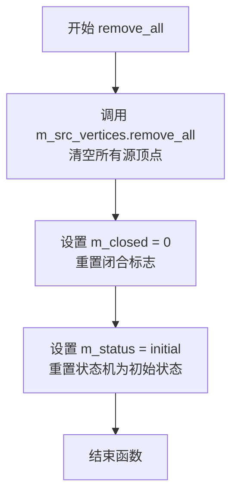
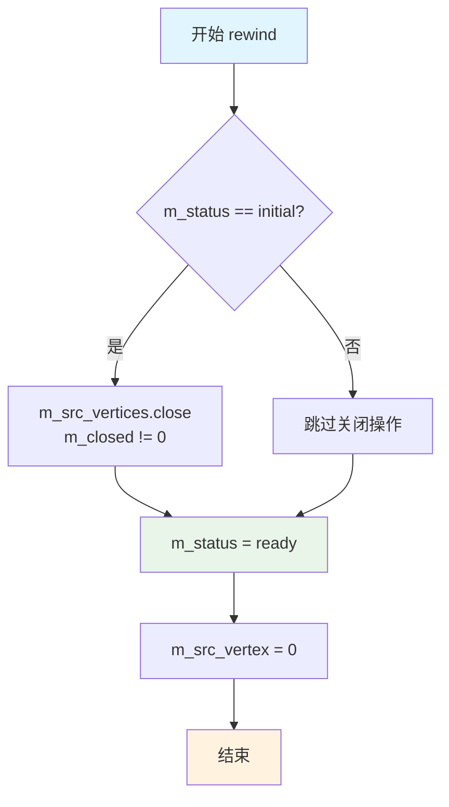

# `matplotlib\extern\agg24-svn\src\agg_vcgen_smooth_poly1.cpp` 详细设计文档

这是 Anti-Grain Geometry (AGG) 库中的一个平滑多边形生成器实现，通过 Catmull-Rom 样条算法将离散顶点转换为平滑曲线，支持开放和闭合多边形，并提供可配置的光滑度参数。

## 整体流程



## 类结构

```
agg::vcgen_smooth_poly1 (平滑多边形生成器)
├── 构造函数: vcgen_smooth_poly1()
├── 状态机方法: vertex()
├── 计算方法: calculate()
├── 顶点操作: add_vertex(), remove_all(), rewind()
└── 内部状态: m_status (enum状态机)
```

## 全局变量及字段


### `vcgen_smooth_poly1.m_src_vertices`
    
存储源顶点及距离信息

类型：`vertex_storage`
    


### `vcgen_smooth_poly1.m_smooth_value`
    
平滑系数，控制曲线光滑程度

类型：`double`
    


### `vcgen_smooth_poly1.m_closed`
    
标志多边形是否闭合

类型：`unsigned`
    


### `vcgen_smooth_poly1.m_status`
    
状态机当前状态

类型：`enum status`
    


### `vcgen_smooth_poly1.m_src_vertex`
    
当前处理的顶点索引

类型：`unsigned`
    


### `vcgen_smooth_poly1.m_ctrl1_x`
    
第一个控制点X坐标

类型：`double`
    


### `vcgen_smooth_poly1.m_ctrl1_y`
    
第一个控制点Y坐标

类型：`double`
    


### `vcgen_smooth_poly1.m_ctrl2_x`
    
第二个控制点X坐标

类型：`double`
    


### `vcgen_smooth_poly1.m_ctrl2_y`
    
第二个控制点Y坐标

类型：`double`
    
    

## 全局函数及方法


### `vcgen_smooth_poly1::vcgen_smooth_poly1()`

这是平滑多边形生成器的构造函数，负责初始化所有成员变量，将平滑系数设置为默认值0.5，将状态机重置为初始状态，并清空顶点数组，为后续的顶点添加和多边形生成做好准备。

参数：此构造函数无参数。

返回值：无返回值（构造函数）。

#### 流程图



#### 带注释源码

```cpp
//------------------------------------------------------------------------
// 构造函数：vcgen_smooth_poly1
// 功能：初始化平滑多边形生成器的所有成员变量
//------------------------------------------------------------------------
vcgen_smooth_poly1::vcgen_smooth_poly1() :
    m_src_vertices(),      // 初始化源顶点数组为空
    m_smooth_value(0.5),    // 设置默认平滑系数为0.5（范围0-1）
    m_closed(0),           // 初始化为非闭合多边形
    m_status(initial),     // 设置状态机为初始状态
    m_src_vertex(0)         // 初始化顶点索引为0
{
}
```

---

## 完整设计文档

### 一段话描述

`vcgen_smooth_poly1` 是 Anti-Grain Geometry 库中的一个平滑多边形生成器类，通过基于顶点距离的 Catmull-Rom 样条插值算法，将离散的顶点序列转换为光滑的曲线轮廓，支持开放和闭合多边形，并提供可配置的光滑度参数。

### 文件的整体运行流程

1. **初始化阶段**：通过构造函数创建 `vcgen_smooth_poly1` 对象，初始化所有成员变量
2. **顶点添加阶段**：调用 `add_vertex()` 方法逐个添加顶点，根据命令类型（move_to、line_to、close）处理顶点
3. **重绕阶段**：调用 `rewind()` 方法准备生成输出，设置状态为 ready
4. **顶点生成阶段**：反复调用 `vertex()` 方法获取平滑后的曲线顶点，该方法内部根据状态机状态输出不同类型的路径命令（move_to、curve3、curve4、end_poly 等）
5. **清理阶段**：调用 `remove_all()` 方法重置所有状态

### 类的详细信息

#### 类字段

| 字段名称 | 类型 | 描述 |
|---------|------|------|
| `m_src_vertices` | `vertex_dist_storage` | 存储带距离信息的源顶点序列 |
| `m_smooth_value` | `double` | 平滑系数，控制曲线光滑程度（0-1） |
| `m_closed` | `unsigned` | 标志位，表示多边形是否闭合 |
| `m_status` | `enum` | 状态机当前状态（initial/ready/polygon/ctrl1/ctrl2/ctrl_b/ctrl_e/end_poly/stop） |
| `m_src_vertex` | `unsigned` | 当前处理的源顶点索引 |
| `m_ctrl1_x` | `double` | 第一个控制点的X坐标 |
| `m_ctrl1_y` | `double` | 第一个控制点的Y坐标 |
| `m_ctrl2_x` | `double` | 第二个控制点的X坐标 |
| `m_ctrl2_y` | `double` | 第二个控制点的Y坐标 |

#### 类方法

| 方法名称 | 功能描述 |
|---------|---------|
| `vcgen_smooth_poly1()` | 构造函数，初始化所有成员变量 |
| `remove_all()` | 清空所有顶点，重置状态 |
| `add_vertex(x, y, cmd)` | 添加顶点或命令到生成器 |
| `rewind()` | 重绕生成器，准备输出顶点 |
| `calculate(v0, v1, v2, v3)` | 根据四个顶点计算贝塞尔控制点 |
| `vertex(x, y)` | 获取下一个平滑后的顶点 |

### 关键组件信息

| 组件名称 | 一句话描述 |
|---------|-----------|
| `vertex_dist` | 包含顶点坐标和到前一顶点距离的结构体 |
| `vertex_dist_storage` | 存储 vertex_dist 的动态数组容器 |
| 状态机 | 通过 `m_status` 控制的有限状态自动机，管理曲线输出流程 |
| Catmull-Rom 样条插值 | 将离散顶点转换为光滑曲线的数学方法 |

### 潜在的技术债务或优化空间

1. **除零风险**：`calculate()` 方法中 `v0.dist + v1.dist` 和 `v1.dist + v2.dist` 可能为零，导致除零错误
2. **内存分配**：频繁调用 `add_vertex()` 可能导致多次内存分配，可考虑预分配缓冲区
3. **状态机复杂性**：状态机包含 10 个状态，逻辑复杂，可读性较差
4. **缺乏输入验证**：没有对坐标范围、顶点数量的有效性进行检查

### 其它项目

#### 设计目标与约束
- **目标**：生成视觉上平滑的多边形曲线
- **约束**：依赖于 `vertex_dist_storage` 容器的正确性，需要外部保证顶点顺序

#### 错误处理与异常设计
- 当前实现无异常机制，通过返回 `path_cmd_stop` 表示结束
- 顶点数量不足时自动降级为直线输出

#### 数据流与状态机
```
initial → ready → polygon → [ctrl1/ctrl2/ctrl_b/ctrl_e/end_poly] → stop
```
状态机确保了曲线顶点（curve3/curve4）与控制点的正确顺序输出。

#### 外部依赖与接口契约
- 依赖 `agg_vcgen_smooth_poly1.h` 头文件
- 依赖 `vertex_dist` 和 `vertex_dist_storage` 类型
- 依赖路径命令常量（`path_cmd_move_to`, `path_cmd_line_to`, `path_cmd_curve3`, `path_cmd_curve4` 等）


### `vcgen_smooth_poly1.remove_all()`

该函数用于清空平滑多边形生成器的所有顶点数据，并将状态机重置为初始状态，以便重新开始新的多边形生成任务。

参数：

- （无参数）

返回值：`void`，无返回值

#### 流程图



#### 带注释源码

```cpp
//------------------------------------------------------------------------
// vcgen_smooth_poly1::remove_all()
//------------------------------------------------------------------------
// 功能：清空所有顶点，重置状态
// 说明：该方法将清除所有已存储的顶点，并将生成器重置为初始状态
//       使其可以重新开始接受新的顶点数据
//------------------------------------------------------------------------
void vcgen_smooth_poly1::remove_all()
{
    // 步骤1：调用容器方法清空所有源顶点
    m_src_vertices.remove_all();
    
    // 步骤2：将闭合标志重置为0，表示多边形未闭合
    m_closed = 0;
    
    // 步骤3：将状态机重置为initial初始状态
    m_status = initial;
}
```

#### 上下文信息

**所属类**：vcgen_smooth_poly1（平滑多边形生成器）

**类字段依赖**：
- `m_src_vertices`：顶点容器，存储多边形的源顶点
- `m_closed`：无符号整数，表示多边形是否闭合
- `m_status`：枚举类型，表示当前状态机状态

**设计意图**：
该方法是对象的重置方法，通常在以下场景中使用：
1. 需要重新开始绘制新的多边形时
2. 在复用生成器对象时清理旧数据
3. 错误恢复时重置到初始状态

**潜在优化建议**：
- 当前实现已经非常简洁高效
- 如果未来需要支持更细粒度的重置（例如仅重置顶点但保留平滑参数），可以考虑添加重载版本
- 可以考虑添加返回值来指示操作是否成功（如容器非空检查失败时）


### `vcgen_smooth_poly1.add_vertex`

该方法用于向平滑多边形生成器添加顶点或控制命令，根据命令类型将顶点添加到源顶点列表或设置多边形的闭合状态。

参数：

- `x`：`double`，顶点的 X 坐标
- `y`：`double`，顶点的 Y 坐标
- `cmd`：`unsigned`，路径命令标识符（如 `path_cmd_move_to`、`path_cmd_line_to`、`path_cmd_close` 等）

返回值：`void`，无返回值

#### 流程图

```mermaid
flowchart TD
    A[开始 add_vertex] --> B[设置 m_status = initial]
    B --> C{判断 cmd 是否为 move_to}
    C -->|是| D[修改最后一个顶点为 vertex_dist(x, y)]
    C -->|否| E{判断 cmd 是否为普通顶点}
    E -->|是| F[添加新顶点 vertex_dist(x, y) 到 m_src_vertices]
    E -->|否| G[从 cmd 中提取闭合标志并设置 m_closed]
    D --> H[结束]
    F --> H
    G --> H
```

#### 带注释源码

```cpp
//------------------------------------------------------------------------
// 添加顶点或控制命令到平滑多边形生成器
// 参数：
//   x - 顶点的X坐标
//   y - 顶点的Y坐标
//   cmd - 路径命令标识符
//------------------------------------------------------------------------
void vcgen_smooth_poly1::add_vertex(double x, double y, unsigned cmd)
{
    // 每次添加顶点时，将状态重置为初始状态
    // 这确保了在添加新顶点时可以重新开始生成路径
    m_status = initial;
    
    // 判断是否为 move_to 命令（移动到新起点）
    if(is_move_to(cmd))
    {
        // 如果是 move_to，则修改最后一个顶点为新的坐标
        // 这用于更新当前路径的起始点
        m_src_vertices.modify_last(vertex_dist(x, y));
    }
    else
    {
        // 判断是否为普通顶点命令
        if(is_vertex(cmd))
        {
            // 将新顶点添加到源顶点列表中
            // 顶点包含坐标和距离信息（用于平滑计算）
            m_src_vertices.add(vertex_dist(x, y));
        }
        else
        {
            // 否则处理闭合命令（如 path_cmd_close）
            // 从命令中提取闭合标志并保存到 m_closed
            m_closed = get_close_flag(cmd);
        }
    }
}
```


### `vcgen_smooth_poly1::rewind`

该函数是平滑多边形生成器的状态初始化方法，用于将生成器重置为就绪状态，准备开始生成平滑多边形顶点。如果当前状态为初始状态，则根据闭合标志关闭源顶点集合，最后将状态设置为就绪并重置顶点索引。

参数：

- `idx`：`unsigned`，该参数在函数内部未使用，仅为接口兼容性保留

返回值：`void`，无返回值

#### 流程图



#### 带注释源码

```cpp
//------------------------------------------------------------------------
// rewind - 初始化生成器状态，准备生成平滑多边形
//------------------------------------------------------------------------
void vcgen_smooth_poly1::rewind(unsigned)
{
    // 如果当前状态为initial，表示这是第一次调用或刚刚添加完顶点
    // 需要根据m_closed标志决定是否关闭顶点集合
    if(m_status == initial)
    {
        // close方法将根据closed参数决定是否闭合多边形
        // m_closed != 0 表示多边形应该闭合
        m_src_vertices.close(m_closed != 0);
    }
    
    // 将状态设置为ready，表示生成器已准备好产生顶点
    m_status = ready;
    
    // 重置源顶点索引为0，从第一个顶点开始生成
    m_src_vertex = 0;
}
```

#### 关键上下文信息

| 成员变量 | 类型 | 描述 |
|---------|------|------|
| `m_src_vertices` | `vertex_dist_storage` | 存储源顶点的容器，每个顶点包含坐标和距离信息 |
| `m_closed` | `unsigned` | 标志位，表示多边形是否应该闭合 |
| `m_status` | `enum_status` | 生成器的当前状态，初始为`initial` |
| `m_src_vertex` | `unsigned` | 当前处理的源顶点索引 |

#### 技术债务与优化空间

1. **未使用的参数**：函数签名中的`unsigned`参数在实现中完全未使用，这可能是为了保持与接口一致性，但可以考虑移除或添加注释说明其用途
2. **状态转换逻辑**：该函数假设调用者会处理状态检查，如果调用时状态不是`initial`且未正确关闭顶点集合，可能导致问题

#### 设计目标与约束

- **设计目标**：为平滑多边形生成器提供标准的状态初始化接口，遵循顶点生成器的通用模式
- **约束条件**：该函数必须在添加完所有顶点后、开始生成顶点之前调用；状态必须从`initial`转换为`ready`


### `vcgen_smooth_poly1::calculate`

该方法根据四个连续顶点（v0, v1, v2, v3）的位置信息和距离信息，计算出用于绘制三次贝塞尔曲线的两个控制点（ctrl1和ctrl2），实现多边形的平滑过渡。

参数：

- `v0`：`const vertex_dist&`，前一个顶点，包含坐标(x,y)和到下一顶点的距离dist
- `v1`：`const vertex_dist&`，当前顶点，包含坐标(x,y)和到下一顶点的距离dist
- `v2`：`const vertex_dist&`，下一个顶点，包含坐标(x,y)和到下一顶点的距离dist
- `v3`：`const vertex_dist&`，下下一个顶点，包含坐标(x,y)和到下一顶点的距离dist

返回值：`void`，无返回值。计算结果直接存储到成员变量 `m_ctrl1_x`、`m_ctrl1_y`、`m_ctrl2_x`、`m_ctrl2_y` 中。

#### 流程图

```mermaid
flowchart TD
    A[开始 calculate] --> B[计算k1 = v0.dist / (v0.dist + v1.dist)]
    B --> C[计算k2 = v1.dist / (v1.dist + v2.dist)]
    C --> D[计算中间点 xm1 = v0.x + (v2.x - v0.x) * k1]
    D --> E[计算中间点 ym1 = v0.y + (v2.y - v0.y) * k1]
    E --> F[计算中间点 xm2 = v1.x + (v3.x - v1.x) * k2]
    F --> G[计算中间点 ym2 = v1.y + (v3.y - v1.y) * k2]
    G --> H[计算控制点1: m_ctrl1_x = v1.x + m_smooth_value * (v2.x - xm1)]
    H --> I[计算控制点1: m_ctrl1_y = v1.y + m_smooth_value * (v2.y - ym1)]
    I --> J[计算控制点2: m_ctrl2_x = v2.x + m_smooth_value * (v1.x - xm2)]
    J --> K[计算控制点2: m_ctrl2_y = v2.y + m_smooth_value * (v1.y - ym2)]
    K --> L[结束]
```

#### 带注释源码

```cpp
//------------------------------------------------------------------------
// 根据四个顶点计算贝塞尔曲线的控制点
// v0: 前一个顶点, v1: 当前顶点, v2: 下一个顶点, v3: 下下一个顶点
//------------------------------------------------------------------------
void vcgen_smooth_poly1::calculate(const vertex_dist& v0, 
                                   const vertex_dist& v1, 
                                   const vertex_dist& v2,
                                   const vertex_dist& v3)
{
    // 计算权重系数k1：基于v0到v1的距离占v0到v1加上v1到v2距离的比例
    // 用于在v0和v2之间进行线性插值
    double k1 = v0.dist / (v0.dist + v1.dist);
    
    // 计算权重系数k2：基于v1到v2的距离占v1到v2加上v2到v3距离的比例
    // 用于在v1和v3之间进行线性插值
    double k2 = v1.dist / (v1.dist + v2.dist);

    // 计算中间点xm1, ym1：这是v0到v2之间按k1比例的点
    // 用于后续计算第一个控制点
    double xm1 = v0.x + (v2.x - v0.x) * k1;
    double ym1 = v0.y + (v2.y - v0.y) * k1;
    
    // 计算中间点xm2, ym2：这是v1到v3之间按k2比例的点
    // 用于后续计算第二个控制点
    double xm2 = v1.x + (v3.x - v1.x) * k2;
    double ym2 = v1.y + (v3.y - v1.y) * k2;

    // 计算第一个贝塞尔控制点(ctrl1)：
    // 在v1的基础上，加上平滑系数调整的偏移量
    // 偏移量由v2与xm1的差值决定，体现了曲线对顶点间距离的适应性
    m_ctrl1_x = v1.x + m_smooth_value * (v2.x - xm1);
    m_ctrl1_y = v1.y + m_smooth_value * (v2.y - ym1);
    
    // 计算第二个贝塞尔控制点(ctrl2)：
    // 在v2的基础上，加上平滑系数调整的偏移量
    // 偏移量由v1与xm2的差值决定
    m_ctrl2_x = v2.x + m_smooth_value * (v1.x - xm2);
    m_ctrl2_y = v2.y + m_smooth_value * (v1.y - ym2);
}
```


### `vcgen_smooth_poly1::vertex`

该函数是平滑多边形生成器的核心方法，通过内部状态机逐步输出多边形的顶点或贝塞尔曲线命令，根据顶点的数量和是否闭合生成直线、二次或四次贝塞尔曲线。

参数：
- `x`：`double*`，指向输出X坐标的指针
- `y`：`double*`，指向输出Y坐标的指针

返回值：`unsigned`，路径命令类型（如 `path_cmd_move_to`、`path_cmd_line_to`、`path_cmd_curve3`、`path_cmd_curve4` 等）

#### 流程图

```mermaid
flowchart TD
    A[开始 vertex] --> B{is_stop cmd?}
    B -->|Yes| J[返回 cmd]
    B -->|No| C{switch m_status}
    
    C -->|initial| D[调用 rewind]
    D --> E{顶点数量 < 2?}
    
    C -->|ready| E
    
    E -->|Yes| F[cmd = path_cmd_stop]
    F --> J
    
    E -->|No| G{顶点数量 == 2?}
    G -->|Yes| H[输出顶点 0或1]
    H --> I[返回 move_to或line_to]
    G -->|No| K[cmd = move_to, m_status=polygon]
    
    C -->|polygon| L{是否闭合?}
    L -->|Yes| M{m_src_vertex >= size?}
    L -->|No| N{m_src_vertex >= size-1?}
    
    M -->|Yes| O[输出首顶点<br/>m_status = end_poly<br/>返回 curve4]
    N -->|Yes| P[输出末顶点<br/>m_status = end_poly<br/>返回 curve3]
    
    M -->|No| Q[calculate 计算控制点]
    N -->|No| Q
    
    Q --> R[输出当前顶点<br/>m_src_vertex++]
    R --> S{闭合?}
    S -->|Yes| T[m_status = ctrl1<br/>返回 move_to 或 curve4]
    S -->|No| U{m_src_vertex == 1?}
    U -->|Yes| V[m_status = ctrl_b<br/>返回 move_to]
    U -->|No| W{m_src_vertex >= size-1?}
    W -->|Yes| X[m_status = ctrl_e<br/>返回 curve3]
    W -->|No| Y[m_status = ctrl1<br/>返回 curve4]
    
    C -->|ctrl_b| Z[输出 m_ctrl2_x,y<br/>m_status = polygon<br/>返回 curve3]
    C -->|ctrl_e| AA[输出 m_ctrl1_x,y<br/>m_status = polygon<br/>返回 curve3]
    C -->|ctrl1| AB[输出 m_ctrl1_x,y<br/>m_status = ctrl2<br/>返回 curve4]
    C -->|ctrl2| AC[输出 m_ctrl2_x,y<br/>m_status = polygon<br/>返回 curve4]
    C -->|end_poly| AD[m_status = stop<br/>返回 end_poly | m_closed]
    C -->|stop| AE[返回 stop]
```

#### 带注释源码

```cpp
//------------------------------------------------------------------------
// 生成下一个顶点或曲线命令
// 这是一个状态机，根据当前状态输出不同类型的路径命令
//------------------------------------------------------------------------
unsigned vcgen_smooth_poly1::vertex(double* x, double* y)
{
    unsigned cmd = path_cmd_line_to;  // 默认命令为直线
    
    // 循环直到遇到 stop 命令或返回
    while(!is_stop(cmd))
    {
        switch(m_status)
        {
        case initial:
            // 初始状态：重置并准备就绪
            rewind(0);

        case ready:
            // 就绪状态：检查顶点数量
            if(m_src_vertices.size() < 2)
            {
                // 顶点不足，无法形成多边形
                cmd = path_cmd_stop;
                break;
            }

            if(m_src_vertices.size() == 2)
            {
                // 仅有两个顶点：输出直线
                *x = m_src_vertices[m_src_vertex].x;
                *y = m_src_vertices[m_src_vertex].y;
                m_src_vertex++;
                if(m_src_vertex == 1) return path_cmd_move_to;  // 第一个点为移动命令
                if(m_src_vertex == 2) return path_cmd_line_to; // 第二个点为直线
                cmd = path_cmd_stop;
                break;
            }

            // 三个以上顶点：开始生成曲线
            cmd = path_cmd_move_to;
            m_status = polygon;
            m_src_vertex = 0;

        case polygon:
            // 多边形状态：生成曲线顶点
            if(m_closed)
            {
                // 闭合多边形
                if(m_src_vertex >= m_src_vertices.size())
                {
                    // 已遍历完毕，返回终点（首顶点）作为 curve4 终点
                    *x = m_src_vertices[0].x;
                    *y = m_src_vertices[0].y;
                    m_status = end_poly;
                    return path_cmd_curve4;
                }
            }
            else
            {
                // 非闭合多边形
                if(m_src_vertex >= m_src_vertices.size() - 1)
                {
                    // 到达最后一个顶点
                    *x = m_src_vertices[m_src_vertices.size() - 1].x;
                    *y = m_src_vertices[m_src_vertices.size() - 1].y;
                    m_status = end_poly;
                    return path_cmd_curve3;
                }
            }

            // 计算当前顶点的控制点（Catmull-Rom 样条转贝塞尔）
            // 参数为：前一个、当前、下一个、下下个顶点
            calculate(m_src_vertices.prev(m_src_vertex), 
                      m_src_vertices.curr(m_src_vertex), 
                      m_src_vertices.next(m_src_vertex),
                      m_src_vertices.next(m_src_vertex + 1));

            // 输出当前顶点坐标
            *x = m_src_vertices[m_src_vertex].x;
            *y = m_src_vertices[m_src_vertex].y;
            m_src_vertex++;

            if(m_closed)
            {
                // 闭合曲线：进入控制点1状态
                m_status = ctrl1;
                return ((m_src_vertex == 1) ? 
                         path_cmd_move_to : 
                         path_cmd_curve4);
            }
            else
            {
                // 非闭合曲线：根据位置选择不同状态
                if(m_src_vertex == 1)
                {
                    // 第一个顶点：进入起始控制点状态
                    m_status = ctrl_b;
                    return path_cmd_move_to;
                }
                if(m_src_vertex >= m_src_vertices.size() - 1)
                {
                    // 倒数第二个顶点：进入结束控制点状态
                    m_status = ctrl_e;
                    return path_cmd_curve3;
                }
                m_status = ctrl1;
                return path_cmd_curve4;
            }
            break;

        case ctrl_b:
            // 输出起始曲线的第二个控制点
            *x = m_ctrl2_x;
            *y = m_ctrl2_y;
            m_status = polygon;
            return path_cmd_curve3;

        case ctrl_e:
            // 输出结束曲线的第一个控制点
            *x = m_ctrl1_x;
            *y = m_ctrl1_y;
            m_status = polygon;
            return path_cmd_curve3;

        case ctrl1:
            // 输出第一个贝塞尔控制点
            *x = m_ctrl1_x;
            *y = m_ctrl1_y;
            m_status = ctrl2;
            return path_cmd_curve4;

        case ctrl2:
            // 输出第二个贝塞尔控制点
            *x = m_ctrl2_x;
            *y = m_ctrl2_y;
            m_status = polygon;
            return path_cmd_curve4;

        case end_poly:
            // 结束多边形
            m_status = stop;
            return path_cmd_end_poly | m_closed;

        case stop:
            // 停止状态
            return path_cmd_stop;
        }
    }
    return cmd;
}
```

## 关键组件


### vcgen_smooth_poly1 类

平滑多边形生成器核心类，负责将离散的顶点序列通过样条插值生成平滑的贝塞尔曲线。该类实现了路径生成器接口，通过状态机控制生成move_to、curve3、curve4等命令。

### 顶点存储机制 (m_src_vertices)

使用 vertex_dist 结构存储顶点，包含坐标(x, y)和距离信息(dist)。距离信息用于计算控制点权重，使曲线过渡更加自然平滑。

### 状态机引擎 (m_status)

内部状态机包含initial、ready、polygon、ctrl1、ctrl2、ctrl_b、ctrl_e、end_poly、stop等状态，控制曲线生成的各个阶段，确保正确输出贝塞尔曲线的控制点和端点。

### 曲线计算方法 (calculate)

根据四个顶点(v0, v1, v2, v3)计算贝塞尔曲线的两个控制点(m_ctrl1_x/y, m_ctrl2_x/y)。使用基于距离的加权算法，通过smooth_value参数控制曲线平滑程度。

### 平滑参数控制 (m_smooth_value)

双精度浮点数，默认值为0.5。用于调节生成曲线的平滑度，值越大曲线越接近顶点连线，值越小曲线越趋于直线。

### 顶点生成方法 (vertex)

实现了路径生成器接口的主要方法，通过状态机逐步输出曲线的每个顶点。处理2D曲线的特殊情况（少于3个顶点时降级为直线），并处理开放多边形和闭合多边形的不同曲线生成策略。

### 闭合多边形处理 (m_closed)

布尔标志位，标识当前多边形是否为闭合路径。影响曲线端点的生成策略，闭合时使用curve4命令，开放时使用curve3命令。


## 问题及建议


### 已知问题

- **除零风险**：在 `calculate` 函数中，当 `v0.dist + v1.dist` 或 `v1.dist + v2.dist` 接近或等于零时，会导致除零错误，使得 k1 和 k2 计算结果不确定
- **数值稳定性**：当任意 `vertex_dist` 的 dist 成员为0时，k1 和 k2 的计算会产生不合理的结果，导致平滑效果异常
- **状态机复杂度过高**：`vertex` 函数中使用了 while 循环配合巨大的 switch-case，状态转换逻辑分散在多个位置，难以理解和维护
- **缺少输入验证**：未对传入的 x、y 坐标进行 NaN 或无穷大值的检查，可能导致后续计算出现未定义行为
- **顶点数量限制缺失**：未定义支持的最大顶点数，可能导致内存溢出或性能问题
- **API 语义不清晰**：`add_vertex` 中对 `is_move_to` 的处理逻辑（modify_last）可能与常规预期不符，缺少明确文档说明
- **类型安全**：大量使用裸指针 `double*` 传递坐标，缺乏类型安全保护

### 优化建议

- **增加除零保护**：在 `calculate` 函数中添加epsilon值或检查dist总和是否接近零，例如：`double epsilon = 1e-10; double k1 = (v0.dist + v1.dist > epsilon) ? v0.dist / (v0.dist + v1.dist) : 0.5;`
- **重构状态机**：将状态机拆分为独立的状态处理函数或使用策略模式，提高可读性和可维护性
- **添加输入验证**：在 `add_vertex` 中添加坐标有效性检查，确保 x 和 y 都是有限值
- **优化内存管理**：为 `m_src_vertices` 预设合理的初始容量，避免频繁的内存重新分配
- **增加常量定义**：将魔法数字（如状态码、路径命令）提取为具名常量，提高代码可读性
- **考虑移动语义**：在 C++11+ 环境中，对 `vertex_dist` 的传递使用移动语义减少拷贝开销
- **添加边界情况处理**：为极大数量顶点的情况添加限制或警告机制


## 其它


### 设计目标与约束

本类旨在为多边形提供平滑处理功能，通过Catmull-Rom样条曲线实现多边形边的平滑过渡。设计目标包括：1) 提供可配置平滑度（m_smooth_value参数）；2) 支持开放和封闭多边形；3) 作为AGG图形生成器框架的一部分，遵循vertex_generator接口约定。约束条件包括：输入顶点数量至少为2个才能生成有效输出；平滑值建议范围为0.0-1.0；本类不管理内存生命周期，依赖外部提供vertex_dist结构。

### 错误处理与异常设计

本类采用状态机驱动的错误处理机制，不抛出异常。主要错误情况包括：1) 输入顶点不足2个时，vertex()方法返回path_cmd_stop；2) 未调用rewind()直接调用vertex()时，会自动触发rewind(0)；3) 状态机异常转换通过switch default分支隐式处理。调用者需检查返回值命令类型来判断错误状态。

### 数据流与状态机

类内部维护有限状态机，包含状态：initial→ready→polygon→ctrl1/ctrl_b/ctrl_e→ctrl2→end_poly→stop。数据流向：add_vertex()接收原始顶点→rewind()准备顶点数据→vertex()依次输出曲线命令和控制点。状态转换由m_status变量控制，每次调用vertex()推动状态机前进。封闭多边形使用curve4（四次贝塞尔曲线），开放多边形末端使用curve3（三次贝塞尔曲线）。

### 外部依赖与接口契约

本类依赖以下AGG核心组件：1) vertex_dist结构 - 存储顶点坐标和累计距离；2) pod_deque<vertex_dist> - m_src_vertices的容器类型；3) 全局函数is_move_to()、is_vertex()、is_stop()、get_close_flag()用于命令解析；4) path_cmd_*系列常量定义输出命令。调用者必须遵守的契约：add_vertex()后需调用rewind()再调用vertex()；vertex()的参数指针必须有效；每次完整遍历需重新调用rewind()。

### 性能考虑与优化空间

时间复杂度：vertex()方法平均O(1)，单次遍历O(n)。空间复杂度：O(n)存储输入顶点。潜在优化点：1) calculate()方法中多次调用next()可缓存结果减少函数调用开销；2) 可考虑引入模板参数支持不同顶点容器类型；3) 当前使用double精度，可考虑提供float版本以减少内存占用。

### 线程安全性

本类非线程安全。多个线程同时操作同一vcgen_smooth_poly1实例会导致状态机混乱。如需多线程使用，每个线程应创建独立实例。

### 使用示例与典型用法

典型用法：创建vcgen_smooth_poly1实例→调用add_vertex()添加多边形顶点→调用rewind(0)初始化→循环调用vertex(&x,&y)获取平滑后的曲线点→直到返回path_cmd_stop。使用时可通过m_smooth_value成员调整平滑程度（0.5为默认值）。

### 接口兼容性说明

本类实现AGG 2.4版本接口。path_cmd_curve3和path_cmd_curve4分别对应三次和四次贝塞尔曲线命令。返回值的低两位用于存储多边形封闭标志（path_cmd_end_poly | m_closed）。此接口设计保持了与AGG早期版本的向后兼容性。


    