# `matplotlib\extern\agg24-svn\src\agg_vcgen_stroke.cpp` 详细设计文档

Anti-Grain Geometry库的笔划生成器（vcgen_stroke），负责将输入的路径顶点转换为带有端点（cap）和连接点（join）的轮廓线，支持直线笔划的多种样式，包括开放路径和闭合路径的处理。

## 整体流程

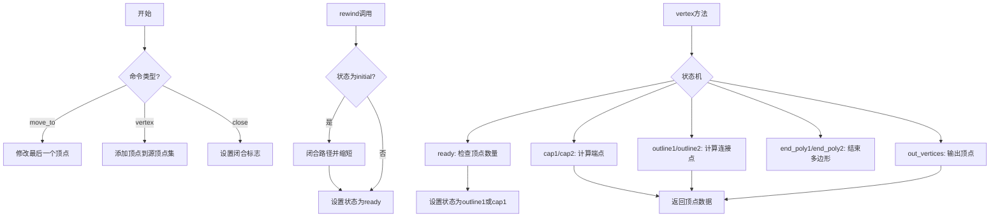

## 类结构

```
agg::vcgen_stroke (笔划生成器)
├── 状态枚举: initial, ready, cap1, cap2, outline1, outline2, close_first, out_vertices, end_poly1, end_poly2, stop
└── 依赖组件: stroker (笔划计算器), vertex_dist (顶点距离), point_d (二维点)
```

## 全局变量及字段


### `vcgen_stroke.m_stroker`
    
笔划计算器实例

类型：`stroker`
    


### `vcgen_stroke.m_src_vertices`
    
源顶点数组

类型：`pod_vector<vertex_dist>`
    


### `vcgen_stroke.m_out_vertices`
    
输出顶点数组

类型：`pod_vector<point_d>`
    


### `vcgen_stroke.m_shorten`
    
路径缩短量

类型：`double`
    


### `vcgen_stroke.m_closed`
    
闭合标志

类型：`unsigned`
    


### `vcgen_stroke.m_status`
    
当前状态

类型：`status`
    


### `vcgen_stroke.m_src_vertex`
    
源顶点索引

类型：`unsigned`
    


### `vcgen_stroke.m_out_vertex`
    
输出顶点索引

类型：`unsigned`
    


### `vcgen_stroke.m_prev_status`
    
前一个状态

类型：`status`
    


### `vcgen_stroke.vcgen_stroke`
    
构造函数

类型：`constructor`
    


### `vcgen_stroke.remove_all`
    
移除所有顶点并重置状态

类型：`void`
    


### `vcgen_stroke.add_vertex`
    
添加顶点

类型：`void`
    


### `vcgen_stroke.rewind`
    
准备生成输出顶点

类型：`void`
    


### `vcgen_stroke.vertex`
    
获取下一个输出顶点

类型：`unsigned`
    
    

## 全局函数及方法


### `is_move_to`

该函数是一个全局辅助函数，用于判断给定的路径命令（path command）是否为 `move_to` 命令（即开始新路径的命令）。

参数：

- `cmd`：`unsigned`，表示路径命令标识符，用于判断该命令是否为 `move_to` 类型

返回值：`bool`，如果命令标识符对应于 `path_cmd_move_to`（路径移动命令），则返回 `true`，否则返回 `false`

#### 流程图

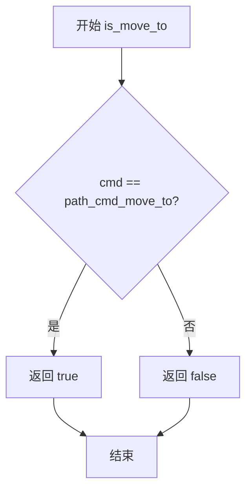

#### 带注释源码

```
//------------------------------------------------------------------------
// is_move_to - 判断路径命令是否为 move_to 命令
// 参数: cmd - 路径命令标识符
// 返回: bool - 如果是 move_to 命令返回 true，否则返回 false
//------------------------------------------------------------------------
inline bool is_move_to(unsigned cmd)
{
    // path_cmd_move_to 是路径命令枚举值，表示移动到新位置的命令
    // 该函数通过比较 cmd 与 path_cmd_move_to 是否相等来判断
    return cmd == path_cmd_move_to;
}
```

**注意**：由于 `is_move_to` 函数定义在头文件 `agg_vcgen_stroke.h` 或相关的头文件中，当前源代码文件中仅包含其调用代码。该函数是 Anti-Grain Geometry 库中处理路径命令的全局辅助函数集合之一，通常与 `is_vertex()`、`is_stop()`、`get_close_flag()` 等函数配合使用，用于解析和识别各种路径命令类型。


### `is_vertex`

该函数是一个全局辅助函数，用于判断给定的路径命令（cmd）是否为顶点命令（即线条路径点，如line_to、curve3、curve4等），而非停止命令或结束多边形命令。在`vcgen_stroke::add_vertex`方法中被用来区分顶点数据和结束标记。

参数：

-  `cmd`：`unsigned`，表示路径命令标识符，用于判断其是否为顶点类型命令

返回值：`bool`，返回true表示cmd是顶点命令（如path_cmd_line_to、path_cmd_curve3、path_cmd_curve4等），返回false表示cmd不是顶点命令（如path_cmd_stop、path_cmd_end_poly等）

#### 流程图

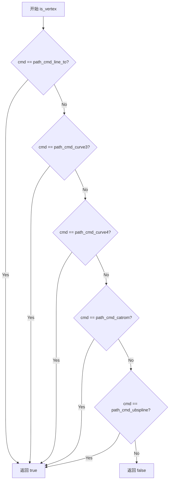

#### 带注释源码

```
// 注意：此函数定义在 AGG 库的头文件中（通常为 agg_basics.h）
// 此处展示典型的实现方式，用于判断命令是否为顶点类型
inline bool is_vertex(unsigned cmd)
{
    // path_cmd_line_to = 2, path_cmd_curve3 = 3, path_cmd_curve4 = 4
    // path_cmd_catrom = 5, path_cmd_ubspline = 6
    // 这些命令都是顶点命令，返回值在 2-6 范围内
    return cmd >= path_cmd_line_to && cmd <= path_cmd_ubspline;
}

// 在 vcgen_stroke::add_vertex 中的使用示例：
//
// void vcgen_stroke::add_vertex(double x, double y, unsigned cmd)
// {
//     m_status = initial;
//     if(is_move_to(cmd))
//     {
//         m_src_vertices.modify_last(vertex_dist(x, y));
//     }
//     else
//     {
//         if(is_vertex(cmd))  // <--- 使用 is_vertex 判断是否为顶点
//         {
//             m_src_vertices.add(vertex_dist(x, y));
//         }
//         else
//         {
//             m_closed = get_close_flag(cmd);  // 否则视为结束标记
//         }
//     }
// }
```


### `get_close_flag(cmd)`

该函数用于从路径命令中提取闭合标志（close flag），判断当前路径是否需要闭合。在笔触生成器（vcgen_stroke）中，当接收到非顶点且非移动命令时，调用此函数确定路径的闭合状态。

参数：

- `cmd`：`unsigned`，路径命令标识符，用于表示当前的绘图命令类型（如移动、画线、闭合等）

返回值：`bool`，返回true表示路径需要闭合，返回false表示路径保持开放

#### 流程图

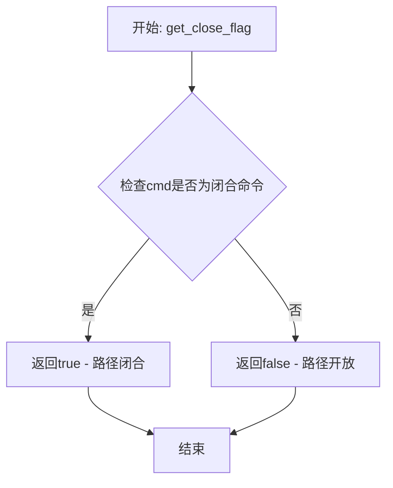

#### 带注释源码

```
// 从路径命令中提取闭合标志的函数
// 参数: cmd - 路径命令标识符
// 返回: bool - true表示路径需要闭合
inline bool get_close_flag(unsigned cmd)
{
    // 检查命令的低位是否为闭合标志
    // 在AGG中，闭合标志通常编码在命令的低位
    return (cmd & path_flags_close) != 0;
}
```

#### 说明

根据代码上下文分析，`get_close_flag`函数应定义在agg头文件（可能是`agg_path_commands.h`或类似文件）中。该函数通过位运算检查命令标识符中是否包含`path_flags_close`标志位。在`vcgen_stroke::add_vertex`方法中，当接收到的命令不是移动命令也不是顶点命令时（即遇到闭合或停止命令），调用此函数来判断是否需要闭合当前路径，并将结果存储在成员变量`m_closed`中供后续处理使用。


### `is_stop`

该函数是 Anti-Grain Geometry 库中的全局辅助函数，用于判断传入的路径命令是否为停止命令（path_cmd_stop）。在 `vcgen_stroke::vertex` 方法的状态机中作为循环终止条件使用。

参数：

- `cmd`：`unsigned`，要检查的路径命令值

返回值：`bool`，如果命令值等于 `path_cmd_stop` 则返回 true，否则返回 false

#### 流程图

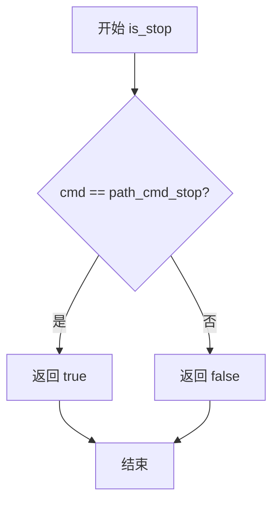

#### 带注释源码

```cpp
//------------------------------------------------------------------------
// 判断指定命令是否为停止命令
// 参数 cmd: 路径命令值（unsigned类型）
// 返回值: bool - true表示命令为停止命令，false表示不是停止命令
//------------------------------------------------------------------------
inline bool is_stop(unsigned cmd)
{
    // path_cmd_stop 是AGG定义的路径停止命令常量
    // 通常定义为 0 或其他特定值
    return cmd == path_cmd_stop;
}
```

#### 补充说明

`is_stop` 函数在 `vcgen_stroke::vertex` 方法中的使用场景：

```cpp
unsigned vcgen_stroke::vertex(double* x, double* y)
{
    unsigned cmd = path_cmd_line_to;
    while(!is_stop(cmd))  // 循环直到遇到停止命令
    {
        // ... 状态机处理逻辑 ...
        
        case stop:
            cmd = path_cmd_stop;  // 设置为停止命令
            break;
    }
    return cmd;
}
```

该函数是AGG库路径命令检查函数族的一部分，类似的函数还包括：
- `is_move_to(cmd)` - 判断是否为移动命令
- `is_vertex(cmd)` - 判断是否为顶点命令
- `is_close_flag(cmd)` - 判断是否为闭合标志
- `get_close_flag(cmd)` - 获取闭合标志值


### shorten_path

该函数是外部函数，通过减少路径顶点来简化线段，在描边生成前对路径进行预处理，适用于需要平滑或减少顶点数量的场景。

参数：

- `m_src_vertices`：`vertex_storage&`（或类似的顶点容器引用），包含原始路径顶点序列
- `m_shorten`：`double`，表示每个顶点对的缩短量，用于控制线段缩短的程度
- `m_closed`：`unsigned`，表示路径的闭合状态标记

返回值：`void`，该函数直接修改 `m_src_vertices` 容器中的顶点数据，不返回任何值

#### 流程图

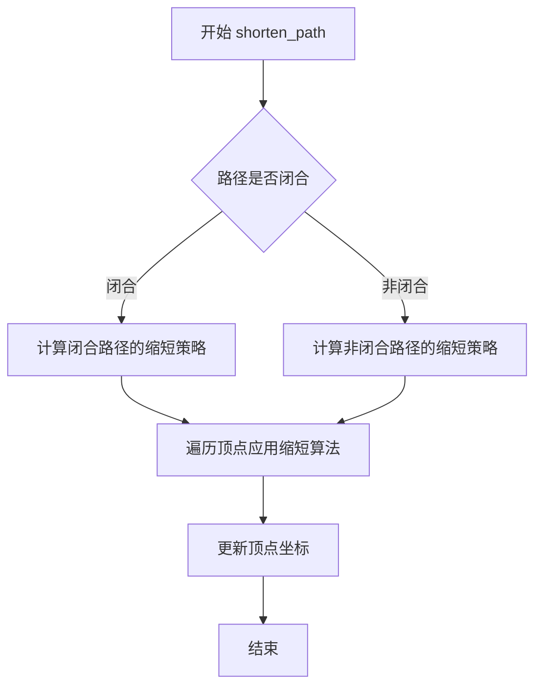

#### 带注释源码

```
// shorten_path 函数定义于 agg_shorten_path.h 中
// 以下为在 vcgen_stroke::rewind 中的调用方式：
//
// void vcgen_stroke::rewind(unsigned)
// {
//     if(m_status == initial)
//     {
//         m_src_vertices.close(m_closed != 0);
//         shorten_path(m_src_vertices, m_shorten, m_closed);  // 核心调用
//         if(m_src_vertices.size() < 3) m_closed = 0;
//     }
//     m_status = ready;
//     m_src_vertex = 0;
//     m_out_vertex = 0;
// }
//
// 函数功能说明：
// - m_src_vertices: 输入的原始顶点数组，包含路径的所有顶点
// - m_shorten: 缩短量参数，控制每个线段被缩短的程度（单位为像素）
// - m_closed: 路径闭合标志，非零表示路径首尾相连
//
// 该函数通过移除或调整顶点位置来简化路径，主要用于：
// 1. 减少描边计算量
// 2. 平滑路径尖锐转角
// 3. 处理路径端点的特殊需求
```


### `vcgen_stroke::calc_cap` (或 `m_stroker.calc_cap`)

`calc_cap` 是笔划生成器（Stroker）类的一个核心方法，负责计算路径端点处的装饰形状（Cap），例如圆形端点或方形端点。该方法根据给定的端点坐标、前一个顶点位置和距离信息，在输出顶点数组中生成构成端点装饰的多边形顶点序列。

参数：

- `out_vertices`：`pod_array<point_d>&`，输出参数，用于存储生成的装饰顶点序列
- `p1`：`const vertex_dist&`，端点坐标（当前位置）
- `p2`：`const vertex_dist&`，方向顶点（用于确定装饰的延伸方向）
- `d`：`double`，从前一个顶点到当前端点的距离，用于确定装饰的大小

返回值：`void`，无直接返回值，结果通过 `out_vertices` 输出参数返回

#### 流程图

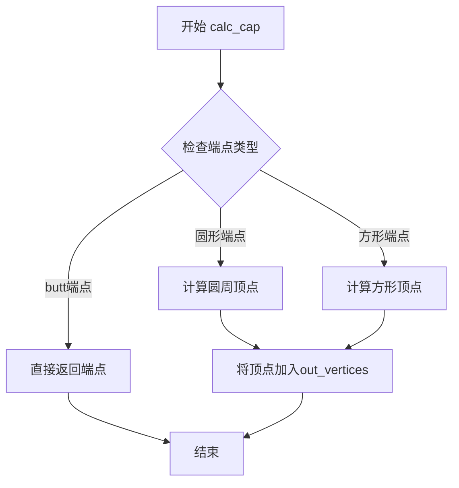

#### 带注释源码

```cpp
// 注意：以下为调用处的代码片段，calc_cap的具体实现需要查看Stroker类定义
// 这是vcgen_stroke类中调用calc_cap的两个位置：

// 位置1：计算路径起点的装饰端点（cap1状态）
case cap1:
    m_stroker.calc_cap(m_out_vertices,          // 输出顶点数组
                       m_src_vertices[0],        // 起点坐标
                       m_src_vertices[1],       // 第二个顶点（确定方向）
                       m_src_vertices[0].dist); // 起点到前一顶点的距离
    m_src_vertex = 1;
    m_prev_status = outline1;
    m_status = out_vertices;
    m_out_vertex = 0;
    break;

// 位置2：计算路径终点的装饰端点（cap2状态）
case cap2:
    m_stroker.calc_cap(m_out_vertices,
                       m_src_vertices[m_src_vertices.size() - 1],  // 终点坐标
                       m_src_vertices[m_src_vertices.size() - 2],  // 倒数第二个顶点
                       m_src_vertices[m_src_vertices.size() - 2].dist); // 距离
    m_prev_status = outline2;
    m_status = out_vertices;
    m_out_vertex = 0;
    break;
```

**补充说明**：

由于提供的代码片段中仅包含 `calc_cap` 的调用点，未包含其具体实现（该实现应在 `vcgen_stroke` 类使用的 `stroker` 成员对象所属的类中，可能在 `agg_stroke` 或类似的笔划计算类中）。根据 Anti-Grain Geometry 库的设计模式，该方法通常根据当前设置的端点样式（line_cap）生成相应的几何形状：

- **圆形端点（round cap）**：生成圆周上的多个顶点近似圆形
- **方形端点（square cap）**：在线段方向上延伸一定距离形成方形
- ** butt端点（butt cap）**：不延伸，仅输出端点本身


### `vcgen_stroke.vertex() 中的 m_stroker.calc_join() 调用`

在 `vcgen_stroke` 类的 `vertex()` 方法中，`m_stroker.calc_join()` 被调用两次，用于计算路径线段之间的连接（join）几何形状。该函数根据前一个顶点、当前顶点和后一个顶点的位置及距离信息，生成平滑的拐角连接。

注意：由于 `m_stroker` 的类型定义（`vcgen_stroke` 的类定义中未直接显示，但根据代码推断为内部 stroker 类的实例）在给定的代码段中不可见，以下信息基于代码中的调用上下文提取。

参数：

-  `out_vertices`：`m_out_vertices`，`pod_array<point_d>&`，用于输出计算得到的连接顶点
-  `prev`：`m_src_vertices.prev(m_src_vertex)`，`const vertex_dist&`，前一个顶点及其距离信息
-  `curr`：`m_src_vertices.curr(m_src_vertex)`，`const vertex_dist&`，当前顶点及其距离信息  
-  `next`：`m_src_vertices.next(m_src_vertex)`，`const vertex_dist&`，后一个顶点及其距离信息
-  `prev_dist`：`m_src_vertices.prev(m_src_vertex).dist`，`double`，前一个顶点沿路径的距离
-  `curr_dist`：`m_src_vertices.curr(m_src_vertex).dist`，`double`，当前顶点沿路径的距离

返回值：`void`，该函数直接修改 `out_vertices` 参数，将连接几何形状的顶点追加到其中

#### 流程图

```mermaid
flowchart TD
    A[vertex() 方法被调用] --> B{当前状态}
    
    B -->|outline1| C[计算开放路径或闭合路径的连接]
    B -->|outline2| D[反向计算闭合路径的连接]
    
    C --> E[调用 calc_join]
    D --> F[调用 calc_join]
    
    E --> G[传入参数: out_vertices, prev, curr, next, prev_dist, curr_dist]
    F --> H[传入参数: out_vertices, next, curr, prev, curr_dist, prev_dist]
    
    G --> I[生成连接顶点]
    H --> J[生成连接顶点]
    
    I --> K[状态转为 out_vertices]
    J --> L[状态转为 out_vertices]
    
    K --> M[输出顶点]
    L --> N[输出顶点]
```

#### 带注释源码

```cpp
//------------------------------------------------------------------------
// 在 outline1 状态下的调用 - 处理正向路径的连接
//------------------------------------------------------------------------
case outline1:
    if(m_closed)
    {
        if(m_src_vertex >= m_src_vertices.size())
        {
            m_prev_status = close_first;
            m_status = end_poly1;
            break;
        }
    }
    else
    {
        if(m_src_vertex >= m_src_vertices.size() - 1)
        {
            m_status = cap2;
            break;
        }
    }
    // 计算连接：使用 prev, curr, next 顶点顺序
    m_stroker.calc_join(m_out_vertices, 
                        m_src_vertices.prev(m_src_vertex), 
                        m_src_vertices.curr(m_src_vertex), 
                        m_src_vertices.next(m_src_vertex), 
                        m_src_vertices.prev(m_src_vertex).dist,
                        m_src_vertices.curr(m_src_vertex).dist);
    ++m_src_vertex;
    m_prev_status = m_status;
    m_status = out_vertices;
    m_out_vertex = 0;
    break;

//------------------------------------------------------------------------
// 在 outline2 状态下的调用 - 处理反向路径的连接（闭合路径）
//------------------------------------------------------------------------
case outline2:
    if(m_src_vertex <= unsigned(m_closed == 0))
    {
        m_status = end_poly2;
        m_prev_status = stop;
        break;
    }

    --m_src_vertex;
    // 计算连接：使用 next, curr, prev 顶点顺序（反向）
    m_stroker.calc_join(m_out_vertices,
                        m_src_vertices.next(m_src_vertex), 
                        m_src_vertices.curr(m_src_vertex), 
                        m_src_vertices.prev(m_src_vertex), 
                        m_src_vertices.curr(m_src_vertex).dist, 
                        m_src_vertices.prev(m_src_vertex).dist);

    m_prev_status = m_status;
    m_status = out_vertices;
    m_out_vertex = 0;
    break;
```

#### 关键组件信息

| 名称 | 一句话描述 |
|------|-----------|
| `vcgen_stroke` | 笔划生成器类，负责将路径转换为带有端点（cap）和连接点（join）的笔划轮廓 |
| `m_stroker` | 内部笔划计算器对象，负责实际的线条几何计算 |
| `m_src_vertices` | 源顶点数组，存储输入路径顶点及其距离信息 |
| `m_out_vertices` | 输出顶点数组，存储生成的笔划轮廓顶点 |
| `m_status` | 状态机变量，控制 `vertex()` 方法的执行流程 |

#### 潜在的技术债务或优化空间

1. **缺少 `m_stroker` 类型定义**：在提供的代码段中，`m_stroker` 的类定义不可见，这使得分析 `calc_join` 的完整行为变得困难。应该将相关的 stroker 类定义包含在代码库中以便完整理解。

2. **状态机逻辑复杂**：`vertex()` 方法使用大型 switch-case 状态机，状态转换逻辑分散在多个 case 中，难以维护和调试。可以考虑将状态转换逻辑提取为独立函数或使用更清晰的状态模式。

3. **魔法数字和标志**：代码中使用了多个标志和常量（如 `path_cmd_move_to`, `path_flags_close` 等），但未提供充分的文档说明。建议添加枚举类型或常量类来提高可读性。

4. **顶点索引边界检查**：在 `outline1` 和 `outline2` case 中，索引计算 (`m_src_vertex`, `prev()`, `curr()`, `next()`) 依赖于前置条件验证，如果输入数据不符合预期（如顶点数不足），可能导致未定义行为。

#### 其它项目

**设计目标与约束**：
- 该笔划生成器旨在为矢量路径生成抗锯齿的笔划轮廓
- 支持开放路径和闭合路径
- 支持不同的端点（cap）类型和连接（join）类型

**错误处理与异常设计**：
- 当源顶点数不足时（少于2或3个顶点），状态机会提前转换到 `stop` 状态
- 没有使用异常机制，错误通过状态机控制流处理

**数据流与状态机**：
- `vertex()` 方法是一个生成器（Iterator），每次调用返回一个顶点
- 状态机控制顶点生成的顺序：move_to -> (cap|outline|join)* -> end_poly -> stop
- `m_prev_status` 用于在处理完子任务后恢复之前的状态

**外部依赖与接口契约**：
- 依赖 `agg` 命名空间下的其他类：`vertex_dist`, `point_d`, `pod_array`
- 依赖 `m_stroker` 对象（类型未在当前代码段中定义）
- `calc_join` 的行为取决于具体的 stroker 实现（可能是斜接、圆角或倒角）


### `vcgen_stroke.vcgen_stroke()`

这是 `vcgen_stroke` 类的构造函数，用于初始化笔画生成器的所有内部状态和成员变量，将描边器、顶点集合、状态标志等全部设置为初始值，为后续的路径描边操作做好准备。

参数：
- 该函数无参数（构造函数）

返回值：
- 无返回值（构造函数）

#### 流程图

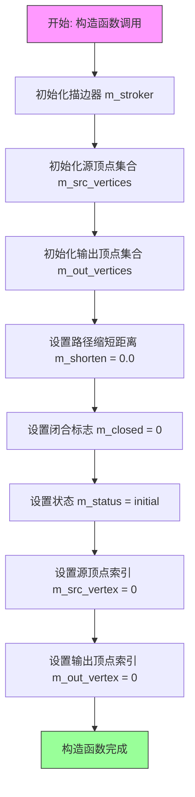

#### 带注释源码

```
//------------------------------------------------------------------------
// 构造函数: vcgen_stroke
// 功能: 初始化vcgen_stroke类的所有成员变量
//------------------------------------------------------------------------
vcgen_stroke::vcgen_stroke() :
    m_stroker(),        // 初始化描边器对象
    m_src_vertices(),   // 初始化源顶点容器（存储输入路径顶点）
    m_out_vertices(),   // 初始化输出顶点容器（存储描边后的顶点）
    m_shorten(0.0),     // 初始化路径缩短距离（0表示不缩短）
    m_closed(0),        // 初始化闭合标志（0表示路径未闭合）
    m_status(initial), // 初始化状态机为initial状态
    m_src_vertex(0),    // 初始化源顶点索引
    m_out_vertex(0)     // 初始化输出顶点索引
{
    // 构造函数体为空，所有初始化工作在成员初始化列表中完成
}
```


### `vcgen_stroke.remove_all`

该函数用于清除笔画生成器中所有已存储的顶点数据，并将状态重置为初始状态，使生成器可以重新接收新的顶点数据。

参数： 无

返回值：`void`，无返回值

#### 流程图

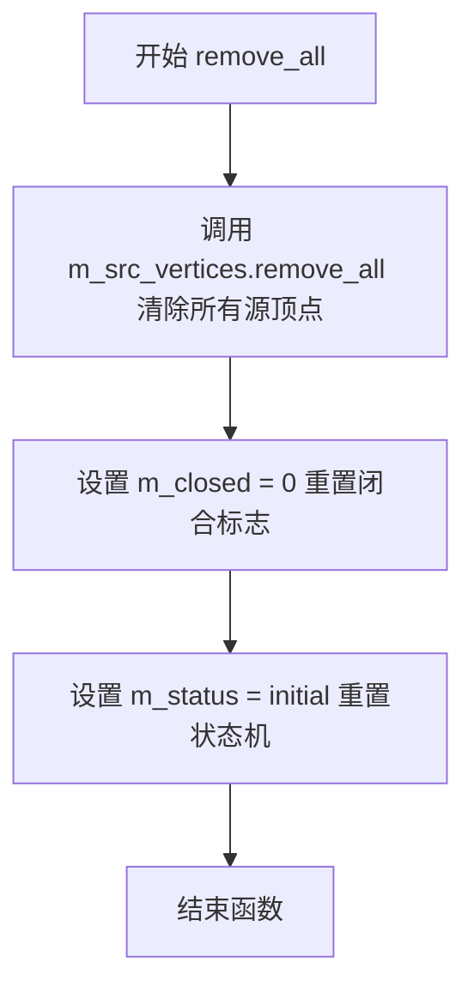

#### 带注释源码

```cpp
//------------------------------------------------------------------------
// 移除所有顶点并重置状态
// 该方法执行以下操作：
// 1. 清除源顶点容器中的所有顶点
// 2. 重置闭合标志为0（未闭合）
// 3. 重置状态机为initial状态
//------------------------------------------------------------------------
void vcgen_stroke::remove_all()
{
    // 清除所有源顶点数据
    m_src_vertices.remove_all();
    
    // 重置闭合标志为0，表示路径未闭合
    m_closed = 0;
    
    // 重置状态机为初始状态，准备接收新的顶点数据
    m_status = initial;
}
```

#### 相关上下文信息

**所属类：vcgen_stroke**

- **m_src_vertices**：类型 `vertex_storage`（或类似容器），存储源顶点的集合
- **m_closed**：类型 `int`，标识路径是否闭合（0表示未闭合）
- **m_status**：类型 `status` 枚举，标识生成器的当前状态

**调用关系**：
- 该方法通常在需要重新开始绘制新路径时调用
- 与 `add_vertex()` 方法配合使用，`add_vertex()` 会将状态重置为 `initial`
- `rewind()` 方法会检查状态，如果为 `initial` 会执行路径预处理

**设计意图**：
该方法提供了完全的复位功能，使得 `vcgen_stroke` 实例可以被重复使用，无需创建新实例，这对于对象池或频繁重用的场景非常有用。


### `vcgen_stroke.add_vertex`

该方法用于向笔画生成器的源顶点序列中添加顶点或设置闭合标志，是构建笔画路径的核心输入方法，根据命令类型将坐标添加到顶点列表或更新闭合状态。

参数：

- `x`：`double`，顶点的 X 坐标
- `y`：`double`，顶点的 Y 坐标
- `cmd`：`unsigned`，路径命令标识符（如 move_to、line_to、end_poly 等）

返回值：`void`，无返回值

#### 流程图

```mermaid
flowchart TD
    A[开始 add_vertex] --> B[设置 m_status = initial]
    B --> C{is_move_to(cmd)?}
    C -->|Yes| D[修改最后一个顶点为 vertex_dist(x, y)]
    C -->|No| E{is_vertex(cmd)?}
    E -->|Yes| F[添加新顶点 vertex_dist(x, y) 到 m_src_vertices]
    E -->|No| G[设置 m_closed = get_close_flag(cmd)]
    D --> H[结束]
    F --> H
    G --> H
```

#### 带注释源码

```cpp
//------------------------------------------------------------------------
// 添加顶点或设置闭合标志
//------------------------------------------------------------------------
void vcgen_stroke::add_vertex(double x, double y, unsigned cmd)
{
    // 每次添加顶点时，将状态机重置为初始状态
    m_status = initial;
    
    // 判断是否为 move_to 命令（路径起始点）
    if(is_move_to(cmd))
    {
        // 如果是 move_to，则修改最后一个顶点（通常是起始点）的位置
        m_src_vertices.modify_last(vertex_dist(x, y));
    }
    else
    {
        // 判断是否为普通顶点命令（line_to 等）
        if(is_vertex(cmd))
        {
            // 将新顶点添加到源顶点序列中
            m_src_vertices.add(vertex_dist(x, y));
        }
        else
        {
            // 否则为闭合路径命令（end_poly 等），设置闭合标志
            m_closed = get_close_flag(cmd);
        }
    }
}
```


### `vcgen_stroke::rewind(unsigned)`

该函数是 Anti-Grain Geometry 库中路径生成器的核心方法，用于在生成描边顶点之前将生成器重置为就绪状态。它会处理路径的闭合、缩短，并根据顶点数量调整闭合标志，最终将状态机切换到 ready 状态，准备输出描边顶点。

参数：

- `（未命名）`：`unsigned`，未使用的参数，为保持接口一致性而存在

返回值：`void`，无返回值

#### 流程图

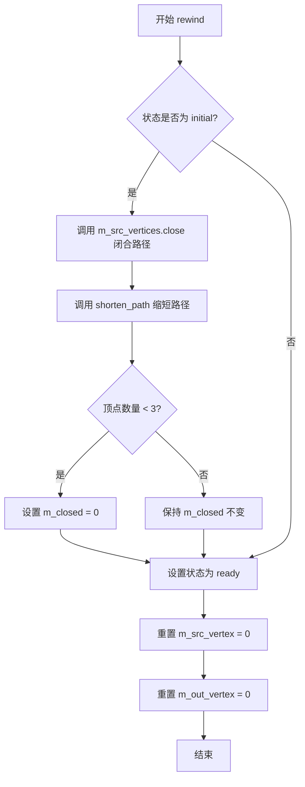

#### 带注释源码

```cpp
//------------------------------------------------------------------------
// 重置描边生成器，为输出顶点做准备
// 参数：unsigned - 未使用的参数，为保持接口一致性而保留
//------------------------------------------------------------------------
void vcgen_stroke::rewind(unsigned)
{
    // 如果当前状态是 initial，需要进行初始化处理
    if(m_status == initial)
    {
        // 根据 m_closed 标志决定是否闭合源顶点数组
        m_src_vertices.close(m_closed != 0);
        
        // 对路径进行缩短处理，使用 m_shorten 缩短量和 m_closed 闭合标志
        shorten_path(m_src_vertices, m_shorten, m_closed);
        
        // 如果处理后的顶点数量少于3个，则无法构成多边形，取消闭合
        if(m_src_vertices.size() < 3) m_closed = 0;
    }
    
    // 将状态设置为 ready，表示生成器已准备好输出顶点
    m_status = ready;
    
    // 重置源顶点索引，指向第一个顶点
    m_src_vertex = 0;
    
    // 重置输出顶点索引，指向第一个输出顶点
    m_out_vertex = 0;
}
```


### `vcgen_stroke.vertex`

该方法是 Anti-Grain Geometry 库中 `vcgen_stroke` 类的核心成员函数，实现了描边生成器的状态机，通过逐步遍历内部状态（初始→就绪→端点/轮廓绘制→输出顶点）来依次输出路径的描边顶点坐标及其对应的绘图命令（move_to、line_to、end_poly 等），是实现矢量图形描边效果的关键入口。

参数：

- `x`：`double*`，指向输出顶点 x 坐标的指针，方法通过此指针返回当前输出顶点的 x 坐标
- `y`：`double*`，指向输出顶点 y 坐标的指针，方法通过此指针返回当前输出顶点的 y 坐标

返回值：`unsigned`，返回当前输出顶点对应的路径命令（如 `path_cmd_move_to`、`path_cmd_line_to`、`path_cmd_end_poly`、`path_cmd_stop` 等），调用者根据此命令决定如何处理返回的顶点坐标

#### 流程图

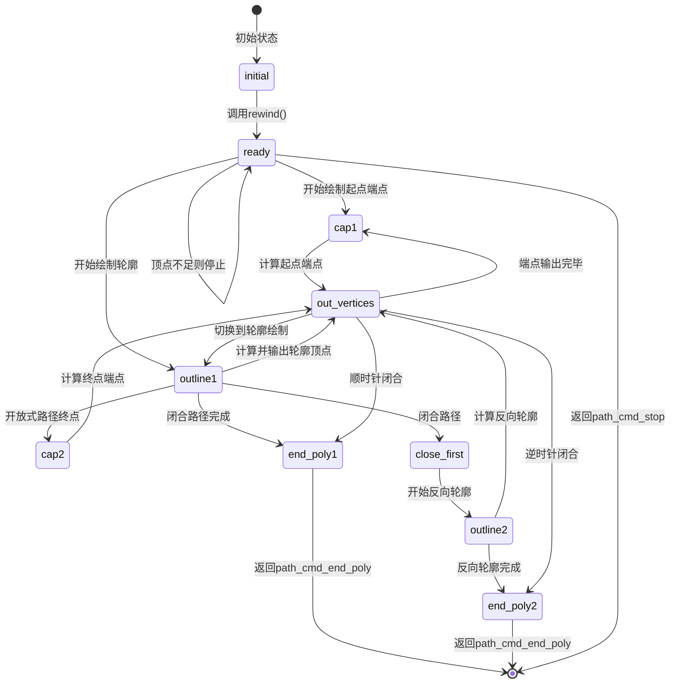

#### 带注释源码

```cpp
//------------------------------------------------------------------------
// 获取下一个输出顶点
// 这是一个复杂的状态机实现，用于生成描边路径的顶点序列
//------------------------------------------------------------------------
unsigned vcgen_stroke::vertex(double* x, double* y)
{
    // 初始命令为 line_to，后续可能被修改为 move_to 或其他命令
    unsigned cmd = path_cmd_line_to;
    
    // 主循环：持续处理状态机直到遇到 stop 命令
    while(!is_stop(cmd))
    {
        // 根据当前状态执行不同的处理逻辑
        switch(m_status)
        {
        //---------------------- 初始状态 ----------------------
        case initial:
            // 调用 rewind 进行初始化准备（关闭路径、执行路径缩短等）
            rewind(0);

        //---------------------- 就绪状态 ----------------------
        case ready:
            // 检查源顶点数量是否足够（至少需要2个，或3个如果路径闭合）
            if(m_src_vertices.size() < 2 + unsigned(m_closed != 0))
            {
                // 顶点不足，无法生成描边，直接停止
                cmd = path_cmd_stop;
                break;
            }
            // 根据路径是否闭合决定起始状态
            // 闭合路径：从 outline1 开始
            // 开放路径：从 cap1 开始（需要绘制端点）
            m_status = m_closed ? outline1 : cap1;
            cmd = path_cmd_move_to;  // 首个输出命令必须是 move_to
            m_src_vertex = 0;
            m_out_vertex = 0;
            break;

        //---------------------- 绘制起点端点 ----------------------
        case cap1:
            // 计算起点端点（如果是开放路径的第一个点）
            // 使用第一个顶点和第二个顶点计算端点
            m_stroker.calc_cap(m_out_vertices,
                               m_src_vertices[0], 
                               m_src_vertices[1], 
                               m_src_vertices[0].dist);
            m_src_vertex = 1;  // 移动到下一个源顶点
            m_prev_status = outline1;  // 保存下一状态
            m_status = out_vertices;   // 切换到输出顶点状态
            m_out_vertex = 0;
            break;

        //---------------------- 绘制终点端点 ----------------------
        case cap2:
            // 计算终点端点（开放路径的最后一个点）
            // 使用最后两个顶点计算端点
            m_stroker.calc_cap(m_out_vertices,
                               m_src_vertices[m_src_vertices.size() - 1], 
                               m_src_vertices[m_src_vertices.size() - 2], 
                               m_src_vertices[m_src_vertices.size() - 2].dist);
            m_prev_status = outline2;
            m_status = out_vertices;
            m_out_vertex = 0;
            break;

        //---------------------- 正向轮廓绘制 ----------------------
        case outline1:
            if(m_closed)
            {
                // 闭合路径：检查是否已处理完所有顶点
                if(m_src_vertex >= m_src_vertices.size())
                {
                    m_prev_status = close_first;
                    m_status = end_poly1;
                    break;
                }
            }
            else
            {
                // 开放路径：检查是否到达倒数第二个顶点
                if(m_src_vertex >= m_src_vertices.size() - 1)
                {
                    m_status = cap2;  // 切换到终点端点绘制
                    break;
                }
            }
            // 计算当前顶点的连接（join）
            // 使用前一个、当前、后一个顶点计算Join
            m_stroker.calc_join(m_out_vertices, 
                                m_src_vertices.prev(m_src_vertex), 
                                m_src_vertices.curr(m_src_vertex), 
                                m_src_vertices.next(m_src_vertex), 
                                m_src_vertices.prev(m_src_vertex).dist,
                                m_src_vertices.curr(m_src_vertex).dist);
            ++m_src_vertex;
            m_prev_status = m_status;
            m_status = out_vertices;
            m_out_vertex = 0;
            break;

        //---------------------- 闭合路径起始 ----------------------
        case close_first:
            m_status = outline2;
            cmd = path_cmd_move_to;  // 回到起点需要 move_to

        //---------------------- 反向轮廓绘制 ----------------------
        case outline2:
            // 检查是否需要停止（开放路径至少需要2个顶点）
            if(m_src_vertex <= unsigned(m_closed == 0))
            {
                m_status = end_poly2;
                m_prev_status = stop;
                break;
            }

            // 反向遍历顶点（从终点到起点）
            --m_src_vertex;
            // 计算反向连接
            m_stroker.calc_join(m_out_vertices,
                                m_src_vertices.next(m_src_vertex), 
                                m_src_vertices.curr(m_src_vertex), 
                                m_src_vertices.prev(m_src_vertex), 
                                m_src_vertices.curr(m_src_vertex).dist, 
                                m_src_vertices.prev(m_src_vertex).dist);

            m_prev_status = m_status;
            m_status = out_vertices;
            m_out_vertex = 0;
            break;

        //---------------------- 输出顶点状态 ----------------------
        case out_vertices:
            // 检查是否还有未输出的顶点
            if(m_out_vertex >= m_out_vertices.size())
            {
                // 当前批次的顶点已输出完毕，切换回上一状态继续处理
                m_status = m_prev_status;
            }
            else
            {
                // 取出下一个输出顶点
                const point_d& c = m_out_vertices[m_out_vertex++];
                *x = c.x;
                *y = c.y;
                return cmd;  // 返回当前命令（move_to 或 line_to）
            }
            break;

        //---------------------- 结束多边形（顺时针） ----------------------
        case end_poly1:
            m_status = m_prev_status;
            // 返回闭合、逆时针结束多边形命令
            return path_cmd_end_poly | path_flags_close | path_flags_ccw;

        //---------------------- 结束多边形（逆时针） ----------------------
        case end_poly2:
            m_status = m_prev_status;
            // 返回闭合、顺时针结束多边形命令
            return path_cmd_end_poly | path_flags_close | path_flags_cw;

        //---------------------- 停止状态 ----------------------
        case stop:
            cmd = path_cmd_stop;
            break;
        }
    }
    // 循环结束，返回 stop 命令
    return cmd;
}
```

## 关键组件


### vcgen_stroke 类

核心描边生成器类，负责将输入路径转换为带有端点（cap）和连接点（join）的描边路径，包含状态机驱动的顶点生成逻辑。

### 状态机组件

管理描边生成流程的状态转换，包含 initial（初始）、ready（就绪）、cap1（起点端点）、cap2（终点端点）、outline1（正向轮廓）、outline2（反向轮廓）、close_first（闭合起始）、out_vertices（输出顶点）、end_poly1（结束多边形1）、end_poly2（结束多边形2）、stop（停止）等状态。

### 顶点缓冲组件

m_src_vertices 存储输入源顶点（vertex_dist类型），m_out_vertices 存储输出描边顶点，用于在状态机流转中暂存和输出计算结果。

### 描边计算组件

m_stroker 对象调用 calc_cap 和 calc_join 方法，分别计算路径端点的帽形和路径转折处的连接形，是几何计算的核心引擎。

### 路径缩短组件

shorten_path 函数调用，根据 m_shorten 参数缩短路径端点，用于实现虚线描边或端点内缩效果。

### 状态管理组件

m_status、m_prev_status、m_src_vertex、m_out_vertex 等状态变量，记录状态机当前状态、前一状态、源顶点索引、输出顶点索引，确保状态转换的连续性。

### 闭合路径处理组件

m_closed 标志和 close_first 状态，处理开环路径和闭环路径的不同描边逻辑，闭环路径需要特殊处理起点与终点的连接。


## 问题及建议


### 已知问题

-   **switch-case 缺少 break 语句**：在 `vertex()` 方法的 `initial` 和 `close_first` case 中，没有 break 或 return 语句，存在隐式的 fall-through 行为。这种设计虽然可能是故意的，但极易造成误读，且缺少注释说明。
-   **magic numbers 硬编码**：代码中多处出现魔法数字，如 `3`（`m_src_vertices.size() < 3`）、`2`（`m_src_vertices.size() < 2 + ...`）等，缺乏常量定义，影响可读性和可维护性。
-   **vertex() 方法职责过重**：该方法包含超过 200 行代码，混合了状态机跳转、顶点计算、坐标赋值等多种职责，违反了单一职责原则。
-   **缺乏参数验证**：`add_vertex()` 和 `vertex()` 方法均未对输入参数（x, y, cmd）进行有效性检查，可能导致后续计算异常。
-   **状态机复杂度高**：状态变量 `m_status` 和 `m_prev_status` 的转换逻辑复杂，状态间跳转缺乏清晰的文档，增加维护难度。
-   **类型转换缺乏显式说明**：`unsigned(m_closed != 0)` 这种隐式转换可读性差，应使用更明确的布尔转换方式。
-   **const 正确性缺失**：类方法未尽可能使用 const 修饰符（如 `m_src_vertices` 的 getter 方法调用），影响 API 的设计质量。

### 优化建议

-   **提取状态机逻辑**：将 `vertex()` 方法中的状态机逻辑拆分为独立的私有方法，如 `handleInitialState()`、`handleOutline1State()` 等，提高代码可读性。
-   **定义常量替代魔法数字**：将 `3`、`2` 等魔法数字定义为类或命名空间级别的常量，并添加有意义的名称。
-   **添加输入参数验证**：在 `add_vertex()` 中增加对坐标值和命令类型的合法性检查，提高健壮性。
-   **优化内存预分配**：根据路径预估大小，在 `m_src_vertices` 和 `m_out_vertices` 初始化时预分配合理容量，减少动态扩容开销。
-   **补充文档注释**：为关键状态（initial、ready、outline1 等）和状态转换逻辑添加注释，说明设计意图。
-   **考虑使用 enum class**：将状态码从当前的无符号整数改为强类型的 enum class，提升类型安全性和代码可读性。
-   **重构状态管理**：将 `m_prev_status` 的更新逻辑集中管理，避免在多处手动赋值，减少潜在的状态同步错误。


## 其它


### 一段话描述

vcgen_stroke是Anti-Grain Geometry库中的矢量路径描边生成器，负责将输入的顶点序列转换为带有端点处理（caps）、线段连接（joins）和轮廓的描边路径，支持开放路径和闭合路径两种模式。

### 文件的整体运行流程

1. 用户通过add_vertex()方法向vcgen_stroke添加顶点数据（线段、Move命令或闭合标志）
2. 调用rewind(0)方法初始化描边生成器，此时会对路径进行shorten处理
3. 循环调用vertex()方法获取输出顶点，每次调用返回下一个描边轮廓顶点
4. vertex()方法内部通过状态机控制遍历源顶点、计算端点、计算连接点、输出顶点序列
5. 当返回path_cmd_stop时，表示描边生成完成

### 类的详细信息

#### 类名：vcgen_stroke

##### 类字段

| 字段名 | 类型 | 描述 |
|--------|------|------|
| m_stroker | stroker | 笔划器对象，负责计算端点和连接点 |
| m_src_vertices | vertex_storage | 源顶点存储队列 |
| m_out_vertices | vertex_storage | 输出顶点存储队列 |
| m_shorten | double | 路径缩短距离，用于控制端点重叠 |
| m_closed | unsigned | 闭合标志，标识路径是否为闭合多边形 |
| m_status | unsigned | 状态机当前状态 |
| m_src_vertex | unsigned | 源顶点索引指针 |
| m_out_vertex | unsigned | 输出顶点索引指针 |
| m_prev_status | unsigned | 上一状态，用于状态回溯 |

##### 类方法

###### vcgen_stroke() - 构造函数

- 参数：无
- 返回值类型：void
- 返回值描述：无
- 功能描述：初始化vcgen_stroke对象，设置默认参数值

---

###### remove_all()

- 参数：无
- 返回值类型：void
- 返回值描述：无
- 功能描述：清空源顶点队列，重置闭合标志和状态为initial

---

###### add_vertex(double x, double y, unsigned cmd)

- 参数名称：x, y, cmd
- 参数类型：double, double, unsigned
- 参数描述：x和y为顶点坐标，cmd为路径命令（move_to/line_to/close）
- 返回值类型：void
- 返回值描述：无
- 功能描述：将顶点或命令添加到源顶点队列，处理move_to时修改最后一个顶点，其他顶点添加到队列末尾，闭合命令设置闭合标志

---

###### rewind(unsigned)

- 参数名称：(unused)
- 参数类型：unsigned
- 参数描述：未使用的参数，保留接口兼容性
- 返回值类型：void
- 返回值描述：无
- 功能描述：初始化描边生成器，若为首次运行则调用shorten_path缩短路径，然后重置顶点索引，准备输出描边顶点

---

###### vertex(double* x, double* y)

- 参数名称：x, y
- 参数类型：double*, double*
- 参数描述：输出参数，返回顶点的x和y坐标
- 返回值类型：unsigned
- 返回值描述：返回当前顶点的路径命令（move_to/line_to/end_poly/stop）
- mermaid流程图：

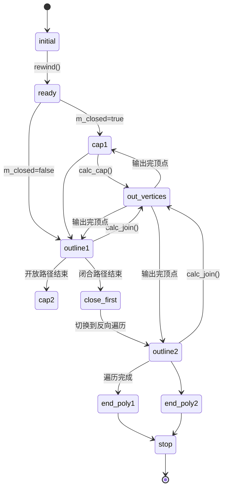

- 带注释源码：见上述代码中的vertex()方法实现

### 全局变量和全局函数信息

本文件未定义全局变量，仅使用agg命名空间内的辅助函数：
- is_move_to(cmd)：判断命令是否为move_to
- is_vertex(cmd)：判断命令是否为顶点
- is_stop(cmd)：判断命令是否为stop
- get_close_flag(cmd)：获取闭合标志
- shorten_path()：缩短路径的辅助函数

### 关键组件信息

| 组件名称 | 一句话描述 |
|----------|------------|
| vertex_storage | 顶点存储容器，存储顶点及其距离信息 |
| stroker | 笔划计算器，负责计算端点(cap)和连接点(join)的具体几何形状 |
| vertex_dist | 顶点距离对，包含顶点坐标和到前一个顶点的距离 |
| 状态机 | 控制描边生成流程的状态转换逻辑 |

### 潜在的技术债务或优化空间

1. **状态机实现方式**：使用switch-case配合while循环实现状态机，代码可读性较差，建议使用状态模式或状态表驱动
2. **fallthrough行为**：case语句之间存在隐式fallthrough（如initial到ready，outline1到outline2），缺乏显式注释
3. **magic number**：状态值使用枚举常量但代码中混用了数值比较（如m_src_vertices.size() < 3）
4. **shorten_path调用时机**：在rewind中调用shorten_path可能导致重复计算，每次rewind都会执行
5. **内存分配**：m_out_vertices在每次计算cap/join时都会add，可能导致频繁内存分配，可考虑预分配或复用

### 设计目标与约束

- **设计目标**：将输入的2D矢量路径转换为带有几何装饰（端点、连接点）的描边轮廓路径
- **约束条件**：
  - 输入路径必须为2D坐标
  - 端点类型由m_stroker对象决定（支持butt、square、round等）
  - 连接点类型由m_stroker对象决定（支持miter、round、bevel等）
  - 路径缩短量m_shorten必须为非负值

### 错误处理与异常设计

- **顶点数量不足**：当源顶点数小于2时（开放路径）或小于3时（闭合路径），直接返回path_cmd_stop
- **空路径处理**：在ready状态检查顶点数量，不足时直接停止生成
- **状态异常恢复**：任何异常状态都会最终转换到stop状态并返回path_cmd_stop

### 数据流与状态机

输入数据流：add_vertex() -> m_src_vertices队列 -> rewind()处理 -> vertex()状态机遍历 -> 输出顶点

状态机转换：
- initial: 初始状态，调用rewind后转到ready
- ready: 准备状态，检查顶点数量后决定输出move_to或停止
- cap1: 输出起始端点
- outline1: 正向遍历源顶点，计算连接点
- close_first: 闭合路径时切换遍历方向
- outline2: 反向遍历源顶点
- out_vertices: 输出计算好的轮廓顶点
- end_poly1/end_poly2: 输出多边形闭合命令
- stop: 描边生成完成

### 外部依赖与接口契约

- **依赖库**：
  - <math.h>：数学函数
  - agg_vcgen_stroke.h：类声明
  - agg_shorten_path.h：路径缩短函数
  
- **接口契约**：
  - add_vertex()：接收外部传入的顶点序列和路径命令
  - vertex()：外部循环调用获取输出顶点，返回path_cmd类型命令
  - rewind()：在开始生成前必须调用一次进行初始化
  - remove_all()：重置内部状态用于接收新路径

### 其它项目

**路径类型支持**：
- 开放路径：起点和终点不连接，输出端点(cap)
- 闭合路径：起点和终点连接，输出连接点(join)而非端点

**顶点坐标系统**：
- 使用double精度浮点数存储坐标
- 支持任意尺度的2D坐标输入

**性能特性**：
- 状态机设计避免了递归调用
- 源顶点仅在rewind时遍历一次
- 输出顶点按需计算，减少内存占用


    