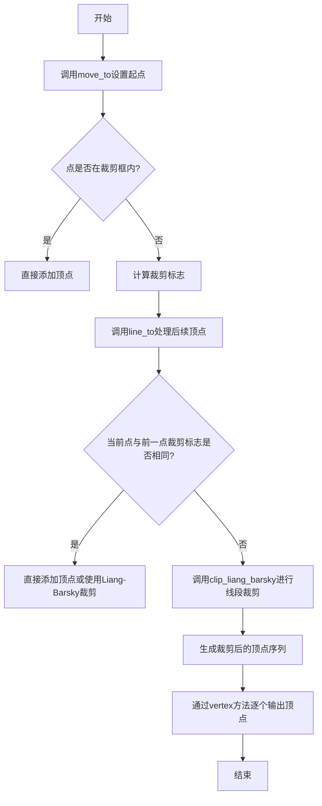
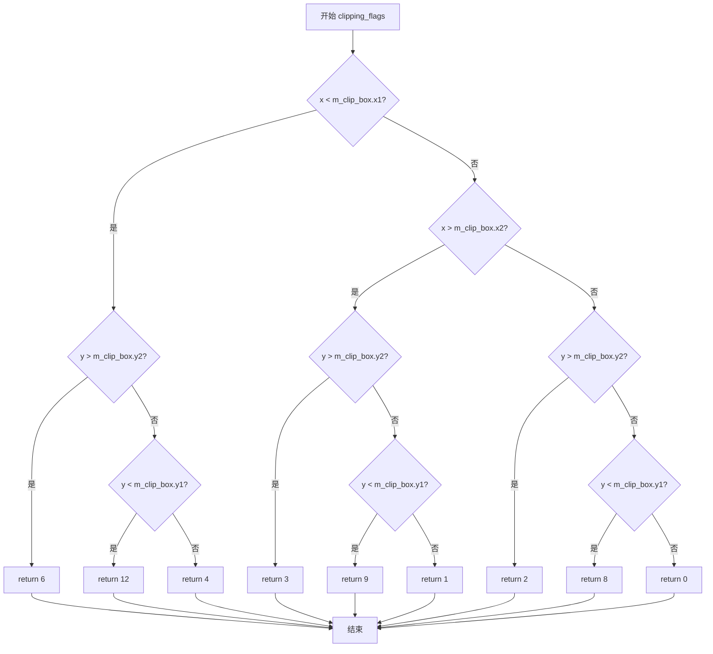
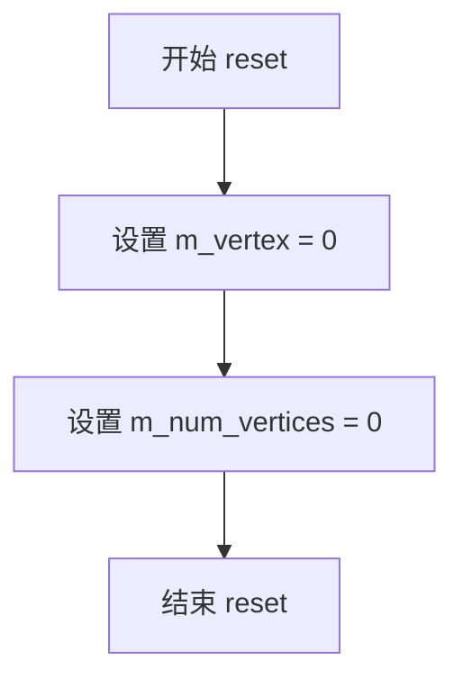
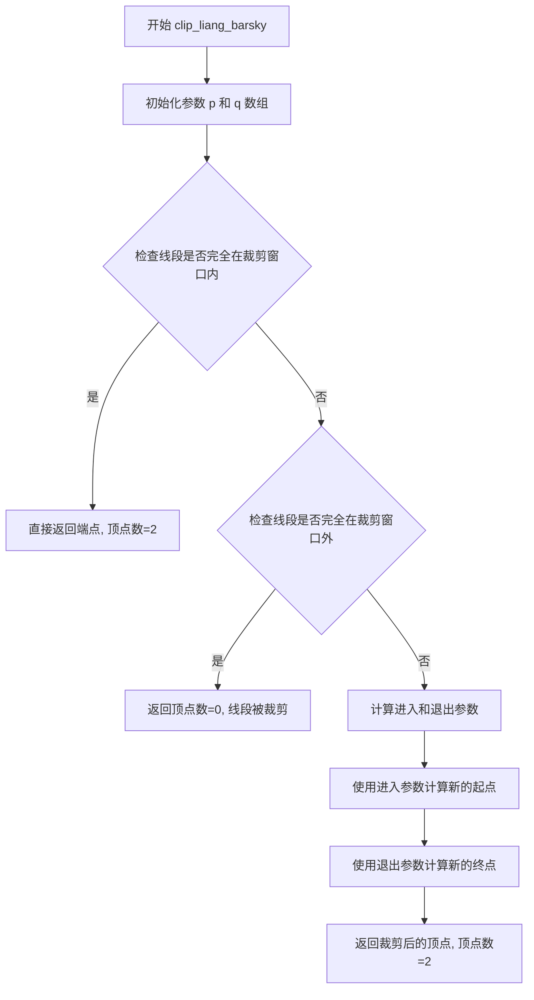
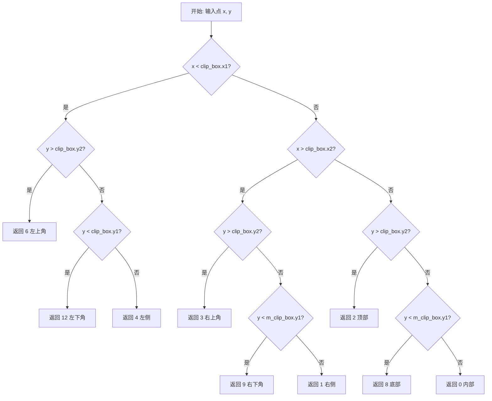

# `matplotlib\extern\agg24-svn\src\agg_vpgen_clip_polygon.cpp` 详细设计文档

这是Anti-Grain Geometry库中的一个多边形顶点生成器类，通过Cyrus-Beck线裁剪算法和Liang-Barsky裁剪算法实现对多边形顶点的裁剪，支持将任意多边形裁剪到指定的矩形裁剪框内。

## 整体流程



## 类结构

```
vpgen_clip_polygon (多边形裁剪顶点生成器)
├── 依赖: clip_liang_barsky (Liang-Barsky裁剪算法函数)
└── 依赖: clipping_flags (Cyrus-Beck裁剪标志计算)
```

## 全局变量及字段


### `vpgen_clip_polygon.m_clip_box`
    
裁剪框矩形

类型：`rect`
    


### `vpgen_clip_polygon.m_vertex`
    
当前顶点索引

类型：`unsigned`
    


### `vpgen_clip_polygon.m_num_vertices`
    
缓存的顶点数

类型：`unsigned`
    


### `vpgen_clip_polygon.m_clip_flags`
    
当前裁剪标志

类型：`unsigned`
    


### `vpgen_clip_polygon.m_x`
    
裁剪后顶点的x坐标数组

类型：`double[]`
    


### `vpgen_clip_polygon.m_y`
    
裁剪后顶点的y坐标数组

类型：`double[]`
    


### `vpgen_clip_polygon.m_x1`
    
上一个顶点的x坐标

类型：`double`
    


### `vpgen_clip_polygon.m_y1`
    
上一个顶点的y坐标

类型：`double`
    


### `vpgen_clip_polygon.m_cmd`
    
当前的路径命令

类型：`unsigned`
    
    

## 全局函数及方法


### `vpgen_clip_polygon::clipping_flags`

该函数根据 Cyrus-Beck 线裁剪算法，确定给定点(x, y)相对于裁剪矩形框的位置，并返回对应的裁剪标志码。裁剪标志使用4位二进制表示点在裁剪框的上、下、左、右四个区域，可用于后续的裁剪计算。

参数：

- `x`：`double`，待检测顶点的X坐标
- `y`：`double`，待检测顶点的Y坐标

返回值：`unsigned`，裁剪标志码（0-15），0表示点在裁剪框内部，其他值表示点在裁剪框的相应边界区域

#### 流程图



#### 带注释源码

```
//------------------------------------------------------------------------
// 根据Cyrus-Beck线裁剪算法确定顶点的裁剪代码
// 裁剪框区域划分：
//        |        |
//  0110  |  0010  | 0011    (y2上方区域)
//        |        |
// -------+--------+-------- clip_box.y2
//        |        |
//  0100  |  0000  | 0001    (内部区域)
//        |        |
// -------+--------+-------- clip_box.y1
//        |        |
//  1100  |  1000  | 1001    (y1下方区域)
//        |        |
//  clip_box.x1  clip_box.x2
//
// 参数：
//   x - 顶点的X坐标
//   y - 顶点的Y坐标
//
// 返回值：
//   0  - 点在裁剪框内部
//   1  -点在裁剪框右侧 (x > x2)
//   2  -点在裁剪框上方 (y > y2)
//   3  -点在裁剪框右上方
//   4  -点在裁剪框左侧 (x < x1)
//   8  -点在裁剪框下方 (y < y1)
//   6  -点在裁剪框左上方
//   9  -点在裁剪框右下方
//   12 -点在裁剪框左下方
//------------------------------------------------------------------------
unsigned vpgen_clip_polygon::clipping_flags(double x, double y)
{
    // 检查点是否在裁剪框左侧区域
    if(x < m_clip_box.x1) 
    {
        // 点在左侧上方区域
        if(y > m_clip_box.y2) return 6;    // 0110b - 左上
        // 点在左侧下方区域
        if(y < m_clip_box.y1) return 12;  // 1100b - 左下
        // 点仅在左侧区域
        return 4;                          // 0100b - 左侧
    }

    // 检查点是否在裁剪框右侧区域
    if(x > m_clip_box.x2) 
    {
        // 点在右侧上方区域
        if(y > m_clip_box.y2) return 3;    // 0011b - 右上
        // 点在右侧下方区域
        if(y < m_clip_box.y1) return 9;    // 1001b - 右下
        // 点仅在右侧区域
        return 1;                          // 0001b - 右侧
    }

    // 点在裁剪框水平范围内，检查垂直方向
    if(y > m_clip_box.y2) return 2;        // 0010b - 上方
    if(y < m_clip_box.y1) return 8;        // 1000b - 下方

    // 点在裁剪框内部
    return 0;                              // 0000b - 内部
}
```


### `vpgen_clip_polygon.reset`

该函数用于重置多边形裁剪顶点生成器的内部状态，将顶点索引和顶点计数重置为初始值，以便重新开始生成裁剪后的顶点序列。

参数：此函数无参数。

返回值：`void`，无返回值描述。

#### 流程图



#### 带注释源码

```cpp
//----------------------------------------------------------------------------
// 重置顶点生成器的内部状态
//----------------------------------------------------------------------------
void vpgen_clip_polygon::reset()
{
    // 将当前顶点索引重置为0，表示从头开始访问顶点
    m_vertex = 0;
    
    // 将可用顶点数量重置为0，表示当前没有可用的裁剪后顶点
    m_num_vertices = 0;
}
```


### `vpgen_clip_polygon::move_to`

该函数是 Anti-Grain Geometry 库中多边形裁剪顶点生成器的移动命令实现，用于将当前路径起点移动到指定坐标，并根据裁剪框判断是否需要存储该顶点。

参数：

- `x`：`double`，目标点的 X 坐标
- `y`：`double`，目标点的 Y 坐标

返回值：`void`，无返回值

#### 流程图

```mermaid
flowchart TD
    A[开始 move_to] --> B[m_vertex = 0]
    B --> C[m_num_vertices = 0]
    C --> D[调用 clipping_flags 获取裁剪标志]
    D --> E{裁剪标志 == 0?}
    E -->|是 点在裁剪框内| F[m_x[0] = x]
    F --> G[m_y[0] = y]
    G --> H[m_num_vertices = 1]
    E -->|否 不在裁剪框内| I[不存储顶点]
    H --> J[m_x1 = x]
    I --> J
    J --> K[m_y1 = y]
    K --> L[m_cmd = path_cmd_move_to]
    L --> M[结束]
```

#### 带注释源码

```cpp
//----------------------------------------------------------------------------
// 移动到指定坐标点，处理裁剪逻辑
//----------------------------------------------------------------------------
void vpgen_clip_polygon::move_to(double x, double y)
{
    // 重置顶点索引和顶点数量，准备处理新顶点
    m_vertex = 0;
    m_num_vertices = 0;
    
    // 根据坐标计算裁剪标志，判断点相对于裁剪框的位置
    m_clip_flags = clipping_flags(x, y);
    
    // 仅当顶点在裁剪框内部时（标志为0）才存储顶点
    if(m_clip_flags == 0)
    {
        m_x[0] = x;          // 存储X坐标到顶点数组
        m_y[0] = y;          // 存储Y坐标到顶点数组
        m_num_vertices = 1;  // 标记有效顶点数量为1
    }
    
    // 保存当前坐标作为线段起点（用于后续line_to的裁剪计算）
    m_x1  = x;
    m_y1  = y;
    
    // 设置当前路径命令为move_to
    m_cmd = path_cmd_move_to;
}
```


### `vpgen_clip_polygon::line_to`

处理多边形顶点生成过程中的线条绘制操作，根据裁剪框对线段进行裁剪处理，并输出裁剪后的顶点数据。

参数：

- `x`：`double`，目标点的X坐标
- `y`：`double`，目标点的Y坐标

返回值：`void`，无返回值

#### 流程图

```mermaid
flowchart TD
    A[开始 line_to] --> B[重置m_vertex和m_num_vertices为0]
    B --> C[调用clipping_flags获取当前点裁剪标志]
    C --> D{当前裁剪标志==之前裁剪标志?}
    D -->|是| E{标志是否为0即在裁剪框内?}
    D -->|否| F[调用clip_liang_barsky裁剪算法]
    E -->|是| G[保存x,y到m_x[0],m_y[0]]
    E -->|否| H[不保存顶点]
    G --> I[设置m_num_vertices=1]
    F --> J[获取裁剪后的顶点数]
    I --> K[更新m_clip_flags为当前flags]
    H --> K
    J --> K
    K --> L[更新m_x1=x, m_y1=y]
    L --> M[结束]
```

#### 带注释源码

```cpp
//----------------------------------------------------------------------------
// 处理多边形顶点生成过程中的线条绘制操作
// 根据裁剪框对线段进行裁剪处理，并输出裁剪后的顶点数据
//----------------------------------------------------------------------------
void vpgen_clip_polygon::line_to(double x, double y)
{
    // 重置顶点索引和顶点计数，准备处理新的线段
    m_vertex = 0;
    m_num_vertices = 0;
    
    // 获取当前点的裁剪标志，用于判断点相对于裁剪框的位置
    unsigned flags = clipping_flags(x, y);

    // 比较当前点与上一个点（move_to或前一个line_to）的裁剪状态
    if(m_clip_flags == flags)
    {
        // 如果两点裁剪标志相同，说明它们在裁剪框的同一区域
        if(flags == 0)
        {
            // 标志为0表示点在裁剪框内部，直接采用该点
            m_x[0] = x;
            m_y[0] = y;
            m_num_vertices = 1;
        }
    }
    else
    {
        // 两点跨越裁剪边界，使用Liang-Barsky算法进行线段裁剪
        // 将线段(m_x1,m_y1)到(x,y)根据裁剪框进行裁剪
        m_num_vertices = clip_liang_barsky(m_x1, m_y1, 
                                             x, y, 
                                             m_clip_box, 
                                             m_x, m_y);
    }

    // 更新裁剪标志为当前点的标志，供下次调用使用
    m_clip_flags = flags;
    
    // 更新上一个点的坐标
    m_x1 = x;
    m_y1 = y;
}
```


### `vpgen_clip_polygon::vertex`

该函数是vpgen_clip_polygon类的顶点获取方法，用于依次返回裁剪后的多边形顶点坐标。它通过内部索引遍历顶点数组，将当前顶点的坐标写入提供的输出参数中，并返回对应的路径命令类型。

参数：

- `x`：`double*`，输出参数，用于存储获取的顶点x坐标
- `y`：`double*`，输出参数，用于存储获取的顶点y坐标

返回值：`unsigned`，返回路径命令类型，可能是path_cmd_move_to、path_cmd_line_to或path_cmd_stop

#### 流程图

```mermaid
flowchart TD
    A[开始 vertex] --> B{m_vertex < m_num_vertices?}
    B -->|是| C[获取顶点坐标]
    C --> D[*x = m_x[m_vertex]]
    D --> E[*y = m_y[m_vertex]]
    E --> F[m_vertex++]
    F --> G[保存当前命令 cmd = m_cmd]
    G --> H[m_cmd = path_cmd_line_to]
    H --> I[返回 cmd]
    B -->|否| J[返回 path_cmd_stop]
    I --> K[结束]
    J --> K
```

#### 带注释源码

```
//----------------------------------------------------------------------------
// 获取裁剪后的多边形顶点
//----------------------------------------------------------------------------
unsigned vpgen_clip_polygon::vertex(double* x, double* y)
{
    // 检查是否还有未返回的顶点
    if(m_vertex < m_num_vertices)
    {
        // 将当前顶点的x坐标写入输出参数
        *x = m_x[m_vertex];
        // 将当前顶点的y坐标写入输出参数
        *y = m_y[m_vertex];
        // 移动到下一个顶点
        ++m_vertex;
        // 保存当前路径命令（move_to 或 line_to）
        unsigned cmd = m_cmd;
        // 将后续命令设置为 line_to，因为第一个顶点是 move_to
        m_cmd = path_cmd_line_to;
        // 返回路径命令类型
        return cmd;
    }
    // 没有更多顶点时返回 stop 命令
    return path_cmd_stop;
}
```


### `clip_liang_barsky`

Liang-Barsky裁剪算法函数，用于对线段进行矩形窗口裁剪计算。该函数通过参数化直线方程与裁剪矩形的四条边界进行求交计算，确定线段在裁剪窗口内的可见部分。

参数：

- `x1`：`double`，线段起点的X坐标
- `y1`：`double`，线段起点的Y坐标
- `x2`：`double`，线段终点的X坐标
- `y2`：`double`，线段终点的Y坐标
- `clip_box`：`const rect&`，裁剪矩形边界框（包含x1, y1, x2, y2）
- `x`：`double*`，输出参数，裁剪后线段顶点X坐标数组
- `y`：`double*`，输出参数，裁剪后线段顶点Y坐标数组

返回值：`unsigned`，返回裁剪后生成的顶点数（0表示线段完全在裁剪窗口外，2表示线段与窗口相交）

#### 流程图



#### 带注释源码

```cpp
//----------------------------------------------------------------------------
// Liang-Barsky 线段裁剪算法
// 参数化形式: P(t) = P1 + t * (P2 - P1), t ∈ [0, 1]
//----------------------------------------------------------------------------
unsigned clip_liang_barsky(double x1, double y1, 
                           double x2, double y2, 
                           const rect& clip_box,
                           double* x, double* y)
{
    // 方向向量 Δx = x2 - x1, Δy = y2 - y1
    double dx = x2 - x1;
    double dy = y2 - y1;
    
    // 参数化方程的系数
    // -p: 线段起点到终点的方向（用于计算进入点）
    //  p: 线段终点到起点的方向（用于计算退出点）
    double p[4] = {-dx, dx, -dy, dy};
    
    // q: 从线段起点到各边界的位置参数
    // q[0]: 左边界, q[1]: 右边界, q[2]: 下边界, q[3]: 上边界
    double q[4] = {x1 - clip_box.x1, 
                   clip_box.x2 - x1, 
                   y1 - clip_box.y1, 
                   clip_box.y2 - y1};
    
    // 初始化进入(u1)和退出(u2)参数
    double u1 = 0.0;  // 线段起点参数值
    double u2 = 1.0;  // 线段终点参数值
    
    // 对四条边界进行裁剪测试
    for (int i = 0; i < 4; i++)
    {
        // 如果 p[i] = 0，则线段平行于对应边界
        if (p[i] == 0)
        {
            // 如果 q[i] < 0，则线段完全在边界外，丢弃
            if (q[i] < 0) return 0;
        }
        else
        {
            // 计算参数 u = q[i] / p[i]
            double u = q[i] / p[i];
            
            if (p[i] < 0)  // 进入边界（裁剪窗口入口）
            {
                if (u > u1) u1 = u;  // 更新进入参数
            }
            else          // 退出边界（裁剪窗口出口）
            {
                if (u < u2) u2 = u;  // 更新退出参数
            }
        }
    }
    
    // 如果进入参数大于退出参数，则线段完全在裁剪窗口外
    if (u1 > u2) return 0;
    
    // 计算裁剪后的线段端点
    x[0] = x1 + u1 * dx;  // 裁剪后的起点X坐标
    y[0] = y1 + u1 * dy;  // 裁剪后的起点Y坐标
    x[1] = x1 + u2 * dx;  // 裁剪后的终点X坐标
    y[1] = y1 + u2 * dy;  // 裁剪后的终点Y坐标
    
    // 返回两个顶点（一条裁剪后的线段）
    return 2;
}
```

#### 补充说明

该函数是Cohen-Sutherland算法的参数化改进版本，相比之下Liang-Barsky算法具有以下优势：

1. **更高效的计算**：使用参数化方法，减少除法运算次数
2. **更精确的结果**：直接计算交点坐标，避免精度损失
3. **适用于任意方向**：对水平、垂直或任意角度的线段统一处理

在 `vpgen_clip_polygon::line_to` 方法中，当线段起点和终点处于不同的裁剪区域时，调用此函数计算线段与裁剪矩形的交点，生成裁剪后的可见线段。


### `vpgen_clip_polygon.clipping_flags`

该函数实现了Cyrus-Beck线裁剪算法中确定顶点裁剪状态的逻辑，根据给定的(x, y)坐标计算其相对于裁剪框的位置，并返回对应的裁剪标志码（0表示在裁剪框内部，其他值表示在不同边界区域）。

参数：

- `x`：`double`，待检测点的X坐标
- `y`：`double`，待检测点的Y坐标

返回值：`unsigned`，裁剪标志码，表示点相对于裁剪框的位置（0=内部，1=右，2=上，3=右上角，4=左，6=左上角，8=下，9=左下角，12=左上角）

#### 流程图



#### 带注释源码

```cpp
//----------------------------------------------------------------------------
// Anti-Grain Geometry - Version 2.4
// 确定顶点相对于裁剪框的裁剪代码
// 采用Cyrus-Beck线裁剪算法
//
//        |        |
//  0110  |  0010  | 0011    (二进制: 6  |  2  |  3)
//        |        |
// -------+--------+-------- clip_box.y2
//        |        |
//  0100  |  0000  | 0001    (二进制: 4  |  0  |  1)
//        |        |
// -------+--------+-------- clip_box.y1
//        |        |
//  1100  |  1000  | 1001    (二进制: 12 |  8  |  9)
//        |        |
//  clip_box.x1  clip_box.x2
//
//----------------------------------------------------------------------------
unsigned vpgen_clip_polygon::clipping_flags(double x, double y)
{
    // 判断点是否在裁剪框左侧区域 (x < x1)
    if(x < m_clip_box.x1) 
    {
        // 左侧且在裁剪框上方 (y > y2) - 返回左上角标志
        if(y > m_clip_box.y2) return 6;
        // 左侧且在裁剪框下方 (y < y1) - 返回左下角标志
        if(y < m_clip_box.y1) return 12;
        // 左侧且在y1和y2之间 - 返回左侧标志
        return 4;
    }

    // 判断点是否在裁剪框右侧区域 (x > x2)
    if(x > m_clip_box.x2) 
    {
        // 右侧且在裁剪框上方 (y > y2) - 返回右上角标志
        if(y > m_clip_box.y2) return 3;
        // 右侧且在裁剪框下方 (y < y1) - 返回右下角标志
        if(y < m_clip_box.y1) return 9;
        // 右侧且在y1和y2之间 - 返回右侧标志
        return 1;
    }

    // x在[x1, x2]范围内，判断y坐标
    // 在裁剪框上方 (y > y2) - 返回顶部标志
    if(y > m_clip_box.y2) return 2;
    // 在裁剪框下方 (y < y1) - 返回底部标志
    if(y < m_clip_box.y1) return 8;

    // 点完全在裁剪框内部 - 返回0
    return 0;
}
```


### `vpgen_clip_polygon.reset()`

该方法用于重置多边形顶点生成器的内部状态，将顶点索引和顶点计数器归零，为生成新的裁剪多边形顶点序列做准备。

参数：无

返回值：`void`，无返回值

#### 流程图


#### 带注释源码

```cpp
//----------------------------------------------------------------------------
// 重置vpgen_clip_polygon的内部状态
//----------------------------------------------------------------------------
void vpgen_clip_polygon::reset()
{
    // 将当前顶点索引重置为0，准备从头开始生成顶点
    m_vertex = 0;
    
    // 将顶点计数器重置为0，表示当前没有可用的顶点
    m_num_vertices = 0;
}
```

#### 相关上下文信息

**所属类**: `vpgen_clip_polygon`

**类功能概述**: `vpgen_clip_polygon`是一个顶点生成器类，用于在Cyrus-Beck线裁剪算法基础上对多边形进行裁剪处理。该类实现了顶点生成器接口，能够接收移动和线段命令，输出裁剪后的多边形顶点序列。

**关联字段**:
- `m_vertex`：当前顶点索引，用于追踪输出顶点数组中的位置
- `m_num_vertices`：当前有效的顶点数量

**调用场景**: 此方法通常在以下情况被调用：
1. 开始生成新的多边形之前
2. 在`move_to()`方法内部被首先调用，以确保之前的状态被清除
3. 在`line_to()`方法内部被首先调用，确保每条新线段从干净的状态开始

**技术债务/优化建议**: 
- 当前实现直接重置两个成员变量，逻辑简洁高效
- 如果未来需要支持更复杂的状态清理（如释放临时内存、通知监听器等），可以考虑引入更灵活的状态管理机制
- 可考虑添加断言或日志记录，以便在调试时追踪重置操作


### `vpgen_clip_polygon.move_to(x, y)`

该方法处理路径的"移动到"（MoveTo）命令，根据输入坐标点与裁剪框的位置关系，计算裁剪标志，并将有效的顶点坐标存储到内部缓冲区，同时记录路径的起始点坐标和命令类型，为后续的线段生成和裁剪处理做好准备。

参数：

- `x`：`double`，目标点的 X 坐标，指定路径移动到的水平位置
- `y`：`double`，目标点的 Y 坐标，指定路径移动到的垂直位置

返回值：`void`，无返回值

#### 流程图

```mermaid
flowchart TD
    A[开始 move_to] --> B[重置 m_vertex = 0]
    B --> C[重置 m_num_vertices = 0]
    C --> D[调用 clipping_flags 获取裁剪标志]
    D --> E{m_clip_flags == 0?}
    E -->|是 点在裁剪框内| F[设置 m_x[0] = x]
    F --> G[设置 m_y[0] = y]
    G --> H[设置 m_num_vertices = 1]
    E -->|否 点在裁剪框外| I[不存储顶点]
    H --> J[设置 m_x1 = x 记录起点X]
    I --> J
    J --> K[设置 m_y1 = y 记录起点Y]
    K --> L[设置 m_cmd = path_cmd_move_to]
    L --> M[结束]
```

#### 带注释源码

```cpp
//----------------------------------------------------------------------------
// 方法：vpgen_clip_polygon::move_to
// 功能：处理路径移动到命令，将起点坐标存储到内部缓冲区
// 参数：
//   x - double，目标点的X坐标
//   y - double，目标点的Y坐标
// 返回值：void
//----------------------------------------------------------------------------
void vpgen_clip_polygon::move_to(double x, double y)
{
    // 重置顶点索引，从缓冲区开头开始读取
    m_vertex = 0;
    
    // 重置顶点数量，表示缓冲区为空，等待填充新顶点
    m_num_vertices = 0;
    
    // 根据坐标点与裁剪框的位置关系计算裁剪标志
    // 返回值：0-点在框内，1-8分别表示在框的某个边界外
    m_clip_flags = clipping_flags(x, y);
    
    // 如果点完全在裁剪框内部（裁剪标志为0）
    if(m_clip_flags == 0)
    {
        // 将坐标存储到顶点缓冲区第一个位置
        m_x[0] = x;
        m_y[0] = y;
        
        // 标记缓冲区包含1个有效顶点
        m_num_vertices = 1;
    }
    
    // 记录当前点作为线段的起点（用于后续line_to的裁剪计算）
    m_x1  = x;
    m_y1  = y;
    
    // 设置当前路径命令为移动到，后续vertex()调用将返回path_cmd_move_to
    m_cmd = path_cmd_move_to;
}
```


### `vpgen_clip_polygon::line_to`

处理从当前点到目标点(x, y)的线段，根据Cyrus-Beck线段裁剪算法判断点是否在裁剪框内。如果线段跨越裁剪边界，使用Liang-Barsky算法计算裁剪后的线段顶点。

参数：

- `x`：`double`，目标点的X坐标
- `y`：`double`，目标点的Y坐标

返回值：`void`，无返回值，结果存储在类的成员变量中

#### 流程图

```mermaid
flowchart TD
    A[Start line_to] --> B[Reset m_vertex = 0<br/>m_num_vertices = 0]
    B --> C[flags = clipping_flags<br/>x, y]
    C --> D{m_clip_flags == flags?}
    D -->|Yes<br/>同区域| E{flags == 0?}
    D -->|No<br/>跨区域| F[clip_liang_barsky<br/>m_x1, m_y1 → x, y]
    E -->|Yes<br/>在裁剪框内| G[m_x[0] = x<br/>m_y[0] = y<br/>m_num_vertices = 1]
    E -->|No<br/>在边界上| H[m_num_vertices = 0]
    G --> I[m_clip_flags = flags<br/>m_x1 = x<br/>m_y1 = y]
    H --> I
    F --> I
    I --> J[End]
```

#### 带注释源码

```cpp
//----------------------------------------------------------------------------
// 处理路径线条到命令
//----------------------------------------------------------------------------
void vpgen_clip_polygon::line_to(double x, double y)
{
    // 重置顶点索引和顶点计数，准备处理新的线段
    m_vertex = 0;
    m_num_vertices = 0;
    
    // 计算目标点(x, y)的裁剪标志，判断其相对于裁剪框的位置
    unsigned flags = clipping_flags(x, y);

    // 判断当前点与目标点是否处于相同的裁剪区域
    if(m_clip_flags == flags)
    {
        // 如果两者都在裁剪框内部(flags == 0)，直接接受该点
        if(flags == 0)
        {
            m_x[0] = x;
            m_y[0] = y;
            m_num_vertices = 1;
        }
        // 否则在同一边界上，不需要额外处理
    }
    else
    {
        // 线段跨越裁剪边界，使用Liang-Barsky算法进行裁剪
        // 计算从上一位置(m_x1, m_y1)到目标点(x, y)的线段与裁剪框的交点
        m_num_vertices = clip_liang_barsky(m_x1, m_y1, 
                                           x, y, 
                                           m_clip_box, 
                                           m_x, m_y);
    }

    // 更新裁剪标志和上一位置记录
    m_clip_flags = flags;
    m_x1 = x;
    m_y1 = y;
}
```


### `vpgen_clip_polygon.vertex`

获取下一个裁剪后的顶点。该函数是顶点生成器（Vertex Generator）的一部分，用于在多边形裁剪过程中依次返回处理后的顶点坐标及其对应的绘图命令。

参数：

- `x`：`double*`，输出参数，指向用于存储顶点X坐标的double型变量的指针
- `y`：`double*`，输出参数，指向用于存储顶点Y坐标的double型变量的指针

返回值：`unsigned`，返回当前顶点的路径命令类型（如`path_cmd_move_to`、`path_cmd_line_to`或`path_cmd_stop`）

#### 流程图

```mermaid
flowchart TD
    A[开始 vertex] --> B{m_vertex < m_num_vertices?}
    B -->|是| C[获取m_x[m_vertex]和m_y[m_vertex]]
    C --> D[*x = m_x[m_vertex]]
    C --> E[*y = m_y[m_vertex]]
    D --> F[m_vertex++]
    F --> G[cmd = m_cmd]
    G --> H[m_cmd = path_cmd_line_to]
    H --> I[返回 cmd]
    B -->|否| J[返回 path_cmd_stop]
    I --> K[结束]
    J --> K
```

#### 带注释源码

```
//----------------------------------------------------------------------------
// 获取下一个裁剪后的顶点
// 该函数在多边形裁剪过程中被调用，用于依次返回处理后的顶点
//----------------------------------------------------------------------------
unsigned vpgen_clip_polygon::vertex(double* x, double* y)
{
    // 检查是否还有未返回的顶点
    if(m_vertex < m_num_vertices)
    {
        // 将当前顶点的坐标写入输出参数
        *x = m_x[m_vertex];
        *y = m_y[m_vertex];
        
        // 移动到下一个顶点位置
        ++m_vertex;
        
        // 保存当前命令（首次调用返回move_to，后续返回line_to）
        unsigned cmd = m_cmd;
        
        // 将命令重置为line_to，这样后续顶点会返回line_to命令
        m_cmd = path_cmd_line_to;
        
        // 返回当前顶点的命令
        return cmd;
    }
    
    // 没有更多顶点时返回stop命令
    return path_cmd_stop;
}
```


## 关键组件


### vpgen_clip_polygon 类

Anti-Grain Geometry库中的多边形顶点生成与裁剪类，负责根据Cyrus-Beck算法计算裁剪标志，并使用Liang-Barsky算法对多边形进行裁剪。

### clipping_flags 方法

计算顶点相对于裁剪框的裁剪代码，采用Cyrus-Beck线裁剪算法，返回0-15的4位编码表示顶点所在区域。

### reset 方法

重置顶点生成器状态，将当前顶点索引和顶点数置零。

### move_to 方法

处理多边形路径的起点，根据起始点计算裁剪标志，若点在裁剪框内则直接存储，否则等待后续line_to处理。

### line_to 方法

处理多边形边，从上一顶点到当前顶点，若两端点裁剪标志相同且在框内则直接添加，否则调用Liang-Barsky算法进行裁剪。

### vertex 方法

逐个输出裁剪后的顶点坐标，通过内部计数器控制，顶点输出完毕后返回path_cmd_stop命令。

### m_clip_box 裁剪框

类型：rect（矩形区域），存储裁剪区域的x1, y1, x2, y2边界。

### m_vertex 顶点索引

类型：unsigned int，记录当前输出顶点的位置。

### m_num_vertices 顶点数

类型：unsigned int，存储当前可输出的裁剪后顶点的数量。

### m_clip_flags 裁剪标志

类型：unsigned int，存储最近一个顶点的裁剪状态码。

### m_x, m_y 顶点坐标数组

类型：double数组，存储裁剪后的多边形顶点坐标。

### m_x1, m_y1 上一个顶点

类型：double，存储上一个处理过的顶点坐标，用于line_to计算。

### m_cmd 路径命令

类型：unsigned int，存储当前输出的路径命令类型（move_to或line_to）。

### clip_liang_barsky 全局函数

Liang-Barsky直线裁剪算法实现，根据参数方程计算线段与裁剪框的交点，输出裁剪后的线段端点。


## 问题及建议


### 已知问题

-   **硬编码的裁剪标志码**：代码中使用了魔数（0, 1, 2, 3, 4, 6, 8, 9, 12）表示裁剪区域代码，缺乏常量定义，可读性差且容易出错
-   **重复代码**：在 `move_to()` 和 `line_to()` 方法中都有 `m_vertex = 0; m_num_vertices = 0;` 的初始化语句
-   **边界条件处理**：当点恰好位于裁剪框边界线上时（如 x == m_clip_box.x1），使用 `<` 和 `>` 而非 `<=` 和 `>=`，可能导致边界点被错误裁剪
-   **固定大小缓冲区**：使用固定大小的数组 m_x[16]/m_y[16]，缺乏边界检查和动态扩容机制，可能导致缓冲区溢出
-   **状态机不完整**：类中使用了 m_cmd 记录上一个命令类型，但在 reset() 中未初始化，可能导致初始状态不确定

### 优化建议

-   **定义裁剪标志常量**：为裁剪区域的各个区域定义明确的常量枚举或常量数组，提高可读性和可维护性
-   **提取公共初始化逻辑**：将 `m_vertex = 0; m_num_vertices = 0;` 提取到一个私有方法或使用模板方法模式
-   **统一边界判断**：使用 `<=` 和 `>=` 包含边界点，或在文档中明确说明边界处理策略
-   **添加缓冲区安全检查**：在访问 m_x/m_y 数组前检查索引合法性，或使用 std::vector 替代固定数组
-   **完善 reset() 方法**：初始化 m_cmd 为 path_cmd_move_to 或其他合理默认值，确保状态机一致性
-   **优化裁剪标志计算**：clipping_flags() 方法可以通过位运算简化，减少条件分支数量


## 其它


### 设计目标与约束

本类旨在为多边形渲染提供高效的顶点剪裁功能，通过 Cyrus-Beck / Liang-Barsky 算法将输入的多边形顶点剪裁到指定的矩形剪裁框内。设计约束包括：仅支持矩形剪裁框、不处理复杂多边形自交、不维护顶点颜色/属性信息、输入坐标必须为双精度浮点数。

### 错误处理与异常设计

本类采用错误码而非异常机制。clipping_flags() 方法通过返回值 0-15 的无符号整数表示顶点相对于剪裁框的 9 种位置状态。vertex() 方法在所有顶点输出完毕后返回 path_cmd_stop 信号。move_to() 和 line_to() 方法不返回状态，所有错误状态通过内部成员变量 m_clip_flags 和 m_num_vertices 体现。无效输入（如 NaN 坐标）可能导致未定义行为，调用方需保证输入合法性。

### 数据流与状态机

本类实现有限状态机，包含三个主要状态：初始态（reset 后）、移动态（move_to 后）、线段态（line_to 后）。数据流：外部调用 move_to/line_to 输入原始顶点 → clipping_flags 计算剪裁标志 → clip_liang_barsky 计算交点 → 结果存入内部缓冲区 → vertex 方法逐个输出剪裁后的顶点。状态转换：reset() 将状态重置为初始态；move_to 设置移动态并可能立即输出一个顶点；line_to 根据剪裁状态决定输出顶点或交点。

### 外部依赖与接口契约

本类依赖两个外部组件：agg_vpgen_clip_polygon.h（类定义头文件）和 agg_clip_liang_barsky.h（提供 clip_liang_barsky 剪裁函数）。接口契约包括：调用 reset() 初始化；按序调用 move_to() 一次、line_to() 多次；循环调用 vertex() 获取输出直到返回 path_cmd_stop；所有坐标参数为双精度浮点数；调用方需保证 m_clip_box 已正确设置。

### 性能 Considerations

核心剪裁算法 clip_liang_barsky 时间复杂度为 O(1)，每条线段处理恒定时间。内存使用固定：m_x/m_y 数组固定为 6 个元素，存储线段与剪裁框最多 4 个交点。成员方法均为内联友好设计，无动态内存分配。clipping_flags() 使用简单比较操作，适合 CPU 分支预测优化。

### 线程安全性

本类不包含任何线程同步机制，为非线程安全类。多线程环境下每个线程需独立实例化 vpgen_clip_polygon 对象，或在调用端进行同步保护。实例状态（m_vertex、m_num_vertices、m_clip_flags 等）为可变成员，并发访问会导致状态不一致。

### 边界条件处理

代码对以下边界条件有特殊处理：当点位于剪裁框边界时，clipping_flags 返回边界标志（1、2、4、8）而非 0；line_to 中当当前点与前一点剪裁标志相同时直接输出（避免不必要的计算）；当线段完全在剪裁框内时（flags==0）跳过 Liang-Barsky 算法的完整计算。空多边形（仅 move_to 无 line_to）将仅输出一个顶点。

### 内存管理

所有成员变量均为值类型或固定大小数组，无动态内存分配。m_x[6] 和 m_y[6] 数组足以存储 Liang-Barsky 算法最多 4 个交点加起点终点。对象生命周期由调用方管理，无 RAII 模式或智能指针依赖。析构函数无需特殊处理。

### 算法说明

clipping_flags 实现 Cohen-Sutherland 编码算法的变体，将二维平面划分为 9 个区域，返回 4 位二进制码。clip_liang-Barsky 算法参数方程形式下求解线段与矩形的交点，通过参数 t 计算进入和退出点。两种算法结合实现高效的线段剪裁。


    