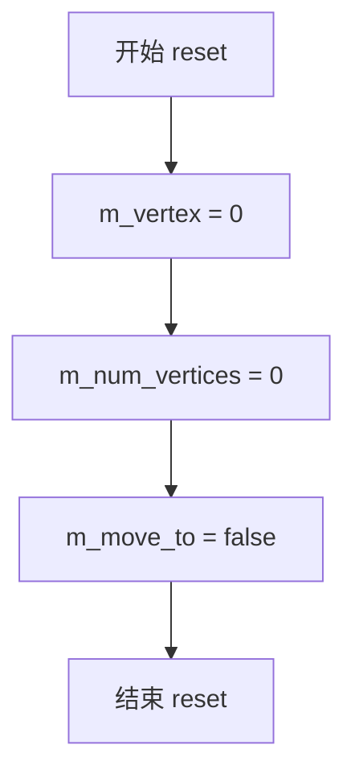
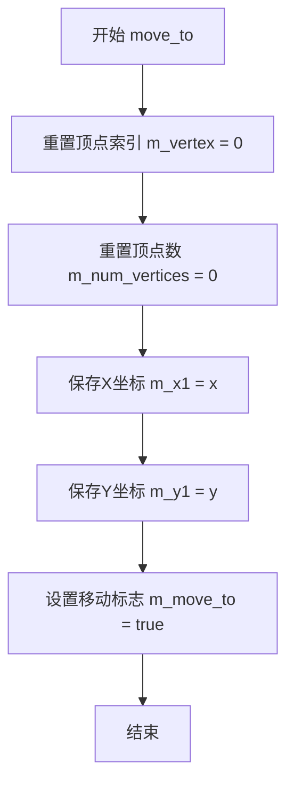
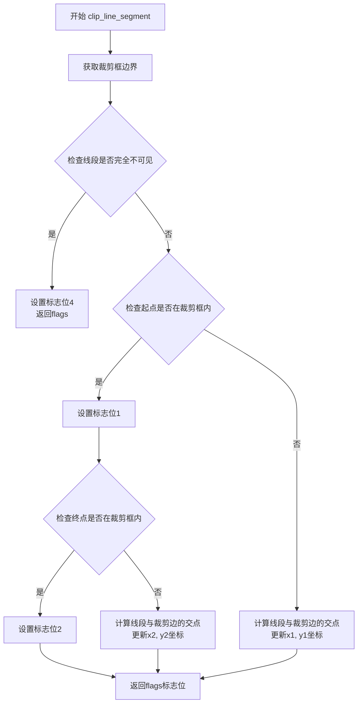
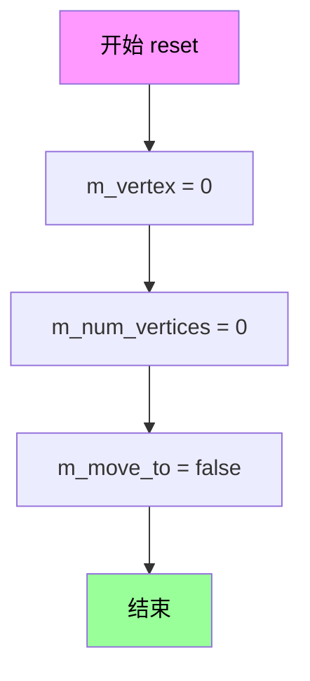
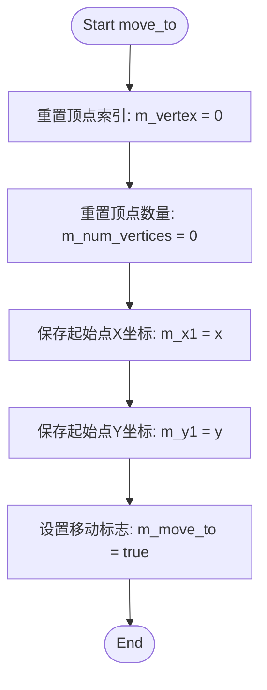

# `matplotlib\extern\agg24-svn\src\agg_vpgen_clip_polyline.cpp` 详细设计文档

Anti-Grain Geometry库中的裁剪多段线顶点生成器，实现了基于Liang-Barsky算法对多段线进行视锥裁剪的核心功能，支持move_to和line_to命令的坐标变换与顶点输出。

## 整体流程

```mermaid
graph TD
    A[开始] --> B[调用move_to(x,y)]
    B --> C[设置起点坐标 m_x1, m_y1]
    C --> D[标记m_move_to = true]
    D --> E[调用line_to(x,y)]
    E --> F[调用clip_line_segment裁剪线段]
    F --> G{裁剪结果flags}
    G -->|需要绘制--> H[保存顶点到数组]
    G -->|完全裁切掉--> I[跳过]
    H --> J[调用vertex()获取顶点]
    J --> K{是否还有顶点?}
    K -->|是 --> L[返回顶点坐标和命令]
    K -->|否 --> M[返回path_cmd_stop]
```

## 类结构

```
vpgen_clip_polyline (裁剪多段线生成器)
├── 继承自: vpgen_clip_polyline_base (隐式基类)
└── 依赖: clip_liang_barsky (裁剪算法)
```

## 全局变量及字段


### `vpgen_clip_polyline.m_vertex`
    
当前顶点索引

类型：`int`
    


### `vpgen_clip_polyline.m_num_vertices`
    
顶点总数

类型：`int`
    


### `vpgen_clip_polyline.m_move_to`
    
是否需要执行move_to命令

类型：`bool`
    


### `vpgen_clip_polyline.m_x1`
    
线段起点X坐标

类型：`double`
    


### `vpgen_clip_polyline.m_y1`
    
线段起点Y坐标

类型：`double`
    


### `vpgen_clip_polyline.m_x`
    
输出顶点X坐标数组

类型：`double[2]`
    


### `vpgen_clip_polyline.m_y`
    
输出顶点Y坐标数组

类型：`double[2]`
    


### `vpgen_clip_polyline.m_cmd`
    
路径命令数组

类型：`path_cmd[2]`
    


### `vpgen_clip_polyline.m_clip_box`
    
裁剪框

类型：`pod_array<double>`
    
    

## 全局函数及方法


### `vpgen_clip_polyline::reset()`

该方法用于重置多边形裁剪生成器的内部状态，将顶点计数器、顶点数量和移动标志复位为初始值，为新一轮顶点生成做好准备。

参数：

- （无参数）

返回值：`void`，无返回值描述

#### 流程图



#### 带注释源码

```cpp
//----------------------------------------------------------------------------
// Anti-Grain Geometry - Version 2.4
// Copyright (C) 2002-2005 Maxim Shemanarev (http://www.antigrain.com)
//
// Permission to copy, use, modify, sell and distribute this software 
// is granted provided this copyright notice appears in all copies. 
// This software is provided "as is" without express or implied
// warranty, and with no claim as to its suitability for any purpose.
//
//----------------------------------------------------------------------------
// Contact: mcseem@antigrain.com
//          mcseemagg@yahoo.com
//          http://www.antigrain.com
//----------------------------------------------------------------------------

#include "agg_vpgen_clip_polyline.h"
#include "agg_clip_liang_barsky.h"

namespace agg
{
    //----------------------------------------------------------------------------
    // 重置多边形裁剪生成器的内部状态
    //----------------------------------------------------------------------------
    void vpgen_clip_polyline::reset()
    {
        m_vertex = 0;         // 将当前顶点索引重置为0，表示从第一个顶点开始读取
        m_num_vertices = 0;   // 将已生成的顶点数重置为0，表示没有顶点可供读取
        m_move_to = false;   // 将移动标志重置为false，表示当前不在移动状态
    }
    // ... 其余代码省略
}
```


### `vpgen_clip_polyline::move_to`

该方法用于设置多边形的起点坐标，并将移动标志置为true，表示下一次操作将是移动到新起点。

参数：

- `x`：`double`，目标点的X坐标
- `y`：`double`，目标点的Y坐标

返回值：`void`，无返回值

#### 流程图



#### 带注释源码

```
//----------------------------------------------------------------------------
// 移动到指定坐标点，设置多边形的起点
//----------------------------------------------------------------------------
void vpgen_clip_polyline::move_to(double x, double y)
{
    m_vertex = 0;              // 重置顶点索引，从头开始遍历
    m_num_vertices = 0;        // 重置顶点数，清空之前缓存的顶点
    m_x1 = x;                  // 保存目标点的X坐标到内部变量
    m_y1 = y;                  // 保存目标点的Y坐标到内部变量
    m_move_to = true;          // 设置移动标志为true，表示需要执行move_to操作
}
```


### `vpgen_clip_polyline::line_to`

该方法接收线段端点坐标，通过 Liang-Barsky 裁剪算法对线段进行视窗裁剪，根据裁剪结果生成相应的路径命令（move_to 或 line_to），并将裁剪后的顶点数据存储到内部缓冲区，同时更新下一个线段的起始点。

参数：

- `x`：`double`，线段端点的 X 坐标
- `y`：`double`，线段端点的 Y 坐标

返回值：`void`，无返回值

#### 流程图

```mermaid
flowchart TD
    A[开始 line_to] --> B[保存端点坐标<br/>x2 = x, y2 = y]
    B --> C[调用 clip_line_segment<br/>裁剪线段]
    C --> D{flags & 4 == 0<br/>线段是否未被完全裁剪?}
    D -->|否| E[跳过顶点生成<br/>重置 m_vertex, m_num_vertices]
    D -->|是| F{flags & 1 != 0<br/>或 m_move_to?}
    F -->|是| G[生成 move_to 命令<br/>m_cmd[0] = path_cmd_move_to<br/>m_num_vertices = 1]
    F -->|否| H[跳过 move_to]
    G --> I[生成 line_to 命令<br/>添加端点]
    H --> I
    I --> J[更新 m_move_to 状态<br/>m_move_to = (flags & 2) != 0]
    J --> K[保存当前点为下一线段起点<br/>m_x1 = x, m_y1 = y]
    E --> K
    K --> L[结束]
```

#### 带注释源码

```cpp
//----------------------------------------------------------------------------
// 方法: vpgen_clip_polyline::line_to
// 描述: 接收线段端点，进行裁剪处理并生成相应的路径命令
// 参数:
//   x - 线段端点的 X 坐标
//   y - 线段端点的 Y 坐标
// 返回值: void
//----------------------------------------------------------------------------
void vpgen_clip_polyline::line_to(double x, double y)
{
    // 保存输入端点坐标到本地变量
    double x2 = x;
    double y2 = y;
    
    // 调用 Liang-Barsky 裁剪算法对线段进行裁剪
    // 返回flags标志位:
    //   bit 0 (1): 需要执行 move_to 操作
    //   bit 1 (2): 需要开始新的线段（相当于 move_to）
    //   bit 2 (4): 线段被完全裁剪（不可见）
    unsigned flags = clip_line_segment(&m_x1, &m_y1, &x2, &y2, m_clip_box);

    // 重置顶点索引和顶点计数，准备生成新的顶点数据
    m_vertex = 0;
    m_num_vertices = 0;
    
    // 检查线段是否未被完全裁剪
    if((flags & 4) == 0)
    {
        // 检查是否需要生成 move_to 命令
        // 条件: flags 包含 bit 0 (1) 或者之前标记了 m_move_to 为 true
        if((flags & 1) != 0 || m_move_to)
        {
            // 将裁剪后的起点存入顶点缓冲区
            m_x[0] = m_x1;
            m_y[0] = m_y1;
            // 设置路径命令为 move_to
            m_cmd[0] = path_cmd_move_to;
            // 顶点计数设为 1
            m_num_vertices = 1;
        }
        
        // 将裁剪后的终点添加到顶点缓冲区
        m_x[m_num_vertices] = x2;
        m_y[m_num_vertices] = y2;
        // 设置路径命令为 line_to
        m_cmd[m_num_vertices++] = path_cmd_line_to;
        
        // 更新 m_move_to 状态
        // 如果 flags 包含 bit 2 (2)，说明下一条线段需要从新点开始
        m_move_to = (flags & 2) != 0;
    }
    
    // 保存当前端点作为下一条线段的起始点
    m_x1 = x;
    m_y1 = y;
}
```


### `vpgen_clip_polyline::vertex`

该函数是多段线裁剪顶点生成器的核心方法，用于逐个返回裁剪后的顶点坐标及对应的路径命令。当缓冲区中有未遍历的顶点时，返回当前顶点并将索引递增；否则返回停止命令以表示顶点序列结束。

参数：

- `x`：`double*`，输出参数，指向用于存储返回顶点x坐标的内存位置
- `y`：`double*`，输出参数，指向用于存储返回顶点y坐标的内存位置

返回值：`unsigned`，返回当前顶点的路径命令类型（如 `path_cmd_move_to`、`path_cmd_line_to` 或 `path_cmd_stop`）

#### 流程图

```mermaid
flowchart TD
    A[开始 vertex 函数] --> B{m_vertex < m_num_vertices?}
    B -->|是| C[*x = m_x[m_vertex]]
    C --> D[*y = m_y[m_vertex]]
    D --> E[返回 m_cmd[m_vertex++]]
    E --> F[结束]
    B -->|否| G[返回 path_cmd_stop]
    G --> F
```

#### 带注释源码

```cpp
//----------------------------------------------------------------------------
// 顶点生成函数 - 逐个返回裁剪后的多段线顶点
// 参数:
//   x - 输出参数，返回顶点的x坐标
//   y - 输出参数，返回顶点的y坐标
// 返回值:
//   unsigned - 路径命令：move_to, line_to 或 stop
//----------------------------------------------------------------------------
unsigned vpgen_clip_polyline::vertex(double* x, double* y)
{
    // 检查是否还有未返回的顶点
    if(m_vertex < m_num_vertices)
    {
        // 从顶点缓冲区取出当前顶点的坐标
        *x = m_x[m_vertex];
        *y = m_y[m_vertex];
        
        // 返回对应的路径命令，并递增顶点索引以准备下一次调用
        return m_cmd[m_vertex++];
    }
    
    // 所有顶点已返回完毕，返回停止命令
    return path_cmd_stop;
}
```


### `clip_line_segment`

该函数是线段裁剪算法（Liang-Barsky算法）的实现，用于判断输入的线段（由(x1,y1)到(x2,y2)）与裁剪矩形的关系，并根据裁剪框修改线段端点坐标，同时返回表示线段与裁剪框位置关系的标志位。

参数：

- `x1`：`double*`，指向线段起点X坐标的指针，函数可能根据裁剪结果修改该值
- `y1`：`double*`，指向线段起点Y坐标的指针，函数可能根据裁剪结果修改该值
- `x2`：`double*`，指向线段终点X坐标的指针，函数会根据裁剪结果修改该值为裁剪后的坐标
- `y2`：`double*`，指向线段终点Y坐标的指针，函数会根据裁剪结果修改该值为裁剪后的坐标
- `clip_box`：`const rect&`，裁剪矩形的常量引用，包含裁剪区域的边界信息

返回值：`unsigned`，返回表示线段与裁剪框关系的标志位，通常包含以下位的组合：
- 位0（值1）：表示线段起点在裁剪框内
- 位1（值2）：表示线段终点在裁剪框内
- 位2（值4）：表示线段完全在裁剪框外（不可见）

#### 流程图



#### 带注释源码

```cpp
//----------------------------------------------------------------------------
// Line segment clipping function using Liang-Barsky algorithm
// Parameters:
//   x1, y1 - Input/output pointers to line start coordinates
//   x2, y2 - Input/output pointers to line end coordinates (will be modified)
//   clip_box - Const reference to clipping rectangle
// Returns:
//   unsigned flags indicating the clipping result:
//     bit 0 (1): start point is inside the clip box
//     bit 1 (2): end point is inside the clip box
//     bit 2 (4): line segment is completely outside (invisible)
//----------------------------------------------------------------------------
unsigned clip_line_segment(double* x1, double* y1, double* x2, double* y2, const rect& clip_box)
{
    // Implementation is in agg_clip_liang_barsky.h
    // This function performs parametric line clipping:
    // For a line segment from (x1,y1) to (x2,y2), it calculates
    // the intersection with the clipping rectangle boundaries
    // and modifies the coordinates in-place based on the clipping result.
    
    // The algorithm uses the parametric form:
    // x = x1 + dx * t
    // y = y1 + dy * t
    // where 0 <= t <= 1
    
    // For each clipping boundary, calculate the entry and exit parameters
    // and determine if the line segment is visible or needs to be clipped
}
```


### `vpgen_clip_polyline.reset()`

该方法用于重置顶点生成器的内部状态，将顶点索引、顶点计数器和移动标志复位，为开始新的多段线绘制做好准备。

参数： 无

返回值：`void`，无返回值描述

#### 流程图



#### 带注释源码

```cpp
//----------------------------------------------------------------------------
// Anti-Grain Geometry - Version 2.4
// 版权 (C) 2002-2005 Maxim Shemanarev (http://www.antigrain.com)
//
// 授权说明：本软件可自由拷贝、使用、修改、销售，但需保留本版权声明。
// 本软件按"原样"提供，不提供任何明示或暗示的担保。
//----------------------------------------------------------------------------

#include "agg_vpgen_clip_polyline.h"
#include "agg_clip_liang_barsky.h"

namespace agg
{
    //---------------------------------------------------------------------------
    // 重置顶点生成器状态
    // 功能：将内部状态变量复位，为处理新的多段线做准备
    //---------------------------------------------------------------------------
    void vpgen_clip_polyline::reset()
    {
        // 重置当前顶点索引，指向顶点数组起始位置
        m_vertex = 0;
        
        // 重置顶点数量计数，表示当前没有待输出的顶点
        m_num_vertices = 0;
        
        // 重置移动标志，表示尚未遇到移动到命令
        m_move_to = false;
    }
}
```


### `vpgen_clip_polyline.move_to`

该方法用于设置多段线（Polyline）的起始点坐标，重置内部顶点计数器和状态，准备接收后续的线段点，并标记下一条线段起点需要执行“移动到”（MoveTo）操作。

参数：
- `x`：`double`，目标起始点的 X 坐标
- `y`：`double`，目标起始点的 Y 坐标

返回值：`void`，无返回值

#### 流程图



#### 带注释源码

```cpp
    //----------------------------------------------------------------------------
    // 设置多段线的起点
    //----------------------------------------------------------------------------
    void vpgen_clip_polyline::move_to(double x, double y)
    {
        m_vertex = 0;        // 重置顶点索引，准备重新输出顶点
        m_num_vertices = 0;  // 重置顶点数量，缓冲区为空
        m_x1 = x;            // 记录当前线段的起始点 X 坐标
        m_y1 = y;            // 记录当前线段的起始点 Y 坐标
        m_move_to = true;    // 标记下一次绘制线段时，首个顶点应为 MoveTo 命令
    }
```


### `vpgen_clip_polyline::line_to`

添加线段到多边形顶点生成器，并使用Liang-Barsky算法进行裁剪。该函数接收线段终点坐标，与之前存储的起点组成线段，进行裁剪处理后，将裁剪后的顶点添加到内部缓冲区。

参数：

- `x`：`double`，线段终点的x坐标
- `y`：`double`，线段终点的y坐标

返回值：`void`，无返回值

#### 流程图

```mermaid
flowchart TD
    A[开始 line_to] --> B[保存终点坐标<br/>x2 = x, y2 = y]
    B --> C[调用 clip_line_segment<br/>裁剪线段]
    C --> D{flags & 4 == 0<br/>线段未完全在外?}
    D -->|否| E[重置顶点索引<br/>m_vertex=0, m_num_vertices=0]
    E --> L[更新起点坐标<br/>m_x1=x, m_y1=y]
    L --> M[结束]
    D -->|是| F{flags & 1 != 0<br/>或 m_move_to<br/>需要添加move_to?}
    F -->|是| G[添加move_to命令<br/>m_x[0]=m_x1, m_y[0]=m_y1<br/>m_cmd[0]=path_cmd_move_to<br/>m_num_vertices=1]
    F -->|否| H[跳过move_to]
    G --> I[添加line_to命令<br/>m_x[m_num_vertices]=x2<br/>m_y[m_num_vertices]=y2<br/>m_cmd[m_num_vertices]=path_cmd_line_to<br/>m_num_vertices++]
    H --> I
    I --> J[更新m_move_to状态<br/>m_move_to = (flags & 2) != 0]
    J --> L
```

#### 带注释源码

```cpp
//----------------------------------------------------------------------------
// 添加线段并进行裁剪
//----------------------------------------------------------------------------
void vpgen_clip_polyline::line_to(double x, double y)
{
    // 保存传入的终点坐标到临时变量
    double x2 = x;
    double y2 = y;
    
    // 调用Liang-Barsky裁剪算法对线段进行裁剪
    // 参数: 起点指针, 终点指针, 裁剪框
    // 返回flags: 
    //   bit 0 (1): 起点在裁剪框内
    //   bit 1 (2): 线段被裁剪分段(需要新的move_to)
    //   bit 2 (4): 线段完全在裁剪框外(不可见)
    unsigned flags = clip_line_segment(&m_x1, &m_y1, &x2, &y2, m_clip_box);

    // 重置顶点读取位置
    m_vertex = 0;
    m_num_vertices = 0;
    
    // 检查线段是否可见(未完全在裁剪区外)
    if((flags & 4) == 0)
    {
        // 判断是否需要添加move_to命令:
        // 1. flags & 1 != 0 表示裁剪后起点在裁剪框内
        // 2. m_move_to 为true表示之前有过move_to(处理连续线段)
        if((flags & 1) != 0 || m_move_to)
        {
            // 将裁剪后的起点添加到顶点缓冲区
            m_x[0] = m_x1;
            m_y[0] = m_y1;
            m_cmd[0] = path_cmd_move_to;
            m_num_vertices = 1;
        }
        
        // 将裁剪后的终点添加到顶点缓冲区
        m_x[m_num_vertices] = x2;
        m_y[m_num_vertices] = y2;
        m_cmd[m_num_vertices++] = path_cmd_line_to;
        
        // 更新m_move_to状态:
        // flags & 2 != 0 表示线段被裁剪分段,下一次需要新的move_to
        m_move_to = (flags & 2) != 0;
    }
    
    // 更新内部存储的起点坐标,为下一条线段做准备
    m_x1 = x;
    m_y1 = y;
}
```


### `vpgen_clip_polyline.vertex`

该函数是裁剪多段线顶点生成器的核心方法，用于逐个获取经过裁剪处理后的顶点数据。它通过内部顶点索引遍历已存储的裁剪结果队列，返回当前顶点坐标并将索引递增，若所有顶点已遍历完毕则返回停止命令。

参数：

- `x`：`double*`，输出参数，指向用于存储顶点x坐标的double型指针
- `y`：`double*`，输出参数，指向用于存储顶点y坐标的double型指针

返回值：`unsigned`，返回路径命令标识符（如 `path_cmd_move_to`、`path_cmd_line_to` 或 `path_cmd_stop`），用于指示当前返回顶点的类型和是否继续读取

#### 流程图

```mermaid
flowchart TD
    A[开始 vertex] --> B{检查 m_vertex < m_num_vertices?}
    B -->|是| C[获取 m_x[m_vertex] 存入 *x]
    C --> D[获取 m_y[m_vertex] 存入 *y]
    D --> E[获取 m_cmd[m_vertex] 作为返回值]
    E --> F[m_vertex 递增]
    F --> G[返回命令码]
    B -->|否| H[返回 path_cmd_stop]
    G --> I[结束]
    H --> I
```

#### 带注释源码

```cpp
//----------------------------------------------------------------------------
// 获取下一个裁剪后的顶点
//----------------------------------------------------------------------------
unsigned vpgen_clip_polyline::vertex(double* x, double* y)
{
    // 检查当前顶点索引是否在已存储顶点的有效范围内
    if(m_vertex < m_num_vertices)
    {
        // 从内部顶点数组中取出当前索引对应的x坐标
        *x = m_x[m_vertex];
        // 从内部顶点数组中取出当前索引对应的y坐标
        *y = m_y[m_vertex];
        // 返回当前顶点的路径命令（move_to 或 line_to），并将索引递增
        return m_cmd[m_vertex++];
    }
    // 若所有顶点已遍历完毕，返回停止命令
    return path_cmd_stop;
}
```


## 关键组件


### vpgen_clip_polyline 类

vpgen_clip_polyline 类是 Anti-Grain Geometry 库中的多段线顶点生成器，核心功能是实现多段线的视口裁剪。该类接收线段端点坐标，通过 Liang-Barsky 算法计算线段与裁剪框的交集，并按需生成 move_to 和 line_to 命令序列。

### reset() 方法

重置内部状态，将顶点索引和计数归零，并重置移动标志。

### move_to(double x, double y) 方法

设置多段线的起点坐标，将输入坐标存储为线段起点，同时重置内部顶点状态并标记需要执行 move_to 命令。

### line_to(double x, double y) 方法

添加新线段端点并执行裁剪计算，通过 clip_line_segment 函数检测线段与裁剪框的位置关系，根据标志位决定是否将线段端点写入顶点缓存，同时处理裁剪后的 move_to 和 line_to 命令生成。

### vertex(double* x, double* y) 方法

迭代器模式实现，按顺序返回缓存中的裁剪后顶点坐标和对应命令，遍历完成后返回 path_cmd_stop 信号。

### clip_line_segment() 外部函数

Liang-Barsky 线段裁剪算法的外部封装函数，输入线段两端点指针和裁剪框，返回包含裁剪结果的标志位组合。

### m_x, m_y, m_cmd 顶点缓存数组

存储裁剪后的顶点坐标数组和对应的路径命令数组，用于缓存 line_to 方法产生的中间结果，供 vertex 方法后续遍历输出。

### m_x1, m_y1 起点坐标

记录当前线段的起点坐标，在 line_to 调用时与新端点组成线段进行裁剪计算，并在处理完成后更新为当前端点。

### m_clip_box 裁剪框

定义视口矩形的边界坐标，clip_line_segment 函数使用此裁剪框判断线段的可见部分。

### m_vertex, m_num_vertices 顶点索引状态

m_vertex 追踪 vertex 方法的当前读取位置，m_num_vertices 记录缓存中有效顶点的数量，共同控制裁剪结果的迭代输出。

### m_move_to 移动标志

布尔标志，表示在当前裁剪线段之前是否需要插入 path_cmd_move_to 命令，用于处理线段被完全裁剪后新线段开始的场景。


## 问题及建议


### 已知问题

- **数组边界风险**：`m_x`、`m_y`、`m_cmd` 数组的使用没有边界检查，当顶点数量超过数组容量时可能导致内存越界访问或数据覆盖
- **重复代码**：`reset()` 和 `move_to()` 方法中均包含 `m_vertex = 0; m_num_vertices = 0;` 的重复赋值
- **缺少裁剪框初始化**：成员变量 `m_clip_box` 在代码中未显示初始化，可能导致未定义行为
- **输入验证缺失**：`move_to` 和 `line_to` 方法未对输入坐标的有效性进行检查（如 NaN、无穷大值）
- **变量命名混淆**：成员变量 `m_x1`、`m_y1` 与 `line_to` 中的局部变量 `x2`、`y2` 命名不清晰，容易造成理解上的歧义
- **设计耦合**：依赖特定的调用序列（必须先 `move_to` 再 `line_to`），缺乏状态校验机制

### 优化建议

- 添加数组大小常量并在使用前进行边界检查，防止缓冲区溢出
- 抽取重复代码到私有辅助方法中，或在 `reset()` 中统一初始化逻辑
- 在构造函数或专门的初始化方法中显式设置 `m_clip_box` 的默认值
- 增加输入参数校验，处理非法坐标值的情况
- 改进变量命名（如 `m_prev_x`、`m_prev_y` 或 `m_start_x`、`m_start_y`）以提高可读性
- 添加状态机或断言来验证正确的调用顺序，增强接口的健壮性
- 考虑使用模板参数或配置类来支持不同的数组大小配置，提高类的通用性


## 其它


### 设计目标与约束

本模块的设计目标是实现对多边形线段的高效裁剪功能，在保持几何精度的情况下将线段限制在指定的裁剪矩形范围内。核心约束包括：仅支持矩形裁剪区域，不支持任意多边形裁剪；输入坐标类型为 double，以支持高精度几何计算；输出顶点顺序保持与输入一致，不进行重排序或简化处理。

### 错误处理与异常设计

本模块采用无异常设计模式，不抛出任何异常。错误处理通过返回值和状态标志实现：
- `clip_line_segment()` 函数返回裁剪标志，通过位掩码表示线段与裁剪框的相对位置关系
- `vertex()` 方法在线索用尽时返回 `path_cmd_stop` 作为结束信号
- 无效输入（如 NaN 或无穷大坐标）可能导致未定义行为，调用方需确保输入有效性

### 数据流与状态机

模块采用状态机模式管理绘制流程：
1. **初始状态**：调用 `reset()` 后处于初始状态，`m_vertex=0`, `m_num_vertices=0`, `m_move_to=false`
2. **移动状态**：调用 `move_to()` 设置起点坐标，标记 `m_move_to=true`
3. **线段绘制状态**：调用 `line_to()` 处理每个线段顶点，根据裁剪结果填充内部顶点缓冲区
4. **顶点输出状态**：调用 `vertex()` 逐个检索处理后的顶点序列

### 外部依赖与接口契约

**头文件依赖**：
- `agg_vpgen_clip_polyline.h`：类声明和基类定义
- `agg_clip_liang_barsky.h`：`clip_line_segment()` 函数，实现 Liang-Barsky 裁剪算法
- `agg_basics.h`：基础类型定义和路径命令枚举

**接口契约**：
- 调用方必须在 `move_to()` 之后才能调用 `line_to()`
- `line_to()` 可连续调用多次构建折线
- `vertex()` 必须在完成所有 `line_to()` 调用后调用
- 单次 `vertex()` 调用序列只能使用一次，中途不得混入 `move_to()` 或 `line_to()`

### 性能考虑

本模块针对性能进行了以下优化：
- 栈上分配小规模顶点缓冲区（固定长度数组），避免动态内存分配
- 裁剪算法采用整数优化的 Liang-Barsky 变体
- 状态标志使用位操作而非布尔标志位
- 无虚拟函数调用，保持内联优化可能

### 线程安全性

本模块非线程安全。`vpgen_clip_polyline` 实例包含内部状态，多线程环境下需为每个线程分配独立实例或使用外部同步机制。

### 内存管理

所有内存管理采用值语义：
- 成员变量 `m_x[2]`, `m_y[2]`, `m_cmd[2]` 为固定大小数组，无需释放
- 无动态内存分配，无资源泄漏风险
- 裁剪框 `m_clip_box` 为聚合类型，按值传递和存储

### 配置与参数

**裁剪框配置**：
- `m_clip_box`：类型为 `rect`，通过成员变量直接访问设置
- 裁剪框坐标系需与输入坐标一致

**内部缓冲区配置**：
- 顶点缓冲区大小固定为 2（`m_x[2]`, `m_y[2]`, `m_cmd[2]`），仅能存储当前线段端点

### 测试策略建议

- **单元测试**：验证各种裁剪场景（完全在裁剪区内、完全在区外、部分相交）
- **边界测试**：线段端点恰好在裁剪边框上、裁剪框为零宽度/高度
- **连续性测试**：验证多个连续 `line_to()` 调用的输出序列正确性

### 许可证与法律信息

本代码继承自 Anti-Grain Geometry 项目，使用 MIT 许可证（原始代码注释中明确）。代码可自由复制、使用、修改和分发，无需开源衍生代码（但需保留版权声明）。

### 参考文献与资源

- Anti-Grain Geometry 官方文档：http://www.antigrain.com
- Liang-Barsky 裁剪算法：经典直线裁剪算法，适合矩形裁剪区域
- 本模块属于 AGG 的顶点生成器（Vertex Generator）组件系列


    