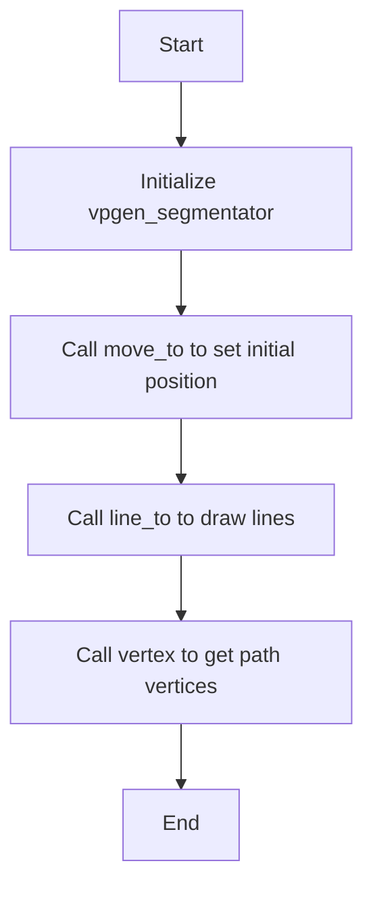
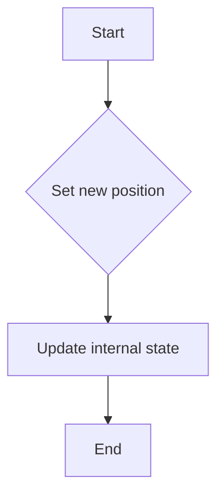
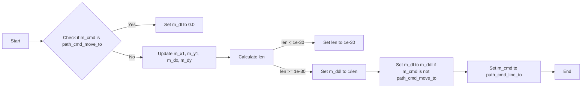
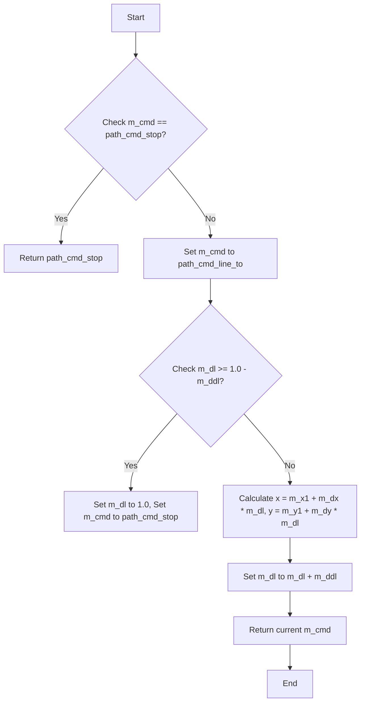
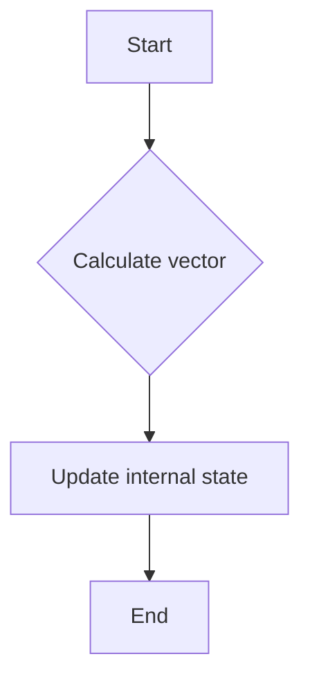
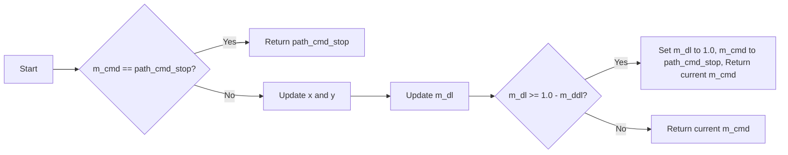

# `matplotlib\extern\agg24-svn\src\agg_vpgen_segmentator.cpp` 详细设计文档

The code defines a class `vpgen_segmentator` that handles the generation of vector graphics paths. It manages the movement and line drawing commands for a path, and provides a method to retrieve vertices of the path.

## 整体流程



## 类结构

```
vpgen_segmentator
```

## 全局变量及字段


### `m_x1`
    
Current x-coordinate of the vertex in the path.

类型：`double`
    


### `m_y1`
    
Current y-coordinate of the vertex in the path.

类型：`double`
    


### `m_dx`
    
Change in x-coordinate for the next segment in the path.

类型：`double`
    


### `m_dy`
    
Change in y-coordinate for the next segment in the path.

类型：`double`
    


### `m_dl`
    
Distance along the current segment to the next vertex.

类型：`double`
    


### `m_ddl`
    
Inverse of the length of the current segment.

类型：`double`
    


### `m_cmd`
    
Current command state of the path (e.g., move_to, line_to).

类型：`unsigned`
    


### `vpgen_segmentator.m_x1`
    
Current x-coordinate of the vertex in the path.

类型：`double`
    


### `vpgen_segmentator.m_y1`
    
Current y-coordinate of the vertex in the path.

类型：`double`
    


### `vpgen_segmentator.m_dx`
    
Change in x-coordinate for the next segment in the path.

类型：`double`
    


### `vpgen_segmentator.m_dy`
    
Change in y-coordinate for the next segment in the path.

类型：`double`
    


### `vpgen_segmentator.m_dl`
    
Distance along the current segment to the next vertex.

类型：`double`
    


### `vpgen_segmentator.m_ddl`
    
Inverse of the length of the current segment.

类型：`double`
    


### `vpgen_segmentator.m_cmd`
    
Current command state of the path (e.g., move_to, line_to).

类型：`unsigned`
    
    

## 全局函数及方法


### vpgen_segmentator::move_to

移动到路径上的新位置。

参数：

- `x`：`double`，新位置的x坐标。
- `y`：`double`，新位置的y坐标。

返回值：`void`，无返回值。

#### 流程图



#### 带注释源码

```cpp
void vpgen_segmentator::move_to(double x, double y)
{
    m_x1 = x; // Set the starting x coordinate of the path
    m_y1 = y; // Set the starting y coordinate of the path
    m_dx = 0.0; // Reset the change in x coordinate
    m_dy = 0.0; // Reset the change in y coordinate
    m_dl = 2.0; // Set the line length approximation
    m_ddl = 2.0; // Set the inverse of the line length approximation
    m_cmd = path_cmd_move_to; // Set the command to move to
}
```


### vpgen_segmentator::line_to

The `line_to` method of the `vpgen_segmentator` class is used to draw a line segment from the current point to the specified point `(x, y)` in the path.

参数：

- `x`：`double`，The x-coordinate of the endpoint of the line segment.
- `y`：`double`，The y-coordinate of the endpoint of the line segment.

返回值：`void`，This method does not return a value.

#### 流程图



#### 带注释源码

```cpp
void vpgen_segmentator::line_to(double x, double y)
{
    m_x1 += m_dx;
    m_y1 += m_dy;
    m_dx  = x - m_x1;
    m_dy  = y - m_y1;
    double len = sqrt(m_dx * m_dx + m_dy * m_dy) * m_approximation_scale;
    if(len < 1e-30) len = 1e-30;
    m_ddl = 1.0 / len;
    m_dl  = (m_cmd == path_cmd_move_to) ? 0.0 : m_ddl;
    if(m_cmd == path_cmd_stop) m_cmd = path_cmd_line_to;
}
```


### vertex

`vpgen_segmentator::vertex` is a method of the `vpgen_segmentator` class that generates a vertex of a path.

参数：

- `x`：`double*`，A pointer to a double where the x-coordinate of the vertex will be stored.
- `y`：`double*`，A pointer to a double where the y-coordinate of the vertex will be stored.

返回值：`unsigned`，The command type of the vertex generated. It can be `path_cmd_stop` if the path has ended, or other path command types.

#### 流程图



#### 带注释源码

```cpp
unsigned vpgen_segmentator::vertex(double* x, double* y)
{
    if(m_cmd == path_cmd_stop) return path_cmd_stop;

    unsigned cmd = m_cmd;
    m_cmd = path_cmd_line_to;
    if(m_dl >= 1.0 - m_ddl)
    {
        m_dl = 1.0;
        m_cmd = path_cmd_stop;
        *x = m_x1 + m_dx;
        *y = m_y1 + m_dy;
        return cmd;
    }
    *x = m_x1 + m_dx * m_dl;
    *y = m_y1 + m_dy * m_dl;
    m_dl += m_ddl;
    return cmd;
}
``` 


### vpgen_segmentator::move_to

移动到路径上的新位置。

参数：

- `x`：`double`，新位置的x坐标。
- `y`：`double`，新位置的y坐标。

返回值：`void`，无返回值。

#### 流程图


#### 带注释源码

```cpp
void vpgen_segmentator::move_to(double x, double y)
{
    m_x1 = x; // Set the starting x coordinate of the path
    m_y1 = y; // Set the starting y coordinate of the path
    m_dx = 0.0; // Reset the change in x coordinate
    m_dy = 0.0; // Reset the change in y coordinate
    m_dl = 2.0; // Set the line length approximation
    m_ddl = 2.0; // Set the inverse of the line length approximation
    m_cmd = path_cmd_move_to; // Set the command to move to
}
```


### vpgen_segmentator::line_to

This function moves the current point to a new location in the path by calculating the vector from the current point to the new point and updating the internal state accordingly.

参数：

- `x`：`double`，The x-coordinate of the new point.
- `y`：`double`，The y-coordinate of the new point.

返回值：`void`，This function does not return a value.

#### 流程图



#### 带注释源码

```cpp
void vpgen_segmentator::line_to(double x, double y)
{
    m_x1 += m_dx;
    m_y1 += m_dy;
    m_dx  = x - m_x1;
    m_dy  = y - m_y1;
    double len = sqrt(m_dx * m_dx + m_dy * m_dy) * m_approximation_scale;
    if(len < 1e-30) len = 1e-30;
    m_ddl = 1.0 / len;
    m_dl  = (m_cmd == path_cmd_move_to) ? 0.0 : m_ddl;
    if(m_cmd == path_cmd_stop) m_cmd = path_cmd_line_to;
}
```


### vpgen_segmentator.vertex

This function generates a vertex for a path in the Anti-Grain Geometry library. It calculates the next vertex based on the current position and direction, and updates the internal state accordingly.

参数：

- `x`：`double*`，A pointer to a double where the x-coordinate of the vertex will be stored.
- `y`：`double*`，A pointer to a double where the y-coordinate of the vertex will be stored.

返回值：`unsigned`，The command type of the vertex generated, which can be one of the path command types defined in the library.

#### 流程图



#### 带注释源码

```cpp
unsigned vpgen_segmentator::vertex(double* x, double* y)
{
    if(m_cmd == path_cmd_stop) return path_cmd_stop;

    unsigned cmd = m_cmd;
    m_cmd = path_cmd_line_to;
    if(m_dl >= 1.0 - m_ddl)
    {
        m_dl = 1.0;
        m_cmd = path_cmd_stop;
        *x = m_x1 + m_dx;
        *y = m_y1 + m_dy;
        return cmd;
    }
    *x = m_x1 + m_dx * m_dl;
    *y = m_y1 + m_dy * m_dl;
    m_dl += m_ddl;
    return cmd;
}
```


## 关键组件


### 张量索引与惰性加载

用于在处理几何路径时，延迟计算路径段，直到需要时才进行计算，从而提高性能。

### 反量化支持

允许在处理几何路径时，对坐标进行反量化处理，以适应不同的分辨率和缩放。

### 量化策略

定义了如何将浮点坐标转换为整数坐标的策略，以适应硬件和渲染器的精度要求。


## 问题及建议


### 已知问题

-   **代码注释不足**：代码中缺少详细的注释，难以理解每个变量和函数的作用，这可能会影响代码的可维护性和可读性。
-   **全局变量使用**：`m_approximation_scale` 作为全局变量使用，这可能导致代码的可测试性和可重用性降低，因为它依赖于外部状态。
-   **潜在的性能问题**：在 `vertex` 方法中，计算 `len` 和 `m_ddl` 的过程中，使用了 `sqrt` 函数，这可能会对性能产生负面影响，尤其是在处理大量数据时。

### 优化建议

-   **添加注释**：为代码添加详细的注释，解释每个变量和函数的作用，以及算法的流程。
-   **避免全局变量**：将 `m_approximation_scale` 移动到类中，作为成员变量，以便更好地控制其状态。
-   **优化数学运算**：考虑使用更高效的数学运算方法来替代 `sqrt` 函数，例如使用近似算法或查找表。
-   **代码重构**：考虑将 `vpgen_segmentator` 类的职责分解到更小的类中，以提高代码的模块化和可测试性。
-   **单元测试**：编写单元测试来验证 `vpgen_segmentator` 类的每个方法，确保代码的正确性和稳定性。


## 其它


### 设计目标与约束

- 设计目标：实现一个高效的路径生成器，用于将矢量路径转换为线段。
- 约束条件：保持代码的简洁性和可维护性，同时确保算法的准确性和性能。

### 错误处理与异常设计

- 错误处理：代码中未明确显示错误处理机制，但应考虑在输入参数异常时抛出异常。
- 异常设计：定义自定义异常类，用于处理路径生成过程中可能出现的错误。

### 数据流与状态机

- 数据流：输入路径数据，通过`move_to`和`line_to`方法生成线段，并通过`vertex`方法输出线段顶点。
- 状态机：`vpgen_segmentator`类内部维护一个状态机，用于跟踪路径生成过程中的当前状态。

### 外部依赖与接口契约

- 外部依赖：依赖于`<math.h>`库中的数学函数。
- 接口契约：`vpgen_segmentator`类提供了一系列接口方法，用于处理路径生成过程。

### 测试用例

- 测试用例：编写单元测试，验证`move_to`、`line_to`和`vertex`方法的功能和性能。

### 性能分析

- 性能分析：评估路径生成算法的时间复杂度和空间复杂度，确保算法在处理大量数据时仍能保持高效。

### 安全性考虑

- 安全性考虑：确保输入数据的有效性，防止潜在的缓冲区溢出等安全问题。

### 维护与扩展

- 维护：定期审查代码，确保代码质量和性能。
- 扩展：考虑将算法扩展到支持更复杂的路径生成需求，如贝塞尔曲线等。


    