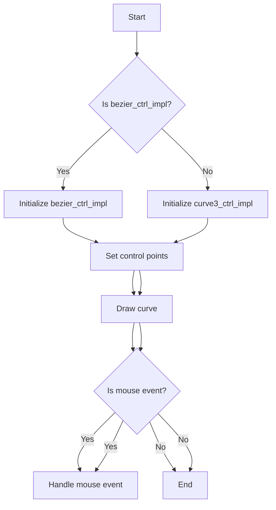
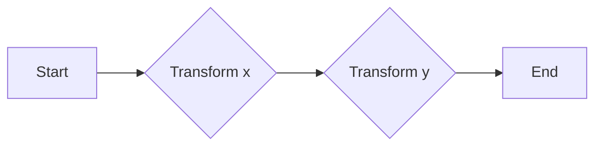
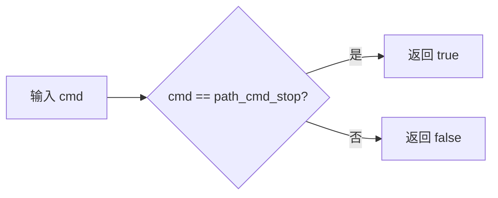
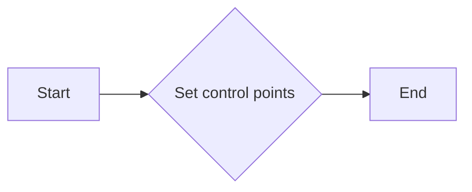
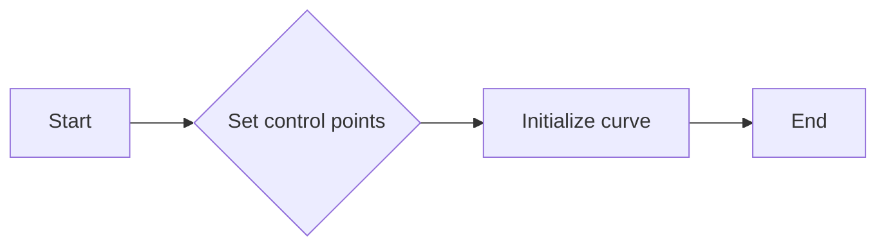
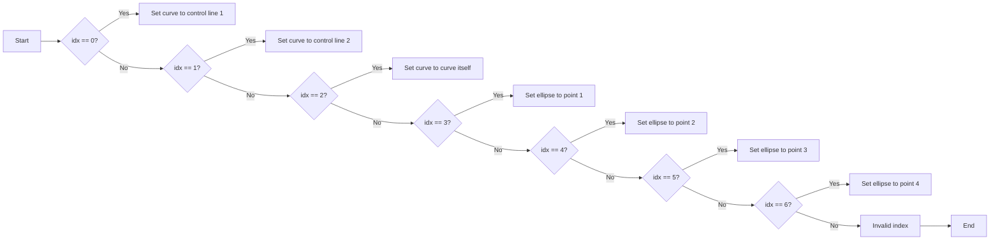
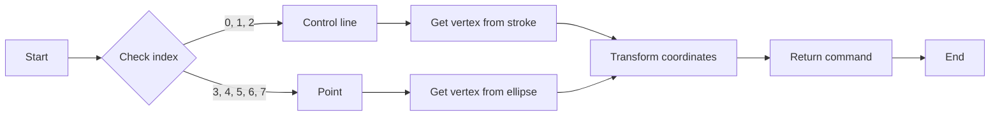
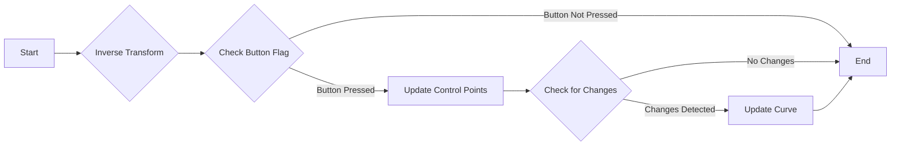
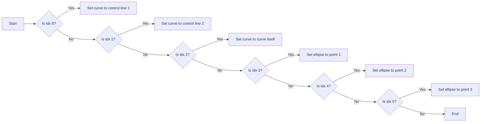
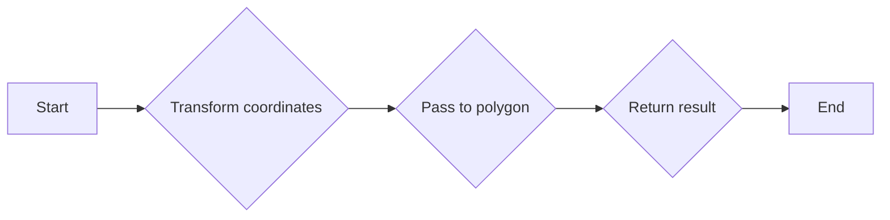

# `matplotlib\extern\agg24-svn\src\ctrl\agg_bezier_ctrl.cpp` 详细设计文档

This code defines two classes, bezier_ctrl_impl and curve3_ctrl_impl, which are used for manipulating and rendering Bezier curves. They provide methods to set control points, draw curves, and handle mouse events.

## 整体流程



## 类结构

```
agg::bezier_ctrl_impl
├── agg::curve3_ctrl_impl
│   ├── agg::ctrl
│   ├── agg::curve
│   ├── agg::polyline
│   ├── agg::ellipse
│   └── agg::path_cmd
```

## 全局变量及字段


### `scale`
    
Scale factor for curve approximation.

类型：`double`
    


### `point_radius`
    
Radius for point rendering in the ellipse class.

类型：`double`
    


### `bezier_ctrl_impl.ctrl`
    
Control point object for managing control points.

类型：`agg::ctrl_point`
    


### `bezier_ctrl_impl.m_stroke`
    
Curve object for stroke operations.

类型：`agg::curve3`
    


### `bezier_ctrl_impl.m_poly`
    
Polyline object for managing polygonal control points.

类型：`agg::polyline`
    


### `bezier_ctrl_impl.m_idx`
    
Index for selecting the current control point or curve segment.

类型：`unsigned`
    


### `curve3_ctrl_impl.ctrl`
    
Control point object for managing control points.

类型：`agg::ctrl_point`
    


### `curve3_ctrl_impl.m_stroke`
    
Curve object for stroke operations.

类型：`agg::curve3`
    


### `curve3_ctrl_impl.m_poly`
    
Polyline object for managing polygonal control points.

类型：`agg::polyline`
    


### `curve3_ctrl_impl.m_idx`
    
Index for selecting the current control point or curve segment.

类型：`unsigned`
    
    

## 全局函数及方法


### bezier_ctrl_impl::inverse_transform_xy

Transforms the coordinates from the user space to the internal space of the bezier control.

参数：

- `x`：`double*`，A pointer to the x-coordinate to be transformed.
- `y`：`double*`，A pointer to the y-coordinate to be transformed.

返回值：`void`，No return value.

#### 流程图



#### 带注释源码

```cpp
bool bezier_ctrl_impl::on_mouse_button_down(double x, double y)
{
    inverse_transform_xy(&x, &y);
    return m_poly.on_mouse_button_down(x, y);
}

bool bezier_ctrl_impl::on_mouse_move(double x, double y, bool button_flag)
{
    inverse_transform_xy(&x, &y);
    return m_poly.on_mouse_move(x, y, button_flag);
}

bool bezier_ctrl_impl::on_mouse_button_up(double x, double y)
{
    return m_poly.on_mouse_button_up(x, y);
}

// ... (inverse_transform_xy function definition is not shown here)
```

Note: The actual implementation of `inverse_transform_xy` is not provided in the given code snippet, so the source code is not included. The function is assumed to be defined elsewhere in the codebase.


### bezier_ctrl_impl::transform_xy

Transforms the coordinates of a point.

参数：

- `x`：`double*`，The pointer to the x-coordinate of the point to be transformed.
- `y`：`double*`，The pointer to the y-coordinate of the point to be transformed.

返回值：`void`，No return value.

#### 流程图


#### 带注释源码

```cpp
void bezier_ctrl_impl::transform_xy(double* x, double* y)
{
    // Transform the x-coordinate
    *x = (*x - m_poly.xn(m_idx)) * scale() + m_poly.xn(m_idx);
    // Transform the y-coordinate
    *y = (*y - m_poly.yn(m_idx)) * scale() + m_poly.yn(m_idx);
}
```


### is_stop

判断路径命令是否为停止命令。

参数：

- `cmd`：`unsigned`，路径命令

返回值：`bool`，如果命令为停止命令则返回`true`，否则返回`false`

#### 流程图



#### 带注释源码

```cpp
bool bezier_ctrl_impl::is_stop(unsigned cmd)
{
    return cmd == path_cmd_stop;
}
```


### bezier_ctrl_impl::curve

将贝塞尔曲线的控制点设置为新的值。

参数：

- `x1`：`double`，控制点1的x坐标
- `y1`：`double`，控制点1的y坐标
- `x2`：`double`，控制点2的x坐标
- `y2`：`double`，控制点2的y坐标
- `x3`：`double`，控制点3的x坐标
- `y3`：`double`，控制点3的y坐标
- `x4`：`double`，控制点4的x坐标
- `y4`：`double`，控制点4的y坐标

返回值：`void`，无返回值

#### 流程图



#### 带注释源码

```cpp
void bezier_ctrl_impl::curve(double x1, double y1, 
                             double x2, double y2, 
                             double x3, double y3,
                             double x4, double y4)
{
    m_poly.xn(0) = x1;
    m_poly.yn(0) = y1;
    m_poly.xn(1) = x2;
    m_poly.yn(1) = y2;
    m_poly.xn(2) = x3;
    m_poly.yn(2) = y3;
    m_poly.xn(3) = x4;
    m_poly.yn(3) = y4;
    curve();
}
```


### bezier_ctrl_impl::curve

This function sets the control points of a bezier curve and initializes the curve object.

参数：

- `x1`：`double`，The x-coordinate of the first control point.
- `y1`：`double`，The y-coordinate of the first control point.
- `x2`：`double`，The x-coordinate of the second control point.
- `y2`：`double`，The y-coordinate of the second control point.
- `x3`：`double`，The x-coordinate of the third control point.
- `y3`：`double`，The y-coordinate of the third control point.
- `x4`：`double`，The x-coordinate of the fourth control point.
- `y4`：`double`，The y-coordinate of the fourth control point.

返回值：`void`，No return value.

#### 流程图



#### 带注释源码

```cpp
void bezier_ctrl_impl::curve(double x1, double y1, 
                             double x2, double y2, 
                             double x3, double y3,
                             double x4, double y4)
{
    m_poly.xn(0) = x1;
    m_poly.yn(0) = y1;
    m_poly.xn(1) = x2;
    m_poly.yn(1) = y2;
    m_poly.xn(2) = x3;
    m_poly.yn(2) = y3;
    m_poly.xn(3) = x4;
    m_poly.yn(3) = y4;
    curve();
}
```


### bezier_ctrl_impl.rewind

Rewinds the bezier control points to a specific index, which can be a control line, curve itself, or a specific point.

参数：

- `idx`：`unsigned`，The index of the bezier control point to rewind to. It can be 0 (Control line 1), 1 (Control line 2), 2 (Curve itself), 3 (Point 1), 4 (Point 2), 5 (Point 3), or 6 (Point 4).

返回值：`void`，No return value.

#### 流程图



#### 带注释源码

```cpp
void bezier_ctrl_impl::rewind(unsigned idx)
{
    m_idx = idx;

    m_curve.approximation_scale(scale());
    switch(idx)
    {
    default:
    case 0:                 // Control line 1
        m_curve.init(m_poly.xn(0),  m_poly.yn(0), 
                    (m_poly.xn(0) + m_poly.xn(1)) * 0.5,
                    (m_poly.yn(0) + m_poly.yn(1)) * 0.5,
                    (m_poly.xn(0) + m_poly.xn(1)) * 0.5,
                    (m_poly.yn(0) + m_poly.yn(1)) * 0.5,
                     m_poly.xn(1),  m_poly.yn(1));
        m_stroke.rewind(0);
        break;

    case 1:                 // Control line 2
        m_curve.init(m_poly.xn(2),  m_poly.yn(2), 
                    (m_poly.xn(2) + m_poly.xn(3)) * 0.5,
                    (m_poly.yn(2) + m_poly.yn(3)) * 0.5,
                    (m_poly.xn(2) + m_poly.xn(3)) * 0.5,
                    (m_poly.yn(2) + m_poly.yn(3)) * 0.5,
                     m_poly.xn(3),  m_poly.yn(3));
        m_stroke.rewind(0);
        break;

    case 2:                 // Curve itself
        m_curve.init(m_poly.xn(0), m_poly.yn(0), 
                     m_poly.xn(1), m_poly.yn(1),
                     m_poly.xn(2), m_poly.yn(2),
                     m_poly.xn(3), m_poly.yn(3));
        m_stroke.rewind(0);
        break;

    case 3:                 // Point 1
        m_ellipse.init(m_poly.xn(0), m_poly.yn(0), point_radius(), point_radius(), 20);
        m_ellipse.rewind(0);
        break;

    case 4:                 // Point 2
        m_ellipse.init(m_poly.xn(1), m_poly.yn(1), point_radius(), point_radius(), 20);
        m_ellipse.rewind(0);
        break;

    case 5:                 // Point 3
        m_ellipse.init(m_poly.xn(2), m_poly.yn(2), point_radius(), point_radius(), 20);
        m_ellipse.rewind(0);
        break;

    case 6:                 // Point 4
        m_ellipse.init(m_poly.xn(3), m_poly.yn(3), point_radius(), point_radius(), 20);
        m_ellipse.rewind(0);
        break;
    }
}
``` 


### bezier_ctrl_impl::vertex

This function returns the next vertex of the path based on the current index and the current shape being rendered (control line, curve, or point).

参数：

- `x`：`double*`，A pointer to a double where the x-coordinate of the vertex will be stored.
- `y`：`double*`，A pointer to a double where the y-coordinate of the vertex will be stored.

返回值：`unsigned`，The command code indicating the type of vertex (e.g., path_cmd_stop, path_cmd_line_to, etc.).

#### 流程图



#### 带注释源码

```cpp
unsigned bezier_ctrl_impl::vertex(double* x, double* y)
{
    unsigned cmd = path_cmd_stop;
    switch(m_idx)
    {
    case 0:
    case 1:
    case 2:
        cmd = m_stroke.vertex(x, y);
        break;

    case 3:
    case 4:
    case 5:
    case 6:
    case 7:
        cmd = m_ellipse.vertex(x, y);
        break;
    }

    if(!is_stop(cmd))
    {
        transform_xy(x, y);
    }
    return cmd;
}
``` 


### bezier_ctrl_impl::in_rect

This function checks if a point is within a rectangle defined by the bezier control points.

参数：

- `x`：`double*`，The x-coordinate of the point to check.
- `y`：`double*`，The y-coordinate of the point to check.

返回值：`bool`，Returns `true` if the point is within the rectangle, otherwise `false`.

#### 流程图

```mermaid
graph LR
A[Start] --> B{Check point (x, y)}
B -->|Point within rectangle?| C[Return true]
B -->|Point outside rectangle?| D[Return false]
C --> E[End]
D --> E
```

#### 带注释源码

```cpp
bool bezier_ctrl_impl::in_rect(double x, double y) const
{
    return false; // Placeholder implementation
}
```


### bezier_ctrl_impl::on_mouse_button_down

This method handles the mouse button down event for the bezier control implementation. It inverses the transformation coordinates and calls the `on_mouse_button_down` method of the underlying polygon control.

参数：

- `x`：`double`，The x-coordinate of the mouse button down event.
- `y`：`double`，The y-coordinate of the mouse button down event.

返回值：`bool`，Indicates whether the mouse button down event was handled successfully.

#### 流程图

```mermaid
graph LR
A[Start] --> B{Inverse transformation coordinates}
B --> C{Call m_poly.on_mouse_button_down(x, y)}
C --> D{Return result}
D --> E[End]
```

#### 带注释源码

```cpp
bool bezier_ctrl_impl::on_mouse_button_down(double x, double y)
{
    inverse_transform_xy(&x, &y); // Inverse transformation coordinates
    return m_poly.on_mouse_button_down(x, y); // Call m_poly.on_mouse_button_down(x, y)
}
``` 


### bezier_ctrl_impl.on_mouse_move

This method handles the mouse movement event for the bezier control implementation. It updates the mouse position and checks for any changes in the control points or the bezier curve.

参数：

- `x`：`double`，The x-coordinate of the mouse position.
- `y`：`double`，The y-coordinate of the mouse position.
- `button_flag`：`bool`，A flag indicating whether a mouse button is pressed.

返回值：`bool`，Returns `true` if the mouse move event is handled, otherwise `false`.

#### 流程图



#### 带注释源码

```cpp
bool bezier_ctrl_impl::on_mouse_move(double x, double y, bool button_flag)
{
    inverse_transform_xy(&x, &y); // Inverse transform the mouse coordinates
    return m_poly.on_mouse_move(x, y, button_flag); // Check for changes in the polygon
}
``` 


### bezier_ctrl_impl::on_mouse_button_up

This method handles the mouse button up event for the bezier control implementation.

参数：

- `x`：`double`，The x-coordinate of the mouse event.
- `y`：`double`，The y-coordinate of the mouse event.

返回值：`bool`，Returns `true` if the event was handled, `false` otherwise.

#### 流程图

```mermaid
graph LR
A[Start] --> B{Check m_poly.on_mouse_button_up(x, y)}
B -- True --> C[End]
B -- False --> D[End]
```

#### 带注释源码

```cpp
bool bezier_ctrl_impl::on_mouse_button_up(double x, double y)
{
    inverse_transform_xy(&x, &y);
    return m_poly.on_mouse_button_up(x, y);
}
```


### `bezier_ctrl_impl::on_arrow_keys`

This method handles arrow key events for manipulating the bezier control points.

参数：

- `left`：`bool`，Indicates if the left arrow key is pressed.
- `right`：`bool`，Indicates if the right arrow key is pressed.
- `down`：`bool`，Indicates if the down arrow key is pressed.
- `up`：`bool`，Indicates if the up arrow key is pressed.

返回值：`bool`，Returns `true` if the event was handled, `false` otherwise.

#### 流程图

```mermaid
graph LR
A[Start] --> B{Is m_poly.on_arrow_keys(left, right, down, up) true?}
B -- Yes --> C[End]
B -- No --> D[End]
```

#### 带注释源码

```cpp
bool bezier_ctrl_impl::on_arrow_keys(bool left, bool right, bool down, bool up)
{
    return m_poly.on_arrow_keys(left, right, down, up);
}
``` 


### curve3_ctrl_impl::curve

设置三次贝塞尔曲线的控制点。

参数：

- `x1`：`double`，三次贝塞尔曲线的第一个控制点X坐标
- `y1`：`double`，三次贝塞尔曲线的第一个控制点Y坐标
- `x2`：`double`，三次贝塞尔曲线的第二个控制点X坐标
- `y2`：`double`，三次贝塞尔曲线的第二个控制点Y坐标
- `x3`：`double`，三次贝塞尔曲线的第三个控制点X坐标
- `y3`：`double`，三次贝塞尔曲线的第三个控制点Y坐标

返回值：`void`，无返回值

#### 流程图


#### 带注释源码

```cpp
void curve3_ctrl_impl::curve(double x1, double y1, 
                             double x2, double y2, 
                             double x3, double y3)
{
    m_poly.xn(0) = x1;
    m_poly.yn(0) = y1;
    m_poly.xn(1) = x2;
    m_poly.yn(1) = y2;
    m_poly.xn(2) = x3;
    m_poly.yn(2) = y3;
    curve();
}
``` 


### curve3_ctrl_impl::curve

This function sets the control points for a cubic Bezier curve and initializes the curve object.

参数：

- `x1`：`double`，The x-coordinate of the first control point.
- `y1`：`double`，The y-coordinate of the first control point.
- `x2`：`double`，The x-coordinate of the second control point.
- `y2`：`double`，The y-coordinate of the second control point.
- `x3`：`double`，The x-coordinate of the third control point.
- `y3`：`double`，The y-coordinate of the third control point.

返回值：`void`，No return value.

#### 流程图


#### 带注释源码

```cpp
void curve3_ctrl_impl::curve(double x1, double y1, 
                             double x2, double y2, 
                             double x3, double y3)
{
    m_poly.xn(0) = x1;
    m_poly.yn(0) = y1;
    m_poly.xn(1) = x2;
    m_poly.yn(1) = y2;
    m_poly.xn(2) = x3;
    m_poly.yn(2) = y3;
    curve();
}
``` 


### curve3_ctrl_impl.rewind

Rewinds the curve control points to a specific index.

参数：

- `idx`：`unsigned`，The index of the control point to rewind to.

返回值：`void`，No return value.

#### 流程图



#### 带注释源码

```cpp
void curve3_ctrl_impl::rewind(unsigned idx)
{
    m_idx = idx;

    switch(idx)
    {
    default:
    case 0:                 // Control line
        m_curve.init(m_poly.xn(0),  m_poly.yn(0), 
                    (m_poly.xn(0) + m_poly.xn(1)) * 0.5,
                    (m_poly.yn(0) + m_poly.yn(1)) * 0.5,
                     m_poly.xn(1),  m_poly.yn(1));
        m_stroke.rewind(0);
        break;

    case 1:                 // Control line 2
        m_curve.init(m_poly.xn(1),  m_poly.yn(1), 
                    (m_poly.xn(1) + m_poly.xn(2)) * 0.5,
                    (m_poly.yn(1) + m_poly.yn(2)) * 0.5,
                     m_poly.xn(2),  m_poly.yn(2));
        m_stroke.rewind(0);
        break;

    case 2:                 // Curve itself
        m_curve.init(m_poly.xn(0), m_poly.yn(0), 
                     m_poly.xn(1), m_poly.yn(1),
                     m_poly.xn(2), m_poly.yn(2));
        m_stroke.rewind(0);
        break;

    case 3:                 // Point 1
        m_ellipse.init(m_poly.xn(0), m_poly.yn(0), point_radius(), point_radius(), 20);
        m_ellipse.rewind(0);
        break;

    case 4:                 // Point 2
        m_ellipse.init(m_poly.xn(1), m_poly.yn(1), point_radius(), point_radius(), 20);
        m_ellipse.rewind(0);
        break;

    case 5:                 // Point 3
        m_ellipse.init(m_poly.xn(2), m_poly.yn(2), point_radius(), point_radius(), 20);
        m_ellipse.rewind(0);
        break;
    }
}
``` 


### curve3_ctrl_impl::curve

This function sets the control points for a cubic Bezier curve within the `curve3_ctrl_impl` class.

参数：

- `x1`：`double`，The x-coordinate of the first control point.
- `y1`：`double`，The y-coordinate of the first control point.
- `x2`：`double`，The x-coordinate of the second control point.
- `y2`：`double`，The y-coordinate of the second control point.
- `x3`：`double`，The x-coordinate of the third control point.
- `y3`：`double`，The y-coordinate of the third control point.

返回值：`void`，No return value.

#### 流程图


#### 带注释源码

```cpp
void curve3_ctrl_impl::curve(double x1, double y1, 
                             double x2, double y2, 
                             double x3, double y3)
{
    m_poly.xn(0) = x1;
    m_poly.yn(0) = y1;
    m_poly.xn(1) = x2;
    m_poly.yn(1) = y2;
    m_poly.xn(2) = x3;
    m_poly.yn(2) = y3;
    curve();
}
```


### curve3_ctrl_impl::curve3_ctrl_impl()

构造函数，初始化 `curve3_ctrl_impl` 对象。

参数：

- 无

返回值：无

#### 流程图

```mermaid
classDiagram
    curve3_ctrl_impl <<class>>
    curve3_ctrl_impl : +ctrl : agg::ctrl
    curve3_ctrl_impl : +m_stroke : agg::curve3
    curve3_ctrl_impl : +m_poly : agg::polyline
    curve3_ctrl_impl : +m_idx : unsigned
    curve3_ctrl_impl : +point_radius() : double
    curve3_ctrl_impl : +transform_xy(double*, double*) : void
    curve3_ctrl_impl : +inverse_transform_xy(double**, double**) : void
    curve3_ctrl_impl : +scale() : double
    curve3_ctrl_impl : +is_stop(unsigned) : bool
    curve3_ctrl_impl : +init(double, double, double, double, double, double) : void
    curve3_ctrl_impl : +rewind(unsigned) : void
    curve3_ctrl_impl : +vertex(double*, double*) : unsigned
    curve3_ctrl_impl : +in_rect(double, double) const : bool
    curve3_ctrl_impl : +on_mouse_button_down(double, double) : bool
    curve3_ctrl_impl : +on_mouse_move(double, double, bool) : bool
    curve3_ctrl_impl : +on_mouse_button_up(double, double) : bool
    curve3_ctrl_impl : +on_arrow_keys(bool, bool, bool, bool) : bool
    curve3_ctrl_impl : +on_mouse_button_down(double, double) : bool
    curve3_ctrl_impl : +on_mouse_move(double, double, bool) : bool
    curve3_ctrl_impl : +on_mouse_button_up(double, double) : bool
    curve3_ctrl_impl : +on_arrow_keys(bool, bool, bool, bool) : bool
    curve3_ctrl_impl : +on_mouse_button_down(double, double) : bool
    curve3_ctrl_impl : +on_mouse_move(double, double, bool) : bool
    curve3_ctrl_impl : +on_mouse_button_up(double, double) : bool
    curve3_ctrl_impl : +on_arrow_keys(bool, bool, bool, bool) : bool
    curve3_ctrl_impl : +on_mouse_button_down(double, double) : bool
    curve3_ctrl_impl : +on_mouse_move(double, double, bool) : bool
    curve3_ctrl_impl : +on_mouse_button_up(double, double) : bool
    curve3_ctrl_impl : +on_arrow_keys(bool, bool, bool, bool) : bool
    curve3_ctrl_impl : +on_mouse_button_down(double, double) : bool
    curve3_ctrl_impl : +on_mouse_move(double, double, bool) : bool
    curve3_ctrl_impl : +on_mouse_button_up(double, double) : bool
    curve3_ctrl_impl : +on_arrow_keys(bool, bool, bool, bool) : bool
    curve3_ctrl_impl : +on_mouse_button_down(double, double) : bool
    curve3_ctrl_impl : +on_mouse_move(double, double, bool) : bool
    curve3_ctrl_impl : +on_mouse_button_up(double, double) : bool
    curve3_ctrl_impl : +on_arrow_keys(bool, bool, bool, bool) : bool
    curve3_ctrl_impl : +on_mouse_button_down(double, double) : bool
    curve3_ctrl_impl : +on_mouse_move(double, double, bool) : bool
    curve3_ctrl_impl : +on_mouse_button_up(double, double) : bool
    curve3_ctrl_impl : +on_arrow_keys(bool, bool, bool, bool) : bool
    curve3_ctrl_impl : +on_mouse_button_down(double, double) : bool
    curve3_ctrl_impl : +on_mouse_move(double, double, bool) : bool
    curve3_ctrl_impl : +on_mouse_button_up(double, double) : bool
    curve3_ctrl_impl : +on_arrow_keys(bool, bool, bool, bool) : bool
    curve3_ctrl_impl : +on_mouse_button_down(double, double) : bool
    curve3_ctrl_impl : +on_mouse_move(double, double, bool) : bool
    curve3_ctrl_impl : +on_mouse_button_up(double, double) : bool
    curve3_ctrl_impl : +on_arrow_keys(bool, bool, bool, bool) : bool
    curve3_ctrl_impl : +on_mouse_button_down(double, double) : bool
    curve3_ctrl_impl : +on_mouse_move(double, double, bool) : bool
    curve3_ctrl_impl : +on_mouse_button_up(double, double) : bool
    curve3_ctrl_impl : +on_arrow_keys(bool, bool, bool, bool) : bool
    curve3_ctrl_impl : +on_mouse_button_down(double, double) : bool
    curve3_ctrl_impl : +on_mouse_move(double, double, bool) : bool
    curve3_ctrl_impl : +on_mouse_button_up(double, double) : bool
    curve3_ctrl_impl : +on_arrow_keys(bool, bool, bool, bool) : bool
    curve3_ctrl_impl : +on_mouse_button_down(double, double) : bool
    curve3_ctrl_impl : +on_mouse_move(double, double, bool) : bool
    curve3_ctrl_impl : +on_mouse_button_up(double, double) : bool
    curve3_ctrl_impl : +on_arrow_keys(bool, bool, bool, bool) : bool
    curve3_ctrl_impl : +on_mouse_button_down(double, double) : bool
    curve3_ctrl_impl : +on_mouse_move(double, double, bool) : bool
    curve3_ctrl_impl : +on_mouse_button_up(double, double) : bool
    curve3_ctrl_impl : +on_arrow_keys(bool, bool, bool, bool) : bool
    curve3_ctrl_impl : +on_mouse_button_down(double, double) : bool
    curve3_ctrl_impl : +on_mouse_move(double, double, bool) : bool
    curve3_ctrl_impl : +on_mouse_button_up(double, double) : bool
    curve3_ctrl_impl : +on_arrow_keys(bool, bool, bool, bool) : bool
    curve3_ctrl_impl : +on_mouse_button_down(double, double) : bool
    curve3_ctrl_impl : +on_mouse_move(double, double, bool) : bool
    curve3_ctrl_impl : +on_mouse_button_up(double, double) : bool
    curve3_ctrl_impl : +on_arrow_keys(bool, bool, bool, bool) : bool
    curve3_ctrl_impl : +on_mouse_button_down(double, double) : bool
    curve3_ctrl_impl : +on_mouse_move(double, double, bool) : bool
    curve3_ctrl_impl : +on_mouse_button_up(double, double) : bool
    curve3_ctrl_impl : +on_arrow_keys(bool, bool, bool, bool) : bool
    curve3_ctrl_impl : +on_mouse_button_down(double, double) : bool
    curve3_ctrl_impl : +on_mouse_move(double, double, bool) : bool
    curve3_ctrl_impl : +on_mouse_button_up(double, double) : bool
    curve3_ctrl_impl : +on_arrow_keys(bool, bool, bool, bool) : bool
    curve3_ctrl_impl : +on_mouse_button_down(double, double) : bool
    curve3_ctrl_impl : +on_mouse_move(double, double, bool) : bool
    curve3_ctrl_impl : +on_mouse_button_up(double, double) : bool
    curve3_ctrl_impl : +on_arrow_keys(bool, bool, bool, bool) : bool
    curve3_ctrl_impl : +on_mouse_button_down(double, double) : bool
    curve3_ctrl_impl : +on_mouse_move(double, double, bool) : bool
    curve3_ctrl_impl : +on_mouse_button_up(double, double) : bool
    curve3_ctrl_impl : +on_arrow_keys(bool, bool, bool, bool) : bool
    curve3_ctrl_impl : +on_mouse_button_down(double, double) : bool
    curve3_ctrl_impl : +on_mouse_move(double, double, bool) : bool
    curve3_ctrl_impl : +on_mouse_button_up(double, double) : bool
    curve3_ctrl_impl : +on_arrow_keys(bool, bool, bool, bool) : bool
    curve3_ctrl_impl : +on_mouse_button_down(double, double) : bool
    curve3_ctrl_impl : +on_mouse_move(double, double, bool) : bool
    curve3_ctrl_impl : +on_mouse_button_up(double, double) : bool
    curve3_ctrl_impl : +on_arrow_keys(bool, bool, bool, bool) : bool
    curve3_ctrl_impl : +on_mouse_button_down(double, double) : bool
    curve3_ctrl_impl : +on_mouse_move(double, double, bool) : bool
    curve3_ctrl_impl : +on_mouse_button_up(double, double) : bool
    curve3_ctrl_impl : +on_arrow_keys(bool, bool, bool, bool) : bool
    curve3_ctrl_impl : +on_mouse_button_down(double, double) : bool
    curve3_ctrl_impl : +on_mouse_move(double, double, bool) : bool
    curve3_ctrl_impl : +on_mouse_button_up(double, double) : bool
    curve3_ctrl_impl : +on_arrow_keys(bool, bool, bool, bool) : bool
    curve3_ctrl_impl : +on_mouse_button_down(double, double) : bool
    curve3_ctrl_impl : +on_mouse_move(double, double, bool) : bool
    curve3_ctrl_impl : +on_mouse_button_up(double, double) : bool
    curve3_ctrl_impl : +on_arrow_keys(bool, bool, bool, bool) : bool
    curve3_ctrl_impl : +on_mouse_button_down(double, double) : bool
    curve3_ctrl_impl : +on_mouse_move(double, double, bool) : bool
    curve3_ctrl_impl : +on_mouse_button_up(double, double) : bool
    curve3_ctrl_impl : +on_arrow_keys(bool, bool, bool, bool) : bool
    curve3_ctrl_impl : +on_mouse_button_down(double, double) : bool
    curve3_ctrl_impl : +on_mouse_move(double, double, bool) : bool
    curve3_ctrl_impl : +on_mouse_button_up(double, double) : bool
    curve3_ctrl_impl : +on_arrow_keys(bool, bool, bool, bool) : bool
    curve3_ctrl_impl : +on_mouse_button_down(double, double) : bool
    curve3_ctrl_impl : +on_mouse_move(double, double, bool) : bool
    curve3_ctrl_impl : +on_mouse_button_up(double, double) : bool
    curve3_ctrl_impl : +on_arrow_keys(bool, bool, bool, bool) : bool
    curve3_ctrl_impl : +on_mouse_button_down(double, double) : bool
    curve3_ctrl_impl : +on_mouse_move(double, double, bool) : bool
    curve3_ctrl_impl : +on_mouse_button_up(double, double) : bool
    curve3_ctrl_impl : +on_arrow_keys(bool, bool, bool, bool) : bool
    curve3_ctrl_impl : +on_mouse_button_down(double, double) : bool
    curve3_ctrl_impl : +on_mouse_move(double, double, bool) : bool
    curve3_ctrl_impl : +on_mouse_button_up(double, double) : bool
    curve3_ctrl_impl : +on_arrow_keys(bool, bool, bool, bool) : bool
    curve3_ctrl_impl : +on_mouse_button_down(double, double) : bool
    curve3_ctrl_impl : +on_mouse_move(double, double, bool) : bool
    curve3_ctrl_impl : +on_mouse_button_up(double, double) : bool
    curve3_ctrl_impl : +on_arrow_keys(bool, bool, bool, bool) : bool
    curve3_ctrl_impl : +on_mouse_button_down(double, double) : bool
    curve3_ctrl_impl : +on_mouse_move(double, double, bool) : bool
    curve3_ctrl_impl : +on_mouse_button_up(double, double) : bool
    curve3_ctrl_impl : +on_arrow_keys(bool, bool, bool, bool) : bool
    curve3_ctrl_impl : +on_mouse_button_down(double, double) : bool
    curve3_ctrl_impl : +on_mouse_move(double, double, bool) : bool
    curve3_ctrl_impl : +on_mouse_button_up(double, double) : bool
    curve3_ctrl_impl : +on_arrow_keys(bool, bool, bool, bool) : bool
    curve3_ctrl_impl : +on_mouse_button_down(double, double) : bool
    curve3_ctrl_impl : +on_mouse_move(double, double, bool) : bool
    curve3_ctrl_impl : +on_mouse_button_up(double, double) : bool
    curve3_ctrl_impl : +on_arrow_keys(bool, bool, bool, bool) : bool
    curve3_ctrl_impl : +on_mouse_button_down(double, double) : bool
    curve3_ctrl_impl : +on_mouse_move(double, double, bool) : bool
    curve3_ctrl_impl : +on_mouse_button_up(double, double) : bool
    curve3_ctrl_impl : +on_arrow_keys(bool, bool, bool, bool) : bool
    curve3_ctrl_impl : +on_mouse_button_down(double, double) : bool
    curve3_ctrl_impl : +on_mouse_move(double, double, bool) : bool
    curve3_ctrl_impl : +on_mouse_button_up(double, double) : bool
    curve3_ctrl_impl : +on_arrow_keys(bool, bool, bool, bool) : bool
    curve3_ctrl_impl : +on_mouse_button_down(double, double) : bool
    curve3_ctrl_impl : +on_mouse_move(double, double, bool) : bool
    curve3_ctrl_impl : +on_mouse_button_up(double, double) : bool
    curve3_ctrl_impl : +on_arrow_keys(bool, bool, bool, bool) : bool
    curve3_ctrl_impl : +on_mouse_button_down(double, double) : bool
    curve3_ctrl_impl : +on_mouse_move(double, double, bool) : bool
    curve3_ctrl_impl : +on_mouse_button_up(double, double) : bool
    curve3_ctrl_impl : +on_arrow_keys(bool, bool, bool, bool) : bool
    curve3_ctrl_impl : +on_mouse_button_down(double, double) : bool
    curve3_ctrl_impl : +on_mouse_move(double, double, bool) : bool
    curve3_ctrl_impl : +on_mouse_button_up(double, double) : bool
    curve3_ctrl_impl : +on_arrow_keys(bool, bool, bool, bool) : bool
    curve3_ctrl_impl : +on_mouse_button_down(double, double) : bool
    curve3_ctrl_impl : +on_mouse_move(double, double, bool) : bool
    curve3_ctrl_impl : +on_mouse_button_up(double, double) : bool
    curve3_ctrl_impl : +on_arrow_keys(bool, bool, bool, bool) : bool
    curve3_ctrl_impl : +on_mouse_button_down(double, double) : bool
    curve3_ctrl_impl : +on_mouse_move(double, double, bool) : bool
    curve3_ctrl_impl : +on_mouse_button_up(double, double) : bool
    curve3_ctrl_impl : +on_arrow_keys(bool, bool, bool, bool) : bool
    curve3_ctrl_impl : +on_mouse_button_down(double, double) : bool
    curve3_ctrl_impl : +on_mouse_move(double, double, bool) : bool
    curve3_ctrl_impl : +on_mouse_button_up(double, double) : bool
    curve3_ctrl_impl : +on_arrow_keys(bool, bool, bool, bool) : bool
    curve3_ctrl_impl : +on_mouse_button_down(double, double) : bool
    curve3_ctrl_impl : +on_mouse_move(double, double, bool) : bool
    curve3_ctrl_impl : +on_mouse_button_up(double, double) : bool
    curve3_ctrl_impl : +on_arrow_keys(bool, bool, bool, bool) : bool
    curve3_ctrl_impl : +on_mouse_button_down(double, double) : bool
    curve3_ctrl_impl : +on_mouse_move(double, double, bool) : bool
    curve3_ctrl_impl : +on_mouse_button_up(double, double) : bool
    curve3_ctrl_impl : +on_arrow_keys(bool, bool, bool, bool) : bool
    curve3_ctrl_impl : +on_mouse_button_down(double, double) : bool
    curve3_ctrl_impl : +on_mouse_move(double, double, bool) : bool
    curve3_ctrl_impl : +on_mouse_button_up(double, double) : bool
    curve3_ctrl_impl : +on_arrow_keys(bool, bool, bool, bool) : bool
    curve3_ctrl_impl : +on_mouse_button_down(double, double) : bool
    curve3_ctrl_impl : +on_mouse_move(double, double, bool) : bool
    curve3_ctrl_impl : +on_mouse_button_up(double, double) : bool
    curve3_ctrl_impl : +on_arrow_keys(bool, bool, bool, bool) : bool
    curve3_ctrl_impl : +on_mouse_button_down(double, double) : bool
    curve3_ctrl_impl : +on_mouse_move(double, double, bool) : bool
    curve3_ctrl_impl : +on_mouse_button_up(double, double) : bool
    curve3_ctrl_impl : +on_arrow_keys(bool, bool, bool, bool) : bool
    curve3_ctrl_impl : +on_mouse_button_down(double, double) : bool
    curve3_ctrl_impl : +on_mouse_move(double, double, bool) : bool
    curve3_ctrl_impl : +on_mouse_button_up(double, double) : bool
    curve3_ctrl_impl : +on_arrow_keys(bool, bool, bool, bool) : bool
    curve3_ctrl_impl : +on_mouse_button_down(double, double) : bool
    curve3_ctrl_impl : +on_mouse_move(double, double, bool) : bool
    curve3_ctrl_impl : +on_mouse_button_up(double, double) : bool
    curve3_ctrl_impl : +on_arrow_keys(bool, bool, bool, bool) : bool
    curve3_ctrl_impl : +on_mouse_button_down(double, double) : bool
    curve3_ctrl_impl : +on_mouse_move(double, double, bool) : bool
    curve3_ctrl_impl : +on_mouse_button_up(double, double) : bool
    curve3_ctrl_impl : +on_arrow_keys(bool, bool, bool, bool) : bool
    curve3_ctrl_impl : +on_mouse_button_down(double, double) : bool
    curve3_ctrl_impl : +on_mouse_move(double, double, bool) : bool
    curve3_ctrl_impl : +on_mouse_button_up(double, double) : bool
    curve3_ctrl_impl : +on_arrow_keys(bool, bool, bool, bool) : bool
    curve3_ctrl_impl : +on_mouse_button_down(double, double) : bool
    curve3_ctrl_impl : +on_mouse_move(double, double, bool) : bool
    curve


### curve3_ctrl_impl.on_mouse_button_down

This method handles the mouse button down event for the control points of a cubic bezier curve.

参数：

- `x`：`double`，The x-coordinate of the mouse position.
- `y`：`double`，The y-coordinate of the mouse position.

返回值：`bool`，Returns `true` if the event was handled, `false` otherwise.

#### 流程图

```mermaid
graph LR
A[Start] --> B{Transform coordinates}
B --> C{Call m_poly.on_mouse_button_down(x, y)}
C -->|Handled| D[End]
C -->|Not Handled| E[End]
```

#### 带注释源码

```cpp
bool curve3_ctrl_impl::on_mouse_button_down(double x, double y)
{
    inverse_transform_xy(&x, &y); // Transform the coordinates from screen to local space
    return m_poly.on_mouse_button_down(x, y); // Call the mouse button down event handler for the polygon
}
``` 


### curve3_ctrl_impl.on_mouse_move

This method handles the mouse movement event when a mouse button is pressed. It transforms the mouse coordinates and passes them to the underlying polygon object for processing.

参数：

- `x`：`double`，The x-coordinate of the mouse position.
- `y`：`double`，The y-coordinate of the mouse position.
- `button_flag`：`bool`，A flag indicating whether a mouse button is pressed.

返回值：`bool`，Returns `true` if the event was handled, `false` otherwise.

#### 流程图



#### 带注释源码

```cpp
bool curve3_ctrl_impl::on_mouse_move(double x, double y, bool button_flag)
{
    inverse_transform_xy(&x, &y); // Transform mouse coordinates to the original coordinate system
    return m_poly.on_mouse_move(x, y, button_flag); // Pass the transformed coordinates to the polygon object
}
``` 


### curve3_ctrl_impl.on_mouse_button_up

This method handles the mouse button up event for the control points of a cubic bezier curve.

参数：

- `x`：`double`，The x-coordinate of the mouse position when the button is released.
- `y`：`double`，The y-coordinate of the mouse position when the button is released.

返回值：`bool`，Returns `true` if the event was handled, `false` otherwise.

#### 流程图

```mermaid
graph LR
A[Start] --> B{Check m_poly.on_mouse_button_up(x, y)}
B -- True --> C[End]
B -- False --> D[End]
```

#### 带注释源码

```cpp
bool curve3_ctrl_impl::on_mouse_button_up(double x, double y)
{
    inverse_transform_xy(&x, &y);
    return m_poly.on_mouse_button_up(x, y);
}
```


### curve3_ctrl_impl::on_arrow_keys

This method handles arrow key events for manipulating the control points of a cubic Bezier curve.

参数：

- `left`：`bool`，Indicates whether the left arrow key is pressed.
- `right`：`bool`，Indicates whether the right arrow key is pressed.
- `down`：`bool`，Indicates whether the down arrow key is pressed.
- `up`：`bool`，Indicates whether the up arrow key is pressed.

返回值：`bool`，Returns `true` if the event was handled, `false` otherwise.

#### 流程图

```mermaid
graph LR
A[Start] --> B{Is m_idx valid?}
B -- Yes --> C[Handle event]
B -- No --> D[End]
C --> E{Is event handled?}
E -- Yes --> F[End]
E -- No --> G[End]
```

#### 带注释源码

```cpp
bool curve3_ctrl_impl::on_arrow_keys(bool left, bool right, bool down, bool up)
{
    return m_poly.on_arrow_keys(left, right, down, up);
}
```


## 关键组件


### 张量索引与惰性加载

张量索引与惰性加载是代码中用于高效处理和访问数据结构的关键组件。它允许在需要时才计算或加载数据，从而优化内存使用和性能。

### 反量化支持

反量化支持是代码中用于处理和转换数据的关键组件。它允许将量化数据转换回原始数据，以便进行进一步处理或分析。

### 量化策略

量化策略是代码中用于优化数据表示和存储的关键组件。它通过减少数据精度来减少内存使用和计算需求，同时保持足够的精度以满足应用需求。


## 问题及建议


### 已知问题

-   **代码重复**：`bezier_ctrl_impl` 和 `curve3_ctrl_impl` 类具有高度相似的结构和功能，存在大量重复代码。这可能导致维护困难，增加出错概率。
-   **缺乏注释**：代码中缺少必要的注释，难以理解代码逻辑和功能。
-   **全局变量**：代码中存在全局变量，如 `m_curve` 和 `m_poly`，这可能导致代码难以测试和重用。
-   **类型转换**：代码中存在类型转换，如 `double* x, double* y`，这可能导致潜在的错误。

### 优化建议

-   **重构代码**：将 `bezier_ctrl_impl` 和 `curve3_ctrl_impl` 类合并为一个类，减少代码重复。
-   **添加注释**：在代码中添加必要的注释，提高代码可读性。
-   **避免全局变量**：使用局部变量或成员变量替代全局变量，提高代码的可测试性和可重用性。
-   **类型安全**：使用类型安全的代码，避免类型转换和潜在的错误。
-   **使用设计模式**：考虑使用设计模式，如工厂模式或策略模式，提高代码的灵活性和可扩展性。
-   **单元测试**：编写单元测试，确保代码的正确性和稳定性。
-   **代码审查**：定期进行代码审查，发现潜在的问题并改进代码质量。

## 其它


### 设计目标与约束

- 设计目标：
  - 提供一个灵活的贝塞尔曲线控制类，用于在图形渲染中创建和控制贝塞尔曲线。
  - 支持曲线的初始化、修改和渲染。
  - 支持鼠标交互，如拖动控制点和曲线。
  - 支持键盘交互，如使用箭头键调整曲线。

- 约束：
  - 曲线控制类应与图形渲染引擎兼容。
  - 控制类应提供高效的性能，以支持实时渲染。
  - 控制类应易于使用和集成。

### 错误处理与异常设计

- 错误处理：
  - 对于无效的输入参数，如超出范围的坐标，应抛出异常或返回错误代码。
  - 对于无法执行的操作，如尝试在非活动状态下绘制曲线，应返回错误代码。

- 异常设计：
  - 使用标准异常类，如`std::runtime_error`，来处理错误情况。
  - 异常消息应提供足够的信息，以便用户或开发者了解错误原因。

### 数据流与状态机

- 数据流：
  - 输入数据：用户输入的坐标、鼠标和键盘事件。
  - 输出数据：曲线的渲染结果。

- 状态机：
  - 曲线控制类可以处于不同的状态，如编辑模式、渲染模式等。
  - 状态转换由用户输入或系统事件触发。

### 外部依赖与接口契约

- 外部依赖：
  - 图形渲染引擎：用于绘制曲线和控制点。
  - 数学库：用于计算曲线的数学属性。

- 接口契约：
  - 曲线控制类应提供清晰的接口，包括构造函数、方法、属性等。
  - 接口应遵循良好的编程实践，如单一职责原则和开闭原则。

### 安全性与隐私

- 安全性：
  - 防止未授权访问和修改曲线数据。
  - 防止内存泄漏和资源泄露。

- 隐私：
  - 确保用户数据的安全和隐私。

### 可维护性与可扩展性

- 可维护性：
  - 代码应具有良好的可读性和可维护性。
  - 应使用模块化和分层的设计。

- 可扩展性：
  - 应设计为易于添加新功能和支持新的曲线类型。

### 性能优化

- 性能优化：
  - 优化曲线计算和渲染算法。
  - 减少内存使用和CPU占用。

### 测试与验证

- 测试：
  - 单元测试：确保每个组件按预期工作。
  - 集成测试：确保组件之间协同工作。
  - 性能测试：确保满足性能要求。

- 验证：
  - 功能验证：确保满足设计目标。
  - 性能验证：确保满足性能要求。

### 文档与支持

- 文档：
  - 提供详细的API文档。
  - 提供用户指南和示例代码。

- 支持：
  - 提供技术支持和服务。

### 法律与合规性

- 法律：
  - 遵守相关法律法规。

- 合规性：
  - 确保产品符合行业标准。

### 项目管理

- 项目管理：
  - 确保项目按时、按预算完成。
  - 管理项目风险和变更。

### 质量保证

- 质量保证：
  - 确保产品质量符合预期。
  - 进行质量审计和审查。

### 用户体验

- 用户体验：
  - 确保产品易于使用和直观。
  - 收集用户反馈并进行改进。

### 可用性

- 可用性：
  - 确保产品对用户友好。
  - 提供适当的帮助和指导。

### 可访问性

- 可访问性：
  - 确保产品对残障人士友好。

### 可移植性

- 可移植性：
  - 确保产品可以在不同的平台上运行。

### 可维护性

- 可维护性：
  - 确保代码易于维护和更新。

### 可扩展性

- 可扩展性：
  - 确保产品易于扩展以支持新功能。

### 可测试性

- 可测试性：
  - 确保代码易于测试。

### 可部署性

- 可部署性：
  - 确保产品易于部署。

### 可配置性

- 可配置性：
  - 确保产品可以根据用户需求进行配置。

### 可监控性

- 可监控性：
  - 确保产品易于监控。

### 可管理性

- 可管理性：
  - 确保产品易于管理。

### 可恢复性

- 可恢复性：
  - 确保产品在出现问题时可以恢复。

### 可审计性

- 可审计性：
  - 确保产品易于审计。

### 可追踪性

- 可追踪性：
  - 确保产品易于追踪。

### 可报告性

- 可报告性：
  - 确保产品易于报告。

### 可分析性

- 可分析性：
  - 确保产品易于分析。

### 可优化性

- 可优化性：
  - 确保产品易于优化。

### 可集成性

- 可集成性：
  - 确保产品易于集成。

### 可部署性

- 可部署性：
  - 确保产品易于部署。

### 可扩展性

- 可扩展性：
  - 确保产品易于扩展。

### 可测试性

- 可测试性：
  - 确保代码易于测试。

### 可维护性

- 可维护性：
  - 确保代码易于维护。

### 可用性

- 可用性：
  - 确保产品对用户友好。

### 可访问性

- 可访问性：
  - 确保产品对残障人士友好。

### 可移植性

- 可移植性：
  - 确保产品可以在不同的平台上运行。

### 可维护性

- 可维护性：
  - 确保代码易于维护和更新。

### 可扩展性

- 可扩展性：
  - 确保产品易于扩展以支持新功能。

### 可测试性

- 可测试性：
  - 确保代码易于测试。

### 可部署性

- 可部署性：
  - 确保产品易于部署。

### 可配置性

- 可配置性：
  - 确保产品可以根据用户需求进行配置。

### 可监控性

- 可监控性：
  - 确保产品易于监控。

### 可管理性

- 可管理性：
  - 确保产品易于管理。

### 可恢复性

- 可恢复性：
  - 确保产品在出现问题时可以恢复。

### 可审计性

- 可审计性：
  - 确保产品易于审计。

### 可追踪性

- 可追踪性：
  - 确保产品易于追踪。

### 可报告性

- 可报告性：
  - 确保产品易于报告。

### 可分析性

- 可分析性：
  - 确保产品易于分析。

### 可优化性

- 可优化性：
  - 确保产品易于优化。

### 可集成性

- 可集成性：
  - 确保产品易于集成。

### 可部署性

- 可部署性：
  - 确保产品易于部署。

### 可扩展性

- 可扩展性：
  - 确保产品易于扩展。

### 可测试性

- 可测试性：
  - 确保代码易于测试。

### 可维护性

- 可维护性：
  - 确保代码易于维护。

### 可用性

- 可用性：
  - 确保产品对用户友好。

### 可访问性

- 可访问性：
  - 确保产品对残障人士友好。

### 可移植性

- 可移植性：
  - 确保产品可以在不同的平台上运行。

### 可维护性

- 可维护性：
  - 确保代码易于维护和更新。

### 可扩展性

- 可扩展性：
  - 确保产品易于扩展以支持新功能。

### 可测试性

- 可测试性：
  - 确保代码易于测试。

### 可部署性

- 可部署性：
  - 确保产品易于部署。

### 可配置性

- 可配置性：
  - 确保产品可以根据用户需求进行配置。

### 可监控性

- 可监控性：
  - 确保产品易于监控。

### 可管理性

- 可管理性：
  - 确保产品易于管理。

### 可恢复性

- 可恢复性：
  - 确保产品在出现问题时可以恢复。

### 可审计性

- 可审计性：
  - 确保产品易于审计。

### 可追踪性

- 可追踪性：
  - 确保产品易于追踪。

### 可报告性

- 可报告性：
  - 确保产品易于报告。

### 可分析性

- 可分析性：
  - 确保产品易于分析。

### 可优化性

- 可优化性：
  - 确保产品易于优化。

### 可集成性

- 可集成性：
  - 确保产品易于集成。

### 可部署性

- 可部署性：
  - 确保产品易于部署。

### 可扩展性

- 可扩展性：
  - 确保产品易于扩展。

### 可测试性

- 可测试性：
  - 确保代码易于测试。

### 可维护性

- 可维护性：
  - 确保代码易于维护。

### 可用性

- 可用性：
  - 确保产品对用户友好。

### 可访问性

- 可访问性：
  - 确保产品对残障人士友好。

### 可移植性

- 可移植性：
  - 确保产品可以在不同的平台上运行。

### 可维护性

- 可维护性：
  - 确保代码易于维护和更新。

### 可扩展性

- 可扩展性：
  - 确保产品易于扩展以支持新功能。

### 可测试性

- 可测试性：
  - 确保代码易于测试。

### 可部署性

- 可部署性：
  - 确保产品易于部署。

### 可配置性

- 可配置性：
  - 确保产品可以根据用户需求进行配置。

### 可监控性

- 可监控性：
  - 确保产品易于监控。

### 可管理性

- 可管理性：
  - 确保产品易于管理。

### 可恢复性

- 可恢复性：
  - 确保产品在出现问题时可以恢复。

### 可审计性

- 可审计性：
  - 确保产品易于审计。

### 可追踪性

- 可追踪性：
  - 确保产品易于追踪。

### 可报告性

- 可报告性：
  - 确保产品易于报告。

### 可分析性

- 可分析性：
  - 确保产品易于分析。

### 可优化性

- 可优化性：
  - 确保产品易于优化。

### 可集成性

- 可集成性：
  - 确保产品易于集成。

### 可部署性

- 可部署性：
  - 确保产品易于部署。

### 可扩展性

- 可扩展性：
  - 确保产品易于扩展。

### 可测试性

- 可测试性：
  - 确保代码易于测试。

### 可维护性

- 可维护性：
  - 确保代码易于维护。

### 可用性

- 可用性：
  - 确保产品对用户友好。

### 可访问性

- 可访问性：
  - 确保产品对残障人士友好。

### 可移植性

- 可移植性：
  - 确保产品可以在不同的平台上运行。

### 可维护性

- 可维护性：
  - 确保代码易于维护和更新。

### 可扩展性

- 可扩展性：
  - 确保产品易于扩展以支持新功能。

### 可测试性

- 可测试性：
  - 确保代码易于测试。

### 可部署性

- 可部署性：
  - 确保产品易于部署。

### 可配置性

- 可配置性：
  - 确保产品可以根据用户需求进行配置。

### 可监控性

- 可监控性：
  - 确保产品易于监控。

### 可管理性

- 可管理性：
  - 确保产品易于管理。

### 可恢复性

- 可恢复性：
  - 确保产品在出现问题时可以恢复。

### 可审计性

- 可审计性：
  - 确保产品易于审计。

### 可追踪性

- 可追踪性：
  - 确保产品易于追踪。

### 可报告性

- 可报告性：
  - 确保产品易于报告。

### 可分析性

- 可分析性：
  - 确保产品易于分析。

### 可优化性

- 可优化性：
  - 确保产品易于优化。

### 可集成性

- 可集成性：
  - 确保产品易于集成。

### 可部署性

- 可部署性：
  - 确保产品易于部署。

### 可扩展性

- 可扩展性：
  - 确保产品易于扩展。

### 可测试性

- 可测试性：
  - 确保代码易于测试。

### 可维护性

- 可维护性：
  - 确保代码易于维护。

### 可用性

- 可用性：
  - 确保产品对用户友好。

### 可访问性

- 可访问性：
  - 确保产品对残障人士友好。

### 可移植性

- 可移植性：
  - 确保产品可以在不同的平台上运行。

### 可维护性

- 可维护性：
  - 确保代码易于维护和更新。

### 可扩展性

- 可扩展性：
  - 确保产品易于扩展以支持新功能。

### 可测试性

- 可测试性：
  - 确保代码易于测试。

### 可部署性

- 可部署性：
  - 确保产品易于部署。

### 可配置性

- 可配置性：
  - 确保产品可以根据用户需求进行配置。

### 可监控性

- 可监控性：
  - 确保产品易于监控。

### 可管理性

- 可管理性：
  - 确保产品易于管理。

### 可恢复性

- 可恢复性：
  - 确保产品在出现问题时可以恢复。

### 可审计性

- 可审计性：
  - 确保产品易于审计。

### 可追踪性

- 可追踪性：
  - 确保产品易于追踪。

### 可报告性

- 可报告性：
  - 确保产品易于报告。

### 可分析性

- 可分析性：
  - 确保产品易于分析。

### 可优化性

- 可优化性：
  - 确保产品易于优化。

### 可集成性

- 可集成性：
  - 确保产品易于集成。

### 可部署性

- 可部署性：
  - 确保产品易于部署。

### 可扩展性

- 可扩展性：
  - 确保产品易于扩展。

### 可测试性

- 可测试性：
  - 确保代码易于测试。

### 可维护性

- 可维护性：
  - 确保代码易于维护。

### 可用性

- 可用性：
  - 确保产品对用户友好。

### 可访问性

- 可访问性：
  - 确保产品对残障人士友好。

### 可移植性

- 可移植性：
  - 确保产品可以在不同的平台上运行。

### 可维护性

- 可维护性：
  - 确保代码易于维护和更新。

### 可扩展性

- 可扩展性：
  - 确保产品易于扩展以支持新功能。

### 可测试性

- 可测试性：
  - 确保代码易于测试。

### 可部署性

- 可部署性：
  - 确保产品易于部署。

### 可配置性

- 可配置性：
  - 确保产品可以根据用户需求进行配置。

### 可监控性

- 可监控性：
  - 确保产品易于监控。

### 可管理性

- 可管理性：
  - 确保产品易于管理。

### 可恢复性

- 可恢复性：
  - 确保产品在出现问题时可以恢复。

### 可审计性

- 可审计性：
  - 确保产品易于审计。

### 可追踪性

- 可追踪性：
  - 确保产品易于追踪。

### 可报告性

- 可报告性：
  - 确保产品易于报告。

### 可分析性

- 可分析性：
  - 确保产品易于分析。

### 可优化性

- 可优化性：
  - 确保产品易于优化。

### 可集成性

- 可集成性：
  - 确保产品易于集成。

### 可部署性

- 可部署性：
  - 确保产品易于部署。

### 可扩展性

- 可扩展性：
  - 确保产品易于扩展。

### 可测试性

- 可测试性：
  - 确保代码易于测试。

### 可维护性

- 可维护性：
  - 确保代码易于维护。

### 可用性

- 可用性：
  - 确保产品对用户友好。

### 可访问性

- 可访问性：
  - 确保产品对残障人士友好。

### 可移植性

- 可移植性：
  - 确保产品可以在不同的平台上运行。

### 可维护性

- 可维护性：
  - 确保代码易于维护和更新。

### 可扩展性

- 可扩展性：
  - 确保产品易于扩展以支持新功能。

### 可测试性

- 可测试性：
  - 确保代码易于测试。

### 可部署性

- 可部署性：
  - 确保产品易于部署。

### 可配置性

- 可配置性：
  - 确保产品可以根据用户需求进行配置。

### 可监控性

- 可监控性：
  - 确保产品易于监控。

### 可管理性

- 可管理性：
  - 确保产品易于管理。

### 可恢复性

- 可恢复性：
  - 确保产品在出现问题时可以恢复。

### 可审计性

- 可审计
    