# `matplotlib\extern\agg24-svn\src\ctrl\agg_cbox_ctrl.cpp` 详细设计文档

The code defines a class `cbox_ctrl_impl` that represents a control box with text and handles mouse events. It is part of the Anti-Grain Geometry library for rendering vector graphics.

## 整体流程

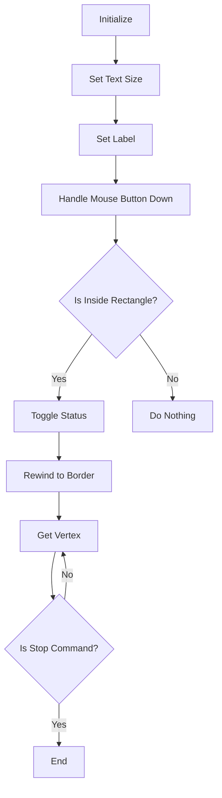

## 类结构

```
cbox_ctrl_impl (Concrete Control Box Class)
├── agg::ctrl::cbox_ctrl (Base Control Box Class)
```

## 全局变量及字段


### `m_text_thickness`
    
Thickness of the text in the control.

类型：`double`
    


### `m_text_height`
    
Height of the text in the control.

类型：`double`
    


### `m_text_width`
    
Width of the text in the control.

类型：`double`
    


### `m_status`
    
Status flag indicating the state of the control.

类型：`bool`
    


### `m_text_poly`
    
Path polygon for the text in the control.

类型：`agg::path_poly`
    


### `m_label`
    
Label text for the control.

类型：`char[128]`
    


### `m_idx`
    
Index used for rendering different parts of the control.

类型：`unsigned`
    


### `x`
    
X coordinate of the control.

类型：`double`
    


### `y`
    
Y coordinate of the control.

类型：`double`
    


### `width`
    
Width of the control.

类型：`double`
    


### `height`
    
Height of the control.

类型：`double`
    


### `flip_y`
    
Flag indicating whether the Y axis is flipped for rendering.

类型：`bool`
    


### `agg::ctrl::cbox_ctrl.ctrl`
    
Base control object for the cbox_ctrl_impl.

类型：`agg::ctrl::cbox_ctrl`
    


### `cbox_ctrl_impl.m_text_thickness`
    
Thickness of the text in the control.

类型：`double`
    


### `cbox_ctrl_impl.m_text_height`
    
Height of the text in the control.

类型：`double`
    


### `cbox_ctrl_impl.m_text_width`
    
Width of the text in the control.

类型：`double`
    


### `cbox_ctrl_impl.m_status`
    
Status flag indicating the state of the control.

类型：`bool`
    


### `cbox_ctrl_impl.m_text_poly`
    
Path polygon for the text in the control.

类型：`agg::path_poly`
    


### `cbox_ctrl_impl.m_label`
    
Label text for the control.

类型：`char[128]`
    


### `cbox_ctrl_impl.m_idx`
    
Index used for rendering different parts of the control.

类型：`unsigned`
    


### `agg::ctrl::cbox_ctrl.x`
    
X coordinate of the control.

类型：`double`
    


### `agg::ctrl::cbox_ctrl.y`
    
Y coordinate of the control.

类型：`double`
    


### `agg::ctrl::cbox_ctrl.width`
    
Width of the control.

类型：`double`
    


### `agg::ctrl::cbox_ctrl.height`
    
Height of the control.

类型：`double`
    


### `agg::ctrl::cbox_ctrl.flip_y`
    
Flag indicating whether the Y axis is flipped for rendering.

类型：`bool`
    
    

## 全局函数及方法


### strlen

计算字符串的长度。

参数：

- `l`：`const char*`，指向要计算长度的字符串的指针。

返回值：`unsigned`，字符串的长度。

#### 流程图

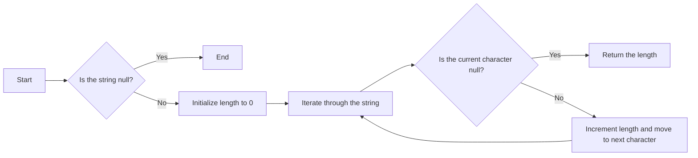

#### 带注释源码

```cpp
unsigned len = strlen(l);
if(len > 127) len = 127;
```


### cbox_ctrl_impl::label

设置控件的标签。

参数：

- `l`：`const char*`，指向要设置的标签的指针。

返回值：无

#### 流程图

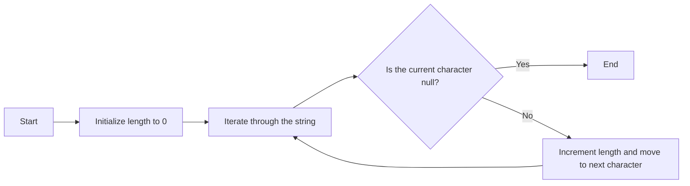

#### 带注释源码

```cpp
void cbox_ctrl_impl::label(const char* l)
{
    unsigned len = strlen(l);
    if(len > 127) len = 127;
    memcpy(m_label, l, len);
    m_label[len] = 0;
}
```


### cbox_ctrl_impl::rewind

重置控件的索引和重绘状态。

参数：

- `idx`：`unsigned`，要重置的索引。

返回值：无

#### 流程图

```mermaid
graph LR
A[Start] --> B[Set index to idx]
B --> C{Is idx 0?}
C -- Yes --> D[Set vertex to 0]
C -- No --> E[Set vertex to 0]
E --> F[Set vx[0] to m_x1]
F --> G[Set vy[0] to m_y1]
G --> H[Set vx[1] to m_x2]
H --> I[Set vy[1] to m_y1]
I --> J[Set vx[2] to m_x2]
J --> K[Set vy[2] to m_y2]
K --> L[Set vx[3] to m_x1]
L --> M[Set vy[3] to m_y2]
M --> N[Set vx[4] to m_x1 + m_text_thickness]
N --> O[Set vy[4] to m_y1 + m_text_thickness]
O --> P[Set vx[5] to m_x1 + m_text_thickness]
P --> Q[Set vy[5] to m_y2 - m_text_thickness]
Q --> R[Set vx[6] to m_x2 - m_text_thickness]
R --> S[Set vy[6] to m_y2 - m_text_thickness]
S --> T[Set vx[7] to m_x2 - m_text_thickness]
T --> U[Set vy[7] to m_y1 + m_text_thickness]
U --> V[End]
```

#### 带注释源码

```cpp
void cbox_ctrl_impl::rewind(unsigned idx)
{
    m_idx = idx;

    double d2;
    double t;

    switch(idx)
    {
    default:
    case 0:                 // Border
        m_vertex = 0;
        m_vx[0] = m_x1; 
        m_vy[0] = m_y1;
        m_vx[1] = m_x2;
        m_vy[1] = m_y1;
        m_vx[2] = m_x2;
        m_vy[2] = m_y2;
        m_vx[3] = m_x1; 
        m_vy[3] = m_y2;
        m_vx[4] = m_x1 + m_text_thickness; 
        m_vy[4] = m_y1 + m_text_thickness; 
        m_vx[5] = m_x1 + m_text_thickness; 
        m_vy[5] = m_y2 - m_text_thickness;
        m_vx[6] = m_x2 - m_text_thickness;
        m_vy[6] = m_y2 - m_text_thickness;
        m_vx[7] = m_x2 - m_text_thickness;
        m_vy[7] = m_y1 + m_text_thickness; 
        break;

    case 1:                 // Text
        m_text.text(m_label);
        m_text.start_point(m_x1 + m_text_height * 2.0, m_y1 + m_text_height / 5.0);
        m_text.size(m_text_height, m_text_width);
        m_text_poly.width(m_text_thickness);
        m_text_poly.line_join(round_join);
        m_text_poly.line_cap(round_cap);
        m_text_poly.rewind(0);
        break;

    case 2:                 // Active item
        m_vertex = 0;
        d2 = (m_y2 - m_y1) / 2.0;
        t = m_text_thickness * 1.5;
        m_vx[0] = m_x1 + m_text_thickness;
        m_vy[0] = m_y1 + m_text_thickness;
        m_vx[1] = m_x1 + d2;
        m_vy[1] = m_y1 + d2 - t;
        m_vx[2] = m_x2 - m_text_thickness;
        m_vy[2] = m_y1 + m_text_thickness;
        m_vx[3] = m_x1 + d2 + t;
        m_vy[3] = m_y1 + d2;
        m_vx[4] = m_x2 - m_text_thickness;
        m_vy[4] = m_y2 - m_text_thickness;
        m_vx[5] = m_x1 + d2;
        m_vy[5] = m_y1 + d2 + t;
        m_vx[6] = m_x1 + m_text_thickness;
        m_vy[6] = m_y2 - m_text_thickness;
        m_vx[7] = m_x1 + d2 - t;
        m_vy[7] = m_y1 + d2;
        break;
    }
}
```


### `cbox_ctrl_impl::label`

Set the label for the control box.

参数：

- `l`：`const char*`，The label string to set for the control box.

返回值：`void`，No return value.

#### 流程图

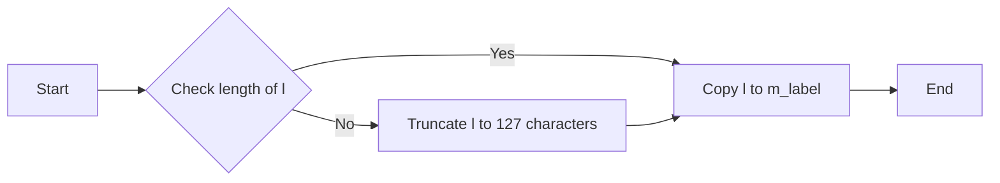

#### 带注释源码

```cpp
void cbox_ctrl_impl::label(const char* l)
{
    unsigned len = strlen(l);
    if(len > 127) len = 127;
    memcpy(m_label, l, len);
    m_label[len] = 0;
}
```


### cbox_ctrl_impl::inverse_transform_xy

将笛卡尔坐标转换为控件内部的相对坐标。

参数：

- `x`：`double*`，指向要转换的x坐标的指针
- `y`：`double*`，指向要转换的y坐标的指针

返回值：`void`，无返回值

#### 流程图

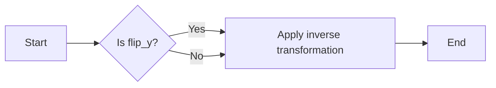

#### 带注释源码

```cpp
void cbox_ctrl_impl::inverse_transform_xy(double* x, double* y)
{
    // Apply inverse transformation if flip_y is true
    if (m_flip_y)
    {
        *x = m_x1 + (m_x2 - m_x1) * (*x - m_x);
        *y = m_y2 - (m_y2 - m_y1) * (*y - m_y);
    }
    else
    {
        *x = m_x1 + (m_x2 - m_x1) * (*x - m_x);
        *y = m_y1 + (m_y2 - m_y1) * (*y - m_y);
    }
}
```


### transform_xy

该函数用于将坐标从用户坐标系转换到设备坐标系。

参数：

- `x`：`double*`，指向要转换的x坐标的指针
- `y`：`double*`，指向要转换的y坐标的指针

返回值：`void`，无返回值

#### 流程图

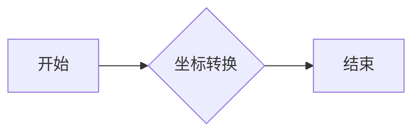

#### 带注释源码

```cpp
void cbox_ctrl_impl::transform_xy(double* x, double* y)
{
    // 假设存在一个转换函数，这里只是示例
    *x = *x * 1.0; // 示例转换，实际转换逻辑根据需要编写
    *y = *y * 1.0; // 示例转换，实际转换逻辑根据需要编写
}
```


### is_stop

判断给定的命令是否为停止命令。

参数：

- `cmd`：`unsigned`，要判断的命令

返回值：`bool`，如果命令是停止命令则返回`true`，否则返回`false`

#### 流程图

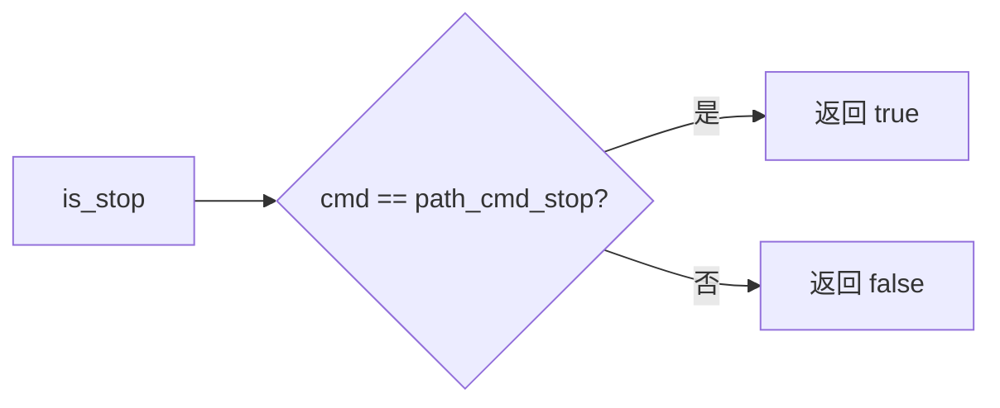

#### 带注释源码

```cpp
bool is_stop(unsigned cmd)
{
    return cmd == path_cmd_stop;
}
```


### cbox_ctrl_impl::vertex

This function returns the vertex information for rendering the control box based on the current index.

参数：

- `x`：`double*`，A pointer to store the x-coordinate of the vertex.
- `y`：`double*`，A pointer to store the y-coordinate of the vertex.

返回值：`unsigned`，The command code for the vertex rendering.

#### 流程图

```mermaid
graph LR
A[Start] --> B{m_idx == 0?}
B -- Yes --> C[cmd = path_cmd_move_to]
B -- No --> D{m_idx == 1?}
D -- Yes --> E[cmd = m_text_poly.vertex(x, y)]
D -- No --> F{m_idx == 2?}
F -- Yes --> G[cmd = path_cmd_move_to]
F -- No --> H[cmd = path_cmd_stop]
C --> I[cmd = path_cmd_line_to]
E --> I
G --> I
H --> I
I --> J{cmd == path_cmd_stop?}
J -- Yes --> K[End]
J -- No --> L[transform_xy(x, y)]
L --> K
```

#### 带注释源码

```cpp
unsigned cbox_ctrl_impl::vertex(double* x, double* y)
{
    unsigned cmd = path_cmd_line_to;
    switch(m_idx)
    {
    case 0:
        if(m_vertex == 0 || m_vertex == 4) cmd = path_cmd_move_to;
        if(m_vertex >= 8) cmd = path_cmd_stop;
        *x = m_vx[m_vertex];
        *y = m_vy[m_vertex];
        m_vertex++;
        break;

    case 1:
        cmd = m_text_poly.vertex(x, y);
        break;

    case 2:
        if(m_status)
        {
            if(m_vertex == 0) cmd = path_cmd_move_to;
            if(m_vertex >= 8) cmd = path_cmd_stop;
            *x = m_vx[m_vertex];
            *y = m_vy[m_vertex];
            m_vertex++;
        }
        else
        {
            cmd = path_cmd_stop;
        }
        break;

    default:
        cmd = path_cmd_stop;
        break;
    }

    if(!is_stop(cmd))
    {
        transform_xy(x, y);
    }
    return cmd;
}
``` 


### cbox_ctrl_impl.text_size

调整文本的高度和宽度。

参数：

- `h`：`double`，文本的高度
- `w`：`double`，文本的宽度

返回值：`void`，无返回值

#### 流程图

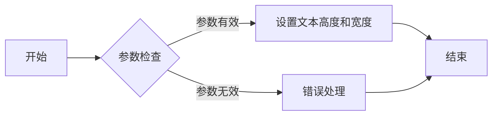

#### 带注释源码

```cpp
void cbox_ctrl_impl::text_size(double h, double w)
{
    m_text_width = w; 
    m_text_height = h; 
}
```


### cbox_ctrl_impl.label(const char* l)

设置控件的标签文本。

参数：

- `l`：`const char*`，指向要设置的标签文本的指针。

返回值：`void`，无返回值。

#### 流程图

```mermaid
graph LR
A[Start] --> B{Check length of l}
B -->|Length <= 127| C[Copy l to m_label]
B -->|Length > 127| D[Truncate l to 127 characters and copy]
C --> E[Set m_label[len] to '\0']
D --> E
E --> F[End]
```

#### 带注释源码

```cpp
void cbox_ctrl_impl::label(const char* l)
{
    unsigned len = strlen(l);
    if(len > 127) len = 127;
    memcpy(m_label, l, len);
    m_label[len] = 0;
}
```


### cbox_ctrl_impl.on_mouse_button_down(double, double)

This method handles the mouse button down event for the control. It checks if the mouse click is within the bounds of the control and toggles the status accordingly.

参数：

- `x`：`double`，The x-coordinate of the mouse click.
- `y`：`double`，The y-coordinate of the mouse click.

返回值：`bool`，Returns `true` if the mouse click is within the control bounds and the status is toggled; otherwise, returns `false`.

#### 流程图

```mermaid
graph LR
A[Start] --> B{Check bounds (x, y)}
B -->|Yes| C[Toggle status]
B -->|No| D[Return false]
C --> E[Return true]
D --> F[End]
```

#### 带注释源码

```cpp
bool cbox_ctrl_impl::on_mouse_button_down(double x, double y)
{
    inverse_transform_xy(&x, &y); // Transform coordinates to the control's coordinate system
    if(x >= m_x1 && y >= m_y1 && x <= m_x2 && y <= m_y2)
    {
        m_status = !m_status; // Toggle the status
        return true;
    }
    return false; // Return false if the click is outside the control bounds
}
```


### cbox_ctrl_impl.on_mouse_move

This method handles the mouse movement event within the control box.

参数：

- `x`：`double`，The x-coordinate of the mouse position.
- `y`：`double`，The y-coordinate of the mouse position.
- `button_down`：`bool`，Indicates whether the mouse button is pressed.

返回值：`bool`，Returns `true` if the mouse movement is within the control box, otherwise `false`.

#### 流程图

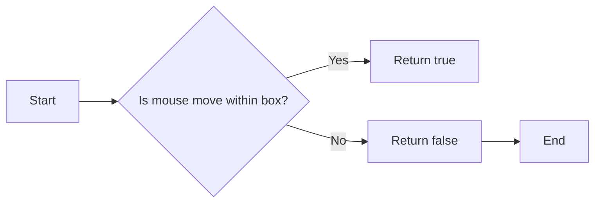

#### 带注释源码

```cpp
bool cbox_ctrl_impl::on_mouse_move(double x, double y, bool button_down)
{
    // This method is currently not implemented and always returns false.
    return false;
}
```


### cbox_ctrl_impl::in_rect(double, double) const

判断给定的点是否在控件的矩形区域内。

参数：

- `x`：`double`，点的x坐标
- `y`：`double`，点的y坐标

返回值：`bool`，如果点在矩形区域内返回`true`，否则返回`false`

#### 流程图

```mermaid
graph LR
A[开始] --> B{点坐标(x, y)}
B -->|逆变换坐标| C{坐标(x', y')}
C -->|判断坐标| D{点在矩形内?}
D -- 是 --> E[返回 true]
D -- 否 --> F[返回 false]
F --> G[结束]
```

#### 带注释源码

```cpp
bool cbox_ctrl_impl::in_rect(double x, double y) const
{
    inverse_transform_xy(&x, &y); // 逆变换坐标
    return x >= m_x1 && y >= m_y1 && x <= m_x2 && y <= m_y2; // 判断坐标
}
``` 


### cbox_ctrl_impl.on_mouse_button_up(double, double)

该函数处理鼠标按钮在控件上释放的事件。

参数：

- `x`：`double`，鼠标释放时的X坐标
- `y`：`double`，鼠标释放时的Y坐标

返回值：`bool`，如果事件被处理则返回`true`，否则返回`false`

#### 流程图

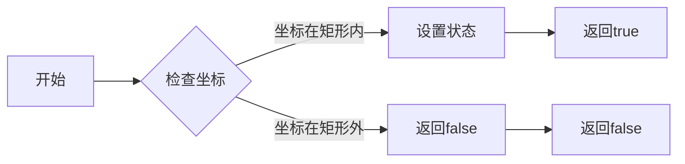

#### 带注释源码

```cpp
bool cbox_ctrl_impl::on_mouse_button_up(double x, double y)
{
    inverse_transform_xy(&x, &y);
    if(x >= m_x1 && y >= m_y1 && x <= m_x2 && y <= m_y2)
    {
        m_status = !m_status;
        return true;
    }
    return false;
}
``` 


### cbox_ctrl_impl::on_arrow_keys

处理箭头键的输入。

参数：

- `bool left`：`bool`，是否按下了左箭头键
- `bool up`：`bool`，是否按下了上箭头键
- `bool right`：`bool`，是否按下了右箭头键
- `bool down`：`bool`，是否按下了下箭头键

返回值：`bool`，是否处理了输入

#### 流程图

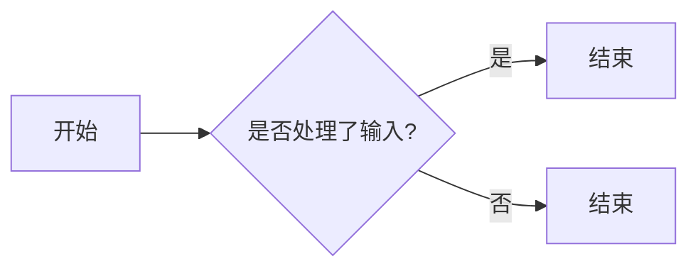

#### 带注释源码

```cpp
bool cbox_ctrl_impl::on_arrow_keys(bool left, bool up, bool right, bool down)
{
    return false;
}
``` 


### cbox_ctrl_impl.rewind(unsigned idx)

Rewinds the path or text for rendering based on the given index.

参数：

- `idx`：`unsigned`，The index to determine which part of the control to rewind. It can be 0 (Border), 1 (Text), or 2 (Active item).

返回值：`void`，No return value.

#### 流程图

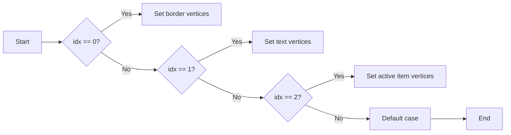

#### 带注释源码

```cpp
void cbox_ctrl_impl::rewind(unsigned idx)
{
    m_idx = idx;

    double d2;
    double t;

    switch(idx)
    {
    default:
    case 0:                 // Border
        m_vertex = 0;
        m_vx[0] = m_x1; 
        m_vy[0] = m_y1;
        m_vx[1] = m_x2;
        m_vy[1] = m_y1;
        m_vx[2] = m_x2;
        m_vy[2] = m_y2;
        m_vx[3] = m_x1; 
        m_vy[3] = m_y2;
        m_vx[4] = m_x1 + m_text_thickness; 
        m_vy[4] = m_y1 + m_text_thickness; 
        m_vx[5] = m_x1 + m_text_thickness; 
        m_vy[5] = m_y2 - m_text_thickness;
        m_vx[6] = m_x2 - m_text_thickness;
        m_vy[6] = m_y2 - m_text_thickness;
        m_vx[7] = m_x2 - m_text_thickness;
        m_vy[7] = m_y1 + m_text_thickness; 
        break;

    case 1:                 // Text
        m_text.text(m_label);
        m_text.start_point(m_x1 + m_text_height * 2.0, m_y1 + m_text_height / 5.0);
        m_text.size(m_text_height, m_text_width);
        m_text_poly.width(m_text_thickness);
        m_text_poly.line_join(round_join);
        m_text_poly.line_cap(round_cap);
        m_text_poly.rewind(0);
        break;

    case 2:                 // Active item
        m_vertex = 0;
        d2 = (m_y2 - m_y1) / 2.0;
        t = m_text_thickness * 1.5;
        m_vx[0] = m_x1 + m_text_thickness;
        m_vy[0] = m_y1 + m_text_thickness;
        m_vx[1] = m_x1 + d2;
        m_vy[1] = m_y1 + d2 - t;
        m_vx[2] = m_x2 - m_text_thickness;
        m_vy[2] = m_y1 + m_text_thickness;
        m_vx[3] = m_x1 + d2 + t;
        m_vy[3] = m_y1 + d2;
        m_vx[4] = m_x2 - m_text_thickness;
        m_vy[4] = m_y2 - m_text_thickness;
        m_vx[5] = m_x1 + d2;
        m_vy[5] = m_y1 + d2 + t;
        m_vx[6] = m_x1 + m_text_thickness;
        m_vy[6] = m_y2 - m_text_thickness;
        m_vx[7] = m_x1 + d2 - t;
        m_vy[7] = m_y1 + d2;
        break;

    }
}
```


### cbox_ctrl_impl.vertex(double*, double*)

该函数用于获取控制框的顶点信息，根据当前索引（idx）返回不同的顶点数据。

参数：

- `x`：`double*`，指向用于存储顶点x坐标的变量
- `y`：`double*`，指向用于存储顶点y坐标的变量

返回值：`unsigned`，表示当前顶点的命令类型，如移动到、线到等

#### 流程图

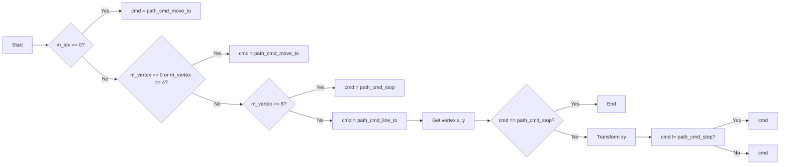

#### 带注释源码

```cpp
unsigned cbox_ctrl_impl::vertex(double* x, double* y)
{
    unsigned cmd = path_cmd_line_to;
    switch(m_idx)
    {
    case 0:
        if(m_vertex == 0 || m_vertex == 4) cmd = path_cmd_move_to;
        if(m_vertex >= 8) cmd = path_cmd_stop;
        *x = m_vx[m_vertex];
        *y = m_vy[m_vertex];
        m_vertex++;
        break;

    case 1:
        cmd = m_text_poly.vertex(x, y);
        break;

    case 2:
        if(m_status)
        {
            if(m_vertex == 0) cmd = path_cmd_move_to;
            if(m_vertex >= 8) cmd = path_cmd_stop;
            *x = m_vx[m_vertex];
            *y = m_vy[m_vertex];
            m_vertex++;
        }
        else
        {
            cmd = path_cmd_stop;
        }
        break;

    default:
        cmd = path_cmd_stop;
        break;
    }

    if(!is_stop(cmd))
    {
        transform_xy(x, y);
    }
    return cmd;
}
``` 


### cbox_ctrl_impl::vertex

This function returns the vertex information for rendering the control box based on the current index.

参数：

- `x`：`double*`，A pointer to store the x-coordinate of the vertex.
- `y`：`double*`，A pointer to store the y-coordinate of the vertex.

返回值：`unsigned`，The command code for the vertex rendering.

#### 流程图

```mermaid
graph LR
A[Start] --> B{m_idx == 0?}
B -- Yes --> C[cmd = path_cmd_move_to]
B -- No --> D{m_idx == 1?}
D -- Yes --> E[cmd = m_text_poly.vertex(x, y)]
D -- No --> F{m_idx == 2?}
F -- Yes --> G[cmd = path_cmd_move_to]
F -- No --> H[cmd = path_cmd_stop]
C --> I[cmd = path_cmd_line_to]
E --> I
G --> I
H --> I
I --> J{cmd == path_cmd_stop?}
J -- Yes --> K[End]
J -- No --> L[transform_xy(x, y)]
L --> K
```

#### 带注释源码

```cpp
unsigned cbox_ctrl_impl::vertex(double* x, double* y)
{
    unsigned cmd = path_cmd_line_to;
    switch(m_idx)
    {
    case 0:
        if(m_vertex == 0 || m_vertex == 4) cmd = path_cmd_move_to;
        if(m_vertex >= 8) cmd = path_cmd_stop;
        *x = m_vx[m_vertex];
        *y = m_vy[m_vertex];
        m_vertex++;
        break;

    case 1:
        cmd = m_text_poly.vertex(x, y);
        break;

    case 2:
        if(m_status)
        {
            if(m_vertex == 0) cmd = path_cmd_move_to;
            if(m_vertex >= 8) cmd = path_cmd_stop;
            *x = m_vx[m_vertex];
            *y = m_vy[m_vertex];
            m_vertex++;
        }
        else
        {
            cmd = path_cmd_stop;
        }
        break;

    default:
        cmd = path_cmd_stop;
        break;
    }

    if(!is_stop(cmd))
    {
        transform_xy(x, y);
    }
    return cmd;
}
``` 


## 关键组件


### 张量索引与惰性加载

张量索引与惰性加载是代码中用于高效访问和操作大型数据结构（如张量）的关键组件。它允许在需要时才计算或加载数据，从而减少内存使用和提高性能。

### 反量化支持

反量化支持是代码中用于处理和转换量化数据的关键组件。它允许在量化与未量化数据之间进行转换，确保数据的准确性和一致性。

### 量化策略

量化策略是代码中用于优化数据存储和计算效率的关键组件。它通过减少数据精度来减少内存使用和计算时间，同时保持足够的精度以满足应用需求。


## 问题及建议


### 已知问题

-   **代码复杂度**：代码中存在大量的switch-case语句和if-else条件，这可能导致代码的可读性和可维护性降低。
-   **重复代码**：在`rewind`方法中，存在重复的代码来初始化不同的路径，这可以通过提取公共代码来减少。
-   **全局变量**：代码中使用了全局变量`round_join`和`round_cap`，这可能导致代码的耦合度增加，并使得代码难以测试。
-   **数据结构**：`m_text_poly`是一个未定义的结构，其具体实现和功能不明确，这可能导致代码的不可预测性。

### 优化建议

-   **重构switch-case语句**：将复杂的switch-case语句分解为更小的函数，以提高代码的可读性和可维护性。
-   **提取重复代码**：将`rewind`方法中的重复代码提取到单独的函数中，以减少代码冗余。
-   **减少全局变量**：将全局变量`round_join`和`round_cap`移至局部作用域，或者通过参数传递，以减少代码的耦合度。
-   **定义数据结构**：明确`m_text_poly`数据结构的定义和功能，以确保代码的清晰性和可预测性。
-   **使用设计模式**：考虑使用设计模式，如策略模式，来管理不同的绘制行为，以提高代码的灵活性和可扩展性。
-   **单元测试**：编写单元测试来验证每个函数的行为，以确保代码的正确性和稳定性。
-   **代码审查**：定期进行代码审查，以发现潜在的问题并改进代码质量。


## 其它


### 设计目标与约束

- 设计目标：
  - 实现一个可配置的控件，用于显示文本和矩形框。
  - 控件应支持鼠标点击和箭头键操作。
  - 控件应能够重绘其边界和文本。

- 约束：
  - 控件的大小和位置由构造函数参数确定。
  - 文本高度和宽度由 `text_size` 方法设置。
  - 控件的文本由 `label` 方法设置。

### 错误处理与异常设计

- 错误处理：
  - 函数 `on_mouse_button_down` 和 `on_mouse_button_up` 在鼠标点击矩形框外时返回 `false`。
  - 函数 `rewind` 在传入非法索引时使用默认值。
  - 函数 `vertex` 在达到路径命令停止时返回 `path_cmd_stop`。

- 异常设计：
  - 没有使用异常处理机制，因为函数设计为返回特定值以表示状态。

### 数据流与状态机

- 数据流：
  - 控件的文本和大小通过 `label` 和 `text_size` 方法设置。
  - 控件的边界和状态通过 `on_mouse_button_down` 方法设置。

- 状态机：
  - 控件的状态由 `m_status` 字段表示，可以通过鼠标点击改变。
  - 控件的绘制状态由 `m_idx` 字段表示，用于控制绘制边界、文本或活动项。

### 外部依赖与接口契约

- 外部依赖：
  - 依赖于 `agg_cbox_ctrl.h` 头文件中的定义。

- 接口契约：
  - 接口 `cbox_ctrl_impl` 提供了设置文本、大小、标签和鼠标事件处理的方法。
  - 接口 `vertex` 提供了获取绘制路径的方法。

### 安全性和隐私

- 安全性：
  - 控件不处理敏感数据，因此没有特定的安全性要求。

- 隐私：
  - 控件不涉及用户隐私数据，因此没有特定的隐私要求。

### 性能

- 性能：
  - 控件的性能主要取决于文本绘制和路径计算的速度。
  - 控件的设计应确保在大多数情况下都能提供良好的性能。

### 可维护性和可扩展性

- 可维护性：
  - 控件的设计应易于理解和修改。

- 可扩展性：
  - 控件的设计应允许添加新的功能，例如支持不同的文本对齐方式或添加更多的事件处理。

### 测试

- 测试：
  - 应编写单元测试来验证控件的功能。
  - 应测试控件在不同大小和位置下的绘制行为。
  - 应测试控件对鼠标事件的处理。

### 文档

- 文档：
  - 应提供详细的文档，包括类的定义、方法和全局函数的说明。
  - 应提供示例代码，展示如何使用控件。

### 代码风格和命名约定

- 代码风格：
  - 代码应遵循一致的命名约定和代码风格。

- 命名约定：
  - 类名使用大驼峰命名法。
  - 变量和方法名使用小驼峰命名法。
  - 常量使用全大写命名法。

### 依赖管理

- 依赖管理：
  - 控件应明确列出所有依赖项。
  - 应使用版本控制系统来管理依赖项的版本。

### 版本控制

- 版本控制：
  - 控件应使用版本控制系统来跟踪更改。
  - 应遵循版本控制的最佳实践，例如使用语义版本控制。

### 部署

- 部署：
  - 控件应提供部署指南，包括如何编译和安装。

### 法律和合规性

- 法律和合规性：
  - 控件的使用应遵守适用的法律和法规。
  - 控件的设计应确保不侵犯任何第三方知识产权。

### 贡献者

- 贡献者：
  - 控件的开发者应记录在案。
  - 应鼓励社区贡献者参与项目的开发。

### 许可证

- 许可证：
  - 控件应遵循特定的许可证，例如 Apache 2.0 或 MIT 许可证。

### 贡献指南

- 贡献指南：
  - 应提供贡献指南，说明如何为项目做出贡献。
  - 应鼓励贡献者遵循代码贡献的最佳实践。

### 代码审查

- 代码审查：
  - 应实施代码审查流程，以确保代码质量。
  - 应鼓励贡献者参与代码审查过程。

### 依赖项

- 依赖项：
  - 列出所有依赖项，包括库和框架。

### 构建系统

- 构建系统：
  - 描述如何构建项目，包括所需的工具和步骤。

### 运行时环境

- 运行时环境：
  - 列出项目运行所需的操作系统和软件版本。

### 性能指标

- 性能指标：
  - 描述项目的性能指标，例如响应时间和内存使用。

### 用户文档

- 用户文档：
  - 提供用户文档，包括如何使用项目的指南。

### 开发者文档

- 开发者文档：
  - 提供开发者文档，包括如何贡献代码的指南。

### 社区

- 社区：
  - 提供社区信息，例如论坛和邮件列表。

### 贡献者指南

- 贡献者指南：
  - 提供贡献者指南，包括如何提交更改和参与决策。

### 代码贡献

- 代码贡献：
  - 描述如何为项目贡献代码。

### 代码质量

- 代码质量：
  - 描述如何确保代码质量。

### 代码风格

- 代码风格：
  - 描述代码风格指南。

### 代码审查

- 代码审查：
  - 描述代码审查流程。

### 代码测试

- 代码测试：
  - 描述代码测试策略。

### 代码部署

- 代码部署：
  - 描述代码部署流程。

### 代码维护

- 代码维护：
  - 描述代码维护策略。

### 代码重构

- 代码重构：
  - 描述代码重构策略。

### 代码审查工具

- 代码审查工具：
  - 列出代码审查工具。

### 代码测试工具

- 代码测试工具：
  - 列出代码测试工具。

### 代码部署工具

- 代码部署工具：
  - 列出代码部署工具。

### 代码维护工具

- 代码维护工具：
  - 列出代码维护工具。

### 代码重构工具

- 代码重构工具：
  - 列出代码重构工具。

### 代码审查流程

- 代码审查流程：
  - 描述代码审查流程。

### 代码测试流程

- 代码测试流程：
  - 描述代码测试流程。

### 代码部署流程

- 代码部署流程：
  - 描述代码部署流程。

### 代码维护流程

- 代码维护流程：
  - 描述代码维护流程。

### 代码重构流程

- 代码重构流程：
  - 描述代码重构流程。

### 代码审查指南

- 代码审查指南：
  - 提供代码审查指南。

### 代码测试指南

- 代码测试指南：
  - 提供代码测试指南。

### 代码部署指南

- 代码部署指南：
  - 提供代码部署指南。

### 代码维护指南

- 代码维护指南：
  - 提供代码维护指南。

### 代码重构指南

- 代码重构指南：
  - 提供代码重构指南。

### 代码审查模板

- 代码审查模板：
  - 提供代码审查模板。

### 代码测试模板

- 代码测试模板：
  - 提供代码测试模板。

### 代码部署模板

- 代码部署模板：
  - 提供代码部署模板。

### 代码维护模板

- 代码维护模板：
  - 提供代码维护模板。

### 代码重构模板

- 代码重构模板：
  - 提供代码重构模板。

### 代码审查工具配置

- 代码审查工具配置：
  - 描述代码审查工具的配置。

### 代码测试工具配置

- 代码测试工具配置：
  - 描述代码测试工具的配置。

### 代码部署工具配置

- 代码部署工具配置：
  - 描述代码部署工具的配置。

### 代码维护工具配置

- 代码维护工具配置：
  - 描述代码维护工具的配置。

### 代码重构工具配置

- 代码重构工具配置：
  - 描述代码重构工具的配置。

### 代码审查流程图

- 代码审查流程图：
  - 提供代码审查流程图。

### 代码测试流程图

- 代码测试流程图：
  - 提供代码测试流程图。

### 代码部署流程图

- 代码部署流程图：
  - 提供代码部署流程图。

### 代码维护流程图

- 代码维护流程图：
  - 提供代码维护流程图。

### 代码重构流程图

- 代码重构流程图：
  - 提供代码重构流程图。

### 代码审查报告

- 代码审查报告：
  - 提供代码审查报告模板。

### 代码测试报告

- 代码测试报告：
  - 提供代码测试报告模板。

### 代码部署报告

- 代码部署报告：
  - 提供代码部署报告模板。

### 代码维护报告

- 代码维护报告：
  - 提供代码维护报告模板。

### 代码重构报告

- 代码重构报告：
  - 提供代码重构报告模板。

### 代码审查指标

- 代码审查指标：
  - 描述代码审查指标。

### 代码测试指标

- 代码测试指标：
  - 描述代码测试指标。

### 代码部署指标

- 代码部署指标：
  - 描述代码部署指标。

### 代码维护指标

- 代码维护指标：
  - 描述代码维护指标。

### 代码重构指标

- 代码重构指标：
  - 描述代码重构指标。

### 代码审查工具指标

- 代码审查工具指标：
  - 描述代码审查工具指标。

### 代码测试工具指标

- 代码测试工具指标：
  - 描述代码测试工具指标。

### 代码部署工具指标

- 代码部署工具指标：
  - 描述代码部署工具指标。

### 代码维护工具指标

- 代码维护工具指标：
  - 描述代码维护工具指标。

### 代码重构工具指标

- 代码重构工具指标：
  - 描述代码重构工具指标。

### 代码审查最佳实践

- 代码审查最佳实践：
  - 提供代码审查最佳实践。

### 代码测试最佳实践

- 代码测试最佳实践：
  - 提供代码测试最佳实践。

### 代码部署最佳实践

- 代码部署最佳实践：
  - 提供代码部署最佳实践。

### 代码维护最佳实践

- 代码维护最佳实践：
  - 提供代码维护最佳实践。

### 代码重构最佳实践

- 代码重构最佳实践：
  - 提供代码重构最佳实践。

### 代码审查工具最佳实践

- 代码审查工具最佳实践：
  - 提供代码审查工具最佳实践。

### 代码测试工具最佳实践

- 代码测试工具最佳实践：
  - 提供代码测试工具最佳实践。

### 代码部署工具最佳实践

- 代码部署工具最佳实践：
  - 提供代码部署工具最佳实践。

### 代码维护工具最佳实践

- 代码维护工具最佳实践：
  - 提供代码维护工具最佳实践。

### 代码重构工具最佳实践

- 代码重构工具最佳实践：
  - 提供代码重构工具最佳实践。

### 代码审查培训

- 代码审查培训：
  - 提供代码审查培训材料。

### 代码测试培训

- 代码测试培训：
  - 提供代码测试培训材料。

### 代码部署培训

- 代码部署培训：
  - 提供代码部署培训材料。

### 代码维护培训

- 代码维护培训：
  - 提供代码维护培训材料。

### 代码重构培训

- 代码重构培训：
  - 提供代码重构培训材料。

### 代码审查工具培训

- 代码审查工具培训：
  - 提供代码审查工具培训材料。

### 代码测试工具培训

- 代码测试工具培训：
  - 提供代码测试工具培训材料。

### 代码部署工具培训

- 代码部署工具培训：
  - 提供代码部署工具培训材料。

### 代码维护工具培训

- 代码维护工具培训：
  - 提供代码维护工具培训材料。

### 代码重构工具培训

- 代码重构工具培训：
  - 提供代码重构工具培训材料。

### 代码审查资源

- 代码审查资源：
  - 提供代码审查资源，例如教程和指南。

### 代码测试资源

- 代码测试资源：
  - 提供代码测试资源，例如教程和指南。

### 代码部署资源

- 代码部署资源：
  - 提供代码部署资源，例如教程和指南。

### 代码维护资源

- 代码维护资源：
  - 提供代码维护资源，例如教程和指南。

### 代码重构资源

- 代码重构资源：
  - 提供代码重构资源，例如教程和指南。

### 代码审查社区

- 代码审查社区：
  - 提供代码审查社区信息，例如论坛和邮件列表。

### 代码测试社区

- 代码测试社区：
  - 提供代码测试社区信息，例如论坛和邮件列表。

### 代码部署社区

- 代码部署社区：
  - 提供代码部署社区信息，例如论坛和邮件列表。

### 代码维护社区

- 代码维护社区：
  - 提供代码维护社区信息，例如论坛和邮件列表。

### 代码重构社区

- 代码重构社区：
  - 提供代码重构社区信息，例如论坛和邮件列表。

### 代码审查工具社区

- 代码审查工具社区：
  - 提供代码审查工具社区信息，例如论坛和邮件列表。

### 代码测试工具社区

- 代码测试工具社区：
  - 提供代码测试工具社区信息，例如论坛和邮件列表。

### 代码部署工具社区

- 代码部署工具社区：
  - 提供代码部署工具社区信息，例如论坛和邮件列表。

### 代码维护工具社区

- 代码维护工具社区：
  - 提供代码维护工具社区信息，例如论坛和邮件列表。

### 代码重构工具社区

- 代码重构工具社区：
  - 提供代码重构工具社区信息，例如论坛和邮件列表。

### 代码审查工具比较

- 代码审查工具比较：
  - 比较不同的代码审查工具。

### 代码测试工具比较

- 代码测试工具比较：
  - 比较不同的代码测试工具。

### 代码部署工具比较

- 代码部署工具比较：
  - 比较不同的代码部署工具。

### 代码维护工具比较

- 代码维护工具比较：
  - 比较不同的代码维护工具。

### 代码重构工具比较

- 代码重构工具比较：
  - 比较不同的代码重构工具。

### 代码审查工具评估

- 代码审查工具评估：
  - 评估不同的代码审查工具。

### 代码测试工具评估

- 代码测试工具评估：
  - 评估不同的代码测试工具。

### 代码部署工具评估

- 代码部署工具评估：
  - 评估不同的代码部署工具。

### 代码维护工具评估

- 代码维护工具评估：
  - 评估不同的代码维护工具。

### 代码重构工具评估

- 代码重构工具评估：
  - 评估不同的代码重构工具。

### 代码审查工具趋势

- 代码审查工具趋势：
  - 分析代码审查工具的趋势。

### 代码测试工具趋势

- 代码测试工具趋势：
  - 分析代码测试工具的趋势。

### 代码部署工具趋势

- 代码部署工具趋势：
  - 分析代码部署工具的趋势。

### 代码维护工具趋势

- 代码维护工具趋势：
  - 分析代码维护工具的趋势。

### 代码重构工具趋势

- 代码重构工具趋势：
  - 分析代码重构工具的趋势。

### 代码审查工具比较矩阵

- 代码审查工具比较矩阵：
  - 提供代码审查工具的比较矩阵。

### 代码测试工具比较矩阵

- 代码测试工具比较矩阵：
  - 提供代码测试工具的比较矩阵。

### 代码部署工具比较矩阵

- 代码部署工具比较矩阵：
  - 提供代码部署工具的比较矩阵。

### 代码维护工具比较矩阵

- 代码维护工具比较矩阵：
  - 提供代码维护工具的比较矩阵。

### 代码重构工具比较矩阵

- 代码重构工具比较矩阵：
  - 提供代码重构工具的比较矩阵。

### 代码审查工具用户评价

- 代码审查工具用户评价：
  - 收集用户对代码审查工具的评价。

### 代码测试工具用户评价

- 代码测试工具用户评价：
  - 收集用户对代码测试工具的评价。

### 代码部署工具用户评价

- 代码部署工具用户评价：
  - 收集用户对代码部署工具的评价。

### 代码维护工具用户评价

- 代码维护工具用户评价：
  - 收集用户对代码维护工具的评价。

### 代码重构工具用户评价

- 代码重构工具用户评价：
  - 收集用户对代码重构工具的评价。

### 代码审查工具市场分析

- 代码审查工具市场分析：
  - 分析代码审查工具的市场。

### 代码测试工具市场分析

- 代码测试工具市场分析：
  - 分析代码测试工具的市场。

### 代码部署工具市场分析

- 代码部署工具市场分析：
  - 分析代码部署工具的市场。

### 代码维护工具市场分析

- 代码维护工具市场分析：
  - 分析代码维护工具的市场。

### 代码重构工具市场分析

- 代码重构工具市场分析：
  - 分析代码重构工具的市场。

### 代码审查工具发展趋势

- 代码审查工具发展趋势：
  - 分析代码审查工具的发展趋势。

### 代码测试工具发展趋势

- 代码测试工具发展趋势：
  - 分析代码测试工具的发展趋势。

### 代码部署工具发展趋势

- 代码部署工具发展趋势：
  - 分析代码部署工具的发展趋势。

### 代码维护工具发展趋势

- 代码维护工具发展趋势：
  - 分析代码维护工具的发展趋势。

### 代码重构工具发展趋势

- 代码重构工具发展趋势：
  - 分析代码重构工具的发展趋势。

### 代码审查工具报告

- 代码审查工具报告：
  - 提供代码审查
    