# `matplotlib\extern\agg24-svn\src\ctrl\agg_gamma_ctrl.cpp` 详细设计文档

这是Anti-Grain Geometry库中的gamma_ctrl_impl类实现，提供了一个交互式的gamma曲线编辑控件，用于在图形界面中可视化和调整gamma校正曲线，支持鼠标拖拽和键盘方向键操作来修改曲线的控制点。

## 整体流程

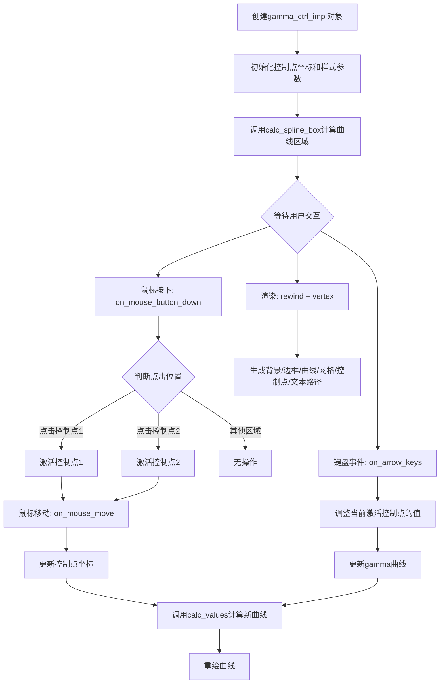

## 类结构

```
ctrl (基类，抽象控制器)
└── gamma_ctrl_impl (gamma曲线控制器实现)
    ├── 依赖组件:
    │   ├── gamma_spline (gamma样条曲线)
    │   ├── ellipse (椭圆绘制)
    │   ├── conv_curve (曲线多边形)
    │   └── conv_text (文本多边形)
```

## 全局变量及字段


### `gamma_ctrl_impl.m_border_width`
    
边框宽度

类型：`double`
    


### `gamma_ctrl_impl.m_border_extra`
    
边框额外扩展

类型：`double`
    


### `gamma_ctrl_impl.m_curve_width`
    
曲线线宽

类型：`double`
    


### `gamma_ctrl_impl.m_grid_width`
    
网格线宽

类型：`double`
    


### `gamma_ctrl_impl.m_text_thickness`
    
文本线条粗细

类型：`double`
    


### `gamma_ctrl_impl.m_point_size`
    
控制点大小

类型：`double`
    


### `gamma_ctrl_impl.m_text_height`
    
文本高度

类型：`double`
    


### `gamma_ctrl_impl.m_text_width`
    
文本宽度

类型：`double`
    


### `gamma_ctrl_impl.m_xc1`
    
曲线区域左上角X坐标

类型：`double`
    


### `gamma_ctrl_impl.m_yc1`
    
曲线区域左上角Y坐标

类型：`double`
    


### `gamma_ctrl_impl.m_xc2`
    
曲线区域右下角X坐标

类型：`double`
    


### `gamma_ctrl_impl.m_yc2`
    
曲线区域右下角Y坐标

类型：`double`
    


### `gamma_ctrl_impl.m_xt1`
    
文本区域左上角X坐标

类型：`double`
    


### `gamma_ctrl_impl.m_yt1`
    
文本区域左上角Y坐标

类型：`double`
    


### `gamma_ctrl_impl.m_xt2`
    
文本区域右下角X坐标

类型：`double`
    


### `gamma_ctrl_impl.m_yt2`
    
文本区域右下角Y坐标

类型：`double`
    


### `gamma_ctrl_impl.m_xs1`
    
样条区域左上角X坐标

类型：`double`
    


### `gamma_ctrl_impl.m_ys1`
    
样条区域左上角Y坐标

类型：`double`
    


### `gamma_ctrl_impl.m_xs2`
    
样条区域右下角X坐标

类型：`double`
    


### `gamma_ctrl_impl.m_ys2`
    
样条区域右下角Y坐标

类型：`double`
    


### `gamma_ctrl_impl.m_xp1`
    
控制点1的X坐标

类型：`double`
    


### `gamma_ctrl_impl.m_yp1`
    
控制点1的Y坐标

类型：`double`
    


### `gamma_ctrl_impl.m_xp2`
    
控制点2的X坐标

类型：`double`
    


### `gamma_ctrl_impl.m_yp2`
    
控制点2的Y坐标

类型：`double`
    


### `gamma_ctrl_impl.m_gamma_spline`
    
gamma样条曲线对象

类型：`gamma_spline_type`
    


### `gamma_ctrl_impl.m_curve_poly`
    
曲线多边形转换器

类型：`conv_curve`
    


### `gamma_ctrl_impl.m_text_poly`
    
文本多边形转换器

类型：`conv_text`
    


### `gamma_ctrl_impl.m_text`
    
文本对象

类型：`text`
    


### `gamma_ctrl_impl.m_ellipse`
    
椭圆对象，用于绘制控制点

类型：`ellipse`
    


### `gamma_ctrl_impl.m_idx`
    
当前渲染元素索引

类型：`unsigned`
    


### `gamma_ctrl_impl.m_vertex`
    
当前顶点索引

类型：`unsigned`
    


### `gamma_ctrl_impl.m_vx`
    
顶点X坐标数组

类型：`double[20]`
    


### `gamma_ctrl_impl.m_vy`
    
顶点Y坐标数组

类型：`double[20]`
    


### `gamma_ctrl_impl.m_p1_active`
    
指示控制点1是否激活

类型：`bool`
    


### `gamma_ctrl_impl.m_mouse_point`
    
当前鼠标拖拽的控制点编号

类型：`int`
    


### `gamma_ctrl_impl.m_pdx`
    
鼠标拖拽偏移量X

类型：`double`
    


### `gamma_ctrl_impl.m_pdy`
    
鼠标拖拽偏移量Y

类型：`double`
    
    

## 全局函数及方法


### `gamma_ctrl_impl.gamma_ctrl_impl`

这是`gamma_ctrl_impl`类的构造函数，用于初始化所有成员变量并计算曲线区域。该构造函数接收四个坐标参数和一个翻转标志，初始化基类`ctrl`，然后初始化所有成员变量，最后调用`calc_spline_box()`计算样条曲线的边界框。

参数：

- `x1`：`double`，控制区域左上角x坐标
- `y1`：`double`，控制区域左上角y坐标
- `x2`：`double`，控制区域右下角x坐标
- `y2`：`double`，控制区域右下角y坐标
- `flip_y`：`bool`，是否翻转y轴

返回值：`void`，构造函数无返回值

#### 流程图

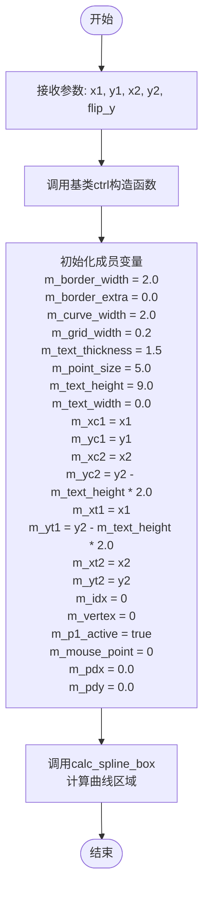

#### 带注释源码

```cpp
//------------------------------------------------------------------------
// gamma_ctrl_impl构造函数
// 参数：
//   x1, y1 : 控制区域左上角坐标
//   x2, y2 : 控制区域右下角坐标
//   flip_y : 是否翻转y轴
//------------------------------------------------------------------------
gamma_ctrl_impl::gamma_ctrl_impl(double x1, double y1, double x2, double y2, bool flip_y) :
    ctrl(x1, y1, x2, y2, flip_y),  // 调用基类ctrl构造函数
    // 初始化边框相关成员变量
    m_border_width(2.0),           // 边框宽度
    m_border_extra(0.0),           // 边框额外宽度
    // 初始化曲线和网格相关成员变量
    m_curve_width(2.0),            // 曲线宽度
    m_grid_width(0.2),              // 网格宽度
    // 初始化文本相关成员变量
    m_text_thickness(1.5),         // 文本粗细
    m_text_height(9.0),             // 文本高度
    m_text_width(0.0),              // 文本宽度
    // 初始化曲线控制点坐标
    m_xc1(x1),                      // 曲线区域左上角x
    m_yc1(y1),                      // 曲线区域左上角y
    m_xc2(x2),                      // 曲线区域右下角x
    m_yc2(y2 - m_text_height * 2.0), // 曲线区域右下角y（考虑文本高度）
    // 初始化文本区域坐标
    m_xt1(x1),                      // 文本区域左上角x
    m_yt1(y2 - m_text_height * 2.0), // 文本区域左上角y
    m_xt2(x2),                      // 文本区域右下角x
    m_yt2(y2),                      // 文本区域右下角y
    // 初始化多边形对象
    m_curve_poly(m_gamma_spline),   // 曲线多边形（关联gamma样条）
    m_text_poly(m_text),            // 文本多边形（关联文本对象）
    // 初始化状态变量
    m_idx(0),                       // 当前绘制元素索引
    m_vertex(0),                    // 当前顶点索引
    m_p1_active(true),              // 当前激活的控制点（true为点1，false为点2）
    m_mouse_point(0),               // 当前鼠标捕获的点（0无，1点1，2点2）
    m_pdx(0.0),                     // 鼠标拖动偏移量x
    m_pdy(0.0)                      // 鼠标拖动偏移量y
{
    // 计算样条曲线的边界框
    calc_spline_box();
}
```


### `gamma_ctrl_impl.calc_spline_box`

该方法根据控制框坐标和边界宽度计算样条曲线的内矩形边界框，用于确定后续绘制曲线、网格和控制点的区域。

参数：无

返回值：`void`，无返回值（直接修改成员变量）

#### 流程图

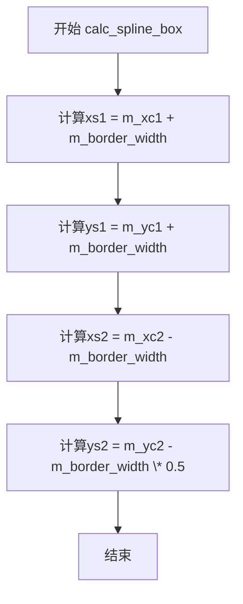

#### 带注释源码

```cpp
//------------------------------------------------------------------------
// 计算样条曲线的边界框
// 根据控制框坐标(m_xc1, m_yc1, m_xc2, m_yc2)和边界宽度(m_border_width)
// 计算出样条曲线实际绘制区域的左上角(xs1, ys1)和右下角(xs2, ys2)
// 底部边界使用0.5倍的边界宽度，以留出空间给文本显示
//------------------------------------------------------------------------
void gamma_ctrl_impl::calc_spline_box()
{
    // 计算样条区域左上角 x 坐标：控制框左上角 + 边界宽度
    m_xs1 = m_xc1 + m_border_width;
    
    // 计算样条区域左上角 y 坐标：控制框左上角 + 边界宽度
    m_ys1 = m_yc1 + m_border_width;
    
    // 计算样条区域右下角 x 坐标：控制框右上角 - 边界宽度
    m_xs2 = m_xc2 - m_border_width;
    
    // 计算样条区域右下角 y 坐标：控制框右下角 - 边界宽度的一半
    // 乘以0.5是为了在底部留出更多空间用于显示文本标签
    m_ys2 = m_yc2 - m_border_width * 0.5;
}
```


### `gamma_ctrl_impl.calc_points`

根据gamma样条曲线的参数（kx1, ky1, kx2, ky2）计算两个控制点在曲线绘制区域内的坐标位置，用于确定UI中可交互的拖拽点位置。

参数：无

返回值：`void`，无返回值。计算结果直接存储在成员变量 `m_xp1`, `m_yp1`, `m_xp2`, `m_yp2` 中。

#### 流程图

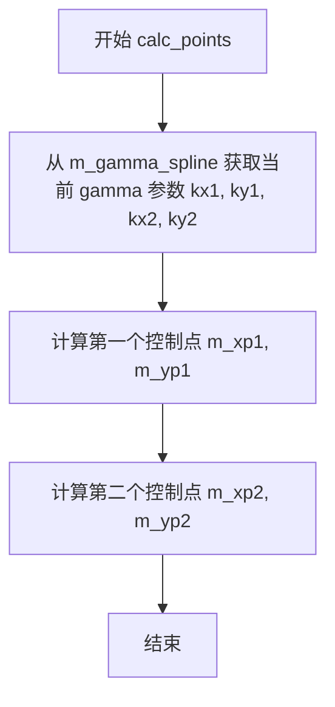

#### 带注释源码

```cpp
void gamma_ctrl_impl::calc_points()
{
    // 用于存储从 gamma 样条曲线获取的当前参数值
    double kx1, ky1, kx2, ky2;
    
    // 获取当前的 gamma 参数（通常范围在 0.0 到 1.0 之间，但可能超出）
    m_gamma_spline.values(&kx1, &ky1, &kx2, &ky2);
    
    // 根据 gamma 参数和样条盒子边界计算第一个控制点 (P1) 的坐标
    // 使用线性插值公式：start + (end - start) * ratio * 0.25
    // 0.25 是为了将 gamma 参数映射到曲线区域宽度的 1/4 处作为默认位置
    m_xp1 = m_xs1 + (m_xs2 - m_xs1) * kx1 * 0.25;
    m_yp1 = m_ys1 + (m_ys2 - m_ys1) * ky1 * 0.25;
    
    // 计算第二个控制点 (P2) 的坐标
    // 注意：这里是从右侧边界减去偏移量，原理同上
    m_xp2 = m_xs2 - (m_xs2 - m_xs1) * kx2 * 0.25;
    m_yp2 = m_ys2 - (m_ys2 - m_ys1) * ky2 * 0.25;
}
```


### `gamma_ctrl_impl.calc_values`

该方法负责将UI中两个可拖动控制点（Point1和Point2）的像素坐标转换为gamma样条曲线（`m_gamma_spline`）所需的数学控制参数（kx1, ky1, kx2, ky2）。它根据控制点相对于样条曲线绘制区域（spline box）的位置，实时更新内部的gamma值，从而使得曲线能够正确地响应用户的鼠标交互。

参数：
- 无（该方法不接受显式参数，其计算依赖于对象的成员变量状态）

返回值：
- `void`（无返回值，结果直接写入成员变量 `m_gamma_spline`）

#### 流程图

```mermaid
graph TD
    A[开始 calc_values] --> B[获取控制点坐标和区域边界]
    B --> C{计算 kx1}
    C --> D[kx1 = (m_xp1 - m_xs1) * 4.0 / (m_xs2 - m_xs1)]
    D --> E{计算 ky1}
    E --> F[ky1 = (m_yp1 - m_ys1) * 4.0 / (m_ys2 - m_ys1)]
    F --> G{计算 kx2}
    G --> H[kx2 = (m_xs2 - m_xp2) * 4.0 / (m_xs2 - m_xs1)]
    H --> I{计算 ky2}
    I --> J[ky2 = (m_ys2 - m_yp2) * 4.0 / (m_ys2 - m_ys1)]
    J --> K[调用 m_gamma_spline.values 更新曲线参数]
    K --> L[结束]
```

#### 带注释源码

```cpp
    //------------------------------------------------------------------------
    void gamma_ctrl_impl::calc_values()
    {
        double kx1, ky1, kx2, ky2;

        // 计算第一个控制点(Point1)相对于样条箱左侧和顶部的归一化位置
        // 乘以4.0是为了匹配gamma样条曲线的数学定义（通常样条把手长度为箱体宽度的1/4）
        kx1 = (m_xp1 - m_xs1) * 4.0 / (m_xs2 - m_xs1);
        ky1 = (m_yp1 - m_ys1) * 4.0 / (m_ys2 - m_ys1);

        // 计算第二个控制点(Point2)相对于样条箱右侧和底部的归一化位置
        // 注意：这里使用的是 (m_xs2 - m_xp2)，即距离右边界的距离
        kx2 = (m_xs2 - m_xp2) * 4.0 / (m_xs2 - m_xs1);
        ky2 = (m_ys2 - m_yp2) * 4.0 / (m_ys2 - m_ys1);

        // 将计算出的四个参数传递给内部的gamma样条对象，更新曲线形状
        m_gamma_spline.values(kx1, ky1, kx2, ky2);
    }
```


### `gamma_ctrl_impl.text_size`

设置文本大小并重新计算相关的区域参数。

参数：

- `h`：`double`，文本高度
- `w`：`double`，文本宽度

返回值：`void`，无返回值

#### 流程图

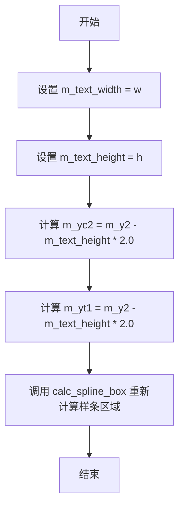

#### 带注释源码

```cpp
void gamma_ctrl_impl::text_size(double h, double w) 
{ 
    m_text_width = w;             // 设置文本宽度
    m_text_height = h;            // 设置文本高度
    m_yc2 = m_y2 - m_text_height * 2.0; // 重新计算文本区域的上边界
    m_yt1 = m_y2 - m_text_height * 2.0; // 重新计算文本的起始Y坐标
    calc_spline_box();            // 调用内部方法重新计算样条曲线的包围盒区域
}
```


### `gamma_ctrl_impl.border_width`

设置边框宽度和边框额外值，并重新计算样条曲线的边界框。

参数：

- `t`：`double`，边框宽度
- `extra`：`double`，边框额外宽度，用于扩展边界框

返回值：`void`，无返回值

#### 流程图

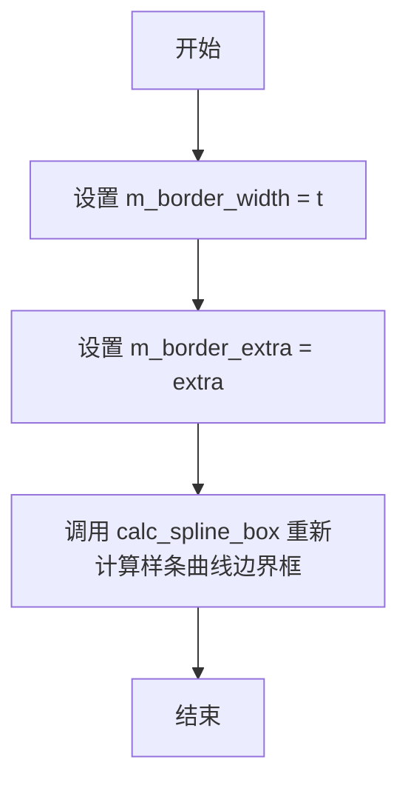

#### 带注释源码

```cpp
//------------------------------------------------------------------------
// 设置边框宽度并重新计算区域
// 参数:
//   t - 边框宽度
//   extra - 边框额外宽度
//------------------------------------------------------------------------
void gamma_ctrl_impl::border_width(double t, double extra)
{ 
    // 1. 设置边框宽度成员变量
    m_border_width = t; 
    
    // 2. 设置边框额外宽度成员变量
    m_border_extra = extra;
    
    // 3. 重新计算样条曲线的边界框
    // 这会更新 m_xs1, m_ys1, m_xs2, m_ys2 等内部坐标
    calc_spline_box(); 
}
```


### `gamma_ctrl_impl.values` (四参数版本)

该函数用于设置Gamma控制曲线的四个控制点参数值（kx1, ky1, kx2, ky2），通过调用内部成员变量 `m_gamma_spline` 的 `values` 方法来实现Gamma校正曲线的配置。这是Gamma控制器设置控制点的主要接口之一。

参数：

- `kx1`：`double`，第一个控制点的X轴系数，范围通常在0.0到1.0之间
- `ky1`：`double`，第一个控制点的Y轴系数，范围通常在0.0到1.0之间
- `kx2`：`double`，第二个控制点的X轴系数，范围通常在0.0到1.0之间
- `ky2`：`double`，第二个控制点的Y轴系数，范围通常在0.0到1.0之间

返回值：`void`，无返回值

#### 流程图

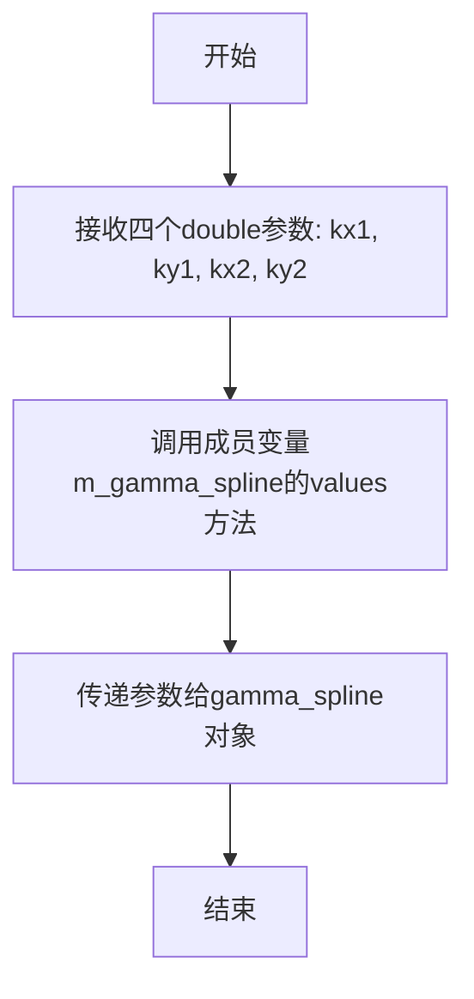

#### 带注释源码

```cpp
//------------------------------------------------------------------------
// Gamma控制曲线的四参数设置方法
// 该方法允许外部直接设置Gamma校正曲线的四个控制点参数
// 参数:
//   kx1 - 第一个控制点的X系数
//   ky1 - 第一个控制点的Y系数
//   kx2 - 第二个控制点的X系数
//   ky2 - 第二个控制点的Y系数
//------------------------------------------------------------------------
void gamma_ctrl_impl::values(double kx1, double ky1, double kx2, double ky2)
{
    // 将四个参数直接传递给内部的gamma_spline对象
    // gamma_spline是一个样条曲线对象，用于计算Gamma校正曲线
    m_gamma_spline.values(kx1, ky1, kx2, ky2);
}
```


### `gamma_ctrl_impl.values(double*, double*, double*, double*) const`

获取 Gamma 曲线控制点的四个参数值（kx1, ky1, kx2, ky2）。该方法为 const 成员函数，通过指针参数输出当前 Gamma 样条曲线的控制点坐标。

参数：

- `kx1`：`double*`，指向用于输出第一个控制点 X 坐标的指针
- `ky1`：`double*`，指向用于输出第一个控制点 Y 坐标的指针
- `kx2`：`double*`，指向用于输出第二个控制点 X 坐标的指针
- `ky2`：`double*`，指向用于输出第二个控制点 Y 坐标的指针

返回值：`void`，无返回值，通过指针参数输出 Gamma 曲线的控制点值

#### 流程图

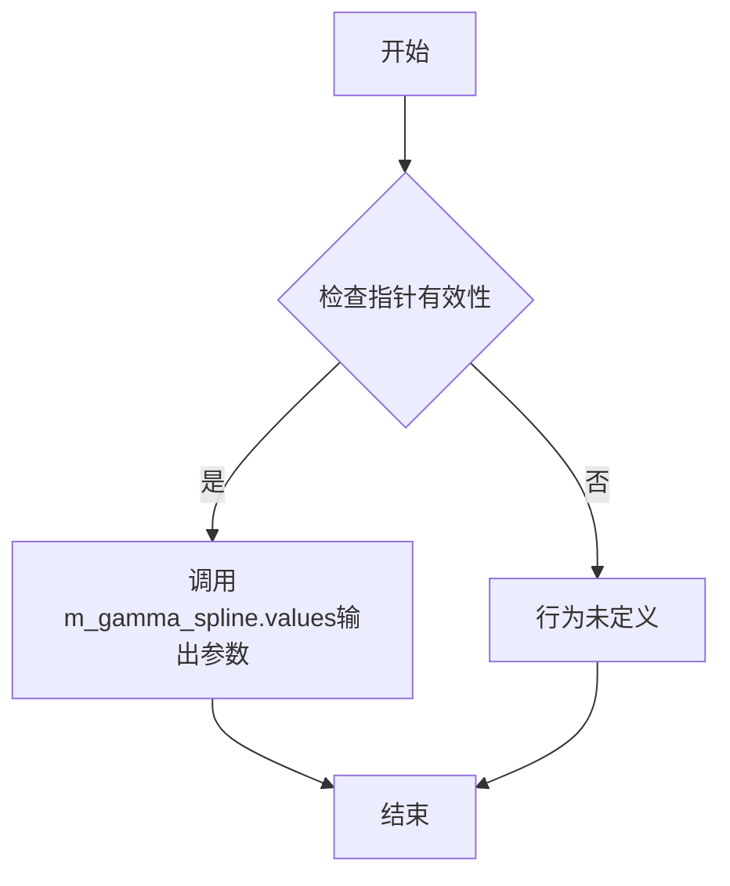

#### 带注释源码

```
    //------------------------------------------------------------------------
    // 获取gamma值（四参数指针版本）
    // 该方法为const成员函数，不会修改对象状态
    // 通过输出参数返回当前gamma样条曲线的四个控制点值
    //------------------------------------------------------------------------
    void gamma_ctrl_impl::values(double* kx1, double* ky1, double* kx2, double* ky2) const
    {
        // 调用成员变量m_gamma_spline的values方法获取控制点坐标
        // m_gamma_spline是一个gamma_spline类型对象，用于存储gamma曲线数据
        // 传入的指针将被内部填充为当前的gamma控制点值
        m_gamma_spline.values(kx1, ky1, kx2, ky2);
    }
```


### `gamma_ctrl_impl::rewind`

该方法属于渲染流水线的前置准备阶段，根据传入的索引 `idx` 准备并初始化对应的图形几何数据（背景、边框、伽马曲线、网格、控制点或文本标签），为后续通过 `vertex()` 方法获取顶点路径做铺垫。

参数：
- `idx`：`unsigned`，指定要渲染的元素类型索引（0-背景，1-边框，2-曲线，3-网格，4-控制点1，5-控制点2，6-文本）。

返回值：`void`，无返回值。

#### 流程图

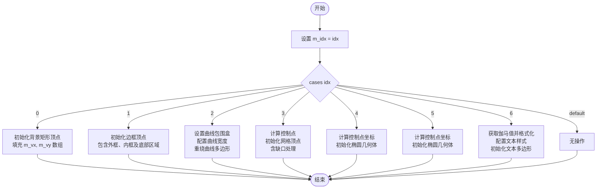

#### 带注释源码

```cpp
//------------------------------------------------------------------------
// 准备渲染指定元素，初始化顶点数据
// idx: 指定渲染对象的索引 (0-背景, 1-边框, 2-曲线, 3-网格, 4-控制点1, 5-控制点2, 6-文本)
//------------------------------------------------------------------------
void  gamma_ctrl_impl::rewind(unsigned idx)
{
    double kx1, ky1, kx2, ky2;
    char tbuf[32];

    // 保存当前准备渲染的组件索引
    m_idx = idx;

    switch(idx)
    {
    default:

    case 0:                 // 背景 (Background)
        m_vertex = 0; // 重置顶点读取游标
        // 定义背景矩形四个顶点（考虑额外的边框偏移）
        m_vx[0] = m_x1 - m_border_extra; 
        m_vy[0] = m_y1 - m_border_extra;
        m_vx[1] = m_x2 + m_border_extra; 
        m_vy[1] = m_y1 - m_border_extra;
        m_vx[2] = m_x2 + m_border_extra; 
        m_vy[2] = m_y2 + m_border_extra;
        m_vx[3] = m_x1 - m_border_extra; 
        m_vy[3] = m_y2 + m_border_extra;
        break;

    case 1:                 // 边框 (Border)
        m_vertex = 0;
        // 外矩形顶点
        m_vx[0] = m_x1; m_vy[0] = m_y1;
        m_vx[1] = m_x2; m_vy[1] = m_y1;
        m_vx[2] = m_x2; m_vy[2] = m_y2;
        m_vx[3] = m_x1; m_vy[3] = m_y2;
        // 内矩形顶点
        m_vx[4] = m_x1 + m_border_width; m_vy[4] = m_y1 + m_border_width; 
        m_vx[5] = m_x1 + m_border_width; m_vy[5] = m_y2 - m_border_width; 
        m_vx[6] = m_x2 - m_border_width; m_vy[6] = m_y2 - m_border_width; 
        m_vx[7] = m_x2 - m_border_width; m_vy[7] = m_y1 + m_border_width; 
        // 底部文本区域边框
        m_vx[8] = m_xc1 + m_border_width;
        m_vy[8] = m_yc2 - m_border_width * 0.5;
        m_vx[9] = m_xc2 - m_border_width;
        m_vy[9] = m_yc2 - m_border_width * 0.5;
        m_vx[10] = m_xc2 - m_border_width;
        m_vy[10] = m_yc2 + m_border_width * 0.5;
        m_vx[11] = m_xc1 + m_border_width;
        m_vy[11] = m_yc2 + m_border_width * 0.5;
        break;

    case 2:                 // 曲线 (Curve)
        // 设置伽马样条曲线的绘图区域
        m_gamma_spline.box(m_xs1, m_ys1, m_xs2, m_ys2);
        // 设置曲线宽度并重置曲线多边形生成器
        m_curve_poly.width(m_curve_width);
        m_curve_poly.rewind(0);
        break;

    case 3:                 // 网格 (Grid)
        m_vertex = 0;
        // 绘制十字交叉网格线
        // 水平线
        m_vx[0] = m_xs1;
        m_vy[0] = (m_ys1 + m_ys2) * 0.5 - m_grid_width * 0.5;
        m_vx[1] = m_xs2;
        m_vy[1] = (m_ys1 + m_ys2) * 0.5 - m_grid_width * 0.5;
        m_vx[2] = m_xs2;
        m_vy[2] = (m_ys1 + m_ys2) * 0.5 + m_grid_width * 0.5;
        m_vx[3] = m_xs1;
        m_vy[3] = (m_ys1 + m_ys2) * 0.5 + m_grid_width * 0.5;
        // 垂直线
        m_vx[4] = (m_xs1 + m_xs2) * 0.5 - m_grid_width * 0.5;
        m_vy[4] = m_ys1;
        m_vx[5] = (m_xs1 + m_xs2) * 0.5 - m_grid_width * 0.5;
        m_vy[5] = m_ys2;
        m_vx[6] = (m_xs1 + m_xs2) * 0.5 + m_grid_width * 0.5;
        m_vy[6] = m_ys2;
        m_vx[7] = (m_xs1 + m_xs2) * 0.5 + m_grid_width * 0.5;
        m_vy[7] = m_ys1;
        // 计算控制点周围网格的缺口
        calc_points();
        // 左上区域缺口
        m_vx[8] = m_xs1;
        m_vy[8] = m_yp1 - m_grid_width * 0.5;
        m_vx[9] = m_xp1 - m_grid_width * 0.5;
        m_vy[9] = m_yp1 - m_grid_width * 0.5;
        m_vx[10] = m_xp1 - m_grid_width * 0.5;
        m_vy[10] = m_ys1;
        m_vx[11] = m_xp1 + m_grid_width * 0.5;
        m_vy[11] = m_ys1;
        m_vx[12] = m_xp1 + m_grid_width * 0.5;
        m_vy[12] = m_yp1 + m_grid_width * 0.5;
        m_vx[13] = m_xs1;
        m_vy[13] = m_yp1 + m_grid_width * 0.5;
        // 右下区域缺口
        m_vx[14] = m_xs2;
        m_vy[14] = m_yp2 + m_grid_width * 0.5;
        m_vx[15] = m_xp2 + m_grid_width * 0.5;
        m_vy[15] = m_yp2 + m_grid_width * 0.5;
        m_vx[16] = m_xp2 + m_grid_width * 0.5;
        m_vy[16] = m_ys2;
        m_vx[17] = m_xp2 - m_grid_width * 0.5;
        m_vy[17] = m_ys2;
        m_vx[18] = m_xp2 - m_grid_width * 0.5;
        m_vy[18] = m_yp2 - m_grid_width * 0.5;
        m_vx[19] = m_xs2;
        m_vy[19] = m_yp2 - m_grid_width * 0.5;
        break;

    case 4:                 // 控制点1 (Point1)
        calc_points();
        // 根据当前激活点状态初始化椭圆（用于UI显示）
        if(m_p1_active) m_ellipse.init(m_xp2, m_yp2, m_point_size, m_point_size, 32);
        else            m_ellipse.init(m_xp1, m_yp1, m_point_size, m_point_size, 32);
        break;

    case 5:                 // 控制点2 (Point2)
        calc_points();
        if(m_p1_active) m_ellipse.init(m_xp1, m_yp1, m_point_size, m_point_size, 32);
        else            m_ellipse.init(m_xp2, m_yp2, m_point_size, m_point_size, 32);
        break;

    case 6:                 // 文本 (Text)
        // 获取当前的伽马参数值
        m_gamma_spline.values(&kx1, &ky1, &kx2, &ky2);
        // 格式化文本内容
        sprintf(tbuf, "%5.3f %5.3f %5.3f %5.3f", kx1, ky1, kx2, ky2);
        m_text.text(tbuf);
        // 设置文本大小和起始渲染点
        m_text.size(m_text_height, m_text_width);
        m_text.start_point(m_xt1 + m_border_width * 2.0, (m_yt1 + m_yt2) * 0.5 - m_text_height * 0.5);
        // 配置文本轮廓线的样式
        m_text_poly.width(m_text_thickness);
        m_text_poly.line_join(round_join);
        m_text_poly.line_cap(round_cap);
        m_text_poly.rewind(0);
        break;
    }
}
```


### `gamma_ctrl_impl::vertex`

该方法属于`gamma_ctrl_impl`类，是Anti-Grain Geometry库中图形控制器的顶点生成器。它根据当前渲染的图形部分（背景、边框、曲线、网格、锚点或文本），通过状态机的方式逐步返回下一个顶点的坐标和绘制命令，实现交互式gamma校正曲线的可视化渲染。

参数：

- `x`：`double*`，指向存储返回顶点X坐标的double类型指针
- `y`：`double*`，指向存储返回顶点Y坐标的double类型指针

返回值：`unsigned`，返回路径命令类型（如`path_cmd_move_to`、`path_cmd_line_to`、`path_cmd_stop`等），用于指示下一步的绘制操作

#### 流程图

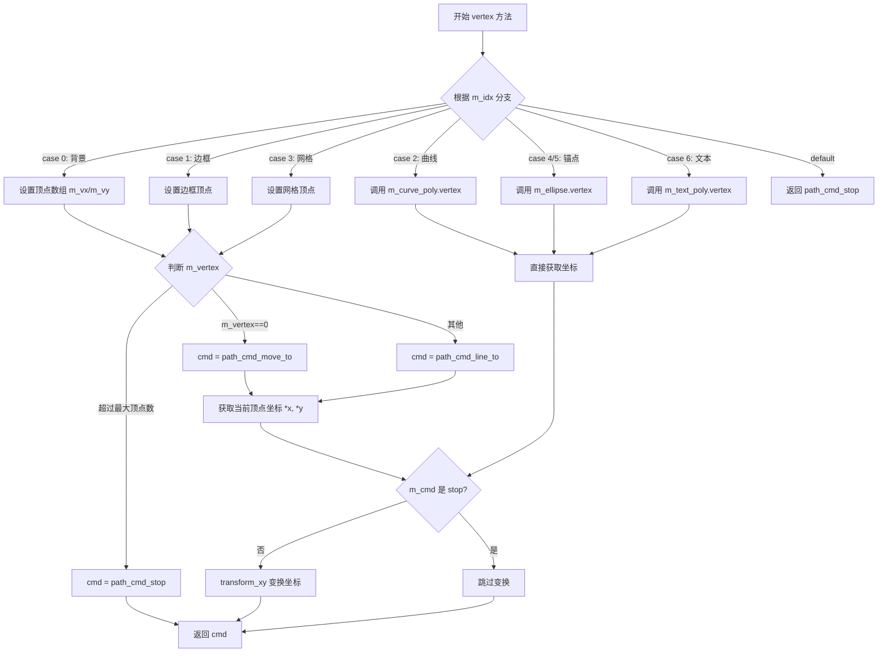

#### 带注释源码

```cpp
//------------------------------------------------------------------------
// vertex - 获取下一个顶点命令和坐标
//------------------------------------------------------------------------
unsigned gamma_ctrl_impl::vertex(double* x, double* y)
{
    // 默认命令为 line_to（画线）
    unsigned cmd = path_cmd_line_to;
    
    // 根据当前渲染的图形部分（由m_idx指定）进行分支处理
    switch(m_idx)
    {
    case 0:                 // 背景矩形
        // 第一个顶点使用 move_to 命令
        if(m_vertex == 0) cmd = path_cmd_move_to;
        // 超过4个顶点则停止
        if(m_vertex >= 4) cmd = path_cmd_stop;
        // 从预定义数组中取出当前顶点坐标
        *x = m_vx[m_vertex];
        *y = m_vy[m_vertex];
        // 移动到下一个顶点
        m_vertex++;
        break;

    case 1:                 // 边框（带缺口的矩形）
        // 在特定顶点位置（0, 4, 8）使用 move_to 命令形成缺口效果
        if(m_vertex == 0 || m_vertex == 4 || m_vertex == 8) cmd = path_cmd_move_to;
        // 边框有12个顶点
        if(m_vertex >= 12) cmd = path_cmd_stop;
        *x = m_vx[m_vertex];
        *y = m_vy[m_vertex];
        m_vertex++;
        break;

    case 2:                 // Gamma 曲线
        // 委托给曲线多项式对象处理顶点生成
        cmd = m_curve_poly.vertex(x, y);
        break;

    case 3:                 // 网格
        // 在特定顶点位置使用 move_to 命令
        if(m_vertex == 0  || 
           m_vertex == 4  || 
           m_vertex == 8  ||
           m_vertex == 14) cmd = path_cmd_move_to;
        // 网格共20个顶点
        if(m_vertex >= 20) cmd = path_cmd_stop;
        *x = m_vx[m_vertex];
        *y = m_vy[m_vertex];
        m_vertex++;
        break;

    case 4:                 // 锚点1（椭圆）
    case 5:                 // 锚点2（椭圆）
        // 委托给椭圆对象处理顶点生成
        cmd = m_ellipse.vertex(x, y);
        break;

    case 6:                 // 文本
        // 委托给文本多项式对象处理顶点生成
        cmd = m_text_poly.vertex(x, y);
        break;

    default:                // 未知索引
        // 停止渲染
        cmd = path_cmd_stop;
        break;
    }

    // 如果不是停止命令，则对坐标进行变换（坐标转换/缩放等）
    if(!is_stop(cmd))
    {
        transform_xy(x, y);
    }

    // 返回当前的路径命令，供渲染器使用
    return cmd;
}
```


### `gamma_ctrl_impl.on_arrow_keys`

该方法处理方向键事件，根据用户按下的方向键（上下左右）调整gamma曲线控制点的值。当活动点为第一组控制点(kx1, ky1)时，左/右键调整kx1，上/下键调整ky1；当活动点为第二组控制点(kx2, ky2)时，方向键的调整方向相反。每次调整的步长为0.005，如果任何键被按下并导致值发生变化，则返回true。

参数：

- `left`：`bool`，是否按下左方向键
- `right`：`bool`，是否按下右方向键
- `down`：`bool`，是否按下下方向键
- `up`：`bool`，是否按下上方向键

返回值：`bool`，返回是否有键被按下并导致gamma值发生变化

#### 流程图

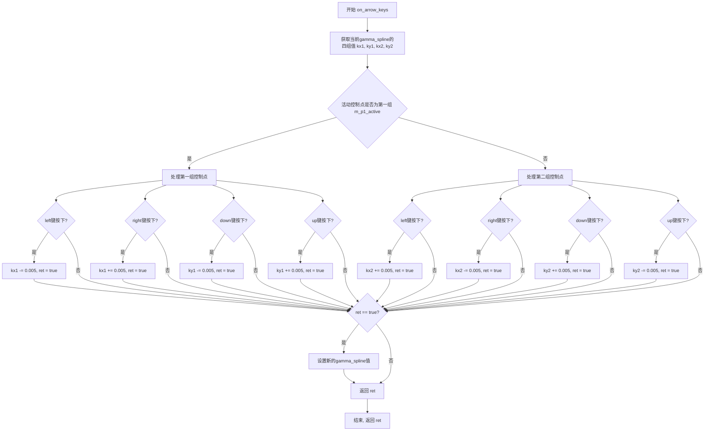

#### 带注释源码

```cpp
//------------------------------------------------------------------------
// 处理方向键事件，调整gamma曲线控制点的值
// left: 是否按下左方向键
// right: 是否按下右方向键
// down: 是否按下下方向键
// up: 是否按下上方向键
// 返回: bool - 是否有键被按下并导致值发生变化
//------------------------------------------------------------------------
bool gamma_ctrl_impl::on_arrow_keys(bool left, bool right, bool down, bool up)
{
    double kx1, ky1, kx2, ky2;  // gamma曲线控制点的四个参数
    bool ret = false;           // 返回值，标记是否有修改
    
    // 获取当前gamma_spline的四组控制点值
    m_gamma_spline.values(&kx1, &ky1, &kx2, &ky2);
    
    // 根据活动控制点判断调整哪一组值
    if(m_p1_active)
    {
        // 第一组控制点(kx1, ky1)为活动点
        // 左键减少kx1，右键增加kx1
        if(left)  { kx1 -= 0.005; ret = true; }
        if(right) { kx1 += 0.005; ret = true; }
        // 下键减少ky1，上键增加ky1
        if(down)  { ky1 -= 0.005; ret = true; }
        if(up)    { ky1 += 0.005; ret = true; }
    }
    else
    {
        // 第二组控制点(kx2, ky2)为活动点
        // 左键增加kx2，右键减少kx2（与p1方向相反）
        if(left)  { kx2 += 0.005; ret = true; }
        if(right) { kx2 -= 0.005; ret = true; }
        // 下键增加ky2，上键减少ky2（与p1方向相反）
        if(down)  { ky2 += 0.005; ret = true; }
        if(up)    { ky2 -= 0.005; ret = true; }
    }
    
    // 如果有修改，更新gamma_spline的值
    if(ret)
    {
        m_gamma_spline.values(kx1, ky1, kx2, ky2);
    }
    
    // 返回是否有值被修改
    return ret;
}
```


### `gamma_ctrl_impl.change_active_point`

切换当前激活的控制点，用于在图伽玛曲线的两个控制点（点1和点2）之间切换激活状态。

参数：无

返回值：`void`，无返回值

#### 流程图

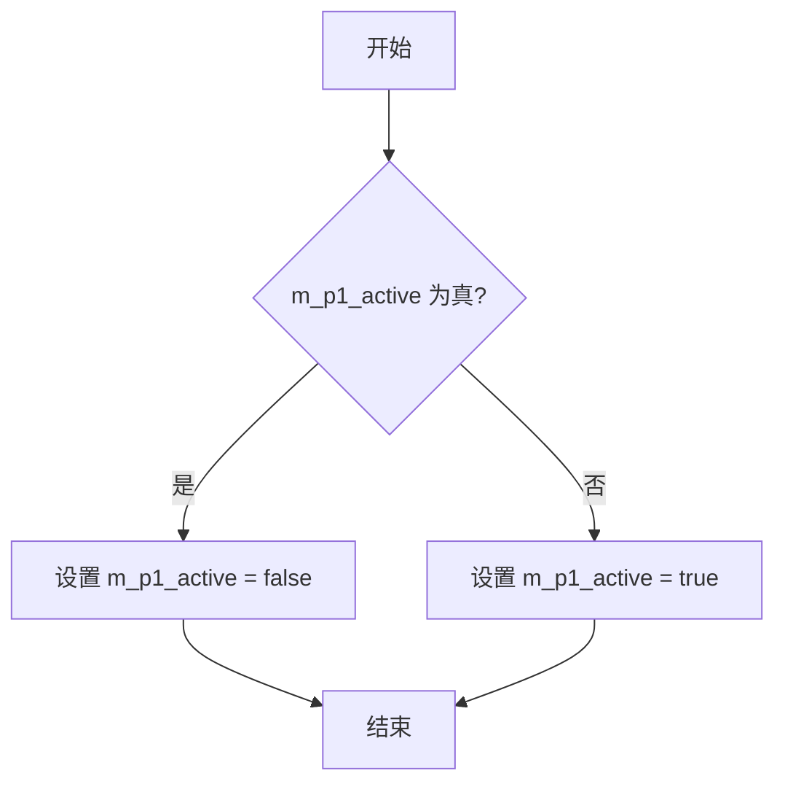

#### 带注释源码

```cpp
//------------------------------------------------------------------------
// 切换当前激活的控制点
// 该方法通过三元运算符切换 m_p1_active 标志位
// 当 m_p1_active 为 true 时设置为 false，反之设置为 true
// 这样可以在图伽玛曲线的两个控制点之间切换激活状态
//------------------------------------------------------------------------
void gamma_ctrl_impl::change_active_point()
{
    // 使用三元运算符切换布尔值
    // 如果 m_p1_active 为 true，则设为 false；否则设为 true
    m_p1_active = m_p1_active ? false : true;
}
```


### `gamma_ctrl_impl.in_rect`

检查给定点是否在控件的矩形边界区域内。首先对坐标进行逆变换以适应坐标系，然后判断点是否落在由左上角(m_x1, m_y1)和右下角(m_x2, m_y2)定义的矩形范围内。

参数：

- `x`：`double`，待检测点的X坐标
- `y`：`double`，待检测点的Y坐标

返回值：`bool`，如果点(x, y)位于矩形区域内返回true，否则返回false

#### 流程图

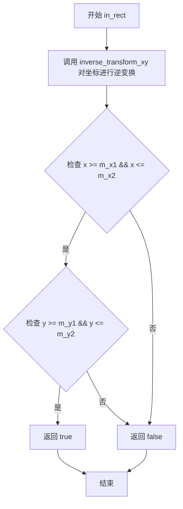

#### 带注释源码

```cpp
//------------------------------------------------------------------------
// 检查点(x, y)是否在控件的矩形边界区域内
// 参数:
//   x - 待检测的X坐标（可能被逆变换）
//   y - 待检测的Y坐标（可能被逆变换）
// 返回值:
//   true - 点在矩形区域内
//   false - 点在矩形区域外
//------------------------------------------------------------------------
bool gamma_ctrl_impl::in_rect(double x, double y) const
{
    // 对输入坐标进行逆变换，以适应控件的坐标系
    // 这通常用于处理坐标系的翻转（如Y轴向下）
    inverse_transform_xy(&x, &y);
    
    // 检查点是否在矩形边界内
    // m_x1, m_y1: 控件左上角坐标
    // m_x2, m_y2: 控件右下角坐标
    return x >= m_x1 && x <= m_x2 && y >= m_y1 && y <= m_y2;
}
```


### `gamma_ctrl_impl.on_mouse_button_down`

处理鼠标按下事件，用于检测用户是否点击了gamma控制曲线上的控制点（两个可拖拽的点）。如果点击命中控制点，则进入拖拽状态并返回true；否则返回false。

参数：

- `x`：`double`，鼠标按下位置的X坐标（屏幕坐标）
- `y`：`double`，鼠标按下位置的Y坐标（屏幕坐标）

返回值：`bool`，如果鼠标按下位置命中控制点返回true，否则返回false

#### 流程图

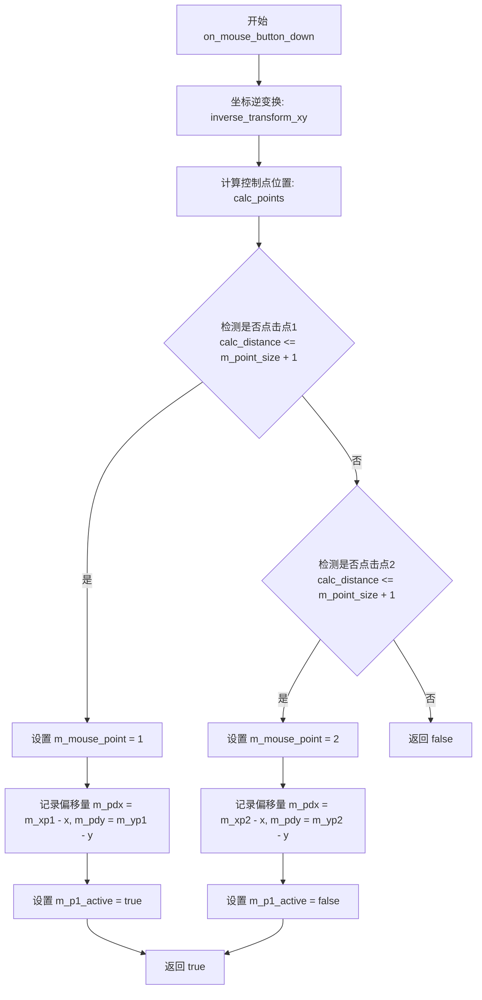

#### 带注释源码

```cpp
//------------------------------------------------------------------------
// 处理鼠标按下事件，检测是否点击了gamma曲线的控制点
// 参数：
//   x, y - 鼠标按下位置的屏幕坐标
// 返回值：
//   true  - 成功捕获控制点，进入拖拽模式
//   false - 未点击任何控制点
//------------------------------------------------------------------------
bool gamma_ctrl_impl::on_mouse_button_down(double x, double y)
{
    // 将屏幕坐标转换为控制区本地坐标
    inverse_transform_xy(&x, &y);
    
    // 根据gamma样条曲线计算当前的两个控制点位置
    calc_points();

    // 检查鼠标是否点击了第一个控制点 (m_xp1, m_yp1)
    // 使用点与控制点的距离进行判定，允许一定范围的误差(m_point_size + 1)
    if(calc_distance(x, y, m_xp1, m_yp1) <= m_point_size + 1)
    {
        // 记录当前激活的鼠标点编号为1
        m_mouse_point = 1;
        
        // 记录鼠标相对于控制点的偏移量，用于拖拽时保持相对位置
        m_pdx = m_xp1 - x;
        m_pdy = m_yp1 - y;
        
        // 设置第一个控制点为活跃状态
        m_p1_active = true;
        
        // 成功捕获鼠标事件
        return true;
    }

    // 检查鼠标是否点击了第二个控制点 (m_xp2, m_yp2)
    if(calc_distance(x, y, m_xp2, m_yp2) <= m_point_size + 1)
    {
        // 记录当前激活的鼠标点编号为2
        m_mouse_point = 2;
        
        // 记录鼠标相对于控制点的偏移量
        m_pdx = m_xp2 - x;
        m_pdy = m_yp2 - y;
        
        // 设置第二个控制点为活跃状态（即第一个控制点为非活跃）
        m_p1_active = false;
        
        // 成功捕获鼠标事件
        return true;
    }

    // 未点击任何控制点
    return false;
}
```


### `gamma_ctrl_impl.on_mouse_button_up`

处理鼠标释放事件，结束拖拽操作并重置鼠标状态。

参数：

-  `x`：`double`，鼠标释放时的X坐标（未使用，保留参数占位）
-  `y`：`double`，鼠标释放时的Y坐标（未使用，保留参数占位）

返回值：`bool`，如果之前有鼠标按钮被按下（m_mouse_point非0）则返回true，否则返回false

#### 流程图

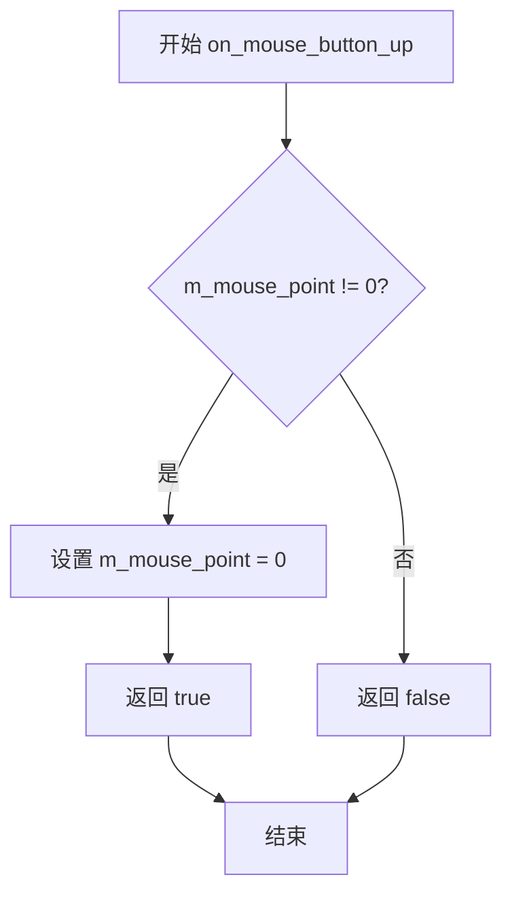

#### 带注释源码

```cpp
//------------------------------------------------------------------------
// 处理鼠标按钮释放事件
// 参数:
//   x - 鼠标释放时的X坐标（当前未使用，保留接口兼容性）
//   y - 鼠标释放时的Y坐标（当前未使用，保留接口兼容性）
// 返回值:
//   true  - 如果之前有鼠标按钮被按下并处于拖拽状态
//   false - 如果没有处于拖拽状态
//------------------------------------------------------------------------
bool gamma_ctrl_impl::on_mouse_button_up(double, double)
{
    // 检查是否处于鼠标拖拽状态（m_mouse_point在on_mouse_button_down中设置）
    if(m_mouse_point)
    {
        // 重置鼠标状态，结束拖拽操作
        m_mouse_point = 0;
        // 返回true表示成功处理了鼠标释放事件
        return true;
    }
    // 没有处于拖拽状态，返回false
    return false;
}
```


### `gamma_ctrl_impl.on_mouse_move`

处理鼠标移动事件，当鼠标按钮被按下时拖动控制点以调整gamma曲线；当鼠标按钮释放时切换到按钮释放处理。

参数：

- `x`：`double`，鼠标位置的X坐标（屏幕坐标）
- `y`：`double`，鼠标位置的Y坐标（屏幕坐标）
- `button_flag`：`bool`，表示鼠标左键是否被按下（true为按下）

返回值：`bool`，返回true表示事件已被处理，返回false表示事件未被处理

#### 流程图

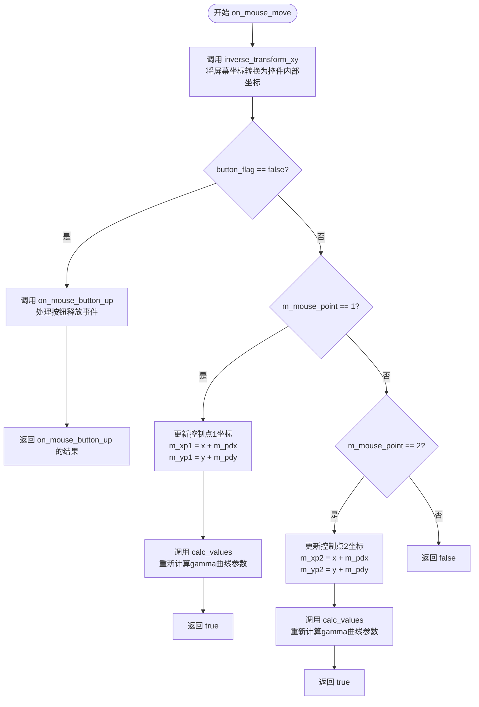

#### 带注释源码

```
//------------------------------------------------------------------------
// 处理鼠标移动事件
// 参数:
//   x          - 鼠标位置的X坐标（屏幕坐标）
//   y          - 鼠标位置的Y坐标（屏幕坐标）
//   button_flag - 鼠标按钮状态标志，true表示按钮被按下
// 返回值:
//   bool       - 返回true表示事件已被处理，false表示未处理
//------------------------------------------------------------------------
bool gamma_ctrl_impl::on_mouse_move(double x, double y, bool button_flag)
{
    // 将屏幕坐标逆变换为控件内部的坐标系统
    inverse_transform_xy(&x, &y);
    
    // 如果鼠标按钮未按下（button_flag为false）
    // 则将事件委托给on_mouse_button_up处理（处理鼠标释放）
    if(!button_flag)
    {
        return on_mouse_button_up(x, y);
    }

    // 如果当前拖动的是控制点1（曲线左侧控制点）
    if(m_mouse_point == 1)
    {
        // 根据鼠标当前位置更新控制点1的坐标
        // m_pdx和m_pdy是按下鼠标时记录的控制点与鼠标位置的偏移量
        m_xp1 = x + m_pdx;
        m_yp1 = y + m_pdy;
        
        // 重新计算gamma曲线的参数值
        calc_values();
        return true;
    }
    
    // 如果当前拖动的是控制点2（曲线右侧控制点）
    if(m_mouse_point == 2)
    {
        // 根据鼠标当前位置更新控制点2的坐标
        m_xp2 = x + m_pdx;
        m_yp2 = y + m_pdy;
        
        // 重新计算gamma曲线的参数值
        calc_values();
        return true;
    }
    
    // 如果没有控制点被选中（m_mouse_point == 0），返回false
    return false;
}
```

## 关键组件


### gamma_ctrl_impl 类

gamma_ctrl_impl是Anti-Grain Geometry库中的图形控件实现，用于创建交互式的gamma校正控制界面，支持通过鼠标拖拽或键盘方向键调整gamma曲线参数。

### m_gamma_spline (gamma_spline类型)

gamma样条曲线对象，用于存储和管理gamma校正的四个控制参数(kx1, ky1, kx2, ky2)，实现gamma曲线的计算与变换。

### m_curve_poly (curve类型)

曲线多边形渲染器，负责将gamma样条曲线渲染为可绘制的路径，支持设置线宽等属性。

### m_text_poly (conv_stroke类型)

文本描边转换器，用于将显示gamma数值的文本转换为可渲染的多边形路径，支持设置线条连接方式和端点样式。

### m_ellipse (ellipse类型)

椭圆对象，用于绘制控制点（可拖拽的圆点），在渲染交互点时动态初始化位置和大小。

### calc_spline_box 方法

计算样条曲线的边界框，根据边界宽度和额外偏移量确定曲线的有效绘制区域。

### calc_points 方法

根据gamma样条的控制点参数，计算两个交互点在边界框内的实际像素位置。

### calc_values 方法

根据交互点的像素位置反向计算gamma样条的控制参数值，实现从UI坐标到gamma参数的转换。

### rewind 方法

重置渲染状态，根据不同的路径类型（背景、边框、曲线、网格、控制点、文本）准备相应的顶点数据。

### vertex 方法

生成路径顶点数据，将内部坐标转换为实际屏幕坐标，支持多种图元的顺序输出。

### on_mouse_button_down 方法

处理鼠标按下事件，检测是否点击了控制点，并记录鼠标位置与控制点的偏移量。

### on_mouse_move 方法

处理鼠标移动事件，实现控制点的拖拽功能，根据偏移量更新控制点位置并重新计算gamma值。

### on_arrow_keys 方法

处理方向键事件，允许通过键盘调整当前激活控制点的gamma参数值。


## 问题及建议


### 已知问题

-   **硬编码的魔法数字**：代码中存在大量未命名的数值如 `0.25`、`4.0`、`0.005`、`32`、`1.5`、`5.0`、`9.0`、`0.2` 等，缺乏常量定义，降低了可维护性和可读性。
-   **不安全的字符串操作**：使用 `sprintf(tbuf, ...)` 存在缓冲区溢出风险，应改用 `snprintf` 或 `std::snprintf`。
-   **缺乏输入验证**：方法如 `text_size()`、`border_width()`、`values()` 等未对参数进行有效性检查，未处理负值或超出合理范围的情况。
-   **固定大小的数组**：`m_vx` 和 `m_vy` 使用固定大小数组（从基类继承），当绘制复杂图形（如 case 3 网格有20个顶点）时存在边界风险。
-   **重复计算**：在 `on_mouse_move` 和其他方法中多次调用 `inverse_transform_xy`、`calc_points` 等，可能导致性能开销。
-   **返回值设计问题**：`values(double* kx1, ...)` const 方法返回指针调用者，若外部传入空指针将导致未定义行为。
-   **状态管理耦合**：`m_p1_active`、`m_mouse_point` 等状态分散，缺乏统一的状态机管理，逻辑分散在多个事件处理函数中。
-   **命名不一致**：部分成员变量命名风格不统一（如 `m_pdx` 与 `m_text_height`），`m_p1_active` 语义不明确。
-   **缺乏异常安全**：整个类没有任何异常处理机制，内存分配失败等情况可能导致程序崩溃。
-   **无文档注释**：公共接口和关键逻辑缺乏注释，后续维护困难。

### 优化建议

-   **提取常量**：将所有魔法数字定义为类常量或枚举，如 `static const double DEFAULT_GAMMA_STEP = 0.005;`、`static const unsigned ELLIPSE_NUM_POINTS = 32;`。
-   **参数验证**：在 `text_size()`、`border_width()`、`values()` 等方法入口添加参数范围检查。
-   **使用安全字符串函数**：将 `sprintf` 替换为 `snprintf`。
-   **优化计算逻辑**：将 `inverse_transform_xy` 调用结果缓存，避免重复计算；考虑使用懒计算模式延迟更新非关键状态。
-   **改进 API 设计**：将 `values(double* kx1, ...)` 改为返回结构体或使用 `std::optional`/`std::tuple`，避免空指针风险。
-   **添加文档**：为所有公共方法和关键逻辑添加 Doxygen 风格注释。
-   **考虑使用智能指针**：如果类内部有动态内存分配，考虑使用 RAII 模式管理资源。
-   **统一命名规范**：采用更清晰的命名，如将 `m_p1_active` 改为 `m_isFirstControlPointActive`。


## 其它


### 设计目标与约束

该控件的设计目标是提供一个交互式的伽马校正曲线编辑界面，允许用户通过可视化方式调整图像的伽马值。设计约束包括：1) 控件尺寸由构造函数参数决定，支持坐标翻转；2) 控制点使用椭圆表示，半径固定为5.0；3) 样条曲线使用4个控制参数(kx1, ky1, kx2, ky2)描述；4) 文本显示精度为小数点后3位；5) 键盘步进值为0.005。

### 错误处理与异常设计

代码采用传统的C式错误处理方式，未使用异常机制。主要处理场景包括：1) 鼠标交互时使用距离计算判断点击是否在控制点范围内（m_point_size + 1作为容差）；2) on_mouse_move中通过button_flag判断鼠标按钮状态；3) vertex方法中通过path_cmd_stop命令标识路径结束；4) 所有坐标变换前都进行逆变换以确保在控件坐标系内操作。

### 数据流与状态机

控件的状态机包含以下状态：1) m_mouse_point状态：0表示无鼠标操作，1表示拖拽Point1，2表示拖拽Point2；2) m_p1_active状态：true表示Point1为激活点，false表示Point2为激活点；3) rewind方法通过m_idx选择渲染内容（0-背景，1-边框，2-曲线，3-网格，4-Point1，5-Point2，6-文本）；4) 数据流：用户拖拽→on_mouse_move→calc_values更新m_gamma_spline→vertex渲染更新。

### 外部依赖与接口契约

该类依赖以下外部组件：1) 基类ctrl（位于agg_gamma_ctrl.h），提供坐标变换、边界框等基础功能；2) agg_math.h提供的数学工具（calc_distance, round_join, round_cap等）；3) m_gamma_spline样条曲线对象（gamma_spline类），提供values方法设置/获取曲线参数；4) m_ellipse椭圆对象，用于绘制控制点；5) m_text文本对象，用于显示当前伽马值。接口契约要求：所有坐标参数均为双精度浮点数；vertex方法返回path_cmd_*常量；on_*方法返回布尔值表示事件是否被处理。

### 内存管理说明

对象采用值语义管理内存，未使用动态内存分配。所有成员变量均为值类型或指针类型（包括引用成员m_curve_poly和m_text_poly）。vertex方法通过传入的x、y指针输出顶点数据，调用者负责分配足够的内存空间。

### 渲染流水线

控件的渲染流水线为：1) rewind(idx)初始化指定组件的顶点数据；2) 循环调用vertex获取顶点坐标和命令；3) 使用path_cmd_move_to、path_cmd_line_to、path_cmd_stop命令构建路径；4) transform_xy进行坐标变换后输出。渲染顺序决定了遮挡关系：背景→边框→曲线→网格→控制点→文本。

    