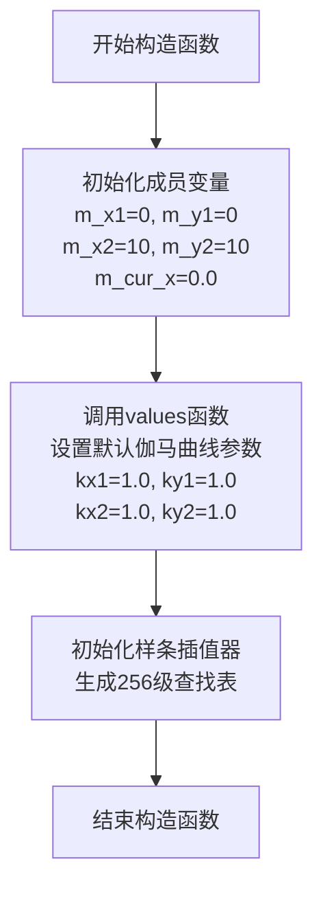
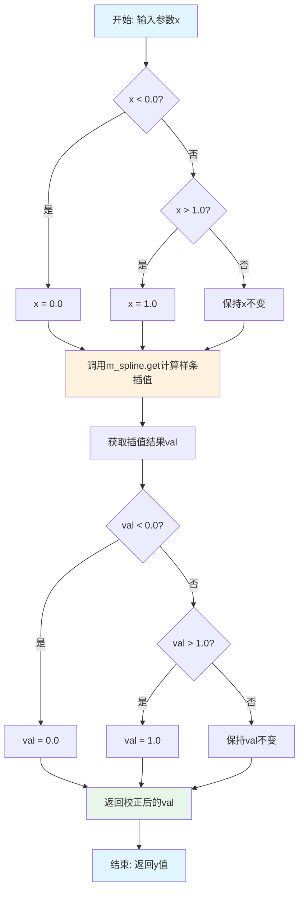
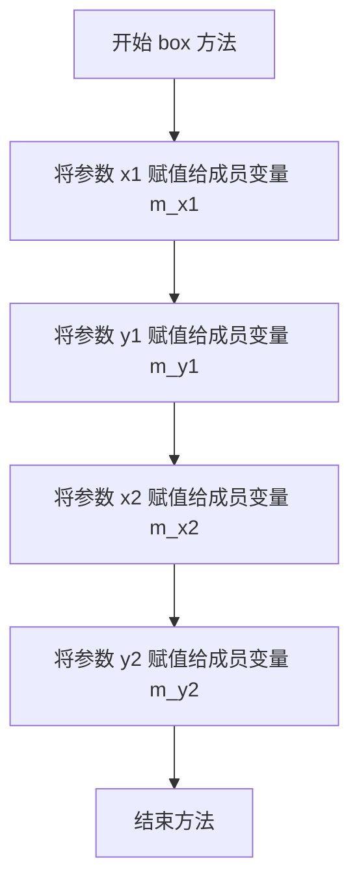
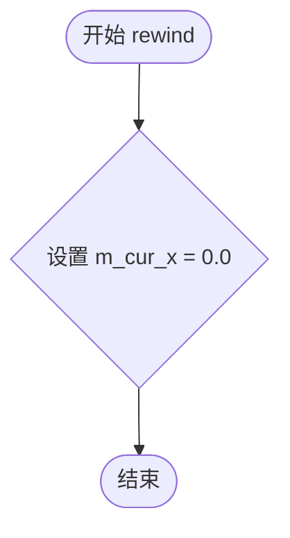

# `matplotlib\extern\agg24-svn\src\ctrl\agg_gamma_spline.cpp` 详细设计文档

这是Anti-Grain Geometry库中的gamma_spline类实现，用于图像处理中的伽马校正。该类通过三次样条插值实现非线性亮度/对比度调整曲线，支持设置控制点参数、边界框，并提供路径生成接口用于渲染伽马校正曲线。

## 整体流程

```mermaid
graph TD
    A[开始] --> B[创建gamma_spline对象]
    B --> C[调用box()设置边界框]
    C --> D[调用values()设置样条控制点]
    D --> E[初始化样条插值器]
    E --> F[生成256个采样点的伽马查找表]
    F --> G[调用rewind()初始化路径遍历]
    G --> H{是否还有未遍历点?}
    H -- 是 --> I[调用vertex()获取下一个点]
    I --> J{cur_x > 1.0?}
    J -- 否 --> H
    J -- 是 --> K[返回path_cmd_stop]
    H -- 否 --> K
    K --> L[结束]
```

## 类结构

```
gamma_spline (伽马样条曲线类)
```

## 全局变量及字段


### `gamma_spline.m_x1`
    
边界框左上角x坐标

类型：`double`
    


### `gamma_spline.m_y1`
    
边界框左上角y坐标

类型：`double`
    


### `gamma_spline.m_x2`
    
边界框右下角x坐标

类型：`double`
    


### `gamma_spline.m_y2`
    
边界框右下角y坐标

类型：`double`
    


### `gamma_spline.m_cur_x`
    
当前路径遍历的x位置

类型：`double`
    


### `gamma_spline.m_x[4]`
    
样条曲线的x控制点坐标

类型：`double数组`
    


### `gamma_spline.m_y[4]`
    
样条曲线的y控制点坐标

类型：`double数组`
    


### `gamma_spline.m_spline`
    
三次样条插值器对象

类型：`spline_type`
    


### `gamma_spline.m_gamma[256]`
    
伽马值查找表

类型：`unsigned char数组`
    
    

## 全局函数及方法


### `gamma_spline.gamma_spline()`

构造函数，初始化默认伽马曲线的控制点，设定曲线的边界框，并将伽马值设置为恒等映射（1.0, 1.0, 1.0, 1.0），使曲线默认为线性。

参数：无

返回值：无

#### 流程图



#### 带注释源码

```cpp
//----------------------------------------------------------------------------
// 构造函数：gamma_spline
// 功能：初始化默认伽马曲线，设置边界框和恒等映射
//----------------------------------------------------------------------------
gamma_spline::gamma_spline() : 
    // 初始化成员变量：边界框左下角坐标 (m_x1, m_y1)
    m_x1(0), 
    // 初始化成员变量：边界框右上角坐标 (m_x2, m_y2)
    m_y1(0), 
    // 初始化成员变量：边界框右上角坐标
    m_x2(10), 
    // 初始化成员变量：边界框右上角坐标
    m_y2(10), 
    // 初始化成员变量：当前x坐标（用于vertex迭代）
    m_cur_x(0.0)
{
    // 设置伽马曲线的控制点参数
    // 默认值为(1.0, 1.0, 1.0, 1.0)，表示线性映射（无伽马校正）
    // kx1, ky1: 曲线起始点的控制参数
    // kx2, ky2: 曲线结束点的控制参数
    values(1.0, 1.0, 1.0, 1.0);
}
```


### `gamma_spline.y`

该函数是`gamma_spline`类的核心方法，用于根据输入的x值返回经过伽马校正（Gamma Correction）后的y值。函数通过样条插值（Spline Interpolation）计算伽马曲线上的点，并确保返回值始终在[0.0, 1.0]的合法范围内。

参数：

- `x`：`double`，输入的原始x值，范围应为[0.0, 1.0]

返回值：`double`，经过伽马校正后的y值，始终位于[0.0, 1.0]范围内

#### 流程图



#### 带注释源码

```cpp
//------------------------------------------------------------------------
// 根据输入x值返回伽马校正后的y值
// 参数: x - 输入的原始x值
// 返回值: 经过伽马校正后的y值，范围在[0.0, 1.0]之间
//------------------------------------------------------------------------
double gamma_spline::y(double x) const 
{ 
    // 第一步：将输入x限制在[0.0, 1.0]范围内
    // 如果x小于0.0，则设为0.0（下限裁剪）
    if(x < 0.0) x = 0.0;
    
    // 如果x大于1.0，则设为1.0（上限裁剪）
    if(x > 1.0) x = 1.0;
    
    // 第二步：调用样条插值对象的get方法计算伽马曲线上的点
    // m_spline是一个样条插值对象，内部存储了伽马曲线的控制点
    double val = m_spline.get(x);
    
    // 第三步：将计算结果限制在[0.0, 1.0]范围内
    // 如果插值结果小于0.0，则设为0.0（下限裁剪）
    if(val < 0.0) val = 0.0;
    
    // 如果插值结果大于1.0，则设为1.0（上限裁剪）
    if(val > 1.0) val = 1.0;
    
    // 返回经过双重范围限制后的伽马校正值
    return val;
}
```


### `gamma_spline.values(double kx1, double ky1, double kx2, double ky2)`

设置样条曲线的控制点参数，用于定义gamma校正曲线的形状。该方法通过四个控制点参数计算并初始化三次样条插值器，同时预计算256个离散的gamma值以供快速查表使用。

参数：

- `kx1`：`double`，第一个控制点的x坐标参数（范围0.001-1.999，用于控制曲线起始段的弯曲程度）
- `ky1`：`double`，第一个控制点的y坐标参数（范围0.001-1.999，用于控制曲线起始段的弯曲程度）
- `kx2`：`double`，第二个控制点的x坐标参数（范围0.001-1.999，用于控制曲线结束段的弯曲程度）
- `ky2`：`double`，第二个控制点的y坐标参数（范围0.001-1.999，用于控制曲线结束段的弯曲程度）

返回值：`void`，无返回值

#### 流程图

```mermaid
graph TD
    A[开始设置样条控制点] --> B[参数边界检查<br/>kx1 ∈ [0.001, 1.999]]
    B --> C[参数边界检查<br/>ky1 ∈ [0.001, 1.999]]
    C --> D[参数边界检查<br/>kx2 ∈ [0.001, 1.999]]
    D --> E[参数边界检查<br/>ky2 ∈ [0.001, 1.999]]
    E --> F[设置控制点数组 m_x[4] 和 m_y[4]]
    F --> G[初始化三次样条插值器 m_spline.init]
    G --> H[循环计算256个gamma值<br/>m_gamma[i] = y(i/255) * 255]
    H --> I[结束]
    
    F -.-> F1[m_x[0]=0.0, m_y[0]=0.0]
    F -.-> F2[m_x[1]=kx1*0.25, m_y[1]=ky1*0.25]
    F -.-> F3[m_x[2]=1-kx2*0.25, m_y[2]=1-ky2*0.25]
    F -.-> F4[m_x[3]=1.0, m_y[3]=1.0]
```

#### 带注释源码

```cpp
//------------------------------------------------------------------------
// 设置样条曲线的控制点参数
// 参数: kx1, ky1 - 第一个控制点的坐标参数
//       kx2, ky2 - 第二个控制点的坐标参数
//------------------------------------------------------------------------
void gamma_spline::values(double kx1, double ky1, double kx2, double ky2)
{
    // 第一个控制点x坐标参数边界检查，确保参数在有效范围内
    if(kx1 < 0.001) kx1 = 0.001;
    if(kx1 > 1.999) kx1 = 1.999;
    
    // 第一个控制点y坐标参数边界检查
    if(ky1 < 0.001) ky1 = 0.001;
    if(ky1 > 1.999) ky1 = 1.999;
    
    // 第二个控制点x坐标参数边界检查
    if(kx2 < 0.001) kx2 = 0.001;
    if(kx2 > 1.999) kx2 = 1.999;
    
    // 第二个控制点y坐标参数边界检查
    if(ky2 < 0.001) ky2 = 0.001;
    if(ky2 > 1.999) ky2 = 1.999;

    // 设置控制点数组，定义三次贝塞尔曲线的四个控制点
    // 起点固定在(0,0)
    m_x[0] = 0.0;
    m_y[0] = 0.0;
    
    // 第一个可调控制点，根据kx1, ky1缩放0.25倍
    m_x[1] = kx1 * 0.25;
    m_y[1] = ky1 * 0.25;
    
    // 第二个可调控制点，关于终点(1,1)对称布置
    m_x[2] = 1.0 - kx2 * 0.25;
    m_y[2] = 1.0 - ky2 * 0.25;
    
    // 终点固定在(1,1)
    m_x[3] = 1.0;
    m_y[3] = 1.0;

    // 使用4个控制点初始化三次样条插值器
    m_spline.init(4, m_x, m_y);

    // 预计算256个离散的gamma值，存储在查找表中以提高运行效率
    // 将[0,1]区间映射到[0,255]的整数索引
    int i;
    for(i = 0; i < 256; i++)
    {
        // 计算归一化输入值，应用y()函数进行gamma校正，最后映射回[0,255]
        m_gamma[i] = (unsigned char)(y(double(i) / 255.0) * 255.0);
    }
}
```


### `gamma_spline.values`

获取当前gamma spline控制点参数的重载版本（const成员函数）。该函数通过反向计算从内部存储的样条控制点还原出原始的gamma参数值（kx1, ky1, kx2, ky2），供调用者获取当前设置的gamma曲线参数。

参数：

- `kx1`：`double*`，输出参数，用于获取第一个控制点的x坐标（内部存储值乘以4.0）
- `ky1`：`double*`，输出参数，用于获取第一个控制点的y坐标（内部存储值乘以4.0）
- `kx2`：`double*`，输出参数，用于获取第二个控制点的x坐标（基于1.0 - m_x[2]乘以4.0计算）
- `ky2`：`double*`，输出参数，用于获取第二个控制点的y坐标（基于1.0 - m_y[2]乘以4.0计算）

返回值：`void`，无返回值，通过指针参数输出获取的控制点参数值

#### 流程图

```mermaid
flowchart TD
    A[开始] --> B[获取m_x[1]的值]
    B --> C[计算kx1 = m_x[1] * 4.0]
    C --> D[获取m_y[1]的值]
    D --> E[计算ky1 = m_y[1] * 4.0]
    E --> F[获取m_x[2]的值]
    F --> G[计算kx2 = (1.0 - m_x[2]) * 4.0]
    G --> H[获取m_y[2]的值]
    H --> I[计算ky2 = (1.0 - m_y[2]) * 4.0]
    I --> J[通过指针赋值输出参数]
    J --> K[结束]
```

#### 带注释源码

```
//------------------------------------------------------------------------
// 获取当前gamma spline控制点参数的重载版本（const成员函数）
// 该函数将内部存储的样条控制点反向转换为原始的gamma参数值
// 参数为输出参数，通过指针返回计算后的值
//------------------------------------------------------------------------
void gamma_spline::values(double* kx1, double* ky1, double* kx2, double* ky2) const
{
    // 第一个控制点x坐标：内部存储的是kx1/4.0，所以需要乘以4.0还原
    *kx1 = m_x[1] * 4.0;
    
    // 第一个控制点y坐标：内部存储的是ky1/4.0，所以需要乘以4.0还原
    *ky1 = m_y[1] * 4.0;
    
    // 第二个控制点x坐标：内部存储的是1.0 - kx2/4.0，所以需要反向计算
    // 即 kx2 = (1.0 - m_x[2]) * 4.0
    *kx2 = (1.0 - m_x[2]) * 4.0;
    
    // 第二个控制点y坐标：内部存储的是1.0 - ky2/4.0，所以需要反向计算
    // 即 ky2 = (1.0 - m_y[2]) * 4.0
    *ky2 = (1.0 - m_y[2]) * 4.0;
}
```


### `gamma_spline::box`

设置伽马曲线的边界框，定义曲线在绘图空间中的坐标范围，用于后续生成曲线顶点时进行坐标映射。

参数：

- `x1`：`double`，边界框左上角的 X 坐标
- `y1`：`double`，边界框左上角的 Y 坐标
- `x2`：`double`，边界框右下角的 X 坐标
- `y2`：`double`，边界框右下角的 Y 坐标

返回值：`void`，无返回值

#### 流程图



#### 带注释源码

```cpp
//------------------------------------------------------------------------
// 设置伽马曲线的边界框
// x1, y1: 边界框左上角坐标
// x2, y2: 边界框右下角坐标
//------------------------------------------------------------------------
void gamma_spline::box(double x1, double y1, double x2, double y2)
{
    // 将参数 x1 赋值给成员变量 m_x1（边界框左上角 X 坐标）
    m_x1 = x1;
    
    // 将参数 y1 赋值给成员变量 m_y1（边界框左上角 Y 坐标）
    m_y1 = y1;
    
    // 将参数 x2 赋值给成员变量 m_x2（边界框右下角 X 坐标）
    m_x2 = x2;
    
    // 将参数 y2 赋值给成员变量 m_y2（边界框右下角 Y 坐标）
    m_y2 = y2;
}
```


### `gamma_spline.rewind(unsigned)`

该方法属于 `gamma_spline` 类的路径接口实现，用于重置样条曲线路径的遍历状态。它将内部维护的当前遍历位置 `m_cur_x` 强制设置为 0.0，使得下一次调用 `vertex` 方法时能够从路径的起始点（x=0, y=0）开始获取数据。

参数：

-  （匿名参数）：`unsigned`，AGG路径遍历接口标准参数。在当前实现中未被使用，仅保留以符合AGG的路径接口规范（通常用于传递路径标识符或标志）。

返回值：`void`，无返回值。

#### 流程图



#### 带注释源码

```cpp
//------------------------------------------------------------------------
// Rewind the path. 
// Resets the current x coordinate to the start of the curve (0.0).
// This prepares the spline for the next vertex() call to return 
// the initial point of the path.
//------------------------------------------------------------------------
void gamma_spline::rewind(unsigned)
{
    // Reset the current normalized x position to the beginning (0.0).
    // This ensures that vertex() starts generating points from the start.
    m_cur_x = 0.0;
}
```


### `gamma_spline.vertex`

该函数是 `gamma_spline` 类的路径生成接口实现，用于获取伽马校正曲线路径的下一个顶点坐标。通过维护内部游标 `m_cur_x` 遍历从起点到终点的路径，每次调用返回路径上的一个点（移动命令或线段命令），直到遍历完成返回停止命令。

参数：

- `vx`：`double*`，输出参数，返回路径顶点的 X 坐标
- `vy`：`double*`，输出参数，返回路径顶点的 Y 坐标

返回值：`unsigned`，返回路径命令类型，`path_cmd_move_to` 表示移动到起点，`path_cmd_line_to` 表示绘制线段，`path_cmd_stop` 表示路径结束

#### 流程图

```mermaid
flowchart TD
    A[开始 vertex 调用] --> B{m_cur_x == 0.0?}
    B -->|是| C[设置起点坐标 vx=m_x1, vy=m_y1]
    C --> D[更新 m_cur_x += 1.0 / (m_x2 - m_x1)]
    D --> E[返回 path_cmd_move_to]
    B -->|否| F{m_cur_x > 1.0?}
    F -->|是| G[返回 path_cmd_stop]
    F -->|否| H[计算当前顶点坐标]
    H --> I[vx = m_x1 + m_cur_x * (m_x2 - m_x1)]
    H --> J[vy = m_y1 + y(m_cur_x) * (m_y2 - m_y1)]
    J --> K[更新 m_cur_x += 1.0 / (m_x2 - m_x1)]
    K --> L[返回 path_cmd_line_to]
```

#### 带注释源码

```
//------------------------------------------------------------------------
// vertex() - 获取路径下一个顶点，实现路径生成接口
// 参数：
//   vx - 输出参数，指向 double 类型的指针，用于返回顶点的 X 坐标
//   vy - 输出参数，指向 double 类型的指针，用于返回顶点的 Y 坐标
// 返回值：
//   unsigned 类型，表示路径命令：
//     path_cmd_move_to - 移动到起点（第一次调用时）
//     path_cmd_line_to - 绘制线段到当前点（中间调用）
//     path_cmd_stop    - 路径结束（遍历完成后）
//------------------------------------------------------------------------
unsigned gamma_spline::vertex(double* vx, double* vy)
{
    // 第一次调用时，m_cur_x 为 0.0，返回路径起点
    if(m_cur_x == 0.0) 
    {
        // 设置起点坐标为包围盒的左上角 (m_x1, m_y1)
        *vx = m_x1;
        *vy = m_y1;
        
        // 计算步长：按 X 轴方向等分路径，步长为 1/(x2-x1)
        m_cur_x += 1.0 / (m_x2 - m_x1);
        
        // 返回移动命令，表示路径开始
        return path_cmd_move_to;
    }

    // 如果游标超过 1.0，表示路径已遍历完成
    if(m_cur_x > 1.0) 
    {
        // 返回停止命令，表示没有更多顶点
        return path_cmd_stop;
    }
    
    // 计算当前顶点的 X 坐标：在线段 [m_x1, m_x2] 上按比例插值
    *vx = m_x1 + m_cur_x * (m_x2 - m_x1);
    
    // 计算当前顶点的 Y 坐标：
    //   y(m_cur_x) 获取归一化 [0,1] 区间内的伽马校正值
    //   再映射到 Y 轴方向的范围 [m_y1, m_y2]
    *vy = m_y1 + y(m_cur_x) * (m_y2 - m_y1);

    // 更新游标，准备下一次调用
    m_cur_x += 1.0 / (m_x2 - m_x1);
    
    // 返回线段命令，表示继续绘制
    return path_cmd_line_to;
}
```


## 关键组件


### gamma_spline 类

gamma_spline是Anti-Grain Geometry库中的伽马校正样条曲线类，通过三次样条插值实现非线性伽马映射，用于图形渲染中的颜色校正和亮度曲线控制。

### 样条插值核心 (m_spline)

内部维护的三次样条插值对象，负责在[0,1]区间内进行平滑的曲线插值计算，是实现伽马非线性变换的数学基础。

### 伽马查找表 (m_gamma数组)

预计算的256字节查找表，将连续的[0,1]区间值离散化为256个离散的unsigned char值，用于快速查找伽马校正结果，提升实时渲染性能。

### 边界框控制 (m_x1, m_y1, m_x2, m_y2)

定义伽马曲线在目标坐标系中的矩形边界，用于将归一化的[0,1]曲线值映射到实际像素坐标空间。

### 路径迭代器接口 (rewind/vertex)

实现AGG库的路径生成器接口，通过m_cur_x状态变量逐步遍历伽马曲线，生成可用于渲染的直线段序列。

### 控制点参数化 (values方法)

提供双向接口设置和获取样条曲线的四个控制点参数(kx1, ky1, kx2, ky2)，这些参数控制曲线的弯曲形状和对称性。

### 边界约束与 clamping (y方法)

在获取伽马值时进行多层边界检查，确保输入输出始终在[0,1]有效范围内，防止数值溢出和异常。


## 问题及建议


### 已知问题

-   **除零风险**：`vertex` 函数中 `m_cur_x += 1.0 / (m_x2 - m_x1);` 没有检查 `m_x2 - m_x1` 是否为零，可能导致除零错误
-   **魔法数字**：边界检查中使用的 `0.001` 和 `1.999` 以及 `255`、`4.0` 等数值都是硬编码的魔法数字，缺乏文档说明
-   **参数命名不规范**：`rewind(unsigned)` 函数参数缺少名称，降低了代码可读性
-   **const 方法参数修改**：`y(double x) const` 方法中修改了输入参数 `x`（虽然修改的是副本），这种模式容易引起混淆
-   **循环变量类型**：`for(i = 0; i < 256; i++)` 使用 `int` 类型而非 `unsigned int` 或 `size_t`
-   **精度损失风险**：`m_gamma[i] = (unsigned char)(y(double(i) / 255.0) * 255.0);` 先乘以 255 再转换可能产生舍入误差
-   **重复计算**：每次调用 `values` 都会无条件重新计算 256 个 gamma 查找表，即使参数未变化

### 优化建议

-   将所有魔法数字提取为具名常量，如 `MIN_K`, `MAX_K`, `GAMMA_TABLE_SIZE` 等
-   在 `vertex` 函数中添加 `m_x2 != m_x1` 的断言或检查，防止除零
-   为 `rewind` 参数添加名称，如 `rewind(unsigned path_id)`
-   考虑使用 `std::array<unsigned char, 256>` 替代 C 风格数组 `m_gamma[256]`
-   在 `values` 函数中添加脏标志（dirty flag），仅在参数实际变化时才重新计算 gamma 表
-   考虑使用 `y(double x) const` 的 const 副本语义，避免修改输入参数
-   将循环变量改为 `size_t` 或 `unsigned` 类型以提高可移植性


## 其它


### 设计目标与约束

该类实现gamma校正样条曲线，用于图像处理中的gamma值映射。设计目标包括：提供可配置的gamma曲线控制点、支持1D样条插值、生成256级灰度查找表、实现路径生成器接口以支持AGG的渲染管线。约束条件：输入参数范围限制在[0.001, 1.999]，输出值强制 clamping 到[0, 1]，样条控制点固定为4个，x和y坐标均为double类型。

### 错误处理与异常设计

代码采用防御式编程风格，未使用异常机制。错误处理方式包括：
- 输入值边界检查：在values()方法中对kx1/ky1/kx2/ky2进行范围限制，使用clamping策略将超出范围的值强制转换为有效边界值
- 输出值边界检查：在y()方法中对输入x和输出val进行[0,1]范围限制
- 无效输入处理：vertex()方法中通过状态机处理边界情况，返回path_cmd_stop表示结束
- 无异常抛出：所有错误情况通过返回值或默认值处理，调用方无需try-catch

### 数据流与状态机

该类实现状态机模式用于路径生成：
- 初始状态（m_cur_x = 0.0）：rewind()后进入初始状态，第一次调用vertex()返回move_to命令并移动到起点
- 迭代状态（0 < m_cur_x <= 1.0）：重复调用vertex()返回line_to命令，沿gamma曲线生成路径点
- 结束状态（m_cur_x > 1.0）：超过1.0后返回path_cmd_stop，标识路径生成完成
- 数据流：外部通过values()设置控制点 → 内部初始化样条插值器 → 生成256级gamma查找表 → 通过vertex()按需生成路径顶点

### 外部依赖与接口契约

依赖项：
- agg::pod_spline类：用于4点三次样条插值计算
- agg命名空间：AGG库的公共命名空间
- 无外部运行时依赖

接口契约：
- values(kx1, ky1, kx2, ky2)：设置gamma曲线控制点，参数有效范围[0.001, 1.999]
- values(kx1*, ky1*, kx2*, ky2*)：输出型参数，用于获取当前控制点值
- box(x1, y1, x2, y2)：设置输出包围盒坐标，无范围检查
- y(x)：输入[0,1]范围double值，返回映射后的[0,1]double值
- rewind(path_id)：重置路径生成器状态，path_id参数未被使用
- vertex(vx, vy)：输出参数，返回路径命令类型，可能值：path_cmd_move_to、path_cmd_line_to、path_cmd_stop

### 性能考虑与优化空间

性能特征：
- values()方法在每次调用时重新计算256元素查找表，时间复杂度O(256)
- y()方法使用查找表，时间复杂度O(1)
- vertex()方法每次调用计算一个顶点，无缓存机制

优化建议：
- 缓存策略：可将y()的查找表结果缓存，避免重复计算
- 预计算优化：对于固定gamma值场景，可预先计算全部256个映射值，运行时直接查表
- 内联优化：小方法（y()、rewind()）建议声明为inline以减少函数调用开销
- 内存优化：m_gamma数组使用unsigned char，可考虑使用更紧凑的存储方式

### 并发性与线程安全性

该类非线程安全：
- 成员变量m_cur_x作为状态机核心，在多线程并发调用vertex()时会产生竞态条件
- m_spline、m_x、m_y、m_gamma等数据在多线程环境下可能产生数据竞争
- 无内部同步机制（无锁、无原子操作）
- 使用约束：每个线程应独立创建gamma_spline实例，或在外部加锁保护

### 内存管理与资源

内存布局：
- 栈上：gamma_spline对象本身（包含指针和基本类型）
- 堆上：pod_spline对象（内部可能包含动态分配的样条系数数组）
- 静态：m_gamma数组（256字节，位于对象内部）

资源管理：
- 无显式的资源获取/释放操作
- pod_spline类负责其内部内存管理
- 无RAII模式应用

### 使用示例与调用约定

典型使用流程：
```
gamma_spline gs;
gs.values(1.0, 1.0, 1.0, 1.0);  // 线性gamma
gs.box(0, 0, 100, 100);          // 设置输出范围
gs.rewind(0);

double vx, vy;
unsigned cmd;
while((cmd = gs.vertex(&vx, &vy)) != path_cmd_stop) {
    // 处理顶点 (vx, vy) 和命令 cmd
}
```

调用约定：
- 调用values()后必须调用box()设置输出区域
- vertex()必须在rewind()之后调用
- 循环调用vertex()直到返回path_cmd_stop
- 不应在vertex()循环过程中调用values()或box()

### 版本兼容性与扩展性

扩展性分析：
- 控制点数量固定为4个，难以扩展到更复杂的曲线
- 样条类型硬编码为三次样条，无法切换插值算法
- 查找表精度固定为8位（256级），无法调整

兼容性考虑：
- 依赖AGG核心库的pod_spline类，需保持接口兼容
- 路径命令常量依赖AGG的path_commands枚举
- 无ABI版本控制机制

### 潜在技术债务

1. 未使用的参数：rewind()的path_id参数未被使用，可能是API一致性遗留
2. 魔法数字：0.001、1.999、255.0、4.0等硬编码数值散落在代码中，应提取为常量
3. 重复逻辑：y()方法中的clamping逻辑与values()中的边界检查重复
4. 缺乏文档：公有方法缺少详细的参数说明和返回值解释
5. 测试覆盖：代码中无任何单元测试或回归测试


    