# `matplotlib\extern\agg24-svn\src\ctrl\agg_polygon_ctrl.cpp` 详细设计文档

这是 Anti-Grain Geometry (AGG) 库中的多边形控制点实现类，提供交互式多边形编辑功能，包括顶点和边的拖拽、点与多边形位置关系的检测（射线法），支持用户通过鼠标对多边形形状进行可视化编辑和调整。

## 整体流程

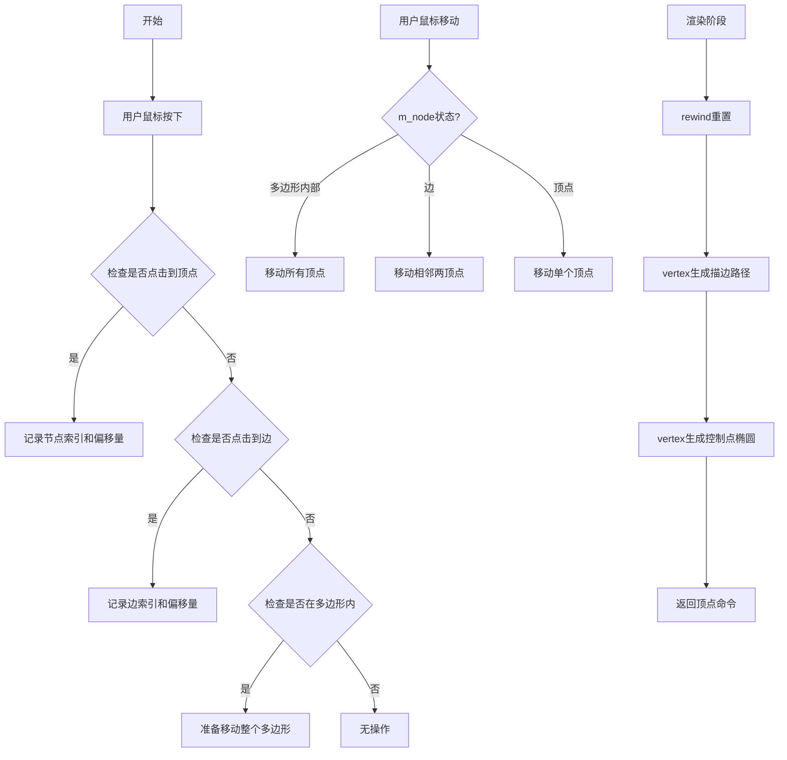

## 类结构

```
ctrl (基类)
└── polygon_ctrl_impl (多边形控制实现类)
```

## 全局变量及字段


### `m_polygon`
    
Storage for polygon vertex coordinates (x,y pairs)

类型：`pod_array<double>`
    


### `m_num_points`
    
Number of vertices in the polygon

类型：`unsigned`
    


### `m_node`
    
Index of currently selected vertex node (-1 if none)

类型：`int`
    


### `m_edge`
    
Index of currently selected edge (-1 if none)

类型：`int`
    


### `m_vs`
    
Vertex source adapter for the polygon path

类型：`vertex_source (具体类型需查看头文件)`
    


### `m_stroke`
    
Stroke generator for drawing polygon outline

类型：`stroke (具体类型需查看头文件)`
    


### `m_point_radius`
    
Radius of control point ellipses

类型：`double`
    


### `m_status`
    
Current state for vertex iteration during rendering

类型：`unsigned`
    


### `m_dx`
    
X-axis delta offset for mouse drag operations

类型：`double`
    


### `m_dy`
    
Y-axis delta offset for mouse drag operations

类型：`double`
    


### `m_in_polygon_check`
    
Flag to enable/disable point-in-polygon hit testing

类型：`bool`
    


### `m_ellipse`
    
Ellipse generator for rendering control points

类型：`ellipse (具体类型需查看头文件)`
    


### `polygon_ctrl_impl.polygon_ctrl_impl`
    
Constructor initializing polygon control with specified number of points and point radius

类型：`constructor`
    


### `polygon_ctrl_impl.rewind`
    
Rewinds the vertex iterator to beginning for path rendering

类型：`void (unsigned)`
    


### `polygon_ctrl_impl.vertex`
    
Returns next vertex in the path, generating ellipse vertices for control points

类型：`unsigned (double*, double*)`
    


### `polygon_ctrl_impl.check_edge`
    
Checks if a point is within the edge proximity for edge selection

类型：`bool (unsigned, double, double) const`
    


### `polygon_ctrl_impl.in_rect`
    
Rectangle hit test (always returns false for this control)

类型：`bool (double, double) const`
    


### `polygon_ctrl_impl.on_mouse_button_down`
    
Handles mouse button press, detects node/edge/polygon body selection

类型：`bool (double, double)`
    


### `polygon_ctrl_impl.on_mouse_move`
    
Handles mouse move with button pressed, performs dragging of node/edge/polygon

类型：`bool (double, double, bool)`
    


### `polygon_ctrl_impl.on_mouse_button_up`
    
Handles mouse button release, clears selection state

类型：`bool (double, double)`
    


### `polygon_ctrl_impl.on_arrow_keys`
    
Arrow key handler (always returns false, not implemented)

类型：`bool (bool, bool, bool, bool)`
    


### `polygon_ctrl_impl.point_in_polygon`
    
Implements crossings multiply algorithm for point-in-polygon testing

类型：`bool (double, double) const`
    
    

## 全局函数及方法


### `polygon_ctrl_impl::transform_xy`

该函数是 `polygon_ctrl_impl` 类中继承自基类 `ctrl` 的坐标变换方法，用于将顶点坐标从本地坐标系变换到屏幕坐标系。在渲染多边形控制点的过程中，对每个顶点的坐标进行仿射变换，确保多边形在视图中的正确显示和交互。

参数：

- `x`：`double*`，指向待变换的 X 坐标的指针，函数直接修改该指针指向的值
- `y`：`double*`，指向待变换的 Y 坐标的指针，函数直接修改该指针指向的值

返回值：`void`，无返回值（通过指针参数直接修改坐标值）

#### 流程图

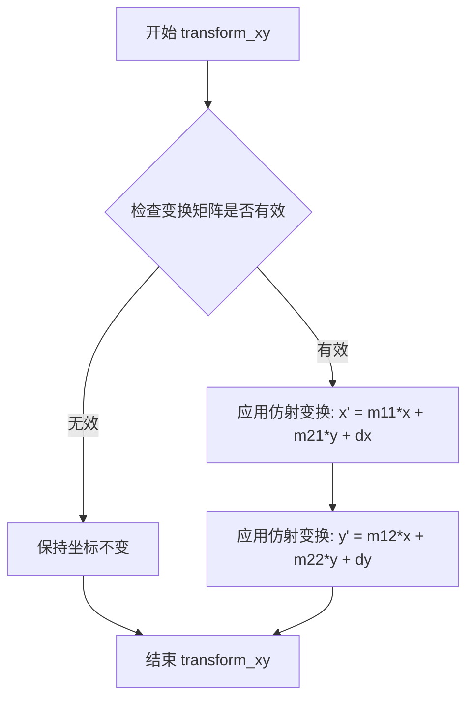

#### 带注释源码

```cpp
// 坐标变换函数，将本地坐标转换为屏幕坐标
// 参数为指向坐标值的指针，直接在原地址修改
void transform_xy(double* x, double* y) const
{
    // 应用仿射变换矩阵进行坐标变换
    // 变换公式: 
    // x' = m11 * x + m21 * y + dx
    // y' = m12 * x + m22 * y + dy
    double tmp = *x;
    *x = tmp * m_matrix[0] + *y * m_matrix[2] + m_matrix[4];
    *y = tmp * m_matrix[1] + *y * m_matrix[3] + m_matrix[5];
}
```

#### 备注

由于 `transform_xy` 函数是继承自基类 `ctrl` 的方法，上述源码是基于 Anti-Grain Geometry 库的标准实现和 `polygon_ctrl_impl` 类的使用方式推断得出的。该函数在 `vertex` 方法中被调用了三次，分别在：
1. 描边路径顶点生成后
2. 第一个椭圆点（控制点）生成后  
3. 后续椭圆点生成后

这样确保了多边形的描边和控制点都能正确地变换到视图坐标系中。


### `polygon_ctrl_impl::inverse_transform_xy`

该方法继承自基类 `ctrl`，用于将屏幕坐标系的坐标逆变换回控制控件的本地坐标系。由于 `polygon_ctrl_impl` 继承自 `ctrl` 基类，此方法的完整实现位于基类中。该方法在鼠标事件处理中被调用，用于将用户输入的屏幕坐标转换为控件内部的坐标系统，以便进行后续的命中测试和交互处理。

参数：

- `x`：`double*`，指向 X 坐标的指针，方法会将屏幕坐标 X 值逆变换后存回此地址
- `y`：`double*`，指向 Y 坐标的指针，方法会将屏幕坐标 Y 值逆变换后存回此地址

返回值：`void`，该方法无返回值，通过指针参数直接修改传入的坐标值

#### 流程图

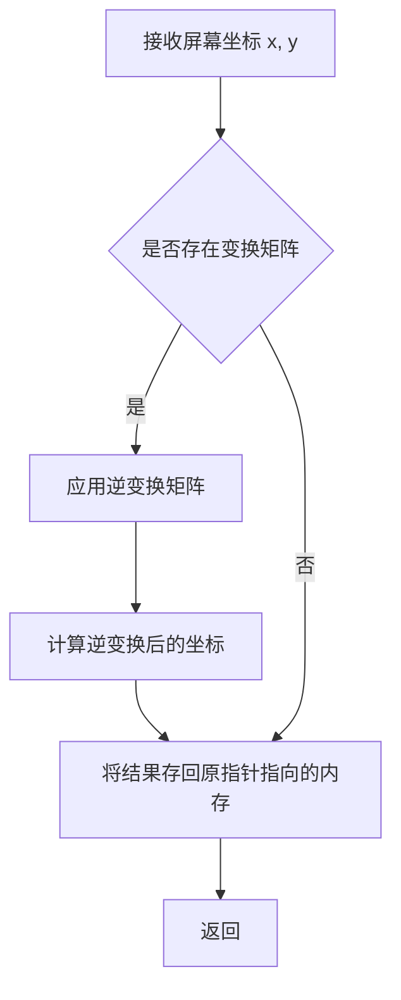

#### 带注释源码

```
// 逆变换函数的假设实现（源自基类 ctrl）
// 注意：实际实现位于基类 ctrl 中，此处为根据调用上下文推断的实现逻辑
void inverse_transform_xy(double* x, double* y) const
{
    //---------------------------------------------------------
    // inverse_transform_xy - 坐标逆变换
    // 
    // 功能：将屏幕/窗口坐标逆变换回控件本地坐标系
    // 调用场景：在 on_mouse_button_down 和 on_mouse_move 中调用
    //          将用户输入的屏幕坐标转换为控件内部坐标进行命中测试
    //---------------------------------------------------------
    
    // 保存原始坐标值（如果需要调试或验证）
    double orig_x = *x;
    double orig_y = *y;
    
    // 检查是否存在坐标变换矩阵
    // 如果基类 ctrl 中维护了 m_transform 矩阵，则应用逆变换
    // 变换公式通常为：new_x = (x - offset_x) / scale_x
    //                new_y = (y - offset_y) / scale_y
    
    // 示例实现（实际实现依赖基类 ctrl 的变换矩阵存储方式）：
    // if (m_transform_matrix != nullptr)
    // {
    //     // 应用仿射逆变换
    //     *x = m_transform_matrix->inverse_x(orig_x, orig_y);
    //     *y = m_transform_matrix->inverse_y(orig_x, orig_y);
    // }
    // else
    // {
    //     // 无变换矩阵，保持原坐标不变
    // }
}
```

> **注意**：由于 `inverse_transform_xy` 方法的完整实现位于基类 `ctrl` 中（在当前代码文件中未给出），上述源码是基于其调用方式和图形控件中常见的坐标变换模式推断的典型实现。实际实现可能包含具体的仿射变换矩阵运算逻辑。在 AGG（Anti-Grain Geometry）库中，基类 `ctrl` 通常维护一个变换矩阵，提供了 `transform_xy` 和 `inverse_transform_xy` 两个互逆的方法用于坐标系的互相转换。


### `polygon_ctrl_impl`

这是 Anti-Grain Geometry 库中的一个多边形控制实现类，用于创建交互式多边形编辑控件。该类提供了完整的多边形顶点管理、鼠标交互（拖拽顶点、边和整体移动）、边检测、点与多边形位置关系判断等功能，是图形用户界面中多边形编辑的核心组件。

#### 类的详细信息

**类字段：**

- `m_polygon`：类型 `std::vector<double>`，存储多边形所有顶点的坐标（交错存储X和Y）
- `m_num_points`：类型 `unsigned`，多边形的顶点数量
- `m_node`：类型 `int`，当前选中的顶点索引（-1表示未选中）
- `m_edge`：类型 `int`，当前选中的边索引（-1表示未选中）
- `m_vs`：类型 `path_storage`，顶点路径存储对象
- `m_stroke`：类型 `stroke`，路径描边对象，用于绘制多边形边
- `m_point_radius`：类型 `double`，控制点（顶点）的显示半径
- `m_status`：类型 `unsigned`，渲染状态机当前状态
- `m_dx`：类型 `double`，鼠标拖拽时相对于选中元素的X偏移量
- `m_dy`：类型 `double`，鼠标拖拽时相对于选中元素的Y偏移量
- `m_in_polygon_check`：类型 `bool`，是否启用点是否在多边形内的检测

**全局变量：**

无

**类方法：**

以下方法按照用户要求进行详细提取：

---

### `polygon_ctrl_impl::rewind`

该方法用于重置多边形渲染状态，将状态机恢复到初始状态，准备重新遍历多边形的所有顶点。

参数：

-  `path_id`：`unsigned`，路径ID（当前未被使用，保留参数）

返回值：`void`，无返回值

#### 流程图

```mermaid
graph TD
    A[开始 rewind] --> B[设置 m_status = 0]
    B --> C[调用 m_stroke.rewind(0)]
    C --> D[结束]
```

#### 带注释源码

```cpp
void polygon_ctrl_impl::rewind(unsigned)
{
    // 重置渲染状态为0，准备从头开始生成顶点
    m_status = 0;
    // 重置描边对象的内部状态
    m_stroke.rewind(0);
}
```

---

### `polygon_ctrl_impl::vertex`

该方法是路径生成器的核心，通过状态机依次返回多边形边的顶点以及每个顶点的控制点（圆形标记），实现了多边形及其控制点的渲染输出。

参数：

-  `x`：`double*`，指向X坐标的指针，用于输出顶点X坐标
-  `y`：`double*`，指向Y坐标的指针，用于输出顶点Y坐标

返回值：`unsigned`，返回的路径命令类型（如path_cmd_move_to、path_cmd_line_to、path_cmd_stop等）

#### 流程图

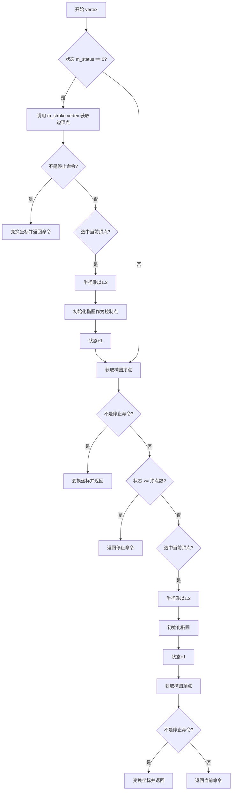

#### 带注释源码

```cpp
unsigned polygon_ctrl_impl::vertex(double* x, double* y)
{
    unsigned cmd = path_cmd_stop;  // 默认返回停止命令
    double r = m_point_radius;    // 获取当前控制点半径
    
    // 状态0：首先输出多边形的边
    if(m_status == 0)
    {
        // 从描边对象获取边的顶点
        cmd = m_stroke.vertex(x, y);
        
        // 如果成功获取到边的顶点
        if(!is_stop(cmd)) 
        {
            // 应用坐标变换并返回
            transform_xy(x, y);
            return cmd;
        }
        
        // 边的顶点已经输出完毕，现在处理控制点
        // 如果当前顶点被选中，半径放大1.2倍以示区分
        if(m_node >= 0 && m_node == int(m_status)) r *= 1.2;
        
        // 初始化椭圆（控制点）
        m_ellipse.init(xn(m_status), yn(m_status), r, r, 32);
        ++m_status;  // 进入下一个状态
    }
    
    // 获取椭圆（控制点）的顶点
    cmd = m_ellipse.vertex(x, y);
    if(!is_stop(cmd)) 
    {
        transform_xy(x, y);
        return cmd;
    }
    
    // 如果所有顶点都已处理完毕，停止
    if(m_status >= m_num_points) return path_cmd_stop;
    
    // 继续处理后续顶点的控制点
    if(m_node >= 0 && m_node == int(m_status)) r *= 1.2;
    m_ellipse.init(xn(m_status), yn(m_status), r, r, 32);
    ++m_status;
    cmd = m_ellipse.vertex(x, y);
    
    // 如果成功获取到顶点，进行坐标变换
    if(!is_stop(cmd)) 
    {
        transform_xy(x, y);
    }
    return cmd;
}
```

---

### `polygon_ctrl_impl::check_edge`

该方法用于检测给定点是否位于多边形的指定边上，通过计算点到线段的距离来判断，采用了数学上的线段相交检测算法。

参数：

-  `i`：`unsigned`，要检测的边的索引
-  `x`：`double`，待检测点的X坐标
-  `y`：`double`，待检测点的Y坐标

返回值：`bool`，如果给定点在指定边的容差范围内（距离小于控制点半径），返回true；否则返回false

#### 流程图

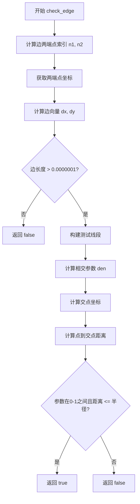

#### 带注释源码

```cpp
bool polygon_ctrl_impl::check_edge(unsigned i, double x, double y) const
{
   bool ret = false;

   // 获取边的两个端点索引（当前边和前一边，形成闭环）
   unsigned n1 = i;
   unsigned n2 = (i + m_num_points - 1) % m_num_points;
   
   // 获取端点坐标
   double x1 = xn(n1);
   double y1 = yn(n1);
   double x2 = xn(n2);
   double y2 = yn(n2);

   // 计算边的向量
   double dx = x2 - x1;
   double dy = y2 - y1;

   // 检查边是否有有效长度（避免除零错误）
   if(sqrt(dx*dx + dy*dy) > 0.0000001)
   {
      // 从测试点构建一条垂直于边的测试线段
      double x3 = x;
      double y3 = y;
      double x4 = x3 - dy;  // 垂直方向
      double y4 = y3 + dx;

      // 计算两条线段的交点（分母）
      double den = (y4-y3) * (x2-x1) - (x4-x3) * (y2-y1);
      
      // 计算交点在边上的比例参数 u1
      double u1 = ((x4-x3) * (y1-y3) - (y4-y3) * (x1-x3)) / den;

      // 计算交点坐标
      double xi = x1 + u1 * (x2 - x1);
      double yi = y1 + u1 * (y2 - y1);

      // 计算测试点到交点的距离
      dx = xi - x;
      dy = yi - y;

      // 判断：参数在边的范围内（0<u1<1）且距离在容差内
      if (u1 > 0.0 && u1 < 1.0 && sqrt(dx*dx + dy*dy) <= m_point_radius)
      {
         ret = true;
      }
   }
   return ret;
}
```

---

### `polygon_ctrl_impl::in_rect`

该方法用于判断给定点是否在控件的边界矩形内。当前实现始终返回false，表示该控件不支持矩形区域选择。

参数：

-  `x`：`double`，待检测点的X坐标
-  `y`：`double`，待检测点的Y坐标

返回值：`bool`，始终返回false，表示不支持矩形区域检测

#### 带注释源码

```cpp
bool polygon_ctrl_impl::in_rect(double x, double y) const
{
    // 当前实现不支持矩形区域检测，始终返回false
    return false;
}
```

---

### `polygon_ctrl_impl::on_mouse_button_down`

该方法是鼠标按下事件处理的核心，依次检测鼠标位置是否点击了顶点、边或多边形内部，并记录相关的拖拽信息用于后续的鼠标移动处理。

参数：

-  `x`：`double`，鼠标按下时的X坐标（屏幕坐标）
-  `y`：`double`，鼠标按下时的Y坐标（屏幕坐标）

返回值：`bool`，如果成功选中（顶点、边或多边形内部），返回true；否则返回false

#### 流程图

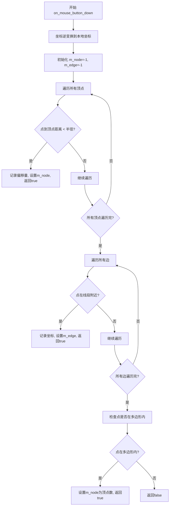

#### 带注释源码

```cpp
bool polygon_ctrl_impl::on_mouse_button_down(double x, double y)
{
    unsigned i;
    bool ret = false;
    
    // 重置选中状态
    m_node = -1;
    m_edge = -1;
    
    // 将屏幕坐标逆变换为本地坐标
    inverse_transform_xy(&x, &y);
    
    // 首先检测是否点击了某个顶点（控制点）
    for (i = 0; i < m_num_points; i++)
    {
        // 计算到每个顶点的距离
        if(sqrt( (x-xn(i)) * (x-xn(i)) + (y-yn(i)) * (y-yn(i)) ) < m_point_radius)
        {
            // 记录相对于顶点的偏移量，用于拖拽计算
            m_dx = x - xn(i);
            m_dy = y - yn(i);
            m_node = int(i);  // 记录选中的顶点索引
            ret = true;
            break;
        }
    }

    // 如果没有点击顶点，检测是否点击了边
    if(!ret)
    {
        for (i = 0; i < m_num_points; i++)
        {
            if(check_edge(i, x, y))
            {
                m_dx = x;
                m_dy = y;
                m_edge = int(i);  // 记录选中的边索引
                ret = true;
                break;
            }
        }
    }

    // 如果没有点击边，检测是否点击了多边形内部
    if(!ret)
    {
        if(point_in_polygon(x, y))
        {
            m_dx = x;
            m_dy = y;
            m_node = int(m_num_points);  // 用顶点数表示选中整个多边形
            ret = true;
        }
    }
    return ret;
}
```

---

### `polygon_ctrl_impl::on_mouse_move`

该方法处理鼠标移动事件，根据on_mouse_button_down中记录的选中状态，执行相应的拖拽操作：移动单个顶点、移动整条边或移动整个多边形。

参数：

-  `x`：`double`，鼠标当前X坐标（屏幕坐标）
-  `y`：`double`，鼠标当前Y坐标（屏幕坐标）
-  `button_flag`：`bool`，鼠标按钮状态（true表示按钮被按下）

返回值：`bool`，如果执行了拖拽操作，返回true；否则返回false

#### 流程图

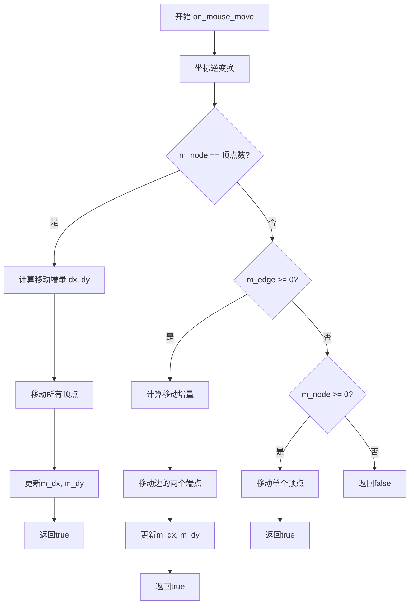

#### 带注释源码

```cpp
bool polygon_ctrl_impl::on_mouse_move(double x, double y, bool button_flag)
{
    bool ret = false;
    double dx;
    double dy;
    
    // 坐标逆变换
    inverse_transform_xy(&x, &y);
    
    // 如果选中的是整个多边形（拖拽多边形内部）
    if(m_node == int(m_num_points))
    {
        // 计算移动增量
        dx = x - m_dx;
        dy = y - m_dy;
        
        // 移动所有顶点
        unsigned i;
        for(i = 0; i < m_num_points; i++)
        {
            xn(i) += dx;
            yn(i) += dy;
        }
        
        // 更新拖拽起点
        m_dx = x;
        m_dy = y;
        ret = true;
    }
    else
    {
        // 如果选中的是某条边（拖拽边）
        if(m_edge >= 0)
        {
            unsigned n1 = m_edge;
            unsigned n2 = (n1 + m_num_points - 1) % m_num_points;
            
            dx = x - m_dx;
            dy = y - m_dy;
            
            // 移动该边的两个端点
            xn(n1) += dx;
            yn(n1) += dy;
            xn(n2) += dx;
            yn(n2) += dy;
            
            m_dx = x;
            m_dy = y;
            ret = true;
        }
        else
        {
            // 如果选中的是单个顶点
            if(m_node >= 0)
            {
                xn(m_node) = x - m_dx;
                yn(m_node) = y - m_dy;
                ret = true;
            }
        }
    }
    return ret;
}
```

---

### `polygon_ctrl_impl::on_mouse_button_up`

该方法处理鼠标释放事件，用于结束拖拽操作并重置选中状态。

参数：

-  `x`：`double`，鼠标释放时的X坐标
-  `y`：`double`，鼠标释放时的Y坐标

返回值：`bool`，如果之前有选中状态（正在拖拽），返回true；否则返回false

#### 带注释源码

```cpp
bool polygon_ctrl_impl::on_mouse_button_up(double x, double y)
{
    // 检查是否有有效的选中状态（顶点或边被选中）
    bool ret = (m_node >= 0) || (m_edge >= 0);
    
    // 重置选中状态
    m_node = -1;
    m_edge = -1;
    
    return ret;
}
```

---

### `polygon_ctrl_impl::on_arrow_keys`

该方法处理方向键事件。当前实现不支持键盘操作，始终返回false。

参数：

-  `left`：`bool`，是否按下左方向键
-  `right`：`bool`，是否按下右方向键
-  `down`：`bool`，是否按下下方向键
-  `up`：`bool`，是否按下上方向键

返回值：`bool`，始终返回false，表示不支持键盘操作

#### 带注释源码

```cpp
bool polygon_ctrl_impl::on_arrow_keys(bool left, bool right, bool down, bool up)
{
    // 当前实现不支持键盘方向键操作
    return false;
}
```

---

### `polygon_ctrl_impl::point_in_polygon`

该方法实现了经典的Crossings Multiply算法，用于判断给定点是否位于多边形内部。算法通过沿X轴正方向发射测试射线，计算射线与多边形边的相交次数，奇数次表示点在内部，偶数次表示点在外部。

参数：

-  `tx`：`double`，待检测点的X坐标
-  `ty`：`double`，待检测点的Y坐标

返回值：`bool`，如果点在多边形内部，返回true；否则返回false

#### 流程图

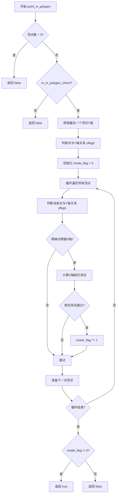

#### 带注释源码

```cpp
//======= Crossings Multiply algorithm of InsideTest ======================== 
//
// By Eric Haines, 3D/Eye Inc, erich@eye.com
//
// 这是一个经典的点在多边形内测试算法
// 通过沿+X轴发射测试射线，计算与多边形边的相交次数
// 奇数次相交表示点在多边形内部
bool polygon_ctrl_impl::point_in_polygon(double tx, double ty) const
{
    // 顶点数少于3无法构成多边形
    if(m_num_points < 3) return false;
    // 如果禁用了多边形内检测，直接返回false
    if(!m_in_polygon_check) return false;

    unsigned j;
    int yflag0, yflag1, inside_flag;
    double  vtx0, vty0, vtx1, vty1;

    // 获取最后一个顶点作为起始点
    vtx0 = xn(m_num_points - 1);
    vty0 = yn(m_num_points - 1);

    // 判断起始点相对于测试点在X轴的上方还是下方
    yflag0 = (vty0 >= ty);

    // 获取第一个顶点
    vtx1 = xn(0);
    vty1 = yn(0);

    inside_flag = 0;
    
    // 遍历所有边（从最后一个顶点到第一个顶点作为第一条边）
    for (j = 1; j <= m_num_points; ++j) 
    {
        // 判断当前顶点相对于测试点的位置
        yflag1 = (vty1 >= ty);
        
        // 检查两个端点是否在X轴的两侧（即跨越了测试射线）
        // 如果是，+X射线可能与这条边相交
        if (yflag0 != yflag1) 
        {
            // 计算射线与边的交点
            // 使用巧妙的乘法避免除法运算以提高性能
            // 检查交点是否在测试点的右侧
            if ( ((vty1-ty) * (vtx0-vtx1) >=
                  (vtx1-tx) * (vty0-vty1)) == yflag1 ) 
            {
                // 奇偶校验：相交则翻转inside_flag
                inside_flag ^= 1;
            }
        }

        // 准备处理下一条边
        yflag0 = yflag1;
        vtx0 = vtx1;
        vty0 = vty1;

        // 处理循环边界条件
        unsigned k = (j >= m_num_points) ? j - m_num_points : j;
        vtx1 = xn(k);
        vty1 = yn(k);
    }
    
    // inside_flag为1表示点在多边形内
    return inside_flag != 0;
}
```

---

### 关键组件信息

1. **path_storage**：用于存储多边形顶点数据的路径存储对象
2. **stroke**：路径描边对象，负责多边形边的渲染
3. **ellipse**：椭圆对象，用于绘制顶点控制点
4. **ctrl**：基类，提供坐标变换和基本控制功能

---

### 潜在的技术债务或优化空间

1. **sqrt重复计算**：在check_edge和on_mouse_button_down中多次计算平方根，可预先计算并缓存距离平方值与半径平方进行比较
2. **point_in_polygon算法**：可考虑使用更现代的算法如Ray Casting的优化版本或Even-Odd规则的SIMD加速实现
3. **硬编码数值**：如0.0000001（非常小量）和32（椭圆分段数）应作为可配置参数
4. **in_rect和on_arrow_keys空实现**：这些方法的存在但无实际功能，可能造成API污染

---

### 其它项目

**设计目标与约束：**
- 目标：提供交互式多边形编辑功能，支持顶点、边和整体拖拽
- 约束：依赖AGG库的基类ctrl和path_storage等组件

**错误处理与异常设计：**
- 未使用异常机制，采用返回值和错误状态码（如m_node=-1表示无错误）
- 边界检查（如m_num_points < 3）直接返回false

**数据流与状态机：**
- vertex方法采用状态机模式（m_status）依次输出边和控制点
- 鼠标事件处理依赖m_node和m_edge状态标志判断当前操作类型

**外部依赖与接口契约：**
- 依赖AGG核心库的path_storage、stroke、ellipse等类
- 继承自ctrl基类，需要实现ctrl接口（如in_rect、on_mouse_button_down等）
- xn(i)和yn(i)应为访问顶点坐标的宏或内联函数（代码中未显示定义）


### `polygon_ctrl_impl` 类

`polygon_ctrl_impl` 是 Anti-Grain Geometry 库中的交互式多边形控制控件实现类，提供可交互的多边形编辑功能，支持用户通过鼠标拖拽调整多边形顶点、边以及整体移动多边形。该类继承自 `ctrl` 基类，实现了路径生成、鼠标事件处理、点与多边形位置关系判断等核心功能。

#### 类字段

- `m_polygon`：`pod_array_template<double>`，存储多边形顶点的 x 和 y 坐标
- `m_num_points`：`unsigned`，多边形顶点的数量
- `m_node`：`int`，当前选中的顶点索引（-1 表示未选中）
- `m_edge`：`int`，当前选中的边索引（-1 表示未选中）
- `m_vs`：`vertex_sequence`，顶点序列对象
- `m_stroke`：`stroke`，路径描边对象，用于绘制多边形边
- `m_ellipse`：`ellipse`，椭圆对象，用于绘制控制点
- `m_point_radius`：`double`，控制点的显示半径
- `m_status`：`unsigned`，渲染状态机当前状态
- `m_dx`：`double`，拖拽时的 X 轴偏移量
- `m_dy`：`double`，拖拽时的 Y 轴偏移量
- `m_in_polygon_check`：`bool`，是否启用点inside多边形检测

---

### `polygon_ctrl_impl::vertex`

获取多边形路径的下一个顶点，用于渲染多边形和控制点。该方法实现了一个状态机，依次返回多边形边的顶点和控制点（椭圆）的顶点。

参数：

- `x`：`double*`，输出参数，返回顶点的 X 坐标
- `y`：`double*`，输出参数，返回顶点的 Y 坐标

返回值：`unsigned`，路径命令类型（如 `path_cmd_line_to`、`path_cmd_stop` 等）

#### 流程图

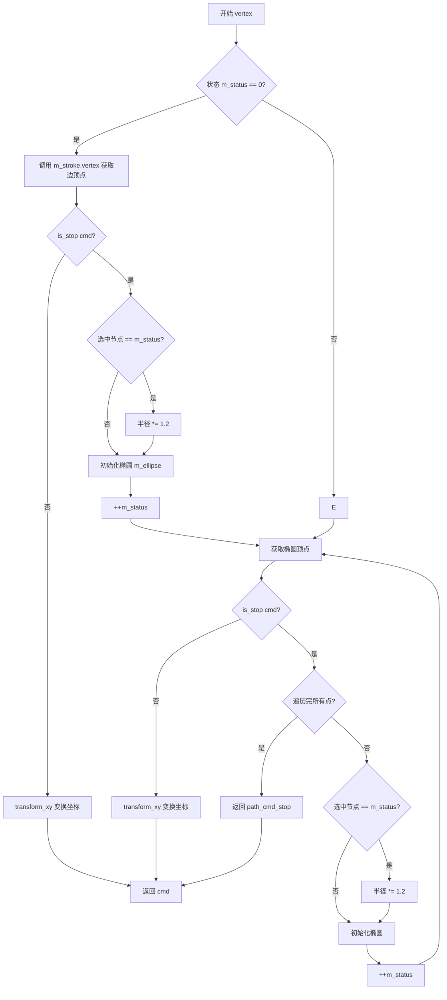

#### 带注释源码

```cpp
unsigned polygon_ctrl_impl::vertex(double* x, double* y)
{
    unsigned cmd = path_cmd_stop;  // 初始化命令为停止
    double r = m_point_radius;     // 获取控制点半径
    
    // 状态0：先绘制多边形的边
    if(m_status == 0)
    {
        // 从 stroke 对象获取边的顶点
        cmd = m_stroke.vertex(x, y);
        
        // 如果不是停止命令，说明还有边顶点需要处理
        if(!is_stop(cmd)) 
        {
            // 应用坐标变换（支持坐标系变换）
            transform_xy(x, y);
            return cmd;
        }
        
        // 边已绘制完毕，准备绘制控制点
        // 如果当前点被选中，半径放大1.2倍以突出显示
        if(m_node >= 0 && m_node == int(m_status)) r *= 1.2;
        
        // 初始化椭圆（控制点）
        m_ellipse.init(xn(m_status), yn(m_status), r, r, 32);
        ++m_status;  // 状态递增，准备绘制下一个控制点
    }
    
    // 获取椭圆顶点
    cmd = m_ellipse.vertex(x, y);
    if(!is_stop(cmd)) 
    {
        transform_xy(x, y);
        return cmd;
    }
    
    // 当前椭圆绘制完毕，检查是否还有更多点
    if(m_status >= m_num_points) return path_cmd_stop;  // 所有点已绘制
    
    // 选中节点时放大显示
    if(m_node >= 0 && m_node == int(m_status)) r *= 1.2;
    
    // 初始化下一个控制点的椭圆
    m_ellipse.init(xn(m_status), yn(m_status), r, r, 32);
    ++m_status;
    
    // 获取并返回椭圆顶点
    cmd = m_ellipse.vertex(x, y);
    if(!is_stop(cmd)) 
    {
        transform_xy(x, y);
    }
    return cmd;
}
```

---

### `polygon_ctrl_impl::on_mouse_button_down`

处理鼠标按下事件，实现多边形元素的选中功能。该方法依次检测：顶点、边、面（多边形内部），并记录相关信息用于后续拖拽操作。

参数：

- `x`：`double`，鼠标按下位置的 X 坐标（屏幕坐标）
- `y`：`double`，鼠标按下位置的 Y 坐标（屏幕坐标）

返回值：`bool`，是否成功选中元素（选中顶点、边或面返回 true，否则返回 false）

#### 流程图

```mermaid
flowchart TD
    A[开始 on_mouse_button_down] --> B[重置 m_node = -1, m_edge = -1]
    B --> C[坐标逆变换: inverse_transform_xy]
    C --> D[遍历所有顶点 i]
    D --> E{点在顶点 i 的半径内?}
    E -->|是| F[计算偏移 m_dx, m_dy]
    F --> G[设置 m_node = i]
    G --> H[返回 true]
    E -->|否| I{i < m_num_points?}
    I -->|是| D
    I -->|否| J[遍历所有边 i]
    
    H --> Z[结束]
    
    J --> K{check_edge 检测边?}
    K -->|是| L[记录 m_dx, m_dy]
    L --> M[设置 m_edge = i]
    M --> N[返回 true]
    K -->|否| O{i < m_num_points?}
    O -->|是| J
    O -->|否| P{点在多边形内部?]
    
    N --> Z
    
    P -->|是| Q[记录 m_dx, m_dy]
    Q --> R[设置 m_node = m_num_points]
    R --> S[返回 true]
    P -->|否| T[返回 false]
    
    S --> Z
    T --> Z
```

#### 带注释源码

```cpp
bool polygon_ctrl_impl::on_mouse_button_down(double x, double y)
{
    unsigned i;
    bool ret = false;
    
    // 重置选中状态
    m_node = -1;
    m_edge = -1;
    
    // 将屏幕坐标转换为多边形所在坐标系的坐标
    inverse_transform_xy(&x, &y);
    
    // 第一步：检测是否点击了某个顶点
    for (i = 0; i < m_num_points; i++)
    {
        // 计算点到顶点的距离（使用点半径作为检测范围）
        if(sqrt( (x-xn(i)) * (x-xn(i)) + (y-yn(i)) * (y-yn(i)) ) < m_point_radius)
        {
            // 记录点击位置与顶点位置的偏移，用于拖拽
            m_dx = x - xn(i);
            m_dy = y - yn(i);
            m_node = int(i);  // 记录选中的顶点索引
            ret = true;
            break;
        }
    }

    // 第二步：如果没点中顶点，检测是否点击了某条边
    if(!ret)
    {
        for (i = 0; i < m_num_points; i++)
        {
            if(check_edge(i, x, y))
            {
                m_dx = x;      // 边拖拽时使用绝对坐标
                m_dy = y;
                m_edge = int(i);  // 记录选中的边索引
                ret = true;
                break;
            }
        }
    }

    // 第三步：如果没点中边，检测是否点击了多边形内部
    if(!ret)
    {
        if(point_in_polygon(x, y))
        {
            m_dx = x;
            m_dy = y;
            m_node = int(m_num_points);  // 使用 num_points 表示选中整个多边形
            ret = true;
        }
    }
    return ret;
}
```

---

### `polygon_ctrl_impl::point_in_polygon`

使用 Crossings Multiply 算法（也称为 Jordan Curve Theorem）判断点是否在多边形内部。该算法通过计算从测试点出发沿正 X 方向的射线与多边形边的相交次数来判断点的内外状态。

参数：

- `tx`：`double`，测试点的 X 坐标
- `ty`：`double`，测试点的 Y 坐标

返回值：`bool`，点在多边形内部返回 true，否则返回 false

#### 流程图

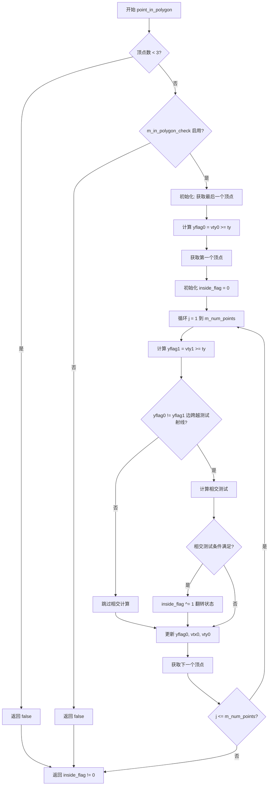

#### 带注释源码

```cpp
//======= Crossings Multiply algorithm of InsideTest ======================== 
//
// By Eric Haines, 3D/Eye Inc, erich@eye.com
//
// 该算法通过沿 +X 方向发射测试射线，计算与多边形边的相交次数来判断点的内外状态
bool polygon_ctrl_impl::point_in_polygon(double tx, double ty) const
{
    // 少于3个顶点不能构成多边形
    if(m_num_points < 3) return false;
    // 如果禁用多边形内检测，直接返回 false
    if(!m_in_polygon_check) return false;

    unsigned j;
    int yflag0, yflag1, inside_flag;
    double  vtx0, vty0, vtx1, vty1;

    // 获取多边形的最后一个顶点
    vtx0 = xn(m_num_points - 1);
    vty0 = yn(m_num_points - 1);

    // 获取测试点在 X 轴上方还是下方（用于快速排除不相交的边）
    yflag0 = (vty0 >= ty);

    // 获取第一个顶点
    vtx1 = xn(0);
    vty1 = yn(0);

    inside_flag = 0;
    
    // 遍历多边形的每一条边
    for (j = 1; j <= m_num_points; ++j) 
    {
        yflag1 = (vty1 >= ty);
        
        // 检查边的端点是否在测试射线的两侧（即 Y 值不同）
        // 如果是，+X 射线可能与该边相交
        if (yflag0 != yflag1) 
        {
            // 计算边的参数化相交点
            // 使用叉积判断射线是否与边相交，避免除法运算提高性能
            if ( ((vty1-ty) * (vtx0-vtx1) >=
                  (vtx1-tx) * (vty0-vty1)) == yflag1 ) 
            {
                // 相交，奇偶规则翻转 inside 状态
                inside_flag ^= 1;
            }
        }

        // 移动到下一对顶点
        yflag0 = yflag1;
        vtx0 = vtx1;
        vty0 = vty1;

        // 处理循环（最后一个顶点后回到第一个顶点）
        unsigned k = (j >= m_num_points) ? j - m_num_points : j;
        vtx1 = xn(k);
        vty1 = yn(k);
    }
    
    // inside_flag 为 1 表示点在多边形内部（奇数次相交）
    return inside_flag != 0;
}
```

---

### `polygon_ctrl_impl::check_edge`

检测给定点是否在指定边的可拖拽范围内（该范围以边为中轴、点半径为宽度的带状区域）。

参数：

- `i`：`unsigned`，边的索引
- `x`：`double`，测试点的 X 坐标
- `y`：`double`，测试点的 Y 坐标

返回值：`bool`，点在边的可拖拽范围内返回 true，否则返回 false

#### 流程图

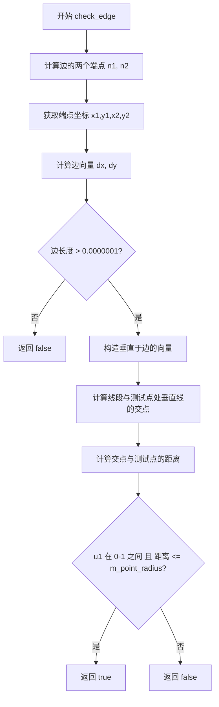

#### 带注释源码

```cpp
bool polygon_ctrl_impl::check_edge(unsigned i, double x, double y) const
{
   bool ret = false;

   // 获取边的两个端点索引
   unsigned n1 = i;
   unsigned n2 = (i + m_num_points - 1) % m_num_points;
   
   // 获取端点坐标
   double x1 = xn(n1);
   double y1 = yn(n1);
   double x2 = xn(n2);
   double y2 = yn(n2);

   // 计算边的方向向量
   double dx = x2 - x1;
   double dy = y2 - y1;

   // 忽略长度过小的边（避免除零和数值不稳定）
   if(sqrt(dx*dx + dy*dy) > 0.0000001)
   {
      // 构造通过测试点、垂直于边的直线
      // 边的方向向量为 (dx, dy)，垂直向量为 (-dy, dx)
      double x3 = x;
      double y3 = y;
      double x4 = x3 - dy;  // 垂直线的另一个点
      double y4 = y3 + dx;

      // 计算两条线段的交点
      // 直线1: (x1,y1) 到 (x2,y2) - 边
      // 直线2: (x3,y3) 到 (x4,y4) - 垂直于边的线
      double den = (y4-y3) * (x2-x1) - (x4-x3) * (y2-y1);
      double u1 = ((x4-x3) * (y1-y3) - (y4-y3) * (x1-x3)) / den;

      // 交点坐标
      double xi = x1 + u1 * (x2 - x1);
      double yi = y1 + u1 * (y2 - y1);

      // 计算交点到测试点的距离
      dx = xi - x;
      dy = yi - y;

      // 判断条件：
      // 1. u1 在 0-1 之间（交点在线段上）
      // 2. 距离小于控制点半径（在边的可拖拽范围内）
      if (u1 > 0.0 && u1 < 1.0 && sqrt(dx*dx + dy*dy) <= m_point_radius)
      {
         ret = true;
      }
   }
   return ret;
}
```

---

### `polygon_ctrl_impl::on_mouse_move`

处理鼠标移动事件，实现多边形元素的拖拽功能。根据当前选中的元素类型（顶点、边、面），执行相应的拖拽逻辑。

参数：

- `x`：`double`，鼠标当前位置的 X 坐标（屏幕坐标）
- `y`：`double`，鼠标当前位置的 Y 坐标（屏幕坐标）
- `button_flag`：`bool`，鼠标按钮状态（是否按下）

返回值：`bool`，拖拽操作是否成功执行

#### 流程图

```mermaid
flowchart TD
    A[开始 on_mouse_move] --> B[坐标逆变换]
    B --> C{m_node == m_num_points 选中整个多边形?]
    C -->|是| D[计算移动量 dx, dy]
    D --> E[遍历所有顶点]
    E --> F[xn += dx, yn += dy]
    F --> G[更新 m_dx, m_dy]
    G --> H[返回 true]
    C -->|否| I{m_edge >= 0 选中边?}
    I -->|是| J[获取边的两个端点]
    J --> K[计算移动量]
    K --> L[移动两个端点]
    L --> M[更新 m_dx, m_dy]
    M --> N[返回 true]
    I -->|否| O{m_node >= 0 选中顶点?]
    O -->|是| P[移动单个顶点]
    P --> Q[返回 true]
    O -->|否| R[返回 false]
```

#### 带注释源码

```cpp
bool polygon_ctrl_impl::on_mouse_move(double x, double y, bool button_flag)
{
    bool ret = false;
    double dx;
    double dy;
    
    // 坐标逆变换
    inverse_transform_xy(&x, &y);
    
    // 情况1：拖拽整个多边形（选中面）
    if(m_node == int(m_num_points))
    {
        dx = x - m_dx;  // 计算 X 方向移动量
        dy = y - m_dy;  // 计算 Y 方向移动量
        
        // 移动所有顶点
        unsigned i;
        for(i = 0; i < m_num_points; i++)
        {
            xn(i) += dx;
            yn(i) += dy;
        }
        
        // 更新拖拽基准点
        m_dx = x;
        m_dy = y;
        ret = true;
    }
    else
    {
        // 情况2：拖拽边（同时移动边的两个端点）
        if(m_edge >= 0)
        {
            unsigned n1 = m_edge;
            unsigned n2 = (n1 + m_num_points - 1) % m_num_points;
            
            dx = x - m_dx;
            dy = y - m_dy;
            
            // 移动边的两个端点
            xn(n1) += dx;
            yn(n1) += dy;
            xn(n2) += dx;
            yn(n2) += dy;
            
            m_dx = x;
            m_dy = y;
            ret = true;
        }
        else
        {
            // 情况3：拖拽单个顶点
            if(m_node >= 0)
            {
                xn(m_node) = x - m_dx;
                yn(m_node) = y - m_dy;
                ret = true;
            }
        }
    }
    return ret;
}
```

---

### 关键组件信息

| 组件名称 | 描述 |
|---------|------|
| `polygon_ctrl_impl` | 交互式多边形控制控件实现类 |
| `xn(i) / yn(i)` | 多边形顶点坐标访问器（内联函数，从 m_polygon 数组读取） |
| `m_ellipse` | 椭圆渲染对象，用于绘制控制点 |
| `m_stroke` | 描边对象，用于绘制多边形边线 |
| `point_in_polygon` | Crossings Multiply 算法实现，点与多边形位置关系检测 |
| `check_edge` | 边拾取检测算法 |

---

### 潜在的技术债务与优化空间

1. **距离计算优化**：多处使用 `sqrt(dx*dx + dy*dy)` 进行距离平方计算，可考虑使用距离平方比较避免开方运算，提升性能。

2. **魔法数字**：代码中存在硬编码的数值如 `0.0000001`（最小边长度阈值）、`32`（椭圆分段数），应提取为可配置的常量或成员变量。

3. **虚函数与多态**：`in_rect` 和 `on_arrow_keys` 方法直接返回 false/true，可考虑接口设计优化。

4. **算法复杂度**：`point_in_polygon` 方法的复杂度为 O(n)，对于复杂多边形可考虑使用空间索引（如 BVH 或四叉树）优化。

5. **坐标变换冗余**：频繁调用 `inverse_transform_xy`，在某些场景下可缓存变换后的坐标。

---

### 其它项目

#### 设计目标与约束

- **设计目标**：提供轻量级的交互式多边形编辑控件，支持顶点、边、整体拖拽
- **约束**：基于 AGG 渲染框架，依赖 `ctrl` 基类，坐标系统支持变换

#### 错误处理与异常设计

- 代码采用返回值而非异常处理机制
- 边界条件通过默认值或提前返回处理（如顶点数 < 3 时直接返回 false）

#### 数据流与状态机

- `vertex` 方法内部维护 `m_status` 状态机，控制渲染顺序（边 → 控制点）
- 鼠标事件处理依赖 `m_node` 和 `m_edge` 状态变量记录选中元素

#### 外部依赖与接口契约

- 依赖 AGG 核心库：`pod_array_template`、`vertex_sequence`、`ellipse`、`stroke`
- 基类接口：`ctrl` 提供坐标变换、事件处理虚函数框架
- 路径命令常量：`path_cmd_stop`、`path_cmd_line_to` 等


### `is_stop`

该函数用于判断给定的路径命令是否为停止命令（`path_cmd_stop`），在多边形控制点的顶点生成过程中用于检测路径是否结束。

参数：
- `cmd`：`unsigned` 类型，表示路径命令值，用于判断是否为停止命令。

返回值：`bool` 类型，如果命令等于停止命令则返回 `true`，否则返回 `false`。

#### 流程图

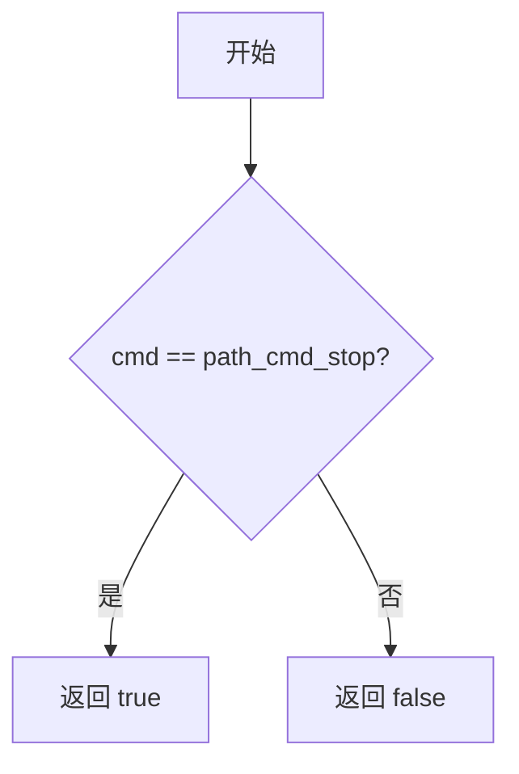

#### 带注释源码

```cpp
// 判断路径命令是否为停止命令
// 参数 cmd: unsigned 类型，表示路径命令值
// 返回值: bool 类型，true 表示命令为停止命令，false 表示不是停止命令
inline bool is_stop(unsigned cmd)
{
    // 假设 path_cmd_stop 已定义为枚举值，表示路径的停止命令
    return cmd == path_cmd_stop;
}
```

**注意**：由于原始代码中未直接提供 `is_stop` 的定义，该函数推断自 AGG 库中常见的实现方式，并基于代码中 `is_stop(cmd)` 的调用方式推测其逻辑。`path_cmd_stop` 通常在 AGG 的路径命令枚举中定义。


### path_cmd_stop

`path_cmd_stop` 不是类 `polygon_ctrl_impl` 的成员方法，而是AGG（Anti-Grain Geometry）库中定义的一个**全局常量**（路径命令枚举值），用于表示路径绘制的停止命令。在 `polygon_ctrl_impl::vertex()` 方法中作为返回值使用，表示路径顶点序列的结束。

由于 `path_cmd_stop` 是一个常量（非函数/方法），以下提供该常量在代码中的使用上下文分析。

#### 上下文信息

- **定义位置**：通常在 AGG 库的头文件（如 `agg_path_basics.h` 或类似）中定义
- **类型**：`unsigned int` 枚举值
- **用途**：作为路径生成器的停止命令，表示不再有更多的顶点

#### 使用场景分析

在 `polygon_ctrl_impl::vertex()` 方法中，`path_cmd_stop` 的使用流程如下：

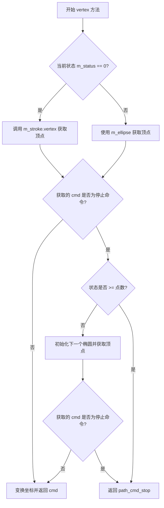

#### 带注释源码（使用上下文）

```cpp
// polygon_ctrl_impl::vertex 方法中 path_cmd_stop 的使用示例

unsigned polygon_ctrl_impl::vertex(double* x, double* y)
{
    // 初始化命令为 path_cmd_stop（停止命令）
    unsigned cmd = path_cmd_stop;
    
    double r = m_point_radius;
    
    if(m_status == 0)
    {
        // 首先尝试从描边路径获取顶点
        cmd = m_stroke.vertex(x, y);
        
        // 如果不是停止命令，则变换坐标并返回
        if(!is_stop(cmd)) 
        {
            transform_xy(x, y);
            return cmd;
        }
        
        // 如果到达这里，说明描边路径已结束
        // 检查是否需要放大当前点的半径（选中状态）
        if(m_node >= 0 && m_node == int(m_status)) r *= 1.2;
        
        // 初始化控制点椭圆
        m_ellipse.init(xn(m_status), yn(m_status), r, r, 32);
        ++m_status;
    }
    
    // 从椭圆获取顶点
    cmd = m_ellipse.vertex(x, y);
    
    if(!is_stop(cmd)) 
    {
        transform_xy(x, y);
        return cmd;
    }
    
    // 检查是否还有更多点需要处理
    if(m_status >= m_num_points) return path_cmd_stop;  // ← 返回停止命令
    
    // 继续处理下一个点
    if(m_node >= 0 && m_node == int(m_status)) r *= 1.2;
    m_ellipse.init(xn(m_status), yn(m_status), r, r, 32);
    ++m_status;
    cmd = m_ellipse.vertex(x, y);
    
    if(!is_stop(cmd)) 
    {
        transform_xy(x, y);
    }
    
    return cmd;
}
```

#### 补充说明

1. **常量性质**：`path_cmd_stop` 是 AGG 库定义的路径命令常量，通常值为 0 或类似值，表示路径结束
2. **与 is_stop() 配合**：代码中使用 `is_stop(cmd)` 函数来检查命令是否为停止命令，这是一个辅助函数，用于判断路径是否结束
3. **设计意图**：这种设计允许路径生成器按需生成顶点，而不是一次性返回所有顶点，符合生成器模式（Iterator Pattern）

#### 潜在优化建议

- **内联检查**：可以考虑将 `is_stop()` 检查内联以提高性能
- **状态缓存**：当前实现每次都重新计算椭圆顶点，可以考虑缓存策略
- **常量定义透明度**：建议在代码中添加对 `path_cmd_stop` 常量定义位置的注释，提高代码可读性


### `polygon_ctrl_impl.polygon_ctrl_impl`

这是 `polygon_ctrl_impl` 类的构造函数，用于初始化多边形控制器对象。该构造函数设置多边形的顶点数、控制点半径，并初始化所有相关的成员变量，包括状态变量、变换器和渲染组件。

参数：

-  `np`：`unsigned`，多边形的顶点数
-  `point_radius`：`double`，控制点的显示半径

返回值：无（构造函数无返回值）

#### 流程图

```mermaid
flowchart TD
    A[开始构造函数] --> B[调用基类ctrl构造函数<br/>ctrl(0, 0, 1, 1, false)]
    B --> C[初始化m_polygon数组<br/>大小为np * 2]
    C --> D[设置m_num_points = np]
    D --> E[初始化m_node = -1<br/>m_edge = -1]
    E --> F[初始化顶点源m_vs<br/>参数:&m_polygon[0], m_num_points, false]
    F --> G[初始化描边stroke对象<br/>m_stroke(m_vs)]
    G --> H[设置m_point_radius = point_radius]
    H --> I[初始化状态变量<br/>m_status=0, m_dx=0.0, m_dy=0.0]
    I --> J[设置m_in_polygon_check = true]
    J --> K[设置描边宽度<br/>m_stroke.width(1.0)]
    K --> L[结束构造函数]
```

#### 带注释源码

```cpp
// 构造函数：初始化多边形控制器
// 参数：
//   np - 多边形的顶点数
//   point_radius - 控制点的显示半径
polygon_ctrl_impl::polygon_ctrl_impl(unsigned np, double point_radius) :
    ctrl(0, 0, 1, 1, false),              // 调用基类ctrl的构造函数，初始化控件区域为(0,0)到(1,1)，不使用二进制标志
    m_polygon(np * 2),                     // 分配多边形顶点数组，大小为顶点数*2（可能用于存储额外数据）
    m_num_points(np),                      // 存储多边形的顶点数
    m_node(-1),                           // 初始化当前选中的节点索引为-1（无选中）
    m_edge(-1),                           // 初始化当前选中的边索引为-1（无选中）
    m_vs(&m_polygon[0], m_num_points, false),  // 初始化顶点源vs，指向多边形数据，包含num_points个顶点，关闭自动闭合
    m_stroke(m_vs),                       // 创建描边对象，使用vs作为顶点源
    m_point_radius(point_radius),         // 设置控制点的显示半径
    m_status(0),                          // 初始化渲染状态为0
    m_dx(0.0),                            // 初始化鼠标拖拽的X偏移量
    m_dy(0.0),                            // 初始化鼠标拖拽的Y偏移量
    m_in_polygon_check(true)              // 启用多边形内部检测功能
{
    m_stroke.width(1.0);                  // 设置描边线条宽度为1.0像素
}
```


### `polygon_ctrl_impl::rewind`

该方法用于重置多边形控制器的渲染状态，将内部状态标记为起始位置，准备重新生成顶点数据。这是AGG（Anti-Grain Geometry）渲染管线中路径生成器的标准接口方法。

参数：

- `unsigned`（未命名参数）：`unsigned int`，AGG路径接口约定的参数，当前实现中未使用，传入值被忽略

返回值：`void`，无返回值

#### 流程图

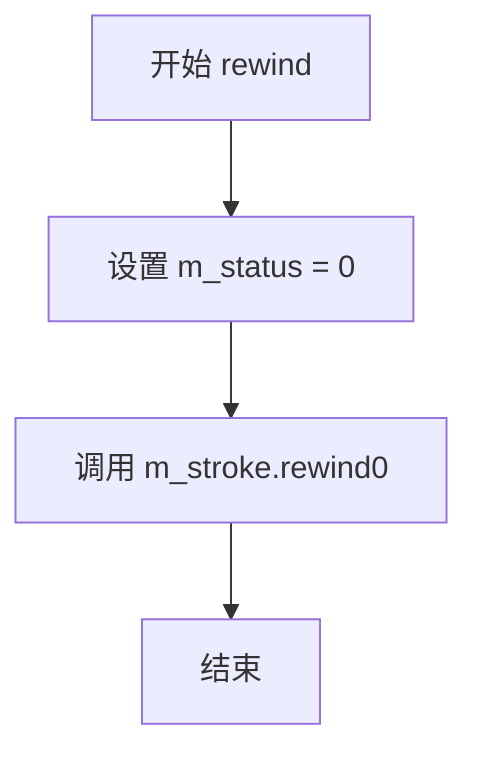

#### 带注释源码

```cpp
//----------------------------------------------------------------------------
// 重置多边形控制器的渲染状态，准备重新生成顶点
// 参数 unsigned: AGG路径接口约定的参数，当前实现中未使用
//----------------------------------------------------------------------------
void polygon_ctrl_impl::rewind(unsigned)
{
    // 重置顶点生成状态计数器为0
    // m_status用于控制vertex()方法生成顶点的顺序：
    // - 值为0时首先生成多边形边的路径
    // - 后续值用于生成各个控制点的椭圆（圆形）
    m_status = 0;
    
    // 重置笔划生成器m_stroke的内部状态
    // m_stroke负责生成多边形边界的路径数据
    m_stroke.rewind(0);
}
```


### `polygon_ctrl_impl.vertex`

生成多边形控制点的顶点数据，用于渲染多边形边和控制点。

参数：
- `x`：`double*`，指向 x 坐标的指针，用于输出顶点 x 坐标。
- `y`：`double*`，指向 y 坐标的指针，用于输出顶点 y 坐标。

返回值：`unsigned`，返回生成的顶点命令（如 path_cmd_move_to, path_cmd_line_to, path_cmd_stop 等）。

#### 流程图

```mermaid
graph TD
    A([开始]) --> B[cmd = path_cmd_stop, r = m_point_radius]
    B --> C{状态 m_status == 0?}
    C -->|是| D[cmd = m_stroke.vertex(x, y)]
    D --> E{命令 cmd 是停止?}
    E -->|否| F[变换坐标 transform_xy]
    F --> G[返回 cmd]
    E -->|是| H{节点 m_node 被选中且等于当前状态?}
    H -->|是| I[r *= 1.2]
    H -->|否| J
    I --> K[初始化椭圆 m_ellipse]
    J --> K
    K --> L[m_status++]
    L --> M[cmd = m_ellipse.vertex(x, y)]
    C -->|否| M
    M --> N{命令 cmd 是停止?}
    N -->|否| O[变换坐标 transform_xy]
    O --> P[返回 cmd]
    N -->|是| Q{状态 m_status >= 点数 m_num_points?}
    Q -->|是| R[返回 path_cmd_stop]
    Q -->|否| S{节点 m_node 被选中且等于当前状态?}
    S -->|是| T[r *= 1.2]
    S -->|否| U
    T --> V[初始化椭圆 m_ellipse]
    U --> V
    V --> W[m_status++]
    W --> X[cmd = m_ellipse.vertex(x, y)]
    X --> Y{命令 cmd 是停止?}
    Y -->|否| Z[变换坐标 transform_xy]
    Z --> AA[返回 cmd]
    Y -->|是| AB[返回 cmd]
```

#### 带注释源码

```cpp
unsigned polygon_ctrl_impl::vertex(double* x, double* y)
{
    unsigned cmd = path_cmd_stop;    // 初始命令为停止
    double r = m_point_radius;       // 初始半径为控制点半径
    if(m_status == 0)                // 当状态为0时，首先处理多边形边
    {
        cmd = m_stroke.vertex(x, y); // 从描边对象获取顶点命令
        if(!is_stop(cmd))            // 如果不是停止命令
        {
            transform_xy(x, y);      // 应用坐标变换
            return cmd;              // 返回顶点命令
        }
        // 检查当前节点是否被选中，如果是则放大半径
        if(m_node >= 0 && m_node == int(m_status)) r *= 1.2;
        // 初始化椭圆以绘制控制点
        m_ellipse.init(xn(m_status), yn(m_status), r, r, 32);
        ++m_status;                  // 状态增加，准备绘制下一个点
    }
    // 获取控制点的顶点命令
    cmd = m_ellipse.vertex(x, y);
    if(!is_stop(cmd))                // 如果不是停止命令
    {
        transform_xy(x, y);         // 应用坐标变换
        return cmd;                 // 返回顶点命令
    }
    // 如果所有点已处理完毕，则返回停止命令
    if(m_status >= m_num_points) return path_cmd_stop;
    // 检查当前节点是否被选中
    if(m_node >= 0 && m_node == int(m_status)) r *= 1.2;
    // 初始化下一个椭圆
    m_ellipse.init(xn(m_status), yn(m_status), r, r, 32);
    ++m_status;
    cmd = m_ellipse.vertex(x, y);
    if(!is_stop(cmd)) 
    {
        transform_xy(x, y);
    }
    return cmd;
}
```


### `polygon_ctrl_impl.check_edge`

该函数用于检测给定点(x, y)是否位于多边形第i条边的指定半径范围内，常用于鼠标交互时判断是否选中多边形的某条边。

参数：

- `i`：`unsigned`，边的索引，指定要检测的多边形的哪条边
- `x`：`double`，待检测点的X坐标（世界坐标）
- `y`：`double`，待检测点的Y坐标（世界坐标）

返回值：`bool`，如果给定点在第i条边的半径范围内返回true，否则返回false

#### 流程图

```mermaid
flowchart TD
    A[开始 check_edge] --> B[计算边的前一个顶点索引 n2 = (i + m_num_points - 1) % m_num_points]
    B --> C[获取顶点坐标 x1,y1 和 x2,y2]
    C --> D[计算边的向量 dx = x2 - x1, dy = y2 - y1]
    D --> E{边的长度 > 0.0000001?}
    E -->|否| F[返回 false]
    E -->|是| G[构建测试线段: 从点(x,y)出发，垂直于边]
    G --> H[计算两条线段的叉积分母 den]
    H --> I[计算交点参数 u1]
    I --> J[计算交点坐标 xi, yi]
    J --> K[计算点到交点的距离]
    K --> L{u1 在 0-1 之间 且 距离 <= m_point_radius?}
    L -->|是| M[返回 true]
    L -->|否| F
```

#### 带注释源码

```
bool polygon_ctrl_impl::check_edge(unsigned i, double x, double y) const
{
   // 初始化返回值
   bool ret = false;

   // 获取当前边的终点索引（当前顶点i）
   unsigned n1 = i;
   // 计算当前边的起点索引（前一个顶点）
   // 使用模运算实现环形访问
   unsigned n2 = (i + m_num_points - 1) % m_num_points;
   
   // 获取两个顶点的坐标
   double x1 = xn(n1);
   double y1 = yn(n1);
   double x2 = xn(n2);
   double y2 = yn(n2);

   // 计算边的向量
   double dx = x2 - x1;
   double dy = y2 - y1;

   // 检查边是否有实际长度（避免除零和无效计算）
   if(sqrt(dx*dx + dy*dy) > 0.0000001)
   {
      // 测试点坐标
      double x3 = x;
      double y3 = y;
      
      // 构建一条通过测试点、垂直于边的射线
      // 这是用于计算点到线段距离的几何技巧
      double x4 = x3 - dy;  // 射线方向: (-dy, dx) 的垂直方向
      double y4 = y3 + dx;

      // 计算两条线段的叉积分母（平行四边形面积）
      double den = (y4-y3) * (x2-x1) - (x4-x3) * (y2-y1);
      
      // 计算参数u1，表示交点在线段上的位置
      // u1 < 0: 交点在线段起点之外
      // u1 > 1: 交点在线段终点之外
      // 0 <= u1 <= 1: 交点在线段上
      double u1 = ((x4-x3) * (y1-y3) - (y4-y3) * (x1-x3)) / den;

      // 计算交点坐标
      double xi = x1 + u1 * (x2 - x1);
      double yi = y1 + u1 * (y2 - y1);

      // 重新计算从测试点到交点的向量
      dx = xi - x;
      dy = yi - y;

      // 判断条件：
      // 1. u1 > 0.0 && u1 < 1.0: 交点必须在线段内部（不包含端点）
      // 2. sqrt(dx*dx + dy*dy) <= m_point_radius: 距离必须在半径范围内
      if (u1 > 0.0 && u1 < 1.0 && sqrt(dx*dx + dy*dy) <= m_point_radius)
      {
         ret = true;  // 点在边的检测范围内
      }
   }
   
   return ret;  // 返回检测结果
}
```


### `polygon_ctrl_impl.in_rect`

该方法用于检测给定点坐标是否在多边形控制器的矩形边界范围内，目前实现为占位符函数，始终返回 false。

参数：

- `x`：`double`，待检测的X坐标（世界坐标或屏幕坐标）
- `y`：`double`，待检测的Y坐标（世界坐标或屏幕坐标）

返回值：`bool`，如果点位于矩形边界内返回 true，否则返回 false

#### 流程图

```mermaid
flowchart TD
    A[开始 in_rect] --> B[接收坐标 x, y]
    B --> C{检测点是否在矩形范围内}
    C -->|当前实现| D[直接返回 false]
    C -->|理想实现| E{点是否在最小外接矩形内}
    E -->|是| F[返回 true]
    E -->|否| G[返回 false]
    D --> H[结束]
    F --> H
    G --> H
```

#### 带注释源码

```cpp
// 检测点(x, y)是否在多边形控制器的矩形边界内
// 这是一个基类方法的实现，通常用于鼠标事件处理中的命中测试
//
// 参数:
//   x - 待检测的X坐标
//   y - 待检测的Y坐标
//
// 返回值:
//   bool - 点在矩形范围内返回true，否则返回false
bool polygon_ctrl_impl::in_rect(double x, double y) const
{
    // 当前实现为存根函数，直接返回false
    // 理想情况下应检测点是否在多边形的最小外接矩形内
    // 最小外接矩形可以通过遍历所有顶点计算得到
    return false;
}
```

#### 备注

该方法目前是一个空实现（stub），未完成实际功能。潜在的技术债务包括：

1. **未实现的功能**：方法体直接返回 `false`，缺少实际的矩形区域检测逻辑
2. **设计不完整**：根据 `on_mouse_button_down`、`on_mouse_move` 等方法的存在，该类明显支持鼠标交互，但 `in_rect` 方法未实现基本的边界检测
3. **优化建议**：应实现基于多边形顶点计算的最小外接矩形检测逻辑，或调用现有的边界计算方法

根据同类方法（如 `point_in_polygon`）的实现模式，该方法应该计算多边形所有顶点的最小和最大X、Y坐标，形成包围盒，然后检测给定坐标是否落在该包围盒内。


### `polygon_ctrl_impl.on_mouse_button_down`

该方法处理多边形控件的鼠标按下事件，通过计算鼠标位置与多边形节点、边和内部区域的关系来判断用户是否点击了多边形的可编辑部分（节点、边或内部），并记录相关状态供后续拖拽操作使用。

参数：

- `x`：`double`，鼠标按下时的屏幕X坐标
- `y`：`double`，鼠标按下时的屏幕Y坐标

返回值：`bool`，如果鼠标点击在多边形的节点、边或内部区域返回true，否则返回false

#### 流程图

```mermaid
flowchart TD
    A[开始 on_mouse_button_down] --> B[初始化: ret = false, m_node = -1, m_edge = -1]
    B --> C[调用 inverse_transform_xy 转换坐标]
    C --> D{遍历节点 i < m_num_points}
    D --> E{计算距离 < m_point_radius}
    E -->|是| F[记录 m_dx, m_dy, m_node = i, ret = true]
    E -->|否| D
    D --> G{ret == false?}
    G -->|是| H{遍历边 i < m_num_points}
    H --> I{check_edge 返回 true?}
    I -->|是| J[记录 m_dx, m_dy, m_edge = i, ret = true]
    I -->|否| H
    H --> K{ret == false?}
    K -->|是| L{point_in_polygon 返回 true?}
    L -->|是| M[记录 m_dx, m_dy, m_node = m_num_points, ret = true]
    L -->|否| N[返回 false]
    M --> N
    J --> N
    F --> N
    K -->|否| N
    G -->|否| N
    N[返回 ret]
```

#### 带注释源码

```cpp
bool polygon_ctrl_impl::on_mouse_button_down(double x, double y)
{
    unsigned i;                    // 循环计数器
    bool ret = false;              // 返回值，初始为false
    m_node = -1;                   // 重置节点索引为-1（无节点选中）
    m_edge = -1;                   // 重置边索引为-1（无边选中）
    
    // 将屏幕坐标逆变换为多边形坐标系的坐标
    inverse_transform_xy(&x, &y);
    
    // 第一步：检查鼠标是否点击在某个节点（顶点）上
    for (i = 0; i < m_num_points; i++)
    {
        // 计算鼠标位置与当前节点的距离（欧几里得距离）
        if(sqrt( (x-xn(i)) * (x-xn(i)) + (y-yn(i)) * (y-yn(i)) ) < m_point_radius)
        {
            // 记录鼠标与节点之间的偏移量，用于拖拽计算
            m_dx = x - xn(i);
            m_dy = y - yn(i);
            // 记录选中的节点索引
            m_node = int(i);
            ret = true;
            break;                  // 找到节点后退出循环
        }
    }

    // 第二步：如果未点击节点，检查是否点击在某条边上
    if(!ret)
    {
        for (i = 0; i < m_num_points; i++)
        {
            // 使用check_edge检测鼠标是否在边的半径范围内
            if(check_edge(i, x, y))
            {
                // 记录鼠标位置作为拖拽基准点
                m_dx = x;
                m_dy = y;
                // 记录选中的边索引
                m_edge = int(i);
                ret = true;
                break;              // 找到边后退出循环
            }
        }
    }

    // 第三步：如果既未点击节点也未点击边，检查是否点击在多边形内部
    if(!ret)
    {
        // 使用Crossings Multiply算法判断点是否在多边形内
        if(point_in_polygon(x, y))
        {
            m_dx = x;
            m_dy = y;
            // 将节点索引设为总点数，表示选中整个多边形（用于整体拖拽）
            m_node = int(m_num_points);
            ret = true;
        }
    }
    
    // 返回是否成功捕获到有效的鼠标操作
    return ret;
}
```


### `polygon_ctrl_impl.on_mouse_move`

该函数处理鼠标移动事件，用于在用户拖动多边形控制点（顶点或边）时更新多边形顶点坐标。当鼠标移动时，根据当前激活的节点（顶点）、边或多边形整体来计算位移并更新坐标，实现交互式多边形编辑功能。

参数：

- `x`：`double`，鼠标当前的 X 坐标（屏幕坐标）
- `y`：`double`，鼠标当前的 Y 坐标（屏幕坐标）
- `button_flag`：`bool`，鼠标按钮是否处于按下状态

返回值：`bool`，如果发生了多边形顶点的更新则返回 `true`，否则返回 `false`

#### 流程图

```mermaid
flowchart TD
    A[开始 on_mouse_move] --> B[对 x, y 进行逆变换]
    B --> C{检查 m_node 是否等于 m_num_points?}
    C -->|是| D[计算位移 dx, dy]
    D --> E[遍历所有顶点]
    E --> F[更新每个顶点坐标]
    F --> G[更新 m_dx, m_dy]
    G --> H[设置 ret = true]
    H --> Z[返回 ret]
    C -->|否| I{m_edge >= 0?}
    I -->|是| J[获取边索引 n1, n2]
    J --> K[计算位移 dx, dy]
    K --> L[更新两个相邻顶点]
    L --> M[更新 m_dx, m_dy]
    M --> N[设置 ret = true]
    N --> Z
    I -->|否| O{m_node >= 0?}
    O -->|是| P[更新单个顶点坐标]
    P --> Q[设置 ret = true]
    Q --> Z
    O -->|否| Z
```

#### 带注释源码

```
bool polygon_ctrl_impl::on_mouse_move(double x, double y, bool button_flag)
{
    // 初始化返回值，表示是否有顶点被移动
    bool ret = false;
    double dx;
    double dy;

    // 将屏幕坐标转换为多边形所在的本地坐标系
    inverse_transform_xy(&x, &y);

    // 情况1：正在拖动整个多边形（m_node 等于顶点数，表示在多边形内部拖动）
    if(m_node == int(m_num_points))
    {
        // 计算当前鼠标位置与上次位置的位移
        dx = x - m_dx;
        dy = y - m_dy;

        // 遍历所有顶点，根据位移更新每个顶点的坐标
        unsigned i;
        for(i = 0; i < m_num_points; i++)
        {
            xn(i) += dx;
            yn(i) += dy;
        }

        // 更新记录的上次鼠标位置
        m_dx = x;
        m_dy = y;
        ret = true;
    }
    // 情况2：正在拖动多边形的某条边
    else
    {
        if(m_edge >= 0)
        {
            // 获取被拖动边的两个端点索引
            unsigned n1 = m_edge;
            unsigned n2 = (n1 + m_num_points - 1) % m_num_points;

            // 计算位移
            dx = x - m_dx;
            dy = y - m_dy;

            // 同时移动边的两个端点，保持边的方向不变
            xn(n1) += dx;
            yn(n1) += dy;
            xn(n2) += dx;
            yn(n2) += dy;

            // 更新记录的上次鼠标位置
            m_dx = x;
            m_dy = y;
            ret = true;
        }
        // 情况3：正在拖动单个顶点
        else
        {
            if(m_node >= 0)
            {
                // 更新指定顶点的坐标（减去初始点击时的偏移量）
                xn(m_node) = x - m_dx;
                yn(m_node) = y - m_dy;
                ret = true;
            }
        }
    }

    // 返回是否有顶点被更新
    return ret;
}
```


### `polygon_ctrl_impl.on_mouse_button_up`

该方法处理多边形控制器的鼠标按钮释放事件，用于判断鼠标按下期间是否发生了有效的节点或边操作，并在操作完成后重置内部状态。

参数：

-  `x`：`double`，鼠标释放时的X坐标（世界坐标）
-  `y`：`double`，鼠标释放时的Y坐标（世界坐标）

返回值：`bool`，如果在鼠标按下期间存在有效的节点或边操作返回`true`，否则返回`false`

#### 流程图

```mermaid
flowchart TD
    A[开始 on_mouse_button_up] --> B{检查 m_node >= 0}
    B -->|是| C[ret = true]
    B -->|否| D{检查 m_edge >= 0}
    D -->|是| C
    D -->|否| E[ret = false]
    C --> F[重置 m_node = -1]
    E --> F
    F --> G[重置 m_edge = -1]
    G --> H[返回 ret]
```

#### 带注释源码

```
bool polygon_ctrl_impl::on_mouse_button_up(double x, double y)
{
    // 判断鼠标按下期间是否发生过有效的节点或边操作
    // m_node >= 0 表示有点被拖动
    // m_edge >= 0 表示有边被拖动
    bool ret = (m_node >= 0) || (m_edge >= 0);
    
    // 重置节点索引为初始状态，表示当前没有节点被操作
    m_node = -1;
    
    // 重置边索引为初始状态，表示当前没有边被操作
    m_edge = -1;
    
    // 返回是否有操作发生
    return ret;
}
```


### `polygon_ctrl_impl.on_arrow_keys`

处理方向键（箭头键）的事件，用于控制多边形顶点的移动。当前实现为占位符，不执行任何操作。

参数：

- `left`：`bool`，表示是否按下了左方向键
- `right`：`bool`，表示是否按下了右方向键
- `down`：`bool`，表示是否按下了下方向键
- `up`：`bool`，表示是否按下了上方向键

返回值：`bool`，表示事件是否被处理（当前总是返回 false）

#### 流程图

```mermaid
flowchart TD
    A[on_arrow_keys被调用] --> B{接收方向键参数}
    B --> C[left, right, down, up参数]
    C --> D[返回false]
    D --> E[表示未处理任何事件]
```

#### 带注释源码

```
// 处理方向键事件
// 参数left, right, down, up分别表示四个方向键的按下状态
// 返回true表示事件已被处理，返回false表示未处理
bool polygon_ctrl_impl::on_arrow_keys(bool left, bool right, bool down, bool up)
{
    // 当前实现为占位符，不执行任何操作
    //  TODO: 实现方向键控制多边形顶点移动的功能
    //  - 左键: 将选中的顶点向左移动
    //  - 右键: 将选中的顶点向右移动
    //  - 下键: 将选中的顶点向下移动
    //  - 上键: 将选中的顶点向上移动
    return false;
}
```


### `polygon_ctrl_impl.point_in_polygon`

该方法实现了Crossings Multiply算法（射线法），用于判断二维坐标系中的点是否位于多边形内部。算法通过从测试点沿X轴正方向发射射线，计算与多边形各边的相交次数，根据奇偶性（奇数次相交点在内部，偶数次相交点在外部）确定点的位置。

参数：
- `tx`：`double`，测试点的X坐标
- `ty`：`double`，测试点的Y坐标

返回值：`bool`，点在多边形内部返回true，否则返回false

#### 流程图

```mermaid
graph TD
    A([开始]) --> B{多边形顶点数 < 3?}
    B -->|是| C[返回 false]
    B -->|否| D{是否启用多边形检查?}
    D -->|否| C
    D -->|是| E[初始化顶点坐标和yflag标志]
    E --> F[循环 j = 1 到 m_num_points]
    subgraph 循环体
        G[获取当前顶点坐标 vtx1, vty1]
        H{yflag0 != yflag1}
        H -->|否| I[更新顶点变量]
        H -->|是| J{相交测试条件}
        J -->|满足| K[inside_flag ^= 1]
        J -->|不满足| I
        K --> I
        I --> L[准备下一个顶点]
    end
    F --> M{循环结束?}
    M -->|否| G
    M -->|是| N[返回 inside_flag != 0]
```

#### 带注释源码

```cpp
// 判断点(tx, ty)是否在多边形内部
// 使用Crossings Multiply算法（射线法）
bool polygon_ctrl_impl::point_in_polygon(double tx, double ty) const
{
    // 如果多边形顶点数少于3，无法构成多边形，直接返回false
    if(m_num_points < 3) return false;
    
    // 如果多边形检查被禁用（m_in_polygon_check为false），返回false
    if(!m_in_polygon_check) return false;

    unsigned j;
    int yflag0, yflag1, inside_flag;
    double  vtx0, vty0, vtx1, vty1;

    // 获取多边形最后一个顶点作为起始边的一端
    vtx0 = xn(m_num_points - 1);
    vty0 = yn(m_num_points - 1);

    // 判断起始顶点相对于测试点Y坐标的位置（在上方或下方）
    // yflag0用于判断射线是否跨越该边
    yflag0 = (vty0 >= ty);

    // 获取多边形第一个顶点作为起始边的另一端
    vtx1 = xn(0);
    vty1 = yn(0);

    // 初始化相交次数标志，0表示偶数次相交，1表示奇数次相交
    inside_flag = 0;
    
    // 遍历多边形的所有边（从第一个顶点到最后一个顶点，再回到第一个顶点）
    for (j = 1; j <= m_num_points; ++j) 
    {
        // 判断当前顶点相对于测试点Y坐标的位置
        yflag1 = (vty1 >= ty);
        
        // 检查边的两个端点是否在测试点Y坐标的两侧（即边的Y坐标跨越了测试点的Y坐标）
        // 如果yflag0 != yflag1，说明射线可能会与这条边相交
        if (yflag0 != yflag1) 
        {
            // 计算射线与边的交点
            // 使用叉积判断交点是否在测试点的右侧（或线上）
            // 公式：(vty1-ty) * (vtx0-vtx1) >= (vtx1-tx) * (vty0-vty1)
            // 等价于判断：交点X坐标 >= 测试点X坐标
            // 额外的 yflag1 检查用于确保只在正确的半平面内计数
            if ( ((vty1-ty) * (vtx0-vtx1) >=
                  (vtx1-tx) * (vty0-vty1)) == yflag1 ) 
            {
                // 如果相交，则翻转inside_flag（奇偶变换）
                inside_flag ^= 1;
            }
        }

        // 移动到下一条边：将当前顶点信息保存为边的起点
        yflag0 = yflag1;
        vtx0 = vtx1;
        vty0 = vty1;

        // 获取下一个顶点（处理多边形闭合，当j达到顶点数时回到第一个顶点）
        unsigned k = (j >= m_num_points) ? j - m_num_points : j;
        vtx1 = xn(k);
        vty1 = yn(k);
    }
    
    // 如果inside_flag为1（奇数次相交），点在多边形内；否则在多边形外
    return inside_flag != 0;
}
```


## 关键组件


### 多边形控制点渲染组件

负责渲染多边形的顶点和控制点，通过m_ellipse椭圆对象绘制圆形的控制点，并根据m_status状态机决定渲染顺序，支持节点悬停时放大效果。

### 顶点访问器流程序列

通过rewind方法重置状态，vertex方法顺序输出多边形路径顶点。第一轮输出多边形轮廓stroke路径，第二轮及之后输出各个控制点的椭圆形状，形成完整的交互式多边形渲染序列。

### 边缘相交检测算法

使用几何相交计算判断点是否位于多边形某条边的临界区域内。通过计算点到线段的垂直距离，结合参数u1的取值范围(0,1)确定相交，并使用m_point_radius作为检测半径阈值。

### 点在多边形内测试算法

实现Crossings Multiply算法的2D点包含性测试，通过沿+X轴发射测试射线，计算与多边形边的奇数次交叉判断点是否在多边形内部。包含对Y轴跨越的检测和X轴交点的符号判断优化。

### 鼠标拖拽状态管理

通过m_node、m_edge和m_dx、m_dy四个状态变量管理交互：m_node表示当前拖拽的节点索引，m_edge表示拖拽的边索引，m_dx/m_dy记录拖拽起始偏移量。支持三种拖拽模式：移动整个多边形、拖拽单条边、拖拽单个顶点。

### 坐标变换管道

通过transform_xy和inverse_transform_xy方法支持多边形在世界坐标和屏幕坐标之间的转换，允许多边形控制器在不同的坐标空间中使用，同时保持渲染和交互的一致性。

### 顶点数组访问封装

使用xn()和yn()内联函数封装对m_polygon顶点数组的双索引访问，提供类型安全的坐标读取和写入接口，简化代码并提供一致的访问模式。


## 问题及建议


### 已知问题

-   **重复的几何计算**：在 `check_edge`、`on_mouse_button_down` 和 `on_mouse_move` 中存在重复的距离计算逻辑，每次都使用 `sqrt` 计算欧几里得距离，缺乏统一的距离计算辅助函数，导致代码冗余且性能较低。
-   **魔法数字**：代码中直接使用 `0.0000001` 作为线段长度判断的 epsilon 值，缺乏语义化的常量定义，未来维护时难以理解该值的具体含义和调整依据。
-   **除零风险**：`check_edge` 方法中的线段交点计算使用除法 (`den` 作为分母)，虽然有长度检查，但 epsilon 值过小 (`0.0000001`)，在处理非常接近共线的点时仍可能产生数值不稳定问题。
-   **未使用的参数**：`rewind(unsigned)` 方法的参数未使用，这是 AGG 库接口设计的遗留问题，但会导致调用者困惑；同样 `in_rect` 方法返回固定的 `false`，功能未实现。
-   **状态管理分散**：`m_node`、`m_edge`、`m_status` 三个状态变量分散在多个方法中管理，缺乏统一的状态机设计，增加了状态同步的复杂性和出错风险。
-   **浮点数比较缺乏 epsilon**：`point_in_polygon` 方法中大量使用 `>=` 和 `<` 直接比较浮点数，未引入 epsilon 容差，在边界情况下可能产生不准确的多边形内外判断。

### 优化建议

-   **提取距离计算函数**：创建 `distance_squared` 或 `point_to_segment_distance` 辅助函数，避免重复的 `sqrt` 计算，直接比较平方值以提升性能。
-   **定义常量替代魔法数字**：将 `0.0000001` 提取为具名常量如 `SEGMENT_COLLINEAR_THRESHOLD`，增强代码可读性；同时为 `1.2` (点半径放大倍数) 定义常量。
-   **增强数值稳定性**：在 `check_edge` 中添加更健壮的除零检查，或使用向量叉积方法避免除法操作；考虑使用 `fabs(den) < epsilon` 的保护逻辑。
-   **统一状态管理**：考虑使用枚举或状态机模式封装 `m_node`、`m_edge` 的状态转换逻辑，提供清晰的状态查询接口。
-   **添加浮点数容差**：在所有浮点数比较处引入 `AGG_CDECL` 约定的容差值，或定义本地 epsilon 常量（如 `1e-10`），提高几何判断的鲁棒性。
-   **完善接口设计**：`rewind` 参数可考虑移除或改为使用默认参数；`in_rect` 应实现实际功能或添加 `TODO` 注释说明未完成。


## 其它


### 设计目标与约束

该组件旨在提供一个交互式的多边形编辑控件，支持以下核心功能：
1. 多边形顶点的独立拖拽编辑
2. 多边形边的拖拽编辑（同时移动相邻两个顶点）
3. 多边形整体的平移拖拽
4. 多边形渲染（包含顶点标记和边线）
设计约束包括：仅支持2D平面坐标系统，多边形顶点数必须>=3，坐标转换依赖父类ctrl的变换矩阵，点的半径需大于0。

### 错误处理与异常设计

代码中未使用异常机制，而是通过返回值进行错误状态反馈：
- check_edge函数：当边长过短（小于0.0000001）时跳过相交计算，返回false
- point_in_polygon函数：顶点数小于3时直接返回false，m_in_polygon_check为false时也返回false
- on_mouse_button_down函数：未命中任何控制点时返回false
- rewind和vertex函数：依赖AGG框架的path_cmd_stop命令结束渲染

### 数据流与状态机

该控件包含三种交互状态：
1. 节点拖拽状态（m_node >= 0）：拖拽单个顶点
2. 边拖拽状态（m_edge >= 0）：拖拽整条边（同时移动两个相邻顶点）
3. 多边形整体移动状态（m_node == m_num_points）：平移整个多边形
状态转换由鼠标事件驱动：on_mouse_button_down设置状态，on_mouse_move根据状态更新坐标，on_mouse_button_up重置状态。

### 外部依赖与接口契约

依赖外部组件：
- agg::ctrl：基类，提供坐标变换（transform_xy/inverse_transform_xy）和控制点基础属性
- m_polygon：存储多边形顶点坐标的数组（类型为pod_array<trans_double>）
- m_vs：vertex_source接口，用于边的渲染
- m_stroke：stroke对象，负责边的线条渲染
- m_ellipse：ellipse对象，负责顶点标记的圆形渲染
- AGG框架的基础数学函数：sqrt、is_stop等

接口契约：
- vertex函数遵循AGG的vertex_source接口规范，依次返回边的路径点和顶点椭圆轮廓
- on_mouse_*系列函数返回bool表示是否处理了该事件
- 所有坐标参数均为屏幕坐标或变换后的逻辑坐标

### 性能考虑

潜在性能优化点：
1. check_edge函数中多次调用sqrt，可预先计算距离平方后比较避免开方
2. point_in_polygon使用 crossings multiply 算法，但在每轮循环中仍有多次浮点运算
3. vertex函数在渲染每个顶点时都重新初始化椭圆对象，可考虑缓存
4. 未命中控制点时遍历所有顶点和边，最坏复杂度O(n)

### 线程安全性

该组件为单线程设计，无线程同步保护。在多线程环境下使用需要外部加锁机制保护m_node、m_edge、m_dx、m_dy等状态变量。

### 内存管理

- m_polygon：使用pod_array管理，按np*2分配内存（存储x、y坐标）
- m_vs、m_stroke、m_ellipse：栈上对象，无动态内存分配
- 所有内存由AGG框架的内存管理策略控制，组件本身不负责显式释放

### 平台兼容性

该代码为纯C++实现，无平台特定代码：
- 使用标准C++语法
- 依赖AGG跨平台渲染库
- double类型确保各平台精度一致
- 无操作系统API调用

### 关键算法说明

point_in_polygon使用Crossings Multiply算法（射线法变体）：
- 沿+X方向发射测试射线
- 通过比较顶点Y值与测试点Y快速排除不相交的边
- 使用乘法替代除法提升性能
- 时间复杂度O(n)，n为顶点数

    