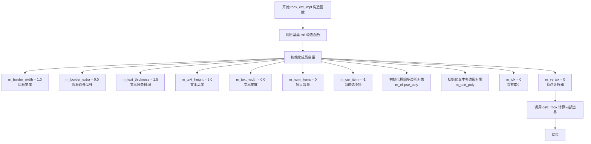
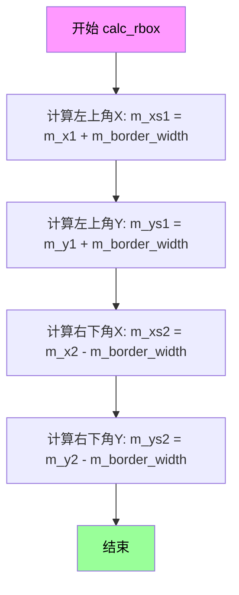
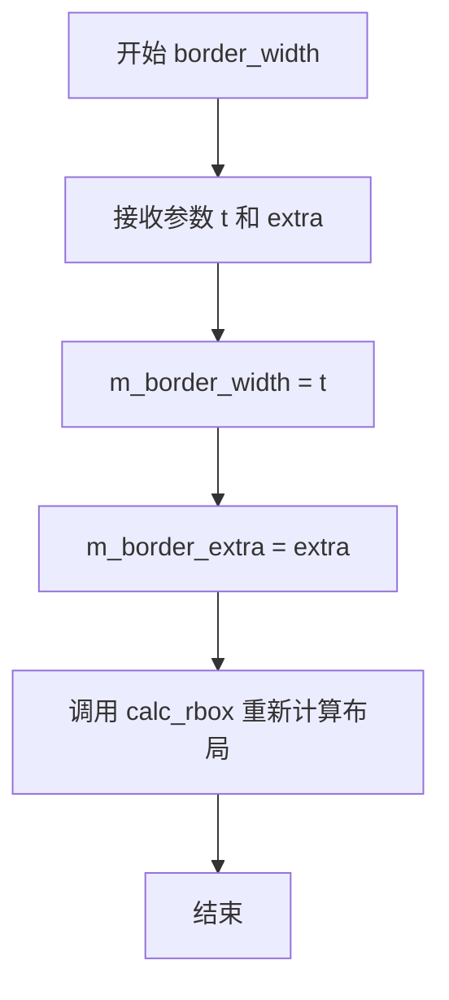
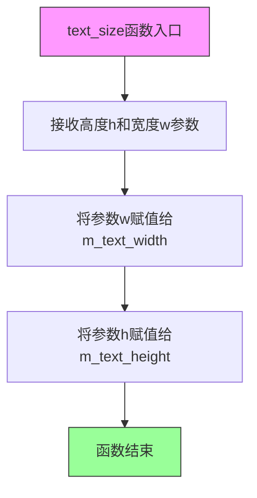
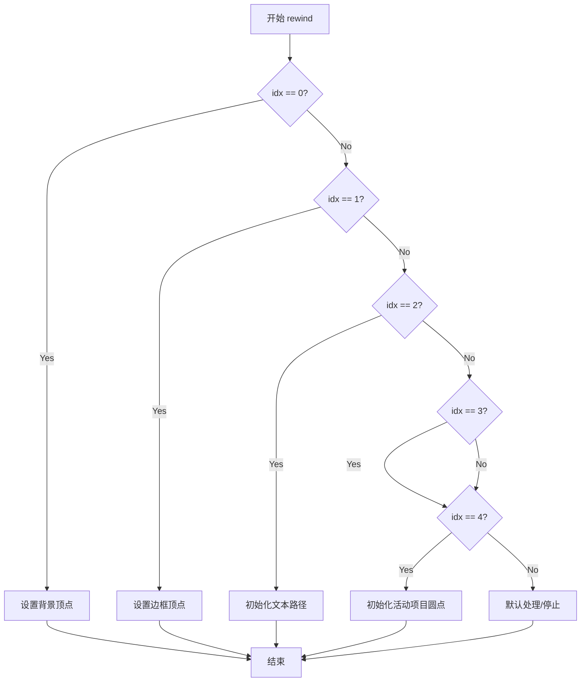
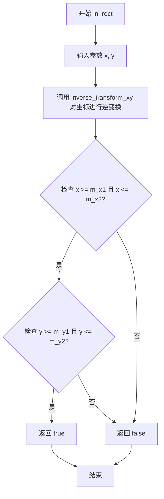
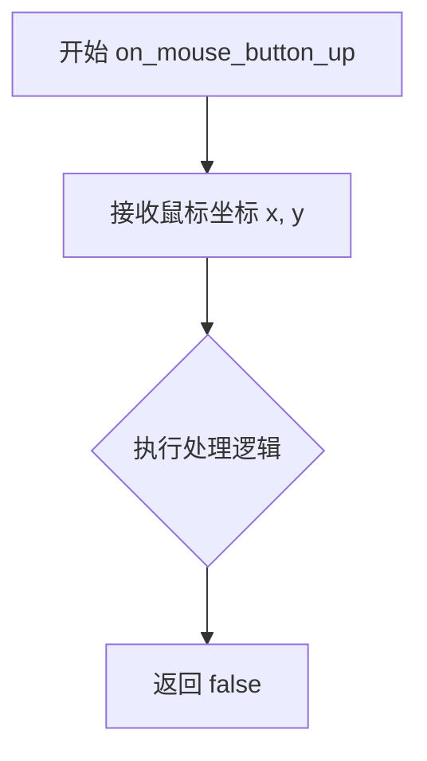
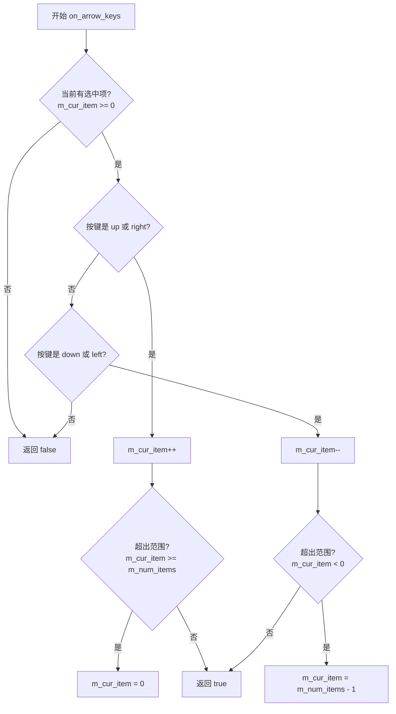

# `matplotlib\extern\agg24-svn\src\ctrl\agg_rbox_ctrl.cpp` 详细设计文档

该文件是 Anti-Grain Geometry 库中单选框控件的实现代码 (rbox_ctrl_impl)，核心功能是提供一个可交互的单选按钮组界面，支持通过鼠标点击或键盘方向键选择列表中的单一文本项，并利用几何图形渲染技术绘制控件的背景、边框、文本标签以及选中和未选中的状态圆圈。

## 整体流程

```mermaid
graph TD
    Init(初始化 rbox_ctrl_impl) --> AddItems[add_item 添加选项]
    AddItems --> RenderLoop{渲染循环}
    RenderLoop --> Rewind[rewind(idx) 准备路径]
    Rewind --> VertexLoop[vertex 获取顶点]
    VertexLoop --> IsStop{is_stop(cmd)?}
    IsStop -- No --> Transform[transform_xy 坐标变换]
    Transform --> OutputVertex[输出顶点]
    OutputVertex --> VertexLoop
    IsStop -- Yes --> NextStage{进入下一阶段?}
    NextStage -- Yes --> Rewind
    NextStage -- No --> WaitInput[等待用户输入]
    WaitInput --> Event{输入事件}
    Event --> MouseDown[on_mouse_button_down]
    MouseDown --> HitTest{是否命中选项?}
    HitTest -- Yes --> SetCurItem[更新 m_cur_item]
    HitTest -- No --> WaitInput
    Event --> KeyPress[on_arrow_keys]
    KeyPress --> ChangeItem{是否切换选项?}
    ChangeItem -- Yes --> SetCurItem
    ChangeItem -- No --> WaitInput
    SetCurItem --> RenderLoop
```

## 类结构

```
ctrl (基类，封装坐标变换和基本边界)
└── rbox_ctrl_impl (单选框具体实现类)
```

## 全局变量及字段


### `rbox_ctrl_impl.m_border_width`
    
边框宽度

类型：`double`
    


### `rbox_ctrl_impl.m_border_extra`
    
边框外部扩展距离

类型：`double`
    


### `rbox_ctrl_impl.m_text_thickness`
    
文本和圆形轮廓的线条粗细

类型：`double`
    


### `rbox_ctrl_impl.m_text_height`
    
文本高度

类型：`double`
    


### `rbox_ctrl_impl.m_text_width`
    
文本宽度

类型：`double`
    


### `rbox_ctrl_impl.m_num_items`
    
当前列表中的选项数量

类型：`int`
    


### `rbox_ctrl_impl.m_cur_item`
    
当前选中的选项索引 (-1 表示无选中)

类型：`int`
    


### `rbox_ctrl_impl.m_items`
    
存储选项文本的动态数组

类型：`std::vector<std::string>`
    


### `rbox_ctrl_impl.m_ellipse`
    
绘制单选圆形按钮的几何对象

类型：`ellipse`
    


### `rbox_ctrl_impl.m_ellipse_poly`
    
圆形轮廓的渲染路径转换器

类型：`conv_stroke<ellipse>`
    


### `rbox_ctrl_impl.m_text`
    
文本渲染对象

类型：`text`
    


### `rbox_ctrl_impl.m_text_poly`
    
文本轮廓的渲染路径转换器

类型：`conv_stroke<text>`
    


### `rbox_ctrl_impl.m_idx`
    
渲染状态机索引 (0:背景, 1:边框, 2:文本, 3:未选中圆, 4:选中圆)

类型：`unsigned`
    


### `rbox_ctrl_impl.m_vertex`
    
当前渲染的顶点计数

类型：`unsigned`
    


### `rbox_ctrl_impl.m_dy`
    
计算出的行间距 (text_height * 2.0)

类型：`double`
    


### `rbox_ctrl_impl.m_draw_item`
    
渲染循环中当前处理的选项索引

类型：`unsigned`
    


### `rbox_ctrl_impl.m_vx`
    
预计算的顶点坐标缓存数组 (X方向)

类型：`double[8]`
    


### `rbox_ctrl_impl.m_vy`
    
预计算的顶点坐标缓存数组 (Y方向)

类型：`double[8]`
    
    

## 全局函数及方法


### `rbox_ctrl_impl.rbox_ctrl_impl`

该构造函数是单选框控件实现类（rbox_ctrl_impl）的初始化方法，用于设置控件的边界范围、初始化默认样式参数、创建几何图形和文本渲染对象，并调用calc_rbox()计算内部边界。

参数：

- `x1`：`double`，控件左上角的X坐标
- `y1`：`double`，控件左上角的Y坐标
- `x2`：`double`，控件右下角的X坐标
- `y2`：`double`，控件右下角的Y坐标
- `flip_y`：`bool`，是否翻转Y坐标（用于不同坐标系转换）

返回值：`无`（构造函数无返回类型）

#### 流程图



#### 带注释源码

```
//------------------------------------------------------------------------
// rbox_ctrl_impl 构造函数
// 功能：初始化单选框控件的边界、样式和几何对象
// 参数：
//   x1, y1 - 控件左上角坐标
//   x2, y2 - 控件右下角坐标
//   flip_y - 是否翻转Y坐标
//------------------------------------------------------------------------
rbox_ctrl_impl::rbox_ctrl_impl(double x1, double y1, 
                               double x2, double y2, bool flip_y) :
    // 调用基类 ctrl 的构造函数，初始化基本控制属性
    ctrl(x1, y1, x2, y2, flip_y),
    
    // 初始化边框宽度为1.0
    m_border_width(1.0),
    
    // 初始化边框额外偏移为0.0
    m_border_extra(0.0),
    
    // 初始化文本线条粗细为1.5
    m_text_thickness(1.5),
    
    // 初始化文本高度为9.0
    m_text_height(9.0),
    
    // 初始化文本宽度为0.0（自动计算）
    m_text_width(0.0),
    
    // 初始化项目数量为0
    m_num_items(0),
    
    // 初始化当前选中项为-1（无选中）
    m_cur_item(-1),
    
    // 初始化椭圆多边形，将椭圆对象包装为多边形渲染器
    m_ellipse_poly(m_ellipse),
    
    // 初始化文本多边形，将文本对象包装为多边形渲染器
    m_text_poly(m_text),
    
    // 初始化当前索引为0
    m_idx(0),
    
    // 初始化顶点计数器为0
    m_vertex(0)
{
    // 计算控件的内部边界
    // 根据边框宽度计算内部矩形的坐标
    calc_rbox();
}
```


### `rbox_ctrl_impl.calc_rbox`

该方法根据边框宽度重新计算控件的内部绘制区域坐标。通过将外部边界坐标（m_x1, m_y1, m_x2, m_y2）向内收缩m_border_width的距离，得到内部可用绘制区域（m_xs1, m_ys1, m_xs2, m_ys2），确保文本和选择框等内容不会绘制到边框区域内。

参数： 无

返回值：`void`，无返回值

#### 流程图



#### 带注释源码

```cpp
//------------------------------------------------------------------------
// 根据边框宽度重新计算内部绘制区域
// 该方法将外部边界坐标向内收缩border_width的距离，
// 得到实际可用于绘制文本和选择项的内部矩形区域
//------------------------------------------------------------------------
void rbox_ctrl_impl::calc_rbox()
{
    // 计算内部绘制区域左上角X坐标
    // 等于外部边界左上角X + 边框宽度
    m_xs1 = m_x1 + m_border_width;
    
    // 计算内部绘制区域左上角Y坐标
    // 等于外部边界左上角Y + 边框宽度
    m_ys1 = m_y1 + m_border_width;
    
    // 计算内部绘制区域右下角X坐标
    // 等于外部边界右下角X - 边框宽度
    m_xs2 = m_x2 - m_border_width;
    
    // 计算内部绘制区域右下角Y坐标
    // 等于外部边界右下角Y - 边框宽度
    m_ys2 = m_y2 - m_border_width;
}
```


### `rbox_ctrl_impl.add_item`

将文本字符串添加到单选按钮控件的选项列表中，最多支持32个选项。

参数：

- `text`：`const char*`，指向以空字符结尾的字符串常量，表示要添加的选项文本内容

返回值：`void`，无返回值

#### 流程图

```mermaid
flowchart TD
    A[开始 add_item] --> B{检查 m_num_items < 32?}
    B -->|否| C[直接返回, 不添加]
    B -->|是| D[为 m_items[m_num_items] 分配空间]
    D --> E[调用 resize[strlen(text) + 1]]
    E --> F[使用 strcpy 复制文本到数组]
    F --> G[m_num_items++]
    G --> H[结束]
```

#### 带注释源码

```cpp
//------------------------------------------------------------------------
// 将文本字符串添加到单选按钮控件的选项列表中
// 该方法限制最多添加32个选项
//------------------------------------------------------------------------
void rbox_ctrl_impl::add_item(const char* text)
{
    // 检查当前选项数量是否小于32的硬性限制
    if(m_num_items < 32)
    {
        // 为新选项分配足够的存储空间
        // 字符串长度 + 1（用于空终止符'\0'）
        m_items[m_num_items].resize(strlen(text) + 1);
        
        // 使用strcpy将文本内容复制到内部数组中
        // m_items是字符串数组，每个元素是一个可调整大小的字符串
        strcpy(&m_items[m_num_items][0], text);
        
        // 增加选项计数器，记录已添加的选项总数
        m_num_items++;
    }
    // 如果已达到32个选项上限，新项将被忽略
}
```


### `rbox_ctrl_impl.border_width`

设置边框宽度和外部扩展值，并调用内部布局计算方法重新计算控件的内部边界。

参数：

- `t`：`double`，边框宽度值，用于设置控件边框的宽度
- `extra`：`double`，外部扩展值，用于设置控件外部的额外扩展区域

返回值：`void`，无返回值，仅执行内部状态更新和布局重算

#### 流程图



#### 带注释源码

```cpp
//------------------------------------------------------------------------
// 设置边框宽度和外部扩展值，并重新计算布局
// 参数:
//   t     - double, 边框宽度值
//   extra - double, 外部扩展值
// 返回值: void
//------------------------------------------------------------------------
void rbox_ctrl_impl::border_width(double t, double extra)
{ 
    // 将参数 t 赋值给成员变量 m_border_width，设置边框宽度
    m_border_width = t; 
    
    // 将参数 extra 赋值给成员变量 m_border_extra，设置外部扩展值
    m_border_extra = extra;
    
    // 调用内部方法 calc_rbox 重新计算控件的内部边界坐标
    // 该方法会根据新的边框宽度和外部扩展值更新 m_xs1, m_ys1, m_xs2, m_ys2
    calc_rbox(); 
}
```


### `rbox_ctrl_impl.text_size`

设置单选框控件中文字项的字体高度和宽度属性，用于控制文本渲染的尺寸。

参数：

- `h`：`double`，文本的高度值
- `w`：`double`，文本的宽度值

返回值：`void`，无返回值描述

#### 流程图



#### 带注释源码

```cpp
//------------------------------------------------------------------------
// 设置文本的宽高属性
// 参数:
//   h - double类型，文本的高度值
//   w - double类型，文本的宽度值
// 返回值: void
//------------------------------------------------------------------------
void rbox_ctrl_impl::text_size(double h, double w) 
{ 
    // 将宽度值w赋值给成员变量m_text_width，用于后续文本渲染
    m_text_width = w; 
    
    // 将高度值h赋值给成员变量m_text_height，用于后续文本渲染和布局计算
    m_text_height = h; 
}
```

#### 关联信息

**所属类**：`rbox_ctrl_impl`

**功能描述**：
该方法是单选框控件（rbox_ctrl_impl）的一部分，用于动态设置控件中文本项的显示尺寸。修改后的尺寸会在下一次调用`rewind`方法时被应用到文本渲染器（`m_text`）中，从而改变UI中文本的大小。

**内部关联变量**：
- `m_text_width`（double）：存储文本宽度
- `m_text_height`（double）：存储文本高度
- `m_text`（gouraud_text_gen）：文本生成器，在`rewind`方法中会读取这两个值


### `rbox_ctrl_impl::rewind`

该函数是AGG库中单选框控件的核心方法之一，用于重置路径生成器的状态，准备绘制指定索引的几何图形（包括背景、边框、文本或圆点图形），通过索引区分不同的绘制阶段。

参数：

- `idx`：`unsigned`，指定要绘制的几何图形索引，0-背景，1-边框，2-文本，3-非活动项目圆点，4-活动项目圆点

返回值：`void`，无返回值

#### 流程图



#### 带注释源码

```cpp
//------------------------------------------------------------------------
// 重置路径生成器，准备绘制指定索引的几何图形
// idx: 0-背景, 1-边框, 2-文本, 3-非活动项目, 4-活动项目
//------------------------------------------------------------------------
void rbox_ctrl_impl::rewind(unsigned idx)
{
    // 保存当前索引，用于后续vertex()方法判断绘制哪个部分
    m_idx = idx;
    
    // 计算行高（文本高度的2倍），用于定位各元素位置
    m_dy = m_text_height * 2.0;
    
    // 重置当前绘制的项目索引
    m_draw_item = 0;

    // 根据索引选择要绘制的几何图形
    switch(idx)
    {
    default:

    case 0:                 // 背景
        m_vertex = 0;
        // 设置背景矩形的四个顶点（考虑边界额外偏移）
        m_vx[0] = m_x1 - m_border_extra; 
        m_vy[0] = m_y1 - m_border_extra;
        m_vx[1] = m_x2 + m_border_extra; 
        m_vy[1] = m_y1 - m_border_extra;
        m_vx[2] = m_x2 + m_border_extra; 
        m_vy[2] = m_y2 + m_border_extra;
        m_vx[3] = m_x1 - m_border_extra; 
        m_vy[3] = m_y2 + m_border_extra;
        break;

    case 1:                 // 边框
        m_vertex = 0;
        // 外边框四个顶点
        m_vx[0] = m_x1; 
        m_vy[0] = m_y1;
        m_vx[1] = m_x2; 
        m_vy[1] = m_y1;
        m_vx[2] = m_x2; 
        m_vy[2] = m_y2;
        m_vx[3] = m_x1; 
        m_vy[3] = m_y2;
        // 内边框四个顶点（向内偏移border_width）
        m_vx[4] = m_x1 + m_border_width; 
        m_vy[4] = m_y1 + m_border_width; 
        m_vx[5] = m_x1 + m_border_width; 
        m_vy[5] = m_y2 - m_border_width; 
        m_vx[6] = m_x2 - m_border_width; 
        m_vy[6] = m_y2 - m_border_width; 
        m_vx[7] = m_x2 - m_border_width; 
        m_vy[7] = m_y1 + m_border_width; 
        break;

    case 2:                 // 文本
        // 设置第一个文本项的内容
        m_text.text(&m_items[0][0]);
        // 设置文本起始位置（考虑左侧圆点区域的偏移）
        m_text.start_point(m_xs1 + m_dy * 1.5, m_ys1 + m_dy / 2.0);
        // 设置文本尺寸
        m_text.size(m_text_height, m_text_width);
        // 配置文本路径的多边形化参数
        m_text_poly.width(m_text_thickness);
        m_text_poly.line_join(round_join);
        m_text_poly.line_cap(round_cap);
        // 重置文本路径生成器
        m_text_poly.rewind(0);
        break;

    case 3:                 // 非活动项目圆点
        // 为第一个非活动项目初始化椭圆（圆点）
        m_ellipse.init(m_xs1 + m_dy / 1.3, 
                       m_ys1 + m_dy / 1.3,
                       m_text_height / 1.5, 
                       m_text_height / 1.5, 32);
        // 设置椭圆轮廓的宽度
        m_ellipse_poly.width(m_text_thickness);
        // 重置椭圆路径生成器
        m_ellipse_poly.rewind(0);
        break;


    case 4:                 // 活动项目圆点
        if(m_cur_item >= 0)
        {
            // 为当前选中的项目初始化椭圆
            m_ellipse.init(m_xs1 + m_dy / 1.3, 
                           m_ys1 + m_dy * m_cur_item + m_dy / 1.3,
                           m_text_height / 2.0, 
                           m_text_height / 2.0, 32);
            // 重置椭圆路径生成器
            m_ellipse.rewind(0);
        }
        break;

    }
}
```


### `rbox_ctrl_impl.vertex`

该函数是单选框控件（rbox_ctrl_impl）的顶点生成器（Vertex Source）核心实现。它作为一个状态机，根据`rewind`方法设置的当前绘制阶段（`m_idx`），逐次生成构成控件外观的顶点数据（背景矩形、边框、文本、非选中项圆圈、选中项圆圈）。其内部包含对多选项（文本和圆圈）的循环遍历逻辑，并在返回前调用仿射变换矩阵处理坐标。

参数：

-  `x`：`double*`，指向用于输出顶点X坐标的double指针。
-  `y`：`double*`，指向用于输出顶点Y坐标的double指针。

返回值：`unsigned`，返回AGG的路径命令（如`path_cmd_move_to`、`path_cmd_line_to`、`path_cmd_stop`），指示渲染引擎如何连接这些顶点。

#### 流程图

```mermaid
flowchart TD
    A([Start vertex]) --> B{Switch m_idx}
    
    %% Case 0: Background
    B -->|Case 0: Background| C0{m_vertex == 0?}
    C0 -->|Yes| D0[cmd = path_cmd_move_to]
    C0 -->|No| E0{m_vertex >= 4?}
    E0 -->|Yes| F0[cmd = path_cmd_stop]
    E0 -->|No| D1[cmd = path_cmd_line_to]
    D0 --> G[Set *x, *y from array]
    D1 --> G
    F0 --> L
    
    %% Case 1: Border
    B -->|Case 1: Border| C1{m_vertex == 0 or 4?}
    C1 -->|Yes| D2[cmd = path_cmd_move_to]
    C1 -->|No| E1{m_vertex >= 8?}
    E1 -->|Yes| F0
    E1 -->|No| D3[cmd = path_cmd_line_to]
    D2 --> G
    D3 --> G

    %% Case 2: Text
    B -->|Case 2: Text| H[Get vertex from m_text_poly]
    H --> I{is_stop(cmd)?}
    I -->|No| K[Transform & Return]
    I -->|Yes| J{m_draw_item >= m_num_items?}
    J -->|Yes| F0
    J -->|No| L2[Increment m_draw_item]
    L2 --> M[Setup next text item]
    M --> H
    
    %% Case 3: Inactive Items
    B -->|Case 3: Inactive Items| N[Get vertex from m_ellipse_poly]
    N --> O{is_stop(cmd)?}
    O -->|No| K
    O -->|Yes| P{m_draw_item >= m_num_items?}
    P -->|Yes| F0
    P -->|No| Q[Increment m_draw_item]
    Q --> R[Init next ellipse]
    R --> N

    %% Case 4: Active Item
    B -->|Case 4: Active Item| S{m_cur_item >= 0?}
    S -->|Yes| T[Get vertex from m_ellipse]
    S -->|No| F0
    T --> K
    
    %% Default
    B -->|Default| F0
    
    %% End
    G --> K
    K --> Z([Return cmd])
```

#### 带注释源码

```cpp
//----------------------------------------------------------------------------
// 生成单选框控件的顶点
//----------------------------------------------------------------------------
unsigned rbox_ctrl_impl::vertex(double* x, double* y)
{
    // 默认命令为直线连接 (path_cmd_line_to)
    unsigned cmd = path_cmd_line_to;
    
    // 根据当前绘制阶段 (m_idx) 分发处理逻辑
    switch(m_idx)
    {
    // 阶段 0: 绘制背景矩形
    case 0:
        if(m_vertex == 0) cmd = path_cmd_move_to; // 起点
        if(m_vertex >= 4) cmd = path_cmd_stop;    // 结束
        *x = m_vx[m_vertex];
        *y = m_vy[m_vertex];
        m_vertex++;
        break;

    // 阶段 1: 绘制边框（双矩形路径）
    case 1:
        if(m_vertex == 0 || m_vertex == 4) cmd = path_cmd_move_to; // 内外框起点
        if(m_vertex >= 8) cmd = path_cmd_stop;
        *x = m_vx[m_vertex];
        *y = m_vy[m_vertex];
        m_vertex++;
        break;

    // 阶段 2: 绘制文本标签（处理多选项）
    case 2:
        cmd = m_text_poly.vertex(x, y); // 获取当前文本的顶点
        if(is_stop(cmd)) // 如果当前文本绘制完成
        {
            m_draw_item++;
            if(m_draw_item >= m_num_items) // 如果所有文本都绘制完了
            {
                break; // 停止
            }
            else
            {
                // 切换到下一项文本的配置
                m_text.text(&m_items[m_draw_item][0]);
                m_text.start_point(m_xs1 + m_dy * 1.5, 
                                   m_ys1 + m_dy * (m_draw_item + 1) - m_dy / 2.0);
                m_text_poly.rewind(0);
                // 立即获取下一项的第一个顶点，避免外部循环
                cmd = m_text_poly.vertex(x, y);
            }
        }
        break;

    // 阶段 3: 绘制非活动项的圆圈（处理多选项）
    case 3:
        cmd = m_ellipse_poly.vertex(x, y);
        if(is_stop(cmd))
        {
            m_draw_item++;
            if(m_draw_item >= m_num_items)
            {
                break;
            }
            else
            {
                // 初始化下一个椭圆的位置
                m_ellipse.init(m_xs1 + m_dy / 1.3, 
                               m_ys1 + m_dy * m_draw_item + m_dy / 1.3,
                               m_text_height / 1.5, 
                               m_text_height / 1.5, 32);
                m_ellipse_poly.rewind(0);
                cmd = m_ellipse_poly.vertex(x, y);
            }
        }
        break;

    // 阶段 4: 绘制当前选中的活动项圆圈
    case 4:
        if(m_cur_item >= 0)
        {
            cmd = m_ellipse.vertex(x, y);
        }
        else
        {
            cmd = path_cmd_stop;
        }
        break;

    // 默认：停止
    default:
        cmd = path_cmd_stop;
        break;
    }

    // 如果命令不是停止，则应用坐标变换（如坐标翻转、缩放等）
    if(!is_stop(cmd))
    {
        transform_xy(x, y);
    }

    return cmd;
}
```


### `rbox_ctrl_impl.in_rect`

检测坐标是否在控件的完整边界框内，首先对坐标进行逆变换处理，然后判断坐标是否落在由左上角(m_x1, m_y1)和右下角(m_x2, m_y2)定义的矩形范围内。

参数：

- `x`：`double`，待检测的X坐标（屏幕坐标或变换后的坐标）
- `y`：`double`，待检测的Y坐标（屏幕坐标或变换后的坐标）

返回值：`bool`，如果坐标(x, y)位于控件的完整边界框内返回true，否则返回false

#### 流程图



#### 带注释源码

```cpp
//------------------------------------------------------------------------
// 检测坐标是否在控件的完整边界框内
// 参数:
//   x - 待检测的X坐标（屏幕坐标，经过inverse_transform_xy变换后与控件坐标比较）
//   y - 待检测的Y坐标（屏幕坐标，经过inverse_transform_xy变换后与控件坐标比较）
// 返回值:
//   true - 坐标在边界框内
//   false - 坐标在边界框外
//------------------------------------------------------------------------
bool rbox_ctrl_impl::in_rect(double x, double y) const
{
    // 先将屏幕坐标逆变换为控件本地坐标
    // 这样可以处理flip_y等坐标变换情况
    inverse_transform_xy(&x, &y);
    
    // 检查变换后的坐标是否落在控件的完整矩形边界内
    // m_x1, m_y1 为控件左上角坐标
    // m_x2, m_y2 为控件右下角坐标
    return x >= m_x1 && x <= m_x2 && y >= m_y1 && y <= m_y2;
}
```


### `rbox_ctrl_impl.on_mouse_button_down`

处理鼠标按下事件，计算鼠标点击位置与选项圆心的距离，若命中则选中该项目。

参数：

- `x`：`double`，鼠标点击的X坐标（屏幕坐标）
- `y`：`double`，鼠标点击的Y坐标（屏幕坐标）

返回值：`bool`，返回是否成功选中项目（true表示选中，false表示未选中）

#### 流程图

```mermaid
flowchart TD
    A[开始 on_mouse_button_down] --> B[对坐标 x, y 进行逆变换]
    B --> C[初始化循环变量 i = 0]
    C --> D{i < m_num_items?}
    D -->|Yes| E[计算当前选项圆心坐标 xp, yp]
    E --> F{calc_distance(x, y, xp, yp) <= m_text_height / 1.5?}
    F -->|Yes| G[m_cur_item = i]
    G --> H[返回 true]
    F -->|No| I[i++]
    I --> D
    D -->|No| J[返回 false]
    H --> K[结束]
    J --> K
```

#### 带注释源码

```cpp
//------------------------------------------------------------------------
// 处理鼠标按下事件，检测是否点击了某个选项
// 参数：
//   x - 鼠标点击的X坐标（屏幕坐标）
//   y - 鼠标点击的Y坐标（屏幕坐标）
// 返回值：
//   true  - 成功选中了某个项目
//   false - 未选中任何项目
//------------------------------------------------------------------------
bool rbox_ctrl_impl::on_mouse_button_down(double x, double y)
{
    // 将屏幕坐标逆变换为控件内部坐标（处理坐标系翻转）
    inverse_transform_xy(&x, &y);
    
    // 遍历所有选项，检测点击是否命中
    unsigned i;
    for(i = 0; i < m_num_items; i++)  
    {
        // 计算当前选项的圆心坐标
        // m_xs1, m_ys1 是控件内部左上角坐标（考虑边框）
        // m_dy 是每个选项的行高（文本高度的2倍）
        // 1.3 是偏移系数，用于调整圆心位置
        double xp = m_xs1 + m_dy / 1.3;
        double yp = m_ys1 + m_dy * i + m_dy / 1.3;
        
        // 计算鼠标点击位置与圆心的距离
        // 如果距离小于等于选项半径（m_text_height / 1.5），则认为命中
        if(calc_distance(x, y, xp, yp) <= m_text_height / 1.5)
        {
            // 选中当前项目，记录选中索引
            m_cur_item = int(i);
            return true;
        }
    }
    // 未命中任何项目
    return false;
}
```


### `rbox_ctrl_impl.on_mouse_move`

鼠标移动事件响应函数，用于处理鼠标在控件区域内的移动事件。当前实现未完成具体逻辑，仅返回false表示未处理该事件。

参数：

-  `x`：`double`，鼠标位置的X坐标（当前未使用）
-  `y`：`double`，鼠标位置的Y坐标（当前未使用）
-  `flag`：`bool`，标志位，表示某些特定状态（如鼠标按钮是否按下）（当前未使用）

返回值：`bool`，返回false表示该事件未被处理或未触发状态变更

#### 流程图

```mermaid
graph TD
    A[on_mouse_move 被调用] --> B{检查鼠标位置是否有效}
    B -->|是| C{检查是否需要更新高亮状态}
    C -->|是| D[更新内部状态]
    C -->|否| E[保持当前状态]
    B -->|否| F[忽略事件]
    D --> G[返回 true]
    E --> H[返回 false]
    F --> H
    H[返回 false]
    
    style H fill:#ffcccc
    note: 当前实现直接返回false，未实现具体逻辑
```

#### 带注释源码

```cpp
//------------------------------------------------------------------------
// 鼠标移动事件响应函数
// 参数：
//   x - 鼠标位置的X坐标（当前未使用）
//   y - 鼠标位置的Y坐标（当前未使用）  
//   flag - 标志位，表示鼠标按钮状态等（当前未使用）
// 返回值：
//   bool - 返回false表示事件未被处理
//------------------------------------------------------------------------
bool rbox_ctrl_impl::on_mouse_move(double, double, bool)
{
    // 当前实现为空函数，直接返回false
    // TODO: 实现鼠标移动时的交互逻辑，例如：
    //   1. 检测鼠标悬停的选项项
    //   2. 更新高亮状态
    //   3. 如果处于拖拽状态则处理拖拽逻辑
    return false;
}
```

#### 设计说明

该函数目前是一个存根实现（stub），在Anti-Grain Geometry库的rbox_ctrl_impl类中作为鼠标事件处理接口的一部分。根据同类方法`on_mouse_button_down`的实现可以看出，完整的实现应该包括：

1. 调用`inverse_transform_xy`将坐标转换到控件坐标系
2. 遍历所有选项项，检测鼠标是否悬停在某个选项的椭圆区域内
3. 根据检测结果更新内部状态（如当前选中项、高亮状态等）
4. 返回true表示已处理该事件，返回false表示未处理

这是一个典型的技术债务场景，需要后续实现完整的鼠标交互逻辑。


### rbox_ctrl_impl.on_mouse_button_up

鼠标释放事件响应函数，当前未实现具体逻辑，仅返回 false 占位。

参数：

- `x`：`double`，鼠标释放时的 X 坐标（当前未使用）
- `y`：`double`，鼠标释放时的 Y 坐标（当前未使用）

返回值：`bool`，表示事件是否被处理（当前始终返回 false，表示未处理）

#### 流程图



#### 带注释源码

```
//------------------------------------------------------------------------
// on_mouse_button_up - 鼠标释放事件响应函数
// 参数说明：
//   x: 鼠标释放时的X坐标（当前未使用，参数名省略）
//   y: 鼠标释放时的Y坐标（当前未使用，参数名省略）
// 返回值：
//   bool: 事件是否被处理（当前始终返回false，表示未处理）
// 备注：
//   当前为占位实现，未包含具体逻辑
//------------------------------------------------------------------------
bool rbox_ctrl_impl::on_mouse_button_up(double, double)
{
    return false;  // TODO: 实现鼠标释放时的业务逻辑
}
```


### `rbox_ctrl_impl.on_arrow_keys`

键盘导航支持方法，通过上下左右方向键循环切换当前选中的单选框项目。当按上/右键时选中项向前移动，按下/左键时选中项向后移动，形成循环选择。

参数：

- `left`：`bool`，左方向键是否被按下
- `right`：`bool`，右方向键是否被按下
- `down`：`bool`，下方向键是否被按下
- `up`：`bool`，上方向键是否被按下

返回值：`bool`，如果成功处理了方向键事件返回 `true`，否则返回 `false`

#### 流程图



#### 带注释源码

```cpp
//------------------------------------------------------------------------
// 处理方向键事件，实现单选框项目的循环导航
// left: 左方向键标志
// right: 右方向键标志
// down: 下方向键标志
// up: 上方向键标志
// 返回: bool - 是否成功处理了方向键事件
//------------------------------------------------------------------------
bool rbox_ctrl_impl::on_arrow_keys(bool left, bool right, bool down, bool up)
{
    // 检查当前是否有选中项目（m_cur_item >= 0表示有项目被选中）
    if(m_cur_item >= 0)
    {
        // 处理向上或向右按键 - 选中下一项
        if(up || right) 
        {
            m_cur_item++;  // 当前选中项索引递增
            if(m_cur_item >= int(m_num_items))  // 如果超过最后一项
            {
                m_cur_item = 0;  // 循环回到第一项
            }
            return true;  // 事件已处理
        }

        // 处理向下或向左按键 - 选中上一项
        if(down || left) 
        {
            m_cur_item--;  // 当前选中项索引递减
            if(m_cur_item < 0)  // 如果小于第一项
            {
                m_cur_item = m_num_items - 1;  // 循环到最后一项
            }
            return true;  // 事件已处理
        }
    }
    return false;  // 没有选中项目或按其他键，返回未处理
}
```

## 关键组件


### 顶点生成器（Vertex Generator）

顶点生成器是AGG渲染流水线的核心接口，通过vertex()方法逐个产出图形顶点。代码中m_idx表示当前渲染阶段（背景、边框、文本、非选中项、选中项），实现惰性加载模式，仅在调用vertex()时才生成具体几何数据。

### 单选按钮椭圆（Radio Button Ellipse）

使用ellipse类绘制圆形单选按钮标记，通过m_ellipse_poly进行描边。支持两种状态：非选中项（空心圆）和选中项（实心圆），半径为m_text_height / 1.5或m_text_height / 2.0。

### 文本渲染系统（Text Rendering System）

通过m_text和m_text_poly实现文本渲染，支持动态调整字体高度和宽度。文本内容存储在m_items数组中，最多支持32个选项。文本位置根据m_dy（两倍文本高度）动态计算。

### 边框渲染（Border Rendering）

支持可配置边框宽度和额外边距，通过border_width()方法设置。边框由两个矩形组成：外框（m_x1, m_y1到m_x2, m_y2）和内框（考虑边框宽度后的内部区域）。

### 鼠标交互处理（Mouse Interaction）

通过on_mouse_button_down()检测点击命中，使用calc_distance()计算欧氏距离判断是否选中某一项。选中半径为m_text_height / 1.5，支持键盘方向键切换选中项（循环滚动）。

### 坐标变换系统（Coordinate Transform System）

继承自ctrl基类的transform_xy()和inverse_transform_xy()方法，支持坐标系的flip_y转换，便于在不同坐标系（屏幕坐标vs数学坐标）间切换。


## 问题及建议


### 已知问题

- **硬编码的魔法数字**：代码中多处使用硬编码数值如 `9.0`（默认文本高度）、`1.0`（边框宽度）、`1.5`（文本粗细）、`32`（最大项目数）、`1.3`、`2.0` 等，降低了代码可维护性和可配置性。
- **固定大小数组限制**：使用固定大小数组 `m_items[32]` 存储选项，限制最大值为 32，扩展性差，且可能造成内存浪费。
- **潜在的整数溢出/类型转换问题**：循环中使用 `unsigned i` 与 `m_cur_item`（int 类型）比较，当 `m_num_items` 为 0 时可能出现问题。
- **`rewind` 方法状态管理问题**：在 `rewind` 函数中，对于 `idx=2,3,4` 的情况没有重置 `m_vertex`，可能导致状态不一致。
- **C 风格字符串操作**：使用 `strcpy` 而非安全的字符串操作，存在潜在的安全风险，且不利于异常安全。
- **`calc_rbox` 调用不完整**：`text_size` 方法修改了文本尺寸，但没有调用 `calc_rbox()` 更新内部坐标 `m_xs1, m_ys1, m_xs2, m_ys2`。
- **`flip_y` 参数未保存**：构造函数接收 `flip_y` 参数但未将其保存为成员变量，导致无法在后续判断坐标变换方向。
- **未使用的参数**：`on_mouse_move` 和 `on_mouse_button_up` 方法接收参数但未使用，违反了参数命名规范（可使用 `[[maybe_unused]]` 或省略参数名）。
- **`m_text_width` 初始化为 0**：`text_size` 方法中 `m_text_width = 0` 可能是合理默认值，但缺少文档说明。

### 优化建议

- 将所有硬编码的魔法数字提取为类常量或配置参数，提供 setter 方法或配置结构体。
- 使用 `std::vector<std::string>` 替代固定大小数组，动态管理选项列表，消除 32 个项目的限制。
- 统一使用 C++ 标准库字符串类 `std::string`，避免手动内存管理和 C 风格字符串操作。
- 在所有修改几何属性（如 `text_size`）的方法中调用 `calc_rbox()`，确保内部坐标一致性。
- 补充 `flip_y` 参数的存储和使用，或在文档中说明其处理方式。
- 为所有未被使用的参数添加 `[[maybe_unused]]` 注解（C++11+）或使用 `_` 前缀命名。
- 规范化 `m_cur_item` 的类型使用，确保循环变量类型一致，避免隐式类型转换。
- 考虑将状态相关的成员变量（如 `m_vertex`, `m_draw_item`, `m_idx`）的初始化集中到 `rewind` 方法中，提高状态管理的清晰度。


## 其它


### 设计目标与约束

本代码的设计目标是实现一个功能完整的单选框（Radio Box）控件，用于图形用户界面中。设计约束包括：仅支持最多32个选项条目；坐标系统支持Y轴翻转（flip_y）以适应不同坐标系；渲染依赖于AGG的路径生成和变换机制；控件仅处理鼠标点击选择逻辑，不处理拖拽操作。

### 错误处理与异常设计

代码采用错误容忍设计原则：添加项目时如果超过32个限制则静默忽略，不抛出异常；顶点生成遇到无效索引时返回path_cmd_stop命令；坐标变换在in_rect和on_mouse_button_down中先进行逆变换再判断边界。设计缺陷是缺少内存分配失败处理（strcpy和resize可能失败）以及数组越界保护。

### 数据流与状态机

控件渲染状态机包含5个主要状态：状态0为背景矩形绘制；状态1为边框绘制；状态2为文本渲染；状态3为非选中项的圆形标记；状态4为当前选中项的高亮圆形。状态转换通过rewind(idx)方法触发，vertex()方法负责按顺序输出各状态的路径顶点。交互状态存储在m_cur_item中，表示当前选中的项目索引。

### 外部依赖与接口契约

核心依赖包括：agg::ctrl基类提供坐标变换和边界管理；strcpy和strlen来自C标准库用于字符串处理；agg::path_storage和agg::ellipse用于几何图形生成；agg::text用于文本渲染。接口契约规定：add_item()必须在控件初始化后、渲染前调用；rewind()和vertex()必须配对使用；所有坐标参数均为设备坐标而非窗口坐标。

### 性能考虑与优化空间

当前实现存在以下性能瓶颈：每次调用vertex()都会进行字符串指针查找和状态判断；文本和椭圆多边形每帧重新生成；m_dy计算采用固定乘数2.0缺乏灵活性。优化方向包括：缓存文本多边形对象；预计算布局参数；引入脏标记避免不必要的重绘；将硬编码magic number（如1.3、1.5、2.0）提取为配置常量。

### 内存管理

字符串存储采用固定大小数组m_items[32]，每个条目通过strcpy复制并使用resize调整大小。潜在问题：未记录最长文本长度限制；字符串拷贝未做长度校验；删除项目功能未实现导致内存浪费。m_ellipse和m_text_poly为栈上对象，其生命周期与rbox_ctrl_impl一致。

### 线程安全性

该代码非线程安全：m_cur_item、m_idx、m_vertex等成员变量在多线程环境下直接访问可能导致状态不一致。设计建议：若需多线程访问，应添加互斥锁保护或提供线程局部的控件实例。

### 平台兼容性与移植性

代码依赖AGG基础库，具有良好的跨平台潜力。需注意：double类型精度在不同平台上可能存在细微差异；strcpy为不安全函数，建议替换为strncpy或std::string；头文件包含<string.h>应统一为<cstring>。flip_y参数的存在表明已考虑不同坐标系（屏幕坐标 vs 数学坐标）的兼容性。

### 使用示例与典型用例

典型用法：创建rbox_ctrl实例；调用add_item()添加选项；处理鼠标事件获取用户选择；通过render()或相关方法将控件绘制到渲染上下文。在AGG示例程序中常用于创建工具栏选择、渲染模式切换等UI交互场景。

### 配置与可扩展性设计

当前扩展性受限：最大项目数硬编码为32；圆形标记大小与文本高度耦合；边框样式固定。改进方向：提供set_max_items()方法；将标记形状抽象为策略模式；支持自定义绘制回调；添加主题/皮肤支持接口。


    