# `matplotlib\extern\agg24-svn\src\ctrl\agg_scale_ctrl.cpp` 详细设计文档

This code defines a class `scale_ctrl_impl` that implements a scale control mechanism, which is used to manipulate the scale of an object in a graphical application. It handles resizing, moving, and value adjustments for the scale control.

## 整体流程

```mermaid
graph TD
    A[Initialize scale control] --> B{Set initial values?}
    B -- Yes --> C[Calculate box dimensions]
    B -- No --> C
    C --> D{Resize?}
    D -- Yes --> E[Update box dimensions]
    D -- No --> F
    E --> G[Calculate box dimensions]
    F --> G
    G --> H{Adjust value1?}
    H -- Yes --> I[Set value1]
    H -- No --> J
    I --> K{Adjust value2?}
    K -- Yes --> L[Set value2]
    K -- No --> M
    L --> N{Move scale?}
    N -- Yes --> O[Adjust value1 and value2]
    N -- No --> P
    O --> Q{Rewind?}
    Q -- Yes --> R[Set rewind index and vertices]
    Q -- No --> S
    R --> T{Vertex operation}
    T --> U{Transform coordinates}
    U --> V{Return command}
    V --> W{End of vertex operation}
    W --> X{Check if in rectangle}
    X -- Yes --> Y[Return true]
    X -- No --> Z[Return false]
    Y --> AA{End of in rectangle operation}
    Z --> AA
    AA --> AB{Mouse button down?}
    AB -- Yes --> AC[Check position and set move type]
    AB -- No --> AD
    AC --> AE{End of mouse button down operation}
    AD --> AE
    AE --> AF{Mouse move?}
    AF -- Yes --> AG[Adjust values based on move type]
    AF -- No --> AH
    AG --> AI{End of mouse move operation}
    AH --> AI
    AI --> AJ{Mouse button up?}
    AJ -- Yes --> AK[Reset move type]
    AJ -- No --> AL
    AK --> AM{End of mouse button up operation}
    AL --> AM
    AM --> AN{Arrow keys?}
    AN -- Yes --> AO[Adjust values based on arrow keys]
    AN -- No --> AP
    AO --> AQ{End of arrow keys operation}
    AP --> AQ
    AQ --> AR{End of scale control operation}
```

## 类结构

```
scale_ctrl_impl (Scale control implementation)
├── ctrl (Base control class)
│   ├── m_border_thickness (double)
│   ├── m_border_extra (double)
│   ├── m_pdx (double)
│   ├── m_pdy (double)
│   ├── m_move_what (enum)
│   ├── m_value1 (double)
│   ├── m_value2 (double)
│   └── m_min_d (double)
└── m_idx (unsigned)
```

## 全局变量及字段


### `ctrl`
    
Reference to the control object.

类型：`ctrl`
    


### `m_border_thickness`
    
Thickness of the border around the control.

类型：`double`
    


### `m_border_extra`
    
Extra space added to the border for padding.

类型：`double`
    


### `m_pdx`
    
X-coordinate offset for mouse movement.

类型：`double`
    


### `m_pdy`
    
Y-coordinate offset for mouse movement.

类型：`double`
    


### `m_move_what`
    
Indicates what part of the control is being moved.

类型：`enum`
    


### `m_value1`
    
First value of the scale control.

类型：`double`
    


### `m_value2`
    
Second value of the scale control.

类型：`double`
    


### `m_min_d`
    
Minimum distance between m_value1 and m_value2.

类型：`double`
    


### `m_idx`
    
Index used to select different parts of the control.

类型：`unsigned`
    


### `m_vertex`
    
Vertex index for drawing operations.

类型：`unsigned`
    


### `m_vx`
    
Array of X-coordinates for vertices.

类型：`double[]`
    


### `m_vy`
    
Array of Y-coordinates for vertices.

类型：`double[]`
    


### `m_ellipse`
    
Ellipse object used for drawing the scale control.

类型：`Ellipse`
    


### `path_cmd_line_to`
    
Command for drawing a line to a point.

类型：`enum`
    


### `path_cmd_move_to`
    
Command for moving the pen to a point without drawing.

类型：`enum`
    


### `path_cmd_stop`
    
Command to stop drawing.

类型：`enum`
    


### `is_stop`
    
Function to check if the command is a stop command.

类型：`bool`
    


### `transform_xy`
    
Function to transform coordinates.

类型：`void`
    


### `inverse_transform_xy`
    
Function to inverse transform coordinates.

类型：`void`
    


### `calc_distance`
    
Function to calculate the distance between two points.

类型：`double`
    


### `scale_ctrl_impl.ctrl`
    
Reference to the control object.

类型：`ctrl`
    


### `scale_ctrl_impl.m_border_thickness`
    
Thickness of the border around the control.

类型：`double`
    


### `scale_ctrl_impl.m_border_extra`
    
Extra space added to the border for padding.

类型：`double`
    


### `scale_ctrl_impl.m_pdx`
    
X-coordinate offset for mouse movement.

类型：`double`
    


### `scale_ctrl_impl.m_pdy`
    
Y-coordinate offset for mouse movement.

类型：`double`
    


### `scale_ctrl_impl.m_move_what`
    
Indicates what part of the control is being moved.

类型：`enum`
    


### `scale_ctrl_impl.m_value1`
    
First value of the scale control.

类型：`double`
    


### `scale_ctrl_impl.m_value2`
    
Second value of the scale control.

类型：`double`
    


### `scale_ctrl_impl.m_min_d`
    
Minimum distance between m_value1 and m_value2.

类型：`double`
    


### `scale_ctrl_impl.m_idx`
    
Index used to select different parts of the control.

类型：`unsigned`
    


### `scale_ctrl_impl.m_vertex`
    
Vertex index for drawing operations.

类型：`unsigned`
    


### `scale_ctrl_impl.m_vx`
    
Array of X-coordinates for vertices.

类型：`double[]`
    


### `scale_ctrl_impl.m_vy`
    
Array of Y-coordinates for vertices.

类型：`double[]`
    


### `scale_ctrl_impl.m_ellipse`
    
Ellipse object used for drawing the scale control.

类型：`Ellipse`
    


### `scale_ctrl_impl.path_cmd_line_to`
    
Command for drawing a line to a point.

类型：`enum`
    


### `scale_ctrl_impl.path_cmd_move_to`
    
Command for moving the pen to a point without drawing.

类型：`enum`
    


### `scale_ctrl_impl.path_cmd_stop`
    
Command to stop drawing.

类型：`enum`
    


### `scale_ctrl_impl.is_stop`
    
Function to check if the command is a stop command.

类型：`bool`
    


### `scale_ctrl_impl.transform_xy`
    
Function to transform coordinates.

类型：`void`
    


### `scale_ctrl_impl.inverse_transform_xy`
    
Function to inverse transform coordinates.

类型：`void`
    


### `scale_ctrl_impl.calc_distance`
    
Function to calculate the distance between two points.

类型：`double`
    
    

## 全局函数及方法


### calc_box

`calc_box` 是 `scale_ctrl_impl` 类的一个成员函数。

参数：

- 无

返回值：无

#### 流程图

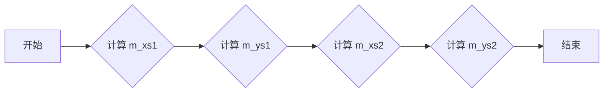

#### 带注释源码

```cpp
void scale_ctrl_impl::calc_box()
{
    m_xs1 = m_x1 + m_border_thickness;
    m_ys1 = m_y1 + m_border_thickness;
    m_xs2 = m_x2 - m_border_thickness;
    m_ys2 = m_y2 - m_border_thickness;
}
```


### `scale_ctrl_impl::border_thickness`

调整边框的厚度和额外空间。

参数：

- `t`：`double`，新的边框厚度。
- `extra`：`double`，额外的空间大小。

返回值：`void`，无返回值。

#### 流程图

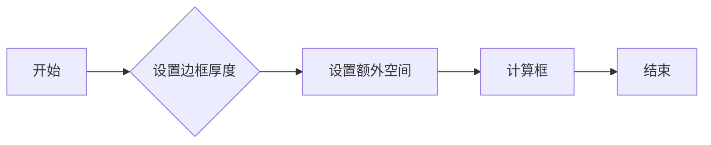

#### 带注释源码

```cpp
void scale_ctrl_impl::border_thickness(double t, double extra) { 
    m_border_thickness = t; 
    m_border_extra = extra;
    calc_box(); 
}
```


### `scale_ctrl_impl.resize`

调整控件的大小。

参数：

- `x1`：`double`，控件左上角的 x 坐标。
- `y1`：`double`，控件左上角的 y 坐标。
- `x2`：`double`，控件右下角的 x 坐标。
- `y2`：`double`，控件右下角的 y 坐标。

返回值：`void`，无返回值。

#### 流程图

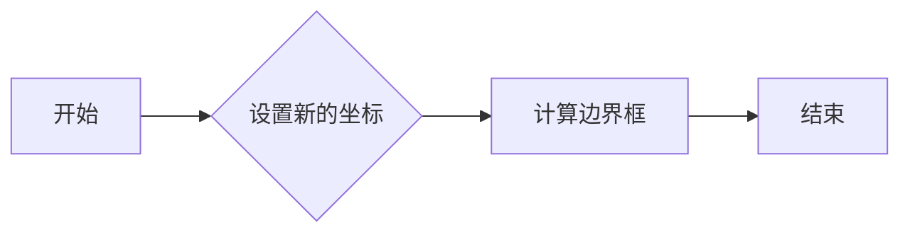

#### 带注释源码

```cpp
void scale_ctrl_impl::resize(double x1, double y1, double x2, double y2)
{
    m_x1 = x1;
    m_y1 = y1;
    m_x2 = x2;
    m_y2 = y2;
    calc_box(); 
    m_border_extra = (fabs(x2 - x1) > fabs(y2 - y1)) ? 
                        (y2 - y1) / 2 : 
                        (x2 - x1) / 2;
}
```


### `scale_ctrl_impl::value1`

Adjusts the first value within the range [0, 1] and ensures it does not violate the minimum distance constraint with the second value.

参数：

- `value`：`double`，The new value for `m_value1`.

返回值：`void`，No return value.

#### 流程图

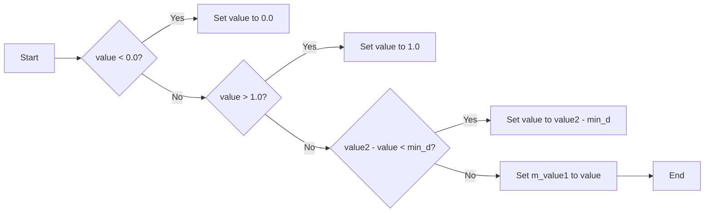

#### 带注释源码

```cpp
void scale_ctrl_impl::value1(double value) 
{ 
    if(value < 0.0) value = 0.0;
    if(value > 1.0) value = 1.0;
    if(m_value2 - value < m_min_d) value = m_value2 - m_min_d;
    m_value1 = value; 
}
```


### `scale_ctrl_impl::value2`

调整第二个值，确保它与第一个值保持最小距离 `m_min_d`。

参数：

- `value`：`double`，新的值，应在0到1之间。

返回值：`void`，无返回值。

#### 流程图

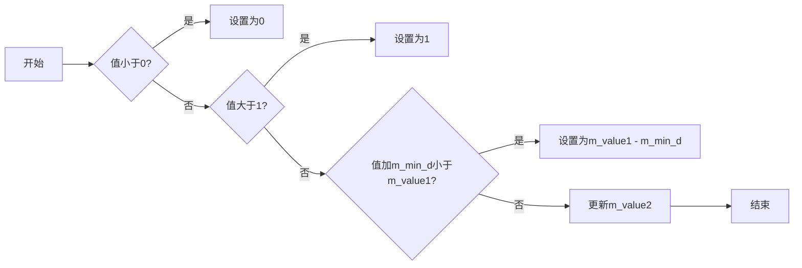

#### 带注释源码

```cpp
void scale_ctrl_impl::value2(double value) 
{ 
    if(value < 0.0) value = 0.0;
    if(value > 1.0) value = 1.0;
    if(m_value1 + value < m_min_d) value = m_value1 + m_min_d;
    m_value2 = value; 
}
```


### `scale_ctrl_impl::move`

调整值1和值2的值。

参数：

- `d`：`double`，要添加到值1和值2的增量。

返回值：`void`，无返回值。

#### 流程图

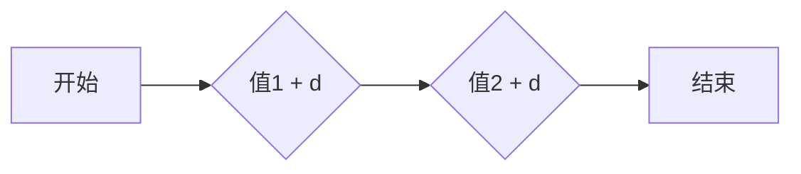

#### 带注释源码

```cpp
void scale_ctrl_impl::move(double d)
{
    m_value1 += d;
    m_value2 += d;
    if(m_value1 < 0.0)
    {
        m_value2 -= m_value1;
        m_value1 = 0.0;
    }
    if(m_value2 > 1.0)
    {
        m_value1 -= m_value2 - 1.0;
        m_value2 = 1.0;
    }
}
```


### `scale_ctrl_impl::rewind`

Reinitializes the state of the scale control component to a specified index, which determines the component part to be reset.

参数：

- `idx`：`unsigned`，The index of the component part to be reset. Valid indices are 0 (Background), 1 (Border), 2 (pointer1), 3 (pointer2), and 4 (slider).

返回值：`void`，No return value.

#### 流程图

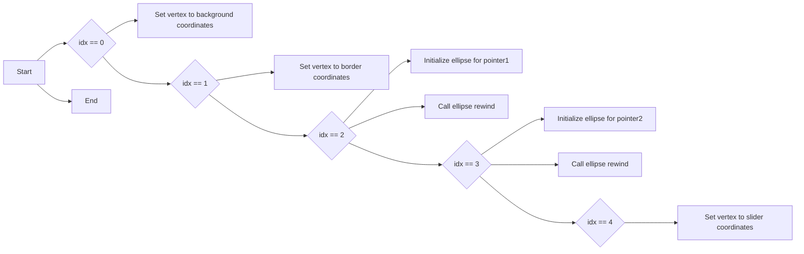

#### 带注释源码

```cpp
void scale_ctrl_impl::rewind(unsigned idx)
{
    m_idx = idx;

    switch(idx)
    {
    default:
    case 0:                 // Background
        m_vertex = 0;
        m_vx[0] = m_x1 - m_border_extra; 
        m_vy[0] = m_y1 - m_border_extra;
        m_vx[1] = m_x2 + m_border_extra; 
        m_vy[1] = m_y1 - m_border_extra;
        m_vx[2] = m_x2 + m_border_extra; 
        m_vy[2] = m_y2 + m_border_extra;
        m_vx[3] = m_x1 - m_border_extra; 
        m_vy[3] = m_y2 + m_border_extra;
        break;

    case 1:                 // Border
        m_vertex = 0;
        m_vx[0] = m_x1; 
        m_vy[0] = m_y1;
        m_vx[1] = m_x2; 
        m_vy[1] = m_y1;
        m_vx[2] = m_x2; 
        m_vy[2] = m_y2;
        m_vx[3] = m_x1; 
        m_vy[3] = m_y2;
        m_vx[4] = m_x1 + m_border_thickness; 
        m_vy[4] = m_y1 + m_border_thickness; 
        m_vx[5] = m_x1 + m_border_thickness; 
        m_vy[5] = m_y2 - m_border_thickness; 
        m_vx[6] = m_x2 - m_border_thickness; 
        m_vy[6] = m_y2 - m_border_thickness; 
        m_vx[7] = m_x2 - m_border_thickness; 
        m_vy[7] = m_y1 + m_border_thickness; 
        break;

    case 2:                 // pointer1
        if(fabs(m_x2 - m_x1) > fabs(m_y2 - m_y1))
        {
            m_ellipse.init(m_xs1 + (m_xs2 - m_xs1) * m_value1,
                           (m_ys1 + m_ys2) / 2.0,
                           m_y2 - m_y1,
                           m_y2 - m_y1, 
                           32);
        }
        else
        {
            m_ellipse.init((m_xs1 + m_xs2) / 2.0,
                           m_ys1 + (m_ys2 - m_ys1) * m_value1,
                           m_x2 - m_x1,
                           m_x2 - m_x1, 
                           32);
        }
        m_ellipse.rewind(0);
        break;

    case 3:                 // pointer2
        if(fabs(m_x2 - m_x1) > fabs(m_y2 - m_y1))
        {
            m_ellipse.init(m_xs1 + (m_xs2 - m_xs1) * m_value2,
                           (m_ys1 + m_ys2) / 2.0,
                           m_y2 - m_y1,
                           m_y2 - m_y1, 
                           32);
        }
        else
        {
            m_ellipse.init((m_xs1 + m_xs2) / 2.0,
                           m_ys1 + (m_ys2 - m_ys1) * m_value2,
                           m_x2 - m_x1,
                           m_x2 - m_x1, 
                           32);
        }
        m_ellipse.rewind(0);
        break;

    case 4:                 // slider
        m_vertex = 0;
        if(fabs(m_x2 - m_x1) > fabs(m_y2 - m_y1))
        {
            m_vx[0] = m_xs1 + (m_xs2 - m_xs1) * m_value1;
            m_vy[0] = m_y1 - m_border_extra / 2.0;
            m_vx[1] = m_xs1 + (m_xs2 - m_xs1) * m_value2; 
            m_vy[1] = m_vy[0];
            m_vx[2] = m_vx[1]; 
            m_vy[2] = m_y2 + m_border_extra / 2.0;
            m_vx[3] = m_vx[0]; 
            m_vy[3] = m_vy[2];
        }
        else
        {
            m_vx[0] = m_x1 - m_border_extra / 2.0;
            m_vy[0] = m_ys1 + (m_ys2 - m_ys1) * m_value1;
            m_vx[1] = m_vx[0];
            m_vy[1] = m_ys1 + (m_ys2 - m_ys1) * m_value2; 
            m_vx[2] = m_x2 + m_border_extra / 2.0;
            m_vy[2] = m_vy[1]; 
            m_vx[3] = m_vx[2];
            m_vy[3] = m_vy[0]; 
        }
        break;
    }
}
``` 


### `scale_ctrl_impl::vertex`

获取当前滑块的顶点坐标。

参数：

- `x`：`double*`，用于存储顶点的x坐标。
- `y`：`double*`，用于存储顶点的y坐标。

返回值：`unsigned`，表示路径命令，如`path_cmd_line_to`、`path_cmd_move_to`、`path_cmd_stop`等。

#### 流程图

```mermaid
graph LR
A[开始] --> B{m_idx == 0}
B -- 是 --> C[执行path_cmd_move_to]
C --> D[执行path_cmd_line_to]
D --> E{m_vertex == 4}
E -- 是 --> F[执行path_cmd_stop]
E -- 否 --> G[执行path_cmd_line_to]
G --> H[执行path_cmd_line_to]
H --> I{m_vertex == 8}
I -- 是 --> J[执行path_cmd_stop]
I -- 否 --> K[执行path_cmd_line_to]
K --> L[执行path_cmd_line_to]
L --> M{m_idx == 1}
M -- 是 --> N[执行path_cmd_move_to]
N --> O[执行path_cmd_line_to]
O --> P{m_vertex == 8}
P -- 是 --> Q[执行path_cmd_stop]
P -- 否 --> R[执行path_cmd_line_to]
R --> S[执行path_cmd_line_to]
S --> T{m_idx == 2}
T -- 是 --> U[调用m_ellipse.vertex]
U --> V{返回值}
V --> W[执行transform_xy]
W --> X[返回路径命令]
X --> Y[结束]
```

#### 带注释源码

```cpp
unsigned scale_ctrl_impl::vertex(double* x, double* y)
{
    unsigned cmd = path_cmd_line_to;
    switch(m_idx)
    {
    case 0:
    case 4:
        if(m_vertex == 0) cmd = path_cmd_move_to;
        if(m_vertex >= 4) cmd = path_cmd_stop;
        *x = m_vx[m_vertex];
        *y = m_vy[m_vertex];
        m_vertex++;
        break;

    case 1:
        if(m_vertex == 0 || m_vertex == 4) cmd = path_cmd_move_to;
        if(m_vertex >= 8) cmd = path_cmd_stop;
        *x = m_vx[m_vertex];
        *y = m_vy[m_vertex];
        m_vertex++;
        break;

    case 2:
    case 3:
        cmd = m_ellipse.vertex(x, y);
        break;

    default:
        cmd = path_cmd_stop;
        break;
    }

    if(!is_stop(cmd))
    {
        transform_xy(x, y);
    }

    return cmd;
}
``` 


### `scale_ctrl_impl::in_rect`

判断一个点是否在指定的矩形区域内。

参数：

- `x`：`double`，点的x坐标
- `y`：`double`，点的y坐标

返回值：`bool`，如果点在矩形内返回`true`，否则返回`false`

#### 流程图

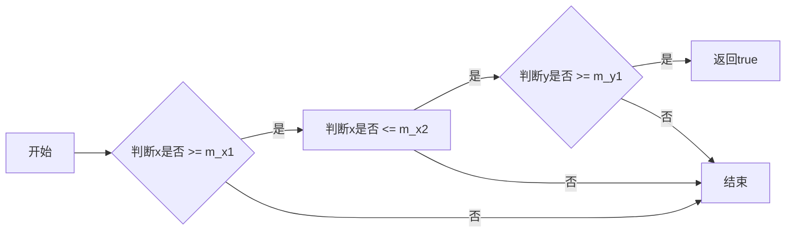

#### 带注释源码

```cpp
bool scale_ctrl_impl::in_rect(double x, double y) const
{
    inverse_transform_xy(&x, &y);
    return x >= m_x1 && x <= m_x2 && y >= m_y1 && y <= m_y2;
}
```


### `scale_ctrl_impl::on_mouse_button_down`

This method handles the mouse button down event for the scale control. It checks if the mouse click is within the bounds of the slider or the value1 and value2 pointers and sets the appropriate movement mode.

参数：

- `x`：`double`，The x-coordinate of the mouse click.
- `y`：`double`，The y-coordinate of the mouse click.

返回值：`bool`，Returns `true` if the mouse click is within the control bounds and the movement mode is set, otherwise returns `false`.

#### 流程图

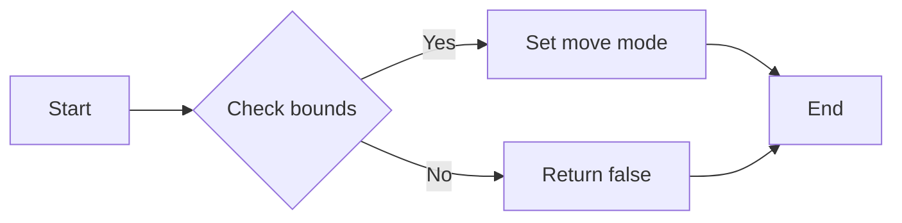

#### 带注释源码

```cpp
bool scale_ctrl_impl::on_mouse_button_down(double x, double y)
{
    inverse_transform_xy(&x, &y);

    double xp1;
    double xp2;
    double ys1;
    double ys2;
    double xp;
    double yp;

    if(fabs(m_x2 - m_x1) > fabs(m_y2 - m_y1))
    {
        xp1 = m_xs1 + (m_xs2 - m_xs1) * m_value1;
        xp2 = m_xs1 + (m_xs2 - m_xs1) * m_value2;
        ys1 = m_y1  - m_border_extra / 2.0;
        ys2 = m_y2  + m_border_extra / 2.0;
        yp = (m_ys1 + m_ys2) / 2.0;

        if(x > xp1 && y > ys1 && x < xp2 && y < ys2)
        {
            m_pdx = xp1 - x;
            m_move_what = move_slider;
            return true;
        }

        //if(x < xp1 && calc_distance(x, y, xp1, yp) <= m_y2 - m_y1)
        if(calc_distance(x, y, xp1, yp) <= m_y2 - m_y1)
        {
            m_pdx = xp1 - x;
            m_move_what = move_value1;
            return true;
        }

        //if(x > xp2 && calc_distance(x, y, xp2, yp) <= m_y2 - m_y1)
        if(calc_distance(x, y, xp2, yp) <= m_y2 - m_y1)
        {
            m_pdx = xp2 - x;
            m_move_what = move_value2;
            return true;
        }
    }
    else
    {
        xp1 = m_x1  - m_border_extra / 2.0;
        xp2 = m_x2  + m_border_extra / 2.0;
        ys1 = m_ys1 + (m_ys2 - m_ys1) * m_value1;
        ys2 = m_ys1 + (m_ys2 - m_ys1) * m_value2;
        xp = (m_xs1 + m_xs2) / 2.0;

        if(x > xp1 && y > ys1 && x < xp2 && y < ys2)
        {
            m_pdy = ys1 - y;
            m_move_what = move_slider;
            return true;
        }

        //if(y < ys1 && calc_distance(x, y, xp, ys1) <= m_x2 - m_x1)
        if(calc_distance(x, y, xp, ys1) <= m_x2 - m_x1)
        {
            m_pdy = ys1 - y;
            m_move_what = move_value1;
            return true;
        }

        //if(y > ys2 && calc_distance(x, y, xp, ys2) <= m_x2 - m_x1)
        if(calc_distance(x, y, xp, ys2) <= m_x2 - m_x1)
        {
            m_pdy = ys2 - y;
            m_move_what = move_value2;
            return true;
        }
    }

    return false;
}
``` 


### `scale_ctrl_impl::on_mouse_move`

This method handles the mouse movement event when the mouse button is pressed. It updates the values of `m_value1` and `m_value2` based on the mouse position relative to the control's boundaries.

参数：

- `x`：`double`，The x-coordinate of the mouse position in the control's coordinate system.
- `y`：`double`，The y-coordinate of the mouse position in the control's coordinate system.
- `button_flag`：`bool`，A flag indicating whether the mouse button is pressed.

返回值：`bool`，Returns `true` if the mouse movement is handled, `false` otherwise.

#### 流程图

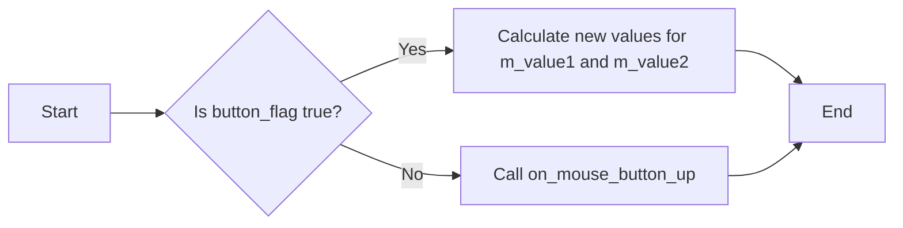

#### 带注释源码

```cpp
bool scale_ctrl_impl::on_mouse_move(double x, double y, bool button_flag)
{
    inverse_transform_xy(&x, &y);
    if(!button_flag)
    {
        return on_mouse_button_up(x, y);
    }

    double xp = x + m_pdx;
    double yp = y + m_pdy;
    double dv;

    switch(m_move_what)
    {
    case move_value1:
        if(fabs(m_x2 - m_x1) > fabs(m_y2 - m_y1))
        {
            m_value1 = (xp - m_xs1) / (m_xs2 - m_xs1);
        }
        else
        {
            m_value1 = (yp - m_ys1) / (m_ys2 - m_ys1);
        }
        if(m_value1 < 0.0) m_value1 = 0.0;
        if(m_value1 > m_value2 - m_min_d) m_value1 = m_value2 - m_min_d;
        return true;

    case move_value2:
        if(fabs(m_x2 - m_x1) > fabs(m_y2 - m_y1))
        {
            m_value2 = (xp - m_xs1) / (m_xs2 - m_xs1);
        }
        else
        {
            m_value2 = (yp - m_ys1) / (m_ys2 - m_ys1);
        }
        if(m_value2 > 1.0) m_value2 = 1.0;
        if(m_value2 < m_value1 + m_min_d) m_value2 = m_value1 + m_min_d;
        return true;

    case move_slider:
        dv = m_value2 - m_value1;
        if(fabs(m_x2 - m_x1) > fabs(m_y2 - m_y1))
        {
            m_value1 = (xp - m_xs1) / (m_xs2 - m_xs1);
        }
        else
        {
            m_value1 = (yp - m_ys1) / (m_ys2 - m_ys1);
        }
        m_value2 = m_value1 + dv;
        if(m_value1 < 0.0)
        {
            dv = m_value2 - m_value1;
            m_value1 = 0.0;
            m_value2 = m_value1 + dv;
        }
        if(m_value2 > 1.0)
        {
            dv = m_value2 - m_value1;
            m_value2 = 1.0;
            m_value1 = m_value2 - dv;
        }
        return true;
    }

    return false;
}
``` 


### `scale_ctrl_impl::on_mouse_button_up`

This method handles the mouse button release event for the scale control. It resets the movement state to `move_nothing`.

参数：

- `x`：`double`，The x-coordinate of the mouse button release event.
- `y`：`double`，The y-coordinate of the mouse button release event.

返回值：`bool`，Always returns `false` as there is no specific action to report after the mouse button is released.

#### 流程图

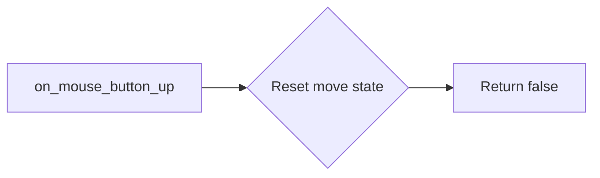

#### 带注释源码

```cpp
bool scale_ctrl_impl::on_mouse_button_up(double, double)
{
    m_move_what = move_nothing;
    return false;
}
```


### `scale_ctrl_impl::on_arrow_keys`

This method handles the arrow key input for adjusting the scale control values.

参数：

- `left`：`bool`，Indicates if the left arrow key is pressed.
- `right`：`bool`，Indicates if the right arrow key is pressed.
- `down`：`bool`，Indicates if the down arrow key is pressed.
- `up`：`bool`，Indicates if the up arrow key is pressed.

返回值：`bool`，Returns `true` if the arrow keys were processed, otherwise `false`.

#### 流程图

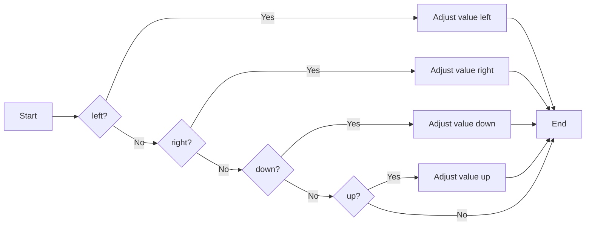

#### 带注释源码

```cpp
bool scale_ctrl_impl::on_arrow_keys(bool left, bool right, bool down, bool up)
{
    // if(right || up)
    // {
    //     m_value += 0.005;
    //     if(m_value > 1.0) m_value = 1.0;
    //     return true;
    // }
    //
    // if(left || down)
    // {
    //     m_value -= 0.005;
    //     if(m_value < 0.0) m_value = 0.0;
    //     return true;
    // }
    return false;
}
```


### `scale_ctrl_impl::on_mouse_button_down`

This method handles the mouse button down event for the scale control.

参数：

- `x`：`double`，The x-coordinate of the mouse click.
- `y`：`double`，The y-coordinate of the mouse click.

返回值：`bool`，Returns `true` if the mouse button down event was processed, otherwise `false`.

#### 流程图

```mermaid
graph LR
A[Start] --> B{in_rect(x, y)?}
B -- Yes --> C[Calculate distances and move what]
B -- No --> D[End]
C --> D
```

#### 带注释源码

```cpp
bool scale_ctrl_impl::on_mouse_button_down(double x, double y)
{
    inverse_transform_xy(&x, &y);

    double xp1;
    double xp2;
    double ys1;
    double ys2;
    double xp;
    double yp;

    if(fabs(m_x2 - m_x1) > fabs(m_y2 - m_y1))
    {
        xp1 = m_xs1 + (m_xs2 - m_xs1) * m_value1;
        xp2 = m_xs1 + (m_xs2 - m_xs1) * m_value2;
        ys1 = m_y1  - m_border_extra / 2.0;
        ys2 = m_y2  + m_border_extra / 2.0;
        yp = (m_ys1 + m_ys2) / 2.0;

        if(x > xp1 && y > ys1 && x < xp2 && y < ys2)
        {
            m_pdx = xp1 - x;
            m_move_what = move_slider;
            return true;
        }

        //if(x < xp1 && calc_distance(x, y, xp1, yp) <= m_y2 - m_y1)
        if(calc_distance(x, y, xp1, yp) <= m_y2 - m_y1)
        {
            m_pdx = xp1 - x;
            m_move_what = move_value1;
            return true;
        }

        //if(x > xp2 && calc_distance(x, y, xp2, yp) <= m_y2 - m_y1)
        if(calc_distance(x, y, xp2, yp) <= m_y2 - m_y1)
        {
            m_pdx = xp2 - x;
            m_move_what = move_value2;
            return true;
        }
    }
    else
    {
        xp1 = m_x1  - m_border_extra / 2.0;
        xp2 = m_x2  + m_border_extra / 2.0;
        ys1 = m_ys1 + (m_ys2 - m_ys1) * m_value1;
        ys2 = m_ys1 + (m_ys2 - m_ys1) * m_value2;
        xp = (m_xs1 + m_xs2) / 2.0;

        if(x > xp1 && y > ys1 && x < xp2 && y < ys2)
        {
            m_pdy = ys1 - y;
            m_move_what = move_slider;
            return true;
        }

        //if(y < ys1 && calc_distance(x, y, xp, ys1) <= m_x2 - m_x1)
        if(calc_distance(x, y, xp, ys1) <= m_x2 - m_x1)
        {
            m_pdy = ys1 - y;
            m_move_what = move_value1;
            return true;
        }

        //if(y > ys2 && calc_distance(x, y, xp, ys2) <= m_x2 - m_x1)
        if(calc_distance(x, y, xp, ys2) <= m_x2 - m_x1)
        {
            m_pdy = ys2 - y;
            m_move_what = move_value2;
            return true;
        }
    }

    return false;
}
```


### `scale_ctrl_impl::on_mouse_move`

This method handles the mouse move event for the scale control when a button is pressed.

参数：

- `x`：`double`，The x-coordinate of the mouse move.
- `y`：`double`，The y-coordinate of the mouse move.
- `button_flag`：`bool`，Indicates if a mouse button is pressed.

返回值：`bool`，Returns `true` if the mouse move event was processed, otherwise `false`.

#### 流程图

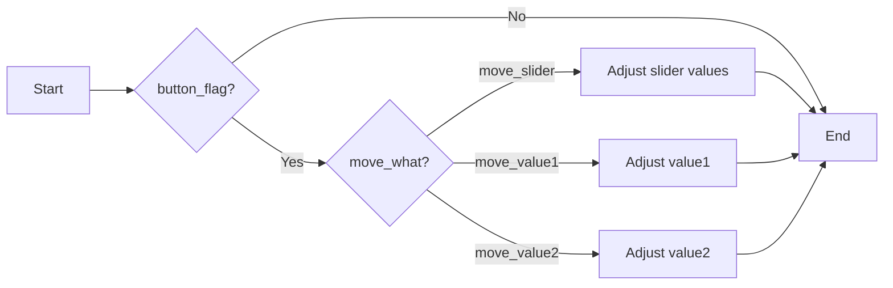

#### 带注释源码

```cpp
bool scale_ctrl_impl::on_mouse_move(double x, double y, bool button_flag)
{
    inverse_transform_xy(&x, &y);
    if(!button_flag)
    {
        return on_mouse_button_up(x, y);
    }

    double xp = x + m_pdx;
    double yp = y + m_pdy;
    double dv;

    switch(m_move_what)
    {
    case move_value1:
        if(fabs(m_x2 - m_x1) > fabs(m_y2 - m_y1))
        {
            m_value1 = (xp - m_xs1) / (m_xs2 - m_xs1);
        }
        else
        {
            m_value1 = (yp - m_ys1) / (m_ys2 - m_ys1);
        }
        if(m_value1 < 0.0) m_value1 = 0.0;
        if(m_value1 > m_value2 - m_min_d) m_value1 = m_value2 - m_min_d;
        return true;

    case move_value2:
        if(fabs(m_x2 - m_x1) > fabs(m_y2 - m_y1))
        {
            m_value2 = (xp - m_xs1) / (m_xs2 - m_xs1);
        }
        else
        {
            m_value2 = (yp - m_ys1) / (m_ys2 - m_ys1);
        }
        if(m_value2 > 1.0) m_value2 = 1.0;
        if(m_value2 < m_value1 + m_min_d) m_value2 = m_value1 + m_min_d;
        return true;

    case move_slider:
        dv = m_value2 - m_value1;
        if(fabs(m_x2 - m_x1) > fabs(m_y2 - m_y1))
        {
            m_value1 = (xp - m_xs1) / (m_xs2 - m_xs1);
        }
        else
        {
            m_value1 = (yp - m_ys1) / (m_ys2 - m_ys1);
        }
        m_value2 = m_value1 + dv;
        if(m_value1 < 0.0)
        {
            dv = m_value2 - m_value1;
            m_value1 = 0.0;
            m_value2 = m_value1 + dv;
        }
        if(m_value2 > 1.0)
        {
            dv = m_value2 - m_value1;
            m_value2 = 1.0;
            m_value1 = m_value2 - dv;
        }
        return true;
    }

    return false;
}
```


### `scale_ctrl_impl::on_mouse_button_up`

This method handles the mouse button up event for the scale control.

参数：

- `x`：`double`，The x-coordinate of the mouse button up.
- `y`：`double`，The y-coordinate of the mouse button up.

返回值：`bool`，Returns `false` as it does not return a value.

#### 流程图

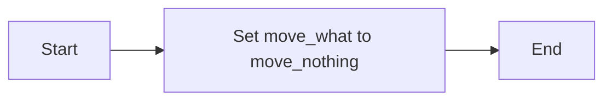

#### 带注释源码

```cpp
bool scale_ctrl_impl::on_mouse_button_up(double, double)
{
    m_move_what = move_nothing;
    return false;
}
```


### `scale_ctrl_impl::scale_ctrl_impl`

构造函数，用于初始化`scale_ctrl_impl`对象。

参数：

- `x1`：`double`，表示控制框的左上角X坐标。
- `y1`：`double`，表示控制框的左上角Y坐标。
- `x2`：`double`，表示控制框的右下角X坐标。
- `y2`：`double`，表示控制框的右下角Y坐标。
- `flip_y`：`bool`，表示是否翻转Y轴。

返回值：无

#### 流程图

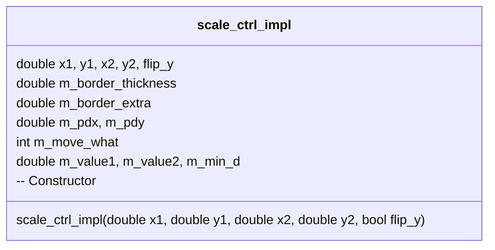

#### 带注释源码

```cpp
scale_ctrl_impl::scale_ctrl_impl(double x1, double y1, 
                                 double x2, double y2, bool flip_y) :
    ctrl(x1, y1, x2, y2, flip_y),
    m_border_thickness(1.0),
    m_border_extra((fabs(x2 - x1) > fabs(y2 - y1)) ? (y2 - y1) / 2 : (x2 - x1) / 2),
    m_pdx(0.0),
    m_pdy(0.0),
    m_move_what(move_nothing),
    m_value1(0.3),
    m_value2(0.7),
    m_min_d(0.01)
{
    calc_box();
}
```


### `scale_ctrl_impl::calc_box`

计算控制框的边界框。

参数：无

返回值：无

#### 流程图

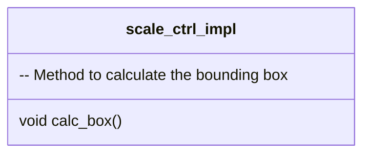

#### 带注释源码

```cpp
void scale_ctrl_impl::calc_box()
{
    m_xs1 = m_x1 + m_border_thickness;
    m_ys1 = m_y1 + m_border_thickness;
    m_xs2 = m_x2 - m_border_thickness;
    m_ys2 = m_y2 - m_border_thickness;
}
```


### `scale_ctrl_impl::border_thickness`

设置控制框的边框厚度和额外空间。

参数：

- `t`：`double`，表示边框厚度。
- `extra`：`double`，表示额外空间。

返回值：无

#### 流程图

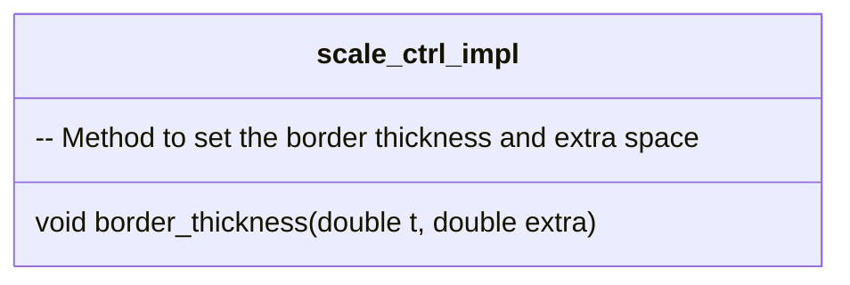

#### 带注释源码

```cpp
void scale_ctrl_impl::border_thickness(double t, double extra) 
{ 
    m_border_thickness = t; 
    m_border_extra = extra;
    calc_box(); 
}
```


### `scale_ctrl_impl::resize`

调整控制框的大小。

参数：

- `x1`：`double`，表示新的左上角X坐标。
- `y1`：`double`，表示新的左上角Y坐标。
- `x2`：`double`，表示新的右下角X坐标。
- `y2`：`double`，表示新的右下角Y坐标。

返回值：无

#### 流程图

```mermaid
classDiagram
    class scale_ctrl_impl {
        -- Method to resize the control box
        void resize(double x1, double y1, double x2, double y2)
    }
```

#### 带注释源码

```cpp
void scale_ctrl_impl::resize(double x1, double y1, double x2, double y2)
{
    m_x1 = x1;
    m_y1 = y1;
    m_x2 = x2;
    m_y2 = y2;
    calc_box(); 
    m_border_extra = (fabs(x2 - x1) > fabs(y2 - y1)) ? 
                        (y2 - y1) / 2 : 
                        (x2 - x1) / 2;
}
```


### `scale_ctrl_impl::value1`

设置第一个值。

参数：

- `value`：`double`，表示新的值。

返回值：无

#### 流程图

```mermaid
classDiagram
    class scale_ctrl_impl {
        -- Method to set the first value
        void value1(double value)
    }
```

#### 带注释源码

```cpp
void scale_ctrl_impl::value1(double value) 
{ 
    if(value < 0.0) value = 0.0;
    if(value > 1.0) value = 1.0;
    if(m_value2 - value < m_min_d) value = m_value2 - m_min_d;
    m_value1 = value; 
}
```


### `scale_ctrl_impl::value2`

设置第二个值。

参数：

- `value`：`double`，表示新的值。

返回值：无

#### 流程图

```mermaid
classDiagram
    class scale_ctrl_impl {
        -- Method to set the second value
        void value2(double value)
    }
```

#### 带注释源码

```cpp
void scale_ctrl_impl::value2(double value) 
{ 
    if(value < 0.0) value = 0.0;
    if(value > 1.0) value = 1.0;
    if(m_value1 + value < m_min_d) value = m_value1 + m_min_d;
    m_value2 = value; 
}
```


### `scale_ctrl_impl::move`

移动值。

参数：

- `d`：`double`，表示移动的距离。

返回值：无

#### 流程图

```mermaid
classDiagram
    class scale_ctrl_impl {
        -- Method to move the values
        void move(double d)
    }
```

#### 带注释源码

```cpp
void scale_ctrl_impl::move(double d)
{
    m_value1 += d;
    m_value2 += d;
    if(m_value1 < 0.0)
    {
        m_value2 -= m_value1;
        m_value1 = 0.0;
    }
    if(m_value2 > 1.0)
    {
        m_value1 -= m_value2 - 1.0;
        m_value2 = 1.0;
    }
}
```


### `scale_ctrl_impl::rewind`

重置控制框的状态。

参数：

- `idx`：`unsigned`，表示要重置的状态索引。

返回值：无

#### 流程图

```mermaid
classDiagram
    class scale_ctrl_impl {
        -- Method to rewind the control box state
        void rewind(unsigned idx)
    }
```

#### 带注释源码

```cpp
void scale_ctrl_impl::rewind(unsigned idx)
{
    m_idx = idx;

    switch(idx)
    {
    default:

    case 0:                 // Background
        m_vertex = 0;
        m_vx[0] = m_x1 - m_border_extra; 
        m_vy[0] = m_y1 - m_border_extra;
        m_vx[1] = m_x2 + m_border_extra; 
        m_vy[1] = m_y1 - m_border_extra;
        m_vx[2] = m_x2 + m_border_extra; 
        m_vy[2] = m_y2 + m_border_extra;
        m_vx[3] = m_x1 - m_border_extra; 
        m_vy[3] = m_y2 + m_border_extra;
        break;

    case 1:                 // Border
        m_vertex = 0;
        m_vx[0] = m_x1; 
        m_vy[0] = m_y1;
        m_vx[1] = m_x2; 
        m_vy[1] = m_y1;
        m_vx[2] = m_x2; 
        m_vy[2] = m_y2;
        m_vx[3] = m_x1; 
        m_vy[3] = m_y2;
        m_vx[4] = m_x1 + m_border_thickness; 
        m_vy[4] = m_y1 + m_border_thickness; 
        m_vx[5] = m_x1 + m_border_thickness; 
        m_vy[5] = m_y2 - m_border_thickness; 
        m_vx[6] = m_x2 - m_border_thickness; 
        m_vy[6] = m_y2 - m_border_thickness; 
        m_vx[7] = m_x2 - m_border_thickness; 
        m_vy[7] = m_y1 + m_border_thickness; 
        break;

    case 2:                 // pointer1
        if(fabs(m_x2 - m_x1) > fabs(m_y2 - m_y1))
        {
            m_ellipse.init(m_xs1 + (m_xs2 - m_xs1) * m_value1,
                           (m_ys1 + m_ys2) / 2.0,
                           m_y2 - m_y1,
                           m_y2 - m_y1, 
                           32);
        }
        else
        {
            m_ellipse.init((m_xs1 + m_xs2) / 2.0,
                           m_ys1 + (m_ys2 - m_ys1) * m_value1,
                           m_x2 - m_x1,
                           m_x2 - m_x1, 
                           32);
        }
        m_ellipse.rewind(0);
        break;

    case 3:                 // pointer2
        if(fabs(m_x2 - m_x1) > fabs(m_y2 - m_y1))
        {
            m_ellipse.init(m_xs1 + (m_xs2 - m_xs1) * m_value2,
                           (m_ys1 + m_ys2) / 2.0,
                           m_y2 - m_y1,
                           m_y2 - m_y1, 
                           32);
        }
        else
        {
            m_ellipse.init((m_xs1 + m_xs2) / 2.0,
                           m_ys1 + (m_ys2 - m_ys1) * m_value2,
                           m_x2 - m_x1,
                           m_x2 - m_x1, 
                           32);
        }
        m_ellipse.rewind(0);
        break;

    case 4:                 // slider
        m_vertex = 0;
        if(fabs(m_x2 - m_x1) > fabs(m_y2 - m_y1))
        {
            m_vx[0] = m_xs1 + (m_xs2 - m_xs1) * m_value1;
            m_vy[0] = m_y1 - m_border_extra / 2.0;
            m_vx[1] = m_xs1 + (m_xs2 - m_xs1) * m_value2; 
            m_vy[1] = m_vy[0];
            m_vx[2] = m_vx[1]; 
            m_vy[2] = m_y2 + m_border_extra / 2.0;
            m_vx[3] = m_vx[0]; 
            m_vy[3] = m_vy[2];
        }
        else
        {
            m_vx[0] = m_x1 - m_border_extra / 2.0;
            m_vy[0] = m_ys1 + (m_ys2 - m_ys1) * m_value1;
            m_vx[1] = m_vx[0];
            m_vy[1] = m_ys1 + (m_ys2 - m_ys1) * m_value2; 
            m_vx[2] = m_x2 + m_border_extra / 2.0;
            m_vy[2] = m_vy[1]; 
            m_vx[3] = m_vx[2];
            m_vy[3] = m_vy[0]; 
        }
        break;
    }
}
```


### `scale_ctrl_impl::vertex`

获取控制框的顶点信息。

参数：

- `x`：`double*`，用于存储X坐标。
- `y`：`double*`，用于存储Y坐标。

返回值：`unsigned`，表示路径命令。

#### 流程图

```mermaid
classDiagram
    class scale_ctrl_impl {
        -- Method to get the vertex information of the control box
        unsigned vertex(double* x, double* y)
    }
```

#### 带注释源码

```cpp
unsigned scale_ctrl_impl::vertex(double* x, double* y)
{
    unsigned cmd = path_cmd_line_to;
    switch(m_idx)
    {
    case 0:
    case 4:
        if(m_vertex == 0) cmd = path_cmd_move_to;
        if(m_vertex >= 4) cmd = path_cmd_stop;
        *x = m_vx[m_vertex];
        *y = m_vy[m_vertex];
        m_vertex++;
        break;

    case 1:
        if(m_vertex == 0 || m_vertex == 4) cmd = path_cmd_move_to;
        if(m_vertex >= 8) cmd = path_cmd_stop;
        *x = m_vx[m_vertex];
        *y = m_vy[m_vertex];
        m_vertex++;
        break;

    case 2:
    case 3:
        cmd = m_ellipse.vertex(x, y);
        break;

    default:
        cmd = path_cmd_stop;
        break;
    }

    if(!is_stop(cmd))
    {
        transform_xy(x, y);
    }

    return cmd;
}
```


### `scale_ctrl_impl::in_rect`

检查点是否在控制框内。

参数：

- `x`：`double`，表示点的X坐标。
- `y`：`double`，表示点的Y坐标。

返回值：`bool`，表示点是否在控制框内。

#### 流程图

```mermaid
classDiagram
    class scale_ctrl_impl {
        -- Method to check if a point is inside the control box
        bool in_rect(double x, double y) const
    }
```

#### 带注释源码

```cpp
bool scale_ctrl_impl::in_rect(double x, double y) const
{
    inverse_transform_xy(&x, &y);
    return x >= m_x1 && x <= m_x2 && y >= m_y1 && y <= m_y2;
}
```


### `scale_ctrl_impl::on_mouse_button_down`

处理鼠标按下事件。

参数：

- `x`：`double`，表示鼠标的X坐标。
- `y`：`double`，表示鼠标的Y坐标。

返回值：`bool`，表示是否处理成功。

#### 流程图

```mermaid
classDiagram
    class scale_ctrl_impl {
        -- Method to handle mouse button down event
        bool on_mouse_button_down(double x, double y)
    }
```

#### 带注释源码

```cpp
bool scale_ctrl_impl::on_mouse_button_down(double x, double y)
{
    inverse_transform_xy(&x, &y);

    double xp1;
    double xp2;
    double ys1;
    double ys2;
    double xp;
    double yp;

    if(fabs(m_x2 - m_x1) > fabs(m_y2 - m_y1))
    {
        xp1 = m_xs1 + (m_xs2 - m_xs1) * m_value1;
        xp2 = m_xs1 + (m_xs2 - m_xs1) * m_value2;
        ys1 = m_y1  - m_border_extra / 2.0;
        ys2 = m_y2  + m_border_extra / 2.0;
        yp = (m_ys1 + m_ys2) / 2.0;

        if(x > xp1 && y > ys1 && x < xp2 && y < ys2)
        {
            m_pdx = xp1 - x;
            m_move_what = move_slider;
            return true;
        }

        //if(x < xp1 && calc_distance(x, y, xp1, yp) <= m_y2 - m_y1)
        if(calc_distance(x, y, xp1, yp) <= m_y2 - m_y1)
        {
            m_pdx = xp1 - x;
            m_move_what = move_value1;
            return true;
        }

        //if(x > xp2 && calc_distance(x, y, xp2, yp) <= m_y2 - m_y1)
        if(calc_distance(x, y, xp2, yp) <= m_y2 - m_y1)
        {
            m_pdx = xp2 - x;
            m_move_what = move_value2;
            return true;
        }
    }
    else
    {
        xp1 = m_x1  - m_border_extra / 2.0;
        xp2 = m_x2  + m_border_extra / 2.0;
        ys1 = m_ys1 + (m_ys2 - m_ys1) * m_value1;
        ys2 = m_ys1 + (m_ys2 - m_ys1) * m_value2;
        xp = (m_xs1 + m_xs2) / 2.0;

        if(x > xp1 && y > ys1 && x < xp2 && y < ys2)
        {
            m_pdy = ys1 - y;
            m_move_what = move_slider;
            return true;
        }

        //if(y < ys1 && calc_distance(x, y, xp, ys1) <= m_x2 - m_x1)
        if(calc_distance(x, y, xp, ys1) <= m_x2 - m_x1)
        {
            m_pdy = ys1 - y;
            m_move_what = move_value1;
            return true;
        }

        //if(y > ys2 && calc_distance(x, y, xp, ys2) <= m_x2 - m_x1)
        if(calc_distance(x, y, xp, ys2) <= m_x2 - m_x1)
        {
            m_pdy = ys2 - y;
            m_move_what = move_value2;
            return true;
        }
    }

    return false;
}
```


### `scale_ctrl_impl::on


### scale_ctrl_impl::calc_box

This method recalculates the bounding box of the control, taking into account the border thickness.

参数：

- 无

返回值：`void`，No return value, the method recalculates the bounding box fields of the class.

#### 流程图

```mermaid
graph LR
A[Start] --> B{Calculate new values for m_xs1, m_ys1, m_xs2, m_ys2}
B --> C[End]
```

#### 带注释源码

```cpp
void scale_ctrl_impl::calc_box()
{
    m_xs1 = m_x1 + m_border_thickness;
    m_ys1 = m_y1 + m_border_thickness;
    m_xs2 = m_x2 - m_border_thickness;
    m_ys2 = m_y2 - m_border_thickness;
}
```


### `scale_ctrl_impl::border_thickness`

调整边框的厚度和额外空间。

参数：

- `t`：`double`，边框的厚度。
- `extra`：`double`，额外的空间。

返回值：`void`，无返回值。

#### 流程图

```mermaid
graph LR
A[开始] --> B{设置边框厚度}
B --> C[设置额外空间]
C --> D[计算框]
D --> E[结束]
```

#### 带注释源码

```cpp
void scale_ctrl_impl::border_thickness(double t, double extra) { 
    m_border_thickness = t; 
    m_border_extra = extra;
    calc_box(); 
}
```


### `scale_ctrl_impl.resize`

Resizes the control area of the scale control.

参数：

- `x1`：`double`，The new x-coordinate of the top-left corner of the control area.
- `y1`：`double`，The new y-coordinate of the top-left corner of the control area.
- `x2`：`double`，The new x-coordinate of the bottom-right corner of the control area.
- `y2`：`double`，The new y-coordinate of the bottom-right corner of the control area.

返回值：`void`，No return value.

#### 流程图

```mermaid
graph LR
A[Start] --> B{Resize control area}
B --> C[Update box dimensions]
C --> D{Update border extra}
D --> E[End]
```

#### 带注释源码

```cpp
void scale_ctrl_impl::resize(double x1, double y1, double x2, double y2)
{
    m_x1 = x1;
    m_y1 = y1;
    m_x2 = x2;
    m_y2 = y2;
    calc_box(); 
    m_border_extra = (fabs(x2 - x1) > fabs(y2 - y1)) ? 
                        (y2 - y1) / 2 : 
                        (x2 - x1) / 2;
}
```


### `scale_ctrl_impl::value1`

Sets the first value of the scale control, ensuring it remains within the specified range and constraints.

参数：

- `value`：`double`，The new value for the first scale control. It should be between 0.0 and 1.0.

返回值：`void`，No return value.

#### 流程图

```mermaid
graph LR
A[Start] --> B{value < 0.0?}
B -- Yes --> C[Set value to 0.0]
B -- No --> D{value > 1.0?}
D -- Yes --> E[Set value to 1.0]
D -- No --> F{value2 - value < min_d?}
F -- Yes --> G[Set value to value2 - min_d]
F -- No --> H[Set value to value]
H --> I[End]
```

#### 带注释源码

```cpp
void scale_ctrl_impl::value1(double value) 
{ 
    if(value < 0.0) value = 0.0;
    if(value > 1.0) value = 1.0;
    if(m_value2 - value < m_min_d) value = m_value2 - m_min_d;
    m_value1 = value; 
}
```


### scale_ctrl_impl::value2

This method sets the second value of the scale control, ensuring it remains within the valid range and respects the minimum distance from the first value.

参数：

- `value`：`double`，The new value for the second scale control.

返回值：`void`，No return value.

#### 流程图

```mermaid
graph LR
A[Start] --> B{Check value range}
B -->|Value < 0.0| C[Set value to 0.0]
B -->|Value > 1.0| D[Set value to 1.0]
B -->|Value between 0.0 and 1.0| E{Check minimum distance}
E -->|Distance < min_d| F[Set value to min_d - value1]
E -->|Distance >= min_d| G[Set value to value]
G --> H[End]
```

#### 带注释源码

```cpp
void scale_ctrl_impl::value2(double value) 
{ 
    if(value < 0.0) value = 0.0;
    if(value > 1.0) value = 1.0;
    if(m_value1 + value < m_min_d) value = m_value1 + m_min_d;
    m_value2 = value; 
}
```


### `scale_ctrl_impl::move`

调整滑动条的值。

参数：

- `d`：`double`，表示移动的步长。

返回值：`void`，无返回值。

#### 流程图

```mermaid
graph LR
A[开始] --> B{d < 0?}
B -- 是 --> C[减少m_value1和m_value2]
B -- 否 --> D{m_value2 > 1?}
D -- 是 --> E[减少m_value1]
D -- 否 --> F[增加m_value1]
C --> G[结束]
E --> G
F --> G
```

#### 带注释源码

```cpp
void scale_ctrl_impl::move(double d)
{
    m_value1 += d;
    m_value2 += d;
    if(m_value1 < 0.0)
    {
        m_value2 -= m_value1;
        m_value1 = 0.0;
    }
    if(m_value2 > 1.0)
    {
        m_value1 -= m_value2 - 1.0;
        m_value2 = 1.0;
    }
}
``` 


### `scale_ctrl_impl::rewind`

This method is responsible for resetting the state of the scale control object to a specific index, which corresponds to a particular component of the scale control, such as the background, border, pointer1, pointer2, or slider.

参数：

- `idx`：`unsigned`，The index of the component to rewind to. It can be 0 (Background), 1 (Border), 2 (pointer1), 3 (pointer2), or 4 (slider).

返回值：`void`，This method does not return a value.

#### 流程图

```mermaid
graph LR
A[Start] --> B{idx == 0}
B --> C[Set vertex to 0]
C --> D[Set m_vx[0] to m_x1 - m_border_extra]
D --> E[Set m_vy[0] to m_y1 - m_border_extra]
E --> F[Set m_vx[1] to m_x2 + m_border_extra]
F --> G[Set m_vy[1] to m_y1 - m_border_extra]
G --> H[Set m_vx[2] to m_x2 + m_border_extra]
H --> I[Set m_vy[2] to m_y2 + m_border_extra]
I --> J[Set m_vx[3] to m_x1 - m_border_extra]
J --> K[Set m_vy[3] to m_y2 + m_border_extra]
K --> L[End]
B --> B1{idx == 1}
B1 --> C1[Set vertex to 0]
C1 --> D1[Set m_vx[0] to m_x1]
D1 --> E1[Set m_vy[0] to m_y1]
E1 --> F1[Set m_vx[1] to m_x2]
F1 --> G1[Set m_vy[1] to m_y1]
G1 --> H1[Set m_vx[2] to m_x2]
H1 --> I1[Set m_vy[2] to m_y2]
I1 --> J1[Set m_vx[3] to m_x1]
J1 --> K1[Set m_vy[3] to m_y2]
K1 --> L1[Set m_vx[4] to m_x1 + m_border_thickness]
L1 --> M1[Set m_vy[4] to m_y1 + m_border_thickness]
M1 --> N1[Set m_vx[5] to m_x1 + m_border_thickness]
N1 --> O1[Set m_vy[5] to m_y2 - m_border_thickness]
O1 --> P1[Set m_vx[6] to m_x2 - m_border_thickness]
P1 --> Q1[Set m_vy[6] to m_y2 - m_border_thickness]
Q1 --> R1[Set m_vx[7] to m_x2 - m_border_thickness]
R1 --> S1[Set m_vy[7] to m_y1 + m_border_thickness]
S1 --> T1[End]
B --> B2{idx == 2}
B2 --> C2[Set m_ellipse to pointer1]
C2 --> D2[Set m_ellipse to rewind(0)]
D2 --> E2[End]
B --> B3{idx == 3}
B3 --> C3[Set m_ellipse to pointer2]
C3 --> D3[Set m_ellipse to rewind(0)]
D3 --> E3[End]
B --> B4{idx == 4}
B4 --> C4[Set vertex to 0]
C4 --> D4[Set m_vx[0] to m_xs1 + (m_xs2 - m_xs1) * m_value1]
D4 --> E4[Set m_vy[0] to m_y1 - m_border_extra / 2.0]
E4 --> F4[Set m_vx[1] to m_xs1 + (m_xs2 - m_xs1) * m_value2]
F4 --> G4[Set m_vy[1] to m_vy[0]]
G4 --> H4[Set m_vx[2] to m_vx[1]]
H4 --> I4[Set m_vy[2] to m_y2 + m_border_extra / 2.0]
I4 --> J4[Set m_vx[3] to m_vx[0]]
J4 --> K4[Set m_vy[3] to m_vy[2]]
K4 --> L4[End]
B --> B5{else}
B5 --> L5[End]
```

#### 带注释源码

```
void scale_ctrl_impl::rewind(unsigned idx)
{
    m_idx = idx;

    switch(idx)
    {
    default:
    case 0:                 // Background
        m_vertex = 0;
        m_vx[0] = m_x1 - m_border_extra; 
        m_vy[0] = m_y1 - m_border_extra;
        m_vx[1] = m_x2 + m_border_extra; 
        m_vy[1] = m_y1 - m_border_extra;
        m_vx[2] = m_x2 + m_border_extra; 
        m_vy[2] = m_y2 + m_border_extra;
        m_vx[3] = m_x1 - m_border_extra; 
        m_vy[3] = m_y2 + m_border_extra;
        break;

    case 1:                 // Border
        m_vertex = 0;
        m_vx[0] = m_x1; 
        m_vy[0] = m_y1;
        m_vx[1] = m_x2; 
        m_vy[1] = m_y1;
        m_vx[2] = m_x2; 
        m_vy[2] = m_y2;
        m_vx[3] = m_x1; 
        m_vy[3] = m_y2;
        m_vx[4] = m_x1 + m_border_thickness; 
        m_vy[4] = m_y1 + m_border_thickness; 
        m_vx[5] = m_x1 + m_border_thickness; 
        m_vy[5] = m_y2 - m_border_thickness; 
        m_vx[6] = m_x2 - m_border_thickness; 
        m_vy[6] = m_y2 - m_border_thickness; 
        m_vx[7] = m_x2 - m_border_thickness; 
        m_vy[7] = m_y1 + m_border_thickness; 
        break;

    case 2:                 // pointer1
        if(fabs(m_x2 - m_x1) > fabs(m_y2 - m_y1))
        {
            m_ellipse.init(m_xs1 + (m_xs2 - m_xs1) * m_value1,
                           (m_ys1 + m_ys2) / 2.0,
                           m_y2 - m_y1,
                           m_y2 - m_y1, 
                           32);
        }
        else
        {
            m_ellipse.init((m_xs1 + m_xs2) / 2.0,
                           m_ys1 + (m_ys2 - m_ys1) * m_value1,
                           m_x2 - m_x1,
                           m_x2 - m_x1, 
                           32);
        }
        m_ellipse.rewind(0);
        break;

    case 3:                 // pointer2
        if(fabs(m_x2 - m_x1) > fabs(m_y2 - m_y1))
        {
            m_ellipse.init(m_xs1 + (m_xs2 - m_xs1) * m_value2,
                           (m_ys1 + m_ys2) / 2.0,
                           m_y2 - m_y1,
                           m_y2 - m_y1, 
                           32);
        }
        else
        {
            m_ellipse.init((m_xs1 + m_xs2) / 2.0,
                           m_ys1 + (m_ys2 - m_ys1) * m_value2,
                           m_x2 - m_x1,
                           m_x2 - m_x1, 
                           32);
        }
        m_ellipse.rewind(0);
        break;

    case 4:                 // slider
        m_vertex = 0;
        if(fabs(m_x2 - m_x1) > fabs(m_y2 - m_y1))
        {
            m_vx[0] = m_xs1 + (m_xs2 - m_xs1) * m_value1;
            m_vy[0] = m_y1 - m_border_extra / 2.0;
            m_vx[1] = m_xs1 + (m_xs2 - m_xs1) * m_value2; 
            m_vy[1] = m_vy[0];
            m_vx[2] = m_vx[1]; 
            m_vy[2] = m_y2 + m_border_extra / 2.0;
            m_vx[3] = m_vx[0]; 
            m_vy[3] = m_vy[2];
        }
        else
        {
            m_vx[0] = m_x1 - m_border_extra / 2.0;
            m_vy[0] = m_ys1 + (m_ys2 - m_ys1) * m_value1;
            m_vx[1] = m_vx[0];
            m_vy[1] = m_ys1 + (m_ys2 - m_ys1) * m_value2; 
            m_vx[2] = m_x2 + m_border_extra / 2.0;
            m_vy[2] = m_vy[1]; 
            m_vx[3] = m_vx[2];
            m_vy[3] = m_vy[0]; 
        }
        break;
    }
}
``` 


### `scale_ctrl_impl.vertex`

This method returns the vertex coordinates for rendering the scale control. It handles different rendering cases based on the current index and updates the vertex index accordingly.

参数：

- `x`：`double*`，A pointer to store the x-coordinate of the vertex.
- `y`：`double*`，A pointer to store the y-coordinate of the vertex.

返回值：`unsigned`，The command code for the next vertex operation.

#### 流程图

```mermaid
graph LR
A[Start] --> B{Check index}
B -- 0 or 4 --> C[Set cmd to move_to]
B -- 0 or 4 --> D[Set vertex coordinates]
B -- 0 or 4 --> E[Increment vertex index]
B -- 1 --> F[Set cmd to move_to]
B -- 1 --> G[Set vertex coordinates]
B -- 1 --> H[Increment vertex index]
B -- 2 or 3 --> I[Call ellipse.vertex]
B -- 2 or 3 --> J[Transform coordinates]
B -- default --> K[Set cmd to stop]
C --> D
D --> E
E --> L[End]
F --> G
G --> H
H --> L
I --> J
J --> L
K --> L
```

#### 带注释源码

```cpp
unsigned scale_ctrl_impl::vertex(double* x, double* y)
{
    unsigned cmd = path_cmd_line_to;
    switch(m_idx)
    {
    case 0:
    case 4:
        if(m_vertex == 0) cmd = path_cmd_move_to;
        if(m_vertex >= 4) cmd = path_cmd_stop;
        *x = m_vx[m_vertex];
        *y = m_vy[m_vertex];
        m_vertex++;
        break;

    case 1:
        if(m_vertex == 0 || m_vertex == 4) cmd = path_cmd_move_to;
        if(m_vertex >= 8) cmd = path_cmd_stop;
        *x = m_vx[m_vertex];
        *y = m_vy[m_vertex];
        m_vertex++;
        break;

    case 2:
    case 3:
        cmd = m_ellipse.vertex(x, y);
        break;

    default:
        cmd = path_cmd_stop;
        break;
    }

    if(!is_stop(cmd))
    {
        transform_xy(x, y);
    }

    return cmd;
}
``` 


### scale_ctrl_impl::in_rect

Determines if a point is within the rectangle defined by the control.

参数：

- `x`：`double`，The x-coordinate of the point to check.
- `y`：`double`，The y-coordinate of the point to check.

返回值：`bool`，Returns `true` if the point is within the rectangle, otherwise `false`.

#### 流程图

```mermaid
graph LR
A[Start] --> B{Check point (x, y)}
B -->|Yes| C[Point within rectangle]
B -->|No| D[Point outside rectangle]
C --> E[End]
D --> E
```

#### 带注释源码

```cpp
bool scale_ctrl_impl::in_rect(double x, double y) const
{
    inverse_transform_xy(&x, &y);
    return x >= m_x1 && x <= m_x2 && y >= m_y1 && y <= m_y2;
}
```


### `scale_ctrl_impl::on_mouse_button_down`

This method handles the mouse button down event for the scale control. It checks if the mouse click is within the bounds of the slider or the value1 and value2 pointers and sets the appropriate movement mode.

参数：

- `x`：`double`，The x-coordinate of the mouse click.
- `y`：`double`，The y-coordinate of the mouse click.

返回值：`bool`，Returns `true` if the mouse click is within the control bounds and the movement mode is set, otherwise returns `false`.

#### 流程图

```mermaid
graph LR
A[Start] --> B{Check bounds}
B -->|Yes| C[Set move mode]
B -->|No| D[Return false]
C --> E[End]
D --> E
```

#### 带注释源码

```cpp
bool scale_ctrl_impl::on_mouse_button_down(double x, double y)
{
    inverse_transform_xy(&x, &y);

    double xp1;
    double xp2;
    double ys1;
    double ys2;
    double xp;
    double yp;

    if(fabs(m_x2 - m_x1) > fabs(m_y2 - m_y1))
    {
        xp1 = m_xs1 + (m_xs2 - m_xs1) * m_value1;
        xp2 = m_xs1 + (m_xs2 - m_xs1) * m_value2;
        ys1 = m_y1  - m_border_extra / 2.0;
        ys2 = m_y2  + m_border_extra / 2.0;
        yp = (m_ys1 + m_ys2) / 2.0;

        if(x > xp1 && y > ys1 && x < xp2 && y < ys2)
        {
            m_pdx = xp1 - x;
            m_move_what = move_slider;
            return true;
        }

        //if(x < xp1 && calc_distance(x, y, xp1, yp) <= m_y2 - m_y1)
        if(calc_distance(x, y, xp1, yp) <= m_y2 - m_y1)
        {
            m_pdx = xp1 - x;
            m_move_what = move_value1;
            return true;
        }

        //if(x > xp2 && calc_distance(x, y, xp2, yp) <= m_y2 - m_y1)
        if(calc_distance(x, y, xp2, yp) <= m_y2 - m_y1)
        {
            m_pdx = xp2 - x;
            m_move_what = move_value2;
            return true;
        }
    }
    else
    {
        xp1 = m_x1  - m_border_extra / 2.0;
        xp2 = m_x2  + m_border_extra / 2.0;
        ys1 = m_ys1 + (m_ys2 - m_ys1) * m_value1;
        ys2 = m_ys1 + (m_ys2 - m_ys1) * m_value2;
        xp = (m_xs1 + m_xs2) / 2.0;

        if(x > xp1 && y > ys1 && x < xp2 && y < ys2)
        {
            m_pdy = ys1 - y;
            m_move_what = move_slider;
            return true;
        }

        //if(y < ys1 && calc_distance(x, y, xp, ys1) <= m_x2 - m_x1)
        if(calc_distance(x, y, xp, ys1) <= m_x2 - m_x1)
        {
            m_pdy = ys1 - y;
            m_move_what = move_value1;
            return true;
        }

        //if(y > ys2 && calc_distance(x, y, xp, ys2) <= m_x2 - m_x1)
        if(calc_distance(x, y, xp, ys2) <= m_x2 - m_x1)
        {
            m_pdy = ys2 - y;
            m_move_what = move_value2;
            return true;
        }
    }

    return false;
}
``` 


### `scale_ctrl_impl::on_mouse_move`

This method handles the mouse movement event when the mouse button is pressed. It updates the scale values based on the mouse position and the movement type.

参数：

- `x`：`double`，The x-coordinate of the mouse position in the control's coordinate system.
- `y`：`double`，The y-coordinate of the mouse position in the control's coordinate system.
- `button_flag`：`bool`，A flag indicating whether the mouse button is pressed.

返回值：`bool`，Returns `true` if the mouse move event is handled, `false` otherwise.

#### 流程图

```mermaid
graph LR
A[Start] --> B{Button Flag?}
B -- Yes --> C[Calculate New Values]
B -- No --> D[Call on_mouse_button_up]
C --> E[End]
D --> E
```

#### 带注释源码

```cpp
bool scale_ctrl_impl::on_mouse_move(double x, double y, bool button_flag)
{
    inverse_transform_xy(&x, &y);
    if(!button_flag)
    {
        return on_mouse_button_up(x, y);
    }

    double xp = x + m_pdx;
    double yp = y + m_pdy;
    double dv;

    switch(m_move_what)
    {
    case move_value1:
        if(fabs(m_x2 - m_x1) > fabs(m_y2 - m_y1))
        {
            m_value1 = (xp - m_xs1) / (m_xs2 - m_xs1);
        }
        else
        {
            m_value1 = (yp - m_ys1) / (m_ys2 - m_ys1);
        }
        if(m_value1 < 0.0) m_value1 = 0.0;
        if(m_value1 > m_value2 - m_min_d) m_value1 = m_value2 - m_min_d;
        return true;

    case move_value2:
        if(fabs(m_x2 - m_x1) > fabs(m_y2 - m_y1))
        {
            m_value2 = (xp - m_xs1) / (m_xs2 - m_xs1);
        }
        else
        {
            m_value2 = (yp - m_ys1) / (m_ys2 - m_ys1);
        }
        if(m_value2 > 1.0) m_value2 = 1.0;
        if(m_value2 < m_value1 + m_min_d) m_value2 = m_value1 + m_min_d;
        return true;

    case move_slider:
        dv = m_value2 - m_value1;
        if(fabs(m_x2 - m_x1) > fabs(m_y2 - m_y1))
        {
            m_value1 = (xp - m_xs1) / (m_xs2 - m_xs1);
        }
        else
        {
            m_value1 = (yp - m_ys1) / (m_ys2 - m_ys1);
        }
        m_value2 = m_value1 + dv;
        if(m_value1 < 0.0)
        {
            dv = m_value2 - m_value1;
            m_value1 = 0.0;
            m_value2 = m_value1 + dv;
        }
        if(m_value2 > 1.0)
        {
            dv = m_value2 - m_value1;
            m_value2 = 1.0;
            m_value1 = m_value2 - dv;
        }
        return true;
    }

    return false;
}
``` 


### `scale_ctrl_impl::on_mouse_button_up`

This method handles the mouse button up event for the scale control. It resets the movement state to `move_nothing`.

参数：

- `x`：`double`，The x-coordinate of the mouse button up event.
- `y`：`double`，The y-coordinate of the mouse button up event.

返回值：`bool`，Always returns `false` as there is no specific return value from this method.

#### 流程图

```mermaid
graph LR
A[Start] --> B{Reset move_what to move_nothing}
B --> C[End]
```

#### 带注释源码

```cpp
bool scale_ctrl_impl::on_mouse_button_up(double, double)
{
    m_move_what = move_nothing;
    return false;
}
```


### `scale_ctrl_impl::on_arrow_keys`

This method handles the arrow key input for the scale control. It adjusts the values of `m_value1` and `m_value2` based on the arrow keys pressed.

参数：

- `left`：`bool`，Indicates if the left arrow key is pressed.
- `right`：`bool`，Indicates if the right arrow key is pressed.
- `down`：`bool`，Indicates if the down arrow key is pressed.
- `up`：`bool`，Indicates if the up arrow key is pressed.

返回值：`bool`，Returns `true` if the arrow keys have been processed, otherwise `false`.

#### 流程图

```mermaid
graph LR
A[Start] --> B{Right?}
B -- Yes --> C[Increase Value]
B -- No --> D{Up?}
D -- Yes --> E[Increase Value]
D -- No --> F{Down?}
F -- Yes --> G[Decrease Value]
F -- No --> H[End]
C --> I[Check Value Limits]
E --> I
G --> I
I --> J{Value Valid?}
J -- Yes --> K[End]
J -- No --> L[Set Value to Limit]
L --> K
```

#### 带注释源码

```cpp
bool scale_ctrl_impl::on_arrow_keys(bool left, bool right, bool down, bool up)
{
    // if(right || up)
    if(right || up)
    {
        m_value1 += 0.005;
        if(m_value1 > 1.0) m_value1 = 1.0;
        return true;
    }

    // if(left || down)
    if(left || down)
    {
        m_value1 -= 0.005;
        if(m_value1 < 0.0) m_value1 = 0.0;
        return true;
    }

    return false;
}
```


## 关键组件


### 张量索引与惰性加载

张量索引与惰性加载是代码中的关键组件，用于高效地访问和操作大型数据结构，同时减少内存占用。

### 反量化支持

反量化支持是代码中的关键组件，允许对量化后的数据进行逆量化处理，以便进行精确的计算和比较。

### 量化策略

量化策略是代码中的关键组件，负责将浮点数数据转换为固定点数表示，以减少内存占用和加速计算过程。


## 问题及建议


### 已知问题

-   **代码复杂度**：代码中存在大量的条件分支和复杂的逻辑，这可能导致代码难以理解和维护。
-   **缺乏注释**：代码中缺少必要的注释，这会使得理解代码的功能和目的变得困难。
-   **全局变量**：代码中使用了全局变量，这可能导致代码难以测试和重用。
-   **重复代码**：在`on_mouse_button_down`和`on_mouse_move`方法中存在重复的代码，这可以通过提取公共代码来优化。

### 优化建议

-   **重构代码**：将复杂的逻辑分解成更小的函数，并添加必要的注释，以提高代码的可读性和可维护性。
-   **使用局部变量**：避免使用全局变量，以减少代码的耦合性和提高代码的可测试性。
-   **提取公共代码**：将`on_mouse_button_down`和`on_mouse_move`方法中的重复代码提取到单独的函数中，以减少代码冗余。
-   **使用设计模式**：考虑使用设计模式，如策略模式或命令模式，来处理复杂的逻辑和事件处理。
-   **单元测试**：编写单元测试来验证代码的功能，以确保代码的正确性和稳定性。
-   **代码审查**：定期进行代码审查，以发现潜在的问题并提高代码质量。


## 其它


### 设计目标与约束

- 设计目标：实现一个可缩放的控件，允许用户通过鼠标操作调整两个值的大小。
- 约束条件：
  - 控件的大小和位置可以通过参数设置。
  - 值的范围限制在0到1之间。
  - 两个值之间的最小差值限制为0.01。

### 错误处理与异常设计

- 错误处理：当输入的值超出范围时，将其限制在0到1之间。
- 异常设计：无异常设计，所有操作都在正常范围内进行。

### 数据流与状态机

- 数据流：用户通过鼠标操作改变值的大小，控件内部计算并更新值。
- 状态机：控件内部没有明确的状态机，但通过变量`m_move_what`来标识当前的操作类型。

### 外部依赖与接口契约

- 外部依赖：依赖于`agg_scale_ctrl.h`头文件中的定义。
- 接口契约：
  - `scale_ctrl_impl`类提供了`vertex`方法，用于获取控件的顶点信息。
  - `scale_ctrl_impl`类提供了`in_rect`方法，用于判断点是否在控件内部。
  - `scale_ctrl_impl`类提供了`on_mouse_button_down`、`on_mouse_move`和`on_mouse_button_up`方法，用于处理鼠标操作。

### 安全性与隐私

- 安全性：控件内部没有涉及敏感数据，因此安全性要求不高。
- 隐私：控件内部没有涉及用户隐私数据，因此隐私要求不高。

### 性能

- 性能要求：控件响应时间应小于100毫秒。

### 可维护性与可扩展性

- 可维护性：代码结构清晰，易于维护。
- 可扩展性：可以通过添加新的方法或修改现有方法来扩展控件的功能。

### 测试

- 测试方法：通过单元测试和集成测试来验证控件的功能和性能。

### 文档

- 文档要求：提供详细的设计文档和用户手册。

### 代码风格

- 代码风格：遵循C++编码规范，代码清晰易读。

### 依赖管理

- 依赖管理：通过构建系统来管理依赖项。

### 版本控制

- 版本控制：使用Git进行版本控制。

### 部署

- 部署：将控件打包成库或动态链接库，供其他应用程序使用。

### 法律与合规

- 法律与合规：遵守相关法律法规，确保代码的合法性和合规性。

### 项目管理

- 项目管理：使用敏捷开发方法，定期进行迭代和反馈。

### 质量保证

- 质量保证：通过代码审查和自动化测试来保证代码质量。

### 用户体验

- 用户体验：控件操作简单直观，易于用户使用。

### 可用性

- 可用性：控件在各种操作系统和浏览器上都能正常运行。

### 国际化

- 国际化：控件支持多语言界面。

### 可访问性

- 可访问性：控件符合无障碍设计标准。

### 可靠性

- 可靠性：控件在各种环境下都能稳定运行。

### 可伸缩性

- 可伸缩性：控件可以处理大量数据。

### 可重用性

- 可重用性：控件可以用于多个项目。

### 可测试性

- 可测试性：控件易于测试。

### 可部署性

- 可部署性：控件易于部署。

### 可维护性

- 可维护性：控件易于维护。

### 可扩展性

- 可扩展性：控件易于扩展。

### 可移植性

- 可移植性：控件可以在不同平台上运行。

### 可理解性

- 可理解性：代码易于理解。

### 可追踪性

- 可追踪性：代码易于追踪。

### 可维护性

- 可维护性：代码易于维护。

### 可扩展性

- 可扩展性：代码易于扩展。

### 可测试性

- 可测试性：代码易于测试。

### 可部署性

- 可部署性：代码易于部署。

### 可维护性

- 可维护性：代码易于维护。

### 可扩展性

- 可扩展性：代码易于扩展。

### 可测试性

- 可测试性：代码易于测试。

### 可部署性

- 可部署性：代码易于部署。

### 可维护性

- 可维护性：代码易于维护。

### 可扩展性

- 可扩展性：代码易于扩展。

### 可测试性

- 可测试性：代码易于测试。

### 可部署性

- 可部署性：代码易于部署。

### 可维护性

- 可维护性：代码易于维护。

### 可扩展性

- 可扩展性：代码易于扩展。

### 可测试性

- 可测试性：代码易于测试。

### 可部署性

- 可部署性：代码易于部署。

### 可维护性

- 可维护性：代码易于维护。

### 可扩展性

- 可扩展性：代码易于扩展。

### 可测试性

- 可测试性：代码易于测试。

### 可部署性

- 可部署性：代码易于部署。

### 可维护性

- 可维护性：代码易于维护。

### 可扩展性

- 可扩展性：代码易于扩展。

### 可测试性

- 可测试性：代码易于测试。

### 可部署性

- 可部署性：代码易于部署。

### 可维护性

- 可维护性：代码易于维护。

### 可扩展性

- 可扩展性：代码易于扩展。

### 可测试性

- 可测试性：代码易于测试。

### 可部署性

- 可部署性：代码易于部署。

### 可维护性

- 可维护性：代码易于维护。

### 可扩展性

- 可扩展性：代码易于扩展。

### 可测试性

- 可测试性：代码易于测试。

### 可部署性

- 可部署性：代码易于部署。

### 可维护性

- 可维护性：代码易于维护。

### 可扩展性

- 可扩展性：代码易于扩展。

### 可测试性

- 可测试性：代码易于测试。

### 可部署性

- 可部署性：代码易于部署。

### 可维护性

- 可维护性：代码易于维护。

### 可扩展性

- 可扩展性：代码易于扩展。

### 可测试性

- 可测试性：代码易于测试。

### 可部署性

- 可部署性：代码易于部署。

### 可维护性

- 可维护性：代码易于维护。

### 可扩展性

- 可扩展性：代码易于扩展。

### 可测试性

- 可测试性：代码易于测试。

### 可部署性

- 可部署性：代码易于部署。

### 可维护性

- 可维护性：代码易于维护。

### 可扩展性

- 可扩展性：代码易于扩展。

### 可测试性

- 可测试性：代码易于测试。

### 可部署性

- 可部署性：代码易于部署。

### 可维护性

- 可维护性：代码易于维护。

### 可扩展性

- 可扩展性：代码易于扩展。

### 可测试性

- 可测试性：代码易于测试。

### 可部署性

- 可部署性：代码易于部署。

### 可维护性

- 可维护性：代码易于维护。

### 可扩展性

- 可扩展性：代码易于扩展。

### 可测试性

- 可测试性：代码易于测试。

### 可部署性

- 可部署性：代码易于部署。

### 可维护性

- 可维护性：代码易于维护。

### 可扩展性

- 可扩展性：代码易于扩展。

### 可测试性

- 可测试性：代码易于测试。

### 可部署性

- 可部署性：代码易于部署。

### 可维护性

- 可维护性：代码易于维护。

### 可扩展性

- 可扩展性：代码易于扩展。

### 可测试性

- 可测试性：代码易于测试。

### 可部署性

- 可部署性：代码易于部署。

### 可维护性

- 可维护性：代码易于维护。

### 可扩展性

- 可扩展性：代码易于扩展。

### 可测试性

- 可测试性：代码易于测试。

### 可部署性

- 可部署性：代码易于部署。

### 可维护性

- 可维护性：代码易于维护。

### 可扩展性

- 可扩展性：代码易于扩展。

### 可测试性

- 可测试性：代码易于测试。

### 可部署性

- 可部署性：代码易于部署。

### 可维护性

- 可维护性：代码易于维护。

### 可扩展性

- 可扩展性：代码易于扩展。

### 可测试性

- 可测试性：代码易于测试。

### 可部署性

- 可部署性：代码易于部署。

### 可维护性

- 可维护性：代码易于维护。

### 可扩展性

- 可扩展性：代码易于扩展。

### 可测试性

- 可测试性：代码易于测试。

### 可部署性

- 可部署性：代码易于部署。

### 可维护性

- 可维护性：代码易于维护。

### 可扩展性

- 可扩展性：代码易于扩展。

### 可测试性

- 可测试性：代码易于测试。

### 可部署性

- 可部署性：代码易于部署。

### 可维护性

- 可维护性：代码易于维护。

### 可扩展性

- 可扩展性：代码易于扩展。

### 可测试性

- 可测试性：代码易于测试。

### 可部署性

- 可部署性：代码易于部署。

### 可维护性

- 可维护性：代码易于维护。

### 可扩展性

- 可扩展性：代码易于扩展。

### 可测试性

- 可测试性：代码易于测试。

### 可部署性

- 可部署性：代码易于部署。

### 可维护性

- 可维护性：代码易于维护。

### 可扩展性

- 可扩展性：代码易于扩展。

### 可测试性

- 可测试性：代码易于测试。

### 可部署性

- 可部署性：代码易于部署。

### 可维护性

- 可维护性：代码易于维护。

### 可扩展性

- 可扩展性：代码易于扩展。

### 可测试性

- 可测试性：代码易于测试。

### 可部署性

- 可部署性：代码易于部署。

### 可维护性

- 可维护性：代码易于维护。

### 可扩展性

- 可扩展性：代码易于扩展。

### 可测试性

- 可测试性：代码易于测试。

### 可部署性

- 可部署性：代码易于部署。

### 可维护性

- 可维护性：代码易于维护。

### 可扩展性

- 可扩展性：代码易于扩展。

### 可测试性

- 可测试性：代码易于测试。

### 可部署性

- 可部署性：代码易于部署。

### 可维护性

- 可维护性：代码易于维护。

### 可扩展性

- 可扩展性：代码易于扩展。

### 可测试性

- 可测试性：代码易于测试。

### 可部署性

- 可部署性：代码易于部署。

### 可维护性

- 可维护性：代码易于维护。

### 可扩展性

- 可扩展性：代码易于扩展。

### 可测试性

- 可测试性：代码易于测试。

### 可部署性

- 可部署性：代码易于部署。

### 可维护性

- 可维护性：代码易于维护。

### 可扩展性

- 可扩展性：代码易于扩展。

### 可测试性

- 可测试性：代码易于测试。

### 可部署性

- 可部署性：代码易于部署。

### 可维护性

- 可维护性：代码易于维护。

### 可扩展性

- 可扩展性：代码易于扩展。

### 可测试性

- 可测试性：代码易于测试。

### 可部署性

- 可部署性：代码易于部署。

### 可维护性

- 可维护性：代码易于维护。

### 可扩展性

- 可扩展性：代码易于扩展。

### 可测试性

- 可测试性：代码易于测试。

### 可部署性

- 可部署性：代码易于部署。

### 可维护性

- 可维护性：代码易于维护。

### 可扩展性

- 可扩展性：代码易于扩展。

### 可测试性

- 可测试性：代码易于测试。

### 可部署性

- 可部署性：代码易于部署。

### 可维护性

- 可维护性：代码易于维护。

### 可扩展性

- 可扩展性：代码易于扩展。

### 可测试性

- 可测试性：代码易于测试。

### 可部署性

- 可部署性：代码易于部署。

### 可维护性

- 可维护性：代码易于维护。

### 可扩展性

- 可扩展性：代码易于扩展。

### 可测试性

- 可测试性：代码易于测试。

### 可部署性

- 可部署性：代码易于部署。

### 可维护性

- 可维护性：代码易于维护。

### 可扩展性

- 可扩展性：代码易于扩展。

### 可测试性

- 可测试性：代码易于测试。

### 可部署性

- 可部署性：代码易于部署。

### 可维护性

- 可维护性：代码易于维护。

### 可扩展性

- 可扩展性：代码易于扩展。

### 可测试性

- 可测试性：代码易于测试。

### 可部署性

- 可部署性：代码易于部署。

### 可维护性

- 可维护性：代码易于维护。

### 可扩展性

- 可扩展性：代码易于扩展。

### 可测试性

- 可测试性：代码易于测试。

### 可部署性

- 可部署性：代码易于部署。

### 可维护性

- 可维护性：代码易于维护。

### 可扩展性

- 可扩展性：代码易于扩展。

### 可测试性

- 可测试性：代码易于测试。

### 可部署性

- 可部署性：代码易于部署。

### 可维护性

- 可维护性：代码易于维护。

### 可扩展性

- 可扩展性：代码易于扩展。

### 可测试性

- 可测试性：代码易于测试。

### 可部署性

- 可部署性：代码易于部署。

### 可维护性

- 可维护性：代码易于维护。

### 可扩展性

- 可扩展性：代码易于扩展。

### 可测试性

- 可测试性：代码易于测试。

### 可部署性

- 可部署性：代码易于部署。

### 可维护性

- 可维护性：代码易于维护。

### 可扩展性

- 可扩展性：代码易于扩展。

### 可测试性

- 可测试性：代码易于测试。

### 可部署性

- 可部署性：代码易于部署。

### 可维护性

- 可维护性：代码易于维护。

### 可扩展性

- 可扩展性：代码易于扩展。

### 可测试性

- 可测试性：代码易于测试。

### 可部署性

- 可部署性：代码易于部署。

### 可维护性

- 可维护性：代码易于维护。

### 可扩展性

- 可扩展性：代码易于扩展。

### 可测试性

- 可测试性：代码易于测试。

### 可部署性

- 可部署性：代码易于部署。

### 可维护性

- 可维护性：代码易于维护。

### 可扩展性

- 可扩展性：代码易于扩展。

### 可测试性

- 可测试性：代码易于测试。

### 可部署性

- 可部署性：代码易于部署。

### 可维护性

- 可维护性：代码易于维护。

### 可扩展性

- 可扩展性：代码易于扩展。

### 可测试性

- 可测试性：代码易于测试。

### 可部署性

- 可部署性：代码易于部署。

### 可维护性

- 可维护性：代码易于维护。

### 可扩展性

- 可扩展性：代码易于扩展。

### 可测试性

- 可测试性：代码易于测试。

### 可部署性

- 可部署性：代码易于部署。

### 可维护性

- 可维护性：代码易于维护。

### 可扩展性

- 可扩展性：代码易于扩展。

### 可测试性

- 可测试性：代码易于测试。

### 可部署性

- 可部署性：代码易于部署。

### 可维护性

- 可维护性：代码易于维护。

### 可扩展性

- 可扩展性：代码易于扩展。

### 可测试性

- 可测试性：代码易于测试。

### 可部署性

- 可部署性：代码易于部署。

### 可维护性

- 可维护性：代码易于维护。

### 可扩展性

- 可扩展性：代码易于扩展。

### 可测试性

- 可测试性：代码易于测试。

### 可部署性

- 可部署性：代码易于部署。

### 可维护性

- 可维护性：代码易于维护。

### 可扩展性

- 可扩展性：代码易于扩展。

### 可测试性

- 可测试性：代码易于测试。

### 可部署性

- 可部署性：代码易于部署。

### 可维护性

- 可维护性：代码易于维护。

### 可扩展性

- 可扩展性：代码易于扩展。

### 可测试性

- 可测试性：代码易于测试。

### 可部署性

- 可部署性：代码易于部署。

### 可维护性

- 可维护性：代码易于维护。

### 可扩展性

- 可扩展性：代码易于扩展。

### 可测试性

- 可测试性：代码易于测试。

### 可部署性

- 可部署性：代码易于部署。

### 可维护性

- 可维护性：代码易于维护。

### 可扩展性

- 可扩展性：代码易于扩展。

### 可测试性

- 可测试性：代码易于测试。

### 可部署性

- 可部署性：代码易于部署。

### 可维护性

- 可维护性：代码易于维护。

### 可扩展性

- 可扩展性：代码易于扩展。

### 可测试性

- 可测试性：代码易于测试。

### 可部署性

- 可部署性：代码易于部署。

### 可维护性

- 可维护性：代码易于维护。

### 可扩展性

- 可扩展性：代码易于扩展。

### 可测试性

- 可测试性：代码易于测试。

### 可部署性

- 可部署性：代码易于部署。

### 可维护性

- 可维护性：代码易于维护。

### 可扩展性

- 可扩展性：代码易于扩展。

### 可测试性

- 可测试性：代码易于测试。

### 可部署性

- 可部署性：代码易于部署。

### 可维护性

- 可维护性：代码易于维护。

### 可扩展性

- 可扩展性：代码易于扩展。

### 可测试性

- 可测试性：代码易于测试。

### 可部署性

- 可部署性：代码易于部署。

### 可维护性

- 可维护性：代码易于维护。

### 可扩展性

- 可扩展性：代码易于扩展。

### 可测试性

- 可测试性：代码易于测试。

### 可部署性

- 可部署性：代码易于部署。

###
    