# `matplotlib\extern\agg24-svn\src\ctrl\agg_slider_ctrl.cpp` 详细设计文档

这是 Anti-Grain Geometry (AGG) 图形库的滑块控件实现，提供了可交互的滑动条UI组件，支持鼠标拖拽和键盘方向键控制，可用于图形界面中选择数值范围。

## 整体流程

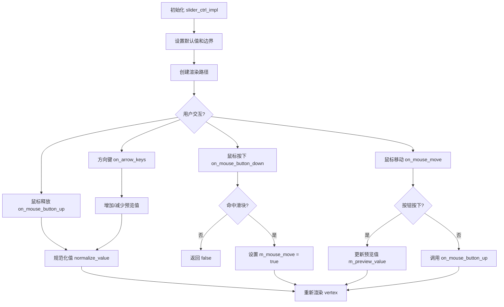

## 类结构

```
ctrl (基类)
└── slider_ctrl_impl (滑块控件实现类)
```

## 全局变量及字段


### `ctrl.m_x1`
    
控件左边x坐标

类型：`double`
    


### `ctrl.m_y1`
    
控件上边y坐标

类型：`double`
    


### `ctrl.m_x2`
    
控件右边x坐标

类型：`double`
    


### `ctrl.m_y2`
    
控件下边y坐标

类型：`double`
    


### `ctrl.m_flip_y`
    
Y轴翻转标志

类型：`bool`
    


### `slider_ctrl_impl.m_border_width`
    
边框宽度

类型：`double`
    


### `slider_ctrl_impl.m_border_extra`
    
边框额外偏移

类型：`double`
    


### `slider_ctrl_impl.m_text_thickness`
    
文本粗细

类型：`double`
    


### `slider_ctrl_impl.m_pdx`
    
鼠标偏移量

类型：`double`
    


### `slider_ctrl_impl.m_mouse_move`
    
鼠标移动状态

类型：`bool`
    


### `slider_ctrl_impl.m_value`
    
当前值

类型：`double`
    


### `slider_ctrl_impl.m_preview_value`
    
预览值

类型：`double`
    


### `slider_ctrl_impl.m_min`
    
最小值

类型：`double`
    


### `slider_ctrl_impl.m_max`
    
最大值

类型：`double`
    


### `slider_ctrl_impl.m_num_steps`
    
步数

类型：`int`
    


### `slider_ctrl_impl.m_descending`
    
下降方向标志

类型：`bool`
    


### `slider_ctrl_impl.m_text_poly`
    
文本路径

类型：`path_storage`
    


### `slider_ctrl_impl.m_text`
    
文本对象

类型：`text`
    


### `slider_ctrl_impl.m_label`
    
标签字符串

类型：`char[64]`
    


### `slider_ctrl_impl.m_ellipse`
    
椭圆对象

类型：`ellipse`
    


### `slider_ctrl_impl.m_storage`
    
路径存储

类型：`path_storage`
    


### `slider_ctrl_impl.m_xs1`
    
计算后左边x坐标

类型：`double`
    


### `slider_ctrl_impl.m_ys1`
    
计算后上边y坐标

类型：`double`
    


### `slider_ctrl_impl.m_xs2`
    
计算后右边x坐标

类型：`double`
    


### `slider_ctrl_impl.m_ys2`
    
计算后下边y坐标

类型：`double`
    


### `slider_ctrl_impl.m_idx`
    
当前索引

类型：`unsigned`
    


### `slider_ctrl_impl.m_vertex`
    
顶点计数

类型：`unsigned`
    


### `slider_ctrl_impl.m_vx`
    
顶点x坐标数组

类型：`double[4]`
    


### `slider_ctrl_impl.m_vy`
    
顶点y坐标数组

类型：`double[4]`
    
    

## 全局函数及方法


### `calc_distance`

该函数用于计算两个二维坐标点之间的欧几里得距离。在滑块控件中用于检测鼠标点击位置是否在滑块指针的交互范围内。

参数：
- `x`：`double`，第一个点的X坐标
- `y`：`double`，第一个点的Y坐标
- `xp`：`double`，第二个点的X坐标
- `yp`：`double`，第二个点的Y坐标

返回值：`double`，返回两点之间的欧几里得距离

#### 流程图

```mermaid
graph TD
    A[开始] --> B[接收点坐标 x, y, xp, yp]
    B --> C[计算横向差值 dx = xp - x]
    C --> D[计算纵向差值 dy = yp - y]
    D --> E[计算距离平方 distance² = dx² + dy²]
    E --> F[计算距离 distance = sqrt(distance²)]
    F --> G[返回距离值]
```

#### 带注释源码

```
//----------------------------------------------------------------------------
// 计算两点之间的欧几里得距离
// 参数:
//   x  - 第一个点的X坐标
//   y  - 第一个点的Y坐标
//   xp - 第二个点的X坐标
//   yp - 第二个点的Y坐标
// 返回值:
//   两个点之间的欧几里得距离
//----------------------------------------------------------------------------
inline double calc_distance(double x, double y, double xp, double yp)
{
    double dx = xp - x;      // 计算X轴方向的差值
    double dy = yp - y;      // 计算Y轴方向的差值
    return sqrt(dx * dx + dy * dy);  // 返回欧几里得距离
}
```

**注**：该函数在代码中未被直接定义，而是通过调用上下文推断其签名和功能。在 Anti-Grain Geometry 库中，此函数通常作为内联函数或宏定义存在于 math utilities 头文件中。


### `is_stop`

该函数是 Anti-Grain Geometry (AGG) 库中的路径命令辅助判断函数。它接收一个无符号整型命令码作为输入，判断该命令是否为结束路径绘制的停止命令（`path_cmd_stop`），常用于图形渲染循环中控制是否进行坐标变换或结束遍历。

参数：
-  `cmd`：`unsigned`，路径命令标识符（Path Command Identifier），例如 `path_cmd_move_to`、`path_cmd_line_to` 或 `path_cmd_stop`。

返回值：`bool`，如果输入的命令码等于停止命令码则返回 `true`，否则返回 `false`。

#### 流程图

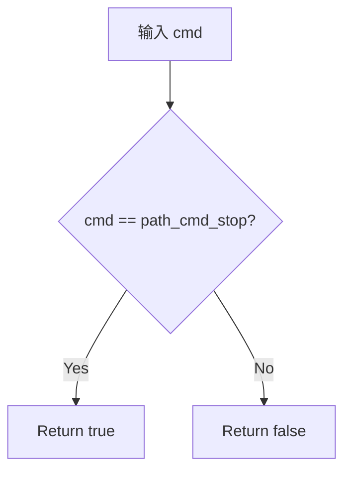

#### 带注释源码

```cpp
// AGG 源码中典型的实现 (位于 agg_basics.h 或 agg_path_commands.h)
// 这是一个静态内联函数，用于性能优化
static inline bool is_stop(unsigned cmd) 
{ 
    // 判断命令是否等于预定义的停止命令枚举值
    return cmd == path_cmd_stop; 
}
```


### `ctrl.transform_xy`

该函数是基类 `ctrl` 的成员方法，用于对坐标进行几何变换（可能是旋转、缩放或仿射变换）。在 `slider_ctrl_impl::vertex` 方法中被调用，以在生成图形路径顶点时应用坐标变换。

参数：

- `x`：`double*`，指向 x 坐标的指针，变换后被修改
- `y`：`double*`，指向 y 坐标的指针，变换后被修改

返回值：`void`，无返回值（直接修改指针所指向的坐标值）

#### 流程图

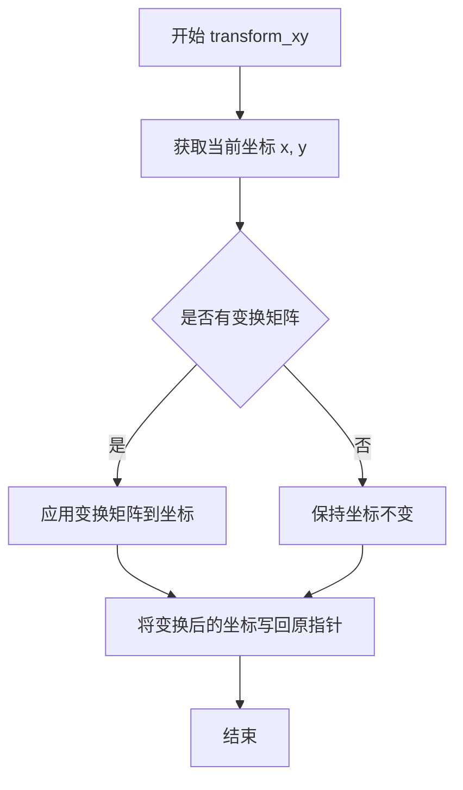

#### 带注释源码

```
// 该方法未在此文件中实现，是继承自 ctrl 基类
// 在 slider_ctrl_impl::vertex 中被调用:
//
// if(!is_stop(cmd))
// {
//     transform_xy(x, y);
// }
//
// 用途：在生成路径顶点时应用坐标变换（如翻转、缩放等）
// 注意：此函数直接修改传入的指针参数
```

---

### 补充说明

由于 `transform_xy` 方法定义在基类 `ctrl` 中，而该基类的完整实现未在当前代码文件中提供，因此无法获取其完整的源代码实现。从代码使用方式来看：

1. **调用场景**：在 `slider_ctrl_impl::vertex` 方法中，当生成图形路径顶点时调用
2. **参数方式**：传入两个 `double*` 指针，直接在原位修改坐标值
3. **功能推测**：根据 `flip_y` 参数和 `inverse_transform_xy` 的配对使用，该方法很可能实现了坐标系的翻转或仿射变换功能
4. **设计意图**：将具体的变换逻辑封装在基类中，子类只需调用而无需关心实现细节

如需查看 `ctrl.transform_xy` 的完整实现，需要查阅 `ctrl` 基类的定义文件（通常在 `agg_ctrl.h` 或类似文件中）。


### `ctrl.inverse_transform_xy`

这是一个坐标逆变换方法，用于将设备坐标空间中的坐标逆变换为用户坐标空间中的坐标。该方法通常用于将鼠标事件等设备输入坐标转换为控件内部的逻辑坐标，以便进行交互判断。

参数：

- `x`：`double*`，指向 x 坐标的指针，传入设备空间的 x 坐标，输出用户空间的 x 坐标
- `y`：`double*`，指向 y 坐标的指针，传入设备空间的 y 坐标，输出用户空间的 y 坐标

返回值：`void`，无返回值，该方法直接修改传入的坐标参数

#### 流程图

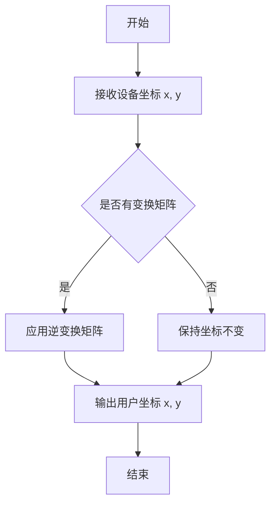

#### 带注释源码

由于 `inverse_transform_xy` 方法是在基类 `ctrl` 中定义的，而当前提供的代码片段仅包含了派生类 `slider_ctrl_impl` 的实现，未包含基类 `ctrl` 的定义，因此无法直接提取该方法的完整源码。该方法在 `slider_ctrl_impl` 类中被以下方法调用：

1. `in_rect` 方法：用于检测给定坐标是否在控件矩形内
2. `on_mouse_button_down` 方法：用于处理鼠标按下事件，将设备坐标转换为用户坐标
3. `on_mouse_move` 方法：用于处理鼠标移动事件，将设备坐标转换为用户坐标

以下是在 `slider_ctrl_impl` 类中调用该方法的上下文代码：

```cpp
// 在 in_rect 方法中调用
bool slider_ctrl_impl::in_rect(double x, double y) const
{
    inverse_transform_xy(&x, &y);  // 将设备坐标逆变换为用户坐标
    return x >= m_x1 && x <= m_x2 && y >= m_y1 && y <= m_y2;
}

// 在 on_mouse_button_down 方法中调用
bool slider_ctrl_impl::on_mouse_button_down(double x, double y)
{
    inverse_transform_xy(&x, &y);  // 将设备坐标逆变换为用户坐标
    
    double xp = m_xs1 + (m_xs2 - m_xs1) * m_value;
    double yp = (m_ys1 + m_ys2) / 2.0;

    if(calc_distance(x, y, xp, yp) <= m_y2 - m_y1)
    {
        m_pdx = xp - x;
        m_mouse_move = true;
        return true;
    }
    return false;
}

// 在 on_mouse_move 方法中调用
bool slider_ctrl_impl::on_mouse_move(double x, double y, bool button_flag)
{
    inverse_transform_xy(&x, &y);  // 将设备坐标逆变换为用户坐标
    if(!button_flag)
    {
        on_mouse_button_up(x, y);
        return false;
    }

    if(m_mouse_move)
    {
        double xp = x + m_pdx;
        m_preview_value = (xp - m_xs1) / (m_xs2 - m_xs1);
        if(m_preview_value < 0.0) m_preview_value = 0.0;
        if(m_preview_value > 1.0) m_preview_value = 1.0;
        return true;
    }
    return false;
}
```


### `slider_ctrl_impl.slider_ctrl_impl`

描述：slider_ctrl_impl 类的构造函数，用于初始化滑动条控件的坐标、翻转标志以及所有成员变量的默认值，并计算内部绘制区域。

参数：

- `x1`：`double`，滑动条左上角的 X 坐标  
- `y1`：`double`，滑动条左上角的 Y 坐标  
- `x2`：`double`，滑动条右下角的 X 坐标  
- `y2`：`double`，滑动条右下角的 Y 坐标  
- `flip_y`：`bool`，是否在 Y 方向上翻转坐标  

返回值：`void`（构造函数无返回值）

#### 流程图

```mermaid
flowchart TD
    A[开始 slider_ctrl_impl 构造] --> B[调用基类 ctrl 构造]
    B --> C[成员初始化列表: m_border_width, m_border_extra, m_text_thickness, m_pdx, m_mouse_move, m_value, m_preview_value, m_min, m_max, m_num_steps, m_descending, m_text_poly]
    C --> D[函数体: m_label[0] = 0]
    D --> E[调用 calc_box 计算内部框]
    E --> F[结束构造]
```

#### 带注释源码

```cpp
// slider_ctrl_impl 构造函数实现
// 参数: x1, y1, x2, y2 表示滑动条外框的左上/右下坐标
//       flip_y 表示是否在 Y 方向上翻转坐标
slider_ctrl_impl::slider_ctrl_impl(double x1, double y1, 
                                   double x2, double y2, bool flip_y) :
    // 调用基类 ctrl 的构造函数完成基类成员的初始化
    ctrl(x1, y1, x2, y2, flip_y),
    // 以下为成员初始化列表，为成员变量设定默认值
    m_border_width(1.0),          // 边框宽度
    m_border_extra((y2 - y1) / 2),// 边框外部扩展量，设为高度的一半
    m_text_thickness(1.0),        // 文字线条粗细
    m_pdx(0.0),                   // 鼠标拖动时的偏移量
    m_mouse_move(false),         // 标记鼠标是否在拖动
    m_value(0.5),                 // 当前滑块值（0~1）
    m_preview_value(0.5),        // 预览值，拖动时实时更新
    m_min(0.0),                   // 最小值
    m_max(1.0),                   // 最大值
    m_num_steps(0),               // 步进数（0 表示连续）
    m_descending(false),         // 是否反向绘制
    m_text_poly(m_text)           // 文本多边形对象
{
    // 初始化标签字符串为空
    m_label[0] = 0;
    // 计算内部绘制区域的边界框
    calc_box();
}
```


### `slider_ctrl_impl.calc_box`

该方法用于计算滑块控件的内部边界框，通过将外部边界坐标根据边框宽度向内收缩，得到滑块有效绘图区域的坐标。

参数：无

返回值：`void`，无返回值

#### 流程图

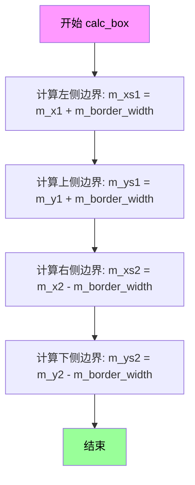

#### 带注释源码

```cpp
//------------------------------------------------------------------------
// 计算滑块控件的内部边界框
// 根据外边界坐标和边框宽度，计算出滑块滑动的有效区域坐标
//------------------------------------------------------------------------
void slider_ctrl_impl::calc_box()
{
    // 计算内部矩形左侧边界：外边界x1加上边框宽度
    m_xs1 = m_x1 + m_border_width;
    
    // 计算内部矩形上侧边界：外边界y1加上边框宽度
    m_ys1 = m_y1 + m_border_width;
    
    // 计算内部矩形右侧边界：外边界x2减去边框宽度
    m_xs2 = m_x2 - m_border_width;
    
    // 计算内部矩形下侧边界：外边界y2减去边框宽度
    m_ys2 = m_y2 - m_border_width;
}
```

---

### 相关类字段信息

| 字段名 | 类型 | 描述 |
|--------|------|------|
| `m_x1`, `m_y1` | `double` | 控件外边界左上角坐标（继承自父类ctrl） |
| `m_x2`, `m_y2` | `double` | 控件外边界右下角坐标（继承自父类ctrl） |
| `m_border_width` | `double` | 边框宽度，决定内部边界收缩量 |
| `m_xs1`, `m_ys1` | `double` | 计算得出的内部边界左上角坐标 |
| `m_xs2`, `m_ys2` | `double` | 计算得出的内部边界右下角坐标 |


### `slider_ctrl_impl.normalize_value`

该函数用于将滑块的预览值规范化到有效的步进值（如果设置了步数），并根据参数决定是否同步预览值，最后返回值是否发生变化的标志。

参数：

- `preview_value_flag`：`bool`，标志位，表示是否将规范化后的值同步回预览值（m_preview_value）

返回值：`bool`，返回 true 表示滑块的值（m_value）发生了变化，返回 false 表示值未改变

#### 流程图

```mermaid
flowchart TD
    A[开始 normalize_value] --> B{检查 m_num_steps > 0?}
    B -->|是| C[计算 step = int(m_preview_value * m_num_steps + 0.5)]
    C --> D[ret = m_value != step / m_num_steps]
    D --> E[m_value = step / m_num_steps]
    B -->|否| F[m_value = m_preview_value]
    E --> G{preview_value_flag?}
    F --> G
    G -->|是| H[m_preview_value = m_value]
    G -->|否| I[跳过]
    H --> J[返回 ret]
    I --> J
```

#### 带注释源码

```cpp
//------------------------------------------------------------------------
// normalize_value: 规范化滑块值
// 参数: preview_value_flag - 是否将规范化后的值同步到预览值
// 返回: bool - 值是否发生变化
//------------------------------------------------------------------------
bool slider_ctrl_impl::normalize_value(bool preview_value_flag)
{
    bool ret = true;  // 默认假设值发生变化
    
    // 如果设置了步数（m_num_steps > 0），则将预览值离散化到步进值
    if(m_num_steps)
    {
        // 计算当前预览值对应的步数（四舍五入）
        int step = int(m_preview_value * m_num_steps + 0.5);
        
        // 判断规范化后的值与当前值是否不同
        ret = m_value != step / double(m_num_steps);
        
        // 将值规范化到步进单位
        m_value = step / double(m_num_steps);
    }
    else
    {
        // 未设置步数时，直接使用预览值
        m_value = m_preview_value;
    }

    // 如果需要同步预览值
    if(preview_value_flag)
    {
        // 将预览值更新为规范化后的值
        m_preview_value = m_value;
    }
    
    // 返回值是否发生变化
    return ret;
}
```


### `slider_ctrl_impl.border_width`

设置滑块控件的边框宽度和额外的边框扩展值，并重新计算内部盒子的坐标位置。

参数：

- `t`：`double`，表示边框宽度
- `extra`：`double`，表示额外的边框扩展值（通常用于扩大边框的可点击区域）

返回值：`void`，无返回值

#### 流程图

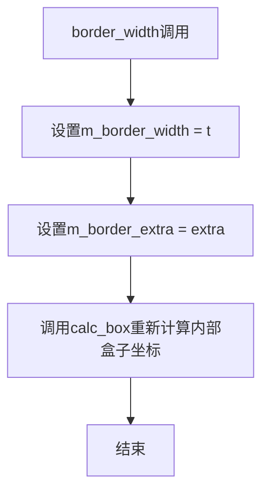

#### 带注释源码

```cpp
//------------------------------------------------------------------------
// 设置滑块控件的边框宽度和额外扩展值
// 参数:
//   t     - 边框宽度值
//   extra - 额外的边框扩展值，用于扩大边框区域
//------------------------------------------------------------------------
void slider_ctrl_impl::border_width(double t, double extra)
{ 
    // 设置边框宽度成员变量
    m_border_width = t; 
    
    // 设置额外的边框扩展值
    m_border_extra = extra;
    
    // 重新计算内部盒子的坐标边界
    // 这会基于新的边框宽度调整滑块的可用区域
    calc_box(); 
}
```


### `slider_ctrl_impl::value`

该方法用于设置滑块控件的值。它接收一个实际值，将其归一化到[0,1]范围（基于最小值和最大值），然后调用`normalize_value`方法将预览值应用到实际值。

参数：

- `value`：`double`，要设置的滑块值

返回值：`void`，无返回值

#### 流程图

```mermaid
flowchart TD
    A[开始 value 方法] --> B[计算归一化值<br/>m_preview_value = (value - m_min) / (m_max - m_min)]
    B --> C{preview_value > 1.0?}
    C -->|是| D[m_preview_value = 1.0]
    C -->|否| E{preview_value < 0.0?}
    D --> E
    E -->|是| F[m_preview_value = 0.0]
    E -->|否| G[调用 normalize_value(true)]
    F --> G
    G --> H[结束]
```

#### 带注释源码

```cpp
//------------------------------------------------------------------------
// 设置滑块的值为指定值
// 参数: value - 要设置的滑块值（基于m_min和m_max的实际值）
//------------------------------------------------------------------------
void slider_ctrl_impl::value(double value) 
{ 
    // 将输入值归一化到[0,1]范围
    // 公式: (value - min) / (max - min)
    m_preview_value = (value - m_min) / (m_max - m_min); 
    
    // 如果归一化值超过1.0，则限制为1.0
    if(m_preview_value > 1.0) m_preview_value = 1.0;
    
    // 如果归一化值小于0.0，则限制为0.0
    if(m_preview_value < 0.0) m_preview_value = 0.0;
    
    // 调用normalize_value将预览值应用到实际值
    // 参数true表示同时更新预览值
    normalize_value(true);
}
```


### `slider_ctrl_impl::label`

设置滑块控件的显示标签文本，将传入的格式化字符串复制到内部标签缓冲区中，最多支持63个字符。

参数：

- `fmt`：`const char*`，格式化字符串指针，用于设置滑块控件显示的标签文本

返回值：`void`，无返回值

#### 流程图

```mermaid
flowchart TD
    A[开始] --> B[将m_label[0]设为空字符]
    B --> C{检查fmt是否为空}
    C -->|否| D[获取字符串长度len]
    C -->|是| H[结束]
    D --> E{len是否大于63}
    E -->|是| F[将len截断为63]
    E -->|否| G[使用memcpy复制字符串]
    F --> G
    G --> I[设置m_label[len]为null终止符]
    I --> H
```

#### 带注释源码

```cpp
//------------------------------------------------------------------------
// 设置滑块控件的标签文本
//------------------------------------------------------------------------
void slider_ctrl_impl::label(const char* fmt)
{
    // 首先将标签缓冲区初始化为空字符串
    m_label[0] = 0;
    
    // 检查传入的格式化字符串是否有效
    if(fmt)
    {
        // 获取字符串长度
        unsigned len = strlen(fmt);
        
        // 限制最大长度为63个字符，避免缓冲区溢出
        if(len > 63) len = 63;
        
        // 将字符串复制到成员变量m_label中
        memcpy(m_label, fmt, len);
        
        // 添加null终止符，确保字符串正确结束
        m_label[len] = 0;
    }
}
```


### `slider_ctrl_impl::rewind`

该方法用于重置滑块控件的路径生成器，根据传入的索引准备不同的绘图元素（背景、三角形、文本、指针预览、指针、刻度线等），为后续的顶点生成做准备。

参数：

-  `idx`：`unsigned`，路径索引，指定需要准备哪种绘图元素（0-背景，1-三角形，2-文本，3-指针预览，4-指针，5-刻度线）

返回值：`void`，无返回值

#### 流程图

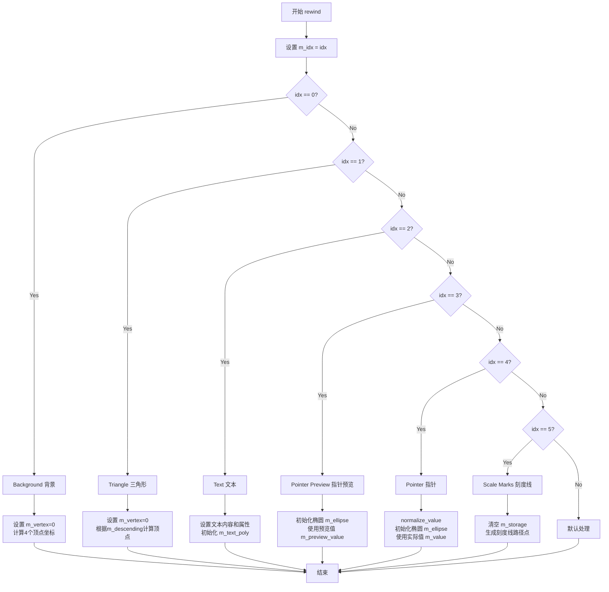

#### 带注释源码

```cpp
//------------------------------------------------------------------------
// 重置路径生成器，根据索引准备不同的绘图元素
//------------------------------------------------------------------------
void slider_ctrl_impl::rewind(unsigned idx)
{
    // 保存当前索引
    m_idx = idx;

    // 根据索引准备不同的绘图元素
    switch(idx)
    {
    default:

    case 0:                 // 背景 (Background)
        // 重置顶点计数器
        m_vertex = 0;
        // 计算带边框扩展的背景矩形顶点
        m_vx[0] = m_x1 - m_border_extra; 
        m_vy[0] = m_y1 - m_border_extra;
        m_vx[1] = m_x2 + m_border_extra; 
        m_vy[1] = m_y1 - m_border_extra;
        m_vx[2] = m_x2 + m_border_extra; 
        m_vy[2] = m_y2 + m_border_extra;
        m_vx[3] = m_x1 - m_border_extra; 
        m_vy[3] = m_y2 + m_border_extra;
        break;

    case 1:                 // 三角形 (Triangle)
        // 重置顶点计数器
        m_vertex = 0;
        // 根据方向决定三角形顶点
        if(m_descending)
        {
            // 下降方向的三角形
            m_vx[0] = m_x1; 
            m_vy[0] = m_y1;
            m_vx[1] = m_x2; 
            m_vy[1] = m_y1;
            m_vx[2] = m_x1; 
            m_vy[2] = m_y2;
            m_vx[3] = m_x1; 
            m_vy[3] = m_y1;
        }
        else
        {
            // 上升方向的三角形
            m_vx[0] = m_x1; 
            m_vy[0] = m_y1;
            m_vx[1] = m_x2; 
            m_vy[1] = m_y1;
            m_vx[2] = m_x2; 
            m_vy[2] = m_y2;
            m_vx[3] = m_x1; 
            m_vy[3] = m_y1;
        }
        break;

    case 2:                 // 文本 (Text)
        // 设置标签文本
        m_text.text(m_label);
        // 如果有格式化字符串，格式化数值
        if(m_label[0])
        {
            char buf[256];
            // 使用当前值格式化标签
            sprintf(buf, m_label, value());
            m_text.text(buf);
        }
        // 设置文本起始位置
        m_text.start_point(m_x1, m_y1);
        // 设置文本大小
        m_text.size((m_y2 - m_y1) * 1.2, m_y2 - m_y1);
        // 设置文本多边形属性
        m_text_poly.width(m_text_thickness);
        m_text_poly.line_join(round_join);
        m_text_poly.line_cap(round_cap);
        // 重置文本多边形路径
        m_text_poly.rewind(0);
        break;

    case 3:                 // 指针预览 (pointer preview)
        // 使用预览值初始化椭圆
        m_ellipse.init(m_xs1 + (m_xs2 - m_xs1) * m_preview_value,
                       (m_ys1 + m_ys2) / 2.0,
                       m_y2 - m_y1,
                       m_y2 - m_y1, 
                       32);
        break;


    case 4:                 // 指针 (pointer)
        // 规范化当前值
        normalize_value(false);
        // 使用实际值初始化椭圆
        m_ellipse.init(m_xs1 + (m_xs2 - m_xs1) * m_value,
                       (m_ys1 + m_ys2) / 2.0,
                       m_y2 - m_y1,
                       m_y2 - m_y1, 
                       32);
        // 重置椭圆路径
        m_ellipse.rewind(0);
        break;

    case 5:                 // 刻度线 (Scale marks)
        // 清空存储
        m_storage.remove_all();
        // 如果有步数设置，生成刻度线
        if(m_num_steps)
        {
            unsigned i;
            // 计算步长
            double d = (m_xs2 - m_xs1) / m_num_steps;
            // 限制最大步长
            if(d > 0.004) d = 0.004;
            // 为每个刻度生成三角形标记
            for(i = 0; i < m_num_steps + 1; i++)
            {
                double x = m_xs1 + (m_xs2 - m_xs1) * i / m_num_steps;
                m_storage.move_to(x, m_y1);
                m_storage.line_to(x - d * (m_x2 - m_x1), m_y1 - m_border_extra);
                m_storage.line_to(x + d * (m_x2 - m_x1), m_y1 - m_border_extra);
            }
        }
    }
}
```


### `slider_ctrl_impl.vertex`

该方法是滑块控件的顶点生成器，根据当前渲染阶段索引（m_idx）返回对应的顶点数据，用于构成滑块控件的视觉元素（背景、指针、刻度线等）。

参数：

- `x`：`double*`，指向用于接收顶点 X 坐标的指针
- `y`：`double*`，指向用于接收顶点 Y 坐标的指针

返回值：`unsigned`，返回路径命令类型（如 `path_cmd_move_to`、`path_cmd_line_to`、`path_cmd_stop` 等）

#### 流程图

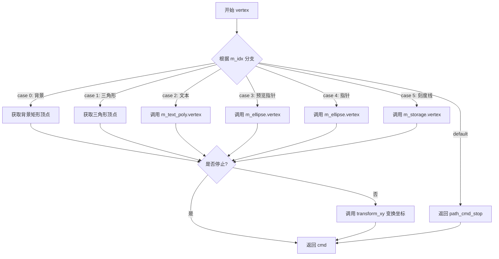

#### 带注释源码

```cpp
//------------------------------------------------------------------------
// 生成滑块控件的顶点数据
// 该方法是一个迭代器，每次调用返回下一个顶点坐标
//------------------------------------------------------------------------
unsigned slider_ctrl_impl::vertex(double* x, double* y)
{
    // 初始命令为 line_to，除非后续逻辑改变
    unsigned cmd = path_cmd_line_to;
    
    // 根据当前渲染阶段索引（m_idx）处理不同的图形元素
    switch(m_idx)
    {
    case 0:                 // 背景矩形
        // 第一个顶点使用 move_to 命令
        if(m_vertex == 0) cmd = path_cmd_move_to;
        // 超过4个顶点则停止
        if(m_vertex >= 4) cmd = path_cmd_stop;
        // 获取预计算的背景顶点坐标
        *x = m_vx[m_vertex];
        *y = m_vy[m_vertex];
        m_vertex++;         // 移动到下一个顶点
        break;

    case 1:                 // 三角形（滑块方向指示器）
        if(m_vertex == 0) cmd = path_cmd_move_to;
        if(m_vertex >= 4) cmd = path_cmd_stop;
        *x = m_vx[m_vertex];
        *y = m_vy[m_vertex];
        m_vertex++;
        break;

    case 2:                 // 文本标签
        // 委托给文本多边形生成器
        cmd = m_text_poly.vertex(x, y);
        break;

    case 3:                 // 预览指针（在拖动过程中显示）
    case 4:                 // 正式指针（确定位置）
        // 委托给椭圆生成器（指针为椭圆形）
        cmd = m_ellipse.vertex(x, y);
        break;

    case 5:                 // 刻度线
        // 委托给存储的路径生成器
        cmd = m_storage.vertex(x, y);
        break;

    default:                // 无效索引
        cmd = path_cmd_stop;
        break;
    }

    // 如果不是停止命令，则对坐标进行变换（可能包含旋转、缩放等）
    if(!is_stop(cmd))
    {
        transform_xy(x, y);
    }

    // 返回当前顶点的路径命令类型
    return cmd;
}
```


### `slider_ctrl_impl::in_rect`

该函数用于检测给定点坐标是否位于滑块控件的矩形边界框内。首先对输入坐标进行逆变换以处理坐标系的翻转，然后判断坐标是否在控件的左上角和右下角形成的矩形范围内。

参数：

- `x`：`double`，待检测点的X坐标（屏幕坐标）
- `y`：`double`，待检测点的Y坐标（屏幕坐标）

返回值：`bool`，如果点位于矩形内部（包括边界）返回`true`，否则返回`false`

#### 流程图

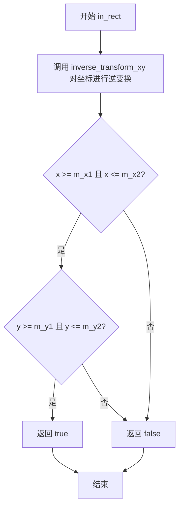

#### 带注释源码

```cpp
//------------------------------------------------------------------------
// 检测点是否在滑块控件的矩形区域内
// 参数：
//   x - 输入的屏幕X坐标
//   y - 输入的屏幕Y坐标
// 返回值：
//   true 如果点(x, y)在矩形[m_x1, m_y1]到[m_x2, m_y2]范围内
//   false 否则
//------------------------------------------------------------------------
bool slider_ctrl_impl::in_rect(double x, double y) const
{
    // 对坐标进行逆变换，处理可能存在的坐标系翻转（flip_y）
    inverse_transform_xy(&x, &y);
    
    // 检查点是否在X轴范围内
    // 检查点是否在Y轴范围内
    // 只有两个条件都满足时才返回true
    return x >= m_x1 && x <= m_x2 && y >= m_y1 && y <= m_y2;
}
```


### `slider_ctrl_impl.on_mouse_button_down`

该方法处理滑块控件的鼠标按下事件，用于检测用户是否点击了滑块上的滑柄（指针），如果点击命中则进入拖拽状态并记录鼠标与滑柄中心的偏移量。

参数：

-  `x`：`double`，鼠标按下时的X坐标（屏幕坐标）
-  `y`：`double`，鼠标按下时的Y坐标（屏幕坐标）

返回值：`bool`，如果鼠标点击位置在滑块指针的命中范围内返回 true，否则返回 false

#### 流程图

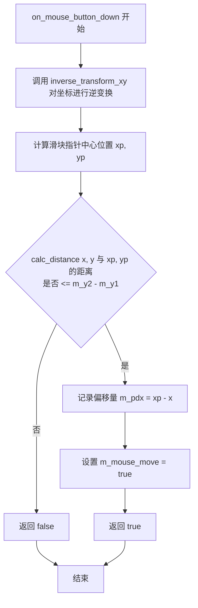

#### 带注释源码

```cpp
//------------------------------------------------------------------------
// 处理滑块控件的鼠标按下事件
// 参数 x, y: 鼠标按下时的屏幕坐标
// 返回值: bool, 是否成功捕获鼠标事件
//------------------------------------------------------------------------
bool slider_ctrl_impl::on_mouse_button_down(double x, double y)
{
    // 1. 将屏幕坐标逆变换为滑块控件的本地坐标
    //    (处理可能的坐标系翻转、缩放等变换)
    inverse_transform_xy(&x, &y);

    // 2. 计算滑块指针(滑柄)的中心点坐标
    //    xp: 指针X坐标 = 左边框 + (有效宽度 * 当前值)
    //    yp: 指针Y坐标 = 上下边框的中心线
    double xp = m_xs1 + (m_xs2 - m_xs1) * m_value;
    double yp = (m_ys1 + m_ys2) / 2.0;

    // 3. 检测鼠标点击位置是否在滑块指针的命中范围内
    //    使用 calc_distance 计算鼠标位置到指针中心的欧氏距离
    //    命中半径为滑块的高度 (m_y2 - m_y1)
    if(calc_distance(x, y, xp, yp) <= m_y2 - m_y1)
    {
        // 4. 命中成功，记录鼠标X坐标与指针中心的偏移量
        //    这个偏移量在拖拽过程中用于保持相对位置
        m_pdx = xp - x;
        
        // 5. 设置鼠标移动标志，表示已进入拖拽状态
        //    该标志在 on_mouse_move 中会被检查
        m_mouse_move = true;
        
        // 6. 返回 true 表示成功捕获鼠标事件
        return true;
    }
    
    // 7. 点击位置不在指针范围内，返回 false
    return false;
}
```


### `slider_ctrl_impl.on_mouse_move`

处理鼠标移动事件，当鼠标在滑块控件上移动时更新预览值。

参数：

- `x`：`double`，鼠标的 X 坐标（屏幕坐标）
- `y`：`double`，鼠标的 Y 坐标（屏幕坐标）
- `button_flag`：`bool`，鼠标按钮是否按下（true 表示按下，false 表示未按下）

返回值：`bool`，如果成功处理了鼠标移动事件返回 true，否则返回 false

#### 流程图

```mermaid
flowchart TD
    A[开始 on_mouse_move] --> B[inverse_transform_xy: 将坐标逆变换到控件本地坐标系]
    B --> C{button_flag == false?}
    C -->|Yes| D[on_mouse_button_up: 处理鼠标释放]
    D --> E[return false]
    C -->|No| F{m_mouse_move == true?}
    F -->|Yes| G[xp = x + m_pdx: 计算滑块位置]
    G --> H[m_preview_value = (xp - m_xs1) / (m_xs2 - m_xs1): 计算预览值]
    H --> I{m_preview_value < 0.0?}
    I -->|Yes| J[m_preview_value = 0.0: 钳制到最小值]
    I -->|No| K{m_preview_value > 1.0?}
    J --> K
    K -->|Yes| L[m_preview_value = 1.0: 钳制到最大值]
    K -->|No| M[return true: 处理成功]
    L --> M
    F -->|No| N[return false: 未在拖动状态]
```

#### 带注释源码

```cpp
//------------------------------------------------------------------------
// 处理鼠标移动事件
// 参数:
//   x - 鼠标的X坐标（屏幕坐标）
//   y - 鼠标的Y坐标（屏幕坐标）
//   button_flag - 鼠标按钮是否按下（true=按下，false=未按下）
// 返回值:
//   bool - 成功处理返回true，否则返回false
//------------------------------------------------------------------------
bool slider_ctrl_impl::on_mouse_move(double x, double y, bool button_flag)
{
    // 将屏幕坐标逆变换到控件的本地坐标系
    inverse_transform_xy(&x, &y);
    
    // 如果鼠标按钮未按下（button_flag为false）
    if(!button_flag)
    {
        // 调用鼠标释放处理函数
        on_mouse_button_up(x, y);
        // 返回false，表示未处理
        return false;
    }

    // 检查是否处于拖动状态（鼠标按钮已按下且之前点击了在滑块区域内）
    if(m_mouse_move)
    {
        // 计算滑块的当前位置：x + pdx（pdx是点击时保存的偏移量）
        double xp = x + m_pdx;
        
        // 计算预览值：将滑块位置映射到[0, 1]范围
        // (xp - m_xs1) / (m_xs2 - m_xs1)
        m_preview_value = (xp - m_xs1) / (m_xs2 - m_xs1);
        
        // 钳制预览值到有效范围 [0, 1]
        if(m_preview_value < 0.0) m_preview_value = 0.0;
        if(m_preview_value > 1.0) m_preview_value = 1.0;
        
        // 返回true，表示成功处理了拖动事件
        return true;
    }
    
    // 未处于拖动状态，返回false
    return false;
}
```


### `slider_ctrl_impl.on_mouse_button_up`

处理鼠标释放事件，当用户释放鼠标按钮时调用，用于结束滑块的拖动操作。

参数：

-  （第一个参数）：`double`，鼠标释放时的 X 坐标（参数名省略）
-  （第二个参数）：`double`，鼠标释放时的 Y 坐标（参数名省略）

返回值：`bool`，返回 `true` 表示事件已被处理

#### 流程图

```mermaid
flowchart TD
    A[开始 on_mouse_button_up] --> B[设置 m_mouse_move = false]
    B --> C[调用 normalize_value(true)]
    C --> D[返回 true]
    D --> E[结束]
```

#### 带注释源码

```
//------------------------------------------------------------------------
// 处理鼠标释放事件
// 参数:
//   (省略) - double: 鼠标 X 坐标（未使用）
//   (省略) - double: 鼠标 Y 坐标（未使用）
// 返回值:
//   bool - 始终返回 true，表示事件已处理
//------------------------------------------------------------------------
bool slider_ctrl_impl::on_mouse_button_up(double, double)
{
    // 1. 停止鼠标移动状态
    m_mouse_move = false;
    
    // 2. 规范化当前值（将预览值正式确认为最终值）
    //    参数 true 表示同时更新 m_preview_value
    normalize_value(true);
    
    // 3. 返回 true 表示事件已被处理
    return true;
}
```


### `slider_ctrl_impl::on_arrow_keys`

该函数处理滑块控件的方向键输入事件，根据左、右、上、下方向键调整滑块的预览值，并在值发生变化时返回 true。

参数：

- `left`：`bool`，表示是否按下了左方向键
- `right`：`bool`，表示是否按下了右方向键
- `down`：`bool`，表示是否按下了下方向键
- `up`：`bool`，表示是否按下了上方向键

返回值：`bool`，如果处理了方向键事件（值发生变化）返回 true，否则返回 false

#### 流程图

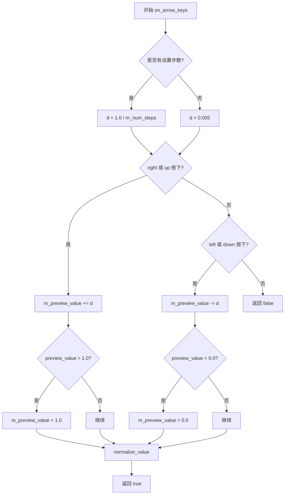

#### 带注释源码

```cpp
//------------------------------------------------------------------------
// 处理滑块控件的方向键输入
// 参数说明：
//   left  - 按下左方向键
//   right - 按下右方向键
//   down  - 按下下方向键
//   up    - 按下上方向键
// 返回值：
//   true  - 已处理方向键事件（值已改变）
//   false - 未处理任何方向键事件
//------------------------------------------------------------------------
bool slider_ctrl_impl::on_arrow_keys(bool left, bool right, bool down, bool up)
{
    // 初始化步长增量，默认值为 0.005
    double d = 0.005;
    
    // 如果设置了步数（m_num_steps > 0），则根据步数计算增量
    // 这样可以确保每次按键正好跳过一个步长
    if(m_num_steps)
    {
        d = 1.0 / m_num_steps;
    }
    
    // 处理向右或向上的按键（增加滑块值）
    if(right || up)
    {
        // 预览值增加增量
        m_preview_value += d;
        
        // 限制预览值不超过最大值 1.0
        if(m_preview_value > 1.0) m_preview_value = 1.0;
        
        // 规范化值并更新预览值
        normalize_value(true);
        
        // 返回 true 表示已处理事件
        return true;
    }

    // 处理向左或向下的按键（减少滑块值）
    if(left || down)
    {
        // 预览值减少增量
        m_preview_value -= d;
        
        // 限制预览值不小于最小值 0.0
        if(m_preview_value < 0.0) m_preview_value = 0.0;
        
        // 规范化值并更新预览值
        normalize_value(true);
        
        // 返回 true 表示已处理事件
        return true;
    }
    
    // 没有按下任何方向键，返回 false
    return false;
}
```

## 关键组件


### slider_ctrl_impl 类

滑块控件的核心实现类，封装了滑块的逻辑、渲染和事件处理，包含数值管理、边界计算、鼠标和键盘交互、以及图形渲染所需的所有字段和方法。

### 渲染引擎

通过 `rewind` 和 `vertex` 方法实现惰性渲染，根据索引（idx）生成不同的图形元素：背景矩形、三角形指针、文本标签、椭圆指针和刻度线，并支持坐标变换。

### 事件处理模块

处理用户交互事件，包括鼠标按下（`on_mouse_button_down`）、移动（`on_mouse_move`）、释放（`on_mouse_button_up`）以及键盘方向键（`on_arrow_keys`），实现滑块值的实时更新和预览。

### 值管理模块

管理滑块的当前值（m_value）、预览值（m_preview_value）、最小值（m_min）、最大值（m_max）和步数（m_num_steps），通过 `value` 和 `normalize_value` 方法确保值在合法范围内并支持离散步进。

### 图形组件

滑块的视觉元素包括：背景边框（case 0）、三角形滑块（case 1）、文本标签（case 2）、预览椭圆指针（case 3）、实际椭圆指针（case 4）和刻度标记（case 5），通过 `m_ellipse`、`m_text_poly`、`m_storage` 等对象绘制。

## 问题及建议


### 已知问题

- **硬编码的缓冲区大小**：`m_label[64]` 使用固定大小数组，标签长度限制为63字符，缺乏灵活性；`char buf[256]` 在 `sprintf` 中同样使用硬编码缓冲区
- **Magic Numbers 缺乏解释**：代码中多处使用魔数如 `0.004`、`32`、`1.2`、`0.005`、`63`，没有任何常量定义或注释说明其含义
- **潜在缓冲区溢出风险**：使用 `sprintf` 而非 `snprintf`，虽然有256字节缓冲区但仍存在安全隐患
- **精度处理方式不够严谨**：`int(m_preview_value * m_num_steps + 0.5)` 使用加0.5的方式进行四舍五入，可能在边界情况下产生精度问题
- **布尔返回值语义不明确**：`normalize_value` 返回 bool，但其语义（是否需要更新）在调用处并未被充分利用
- **状态管理复杂性**：`m_preview_value` 和 `m_value` 两个变量的交互逻辑复杂，容易产生状态同步问题
- **代码重复**：鼠标事件处理中距离计算逻辑在 `on_mouse_button_down` 和 `on_mouse_move` 中重复出现
- **命名不一致**：`m_pdx` 变量名不直观，`button_flag` 参数命名缺乏描述性
- **参数验证缺失**：`value()` 方法未验证输入的 `value` 是否在 `[m_min, m_max]` 范围内

### 优化建议

- 将 Magic Numbers 提取为命名常量或配置参数，如 `m_min_step_d`、`m_ellipse_num_segments`、`m_text_size_multiplier` 等
- 使用 `snprintf` 替代 `sprintf`，或使用更安全的字符串处理方式
- 将缓冲区大小定义为宏或常量，便于统一调整
- 考虑使用 `std::round` 或显式的舍入函数替代加0.5的方式
- 重构 `normalize_value` 函数，明确其返回值含义或在不需要时返回 void
- 提取公共的距离计算逻辑为私有方法 `calc_pointer_distance`
- 增强参数校验，在 `value()` 方法中添加范围验证
- 考虑使用 `std::string` 替代固定大小字符数组，避免缓冲区溢出风险
- 添加 `m_min` 和 `m_max` 的 setter/getter 方法的参数范围校验


## 其它


### 设计目标与约束

设计目标：实现一个功能完整的GUI滑块控件，支持鼠标拖拽和键盘方向键控制，提供数值选择功能，支持预览值和实际值的分离，支持步进模式，支持垂直/水平方向显示。

约束条件：
- 依赖 agg 命名空间下的基类 ctrl
- 依赖 agg::ellipse、agg::text、agg::pod_bvector 等渲染和存储类
- 数值范围必须归一化到 [0.0, 1.0] 区间
- 标签文本长度限制在 63 个字符以内
- 步进模式下数值按离散步长离散化

### 错误处理与异常设计

边界检查：
- value() 方法中，当 value 超出 [m_min, m_max] 范围时，自动 clamping 到边界值
- on_mouse_move() 中，m_preview_value 被限制在 [0.0, 1.0] 范围内
- on_arrow_keys() 中同样对加减后的值进行边界限制

返回值设计：
- normalize_value() 返回 bool 值，指示值是否发生变化
- in_rect() 返回 bool，指示点是否在控件矩形区域内
- on_mouse_button_down/on_mouse_move/on_mouse_button_up 返回操作是否被处理

### 数据流与状态机

控件状态：
- m_value：当前确认的滑块值
- m_preview_value：当前拖动过程中的预览值
- m_mouse_move：标记是否处于鼠标拖动状态

交互流程：
1. 用户点击滑块区域 → on_mouse_button_down 检测点击是否在指针范围内若是则进入拖动模式
2. 鼠标拖动 → on_mouse_move 更新 preview_value
3. 鼠标释放 → on_mouse_button_up 调用 normalize_value 确认最终值
4. 键盘操作 → on_arrow_keys 直接修改 preview_value 并确认

### 外部依赖与接口契约

核心依赖：
- agg::ctrl：基类，提供变换矩阵、坐标转换等基础功能
- agg::ellipse：用于渲染滑块指针的椭圆形
- agg::text：用于渲染标签文本
- agg::pod_bvector：用于存储步进刻度线的顶点数据
- 标准库：string.h, stdio.h

接口约定：
- rewind(idx)/vertex(x,y)：遵循 agg 的渲染接口模式
- on_mouse_* 系列方法：遵循 agg 控件的事件处理接口
- in_rect：用于命中测试

### 性能优化考虑

渲染优化：
- 使用 m_idx 和 m_vertex 状态机避免重复计算
- 步进刻度线使用 m_storage 一次性生成并存储
- 文本对象 m_text_poly 复用减少重新创建开销

内存优化：
- 标签缓冲区固定为 64 字节
- 顶点数组 vx/vy 使用固定大小数组而非动态分配

### 可扩展性分析

扩展能力：
- 支持自定义边框宽度和额外边距 (border_width)
- 支持自定义文本格式和标签 (label)
- 支持步进模式和步数设置
- 支持反向显示模式 (m_descending)
- 继承自 ctrl 支持坐标变换

潜在扩展：
- 可添加更多样式选项（如颜色、渐变）
- 可添加数值显示格式自定义
- 可添加自动repeat的键盘支持

### 测试策略建议

单元测试：
- 边界值测试：value 设置极值时的行为
- 步进测试：m_num_steps 不同时的离散化行为
- 鼠标交互测试：各种点击位置的命中测试
- 键盘交互测试：方向键操作的边界行为

集成测试：
- 与渲染管线的集成测试
- 与其他控件的组合测试

### 关键组件信息

| 组件名称 | 一句话描述 |
|---------|-----------|
| slider_ctrl_impl | 滑块控件的核心实现类，处理渲染和交互 |
| ellipse | 用于绘制滑块指针的椭圆几何对象 |
| text | 文本渲染对象，用于绘制标签 |
| m_storage | 存储步进刻度线的顶点数据 |
| m_text_poly | 文本路径的多边形生成器 |

### 技术债务与优化空间

1. 硬编码数值：部分数值如 0.004 (步进刻度线长度)、1.2 (文本大小系数)、32 (椭圆细分) 硬编码，建议提取为常量或配置参数

2. 标签长度限制：63 字符限制使用 memcpy 实现，存在缓冲区溢出风险（虽然有 len 检查）

3. 文本格式化：使用 sprintf 而非更安全的 snprintf

4. 重复计算：m_xs1 + (m_xs2 - m_xs1) * m_value 在多处重复计算，可提取为方法

5. 缺少文档注释：公共接口缺少详细的功能和参数说明

6. 没有暴露 slider_ctrl 类：代码只实现了 slider_ctrl_impl，具体 slider_ctrl 类的声明应在头文件中


    