# `matplotlib\extern\agg24-svn\src\ctrl\agg_spline_ctrl.cpp` 详细设计文档

这是Anti-Grain Geometry库中的样条曲线控制器实现，提供交互式编辑样条曲线的功能，支持鼠标拖拽控制点、键盘方向键调整、曲线渲染等操作，常用于图形界面中的曲线编辑控件。

## 整体流程

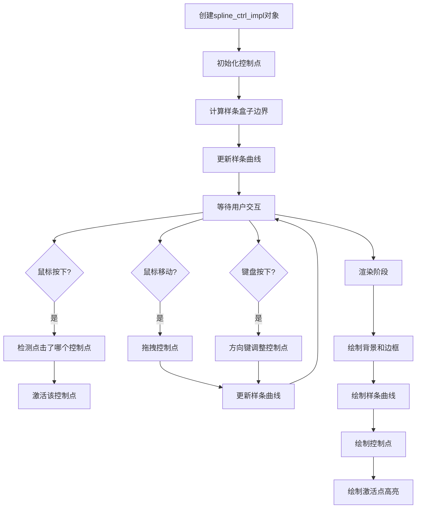

## 类结构

```
ctrl (基类)
└── spline_ctrl_impl (样条控制器实现类)
```

## 全局变量及字段


### `ctrl.m_x1, m_y1, m_x2, m_y2`
    
控件边界坐标

类型：`double`
    


### `ctrl.m_flip_y`
    
Y轴翻转标志

类型：`bool`
    


### `spline_ctrl_impl.m_num_pnt`
    
控制点数量

类型：`unsigned`
    


### `spline_ctrl_impl.m_border_width`
    
边框宽度

类型：`double`
    


### `spline_ctrl_impl.m_border_extra`
    
边框额外宽度

类型：`double`
    


### `spline_ctrl_impl.m_curve_width`
    
曲线宽度

类型：`double`
    


### `spline_ctrl_impl.m_point_size`
    
控制点大小

类型：`double`
    


### `spline_ctrl_impl.m_xp`
    
控制点X坐标数组

类型：`double[32]`
    


### `spline_ctrl_impl.m_yp`
    
控制点Y坐标数组

类型：`double[32]`
    


### `spline_ctrl_impl.m_spline`
    
样条插值对象

类型：`spline_type`
    


### `spline_ctrl_impl.m_spline_values`
    
样条值数组256

类型：`double[256]`
    


### `spline_ctrl_impl.m_spline_values8`
    
8位样条值数组256

类型：`int8u[256]`
    


### `spline_ctrl_impl.m_curve_pnt`
    
曲线路径

类型：`path_storage`
    


### `spline_ctrl_impl.m_curve_poly`
    
曲线多边形

类型：`stroke`
    


### `spline_ctrl_impl.m_idx`
    
当前路径索引

类型：`unsigned`
    


### `spline_ctrl_impl.m_vertex`
    
当前顶点索引

类型：`unsigned`
    


### `spline_ctrl_impl.m_active_pnt`
    
激活的控制点索引

类型：`int`
    


### `spline_ctrl_impl.m_move_pnt`
    
正在移动的控制点索引

类型：`int`
    


### `spline_ctrl_impl.m_pdx`
    
鼠标X偏移量

类型：`double`
    


### `spline_ctrl_impl.m_pdy`
    
鼠标Y偏移量

类型：`double`
    


### `spline_ctrl_impl.m_xs1, m_ys1, m_xs2, m_ys2`
    
样条区域坐标

类型：`double`
    


### `spline_ctrl_impl.m_vx`
    
顶点X坐标数组

类型：`double[8]`
    


### `spline_ctrl_impl.m_vy`
    
顶点Y坐标数组

类型：`double[8]`
    


### `spline_ctrl_impl.m_ellipse`
    
椭圆对象用于绘制控制点

类型：`ellipse`
    
    

## 全局函数及方法


### `spline_ctrl_impl.border_width`

设置样条控制器的边框宽度和额外扩展，并重新计算样条曲线的边界区域。

参数：

- `t`：`double`，边框宽度值，定义控制区域四周的边界厚度
- `extra`：`double`，边框额外扩展值，用于在控制区域外围增加额外的边距空间

返回值：`void`，无返回值

#### 流程图

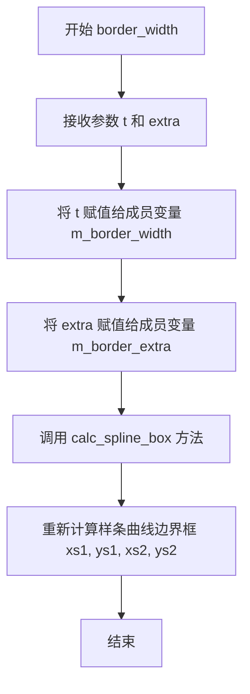

#### 带注释源码

```cpp
//------------------------------------------------------------------------
// 设置样条控制器的边框宽度和额外扩展值
// 参数:
//   t     - 边框宽度，控制区域四周的边界厚度
//   extra - 边框额外扩展，在控制区域外围增加的边距
//------------------------------------------------------------------------
void spline_ctrl_impl::border_width(double t, double extra)
{ 
    // 将传入的边框宽度赋值给成员变量
    m_border_width = t; 
    
    // 将传入的额外扩展值赋值给成员变量
    m_border_extra = extra;
    
    // 重新计算样条曲线的边界框，根据新的边框宽度调整内部坐标
    calc_spline_box(); 
}
```


### `spline_ctrl_impl::calc_spline_box`

该方法根据控件的边界框和边框宽度计算样条曲线的有效绘制区域，通过从原始坐标中减去边框宽度来确定样条曲线的左上角和右下角坐标。

参数：

- （无参数）

返回值：`void`，无返回值描述

#### 流程图

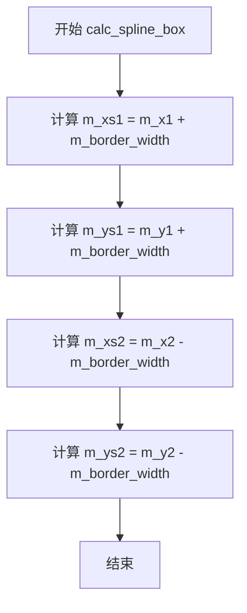

#### 带注释源码

```cpp
//------------------------------------------------------------------------
// 计算样条曲线的绘制边界框
// 该方法根据控件的外边界和边框宽度计算出样条曲线可以绘制的内部区域
//------------------------------------------------------------------------
void spline_ctrl_impl::calc_spline_box()
{
    // 计算样条曲线区域的左上角X坐标 = 控件左边界 + 边框宽度
    m_xs1 = m_x1 + m_border_width;
    
    // 计算样条曲线区域的左上角Y坐标 = 控件上边界 + 边框宽度
    m_ys1 = m_y1 + m_border_width;
    
    // 计算样条曲线区域的右下角X坐标 = 控件右边界 - 边框宽度
    m_xs2 = m_x2 - m_border_width;
    
    // 计算样条曲线区域的右下角Y坐标 = 控件下边界 - 边框宽度
    m_ys2 = m_y2 - m_border_width;
}
```


### `spline_ctrl_impl::update_spline`

该函数负责初始化样条曲线并计算256个采样点的插值结果，将连续的样条曲线离散化为数组存储，同时对超出范围的数值进行裁剪，确保所有值保持在[0.0, 1.0]区间内，并生成对应的8位整数表示形式供渲染使用。

参数： 无

返回值：`void`，无返回值

#### 流程图

```mermaid
flowchart TD
    A[开始 update_spline] --> B[调用 m_spline.init 初始化样条曲线]
    B --> C{循环 i = 0 到 255}
    C --> D[计算样条插值值: m_spline.get<br/>double(i) / 255.0]
    D --> E{值 < 0.0?}
    E -->|是| F[将值裁剪为 0.0]
    E -->|否| G{值 > 1.0?}
    F --> G
    G -->|是| H[将值裁剪为 1.0]
    G -->|否| I[保持原值]
    H --> J[转换为8位整数: m_spline_values8[i]
    = 值 * 255.0]
    I --> J
    J --> C
    C -->|循环结束| K[结束]
```

#### 带注释源码

```
//------------------------------------------------------------------------
// 更新样条曲线数据
// 该函数初始化样条插值器，并计算256个离散采样点的值
//------------------------------------------------------------------------
void spline_ctrl_impl::update_spline()
{
    int i;
    
    // 使用当前的控制点数组(m_xp, m_yp)和数量(m_num_pnt)初始化样条曲线
    m_spline.init(m_num_pnt, m_xp, m_yp);
    
    // 循环计算256个采样点（对应0-255的整数范围）
    for(i = 0; i < 256; i++)
    {
        // 计算归一化参数t（0到1之间的浮点数）
        // i=0时t=0.0, i=255时t≈1.0
        m_spline_values[i] = m_spline.get(double(i) / 255.0);
        
        // 裁剪下限：如果值小于0.0则设为0.0
        if(m_spline_values[i] < 0.0) m_spline_values[i] = 0.0;
        
        // 裁剪上限：如果值大于1.0则设为1.0
        if(m_spline_values[i] > 1.0) m_spline_values[i] = 1.0;
        
        // 将浮点值[0.0, 1.0]转换为8位无符号整数[0, 255]
        // 存储在m_spline_values8数组中供图形渲染使用
        m_spline_values8[i] = (int8u)(m_spline_values[i] * 255.0);
    }
}
```


### `agg::spline_ctrl_impl::calc_curve`

该方法根据预计算的样条曲线值（m_spline_values）生成完整的曲线路径点。它通过将归一化的样条值映射到实际控制框的坐标空间，使用move_to和line_to操作构建曲线的多边形路径。

参数： 无

返回值： `void`，无返回值描述

#### 流程图

```mermaid
flowchart TD
    A[开始 calc_curve] --> B[清除曲线点集: m_curve_pnt.remove_all]
    B --> C[移动到曲线起点: move_to xs1, ys1 + (ys2-ys1)*spline_values[0]]
    C --> D{循环 i 从 1 到 255}
    D -->|i < 256| E[计算当前点X坐标: xs1 + (xs2-xs1)*i/255]
    E --> F[计算当前点Y坐标: ys1 + (ys2-ys1)*spline_values[i]]
    F --> G[添加直线到当前点: line_to]
    G --> D
    D -->|i >= 256| H[结束]
```

#### 带注释源码

```cpp
//------------------------------------------------------------------------
// 计算并生成曲线路径点
// 根据预计算的样条曲线值(m_spline_values)在控制框内生成完整的曲线路径
//------------------------------------------------------------------------
void spline_ctrl_impl::calc_curve()
{
    int i;
    
    // 步骤1: 清除之前积累的所有曲线点，为重新生成曲线做准备
    m_curve_pnt.remove_all();
    
    // 步骤2: 将曲线起点移动到控制框左侧边界
    // X坐标: 左边框xs1
    // Y坐标: 根据样条值[0]进行映射，从ys1到ys2的范围
    m_curve_pnt.move_to(m_xs1, m_ys1 + (m_ys2 - m_ys1) * m_spline_values[0]);
    
    // 步骤3: 循环生成曲线中间各点
    // 遍历256个采样点(i=1到255)，将归一化坐标映射到实际控制框坐标
    for(i = 1; i < 256; i++)
    {
        // 计算当前点的X坐标: 
        // 将i从0-255范围映射到xs1-xs2范围
        // i/255.0 将索引归一化为0-1之间的比例
        m_curve_pnt.line_to(m_xs1 + (m_xs2 - m_xs1) * double(i) / 255.0, 
                            // 计算当前点的Y坐标:
                            // 根据预计算的样条曲线值映射到ys1-ys2范围
                            m_ys1 + (m_ys2 - m_ys1) * m_spline_values[i]);
    }
}
```


### `agg::spline_ctrl_impl::calc_xp`

该函数用于根据控制点索引计算其在UI区域中的实际像素X坐标，通过线性变换将归一化的控制点坐标（0-1范围）转换为实际的屏幕坐标。

参数：

- `idx`：`unsigned`，控制点的索引，范围从0到m_num_pnt-1

返回值：`double`，返回控制点在实际像素坐标下的X坐标值

#### 流程图

```mermaid
flowchart TD
    A[开始 calc_xp] --> B[输入: idx]
    B --> C[获取归一化坐标 m_xp[idx]]
    C --> D[计算实际坐标: m_xs1 + (m_xs2 - m_xs1) × m_xp[idx]]
    D --> E[返回实际X坐标]
    E --> F[结束]
    
    style A fill:#f9f,color:#333
    style F fill:#9f9,color:#333
```

#### 带注释源码

```cpp
//------------------------------------------------------------------------
// 根据控制点索引计算其在实际像素空间中的X坐标
//------------------------------------------------------------------------
double spline_ctrl_impl::calc_xp(unsigned idx)
{
    // 计算公式：将归一化坐标(0~1)转换为实际像素坐标
    // m_xs1: 样条控制区域的左边界(像素)
    // m_xs2: 样条控制区域的右边界(像素)
    // m_xp[idx]: 第idx个控制点的归一化X坐标(0~1)
    //
    // 线性变换：实际坐标 = 起始坐标 + (范围 × 归一化值)
    return m_xs1 + (m_xs2 - m_xs1) * m_xp[idx];
}
```


### `spline_ctrl_impl.calc_yp`

该函数用于根据给定的控制点索引，计算该控制点在屏幕坐标系中的实际Y坐标值。它通过将归一化的Y值（0.0~1.0）映射到控制区域的像素范围内来实现坐标转换。

参数：

- `idx`：`unsigned`，控制点的索引，范围从0到m_num_pnt-1

返回值：`double`，计算得到的实际Y像素坐标值

#### 流程图

```mermaid
graph TD
    A[开始: calc_yp] --> B[输入: idx]
    B --> C[获取m_ys1: 控制区域上边界]
    C --> D[获取m_ys2: 控制区域下边界]
    D --> E[获取m_yp[idx]: 归一化Y值]
    E --> F[计算: m_ys1 + m_ys2 - m_ys1 \* m_yp[idx]]
    F --> G[返回: 实际Y坐标]
```

#### 带注释源码

```
//------------------------------------------------------------------------
// 计算给定索引控制点的实际Y坐标
// 参数: idx - 控制点索引
// 返回: 实际Y像素坐标值
//------------------------------------------------------------------------
double spline_ctrl_impl::calc_yp(unsigned idx)
{
    // 计算公式说明：
    // m_ys1 是控制区域的上边界（像素坐标）
    // m_ys2 是控制区域的下边界（像素坐标）
    // m_yp[idx] 是归一化的Y值，范围在0.0到1.0之间
    // 通过线性插值将归一化值转换为实际像素坐标
    return m_ys1 + (m_ys2 - m_ys1) * m_yp[idx];
}
```


### `agg::spline_ctrl_impl::set_xp`

设置样条控制点索引对应的X坐标值，并对输入值进行边界约束，确保值在[0,1]范围内，同时保证控制点之间的最小间距，防止控制点重叠或交叉。

参数：

- `idx`：`unsigned`，要设置的控制点索引，范围为0到m_num_pnt-1
- `val`：`double`，要设置的X坐标值，应在[0,1]范围内

返回值：`void`，无返回值

#### 流程图

```mermaid
flowchart TD
    A[set_xp 开始] --> B{val < 0.0?}
    B -->|是| C[val = 0.0]
    B -->|否| D{val > 1.0?}
    D -->|是| E[val = 1.0]
    D -->|否| F[val 保持不变]
    C --> G{idx == 0?}
    E --> G
    F --> G
    G -->|是| H[val = 0.0]
    G -->|否| I{idx == m_num_pnt - 1?}
    I -->|是| J[val = 1.0]
    I -->|否| K{val < m_xp[idx-1] + 0.001?}
    K -->|是| L[val = m_xp[idx-1] + 0.001]
    K -->|否| M{val > m_xp[idx+1] - 0.001?}
    M -->|是| N[val = m_xp[idx+1] - 0.001]
    M -->|否| O[val 保持不变]
    L --> P[保存 m_xp[idx] = val]
    N --> P
    H --> P
    J --> P
    O --> P
    P --> Q[set_xp 结束]
```

#### 带注释源码

```cpp
//------------------------------------------------------------------------
// 设置样条控制点的X坐标值
// 参数 idx: 控制点索引，从0开始
// 参数 val: 新的X坐标值，应在[0,1]范围内
//------------------------------------------------------------------------
void spline_ctrl_impl::set_xp(unsigned idx, double val)
{
    // 第一步：将值限制在[0, 1]范围内
    if(val < 0.0) val = 0.0;
    if(val > 1.0) val = 1.0;

    // 第二步：处理边界控制点（首尾控制点必须为0和1）
    if(idx == 0)
    {
        // 第一个控制点必须固定在X=0处
        val = 0.0;
    }
    else if(idx == m_num_pnt - 1)
    {
        // 最后一个控制点必须固定在X=1处
        val = 1.0;
    }
    else
    {
        // 第三步：中间控制点需要保持与邻居的最小间距
        // 防止控制点重叠或交叉，确保样条曲线平滑
        if(val < m_xp[idx - 1] + 0.001) 
            val = m_xp[idx - 1] + 0.001;
        if(val > m_xp[idx + 1] - 0.001) 
            val = m_xp[idx + 1] - 0.001;
    }
    
    // 第四步：保存最终值到控制点数组
    m_xp[idx] = val;
}
```


### `spline_ctrl_impl.set_yp`

该函数用于设置样条曲线控制点的Y坐标值，并对输入值进行边界检查以确保其在有效范围[0.0, 1.0]内。

参数：

- `idx`：`unsigned`，控制点的索引，指定要设置哪个控制点的Y坐标
- `val`：`double`，要设置的Y坐标值

返回值：`void`，无返回值

#### 流程图

```mermaid
flowchart TD
    A[开始 set_yp] --> B{val < 0.0?}
    B -->|是| C[val = 0.0]
    B -->|否| D{val > 1.0?}
    D -->|是| E[val = 1.0]
    D -->|否| F[保持原值]
    C --> G[m_yp[idx] = val]
    E --> G
    F --> G
    G --> H[结束]
```

#### 带注释源码

```cpp
//------------------------------------------------------------------------
// 设置样条曲线控制点的Y坐标值
// 参数 idx: 控制点索引
// 参数 val: 要设置的Y坐标值（将被限制在0.0-1.0之间）
//------------------------------------------------------------------------
void spline_ctrl_impl::set_yp(unsigned idx, double val)
{
    // 如果值小于0.0，则限制为0.0（下限）
    if(val < 0.0) val = 0.0;
    
    // 如果值大于1.0，则限制为1.0（上限）
    if(val > 1.0) val = 1.0;
    
    // 将处理后的值存储到控制点Y坐标数组中
    m_yp[idx] = val;
}
```


### `spline_ctrl_impl::point`

该方法用于设置样条控制点的坐标值，通过索引定位并更新对应的 x 和 y 坐标，同时保证坐标值在有效范围内。

参数：

- `idx`：`unsigned`，控制点的索引
- `x`：`double`，控制点的 x 坐标值（归一化到 [0,1] 范围）
- `y`：`double`，控制点的 y 坐标值（归一化到 [0,1] 范围）

返回值：`void`，无返回值

#### 流程图

```mermaid
flowchart TD
    A[开始 point 方法] --> B{idx < m_num_pnt?}
    B -->|是| C[调用 set_xp(idx, x)]
    C --> D[调用 set_yp(idx, y)]
    B -->|否| E[什么都不做]
    D --> F[结束]
    E --> F
```

#### 带注释源码

```cpp
//------------------------------------------------------------------------
// 设置样条控制点的坐标值
// idx: 控制点索引
// x: 归一化的 x 坐标值 [0, 1]
// y: 归一化的 y 坐标值 [0, 1]
//------------------------------------------------------------------------
void spline_ctrl_impl::point(unsigned idx, double x, double y)
{
    // 检查索引是否在有效范围内
    if(idx < m_num_pnt) 
    {
        // 设置 x 坐标，内部会进行范围限制和相邻点约束检查
        set_xp(idx, x);
        
        // 设置 y 坐标，内部会进行范围限制 [0, 1]
        set_yp(idx, y);
    }
    // 如果索引无效，则忽略此次调用
}
```


### `agg::spline_ctrl_impl::value` (重载版本1)

该方法用于设置样条曲线控制点中指定索引位置的y坐标值，是样条曲线编辑器中更新曲线形状的接口之一。

参数：

- `idx`：`unsigned`，要设置的控制点索引
- `y`：`double`，要设置的y坐标值（将被限制在0.0到1.0之间）

返回值：`void`，无返回值

#### 流程图

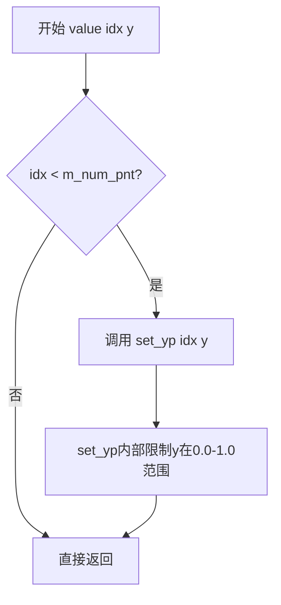

#### 带注释源码

```cpp
//------------------------------------------------------------------------
// 设置指定索引控制点的y值
// idx: 控制点索引
// y: 新的y坐标值
//------------------------------------------------------------------------
void spline_ctrl_impl::value(unsigned idx, double y)
{
    // 检查索引是否在有效范围内
    if(idx < m_num_pnt) 
    {
        // 调用内部方法设置y值，set_yp会进行范围限制
        set_yp(idx, y);
    }
}
```

---

### `agg::spline_ctrl_impl::value` (重载版本2)

该方法用于根据输入的x坐标（0.0到1.0之间）计算并返回样条曲线在该位置上的插值y坐标，是样条曲线求值的核心方法。

参数：

- `x`：`double`，输入的x坐标值（通常在0.0到1.0之间）

返回值：`double`，返回插值计算后的y坐标值（被限制在0.0到1.0之间）

#### 流程图

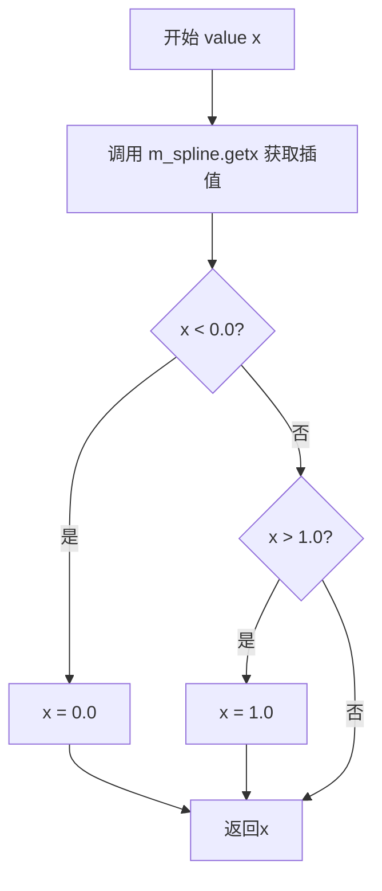

#### 带注释源码

```cpp
//------------------------------------------------------------------------
// 根据x值获取样条曲线的插值y值
// x: 输入的x坐标值，范围通常为0.0到1.0
// 返回: 插值计算后的y值，范围被限制在0.0到1.0之间
//------------------------------------------------------------------------
double spline_ctrl_impl::value(double x) const
{ 
    // 使用样条插值计算器获取x位置对应的y值
    x = m_spline.get(x);
    
    // 将结果限制在0.0到1.0的合法范围内
    if(x < 0.0) x = 0.0;
    if(x > 1.0) x = 1.0;
    
    return x;
}
```


### `agg::spline_ctrl_impl::rewind`

该函数是样条曲线控件的核心渲染准备方法，根据传入的索引参数准备不同的图形元素进行渲染，包括背景矩形、边框、多段曲线、非活动控制点和活动控制点，通过设置顶点坐标或计算曲线多边形来为后续的顶点生成做好准备。

参数：

- `idx`：`unsigned`，渲染元素的索引标识，0-分别表示背景(Background)、边框(Border)、曲线(Curve)、非活动控制点(Inactive points)和活动控制点(Active point)

返回值：`void`，无返回值

#### 流程图

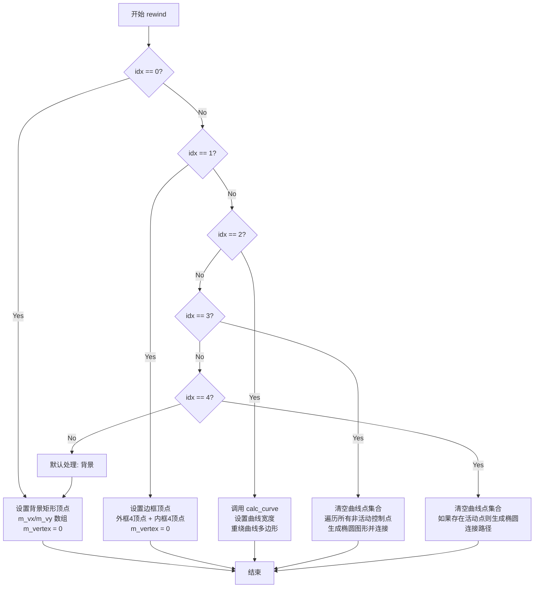

#### 带注释源码

```cpp
//------------------------------------------------------------------------
// 重置顶点生成器的状态，准备渲染指定类型的图形元素
// idx: 渲染元素索引，0-背景，1-边框，2-曲线，3-非活动点，4-活动点
//------------------------------------------------------------------------
void spline_ctrl_impl::rewind(unsigned idx)
{
    unsigned i;

    // 保存当前渲染索引，用于后续vertex()函数识别当前渲染模式
    m_idx = idx;

    // 根据索引选择要渲染的图形元素类型
    switch(idx)
    {
    default:
        // 默认fall-through到case 0，处理背景

    case 0:                 // Background - 渲染控件背景矩形
        m_vertex = 0;  // 重置顶点计数器
        // 设置背景矩形的四个顶点（考虑边框额外偏移）
        m_vx[0] = m_x1 - m_border_extra; 
        m_vy[0] = m_y1 - m_border_extra;
        m_vx[1] = m_x2 + m_border_extra; 
        m_vy[1] = m_y1 - m_border_extra;
        m_vx[2] = m_x2 + m_border_extra; 
        m_vy[2] = m_y2 + m_border_extra;
        m_vx[3] = m_x1 - m_border_extra; 
        m_vy[3] = m_y2 + m_border_extra;
        break;

    case 1:                 // Border - 渲染边框（两个矩形路径）
        m_vertex = 0;
        // 外框四个顶点
        m_vx[0] = m_x1; 
        m_vy[0] = m_y1;
        m_vx[1] = m_x2; 
        m_vy[1] = m_y1;
        m_vx[2] = m_x2; 
        m_vy[2] = m_y2;
        m_vx[3] = m_x1; 
        m_vy[3] = m_y2;
        // 内框四个顶点（向内偏移border_width）
        m_vx[4] = m_x1 + m_border_width; 
        m_vy[4] = m_y1 + m_border_width; 
        m_vx[5] = m_x1 + m_border_width; 
        m_vy[5] = m_y2 - m_border_width; 
        m_vx[6] = m_x2 - m_border_width; 
        m_vy[6] = m_y2 - m_border_width; 
        m_vx[7] = m_x2 - m_border_width; 
        m_vy[7] = m_y1 + m_border_width; 
        break;

    case 2:                 // Curve - 渲染样条曲线
        // 首先计算曲线路径点集
        calc_curve();
        // 设置曲线宽度
        m_curve_poly.width(m_curve_width);
        // 重绕曲线多边形生成器，准备生成曲线顶点
        m_curve_poly.rewind(0);
        break;


    case 3:                 // Inactive points - 渲染非活动控制点
        // 清空之前积累的点集
        m_curve_pnt.remove_all();
        // 遍历所有控制点
        for(i = 0; i < m_num_pnt; i++)
        {
            // 排除当前活动的控制点
            if(int(i) != m_active_pnt)
            {
                // 为每个非活动控制点创建椭圆图形
                m_ellipse.init(calc_xp(i), calc_yp(i), 
                               m_point_size, m_point_size, 32);
                // 将椭圆路径连接到点集中
                m_curve_pnt.concat_path(m_ellipse);
            }
        }
        // 重绕点集生成器
        m_curve_poly.rewind(0);
        break;


    case 4:                 // Active point - 渲染当前活动控制点
        m_curve_pnt.remove_all();
        // 检查是否存在活动控制点
        if(m_active_pnt >= 0)
        {
            // 为活动控制点创建椭圆图形（通常更大或不同样式）
            m_ellipse.init(calc_xp(m_active_pnt), calc_yp(m_active_pnt), 
                           m_point_size, m_point_size, 32);
            // 连接椭圆路径
            m_curve_pnt.concat_path(m_ellipse);
        }
        m_curve_poly.rewind(0);
        break;

    }
}
```


### `agg::spline_ctrl_impl::vertex`

该方法是样条控制器实现类的顶点生成函数，用于按需生成控制器的各个组成部分（背景、边框、曲线、点）的顶点数据，支持渲染管线调用以获取图形路径命令和坐标。

参数：

- `x`：`double*`，指向存储输出顶点X坐标的double类型指针
- `y`：`double*`，指向存储输出顶点Y坐标的double类型指针

返回值：`unsigned`，返回路径命令类型（如 `path_cmd_move_to`、`path_cmd_line_to`、`path_cmd_stop` 等），用于指示当前顶点的绘制操作类型

#### 流程图

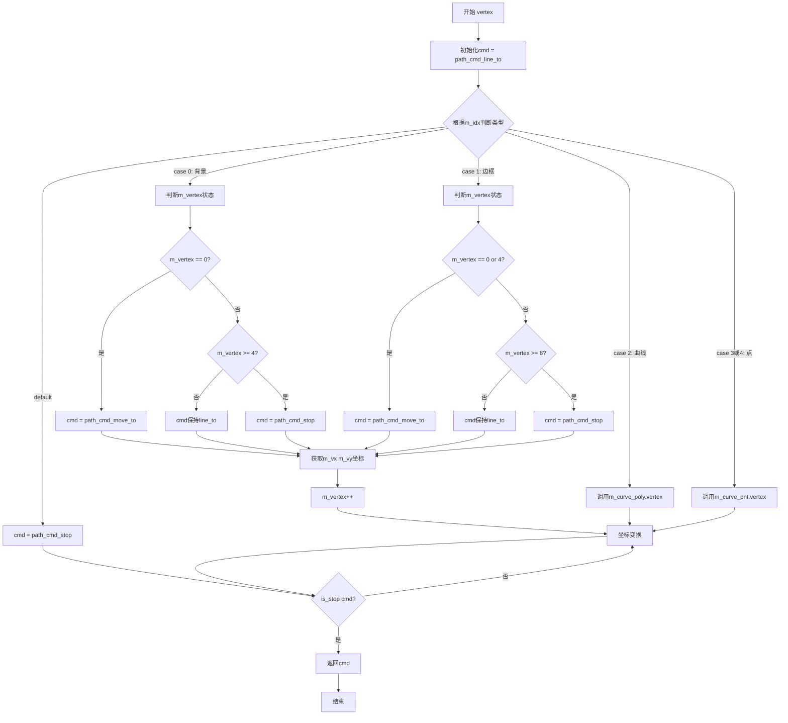

#### 带注释源码

```
//------------------------------------------------------------------------
// 该函数是渲染管线的回调函数，用于生成样条控制器的各个组成图形元素的顶点
// 参数x, y为输出参数，返回当前顶点的坐标
// 返回值为路径命令，告知渲染管线如何处理该顶点
//------------------------------------------------------------------------
unsigned spline_ctrl_impl::vertex(double* x, double* y)
{
    // 默认命令为line_to（连线到下一个点）
    unsigned cmd = path_cmd_line_to;
    
    // 根据m_idx的值判断当前需要生成哪种图形元素
    switch(m_idx)
    {
    case 0:                 // 背景（背景矩形）
        // 第一个顶点使用move_to命令开始新路径
        if(m_vertex == 0) cmd = path_cmd_move_to;
        // 超过4个顶点则停止
        if(m_vertex >= 4) cmd = path_cmd_stop;
        // 获取预定义的背景矩形顶点坐标
        *x = m_vx[m_vertex];
        *y = m_vy[m_vertex];
        // 移动到下一个顶点
        m_vertex++;
        break;

    case 1:                 // 边框（双层矩形边框）
        // 第1个和第5个顶点需要move_to（内外边框的起点）
        if(m_vertex == 0 || m_vertex == 4) cmd = path_cmd_move_to;
        // 超过8个顶点则停止
        if(m_vertex >= 8) cmd = path_cmd_stop;
        // 获取预定义的边框顶点坐标
        *x = m_vx[m_vertex];
        *y = m_vy[m_vertex];
        // 移动到下一个顶点
        m_vertex++;
        break;

    case 2:                 // 曲线（样条曲线）
        // 委托给曲线多边形对象生成顶点
        cmd = m_curve_poly.vertex(x, y);
        break;

    case 3:                 // 非活跃点（未选中的控制点）
    case 4:                 // 活跃点（选中的控制点）
        // 委托给点集合多边形对象生成顶点
        cmd = m_curve_pnt.vertex(x, y);
        break;

    default:                // 未知索引，停止生成
        cmd = path_cmd_stop;
        break;
    }

    // 如果不是停止命令，则对坐标进行变换（如坐标翻转等）
    if(!is_stop(cmd))
    {
        transform_xy(x, y);
    }

    // 返回当前顶点的路径命令
    return cmd;
}
```


### `agg::spline_ctrl_impl::active_point`

设置当前活动点（控制点）的索引，用于标识交互过程中当前被选中的控制点。该方法将内部成员变量 `m_active_pnt` 设置为传入的索引值，从而在渲染和交互处理中标记哪个控制点处于活动状态。

参数：

- `i`：`int`，要设置为活动状态的点索引，-1 表示没有活动点，0 到 m_num_pnt-1 表示有效的控制点索引

返回值：`void`，无返回值

#### 流程图

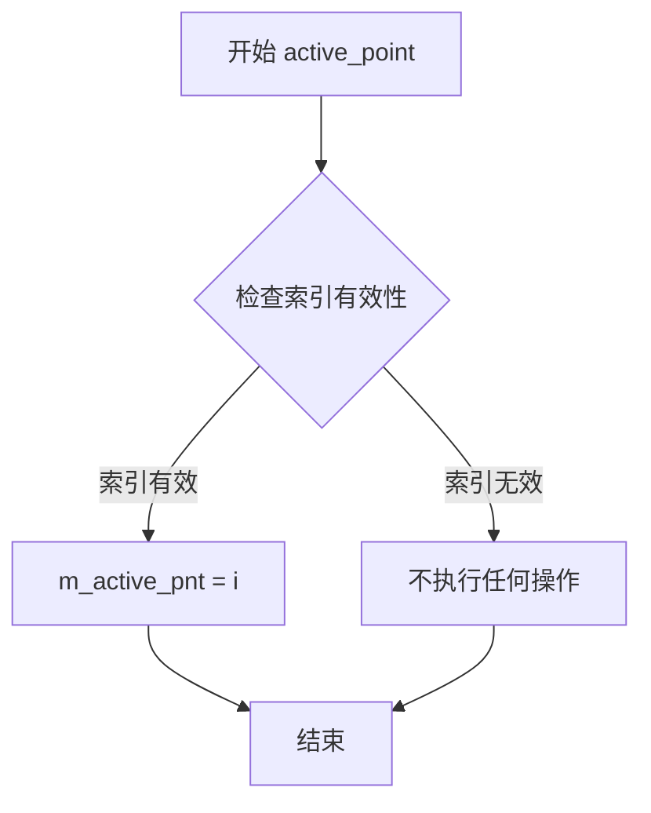

#### 带注释源码

```cpp
//------------------------------------------------------------------------
// 设置当前活动点的索引
// 参数: i - 新的活动点索引，-1表示无活动点
//------------------------------------------------------------------------
void spline_ctrl_impl::active_point(int i)
{
    // 直接将传入的索引值赋给成员变量 m_active_pnt
    // 该成员变量用于追踪当前哪个控制点处于激活状态
    // 在渲染循环中，活动点会绘制为不同的样式（如更大的尺寸）
    // 在交互事件处理中，活动点会响应鼠标拖拽等操作
    m_active_pnt = i;
}
```

#### 关联信息

- **成员变量**：`m_active_pnt`（`int` 类型），存储当前活动控制点的索引，-1 表示无活动点
- **相关方法**：
  - `on_mouse_button_down()` - 鼠标按下时自动设置活动点
  - `on_mouse_move()` - 鼠标移动时更新活动点位置
  - `rewind(unsigned idx)` - 渲染时根据活动点索引绘制不同的样式（case 4 绘制活动点）
  - `on_arrow_keys()` - 键盘方向键操作时使用 `m_active_pnt` 确定要移动的点
- **使用场景**：当用户点击某个控制点时调用此方法将其设置为活动点；拖拽结束后可传入 -1 取消活动点状态


### `agg::spline_ctrl_impl::in_rect`

该方法用于检测给定的屏幕坐标点是否位于样条曲线控制控件的矩形边界区域内。首先对输入坐标进行逆变换（处理坐标系翻转），然后判断点是否在由控件左上角(m_x1, m_y1)和右下角(m_x2, m_y2)构成的矩形范围内。

参数：

- `x`：`double`，待检测的X坐标（屏幕坐标或变换后坐标）
- `y`：`double`，待检测的Y坐标（屏幕坐标或变换后坐标）

返回值：`bool`，如果点(x, y)在控件的矩形区域内则返回true，否则返回false

#### 流程图

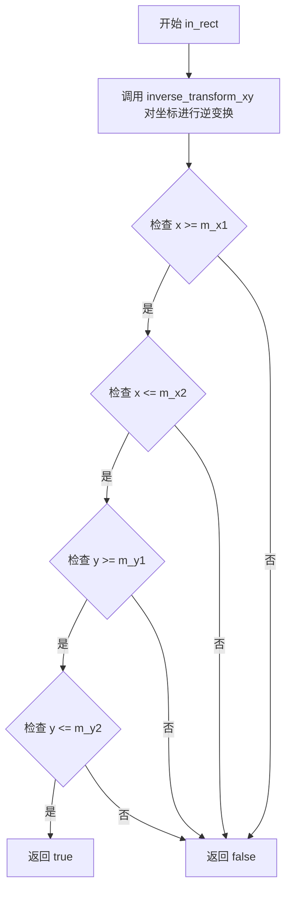

#### 带注释源码

```cpp
//------------------------------------------------------------------------
// 检测点是否在控件矩形区域内
// 参数:
//   x - 待检测的X坐标（屏幕坐标）
//   y - 待检测的Y坐标（屏幕坐标）
// 返回值:
//   bool - 点在区域内返回true，否则返回false
//------------------------------------------------------------------------
bool spline_ctrl_impl::in_rect(double x, double y) const
{
    // 对坐标进行逆变换，将屏幕坐标转换为控件本地坐标
    // 这主要处理flip_y属性的影响（垂直翻转）
    inverse_transform_xy(&x, &y);
    
    // 检查点是否在由(m_x1, m_y1)到(m_x2, m_y2)构成的矩形区域内
    // m_x1, m_y1: 控件左上角坐标（从ctrl基类继承）
    // m_x2, m_y2: 控件右下角坐标（从ctrl基类继承）
    return x >= m_x1 && x <= m_x2 && y >= m_y1 && y <= m_y2;
}
```


### `spline_ctrl_impl::on_mouse_button_down`

处理鼠标按钮按下事件，检测用户是否点击了样条曲线控制点，并在点击有效控制点时激活该点进行后续拖拽操作。

参数：

- `x`：`double`，鼠标按下时的x坐标（屏幕坐标）
- `y`：`double`，鼠标按下时的y坐标（屏幕坐标）

返回值：`bool`，如果鼠标点击在某个控制点的可交互范围内（点大小+1像素），则返回 `true` 并激活该控制点；否则返回 `false`

#### 流程图

```mermaid
flowchart TD
    A[开始 on_mouse_button_down] --> B[对坐标x, y进行逆变换]
    B --> C[初始化循环计数器 i = 0]
    C --> D{i < m_num_pnt?}
    D -->|是| E[计算第i个控制点的屏幕坐标 xp = calc_xp(i), yp = calc_yp(i)]
    E --> F{calc_distance(x, y, xp, yp) <= m_point_size + 1?}
    F -->|是| G[计算偏移量: m_pdx = xp - x, m_pdy = yp - y]
    G --> H[设置活动点和移动点: m_active_pnt = m_move_pnt = i]
    H --> I[返回 true]
    F -->|否| J[i++]
    J --> D
    D -->|否| K[返回 false]
    I --> L[结束]
    K --> L
```

#### 带注释源码

```cpp
//------------------------------------------------------------------------
// 处理鼠标按钮按下事件
// 参数:
//   x - 鼠标按下时的x坐标（屏幕坐标）
//   y - 鼠标按下时的y坐标（屏幕坐标）
// 返回值:
//   bool - 点击在控制点上返回true，否则返回false
//------------------------------------------------------------------------
bool spline_ctrl_impl::on_mouse_button_down(double x, double y)
{
    // 将屏幕坐标逆变换为控制区域坐标
    inverse_transform_xy(&x, &y);
    
    // 遍历所有控制点，检测是否点击在某个控制点上
    unsigned i;
    for(i = 0; i < m_num_pnt; i++)  
    {
        // 计算第i个控制点在屏幕上的实际位置
        double xp = calc_xp(i);
        double yp = calc_yp(i);
        
        // 检测鼠标点击位置与控制点的距离是否在可交互范围内
        // 判定半径为控制点大小加1像素的缓冲区域
        if(calc_distance(x, y, xp, yp) <= m_point_size + 1)
        {
            // 记录鼠标点击位置与控制点位置的偏移量
            // 用于后续拖拽时保持相对位置
            m_pdx = xp - x;
            m_pdy = yp - y;
            
            // 激活当前被点击的控制点
            // m_active_pnt: 当前活动（被选中）的控制点索引
            // m_move_pnt: 正在被拖拽的控制点索引，-1表示没有控制点被拖拽
            m_active_pnt = m_move_pnt = int(i);
            
            // 成功捕获控制点，返回true
            return true;
        }
    }
    
    // 未点击到任何控制点，返回false
    return false;
}
```


### `spline_ctrl_impl::on_mouse_button_up`

处理鼠标按钮释放事件，用于释放当前被拖拽的样条控制点。当检测到有控制点正在被拖拽（`m_move_pnt >= 0`）时，释放该控制点并返回 true；否则返回 false。

参数：

- `x`：`double`，鼠标释放时的 X 坐标（未使用，仅为函数签名完整性）
- `y`：`double`，鼠标释放时的 Y 坐标（未使用，仅为函数签名完整性）

返回值：`bool`，如果成功释放控制点返回 true，否则返回 false

#### 流程图

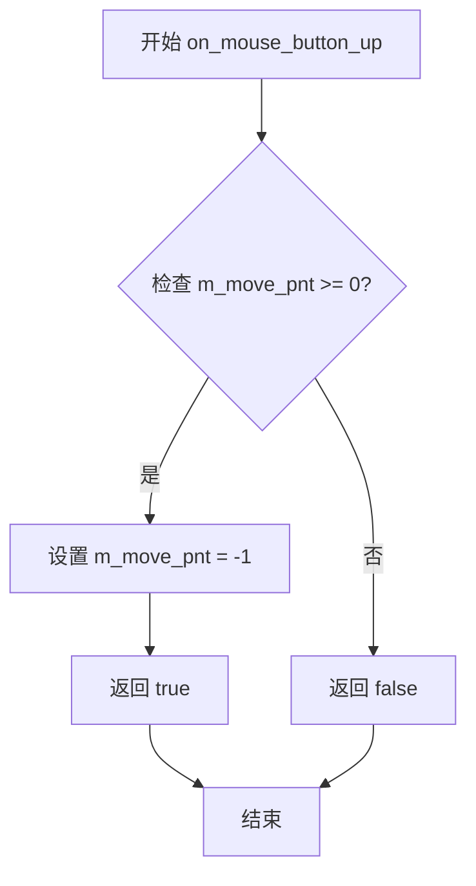

#### 带注释源码

```cpp
//------------------------------------------------------------------------
// 处理鼠标按钮释放事件
// 参数: x - 鼠标 X 坐标（此函数中未使用）
//       y - 鼠标 Y 坐标（此函数中未使用）
// 返回值: bool - 成功释放控制点返回 true，否则返回 false
//------------------------------------------------------------------------
bool spline_ctrl_impl::on_mouse_button_up(double, double)
{
    // 检查是否有控制点正在被拖拽
    // m_move_pnt 存储当前被拖拽的控制点索引，-1 表示无控制点被拖拽
    if(m_move_pnt >= 0)
    {
        // 释放控制点：将移动状态重置为 -1
        m_move_pnt = -1;
        // 返回 true 表示成功处理了鼠标释放事件
        return true;
    }
    // 无控制点被拖拽，返回 false
    return false;
}
```


### `agg::spline_ctrl_impl::on_mouse_move`

该函数处理鼠标移动事件，根据鼠标按钮状态和当前拖拽的点来更新样条曲线的控制点位置，并在位置变化时重新计算样条曲线。

参数：

- `x`：`double`，鼠标当前所在位置的x坐标（屏幕坐标）
- `y`：`double`，鼠标当前所在位置的y坐标（屏幕坐标）
- `button_flag`：`bool`，鼠标按钮是否按下的标志，true表示按钮被按下，false表示未按下

返回值：`bool`，如果成功处理了鼠标移动事件返回true，否则返回false

#### 流程图

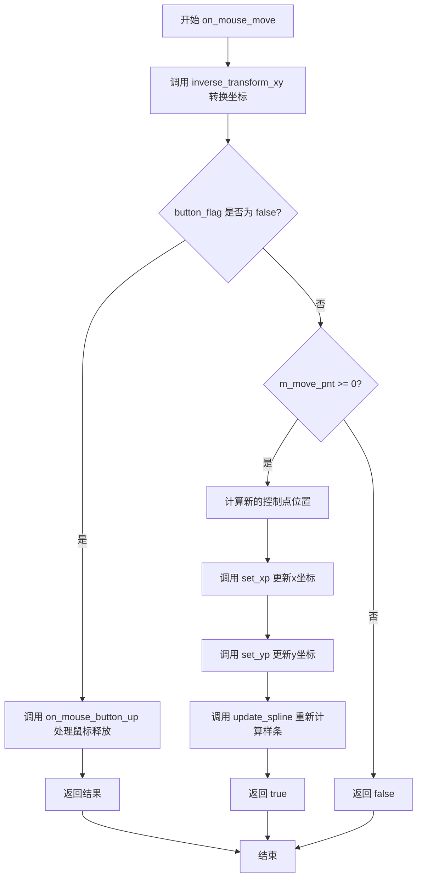

#### 带注释源码

```cpp
//------------------------------------------------------------------------
// 处理鼠标移动事件
// 参数:
//   x - 鼠标x坐标
//   y - 鼠标y坐标
//   button_flag - 鼠标按钮状态标志
// 返回值:
//   bool - 是否成功处理了该事件
//------------------------------------------------------------------------
bool spline_ctrl_impl::on_mouse_move(double x, double y, bool button_flag)
{
    // 将屏幕坐标逆变换为控制区域坐标
    inverse_transform_xy(&x, &y);
    
    // 如果鼠标按钮未按下（button_flag为false）
    // 则处理鼠标释放事件
    if(!button_flag)
    {
        return on_mouse_button_up(x, y);
    }

    // 如果当前有正在拖拽的控制点（m_move_pnt >= 0）
    if(m_move_pnt >= 0)
    {
        // 计算控制点在曲线区域中的实际位置
        // 加上之前的偏移量（m_pdx, m_pdy）
        double xp = x + m_pdx;
        double yp = y + m_pdy;

        // 将坐标从曲线区域坐标归一化到[0,1]范围
        // 并更新该控制点的x坐标
        set_xp(m_move_pnt, (xp - m_xs1) / (m_xs2 - m_xs1));
        
        // 更新该控制点的y坐标
        set_yp(m_move_pnt, (yp - m_ys1) / (m_ys2 - m_ys1));

        // 重新计算样条曲线
        update_spline();
        
        // 返回成功处理标志
        return true;
    }
    
    // 没有正在拖拽的控制点，返回false
    return false;
}
```


### `spline_ctrl_impl::on_arrow_keys`

处理方向键事件，用于通过键盘方向键（上下左右）移动当前激活的样条曲线控制点。

参数：

- `left`：`bool`，表示是否按下左箭头键
- `right`：`bool`，表示是否按下右箭头键
- `down`：`bool`，表示是否按下下箭头键
- `up`：`bool`，表示是否按下上箭头键

返回值：`bool`，返回是否有控制点被成功移动（true 表示控制点位置发生了变化，false 表示没有变化或没有激活的控制点）

#### 流程图

```mermaid
flowchart TD
    A[开始 on_arrow_keys] --> B{检查是否有激活的控制点 m_active_pnt >= 0?}
    B -->|否| C[ret = false]
    C --> D[返回 ret = false]
    B -->|是| E[获取当前控制点坐标<br/>kx = m_xp[m_active_pnt]<br/>ky = m_yp[m_active_pnt]]
    E --> F{left 为 true?}
    F -->|是| G[kx -= 0.001<br/>ret = true]
    F -->|否| H{right 为 true?}
    G --> H
    H -->|是| I[kx += 0.001<br/>ret = true]
    H -->|否| J{down 为 true?}
    I --> J
    J -->|是| K[ky -= 0.001<br/>ret = true]
    J -->|否| L{up 为 true?}
    K --> L
    L -->|是| M[ky += 0.001<br/>ret = true]
    L -->|否| N{ret == true?}
    M --> N
    N -->|否| D
    N -->|是| O[更新控制点位置<br/>set_xp(m_active_pnt, kx)<br/>set_yp(m_active_pnt, ky)]
    O --> P[更新样条曲线<br/>update_spline]
    P --> Q[返回 ret = true]
```

#### 带注释源码

```cpp
//------------------------------------------------------------------------
// 处理方向键事件，通过键盘方向键移动激活的样条曲线控制点
// 参数：
//   left  - 按下了左箭头键
//   right - 按下了右箭头键
//   down  - 按下了下箭头键
//   up    - 按下了上箭头键
// 返回值：
//   bool  - 如果成功移动了控制点返回 true，否则返回 false
//------------------------------------------------------------------------
bool spline_ctrl_impl::on_arrow_keys(bool left, bool right, bool down, bool up)
{
    // 用于存储修改后的控制点坐标
    double kx = 0.0;
    double ky = 0.0;
    // 返回值，初始为 false，表示没有变化
    bool ret = false;
    
    // 检查是否存在激活的控制点（索引 >= 0）
    if(m_active_pnt >= 0)
    {
        // 获取当前激活控制点的坐标
        kx = m_xp[m_active_pnt];
        ky = m_yp[m_active_pnt];
        
        // 处理左箭头键：减少 x 坐标（向左移动）
        if(left)  { kx -= 0.001; ret = true; }
        
        // 处理右箭头键：增加 x 坐标（向右移动）
        if(right) { kx += 0.001; ret = true; }
        
        // 处理下箭头键：减少 y 坐标（向下移动）
        if(down)  { ky -= 0.001; ret = true; }
        
        // 处理上箭头键：增加 y 坐标（向上移动）
        if(up)    { ky += 0.001; ret = true; }
    }
    
    // 如果有控制点被移动（ret 为 true）
    if(ret)
    {
        // 设置新的 x 坐标（会进行边界检查）
        set_xp(m_active_pnt, kx);
        
        // 设置新的 y 坐标（会进行边界检查）
        set_yp(m_active_pnt, ky);
        
        // 重新计算并更新样条曲线
        update_spline();
    }
    
    // 返回是否有控制点被移动
    return ret;
}
```


### `ctrl.inverse_transform_xy`

坐标逆变换函数，用于将屏幕坐标（包含可能的翻转变换）转换回控件的局部坐标空间。该函数是基类 `ctrl` 的成员函数，在 `spline_ctrl_impl` 中被继承并使用，主要用于鼠标事件处理中的坐标 normalization。

参数：

- `x`：double 指针，指向屏幕坐标 x 值的指针，变换后存储对应的局部坐标 x
- `y`：double 指针，指向屏幕坐标 y 值的指针，变换后存储对应的局部坐标 y

返回值：`void`，无返回值（原地修改坐标值）

#### 流程图

```mermaid
flowchart TD
    A[开始逆变换] --> B{flip_y是否为true}
    B -->|是| C[对y坐标进行翻转: y = 1.0 - y]
    B -->|否| D[保持y坐标不变]
    C --> E[返回变换后的坐标]
    D --> E
```

#### 带注释源码

```
// 注意：此函数的具体实现未在当前源文件中显示
// 它继承自基类 ctrl，其实现可能在头文件或基类源文件中
// 根据调用场景推断，该函数执行以下操作：

void ctrl::inverse_transform_xy(double* x, double* y)
{
    // 将屏幕坐标逆变换回控件局部坐标
    // 如果 flip_y 为 true，则需要翻转 y 坐标
    // 这是一个典型的坐标系统变换操作
    
    if (m_flip_y)
    {
        *y = 1.0 - *y;  // 翻转 y 坐标到 [0,1] 范围
    }
    // 然后可能还需要进行从像素坐标到 [0,1] 范围的缩放变换
    // *x = (*x - m_x1) / (m_x2 - m_x1);
    // *y = (*y - m_y1) / (m_y2 - m_y1);
}
```

> **注意**：由于 `inverse_transform_xy` 函数的具体实现未在提供的代码片段中显示，以上源码是基于其使用方式和 AGG 库常见的坐标变换模式推断的。该函数很可能在基类 `ctrl` 中定义，负责将屏幕坐标逆变换回控件的局部坐标空间，以支持鼠标交互的准确检测。


### `ctrl.transform_xy`

该方法用于将坐标从控制点坐标空间变换到屏幕坐标空间，是AGG库中控件基类提供的坐标变换功能，主要在渲染顶点数据时被调用，确保控件内的坐标能够正确映射到最终的输出设备坐标系中。

参数：

- `x`：`double*`，指向x坐标的指针，变换后更新为屏幕坐标系的x值
- `y`：`double*`，指向y坐标的指针，变换后更新为屏幕坐标系的y值

返回值：`void`，该方法无返回值，通过指针参数直接修改坐标值

#### 流程图

```mermaid
flowchart TD
    A[开始 transform_xy] --> B{是否启用了Y轴翻转}
    B -->|是| C[对y坐标应用翻转变换: y = m_y1 + m_y2 - y]
    B -->|否| D[保持原坐标不变]
    C --> E[结束]
    D --> E
```

#### 带注释源码

```cpp
//------------------------------------------------------------------------
// 注意：transform_xy方法的实现位于基类ctrl中
// 以下为spline_ctrl_impl类中调用transform_xy的上下文代码
//------------------------------------------------------------------------

// 在vertex方法中调用transform_xy，将控制点坐标转换为屏幕坐标
unsigned spline_ctrl_impl::vertex(double* x, double* y)
{
    unsigned cmd = path_cmd_line_to;
    // ... 省略其他代码 ...
    
    // 根据不同的绘制场景处理顶点数据
    switch(m_idx)
    {
        case 0: // 背景
            // ... 设置顶点坐标 ...
            break;
        case 1: // 边框
            // ... 设置顶点坐标 ...
            break;
        case 2: // 曲线
            cmd = m_curve_poly.vertex(x, y);
            break;
        case 3:
        case 4:
            cmd = m_curve_pnt.vertex(x, y);
            break;
        default:
            cmd = path_cmd_stop;
            break;
    }

    // 仅在命令不是停止命令时执行坐标变换
    if(!is_stop(cmd))
    {
        // 调用基类的transform_xy进行坐标变换
        // 将控件内部的归一化坐标转换为屏幕坐标
        transform_xy(x, y);
    }

    return cmd;
}


//------------------------------------------------------------------------
// 基类ctrl中transform_xy方法的声明（推断）
//------------------------------------------------------------------------
// void ctrl::transform_xy(double* x, double* y)
// {
//     // 如果启用了flip_y，则翻转y坐标
//     if(m_flip_y)
//     {
//         *y = m_y1 + m_y2 - *y;
//     }
// }

//------------------------------------------------------------------------
// 相关的逆变换方法inverse_transform_xy（在代码中被调用）
//------------------------------------------------------------------------

// 检查点是否在控件矩形区域内
bool spline_ctrl_impl::in_rect(double x, double y) const
{
    // 先将屏幕坐标逆变换为控件内部坐标
    inverse_transform_xy(&x, &y);
    // 检查是否在控件边界内
    return x >= m_x1 && x <= m_x2 && y >= m_y1 && y <= m_y2;
}

// 鼠标按下事件处理
bool spline_ctrl_impl::on_mouse_button_down(double x, double y)
{
    // 逆变换鼠标坐标到控件坐标系统
    inverse_transform_xy(&x, &y);
    unsigned i;
    // 遍历所有控制点，检查是否点击了控制点
    for(i = 0; i < m_num_pnt; i++)  
    {
        double xp = calc_xp(i);
        double yp = calc_yp(i);
        if(calc_distance(x, y, xp, yp) <= m_point_size + 1)
        {
            m_pdx = xp - x;
            m_pdy = yp - y;
            m_active_pnt = m_move_pnt = int(i);
            return true;
        }
    }
    return false;
}

// 鼠标移动事件处理
bool spline_ctrl_impl::on_mouse_move(double x, double y, bool button_flag)
{
    // 逆变换鼠标坐标到控件坐标系统
    inverse_transform_xy(&x, &y);
    if(!button_flag)
    {
        return on_mouse_button_up(x, y);
    }

    if(m_move_pnt >= 0)
    {
        // 计算新的控制点位置
        double xp = x + m_pdx;
        double yp = y + m_pdy;

        // 更新控制点坐标（需要归一化到0-1范围）
        set_xp(m_move_pnt, (xp - m_xs1) / (m_xs2 - m_xs1));
        set_yp(m_move_pnt, (yp - m_ys1) / (m_ys2 - m_ys1));

        // 重新计算样条曲线
        update_spline();
        return true;
    }
    return false;
}
```

#### 备注

1. **方法位置**：`transform_xy`方法的实现位于基类`ctrl`中，当前源文件只是调用了该方法，未包含其具体实现代码。

2. **坐标系统**：
   - 控件内部使用归一化坐标（0.0-1.0）
   - `transform_xy`将归一化坐标转换为实际屏幕坐标
   - `inverse_transform_xy`执行相反的转换操作

3. **翻转功能**：基类`ctrl`中包含`m_flip_y`成员，用于控制Y轴是否翻转，这在处理不同坐标系系统（如屏幕坐标 vs 数学坐标）时非常有用。

4. **调用时机**：在`spline_ctrl_impl::vertex`方法的最后阶段被调用，确保所有渲染的顶点都能正确映射到屏幕坐标系统。


### `spline_ctrl_impl.in_rect`

该方法用于检测给定的坐标点是否在样条控制组件的矩形边界范围内。首先对坐标进行逆变换以处理可能的坐标系翻转，然后判断点是否在由控制点定义的矩形区域内。

参数：

- `x`：`double`，待检测的x坐标
- `y`：`double`，待检测的y坐标

返回值：`bool`，如果坐标点在矩形范围内返回true，否则返回false

#### 流程图

```mermaid
flowchart TD
    A[开始 in_rect] --> B[调用 inverse_transform_xy 对坐标进行逆变换]
    B --> C{检查 x >= m_x1}
    C -->|是| D{检查 x <= m_x2}
    C -->|否| G[返回 false]
    D -->|是| E{检查 y >= m_y1}
    D -->|否| G
    E -->|是| F{检查 y <= m_y2}
    E -->|否| G
    F -->|是| H[返回 true]
    F -->|否| G
```

#### 带注释源码

```cpp
//------------------------------------------------------------------------
// 检测点是否在矩形范围内
// 参数:
//   x - 待检测的x坐标
//   y - 待检测的y坐标
// 返回值:
//   bool - 点在矩形内返回true，否则返回false
//------------------------------------------------------------------------
bool spline_ctrl_impl::in_rect(double x, double y) const
{
    // 对坐标进行逆变换，处理可能的坐标系翻转（如Y轴翻转）
    inverse_transform_xy(&x, &y);
    
    // 检查点是否在控制组件的矩形边界内
    // m_x1, m_y1: 矩形左上角坐标
    // m_x2, m_y2: 矩形右下角坐标
    return x >= m_x1 && x <= m_x2 && y >= m_y1 && y <= m_y2;
}
```


### `spline_ctrl_impl::on_mouse_button_down`

该方法处理鼠标按下事件，用于检测用户是否点击了样条曲线上的控制点。如果点击命中某个控制点，则激活该点并记录偏移量，同时设置拖动状态。

参数：

- `x`：`double`，鼠标按下时的X坐标（屏幕坐标，经过逆变换后用于比较）
- `y`：`double`，鼠标按下时的Y坐标（屏幕坐标，经过逆变换后用于比较）

返回值：`bool`，如果鼠标点击命中了某个控制点则返回 `true`，否则返回 `false`

#### 流程图

```mermaid
flowchart TD
    A[on_mouse_button_down 开始] --> B[对x, y进行逆变换]
    B --> C[初始化循环变量i = 0]
    C --> D{i < m_num_pnt?}
    D -->|是| E[计算第i个控制点的坐标xp = calc_xp(i), yp = calc_yp(i)]
    E --> F{calc_distance(x, y, xp, yp) <= m_point_size + 1?}
    F -->|是| G[记录偏移量: m_pdx = xp - x, m_pdy = yp - y]
    G --> H[激活控制点: m_active_pnt = m_move_pnt = i]
    H --> I[返回 true]
    F -->|否| J[i++]
    D -->|否| K[返回 false]
    J --> D
    I --> L[结束]
    K --> L
```

#### 带注释源码

```cpp
//------------------------------------------------------------------------
// 处理鼠标按下事件，检测是否点击了控制点
//------------------------------------------------------------------------
bool spline_ctrl_impl::on_mouse_button_down(double x, double y)
{
    // 对坐标进行逆变换，将屏幕坐标转换为控件内部坐标
    inverse_transform_xy(&x, &y);
    
    // 遍历所有控制点，检测是否点击了某个控制点
    unsigned i;
    for(i = 0; i < m_num_pnt; i++)  
    {
        // 计算当前控制点的屏幕坐标
        double xp = calc_xp(i);
        double yp = calc_yp(i);
        
        // 检测鼠标位置是否在控制点范围内（考虑控制点大小和1像素的容差）
        if(calc_distance(x, y, xp, yp) <= m_point_size + 1)
        {
            // 记录鼠标相对于控制点的偏移量，用于拖动计算
            m_pdx = xp - x;
            m_pdy = yp - y;
            
            // 设置当前控制点为激活状态，同时设置为移动状态
            m_active_pnt = m_move_pnt = int(i);
            
            // 成功捕获控制点，返回true
            return true;
        }
    }
    
    // 未点击任何控制点，返回false
    return false;
}
```


### `spline_ctrl_impl.on_mouse_button_up`

处理鼠标按钮释放事件，释放在拖动过程中持有的控制点。

参数：

-  `{匿名参数1}`：`double`，鼠标释放时的x坐标（未使用，仅满足函数签名）
-  `{匿名参数2}`：`double`，鼠标释放时的y坐标（未使用，仅满足函数签名）

返回值：`bool`，如果成功释放了控制点返回true，否则返回false

#### 流程图

```mermaid
flowchart TD
    A[开始 on_mouse_button_up] --> B{m_move_pnt >= 0?}
    B -->|是| C[设置 m_move_pnt = -1]
    C --> D[返回 true]
    B -->|否| E[返回 false]
    D --> F[结束]
    E --> F
```

#### 带注释源码

```
//------------------------------------------------------------------------
// 处理鼠标按钮释放事件
//------------------------------------------------------------------------
bool spline_ctrl_impl::on_mouse_button_up(double, double)
{
    // 检查是否有控制点正处于拖动状态（m_move_pnt >= 0表示有点被拖动）
    if(m_move_pnt >= 0)
    {
        // 释放被拖动的控制点，将其设置为-1表示无拖动
        m_move_pnt = -1;
        // 返回true表示事件已被处理
        return true;
    }
    // 没有控制点被拖动，返回false
    return false;
}
```


### `spline_ctrl_impl::on_mouse_move`

该方法处理鼠标移动事件，当鼠标在控制区域内移动时，根据鼠标按钮状态和当前拖拽的点来更新样条曲线的控制点坐标，并重绘曲线。

参数：

- `x`：`double`，鼠标位置的x坐标（屏幕坐标，经过逆变换后为控制区域坐标）
- `y`：`double`，鼠标位置的y坐标（屏幕坐标，经过逆变换后为控制区域坐标）
- `button_flag`：`bool`，鼠标按钮状态标志，true表示按钮按下，false表示按钮释放

返回值：`bool`，如果成功处理拖拽并更新了样条曲线返回true，否则返回false

#### 流程图

```mermaid
graph TD
    A([开始 on_mouse_move]) --> B[逆变换坐标: inverse_transform_xy(&x, &y)]
    B --> C{button_flag == false?}
    C -->|是| D[调用 on_mouse_button_up 并返回结果]
    C -->|否| E{m_move_pnt >= 0?}
    E -->|是| F[计算新坐标: xp = x + m_pdx, yp = y + m_pdy]
    F --> G[归一化坐标并设置到控制点: set_xp, set_yp]
    G --> H[更新样条曲线: update_spline]
    H --> I[返回 true]
    E -->|否| J[返回 false]
```

#### 带注释源码

```cpp
//------------------------------------------------------------------------
// 处理鼠标移动事件
// 参数:
//   x - 鼠标x坐标（屏幕坐标）
//   y - 鼠标y坐标（屏幕坐标）
//   button_flag - 鼠标按钮状态（true按下，false释放）
// 返回值:
//   如果处理了拖拽更新返回true，否则返回false
//------------------------------------------------------------------------
bool spline_ctrl_impl::on_mouse_move(double x, double y, bool button_flag)
{
    // 将屏幕坐标逆变换为控制区域坐标
    inverse_transform_xy(&x, &y);
    
    // 如果鼠标按钮未按下，则视为按钮释放事件处理
    if(!button_flag)
    {
        return on_mouse_button_up(x, y);
    }

    // 如果当前有活动的控制点（正在拖拽）
    if(m_move_pnt >= 0)
    {
        // 计算鼠标当前对应的控制点位置（加上之前的偏移量）
        double xp = x + m_pdx;
        double yp = y + m_pdy;

        // 将像素坐标归一化为[0,1]范围的参数坐标
        // 并设置到对应的控制点索引位置
        set_xp(m_move_pnt, (xp - m_xs1) / (m_xs2 - m_xs1));
        set_yp(m_move_pnt, (yp - m_ys1) / (m_ys2 - m_ys1));

        // 重新计算样条曲线并更新显示
        update_spline();
        return true;
    }
    
    // 没有活动的控制点，返回false
    return false;
}
```


### `spline_ctrl_impl::on_arrow_keys`

该方法处理方向键事件，用于通过键盘方向键移动当前激活的样条控制点。当用户按下左、右、上、下方向键时，方法会微调激活点的x或y坐标（每次调整0.001），并更新样条曲线。

参数：

- `left`：`bool`，表示是否按下左方向键
- `right`：`bool`，表示是否按下右方向键
- `down`：`bool`，表示是否按下下方向键
- `up`：`bool`，表示是否按下上方向键

返回值：`bool`，如果成功调整了激活点的坐标返回`true`，否则返回`false`

#### 流程图

```mermaid
flowchart TD
    A[开始 on_arrow_keys] --> B{检查是否有激活的点 m_active_pnt >= 0}
    B -->|否| C[设置 ret = false]
    B -->|是| D[获取当前激活点的坐标 kx = m_xp, ky = m_yp]
    D --> E{检查 left}
    E -->|是| F[kx -= 0.001, ret = true]
    E -->|否| G{检查 right}
    G -->|是| H[kx += 0.001, ret = true]
    G -->|否| I{检查 down}
    I -->|是| J[ky -= 0.001, ret = true]
    I -->|否| K{检查 up}
    K -->|是| L[ky += 0.001, ret = true]
    K -->|否| M{ret == true?}
    F --> M
    H --> M
    J --> M
    L --> M
    C --> N[返回 ret]
    M -->|否| N
    M -->|是| O[set_xp set_yp 更新坐标]
    O --> P[update_spline 更新样条]
    P --> N
```

#### 带注释源码

```cpp
//------------------------------------------------------------------------
// 处理方向键事件，通过键盘方向键移动激活的样条控制点
// 参数：
//   left  - 按下左方向键
//   right - 按下右方向键
//   down  - 按下下方向键
//   up    - 按下上方向键
// 返回值：
//   如果成功调整了点返回true，否则返回false
//------------------------------------------------------------------------
bool spline_ctrl_impl::on_arrow_keys(bool left, bool right, bool down, bool up)
{
    double kx = 0.0;  // 临时存储x坐标
    double ky = 0.0;  // 临时存储y坐标
    bool ret = false; // 返回值，初始为false

    // 检查是否存在激活的控制点
    if(m_active_pnt >= 0)
    {
        // 获取当前激活控制点的坐标
        kx = m_xp[m_active_pnt];
        ky = m_yp[m_active_pnt];

        // 根据方向键调整坐标，每次调整0.001（归一化坐标）
        if(left)  { kx -= 0.001; ret = true; }
        if(right) { kx += 0.001; ret = true; }
        if(down)  { ky -= 0.001; ret = true; }
        if(up)    { ky += 0.001; ret = true; }
    }

    // 如果有坐标变化，更新控制点并重新计算样条
    if(ret)
    {
        // 设置新的坐标值（会进行边界检查和约束）
        set_xp(m_active_pnt, kx);
        set_yp(m_active_pnt, ky);
        // 重新计算样条曲线
        update_spline();
    }

    // 返回是否发生了坐标变化
    return ret;
}
```


### `spline_ctrl_impl::rewind`

该函数是样条曲线控制组件的重置路径方法，根据传入的路径索引准备不同的渲染数据，包括背景矩形、边框、多段样条曲线以及控制点，并将内部顶点计数器重置为起始位置，为后续的顶点生成（vertex方法调用）做好准备。

参数：

- `idx`：`unsigned`，路径索引，指定要准备哪种渲染元素（0=背景，1=边框，2=曲线，3=非活动控制点，4=活动控制点）

返回值：`void`，无返回值

#### 流程图

```mermaid
flowchart TD
    A[开始 rewind] --> B{idx == 0?}
    B -->|Yes| C[设置背景顶点<br/>m_vx/m_vy 四个角点]
    B -->|No| D{idx == 1?}
    D -->|Yes| E[设置边框顶点<br/>m_vx/m_vy 八边形]
    D -->|No| F{idx == 2?}
    F -->|Yes| G[计算曲线<br/>m_curve_poly.width<br/>m_curve_poly.rewind]
    F -->|No| H{idx == 3?}
    H -->|Yes| I[生成非活动控制点<br/>循环 m_num_pnt<br/>跳过 m_active_pnt]
    H -->|No| J{idx == 4?}
    J -->|Yes| K[生成活动控制点<br/>使用 m_active_pnt]
    J -->|No| L[默认: 无操作]
    C --> M[结束]
    E --> M
    G --> M
    I --> M
    K --> M
    L --> M
```

#### 带注释源码

```cpp
//------------------------------------------------------------------------
// 重置路径 - 根据idx准备不同的渲染数据
// idx: 路径索引，0=背景,1=边框,2=曲线,3=非活动点,4=活动点
//------------------------------------------------------------------------
void spline_ctrl_impl::rewind(unsigned idx)
{
    unsigned i;

    // 保存当前路径索引，用于后续vertex()方法判断
    m_idx = idx;

    switch(idx)
    {
    default:

    case 0:                 // Background - 绘制背景矩形
        m_vertex = 0;  // 重置顶点计数器
        // 设置背景矩形的四个角点（考虑边界扩展）
        m_vx[0] = m_x1 - m_border_extra; 
        m_vy[0] = m_y1 - m_border_extra;
        m_vx[1] = m_x2 + m_border_extra; 
        m_vy[1] = m_y1 - m_border_extra;
        m_vx[2] = m_x2 + m_border_extra; 
        m_vy[2] = m_y2 + m_border_extra;
        m_vx[3] = m_x1 - m_border_extra; 
        m_vy[3] = m_y2 + m_border_extra;
        break;

    case 1:                 // Border - 绘制边框（两个矩形路径）
        m_vertex = 0;
        // 外矩形边界
        m_vx[0] = m_x1; 
        m_vy[0] = m_y1;
        m_vx[1] = m_x2; 
        m_vy[1] = m_y1;
        m_vx[2] = m_x2; 
        m_vy[2] = m_y2;
        m_vx[3] = m_x1; 
        m_vy[3] = m_y2;
        // 内矩形边界（由border_width决定）
        m_vx[4] = m_x1 + m_border_width; 
        m_vy[4] = m_y1 + m_border_width; 
        m_vx[5] = m_x1 + m_border_width; 
        m_vy[5] = m_y2 - m_border_width; 
        m_vx[6] = m_x2 - m_border_width; 
        m_vy[6] = m_y2 - m_border_width; 
        m_vx[7] = m_x2 - m_border_width; 
        m_vy[7] = m_y1 + m_border_width; 
        break;

    case 2:                 // Curve - 绘制样条曲线
        // 重新计算曲线数据
        calc_curve();
        // 设置曲线宽度
        m_curve_poly.width(m_curve_width);
        // 重置曲线多边形的内部路径迭代器
        m_curve_poly.rewind(0);
        break;


    case 3:                 // Inactive points - 绘制非活动控制点
        m_curve_pnt.remove_all();
        for(i = 0; i < m_num_pnt; i++)
        {
            // 跳过当前活动的控制点
            if(int(i) != m_active_pnt)
            {
                // 为每个非活动控制点创建椭圆
                m_ellipse.init(calc_xp(i), calc_yp(i), 
                               m_point_size, m_point_size, 32);
                // 连接到路径容器
                m_curve_pnt.concat_path(m_ellipse);
            }
        }
        m_curve_poly.rewind(0);
        break;


    case 4:                 // Active point - 绘制活动控制点
        m_curve_pnt.remove_all();
        if(m_active_pnt >= 0)
        {
            // 为活动控制点创建更大的椭圆（高亮显示）
            m_ellipse.init(calc_xp(m_active_pnt), calc_yp(m_active_pnt), 
                           m_point_size, m_point_size, 32);

            m_curve_pnt.concat_path(m_ellipse);
        }
        m_curve_poly.rewind(0);
        break;
    }
}
```


### `spline_ctrl_impl::vertex`

获取样条曲线控件当前绘制状态的顶点坐标和路径命令。该方法是 AGG 渲染流水线的回调接口，根据 `rewind` 方法设定的当前绘制对象（背景、边框、曲线、控制点），通过指针参数输出顶点坐标，并返回相应的路径绘图命令（如移动、画线、停止）。

参数：

- `x`：`double*`，指向双精度浮点数的指针，用于输出顶点的 X 坐标。
- `y`：`double*`，指向双精度浮点数的指针，用于输出顶点的 Y 坐标。

返回值：`unsigned`，返回 AGG 路径命令枚举值（如 `path_cmd_move_to`, `path_cmd_line_to`, `path_cmd_stop`），标识顶点的类型或绘制结束。

#### 流程图

```mermaid
graph TD
    A([Start vertex]) --> B{m_idx 分支判断}
    
    B -->|Case 0| C[背景矩形处理]
    B -->|Case 1| D[边框处理]
    B -->|Case 2| E[曲线处理]
    B -->|Case 3/4| F[控制点处理]
    B -->|Default| G[停止命令]
    
    C --> C1{检查 m_vertex 索引}
    C1 -->|0| C2[cmd = move_to]
    C1 -->|>=4| C3[cmd = stop]
    C1 -->|Other| C4[cmd = line_to]
    
    C2 --> C5[*x = m_vx[m_vertex]]
    C3 --> C5
    C4 --> C5
    C5 --> C6[m_vertex++]
    C6 --> Z[坐标变换 transform_xy]
    
    D --> D1{检查 m_vertex 索引}
    D1 -->|0 or 4| D2[cmd = move_to]
    D1 -->|>=8| D3[cmd = stop]
    D1 -->|Other| D4[cmd = line_to]
    
    D2 --> D5[*x = m_vx[m_vertex]]
    D3 --> D5
    D4 --> D5
    D5 --> D6[m_vertex++]
    D6 --> Z
    
    E --> E1[调用 m_curve_poly.vertex]
    E1 --> Z
    
    F --> F1[调用 m_curve_pnt.vertex]
    F1 --> Z
    
    G --> Z
    
    Z --> Return[Return cmd]
```

#### 带注释源码

```cpp
//------------------------------------------------------------------------
// 获取顶点实现
//------------------------------------------------------------------------
unsigned spline_ctrl_impl::vertex(double* x, double* y)
{
    // 初始化默认命令为 line_to
    unsigned cmd = path_cmd_line_to;

    // 根据当前路径索引 m_idx（由 rewind 设置）决定绘制哪个部分
    switch(m_idx)
    {
    case 0:                 // 背景 (Background)
        // 第一个顶点必须是 move_to
        if(m_vertex == 0) cmd = path_cmd_move_to;
        // 顶点索引超出范围则停止
        if(m_vertex >= 4) cmd = path_cmd_stop;
        
        // 获取预定义的背景框顶点坐标
        *x = m_vx[m_vertex];
        *y = m_vy[m_vertex];
        // 递增顶点索引
        m_vertex++;
        break;

    case 1:                 // 边框 (Border)
        // 第一个点和拐点必须是 move_to (外框起始和内框起始)
        if(m_vertex == 0 || m_vertex == 4) cmd = path_cmd_move_to;
        // 顶点索引超出范围则停止
        if(m_vertex >= 8) cmd = path_cmd_stop;
        
        *x = m_vx[m_vertex];
        *y = m_vy[m_vertex];
        m_vertex++;
        break;

    case 2:                 // 曲线 (Curve)
        // 委托给曲线多边形对象获取顶点
        cmd = m_curve_poly.vertex(x, y);
        break;

    case 3:                 // 非活动控制点 (Inactive points)
    case 4:                 // 活动控制点 (Active point)
        // 委托给点集多边形对象获取顶点
        cmd = m_curve_pnt.vertex(x, y);
        break;

    default:
        cmd = path_cmd_stop;
        break;
    }

    // 如果命令不是停止，则应用坐标变换（如视口变换）
    if(!is_stop(cmd))
    {
        transform_xy(x, y);
    }

    return cmd;
}
```


### `spline_ctrl_impl.spline_ctrl_impl`

该构造函数是样条曲线控制组件的实现类构造函数，用于初始化样条曲线控制点的数量、边框样式、曲线样式、点的大小等属性，并根据给定的控制点数量初始化默认的控制点位置（x轴均匀分布，y轴居中），同时计算样条曲线的边界框并更新样条曲线数据。

参数：

- `x1`：`double`，控制框左上角的 x 坐标
- `y1`：`double`，控制框左上角的 y 坐标
- `x2`：`double`，控制框右下角的 x 坐标
- `y2`：`double`，控制框右下角的 y 坐标
- `num_pnt`：`unsigned`，样条曲线的控制点数量
- `flip_y`：`bool`，是否翻转 Y 轴坐标

返回值：`void`（构造函数无返回值）

#### 流程图

```mermaid
flowchart TD
    A[开始构造] --> B[调用基类ctrl构造函数]
    B --> C[初始化成员变量]
    C --> D{num_pnt < 4?}
    D -->|是| E[num_pnt = 4]
    D -->|否| F{num_pnt > 32?}
    F -->|是| G[num_pnt = 32]
    F -->|否| H[保持num_pnt]
    E --> I[循环初始化控制点]
    G --> I
    H --> I
    I --> J[计算样条边界框 calc_spline_box]
    J --> K[更新样条曲线 update_spline]
    K --> L[结束构造]
```

#### 带注释源码

```cpp
//------------------------------------------------------------------------
// 样条曲线控制组件实现类的构造函数
// 参数：
//   x1, y1 - 控制框左上角坐标
//   x2, y2 - 控制框右下角坐标
//   num_pnt - 控制点数量
//   flip_y - 是否翻转Y轴
//------------------------------------------------------------------------
spline_ctrl_impl::spline_ctrl_impl(double x1, double y1, double x2, double y2, 
                                   unsigned num_pnt, bool flip_y) :
    // 调用基类ctrl的构造函数进行初始化
    ctrl(x1, y1, x2, y2, flip_y),
    // 初始化控制点数量
    m_num_pnt(num_pnt),
    // 初始化边框宽度为1.0
    m_border_width(1.0),
    // 初始化边框额外偏移为0.0
    m_border_extra(0.0),
    // 初始化曲线宽度为1.0
    m_curve_width(1.0),
    // 初始化控制点大小为3.0
    m_point_size(3.0),
    // 初始化曲线多边形对象
    m_curve_poly(m_curve_pnt),
    // 初始化当前路径索引为0
    m_idx(0),
    // 初始化当前顶点索引为0
    m_vertex(0),
    // 初始化当前激活的控制点索引为-1（无激活）
    m_active_pnt(-1),
    // 初始化正在移动的控制点索引为-1（无移动）
    m_move_pnt(-1),
    // 初始化鼠标拖拽偏移量为0.0
    m_pdx(0.0),
    m_pdy(0.0)
{
    // 限制控制点数量在[4, 32]范围内
    if(m_num_pnt < 4)  m_num_pnt = 4;
    if(m_num_pnt > 32) m_num_pnt = 32;

    // 初始化控制点位置：x轴均匀分布，y轴居中(0.5)
    unsigned i;
    for(i = 0; i < m_num_pnt; i++)
    {
        m_xp[i] = double(i) / double(m_num_pnt - 1);
        m_yp[i] = 0.5;
    }
    // 计算样条曲线的边界框
    calc_spline_box();
    // 更新样条曲线数据
    update_spline();
}
```


### `spline_ctrl_impl.border_width`

设置控制点边框的宽度和额外宽度，并重新计算样条曲线的边界框。

参数：

- `t`：`double`，边框宽度值
- `extra`：`double`，边框额外宽度值

返回值：`void`，无返回值

#### 流程图

```mermaid
graph TD
    A[border_width 调用] --> B[设置 m_border_width = t]
    B --> C[设置 m_border_extra = extra]
    C --> D[调用 calc_spline_box]
    D --> E[更新内部边界坐标 m_xs1, m_ys1, m_xs2, m_ys2]
    E --> F[返回]
```

#### 带注释源码

```cpp
//------------------------------------------------------------------------
// 设置边框宽度和额外宽度
// 参数:
//   t     - 边框宽度
//   extra - 边框额外宽度
//------------------------------------------------------------------------
void spline_ctrl_impl::border_width(double t, double extra)
{ 
    // 设置边框宽度成员变量
    m_border_width = t; 
    // 设置边框额外宽度成员变量
    m_border_extra = extra;
    // 重新计算样条曲线的边界框
    calc_spline_box(); 
}
```


### `spline_ctrl_impl.calc_spline_box`

该函数用于计算样条曲线的内部边界框坐标，通过将控件的外框坐标向内收缩边界宽度，得到样条曲线实际可绘制的区域范围。

参数：
- （无参数）

返回值：`void`，无返回值。该函数直接修改类的成员变量来存储计算结果。

#### 流程图

```mermaid
flowchart TD
    A[开始 calc_spline_box] --> B[获取外框坐标 m_x1, m_y1, m_x2, m_y2]
    B --> C[获取边界宽度 m_border_width]
    C --> D[计算左边界: m_xs1 = m_x1 + m_border_width]
    C --> E[计算上边界: m_ys1 = m_y1 + m_border_width]
    C --> F[计算右边界: m_xs2 = m_x2 - m_border_width]
    C --> G[计算下边界: m_ys2 = m_y2 - m_border_width]
    D --> H[结束]
    E --> H
    F --> H
    G --> H
```

#### 带注释源码

```cpp
//------------------------------------------------------------------------
// 计算样条曲线的内部边界框坐标
// 该函数根据控件的外框坐标和边界宽度，计算出样条曲线实际可绘制的
// 内部矩形区域坐标（xs1, ys1, xs2, ys2）
//------------------------------------------------------------------------
void spline_ctrl_impl::calc_spline_box()
{
    // 计算内部边界框的左边x坐标 = 外框左边x + 边界宽度
    m_xs1 = m_x1 + m_border_width;
    
    // 计算内部边界框的上边y坐标 = 外框上边y + 边界宽度
    m_ys1 = m_y1 + m_border_width;
    
    // 计算内部边界框的右边x坐标 = 外框右边x - 边界宽度
    m_xs2 = m_x2 - m_border_width;
    
    // 计算内部边界框的下边y坐标 = 外框下边y - 边界宽度
    m_ys2 = m_y2 - m_border_width;
}
```


### `spline_ctrl_impl.update_spline`

该方法根据当前的控制点坐标（m_xp, m_yp）重新初始化样条插值器，并计算256个采样点的样条曲线值，同时将结果标准化到[0,1]范围并转换为8位整数值供渲染使用。

参数：无

返回值：`void`，无返回值

#### 流程图

```mermaid
flowchart TD
    A[update_spline 开始] --> B[调用 m_spline.init 初始化样条]
    B --> C{循环 i = 0 到 255}
    C -->|每次循环| D[计算样条值: m_spline.get]
    D --> E{值 < 0.0?}
    E -->|是| F[强制设为 0.0]
    E -->|否| G{值 > 1.0?}
    G -->|是| H[强制设为 1.0]
    G -->|否| I[保持原值]
    F --> J[转换为8位整数值]
    H --> J
    I --> J
    J --> C
    C -->|循环结束| K[update_spline 结束]
```

#### 带注释源码

```cpp
//------------------------------------------------------------------------
// 更新样条曲线数据
// 根据当前的控制点坐标重新计算样条曲线的256个采样值
//------------------------------------------------------------------------
void spline_ctrl_impl::update_spline()
{
    int i;
    
    // 使用当前的控制点数组(m_xp, m_yp)和控制点数量(m_num_pnt)初始化样条插值器
    m_spline.init(m_num_pnt, m_xp, m_yp);
    
    // 循环计算256个采样点的样条曲线值（对应0-255的索引）
    for(i = 0; i < 256; i++)
    {
        // 计算归一化位置(0.0-1.0)对应的样条曲线值
        m_spline_values[i] = m_spline.get(double(i) / 255.0);
        
        // 边界检查：将值限制在[0.0, 1.0]范围内
        if(m_spline_values[i] < 0.0) m_spline_values[i] = 0.0;
        if(m_spline_values[i] > 1.0) m_spline_values[i] = 1.0;
        
        // 将浮点值转换为8位无符号整数值(0-255)，供图形渲染使用
        m_spline_values8[i] = (int8u)(m_spline_values[i] * 255.0);
    }
}
```


### `spline_ctrl_impl.calc_curve`

该函数负责根据预计算的样条曲线值（m_spline_values）生成实际的曲线路径，通过将归一化的样条值映射到控制区域的像素坐标，生成可用于渲染的曲线点序列。

参数：无

返回值：`void`，无返回值

#### 流程图

```mermaid
flowchart TD
    A[开始 calc_curve] --> B[清除曲线点集: m_curve_pnt.remove_all]
    B --> C[移动到曲线起点]
    C --> C1[计算起点Y坐标: m_ys1 + (m_ys2 - m_ys1) * m_spline_values[0]]
    C --> C2[设置起点X坐标: m_xs1]
    D[循环 i = 1 到 255] --> E[计算当前点坐标]
    E --> E1[X坐标: m_xs1 + (m_xs2 - m_xs1) * i / 255.0]
    E --> E2[Y坐标: m_ys1 + (m_ys2 - m_ys1) * m_spline_values[i]]
    E --> F[添加线条到当前点: m_curve_pnt.line_to]
    F --> D
    D --> G[结束]
```

#### 带注释源码

```cpp
//------------------------------------------------------------------------
// 计算曲线路径
// 根据预计算的样条值(m_spline_values)生成完整的曲线路径点集
//------------------------------------------------------------------------
void spline_ctrl_impl::calc_curve()
{
    int i;
    
    // 清除之前积累的所有曲线点，准备重新生成曲线
    m_curve_pnt.remove_all();
    
    // 将曲线起点移动到控制区域左侧边界
    // Y坐标通过插值计算：基础Y + (高度 * 归一化样条值)
    // m_spline_values[0] 是样条曲线在x=0处的Y值（归一化0-1）
    m_curve_pnt.move_to(m_xs1, m_ys1 + (m_ys2 - m_ys1) * m_spline_values[0]);
    
    // 循环生成256个采样点（包括起点），形成平滑曲线
    // i从1到255，对应x从0.0039到1.0（i/255.0）
    for(i = 1; i < 256; i++)
    {
        // 计算当前点的X坐标：在控制区域宽度范围内线性分布
        // 公式：左边界 + (宽度 * 当前归一化位置)
        double x = m_xs1 + (m_xs2 - m_xs1) * double(i) / 255.0;
        
        // 计算当前点的Y坐标：根据样条插值表获取
        // m_spline_values[i] 存储了样条曲线在归一化位置i/255处的Y值
        double y = m_ys1 + (m_ys2 - m_ys1) * m_spline_values[i];
        
        // 添加线段到曲线点集
        m_curve_pnt.line_to(x, y);
    }
}
```


### `spline_ctrl_impl.calc_xp`

计算样条曲线控制点在实际屏幕坐标系中的X坐标。该函数将归一化的控制点X坐标（0到1之间的值）映射到控件绘制区域的X坐标范围。

参数：

- `idx`：`unsigned`，控制点的索引，指定要计算哪个控制点的X坐标

返回值：`double`，返回控制点在屏幕坐标系统中的实际X坐标值

#### 流程图

```mermaid
flowchart TD
    A[开始 calc_xp] --> B[输入: idx 无符号整数索引]
    B --> C[获取归一化坐标: m_xp[idx]]
    C --> D[计算实际坐标: m_xs1 + (m_xs2 - m_xs1) * m_xp[idx]]
    D --> E[返回实际X坐标]
    E --> F[结束]
    
    style A fill:#f9f,stroke:#333
    style E fill:#9f9,stroke:#333
```

#### 带注释源码

```cpp
//------------------------------------------------------------------------
// 计算指定索引控制点的X坐标（屏幕坐标）
// 参数: idx - 控制点数组的索引
// 返回: 映射到控件绘制区域的X坐标
//------------------------------------------------------------------------
double spline_ctrl_impl::calc_xp(unsigned idx)
{
    // m_xs1: 样条曲线绘制区域左边界（已考虑边框宽度）
    // m_xs2: 样条曲线绘制区域右边界
    // m_xp[idx]: 第idx个控制点的归一化X坐标（范围0.0~1.0）
    // 
    // 计算公式说明：
    // 1. m_xp[idx] 是归一化值（0表示最左边，1表示最右边）
    // 2. (m_xs2 - m_xs1) 是可用的绘制宽度
    // 3. 乘积给出相对于左边界的偏移量
    // 4. 加上左边界得到最终屏幕坐标
    return m_xs1 + (m_xs2 - m_xs1) * m_xp[idx];
}
```


### `spline_ctrl_impl.calc_yp`

根据给定的控制点索引和spline区域的Y轴范围，计算对应的Y坐标像素值。该函数通过线性变换将归一化的Y值（0~1）映射到实际的像素坐标。

参数：

- `idx`：`unsigned`，控制点的索引，范围为0到m_num_pnt-1

返回值：`double`，计算得到的Y坐标像素值

#### 流程图

```mermaid
graph TD
    A[开始: calc_yp] --> B[输入: idx]
    B --> C[获取归一化Y值: m_yp[idx]]
    C --> D[计算像素Y坐标: m_ys1 + (m_ys2 - m_ys1) * m_yp[idx]]
    D --> E[返回: Y坐标像素值]
```

#### 带注释源码

```cpp
//------------------------------------------------------------------------
// 计算给定索引控制点的Y坐标像素值
// 参数: idx - 控制点索引
// 返回: 映射到spline区域内的Y坐标像素值
//------------------------------------------------------------------------
double spline_ctrl_impl::calc_yp(unsigned idx)
{
    // m_ys1: spline区域的上边界（加上border后的内部区域）
    // m_ys2: spline区域的下边界
    // m_yp[idx]: 归一化的Y值，范围在0.0到1.0之间
    // 通过线性插值将归一化值映射到实际像素坐标
    return m_ys1 + (m_ys2 - m_ys1) * m_yp[idx];
}
```


### `spline_ctrl_impl.set_xp`

设置样条控制点的X坐标，并对值进行边界检查和约束，确保控制点保持在有效范围内（0.0到1.0之间），同时保证控制点顺序的正确性。

参数：

- `idx`：`unsigned`，控制点的索引值，指定要设置哪个控制点的X坐标
- `val`：`double`，要设置的X坐标值，范围应在0.0到1.0之间

返回值：`void`，无返回值

#### 流程图

```mermaid
flowchart TD
    A[开始 set_xp] --> B{val < 0.0?}
    B -->|是| C[val = 0.0]
    B -->|否| D{val > 1.0?}
    D -->|是| E[val = 1.0]
    D -->|否| F{idx == 0?}
    F -->|是| G[val = 0.0]
    F -->|否| H{idx == m_num_pnt - 1?}
    H -->|是| I[val = 1.0]
    H -->|否| J{val < m_xp[idx-1] + 0.001?}
    J -->|是| K[val = m_xp[idx-1] + 0.001]
    J -->|否| L{val > m_xp[idx+1] - 0.001?}
    L -->|是| M[val = m_xp[idx+1] - 0.001]
    L -->|否| N[保存val到m_xp[idx]]
    C --> N
    E --> N
    G --> N
    I --> N
    K --> N
    M --> N
    N --> O[结束]
```

#### 带注释源码

```cpp
//------------------------------------------------------------------------
// 设置样条控制点的X坐标
// idx: 控制点索引
// val: 要设置的X坐标值
//------------------------------------------------------------------------
void spline_ctrl_impl::set_xp(unsigned idx, double val)
{
    // 步骤1：将值限制在[0.0, 1.0]范围内
    if(val < 0.0) val = 0.0;
    if(val > 1.0) val = 1.0;

    // 步骤2：处理边界控制点（第一个和最后一个）
    if(idx == 0)
    {
        // 第一个控制点必须为0.0
        val = 0.0;
    }
    else if(idx == m_num_pnt - 1)
    {
        // 最后一个控制点必须为1.0
        val = 1.0;
    }
    else
    {
        // 步骤3：对于中间控制点，确保与相邻控制点的最小间距
        // 防止控制点重叠，保持样条曲线的有效性
        if(val < m_xp[idx - 1] + 0.001) 
            val = m_xp[idx - 1] + 0.001;
        if(val > m_xp[idx + 1] - 0.001) 
            val = m_xp[idx + 1] - 0.001;
    }
    
    // 步骤4：保存计算后的值到控制点数组
    m_xp[idx] = val;
}
```


### `spline_ctrl_impl.set_yp`

设置控制点Y坐标，并对值进行0.0到1.0的范围限制。

参数：

- `idx`：`unsigned`，控制点的索引
- `val`：`double`，要设置的Y坐标值

返回值：`void`，无返回值

#### 流程图

```mermaid
flowchart TD
    A[开始 set_yp] --> B{val < 0.0?}
    B -->|是| C[val = 0.0]
    B -->|否| D{val > 1.0?}
    C --> D
    D -->|是| E[val = 1.0]
    D -->|否| F[m_yp[idx] = val]
    E --> F
    F --> G[结束]
```

#### 带注释源码

```
//------------------------------------------------------------------------
// 设置控制点Y坐标，并对值进行范围限制
// idx: 控制点索引
// val: 要设置的Y坐标值（0.0-1.0）
//------------------------------------------------------------------------
void spline_ctrl_impl::set_yp(unsigned idx, double val)
{
    // 如果值小于0.0，则限制为0.0
    if(val < 0.0) val = 0.0;
    
    // 如果值大于1.0，则限制为1.0
    if(val > 1.0) val = 1.0;
    
    // 将限制后的值赋值给控制点数组
    m_yp[idx] = val;
}
```


### spline_ctrl_impl.point

设置指定索引的控制点位置，根据传入的归一化坐标更新控制点

参数：

-  idx：`unsigned`，控制点的索引，指定要设置哪个控制点
-  x：`double`，控制点的x坐标（归一化值，范围0到1）
-  y：`double`，控制点的y坐标（归一化值，范围0到1）

返回值：`void`，无返回值

#### 流程图

```mermaid
graph TD
    A([开始]) --> B{idx < m_num_pnt?}
    B -->|是| C[set_xp(idx, x)]
    C --> D[set_yp(idx, y)]
    B -->|否| E([结束])
    D --> E
```

#### 带注释源码

```
//------------------------------------------------------------------------
void spline_ctrl_impl::point(unsigned idx, double x, double y)
{
    // 检查索引是否在有效范围内（小于控制点总数）
    if(idx < m_num_pnt) 
    {
        // 设置控制点的x坐标，内部会进行边界检查和约束
        set_xp(idx, x);
        // 设置控制点的y坐标，内部会进行边界检查
        set_yp(idx, y);
    }
}
```


### `spline_ctrl_impl.value(unsigned idx, double y)`

该方法用于设置样条控制点在指定索引位置的Y值（设置器）。

参数：

-  `idx`：`unsigned`，控制点的索引，指定要设置哪个控制点的Y值
-  `y`：`double`，要设置的Y值（归一化到[0,1]范围）

返回值：`void`，无返回值

#### 流程图

```mermaid
flowchart TD
    A[开始 value idx, y] --> B{idx < m_num_pnt?}
    B -->|是| C[调用 set_yp idx, y]
    B -->|否| D[直接返回]
    C --> E[set_yp内部处理]
    E --> E1{val < 0.0?}
    E1 -->|是| E2[val = 0.0]
    E1 -->|否| E3{val > 1.0?}
    E2 --> E4[m_yp[idx] = val]
    E3 -->|是| E5[val = 1.0]
    E3 -->|否| E4
    E5 --> E4
    E4 --> F[结束]
    D --> F
```

#### 带注释源码

```cpp
//------------------------------------------------------------------------
// 设置指定控制点的Y值
// idx: 控制点索引
// y: 要设置的Y值（归一化值）
//------------------------------------------------------------------------
void spline_ctrl_impl::value(unsigned idx, double y)
{
    // 检查索引是否在有效范围内
    if(idx < m_num_pnt) 
    {
        // 调用内部方法设置Y值，该方法会进行范围限制
        set_yp(idx, y);
    }
}
```

---

### `spline_ctrl_impl.value(double x) const`

该方法用于根据给定的X坐标（归一化到[0,1]）获取样条曲线在对应位置的Y值（获取器）。

参数：

-  `x`：`double`，要查询的X坐标值，范围应在[0,1]之间

返回值：`double`，返回插值计算后的Y值，已被限制在[0,1]范围内

#### 流程图

```mermaid
flowchart TD
    A[开始 value x] --> B[m_spline.get x]
    B --> C{x < 0.0?}
    C -->|是| D[x = 0.0]
    C -->|否| E{x > 1.0?}
    D --> F[返回 x]
    E -->|是| G[x = 1.0]
    E -->|否| F
    G --> F
```

#### 带注释源码

```cpp
//------------------------------------------------------------------------
// 根据X坐标获取样条曲线的Y值（获取器）
// x: 归一化的X坐标 [0,1]
// 返回: 插值后的Y值，限制在[0,1]范围内
//------------------------------------------------------------------------
double spline_ctrl_impl::value(double x) const
{ 
    // 使用样条插值计算给定X位置的Y值
    x = m_spline.get(x);
    
    // 将结果限制在[0,1]范围内
    if(x < 0.0) x = 0.0;
    if(x > 1.0) x = 1.0;
    
    // 返回插值并限制后的Y值
    return x;
}
```


### `spline_ctrl_impl::rewind`

该函数用于重置路径，根据传入的索引参数设置不同的图形元素（背景、边框、曲线、非激活点、激活点）的顶点数据，为后续的顶点迭代做准备。

参数：

- `idx`：`unsigned`，路径索引，用于指定要重置的图形元素类型（0-背景，1-边框，2-曲线，3-非激活点，4-激活点）

返回值：`void`，无返回值

#### 流程图

```mermaid
flowchart TD
    A[开始 rewind] --> B{idx == 0?}
    B -->|Yes| C[设置背景顶点<br/>m_vx/vy[0-3]<br/>m_vertex=0]
    B -->|No| D{idx == 1?}
    D -->|Yes| E[设置边框顶点<br/>m_vx/vy[0-7]<br/>m_vertex=0]
    D -->|No| F{idx == 2?}
    F -->|Yes| G[计算曲线<br/>设置曲线宽度<br/>m_curve_poly.rewind]
    F -->|No| H{idx == 3?}
    H -->|Yes| I[构建非激活点<br/>遍历所有控制点<br/>排除激活点]
    H -->|No| J{idx == 4?}
    J -->|Yes| K[构建激活点<br/>仅包含当前激活点]
    J -->|No| L[默认处理<br/>同idx==0]
    C --> M[结束]
    E --> M
    G --> M
    I --> M
    K --> M
    L --> M
```

#### 带注释源码

```cpp
//------------------------------------------------------------------------
// 重置路径，根据idx设置不同的图形元素顶点
// idx: 路径索引
//   0 - 背景（背景矩形）
//   1 - 边框（边框矩形）
//   2 - 曲线（样条曲线）
//   3 - 非激活点（所有未选中的控制点）
//   4 - 激活点（当前选中的控制点）
//------------------------------------------------------------------------
void spline_ctrl_impl::rewind(unsigned idx)
{
    unsigned i;

    // 保存当前路径索引
    m_idx = idx;

    switch(idx)
    {
    default:

    case 0:                 // 背景 - 绘制背景矩形区域
        m_vertex = 0;  // 重置顶点计数器
        // 设置背景矩形的四个顶点（带border_extra扩展）
        m_vx[0] = m_x1 - m_border_extra; 
        m_vy[0] = m_y1 - m_border_extra;
        m_vx[1] = m_x2 + m_border_extra; 
        m_vy[1] = m_y1 - m_border_extra;
        m_vx[2] = m_x2 + m_border_extra; 
        m_vy[2] = m_y2 + m_border_extra;
        m_vx[3] = m_x1 - m_border_extra; 
        m_vy[3] = m_y2 + m_border_extra;
        break;

    case 1:                 // 边框 - 绘制边框（两个矩形嵌套）
        m_vertex = 0;
        // 外边框顶点（m_x1, m_y1到m_x2, m_y2）
        m_vx[0] = m_x1; 
        m_vy[0] = m_y1;
        m_vx[1] = m_x2; 
        m_vy[1] = m_y1;
        m_vx[2] = m_x2; 
        m_vy[2] = m_y2;
        m_vx[3] = m_x1; 
        m_vy[3] = m_y2;
        // 内边框顶点（向内偏移border_width）
        m_vx[4] = m_x1 + m_border_width; 
        m_vy[4] = m_y1 + m_border_width; 
        m_vx[5] = m_x1 + m_border_width; 
        m_vy[5] = m_y2 - m_border_width; 
        m_vx[6] = m_x2 - m_border_width; 
        m_vy[6] = m_y2 - m_border_width; 
        m_vx[7] = m_x2 - m_border_width; 
        m_vy[7] = m_y1 + m_border_width; 
        break;

    case 2:                 // 曲线 - 绘制样条曲线
        // 先计算曲线坐标点
        calc_curve();
        // 设置曲线宽度
        m_curve_poly.width(m_curve_width);
        // 重置曲线多边形路径
        m_curve_poly.rewind(0);
        break;


    case 3:                 // 非激活点 - 绘制所有未选中的控制点
        m_curve_pnt.remove_all();  // 清空当前点集合
        // 遍历所有控制点
        for(i = 0; i < m_num_pnt; i++)
        {
            // 排除当前激活的点
            if(int(i) != m_active_pnt)
            {
                // 计算控制点坐标
                m_ellipse.init(calc_xp(i), calc_yp(i), 
                               m_point_size, m_point_size, 32);
                // 连接到点集合
                m_curve_pnt.concat_path(m_ellipse);
            }
        }
        m_curve_poly.rewind(0);
        break;


    case 4:                 // 激活点 - 绘制当前选中的控制点
        m_curve_pnt.remove_all();
        // 检查是否有激活的点
        if(m_active_pnt >= 0)
        {
            // 初始化激活点为椭圆（圆）
            m_ellipse.init(calc_xp(m_active_pnt), calc_yp(m_active_pnt), 
                           m_point_size, m_point_size, 32);

            m_curve_pnt.concat_path(m_ellipse);
        }
        m_curve_poly.rewind(0);
        break;

    }
}
```


### `spline_ctrl_impl.vertex`

该方法是 `spline_ctrl_impl` 类中的路径顶点遍历实现，通过迭代器模式逐个返回图形元素的顶点坐标。它根据当前索引（`m_idx`）区分背景、边框、曲线和控制点，并在返回前应用坐标变换，最终输出顶点位置和对应的路径绘制命令。

参数：
- `x`：`double*`，指向用于存储返回顶点 x 坐标的 double 类型指针
- `y`：`double*`，指向用于存储返回顶点 y 坐标的 double 类型指针

返回值：`unsigned`，返回当前的路径绘制命令（如 `path_cmd_move_to`、`path_cmd_line_to`、`path_cmd_stop` 等），用于指示下一步的绘制操作

#### 流程图

```mermaid
graph TD
    A([开始 vertex]) --> B[设置默认命令为 path_cmd_line_to]
    B --> C{根据 m_idx 分支}
    C -->|case 0| D[处理背景矩形]
    C -->|case 1| E[处理边框]
    C -->|case 2| F[调用 m_curve_poly.vertex]
    C -->|case 3/4| G[调用 m_curve_pnt.vertex]
    C -->|default| H[设置命令为 path_cmd_stop]
    D --> I{判断顶点索引}
    I -->|m_vertex==0| J[设置命令为 move_to]
    I -->|m_vertex>=4| K[设置命令为 stop]
    I -->|其他| L[保持命令为 line_to]
    J --> M[获取顶点坐标 m_vx, m_vy]
    K --> M
    L --> M
    E --> N{判断顶点索引}
    N -->|m_vertex==0 or 4| O[设置命令为 move_to]
    N -->|m_vertex>=8| P[设置命令为 stop]
    N -->|其他| Q[保持命令为 line_to]
    O --> R[获取顶点坐标 m_vx, m_vy]
    P --> R
    Q --> R
    F --> S[获取曲线顶点坐标]
    G --> T[获取控制点顶点坐标]
    H --> U[返回 stop 命令]
    S --> V{命令是否为 stop?}
    T --> V
    U --> V
    V -->|否| W[调用 transform_xy 变换坐标]
    V -->|是| X[跳过变换]
    W --> Y([返回当前命令])
    X --> Y
```

#### 带注释源码

```cpp
//------------------------------------------------------------------------
// 获取路径顶点
// 参数 x, y: 指向存储顶点坐标的指针
// 返回: 路径绘制命令
//------------------------------------------------------------------------
unsigned spline_ctrl_impl::vertex(double* x, double* y)
{
    // 默认使用 line_to 命令
    unsigned cmd = path_cmd_line_to;

    // 根据当前图形元素索引（由 rewind 方法设置）进行处理
    switch(m_idx)
    {
    case 0:                 // 背景矩形
        // 第一个顶点需要 move_to 命令
        if(m_vertex == 0) cmd = path_cmd_move_to;
        // 超过四个顶点后停止
        if(m_vertex >= 4) cmd = path_cmd_stop;
        // 取出预计算的背景顶点坐标
        *x = m_vx[m_vertex];
        *y = m_vy[m_vertex];
        // 移动到下一个顶点
        m_vertex++;
        break;

    case 1:                 // 边框
        // 第一个和第五个顶点需要 move_to 命令（构成两个矩形）
        if(m_vertex == 0 || m_vertex == 4) cmd = path_cmd_move_to;
        // 超过八个顶点后停止
        if(m_vertex >= 8) cmd = path_cmd_stop;
        *x = m_vx[m_vertex];
        *y = m_vy[m_vertex];
        m_vertex++;
        break;

    case 2:                 // 曲线
        // 委托给曲线多边形对象获取顶点
        cmd = m_curve_poly.vertex(x, y);
        break;

    case 3:                 // 非活动控制点
    case 4:                 // 活动控制点
        // 委托给控制点多边形对象获取顶点
        cmd = m_curve_pnt.vertex(x, y);
        break;

    default:
        // 未知索引，返回停止命令
        cmd = path_cmd_stop;
        break;
    }

    // 如果不是停止命令，则应用坐标变换（如坐标缩放、翻转等）
    if(!is_stop(cmd))
    {
        transform_xy(x, y);
    }

    // 返回当前的绘制命令，供渲染系统使用
    return cmd;
}
```


### `spline_ctrl_impl.active_point`

设置当前激活的控制点索引，用于标识用户当前正在交互的样条曲线控制点。

参数：

- `i`：`int`，要设置为激活状态的点的索引（负值表示没有激活的点）

返回值：`void`，无返回值

#### 流程图

```mermaid
flowchart TD
    A[开始 active_point] --> B[设置 m_active_pnt = i]
    B --> C[结束]
```

#### 带注释源码

```cpp
//------------------------------------------------------------------------
// 设置当前激活的点索引
//------------------------------------------------------------------------
void spline_ctrl_impl::active_point(int i)
{
    // 将传入的索引值直接赋值给成员变量 m_active_pnt
    // m_active_pnt 用于跟踪当前被选中的控制点
    // 负值（如-1）表示没有激活的点
    m_active_pnt = i;
}
```


### `spline_ctrl_impl.in_rect`

该函数用于检测给定坐标点是否位于样条控制控件的矩形边界内，通过逆变换坐标后与控件的边界框进行比较判断。

参数：

- `x`：`double`，待检测的x坐标
- `y`：`double`，待检测的y坐标

返回值：`bool`，如果点(x, y)在矩形范围内返回true，否则返回false

#### 流程图

```mermaid
flowchart TD
    A[开始 in_rect] --> B[调用 inverse_transform_xy 逆变换坐标]
    B --> C{x >= m_x1}
    C -->|是| D{x <= m_x2}
    C -->|否| G[返回 false]
    D -->|否| G
    D -->|是| E{y >= m_y1}
    E -->|否| G
    E -->|是| F{y <= m_y2}
    F -->|否| G
    F -->|是| H[返回 true]
```

#### 带注释源码

```
//------------------------------------------------------------------------
// 检测点是否在控件矩形区域内
// 参数：
//   x - 输入的x坐标
//   y - 输入的y坐标
// 返回值：
//   true - 点在矩形区域内
//   false - 点在矩形区域外
//------------------------------------------------------------------------
bool spline_ctrl_impl::in_rect(double x, double y) const
{
    // 首先对坐标进行逆变换（可能包含Y轴翻转等操作）
    inverse_transform_xy(&x, &y);
    
    // 检查x坐标是否在[x1, x2]范围内
    // 检查y坐标是否在[y1, y2]范围内
    // 只有同时满足两个条件才返回true
    return x >= m_x1 && x <= m_x2 && y >= m_y1 && y <= m_y2;
}
```

#### 关键组件信息

| 组件名称 | 一句话描述 |
|---------|-----------|
| `inverse_transform_xy` | 坐标逆变换函数，用于将屏幕坐标转换为控件内部坐标 |
| `m_x1, m_y1` | 控件左上角坐标（边界） |
| `m_x2, m_y2` | 控件右下角坐标（边界） |

#### 潜在的技术债务或优化空间

1. **边界条件硬编码**：使用 `<=` 和 `>=` 时，边界值是否应该严格小于或等于需要根据实际需求确定，目前实现包含了边界点
2. **缺少误差容限**：没有提供可配置的容差值，对于在高分辨率下精确点击可能不够友好
3. **未检查坐标变换失败**：如果 `inverse_transform_xy` 执行失败，没有错误处理机制

#### 其它项目

**设计目标与约束**：
- 该函数是控件交互的基础，用于鼠标事件处理中判断点击是否落在控件区域内
- 支持Y轴翻转（`flip_y`），通过逆变换统一处理

**错误处理与异常设计**：
- 本函数不抛出异常
- 假设输入坐标有效，未进行NaN或无穷值检查

**数据流与状态机**：
- 该函数被 `on_mouse_button_down` 等鼠标事件调用，用于判断鼠标操作是否作用于本控件
- 不修改任何成员变量，是const方法

**外部依赖与接口契约**：
- 依赖基类 `ctrl` 提供的 `inverse_transform_xy` 方法
- 依赖成员变量 `m_x1, m_y1, m_x2, m_y2`


### `spline_ctrl_impl.on_mouse_button_down`

该方法处理鼠标按下事件，用于检测用户是否点击了样条曲线的控制点。如果点击命中某个控制点，则激活该控制点并记录偏移量，为后续的拖拽操作做准备。

参数：

- `x`：`double`，鼠标按下时的屏幕X坐标（经过逆变换后与控件坐标对齐）
- `y`：`double`，鼠标按下时的屏幕Y坐标（经过逆变换后与控件坐标对齐）

返回值：`bool`，如果鼠标按下位置命中了某个控制点返回`true`，否则返回`false`

#### 流程图

```mermaid
flowchart TD
    A[接收鼠标按下事件<br/>参数: x, y] --> B[调用inverse_transform_xy<br/>将屏幕坐标转换为控件坐标]
    B --> C[初始化循环变量i = 0]
    C --> D{i < m_num_pnt?}
    D -->|Yes| E[计算第i个控制点坐标<br/>xp = calc_xp(i)<br/>yp = calc_yp(i)]
    E --> F{calc_distance(x, y, xp, yp)<br/><= m_point_size + 1?}
    F -->|Yes| G[记录偏移量<br/>m_pdx = xp - x<br/>m_pdy = yp - y]
    G --> H[激活控制点<br/>m_active_pnt = i<br/>m_move_pnt = i]
    H --> I[返回 true]
    F -->|No| J[i++]
    J --> D
    D -->|No| K[返回 false]
    
    style I fill:#90EE90
    style K fill:#FFB6C1
```

#### 带注释源码

```cpp
//------------------------------------------------------------------------
// 处理鼠标按下事件
// 参数:
//   x - 鼠标按下时的屏幕X坐标
//   y - 鼠标按下时的屏幕Y坐标
// 返回值:
//   true  - 成功捕获控制点（点击命中）
//   false - 未命中任何控制点
//------------------------------------------------------------------------
bool spline_ctrl_impl::on_mouse_button_down(double x, double y)
{
    // 将屏幕坐标逆变换为控件内部坐标系统
    // 处理可能存在的坐标翻转（如Y轴方向翻转）
    inverse_transform_xy(&x, &y);
    
    // 遍历所有控制点，检测是否有点被点击
    unsigned i;
    for(i = 0; i < m_num_pnt; i++)  
    {
        // 计算第i个控制点在控件坐标系统中的实际位置
        double xp = calc_xp(i);
        double yp = calc_yp(i);
        
        // 检测鼠标位置是否在控制点的命中范围内
        // 判定半径为 m_point_size + 1（增加1像素的容差范围）
        if(calc_distance(x, y, xp, yp) <= m_point_size + 1)
        {
            // 记录鼠标点击位置与控制点中心的偏移量
            // 用于在拖拽时保持相对位置一致
            m_pdx = xp - x;
            m_pdy = yp - y;
            
            // 激活被点击的控制点
            // m_active_pnt: 当前活跃（被选中）的控制点索引
            // m_move_pnt: 正在被拖拽的控制点索引（-1表示无拖拽）
            m_active_pnt = m_move_pnt = int(i);
            
            // 成功捕获控制点
            return true;
        }
    }
    
    // 遍历完所有控制点均未命中
    return false;
}
```


### `spline_ctrl_impl.on_mouse_button_up`

该方法处理鼠标释放事件，用于结束当前的控制点拖动操作。

参数：

-  第一个参数：`double`，鼠标x坐标（未使用）
-  第二个参数：`double`，鼠标y坐标（未使用）

返回值：`bool`，如果成功结束拖动操作返回true，否则返回false

#### 流程图

```mermaid
flowchart TD
    A[开始 on_mouse_button_up] --> B{m_move_pnt >= 0?}
    B -->|是| C[m_move_pnt = -1]
    C --> D[返回 true]
    B -->|否| E[返回 false]
    D --> F[结束]
    E --> F
```

#### 带注释源码

```cpp
//------------------------------------------------------------------------
// 处理鼠标按钮释放事件
// 参数:
//   (未命名) - double类型，鼠标x坐标（此方法中未使用）
//   (未命名) - double类型，鼠标y坐标（此方法中未使用）
// 返回值:
//   bool - 如果成功结束拖动操作返回true，否则返回false
//------------------------------------------------------------------------
bool spline_ctrl_impl::on_mouse_button_up(double, double)
{
    // 检查是否有控制点正在被拖动
    // m_move_pnt >= 0 表示有控制点正在被拖动
    if(m_move_pnt >= 0)
    {
        // 重置移动状态，将m_move_pnt设为-1表示没有控制点被拖动
        m_move_pnt = -1;
        
        // 返回true表示事件已被处理
        return true;
    }
    
    // 没有控制点被拖动，返回false
    return false;
}
```


### `spline_ctrl_impl.on_mouse_move`

处理鼠标移动事件，根据鼠标按钮状态更新控制点位置或处理鼠标释放事件。

参数：

- `x`：`double`，鼠标的当前 x 坐标（屏幕坐标）
- `y`：`double`，鼠标的当前 y 坐标（屏幕坐标）
- `button_flag`：`bool`，鼠标按钮是否处于按下状态（true 表示按下，false 表示未按下）

返回值：`bool`，表示事件是否被处理（true 表示已处理，false 表示未处理）

#### 流程图

```mermaid
flowchart TD
    A[开始 on_mouse_move] --> B[调用 inverse_transform_xy 对坐标进行逆变换]
    B --> C{button_flag 是否为 false?}
    C -->|是| D[调用 on_mouse_button_up]
    C -->|否| E{m_move_pnt >= 0?}
    D --> F[返回 on_mouse_button_up 的返回值]
    E -->|是| G[计算新的 xp 和 yp]
    E -->|否| H[返回 false]
    G --> I[调用 set_xp 设置新的x坐标]
    I --> J[调用 set_yp 设置新的y坐标]
    J --> K[调用 update_spline 更新样条曲线]
    K --> L[返回 true]
```

#### 带注释源码

```cpp
//------------------------------------------------------------------------
// 处理鼠标移动事件
// 参数:
//   x - 鼠标的当前x坐标
//   y - 鼠标的当前y坐标
//   button_flag - 鼠标按钮是否按下的标志
// 返回值:
//   bool - 事件是否被处理
//------------------------------------------------------------------------
bool spline_ctrl_impl::on_mouse_move(double x, double y, bool button_flag)
{
    // 对坐标进行逆变换，将屏幕坐标转换为控制区域内的局部坐标
    inverse_transform_xy(&x, &y);
    
    // 如果鼠标按钮未按下
    if(!button_flag)
    {
        // 处理鼠标按钮释放事件，并返回其结果
        return on_mouse_button_up(x, y);
    }

    // 如果当前有正在拖动的控制点（m_move_pnt >= 0 表示有点被选中）
    if(m_move_pnt >= 0)
    {
        // 计算拖动后的新位置（加上之前记录的偏移量）
        double xp = x + m_pdx;
        double yp = y + m_pdy;

        // 将屏幕坐标转换为归一化坐标（0-1范围），然后设置到控制点
        // (xp - m_xs1) / (m_xs2 - m_xs1) 将x坐标从像素空间映射到[0,1]区间
        set_xp(m_move_pnt, (xp - m_xs1) / (m_xs2 - m_xs1));
        // 同样将y坐标映射到[0,1]区间
        set_yp(m_move_pnt, (yp - m_ys1) / (m_ys2 - m_ys1));

        // 更新样条曲线，重新计算所有采样点的值
        update_spline();
        
        // 返回true表示事件已被处理
        return true;
    }
    
    // 没有控制点被拖动，返回false
    return false;
}
```


### `spline_ctrl_impl.on_arrow_keys`

该方法用于处理键盘方向键（上下左右）事件。当界面中存在被激活的样条曲线控制点（`m_active_pnt` >= 0）时，该函数会根据传入的按键标志微调该点的横坐标（x）或纵坐标（y），并实时更新样条曲线的形状。如果成功修改了点或曲线，返回 `true`；否则返回 `false`。

参数：

- `left`：`bool`，表示是否按下了左方向键。
- `right`：`bool`，表示是否按下了右方向键。
- `down`：`bool`，表示是否按下了下方向键。
- `up`：`bool`，表示是否按下了上方向键。

返回值：`bool`，如果成功调整了控制点位置并更新了样条曲线返回 `true`；如果当前没有激活的点或未按下任何方向键返回 `false`。

#### 流程图

```mermaid
flowchart TD
    A([Start on_arrow_keys]) --> B{检查激活点<br>m_active_pnt >= 0?}
    B -- No --> C[Return False]
    B -- Yes --> D[获取当前坐标<br>kx = m_xp[m_active_pnt]<br>ky = m_yp[m_active_pnt]]
    D --> E{Left Key pressed?}
    E -- Yes --> F[kx = kx - 0.001<br>ret = true]
    E -- No --> G{Right Key pressed?}
    F --> G
    G -- Yes --> H[kx = kx + 0.001<br>ret = true]
    G --> I{Down Key pressed?}
    H --> I
    I -- Yes --> J[ky = ky - 0.001<br>ret = true]
    I -- No --> K{Up Key pressed?}
    J --> K
    K -- Yes --> L[ky = ky + 0.001<br>ret = true]
    K -- No --> M{ret == true?}
    L --> M
    M -- No --> C
    M -- Yes --> N[set_xp(m_active_pnt, kx)]
    N --> O[set_yp(m_active_pnt, ky)]
    O --> P[update_spline]
    P --> Q([Return True])
```

#### 带注释源码

```cpp
//----------------------------------------------------------------------------
// 处理键盘方向键事件，调整当前激活的控制点位置
//----------------------------------------------------------------------------
bool spline_ctrl_impl::on_arrow_keys(bool left, bool right, bool down, bool up)
{
    // 初始化临时坐标变量和返回值标志
    double kx = 0.0;
    double ky = 0.0;
    bool ret = false;

    // 只有当存在激活的控制点时才进行处理
    if(m_active_pnt >= 0)
    {
        // 获取当前激活点的归一化坐标 (0.0 - 1.0)
        kx = m_xp[m_active_pnt];
        ky = m_yp[m_active_pnt];

        // 根据按键修改坐标，并设置修改标志 ret 为 true
        if(left)  { kx -= 0.001; ret = true; } // 左移：减少 x
        if(right) { kx += 0.001; ret = true; } // 右移：增加 x
        if(down)  { ky -= 0.001; ret = true; } // 下移：减少 y
        if(up)    { ky += 0.001; ret = true; } // 上移：增加 y
    }

    // 如果坐标发生了改变
    if(ret)
    {
        // 使用 set 方法更新坐标，该方法内部会自动处理边界限制 (Clamp to 0.0-1.0)
        set_xp(m_active_pnt, kx);
        set_yp(m_active_pnt, ky);
        
        // 重新计算样条曲线并生成插值数据
        update_spline();
    }

    // 返回是否成功修改
    return ret;
}
```

## 关键组件


### 样条曲线计算组件

负责初始化样条插值器，计算256个采样点的样条值，并将结果存储在m_spline_values数组中供渲染使用，支持在[0,1]范围内进行平滑插值。

### 控制点管理组件

管理样条曲线的控制点数组，包括x坐标(m_xp)和y坐标(m_yp)，提供设置和获取单个控制点的功能，并确保控制点位置符合单调性约束。

### 曲线渲染组件

根据预计算的样条值生成曲线顶点数据，将曲线分为256段进行绘制，支持设置曲线宽度，通过m_curve_poly对象输出路径命令。

### 交互事件处理组件

处理鼠标按下、移动、释放事件以及方向键输入，实现控制点的拖拽选择、移动和释放逻辑，支持通过键盘调整活动控制点的位置。

### 边框渲染组件

负责绘制控件的背景和边框，计算边框区域并生成相应的顶点数据，支持设置边框宽度和额外的边框扩展区域。

### 坐标变换组件

提供坐标的变换和逆变换功能，支持Y轴翻转选项(transform_xy和inverse_transform_xy方法)，用于将用户坐标转换为设备坐标。

### 顶点生成器组件

实现path_interface接口的vertex方法，根据当前索引状态(m_idx)输出不同类型的路径命令，包括背景矩形、边框多边形、曲线和控制点椭圆。


## 问题及建议


### 已知问题

- **魔法数字（Magic Numbers）**：代码中存在大量硬编码的数值，如 `256`、`0.001`、`255.0`、`32`、`1.0`、`0.5` 等，这些值缺乏语义化的命名，降低了代码可读性和可维护性。
- **数组边界风险**：从代码逻辑推断，`m_xp` 和 `m_yp` 使用固定大小的数组存储，但通过构造函数中的循环 `for(i = 0; i < m_num_pnt; i++)` 写入数据，若 `m_num_pnt` 超出数组实际大小将导致缓冲区溢出（需查看头文件确认数组声明）。
- **重复计算**：在 `on_mouse_move` 和 `set_xp`/`set_yp` 中多次计算 `(m_xs2 - m_xs1)` 和 `(m_ys2 - m_ys1)`，这些值在边界未变化时应缓存。
- **缺乏错误处理**：构造函数中未对 `x1, y1, x2, y2` 的有效性进行校验，若 `x1 >= x2` 或 `y1 >= y2` 将导致异常行为。
- **类型混用**：成员变量 `m_active_pnt` 和 `m_move_pnt` 使用 `int` 类型，而 `m_num_pnt` 使用 `unsigned` 类型，混用可能引发潜在的符号比较问题。
- **`calc_curve` 方法效率**：每次调用 `calc_curve` 时都会重新构建整个曲线路径，即使控制点未变化也会执行，可考虑增量更新或缓存机制。
- **缺少 `const` 限定符**：部分只读方法如 `value(double x)` 已标记 `const`，但 `in_rect`、`on_arrow_keys` 等方法可进一步添加 `const` 限定以提升编译期优化和语义准确性。

### 优化建议

- **提取常量**：将所有魔法数字定义为类静态常量或枚举，例如 `static const unsigned SPLINE_RESOLUTION = 256;` `static const double MIN_POINT_DISTANCE = 0.001;` 等。
- **添加输入校验**：在构造函数和 `border_width` 方法中添加参数有效性检查，确保控制区域尺寸大于零。
- **缓存计算结果**：在类中维护 `m_scale_x = m_xs2 - m_xs1` 和 `m_scale_y = m_ys2 - m_ys1`，在 `calc_spline_box` 中更新，避免重复计算。
- **统一类型定义**：将点索引相关变量统一使用 `int` 或 `unsigned` 类型，建议使用 `int` 以支持 `-1` 表示无效状态的约定。
- **增量曲线更新**：引入 `m_dirty` 标志，仅在控制点实际发生变化时调用 `update_spline` 和 `calc_curve`，减少不必要的重绘开销。
- **优化最近点查找**：将 `on_mouse_button_down` 中的线性搜索 `O(n)` 替换为更高效的数据结构（尽管对于最大 32 个点的场景，当前实现可接受）。
- **添加文档注释**：为关键方法（如 `value(double x)` 的插值逻辑）添加详细的算法说明，便于后续维护。


## 其它


### 设计目标与约束

该代码实现了一个交互式样条曲线控制组件(spline_ctrl)，主要用于图形用户界面中允许用户通过拖拽控制点来动态调整样条曲线。设计目标包括：提供直观的曲线编辑体验、支持键盘和鼠标交互、渲染清晰的可视化反馈。技术约束包括：控制点数量限制在4-32个之间、所有坐标值和曲线值均归一化到0.0-1.0范围、边界宽度和曲线宽度可配置、第一个和最后一个控制点固定在x轴两端。

### 错误处理与异常设计

代码采用防御式编程风格，未使用异常机制，而是通过边界检查和默认值处理错误情况。主要错误处理策略包括：在set_xp和set_yp中强制限制数值在有效范围内、当控制点数量超出限制时自动调整到边界值(4-32)、当控制点x坐标接近相邻点时自动调整防止交叉、计算曲线值时使用clamp操作确保结果在0-1范围内。无效输入会被静默修正而非抛出错误，这种设计适合GUI交互场景。

### 数据流与状态机

数据流动方向为：用户输入(鼠标/键盘) -> 控制点坐标更新(m_xp/m_yp) -> 样条计算(m_spline.init) -> 曲线采样值生成(m_spline_values数组) -> 渲染几何生成(calc_curve方法)。状态机由rewind和vertex方法配合实现，包含5种渲染状态：状态0为背景矩形、状态1为边框、状态2为样条曲线、状态3为非活跃控制点、状态4为活跃控制点。m_idx成员变量存储当前状态索引，m_vertex追踪当前状态内的顶点位置。

### 外部依赖与接口契约

核心依赖包括：agg::ctrl基类提供变换和交互基础、agg::spline类执行三次样条插值计算、agg::path_storage和agg::ellipse用于几何图形构建、agg::conv_stroke用于曲线描边。公开接口契约如下：point(idx,x,y)方法设置指定索引控制点位置、value(idx)获取控制点y值、value(x)获取曲线在x位置的插值结果、active_point(i)设置当前活跃控制点、in_rect/on_mouse_button_down/on_mouse_button_up/on_mouse_move/on_arrow_keys实现标准GUI控件交互协议。调用者必须确保传入的索引值在有效范围内(0到m_num_pnt-1)。

### 内存管理与资源生命周期

对象采用值语义管理，构造函数初始化所有成员变量，析构函数由编译器自动生成。内部使用静态数组存储控制点坐标(m_xp[32]、m_yp[32])和曲线采样值(m_spline_values[256]、m_spline_values8[256])，避免了动态内存分配。path_storage对象m_curve_pnt在每次渲染前通过remove_all清空并重新构建。m_spline、m_ellipse、m_curve_poly为栈上临时对象，随方法调用周期创建和销毁。

### 并发 Considerations

该代码非线程安全。多个线程同时访问同一spline_ctrl实例进行渲染和交互可能导致状态不一致。典型使用场景为单线程GUI事件循环，如需多线程支持应使用互斥锁保护关键方法或为每个线程提供独立实例。

### 性能特征与优化空间

主要性能瓶颈在于update_spline方法每次调用时重新计算256个采样点。对于实时拖拽场景，可考虑：增加节流机制减少update_spline调用频率、采用增量更新而非全量重算、预先分配m_spline_values8数组避免重复内存操作。渲染性能可接受，曲线和点使用path_storage一次性构建，GPU加速依赖agg渲染后端。

    