# `matplotlib\extern\agg24-svn\src\platform\AmigaOS\agg_platform_support.cpp` 详细设计文档

这是 Anti-Grain Geometry (AGG) 图形库的 Amiga/Picasso96 平台支持实现。该代码封装了 Amiga 操作系统底层的图形库(Intuition、Graphics、DataTypes、Picasso96API)，提供了跨平台的窗口创建、事件循环(鼠标/键盘输入)、图像加载与渲染缓冲区管理功能，使得 AGG 能够在 Amiga 系统上运行演示程序。

## 整体流程

```mermaid
graph TD
    Start([Main Entry]) --> OpenLibs[调用 open_libs 加载系统动态库]
    OpenLibs --> OpenClasses[调用 IIntuition->OpenClass 加载窗口和请求器类]
    OpenClasses --> CallAggMain[调用 agg_main (用户入口)]
    subgraph AGG Application Logic
        CallAggMain --> CreatePlatform[创建 platform_support 实例]
        CreatePlatform --> InitWindow[调用 init 初始化窗口和位图]
        InitWindow --> RunLoop[调用 run 进入消息循环]
        RunLoop --> WaitSignal[IExec->Wait 等待信号]
        WaitSignal --> CheckSignal{检测信号类型}
        CheckSignal --> CtrlC[Ctrl+C 退出]
        CheckSignal --> HandleInput[调用 handle_input 处理窗口消息]
        HandleInput --> DispatchEvent[分发事件 (WM_HANDLEINPUT)]
        DispatchEvent --> ProcessID CMP[调用 handle_idcmp 处理 IDCMP 消息]
        ProcessIDCMP --> MouseEvent[处理鼠标事件: on_mouse_button_down/up/move]
        ProcessIDCMP --> KeyEvent[处理键盘事件: on_key]
        ProcessIDCMP --> ResizeEvent[处理窗口调整: on_resize]
        MouseEvent --> RunLoop
        KeyEvent --> RunLoop
        ResizeEvent --> RunLoop
    end
    CtrlC --> CloseClasses[关闭窗口类]
    CloseClasses --> CloseLibs[调用 close_libs 释放系统库]
    CloseLibs --> End([程序结束])
```

## 类结构

```
agg (命名空间)
├── platform_support (平台抽象接口类)
│   └── (包含 pimpl 模式的 platform_specific)
├── platform_specific (Amiga 特定实现类)
└── handle_idcmp (IDCMP 消息处理全局函数)
全局初始化与销毁
├── open_libs (系统库加载)
├── close_libs (系统库释放)
└── main (程序入口)
```

## 全局变量及字段


### `DataTypesBase`
    
DataTypes 库基础地址

类型：`Library*`
    


### `GraphicsBase`
    
Graphics 库基础地址

类型：`Library*`
    


### `IntuitionBase`
    
Intuition 库基础地址

类型：`Library*`
    


### `KeymapBase`
    
Keymap 库基础地址

类型：`Library*`
    


### `P96Base`
    
Picasso96 API 库基础地址

类型：`Library*`
    


### `IDataTypes`
    
DataTypes 接口指针

类型：`DataTypesIFace*`
    


### `IGraphics`
    
Graphics 接口指针

类型：`GraphicsIFace*`
    


### `IIntuition`
    
Intuition 接口指针

类型：`IntuitionIFace*`
    


### `IKeymap`
    
Keymap 接口指针

类型：`KeymapIFace*`
    


### `IP96`
    
Picasso96 API 接口指针

类型：`P96IFace*`
    


### `RequesterClass`
    
请求器类指针

类型：`Class*`
    


### `WindowClass`
    
窗口类指针

类型：`Class*`
    


### `agg::platform_specific.m_support`
    
父平台支持对象引用

类型：`platform_support&`
    


### `agg::platform_specific.m_ftype`
    
像素格式类型

类型：`RGBFTYPE`
    


### `agg::platform_specific.m_format`
    
AGG 像素格式枚举

类型：`pix_format_e`
    


### `agg::platform_specific.m_bpp`
    
位深度

类型：`unsigned`
    


### `agg::platform_specific.m_bitmap`
    
主窗口位图指针

类型：`BitMap*`
    


### `agg::platform_specific.m_flip_y`
    
Y轴翻转标志

类型：`bool`
    


### `agg::platform_specific.m_width/height`
    
窗口尺寸

类型：`uint16`
    


### `agg::platform_specific.m_window_obj`
    
窗口对象

类型：`APTR`
    


### `agg::platform_specific.m_window`
    
Amiga 窗口指针

类型：`Window*`
    


### `agg::platform_specific.m_idcmp_hook`
    
消息钩子

类型：`Hook*`
    


### `agg::platform_specific.m_input_flags`
    
输入状态标志

类型：`unsigned`
    


### `agg::platform_specific.m_dragging`
    
拖拽状态

类型：`bool`
    


### `agg::platform_specific.m_start_time`
    
计时器起始时间

类型：`double`
    


### `agg::platform_specific.m_last_key`
    
上次按键码

类型：`uint16`
    


### `agg::platform_specific.m_img_bitmaps`
    
图像位图数组

类型：`BitMap*`
    


### `agg::platform_support.m_specific`
    
平台特定实现指针

类型：`platform_specific*`
    


### `agg::platform_support.m_format`
    
当前像素格式

类型：`pix_format_e`
    


### `agg::platform_support.m_bpp`
    
位深度

类型：`unsigned`
    


### `agg::platform_support.m_window_flags`
    
窗口标志位(如可调整大小)

类型：`unsigned`
    


### `agg::platform_support.m_wait_mode`
    
等待模式标志

类型：`bool`
    


### `agg::platform_support.m_flip_y`
    
Y轴翻转

类型：`bool`
    


### `agg::platform_support.m_caption`
    
窗口标题

类型：`char[256]`
    


### `agg::platform_support.m_initial_width/height`
    
初始尺寸

类型：`unsigned`
    


### `agg::platform_support.m_rbuf_img`
    
图像渲染缓冲数组

类型：`rendering_buffer`
    
    

## 全局函数及方法


### `agg_main`

用户主函数原型声明，由用户实现。该函数在所有系统库和类打开成功后被调用，作为应用程序的入口点，类似于标准的 `main` 函数。

参数：

- `argc`：`int`，命令行参数的数量
- `argv`：`char*[]`，命令行参数的数组，每个元素指向一个以 null 结尾的字符串

返回值：`int`，返回应用程序的退出状态码，通常 0 表示成功，非 0 表示错误

#### 流程图

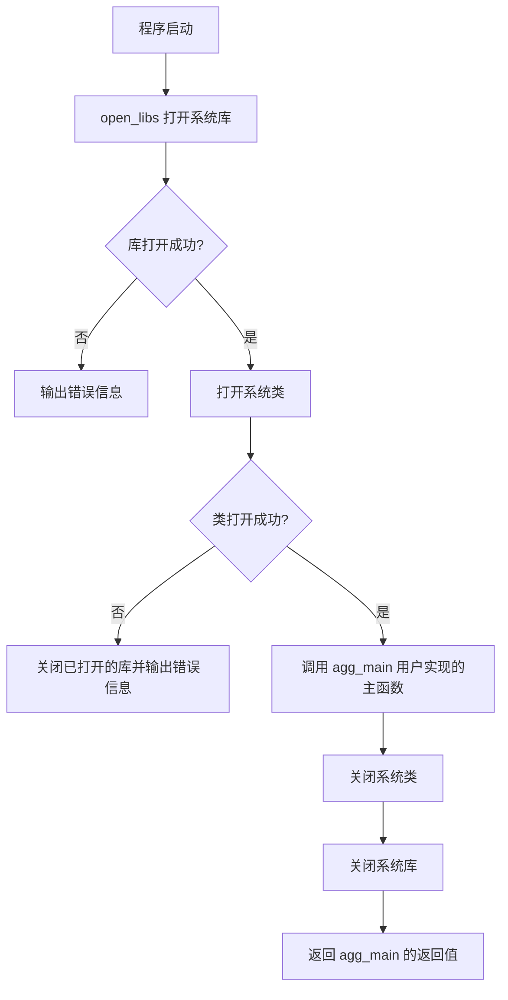

#### 带注释源码

```cpp
//----------------------------------------------------------------------------
// Anti-Grain Geometry - Version 2.4
// 应用程序入口点声明
//----------------------------------------------------------------------------

// 用户实现的主函数原型，由应用程序提供
// 参数:
//   argc - 命令行参数个数
//   argv - 命令行参数数组
// 返回值:
//   应用程序退出状态码
int agg_main(int argc, char* argv[]);

//----------------------------------------------------------------------------
// 打开系统库的函数原型
//----------------------------------------------------------------------------
bool open_libs();

//----------------------------------------------------------------------------
// 关闭系统库的函数原型
//----------------------------------------------------------------------------
void close_libs();

//----------------------------------------------------------------------------
// 标准主函数入口
// 负责初始化系统资源、打开必要的库和类，然后调用用户实现的 agg_main
//----------------------------------------------------------------------------
int main(int argc, char* argv[])
{
    // 第一步：打开系统库（图形、窗口、数据类型等）
    if ( !open_libs() )  {
        // 库打开失败，输出错误信息并返回
        IDOS->Printf("Can't open libraries.\n");
        return -1;
    }

    // 第二步：打开系统类（请求器类、窗口类）
    ClassLibrary* requester =
        IIntuition->OpenClass("requester.class", 51, &RequesterClass);
    ClassLibrary* window =
        IIntuition->OpenClass("window.class", 51, &WindowClass);
    
    // 检查类是否打开成功
    if ( requester == 0 || window == 0 )
    {
        // 类打开失败，输出错误信息
        IDOS->Printf("Can't open classes.\n");
        // 关闭已打开的类
        IIntuition->CloseClass(requester);
        IIntuition->CloseClass(window);
        // 关闭已打开的库
        close_libs();
        return -1;
    }

    // 第三步：调用用户实现的主函数
    int rc = agg_main(argc, argv);

    // 第四步：清理资源
    IIntuition->CloseClass(window);
    IIntuition->CloseClass(requester);
    close_libs();

    // 返回用户主函数的返回码
    return rc;
}
```


### `open_libs`

该函数是 Amiga 平台初始化的核心步骤，负责打开并获取 Anti-Grain Geometry 在 Amiga 系统（特别是 Picasso96 环境）下运行所需的所有系统库（DataTypes, Graphics, Intuition, Keymap, Picasso96API）及其接口。

参数：
-  无

返回值：`bool`，如果所有库及其接口成功打开则返回 `true`，否则返回 `false` 并调用 `close_libs` 进行清理。

#### 流程图

```mermaid
graph TD
    A[Start: open_libs] --> B[打开系统库: datatypes.library, graphics.library, intuition.library, keymap.library, Picasso96API.library]
    B --> C[获取接口: IDataTypes, IGraphics, IIntuition, IKeymap, IP96]
    C --> D{检查接口有效性}
    D -->|失败 (任意接口为NULL)| E[调用 close_libs 清理资源]
    E --> F[Return false]
    D -->|成功| G[Return true]
```

#### 带注释源码

```cpp
//----------------------------------------------------------------------------
// 打开并获取 Amiga 系统库及接口
//----------------------------------------------------------------------------
bool open_libs()
{
    // 1. 打开所需的系统库
    // 使用 OpenLibrary 获取库基址，版本号硬编码为特定版本（如 51 或 2）
    DataTypesBase = IExec->OpenLibrary("datatypes.library", 51);
    GraphicsBase = IExec->OpenLibrary("graphics.library", 51);
    IntuitionBase = IExec->OpenLibrary("intuition.library", 51);
    KeymapBase = IExec->OpenLibrary("keymap.library", 51);
    P96Base = IExec->OpenLibrary("Picasso96API.library", 2);

    // 2. 获取接口
    // 使用 GetInterface 获取库的主接口 (main)，版本为 1
    // 如果 OpenLibrary 成功但 GetInterface 失败（例如库文件损坏或不兼容），指针将为 0
    IDataTypes = reinterpret_cast<DataTypesIFace*>(
        IExec->GetInterface(DataTypesBase, "main", 1, 0));
    IGraphics = reinterpret_cast<GraphicsIFace*>(
        IExec->GetInterface(GraphicsBase, "main", 1, 0));
    IIntuition = reinterpret_cast<IntuitionIFace*>(
        IExec->GetInterface(IntuitionBase, "main", 1, 0));
    IKeymap = reinterpret_cast<KeymapIFace*>(
        IExec->GetInterface(KeymapBase, "main", 1, 0));
    IP96 = reinterpret_cast<P96IFace*>(
        IExec->GetInterface(P96Base, "main", 1, 0));

    // 3. 验证所有接口
    // 必须确保所有 5 个接口都成功获取，否则无法正常运行
    if ( IDataTypes == 0 ||
         IGraphics == 0 ||
         IIntuition == 0 ||
         IKeymap == 0 ||
         IP96 == 0 )
    {
        // 失败处理：调用 close_libs 关闭已打开的库，避免资源泄漏
        close_libs();
        return false;
    }
    else
    {
        return true;
    }
}
```


### `close_libs`

该函数是全局清理函数，用于释放在 `open_libs` 过程中获取的系统库接口（Interface）并关闭（Close）对应的动态库（Library），确保程序退出时资源被正确释放，避免内存泄漏或系统句柄泄露。

参数：
- **无**

返回值：`void`，无返回值。

#### 流程图

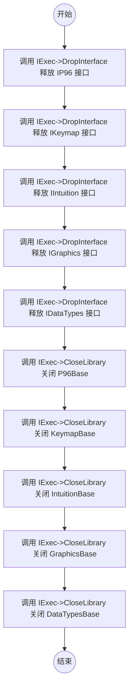

#### 带注释源码

```cpp
//----------------------------------------------------------------------------
// 释放接口并关闭库
//----------------------------------------------------------------------------
void close_libs()
{
	// 1. 首先按照后进先出(LIFO)的原则，逐一释放通过 GetInterface 获取的接口。
	// 这是一个好习惯，确保在使用完接口对应的库功能后再进行释放。
	
	// 释放 Picasso96 API 接口
	IExec->DropInterface(reinterpret_cast<Interface*>(IP96));
	// 释放 Keymap 库接口
	IExec->DropInterface(reinterpret_cast<Interface*>(IKeymap));
	// 释放 Intuition 库接口
	IExec->DropInterface(reinterpret_cast<Interface*>(IIntuition));
	// 释放 Graphics 库接口
	IExec->DropInterface(reinterpret_cast<Interface*>(IGraphics));
	// 释放 DataTypes 库接口
	IExec->DropInterface(reinterpret_cast<Interface*>(IDataTypes));

	// 2. 释放完接口后，关闭通过 OpenLibrary 打开的库。
	// 注意：只有当接口全部被成功释放后，才能安全地关闭库。
	
	// 关闭 Picasso96 库
	IExec->CloseLibrary(P96Base);
	// 关闭 Keymap 库
	IExec->CloseLibrary(KeymapBase);
	// 关闭 Intuition 库
	IExec->CloseLibrary(IntuitionBase);
	// 关闭 Graphics 库
	IExec->CloseLibrary(GraphicsBase);
	// 关闭 DataTypes 库
	IExec->CloseLibrary(DataTypesBase);
}
```


### `main`

标准 C 程序入口，负责整个应用程序的生命周期管理。首先调用 `open_libs()` 打开所需的系统库（图形、窗口、数据类型等），然后调用 `agg_main()` 执行应用程序的主逻辑，最后调用 `close_libs()` 关闭所有已打开的库。如果库或类无法打开，会输出错误信息并返回错误码。

参数：

- `argc`：`int`，命令行参数的数量
- `argv`：`char*[]`，命令行参数数组，包含程序名称和用户传入的参数

返回值：`int`，返回应用程序的退出码，0 表示正常退出，-1 表示初始化失败

#### 流程图

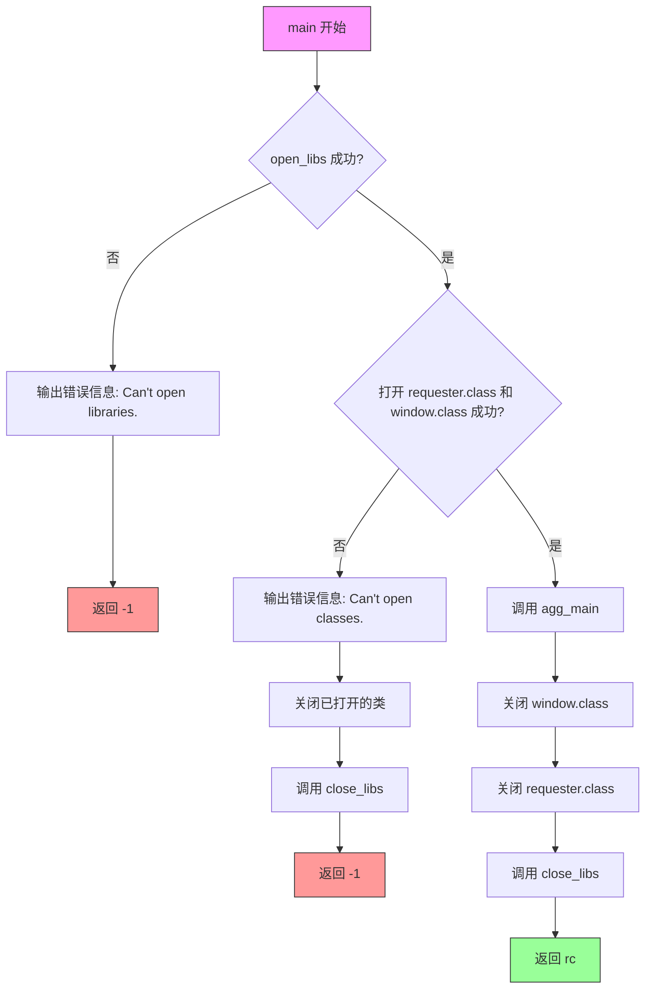

#### 带注释源码

```cpp
//----------------------------------------------------------------------------
// main - 程序入口点
//----------------------------------------------------------------------------
int main(int argc, char* argv[])
{
    // 第一步：打开系统库（图形、窗口、数据类型、键映射、P96等）
    if ( !open_libs() )  {
        // 如果打开库失败，输出错误信息到控制台
        IDOS->Printf("Can't open libraries.\n");
        return -1;  // 返回错误码
    }

    // 第二步：打开 BOOPSI 类（用于创建窗口和请求器对象）
    ClassLibrary* requester =
        IIntuition->OpenClass("requester.class", 51, &RequesterClass);
    ClassLibrary* window =
        IIntuition->OpenClass("window.class", 51, &WindowClass);
    
    // 检查类是否成功打开
    if ( requester == 0 || window == 0 )
    {
        IDOS->Printf("Can't open classes.\n");
        // 清理已打开的类
        IIntuition->CloseClass(requester);
        IIntuition->CloseClass(window);
        close_libs();  // 关闭之前打开的库
        return -1;
    }

    // 第三步：调用应用程序主逻辑（AGG 示例程序）
    int rc = agg_main(argc, argv);

    // 第四步：清理资源
    IIntuition->CloseClass(window);      // 关闭 window 类
    IIntuition->CloseClass(requester);   // 关闭 requester 类
    close_libs();                        // 关闭所有系统库

    // 返回应用程序的退出码
    return rc;
}
```


### `agg::handle_idcmp`

该函数是 Anti-Grain Geometry (AGG) 库在 AmigaOS/AROS 平台下的核心事件分发回调（Hook）。它被挂载到 Intuition 窗口的 IDCMP（Intuition Device Context Message Port）上，负责接收原始的窗口消息（鼠标按键、鼠标移动、键盘按键），将其转换为 AGG 抽象的坐标系和虚拟键码，并优先分发给内部的 UI 控件层（如有），最后分发给应用程序的回调函数。

参数：

- `hook`：`Hook*`，AmigaOS 的钩子结构指针。其 `h_Data` 成员包含了指向 `platform_support` 实例的指针，用于访问应用状态和回调函数。
- `obj`：`APTR`，触发此钩子的 Intuition 对象指针（通常为窗口对象），在本函数内部主要通过 `app` 实例获取窗口信息。
- `msg`：`IntuiMessage*`，指向 Intuition 消息结构的指针，包含事件类型 (`Class`)、事件码 (`Code`)、鼠标坐标 (`MouseX`, `MouseY`) 及修饰键 (`Qualifier`) 等关键信息。

返回值：`void`，该钩子函数不返回任何值，事件处理结果通过修改 `platform_support` 对象的状态并触发回调函数体现。

#### 流程图

```mermaid
flowchart TD
    A([Start: handle_idcmp Hook]) --> B[Get platform_support* app from hook->h_Data]
    B --> C[Get Window* from app]
    C --> D[Calculate Mouse X, Y relative to window]
    D --> E{msg->Class}
    
    E -->|IDCMP_MOUSEBUTTONS| F[Check msg->Code (UP/DOWN prefix)]
    F --> G{Is UP?}
    G -->|Yes| H[Check Button: SELECTUP / MENUUP]
    H --> I[Set input_flags: mouse_left/mouse_right]
    I --> J[Set dragging = false]
    J --> K{Call m_ctrls.on_mouse_button_up}
    K -->|True| L[force_redraw / on_ctrl_change]
    K -->|False| M[Call on_mouse_button_up]
    
    G -->|No| N[Check Button: SELECTDOWN / MENUDOWN]
    N --> O[Set input_flags / dragging = true]
    O --> P{Call m_ctrls.in_rect}
    P -->|Inside| Q[Handle Control Interaction]
    P -->|Outside| R[Call on_mouse_button_down]
    
    E -->|IDCMP_MOUSEMOVE| S{Is dragging?}
    S -->|Yes| T{Check m_ctrls.on_mouse_move}
    S -->|No| U{Check m_ctrls.in_rect}
    T -->|True| V[force_redraw]
    T -->|False| W[Call on_mouse_move]
    U -->|True| X[Update Control]
    U -->|False| W
    
    E -->|IDCMP_RAWKEY| Y[MapRawKey to char buffer]
    Y --> Z{Check num_chars}
    Z -->|1-3 chars| AA[Compose key_code]
    Z -->|Other| AB[Map Special Keys (Arrows, F-keys)]
    AA --> AC{Is Key Up?}
    AB --> AC
    AC -->|Yes| AD{Check Arrow Keys}
    AD -->|True| AE[m_ctrls.on_arrow_keys]
    AD -->|False| AF[Call on_key (Key Up)]
    AE -->|True| AG[force_redraw]
    AC -->|No| AH[m_last_key = key_code]
    
    L --> END([End])
    M --> END
    Q --> END
    R --> END
    V --> END
    W --> END
    AG --> END
    AF --> END
    AH --> END
```

#### 带注释源码

```cpp
//------------------------------------------------------------------------
// handle_idcmp
//------------------------------------------------------------------------
// 这是一个 AmigaOS 风格的 Hook 函数 (Hook::h_Entry)。
// 它作为回调被传递给 Intuition 窗口，用于处理 WMHI (Window Message Hook) 
// 或者更通常地，通过 IDCMP Hook 机制处理原始输入事件。
void handle_idcmp(Hook* hook, APTR obj, IntuiMessage* msg)
{
    // 1. 从 Hook 的用户数据中提取 platform_support 实例
    //    这是在 init() 中通过 ASOHOOK_Data 设置的。
    platform_support* app =
        reinterpret_cast<platform_support*>(hook->h_Data);
    
    // 2. 获取当前窗口指针
    Window* window = app->m_specific->m_window;

    // 3. 计算鼠标位置 (相对于客户区，去除边框)
    //    Intuition 的鼠标坐标是相对于窗口左上角的。
    int16 x = msg->MouseX - window->BorderLeft;

    int16 y = 0;
    //    AGG 可能需要垂直翻转坐标系 (flip_y)，特别是对于渲染缓冲区。
    if ( app->flip_y() )
    {
        // 如果 flip_y，Y=0 在底部
        y = window->Height - window->BorderBottom - msg->MouseY;
    }
    else
    {
        // 标准坐标系，Y=0 在顶部
        y = msg->MouseY - window->BorderTop;
    }

    // 4. 根据消息类型 (Class) 进行分发处理
    switch ( msg->Class )
    {
    // ---------------------------------------------------
    // 鼠标按键事件 (IDCMP_MOUSEBUTTONS)
    // ---------------------------------------------------
    case IDCMP_MOUSEBUTTONS:
        // IECODE_UP_PREFIX 用于区分按下和抬起
        if ( msg->Code & IECODE_UP_PREFIX )
        {
            // 鼠标抬起
            if ( msg->Code == SELECTUP )
            {
                app->m_specific->m_input_flags = mouse_left;
                app->m_specific->m_dragging = false;
            }
            else if ( msg->Code == MENUUP )
            {
                app->m_specific->m_input_flags = mouse_right;
                app->m_specific->m_dragging = false;
            }
            else
            {
                return; // 未知的按键，忽略
            }

            // 优先处理 UI 控件
            if ( app->m_ctrls.on_mouse_button_up(x, y) )
            {
                app->on_ctrl_change();
                app->force_redraw();
            }

            // 处理应用层回调
            app->on_mouse_button_up(x, y, app->m_specific->m_input_flags);
        }
        else
        {
            // 鼠标按下
            if ( msg->Code == SELECTDOWN )
            {
                app->m_specific->m_input_flags = mouse_left;
                app->m_specific->m_dragging = true;
            }
            else if ( msg->Code == MENUDOWN )
            {
                app->m_specific->m_input_flags = mouse_right;
                app->m_specific->m_dragging = true;
            }
            else
            {
                return;
            }

            // 设置当前控件位置
            app->m_ctrls.set_cur(x, y);
            
            // 优先检查是否点击了 UI 控件
            if ( app->m_ctrls.on_mouse_button_down(x, y) )
            {
                app->on_ctrl_change();
                app->force_redraw();
            }
            else
            {
                // 如果点击的不是控件，检查是否在控件区域内并尝试激活
                if ( app->m_ctrls.in_rect(x, y) )
                {
                    if ( app->m_ctrls.set_cur(x, y) )
                    {
                        app->on_ctrl_change();
                        app->force_redraw();
                    }
                }
                else
                {
                    // 只有当鼠标不在控件上时，才触发应用的鼠标按下事件
                    app->on_mouse_button_down(x, y,
                        app->m_specific->m_input_flags);
                }
            }
        }
        break;

    // ---------------------------------------------------
    // 鼠标移动事件 (IDCMP_MOUSEMOVE)
    // ---------------------------------------------------
    case IDCMP_MOUSEMOVE:
        // 如果正处于拖拽状态（按住鼠标）
        if ( app->m_specific->m_dragging )  {
            // 优先处理控件的拖拽移动
            if ( app->m_ctrls.on_mouse_move(x, y,
                 app->m_specific->m_input_flags & mouse_left) != 0 )
            {
                app->on_ctrl_change();
                app->force_redraw();
            }
            else
            {
                // 如果不是控件内的拖拽，触发应用层的鼠标移动
                if ( !app->m_ctrls.in_rect(x, y) )
                {
                    app->on_mouse_move(x, y,
                        app->m_specific->m_input_flags);
                }
            }
        }
        break;

    // ---------------------------------------------------
    // 键盘原始事件 (IDCMP_RAWKEY)
    // ---------------------------------------------------
    case IDCMP_RAWKEY:
    {
        // 构造 InputEvent 结构用于 Keymap 转换
        static InputEvent ie = { 0 };
        ie.ie_Class = IECLASS_RAWKEY;
        ie.ie_Code = msg->Code;
        ie.ie_Qualifier = msg->Qualifier;

        static const unsigned BUF_SIZE = 16;
        static char key_buf[BUF_SIZE];
        
        // 将原始硬件键码转换为 ASCII/ANSI 字符串
        int16 num_chars = IKeymap->MapRawKey(&ie, key_buf, BUF_SIZE, 0);

        uint32 code = 0x00000000;
        // 组装多字节字符 (虽然大多数情况下是单字符)
        switch ( num_chars )
        {
        case 1:
            code = key_buf[0];
            break;
        case 2:
            code = key_buf[0]<<8 | key_buf[1];
            break;
        case 3:
            code = key_buf[0]<<16 | key_buf[1]<<8 | key_buf[2];
            break;
        }

        uint16 key_code = 0;

        // 处理普通 ASCII 字符
        if ( num_chars == 1 )
        {
            if ( code >= IECODE_ASCII_FIRST && code <= IECODE_ASCII_LAST )
            {
                key_code = code;
            }
        }

        // 如果不是 ASCII 字符，尝试映射为 AGG 的虚拟键码 (key_xxx)
        if ( key_code == 0 )
        {
            switch ( code )
            {
            case 0x00000008: key_code = key_backspace;    break;
            case 0x00000009: key_code = key_tab;      break;
            case 0x0000000D: key_code = key_return;       break;
            case 0x0000001B: key_code = key_escape;       break;
            case 0x0000007F: key_code = key_delete;       break;
            // 方向键 (Raw key codes 在 Amiga 上通常带有特定前缀)
            case 0x00009B41:
            case 0x00009B54: key_code = key_up;       break;
            case 0x00009B42:
            case 0x00009B53: key_code = key_down;     break;
            case 0x00009B43:
            case 0x009B2040: key_code = key_right;    break;
            case 0x00009B44:
            case 0x009B2041: key_code = key_left;     break;
            // 功能键
            case 0x009B307E: key_code = key_f1;       break;
            case 0x009B317E: key_code = key_f2;       break;
            case 0x009B327E: key_code = key_f3;       break;
            case 0x009B337E: key_code = key_f4;       break;
            case 0x009B347E: key_code = key_f5;       break;
            case 0x009B357E: key_code = key_f6;       break;
            case 0x009B367E: key_code = key_f7;       break;
            case 0x009B377E: key_code = key_f8;       break;
            case 0x009B387E: key_code = key_f9;       break;
            case 0x009B397E: key_code = key_f10;       break;
            case 0x009B3F7E: key_code = key_scrollock;  break;
            }
        }

        // 处理按键抬起事件 (Key Up)
        if ( ie.ie_Code & IECODE_UP_PREFIX )
        {
            if ( app->m_specific->m_last_key != 0 )
            {
                // 检查是否是方向键，用于控制 UI 控件的焦点移动
                bool left = (key_code == key_left) ? true : false;
                bool right = (key_code == key_right) ? true : false;
                bool down = (key_code == key_down) ? true : false;
                bool up = (key_code == key_up) ? true : false;

                if ( app->m_ctrls.on_arrow_keys(left, right, down, up) )
                {
                    app->on_ctrl_change();
                    app->force_redraw();
                }
                else
                {
                    // 触发应用的 on_key 回调 (参数 0 表示 Key Up)
                    app->on_key(x, y, app->m_specific->m_last_key, 0);
                }

                app->m_specific->m_last_key = 0;
            }
        }
        else
        {
            // 按下事件：记录当前按下的键，以便在抬起时知道是什么键
            app->m_specific->m_last_key = key_code;
        }
        break;
    }
    default:
        break;
    }
}
```


### `agg::platform_specific::platform_specific`

该构造函数是 Amiga 平台特定的图形初始化方法，负责根据传入的像素格式初始化 Amiga 特定的位图格式映射 (RGBFTYPE)、颜色深度 (m_bpp) 等渲染参数，并初始化所有图像位图指针。

参数：

- `support`：`platform_support&`，引用主平台支持对象，用于后续窗口和渲染缓冲区的管理
- `format`：`pix_format_e`，目标像素格式枚举（如 RGB24、BGRA32 等）
- `flip_y`：`bool`，是否翻转 Y 轴坐标（用于不同坐标系）

返回值：`无`（构造函数）

#### 流程图

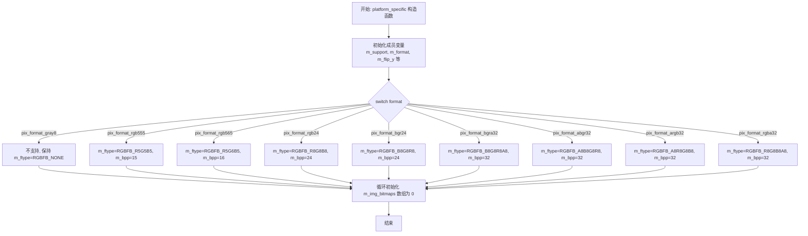

#### 带注释源码

```cpp
//------------------------------------------------------------------------
// platform_specific 构造函数
// 功能: 初始化 Amiga 特定参数和位图格式映射
// 参数:
//   support - 引用主 platform_support 对象
//   format  - 像素格式枚举
//   flip_y  - 是否翻转 Y 坐标
//------------------------------------------------------------------------
platform_specific::platform_specific(platform_support& support,
	pix_format_e format, bool flip_y) :
	// 初始化列表: 按声明顺序初始化各成员
	m_support(support),        // 引用主平台支持对象
	m_ftype(RGBFB_NONE),       // 初始为不支持的颜色格式
	m_format(format),          // 存储目标像素格式
	m_bpp(0),                  // 初始位深为 0
	m_bitmap(0),               // 主位图指针置空
	m_flip_y(flip_y),          // Y轴翻转标志
	m_width(0),                // 初始窗口宽度
	m_height(0),               // 初始窗口高度
	m_window_obj(0),           // 窗口对象指针置空
	m_window(0),               // 窗口结构指针置空
	m_idcmp_hook(0),           // IDCMP 钩子置空
	m_input_flags(0),         // 输入标志初始化
	m_dragging(false),        // 拖拽状态初始化
	m_start_time(0.0),         // 计时器初始化
	m_last_key(0)             // 最后按键初始化
{
	// 根据像素格式设置 Amiga RGBFTYPE 和对应位深
	switch ( format )
	{
	case pix_format_gray8:
		// 灰度格式在 Amiga 上不支持
		break;
	case pix_format_rgb555:
		m_ftype = RGBFB_R5G5B5;   // 15位 RGB555 格式
		m_bpp = 15;
		break;
	case pix_format_rgb565:
		m_ftype = RGBFB_R5G6B5;   // 16位 RGB565 格式
		m_bpp = 16;
		break;
	case pix_format_rgb24:
		m_ftype = RGBFB_R8G8B8;   // 24位 BGR 格式
		m_bpp = 24;
		break;
	case pix_format_bgr24:
		m_ftype = RGBFB_B8G8R8;   // 24位 BGR 格式
		m_bpp = 24;
		break;
	case pix_format_bgra32:
		m_ftype = RGBFB_B8G8R8A8; // 32位 BGRA 格式
		m_bpp = 32;
		break;
	case pix_format_abgr32:
		m_ftype = RGBFB_A8B8G8R8; // 32位 ABGR 格式
		m_bpp = 32;
		break;
	case pix_format_argb32:
		m_ftype = RGBFB_A8R8G8B8; // 32位 ARGB 格式
		m_bpp = 32;
		break;
    case pix_format_rgba32:
		m_ftype = RGBFB_R8G8B8A8; // 32位 RGBA 格式
		m_bpp = 32;
		break;
	}

	// 初始化所有图像位图指针为 0
	// 防止使用未初始化的指针导致崩溃
	for ( unsigned i = 0; i < platform_support::max_images; ++i )
	{
		m_img_bitmaps[i] = 0;
	}
}
```


### `agg::platform_specific::~platform_specific`

该析构函数是 `platform_specific` 类的资源清理入口，负责在对象生命周期结束时安全地释放 AmigaOS/Picasso96 系统资源。它依次销毁窗口对象、释放主位图和所有图像位图缓存，以及释放事件处理钩子，防止内存泄漏。

#### 参数

- （无显式参数，C++ 隐式传递 `this` 指针）

#### 返回值

- `void`（隐式返回）

#### 流程图

```mermaid
graph TD
    Start([开始析构]) --> DisposeWindow[IIntuition->DisposeObject<br/>m_window_obj]
    DisposeWindow --> FreeMainBitmap[IP96->p96FreeBitMap<br/>m_bitmap]
    FreeMainBitmap --> LoopStart{遍历 i < max_images}
    LoopStart --> FreeImgBitmap[IP96->p96FreeBitMap<br/>m_img_bitmaps[i]]
    FreeImgBitmap --> LoopEnd{i++}
    LoopEnd --> LoopStart
    LoopStart --> CheckHook{m_idcmp_hook != 0?}
    CheckHook -- Yes --> FreeHook[IExec->FreeSysObject<br/>ASOT_HOOK, m_idcmp_hook]
    CheckHook -- No --> End([结束析构])
    FreeHook --> End
```

#### 带注释源码

```cpp
//------------------------------------------------------------------------
// 析构函数：~platform_specific
// 职责：释放平台特定资源，防止内存泄漏
//------------------------------------------------------------------------
platform_specific::~platform_specific()
{
    // 1. 销毁窗口对象 (BOOPSI Object)
    // 释放通过 NewObject 创建的 Intuition 窗口对象
    IIntuition->DisposeObject(m_window_obj);

    // 2. 释放主位图
    // 释放用于屏幕显示渲染的 Picasso96 位图
    IP96->p96FreeBitMap(m_bitmap);

    // 3. 释放图像位图缓存
    // 遍历所有预加载的图像，释放其对应的位图资源
    for ( unsigned i = 0; i < platform_support::max_images; ++i )
    {
        IP96->p96FreeBitMap(m_img_bitmaps[i]);
    }

    // 4. 释放 IDCMP 钩子
    // 如果事件处理钩子存在，则通过 Exec 系统进行释放
    if ( m_idcmp_hook != 0 )
    {
        IExec->FreeSysObject(ASOT_HOOK, m_idcmp_hook);
    }
}
```


### `agg::platform_specific::handle_input`

处理窗口消息循环，接收并分派 WM_HANDLEINPUT 消息事件，包括窗口关闭、空闲状态和窗口大小调整等事件。

参数：无

返回值：`bool`，返回 true 表示接收到窗口关闭信号，需要退出消息循环；返回 false 表示继续处理消息。

#### 流程图

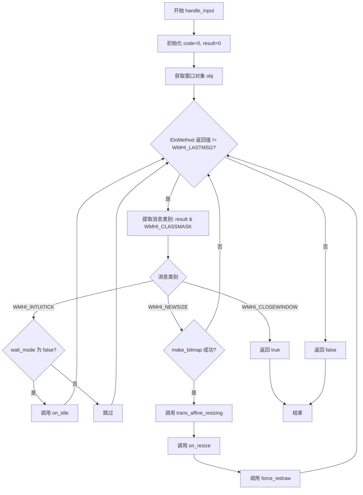

#### 带注释源码

```
bool platform_specific::handle_input()
{
    int16 code = 0;          // 用于存储输入事件代码
    uint32 result = 0;       // 用于存储消息处理结果
    Object* obj = reinterpret_cast<Object*>(m_window_obj);  // 将窗口对象转换为 BOOPSI Object 指针

    // 循环处理窗口消息，直到收到 WMHI_LASTMSG 结束标志
    while ( (result = IIntuition->IDoMethod(obj, WM_HANDLEINPUT,
            &code)) != WMHI_LASTMSG )
    {
        // 提取消息类别（取结果的低几位）
        switch ( result & WMHI_CLASSMASK )
        {
        case WMHI_CLOSEWINDOW:       // 窗口关闭消息
            return true;             // 返回 true 表示需要退出主循环
            break;
        case WMHI_INTUITICK:         // Intuition 心跳消息（每帧一次）
            if ( !m_support.wait_mode() )  // 如果不在等待模式
            {
                m_support.on_idle();       // 调用空闲处理回调
            }
            break;
        case WMHI_NEWSIZE:           // 窗口大小改变消息
            if ( make_bitmap() )           // 重新创建位图
            {
                m_support.trans_affine_resizing(m_width, m_height);  // 更新仿射变换矩阵
                m_support.on_resize(m_width, m_height);              // 调用窗口大小改变回调
                m_support.force_redraw();                            // 强制重绘
            }
            break;
        }
    }

    return false;  // 未收到关闭消息，继续消息循环
}
```


### `agg::platform_specific::load_img`

使用 DataTypes 系统将图像文件加载到渲染缓冲区，支持多种像素格式转换。

参数：

- `file`：`const char*`，图像文件的完整路径或文件名
- `idx`：`unsigned`，图像槽位索引，用于管理多个图像（对应 `m_img_bitmaps` 数组）
- `rbuf`：`rendering_buffer*`，目标渲染缓冲区，用于存储加载后的图像数据

返回值：`bool`，成功加载返回 `true`，否则返回 `false`

#### 流程图

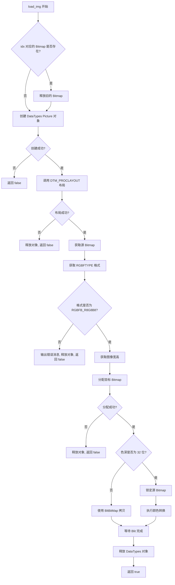

#### 带注释源码

```cpp
//------------------------------------------------------------------------
// 加载图像文件到渲染缓冲区
//------------------------------------------------------------------------
bool platform_specific::load_img(const char* file, unsigned idx,
	rendering_buffer* rbuf)
{
	// 如果该槽位已有图像，先释放旧Bitmap避免内存泄漏
	if ( m_img_bitmaps[idx] != 0 )
	{
		IP96->p96FreeBitMap(m_img_bitmaps[idx]);
		m_img_bitmaps[idx] = 0;
	}

	bool result = false;

	// 使用 AmigaOS DataTypes 系统创建图像对象
	// DTA_GroupID, GID_PICTURE 指定我们要加载的是图像
	// PDTA_DestMode, PMODE_V43 指定目标模式
	// PDTA_Remap, FALSE 禁止自动调色板重映射，保留原始颜色
	Object* picture = IDataTypes->NewDTObject(const_cast<STRPTR>(file),
		DTA_GroupID, GID_PICTURE,
		PDTA_DestMode, PMODE_V43,
		PDTA_Remap, FALSE,
		TAG_END);
	if ( picture != 0 )
	{
		// 调用布局方法使 DataTypes 准备图像数据
		gpLayout layout;
		layout.MethodID = DTM_PROCLAYOUT;
		layout.gpl_GInfo = 0;
		layout.gpl_Initial = 1;
		ULONG loaded = IDataTypes->DoDTMethodA(picture, 0, 0,
			reinterpret_cast<Msg>(&layout));
		if ( loaded != 0 )
		{
			BitMap* src_bitmap = 0;
			// 获取图像的位图属性
			IDataTypes->GetDTAttrs(picture,
				PDTA_ClassBitMap, &src_bitmap,
				TAG_END);

			bool supported = false;

			// 获取源图像的像素格式
			RGBFTYPE ftype = static_cast<RGBFTYPE>(IP96->p96GetBitMapAttr(
				src_bitmap, P96BMA_RGBFORMAT));

			switch ( ftype )
			{
			case RGBFB_R8G8B8:
				// 当前仅支持 24 位 RGB 格式
				supported = true;
				break;
			default:
				// 其它格式（如调色板模式）暂不支持
				m_support.message("File uses unsupported graphics mode.");
				break;
			}

			if ( supported )  {
				// 获取图像尺寸
				uint16 width = IP96->p96GetBitMapAttr(src_bitmap,
					P96BMA_WIDTH);
				uint16 height = IP96->p96GetBitMapAttr(src_bitmap,
					P96BMA_HEIGHT);

				// 为目标图像分配 Picasso96 Bitmap
				// BMF_USERPRIVATE 表示私有内存，m_ftype 为平台支持的像素格式
				m_img_bitmaps[idx] = IP96->p96AllocBitMap(width, height,
					m_bpp, BMF_USERPRIVATE, 0, m_ftype);
				if ( m_img_bitmaps[idx] != 0 )
				{
					// 获取目标Bitmap的内存指针
					int8u* buf = reinterpret_cast<int8u*>(
						IP96->p96GetBitMapAttr(m_img_bitmaps[idx],
						P96BMA_MEMORY));
					// 获取每行字节数
					int bpr = IP96->p96GetBitMapAttr(m_img_bitmaps[idx],
						P96BMA_BYTESPERROW);
					// 根据是否翻转Y轴计算步长
					int stride = (m_flip_y) ? -bpr : bpr;
					// 将内存附加到渲染缓冲区
					rbuf->attach(buf, width, height, stride);

					// 32位色深需要特殊处理：P96将Alpha设为0
					// 无法直接用于真彩色模式转换
					if ( m_bpp == 32 )
					{
						// 锁定源Bitmap以获取直接内存访问
						RenderInfo ri;
						int32 lock = IP96->p96LockBitMap(src_bitmap,
							reinterpret_cast<uint8*>(&ri),
							sizeof(RenderInfo));

						// 创建源渲染缓冲区
						rendering_buffer rbuf_src;
						rbuf_src.attach(
							reinterpret_cast<int8u*>(ri.Memory),
							width, height, (m_flip_y) ?
								-ri.BytesPerRow : ri.BytesPerRow);

						// 根据目标格式执行颜色转换
						switch ( m_format )
						{
						case pix_format_bgra32:
							color_conv(rbuf, &rbuf_src,
								color_conv_rgb24_to_bgra32());
							break;
						case pix_format_abgr32:
							color_conv(rbuf, &rbuf_src,
								color_conv_rgb24_to_abgr32());
							break;
						case pix_format_argb32:
							color_conv(rbuf, &rbuf_src,
								color_conv_rgb24_to_argb32());
							break;
						case pix_format_rgba32:
							color_conv(rbuf, &rbuf_src,
								color_conv_rgb24_to_rgba32());
							break;
						}

						// 解锁源Bitmap
						IP96->p96UnlockBitMap(src_bitmap, lock);
					}
					else
					{
						// 24位及以下使用硬件Blit拷贝
						// ABC|ABNC 表示使用所有颜色通道且忽略Alpha
						// 0xFF 表示所有像素都拷贝
						IGraphics->BltBitMap(src_bitmap, 0, 0,
							m_img_bitmaps[idx], 0, 0, width, height,
							ABC|ABNC, 0xFF, 0);
					}

					result = true;
				}
			}
		}
	}

	// 等待所有Blit操作完成，确保数据已写入
	IGraphics->WaitBlit();
	// 释放DataTypes对象
	IDataTypes->DisposeDTObject(picture);

	return result;
}
```


### `agg::platform_specific::create_img`

该函数是 `platform_specific` 类的成员方法，用于在内存中创建指定尺寸的图像缓冲。它通过 Picasso96 API (`p96AllocBitMap`) 分配位图资源，获取内存地址和行字节信息，并根据 `flip_y` 设置计算内存步长，最终将分配的缓冲区附加到传入的 `rendering_buffer` 对象中。

参数：

- `idx`：`unsigned`，图像索引，用于指定要创建或替换的图像槽位。
- `rbuf`：`rendering_buffer*`，指向渲染缓冲区的指针，函数将把新创建的图像内存区域附加到此缓冲区。
- `width`：`unsigned`，要创建的图像宽度（像素）。
- `height`：`unsigned`，要创建的图像高度（像素）。

返回值：`bool`，如果成功分配位图并附加缓冲区则返回 `true`，否则返回 `false`。

#### 流程图

```mermaid
flowchart TD
    A([开始]) --> B{检查 m_img_bitmaps[idx] 是否已存在}
    B -->|是| C[调用 p96FreeBitMap 释放旧位图]
    C --> D
    B -->|否| D[调用 p96AllocBitMap 分配新位图]
    D --> E{分配是否成功?}
    E -->|否| F[返回 false]
    E -->|是| G[获取位图内存地址 P96BMA_MEMORY]
    G --> H[获取每行字节数 P96BMA_BYTESPERROW]
    H --> I{检查 m_flip_y}
    I -->|true| J[设置 stride = -bpr]
    I -->|false| K[设置 stride = bpr]
    J --> L[调用 rbuf->attach 附加缓冲区]
    K --> L
    L --> M([返回 true])
```

#### 带注释源码

```cpp
//------------------------------------------------------------------------
bool platform_specific::create_img(unsigned idx, rendering_buffer* rbuf,
	unsigned width, unsigned height)
{
	// 如果该索引处已有位图，先释放旧位图以避免内存泄漏
	if ( m_img_bitmaps[idx] != 0 )
	{
		IP96->p96FreeBitMap(m_img_bitmaps[idx]);
		m_img_bitmaps[idx] = 0;
	}

	// 使用 Picasso96 API 分配新的位图
	// 参数：宽度，高度，位深，标志，父位图（此处为m_bitmap），像素格式
	m_img_bitmaps[idx] = IP96->p96AllocBitMap(width, height,
		m_bpp, BMF_USERPRIVATE, m_bitmap, m_ftype);
	
	// 检查位图分配是否成功
	if ( m_img_bitmaps[idx] != 0 )
	{
		// 获取位图的数据内存地址
		int8u* buf = reinterpret_cast<int8u*>(
			IP96->p96GetBitMapAttr(m_img_bitmaps[idx],
			P96BMA_MEMORY));
		
		// 获取位图的每行字节数 (Bytes Per Row)
		int bpr = IP96->p96GetBitMapAttr(m_img_bitmaps[idx],
			P96BMA_BYTESPERROW);
		
		// 根据是否需要翻转Y轴计算步长
		// 如果翻转，步长为负，图像数据在内存中将从下往上排列
		int stride = (m_flip_y) ? -bpr : bpr;

		// 将分配的内存缓冲区附加到 rendering_buffer
		// 这样上层渲染代码就可以通过 rbuf 访问这块内存了
		rbuf->attach(buf, width, height, stride);

		return true;
	}

	return false;
}
```


### `agg::platform_specific.make_bitmap`

根据窗口当前尺寸重新分配主位图，确保渲染缓冲区与窗口大小同步。

参数：

- （无显式参数，使用类成员变量 `m_window` 获取窗口信息）

返回值：`bool`，成功返回 `true`，失败返回 `false`（如位图分配失败）

#### 流程图

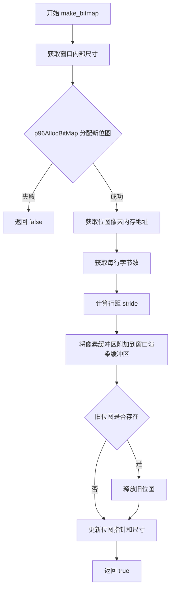

#### 带注释源码

```
bool platform_specific::make_bitmap()
{
    // 声明用于存储窗口尺寸的变量
    uint32 width = 0;
    uint32 height = 0;
    
    // 使用 Intuition 库获取窗口的内部宽度和高度
    IIntuition->GetWindowAttrs(m_window,
        WA_InnerWidth, &width,
        WA_InnerHeight, &height,
        TAG_END);

    // 使用 Picasso96 API 分配新的位图
    // 参数：宽度、高度、位深、标志（用户私有+清零）、保留、颜色格式
    BitMap* bm = IP96->p96AllocBitMap(width, height, m_bpp,
        BMF_USERPRIVATE|BMF_CLEAR, 0, m_ftype);
    
    // 分配失败则返回 false
    if ( bm == 0 )
    {
        return false;
    }

    // 获取位图的像素数据内存地址
    int8u* buf = reinterpret_cast<int8u*>(
        IP96->p96GetBitMapAttr(bm, P96BMA_MEMORY));
    
    // 获取位图每行的字节数
    int bpr = IP96->p96GetBitMapAttr(bm, P96BMA_BYTESPERROW);
    
    // 根据是否需要翻转 Y 轴计算行距（stride）
    // 如果 flip_y 为 true，行距为负值以实现垂直翻转
    int stride = (m_flip_y) ? -bpr : bpr;

    // 将新分配的像素缓冲区附加到窗口渲染缓冲区
    m_support.rbuf_window().attach(buf, width, height, stride);

    // 如果存在旧的位图，先释放其资源
    if ( m_bitmap != 0 )
    {
        IP96->p96FreeBitMap(m_bitmap);
        m_bitmap = 0;
    }

    // 更新成员变量，保存新位图及其尺寸
    m_bitmap = bm;
    m_width = width;
    m_height = height;

    return true;
}
```


### `agg::platform_support::platform_support`

该构造函数是 `platform_support` 类的构造函数，负责初始化平台支持层的基础成员变量，包括像素格式、翻转标志、窗口缓冲区等核心组件，并设置默认窗口标题。

参数：

- `format`：`pix_format_e`，指定像素格式（如 RGB24、BGRA32 等），决定了图形渲染的颜色深度和格式
- `flip_y`：`bool`，控制 Y 轴是否翻转，用于适配不同坐标系的图形渲染需求

返回值：`无`（构造函数）

#### 流程图

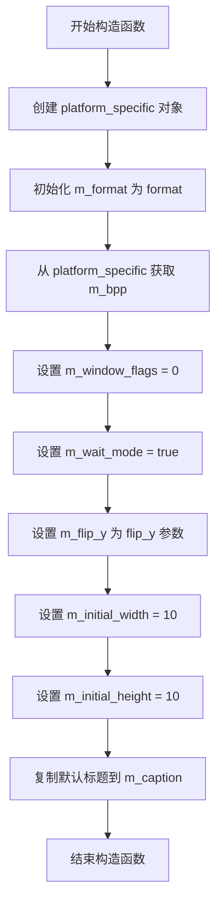

#### 带注释源码

```cpp
//------------------------------------------------------------------------
// platform_support 构造函数
// 初始化平台支持层的基本成员变量
//------------------------------------------------------------------------
platform_support::platform_support(pix_format_e format, bool flip_y) :
    // 创建平台特定实现对象，传入自身引用、像素格式和翻转标志
    m_specific(new platform_specific(*this, format, flip_y)),
    // 保存像素格式
    m_format(format),
    // 从平台特定对象获取位深度
    m_bpp(m_specific->m_bpp),
    // 初始化窗口标志为0（无特殊窗口样式）
    m_window_flags(0),
    // 默认进入等待模式（阻塞等待事件）
    m_wait_mode(true),
    // 保存 Y 轴翻转标志
    m_flip_y(flip_y),
    // 设置默认初始宽度为10像素
    m_initial_width(10),
    // 设置默认初始高度为10像素
    m_initial_height(10)
{
    // 设置默认窗口标题为 "Anti-Grain Geometry"
    // 使用 strncpy 确保最多复制256个字符，防止缓冲区溢出
    std::strncpy(m_caption, "Anti-Grain Geometry", 256);
}
```

#### 成员初始化说明

| 成员变量 | 类型 | 初始化值 | 说明 |
|---------|------|---------|------|
| `m_specific` | `platform_specific*` | `new platform_specific(...)` | 平台特定实现，包含 AmigaOS 相关的图形处理 |
| `m_format` | `pix_format_e` | `format` 参数 | 像素格式枚举值 |
| `m_bpp` | `unsigned` | `m_specific->m_bpp` | 从平台层获取的实际位深度 |
| `m_window_flags` | `unsigned` | `0` | 窗口标志，0 表示无特殊标志 |
| `m_wait_mode` | `bool` | `true` | 等待模式，阻塞等待用户输入 |
| `m_flip_y` | `bool` | `flip_y` 参数 | Y 轴翻转标志 |
| `m_initial_width` | `unsigned` | `10` | 初始窗口宽度 |
| `m_initial_height` | `unsigned` | `10` | 初始窗口高度 |
| `m_caption` | `char[256]` | "Anti-Grain Geometry" | 窗口标题 |


### `agg::platform_support::~platform_support`

析构函数，用于释放 `platform_support` 类实例的资源。它通过删除动态分配的 `m_specific` 成员来触发 `platform_specific` 类的析构函数，从而清理底层的窗口、位图以及IDCMP钩子等操作系统特定资源。

参数：
- 无

返回值：`void`，无返回值（析构函数）

#### 流程图

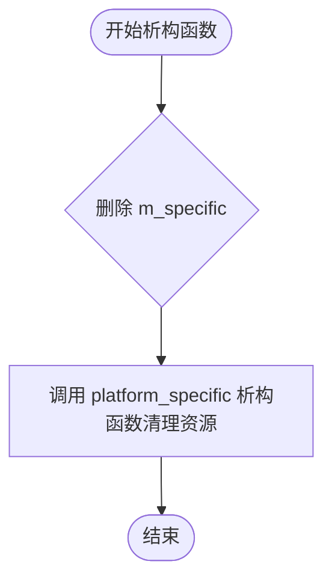

#### 带注释源码

```cpp
	//------------------------------------------------------------------------
	platform_support::~platform_support()
	{
		// 删除平台特定实现对象
		// 这会触发 platform_specific 的析构函数，释放窗口对象、位图内存等
		delete m_specific;
	}
```


### `platform_support.caption`

设置窗口标题的成员方法，用于更新应用程序窗口的标题栏文本。如果窗口已经创建，则立即通过操作系统调用更新窗口标题；否则仅更新内部保存的标题文本，待窗口创建时生效。

参数：

- `cap`：`const char*`，新的窗口标题文本，以 null 结尾的字符串

返回值：`void`，无返回值

#### 流程图

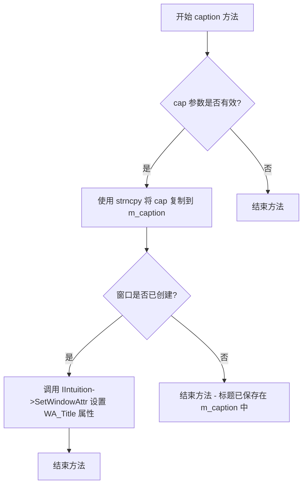

#### 带注释源码

```cpp
//------------------------------------------------------------------------
// 设置窗口标题
// 参数 cap: 新的窗口标题文本
//------------------------------------------------------------------------
void platform_support::caption(const char* cap)
{
    // 使用 strncpy 安全复制字符串到成员变量 m_caption
    // 最多复制 256 个字符，确保字符串以 null 结尾
    std::strncpy(m_caption, cap, 256);
    
    // 检查窗口是否已经创建（m_window 不为 0）
    if ( m_specific->m_window != 0 )
    {
        // 声明一个未使用的变量，避免编译器警告
        // 此处可能是历史遗留代码或占位符
        const char* ignore = reinterpret_cast<const char*>(-1);
        
        // 调用 Intuition 系统的 SetWindowAttr 函数
        // 设置窗口的 WA_Title 属性来更新窗口标题栏显示
        IIntuition->SetWindowAttr(m_specific->m_window,
            WA_Title, m_caption, sizeof(char*));
    }
}
```


### `agg::platform_support::start_timer`

启动高精度计时器，记录当前时间为后续 `elapsed_time()` 调用准备。该函数使用系统调用 `gettimeofday` 获取当前时间（秒和微秒），将其转换为以秒为单位的双精度浮点数，并存储在平台特定实现的成员变量中，以便后续计算经过的时间。

参数：无

返回值：`void`，无返回值。该函数不返回任何值，仅执行计时器的初始化操作。

#### 流程图

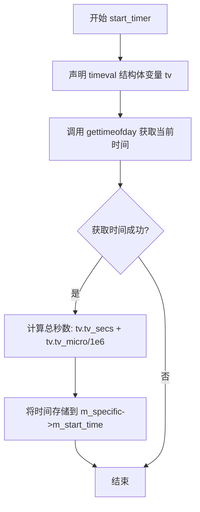

#### 带注释源码

```cpp
//------------------------------------------------------------------------
// 启动高精度计时器
// 该函数使用 gettimeofday 获取当前系统时间（秒和微秒），
// 并将其转换为以秒为单位的双精度浮点数存储起来，
// 供后续 elapsed_time() 函数计算经过的时间差
//------------------------------------------------------------------------
void platform_support::start_timer()
{
    // 声明一个 timeval 结构体用于存储时间
    // timeval 包含 tv_sec（秒）和 tv_usec（微秒）两个成员
    timeval tv;
    
    // 调用 POSIX 系统函数获取当前时间
    // 第一个参数是存储结果的 timeval 指针
    // 第二个参数是时区信息，传入 0 表示使用本地时区
    gettimeofday(&tv, 0);
    
    // 将时间转换为以秒为单位的双精度浮点数
    // tv.tv_secs 表示秒部分
    // tv.tv_micro/1e6 将微秒转换为秒（除以 1000000）
    // 结果存储在 platform_specific 对象的 m_start_time 成员中
    m_specific->m_start_time = tv.tv_secs + tv.tv_micro/1e6;
}
```


### `agg::platform_support::elapsed_time`

获取自上次调用 `start_timer()` 以来经过的时间（以毫秒为单位）。

参数：
- （无）

返回值：`double`，表示流逝的毫秒数。

#### 流程图

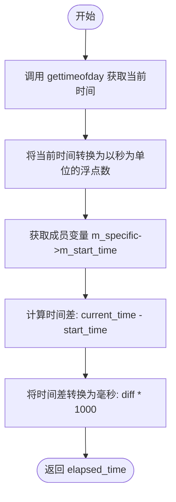

#### 带注释源码

```cpp
//------------------------------------------------------------------------
double platform_support::elapsed_time() const
{
    // 声明一个 timeval 结构体用于存储时间
    timeval tv;
    // 获取当前时间（秒和微秒）
    gettimeofday(&tv, 0);
    
    // 将当前时间转换为以秒为单位的 double 值
    // tv.tv_secs 为秒，tv.tv_micro 为微秒 (1e-6秒)
    double end_time = tv.tv_secs + tv.tv_micro/1e6;

    // 计算流逝的秒数：当前时间减去开始时间
    double elasped_seconds = end_time - m_specific->m_start_time;
    
    // 将秒转换为毫秒 (1秒 = 1000毫秒)
    double elasped_millis = elasped_seconds*1e3;

    // 返回流逝的毫秒数
    return elasped_millis;
}
```


### `platform_support::raw_display_handler`

该方法用于返回平台原始显示句柄（Raw Display Handler），允许上层代码直接访问底层窗口系统或显示服务器的原生句柄。然而，在当前 AmigaOS/Picasso96 实现中，该功能未被实现，方法直接返回空指针（0）。

参数：
- （无参数）

返回值：`void*`，返回原始显示句柄的指针。当前实现返回 `0`（nullptr），表示该功能在当前平台上不可用。

#### 流程图

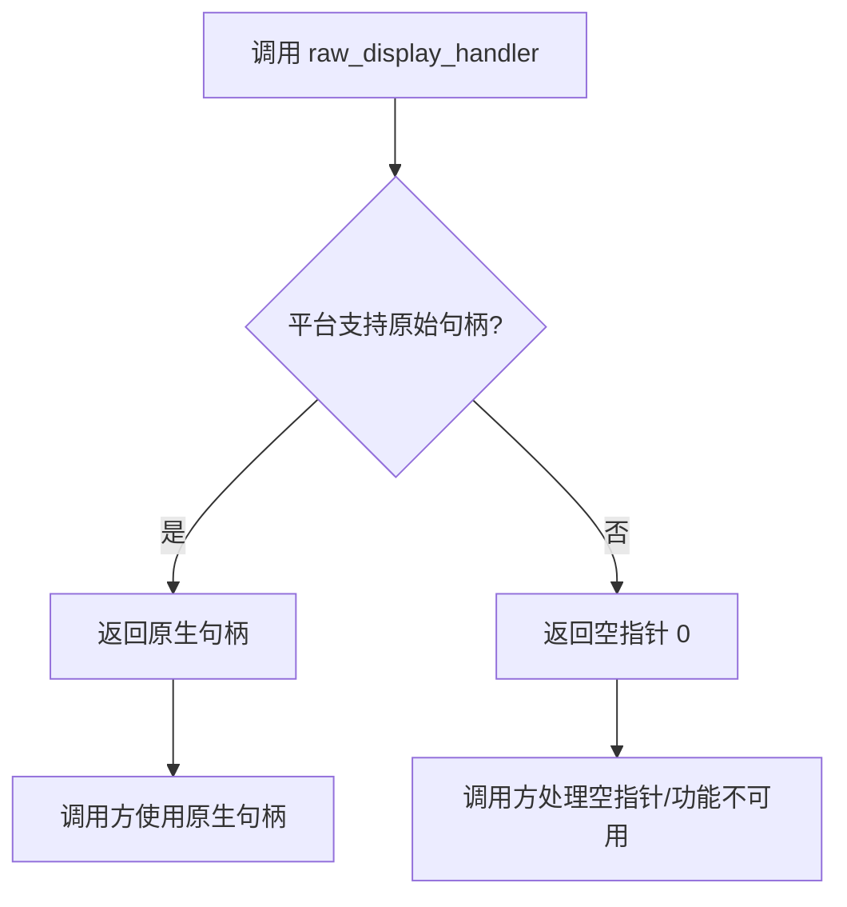

#### 带注释源码

```cpp
//------------------------------------------------------------------------
// 返回平台原始显示句柄
// 在 AmigaOS/Picasso96 实现中，该功能未实现
//------------------------------------------------------------------------
void* platform_support::raw_display_handler()
{
    // 当前平台不支持获取原始显示句柄，返回 0 表示不可用
    // 调用方需要自行处理空指针的情况
    return 0;	// Not available.
}
```

#### 设计说明

1. **设计意图**：
   - 该方法旨在为高级应用提供访问底层显示系统的能力
   - 在某些平台（如 X11、Win32）上，可以返回原生窗口句柄供外部渲染库使用

2. **当前实现状态**：
   - 返回 `0`（nullptr）表示功能未实现
   - 注释明确标注 "Not available"

3. **潜在优化空间**：
   - 可考虑在 AmigaOS 上实现返回 Intuition Window 指针或 Picasso96 相关的原生句柄
   - 需要根据具体使用场景决定返回值的类型和语义

4. **错误处理**：
   - 由于返回空指针，调用方必须进行空值检查
   - 建议在文档中明确说明该方法在当前平台的行为


### `platform_support::message`

该方法用于向用户显示消息，在支持图形界面的系统上弹出消息请求者对话框，在不支持图形界面的系统上则回退到控制台打印输出。

参数：

- `msg`：`const char*`，要显示的消息文本内容

返回值：`void`，无返回值

#### 流程图

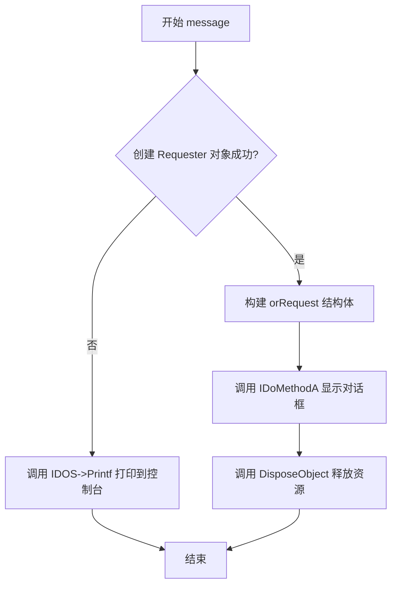

#### 带注释源码

```cpp
//------------------------------------------------------------------------
// 显示消息对话框或打印到控制台
//------------------------------------------------------------------------
void platform_support::message(const char* msg)
{
    // 使用 Intuition 库创建消息请求者对象
    APTR req = IIntuition->NewObject(RequesterClass, 0,
        REQ_TitleText, "Anti-Grain Geometry",  // 对话框标题
        REQ_Image, REQIMAGE_INFO,                // 信息图标
        REQ_BodyText, msg,                       // 消息正文
        REQ_GadgetText, "_Ok",                   // 确定按钮
        TAG_END);
    
    // 如果创建失败（可能是非图形环境），回退到控制台输出
    if ( req == 0 )
    {
        IDOS->Printf("Message: %s\n", msg);
        return;
    }

    // 初始化请求结构体
    orRequest reqmsg;
    reqmsg.MethodID = RM_OPENREQ;
    reqmsg.or_Attrs = 0;
    reqmsg.or_Window = m_specific->m_window;  // 关联到主窗口
    reqmsg.or_Screen = 0;
    
    // 执行打开请求者对话框的方法
    IIntuition->IDoMethodA(reinterpret_cast<Object*>(req),
        reinterpret_cast<Msg>(&reqmsg));
    
    // 释放请求者对象资源
    IIntuition->DisposeObject(req);
}
```

#### 相关组件信息

| 组件名称 | 描述 |
|---------|------|
| `platform_support` | 提供跨平台的应用程序框架基类 |
| `RequesterClass` | Amiga 系统中的请求者对话框类 |
| `IIntuition` | Amiga Intuition 库的接口指针 |
| `IDOS` | Amiga DOS 库的接口指针，用于控制台输出 |

#### 潜在技术债务与优化空间

1. **错误处理不完整**：当 `IDoMethodA` 调用失败时没有错误处理机制
2. **硬编码字符串**："Anti-Grain Geometry" 标题硬编码在方法内部，可考虑外部配置
3. **资源泄漏风险**：如果 `IDoMethodA` 抛出异常，`DisposeObject` 将不会被调用，建议使用 RAII 模式
4. **功能单一**：仅支持单按钮确定对话框，缺乏其他按钮类型支持（如是/否/取消）

#### 设计约束与接口契约

- **前置条件**：`msg` 参数必须为有效的 C 字符串指针
- **后置条件**：如果图形环境可用，则显示模态对话框直到用户点击确定；否则输出到控制台
- **异常安全性**：非异常安全实现，依赖调用方保证不会在对话框显示期间抛出异常
- **线程安全性**：非线程安全，必须在主线程调用


### `agg::platform_support::init`

该函数是 `platform_support` 类的核心初始化方法，负责在 AmigaOS 平台上创建窗口、分配位图、设置渲染环境以及初始化 AGG 渲染器。

参数：

- `width`：`unsigned`，窗口的内部宽度（像素）
- `height`：`unsigned`，窗口的内部高度（像素）
- `flags`：`unsigned`，窗口标志位（如 `agg::window_resize` 控制是否允许调整窗口大小）

返回值：`bool`，返回 `true` 表示初始化成功，返回 `false` 表示初始化失败（如不支持的像素格式、无法创建窗口等）

#### 流程图

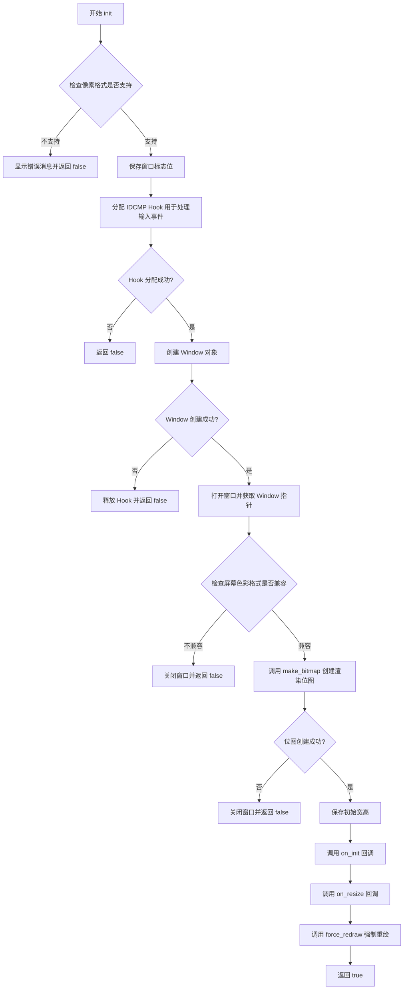

#### 带注释源码

```cpp
//------------------------------------------------------------------------
bool platform_support::init(unsigned width, unsigned height,
    unsigned flags)
{
    // 检查像素格式是否被支持（m_ftype 在 platform_specific 构造函数中根据 format 设置）
    if( m_specific->m_ftype == RGBFB_NONE )
    {
        message("Unsupported mode requested.");
        return false;
    }

    // 保存窗口标志位，用于后续判断（如是否允许调整大小）
    m_window_flags = flags;

    // 分配一个 IDCMP Hook，用于捕获窗口的输入事件（鼠标、键盘等）
    m_specific->m_idcmp_hook = reinterpret_cast<Hook*>(
        IExec->AllocSysObjectTags(ASOT_HOOK,
            ASOHOOK_Entry, handle_idcmp,      // 事件处理函数
            ASOHOOK_Data, this,              // 传递给处理函数的用户数据
            TAG_END));
    if ( m_specific->m_idcmp_hook == 0 )
    {
        return false;
    }

    // 创建一个窗口对象（BOOPSI 对象）
    m_specific->m_window_obj = IIntuition->NewObject(WindowClass, 0,
            WA_Title, m_caption,             // 窗口标题
            WA_AutoAdjustDClip, TRUE,        // 自动调整显示剪裁区域
            WA_InnerWidth, width,            // 内部宽度
            WA_InnerHeight, height,          // 内部高度
            WA_Activate, TRUE,                // 创建后自动激活
            WA_SmartRefresh, TRUE,           // 智能刷新模式
            WA_NoCareRefresh, TRUE,          // 不关心刷新
            WA_CloseGadget, TRUE,            // 显示关闭按钮
            WA_DepthGadget, TRUE,            // 显示深度调节按钮
            // 根据 flags 决定是否显示大小调节按钮
            WA_SizeGadget, (flags & agg::window_resize) ? TRUE : FALSE,
            WA_DragBar, TRUE,                 // 显示拖动条
            WA_AutoAdjust, TRUE,              // 自动调整
            WA_ReportMouse, TRUE,            // 报告鼠标位置
            WA_RMBTrap, TRUE,                // 捕获右键鼠标按钮
            WA_MouseQueue, 1,                // 鼠标事件队列长度
            // 设置窗口感兴趣的 IDCMP 事件类别
            WA_IDCMP,
                IDCMP_NEWSIZE |              // 窗口大小改变
                IDCMP_MOUSEBUTTONS |        // 鼠标按钮事件
                IDCMP_MOUSEMOVE |           // 鼠标移动事件
                IDCMP_RAWKEY |              // 原始键盘事件
                IDCMP_INTUITICKS,           // 定时直觉消息
            // 关联前面创建的 IDCMP Hook
            WINDOW_IDCMPHook, m_specific->m_idcmp_hook,
            // 指定 Hook 需要处理的事件类型
            WINDOW_IDCMPHookBits,
                IDCMP_MOUSEBUTTONS |
                IDCMP_MOUSEMOVE |
                IDCMP_RAWKEY,
            TAG_END);
    if ( m_specific->m_window_obj == 0 )
    {
        return false;
    }

    // 通过向窗口对象发送 WM_OPEN 消息来打开窗口
    Object* obj = reinterpret_cast<Object*>(m_specific->m_window_obj);
    m_specific->m_window =
        reinterpret_cast<Window*>(IIntuition->IDoMethod(obj, WM_OPEN));
    if ( m_specific->m_window == 0 )
    {
        return false;
    }

    // 检查屏幕的像素格式是否被 AGG 支持
    RGBFTYPE ftype = static_cast<RGBFTYPE>(IP96->p96GetBitMapAttr(
        m_specific->m_window->RPort->BitMap, P96BMA_RGBFORMAT));

    switch ( ftype )
    {
    case RGBFB_A8R8G8B8:
    case RGBFB_B8G8R8A8:
    case RGBFB_R5G6B5PC:
        break;
    default:
        message("Unsupported screen mode.\n");
        return false;
    }

    // 创建用于 AGG 渲染的位图
    if ( !m_specific->make_bitmap() )
    {
        return false;
    }

    // 保存初始窗口尺寸
    m_initial_width = width;
    m_initial_height = height;

    // 调用用户的初始化回调
    on_init();
    // 调用用户的窗口大小改变回调
    on_resize(width, height);
    // 强制重绘窗口内容
    force_redraw();

    return true;
}
```


### `platform_support::run`

主事件循环函数，负责处理窗口事件和用户输入。该函数获取窗口信号掩码并与Ctrl+C中断信号组合，然后进入事件循环等待信号。当收到Ctrl+C信号或窗口关闭事件时退出循环，返回0表示正常结束。

参数： 无

返回值：`int`，返回0表示主事件循环正常结束

#### 流程图

```mermaid
flowchart TD
    A[开始 run] --> B[获取窗口信号掩码 window_mask]
    B --> C[组合等待掩码 wait_mask = window_mask | SIGBREAKF_CTRL_C]
    C --> D[设置 done = false]
    D --> E{!done}
    E -->|否| F[返回 0，结束]
    E -->|是| G[IExec->Wait 等待信号]
    G --> H{sig_mask & SIGBREAKF_CTRL_C}
    H -->|是| I[设置 done = true]
    H -->|否| J[调用 m_specific->handle_input]
    J --> K{handle_input 返回值}
    K -->|true 窗口关闭| I
    K -->|false 继续循环| E
    I --> F
```

#### 带注释源码

```cpp
//------------------------------------------------------------------------
// 主事件循环函数
// 处理窗口消息和用户输入事件
//------------------------------------------------------------------------
int platform_support::run()
{
    // 获取窗口的信号掩码，用于Wait()函数监听窗口事件
    uint32 window_mask = 0;
    IIntuition->GetAttr(WINDOW_SigMask, m_specific->m_window_obj,
        &window_mask);
    
    // 组合等待掩码：窗口信号 + Ctrl+C中断信号
    uint32 wait_mask = window_mask | SIGBREAKF_CTRL_C;

    // 循环控制标志
    bool done = false;

    // 主事件循环
    while ( !done )
    {
        // 等待信号（阻塞式）
        uint32 sig_mask = IExec->Wait(wait_mask);
        
        // 检查是否收到Ctrl+C中断信号
        if ( sig_mask & SIGBREAKF_CTRL_C )
        {
            done = true;  // 退出循环
        }
        else
        {
            // 处理窗口输入事件
            // 如果返回true表示窗口已关闭
            done = m_specific->handle_input();
        }
    }

    // 正常退出返回0
    return 0;
}
```


### `agg::platform_support::img_ext`

该函数返回平台支持的文件扩展名，当前实现固定返回 BMP 格式的扩展名 `.bmp`。

参数：
- （无参数）

返回值：`const char*`，返回平台支持的文件扩展名字符串（".bmp"）

#### 流程图

```mermaid
flowchart TD
    A[开始 img_ext] --> B[返回常量字符串 ".bmp"]
    B --> C[结束]
```

#### 带注释源码

```cpp
//------------------------------------------------------------------------
// 返回平台支持的文件扩展名
// 该函数为 const 成员函数，不修改对象状态
// 当前实现固定返回 ".bmp" 字符串，表示支持 BMP 图像格式
//------------------------------------------------------------------------
const char* platform_support::img_ext() const
{
    return ".bmp";  // 返回 BMP 格式的文件扩展名常量字符串
}
```


### `platform_support::full_file_name`

该函数是文件路径处理的核心方法，负责接收文件名并返回完整的文件路径字符串。在当前实现中，它直接返回输入的文件名，但设计为可被重写以支持自定义路径处理逻辑。

参数：
- `file_name`：`const char*`，输入的文件名或相对路径

返回值：`const char*`，处理后的完整文件路径

#### 流程图

```mermaid
graph TD
    A[开始: full_file_name] --> B{检查file_name有效性}
    B -->|有效| C[返回file_name]
    B -->|无效| D[返回nullptr或原值]
    C --> E[结束]
    D --> E
```

#### 带注释源码

```cpp
//------------------------------------------------------------------------
// full_file_name - 返回完整的文件路径
// 参数:
//   file_name - 输入的文件名或相对路径
// 返回值:
//   处理后的完整文件路径字符串
//------------------------------------------------------------------------
const char* platform_support::full_file_name(const char* file_name)
{
    // 当前实现直接返回输入的文件名，不做任何处理
    // 注意：此方法设计为可被重写，以支持自定义路径处理逻辑
    return file_name;
}
```

#### 补充说明

**设计意图与使用场景**：
- 该函数是 `platform_support` 类提供的文件路径处理钩子
- 在当前 AmigaOS 平台的实现中，它是一个直接的传递函数
- 可供子类重写以实现自定义的文件名处理逻辑（如添加路径前缀、扩展名处理等）

**与相关方法的关系**：
- `load_img()` 方法实际使用 `full_file_name()` 来获取完整的文件路径
- 当前 `load_img()` 实现中绕过了 `full_file_name()`，直接对文件名进行了扩展名处理，这可能导致不一致性

**潜在优化建议**：
1. **设计一致性**：`load_img()` 方法直接对文件名进行扩展名检查和追加，绕过了 `full_file_name()` 方法，建议统一使用该方法处理文件名
2. **功能扩展**：当前实现未充分利用该方法的可重写性，建议实现完整的路径处理逻辑（如路径拼接、文件存在性检查等）
3. **错误处理**：建议增加对空指针或无效路径的检查和处理


### `platform_support.load_img`

该方法是 `platform_support` 类的公共图像加载接口，负责验证图像索引、确保文件扩展名为 `.bmp`，并调用底层平台特定的加载实现将图像数据读入渲染缓冲区。

参数：

- `idx`：`unsigned`，图像槽索引，用于指定加载到哪个图像缓冲区（必须在 `max_images` 范围内）
- `file`：`const char*`，图像文件路径或文件名

返回值：`bool`，如果图像加载成功返回 `true`，否则返回 `false`（索引越界或底层加载失败）

#### 流程图

```mermaid
flowchart TD
    A[开始 load_img] --> B{idx < max_images?}
    B -->|否| C[返回 false]
    B -->|是| D[复制文件名到 fn]
    E[计算文件名长度] --> F{长度 < 4 或后4字符 ≠ '.bmp'?}
    F -->|是| G[追加 '.bmp' 扩展名]
    F -->|否| H[保持原文件名]
    G --> I
    H --> I[调用 m_specific->load_img]
    I --> J{底层加载成功?}
    J -->|否| K[返回 false]
    J -->|是| L[返回 true]
```

#### 带注释源码

```
//------------------------------------------------------------------------
// platform_support::load_img - 公共图像加载包装方法
// 参数:
//   idx   - unsigned   图像缓冲区索引 (0 到 max_images-1)
//   file  - const char* 图像文件名或路径
// 返回值: bool - 加载成功返回 true, 失败返回 false
//------------------------------------------------------------------------
bool platform_support::load_img(unsigned idx, const char* file)
{
    // 检查索引是否在有效范围内
    if ( idx < max_images )
    {
        // 使用静态缓冲区存储处理后的文件名
        static char fn[1024];
        std::strncpy(fn, file, 1024);
        
        // 获取文件名长度
        int len = std::strlen(fn);
        
        // 如果文件名没有 .bmp 后缀,自动添加
        if ( len < 4 || std::strcmp(fn + len - 4, ".bmp") != 0 )
        {
            std::strncat(fn, ".bmp", 1024);
        }

        // 调用平台特定层的加载实现,传入渲染缓冲区地址
        return m_specific->load_img(fn, idx, &m_rbuf_img[idx]);
    }

    // 索引越界,返回失败
    return false;
}
```


### `platform_support::save_img`

该函数用于将指定索引的图像保存到文件，但由于当前平台不支持保存图像功能，函数直接显示提示信息并返回失败状态。

参数：

-  `idx`：`unsigned`，要保存的图像索引
-  `file`：`const char*`，目标文件名

返回值：`bool`，始终返回 `false`，表示保存操作失败

#### 流程图

```mermaid
flowchart TD
    A[开始 save_img] --> B{检查 idx 是否有效}
    B -->|idx >= max_images| C[返回 false]
    B -->|idx < max_images| D[调用 message 显示 'Not supported']
    D --> E[返回 false]
```

#### 带注释源码

```cpp
//------------------------------------------------------------------------
// 保存图像到文件
// 参数:
//   idx   - 图像索引 (0 到 max_images-1)
//   file  - 目标文件名
// 返回值:
//   bool  - 始终返回 false，表示不支持保存功能
//------------------------------------------------------------------------
bool platform_support::save_img(unsigned idx, const char* file)
{
    // 当前平台不支持保存图像功能，显示提示信息
    message("Not supported");
    
    // 返回 false 表示保存失败
    return false;
}
```

#### 相关上下文

该函数是 `platform_support` 类的一部分，与 `load_img` 函数配对使用。类似功能的 `load_img` 实现如下，可作为未来实现 `save_img` 的参考：

```cpp
bool platform_support::load_img(unsigned idx, const char* file)
{
    if ( idx < max_images )
    {
        static char fn[1024];
        std::strncpy(fn, file, 1024);
        int len = std::strlen(fn);
        if ( len < 4 || std::strcmp(fn + len - 4, ".bmp") != 0 )
        {
            std::strncat(fn, ".bmp", 1024);
        }

        return m_specific->load_img(fn, idx, &m_rbuf_img[idx]);
    }

    return false;
}
```


### `agg::platform_support::create_img`

该方法是 `platform_support` 类的公共接口，作为创建图像的包装方法。它负责验证图像索引，并在内部调用平台特定层（`platform_specific`）来分配位图内存和挂接渲染缓冲区。如果传入的宽度或高度为 0，该方法会自动使用当前窗口的尺寸进行创建。

#### 参数

- `idx`：`unsigned`，图像索引，指定在图像数组（`m_rbuf_img`）中的槽位。
- `width`：`unsigned`，期望创建的图像宽度（像素）。如果为 0，则使用窗口当前的宽度。
- `height`：`unsigned`，期望创建的图像高度（像素）。如果为 0，则使用窗口当前的高度。

#### 返回值

`bool`，表示图像创建是否成功。如果索引无效（大于等于 `max_images`）或底层分配失败，返回 `false`；否则返回 `true`。

#### 流程图

```mermaid
flowchart TD
    A([开始 create_img]) --> B{idx < max_images?}
    B -- 否 --> C[返回 false]
    B -- 是 --> D{width == 0?}
    D -- 是 --> E[width = m_specific->m_width]
    D -- 否 --> F{height == 0?}
    E --> F
    F -- 是 --> G[height = m_specific->m_height]
    F -- 否 --> H[调用 m_specific->create_img]
    G --> H
    H --> I{内部返回 true?}
    I -- 是 --> J([返回 true])
    I -- 否 --> K([返回 false])
```

#### 带注释源码

```cpp
//----------------------------------------------------------------------------
// 创建图像的公共方法
//----------------------------------------------------------------------------
bool platform_support::create_img(unsigned idx, unsigned width,
    unsigned height)
{
    // 1. 检查索引是否在有效范围内
    if ( idx < max_images )
    {
        // 2. 如果宽度为 0，则使用当前窗口的宽度作为默认值
        if ( width == 0 )
        {
            width = m_specific->m_width;
        }

        // 3. 如果高度为 0，则使用当前窗口的高度作为默认值
        if ( height == 0 )
        {
            height = m_specific->m_height;
        }

        // 4. 调用平台特定层实现真正的创建逻辑（分配位图并挂接缓冲区）
        // 传入当前索引、对应的 rendering_buffer 引用以及尺寸
        return m_specific->create_img(idx, &m_rbuf_img[idx], width,
            height);
    }

    // 如果索引无效，直接返回 false
    return false;
}
```


### `platform_support.force_redraw`

该方法强制重绘窗口，首先调用虚函数 `on_draw()` 执行应用程序的绘制逻辑（由用户实现），然后调用 `update_window()` 将渲染缓冲区的内容绘制到窗口显示区域。

参数：无

返回值：`void`，无返回值

#### 流程图

```mermaid
flowchart TD
    A[force_redraw 调用] --> B[on_draw 执行绘制]
    B --> C[update_window 更新窗口显示]
    C --> D[IGraphics.BltBitMapRastPort 拷贝位图到窗口]
    D --> E[流程结束]
```

#### 带注释源码

```cpp
//------------------------------------------------------------------------
// 强制重绘方法
// 调用流程：on_draw() → update_window()
//------------------------------------------------------------------------
void platform_support::force_redraw()
{
    // 第一步：调用虚函数 on_draw()，执行应用程序的绘制逻辑
    // on_draw() 是纯虚函数，具体绘制内容由用户继承类实现
    on_draw();
    
    // 第二步：调用 update_window()，将渲染缓冲区的内容拷贝到窗口显示
    update_window();
}

//------------------------------------------------------------------------
// 更新窗口显示
// 使用 BltBitMapRastPort 将内存位图拷贝到窗口渲染端口
// 自动处理颜色格式转换
//------------------------------------------------------------------------
void platform_support::update_window()
{
    // 使用 Graphics 库的 BltBitMapRastPort 函数进行位图拷贝
    // 参数说明：
    // - m_specific->m_bitmap: 源位图（渲染缓冲区）
    // - 0, 0: 源位图的起始坐标
    // - m_specific->m_window->RPort: 目标渲染端口
    // - m_specific->m_window->BorderLeft/BorderTop: 目标窗口的内边框偏移
    // - m_specific->m_width/m_height: 拷贝的宽高
    // - ABC|ABNC: 拷贝模式（ABC=ABC源_alpha，ABNC=ABC目标_非关键色）
    IGraphics->BltBitMapRastPort(m_specific->m_bitmap, 0, 0,
        m_specific->m_window->RPort, m_specific->m_window->BorderLeft,
        m_specific->m_window->BorderTop, m_specific->m_width,
        m_specific->m_height, ABC|ABNC);
}
```


### `agg::platform_support.update_window`

该函数将内部位图的内容拷贝到窗口的可见区域（RastPort），使用 Amiga 系统的 `BltBitMapRastPort` 函数实现位图到窗口的图形拷贝，并支持自动颜色转换。

参数：

- （无参数）

返回值：`void`，无返回值

#### 流程图

```mermaid
flowchart TD
    A[开始 update_window] --> B[获取平台特定数据 m_specific]
    B --> C[从 m_specific 获取位图 m_bitmap]
    C --> D[获取窗口的 RastPort]
    D --> E[计算目标坐标: BorderLeft, BorderTop]
    E --> F[获取位图宽度 m_width 和高度 m_height]
    F --> G[调用 IGraphics->BltBitMapRastPort 执行位图拷贝]
    G --> H[使用 ABC|ABNC 标志进行颜色复制]
    H --> I[结束]
```

#### 带注释源码

```cpp
//------------------------------------------------------------------------
// 将位图内容拷贝到窗口可见区域
//------------------------------------------------------------------------
void platform_support::update_window()
{
    // 注意：此函数执行自动颜色转换。
    // 使用 Amiga 的 BltBitMapRastPort 函数将位图拷贝到窗口的 RastPort
    // 参数说明：
    //   m_specific->m_bitmap: 源位图（应用程序渲染的目标）
    //   0, 0: 源位图的起始坐标
    //   m_specific->m_window->RPort: 目标 RastPort（窗口的图形上下文）
    //   m_specific->m_window->BorderLeft, m_specific->m_window->BorderTop: 目标起始坐标（考虑窗口边框）
    //   m_specific->m_width, m_specific->m_height: 拷贝的宽度和高度
    //   ABC|ABNC: 拷贝标志 - ABC表示使用所有颜色通道, ABNC表示不使用掩码
    IGraphics->BltBitMapRastPort(m_specific->m_bitmap, 0, 0,
        m_specific->m_window->RPort, m_specific->m_window->BorderLeft,
        m_specific->m_window->BorderTop, m_specific->m_width,
        m_specific->m_height, ABC|ABNC);
}
```


### `platform_support.on_init`

初始化回调函数，在平台支持初始化完成后被调用，供用户重写以执行初始化逻辑。

参数：无

返回值：`void`，无返回值

#### 流程图

```mermaid
flowchart TD
    A[平台初始化开始] --> B{初始化成功?}
    B -->|否| C[显示错误消息并退出]
    B -->|是| D[创建窗口和位图]
    D --> E[调用on_init回调]
    E --> F[调用on_resize回调]
    F --> G[强制重绘]
    G --> H[进入事件循环]
```

#### 带注释源码

```
//------------------------------------------------------------------------
// 在platform_support::init()中被调用
// 这是用户重写以执行初始化逻辑的入口点
//------------------------------------------------------------------------
void platform_support::on_init() {}
```

---

### `platform_support.on_resize`

窗口大小调整回调函数，当窗口尺寸发生变化时被调用。

参数：

- `sx`：`int`，新窗口宽度
- `sy`：`int`，新窗口高度

返回值：`void`，无返回值

#### 流程图

```mermaid
flowchart TD
    A[窗口收到WMHI_NEWSIZE事件] --> B[创建新位图]
    B --> C{位图创建成功?}
    C -->|否| D[返回false]
    C -->|是| E[更新变换矩阵]
    E --> F[调用on_resize回调]
    F --> G[强制重绘]
```

#### 带注释源码

```
//------------------------------------------------------------------------
// 当窗口大小改变时调用
// 参数sx: 新窗口宽度
// 参数sy: 新窗口高度
//------------------------------------------------------------------------
void platform_support::on_resize(int sx, int sy) {}
```

---

### `platform_support.on_idle`

空闲回调函数，当处于非等待模式且收到INTUITICK消息时被调用。

参数：无

返回值：`void`，无返回值

#### 流程图

```mermaid
flowchart TD
    A[事件循环运行] --> B{等待模式?}
    B -->|是| C[等待信号]
    B -->|否| D[收到INTUITICK]
    D --> E[调用on_idle回调]
    E --> C
```

#### 带注释源码

```
//------------------------------------------------------------------------
// 在非等待模式下周期性调用
// 用于需要持续更新的应用（如动画）
//------------------------------------------------------------------------
void platform_support::on_idle() {}
```

---

### `platform_support.on_mouse_move`

鼠标移动回调函数，当鼠标在窗口内移动时被调用。

参数：

- `x`：`int`，鼠标X坐标（相对于客户区）
- `y`：`int`，鼠标Y坐标（相对于客户区）
- `flags`：`unsigned`，鼠标按钮状态标志

返回值：`void`，无返回值

#### 流程图

```mermaid
flowchart TD
    A[收到IDCMP_MOUSEMOVE事件] --> B{正在拖拽?}
    B -->|是| C[调用控件的on_mouse_move]
    B -->|否| D{鼠标在控件区域内?}
    D -->|是| E[不触发回调]
    D -->|否| F[调用on_mouse_move回调]
```

#### 带注释源码

```
//------------------------------------------------------------------------
// 鼠标移动事件回调
// 参数x: 鼠标X坐标（客户区坐标系）
// 参数y: 鼠标Y坐标（客户区坐标系）
// 参数flags: 鼠标按钮状态标志（如mouse_left）
//------------------------------------------------------------------------
void platform_support::on_mouse_move(int x, int y, unsigned flags) {}
```

---

### `platform_support.on_mouse_button_down`

鼠标按钮按下回调函数，当鼠标按钮被按下时被调用。

参数：

- `x`：`int`，鼠标X坐标
- `y`：`int`，鼠标Y坐标
- `flags`：`unsigned`，鼠标按钮状态标志

返回值：`void`，无返回值

#### 流程图

```mermaid
flowchart TD
    A[收到IDCMP_MOUSEBUTTONS事件] --> B{按下还是释放?}
    B -->|释放| C[不处理]
    B -->|按下| D{哪个按钮?}
    D -->|SELECT| E[设置mouse_left标志]
    D -->|MENU| F[设置mouse_right标志]
    E --> G[设置拖拽状态]
    F --> G
    G --> H{点击在控件上?}
    H -->|是| I[处理控件点击]
    H -->|否| J[调用on_mouse_button_down回调]
```

#### 带注释源码

```
//------------------------------------------------------------------------
// 鼠标按钮按下事件回调
// 参数x: 鼠标X坐标（客户区坐标系）
// 参数y: 鼠标Y坐标（客户区坐标系）
// 参数flags: 按下的鼠标按钮（mouse_left或mouse_right）
//------------------------------------------------------------------------
void platform_support::on_mouse_button_down(int x, int y, unsigned flags) {}
```

---

### `platform_support.on_mouse_button_up`

鼠标按钮释放回调函数，当鼠标按钮被释放时被调用。

参数：

- `x`：`int`，鼠标X坐标
- `y`：`int`，鼠标Y坐标
- `flags`：`unsigned`，鼠标按钮状态标志

返回值：`void`，无返回值

#### 流程图

```mermaid
flowchart TD
    A[收到IDCMP_MOUSEBUTTONS事件] --> B{按下还是释放?}
    B -->|按下| C[不处理]
    B -->|释放| D{哪个按钮?}
    D -->|SELECTUP| E[设置mouse_left标志]
    D -->|MENUUP| F[设置mouse_right标志]
    E --> G[清除拖拽状态]
    F --> G
    G --> H[调用控件的on_mouse_button_up]
    H --> I[调用on_mouse_button_up回调]
```

#### 带注释源码

```
//------------------------------------------------------------------------
// 鼠标按钮释放事件回调
// 参数x: 鼠标X坐标（客户区坐标系）
// 参数y: 鼠标Y坐标（客户区坐标系）
// 参数flags: 释放的鼠标按钮（mouse_left或mouse_right）
//------------------------------------------------------------------------
void platform_support::on_mouse_button_up(int x, int y, unsigned flags) {}
```

---

### `platform_support.on_key`

键盘事件回调函数，当按下或释放键盘按键时被调用。

参数：

- `x`：`int`，当前鼠标X坐标
- `y`：`int`，当前鼠标Y坐标
- `key`：`unsigned`，键码
- `flags`：`unsigned`，修饰键标志

返回值：`void`，无返回值

#### 流程图

```mermaid
flowchart TD
    A[收到IDCMP_RAWKEY事件] --> B[映射原始键码]
    B --> C{键码有效?}
    C -->|否| D[检查特殊键]
    C -->|是| E[获取ASCII字符]
    D --> E
    E --> F{按键释放?}
    F -->|是| G[处理方向键]
    G --> H{是方向键?}
    H -->|是| I[调用控件方向键处理]
    H -->|否| J[调用on_key回调]
    F -->|否| K[保存键码等待释放]
```

#### 带注释源码

```
//------------------------------------------------------------------------
// 键盘事件回调
// 参数x: 事件触发时鼠标X坐标
// 参数y: 事件触发时鼠标Y坐标
// 参数key: 键码（ASCII码或特殊键码如key_up, key_down等）
// 参数flags: 修饰键状态标志
//------------------------------------------------------------------------
void platform_support::on_key(int x, int y, unsigned key, unsigned flags) {}
```

---

### `platform_support.on_ctrl_change`

控件状态改变回调函数，当用户与控件交互导致状态变化时被调用。

参数：无

返回值：`void`，无返回值

#### 流程图

```mermaid
flowchart TD
    A[控件状态改变] --> B[调用on_ctrl_change回调]
    B --> C[强制重绘]
```

#### 带注释源码

```
//------------------------------------------------------------------------
// 控件状态改变时调用
// 用户可以通过重写此方法响应控件交互
//------------------------------------------------------------------------
void platform_support::on_ctrl_change() {}
```

---

### `platform_support.on_draw`

绘制回调函数，当需要重绘窗口内容时被调用。用户应在此函数中实现绘图逻辑。

参数：无

返回值：`void`，无返回值

#### 流程图

```mermaid
flowchart TD
    A[需要重绘] --> B[调用on_draw回调]
    B --> C[用户执行绘图操作]
    C --> D[更新窗口显示]
```

#### 带注释源码

```
//------------------------------------------------------------------------
// 绘图回调函数 - 用户必须重写此函数实现具体绘图逻辑
// 在force_redraw()或窗口需要重绘时调用
//------------------------------------------------------------------------
void platform_support::on_draw() {}
```

---

### `platform_support.on_post_draw`

绘制完成后回调函数，在on_draw执行完成后被调用，用于执行后处理操作。

参数：

- `raw_handler`：`void*`，原始显示处理器指针

返回值：`void`，无返回值

#### 流程图

```mermaid
flowchart TD
    A[on_draw执行完成] --> B[调用on_post_draw回调]
    B --> C[传递原始显示处理器]
    C --> D[用户执行后处理]
```

#### 带注释源码

```
//------------------------------------------------------------------------
// 绘制完成后回调
// 参数raw_handler: 原始显示处理器指针（可用于平台特定操作）
// 可用于执行平台特定的渲染后处理
//------------------------------------------------------------------------
void platform_support::on_post_draw(void* raw_handler) {}
```

## 关键组件


### platform_specific 类

负责Amiga平台特定的图形和窗口管理，包括位图分配、图像加载、窗口事件处理和颜色格式转换。

### platform_support 类

提供跨平台的图形渲染抽象接口，管理窗口生命周期、事件循环、图像操作和渲染缓冲区的核心类。

### handle_idcmp 函数

处理窗口IDCMP消息钩子，将Amiga系统事件（鼠标、键盘）转换为AGG平台支持事件的核心函数。

### load_img 函数

使用DataTypes库加载图像文件，并根据需要将图像数据转换为目标像素格式（支持24位到32位的颜色转换）。

### create_img 函数

在内存中创建指定尺寸的图像缓冲区，分配P96位图并关联到渲染缓冲区。

### make_bitmap 函数

根据窗口当前尺寸动态创建或调整主渲染位图，处理内存分配和缓冲区附着。

### update_window 函数

将渲染缓冲区内容通过BltBitMapRastPort复制到窗口位图，实现自动颜色转换的显示更新。

### open_libs / close_libs 函数

管理Amiga系统库的打开和关闭，包括DataTypes、Graphics、Intuition、Keymap和Picasso96API接口。

### 颜色转换模块

利用color_conv函数族实现不同像素格式间的转换，支持RGB24到BGRA32/ABGR32/ARGB32/RGBA32的转换。

### 消息对话框

使用Intuition库的Requester类显示错误信息和用户通知的函数。

### 事件处理机制

通过wait_mode和on_idle实现轮询和事件驱动的双模式运行机制，支持窗口resize、鼠标和键盘事件处理。

## 问题及建议


### 已知问题

- **全局资源管理不当**：`close_libs()` 函数在某些接口获取失败时仍可能被调用，导致对空指针调用 `DropInterface` 或 `CloseLibrary`，可能引发崩溃
- **字符串处理不安全**：多处使用 `std::strncpy` 但未确保 null 终止符，且 `strncpy` 可能导致性能问题（填充多余字节）
- **`load_img` 错误处理不完整**：文件加载失败时仅显示消息但未返回明确错误状态，调用者难以判断失败原因
- **硬编码魔法数字**：多处使用硬编码值如 `256`、`1024`、`16`、`51`、`2` 等，应定义为常量提高可维护性
- **缺失功能实现**：`save_img` 方法直接返回 false 未实现，`full_file_name` 未进行实际路径处理
- **`handle_idcmp` 耦合度过高**：作为独立函数直接访问 `platform_support` 内部状态，违反封装原则
- **像素格式支持不完整**：`pix_format_gray8` 等格式标记为 "Not supported" 但未提供明确 API 告知用户
- **缺乏资源获取失败的后续处理**：如 `make_bitmap()` 失败时，`init()` 方法未提供完整的错误恢复机制

### 优化建议

- **改进资源管理**：在 `open_libs()` 中使用 RAII 模式或在失败时将未初始化的指针设为 nullptr，确保 `close_libs()` 只在有效句柄上操作
- **使用安全字符串函数**：替换 `std::strncpy` 为 `snprintf` 或 `std::string`，确保正确的 null 终止
- **提取魔法数字为常量**：定义如 `kMaxCaptionLength = 256`、`kMaxFileNameLength = 1024` 等常量
- **完善错误处理**：为 `load_img` 添加详细的错误码返回，让调用者能区分不同失败原因
- **重构 `handle_idcmp`**：考虑将其移入 `platform_specific` 类或提供明确的依赖说明
- **实现 `save_img`**：提供基础的文件保存功能或至少提供有意义的错误提示
- **增强 API 文档**：明确哪些像素格式受支持，哪些不受支持，避免运行时行为不确定

## 其它


### 设计目标与约束

本代码旨在为 Anti-Grain Geometry (AGG) 库提供 Amiga 系统（AROS/Picasso96）上的图形平台支持，实现跨平台的渲染功能。设计目标包括：支持多种像素格式（RGB555、RGB565、RGB24、BGR24、BGRA32、ABGR32、ARGB32、RGBA32）；提供窗口管理、事件处理、图像加载和渲染功能；支持flip_y模式以适应不同坐标系；仅支持GID_PICTURE类型的图像加载。

### 错误处理与异常设计

代码采用返回值布尔类型进行错误报告，而非异常机制。关键函数如`open_libs()`、`init()`、`load_img()`、`create_img()`、`make_bitmap()`均返回bool类型表示成功或失败。库打开失败时返回false并打印错误信息；窗口创建失败时返回false；图像加载失败时返回false并显示消息对话框。当库或类无法打开时，main函数返回-1表示初始化失败。

### 数据流与状态机

数据流主要分为三个阶段：初始化阶段（打开库→打开类→创建窗口→创建位图）、事件循环阶段（等待信号→处理输入→回调用户代码→更新窗口）、资源清理阶段（关闭窗口→释放位图→关闭类→关闭库）。状态转换通过`m_wait_mode`布尔值控制（true为等待模式，false为idle模式）；窗口通过`WM_HANDLEINPUT`消息循环处理`WMHI_CLOSEWINDOW`、`WMHI_INTUITICK`、`WMHI_NEWSIZE`等状态。

### 外部依赖与接口契约

主要依赖包括：datatypes.library（51版本）用于图像加载；graphics.library（51版本）用于图形操作；intuition.library（51版本）用于窗口和事件处理；keymap.library（51版本）用于键盘映射；Picasso96API.library（2版本）用于扩展图形功能。接口契约要求调用方必须先调用`open_libs()`成功后才可使用其他功能；图像文件必须为BMP格式或由DataTypes支持的格式；像素格式必须与屏幕模式兼容（仅支持A8R8G8B8、B8G8R8A8、R5G6B5PC）。

### 性能考虑

代码使用BMF_USERPRIVATE标志分配位图以获得最佳性能；使用BltBitMapRastPort进行窗口更新而非逐像素操作；图像处理中使用p96LockBitMap进行直接内存访问以减少复制开销；事件处理采用IDoMethod而非直接函数调用以利用MUI类系统；使用WaitBlit()确保位图操作完成后再进行下一步。

### 内存管理策略

位图资源使用p96AllocBitMap分配，p96FreeBitMap释放；窗口对象使用NewObject创建，DisposeObject释放；Hook使用AllocSysObjectTags创建，FreeSysObject释放；图像位图数组在platform_specific构造函数中初始化为0，析构函数中统一释放；渲染缓冲区使用attach挂载到位图内存，不负责释放。

### 线程模型

代码为单线程事件驱动模型，主循环使用IExec->Wait等待信号；事件处理在IDoMethod回调的Hook中执行；所有窗口操作和图形绘制必须在主线程中完成；无多线程同步机制，依赖单个事件循环串行处理。

### 资源生命周期管理

全局接口指针（IDataTypes、IGraphics、IIntuition、IKeymap、IP96）在main函数开始时获取，结束时释放；类指针（RequesterClass、WindowClass）在使用前通过OpenClass获取，使用后通过CloseClass释放；platform_specific对象在platform_support构造函数中创建，析构函数中删除；m_img_bitmaps数组在加载新图像前自动释放旧图像。

### 配置和初始化流程

初始化流程为：设置像素格式和flip_y标志→根据格式确定RGBFTYPE和bpp→打开所需库和接口→打开MUI类→创建窗口对象→打开窗口→检查屏幕模式兼容性→创建工作位图→调用用户on_init和on_resize回调。配置参数通过platform_support构造函数参数、caption方法、init方法的width/height/flags参数传入。

### 事件处理机制

事件通过MUI的WM_HANDLEINPUT方法分发给m_idcmp_hook；handle_idcmp函数处理IDCMP_MOUSEBUTTONS（鼠标按下/释放）、IDCMP_MOUSEMOVE（鼠标移动）、IDCMP_RAWKEY（键盘事件）、IDCMP_NEWSIZE（窗口大小改变）、IDCMP_INTUITICK（空闲定时器）等事件；鼠标坐标根据flip_y标志进行Y轴转换；键盘事件通过MapRawKey转换为ASCII并映射为AGG定义的虚拟键码。

    