# `matplotlib\extern\agg24-svn\src\platform\BeOS\agg_platform_support.cpp` 详细设计文档

该代码是Anti-Grain Geometry (AGG) 图形库的BeOS/Haiku平台支持层。它通过实现BView、BWindow和BApplication来将AGG的渲染缓冲区绑定到BeOS的BBitmap上，并处理鼠标、键盘和定时器事件以触发AGG的渲染循环。

## 整体流程

```mermaid
graph TD
    Start([程序启动]) --> Main[main() 函数]
    Main --> AggMain[调用 agg_main()]
    AggMain --> CreatePlatform[创建 agg::platform_support 实例]
    CreatePlatform --> InitSpecific[platform_specific 初始化: 创建 AGGApplication]
    InitSpecific --> InitApp[AGGApplication 初始化: 创建 AGGWindow 和 AGGView]
    InitApp --> Ready[ReadyToRun: 显示窗口]
    Ready --> EventLoop{BeOS 消息循环}
    EventLoop --> Tick[定时器消息 'tick']
    Tick --> OnIdle{调用 fAGG->on_idle()}
    OnIdle --> ForceRedraw[ForceRedraw 标记]
    EventLoop --> Draw[AGGView::Draw 触发渲染]
    Draw --> AGGDraw[调用 fAGG->on_draw() 绘制到缓冲区]
    AGGDraw --> Conv[颜色空间转换 (如需要)]
    Conv --> Display[DrawBitmap 显示到屏幕]
    EventLoop --> Input[用户输入 (鼠标/键盘)]
    Input --> ProcessInput[AGGView 处理事件]
    ProcessInput --> Callback[调用 fAGG->on_mouse/.. 或 on_key]
    Callback --> ForceRedraw
```

## 类结构

```
BApplication (BeOS 基类)
└── AGGApplication (实现应用入口)
    └── AGGWindow (实现窗口管理)
        └── BView (BeOS 基类)
        └── AGGView (实现渲染视图和事件转发)
agg::platform_support (AGG 抽象基类)
└── agg::platform_specific (BeOS 特定实现内部类)
```

## 全局变量及字段


### `AGGView.fBitmap`
    
用于AGG渲染的位图对象

类型：`BBitmap*`
    


### `AGGView.fFormat`
    
像素格式枚举值

类型：`agg::pix_format_e`
    


### `AGGView.fFlipY`
    
是否翻转Y轴坐标

类型：`bool`
    


### `AGGView.fAGG`
    
指向AGG平台支持对象的指针

类型：`agg::platform_support*`
    


### `AGGView.fMouseButtons`
    
当前鼠标按钮状态

类型：`uint32`
    


### `AGGView.fMouseX`
    
鼠标当前X坐标

类型：`int32`
    


### `AGGView.fMouseY`
    
鼠标当前Y坐标

类型：`int32`
    


### `AGGView.fLastKeyDown`
    
最后按下的键盘按键

类型：`uint8`
    


### `AGGView.fRedraw`
    
标记是否需要重绘

类型：`bool`
    


### `AGGView.fPulse`
    
用于定时触发消息的轮询器

类型：`BMessageRunner*`
    


### `AGGView.fLastPulse`
    
上次轮询的系统时间

类型：`bigtime_t`
    


### `AGGView.fEnableTicks`
    
是否启用定时器tick消息

类型：`bool`
    


### `AGGWindow.fView`
    
指向AGGView视图的指针

类型：`AGGView*`
    


### `AGGApplication.fWindow`
    
指向主窗口的指针

类型：`AGGWindow*`
    


### `agg::platform_specific.fAGG`
    
指向平台支持对象的反向引用

类型：`agg::platform_support*`
    


### `agg::platform_specific.fApp`
    
BeOS应用程序对象

类型：`AGGApplication*`
    


### `agg::platform_specific.fFormat`
    
像素格式

类型：`agg::pix_format_e`
    


### `agg::platform_specific.fFlipY`
    
Y轴翻转标志

类型：`bool`
    


### `agg::platform_specific.fTimerStart`
    
计时器启动时间

类型：`bigtime_t`
    


### `agg::platform_specific.fImages`
    
图像位图数组

类型：`BBitmap[]`
    


### `agg::platform_specific.fAppPath`
    
应用程序所在路径

类型：`char[]`
    


### `agg::platform_specific.fFilePath`
    
当前文件路径

类型：`char[]`
    


### `agg::platform_support.m_specific`
    
平台特定实现的私有数据

类型：`platform_specific*`
    


### `agg::platform_support.m_format`
    
当前像素格式

类型：`pix_format_e`
    


### `agg::platform_support.m_bpp`
    
每像素位数

类型：`int`
    


### `agg::platform_support.m_window_flags`
    
窗口标志位

类型：`unsigned`
    


### `agg::platform_support.m_wait_mode`
    
是否处于等待模式

类型：`bool`
    


### `agg::platform_support.m_flip_y`
    
Y轴翻转设置

类型：`bool`
    


### `agg::platform_support.m_caption`
    
窗口标题

类型：`char[]`
    
    

## 全局函数及方法


### `main`

程序入口函数，作为应用程序的启动点，负责调用 AGG 库的具体应用程序入口 `agg_main`。

参数：

- `argc`：`int`，命令行参数个数
- `argv`：`char* []`，命令行参数数组，包含程序名称和所有传入的参数

返回值：`int`，返回 `agg_main` 函数的执行结果，表示程序的退出状态

#### 流程图

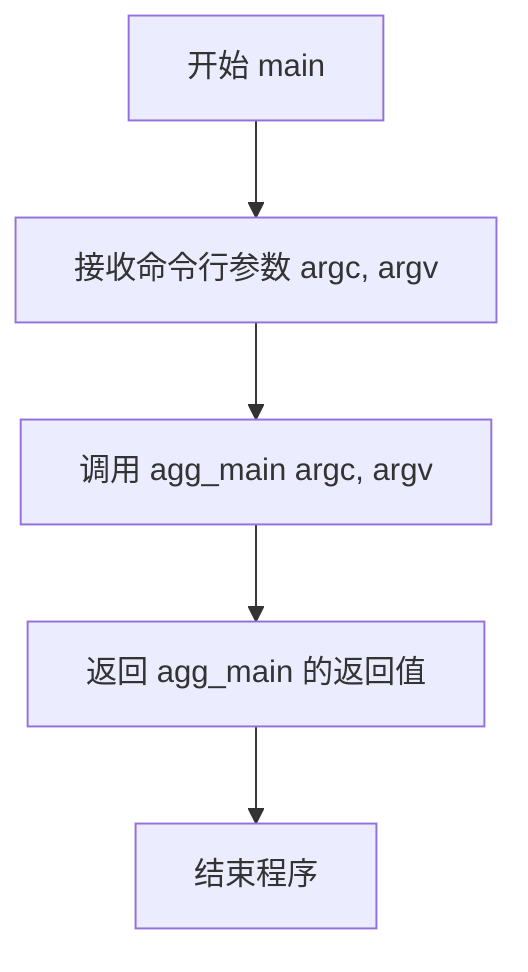

#### 带注释源码

```cpp
// 程序的主入口点
// 参数 argc: 命令行参数的数量
// 参数 argv: 命令行参数的数组
int
main(int argc, char* argv[])
{
    // 调用 AGG 库的具体应用程序入口函数 agg_main
    // agg_main 函数通常在用户代码中实现，包含应用程序的核心逻辑
    return agg_main(argc, argv);
}
```


### `agg_main`

该函数是 Anti-Grain Geometry 库的应用程序入口点，负责初始化平台支持并运行应用程序的主事件循环。它是一个由用户实现的回调函数，main 函数会调用它来启动具体的图形应用程序。

参数：

- `argc`：`int`，命令行参数的数量
- `argv`：`char*`，命令行参数的数组

返回值：`int`，表示程序的退出状态

#### 流程图

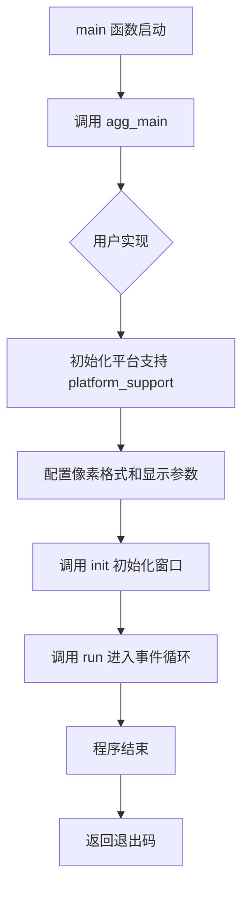

#### 带注释源码

```cpp
// 在文件末尾声明 agg_main 函数
// 这是一个由用户实现的回调函数，main 函数会调用它来启动应用程序
int agg_main(int argc, char* argv[]);


// 主函数入口
int
main(int argc, char* argv[])
{
    // 将控制权交给用户的 agg_main 实现
    // agg_main 应该包含应用程序的初始化和运行逻辑
    return agg_main(argc, argv);
}
```

**注意**：该函数在代码中仅作声明，未提供具体实现。具体实现由使用该平台的开发者根据实际需求提供。通常在该函数中会进行以下操作：

1. 创建 `agg::platform_support` 对象
2. 设置回调函数（on_init, on_draw, on_idle 等）
3. 调用 `init()` 初始化窗口
4. 调用 `run()` 进入事件循环


### `attach_buffer_to_BBitmap`

该静态辅助函数负责将 Haiku 操作系统的 `BBitmap` 位图对象的像素内存数据绑定（Attach）到 Anti-Grain Geometry (AGG) 的 `rendering_buffer` 中，并根据 `flipY` 参数动态调整行扫描方向（Stride），以解决 AGG 坐标系与 Haiku 视口坐标系在 Y 轴上的差异。

参数：

-  `buffer`：`agg::rendering_buffer&`，AGG 的渲染缓冲区引用，用于接收位图数据。
-  `bitmap`：`BBitmap*`，指向 Haiku 位图对象的指针，作为数据源。
-  `flipY`：`bool`，布尔标志位，设为 `true` 时会将行距（BytesPerRow）取反，从而实现图像的垂直翻转。

返回值：`void`，无返回值。

#### 流程图

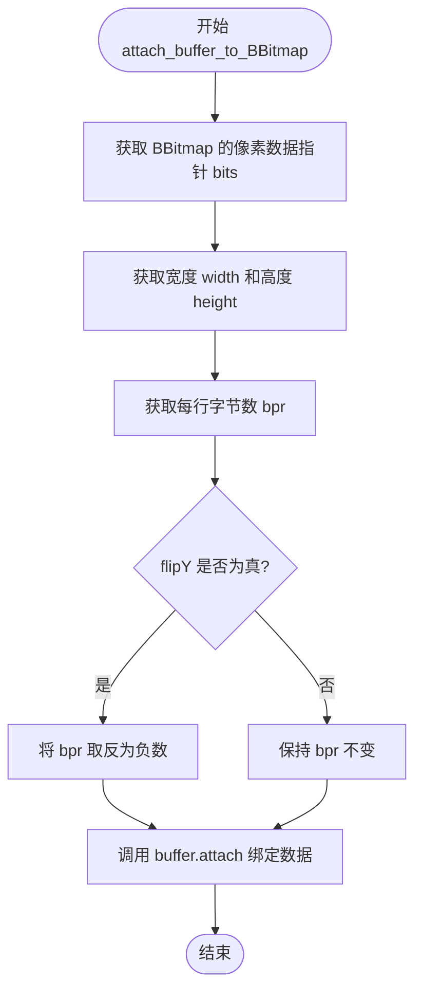

#### 带注释源码

```cpp
// 静态辅助函数：将 Haiku 的 BBitmap 关联到 AGG 的 rendering_buffer
// buffer: AGG 的渲染缓冲区
// bitmap: Haiku 的位图对象
// flipY: 是否垂直翻转
static void
attach_buffer_to_BBitmap(agg::rendering_buffer& buffer, BBitmap* bitmap, bool flipY)
{
    // 获取位图的像素数据起始地址
    uint8* bits = (uint8*)bitmap->Bits();
    // 计算位图宽度 (Bounds 宽度 + 1)
    uint32 width = bitmap->Bounds().IntegerWidth() + 1;
    // 计算位图高度 (Bounds 高度 + 1)
    uint32 height = bitmap->Bounds().IntegerHeight() + 1;
    // 获取每行的字节数 (Bytes Per Row)
    int32 bpr = bitmap->BytesPerRow();
    
    if (flipY) {
        // 注释：通过将 bpr (bytes per row) 设为负数，
        // AGG 会自动处理 Y 轴方向的翻转，而无需手动移动指针。
        // 作者在此处保留了疑问注释。
// XXX: why don't I have to do this?!?
//        bits += bpr * (height - 1);
        bpr = -bpr;
    }
    
    // 将数据附着到 AGG 渲染缓冲区
    buffer.attach(bits, width, height, bpr);
}
```


### `pix_format_to_color_space`

这是一个静态辅助函数，用于将 Anti-Grain Geometry (AGG) 库定义的像素格式枚举 (`agg::pix_format_e`) 转换为 BeOS/Haiku 操作系统所对应的位图颜色空间枚举 (`color_space`)。该函数主要用于在初始化渲染缓冲区时，确保 AGG 的像素格式与底层操作系统图形接口的位图格式相匹配。

参数：

-  `format`：`agg::pix_format_e`，AGG 库定义的像素格式（如 `pix_format_rgb24`, `pix_format_rgba32` 等）。

返回值：`color_space`，BeOS/Haiku 的位图颜色空间常量（如 `B_RGB24`, `B_RGBA32`）。如果传入的格式不被支持，则返回 `B_NO_COLOR_SPACE`。

#### 流程图

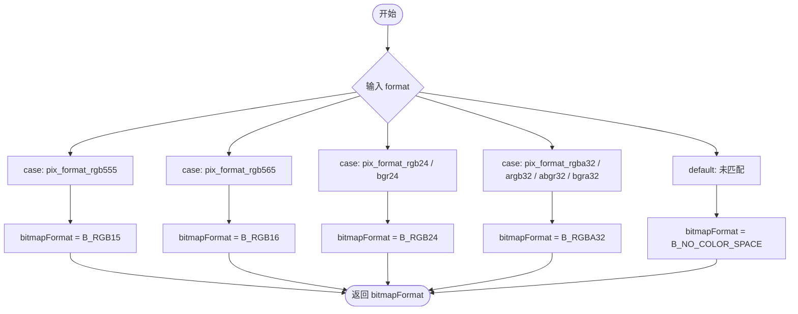

#### 带注释源码

```cpp
// 将 AGG 的像素格式转换为 BeOS 的颜色空间格式
static color_space
pix_format_to_color_space(agg::pix_format_e format)
{
    // 默认为不支持的颜色空间
    color_space bitmapFormat = B_NO_COLOR_SPACE;
    
    // 使用 switch 语句进行枚举映射
    switch (format) {
        // 15位 RGB (5-5-5)
        case agg::pix_format_rgb555:
            bitmapFormat = B_RGB15;
            break;

        // 16位 RGB (5-6-5)
        case agg::pix_format_rgb565:
            bitmapFormat = B_RGB16;
            break;

        // 24位 RGB 和 BGR
        case agg::pix_format_rgb24:
        case agg::pix_format_bgr24:
            bitmapFormat = B_RGB24;
            break;

        // 32位 RGBA 系列 (包括 RGBA, ARGB, ABGR, BGRA)
        case agg::pix_format_rgba32:
        case agg::pix_format_argb32:
        case agg::pix_format_abgr32:
        case agg::pix_format_bgra32:
            bitmapFormat = B_RGBA32;
            break;
    }
    // 返回转换后的 BeOS 颜色空间
    return bitmapFormat;
}
```


### `AGGView::AGGView`

该构造函数是 `AGGView` 类的初始化入口。它负责初始化继承自 `BView` 的基础视图属性，赋值并初始化所有成员变量（如 AGG 上下文、像素格式、鼠标状态等），并根据指定的像素格式创建一个内存中的位图（BBitmap）作为渲染缓冲区，最后将其附加到 AGG 的 `platform_support` 中以供绘图使用。如果位图创建失败，则捕获异常以防止内存泄漏。

参数：

- `frame`：`BRect`，视图在窗口中的矩形边界。
- `agg`：`agg::platform_support*`，指向聚合几何（AGG）平台支持对象的指针，用于处理渲染缓冲和事件。
- `format`：`agg::pix_format_e`，枚举类型，指定渲染缓冲区的像素格式（如 `pix_format_rgba32` 等）。
- `flipY`：`bool`，布尔标志，指定是否在 Y 轴方向上翻转渲染结果。

返回值：`void`，构造函数不返回任何值。

#### 流程图

```mermaid
graph TD
    A([开始 AGGView 构造函数]) --> B[初始化基类 BView: 设置名称、标志位]
    B --> C[初始化成员变量列表: fFormat, fFlipY, fAGG, fMouseButtons 等]
    C --> D[设置视图颜色: SetViewColor(B_TRANSPARENT_32_BIT)]
    D --> E[重置 Frame 坐标: frame.OffsetTo(0.0, 0.0)]
    E --> F[创建 BBitmap: 根据 format 和 frame 大小]
    F --> G{位图是否有效 IsValid?}
    G -- 是 --> H[调用 attach_buffer_to_BBitmap 将缓冲区绑定到 fAGG->rbuf_window]
    G -- 否 --> I[delete fBitmap 并置空 fBitmap]
    H --> J([结束构造函数])
    I --> J
```

#### 带注释源码

```cpp
// AGGView 构造函数实现
AGGView::AGGView(BRect frame,
                 agg::platform_support* agg,  // AGG 核心对象指针
                 agg::pix_format_e format,    // 像素格式
                 bool flipY)                  // Y轴翻转标志
    // 初始化列表：调用基类 BView 构造函数并初始化成员变量
    : BView(frame, "AGG View", B_FOLLOW_ALL,
            B_FRAME_EVENTS | B_WILL_DRAW),
      fFormat(format),
      fFlipY(flipY),

      fAGG(agg),

      fMouseButtons(0),
      fMouseX(-1),
      fMouseY(-1),
      
      fLastKeyDown(0),

      fRedraw(true),

      fPulse(NULL),
      fLastPulse(0),
      fEnableTicks(true)
{
    // 1. 设置视图背景色为完全透明
    SetViewColor(B_TRANSPARENT_32_BIT);
    
    // 2. 确保 Frame 原点对齐到 (0,0)，以便创建从 (0,0) 开始的位图
    frame.OffsetTo(0.0, 0.0);
    
    // 3. 创建位图，转换 AGG 像素格式为 BeOS 颜色空间
    fBitmap = new BBitmap(frame, 0, pix_format_to_color_space(fFormat));
    
    // 4. 检查位图是否创建成功
    if (fBitmap->IsValid()) {
        // 成功：将 AGG 的窗口渲染缓冲区挂载到该位图上
        attach_buffer_to_BBitmap(fAGG->rbuf_window(), fBitmap, fFlipY);
    } else {
        // 失败：清理资源，防止内存泄漏
        delete fBitmap;
        fBitmap = NULL;
    }
}
```


### `AGGView.~AGGView`

析构函数，用于释放 AGGView 实例在生命周期内分配的资源。主要负责清理用于渲染的位图对象（fBitmap）和用于定时轮询的消息 runner 对象（fPulse），防止内存泄漏。

参数：
- （无）

返回值：`void`（隐式），析构函数不返回值，仅用于清理资源。

#### 流程图

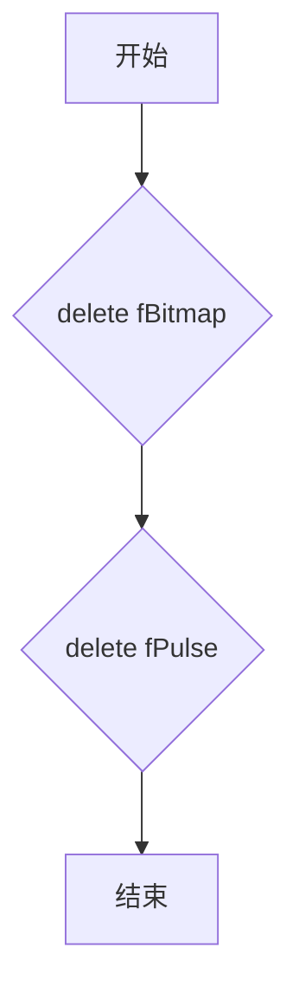

#### 带注释源码

```cpp
AGGView::~AGGView()
{
    // 释放渲染缓冲区位图对象
    // 释放在构造函数或 FrameResized 中创建的 BBitmap
    delete fBitmap;
    
    // 释放消息轮询定时器
    // 释放 AttachedToWindow 中创建的 BMessageRunner
    delete fPulse;
}
```


### `AGGView.AttachedToWindow`

该方法在AGGView视图连接到窗口时被调用，主要用于初始化脉冲消息Runner（用于定时触发渲染）并调用平台的resize事件处理函数，确保AGG渲染引擎在视图首次显示时正确初始化窗口缓冲区。

参数：
- （无参数）

返回值：`void`，无返回值

#### 流程图

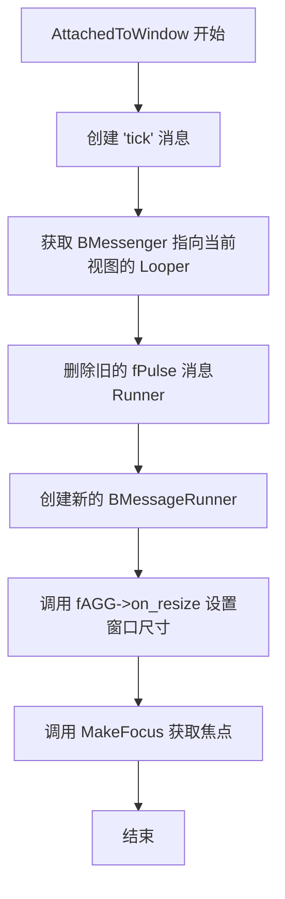

#### 带注释源码

```cpp
void
AGGView::AttachedToWindow()
{
    // 创建 'tick' 消息，用于定时触发渲染/空闲处理
    BMessage message('tick');
    
    // 创建 BMessenger，用于向当前视图的 Looper 发送消息
    BMessenger target(this, Looper());
    
    // 先删除之前可能存在的 MessageRunner，避免内存泄漏
    delete fPulse;
    
    // 注释：TODO - 需要计算屏幕回扫（screen retrace）以优化时序
    // 创建新的 MessageRunner，每40000微秒（40毫秒）发送一次 'tick' 消息
    // 这相当于约25fps的刷新频率，用于驱动 AGG 的空闲处理和重绘
    fPulse = new BMessageRunner(target, &message, 40000);

    // 确保调用一次 on_resize，初始化 AGG 的渲染缓冲区尺寸
    // Bounds().IntegerWidth() + 1 获取像素宽度
    // Bounds().IntegerHeight() + 1 获取像素高度
    fAGG->on_resize(Bounds().IntegerWidth() + 1,
                    Bounds().IntegerHeight() + 1);
                    
    // 让当前视图获得焦点，以便接收键盘事件
    MakeFocus();
}
```


### `AGGView.DetachedFromWindow`

当视图从窗口分离时调用，用于清理脉冲消息_runner资源，防止视图已卸载后仍收到定时消息。

参数：

- （无参数，继承自 BView 的虚函数）

返回值：`void`，无返回值。

#### 流程图

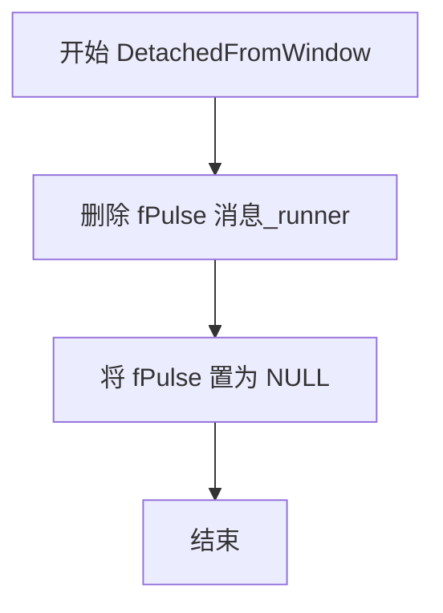

#### 带注释源码

```cpp
void
AGGView::DetachedFromWindow()
{
    // 删除脉冲消息_runner，停止定时消息发送
    // 防止视图分离后仍收到 'tick' 消息导致空指针访问
    delete fPulse;
    // 将指针置为空，避免悬垂指针
    fPulse = NULL;
}
```


### `AGGView.MessageReceived`

处理视图接收到的消息，主要用于处理定时器脉冲消息('tick')和结束令牌消息('entk')，以触发AGG库的空闲处理(on_idle)循环。

参数：
- `message`：`BMessage*`，指向接收到的消息的指针，包含消息类型(what)等成员，用于判断消息种类。

返回值：`void`，无返回值。

#### 流程图

```mermaid
flowchart TD
    A[开始 MessageReceived] --> B[获取当前系统时间 now = system_time]
    B --> C{判断 message->what}
    C -->|'tick'| D{fEnableTicks 是否为真}
    D -->|是| E[更新 fLastPulse = now]
    E --> F{fAGG->wait_mode}
    F -->|否| G[fAGG->on_idle]
    F -->|是| H[跳过 on_idle]
    G --> I[Window()->PostMessage 'entk']
    H --> I
    I --> J[fEnableTicks = false]
    D -->|否| K[丢弃消息]
    C -->|'entk'| L[fEnableTicks = true]
    L --> M{now - fLastPulse > 30000}
    M -->|是| N[更新 fLastPulse = now]
    N --> O{fAGG->wait_mode}
    O -->|否| P[fAGG->on_idle]
    O -->|是| Q[跳过 on_idle]
    M -->|否| R[不处理]
    C -->|default| S[调用 BView::MessageReceived]
    J --> T[结束]
    K --> T
    P --> T
    Q --> T
    R --> T
    S --> T
```

#### 带注释源码

```cpp
//----------------------------------------------------------------------------
// 处理视图接收到的消息
// 参数:
//   message - 指向BMessage的指针，包含消息类型和数据
// 返回值: void
//----------------------------------------------------------------------------
void
AGGView::MessageReceived(BMessage* message)
{
    // 获取当前系统时间（微秒）
    bigtime_t now = system_time();
    
    // 根据消息类型进行分支处理
    switch (message->what) {
        case 'tick':
            // 处理定时器脉冲消息
            // 如果ticks已启用（避免消息堆积）
            if (/*now - fLastPulse > 30000*/fEnableTicks) {
                // 记录最后一次脉冲时间
                fLastPulse = now;
                
                // 如果不在等待模式，则调用空闲处理函数
                if (!fAGG->wait_mode())
                    fAGG->on_idle();
                
                // 发送结束令牌消息到窗口
                Window()->PostMessage('entk', this);
                
                // 禁用ticks，等待'entk'消息重新启用
                fEnableTicks = false;
            } else {
                // 消息堆积，丢弃（注释掉的调试输出）
//                printf("dropping tick message (%lld)\n", now - fLastPulse);
            }
            break;
            
        case 'entk':
            // 处理结束令牌消息，重新启用ticks
            fEnableTicks = true;
            
            // 检查时间间隔，如果超过30毫秒
            if (now - fLastPulse > 30000) {
                // 更新最后脉冲时间
                fLastPulse = now;
                
                // 如果不在等待模式，则调用空闲处理函数
                if (!fAGG->wait_mode())
                    fAGG->on_idle();
            }
            break;
            
        default:
            // 对于其他消息，传递给基类BView处理
            BView::MessageReceived(message);
            break;
    }
}
```


### `AGGView.Draw`

该方法是 BeOS/Haiku 系统中 `BView` 的核心绘图回调函数。它负责将 AGG (Anti-Grain Geometry) 引擎生成的渲染缓冲区内容绘制到视图上，并处理不同像素格式（如 RGB565, RGB24 等）到系统原生格式（BGRA32）的转换，以确保在 `BView` 上正确显示。

#### 参数

- `updateRect`：`BRect`，BeOS 视图系统传入的更新矩形区域，指定需要重绘的屏幕部分。

#### 返回值

- `void`：无返回值。

#### 流程图

```mermaid
graph TD
    A([Start Draw]) --> B{fBitmap 是否存在?}
    B -- No --> C[FillRect(updateRect)]
    C --> Z([End])
    B -- Yes --> D{fRedraw (强制重绘)?}
    D -- Yes --> E[fAGG->on_draw() 执行渲染]
    E --> F[fRedraw = false]
    D -- No --> G{fFormat == bgra32?}
    F --> G
    G -- Yes --> H[DrawBitmap 直接绘制 fBitmap]
    H --> Z
    G -- No --> I[创建临时 BBitmap (RGBA32)]
    I --> J[绑定源/目标渲染缓冲区]
    J --> K{switch fFormat}
    K -->|rgb555| L[color_conv to bgra32]
    K -->|rgb565| M[color_conv to bgra32]
    K -->|rgb24| N[color_conv to bgra32]
    K -->|rgba32| O[color_conv to bgra32]
    K -->|other| P[color_conv to bgra32]
    L --> Q[DrawBitmap 绘制临时位图]
    M --> Q
    N --> Q
    O --> Q
    P --> Q
    Q --> R[delete 临时位图]
    R --> Z
```

#### 带注释源码

```cpp
// AGGView.cpp

void
AGGView::Draw(BRect updateRect)
{
    // 1. 检查内部渲染位图是否存在
    if (fBitmap) {
        // 2. 如果标记为需要重绘（例如窗口大小改变或强制刷新），则调用 AGG 的渲染回调
        if (fRedraw) {
            fAGG->on_draw();
            fRedraw = false;
        }

        // 3. 检查像素格式
        // 如果已经是 BGRA32 (BeOS/R5 原生格式)，则直接绘制
        if (fFormat == agg::pix_format_bgra32) {
            DrawBitmap(fBitmap, updateRect, updateRect);
        } else {
            // 4. 格式转换处理：
            // BeOS 的 DrawBitmap 对非 RGBA/BGRA 格式支持有限，
            // 因此这里创建一个临时的 32位 RGBA 位图作为目标，
            // 使用 AGG 的颜色转换器将 fBitmap 的内容转换到临时位图，
            // 然后绘制临时位图到视图。
            
            // 创建临时位图 (注意：此处未检查内存分配失败或 IsValid，为潜在技术债务)
            BBitmap* bitmap = new BBitmap(fBitmap->Bounds(), 0, B_RGBA32);

            // 绑定源缓冲区 (fBitmap)
            agg::rendering_buffer rbufSrc;
            attach_buffer_to_BBitmap(rbufSrc, fBitmap, false);

            // 绑定目标缓冲区 (临时 bitmap)
            agg::rendering_buffer rbufDst;
            attach_buffer_to_BBitmap(rbufDst, bitmap, false);

            // 根据格式选择转换器并进行转换
            switch(fFormat) {
                case agg::pix_format_rgb555:
                    agg::color_conv(&rbufDst, &rbufSrc,
                                    agg::color_conv_rgb555_to_bgra32());
                    break;
                case agg::pix_format_rgb565:
                    agg::color_conv(&rbufDst, &rbufSrc,
                                    agg::color_conv_rgb565_to_bgra32());
                    break;
                case agg::pix_format_rgb24:
                    agg::color_conv(&rbufDst, &rbufSrc,
                                    agg::color_conv_rgb24_to_bgra32());
                    break;
                case agg::pix_format_bgr24:
                    agg::color_conv(&rbufDst, &rbufSrc,
                                    agg::color_conv_bgr24_to_bgra32());
                    break;
                case agg::pix_format_rgba32:
                    agg::color_conv(&rbufDst, &rbufSrc,
                                    agg::color_conv_rgba32_to_bgra32());
                    break;
                case agg::pix_format_argb32:
                    agg::color_conv(&rbufDst, &rbufSrc,
                                    agg::color_conv_argb32_to_bgra32());
                    break;
                case agg::pix_format_abgr32:
                    agg::color_conv(&rbufDst, &rbufSrc,
                                    agg::color_conv_abgr32_to_bgra32());
                    break;
                case agg::pix_format_bgra32:
                    // 虽然外层 if 已经处理，但为了完整性
                    agg::color_conv(&rbufDst, &rbufSrc,
                                    agg::color_conv_bgra32_to_bgra32());
                    break;
            }
            
            // 绘制转换后的临时位图
            DrawBitmap(bitmap, updateRect, updateRect);
            
            // 清理临时资源
            delete bitmap;
        }
    } else {
        // 如果位图无效（初始化失败），则使用纯色填充更新区域
        FillRect(updateRect);
    }
}
```


### `AGGView.FrameResized`

当窗口大小发生改变时，此方法会被调用，用于重新创建与新窗口尺寸匹配的位图，并通知 AGG 库窗口尺寸已更改，从而调整渲染缓冲区。

参数：

- `width`：`float`，新的窗口宽度
- `height`：`float`，新的窗口高度

返回值：`void`，无返回值

#### 流程图

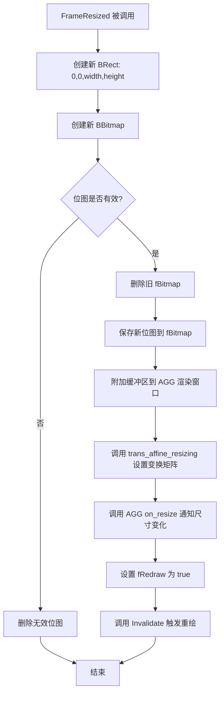

#### 带注释源码

```
void
AGGView::FrameResized(float width, float height)
{
    // 根据新的宽度和高度创建一个矩形区域（原点在左上角）
    BRect r(0.0, 0.0, width, height);
    
    // 使用新的尺寸创建新的位图，使用与当前格式兼容的颜色空间
    BBitmap* bitmap = new BBitmap(r, 0, pix_format_to_color_space(fFormat));
    
    // 检查位图是否成功创建且有效
    if (bitmap->IsValid()) {
        // 释放旧的位图内存
        delete fBitmap;
        
        // 保存新创建的位图
        fBitmap = bitmap;
        
        // 将新的位图附加到 AGG 的窗口渲染缓冲区
        attach_buffer_to_BBitmap(fAGG->rbuf_window(), fBitmap, fFlipY);

        // 通知 AGG 变换矩阵根据新尺寸进行调整
        fAGG->trans_affine_resizing((int)width + 1,
                                    (int)height + 1);

        // 将窗口尺寸变化事件传递给 AGG 库
        fAGG->on_resize((int)width + 1, (int)height + 1);
        
        // 设置标志位，强制下一次 Draw 调用时重新渲染整个视图
        fRedraw = true;
        
        // 使视图无效，触发后续的 Draw 调用
        Invalidate();
    } else {
        // 如果位图创建失败，释放内存避免泄漏
        delete bitmap;
    }
}
```


### AGGView.KeyDown

处理键盘按键事件，将方向键映射到AGG控制器的箭头键处理，其他按键传递给AGG的on_key回调。

参数：
- `bytes`：`const char*`，指向按键字节数据的指针
- `numBytes`：`int32`，按键字节数据的长度

返回值：`void`，无返回值

#### 流程图

```mermaid
flowchart TD
    Start[开始 KeyDown] --> CheckInput{bytes != nullptr && numBytes > 0}
    CheckInput -->|否| End[结束]
    CheckInput -->|是| ExtractKey[提取字节: fLastKeyDown = bytes[0]]
    ExtractKey --> SwitchKey{fLastKeyDown}
    SwitchKey -->|B_LEFT_ARROW| SetLeft[设置 left = true]
    SwitchKey -->|B_UP_ARROW| SetUp[设置 up = true]
    SwitchKey -->|B_RIGHT_ARROW| SetRight[设置 right = true]
    SwitchKey -->|B_DOWN_ARROW| SetDown[设置 down = true]
    SwitchKey -->|其他| OtherKey[其他按键]
    
    SetLeft --> ArrowKeys{fAGG->m_ctrls.on_arrow_keys...}
    SetUp --> ArrowKeys
    SetRight --> ArrowKeys
    SetDown --> ArrowKeys
    OtherKey --> CallOnKey[调用 fAGG->on_key(...)]
    
    ArrowKeys -->|返回true| CtrlChange[调用 on_ctrl_change 和 force_redraw]
    ArrowKeys -->|返回false| CallOnKey
    
    CtrlChange --> End
    CallOnKey --> End
```

#### 带注释源码

```cpp
void
AGGView::KeyDown(const char* bytes, int32 numBytes)
{
    // 检查输入参数有效性：确保字节指针非空且至少有1字节数据
    if (bytes && numBytes > 0) {
        // 提取第一个按键码并保存到成员变量，供外部查询最后按下的键
        fLastKeyDown = bytes[0];

        // 初始化方向标志位，用于处理方向键
        bool left  = false;
        bool up    = false;
        bool right = false;
        bool down  = false;

        // 根据按键码设置对应的方向标志
        switch (fLastKeyDown) {

            case B_LEFT_ARROW:
                left = true;
                break;

            case B_UP_ARROW:
                up = true;
                break;

            case B_RIGHT_ARROW:
                right = true;
                break;

            case B_DOWN_ARROW:
                down = true;
                break;
        }

        // 尝试将方向键事件传递给AGG控制器（UI控件）
        if (fAGG->m_ctrls.on_arrow_keys(left, right, down, up)) {
            // 如果控制器处理了箭头键，触发控制变化事件并强制重绘
            fAGG->on_ctrl_change();
            fAGG->force_redraw();
        } else {
            // 控制器未处理，传递给应用层的按键处理回调
            fAGG->on_key(fMouseX, fMouseY, fLastKeyDown, GetKeyFlags());
        }
    }
}
```


### `AGGView.MouseDown`

处理鼠标左键或右键按下事件，将事件传递给AGG（Anti-Grain Geometry）库处理，并管理控件交互。

参数：
- `where`：`BPoint`，鼠标按下时的屏幕坐标位置

返回值：`void`，无返回值

#### 流程图

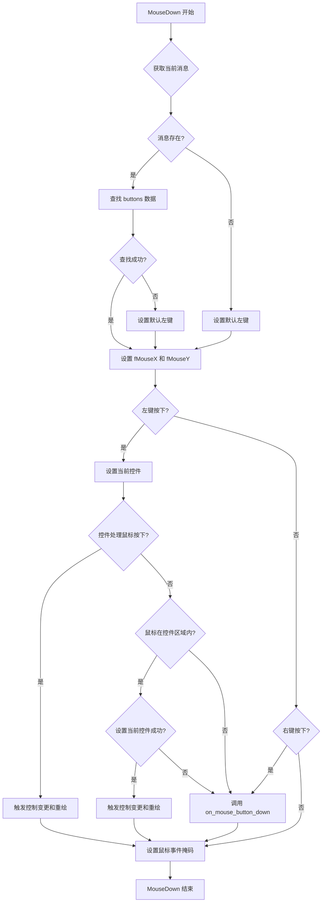

#### 带注释源码

```cpp
void
AGGView::MouseDown(BPoint where)
{
    // 获取当前窗口消息，用于提取鼠标按钮状态
    BMessage* currentMessage = Window()->CurrentMessage();
    if (currentMessage) {
        // 尝试从消息中提取buttons字段
        if (currentMessage->FindInt32("buttons", (int32*)&fMouseButtons) < B_OK)
            // 如果提取失败，默认使用左键
            fMouseButtons = B_PRIMARY_MOUSE_BUTTON;
    } else
        // 如果没有消息，默认使用左键
        fMouseButtons = B_PRIMARY_MOUSE_BUTTON;

    // 计算鼠标X坐标
    fMouseX = (int)where.x;
    // 根据是否翻转Y轴计算鼠标Y坐标
    // 如果fFlipY为true，则进行Y轴翻转转换（用于不同坐标系）
    fMouseY = fFlipY ? (int)(Bounds().Height() - where.y) : (int)where.y;

    // 将事件传递给AGG库处理
    if (fMouseButtons == B_PRIMARY_MOUSE_BUTTON) {
        // 左键按下 -> 检查是否需要由控件处理
        
        // 设置当前控件位置
        fAGG->m_ctrls.set_cur(fMouseX, fMouseY);
        
        // 检查控件是否处理了鼠标按下事件
        if (fAGG->m_ctrls.on_mouse_button_down(fMouseX, fMouseY)) {
            // 控件处理了事件，触发控制变更回调和重绘
            fAGG->on_ctrl_change();
            fAGG->force_redraw();
        } else {
            // 控件未处理，检查鼠标是否在控件区域内
            if (fAGG->m_ctrls.in_rect(fMouseX, fMouseY)) {
                // 尝试设置当前控件
                if (fAGG->m_ctrls.set_cur(fMouseX, fMouseY)) {
                    // 设置成功，触发控制变更回调和重绘
                    fAGG->on_ctrl_change();
                    fAGG->force_redraw();
                }
            } else {
                // 鼠标不在控件区域内，直接传递鼠标按下事件给AGG
                fAGG->on_mouse_button_down(fMouseX, fMouseY, GetKeyFlags());
            }
        }
    } else if (fMouseButtons & B_SECONDARY_MOUSE_BUTTON) {
        // 右键按下 -> 简单传递给AGG处理
        fAGG->on_mouse_button_down(fMouseX, fMouseY, GetKeyFlags());
    }
    
    // 设置鼠标事件掩码，捕获后续的鼠标移动和松开事件
    // B_LOCK_WINDOW_FOCUS 锁定窗口焦点，防止切换焦点
    SetMouseEventMask(B_POINTER_EVENTS, B_LOCK_WINDOW_FOCUS);
}
```


### `AGGView.MouseMoved`

处理鼠标在视图内的移动事件，包括坐标转换、修正可能丢失的 MouseUp 事件，并将事件传递给 AGG 库的交互控件系统和通用事件处理器。

参数：

- `where`：`BPoint`，鼠标在视图中的当前位置。
- `transit`：`uint32`，鼠标过渡状态（如进入、离开），在当前实现中未直接使用。
- `dragMesage`：`const BMessage*`，拖拽消息指针，当前未使用。

返回值：`void`，无返回值。

#### 流程图

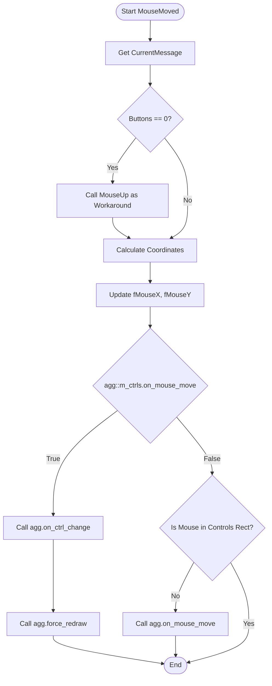

#### 带注释源码

```cpp
void
AGGView::MouseMoved(BPoint where, uint32 transit, const BMessage* dragMesage)
{
    // 工作区：处理丢失的鼠标Up事件
    // (如果响应太慢，app_server 可能已经丢弃了事件)
    BMessage* currentMessage = Window()->CurrentMessage();
    int32 buttons = 0;
    if (currentMessage->FindInt32("buttons", &buttons) < B_OK) {
        buttons = 0;
    }
    // 如果没有按键状态（可能是丢失了MouseUp），则手动触发MouseUp
    if (!buttons)
        MouseUp(where);

    // 更新内部鼠标坐标
    fMouseX = (int)where.x;
    // 如果需要翻转Y轴（例如为了匹配AGG的坐标系），则进行转换
    fMouseY = fFlipY ? (int)(Bounds().Height() - where.y) : (int)where.y;

    // 将事件传递给 AGG
    // 首先尝试让交互控件处理鼠标移动
    if (fAGG->m_ctrls.on_mouse_move(fMouseX, fMouseY,
                                    (GetKeyFlags() & agg::mouse_left) != 0)) {
        // 如果控件处理了事件，通知系统控件已改变并强制重绘
        fAGG->on_ctrl_change();
        fAGG->force_redraw();
    } else {
        // 如果控件未处理，检查鼠标是否在控件区域外
        if (!fAGG->m_ctrls.in_rect(fMouseX, fMouseY)) {
            // 只有在控件区域外才调用通用的鼠标移动处理
            fAGG->on_mouse_move(fMouseX, fMouseY, GetKeyFlags());
        }
    }
}
```


### `AGGView.MouseUp`

处理鼠标释放事件，将事件传递给 Anti-Grain Geometry (AGG) 库，并更新内部鼠标状态。

参数：

- `where`：`BPoint`，鼠标释放时的位置坐标

返回值：`void`，无返回值

#### 流程图

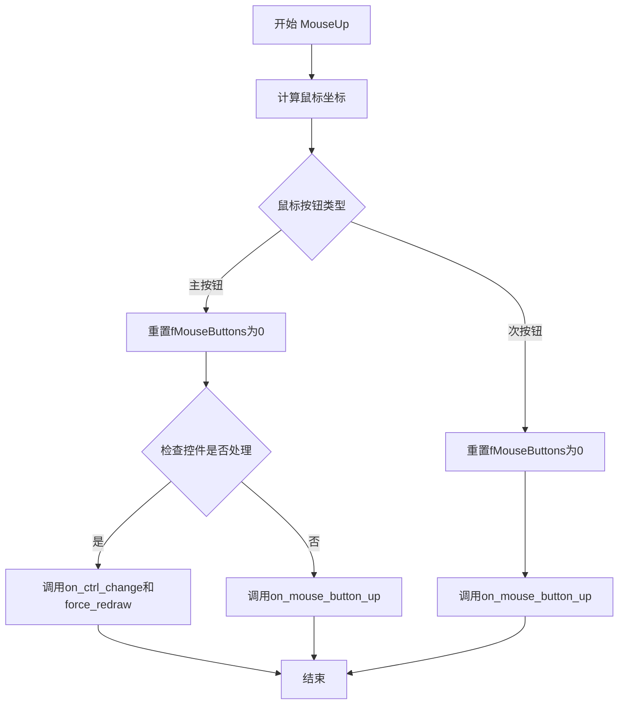

#### 带注释源码

```cpp
void
AGGView::MouseUp(BPoint where)
{
    // 将BPoint坐标转换为整数坐标，并根据fFlipY决定是否翻转Y轴
    fMouseX = (int)where.x;
    fMouseY = fFlipY ? (int)(Bounds().Height() - where.y) : (int)where.y;

    // 将事件传递给AGG库
    if (fMouseButtons == B_PRIMARY_MOUSE_BUTTON) {
        // 主鼠标按钮释放时，先重置按钮状态
        fMouseButtons = 0;

        // 检查控件是否处理了鼠标按钮释放事件
        if (fAGG->m_ctrls.on_mouse_button_up(fMouseX, fMouseY)) {
            // 如果控件处理了该事件，通知控件变化并强制重绘
            fAGG->on_ctrl_change();
            fAGG->force_redraw();
        }
        // 无论控件是否处理，都调用AGG的鼠标按钮释放回调
        fAGG->on_mouse_button_up(fMouseX, fMouseY, GetKeyFlags());
    } else if (fMouseButtons == B_SECONDARY_MOUSE_BUTTON) {
        // 次鼠标按钮（右键）释放时，重置按钮状态并调用回调
        fMouseButtons = 0;

        fAGG->on_mouse_button_up(fMouseX, fMouseY, GetKeyFlags());
    }
}
```


### `AGGView.Bitmap`

该函数是AGGView类的公共常量成员方法，提供对内部位图对象的只读访问，使外部组件能够获取视图关联的BBitmap指针以进行进一步操作或渲染。

参数： 无

返回值：`BBitmap*`，返回视图内部存储的BBitmap指针，用于访问渲染缓冲区数据

#### 流程图

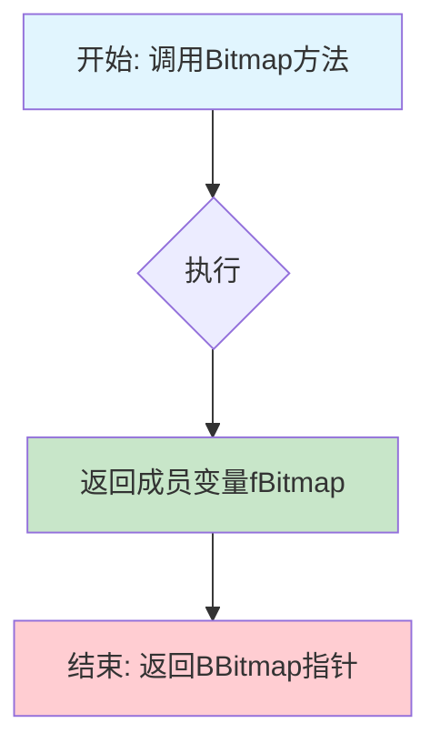

#### 带注释源码

```cpp
// 获取内部位图的访问接口
// 该方法为外部提供只读访问内部BBitmap的能力
// 内部渲染缓冲区通过attach_buffer_to_BBitmap关联到此位图
BBitmap*
AGGView::Bitmap() const
{
    // 直接返回成员变量fBitmap，该变量在构造函数中初始化
    // 当创建新位图或调整窗口大小时会被更新
    return fBitmap;
}
```


### `AGGView.LastKeyDown`

获取最后一次按下的键盘按键的键值。

参数：

- 无

返回值：`uint8`，返回最近一次按键事件中捕获的键盘键值（ASCII码或虚拟键码）

#### 流程图

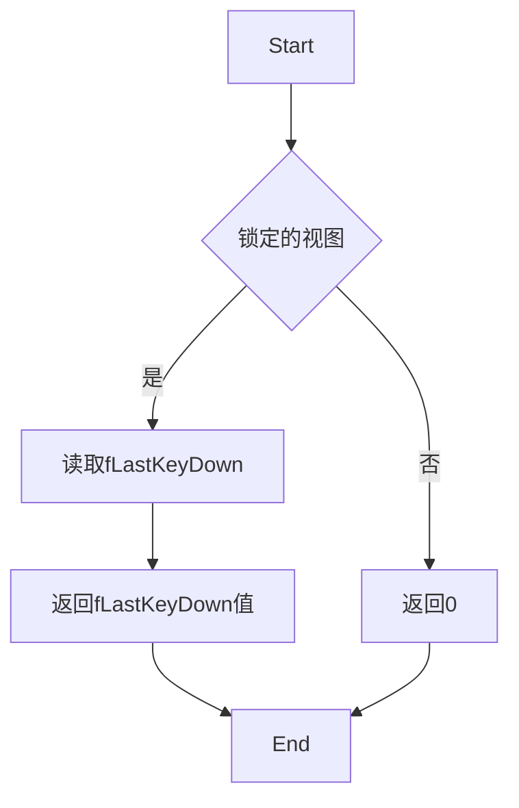

#### 带注释源码

```cpp
/**
 * AGGView::LastKeyDown
 * 
 * 获取最后一次按下的键盘按键的键值
 * 这是一个简单的getter方法，用于访问私有成员变量fLastKeyDown
 * 
 * @return uint8 最后一次按下的键值（存储在fLastKeyDown中）
 */
uint8
AGGView::LastKeyDown() const
{
    // 返回私有成员变量fLastKeyDown的值
    // fLastKeyDown在KeyDown方法中被设置，存储最新的按键码
    return fLastKeyDown;
}
```

---

#### 关联信息

**所属类：** `AGGView`

**成员变量关联：**
- `fLastKeyDown`：`uint8` 类型，在 `KeyDown` 方法中被赋值，存储最后一次按下的键值

**调用场景：**
- 外部可能通过此方法查询最近一次按键的键值
- 通常与 `GetKeyFlags()` 方法配合使用，以获取完整的键盘输入信息


### `AGGView.MouseButtons`

获取当前鼠标按钮状态，通过线程安全的方式（锁定Looper）返回成员变量fMouseButtons的值。

参数： 无

返回值：`uint32`，返回当前鼠标按钮的状态标志（如 B_PRIMARY_MOUSE_BUTTON、B_SECONDARY_MOUSE_BUTTON 等）。

#### 流程图

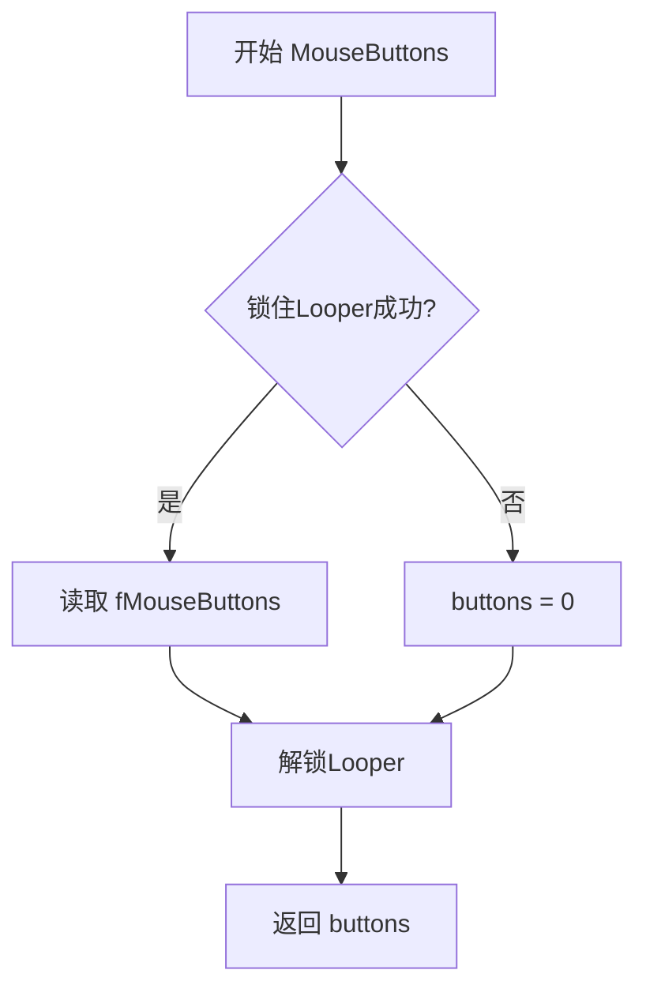

#### 带注释源码

```cpp
// 获取当前鼠标按钮状态
// 返回值: uint32 - 鼠标按钮状态标志
uint32
AGGView::MouseButtons()
{
    // 初始化按钮状态为0
    uint32 buttons = 0;
    
    // 尝试锁定Looper以确保线程安全访问
    if (LockLooper()) {
        // 从成员变量读取当前鼠标按钮状态
        buttons = fMouseButtons;
        
        // 访问完成后解锁Looper
        UnlockLooper();
    }
    
    // 返回鼠标按钮状态（如果锁定失败则返回0）
    return buttons;
}
```


### `AGGView.Update`

触发视图显示更新的方法，通过锁定消息循环并调用 Invalidate() 使视图区域无效，从而触发重绘。

参数：

- （无参数）

返回值：`void`，无返回值

#### 流程图

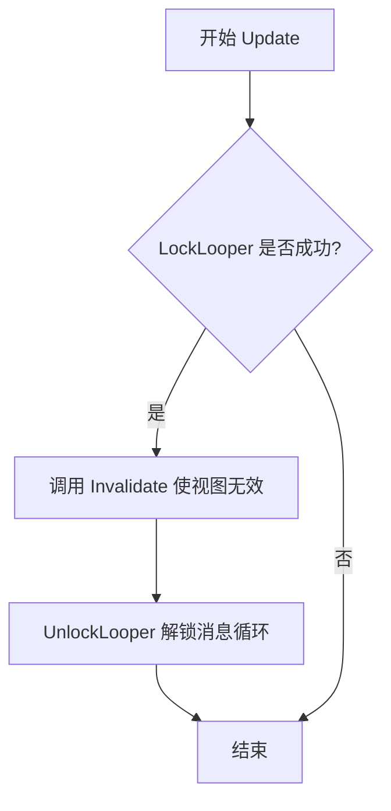

#### 带注释源码

```cpp
void
AGGView::Update()
{
    // 触发显示更新
    // 锁定视图所属的消息循环以确保线程安全
    if (LockLooper()) {
        // 使整个视图区域无效，请求系统在下一次绘制周期中重绘该视图
        Invalidate();
        // 解锁消息循环，允许其他线程继续操作
        UnlockLooper();
    }
}
```


### `AGGView.ForceRedraw`

该方法用于强制触发视图的重绘操作，通过设置内部标志位 `fRedraw` 为真并调用 `Invalidate()` 方法，使视图在下次事件循环中重新绘制。

参数：无

返回值：`void`，无返回值

#### 流程图

```mermaid
flowchart TD
    A[开始 ForceRedraw] --> B{是否可以锁定Looper?}
    B -->|是| C[设置 fRedraw = true]
    C --> D[调用 Invalidate 触发重绘]
    D --> E[解锁 Looper]
    E --> F[结束]
    B -->|否| F
```

#### 带注释源码

```cpp
void
AGGView::ForceRedraw()
{
    // force a redraw (fRedraw = true;)
    // and trigger display update
    if (LockLooper()) {
        fRedraw = true;
        Invalidate();
        UnlockLooper();
    }
}
```


### `AGGView.GetKeyFlags`

获取当前键盘修饰键和鼠标按钮的状态标志，用于传递给 AGG 事件处理函数。

参数：无

返回值：`unsigned`，返回表示当前键盘修饰键（Shift、Ctrl）和鼠标按钮（左键、右键）状态的标志位组合。

#### 流程图

```mermaid
flowchart TD
    A[开始 GetKeyFlags] --> B[获取鼠标按钮状态 fMouseButtons]
    B --> C[获取键盘修饰键状态 modifiers]
    C --> D[初始化 flags = 0]
    D --> E{检查主鼠标按钮 pressed?}
    E -->|是| F[flags |= agg::mouse_left]
    E -->|否| G{检查次鼠标按钮 pressed?}
    F --> G
    G -->|是| H[flags |= agg::mouse_right]
    G -->|否| I{检查Shift键 pressed?}
    H --> I
    I -->|是| J[flags |= agg::kbd_shift]
    I -->|否| K{检查Ctrl键 pressed?}
    J --> K
    K -->|是| L[flags |= agg::kbd_ctrl]
    K -->|否| M[返回 flags]
    L --> M
```

#### 带注释源码

```cpp
unsigned
AGGView::GetKeyFlags()
{
    // 获取当前鼠标按钮状态（可能已被 LockLooper 保护）
    uint32 buttons = fMouseButtons;
    
    // 获取当前键盘修饰键状态（Shift、Ctrl、Alt 等）
    uint32 mods = modifiers();
    
    // 初始化标志位为 0（无任何标志）
    unsigned flags = 0;
    
    // 检查主鼠标按钮（左键）是否按下若是则设置 mouse_left 标志
    if (buttons & B_PRIMARY_MOUSE_BUTTON)   flags |= agg::mouse_left;
    
    // 检查次鼠标按钮（右键）是否按下若是则设置 mouse_right 标志
    if (buttons & B_SECONDARY_MOUSE_BUTTON) flags |= agg::mouse_right;
    
    // 检查 Shift 键是否按下若是则设置 kbd_shift 标志
    if (mods & B_SHIFT_KEY)                 flags |= agg::kbd_shift;
    
    // 检查 Command 键（Ctrl）是否按下若是则设置 kbd_ctrl 标志
    if (mods & B_COMMAND_KEY)               flags |= agg::kbd_ctrl;
    
    // 返回组合后的标志位供 AGG 事件处理使用
    return flags;
}
```


### `AGGWindow.AGGWindow`

这是 AGGWindow 类的默认构造函数，用于初始化一个 AGGWindow 对象。该构造函数调用基类 BWindow 的构造函数，创建一个具有指定初始位置的隐藏窗口（窗口初始位置在屏幕外，标题为"AGG Application"，使用异步控制模式）。

参数：
- （无参数）

返回值：无返回值（构造函数）

#### 流程图

```mermaid
flowchart TD
    A[开始 AGGWindow 构造函数] --> B[调用基类 BWindow 构造函数]
    B --> C[设置初始窗口区域: BRect(-50.0, -50.0, -10.0, -10.0)]
    C --> D[设置窗口标题: "AGG Application"]
    D --> E[设置窗口风格: B_TITLED_WINDOW | B_ASYNCHRONOUS_CONTROLS]
    E --> F[结束构造函数]
```

#### 带注释源码

```cpp
class AGGWindow : public BWindow {
 public:
                    // 默认构造函数
                    // 创建一个初始隐藏的窗口（位置在屏幕外），标题为 "AGG Application"
                    AGGWindow()
                    // 初始化列表：调用基类 BWindow 构造函数
                    : BWindow(BRect(-50.0, -50.0, -10.0, -10.0),  // 初始窗口区域（屏幕外）
                              "AGG Application",                   // 窗口标题
                              B_TITLED_WINDOW,                     // 有标题栏的窗口
                              B_ASYNCHRONOUS_CONTROLS)             // 异步控制模式
                    {
                    }
```


### `AGGWindow.QuitRequested`

该方法是 AGGWindow 类的退出请求处理函数，当用户尝试关闭窗口时由系统调用。它向应用程序主线程发送退出消息（B_QUIT_REQUESTED），并返回 true 表示允许窗口关闭。

参数：

- （无参数）

返回值：`bool`，返回 true 表示允许窗口关闭，通知系统可以安全终止应用程序

#### 流程图

```mermaid
flowchart TD
    A[用户点击关闭按钮] --> B{调用 QuitRequested}
    B --> C[be_app->PostMessage<br/>B_QUIT_REQUESTED]
    C --> D[返回 true]
    D --> E[系统关闭窗口]
```

#### 带注释源码

```cpp
virtual bool    QuitRequested()
{
    // 向应用程序实例发送退出消息，触发应用程序的关闭流程
    // be_app 是全局的 BApplication 指针
    // B_QUIT_REQUESTED 是系统定义的退出消息类型
    be_app->PostMessage(B_QUIT_REQUESTED);
    
    // 返回 true 表示允许窗口关闭
    // BWindow 会据此确认是否可以销毁窗口
    return true;
}
```


### AGGWindow.Init

该方法用于初始化 AGGWindow 窗口，创建 AGGView 视图并将其添加到窗口中，设置窗口的位置、大小和标志位，最后验证视图是否成功创建。

参数：

- `frame`：`BRect`，窗口的初始位置和大小（包含左上角和右下角坐标）
- `agg`：`agg::platform_support*`，AGG 平台支持对象的指针，用于关联 AGG 渲染上下文
- `format`：`agg::pix_format_e`，像素格式枚举，指定帧缓冲的颜色格式
- `flipY`：`bool`，是否翻转 Y 轴坐标（用于适配不同的坐标系）
- `flags`：`uint32`，窗口标志位，控制窗口行为（如可调整大小、异步控制等）

返回值：`bool`，表示初始化是否成功（true 表示视图成功创建且位图有效）

#### 流程图

```mermaid
flowchart TD
    A[开始 Init] --> B[MoveTo frame.LeftTop]
    B --> C[ResizeTo frame.Width 和 Height]
    C --> D[SetFlags flags]
    D --> E[frame.OffsetTo 0.0, 0.0]
    E --> F[创建 AGGView 对象]
    F --> G[AddChild 添加视图到窗口]
    G --> H{fView->Bitmap 是否有效}
    H -->|是| I[返回 true]
    H -->|否| J[返回 false]
```

#### 带注释源码

```cpp
// AGGWindow::Init 方法实现
// 参数：
//   frame  - BRect，窗口的初始位置和大小
//   agg    - agg::platform_support*，AGG 平台支持对象指针
//   format - agg::pix_format_e，像素格式
//   flipY  - bool，是否翻转 Y 轴
//   flags  - uint32，窗口标志
// 返回值：bool，初始化是否成功
bool    
AGGWindow::Init(BRect frame, agg::platform_support* agg, agg::pix_format_e format,
                  bool flipY, uint32 flags)
{
    // 将窗口移动到指定位置（左上角坐标）
    MoveTo(frame.LeftTop());
    
    // 调整窗口大小为指定的宽高
    ResizeTo(frame.Width(), frame.Height());

    // 设置窗口标志位（如 B_ASYNCHRONOUS_CONTROLS, B_NOT_RESIZABLE 等）
    SetFlags(flags);

    // 将 frame 的原点偏移到 (0, 0)，用于创建视图
    frame.OffsetTo(0.0, 0.0);
    
    // 创建 AGGView 对象，传入 frame、AGG 支持对象、像素格式和翻转标志
    fView = new AGGView(frame, agg, format, flipY);
    
    // 将创建的视图添加到窗口作为子视图
    AddChild(fView);

    // 返回视图的位图是否有效的布尔值
    // 如果位图有效（不为 NULL），说明初始化成功
    return fView->Bitmap() != NULL;
}
```


### AGGWindow.View

该方法是AGGWindow类的成员函数，用于获取窗口中关联的AGGView视图实例。这是一个简单的getter方法，返回指向AGGView对象的指针。

参数： 无

返回值： `AGGView*`，返回指向窗口中AGGView视图实例的指针，用于访问视图的绘图表面和事件处理功能。

#### 流程图

```mermaid
flowchart TD
    A[开始] --> B{方法调用}
    B --> C[返回fView指针]
    C --> D[结束]
    
    style A fill:#f9f,color:#333
    style D fill:#9f9,color:#333
```

#### 带注释源码

```
AGGView*    View() const
{
    // 返回成员变量fView，这是一个指向AGGView对象的指针
    // const修饰符表示该方法不会修改AGGWindow对象的状态
    return fView;
}
```


### `AGGApplication.AGGApplication`

该构造函数是 `AGGApplication` 类的默认构造函数，用于初始化 AGG（Anti-Grain Geometry）应用程序实例。它继承自 `BApplication`，设置应用程序的唯一标识符（"application/x-vnd.AGG-AGG"），并创建一个 `AGGWindow` 实例来管理应用程序窗口。

参数：
- （无参数）

返回值：
- （无返回值，构造函数）

#### 流程图

```mermaid
flowchart TD
    A[调用 AGGApplication 构造函数] --> B[调用基类 BApplication 构造函数<br/>参数: 'application/x-vnd.AGG-AGG']
    B --> C[创建 AGGWindow 实例<br/>new AGGWindow()]
    C --> D[将窗口指针赋值给成员变量 fWindow]
    D --> E[构造函数结束]
```

#### 带注释源码

```cpp
class AGGApplication : public BApplication {
 public:
                    // AGGApplication 默认构造函数
                    // 功能：初始化 AGG 应用程序，设置应用程序类型并创建窗口
                    AGGApplication()
                    // 初始化列表：调用基类 BApplication 构造函数
                    // 参数：应用程序的唯一标识符，用于 BeOS/Haiku 系统消息路由
                    : BApplication("application/x-vnd.AGG-AGG")
                    {
                        // 创建一个新的 AGGWindow 实例
                        // AGGWindow 继承自 BWindow，用于托管 AGGView 和渲染内容
                        fWindow = new AGGWindow();
                    }
```


### `AGGApplication.ReadyToRun`

ReadyToRun 是 AGGApplication 类的一个虚方法，在应用程序准备好运行时被调用，其核心功能是显示主窗口。

参数：无

返回值：`void`，无返回值

#### 流程图

```mermaid
flowchart TD
    A[开始 ReadyToRun] --> B{fWindow 是否存在?}
    B -->|是| C[调用 fWindow->Show]
    C --> D[结束]
    B -->|否| D
```

#### 带注释源码

```cpp
// AGGApplication 类继承自 BApplication
// ReadyToRun 是 BApplication 的虚函数，在应用初始化完成后被调用
virtual void    ReadyToRun()
{
    // 检查窗口指针是否有效（非空）
    if (fWindow) {
        // 调用 Show 方法显示窗口并开始消息循环
        fWindow->Show();
    }
}
```


### AGGApplication.Init

该方法是AGGApplication类的核心初始化方法，负责根据提供的参数创建并配置AGGWindow窗口，包括设置窗口尺寸、像素格式、翻转模式以及窗口标志位，最终返回窗口初始化是否成功。

参数：
- `agg`：`agg::platform_support*`，指向AGG平台支持对象的指针，用于关联窗口与AGG渲染引擎
- `width`：`int`，窗口的宽度（像素）
- `height`：`int`，窗口的高度（像素）
- `format`：`agg::pix_format_e`，窗口的像素格式（如RGB24、RGBA32等）
- `flipY`：`bool`，是否翻转Y轴坐标（用于不同坐标系系统的转换）
- `flags`：`uint32`，AGG库的窗口标志位，控制窗口行为（如是否可调整大小）

返回值：`bool`，初始化成功返回true，失败返回false

#### 流程图

```mermaid
graph TD
    A[开始 Init] --> B[创建BRect窗口矩形: 左上角50,50 右下角50+width-1, 50+height-1]
    B --> C[设置默认windowFlags为B_ASYNCHRONOUS_CONTROLS]
    C --> D{flags是否包含window_resize}
    D -->|否| E[添加B_NOT_RESIZABLE标志]
    D -->|是| F[保持windowFlags不变]
    E --> G[调用fWindow->Init初始化窗口]
    F --> G
    G --> H{初始化是否成功}
    H -->|成功| I[返回true]
    H -->|失败| J[返回false]
    I --> K[结束]
    J --> K
```

#### 带注释源码

```cpp
virtual bool    Init(agg::platform_support* agg, int width, int height,
                     agg::pix_format_e format, bool flipY, uint32 flags)
{
    // 创建窗口矩形区域，初始位置偏移(50,50)以居中显示
    // 宽高减去1是因为像素坐标从0开始
    BRect r(50.0, 50.0,
            50.0 + width - 1.0,
            50.0 + height - 1.0);
    
    // 设置默认窗口标志：异步控制允许窗口事件与其他操作并行处理
    uint32 windowFlags = B_ASYNCHRONOUS_CONTROLS;
    
    // 如果flags中不包含window_resize标志，则使窗口不可调整大小
    if (!(flags & agg::window_resize))
        windowFlags |= B_NOT_RESIZABLE;

    // 调用AGGWindow的Init方法完成窗口创建和配置
    // 传入矩形、AGG平台支持对象、像素格式、翻转标志和窗口标志
    return fWindow->Init(r, agg, format, flipY, windowFlags);;
}
```


### AGGApplication.Window

获取应用程序的主窗口对象

参数：

- （无）

返回值：`AGGWindow*`，返回指向主窗口的指针，用于访问窗口及其视图

#### 流程图

```mermaid
flowchart TD
    A[调用 Window 方法] --> B{检查 fWindow 是否存在}
    B -->|存在| C[返回 fWindow 指针]
    B -->|不存在| D[返回 NULL]
    C --> E[调用者使用窗口]
    D --> E
```

#### 带注释源码

```cpp
AGGWindow*  Window() const
{
    // 返回成员变量 fWindow，这是一个指向 AGGWindow 对象的指针
    // 该方法为 const 方法，保证不会修改对象状态
    // fWindow 在 AGGApplication 构造函数中创建，用于管理主应用程序窗口
    return fWindow;
}
```


### `agg::platform_specific.platform_specific (Constructor)`

描述：该构造函数是 `platform_specific` 类的核心初始化方法，负责在 BeOS/Haiku 平台上建立 Anti-Grain Geometry (AGG) 的运行环境。它通过初始化列表设置渲染格式、翻转标志和计时器，并创建应用程序实例，同时通过系统 API 获取可执行文件路径，以便后续资源文件的加载。

参数：

- `agg`：`agg::platform_support*`，指向主平台支持对象的指针，用于关联窗口渲染缓冲区和事件处理。
- `format`：`agg::pix_format_e`，指定渲染使用的像素格式（如 RGB24, RGBA32 等）。
- `flip_y`：`bool`，布尔值，指示是否在渲染时翻转 Y 轴坐标。

返回值：`无`（构造函数，不返回具体值）

#### 流程图

```mermaid
flowchart TD
    A([开始构造函数]) --> B[初始化成员变量<br/>fAGG = agg<br/>fApp = NULL<br/>fFormat = format<br/>fFlipY = flip_y<br/>fTimerStart = system_time]
    B --> C[memset fImages 数组置零]
    C --> D[创建 AGGApplication 实例<br/>fApp = new AGGApplication]
    D --> E[fAppPath[0] = 0 初始化路径字符串]
    E --> F[调用 fApp->GetAppInfo 获取应用信息]
    F --> G{ret >= B_OK?}
    G -->|是| H[根据 info.ref 创建 BPath 对象]
    G -->|否| I[输出错误: GetAppInfo failed]
    H --> J{path.InitCheck >= B_OK?}
    J -->|是| K[调用 path.GetParent 获取父目录]
    J -->|否| L[输出错误: making app path failed]
    K --> M{ret >= B_OK?}
    M -->|是| N[sprintf fAppPath 存储路径字符串]
    M -->|否| O[输出错误: getting app parent folder failed]
    N --> P([结束构造函数])
    I --> P
    L --> P
    O --> P
```

#### 带注释源码

```cpp
// 构造函数声明，参数为平台支持对象指针、像素格式和Y轴翻转标志
platform_specific(agg::platform_support* agg,
                  agg::pix_format_e format, bool flip_y)
    // 初始化列表：优先初始化成员变量
    : fAGG(agg),
      fApp(NULL),          // 初始化应用对象指针为空，后续创建
      fFormat(format),    // 保存像素格式
      fFlipY(flip_y),      // 保存Y轴翻转标志
      fTimerStart(system_time()) // 记录系统时间作为计时器起点
{
    // 1. 清零图像缓冲区数组
    memset(fImages, 0, sizeof(fImages));
    
    // 2. 创建 BeOS/Haiku 应用程序实例
    fApp = new AGGApplication();
    
    // 3. 初始化应用路径字符串
    fAppPath[0] = 0;
    
    // 4. 尝试获取当前应用程序的路径信息
    app_info info;
    status_t ret = fApp->GetAppInfo(&info);
    
    // 5. 如果成功获取应用信息
    if (ret >= B_OK) {
        // 根据应用引用创建路径对象
        BPath path(&info.ref);
        ret = path.InitCheck();
        if (ret >= B_OK) {
            // 获取父目录路径
            ret = path.GetParent(&path);
            if (ret >= B_OK) {
                // 格式化并保存应用所在目录路径到 fAppPath
                sprintf(fAppPath, "%s", path.Path());
            } else {
                // 错误处理：获取父目录失败
                fprintf(stderr, "getting app parent folder failed: %s\n", strerror(ret));
            }
        } else {
            // 错误处理：路径初始化失败
            fprintf(stderr, "making app path failed: %s\n", strerror(ret));
        }
    } else {
        // 错误处理：获取应用信息失败
        fprintf(stderr, "GetAppInfo() failed: %s\n", strerror(ret));
    }
}
```


### `agg::platform_specific::~platform_specific`

该析构函数是 Anti-Grain Geometry 库在 BeOS/Haiku 平台上的特定实现析构函数，负责在对象生命周期结束时清理所有动态分配的资源，包括已加载的图像位图和应用程序实例，防止内存泄漏。

参数：
- （无参数）

返回值：`void`（无返回值）

#### 流程图

```mermaid
flowchart TD
    A[开始析构] --> B{遍历 i 从 0 到 max_images - 1}
    B -->|i < max_images| C[delete fImages[i]]
    C --> B
    B -->|i >= max_images| D[delete fApp]
    D --> E[结束析构]
    
    subgraph "资源清理"
        C1[图像位图数组清理]
        C2[应用程序对象清理]
    end
```

#### 带注释源码

```cpp
agg::platform_specific::~platform_specific()
{
    // 遍历所有预分配的图片槽位，释放每个已分配的 BBitmap 对象
    // 遍历所有图像索引，删除已加载的图像位图
    for (int32 i = 0; i < agg::platform_support::max_images; i++)
        delete fImages[i];  // 释放第 i 个图像位图内存
    
    // 删除 AGGApplication 实例，触发 BApplication 的清理流程
    // 包括关闭窗口、释放 View 等 BeOS UI 资源
    delete fApp;
}
```

---

#### 类的详细信息（platform_specific 类）

**类字段：**

| 字段名 | 类型 | 描述 |
|--------|------|------|
| `fAGG` | `agg::platform_support*` | 指向主平台支持对象的指针 |
| `fApp` | `AGGApplication*` | BeOS 应用程序实例 |
| `fFormat` | `agg::pix_format_e` | 像素格式枚举 |
| `fFlipY` | `bool` | 是否翻转 Y 轴 |
| `fTimerStart` | `bigtime_t` | 计时器启动时间（微秒） |
| `fImages` | `BBitmap*[]` | 图像位图数组 |
| `fAppPath` | `char[]` | 应用程序路径 |
| `fFilePath` | `char[]` | 文件路径 |

**类方法：**

| 方法名 | 描述 |
|--------|------|
| `platform_specific(构造函数)` | 初始化平台特定实现，创建 AGGApplication 并获取应用程序路径 |
| `~platform_specific()` | 析构函数，清理图像位图和应用程序资源 |
| `Init()` | 初始化窗口和应用 |
| `Run()` | 运行应用程序主循环 |
| `SetTitle()` | 设置窗口标题 |
| `StartTimer()` | 启动计时器 |
| `ElapsedTime()` | 获取已流逝时间（毫秒） |
| `ForceRedraw()` | 强制重绘 |
| `UpdateWindow()` | 更新窗口显示 |


### `agg::platform_specific.Init`

该方法是 `platform_specific` 类的初始化方法，用于初始化 BeOS 平台下的图形应用程序窗口。它调用 `AGGApplication` 的 `Init` 方法来创建窗口、设置尺寸和格式，并返回初始化是否成功。

参数：

- `width`：`int`，窗口的宽度
- `height`：`int`，窗口的高度
- `flags`：`unsigned`，窗口标志，用于控制窗口行为（如是否可调整大小）

返回值：`bool`，表示初始化是否成功。返回 `true` 表示窗口创建成功，返回 `false` 表示初始化失败。

#### 流程图

```mermaid
flowchart TD
    A[开始 Init] --> B{调用 fApp->Init}
    B -->|成功| C[返回 true]
    B -->|失败| D[返回 false]
    C --> E[结束]
    D --> E
```

#### 带注释源码

```cpp
// 初始化平台特定的应用程序环境
// 参数: width - 窗口宽度, height - 窗口高度, flags - 窗口标志位
// 返回: bool - 初始化是否成功
bool
platform_specific::Init(int width, int height, unsigned flags)
{
    // 调用 fApp 的 Init 方法，传入 AGG 实例、宽度、高度、像素格式和翻转标志
    // fApp 是 AGGApplication 类型的成员变量，负责管理 BeOS 应用程序窗口
    return fApp->Init(fAGG, width, height, fFormat, fFlipY, flags);
}
```


### `agg::platform_specific.Run`

该方法负责启动 BeOS/Haiku 应用程序的消息循环（run loop），是程序进入事件处理阶段的入口点。

参数：
- 该方法无参数

返回值：`int`，返回状态码（`B_OK` 表示成功，`B_NO_INIT` 表示初始化失败）

#### 流程图

```mermaid
flowchart TD
    A[开始 Run] --> B{检查 fApp 是否存在}
    B -->|是| C[调用 fApp->Run 启动消息循环]
    C --> D[设置 ret = B_OK]
    D --> E[返回 ret]
    B -->|否| F[设置 ret = B_NO_INIT]
    F --> E
```

#### 带注释源码

```cpp
//----------------------------------------------------------------------------
// 方法: platform_specific::Run
// 描述: 启动 BeOS 应用程序的消息循环
//----------------------------------------------------------------------------
int
platform_specific::Run()
{
    // 初始化状态码为未初始化错误
    status_t ret = B_NO_INIT;
    
    // 检查应用程序对象是否存在
    if (fApp) {
        // 调用 BApplication 的 Run 方法启动消息循环
        // 这将开始处理所有窗口事件、消息等
        fApp->Run();
        
        // 成功启动后设置状态码为成功
        ret = B_OK;
    }
    
    // 返回执行状态
    return ret;
}
```


### `agg::platform_specific::SetTitle`

该方法用于设置 BeOS 平台下应用程序窗口的标题。它通过窗口锁定机制确保线程安全地更新窗口标题栏显示的文本。

参数：

- `title`：`const char*`，要设置的窗口标题文本，以空字符结尾的 C 字符串

返回值：`void`，无返回值

#### 流程图

```mermaid
flowchart TD
    A[开始 SetTitle] --> B{检查 fApp 是否存在}
    B -->|否| C[直接返回]
    B -->|是| D{检查 Window 是否存在}
    D -->|否| C
    D -->|是| E[Lock 窗口]
    E --> F[调用 Window->SetTitle 设置标题]
    F --> G[Unlock 窗口]
    G --> H[结束]
```

#### 带注释源码

```cpp
void            SetTitle(const char* title)
{
    // 检查应用程序实例是否存在
    if (fApp && 
        // 检查应用程序窗口是否有效
        fApp->Window() && 
        // 尝试锁定窗口以确保线程安全
        fApp->Window()->Lock()) 
    {
        // 调用 BWindow 的 SetTitle 方法设置窗口标题
        fApp->Window()->SetTitle(title);
        // 解锁窗口，允许其他线程访问
        fApp->Window()->Unlock();
    }
}
```


### `agg::platform_specific.StartTimer`

该方法用于重置计时器的开始时间，以便后续通过 `elapsed_time()` 方法测量经过的时间。它将内部保存的计时器起始时间 `fTimerStart` 更新为当前系统时间。

参数：
- （无参数）

返回值：`void`，无返回值

#### 流程图

```mermaid
graph TD
    A[StartTimer 被调用] --> B[调用 system_time 获取当前系统时间]
    B --> C[将 fTimerStart 设置为当前系统时间]
    C --> D[方法结束返回]
```

#### 带注释源码

```cpp
void
platform_specific::StartTimer()
{
    // 获取当前系统时间（以微秒为单位）并存储到 fTimerStart 变量中
    // 该值将作为后续 elapsed_time() 计算的基准时间点
    fTimerStart = system_time();
}
```


### `agg::platform_specific.ElapsedTime`

该函数用于获取自上次调用 `StartTimer()` 以来经过的时间，以秒为单位返回。

参数：
- （无参数）

返回值：`double`，返回自计时器启动以来经过的时间（单位：秒）

#### 流程图

```mermaid
flowchart TD
    A[开始 ElapsedTime] --> B[获取当前系统时间 system_time]
    B --> C[计算差值: system_time - fTimerStart]
    C --> D[将差值转换为秒: / 1000.0]
    D --> E[返回 double 类型的时间值]
```

#### 带注释源码

```cpp
// 获取自上次调用 StartTimer() 以来经过的时间
// 参数: 无
// 返回值: double - 经过的时间（秒）
double
ElapsedTime() const
{
    // system_time() 返回自系统启动以来的微秒数
    // fTimerStart 保存了上次调用 StartTimer() 时的系统时间（微秒）
    // 差值除以 1000.0 将微秒转换为毫秒（秒）
    // 最终返回以秒为单位的双精度浮点数
    return (system_time() - fTimerStart) / 1000.0;
}
```


### `agg::platform_specific::ForceRedraw`

该方法是 `agg` 命名空间下 `platform_specific` 类的成员函数。它充当了 Anti-Grain Geometry (AGG) 核心库与特定操作系统（BeOS/Haiku）图形层之间的桥梁。当需要重绘画面时，该方法通过调用 BeOS 的视图层级，强制将渲染标志设为“脏”状态，并触发系统级的重绘事件。

参数： 无

返回值： `void`，无返回值

#### 流程图

```mermaid
flowchart TD
    A[调用 platform_specific::ForceRedraw] --> B[获取 AGGApplication 实例: fApp]
    B --> C[获取 AGGWindow 窗口: fApp->Window()]
    C --> D[获取 AGGView 视图: Window->View()]
    D --> E[调用 AGGView::ForceRedraw]
    E --> F[LockLooper 锁定消息循环]
    F --> G[设置标志位 fRedraw = true]
    G --> H[调用 Invalidate 请求重绘]
    H --> I[UnlockLooper 解锁消息循环]
```

#### 带注释源码

```cpp
// 文件: platform_specific.cpp (位于 agg 命名空间类 platform_specific 内部)

// 强制重绘函数
void
platform_specific::ForceRedraw()
{
    // 通过应用实例获取窗口，再获取视图，并调用视图层的 ForceRedraw 方法。
    // 这里实现了一种委托机制，将高层强制重绘请求转发给具体的 UI 组件。
    fApp->Window()->View()->ForceRedraw();
}
```


### `agg::platform_specific::UpdateWindow`

该函数是 `agg::platform_specific` 类的成员方法，用于触发窗口视图的显示更新。它通过调用视图的 `Update()` 方法，使窗口失效并在下一次消息循环中重绘。

参数：
- （无参数）

返回值：`void`，无返回值

#### 流程图

```mermaid
flowchart TD
    A[UpdateWindow 开始] --> B[调用 fApp->Window()->View()->Update]
    B --> C[Update 方法内部: LockLooper]
    C --> D[调用 Invalidate]
    D --> E[UnlockLooper]
    E --> F[UpdateWindow 结束]
    
    subgraph View::Update
    C -.-> G[锁定消息循环器]
    G --> H[调用 Invalidate 使视图失效]
    H --> I[解锁消息循环器]
    end
```

#### 带注释源码

```cpp
//----------------------------------------------------------------------------
// UpdateWindow - 触发窗口视图的显示更新
//----------------------------------------------------------------------------
void
platform_specific::UpdateWindow()
{
    // 通过应用程序窗口获取视图，并调用视图的 Update 方法
    // 该方法会锁定消息循环器，然后调用 Invalidate() 使视图区域失效
    // 从而在下一次消息循环时触发 Draw() 方法的重绘
    //
    // 流程：
    // 1. 获取应用程序窗口 (fApp->Window())
    // 2. 获取窗口中的视图 (View())
    // 3. 调用视图的 Update() 方法，触发显示更新
    //
    // 相关方法：
    // - AGGView::Update(): 锁定消息循环，调用 Invalidate() 使视图失效
    // - BView::Invalidate(): 标记视图需要重绘
    // - BLooper::LockLooper()/UnlockLooper(): 锁定/解锁消息循环器
    
    fApp->Window()->View()->Update();
}
```


### `agg::platform_support::platform_support`

该构造函数是 Anti-Grain Geometry (AGG) 库在 BeOS/Haiku 平台上的入口点。它负责初始化渲染所需的像素格式、坐标系统配置，并创建平台特定的后端实现（`platform_specific`），该实现封装了 BeOS 的应用程序、窗口及事件循环机制。

参数：

-  `format`：`agg::pix_format_e`，指定渲染缓冲区的像素格式（如 RGB24, RGBA32 等）。
-  `flip_y`：`bool`，布尔值，指示是否在垂直方向上翻转渲染缓冲区以匹配系统坐标系。

返回值：`void`（构造函数），无显式返回值，用于初始化对象状态。

#### 流程图

```mermaid
graph TD
    A([开始构造函数]) --> B{初始化列表}
    B --> C[m_specific = new platform_specific<br>创建平台后端对象]
    B --> D[m_format = format<br>保存像素格式]
    B --> E[m_bpp = 32<br>设置位深]
    B --> F[m_wait_mode = true<br>设置等待模式]
    B --> G[m_flip_y = flip_y<br>设置翻转标记]
    B --> H[设置初始宽高]
    C --> I{构造函数体}
    I --> J[strcpy(m_caption, ...)<br>设置默认窗口标题]
    J --> K([结束构造函数])
```

#### 带注释源码

```cpp
// AGG 库在 BeOS 平台的支持类构造函数实现
// 参数: format - 像素格式枚举
// 参数: flip_y - 是否翻转Y轴坐标
platform_support::platform_support(pix_format_e format, bool flip_y) :
    // 1. 分配并初始化平台特定实现类 (platform_specific)
    //    该类封装了 BApplication, BWindow 和 AGGView
    m_specific(new platform_specific(this, format, flip_y)),
    
    // 2. 保存传入的像素格式
    m_format(format),
    
    // 3. 设置默认像素深度为 32位
    //    注意: 代码中注释掉了通过 platform_specific 获取位深的逻辑，可能是一个简化或遗留问题
    m_bpp(32/*m_specific->m_bpp*/),
    
    // 4. 初始化窗口标志为 0 (无特殊标志)
    m_window_flags(0),
    
    // 5. 默认开启等待模式 (通常用于事件循环驱动)
    m_wait_mode(true),
    
    // 6. 保存 Y 轴翻转配置
    m_flip_y(flip_y),
    
    // 7. 设置默认初始窗口宽度
    m_initial_width(10),
    
    // 8. 设置默认初始窗口高度
    m_initial_height(10)
{
    // 9. 在构造函数体中设置默认的窗口标题
    strcpy(m_caption, "Anti-Grain Geometry Application");
}
```


### `agg::platform_support::~platform_support`

析构函数，用于释放 `platform_support` 对象及其关联的特定平台资源。

参数：无

返回值：无（析构函数）

#### 流程图

```mermaid
flowchart TD
    A[开始析构] --> B{检查m_specific是否为空}
    B -->|否| C[delete m_specific释放内存]
    B -->|是| D[跳过释放]
    C --> E[对象销毁完成]
    D --> E
```

#### 带注释源码

```cpp
//------------------------------------------------------------------------
platform_support::~platform_support()
{
    // 释放platform_specific对象，该对象封装了所有特定于平台的资源
    // 包括AGGApplication实例、图像缓冲区等
    delete m_specific;
}
```


### `agg::platform_support.caption`

该方法用于设置应用程序窗口的标题栏文本，通过复制标题字符串到内部成员变量并调用平台特定层的SetTitle方法更新窗口显示。

参数：

- `cap`：`const char*`，要设置的窗口标题文本（以空字符结尾的字符串）

返回值：`void`，无返回值

#### 流程图

```mermaid
flowchart TD
    A[开始 caption] --> B[复制标题字符串 strcpy]
    B --> C{检查 m_specific 有效性}
    C -->|有效| D[调用 SetTitle 设置窗口标题]
    C -->|无效| E[直接返回]
    D --> F[结束]
    E --> F
```

#### 带注释源码

```cpp
//------------------------------------------------------------------------
// 设置窗口标题栏的标题文本
//------------------------------------------------------------------------
void platform_support::caption(const char* cap)
{
    // 将传入的标题字符串复制到成员变量 m_caption 中保存
    strcpy(m_caption, cap);
    
    // 调用平台特定层的 SetTitle 方法更新窗口显示的标题
    m_specific->SetTitle(cap);
}
```


### `agg::platform_support.start_timer`

该方法是 Anti-Grain Geometry (AGG) 库中平台支持类的计时器功能，用于启动/重置内部计时器，以便后续通过 `elapsed_time()` 获取经过的时间。

参数：

- （无参数）

返回值：`void`，无返回值

#### 流程图

```mermaid
flowchart TD
    A[调用 platform_support.start_timer] --> B[调用 m_specific->StartTimer]
    B --> C[获取当前系统时间 system_time]
    C --> D[将 fTimerStart 设置为当前时间]
    E[后续调用 elapsed_time] --> F[计算当前时间与 fTimerStart 的差值]
    F --> G[返回经过的时间（秒）]
```

#### 带注释源码

```cpp
//------------------------------------------------------------------------
// 在 platform_support 类中调用 start_timer 方法
// 该方法调用底层平台特定实现来启动计时器
//------------------------------------------------------------------------
void platform_support::start_timer()
{
    // m_specific 是指向 platform_specific 类的指针
    // 调用其 StartTimer() 方法来记录当前系统时间
    m_specific->StartTimer();
}

//------------------------------------------------------------------------
// platform_specific 类的 StartTimer 方法实现
// 实际记录系统时间到 fTimerStart 成员变量
//------------------------------------------------------------------------
void StartTimer()
{
    // system_time() 是 BeOS/Haiku API，返回自系统启动以来的微秒数
    // 将当前时间存储在 fTimerStart 中，用于后续计算经过的时间
    fTimerStart = system_time();
}

//------------------------------------------------------------------------
// 对应的 elapsed_time() 方法用于获取经过的时间
//------------------------------------------------------------------------
double platform_support::elapsed_time() const
{
    // 返回自 start_timer() 调用以来经过的时间（秒）
    // 通过将微秒差值除以 1000.0 转换为秒
    return m_specific->ElapsedTime();
}

double platform_specific::ElapsedTime() const
{
    // 计算当前系统时间与 fTimerStart 的差值，并转换为秒
    return (system_time() - fTimerStart) / 1000.0;
}
```


### `agg::platform_support::elapsed_time`

该方法用于获取自应用程序启动或上次调用 `start_timer` 以来经过的时间。它通过调用平台特定实现（`platform_specific`）的内部方法来获取当前系统时间并计算差值。

参数：
- 该方法没有显式参数（隐含的 `this` 指针除外）。

返回值：`double`，返回从计时器启动到当前时刻经过的时间数值。

#### 流程图

```mermaid
graph TD
    A([开始 elapsed_time]) --> B{调用 m_specific->ElapsedTime}
    B --> C[获取当前系统时间 system_time]
    C --> D[获取计时器启动时间 fTimerStart]
    D --> E[计算差值: current - start]
    E --> F[除以 1000.0 转换单位]
    F --> G([返回 double 类型时间值])
    
    style B fill:#f9f,stroke:#333,stroke-width:2px
    style F fill:#ff9,stroke:#333,stroke-width:2px
```

#### 带注释源码

```cpp
//------------------------------------------------------------------------
// platform_support::elapsed_time
//------------------------------------------------------------------------
// 这是一个公共接口方法，供应用程序调用以获取运行时间。
//------------------------------------------------------------------------
double platform_support::elapsed_time() const
{
    // 委托给 platform_specific 对象的 ElapsedTime 方法执行具体计算
    return m_specific->ElapsedTime();
}

//------------------------------------------------------------------------
// platform_specific::ElapsedTime (内部实现)
//------------------------------------------------------------------------
// 实际执行时间计算的私有方法。
// 注意：在 Haiku/BeOS 系统中，system_time() 返回微秒 (bigtime_t)。
// 当前实现除以 1000.0，意味着返回的是毫秒 (milliseconds)，而非标准的秒。
// 这可能是与 AGG 其他平台实现的一个细微差异或历史遗留问题。
//------------------------------------------------------------------------
double platform_specific::ElapsedTime() const
{
    // 获取当前时间（微秒）并减去开始时间（微秒），再除以 1000.0 转为毫秒
    return (system_time() - fTimerStart) / 1000.0;
}
```


### `agg::platform_support::raw_display_handler`

该函数是 Anti-Grain Geometry 库在 BeOS/Haiku 平台上的平台支持实现，用于获取原始显示处理程序（帧缓冲区）的指针。当前实现返回 NULL，因为尚未实现 BDirectWindow 支持。

参数：

- 无参数

返回值：`void*`，返回原始显示处理程序（帧缓冲区）的指针。当前返回 NULL，表示不支持直接帧缓冲区访问。

#### 流程图

```mermaid
flowchart TD
    A[开始 raw_display_handler] --> B{检查是否支持 BDirectWindow}
    B -->|不支持| C[返回 NULL]
    B -->|支持| D[计算帧缓冲区指针偏移]
    D --> E[返回帧缓冲区指针]
```

#### 带注释源码

```cpp
//------------------------------------------------------------------------
void* platform_support::raw_display_handler()
{
    // TODO: if we ever support BDirectWindow here, that would
    // be the frame buffer pointer with offset to the window top left
    // 
    // 说明：
    // 此方法旨在提供对底层图形硬件的直接访问能力。
    // 如果未来实现了 BDirectWindow 支持，将返回指向窗口左上角的
    // 帧缓冲区指针及其偏移量。目前返回 NULL 表示不支持此功能。
    return NULL;
}
```

---

**相关上下文信息：**

`platform_support` 类是 AGG 库的抽象平台接口，提供跨平台的图形渲染支持。该类在 BeOS 平台上的实现包含了以下关键组件：

1. **platform_specific 类**：封装了 BeOS 特有的实现细节
2. **AGGView**：继承自 BView 的自定义视图，用于渲染 AGG 图形
3. **AGGWindow**：继承自 BWindow 的窗口类
4. **AGGApplication**：继承自 BApplication 的应用程序类

`raw_display_handler()` 方法是对接 BeOS 图形系统的关键入口点，虽然当前返回 NULL，但代码结构已为此功能的扩展预留了接口。


### `platform_support.message`

该方法用于在 BeOS/Haiku 平台上显示一个简单的消息对话框，通过创建系统原生的 BAlert 控件向用户展示提示信息。

参数：

- `msg`：`const char*`，需要显示的消息文本内容

返回值：`void`，无返回值

#### 流程图

```mermaid
flowchart TD
    A[开始] --> B[创建BAlert对话框]
    B --> C[设置对话框标题为'AGG Message']
    C --> D[设置消息内容为参数msg]
    C --> E[设置按钮文本为'Ok']
    E --> F[调用Go方法显示对话框]
    F --> G[结束]
```

#### 带注释源码

```cpp
//------------------------------------------------------------------------
// 显示消息对话框
// 参数:
//   msg - 要显示的消息内容
//------------------------------------------------------------------------
void platform_support::message(const char* msg)
{
    // 创建系统原生警告对话框
    // 参数1: 对话框标题
    // 参数2: 消息内容
    // 参数3: 按钮文本
    BAlert* alert = new BAlert("AGG Message", msg, "Ok");
    
    // 显示对话框（模态等待用户确认）
    // Go()方法会阻塞直到用户点击按钮
    alert->Go(/*NULL*/);
}
```


### `platform_support.init`

该方法负责初始化平台的图形上下文和窗口，设置初始宽度、高度和窗口标志，并触发初始化回调，是平台支持层的核心启动函数。

参数：

- `width`：`unsigned`，窗口的初始宽度（像素）
- `height`：`unsigned`，窗口的初始高度（像素）
- `flags`：`unsigned`，窗口样式标志（如可调整大小、标题栏等）

返回值：`bool`，初始化成功返回 `true`，失败返回 `false`

#### 流程图

```mermaid
flowchart TD
    A[开始 init] --> B[保存初始宽度到 m_initial_width]
    B --> C[保存初始高度到 m_initial_height]
    C --> D[保存窗口标志到 m_window_flags]
    D --> E{调用 m_specific->Init}
    E -->|成功| F[调用 on_init 回调]
    F --> G[返回 true]
    E -->|失败| H[返回 false]
    G --> I[结束]
    H --> I
```

#### 带注释源码

```cpp
//------------------------------------------------------------------------
// platform_support::init - 初始化平台支持层
// 参数:
//   width  - 窗口宽度（像素）
//   height - 窗口高度（像素）
//   flags  - 窗口标志位（如 B_ASYNCHRONOUS_CONTROLS, B_NOT_RESIZABLE 等）
// 返回值:
//   bool   - 初始化成功返回 true，失败返回 false
//------------------------------------------------------------------------
bool platform_support::init(unsigned width, unsigned height, unsigned flags)
{
    // 保存初始窗口尺寸到成员变量，供后续使用
    m_initial_width = width;
    m_initial_height = height;
    // 保存窗口标志位，用于配置窗口样式
    m_window_flags = flags;

    // 调用平台特定层的初始化方法
    if (m_specific->Init(width, height, flags)) {
        // 初始化成功后，调用虚函数 on_init() 通知子类
        // 这是模板方法模式的应用，让子类可以在此时执行初始化逻辑
        on_init();
        return true;
    }

    // 初始化失败，返回 false
    return false;
}
```


### `agg::platform_support::run`

该函数是 Anti-Grain Geometry 库中平台支持类的核心运行方法，负责启动 BeOS/Haiku 应用程序的消息循环。它调用平台特定实现的 Run 方法来初始化并运行 BApplication，从而启动 GUI 应用程序的主事件循环。

参数：无

返回值：`int`，返回应用程序运行状态。成功运行返回 B_OK（值为 0），若应用程序对象未初始化则返回 B_NO_INIT（通常为负值）。

#### 流程图

```mermaid
graph TD
    A[Start platform_support::run] --> B[Call m_specific->Run]
    B --> C{Check if fApp exists}
    C -->|Yes| D[Call fApp->Run to start message loop]
    D --> E[Return B_OK]
    C -->|No| F[Return B_NO_INIT]
    E --> G[End]
    F --> G
```

#### 带注释源码

```cpp
//------------------------------------------------------------------------
// platform_support::run
// 启动应用程序的主事件循环
//------------------------------------------------------------------------
int platform_support::run()
{
    // 调用平台特定实现的 Run 方法
    // m_specific 是 platform_specific 类的实例，
    // 封装了 BeOS/Haiku 特定的应用程序管理
    return m_specific->Run();
}

// 下面是 platform_specific::Run() 的实现（在 platform_specific 类中）：
/*
int             Run()
{
    // 初始化返回状态为 B_NO_INIT（未初始化）
    status_t ret = B_NO_INIT;
    
    // 检查应用程序对象是否存在
    if (fApp) {
        // 调用 BApplication 的 Run 方法启动消息循环
        // 这会阻塞直到应用程序退出
        fApp->Run();
        // 成功运行后设置返回状态为 B_OK
        ret = B_OK;
    }
    // 返回运行状态
    return ret;
}
*/
```


### `agg::platform_support::img_ext`

该函数返回平台支持的图像文件扩展名，用于图像文件的加载和保存操作。

参数：该函数无参数。

返回值：`const char*`，返回图像文件的扩展名（".ppm"）。

#### 流程图

```mermaid
flowchart TD
    A[开始] --> B[返回字符串 ".ppm"]
    B --> C[结束]
```

#### 带注释源码

```cpp
//------------------------------------------------------------------------
// 返回平台支持的图像文件扩展名
//------------------------------------------------------------------------
const char* platform_support::img_ext() const 
{ 
    // 返回PPM（Portable Pixel Map）格式作为默认图像扩展名
    return ".ppm"; 
}
```


### `agg::platform_support::full_file_name`

该函数用于根据相对文件名生成完整的文件路径，通过将应用程序路径与给定的文件名组合起来，形成完整的文件路径字符串。

参数：
- `file_name`：`const char*`，需要获取完整路径的相对文件名

返回值：`const char*`，返回拼接后的完整文件路径字符串

#### 流程图

```mermaid
flowchart TD
    A[开始] --> B[接收相对文件名 file_name]
    B --> C[获取应用程序路径 fAppPath]
    C --> D[使用 sprintf 格式化路径字符串]
    D --> E[格式: fAppPath/file_name]
    E --> F[返回完整路径字符串 fFilePath]
    F --> G[结束]
```

#### 带注释源码

```cpp
//------------------------------------------------------------------------
// 获取完整文件路径
// 参数: file_name - 相对文件名
// 返回: 完整路径字符串指针
//------------------------------------------------------------------------
const char* platform_support::full_file_name(const char* file_name)
{
    // 使用 sprintf 将应用程序路径(fAppPath)和文件名组合成完整路径
    // 格式: "应用程序目录/文件名"
    // 结果存储在成员变量 fFilePath 中
    sprintf(m_specific->fFilePath, "%s/%s", m_specific->fAppPath, file_name);
    
    // 返回完整的文件路径字符串
    return m_specific->fFilePath;
}
```


### `agg::platform_support::load_img`

该函数是Anti-Grain Geometry (AGG) 库中平台支持类的图像加载方法，负责从磁盘加载PPM格式的图像文件，并将其转换为AGG内部渲染缓冲区所需的颜色格式，同时支持垂直翻转操作。

参数：

- `idx`：`unsigned`，图像槽索引，用于指定存储到内部图像缓冲区的哪个位置（取值范围为0到max_images-1）
- `file`：`const char*`，要加载的图像文件名（不含扩展名，函数自动添加.ppm扩展名）

返回值：`bool`，如果图像加载并转换成功返回true，否则返回false

#### 流程图

```mermaid
flowchart TD
    A[开始 load_img] --> B{idx < max_images?}
    B -->|否| C[返回 false]
    B -->|是| D[构造完整文件路径: fAppPath/file.ppm]
    E[调用 BTranslationUtils::GetBitmap 加载图像] --> F{位图有效?}
    D --> E
    F -->|否| G[输出错误信息, 返回 false]
    F -->|是| H{颜色空间是 B_RGB32 或 B_RGBA32?}
    H -->|否| I[删除临时位图, 返回 false]
    H -->|是| J[根据 m_format 确定目标颜色空间 format]
    J --> K[创建目标格式的 BBitmap]
    L{目标位图有效?}
    K --> L
    L -->|否| M[输出错误信息, 清理资源, 返回 false]
    L -->|是| N[删除旧图像, 保存新位图到 fImages[idx]]
    N --> O[附加源和目标渲染缓冲区]
    O --> P{执行颜色转换}
    P --> Q[删除临时位图]
    Q --> R[返回 true]
```

#### 带注释源码

```cpp
//------------------------------------------------------------------------
// 函数: platform_support::load_img
// 功能: 从磁盘加载PPM图像文件,转换为目标颜色格式并存储到内部缓冲区
// 参数:
//   idx  - 图像槽索引 (0 到 max_images-1)
//   file - 图像文件名(不含扩展名)
// 返回: bool - 加载成功返回true,失败返回false
//------------------------------------------------------------------------
bool platform_support::load_img(unsigned idx, const char* file)
{
    // Step 1: 检查索引是否在有效范围内
    if (idx < max_images)
    {
        // Step 2: 构造完整的文件路径 (应用路径/文件名.ppm)
        char path[B_PATH_NAME_LENGTH];
        sprintf(path, "%s/%s%s", m_specific->fAppPath, file, img_ext());
        
        // Step 3: 使用BeOS翻译工具加载位图
        BBitmap* transBitmap = BTranslationUtils::GetBitmap(path);
        
        // Step 4: 验证位图是否成功加载且格式有效
        if (transBitmap && transBitmap->IsValid()) {
            // 检查颜色空间,仅支持32位颜色
            if(transBitmap->ColorSpace() != B_RGB32 && transBitmap->ColorSpace() != B_RGBA32) {
                // 不支持的格式:清理并返回失败
                delete transBitmap;
                return false;
            }

            // Step 5: 根据目标像素格式确定输出颜色空间
            color_space format = B_RGB24;

            switch (m_format) {
                case pix_format_gray8:
                    format = B_GRAY8;
                    break;
                case pix_format_rgb555:
                    format = B_RGB15;
                    break;
                case pix_format_rgb565:
                    format = B_RGB16;
                    break;
                case pix_format_rgb24:
                    format = B_RGB24_BIG;
                    break;
                case pix_format_bgr24:
                    format = B_RGB24;
                    break;
                case pix_format_abgr32:
                case pix_format_argb32:
                case pix_format_bgra32:
                    format = B_RGB32;
                    break;
                case pix_format_rgba32:
                    format = B_RGB32_BIG;
                    break;
            }
            
            // Step 6: 创建目标格式的位图
            BBitmap* bitmap = new (nothrow) BBitmap(transBitmap->Bounds(), 0, format);
            if (!bitmap || !bitmap->IsValid()) {
                fprintf(stderr, "failed to allocate temporary bitmap!\n");
                delete transBitmap;
                delete bitmap;
                return false;
            }

            // Step 7: 替换旧图像(如果有)
            delete m_specific->fImages[idx];

            // Step 8: 设置源渲染缓冲区(来自翻译后的位图)
            rendering_buffer rbuf_tmp;
            attach_buffer_to_BBitmap(rbuf_tmp, transBitmap, m_flip_y);
    
            // Step 9: 保存目标位图到平台特定数据区
            m_specific->fImages[idx] = bitmap;
    
            // Step 10: 设置目标渲染缓冲区
            attach_buffer_to_BBitmap(m_rbuf_img[idx], bitmap, m_flip_y);
    
            // Step 11: 获取目标缓冲区指针并执行颜色转换
            rendering_buffer* dst = &m_rbuf_img[idx];

            switch(m_format)
            {
            case pix_format_gray8:
                return false;  // 暂不支持灰度格式
//              color_conv(dst, &rbuf_tmp, color_conv_bgra32_to_gray8()); break;
                break;
        
            case pix_format_rgb555:
                color_conv(dst, &rbuf_tmp, color_conv_bgra32_to_rgb555()); break;
                break;
        
            case pix_format_rgb565:
                color_conv(dst, &rbuf_tmp, color_conv_bgra32_to_rgb565()); break;
                break;
        
            case pix_format_rgb24:
                color_conv(dst, &rbuf_tmp, color_conv_bgra32_to_rgb24()); break;
                break;
        
            case pix_format_bgr24:
                color_conv(dst, &rbuf_tmp, color_conv_bgra32_to_bgr24()); break;
                break;
        
            case pix_format_abgr32:
                color_conv(dst, &rbuf_tmp, color_conv_bgra32_to_abgr32()); break;
                break;
        
            case pix_format_argb32:
                color_conv(dst, &rbuf_tmp, color_conv_bgra32_to_argb32()); break;
                break;
        
            case pix_format_bgra32:
                color_conv(dst, &rbuf_tmp, color_conv_bgra32_to_bgra32()); break;
                break;
        
            case pix_format_rgba32:
                color_conv(dst, &rbuf_tmp, color_conv_bgra32_to_rgba32()); break;
                break;
            }
            
            // Step 12: 清理临时位图,返回成功
            delete transBitmap;
                
            return true;

        } else {
            // 加载失败时输出完整路径错误信息
            fprintf(stderr, "failed to load bitmap: '%s'\n", full_file_name(file));
        }
    }
    
    // 索引无效或加载失败时返回false
    return false;
}
```


### `agg::platform_support.save_img`

该函数用于将平台支持类中的图像保存到指定的文件，但当前版本尚未实现（TODO），始终返回 false。

参数：

- `idx`：`unsigned`，图像索引，指定要保存的图像在 `m_rbuf_img` 数组中的位置
- `file`：`const char*`，文件名，指定保存图像的文件名（不包含扩展名）

返回值：`bool`，表示保存操作是否成功（当前始终返回 false，表示未实现）

#### 流程图

```mermaid
flowchart TD
    A[开始 save_img] --> B{检查 idx 是否有效}
    B -->|是| C[构建完整文件路径]
    B -->|否| D[返回 false]
    C --> E[使用 BTranslatorRoster 保存图像]
    E --> F{保存是否成功}
    F -->|成功| G[返回 true]
    F -->|失败| H[返回 false]
```

*注：当前代码中该函数未实现，直接返回 false*

#### 带注释源码

```cpp
//------------------------------------------------------------------------
// 保存图像到文件
//------------------------------------------------------------------------
bool platform_support::save_img(unsigned idx, const char* file)
{
    // TODO: implement using BTranslatorRoster and friends
    // 计划使用 BTranslatorRoster 来实现图像保存功能
    // 目前尚未实现，返回 false
    return false;
}
```


### `platform_support.create_img`

该函数用于在指定的图像索引位置创建一个新的位图图像。如果未指定宽度或高度，则使用当前窗口位图的尺寸。

参数：

- `idx`：`unsigned`，图像索引，用于指定要创建的图像槽位（必须在 `max_images` 范围内）
- `width`：`unsigned`，图像宽度，如果为 0 则使用窗口位图的宽度
- `height`：`unsigned`，图像高度，如果为 0 则使用窗口位图的高度

返回值：`bool`，创建成功返回 `true`，失败返回 `false`

#### 流程图

```mermaid
flowchart TD
    A[开始 create_img] --> B{idx < max_images?}
    B -->|否| C[返回 false]
    B -->|是| D{width == 0?}
    D -->|是| E[获取窗口位图宽度]
    D -->|否| F{height == 0?}
    E --> G[获取窗口位图高度]
    F -->|否| G
    G --> H[创建 BBitmap]
    H --> I{bitmap 且 IsValid?}
    I -->|否| J[删除 bitmap, 返回 false]
    I -->|是| K[删除旧的 fImages[idx]]
    K --> L[保存新 bitmap 到 fImages[idx]]
    L --> M[attach_buffer_to_BBitmap]
    M --> N[返回 true]
```

#### 带注释源码

```cpp
//------------------------------------------------------------------------
bool platform_support::create_img(unsigned idx, unsigned width, unsigned height)
{
    // 检查索引是否在有效范围内
    if(idx < max_images)
    {
        // 如果未指定宽度，则使用当前窗口位图的宽度
        if(width  == 0) width  = m_specific->fApp->Window()->View()->Bitmap()->Bounds().IntegerWidth() + 1;
        // 如果未指定高度，则使用当前窗口位图的高度
        if(height == 0) height = m_specific->fApp->Window()->View()->Bitmap()->Bounds().IntegerHeight() + 1;
        
        // 创建一个 32 位 RGBA 格式的位图
        BBitmap* bitmap = new BBitmap(BRect(0.0, 0.0, width - 1, height - 1), 0, B_RGBA32);;
        
        // 检查位图是否成功创建
        if (bitmap && bitmap->IsValid()) {
            // 释放该索引位置的旧图像
            delete m_specific->fImages[idx];
            // 保存新创建的位图
            m_specific->fImages[idx] = bitmap;
            // 将位图附加到 AGG 渲染缓冲区
            attach_buffer_to_BBitmap(m_rbuf_img[idx], bitmap, m_flip_y);
            return true;
        } else {
            // 创建失败，释放内存
            delete bitmap;
        }
    }
    // 索引无效或创建失败
    return false;
}
```


### `agg::platform_support::force_redraw`

该方法用于强制触发窗口重绘事件。它通过平台特定实现层调用底层视图的 ForceRedraw 方法，将重绘标志设置为 true 并触发显示更新。

参数：  
无

返回值：`void`，无返回值

#### 流程图

```mermaid
flowchart TD
    A[调用 platform_support::force_redraw] --> B[调用 m_specific->ForceRedraw]
    B --> C[调用 fApp->Window()->View()->ForceRedraw]
    C --> D{锁住 Looper}
    D -->|成功| E[设置 fRedraw = true]
    E --> F[调用 Invalidate 触发重绘]
    F --> G[解锁 Looper]
    D -->|失败| H[直接返回]
```

#### 带注释源码

```cpp
//------------------------------------------------------------------------
// platform_support::force_redraw
// 强制重绘整个窗口
//------------------------------------------------------------------------
void 
platform_support::force_redraw()
{
    // 委托给平台特定实现执行实际的重绘触发
    // 这里 BeOS/Haiku 平台通过消息循环机制实现
    m_specific->ForceRedraw();
}
```

对应底层实现 `platform_specific::ForceRedraw()`：

```cpp
//------------------------------------------------------------------------
// platform_specific::ForceRedraw
// 平台特定的强制重绘实现
//------------------------------------------------------------------------
void 
ForceRedraw()
{
    // 获取应用程序窗口的视图，并调用其 ForceRedraw 方法
    // 这会触发视图的 Invalidate 调用，从而在下一帧重绘
    fApp->Window()->View()->ForceRedraw();
}
```

底层视图实现 `AGGView::ForceRedraw()`：

```cpp
//------------------------------------------------------------------------
// AGGView::ForceRedraw
// 实际执行重绘标记和显示更新的方法
//------------------------------------------------------------------------
void 
AGGView::ForceRedraw()
{
    // 强制重绘标志设为 true，并在下一次显示更新时触发 on_draw
    // 并触发显示更新
    if (LockLooper()) {
        fRedraw = true;      // 设置重绘标志，告知 Draw 方法需要重新渲染
        Invalidate();        // 使整个视图区域无效，触发 WM_PAINT 消息
        UnlockLooper();      // 解锁消息循环
    }
}
```


### `agg::platform_support::update_window`

更新窗口显示，触发视图重绘

参数：
- 无

返回值：`void`，无返回值描述

#### 流程图

```mermaid
flowchart TD
    A[调用 platform_support::update_window] --> B[调用 m_specific->UpdateWindow]
    B --> C[在 platform_specific 中调用 fApp->Window()->View()->Update]
    C --> D[在 AGGView 中锁定 Looper]
    D --> E[调用 Invalidate 触发重绘]
    E --> F[解锁 Looper]
    F --> G[窗口系统调度重绘]
```

#### 带注释源码

```cpp
//------------------------------------------------------------------------
// 更新窗口显示，触发视图重绘
// 该方法调用平台特定的更新窗口实现
//------------------------------------------------------------------------
void platform_support::update_window()
{
    // 委托给 platform_specific 对象的 UpdateWindow 方法
    // 该方法会触发 BView 的重绘
    m_specific->UpdateWindow();
}


//------------------------------------------------------------------------
// platform_specific 类的 UpdateWindow 实现
//------------------------------------------------------------------------
void
platform_specific::UpdateWindow()
{
    // 调用 AGGView 的 Update 方法
    // 该方法会锁定窗口 looper 并调用 Invalidate()
    // 触发 Draw() 方法被调用，从而更新显示内容
    fApp->Window()->View()->Update();
}


//------------------------------------------------------------------------
// AGGView 类的 Update 方法实现
// 触发显示更新
//------------------------------------------------------------------------
void
AGGView::Update()
{
    // 触发显示更新
    // 锁定 looper 以确保线程安全
    if (LockLooper()) {
        // 调用 Invalidate() 使视图区域无效
        // 这将导致窗口系统在下一次事件循环中调用 Draw() 方法
        Invalidate();
        // 解锁 looper
        UnlockLooper();
    }
}
```


### `agg::platform_support.on_init`

该函数是 `platform_support` 类的虚函数，在平台支持初始化成功后被调用，用于子类重写以执行自定义初始化逻辑。

参数：
- 该函数没有参数

返回值：`void`，无返回值

#### 流程图

```mermaid
flowchart TD
    A[platform_support.init] --> B{m_specific->Init 成功?}
    B -->|是| C[调用 on_init]
    B -->|否| D[返回 false]
    C --> E[返回 true]
    
    F[子类重写 on_init] --> G[执行自定义初始化逻辑]
```

#### 带注释源码

```cpp
//------------------------------------------------------------------------
// 虚函数：on_init
// 在平台支持初始化成功后被调用，用于执行自定义初始化逻辑
// 子类应重写此函数以实现应用特定的初始化
//------------------------------------------------------------------------
void platform_support::on_init() {}
```

#### 调用上下文源码

```cpp
//------------------------------------------------------------------------
// init 方法中调用 on_init
//------------------------------------------------------------------------
bool platform_support::init(unsigned width, unsigned height, unsigned flags)
{
    m_initial_width = width;
    m_initial_height = height;
    m_window_flags = flags;

    if (m_specific->Init(width, height, flags)) {
        on_init();  // 初始化成功后调用虚函数
        return true;
    }

    return false;
}
```

#### 说明

- **设计模式**：模板方法模式（Template Method Pattern）
- **调用时机**：在 `platform_support::init()` 方法成功初始化窗口后调用
- **用途**：允许子类（如具体的应用类）在窗口初始化完成后执行自定义初始化操作
- **重写要求**：子类应重写此函数以实现应用特定的初始化逻辑


### `agg::platform_support.on_resize`

描述：这是一个虚函数（Virtual Method），作为平台抽象层的一部分，用于响应窗口大小改变的事件。当底层窗口视图（View）的尺寸发生变化（如用户拖拽调整窗口大小）时，该函数会被调用。默认实现为空，用户通常需要重写（override）此方法以重新初始化渲染缓冲区或调整视图变换矩阵。

参数：
- `sx`：`int`，新的窗口宽度（像素值）。
- `sy`：`int`，新的窗口高度（像素值）。

返回值：`void`，无返回值。

#### 流程图

该流程图展示了从系统检测到窗口大小变化，到最终触发 `on_resize` 回调的完整路径。

```mermaid
graph TD
    A[用户调整窗口大小] -->|OS Event| B[AGGView::FrameResized]
    B --> C{创建新 Bitmap 成功?}
    C -- Yes --> D[重新绑定 Buffer]
    C -- No --> E[直接返回]
    D --> F[调用 trans_affine_resizing]
    F --> G[调用 fAGG->on_resize]
    G --> H[重写/实现该方法处理逻辑]
    H --> I[标记脏区 fRedraw = true]
    I --> J[刷新显示]
```

#### 带注释源码

本段源码展示了基类中的声明（空实现）以及在 BeOS 特定平台支持类 `AGGView` 中被调用的逻辑。理解该函数在 `AGGView` 中的调用上下文对于设计至关重要。

```cpp
//----------------------------------------------------------------------------
// 基类中的声明 (platform_support)
// 这是一个虚函数，默认实现为空，供子类重写
//----------------------------------------------------------------------------
namespace agg
{
    // ... (类的其他部分省略) ...

    //------------------------------------------------------------------------
    // 虚函数声明：on_resize
    // 参数：sx, sy - 新的窗口宽和高
    //----------------------------------------------------------------------------
    void platform_support::on_resize(int sx, int sy) 
    { 
        // 默认实现为空，通常由用户代码重写以响应窗口大小变化
    }

    // ... (类的其他部分省略) ...
} // namespace agg


//----------------------------------------------------------------------------
// 具体平台实现中的调用 (AGGView::FrameResized)
// 当窗口大小改变时，BView 会触发此方法
//----------------------------------------------------------------------------

void AGGView::FrameResized(float width, float height)
{
    // 1. 构造新的矩形区域
    BRect r(0.0, 0.0, width, height);
    
    // 2. 尝试分配新的位图
    BBitmap* bitmap = new BBitmap(r, 0, pix_format_to_color_space(fFormat));
    
    if (bitmap->IsValid()) {
        // 3. 替换旧的位图
        delete fBitmap;
        fBitmap = bitmap;
        
        // 4. 重新将 AGG 的渲染缓冲区绑定到新的 BBitmap
        // 注意：这里使用了 fFlipY 来处理坐标系差异
        attach_buffer_to_BBitmap(fAGG->rbuf_window(), fBitmap, fFlipY);

        // 5. 更新 AGG 的仿射变换矩阵，以适应新的窗口尺寸
        fAGG->trans_affine_resizing((int)width + 1,
                                    (int)height + 1);

        // 6. 【核心调用】触发平台的 on_resize 回调
        // 传递新的宽度和高度（加1是因为 BView 的 Bounds 和 AGG 的 pixel count 差异）
        fAGG->on_resize((int)width + 1, (int)height + 1);
        
        // 7. 标记需要重绘，等待下一次垂直同步信号进行绘制
        fRedraw = true;
        Invalidate();
    } else {
        // 分配失败则销毁
        delete bitmap;
    }
}
```


### `agg::platform_support.on_idle` (虚)

该方法是一个虚函数，作为空闲回调在应用程序空闲时被调用，用于执行空闲处理逻辑（如动画更新、状态轮询等）。

参数： 无

返回值： `void`，无返回值

#### 流程图

```mermaid
flowchart TD
    A[应用程序空闲] --> B{检查 wait_mode 是否为 false}
    B -->|是| C[调用 on_idle 执行空闲处理]
    B -->|否| D[跳过 on_idle 调用]
    C --> E[返回]
    D --> E
```

#### 带注释源码

```cpp
// 虚函数声明，位于 agg::platform_support 类内部
// 位置：platform_support 类定义中
virtual void on_idle() {}

// 空实现，位于 agg 命名空间下的 platform_support 类外定义
// 位置：代码末尾附近
void platform_support::on_idle() {}

// 在 AGGView 中的调用示例
// 位置：AGGView::MessageReceived 方法内
if (!fAGG->wait_mode())
    fAGG->on_idle();
```


### `agg::platform_support.on_mouse_move`

处理鼠标移动事件的虚函数，由子类重写以实现自定义的鼠标移动行为。

参数：

- `x`：`int`，鼠标位置的X坐标
- `y`：`int`，鼠标位置的Y坐标
- `flags`：`unsigned`，键盘修饰符状态标志（如Shift、Ctrl键等）

返回值：`void`，无返回值

#### 流程图

```mermaid
flowchart TD
    A[鼠标移动事件发生] --> B[AGGView::MouseMoved 被调用]
    B --> C[获取当前消息的buttons状态]
    C --> D{buttons是否为0?}
    D -->|是| E[调用MouseUp处理遗漏的鼠标释放事件]
    D -->|否| F[计算鼠标坐标]
    F --> G[转换Y坐标<br/>如果fFlipY为true<br/>则y = Bounds().Height() - y]
    G --> H{controls是否处理鼠标移动?}
    H -->|是| I[fAGG.on_ctrl_change]
    H -->|否| J{鼠标是否在controls区域内?}
    J -->|是| K[不处理]
    J -->|否| L[调用platform_support.on_mouse_move]
    I --> M[触发重绘]
    L --> M
    K --> M
```

#### 带注释源码

```cpp
// 虚函数定义（在 platform_support 类中）
// 这是一个空实现的虚函数，设计为供子类重写
namespace agg
{
    //------------------------------------------------------------------------
    // platform_support 类的鼠标移动事件处理虚函数
    // 参数:
    //   x     - 鼠标当前的X坐标
    //   y     - 鼠标当前的Y坐标  
    //   flags - 键盘修饰符标志位
    //           可能包含: mouse_left, mouse_right, kbd_shift, kbd_ctrl 等
    // 返回值: void
    //------------------------------------------------------------------------
    void platform_support::on_mouse_move(int x, int y, unsigned flags) {}
    //  ↑ 空实现 - 子类应重写此函数以处理鼠标移动事件
    //    通常在此处更新应用程序状态、进行命中测试等
}
```

**调用链说明：**

在实际使用中，此虚函数由 `AGGView::MouseMoved` 方法调用：

```cpp
void AGGView::MouseMoved(BPoint where, uint32 transit, const BMessage* dragMesage)
{
    // ... 省略部分代码 ...
    
    fMouseX = (int)where.x;
    // 如果flipY为true，则翻转Y坐标
    fMouseY = fFlipY ? (int)(Bounds().Height() - where.y) : (int)where.y;

    // 将事件传递给AGG的控件系统处理
    if (fAGG->m_ctrls.on_mouse_move(fMouseX, fMouseY,
                                    (GetKeyFlags() & agg::mouse_left) != 0)) {
        fAGG->on_ctrl_change();
        fAGG->force_redraw();
    } else {
        // 如果不在控件区域内，则调用平台支持的鼠标移动处理
        if (!fAGG->m_ctrls.in_rect(fMouseX, fMouseY)) {
            fAGG->on_mouse_move(fMouseX, fMouseY, GetKeyFlags());
            // ↑ 这里调用虚函数 on_mouse_move
        }
    }
}
```


### `agg::platform_support::on_mouse_button_down`

该函数是 `platform_support` 类中的一个虚函数（方法），用于处理鼠标按键按下的事件。在基类 `platform_support` 中，此方法的实现为空（仅包含函数签名），旨在供用户继承并重写（override）以实现具体的鼠标交互逻辑。当系统捕获到鼠标按键按下时，会调用此方法。

参数：

- `x`：`int`，鼠标相对于窗口左上角的横坐标。
- `y`：`int`，鼠标相对于窗口左上角的纵坐标。
- `flags`：`unsigned int`，位掩码标志，用于表示鼠标按键状态（如 `agg::mouse_left`, `agg::mouse_right`）和键盘修饰键状态（如 `agg::kbd_shift`, `agg::kbd_ctrl`）。

返回值：`void`，无返回值。

#### 流程图

```mermaid
graph TD
    A[Start] --> B[End]
```

#### 带注释源码

```cpp
//------------------------------------------------------------------------
// 虚函数：on_mouse_button_down
// 描述：处理鼠标按键按下的事件。基类中默认为空实现。
// 参数：
//   x: 鼠标的x坐标
//   y: 鼠标的y坐标
//   flags: 修饰键和鼠标按键的状态标志
//------------------------------------------------------------------------
void platform_support::on_mouse_button_down(int x, int y, unsigned flags) {}
```


### `agg::platform_support::on_mouse_button_up`

该函数是 `platform_support` 类中的虚函数，用于处理鼠标按钮释放事件。当用户释放鼠标按钮时，AGGView 会调用此函数，将鼠标坐标和按键状态标志传递给上层的 AGG 应用逻辑。

参数：

- `x`：`int`，鼠标释放时的 X 坐标（相对于窗口或视图的坐标）
- `y`：`int`，鼠标释放时的 Y 坐标（如果启用了垂直翻转，则 Y 坐标会被翻转）
- `flags`：`unsigned`，包含鼠标按钮状态和键盘修饰符的标志位（如 `mouse_left`、`mouse_right`、`kbd_shift`、`kbd_ctrl` 等）

返回值：`void`，无返回值

#### 流程图

```mermaid
flowchart TD
    A[AGGView::MouseUp 被调用] --> B[更新 fMouseX 和 fMouseY 坐标]
    B --> C{判断鼠标按钮类型}
    C -->|主鼠标按钮| D[重置 fMouseButtons 为 0]
    C -->|次鼠标按钮| E[重置 fMouseButtons 为 0]
    D --> F{检查 controls 是否处理该事件}
    E --> F
    F -->|是| G[fAGG->on_ctrl_change]
    F -->|否| H[fAGG->on_mouse_button_up 调用]
    G --> I[fAGG->force_redraw]
    H --> I
    I[事件处理完成]
```

#### 带注释源码

```cpp
//------------------------------------------------------------------------
// 处理鼠标按钮释放事件的虚函数实现
// 参数:
//   x    - 鼠标释放时的 X 坐标
//   y    - 鼠标释放时的 Y 坐标
//   flags - 鼠标按钮和键盘修饰符状态标志
//------------------------------------------------------------------------
void platform_support::on_mouse_button_up(int x, int y, unsigned flags) {}
// 注意：这是一个空实现的虚函数，供用户在派生类中重写
// 实际调用发生在 AGGView::MouseUp 中
```

在 `AGGView::MouseUp` 中的调用逻辑：

```cpp
void
AGGView::MouseUp(BPoint where)
{
    // 更新鼠标坐标，考虑垂直翻转
    fMouseX = (int)where.x;
    fMouseY = fFlipY ? (int)(Bounds().Height() - where.y) : (int)where.y;

    // 将事件传递给 AGG
    if (fMouseButtons == B_PRIMARY_MOUSE_BUTTON) {
        fMouseButtons = 0;

        // 首先检查控件是否需要处理该事件
        if (fAGG->m_ctrls.on_mouse_button_up(fMouseX, fMouseY)) {
            fAGG->on_ctrl_change();
            fAGG->force_redraw();
        }
        // 然后调用平台支持的虚函数
        fAGG->on_mouse_button_up(fMouseX, fMouseY, GetKeyFlags());
    } else if (fMouseButtons == B_SECONDARY_MOUSE_BUTTON) {
        fMouseButtons = 0;

        fAGG->on_mouse_button_up(fMouseX, fMouseY, GetKeyFlags());
    }
}
```


### `agg::platform_support.on_key`

这是一个虚函数，用于处理键盘按键事件。当用户在窗口中按下键盘按键时，AGGView 会捕获该事件并调用此回调函数。该函数设计为可被用户重写的虚方法，以实现自定义的键盘输入处理逻辑。

参数：

- `x`：`int`，发生键盘事件时的鼠标 X 坐标
- `y`：`int`，发生键盘事件时的鼠标 Y 坐标（如果 flipY 为 true，则进行垂直翻转）
- `key`：`unsigned`，被按下的键的键码（例如 B_LEFT_ARROW、B_UP_ARROW 等）
- `flags`：`unsigned`，修饰键状态标志，包含鼠标按钮状态和键盘修饰键（shift、ctrl 等）

返回值：`void`，无返回值

#### 流程图

```mermaid
flowchart TD
    A[用户按下键盘按键] --> B[AGGView::KeyDown 捕获事件]
    B --> C[设置 fLastKeyDown]
    C --> D{是否为方向键?}
    D -->|是| E[调用 m_ctrls.on_arrow_keys 处理控件导航]
    D -->|否| F[调用 platform_support::on_key]
    E --> G[触发 on_ctrl_change 和 force_redraw]
    F --> H[用户自定义处理逻辑]
    G --> I[结束]
    H --> I
```

#### 带注释源码

```cpp
//------------------------------------------------------------------------
// 虚函数：处理键盘按键事件
// 参数：
//   x - 发生事件时鼠标的 X 坐标
//   y - 发生事件时鼠标的 Y 坐标
//   key - 按键的键码
//   flags - 修饰键状态标志（鼠标按钮和键盘修饰键）
//------------------------------------------------------------------------
void platform_support::on_key(int x, int y, unsigned key, unsigned flags) {}
// 注意：这是一个空实现的虚函数，供用户在子类中重写
// 该函数在 AGGView::KeyDown 中当按下的不是方向键时被调用
// 调用位置见下方 AGGView::KeyDown 中的代码片段：

/*
void AGGView::KeyDown(const char* bytes, int32 numBytes)
{
    if (bytes && numBytes > 0) {
        fLastKeyDown = bytes[0];
        
        // ... 方向键处理 ...
        
        if (fAGG->m_ctrls.on_arrow_keys(left, right, down, up)) {
            fAGG->on_ctrl_change();
            fAGG->force_redraw();
        } else {
            // 当不是方向键时，调用 on_key 虚函数
            fAGG->on_key(fMouseX, fMouseY, fLastKeyDown, GetKeyFlags());
        }
    }
}
*/
```


### `agg::platform_support::on_ctrl_change`

这是一个虚函数，用于处理控件变化事件。当AGG的控件（如滑块、按钮等）发生改变时，会调用此回调函数。应用可以通过重写此函数来响应控件状态的变化。

参数：

- （无参数）

返回值：`void`，无返回值

#### 流程图

```mermaid
flowchart TD
    A[on_ctrl_change 被调用] --> B{子类是否重写?}
    B -->|是| C[执行子类自定义逻辑]
    B -->|否| D[默认空实现]
    C --> E[函数返回]
    D --> E
```

#### 带注释源码

```cpp
//------------------------------------------------------------------------
// on_ctrl_change
//------------------------------------------------------------------------
// 虚函数：当控件状态发生变化时调用
// 此函数在 platform_support 基类中定义为空实现，
// 子类可以重写此函数以响应控件变化事件
//------------------------------------------------------------------------
void platform_support::on_ctrl_change() 
{
    // 默认实现为空操作
    // 子类应重写此方法以处理控件变化
    // 
    // 典型用途：
    // - 更新与控件关联的显示内容
    // - 重新计算相关参数
    // - 触发界面重绘
}
```

#### 在代码中的调用位置

该函数在 `AGGView` 类中被多次调用：

1. **KeyDown 方法** - 当方向键被按下且控件处理了按键时：
   ```cpp
   if (fAGG->m_ctrls.on_arrow_keys(left, right, down, up)) {
       fAGG->on_ctrl_change();
       fAGG->force_redraw();
   }
   ```

2. **MouseDown 方法** - 当鼠标左键点击在控件上时：
   ```cpp
   if (fAGG->m_ctrls.on_mouse_button_down(fMouseX, fMouseY)) {
       fAGG->on_ctrl_change();
       fAGG->force_redraw();
   }
   ```

3. **MouseMoved 方法** - 当鼠标在控件上移动时：
   ```cpp
   if (fAGG->m_ctrls.on_mouse_move(fMouseX, fMouseY,
                                   (GetKeyFlags() & agg::mouse_left) != 0)) {
       fAGG->on_ctrl_change();
       fAGG->force_redraw();
   }
   ```

4. **MouseUp 方法** - 当鼠标在控件上释放时：
   ```cpp
   if (fAGG->m_ctrls.on_mouse_button_up(fMouseX, fMouseY)) {
       fAGG->on_ctrl_change();
       fAGG->force_redraw();
   }
   ```


### `platform_support::on_draw`

该函数是 Anti-Grain Geometry (AGG) 库中 `platform_support` 类的虚函数，作为渲染回调供应用程序实现具体的图形绘制逻辑。当视图需要重绘时（如窗口初始显示、尺寸改变或强制重绘），`AGGView::Draw()` 方法会调用此函数来执行实际的渲染操作。

参数：
- 无参数

返回值：`void`，无返回值

#### 流程图

```mermaid
flowchart TD
    A[AGGView::Draw 被调用] --> B{fRedraw 是否为 true?}
    B -->|是| C[调用 fAGG->on_draw]
    C --> D[设置 fRedraw = false]
    D --> E{像素格式是否为 BGRA32?}
    B -->|否| E
    E -->|是| F[直接 DrawBitmap]
    E -->|否| G[创建临时 BGRA32 位图]
    G --> H[颜色转换]
    H --> I[绘制转换后的位图]
    F --> J[结束]
    I --> J
```

#### 带注释源码

```cpp
//------------------------------------------------------------------------
// 虚函数 on_draw - 供应用程序重写以实现自定义渲染
//------------------------------------------------------------------------
void platform_support::on_draw() {}
    // 注意：这是一个空实现的虚函数（stub）
    // 具体的绘图逻辑由应用程序的子类通过重写此函数来实现
    // 
    // 调用时机（在 AGGView::Draw 中）：
    //   if (fRedraw) {
    //       fAGG->on_draw();  // <-- 在此处被调用
    //       fRedraw = false;
    //   }
    //
    // 用途：应用程序应在此函数中调用 AGG 的渲染函数，
    // 将图形内容绘制到当前窗口的渲染缓冲区 (rbuf_window())
```

## 关键组件


### platform_support

AGG库的核心平台支持类，提供窗口管理、事件处理、图像加载保存和渲染框架。

### AGGView

继承自BView的自定义视图类，负责AGG渲染缓冲区的管理和图形绘制，支持多种像素格式的渲染和颜色空间转换。

### AGGWindow

继承自BWindow的窗口类，管理AGGView视图的创建和窗口生命周期。

### AGGApplication

继承自BApplication的应用程序类，初始化窗口并启动应用程序主循环。

### platform_specific

平台特定实现的封装类，封装了BeOS平台相关的功能，包括应用程序实例、计时器和图像存储。

### attach_buffer_to_BBitmap

静态辅助函数，将AGG的rendering_buffer附加到BeOS的BBitmap，支持Y轴翻转。

### pix_format_to_color_space

静态辅助函数，将AGG的像素格式枚举转换为BeOS的颜色空间枚举。

### 颜色空间转换器

支持rgb555、rgb565、rgb24、bgr24、rgba32、argb32、abgr32、bgra32等多种像素格式到B_RGBA32的转换。

### 图像管理组件

包括load_img、save_img、create_img三个函数，分别负责从文件加载图像、保存图像到文件和创建内存图像。

### 事件处理系统

包括鼠标事件（MouseDown、MouseMoved、MouseUp）和键盘事件（KeyDown）的处理，将输入事件转发给AGG的controls系统。

### 渲染管线

Draw方法实现的渲染管线，支持直接渲染和颜色空间转换后渲染两种模式。

## 问题及建议


### 已知问题

- `save_img` 函数未实现，始终返回 `false`，导致无法保存图像文件
- `load_img` 函数中存在潜在的内存泄漏，当 `transBitmap` 转换失败时可能未正确释放资源
- 在 `platform_support` 构造函数中使用 `new` 而非 `new (nothrow)`，若内存分配失败会抛出 `std::bad_alloc` 异常导致程序崩溃
- `FrameResized` 中创建新位图后，若 `attach_buffer_to_BBitmap` 失败，旧位图已被删除但未恢复，造成状态不一致
- 代码中存在多处 TODO 注释（如计算屏幕回扫、BDirectWindow 支持）长期未完成
- `load_img` 中 switch 语句存在逻辑错误，某些 case 分支（如 `pix_format_gray8`）执行 `return false` 后仍有 `break;` 语句，代码结构冗余
- `MessageReceived` 中 'tick' 消息处理逻辑复杂且包含被注释掉的调试代码，可读性较差

### 优化建议

- 实现 `save_img` 函数以支持图像保存功能，可使用 `BTranslatorRoster` 进行格式转换
- 将所有 `new` 替换为 `new (nothrow)` 并添加空指针检查，提高内存分配失败时的健壮性
- 清理代码中的 TODO 注释，或将其纳入项目待办事项跟踪系统
- 重构 `MessageReceived` 中的消息处理逻辑，移除未使用的注释代码
- 统一代码风格，规范化 switch 语句的返回和 break 行为
- 为 `FrameResized` 添加异常处理机制，确保位图操作失败时能恢复到之前的状态
- 考虑使用智能指针（如 `std::unique_ptr`）管理位图生命周期，减少手动内存管理带来的风险

## 其它


### 设计目标与约束

本代码旨在为 Anti-Grain Geometry (AGG) 2D 图形库提供 BeOS/Haiku 平台的支持实现，使 AGG 能够在 BeOS 环境下运行并渲染图形。设计目标是创建一个完整的平台抽象层，将 AGG 的渲染缓冲区映射到 BeOS 的 BBitmap 上，并处理窗口管理、用户输入事件（键盘、鼠标）和定时器回调。主要约束包括：必须依赖 BeOS/Haiku 的 BApplication、BWindow、BView 等核心类；需要支持多种像素格式转换；窗口大小调整时需要重新创建位图；暂不支持直接帧缓冲访问（BDirectWindow）。

### 错误处理与异常设计

代码中的错误处理采用多种策略：对于位图创建失败，使用 `IsValid()` 检查并妥善删除无效位图，防止内存泄漏；在 `load_img` 函数中，如果翻译器创建的位图格式不符合要求（不是 RGB32/RGBA32），则直接返回 false 并释放资源；平台特定初始化失败时返回 false，调用者可根据返回值决定是否继续运行；文件路径获取失败时使用 `fprintf` 输出错误信息到 stderr。值得注意的是，代码中多处使用 `new (nothrow)` 分配内存以避免抛出异常，但部分地方（如 `BBitmap` 创建）未使用 nothrow，需要调用方进行异常捕获。AGGView 的 MessageReceived 中对未知消息类型默认传递给父类处理。

### 数据流与状态机

数据流主要分为三条路径：渲染流程中，AGG 的渲染缓冲区（rendering_buffer）通过 `attach_buffer_to_BBitmap` 绑定到 BBitmap，Draw 时调用 `fAGG->on_draw()` 执行 AGG 绘制，然后根据像素格式决定是否进行颜色空间转换，最后调用 `DrawBitmap` 渲染到视图；事件流程中，用户输入（键盘、鼠标）通过 BView 的事件处理函数捕获，转换为 AGG 坐标系统后传递给 `platform_support` 的回调函数；定时器流程中，BMessageRunner 每 40 毫秒发送 'tick' 消息，触发 `on_idle` 调用（当不在等待模式时），实现动画循环。状态转换包括：fRedraw 标志控制是否需要重新绘制；fEnableTicks 控制定时器消息是否使能；窗口在加载失败时可能处于无效状态。

### 外部依赖与接口契约

本代码依赖以下外部组件：BeOS/Haiku 应用框架（BApplication、BWindow、BView、BBitmap、BMessenger、BMessageRunner 等）；AGG 核心库（agg::rendering_buffer、agg::pix_format_e、agg::platform_support 等，来自 agg_platform_support.h）；颜色转换工具（来自 util/agg_color_conv_rgb8.h）。对外接口包括：platform_support 类提供的虚函数回调（on_init、on_resize、on_idle、on_draw、on_mouse_button_down、on_key 等），应用程序通过继承 platform_support 并实现这些回调来定制行为；agg_main 函数作为应用程序入口点，需要用户实现。平台特定功能通过 platform_specific 类封装，对外只暴露 platform_support 的统一接口。

### 资源管理策略

内存管理方面：BBitmap 对象在 AGGView 构造时创建，析构时删除；BMessageRunner 在 AttachedToWindow 时创建，DetachedFromWindow 时删除；AGGImage 数组在 platform_specific 析构时批量删除；所有 AGGView 中创建的位图和位图副本都遵循谁创建谁释放的原则。资源获取方面：通过 BTranslationUtils::GetBitmap 加载外部位图，使用后立即删除翻译后的位图；窗口大小改变时，旧位图被新位图替换并及时释放。性能优化方面：使用 BMessageRunner 而非自定义线程实现定时器，减少资源占用；Draw 方法中根据像素格式决定是否需要颜色转换，避免不必要的开销；通过 fRedraw 标志避免在无变化时重复调用 on_draw。

### 平台特性使用情况

代码充分利用了 BeOS/Haiku 的以下特性：消息驱动架构 - 使用 BMessageRunner 实现定时器，使用 BMessage 传递事件；视图层次结构 - AGGView 作为 BWindow 的子视图，负责绘图和事件处理；位图系统 - BBitmap 作为渲染目标，支持多种颜色空间；应用程序框架 - BApplication 管理应用程序生命周期，BWindow 管理窗口生命周期。暂未使用的特性包括：BDirectWindow 用于直接帧缓冲访问（在 raw_display_handler 中 TODO 注释说明）；BTranslatorRoster 用于图像保存（在 save_img 中未实现）；多线程支持。

### 线程模型与并发考虑

整个程序基本运行在单一消息线程中：BApplication 的 Run() 启动消息循环；所有事件（鼠标、键盘、定时器）通过 BMessage 传递到主线程；AGGView 的 LockLooper/UnlockLooper 用于在多线程环境下安全访问成员变量（虽然当前主要在主线程运行）。潜在并发问题：MouseMoved 中使用 Window()->CurrentMessage() 获取按钮状态作为工作around，可能存在竞态条件；定时器消息处理中通过 fEnableTicks 标志避免消息堆积。线程安全建议：关键成员访问应始终使用锁保护；可以考虑将图像加载等耗时操作移至工作线程。

    