# `matplotlib\extern\agg24-svn\src\platform\X11\agg_platform_support.cpp` 详细设计文档

这是 Anti-Grain Geometry (AGG) 库的 X11 平台支持核心实现。它作为AGG图形应用与X Window System之间的桥梁，主要负责窗口的创建与销毁、底层图形上下文管理、事件循环的捕获与分发（键盘、鼠标、窗口调整）以及渲染缓冲区与X11图像之间的像素格式转换和绘制。

## 整体流程

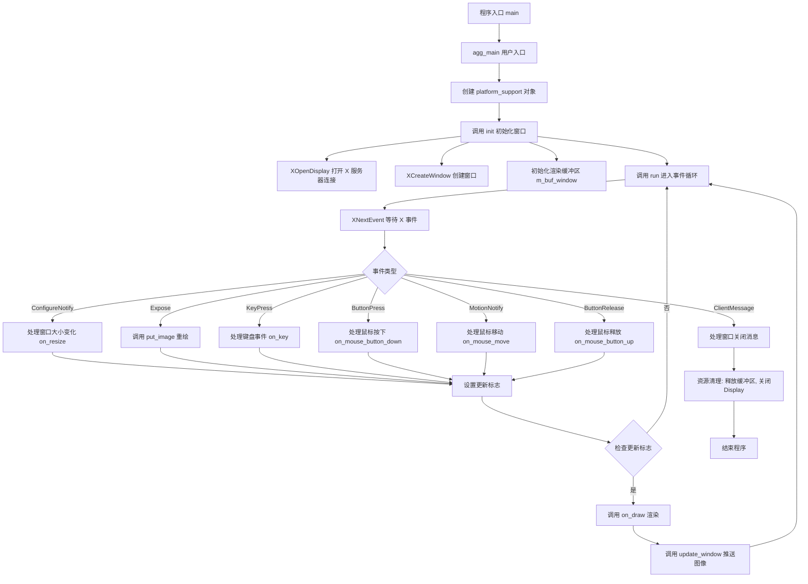

## 类结构

```
agg (命名空间)
├── platform_specific (私有实现类 - 封装X11细节)
│   ├── 构造函数: 初始化像素格式、字节序、密钥映射表 (m_keymap)
│   ├── 字段: m_display (X连接), m_window (窗口句柄), m_gc (图形上下文)
│   ├── 字段: m_buf_window (窗口像素缓冲), m_buf_img[] (图像缓冲)
│   ├── 字段: m_keymap[256] (X11键码到AGG键码的映射)
│   └── 方法: put_image (核心: 处理复杂的像素格式转换和XPutImage)
│
└── platform_support (公共接口类)
    ├── 包含: platform_specific 实例
    ├── 字段: m_rbuf_window (AGG渲染缓冲区), m_ctrls (UI控件容器)
    ├── 方法: init (窗口初始化), run (事件循环)
    ├── 方法: load_img/save_img (PPM文件操作)
    └── 回调: on_init, on_resize, on_draw, on_key, on_mouse_*, on_idle 等
```

## 全局变量及字段


### `max_images`
    
Maximum number of image buffers that can be stored for loading and saving images.

类型：`static const unsigned int`
    


### `xevent_mask_e`
    
Enumeration of X11 event masks used to select the types of events to handle.

类型：`enum xevent_mask_e`
    


### `platform_specific.m_display`
    
Pointer to the X11 display connection, used to communicate with the X server.

类型：`Display*`
    


### `platform_specific.m_window`
    
The X11 window identifier for the application window.

类型：`Window`
    


### `platform_specific.m_gc`
    
Graphics context used for drawing onto the window.

类型：`GC`
    


### `platform_specific.m_ximg_window`
    
XImage object that holds the pixel data for the window's back buffer.

类型：`XImage*`
    


### `platform_specific.m_buf_window`
    
Raw pixel buffer for the main window rendering area.

类型：`unsigned char*`
    


### `platform_specific.m_buf_img`
    
Array of pixel buffers for additional images (used for image loading/saving).

类型：`unsigned char*[]`
    


### `platform_specific.m_keymap`
    
Array mapping X11 key codes to AGG virtual key identifiers.

类型：`unsigned int[]`
    


### `platform_specific.m_format`
    
Pixel format used by the application for rendering.

类型：`pix_format_e`
    


### `platform_specific.m_sys_format`
    
Pixel format of the X11 visual/display system.

类型：`pix_format_e`
    


### `platform_specific.m_bpp`
    
Bits per pixel for the application's pixel format.

类型：`unsigned`
    


### `platform_specific.m_sys_bpp`
    
Bits per pixel for the system visual.

类型：`unsigned`
    


### `platform_specific.m_depth`
    
Color depth of the X11 screen (number of bits per pixel).

类型：`int`
    


### `platform_specific.m_visual`
    
Pointer to the X11 Visual used for the window.

类型：`Visual*`
    


### `platform_specific.m_byte_order`
    
Byte order (LSBFirst/MSBFirst) of the system's pixel data.

类型：`int`
    


### `platform_specific.m_close_atom`
    
X11 atom used for handling the window close event.

类型：`Atom`
    


### `platform_specific.m_update_flag`
    
Flag indicating whether the window needs to be redrawn.

类型：`bool`
    


### `platform_specific.m_resize_flag`
    
Flag indicating whether the window has been resized.

类型：`bool`
    


### `platform_specific.m_initialized`
    
Flag indicating whether the platform-specific initialization has completed.

类型：`bool`
    


### `platform_specific.m_sw_start`
    
Start time for the performance timer (software clock).

类型：`clock_t`
    


### `platform_support.m_specific`
    
Pointer to the platform-specific implementation object.

类型：`platform_specific*`
    


### `platform_support.m_rbuf_window`
    
Rendering buffer for the main window content.

类型：`rendering_buffer`
    


### `platform_support.m_rbuf_img`
    
Array of rendering buffers for stored images.

类型：`rendering_buffer[]`
    


### `platform_support.m_ctrls`
    
Container for UI controls (e.g., sliders, buttons).

类型：`ctrl_container`
    


### `platform_support.m_format`
    
Pixel format used for rendering.

类型：`pix_format_e`
    


### `platform_support.m_bpp`
    
Bits per pixel for the rendering format.

类型：`unsigned`
    


### `platform_support.m_window_flags`
    
Flags describing window properties (e.g., resizable).

类型：`unsigned`
    


### `platform_support.m_wait_mode`
    
Flag indicating whether the application is in event-wait mode (true) or idle mode (false).

类型：`bool`
    


### `platform_support.m_flip_y`
    
Flag indicating whether the Y-axis is flipped for rendering (useful for different coordinate systems).

类型：`bool`
    


### `platform_support.m_initial_width`
    
Initial width of the window.

类型：`unsigned`
    


### `platform_support.m_initial_height`
    
Initial height of the window.

类型：`unsigned`
    


### `platform_support.m_caption`
    
Window title string.

类型：`char[]`
    
    

## 全局函数及方法


### `main`

这是 AGG (Anti-Grain Geometry) 库的 X11 平台演示程序的入口点，它是一个简单的包装函数，将命令行参数传递给用户实现的 `agg_main` 函数。

参数：

-  `argc`：`int`，命令行参数的数量
-  `argv`：`char**`，指向命令行参数数组的指针

返回值：`int`，返回程序的退出状态码（0 表示成功，非 0 表示失败）

#### 流程图

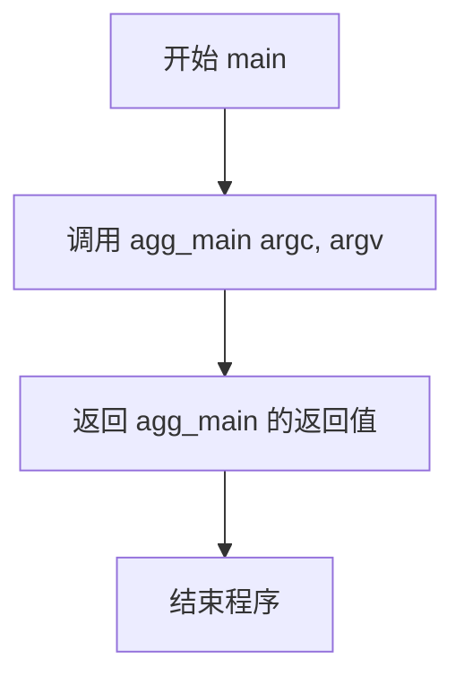

#### 带注释源码

```cpp
// 声明用户实现的 agg_main 函数（由应用程序提供）
int agg_main(int argc, char* argv[]);

// 主函数入口点
// argc: 命令行参数个数
// argv: 命令行参数数组
// 返回值: 程序退出状态码
int main(int argc, char* argv[])
{
    // 将控制权交给用户实现的 agg_main 函数
    // agg_main 函数通常包含应用程序的主要逻辑
    return agg_main(argc, argv);
}
```

---

### `agg_main`（未在此文件中实现）

虽然 `agg_main` 在此代码中未实现，但根据代码上下文和注释，它应该是应用程序的主要入口函数，负责初始化平台支持、设置渲染逻辑并运行应用程序。

**注意**：根据代码中的使用模式，`agg_main` 函数通常由使用 AGG 库的应用程序实现，负责定义具体的图形渲染逻辑和事件处理。`main` 函数仅作为程序启动的入口点，将控制权委托给应用程序定义的 `agg_main` 函数。这种设计模式允许库代码与应用程序代码分离。


### `agg_main`

这是 Anti-Grain Geometry (AGG) 库的 X11 应用程序主入口函数，由用户实现。AGG 库的 `main` 函数会调用此函数来执行实际的应用程序逻辑。

参数：

- `argc`：`int`，命令行参数的数量
- `argv`：`char**`，指向命令行参数数组的指针

返回值：`int`，返回程序退出状态码（0 表示正常退出）

#### 流程图

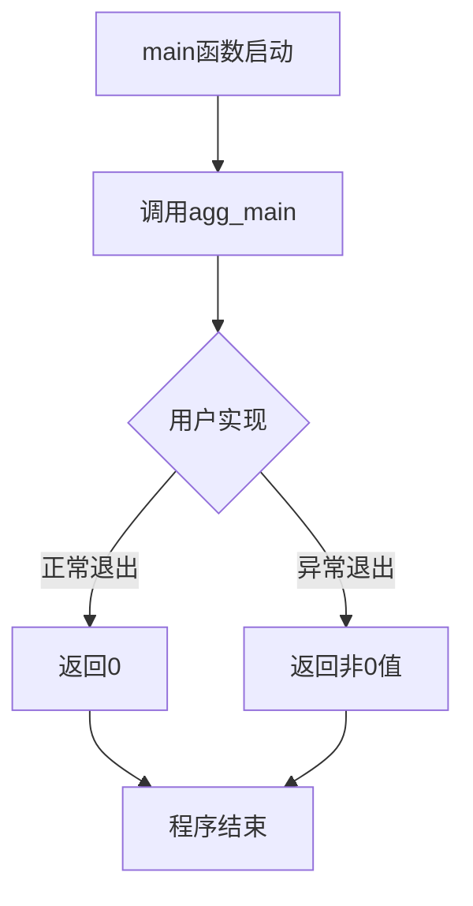

#### 带注释源码

```cpp
//----------------------------------------------------------------------------
// Anti-Grain Geometry - Version 2.4
// 应用程序入口函数声明
//----------------------------------------------------------------------------

// agg_main 函数声明 - 由用户实现
// 参数:
//   argc - 命令行参数个数
//   argv - 命令行参数数组
// 返回值:
//   程序退出状态码
int agg_main(int argc, char* argv[]);


//----------------------------------------------------------------------------
// main 函数 - AGG库的入口点
// 该函数是X11平台的启动点，会调用用户实现的agg_main函数
//----------------------------------------------------------------------------
int main(int argc, char* argv[])
{
    // 将命令行参数传递给agg_main函数
    // 并返回其返回值作为整个程序的退出码
    return agg_main(argc, argv);
}
```

---

### 备注

1. **函数性质**：`agg_main`在此代码中仅为声明，实际实现由使用 AGG 库的应用程序提供。这是 AGG 框架的设计模式，允许库提供统一的入口点而将具体应用逻辑交给用户实现。

2. **调用关系**：`main`函数是 X11 平台的入口点，它接收系统传递的命令行参数，然后原封不动地传递给用户定义的`agg_main`函数。

3. **返回值约定**：返回 0 通常表示程序正常执行完毕，非 0 值表示发生了错误或异常。


### `platform_specific::platform_specific`

**描述**  
该函数是 `platform_specific` 类的构造函数，用于在 X11 环境下完成渲染平台的初始化。它接受像素格式 (`pix_format_e`) 与是否翻转 Y 轴的标志 (`bool`) 两个参数，依次完成成员变量的初始化、图像缓冲区清零、键盘映射表填充以及根据像素格式计算位深（bpp）等操作，为后续的窗口创建、图像渲染和事件处理奠定基础。

**参数**

- `format`：`pix_format_e`，指定渲染所使用的像素格式（如灰度、RGB、RGBA 等）。  
- `flip_y`：`bool`，指示渲染时是否在 Y 方向上翻转（`true` 为翻转，`false` 为不翻转）。

**返回值**  
无返回值（`void`），构造函数不返回任何内容。

#### 流程图

```mermaid
flowchart TD
    Start(开始) --> InitMember[初始化成员变量<br/>（initializer list）]
    InitMember --> ZeroBuffers[清空图像缓冲区<br/>memset(m_buf_img, 0, …)]
    ZeroBuffers --> FillKeymap[填充键映射表<br/>m_keymap[i] = …]
    FillKeymap --> DetermineBPP[根据format计算位深<br/>switch(m_format) → m_bpp]
    DetermineBPP --> RecordTime[记录起始时间<br/>m_sw_start = clock()]
    RecordTime --> End(结束)
```

#### 带注释源码

```cpp
//------------------------------------------------------------------------
// 构造函数：platform_specific
// 参数：
//   format - 像素格式（pix_format_e）
//   flip_y - 是否在渲染时翻转Y轴（bool）
//------------------------------------------------------------------------
platform_specific::platform_specific(pix_format_e format, bool flip_y) :
    //------------------- 初始化成员列表 -------------------//
    m_format(format),                     // 传入的像素格式
    m_sys_format(pix_format_undefined),  // 系统端默认未定义，稍后在 init() 中确定
    m_byte_order(LSBFirst),               // 字节序默认为小端
    m_flip_y(flip_y),                    // 是否翻转Y坐标
    m_bpp(0),                             // 稍后在下面的 switch 中计算
    m_sys_bpp(0),                         // 系统端位深，init() 时确定
    m_display(0),                         // X11 显示器句柄，init() 时打开
    m_screen(0),                          // 默认屏幕编号
    m_depth(0),                           // 颜色深度，init() 时获取
    m_visual(0),                          // 视觉信息，init() 时获取
    m_window(0),                          // 窗口句柄，init() 时创建
    m_gc(0),                              // 图形上下文，init() 时创建
    m_ximg_window(0),                     // XImage 指针，init() 时创建
    m_close_atom(0),                      // “WM_DELETE_WINDOW” 原子，init() 时创建

    m_buf_window(0),                      // 主窗口像素缓冲区，init() 时分配

    m_update_flag(true),                  // 初始需要绘制
    m_resize_flag(true),                  // 初始需要重置大小
    m_initialized(false)                  // 尚未完成完整初始化
    //m_wait_mode(true)
{
    // 清空所有图像缓冲区（最多支持 max_images 个）
    memset(m_buf_img, 0, sizeof(m_buf_img));

    // 初始化键盘映射：默认将 X11 按键码直接映射为对应的枚举值
    unsigned i;
    for (i = 0; i < 256; i++)
    {
        m_keymap[i] = i;
    }

    // 特殊键映射（Pause、Caps Lock、数字键盘等）
    m_keymap[XK_Pause & 0xFF]    = key_pause;
    m_keymap[XK_Clear & 0xFF]   = key_clear;

    // 数字键盘 0‑9 映射
    m_keymap[XK_KP_0 & 0xFF]    = key_kp0;
    m_keymap[XK_KP_1 & 0xFF]    = key_kp1;
    m_keymap[XK_KP_2 & 0xFF]    = key_kp2;
    m_keymap[XK_KP_3 & 0xFF]    = key_kp3;
    m_keymap[XK_KP_4 & 0xFF]    = key_kp4;
    m_keymap[XK_KP_5 & 0xFF]    = key_kp5;
    m_keymap[XK_KP_6 & 0xFF]    = key_kp6;
    m_keymap[XK_KP_7 & 0xFF]    = key_kp7;
    m_keymap[XK_KP_8 & 0xFF]    = key_kp8;
    m_keymap[XK_KP_9 & 0xFF]    = key_kp9;

    // 更多键映射（方向键、功能键等）……（此处省略）

    // 根据像素格式设置对应的位深 (bits per pixel)
    switch (m_format)
    {
    default: break;
    case pix_format_gray8:
    case pix_format_sgray8:
        m_bpp = 8;
        break;

    case pix_format_gray16:
        m_bpp = 16;
        break;

    case pix_format_gray32:
        m_bpp = 32;
        break;

    case pix_format_rgb565:
    case pix_format_rgb555:
        m_bpp = 16;
        break;

    case pix_format_rgb24:
    case pix_format_bgr24:
    case pix_format_srgb24:
    case pix_format_sbgr24:
        m_bpp = 24;
        break;

    case pix_format_bgra32:
    case pix_format_abgr32:
    case pix_format_argb32:
    case pix_format_rgba32:
    case pix_format_sbgra32:
    case pix_format_sabgr32:
    case pix_format_sargb32:
    case pix_format_srgba32:
        m_bpp = 32;
        break;

    // 其余更高位深的格式（48、64、96、128 位）……（此处省略）
    }

    // 记录构造函数执行的起始时间，供后续 elapsed_time() 使用
    m_sw_start = clock();
}
```


### `platform_specific::~platform_specific`

析构函数，用于清理 `platform_specific` 类实例的资源。在该实现中，析构函数体为空，不执行任何操作（资源清理工作主要在 `platform_support::~platform_support()` 中通过 `delete m_specific` 完成）。

参数：无

返回值：无返回值

#### 流程图

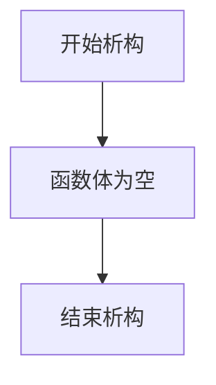

#### 带注释源码

```cpp
//------------------------------------------------------------------------
// platform_specific::~platform_specific()
// 析构函数，不执行任何操作
// 资源清理主要在 platform_support::~platform_support() 中完成
//------------------------------------------------------------------------
platform_specific::~platform_specific()
{
    // 空析构函数体
    // X11 相关的资源（如 Display、Window、GC 等）
    // 在 platform_support::run() 方法的末尾通过显式调用 X 函数进行清理
}
```


### `platform_specific::caption`

该方法通过调用 X11 库函数，设置 X Window 的窗口标题（`WM_NAME`）、标准名称（`XStoreName`）以及图标名称（Icon Name），从而更新窗口在窗口管理器中的显示文本。

参数：

- `capt`：`const char*`，指向以空字符结尾的字符串，表示要设置的窗口标题文本。

返回值：`void`，无返回值。

#### 流程图

```mermaid
graph TD
    A([开始]) --> B[创建 XTextProperty 结构体实例 tp]
    B --> C[赋值 tp.value = capt]
    C --> D[赋值 tp.encoding = XA_WM_NAME]
    D --> E[赋值 tp.format = 8]
    E --> F[赋值 tp.nitems = strlen(capt)]
    F --> G[调用 XSetWMName]
    G --> H[调用 XStoreName]
    H --> I[调用 XSetIconName]
    I --> J[调用 XSetWMIconName]
    J --> K([结束])
```

#### 带注释源码

```cpp
    //------------------------------------------------------------------------
    void platform_specific::caption(const char* capt)
    {
        XTextProperty tp; // X11 文本属性结构体，用于传递窗口标题等文本信息
        tp.value = (unsigned char *)capt; // 将输入的字符串指针赋值给属性值
        tp.encoding = XA_WM_NAME; // 指定编码格式为窗口管理器标准名称 (WM_NAME)
        tp.format = 8; // 指定数据格式为8位字节 (字符串)
        tp.nitems = strlen(capt); // 计算并设置属性值的字节长度

        // 设置窗口的 WM_NAME 属性，这是窗口管理器识别窗口标题的主要方式
        XSetWMName(m_display, m_window, &tp);
        
        // 设置窗口的标准名称（后备存储），某些窗口管理器会优先读取此名称
        XStoreName(m_display, m_window, capt);
        
        // 设置窗口图标（最小化时显示）的名称
        XSetIconName(m_display, m_window, capt);
        
        // 设置窗口图标的 WM_NAME 属性
        XSetWMIconName(m_display, m_window, &tp);
    }
```


### `platform_specific.put_image`

该函数负责将 AGG 渲染缓冲区中的图像数据绘制到 X11 窗口上，支持多种像素格式的自动转换，确保应用程序的渲染结果能够正确显示在不同的 X 服务器显示配置上。

参数：

- `src`：`const rendering_buffer*`，指向源渲染缓冲区的指针，包含待绘制图像的像素数据、宽度和高度信息

返回值：`void`，无返回值

#### 流程图

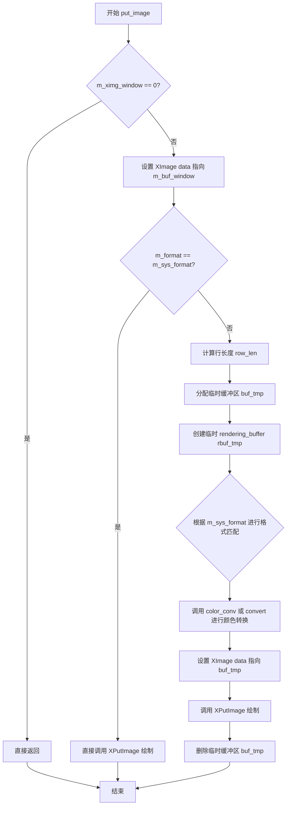

#### 带注释源码

```cpp
//------------------------------------------------------------------------
// 将渲染缓冲区中的图像绘制到 X11 窗口
//------------------------------------------------------------------------
void platform_specific::put_image(const rendering_buffer* src)
{    
    // 如果 XImage 未初始化，直接返回
    if(m_ximg_window == 0) return;
    
    // 将 XImage 的数据指针指向窗口缓冲区
    m_ximg_window->data = (char*)m_buf_window;
    
    // 如果应用程序像素格式与系统像素格式相同，直接绘制
    if(m_format == m_sys_format)
    {
        XPutImage(m_display, 
                  m_window, 
                  m_gc, 
                  m_ximg_window, 
                  0, 0, 0, 0,
                  src->width(), 
                  src->height());
    }
    else
    {
        // 计算目标图像每行的字节数
        int row_len = src->width() * m_sys_bpp / 8;
        
        // 分配临时缓冲区用于格式转换
        unsigned char* buf_tmp = 
            new unsigned char[row_len * src->height()];
        
        // 创建临时渲染缓冲区并附加到临时缓冲区
        rendering_buffer rbuf_tmp;
        rbuf_tmp.attach(buf_tmp, 
                        src->width(), 
                        src->height(), 
                        m_flip_y ? -row_len : row_len);

        // 根据系统格式和应用程序格式进行颜色空间转换
        // 支持多种像素格式的相互转换
        switch(m_sys_format)            
        {
            default: break;
            
            // 系统格式为 RGB555 (15位)
            case pix_format_rgb555:
                switch(m_format)
                {
                    default: break;
                    case pix_format_rgb555: color_conv(&rbuf_tmp, src, color_conv_rgb555_to_rgb555()); break;
                    case pix_format_rgb565: color_conv(&rbuf_tmp, src, color_conv_rgb565_to_rgb555()); break;
                    case pix_format_rgb24:  color_conv(&rbuf_tmp, src, color_conv_rgb24_to_rgb555());  break;
                    case pix_format_bgr24:  color_conv(&rbuf_tmp, src, color_conv_bgr24_to_rgb555());  break;
                    case pix_format_rgba32: color_conv(&rbuf_tmp, src, color_conv_rgba32_to_rgb555()); break;
                    case pix_format_argb32: color_conv(&rbuf_tmp, src, color_conv_argb32_to_rgb555()); break;
                    case pix_format_bgra32: color_conv(&rbuf_tmp, src, color_conv_bgra32_to_rgb555()); break;
                    case pix_format_abgr32: color_conv(&rbuf_tmp, src, color_conv_abgr32_to_rgb555()); break;
                }
                break;
                
            // 系统格式为 RGB565 (16位)
            case pix_format_rgb565:
                switch(m_format)
                {
                    default: break;
                    case pix_format_rgb555: color_conv(&rbuf_tmp, src, color_conv_rgb555_to_rgb565()); break;
                    case pix_format_rgb565: color_conv(&rbuf_tmp, src, color_conv_rgb565_to_rgb565()); break;
                    case pix_format_rgb24:  color_conv(&rbuf_tmp, src, color_conv_rgb24_to_rgb565());  break;
                    case pix_format_bgr24:  color_conv(&rbuf_tmp, src, color_conv_bgr24_to_rgb565());  break;
                    case pix_format_rgba32: color_conv(&rbuf_tmp, src, color_conv_rgba32_to_rgb565()); break;
                    case pix_format_argb32: color_conv(&rbuf_tmp, src, color_conv_argb32_to_rgb565()); break;
                    case pix_format_bgra32: color_conv(&rbuf_tmp, src, color_conv_bgra32_to_rgb565()); break;
                    case pix_format_abgr32: color_conv(&rbuf_tmp, src, color_conv_abgr32_to_rgb565()); break;
                }
                break;
                
            // 系统格式为 RGBA32 (32位)
            case pix_format_rgba32:
                switch(m_format)
                {
                    default: break;
                    case pix_format_sgray8:   convert<pixfmt_srgba32, pixfmt_sgray8>(&rbuf_tmp, src);    break;
                    case pix_format_gray8:    convert<pixfmt_srgba32, pixfmt_gray8>(&rbuf_tmp, src);     break;
                    case pix_format_gray16:   convert<pixfmt_srgba32, pixfmt_gray16>(&rbuf_tmp, src);    break;
                    case pix_format_gray32:   convert<pixfmt_srgba32, pixfmt_gray32>(&rbuf_tmp, src);    break;
                    case pix_format_rgb555: color_conv(&rbuf_tmp, src, color_conv_rgb555_to_rgba32()); break;
                    case pix_format_rgb565: color_conv(&rbuf_tmp, src, color_conv_rgb565_to_rgba32()); break;
                    case pix_format_srgb24:   convert<pixfmt_srgba32, pixfmt_srgb24>(&rbuf_tmp, src);    break;
                    case pix_format_sbgr24:   convert<pixfmt_srgba32, pixfmt_sbgr24>(&rbuf_tmp, src);    break;
                    case pix_format_rgb24:    convert<pixfmt_srgba32, pixfmt_rgb24>(&rbuf_tmp, src);     break;
                    case pix_format_bgr24:    convert<pixfmt_srgba32, pixfmt_bgr24>(&rbuf_tmp, src);     break;
                    case pix_format_srgba32:  convert<pixfmt_srgba32, pixfmt_srgba32>(&rbuf_tmp, src);   break;
                    case pix_format_sargb32:  convert<pixfmt_srgba32, pixfmt_sargb32>(&rbuf_tmp, src);   break;
                    case pix_format_sabgr32:  convert<pixfmt_srgba32, pixfmt_sabgr32>(&rbuf_tmp, src);   break;
                    case pix_format_sbgra32:  convert<pixfmt_srgba32, pixfmt_sbgra32>(&rbuf_tmp, src);   break;
                    case pix_format_rgba32:   convert<pixfmt_srgba32, pixfmt_rgba32>(&rbuf_tmp, src);    break;
                    case pix_format_argb32:   convert<pixfmt_srgba32, pixfmt_argb32>(&rbuf_tmp, src);    break;
                    case pix_format_abgr32:   convert<pixfmt_srgba32, pixfmt_abgr32>(&rbuf_tmp, src);    break;
                    case pix_format_bgra32:   convert<pixfmt_srgba32, pixfmt_bgra32>(&rbuf_tmp, src);    break;
                    case pix_format_rgb48:    convert<pixfmt_srgba32, pixfmt_rgb48>(&rbuf_tmp, src);     break;
                    case pix_format_bgr48:    convert<pixfmt_srgba32, pixfmt_bgr48>(&rbuf_tmp, src);     break;
                    case pix_format_rgba64:   convert<pixfmt_srgba32, pixfmt_rgba64>(&rbuf_tmp, src);    break;
                    case pix_format_argb64:   convert<pixfmt_srgba32, pixfmt_argb64>(&rbuf_tmp, src);    break;
                    case pix_format_abgr64:   convert<pixfmt_srgba32, pixfmt_abgr64>(&rbuf_tmp, src);    break;
                    case pix_format_bgra64:   convert<pixfmt_srgba32, pixfmt_bgra64>(&rbuf_tmp, src);    break;
                    case pix_format_rgb96:    convert<pixfmt_srgba32, pixfmt_rgb96>(&rbuf_tmp, src);     break;
                    case pix_format_bgr96:    convert<pixfmt_srgba32, pixfmt_bgr96>(&rbuf_tmp, src);     break;
                    case pix_format_rgba128:  convert<pixfmt_srgba32, pixfmt_rgba128>(&rbuf_tmp, src);   break;
                    case pix_format_argb128:  convert<pixfmt_srgba32, pixfmt_argb128>(&rbuf_tmp, src);   break;
                    case pix_format_abgr128:  convert<pixfmt_srgba32, pixfmt_abgr128>(&rbuf_tmp, src);   break;
                    case pix_format_bgra128:  convert<pixfmt_srgba32, pixfmt_bgra128>(&rbuf_tmp, src);   break;
                }
                break;
                
            // 系统格式为 ABGR32 (32位)
            case pix_format_abgr32:
                switch(m_format)
                {
                    default: break;
                    case pix_format_sgray8:   convert<pixfmt_sabgr32, pixfmt_sgray8>(&rbuf_tmp, src);    break;
                    case pix_format_gray8:    convert<pixfmt_sabgr32, pixfmt_gray8>(&rbuf_tmp, src);     break;
                    case pix_format_gray16:   convert<pixfmt_sabgr32, pixfmt_gray16>(&rbuf_tmp, src);    break;
                    case pix_format_gray32:   convert<pixfmt_sabgr32, pixfmt_gray32>(&rbuf_tmp, src);    break;
                    case pix_format_rgb555: color_conv(&rbuf_tmp, src, color_conv_rgb555_to_abgr32()); break;
                    case pix_format_rgb565: color_conv(&rbuf_tmp, src, color_conv_rgb565_to_abgr32()); break;
                    case pix_format_srgb24:   convert<pixfmt_sabgr32, pixfmt_srgb24>(&rbuf_tmp, src);    break;
                    case pix_format_sbgr24:   convert<pixfmt_sabgr32, pixfmt_sbgr24>(&rbuf_tmp, src);    break;
                    case pix_format_rgb24:    convert<pixfmt_sabgr32, pixfmt_rgb24>(&rbuf_tmp, src);     break;
                    case pix_format_bgr24:    convert<pixfmt_sabgr32, pixfmt_bgr24>(&rbuf_tmp, src);     break;
                    case pix_format_srgba32:  convert<pixfmt_sabgr32, pixfmt_srgba32>(&rbuf_tmp, src);   break;
                    case pix_format_sargb32:  convert<pixfmt_sabgr32, pixfmt_sargb32>(&rbuf_tmp, src);   break;
                    case pix_format_sabgr32:  convert<pixfmt_sabgr32, pixfmt_sabgr32>(&rbuf_tmp, src);   break;
                    case pix_format_sbgra32:  convert<pixfmt_sabgr32, pixfmt_sbgra32>(&rbuf_tmp, src);   break;
                    case pix_format_rgba32:   convert<pixfmt_sabgr32, pixfmt_rgba32>(&rbuf_tmp, src);    break;
                    case pix_format_argb32:   convert<pixfmt_sabgr32, pixfmt_argb32>(&rbuf_tmp, src);    break;
                    case pix_format_abgr32:   convert<pixfmt_sabgr32, pixfmt_abgr32>(&rbuf_tmp, src);    break;
                    case pix_format_bgra32:   convert<pixfmt_sabgr32, pixfmt_bgra32>(&rbuf_tmp, src);    break;
                    case pix_format_rgb48:    convert<pixfmt_sabgr32, pixfmt_rgb48>(&rbuf_tmp, src);     break;
                    case pix_format_bgr48:    convert<pixfmt_sabgr32, pixfmt_bgr48>(&rbuf_tmp, src);     break;
                    case pix_format_rgba64:   convert<pixfmt_sabgr32, pixfmt_rgba64>(&rbuf_tmp, src);    break;
                    case pix_format_argb64:   convert<pixfmt_sabgr32, pixfmt_argb64>(&rbuf_tmp, src);    break;
                    case pix_format_abgr64:   convert<pixfmt_sabgr32, pixfmt_abgr64>(&rbuf_tmp, src);    break;
                    case pix_format_bgra64:   convert<pixfmt_sabgr32, pixfmt_bgra64>(&rbuf_tmp, src);    break;
                    case pix_format_rgb96:    convert<pixfmt_sabgr32, pixfmt_rgb96>(&rbuf_tmp, src);     break;
                    case pix_format_bgr96:    convert<pixfmt_sabgr32, pixfmt_bgr96>(&rbuf_tmp, src);     break;
                    case pix_format_rgba128:  convert<pixfmt_sabgr32, pixfmt_rgba128>(&rbuf_tmp, src);   break;
                    case pix_format_argb128:  convert<pixfmt_sabgr32, pixfmt_argb128>(&rbuf_tmp, src);   break;
                    case pix_format_abgr128:  convert<pixfmt_sabgr32, pixfmt_abgr128>(&rbuf_tmp, src);   break;
                    case pix_format_bgra128:  convert<pixfmt_sabgr32, pixfmt_bgra128>(&rbuf_tmp, src);   break;
                }
                break;
                
            // 系统格式为 ARGB32 (32位)
            case pix_format_argb32:
                switch(m_format)
                {
                    default: break;
                    case pix_format_sgray8:   convert<pixfmt_sargb32, pixfmt_sgray8>(&rbuf_tmp, src);    break;
                    case pix_format_gray8:    convert<pixfmt_sargb32, pixfmt_gray8>(&rbuf_tmp, src);     break;
                    case pix_format_gray16:   convert<pixfmt_sargb32, pixfmt_gray16>(&rbuf_tmp, src);    break;
                    case pix_format_gray32:   convert<pixfmt_sargb32, pixfmt_gray32>(&rbuf_tmp, src);    break;
                    case pix_format_rgb555: color_conv(&rbuf_tmp, src, color_conv_rgb555_to_argb32()); break;
                    case pix_format_rgb565: color_conv(&rbuf_tmp, src, color_conv_rgb565_to_argb32()); break;
                    case pix_format_srgb24:   convert<pixfmt_sargb32, pixfmt_srgb24>(&rbuf_tmp, src);    break;
                    case pix_format_sbgr24:   convert<pixfmt_sargb32, pixfmt_sbgr24>(&rbuf_tmp, src);    break;
                    case pix_format_rgb24:    convert<pixfmt_sargb32, pixfmt_rgb24>(&rbuf_tmp, src);     break;
                    case pix_format_bgr24:    convert<pixfmt_sargb32, pixfmt_bgr24>(&rbuf_tmp, src);     break;
                    case pix_format_srgba32:  convert<pixfmt_sargb32, pixfmt_srgba32>(&rbuf_tmp, src);   break;
                    case pix_format_sargb32:  convert<pixfmt_sargb32, pixfmt_sargb32>(&rbuf_tmp, src);   break;
                    case pix_format_sabgr32:  convert<pixfmt_sargb32, pixfmt_sabgr32>(&rbuf_tmp, src);   break;
                    case pix_format_sbgra32:  convert<pixfmt_sargb32, pixfmt_sbgra32>(&rbuf_tmp, src);   break;
                    case pix_format_rgba32:   convert<pixfmt_sargb32, pixfmt_rgba32>(&rbuf_tmp, src);    break;
                    case pix_format_argb32:   convert<pixfmt_sargb32, pixfmt_argb32>(&rbuf_tmp, src);    break;
                    case pix_format_abgr32:   convert<pixfmt_sargb32, pixfmt_abgr32>(&rbuf_tmp, src);    break;
                    case pix_format_bgra32:   convert<pixfmt_sargb32, pixfmt_bgra32>(&rbuf_tmp, src);    break;
                    case pix_format_rgb48:    convert<pixfmt_sargb32, pixfmt_rgb48>(&rbuf_tmp, src);     break;
                    case pix_format_bgr48:    convert<pixfmt_sargb32, pixfmt_bgr48>(&rbuf_tmp, src);     break;
                    case pix_format_rgba64:   convert<pixfmt_sargb32, pixfmt_rgba64>(&rbuf_tmp, src);    break;
                    case pix_format_argb64:   convert<pixfmt_sargb32, pixfmt_argb64>(&rbuf_tmp, src);    break;
                    case pix_format_abgr64:   convert<pixfmt_sargb32, pixfmt_abgr64>(&rbuf_tmp, src);    break;
                    case pix_format_bgra64:   convert<pixfmt_sargb32, pixfmt_bgra64>(&rbuf_tmp, src);    break;
                    case pix_format_rgb96:    convert<pixfmt_sargb32, pixfmt_rgb96>(&rbuf_tmp, src);     break;
                    case pix_format_bgr96:    convert<pixfmt_sargb32, pixfmt_bgr96>(&rbuf_tmp, src);     break;
                    case pix_format_rgba128:  convert<pixfmt_sargb32, pixfmt_rgba128>(&rbuf_tmp, src);   break;
                    case pix_format_argb128:  convert<pixfmt_sargb32, pixfmt_argb128>(&rbuf_tmp, src);   break;
                    case pix_format_abgr128:  convert<pixfmt_sargb32, pixfmt_abgr128>(&rbuf_tmp, src);   break;
                    case pix_format_bgra128:  convert<pixfmt_sargb32, pixfmt_bgra128>(&rbuf_tmp, src);   break;
                }
                break;
                
            // 系统格式为 BGRA32 (32位)
            case pix_format_bgra32:
                switch(m_format)
                {
                    default: break;
                    case pix_format_sgray8:   convert<pixfmt_sbgra32, pixfmt_sgray8>(&rbuf_tmp, src);    break;
                    case pix_format_gray8:    convert<pixfmt_sbgra32, pixfmt_gray8>(&rbuf_tmp, src);     break;
                    case pix_format_gray16:   convert<pixfmt_sbgra32, pixfmt_gray16>(&rbuf_tmp, src);    break;
                    case pix_format_gray32:   convert<pixfmt_sbgra32, pixfmt_gray32>(&rbuf_tmp, src);    break;
                    case pix_format_rgb555:   color_conv(&rbuf_tmp, src, color_conv_rgb555_to_bgra32()); break;
                    case pix_format_rgb565:   color_conv(&rbuf_tmp, src, color_conv_rgb565_to_bgra32()); break;
                    case pix_format_srgb24:   convert<pixfmt_sbgra32, pixfmt_srgb24>(&rbuf_tmp, src);    break;
                    case pix_format_sbgr24:   convert<pixfmt_sbgra32, pixfmt_sbgr24>(&rbuf_tmp, src);    break;
                    case pix_format_rgb24:    convert<pixfmt_sbgra32, pixfmt_rgb24>(&rbuf_tmp, src);     break;
                    case pix_format_bgr24:    convert<pixfmt_sbgra32, pixfmt_bgr24>(&rbuf_tmp, src);     break;
                    case pix_format_srgba32:  convert<pixfmt_sbgra32, pixfmt_srgba32>(&rbuf_tmp, src);   break;
                    case pix_format_sargb32:  convert<pixfmt_sbgra32, pixfmt_sargb32>(&rbuf_tmp, src);   break;
                    case pix_format_sabgr32:  convert<pixfmt_sbgra32, pixfmt_sabgr32>(&rbuf_tmp, src);   break;
                    case pix_format_sbgra32:  convert<pixfmt_sbgra32, pixfmt_sbgra32>(&rbuf_tmp, src);   break;
                    case pix_format_rgba32:   convert<pixfmt_sbgra32, pixfmt_rgba32>(&rbuf_tmp, src);    break;
                    case pix_format_argb32:   convert<pixfmt_sbgra32, pixfmt_argb32>(&rbuf_tmp, src);    break;
                    case pix_format_abgr32:   convert<pixfmt_sbgra32, pixfmt_abgr32>(&rbuf_tmp, src);    break;
                    case pix_format_bgra32:   convert<pixfmt_sbgra32, pixfmt_bgra32>(&rbuf_tmp, src);    break;
                    case pix_format_rgb48:    convert<pixfmt_sbgra32, pixfmt_rgb48>(&rbuf_tmp, src);     break;
                    case pix_format_bgr48:    convert<pixfmt_sbgra32, pixfmt_bgr48>(&rbuf_tmp, src);     break;
                    case pix_format_rgba64:   convert<pixfmt_sbgra32, pixfmt_rgba64>(&rbuf_tmp, src);    break;
                    case pix_format_argb64:   convert<pixfmt_sbgra32, pixfmt_argb64>(&rbuf_tmp, src);    break;
                    case pix_format_abgr64:   convert<pixfmt_sbgra32, pixfmt_abgr64>(&rbuf_tmp, src);    break;
                    case pix_format_bgra64:   convert<pixfmt_sbgra32, pixfmt_bgra64>(&rbuf_tmp, src);    break;
                    case pix_format_rgb96:    convert<pixfmt_sbgra32, pixfmt_rgb96>(&rbuf_tmp, src);     break;
                    case pix_format_bgr96:    convert<pixfmt_sbgra32, pixfmt_bgr96>(&rbuf_tmp, src);     break;
                    case pix_format_rgba128:  convert<pixfmt_sbgra32, pixfmt_rgba128>(&rbuf_tmp, src);   break;
                    case pix_format_argb128:  convert<pixfmt_sbgra32, pixfmt_argb128>(&rbuf_tmp, src);   break;
                    case pix_format_abgr128:  convert<pixfmt_sbgra32, pixfmt_abgr128>(&rbuf_tmp, src);   break;
                    case pix_format_bgra128:  convert<pixfmt_sbgra32, pixfmt_bgra128>(&rbuf_tmp, src);   break;
                }
                break;
        }
        
        // 将转换后的数据设置到 XImage 并绘制
        m_ximg_window->data = (char*)buf_tmp;
        XPutImage(m_display, 
                  m_window, 
                  m_gc, 
                  m_ximg_window, 
                  0, 0, 0, 0,
                  src->width(), 
                  src->height());
        
        // 释放临时缓冲区内存
        delete [] buf_tmp;
    }
}
```


### `platform_support.platform_support`

这是 `platform_support` 类的构造函数，用于初始化 AGG (Anti-Grain Geometry) 库的 X11 平台支持层。该构造函数创建平台特定实现对象，设置像素格式、翻转模式，并初始化默认窗口参数。

参数：

- `format`：`pix_format_e`，指定渲染缓冲区的像素格式（如 RGB、RGBA、灰度等）
- `flip_y`：`bool`，指示是否垂直翻转渲染缓冲区（true 为翻转，false 为不翻转）

返回值：无（构造函数），隐式返回已初始化的 `platform_support` 对象实例

#### 流程图

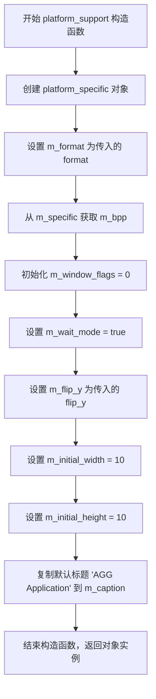

#### 带注释源码

```cpp
//------------------------------------------------------------------------
// platform_support 构造函数
// 参数:
//   format - pix_format_e 类型的像素格式枚举
//   flip_y - bool 类型，是否垂直翻转渲染缓冲区
//------------------------------------------------------------------------
platform_support::platform_support(pix_format_e format, bool flip_y) :
    // 初始化列表：按照声明顺序初始化成员变量
    
    // 创建平台特定实现对象，传入像素格式和翻转标志
    m_specific(new platform_specific(format, flip_y)),
    
    // 保存传入的像素格式
    m_format(format),
    
    // 从平台特定对象获取对应的位深度
    m_bpp(m_specific->m_bpp),
    
    // 初始化窗口标志为 0（无特殊窗口样式）
    m_window_flags(0),
    
    // 默认启用等待模式（事件处理时阻塞）
    m_wait_mode(true),
    
    // 保存垂直翻转标志
    m_flip_y(flip_y),
    
    // 设置默认初始窗口宽度
    m_initial_width(10),
    
    // 设置默认初始窗口高度
    m_initial_height(10)
{
    // 构造函数体：将默认标题复制到成员变量
    strcpy(m_caption, "AGG Application");
}
```

#### 补充说明

该构造函数仅完成基本的成员变量初始化，实际的 X11 窗口创建和显示初始化在后续调用的 `init()` 方法中完成。`platform_specific` 类是 X11 平台的具体实现，封装了 Display、Window、GC 等 X11 资源。


### `platform_support::~platform_support`

析构函数，负责销毁 `platform_support` 实例，释放平台特定资源的内存。

参数：

- 无

返回值：

- 无（析构函数无返回值）

#### 流程图

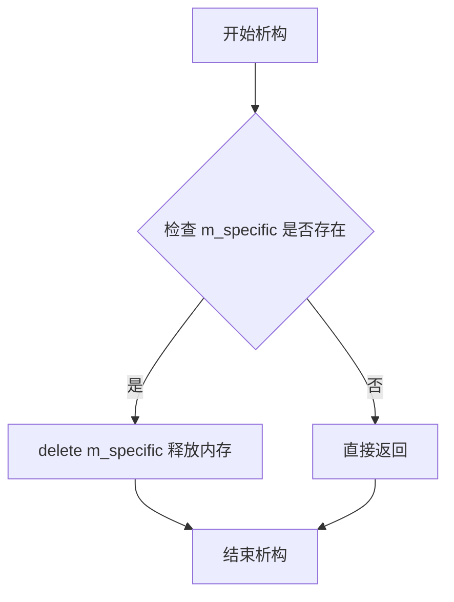

#### 带注释源码

```cpp
//------------------------------------------------------------------------
// platform_support::~platform_support()
// 析构函数，释放平台支持相关的资源
//------------------------------------------------------------------------
platform_support::~platform_support()
{
    // 删除 platform_specific 实例，释放其管理的 X11 窗口、显示连接等资源
    // platform_specific 的析构函数会处理这些资源的释放
    delete m_specific;
}
```


### platform_support.init

该函数是 Anti-Grain Geometry (AGG) 库中平台支持类的核心初始化方法，负责建立与 X11 显示服务器的连接、检测系统像素格式、创建图形窗口并配置事件处理，是整个图形应用运行的入口点。

参数：

- `width`：`unsigned`，窗口的宽度（像素）
- `height`：`unsigned`，窗口的高度（像素）
- `flags`：`unsigned`，窗口标志（如是否允许调整大小等）

返回值：`bool`，初始化成功返回 true，失败返回 false（如无法打开显示服务器、不支持的像素格式等）

#### 流程图

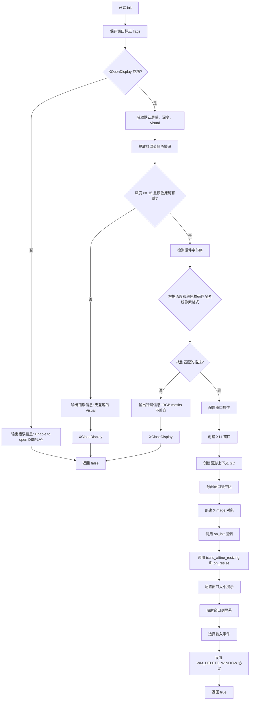

#### 带注释源码

```cpp
//------------------------------------------------------------------------
// 初始化平台支持，创建 X11 窗口并建立图形环境
//------------------------------------------------------------------------
bool platform_support::init(unsigned width, unsigned height, unsigned flags)
{
    // 保存窗口标志位
    m_window_flags = flags;
    
    // 打开 X11 显示服务器，NULL 表示使用 DISPLAY 环境变量
    m_specific->m_display = XOpenDisplay(NULL);
    if(m_specific->m_display == 0) 
    {
        // 无法打开显示服务器时输出错误并返回失败
        fprintf(stderr, "Unable to open DISPLAY!\n");
        return false;
    }
    
    // 获取默认屏幕信息
    m_specific->m_screen = XDefaultScreen(m_specific->m_display);
    // 获取默认颜色深度
    m_specific->m_depth  = XDefaultDepth(m_specific->m_display, 
                                         m_specific->m_screen);
    // 获取默认 Visual（视觉结构）
    m_specific->m_visual = XDefaultVisual(m_specific->m_display, 
                                          m_specific->m_screen);
    
    // 提取红、绿、蓝颜色掩码，用于确定像素格式
    unsigned long r_mask = m_specific->m_visual->red_mask;
    unsigned long g_mask = m_specific->m_visual->green_mask;
    unsigned long b_mask = m_specific->m_visual->blue_mask;
    
    // 检查是否满足 AGG 的最低要求：15位色深且有有效的颜色掩码
    if(m_specific->m_depth < 15 ||
       r_mask == 0 || g_mask == 0 || b_mask == 0)
    {
        fprintf(stderr,
               "There's no Visual compatible with minimal AGG requirements:\n"
               "At least 15-bit color depth and True- or DirectColor class.\n\n");
        XCloseDisplay(m_specific->m_display);
        return false;
    }
    
    // 检测硬件字节序（Little-Endian 或 Big-Endian）
    int t = 1;
    int hw_byte_order = LSBFirst;
    if(*(char*)&t == 0) hw_byte_order = MSBFirst;
    
    // 根据深度和 RGB 掩码推断系统像素格式
    switch(m_specific->m_depth)
    {
        // 15位色深通常对应 RGB555
        case 15:
            m_specific->m_sys_bpp = 16;
            if(r_mask == 0x7C00 && g_mask == 0x3E0 && b_mask == 0x1F)
            {
                m_specific->m_sys_format = pix_format_rgb555;
                m_specific->m_byte_order = hw_byte_order;
            }
            break;
            
        // 16位色深通常对应 RGB565
        case 16:
            m_specific->m_sys_bpp = 16;
            if(r_mask == 0xF800 && g_mask == 0x7E0 && b_mask == 0x1F)
            {
                m_specific->m_sys_format = pix_format_rgb565;
                m_specific->m_byte_order = hw_byte_order;
            }
            break;
            
        // 24或32位色深对应 32位 RGBA 格式
        case 24:
        case 32:
            m_specific->m_sys_bpp = 32;
            // 绿色掩码为 0xFF00 时判断字节序
            if(g_mask == 0xFF00)
            {
                // 小端序：红在低位，蓝在高位
                if(r_mask == 0xFF && b_mask == 0xFF0000)
                {
                    switch(m_specific->m_format)
                    {
                        case pix_format_rgba32:
                            m_specific->m_sys_format = pix_format_rgba32;
                            m_specific->m_byte_order = LSBFirst;
                            break;
                            
                        case pix_format_abgr32:
                            m_specific->m_sys_format = pix_format_abgr32;
                            m_specific->m_byte_order = MSBFirst;
                            break;

                        default:                            
                            m_specific->m_byte_order = hw_byte_order;
                            m_specific->m_sys_format = 
                                (hw_byte_order == LSBFirst) ?
                                pix_format_rgba32 :
                                pix_format_abgr32;
                            break;
                    }
                }
                
                // 大端序：红在高位，蓝在低位
                if(r_mask == 0xFF0000 && b_mask == 0xFF)
                {
                    switch(m_specific->m_format)
                    {
                        case pix_format_argb32:
                            m_specific->m_sys_format = pix_format_argb32;
                            m_specific->m_byte_order = MSBFirst;
                            break;
                            
                        case pix_format_bgra32:
                            m_specific->m_sys_format = pix_format_bgra32;
                            m_specific->m_byte_order = LSBFirst;
                            break;

                        default:                            
                            m_specific->m_byte_order = hw_byte_order;
                            m_specific->m_sys_format = 
                                (hw_byte_order == MSBFirst) ?
                                pix_format_argb32 :
                                pix_format_bgra32;
                            break;
                    }
                }
            }
            break;
    }
    
    // 如果无法确定系统像素格式，返回失败
    if(m_specific->m_sys_format == pix_format_undefined)
    {
        fprintf(stderr,
               "RGB masks are not compatible with AGG pixel formats:\n"
               "R=%08x, R=%08x, B=%08x\n", r_mask, g_mask, b_mask);
        XCloseDisplay(m_specific->m_display);
        return false;
    }
            
    // 初始化窗口属性结构
    memset(&m_specific->m_window_attributes, 
           0, 
           sizeof(m_specific->m_window_attributes)); 
    
    // 设置窗口边框颜色为黑色
    m_specific->m_window_attributes.border_pixel = 
        XBlackPixel(m_specific->m_display, m_specific->m_screen);

    // 设置窗口背景颜色为白色
    m_specific->m_window_attributes.background_pixel = 
        XWhitePixel(m_specific->m_display, m_specific->m_screen);

    // 不覆盖窗口管理器的控制
    m_specific->m_window_attributes.override_redirect = 0;

    // 窗口属性掩码
    unsigned long window_mask = CWBackPixel | CWBorderPixel;

    // 创建 X11 窗口
    m_specific->m_window = 
        XCreateWindow(m_specific->m_display, 
                      XDefaultRootWindow(m_specific->m_display), 
                      0, 0,                          // 窗口位置
                      width, height,                // 窗口尺寸
                      0,                            // 边框宽度
                      m_specific->m_depth,          // 颜色深度
                      InputOutput,                  // 窗口类别
                      CopyFromParent,               // Visual
                      window_mask,                  // 属性掩码
                      &m_specific->m_window_attributes);

    // 创建图形上下文（GC）用于绘图操作
    m_specific->m_gc = XCreateGC(m_specific->m_display, 
                                 m_specific->m_window, 
                                 0, 0); 
    
    // 分配窗口缓冲区内存（用于渲染）
    m_specific->m_buf_window = 
        new unsigned char[width * height * (m_bpp / 8)];

    // 将缓冲区初始化为白色
    memset(m_specific->m_buf_window, 255, width * height * (m_bpp / 8));
    
    // 将缓冲区附加到渲染缓冲区对象
    m_rbuf_window.attach(m_specific->m_buf_window,
                         width,
                         height,
                         // 根据 flip_y 决定行顺序（正向或反向）
                         m_flip_y ? -width * (m_bpp / 8) : width * (m_bpp / 8));
            
    // 创建 XImage 对象用于图像数据传输
    m_specific->m_ximg_window = 
        XCreateImage(m_specific->m_display, 
                     m_specific->m_visual, 
                     m_specific->m_depth, 
                     ZPixmap,           // 像素格式
                     0,
                     (char*)m_specific->m_buf_window, 
                     width,
                     height, 
                     m_specific->m_sys_bpp,
                     width * (m_specific->m_sys_bpp / 8));
    // 设置图像字节序
    m_specific->m_ximg_window->byte_order = m_specific->m_byte_order;

    // 设置窗口标题
    m_specific->caption(m_caption); 
    
    // 保存初始窗口尺寸
    m_initial_width = width;
    m_initial_height = height;
    
    // 如果是首次初始化，调用用户的 on_init 回调
    if(!m_specific->m_initialized)
    {
        on_init();
        m_specific->m_initialized = true;
    }

    // 处理窗口大小变化的仿射变换
    trans_affine_resizing(width, height);
    // 调用用户的 on_resize 回调
    on_resize(width, height);
    // 设置更新标志，触发首次绘制
    m_specific->m_update_flag = true;

    // 分配并设置窗口大小提示
    XSizeHints *hints = XAllocSizeHints();
    if(hints) 
    {
        // 根据 flags 决定是否允许调整大小
        if(flags & window_resize)
        {
            hints->min_width = 32;
            hints->min_height = 32;
            hints->max_width = 4096;
            hints->max_height = 4096;
        }
        else
        {
            hints->min_width  = width;
            hints->min_height = height;
            hints->max_width  = width;
            hints->max_height = height;
        }
        hints->flags = PMaxSize | PMinSize;

        // 设置标准窗口提示
        XSetWMNormalHints(m_specific->m_display, 
                          m_specific->m_window, 
                          hints);

        XFree(hints);
    }

    // 将窗口映射到屏幕（显示窗口）
    XMapWindow(m_specific->m_display, 
               m_specific->m_window);

    // 选择要处理的事件类型
    XSelectInput(m_specific->m_display, 
                 m_specific->m_window, 
                 xevent_mask);

    // 获取 WM_DELETE_WINDOW 原子，用于处理窗口关闭事件
    m_specific->m_close_atom = XInternAtom(m_specific->m_display, 
                                           "WM_DELETE_WINDOW", 
                                           false);

    // 设置窗口协议，允许捕获关闭事件
    XSetWMProtocols(m_specific->m_display, 
                    m_specific->m_window, 
                    &m_specific->m_close_atom, 
                    1);

    // 初始化成功
    return true;
}
```


### `platform_support.run`

该方法是AGG库中X11平台支持的主事件循环，负责处理窗口的所有事件（键盘、鼠标、窗口大小调整、暴露、关闭等），并将这些事件分派给相应的回调方法。同时处理渲染更新和空闲处理，当程序退出时负责释放资源。

参数：无

返回值：`int`，返回0表示正常退出

#### 流程图

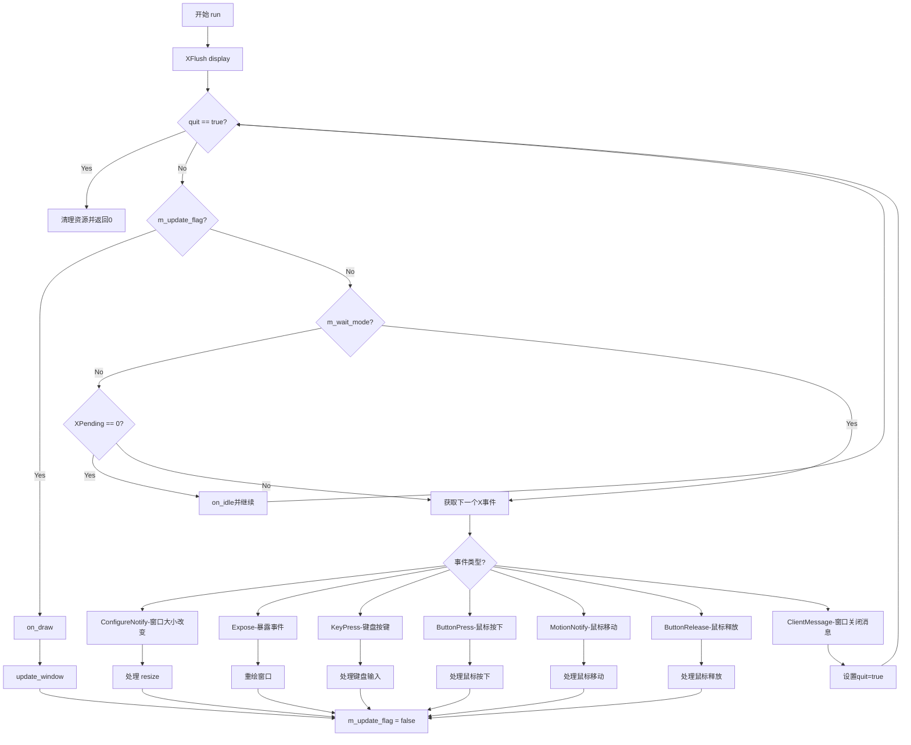

#### 带注释源码

```cpp
//------------------------------------------------------------------------
// 主事件循环 - 处理所有X11窗口事件
//------------------------------------------------------------------------
int platform_support::run()
{
    // 刷新X服务器缓冲区，确保所有待处理的请求都被发送
    XFlush(m_specific->m_display);
    
    // 退出标志
    bool quit = false;
    // 事件标志（键盘修饰键、鼠标按钮状态）
    unsigned flags;
    // 当前鼠标位置
    int cur_x;
    int cur_y;

    // 主事件循环 - 持续运行直到用户关闭窗口
    while(!quit)
    {
        // 如果需要更新（重绘标志为真），则执行绘制
        if(m_specific->m_update_flag)
        {
            // 调用用户的绘制回调函数
            on_draw();
            // 将绘制缓冲区内容更新到窗口
            update_window();
            // 重置更新标志
            m_specific->m_update_flag = false;
        }

        // 如果不是等待模式（非阻塞）
        if(!m_wait_mode)
        {
            // 检查是否有待处理的事件
            if(XPending(m_specific->m_display) == 0)
            {
                // 没有事件，调用空闲处理回调并继续循环
                on_idle();
                continue;
            }
        }

        // 获取下一个X事件
        XEvent x_event;
        XNextEvent(m_specific->m_display, &x_event);
        
        // 在非等待模式下丢弃中间的MotionNotify事件以减少冗余处理
        if(!m_wait_mode && x_event.type == MotionNotify)
        {
            XEvent te = x_event;
            for(;;)
            {
                if(XPending(m_specific->m_display) == 0) break;
                XNextEvent(m_specific->m_display, &te);
                if(te.type != MotionNotify) break;
            }
            x_event = te;
        }

        // 根据事件类型分发处理
        switch(x_event.type) 
        {
        // 窗口大小改变事件
        case ConfigureNotify: 
            {
                // 检查窗口尺寸是否真的改变了
                if(x_event.xconfigure.width  != int(m_rbuf_window.width()) ||
                   x_event.xconfigure.height != int(m_rbuf_window.height()))
                {
                    int width  = x_event.xconfigure.width;
                    int height = x_event.xconfigure.height;

                    // 释放旧的窗口缓冲区
                    delete [] m_specific->m_buf_window;
                    m_specific->m_ximg_window->data = 0;
                    XDestroyImage(m_specific->m_ximg_window);

                    // 分配新的窗口缓冲区
                    m_specific->m_buf_window = 
                        new unsigned char[width * height * (m_bpp / 8)];

                    // 重新附加渲染缓冲区
                    m_rbuf_window.attach(m_specific->m_buf_window,
                                         width,
                                         height,
                                         m_flip_y ? 
                                         -width * (m_bpp / 8) : 
                                         width * (m_bpp / 8));
            
                    // 重新创建X图像
                    m_specific->m_ximg_window = 
                        XCreateImage(m_specific->m_display, 
                                     m_specific->m_visual, //CopyFromParent, 
                                     m_specific->m_depth, 
                                     ZPixmap, 
                                     0,
                                     (char*)m_specific->m_buf_window, 
                                     width,
                                     height, 
                                     m_specific->m_sys_bpp,
                                     width * (m_specific->m_sys_bpp / 8));
                    m_specific->m_ximg_window->byte_order = m_specific->m_byte_order;

                    // 处理变换矩阵调整和用户回调
                    trans_affine_resizing(width, height);
                    on_resize(width, height);
                    on_draw();
                    update_window();
                }
            }
            break;

        // 窗口暴露事件 - 需要重绘
        case Expose:
            m_specific->put_image(&m_rbuf_window);
            XFlush(m_specific->m_display);
            XSync(m_specific->m_display, false);
            break;

        // 键盘按下事件
        case KeyPress:
            {
                // 获取按键符号
                KeySym key = XLookupKeysym(&x_event.xkey, 0);
                flags = 0;
                // 检查修饰键状态
                if(x_event.xkey.state & Button1Mask) flags |= mouse_left;
                if(x_event.xkey.state & Button3Mask) flags |= mouse_right;
                if(x_event.xkey.state & ShiftMask)   flags |= kbd_shift;
                if(x_event.xkey.state & ControlMask) flags |= kbd_ctrl;

                // 方向键状态
                bool left  = false;
                bool up    = false;
                bool right = false;
                bool down  = false;

                // 处理特殊按键
                switch(m_specific->m_keymap[key & 0xFF])
                {
                case key_left:
                    left = true;
                    break;

                case key_up:
                    up = true;
                    break;

                case key_right:
                    right = true;
                    break;

                case key_down:
                    down = true;
                    break;

                case key_f2:                        
                    // F2键保存截图
                    copy_window_to_img(max_images - 1);
                    save_img(max_images - 1, "screenshot");
                    break;
                }

                // 检查是否被控件捕获
                if(m_ctrls.on_arrow_keys(left, right, down, up))
                {
                    on_ctrl_change();
                    force_redraw();
                }
                else
                {
                    // 调用用户的键盘回调
                    on_key(x_event.xkey.x, 
                           m_flip_y ? 
                               m_rbuf_window.height() - x_event.xkey.y :
                               x_event.xkey.y,
                           m_specific->m_keymap[key & 0xFF],
                           flags);
                }
            }
            break;

        // 鼠标按钮按下事件
        case ButtonPress:
            {
                flags = 0;
                if(x_event.xbutton.state & ShiftMask)   flags |= kbd_shift;
                if(x_event.xbutton.state & ControlMask) flags |= kbd_ctrl;
                if(x_event.xbutton.button == Button1)   flags |= mouse_left;
                if(x_event.xbutton.button == Button3)   flags |= mouse_right;

                // 计算鼠标位置（考虑翻转）
                cur_x = x_event.xbutton.x;
                cur_y = m_flip_y ? m_rbuf_window.height() - x_event.xbutton.y :
                                   x_event.xbutton.y;

                // 处理控件交互
                if(flags & mouse_left)
                {
                    if(m_ctrls.on_mouse_button_down(cur_x, cur_y))
                    {
                        m_ctrls.set_cur(cur_x, cur_y);
                        on_ctrl_change();
                        force_redraw();
                    }
                    else
                    {
                        if(m_ctrls.in_rect(cur_x, cur_y))
                        {
                            if(m_ctrls.set_cur(cur_x, cur_y))
                            {
                                on_ctrl_change();
                                force_redraw();
                            }
                        }
                        else
                        {
                            // 调用用户的鼠标按钮按下回调
                            on_mouse_button_down(cur_x, cur_y, flags);
                        }
                    }
                }
                if(flags & mouse_right)
                {
                    on_mouse_button_down(cur_x, cur_y, flags);
                }
            }
            break;

        // 鼠标移动事件
        case MotionNotify:
            {
                flags = 0;
                if(x_event.xmotion.state & Button1Mask) flags |= mouse_left;
                if(x_event.xmotion.state & Button3Mask) flags |= mouse_right;
                if(x_event.xmotion.state & ShiftMask)   flags |= kbd_shift;
                if(x_event.xmotion.state & ControlMask) flags |= kbd_ctrl;

                cur_x = x_event.xbutton.x;
                cur_y = m_flip_y ? m_rbuf_window.height() - x_event.xbutton.y :
                                   x_event.xbutton.y;

                // 检查控件是否处理该移动事件
                if(m_ctrls.on_mouse_move(cur_x, cur_y, (flags & mouse_left) != 0))
                {
                    on_ctrl_change();
                    force_redraw();
                }
                else
                {
                    if(!m_ctrls.in_rect(cur_x, cur_y))
                    {
                        // 调用用户的鼠标移动回调
                        on_mouse_move(cur_x, cur_y, flags);
                    }
                }
            }
            break;
            
        // 鼠标按钮释放事件
        case ButtonRelease:
            {
                flags = 0;
                if(x_event.xbutton.state & ShiftMask)   flags |= kbd_shift;
                if(x_event.xbutton.state & ControlMask) flags |= kbd_ctrl;
                if(x_event.xbutton.button == Button1)   flags |= mouse_left;
                if(x_event.xbutton.button == Button3)   flags |= mouse_right;

                cur_x = x_event.xbutton.x;
                cur_y = m_flip_y ? m_rbuf_window.height() - x_event.xbutton.y :
                                   x_event.xbutton.y;

                if(flags & mouse_left)
                {
                    if(m_ctrls.on_mouse_button_up(cur_x, cur_y))
                    {
                        on_ctrl_change();
                        force_redraw();
                    }
                }
                if(flags & (mouse_left | mouse_right))
                {
                    on_mouse_button_up(cur_x, cur_y, flags);
                }
            }
            break;

        // 客户端消息 - 通常是窗口关闭
        case ClientMessage:
            if((x_event.xclient.format == 32) &&
            (x_event.xclient.data.l[0] == int(m_specific->m_close_atom)))
            {
                quit = true;
            }
            break;
        }           
    }

    // 退出前清理资源
    // 释放所有图像缓冲区
    unsigned i = platform_support::max_images;
    while(i--)
    {
        if(m_specific->m_buf_img[i]) 
        {
            delete [] m_specific->m_buf_img[i];
        }
    }

    // 释放窗口缓冲区
    delete [] m_specific->m_buf_window;
    m_specific->m_ximg_window->data = 0;
    XDestroyImage(m_specific->m_ximg_window);
    // 释放X资源
    XFreeGC(m_specific->m_display, m_specific->m_gc);
    XDestroyWindow(m_specific->m_display, m_specific->m_window);
    XCloseDisplay(m_specific->m_display);
    
    return 0;
}
```


### `platform_support::caption`

设置窗口标题。该方法将传入的标题字符串保存到成员变量 `m_caption` 中，并检查平台特定层（X11）是否已初始化；若已初始化，则调用底层 `platform_specific::caption` 方法来实际更新窗口的标题栏。

参数：

- `cap`：`const char*`，指向以 null 结尾的字符串，表示新的窗口标题。

返回值：`void`，无返回值。

#### 流程图

```mermaid
graph TD
    A([开始]) --> B[将 cap 复制到 m_caption]
    B --> C{检查 m_initialized}
    C -- 否 --> D([结束])
    C -- 是 --> E[调用 m_specific->caption(cap)]
    E --> D
```

#### 带注释源码

```cpp
    //------------------------------------------------------------------------
    // 设置窗口标题
    //------------------------------------------------------------------------
    void platform_support::caption(const char* cap)
    {
        // 1. 将传入的标题字符串复制到成员变量 m_caption
        strcpy(m_caption, cap);
        
        // 2. 检查窗口系统是否已初始化
        if(m_specific->m_initialized)
        {
            // 3. 如果已初始化，则调用平台特定实现更新实际的 X11 窗口标题
            m_specific->caption(cap);
        }
    }
```


### `platform_support::update_window`

该方法负责将内部渲染缓冲区的图像内容刷新到 X11 窗口显示，是 AGG (Anti-Grain Geometry) 图形库在 X11 平台下的窗口更新核心方法，通过调用平台特定的图像输出函数将渲染缓冲区内容绘制到窗口，并根据等待模式决定是否同步 X 服务器事件。

参数：无参数

返回值：`void`，无返回值

#### 流程图

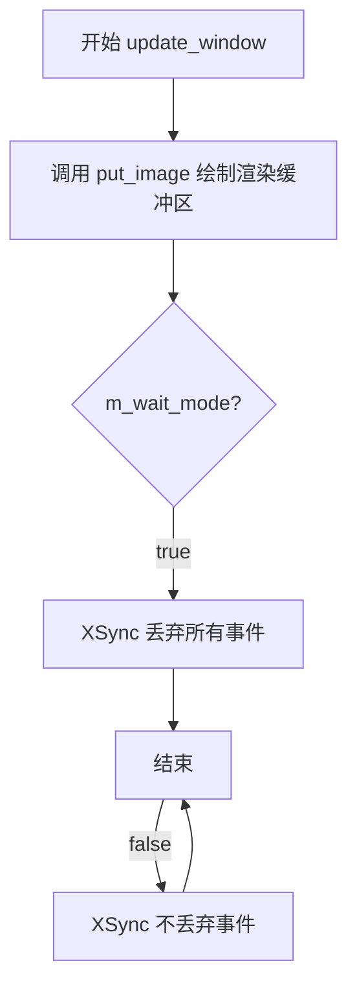

#### 带注释源码

```cpp
//------------------------------------------------------------------------
// 更新窗口显示，将渲染缓冲区内容刷新到 X11 窗口
//------------------------------------------------------------------------
void platform_support::update_window()
{
    // 调用平台特定的 put_image 方法，将渲染缓冲区内容绘制到 X11 窗口
    // 该方法内部处理了颜色格式转换（如果内部格式与系统格式不同）
    m_specific->put_image(&m_rbuf_window);
    
    // 当 m_wait_mode 为 true 时，可以丢弃绘制过程中产生的所有事件
    // 这种情况下 X 服务器不会累积鼠标移动事件
    // 当 m_wait_mode 为 false 时（即存在空闲绘制），不能丢失任何事件
    // 参数 true 表示丢弃事件，false 表示不丢弃
    XSync(m_specific->m_display, m_wait_mode);
}
```


### `platform_support.load_img`

该函数用于从磁盘加载PPM格式的图像文件，并将其转换为平台支持的颜色格式存储到内部图像缓冲区中。

参数：

- `idx`：`unsigned`，要加载的图像槽位索引（0到max_images-1）
- `file`：`const char*`，图像文件路径

返回值：`bool`，加载成功返回true，失败返回false

#### 流程图

```mermaid
flowchart TD
    A[开始 load_img] --> B{idx < max_images?}
    B -->|否| C[返回 false]
    B -->|是| D[构造文件路径]
    D --> E{文件扩展名是否为.ppm?}
    E -->|是| F[直接使用文件名]
    E -->|否| G[添加.ppm扩展名]
    G --> F
    F --> H[以二进制模式打开文件]
    H --> I{文件打开成功?}
    I -->|否| J[返回 false]
    I -->|是| K[读取文件内容到缓冲区]
    K --> L{读取成功且长度>0?}
    L -->|否| M[关闭文件, 返回 false]
    L -->|是| N{文件头为'P6'?}
    N -->|否| O[关闭文件, 返回 false]
    N -->|是| P[解析PPM头获取宽度和高度]
    P --> Q{宽度和高度有效且<=4096?}
    Q -->|否| R[关闭文件, 返回 false]
    Q -->|是| S{最大颜色值为255?]
    S -->|否| T[关闭文件, 返回 false]
    S -->|是| U[create_img创建图像缓冲区]
    U --> V{当前格式为pix_format_rgb24?}
    V -->|是| W[直接读取RGB24数据]
    V -->|否| X[读取到临时RGB24缓冲区]
    X --> Y{根据m_format转换图像}
    Y --> Z[删除临时缓冲区]
    W --> AA[关闭文件]
    Z --> AA
    AA --> BB[返回 true]
```

#### 带注释源码

```cpp
//------------------------------------------------------------------------
// 从PPM文件加载图像到指定索引的图像缓冲区
// idx: 图像槽位索引
// file: 文件名
// 返回: 加载成功返回true，否则返回false
//------------------------------------------------------------------------
bool platform_support::load_img(unsigned idx, const char* file)
{
    // 检查索引是否在有效范围内
    if(idx < max_images)
    {
        char buf[1024];
        strcpy(buf, file);
        int len = strlen(buf);
        
        // 如果文件扩展名不是.ppm，则添加.ppm扩展名
        if(len < 4 || strcasecmp(buf + len - 4, ".ppm") != 0)
        {
            strcat(buf, ".ppm");
        }
        
        // 以二进制只读模式打开文件
        FILE* fd = fopen(buf, "rb");
        if(fd == 0) return false;

        // 读取文件内容到缓冲区（最多1022字节，用于解析头）
        if((len = fread(buf, 1, 1022, fd)) == 0)
        {
            fclose(fd);
            return false;
        }
        buf[len] = 0;  // 确保字符串以null结尾
        
        // 检查PPM文件魔数（必须为"P6"）
        if(buf[0] != 'P' && buf[1] != '6')
        {
            fclose(fd);
            return false;
        }
        
        // 跳过魔数，找到宽度数字
        char* ptr = buf + 2;
        
        // 跳过所有非数字字符
        while(*ptr && !isdigit(*ptr)) ptr++;
        if(*ptr == 0)
        {
            fclose(fd);
            return false;
        }
        
        // 解析宽度
        unsigned width = atoi(ptr);
        // 验证宽度有效性（0无效，最大4096）
        if(width == 0 || width > 4096)
        {
            fclose(fd);
            return false;
        }
        
        // 跳过数字，找到高度数字
        while(*ptr && isdigit(*ptr)) ptr++;
        while(*ptr && !isdigit(*ptr)) ptr++;
        if(*ptr == 0)
        {
            fclose(fd);
            return false;
        }
        
        // 解析高度
        unsigned height = atoi(ptr);
        if(height == 0 || height > 4096)
        {
            fclose(fd);
            return false;
        }
        
        // 跳过数字，找到最大颜色值
        while(*ptr && isdigit(*ptr)) ptr++;
        while(*ptr && !isdigit(*ptr)) ptr++;
        // PPM格式要求最大颜色值为255
        if(atoi(ptr) != 255)
        {
            fclose(fd);
            return false;
        }
        
        // 跳过数字和可能的空格，找到像素数据起始位置
        while(*ptr && isdigit(*ptr)) ptr++;
        if(*ptr == 0)
        {
            fclose(fd);
            return false;
        }
        ptr++;  // 跳过最后一个空格或换行
        
        // 将文件指针移动到像素数据开始位置
        fseek(fd, long(ptr - buf), SEEK_SET);
        
        // 创建目标图像缓冲区
        create_img(idx, width, height);
        bool ret = true;
        
        // 如果当前格式直接是RGB24，直接读取即可
        if(m_format == pix_format_rgb24)
        {
            fread(m_specific->m_buf_img[idx], 1, width * height * 3, fd);
        }
        else
        {
            // 否则先读取到临时RGB24缓冲区，再转换到目标格式
            unsigned char* buf_img = new unsigned char [width * height * 3];
            rendering_buffer rbuf_img;
            rbuf_img.attach(buf_img,
                            width,
                            height,
                            m_flip_y ?
                              -width * 3 :
                               width * 3);
            
            // 读取RGB24数据
            fread(buf_img, 1, width * height * 3, fd);
            
            // 根据目标像素格式进行转换（支持多种格式）
            switch(m_format)
            {
                case pix_format_sgray8:
                    convert<pixfmt_sgray8, pixfmt_srgb24>(m_rbuf_img+idx, &rbuf_img);
                    break;
                    
                case pix_format_gray8:
                    convert<pixfmt_gray8, pixfmt_srgb24>(m_rbuf_img+idx, &rbuf_img);
                    break;
                    
                case pix_format_gray16:
                    convert<pixfmt_gray16, pixfmt_srgb24>(m_rbuf_img+idx, &rbuf_img);
                    break;
                    
                case pix_format_gray32:
                    convert<pixfmt_gray32, pixfmt_srgb24>(m_rbuf_img+idx, &rbuf_img);
                    break;
                    
                case pix_format_rgb555:
                    color_conv(m_rbuf_img+idx, &rbuf_img, color_conv_rgb24_to_rgb555());
                    break;
                    
                case pix_format_rgb565:
                    color_conv(m_rbuf_img+idx, &rbuf_img, color_conv_rgb24_to_rgb565());
                    break;
                    
                case pix_format_sbgr24:
                    convert<pixfmt_sbgr24, pixfmt_srgb24>(m_rbuf_img+idx, &rbuf_img);
                    break;
                    
                case pix_format_rgb24:
                    convert<pixfmt_rgb24, pixfmt_srgb24>(m_rbuf_img+idx, &rbuf_img);
                    break;
                    
                case pix_format_bgr24:
                    convert<pixfmt_bgr24, pixfmt_srgb24>(m_rbuf_img+idx, &rbuf_img);
                    break;
                    
                // ... 更多格式转换（srgba32, sargb32, sbgra32, sabgr32等）
                case pix_format_srgba32:
                    convert<pixfmt_srgba32, pixfmt_srgb24>(m_rbuf_img+idx, &rbuf_img);
                    break;
                    
                case pix_format_sargb32:
                    convert<pixfmt_sargb32, pixfmt_srgb24>(m_rbuf_img+idx, &rbuf_img);
                    break;
                    
                // ... 其他格式省略 ...
                    
                default:
                    ret = false;  // 不支持的格式
            }
            // 释放临时缓冲区
            delete [] buf_img;
        }
        
        fclose(fd);
        return ret;
    }
    return false;
}
```


### `platform_support.save_img`

该函数是 Anti-Grain Geometry (AGG) 库中 `platform_support` 类的核心方法，负责将内存中指定索引的图像缓冲区（rendering buffer）的内容持久化到磁盘。其核心逻辑是处理文件名、创建 PPM（Portable Pixel Map）格式文件、遍历像素行，并根据当前配置的像素格式（pixel format）将数据转换为标准的 RGB24 格式后再写入文件。

#### 参数

- `idx`：`unsigned`，图像索引，指定要保存的图像缓冲区的编号（通常对应 `m_buf_img` 数组中的索引）。
- `file`：`const char*`，目标文件路径或文件名。如果未指定扩展名（.ppm），函数会自动追加。

#### 返回值

`bool`：操作是否成功。如果文件打开失败、索引越界或缓冲区为空，返回 `false`；否则返回 `true`。

#### 流程图

```mermaid
flowchart TD
    A([开始 save_img]) --> B{检查 idx < max_images
    && rbuf_img(idx).buf() 有效?}
    B -- 否 --> C[返回 false]
    B -- 是 --> D[处理文件名: 追加 .ppm 扩展名]
    D --> E[以二进制写入模式打开文件]
    E --> F{文件指针有效?}
    F -- 否 --> G[返回 false]
    F -- 是 --> H[写入 PPM 头: P6 width height 255]
    H --> I[循环遍历每一行像素 y = 0 到 height]
    I --> J[获取当前行指针 row_ptr, 根据 m_flip_y 处理垂直翻转]
    J --> K[调用 color_conv_row 将当前行从 m_format 转换为 RGB24]
    K --> L[使用 fwrite 将转换后的像素数据写入文件]
    L --> I
    I -- 遍历结束 --> M[关闭文件, 释放临时缓冲区]
    M --> N([返回 true])
```

#### 带注释源码

```cpp
//------------------------------------------------------------------------
// 将指定图像保存为 PPM 格式文件
//------------------------------------------------------------------------
bool platform_support::save_img(unsigned idx, const char* file)
{
    // 1. 合法性检查：索引必须在范围内，且对应的图像缓冲区必须已分配
    if(idx < max_images &&  rbuf_img(idx).buf())
    {
        char buf[1024];
        strcpy(buf, file);
        int len = strlen(buf);
        
        // 2. 文件名处理：如果没有 .ppm 后缀，则自动追加
        if(len < 4 || strcasecmp(buf + len - 4, ".ppm") != 0)
        {
            strcat(buf, ".ppm");
        }
        
        // 3. 打开文件：二进制写入模式
        FILE* fd = fopen(buf, "wb");
        if(fd == 0) return false;
        
        // 4. 获取图像尺寸
        unsigned w = rbuf_img(idx).width();
        unsigned h = rbuf_img(idx).height();
        
        // 5. 写入 PPM 文件头 (Magic Number: P6, 宽高, 最大颜色值 255)
        fprintf(fd, "P6\n%d %d\n255\n", w, h);
            
        unsigned y; 
        // 6. 分配临时缓冲区：PPM 格式要求 RGB 24位 (3字节/像素)
        unsigned char* tmp_buf = new unsigned char [w * 3];
        
        // 7. 逐行处理并写入
        for(y = 0; y < rbuf_img(idx).height(); y++)
        {
            // 获取源图像行指针，根据 m_flip_y 决定是否垂直翻转
            const unsigned char* src = rbuf_img(idx).row_ptr(m_flip_y ? h - 1 - y : y);
            
            // 根据当前平台支持的像素格式 (m_format)，将像素数据转换为 RGB24
            switch(m_format)
            {
                case pix_format_sgray8:
                    color_conv_row(tmp_buf, src, w, conv_row<pixfmt_srgb24, pixfmt_sgray8>());
                    break;
                    
                case pix_format_gray8:
                    color_conv_row(tmp_buf, src, w, conv_row<pixfmt_srgb24, pixfmt_gray8>());
                    break;
                    
                case pix_format_gray16:
                    color_conv_row(tmp_buf, src, w, conv_row<pixfmt_srgb24, pixfmt_gray16>());
                    break;
                    
                case pix_format_gray32:
                    color_conv_row(tmp_buf, src, w, conv_row<pixfmt_srgb24, pixfmt_gray32>());
                    break;
                    
                default: break;
                case pix_format_rgb555:
                    color_conv_row(tmp_buf, src, w, color_conv_rgb555_to_rgb24());
                    break;
                    
                case pix_format_rgb565:
                    color_conv_row(tmp_buf, src, w, color_conv_rgb565_to_rgb24());
                    break;
                    
                case pix_format_sbgr24:
                    color_conv_row(tmp_buf, src, w, conv_row<pixfmt_srgb24, pixfmt_sbgr24>());
                    break;
                    
                case pix_format_srgb24:
                    color_conv_row(tmp_buf, src, w, conv_row<pixfmt_srgb24, pixfmt_srgb24>());
                    break;
                       
                case pix_format_bgr24:
                    color_conv_row(tmp_buf, src, w, conv_row<pixfmt_srgb24, pixfmt_bgr24>());
                    break;
                    
                case pix_format_rgb24:
                    color_conv_row(tmp_buf, src, w, conv_row<pixfmt_srgb24, pixfmt_rgb24>());
                    break;
                       
                case pix_format_srgba32:
                    color_conv_row(tmp_buf, src, w, conv_row<pixfmt_srgb24, pixfmt_srgba32>());
                    break;
                    
                case pix_format_sargb32:
                    color_conv_row(tmp_buf, src, w, conv_row<pixfmt_srgb24, pixfmt_sargb32>());
                    break;
                    
                case pix_format_sbgra32:
                    color_conv_row(tmp_buf, src, w, conv_row<pixfmt_srgb24, pixfmt_sbgra32>());
                    break;
                    
                case pix_format_sabgr32:
                    color_conv_row(tmp_buf, src, w, conv_row<pixfmt_srgb24, pixfmt_sabgr32>());
                    break;

                case pix_format_rgba32:
                    color_conv_row(tmp_buf, src, w, conv_row<pixfmt_srgb24, pixfmt_rgba32>());
                    break;
                    
                case pix_format_argb32:
                    color_conv_row(tmp_buf, src, w, conv_row<pixfmt_srgb24, pixfmt_argb32>());
                    break;
                    
                case pix_format_bgra32:
                    color_conv_row(tmp_buf, src, w, conv_row<pixfmt_srgb24, pixfmt_bgra32>());
                    break;
                    
                case pix_format_abgr32:
                    color_conv_row(tmp_buf, src, w, conv_row<pixfmt_srgb24, pixfmt_abgr32>());
                    break;

                case pix_format_bgr48:
                    color_conv_row(tmp_buf, src, w, conv_row<pixfmt_srgb24, pixfmt_bgr48>());
                    break;
                    
                case pix_format_rgb48:
                    color_conv_row(tmp_buf, src, w, conv_row<pixfmt_srgb24, pixfmt_rgb48>());
                    break;
                       
                case pix_format_rgba64:
                    color_conv_row(tmp_buf, src, w, conv_row<pixfmt_srgb24, pixfmt_rgba64>());
                    break;
                    
                case pix_format_argb64:
                    color_conv_row(tmp_buf, src, w, conv_row<pixfmt_srgb24, pixfmt_argb64>());
                    break;
                    
                case pix_format_bgra64:
                    color_conv_row(tmp_buf, src, w, conv_row<pixfmt_srgb24, pixfmt_bgra64>());
                    break;
                    
                case pix_format_abgr64:
                    color_conv_row(tmp_buf, src, w, conv_row<pixfmt_srgb24, pixfmt_abgr64>());
                    break;

                case pix_format_bgr96:
                    color_conv_row(tmp_buf, src, w, conv_row<pixfmt_srgb24, pixfmt_bgr96>());
                    break;
                    
                case pix_format_rgb96:
                    color_conv_row(tmp_buf, src, w, conv_row<pixfmt_srgb24, pixfmt_rgb96>());
                    break;
                       
                case pix_format_rgba128:
                    color_conv_row(tmp_buf, src, w, conv_row<pixfmt_srgb24, pixfmt_rgba128>());
                    break;
                    
                case pix_format_argb128:
                    color_conv_row(tmp_buf, src, w, conv_row<pixfmt_srgb24, pixfmt_argb128>());
                    break;
                    
                case pix_format_bgra128:
                    color_conv_row(tmp_buf, src, w, conv_row<pixfmt_srgb24, pixfmt_bgra128>());
                    break;
                    
                case pix_format_abgr128:
                    color_conv_row(tmp_buf, src, w, conv_row<pixfmt_srgb24, pixfmt_abgr128>());
                    break;
            }
            // 8. 将转换后的行数据写入文件
            fwrite(tmp_buf, 1, w * 3, fd);
        }
        
        // 9. 清理资源
        delete [] tmp_buf;
        fclose(fd);
        return true;
    }
    return false;
}
```


### platform_support.create_img

该方法用于创建一个指定索引号的离屏图像缓冲区。如果参数 width 或 height 为 0，则自动使用当前窗口的尺寸。

参数：
- `idx`：`unsigned`，图像缓冲区的索引。
- `width`：`unsigned`，图像宽度，为 0 时使用窗口宽度。
- `height`：`unsigned`，图像高度，为 0 时使用窗口高度。

返回值：`bool`，成功创建返回 true，索引无效返回 false。

#### 流程图

```mermaid
flowchart TD
    A([开始 create_img]) --> B{idx < max_images?}
    B -- 否 --> C[返回 false]
    B -- 是 --> D{width == 0?}
    D -- 是 --> E[width = rbuf_window().width()]
    D -- 否 --> F{height == 0?}
    E --> F
    F -- 是 --> G[height = rbuf_window().height()]
    F -- 否 --> H[delete [] m_buf_img[idx]]
    G --> H
    H --> I[分配新缓冲区]
    I --> J[m_rbuf_img[idx].attach(...)]
    J --> K([返回 true])
```

#### 带注释源码

```cpp
    //------------------------------------------------------------------------
    bool platform_support::create_img(unsigned idx, unsigned width, unsigned height)
    {
        if(idx < max_images)
        {
            // 如果宽度或高度为 0，则使用窗口的默认尺寸
            if(width  == 0) width  = rbuf_window().width();
            if(height == 0) height = rbuf_window().height();
            
            // 删除旧的缓冲区（如果存在）
            delete [] m_specific->m_buf_img[idx];
            
            // 根据像素格式和尺寸分配新的缓冲区
            m_specific->m_buf_img[idx] = 
                new unsigned char[width * height * (m_bpp / 8)];

            // 将原生缓冲区附加到渲染缓冲区对象，并处理垂直翻转
            m_rbuf_img[idx].attach(m_specific->m_buf_img[idx],
                                   width,
                                   height,
                                   m_flip_y ? 
                                       -width * (m_bpp / 8) : 
                                        width * (m_bpp / 8));
            return true;
        }
        return false;
    }
```


### platform_support.force_redraw

此方法用于请求窗口重绘。它通过将平台特定的内部更新标志 (`m_update_flag`) 设置为 `true`，使主事件循环 (`run()`) 在下一次迭代时调用应用的绘图回调 (`on_draw()`) 并更新窗口显示。

参数：
- （无）

返回值：`void`，无返回值，仅改变内部状态以触发重绘。

#### 流程图

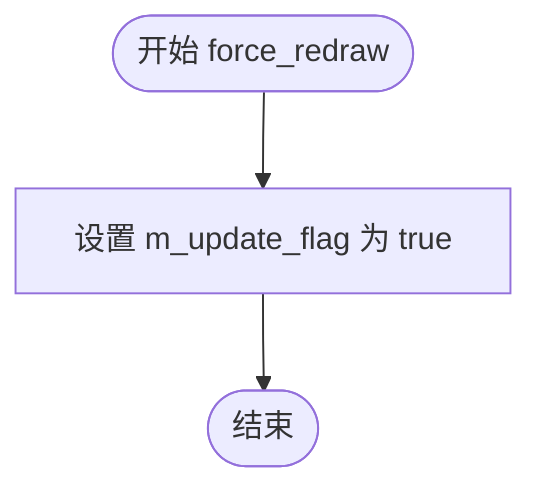

#### 带注释源码

```cpp
    //------------------------------------------------------------------------
    // 强制重绘方法
    //------------------------------------------------------------------------
    void platform_support::force_redraw()
    {
        // 将更新标志设置为 true。
        // 在 run() 方法的主循环中，会检查此标志：
        // 若为 true，则调用 on_draw() 进行绘制，并调用 update_window() 将图像推送至窗口，
        // 完成后自动将该标志重置为 false。
        m_specific->m_update_flag = true;
    }
```


### `platform_support.message`

该函数用于向标准错误输出流（stderr）打印消息文本，是平台支持类提供的简单消息输出接口。

参数：

- `msg`：`const char*`，需要输出的消息字符串

返回值：`void`，无返回值

#### 流程图

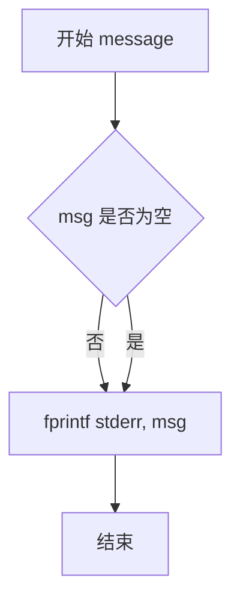

#### 带注释源码

```cpp
//------------------------------------------------------------------------
// 向标准错误流输出消息
// 参数: msg - 要输出的消息字符串
// 返回值: void
//------------------------------------------------------------------------
void platform_support::message(const char* msg)
{
    // 使用 fprintf 将消息输出到标准错误流
    // 并在末尾添加换行符
    fprintf(stderr, "%s\n", msg);
}
```


### `platform_support::start_timer`

启动计时器，记录当前时间点，以便后续通过 elapsed_time() 方法计算经过的时间。

参数：无

返回值：`void`，无返回值描述

#### 流程图

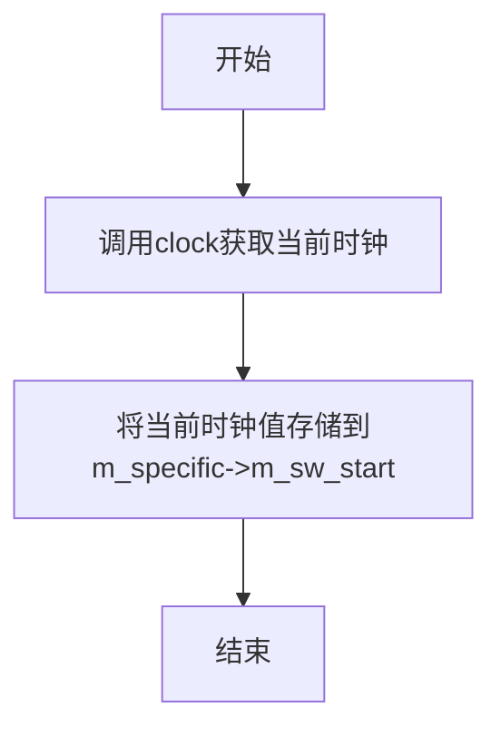

#### 带注释源码

```cpp
//------------------------------------------------------------------------
// 启动计时器功能
// 该方法将当前时间点记录下来，随后可用于计算经过的时间
//------------------------------------------------------------------------
void platform_support::start_timer()
{
    // 使用标准库clock()函数获取当前处理器时间
    // 并将其存储到平台特定对象的成员变量m_sw_start中
    // 该值将在elapsed_time()方法中用于计算时间差
    m_specific->m_sw_start = clock();
}
```

---

### 补充信息

**所属类**：`platform_support`

**相关方法**：
- `double platform_support::elapsed_time() const`：获取从 start_timer() 调用以来经过的时间（毫秒）

**实现细节**：
- 使用 C 标准库 `clock()` 函数获取时间
- 时间值存储在 `platform_specific` 类的 `m_sw_start` 成员变量中（类型为 `clock_t`）
- 计算时间差时使用 `CLOCKS_PER_SEC` 转换为毫秒

**调用场景**：
- 通常在需要测量代码执行时间或进行性能分析时调用
- 与 `elapsed_time()` 方法配合使用可实现简单的性能计时功能


### `platform_support.elapsed_time`

获取自上次调用 `start_timer()` 以来经过的时间（以毫秒为单位）。

参数：无

返回值：`double`，返回自计时器启动以来经过的毫秒数

#### 流程图

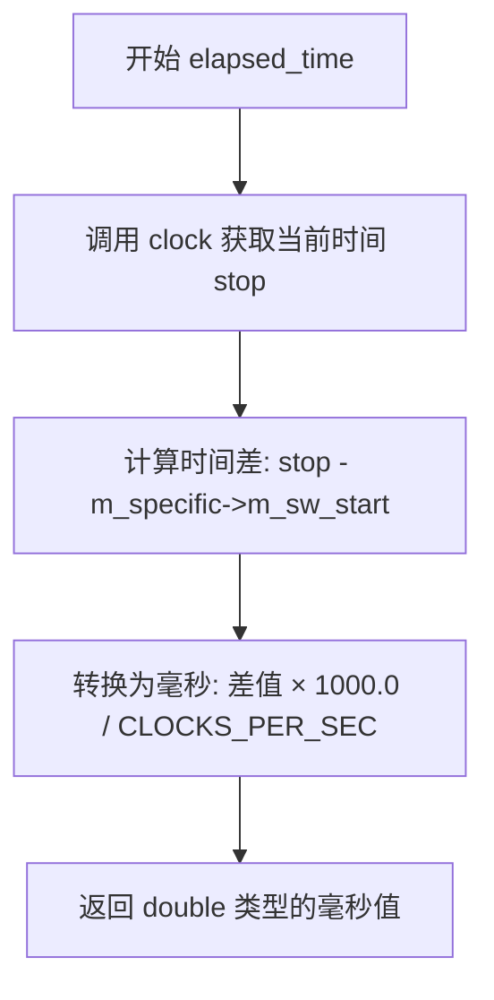

#### 带注释源码

```cpp
//------------------------------------------------------------------------
// 计算自上次调用 start_timer() 以来经过的时间
//------------------------------------------------------------------------
double platform_support::elapsed_time() const
{
    // 获取当前时钟滴答数
    clock_t stop = clock();
    
    // 计算经过的时间（毫秒）= (当前时间 - 启动时间) × 1000 / 每秒时钟数
    return double(stop - m_specific->m_sw_start) * 1000.0 / CLOCKS_PER_SEC;
}
```

#### 相关上下文信息

| 组件 | 名称 | 类型 | 描述 |
|------|------|------|------|
| 成员变量 | `m_specific` | `platform_specific*` | 平台特定实现的指针，包含计时器状态 |
| 成员变量 | `m_sw_start` | `clock_t` | 软件计时器启动时的时钟滴答数 |
| 相关方法 | `start_timer()` | `void` | 重置计时器，将 `m_sw_start` 设置为当前时钟 |

#### 设计说明

- **精度**：使用 `clock()` 函数，提供软件层面的时间测量精度
- **单位转换**：将时钟滴答转换为毫秒，便于应用层使用
- **常函数**：标记为 `const`，表示不会修改对象状态
- **依赖**：依赖于 `platform_specific` 类中存储的启动时间戳


### `platform_support::img_ext`

该函数是`platform_support`类的常量成员方法，用于返回平台支持的默认图像文件扩展名。在X11平台实现中，AGG库默认使用PPM（Portable Pixel Map）格式作为图像保存和加载的默认扩展名，这是一个未压缩的简单图像格式，适用于演示和调试目的。

参数：该函数无任何参数。

返回值：`const char*`，返回字符串字面量".ppm"，表示PPM图像格式的文件扩展名。

#### 流程图

```mermaid
flowchart TD
    A[开始 img_ext] --> B[返回常量字符串 ".ppm"]
    B --> C[结束]
```

#### 带注释源码

```cpp
//------------------------------------------------------------------------
// 返回平台支持的文件扩展名
// 
// 说明：
//   - 这是一个const成员函数，不会修改对象状态
//   - 在X11平台实现中，默认返回PPM格式扩展名
//   - PPM (Portable Pixel Map) 是一种简单的未压缩图像格式
//   - 支持24位RGB颜色，文件头包含P6标识符
//------------------------------------------------------------------------
const char* platform_support::img_ext() const 
{ 
    // 返回PPM格式的文件扩展名字符串
    return ".ppm"; 
}
```

---

#### 补充说明

| 项目 | 说明 |
|------|------|
| **所属类** | `platform_support` |
| **方法性质** | 公有成员方法，const限定 |
| **设计意图** | 提供统一的图像文件扩展名接口，允许子类或平台特定实现覆盖 |
| **调用场景** | 被`load_img()`和`save_img()`方法使用，用于自动补全文件扩展名 |
| **可扩展性** | 可在子类中重写以支持其他图像格式（如.png、.jpg等） |
| **线程安全** | 该函数仅返回静态字符串字面量，天然线程安全 |


### `platform_support::full_file_name`

该方法用于获取完整的文件名称（路径），但在当前的 X11 实现中只是简单地返回传入的文件名字符串，未进行任何路径拼接或规范化处理。

参数：

- `file_name`：`const char*`，传入的文件名（以 `'\0'` 结尾的 C 风格字符串）。

返回值：`const char*`，返回与输入相同的指针，即未经任何处理的原始文件名。

#### 流程图

```mermaid
graph LR
    A[Start] --> B[输入: file_name]
    B --> C[返回 file_name]
    C --> D[End]
```

#### 带注释源码

```cpp
//------------------------------------------------------------------------
// platform_support::full_file_name
//------------------------------------------------------------------------
// 描述: 返回完整的文件名。在当前的 X11 实现中，该函数仅直接返回
//       传入的 file_name 参数，未进行路径拼接或其他处理。
// 参数:
//   file_name - 输入的文件名字符串（以 '\0' 结尾）。
// 返回值:
//   返回与输入相同的指针，即未经任何处理的原始文件名。
//------------------------------------------------------------------------
const char* platform_support::full_file_name(const char* file_name)
{
    // 当前实现仅返回传入的指针。在更完整的实现中，
    // 可以在这里加入路径前缀、工作目录或文件扩展名的自动补全。
    return file_name;
}
```


### platform_support.on_init

这是`platform_support`类的虚函数（virtual method），在X窗口平台初始化完成后被调用，作为回调供子类重写以执行自定义的初始化逻辑。该函数为空实现，具体初始化行为由派生类决定。

参数：
- （无）

返回值：`void`，无返回值

#### 流程图

```mermaid
flowchart TD
    A[platform_support::init 调用 on_init] --> B{子类是否重写 on_init?}
    B -->|是| C[执行子类的自定义初始化逻辑]
    B -->|否| D[执行空操作]
    C --> E[初始化完成]
    D --> E
```

#### 带注释源码

```cpp
//------------------------------------------------------------------------
// 虚函数声明（在类定义中）
// virtual void on_init() {}
//------------------------------------------------------------------------
// 实际调用位置（在 platform_support::init 方法中）
if(!m_specific->m_initialized)
{
    on_init();  // 调用虚函数，触发子类重写版本或空实现
    m_specific->m_initialized = true;
}
//------------------------------------------------------------------------
// 函数定义（在文件末尾）
void platform_support::on_init() {}
// 说明：空实现，供子类重写
```


### platform_support.on_resize

描述：该虚函数是平台支持类中的回调方法，用于处理窗口尺寸变化事件。当窗口大小发生改变时（如用户调整窗口大小或窗口首次创建），框架会自动调用此函数，应用程序可以通过重写此方法来执行相应的界面调整或资源重新分配操作。

参数：
- sx：int，表示窗口的新宽度（以像素为单位）
- sy：int，表示窗口的新高度（以像素为单位）

返回值：void，此函数没有返回值

#### 流程图

```mermaid
graph TD
    A[窗口初始化或调整大小事件发生] --> B{检查尺寸是否改变}
    B -->|是| C[重新分配窗口缓冲区]
    C --> D[更新渲染缓冲区]
    D --> E[调用 platform_support.on_resize]
    E --> F[调用 on_draw 重新绘制]
    F --> G[更新窗口显示]
    B -->|否| H[忽略事件]
```

#### 带注释源码

```cpp
// 虚函数在类 platform_support 中的声明（推断自代码上下文）
// virtual void on_resize(int sx, int sy);

// 类外实现（在 platform/agg_platform_support.cpp 中）
void platform_support::on_resize(int sx, int sy) {}
// 参数说明：
//   sx - 窗口的新宽度
//   sy - 窗口的新高度
// 注意：此处为默认空实现，应用程序应重写此方法以执行自定义调整逻辑
```


### `platform_support.on_idle`

该函数是 `platform_support` 类的虚函数，在 X 事件循环中当没有待处理事件且处于非等待模式时被调用，用于执行空闲处理任务（如动画更新、后台计算等）。

参数：无

返回值：`void`，无返回值

#### 流程图

```mermaid
flowchart TD
    A[run() 主循环] --> B{是否有待处理事件?}
    B -->|是| C[处理X事件]
    B -->|否| D{m_wait_mode 是否为 false?}
    D -->|是| E[调用 on_idle()]
    E --> A
    D -->|否| C
```

#### 带注释源码

```cpp
//------------------------------------------------------------------------
// 在 platform_support 类中，on_idle 是一个虚函数
// 它在 run() 方法的事件循环中被调用
// 当没有 X 事件待处理且 m_wait_mode 为 false 时触发
//------------------------------------------------------------------------
void platform_support::on_idle() {}
// 空实现，由子类重写以提供具体的空闲处理逻辑
// 例如：更新动画、计算物理、执行后台任务等
```


### `platform_support.on_mouse_move`

该函数是 `platform_support` 类中的虚函数，用于处理鼠标移动事件。当用户在窗口内移动鼠标时，系统会调用此函数，并将鼠标的坐标和当前的状态标志（如按下的按钮、键盘修饰键）传递给用户定义的回调函数。

参数：

- `x`：`int`，鼠标相对于窗口的 X 坐标
- `y`：`int`，鼠标相对于窗口的 Y 坐标，如果启用了 Y 轴翻转，则该值会被调整为相对于窗口底边的坐标
- `flags`：`unsigned`，表示鼠标按钮和键盘修饰键的状态标志（如 `mouse_left`、`mouse_right`、`kbd_shift`、`kbd_ctrl` 等）

返回值：`void`，该函数没有返回值

#### 流程图

```mermaid
flowchart TD
    A[接收到鼠标移动事件] --> B{检查控件是否在移动};
    B -->|是| C[触发控件移动回调并强制重绘];
    B -->|否| D{检查鼠标是否在控件区域内};
    D -->|是| E[不触发任何操作];
    D -->|否| F[调用用户定义的 on_mouse_move 回调];
    C --> G[结束];
    E --> G;
    F --> G;
```

#### 带注释源码

```cpp
//------------------------------------------------------------------------
// 处理鼠标移动事件的虚函数
// x: 鼠标的X坐标
// y: 鼠标的Y坐标（如果m_flip_y为true，则为相对于底边的坐标）
// flags: 鼠标按钮和键盘修饰键的状态
//------------------------------------------------------------------------
void platform_support::on_mouse_move(int x, int y, unsigned flags) 
{
    // 这是一个空实现的虚函数，由子类重写以实现具体的鼠标移动处理逻辑
    // 在基类中不做任何操作
}
```

#### 在 `run()` 方法中的调用上下文

```cpp
case MotionNotify:
    {
        flags = 0;
        // 检查鼠标按钮状态
        if(x_event.xmotion.state & Button1Mask) flags |= mouse_left;
        if(x_event.xmotion.state & Button3Mask) flags |= mouse_right;
        // 检查键盘修饰键状态
        if(x_event.xmotion.state & ShiftMask)   flags |= kbd_shift;
        if(x_event.xmotion.state & ControlMask) flags |= kbd_ctrl;

        // 获取鼠标坐标，并根据flip_y设置调整Y坐标
        cur_x = x_event.xbutton.x;
        cur_y = m_flip_y ? m_rbuf_window.height() - x_event.xbutton.y :
                           x_event.xbutton.y;

        // 检查控件是否在处理鼠标移动
        if(m_ctrls.on_mouse_move(cur_x, cur_y, (flags & mouse_left) != 0))
        {
            // 如果控件处理了移动事件，触发控件变化回调并强制重绘
            on_ctrl_change();
            force_redraw();
        }
        else
        {
            // 如果鼠标不在控件区域内，调用用户定义的on_mouse_move回调
            if(!m_ctrls.in_rect(cur_x, cur_y))
            {
                on_mouse_move(cur_x, cur_y, flags);
            }
        }
    }
    break;
```


### `platform_support.on_mouse_button_down`

该函数是 Anti-Grain Geometry (AGG) 库中 `platform_support` 类的虚函数，用于处理鼠标按钮按下事件。在 X11 平台实现中，当用户按下鼠标按钮时，由事件循环调用此回调函数，传递鼠标坐标和按键状态标志。

参数：

- `x`：`int`，鼠标按下时的 X 坐标（相对于窗口左上角）
- `y`：`int`，鼠标按下时的 Y 坐标（如果启用了垂直翻转，则相对于窗口左下角）
- `flags`：`unsigned`，按键状态标志位，包含 Shift、Ctrl、左键、右键等状态信息

返回值：`void`，无返回值

#### 流程图

```mermaid
flowchart TD
    A[X11事件循环检测到ButtonPress事件] --> B[解析鼠标坐标和状态标志]
    B --> C{左键按下?}
    C -->|是| D{是否在控件区域?}
    C -->|否| E{右键按下?}
    D -->|是| F[设置当前控件并触发控件变更回调]
    D -->|否| G[调用on_mouse_button_down回调]
    E -->|是| G
    E -->|否| H[忽略事件]
    F --> I[强制重绘]
    G --> I
    H --> I
```

#### 带注释源码

```cpp
//------------------------------------------------------------------------
// 虚函数：处理鼠标按钮按下事件
// 参数：
//   x     - 鼠标按下时的X坐标
//   y     - 鼠标按下时的Y坐标（如果m_flip_y为true，则Y坐标已翻转）
//   flags - 按键状态标志，如mouse_left、mouse_right、kbd_shift、kbd_ctrl等
//------------------------------------------------------------------------
void platform_support::on_mouse_button_down(int x, int y, unsigned flags) {}
// 注意：此函数为纯虚函数实现，默认空实现
// 实际调用发生在run()方法的X11事件处理中:
//
// case ButtonPress:
//     {
//         flags = 0;
//         if(x_event.xbutton.state & ShiftMask)   flags |= kbd_shift;
//         if(x_event.xbutton.state & ControlMask) flags |= kbd_ctrl;
//         if(x_event.xbutton.button == Button1)   flags |= mouse_left;
//         if(x_event.xbutton.button == Button3)   flags |= mouse_right;
//
//         cur_x = x_event.xbutton.x;
//         cur_y = m_flip_y ? m_rbuf_window.height() - x_event.xbutton.y :
//                            x_event.xbutton.y;
//
//         if(flags & mouse_left)
//         {
//             if(m_ctrls.on_mouse_button_down(cur_x, cur_y))
//             {
//                 m_ctrls.set_cur(cur_x, cur_y);
//                 on_ctrl_change();
//                 force_redraw();
//             }
//             else
//             {
//                 if(m_ctrls.in_rect(cur_x, cur_y))
//                 {
//                     if(m_ctrls.set_cur(cur_x, cur_y))
//                     {
//                         on_ctrl_change();
//                         force_redraw();
//                     }
//                 }
//                 else
//                 {
//                     on_mouse_button_down(cur_x, cur_y, flags);  // <-- 调用点
//                 }
//             }
//         }
//         if(flags & mouse_right)
//         {
//             on_mouse_button_down(cur_x, cur_y, flags);  // <-- 调用点
//         }
//     }
//     break;
```


### `platform_support.on_mouse_button_up`

该函数是 `platform_support` 类中的虚回调函数，用于处理鼠标按钮释放事件。当用户在窗口中释放鼠标按钮时，X11 事件循环会捕获 `ButtonRelease` 事件并调用此回调函数，传递给应用层处理具体的鼠标释放逻辑。

参数：

- `x`：`int`，鼠标释放时的 X 坐标（相对于窗口左上角）
- `y`：`int`，鼠标释放时的 Y 坐标（根据 flip_y 设置可能已翻转）
- `flags`：`unsigned`，包含修饰键状态（kbd_shift、kbd_ctrl）和鼠标按钮标志（mouse_left、mouse_right）

返回值：`void`，无返回值

#### 流程图

```mermaid
flowchart TD
    A[X11 事件循环捕获 ButtonRelease 事件] --> B{检查按钮标志}
    B -->|左键释放| C[调用 m_ctrls.on_mouse_button_up 检查控件]
    B -->|右键或左键释放| D[调用 on_mouse_button_up 回调]
    C -->|控件处理| E[触发 on_ctrl_change 和 force_redraw]
    C -->|控件未处理| D
    D --> F[应用层实现具体逻辑]
    E --> G[标记更新标志]
    F --> G
```

#### 带注释源码

```cpp
//------------------------------------------------------------------------
// 当鼠标按钮释放时调用的虚回调函数
// 参数 x: 鼠标 X 坐标
// 参数 y: 鼠标 Y 坐标（根据 flip_y 设置可能已翻转）
// 参数 flags: 修饰键和按钮状态标志
//------------------------------------------------------------------------
void platform_support::on_mouse_button_up(int x, int y, unsigned flags)
{
    // 空实现，供应用层override
    // 具体逻辑由用户在派生类中实现
}
```

#### 在 X11 事件循环中的调用上下文

```cpp
case ButtonRelease:
{
    // 提取修饰键状态
    flags = 0;
    if(x_event.xbutton.state & ShiftMask)   flags |= kbd_shift;
    if(x_event.xbutton.state & ControlMask) flags |= kbd_ctrl;
    if(x_event.xbutton.button == Button1)   flags |= mouse_left;
    if(x_event.xbutton.button == Button3)   flags |= mouse_right;

    // 计算坐标（考虑 flip_y 设置）
    cur_x = x_event.xbutton.x;
    cur_y = m_flip_y ? m_rbuf_window.height() - x_event.xbutton.y :
                       x_event.xbutton.y;

    // 先检查是否在控件区域释放
    if(flags & mouse_left)
    {
        if(m_ctrls.on_mouse_button_up(cur_x, cur_y))
        {
            on_ctrl_change();
            force_redraw();
        }
    }
    // 如果是左键或右键释放，调用应用回调
    if(flags & (mouse_left | mouse_right))
    {
        on_mouse_button_up(cur_x, cur_y, flags);  // <-- 调用此处
    }
}
```


### `platform_support.on_key`

该函数是`platform_support`类的虚函数，用于处理键盘按键事件。当用户在X11窗口中按下键盘按键时，`run()`主循环捕获`KeyPress`事件并调用此回调函数，将按键的坐标、键值和修饰符标志传递给应用层进行相应处理。

参数：

- `x`：`int`，鼠标相对于窗口的X坐标（按键发生的位置）
- `y`：`int`，鼠标相对于窗口的Y坐标（按键发生的位置，根据`flip_y`可能需要翻转）
- `key`：`unsigned`，映射后的AGG键码（如`key_left`、`key_f1`等）
- `flags`：`unsigned`，键盘和鼠标状态标志位（`kbd_shift`、`kbd_ctrl`、`mouse_left`、`mouse_right`等）

返回值：`void`，无返回值

#### 流程图

```mermaid
sequenceDiagram
    participant X as X11 Event Loop
    participant P as platform_support
    participant O as User on_key() Implementation
    
    X->>P: run() 检测 KeyPress 事件
    P->>P: 解析 XKeyEvent 获取 keycode/flags
    P->>P: XLookupKeysym() 获取 KeySym
    P->>P: m_keymap[key & 0xFF] 映射为 AGG 键码
    P->>P: 计算 y 坐标 (考虑 flip_y)
    P->>O: on_key(x, y, key, flags) 调用虚函数
    O-->>P: (用户实现返回)
```

#### 带注释源码

```cpp
//------------------------------------------------------------------------
// 在 platform_support 类中声明（agg_platform_support.h 中）
//------------------------------------------------------------------------
virtual void on_key(int x, int y, unsigned key, unsigned flags) {}

//------------------------------------------------------------------------
// 在 run() 函数中调用（agg_platform_support.cpp 中）
//------------------------------------------------------------------------
case KeyPress:
{
    // 从 X11 事件获取按键的原始键符
    KeySym key = XLookupKeysym(&x_event.xkey, 0);
    
    // 初始化标志位
    flags = 0;
    if(x_event.xkey.state & Button1Mask) flags |= mouse_left;   // 鼠标左键
    if(x_event.xkey.state & Button3Mask) flags |= mouse_right;  // 鼠标右键
    if(x_event.xkey.state & ShiftMask)   flags |= kbd_shift;    // Shift 键
    if(x_event.xkey.state & ControlMask) flags |= kbd_ctrl;    // Ctrl 键

    // 检查方向键和控制键（用于控件导航）
    bool left  = false;
    bool up    = false;
    bool right = false;
    bool down  = false;

    switch(m_specific->m_keymap[key & 0xFF])
    {
    case key_left:   left = true;  break;
    case key_up:     up = true;    break;
    case key_right:  right = true; break;
    case key_down:   down = true;  break;

    case key_f2:     // F2 键：保存截图
        copy_window_to_img(max_images - 1);
        save_img(max_images - 1, "screenshot");
        break;
    }

    // 如果是方向键，交给控件处理；否则调用用户的 on_key 回调
    if(m_ctrls.on_arrow_keys(left, right, down, up))
    {
        on_ctrl_change();
        force_redraw();
    }
    else
    {
        // 调用虚函数 on_key，传递：
        // x: 鼠标 X 坐标
        // y: 鼠标 Y 坐标（根据 flip_y 翻转）
        // key: 映射后的 AGG 键码
        // flags: 键盘/鼠标状态标志
        on_key(x_event.xkey.x, 
               m_flip_y ? 
                   m_rbuf_window.height() - x_event.xkey.y :
                   x_event.xkey.y,
               m_specific->m_keymap[key & 0xFF],
               flags);
    }
}
break;
```


### `platform_support::on_ctrl_change`

**描述**  
`platform_support` 类中的虚函数回调，当用户与界面中的控件（如方向键、鼠标点击/拖动控件）发生交互导致控件状态改变时被调用。子类可以通过重写该函数实现对控件变化的响应逻辑。该函数没有参数，也不返回任何值。

**参数**  
- （无）

**返回值**  
- `void`，无返回值。

#### 流程图

```mermaid
flowchart TD
    A[run 事件循环] --> B{检测到控件状态变化?}
    B -- 是 --> C[调用 on_ctrl_change]
    C --> D[force_redraw 设置刷新标志]
    D --> E[继续事件循环]
    B -- 否 --> E
```

#### 带注释源码

```cpp
//------------------------------------------------------------------------
// platform_support::on_ctrl_change
//
// 虚函数回调，当控件状态改变时被调用。默认实现为空，
// 派生类可以重写此函数以处理控件变化（如更新界面、重新渲染等）。
//------------------------------------------------------------------------
void platform_support::on_ctrl_change()
{
    // 默认实现不做任何事情，派生类可在此实现自定义逻辑
}
```


### `platform_support.on_draw`

该函数是平台支持类中的一个纯虚函数，作为回调供子类实现具体的图形绘制逻辑，框架在每次需要重绘窗口时会调用此方法。

参数：
- 无参数

返回值：`void`，无返回值

#### 流程图

```mermaid
flowchart TD
    A[开始 on_draw] --> B{子类是否实现?}
    B -->|是| C[执行子类实现的绘制逻辑]
    B -->|否| D[空操作,不做任何绘制]
    C --> E[返回]
    D --> E
```

#### 带注释源码

```cpp
    //------------------------------------------------------------------------
    // 虚函数 on_draw 的声明
    // 这是一个纯虚函数,必须在子类中实现
    // 框架在需要重绘窗口时调用此方法
    //------------------------------------------------------------------------
    void platform_support::on_draw() {}
    
    // 实际上在基类中这是一个空实现
    // 真实的绘制逻辑由子类重写实现
    // 调用时机位于 run() 方法的主循环中:
    // if(m_specific->m_update_flag)
    // {
    //     on_draw();           // <-- 调用此函数进行绘制
    //     update_window();     // <-- 将绘制结果更新到窗口
    //     m_specific->m_update_flag = false;
    // }
```


### `platform_support.on_post_draw`

该函数是 `platform_support` 类中的一个虚函数，用于在绘制操作完成后执行特定平台的后处理操作。它提供了一个钩子机制，允许子类在窗口绘制完成后执行额外的操作。

参数：

- `raw_handler`：`void*`，平台特定的原始处理程序指针，用于传递底层图形上下文或句柄

返回值：`void`，无返回值

#### 流程图

```mermaid
flowchart TD
    A[绘制完成] --> B{是否需要后处理?}
    -->|是| C[调用on_post_draw]
    C --> D[传递raw_handler参数]
    D --> E[执行平台特定后处理]
    E --> F[返回]
    B -->|否| F
```

#### 带注释源码

```cpp
//------------------------------------------------------------------------
// on_post_draw - 绘制完成后的回调函数
// 参数: raw_handler - 平台特定的原始处理程序指针
// 返回: void
// 说明: 这是一个虚函数,设计为在窗口绘制完成后被调用
//       子类可以重写此函数以执行额外的渲染后处理操作
//       raw_handler参数允许访问底层平台特定的图形上下文
//------------------------------------------------------------------------
void platform_support::on_post_draw(void* raw_handler) {}
```

**备注：** 此函数在代码中为空实现，是一个被设计为可被重写的虚函数钩子。它属于 `platform_support` 类的回调函数系列（包括 `on_init`、`on_resize`、`on_idle`、`on_mouse_move`、`on_mouse_button_down`、`on_mouse_button_up`、`on_key`、`on_ctrl_change`、`on_draw` 等），用于让继承 `platform_support` 的子类能够在特定事件发生时执行自定义逻辑。`raw_handler` 参数的具体用途取决于实现平台，可能用于传递 X11 图形上下文或其他平台相关资源。

## 关键组件


### platform_specific 类

封装 X11 平台特定的实现细节，包括显示连接、窗口、图形上下文、像素格式转换和键盘映射表。

### platform_support 类

提供跨平台的图形应用框架，管理窗口初始化、事件循环、渲染缓冲和图像操作。

### 像素格式与颜色空间转换

put_image 方法中实现的颜色转换逻辑，支持 RGB555、RGB565、RGBA32、ABGR32、ARGB32、BGRA32 等多种像素格式之间的相互转换，使用 color_conv 和 convert 模板函数。

### 键盘映射系统

m_keymap 数组将 X11 键码映射为 AGG 的虚拟键码，支持功能键（F1-F15）、数字键盘、方向键以及特殊的暂停、清除键。

### X11 事件处理循环

run 方法实现的完整事件分发机制，处理 Expose（重绘）、ConfigureNotify（窗口调整）、KeyPress（键盘输入）、ButtonPress/MotionNotify/ButtonRelease（鼠标事件）和 ClientMessage（窗口关闭）等 X 事件。

### 图像加载与保存

load_img 和 save_img 方法实现 PPM 格式图像的读写，支持在加载时根据当前像素格式进行自动颜色转换。

### 窗口渲染管线

update_window 方法将内部渲染缓冲（m_rbuf_window）通过 XPutImage 或格式转换后推送至 X11 窗口，支持应用格式与系统格式不一致时的实时转换。

### 渲染缓冲管理

m_rbuf_window 管理窗口像素数据，m_rbuf_img 数组管理多个图像缓冲，支持翻转渲染（flip_y）以适应不同坐标系。

## 问题及建议


### 已知问题

- **内存管理不当**：`put_image`方法中使用`new`和`delete[]`手动管理内存，没有使用智能指针或RAII，易导致内存泄漏
- **错误处理不完整**：`init`方法中`XAllocSizeHints()`等函数返回NULL时仅跳过处理，未进行错误恢复；多处X11函数调用未检查返回值
- **代码重复严重**：`put_image`方法中包含大量嵌套switch-case进行颜色格式转换，`load_img`和`save_img`中同样存在大量重复的像素格式转换逻辑
- **硬编码魔数**：窗口尺寸限制（32/4096）、图像尺寸限制（4096）、缓冲区大小（1024）等均硬编码在代码中
- **资源泄漏风险**：窗口调整大小时重新分配缓冲区，若中途出错可能导致原有缓冲区泄漏；`XSizeHints`分配后异常路径未正确释放
- **遗留注释代码**：存在大段被注释掉的Visual查找代码和`m_wait_mode`相关代码，影响代码可读性
- **C/C++风格混用**：使用C风格数组、指针和`memset`，未充分利用C++的容器、智能指针和初始化机制

### 优化建议

- 引入智能指针（`std::unique_ptr`/`std::shared_ptr`）管理动态内存，将缓冲区包装为RAII类
- 提取颜色格式转换逻辑为独立的转换函数或函数指针表，消除switch-case嵌套
- 将硬编码常量定义为配置常量或枚举，提高可维护性
- 增加完整的错误检查和异常处理机制，失败时进行资源清理并返回错误码
- 清理遗留的注释代码，删除不再使用的功能代码
- 将X11平台相关代码抽象为独立层，便于跨平台移植和维护

## 其它


### 设计目标与约束

本模块旨在为 Anti-Grain Geometry 库提供 X11 窗口系统平台支持，实现跨平台的图形应用程序框架。设计目标是提供统一的窗口管理、事件处理、图像渲染和文件 I/O 接口，同时支持多种像素格式（从 8 位灰度到 128 位 RGBA）和颜色空间转换。约束条件包括：必须运行在 X Window 系统上，需要支持至少 15 位色深和 TrueColor 或 DirectColor 视觉模式，窗口尺寸限制在 32x32 到 4096x4096 像素之间。

### 错误处理与异常设计

本模块采用传统的 C 风格错误处理机制，不使用 C++ 异常。错误处理方式包括：(1) 函数返回布尔值表示成功/失败，如 init()、load_img()、save_img()、create_img()；(2) 使用 fprintf(stderr, ...) 输出错误信息到标准错误流；(3) X11 API 调用失败时返回 NULL 指针或 0 值并记录错误。关键失败点包括：XOpenDisplay 失败、窗口创建失败、像素格式不兼容、文件操作失败等。资源分配失败时函数返回 false 或 0，调用者需要检查返回值。

### 数据流与状态机

模块采用事件驱动的状态机模型。运行状态包括：(1) 初始化状态 - 窗口创建和资源分配；(2) 运行状态 - 事件循环处理，状态转换通过事件触发：ConfigureNotify 触发窗口大小调整状态、Expose 触发重绘状态、KeyPress/ButtonPress/MotionNotify 触发输入处理状态、ClientMessage (WM_DELETE_WINDOW) 触发退出状态。数据流：用户输入 → X11 事件 → 事件处理函数 → 渲染缓冲区 → XPutImage 更新窗口。更新标志 (m_update_flag) 控制是否需要重绘，m_resize_flag 标记窗口大小是否变化。

### 外部依赖与接口契约

外部依赖包括：(1) X11 库 - Xlib 函数 (XOpenDisplay, XCreateWindow, XPutImage 等)；(2) 标准 C 库 - stdio.h, stdlib.h, string.h, ctype.h, time.h；(3) AGG 内部模块 - agg_pixfmt_* 系列像素格式类、agg_color_conv_* 颜色转换函数、rendering_buffer 渲染缓冲区类。接口契约：platform_support 类提供纯虚函数供用户重写 (on_init, on_resize, on_idle, on_draw, on_mouse_* , on_key 等)，用户通过派生类实现具体应用逻辑。像素格式通过 pix_format_e 枚举指定，窗口标志通过 platform_support::window_flags 枚举控制。

### 资源管理策略

资源管理采用手动分配和释放模式。内存分配：m_buf_window (窗口渲染缓冲区) 和 m_buf_img[] (图像缓冲区) 使用 new[] 分配，X 资源 (XImage, GC, Window, Display) 使用 XCreate* 函数分配。资源释放：delete[] 释放内存缓冲区，XDestroyImage/XFreeGC/XDestroyWindow/XCloseDisplay 释放 X 资源。生命周期：platform_specific 对象由 platform_support 拥有并在析构函数中删除；窗口缓冲区在 run() 函数结束前释放；图像缓冲区在初始化时预分配 max_images 个空指针。资源管理缺陷：put_image 中临时分配的 buf_tmp 在使用后正确删除，但整体缺乏异常安全的 RAII 封装。

### 线程模型与并发考虑

本模块为单线程设计，事件循环在主线程中运行。线程模型特点：(1) 所有 X11 操作必须在主线程执行；(2) 不存在多线程共享资源冲突，无需同步机制；(3) m_wait_mode 控制事件处理策略 - true 时同步等待事件，false 时使用轮询 (XPending) 并在无事件时调用 on_idle。注意事项：Xlib 不是线程安全的，多线程环境下需要自行加锁或使用 XInitThreads。性能影响：m_wait_mode=false 时通过丢弃中间 MotionNotify 事件减少绘制开销。

### 平台特性与 X11 特定实现

模块深度依赖 X11 特定功能：(1) 窗口管理 - 使用 XCreateWindow 创建窗口，XSetWM* 系列函数设置窗口属性；(2) 事件处理 - 通过 XSelectInput 注册事件类型，支持 Exposure、KeyPress、ButtonPress、ButtonRelease、MotionNotify、ConfigureNotify、ClientMessage；(3) 图像渲染 - 使用 XImage 和 XPutImage 直接操作像素数据；(4) 颜色格式检测 - 通过 XVisualInfo 的 red_mask/green_mask/blue_mask 推断系统像素格式；(5) 窗口关闭协议 - 使用 XInternAtom 注册 WM_DELETE_WINDOW 原子以支持窗口关闭按钮。键盘映射表 (m_keymap) 将 X11 键码映射到 AGG 定义的虚拟键码。

### 性能特征与优化空间

性能关键点：(1) put_image 函数直接使用 XPutImage 提交像素，格式匹配时跳过转换；(2) 颜色转换使用专门的 color_conv 和 convert 模板函数，支持数十种格式组合；(3) 事件批处理 - m_wait_mode=false 时丢弃中间 MotionNotify 事件；(4) 渲染缓冲区直接绑定到 XImage 数据指针，避免额外拷贝。优化空间：(1) put_image 中临时缓冲区分配/释放可改用内存池；(2) 颜色转换逻辑存在大量重复 switch-case，可使用查找表或策略模式重构；(3) 缺少双缓冲机制，大尺寸窗口重绘可能产生闪烁；(4) run() 函数中事件处理分支可使用函数指针表优化。

### 国际化与本地化

本模块基本不涉及国际化。但存在硬编码字符串："AGG Application" (默认窗口标题)、"WM_DELETE_WINDOW" (窗口管理原子)、".ppm" (图像文件扩展名)。错误消息使用英文输出到 stderr，如 "Unable to open DISPLAY!"、"There's no Visual compatible with minimal AGG requirements"。如需国际化，需要提取这些字符串到资源文件并添加 locale 支持。

### 安全性考虑

安全相关注意点：(1) 缓冲区边界 - 所有数组访问依赖传入的 width/height 参数，需确保参数有效；(2) 文件操作 - load_img 和 save_img 使用固定大小缓冲区 (buf[1024])，文件名长度受限，超长可能导致缓冲区溢出，但代码中检查了长度；(3) 格式化字符串 - fprintf 使用用户输入的 msg 参数，message() 函数直接传递，会正确处理；(4) X11 安全 - 无 X11 访问控制配置，使用默认的访问策略。潜在风险：create_img 中 width/height 为 0 时的处理逻辑可能不够健壮。

### 配置与构建相关

模块配置通过编译时常量和使用时参数控制：(1) 像素格式 - 构造函数传入 pix_format_e 参数；(2) Y 轴翻转 - 构造函数传入 flip_y 参数；(3) 窗口大小 - init() 函数参数；(4) 窗口标志 - init() 函数的 flags 参数控制是否可调整大小；(5) 图像数量 - max_images 常量定义最大图像缓冲区数量。构建依赖：在 Linux 上需要链接 X11 库 (-lX11)，可能还需要 m (数学库)。无运行时配置文件，所有配置通过代码参数设置。

    