# `matplotlib\extern\agg24-svn\src\platform\mac\agg_mac_pmap.cpp` 详细设计文档

该代码是Anti-Grain Geometry (AGG) 库中用于Mac平台的像素图(pixel_map)实现类，提供了创建、操作和管理像素图像数据的功能，支持通过QuickTime进行图像的加载与保存，并能在Mac窗口中进行绘制和渲染。

## 整体流程

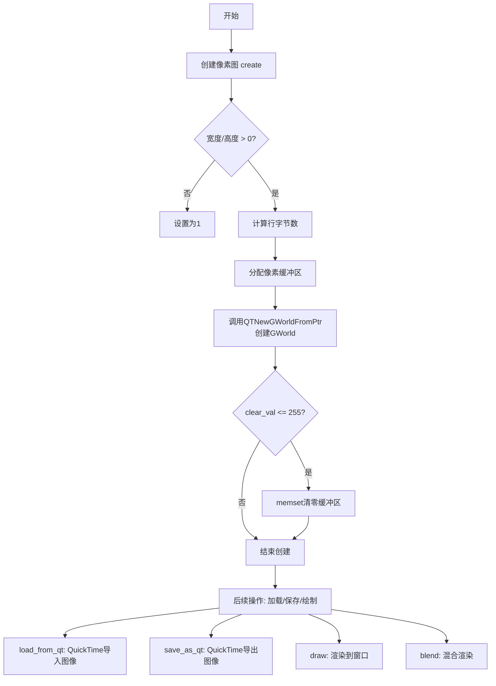

## 类结构

```
pixel_map (Mac平台像素图类)
```

## 全局变量及字段


### `pixel_map.m_pmap`
    
Mac图形世界指针,用于管理QuickTime GWorld对象

类型：`GWorld*`
    


### `pixel_map.m_buf`
    
像素数据缓冲区,存储图像的原始像素数据

类型：`unsigned char*`
    


### `pixel_map.m_bpp`
    
像素深度/比特每像素,表示每个像素占用的位数

类型：`unsigned`
    


### `pixel_map.m_img_size`
    
图像总大小,以字节为单位,等于行字节长度乘以高度

类型：`unsigned`
    
    

## 全局函数及方法


### `pixel_map::calc_row_len`

该静态工具函数根据图像宽度和位深计算图像每行像素所需的字节数，并确保返回值满足4字节对齐要求，以适配Mac OS平台对像素行大小的内存对齐规范。

参数：

- `width`：`unsigned`，图像的像素宽度
- `bits_per_pixel`：`unsigned`，图像的位深（如8、16、24、32等）

返回值：`unsigned`，返回计算后的行字节数（已进行4字节对齐）

#### 流程图

```mermaid
flowchart TD
    A[开始] --> B[设置 n = width]
    B --> C{根据 bits_per_pixel 分支处理}
    
    C -->|1| D[计算 n = width / 8<br/>若 width % 8 != 0 则 n++]
    D --> H
    
    C -->|4| E[计算 n = width / 2<br/>若 width % 4 != 0 则 n++]
    E --> H
    
    C -->|8| F[n = width]
    F --> H
    
    C -->|16| G[n = width * 2]
    G --> H
    
    C -->|24| I[n = width * 3]
    I --> H
    
    C -->|32| J[n = width * 4]
    J --> H
    
    C -->|default| K[n = 0]
    K --> H
    
    H[返回 (n + 3) / 4 * 4<br/>即4字节对齐后的值] --> L[结束]
```

#### 带注释源码

```cpp
//----------------------------------------------------------------------------
// 计算行字节长度（静态工具函数）
// 根据宽度和位深计算行字节对齐，确保返回值为4的倍数
//----------------------------------------------------------------------------
unsigned pixel_map::calc_row_len(unsigned width, unsigned bits_per_pixel)
{
    unsigned n = width;    // 初始化为像素宽度
    unsigned k;            // 临时变量，用于保存原始宽度值

    // 根据不同的位深计算字节数
    switch(bits_per_pixel)
    {
        // 1位色深：8个像素占1字节，需向上取整
        case  1: k = n;
                 n = n >> 3;              // n = width / 8
                 if(k & 7) n++;          // 如果有余数，字节数+1
                 break;

        // 4位色深：2个像素占1字节，需向上取整
        case  4: k = n;
                 n = n >> 1;              // n = width / 2
                 if(k & 3) n++;          // 如果有余数，字节数+1
                 break;

        // 8位色深：1个像素占1字节，直接使用宽度
        case  8:
                 break;

        // 16位色深：1个像素占2字节
        case 16: n = n << 1;              // n = width * 2
                 break;

        // 24位色深：1个像素占3字节
        case 24: n = (n << 1) + n;       // n = width * 2 + width = width * 3
                 break;

        // 32位色深：1个像素占4字节
        case 32: n = n << 2;             // n = width * 4
                 break;

        // 不支持的位深，返回0
        default: n = 0;
                 break;
    }
    
    // 最终进行4字节对齐：
    // (n + 3) >> 2 << 2 等价于 ((n + 3) / 4) * 4
    // 确保返回的字节数是4的倍数，满足内存对齐要求
    return ((n + 3) >> 2) << 2;
}
```


### `pixel_map.~pixel_map`

析构函数，负责释放pixel_map对象占用的资源，包括图像缓冲区内存和GWorld资源。

参数：无

返回值：无（析构函数不返回值）

#### 流程图

```mermaid
flowchart TD
    A[开始析构函数] --> B{检查m_buf是否为空}
    B -->|是| C[delete[] m_buf并置空]
    C --> D{检查m_pmap是否为nil}
    D -->|否| E[调用DisposeGWorld释放GWorld]
    E --> F[置m_pmap为nil]
    D -->|是| G[结束]
    B -->|否| G
    F --> G
```

#### 带注释源码

```cpp
    //------------------------------------------------------------------------
    // 析构函数：释放pixel_map对象占用的所有资源
    // 调用destroy()方法清理m_buf和m_pmap
    //------------------------------------------------------------------------
    pixel_map::~pixel_map()
    {
        // 调用destroy方法释放图像缓冲区和GWorld
        destroy();
    }
```


### `pixel_map.pixel_map`

这是 `pixel_map` 类的默认构造函数，用于初始化该类的所有成员变量，将像素图对象设置为初始状态（空状态），为后续的 `create()` 方法创建像素缓冲区做准备。

参数：

- 该函数无参数

返回值：该函数无返回值（构造函数）

#### 流程图

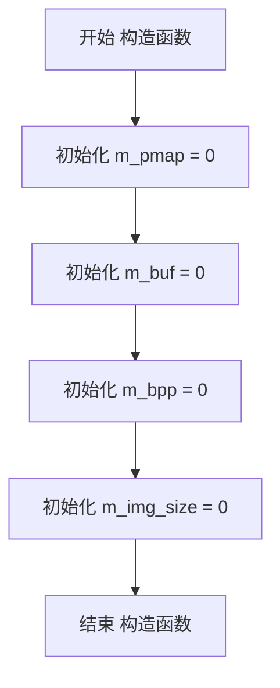

#### 带注释源码

```cpp
//------------------------------------------------------------------------
// pixel_map::pixel_map
// 默认构造函数，初始化所有成员变量
//------------------------------------------------------------------------
pixel_map::pixel_map() :
    m_pmap(0),      // 初始化 GWorld 指针为 NULL (0)
    m_buf(0),       // 初始化像素缓冲区指针为 NULL (0)
    m_bpp(0),       // 初始化每像素位数为 0 (未设置)
    m_img_size(0)   // 初始化图像大小为 0

{
    // 构造函数体为空，所有初始化工作在成员初始化列表中完成
}
```


### `pixel_map.destroy`

该方法用于销毁像素图对象，释放先前分配的内存缓冲区资源以及 Mac GWorld 图形世界资源，防止内存泄漏。

参数：无需参数

返回值：`void`，无返回值

#### 流程图

```mermaid
graph TD
    A[开始 destroy] --> B[delete[] m_buf 释放缓冲区]
    B --> C[m_buf 设为 NULL]
    C --> D{m_pmap != nil?}
    D -->|是| E[DisposeGWorld 释放GWorld]
    E --> F[m_pmap 设为 nil]
    D -->|否| G[结束]
    F --> G
```

#### 带注释源码

```cpp
//------------------------------------------------------------------------
// 销毁像素图，释放所有相关资源
//------------------------------------------------------------------------
void pixel_map::destroy()
{
    // 1. 释放图像数据缓冲区内存
    delete[] m_buf;
    // 2. 将指针置空，防止悬挂引用
    m_buf = NULL;
    
    // 3. 如果 GWorld 对象存在，则释放 QuickDraw GWorld
    if (m_pmap != nil)
    {
        // 调用 QuickTime API 释放 GWorld 图形设备上下文
        DisposeGWorld(m_pmap);
        // 释放后将指针置 nil
        m_pmap = nil;
    }
}
```


### pixel_map.create

该方法用于创建像素图（pixel_map），负责分配内存、创建QuickTime GWorld图形世界，并根据指定的清零值初始化像素缓冲区。

参数：

- `width`：`unsigned`，像素图的宽度，如果传入0则自动调整为1
- `height`：`unsigned`，像素图的高度，如果传入0则自动调整为1
- `org`：`org_e`，像素格式/组织（位深度），如1、4、8、16、24、32位
- `clear_val`：`unsigned`，清零值，用于初始化像素缓冲区，取值范围0-255

返回值：`void`，无返回值

#### 流程图

```mermaid
flowchart TD
    A[开始 create 方法] --> B[调用 destroy 销毁现有资源]
    B --> C{width == 0?}
    C -->|Yes| D[width = 1]
    C -->|No| E{height == 0?}
    D --> E
    E -->|Yes| F[height = 1]
    E -->|No| G[设置 m_bpp = org]
    F --> G
    G --> H[计算行字节数: row_bytes = calc_row_len]
    H --> I[创建 Mac Rect 结构]
    I --> J[分配像素缓冲区: new unsigned char[row_bytes * height]
    J --> K[调用 QTNewGWorldFromPtr 创建 GWorld]
    K --> L{clear_val <= 255?}
    L -->|Yes| M[memset 缓冲区为清零值]
    L -->|No| N[结束]
    M --> N
```

#### 带注释源码

```cpp
//------------------------------------------------------------------------
// 创建像素图
// 参数: width - 像素图宽度, height - 像素图高度, org - 位深度, clear_val - 清零值
//------------------------------------------------------------------------
void pixel_map::create(unsigned width, 
                       unsigned height, 
                       org_e    org,
                       unsigned clear_val)
{
    // 先销毁已存在的像素图资源，防止内存泄漏
    destroy();
    
    // 确保最小尺寸为1x1，避免无效尺寸
    if(width == 0)  width = 1;
    if(height == 0) height = 1;
    
    // 保存位深度信息
    m_bpp = org;
    
    // 定义Mac图形区域矩形
    Rect    r;
    
    // 计算每行像素所需的字节数（考虑字节对齐）
    int     row_bytes = calc_row_len (width, m_bpp);
    
    // 设置矩形区域为指定的宽高
    MacSetRect(&r, 0, 0, width, height);
    
    // 计算总图像内存大小并分配缓冲区
    m_buf = new unsigned char[m_img_size = row_bytes * height];
    
    // 使用QuickTime创建GWorld（图形世界）
    // 相比传统方法，QTNewGWorldFromPtr更灵活
    // 参数: GWorld指针, 位深度, 矩形, 颜色表, 像素格式, 缓冲区指针, 行字节数
    QTNewGWorldFromPtr (&m_pmap, m_bpp, &r, nil, nil, 0, m_buf, row_bytes);

    // 灰度调色板创建（已注释，暂未实现）
    // create_gray_scale_palette(m_pmap);
    
    // 如果清零值在有效范围内（0-255），则初始化缓冲区
    if(clear_val <= 255)
    {
        // 使用memset将缓冲区所有字节设置为清零值
        memset(m_buf, clear_val, m_img_size);
    }
}
```


### pixel_map.clear

清除像素数据，将像素缓冲区中的所有字节设置为指定的清除值。

参数：

- `clear_val`：`unsigned`，清除值，用于填充像素缓冲区的新值（通常为 0 表示清除为黑色或透明）

返回值：`void`，无返回值

#### 流程图

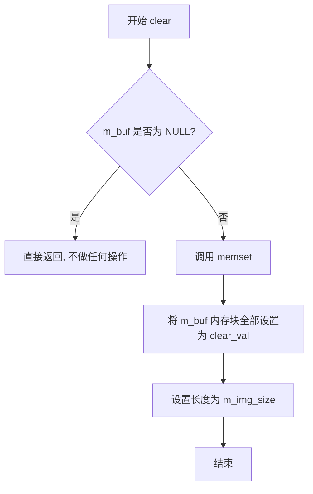

#### 带注释源码

```cpp
//------------------------------------------------------------------------
// 清除像素数据
// 将缓冲区中的所有像素设置为指定的值
//------------------------------------------------------------------------
void pixel_map::clear(unsigned clear_val)
{
    // 检查缓冲区指针是否有效（非 NULL）
    if(m_buf) 
    {
        // 使用 memset 将缓冲区中 m_img_size 大小的内存
        // 全部设置为 clear_val 值
        memset(m_buf, clear_val, m_img_size);
    }
}
```


### `pixel_map.calc_row_len`

静态方法，计算像素图中一行像素所需的字节长度，并根据4字节边界进行对齐。用于在创建像素图时确定所需的内存缓冲区大小。

参数：

- `width`：`unsigned`，图像宽度（像素数）
- `bits_per_pixel`：`unsigned`，每个像素的位数（1, 4, 8, 16, 24, 或 32）

返回值：`unsigned`，返回一行像素占用的字节数（已对齐到4字节边界）

#### 流程图

```mermaid
flowchart TD
    A[开始 calc_row_len] --> B[输入: width, bits_per_pixel]
    B --> C{bits_per_pixel值}
    
    C -->|1| D[计算 n = width >> 3<br/>如果 width & 7 != 0 则 n++]
    C -->|4| E[计算 n = width >> 1<br/>如果 width & 3 != 0 则 n++]
    C -->|8| F[n = width]
    C -->|16| G[n = width << 1]
    C -->|24| H[n = (width << 1) + width]
    C -->|32| I[n = width << 2]
    C -->|其他| J[n = 0]
    
    D --> K[对齐: ((n + 3) >> 2) << 2]
    E --> K
    F --> K
    G --> K
    H --> K
    I --> K
    J --> K
    
    K --> L[返回对齐后的字节数]
```

#### 带注释源码

```cpp
//------------------------------------------------------------------------
// 静态方法：calc_row_len
// 功能：计算像素图每行像素占用的字节数，并确保4字节对齐
// 注意：此函数从Win32平台支持代码复制而来，
//      也适用于MacOS，但尚未经过充分测试。
//------------------------------------------------------------------------
unsigned pixel_map::calc_row_len(unsigned width, unsigned bits_per_pixel)
{
    // n 存储计算后的原始字节数（未对齐）
    unsigned n = width;
    // k 用于保存原始width值，以便检查边界情况
    unsigned k;

    // 根据不同的位深度计算每行字节数
    switch(bits_per_pixel)
    {
        // 1位色（单色）：每8个像素占1字节，不足8个按1字节计算
        case  1: k = n;
                 n = n >> 3;  // n = width / 8
                 if(k & 7) n++;  // 如果有余数，增加1字节
                 break;

        // 4位色（16色）：每2个像素占1字节，不足2个按1字节计算
        case  4: k = n;
                 n = n >> 1;  // n = width / 2
                 if(k & 3) n++;  // 如果有余数，增加1字节
                 break;

        // 8位色（256色）：每个像素占1字节
        case 8:
                 break;  // n = width，无需修改

        // 16位色（65536色）：每个像素占2字节
        case 16: n = n << 1;  // n = width * 2
                 break;

        // 24位色（真彩色）：每个像素占3字节
        case 24: n = (n << 1) + n;  // n = width * 3
                 break;

        // 32位色（带Alpha通道的真彩色）：每个像素占4字节
        case 32: n = n << 2;  // n = width * 4
                 break;

        // 不支持的位深度
        default: n = 0;
                 break;
    }
    
    // 将计算结果对齐到4字节边界
    // 原理：(n + 3) >> 2 相当于 (n + 3) / 4（向上取整）
    //       << 2 相当于 * 4，恢复到字节单位
    // 这确保返回的字节数是4的倍数，满足某些平台的对齐要求
    return ((n + 3) >> 2) << 2;
}
```


### `pixel_map.draw`

绘制像素图到窗口，支持两种重载形式：第一种通过矩形区域绘制，第二种通过坐标和缩放因子绘制。两个重载均使用 QuickTime 的 DecompressImage 函数执行实际绘制操作，并带有缩放功能。

#### 第一个重载：`pixel_map.draw(WindowRef, const Rect*, const Rect*)`

参数：

- `window`：`WindowRef`，目标窗口引用，指定绘制到哪个 Mac OS 窗口
- `device_rect`：`const Rect*`，设备区域矩形，指定在窗口中的目标绘制区域
- `pmap_rect`：`const Rect*`，像素映射源区域矩形，指定从像素图中读取的区域（当前实现中未直接使用，通过整个像素图绘制）

返回值：`void`，无返回值

#### 流程图

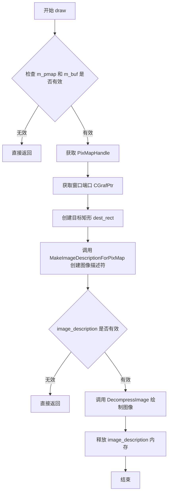

#### 带注释源码

```cpp
//------------------------------------------------------------------------
// 使用 QuickTime 将像素图绘制到窗口
//------------------------------------------------------------------------
void pixel_map::draw(WindowRef window, const Rect *device_rect, const Rect *pmap_rect) const
{
    // 检查像素图和缓冲区是否有效，无效则直接返回
    if(m_pmap == nil || m_buf == NULL) return;

    // 获取像素图的 PixMap 句柄
    PixMapHandle	pm = GetGWorldPixMap (m_pmap);
    // 获取窗口的图形端口
    CGrafPtr		port = GetWindowPort (window);
    // 目标矩形，用于指定绘制区域
    Rect			dest_rect;

    // 设置目标矩形为整个像素图的尺寸（宽 x 高）
    MacSetRect (&dest_rect, 0, 0, this->width(), this->height());
    
    // 创建图像描述符，用于描述像素图格式
    ImageDescriptionHandle		image_description;
    MakeImageDescriptionForPixMap (pm, &image_description);	   
    
    // 如果图像描述符创建成功
    if (image_description != nil)
    {
        // 使用 QuickTime 的 DecompressImage 将图像解压并绘制到窗口端口
        // 参数：源像素基地址、图像描述符、目标端口、源矩形、目标矩形、ditherCopy 模式、空指针
        DecompressImage (GetPixBaseAddr (pm), image_description, GetPortPixMap (port), nil, &dest_rect, ditherCopy, nil);	   
        
        // 释放图像描述符内存
        DisposeHandle ((Handle) image_description);
    }
}
```

---

#### 第二个重载：`pixel_map.draw(WindowRef, int, int, double)`

参数：

- `window`：`WindowRef`，目标窗口引用，指定绘制到哪个 Mac OS 窗口
- `x`：`int`，目标位置的 X 坐标，指定绘制区域左上角的水平位置
- `y`：`int`，目标位置的 Y 坐标，指定绘制区域左上角的垂直位置
- `scale`：`double`，缩放因子，用于缩放图像尺寸

返回值：`void`，无返回值

#### 流程图

```mermaid
flowchart TD
    A[开始 draw] --> B{检查 m_pmap 和 m_buf 是否有效}
    B -->|无效| C[直接返回]
    B -->|有效| D[计算缩放后的宽度 width = this->width() * scale]
    E[计算缩放后的高度 height = this->height() * scale]
    D --> F[创建矩形 rect, 左上角 x,y, 右下角 x+width, y+height]
    F --> G[调用第一个重载 draw(window, &rect)]
    G --> H[结束]
```

#### 带注释源码

```cpp
//------------------------------------------------------------------------
// 使用坐标和缩放因子绘制像素图到窗口
//------------------------------------------------------------------------
void pixel_map::draw(WindowRef window, int x, int y, double scale) const
{
    // 检查像素图和缓冲区是否有效，无效则直接返回
    if(m_pmap == nil || m_buf == NULL) return;
    
    // 根据缩放因子计算目标绘制尺寸
    unsigned width  = (unsigned)(this->width() * scale);
    unsigned height = (unsigned)(this->height() * scale);
    
    // 创建目标矩形，指定绘制位置和大小
    Rect rect;
    SetRect (&rect, x, y, x + width, y + height);
    
    // 调用第一个重载方法执行实际绘制
    draw(window, &rect);
}
```

---


### `pixel_map.blend`

该方法用于将像素图混合绘制到窗口上，目前直接映射到`draw`方法实现简单的图像显示功能。

参数：

- `window`：`WindowRef`，Mac OS窗口引用，目标绘制窗口
- `device_rect`：`const Rect *`，设备矩形，指定在目标窗口上的绘制区域
- `bmp_rect`：`const Rect *`，位图矩形，指定像素图中要绘制的区域
- `x`：`int`，目标绘制位置的X坐标
- `y`：`int`，目标绘制位置的Y坐标
- `scale`：`double`，缩放比例，用于缩放绘制图像

返回值：`void`，无返回值

#### 流程图

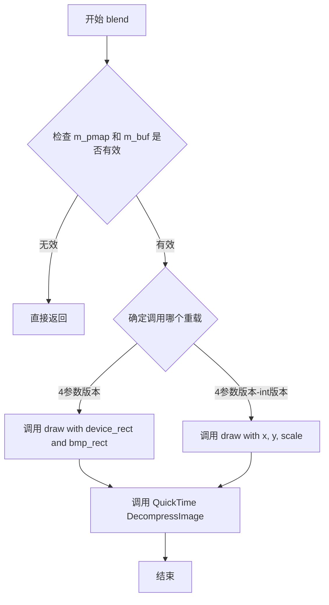

#### 带注释源码

```cpp
//------------------------------------------------------------------------
// pixel_map::blend - 混合绘制方法（映射到draw方法）
//------------------------------------------------------------------------

//------------------------------------------------------------------------
// 重载版本1: 使用矩形区域进行混合绘制
// 参数:
//   window: 目标窗口引用
//   device_rect: 设备上的目标矩形区域
//   bmp_rect: 像素图中的源矩形区域
// 返回值: void
//------------------------------------------------------------------------
void pixel_map::blend(WindowRef window, const Rect *device_rect, const Rect *bmp_rect) const
{
    // 当前实现简单地映射到draw方法
    // blend功能实际上是调用draw进行图像显示
    draw (window, device_rect, bmp_rect);	// currently just mapped to drawing method
}


//------------------------------------------------------------------------
// 重载版本2: 使用坐标和缩放进行混合绘制
// 参数:
//   window: 目标窗口引用
//   x: 目标X坐标
//   y: 目标Y坐标
//   scale: 缩放因子
// 返回值: void
//------------------------------------------------------------------------
void pixel_map::blend(WindowRef window, int x, int y, double scale) const
{
    // 当前实现简单地映射到draw方法
    // blend功能实际上是调用draw进行图像显示
    draw(window, x, y, scale);	// currently just mapped to drawing method
}
```

#### 关联的draw方法源码

```cpp
//------------------------------------------------------------------------
// 实际的绘制实现 - 使用QuickTime进行图像解压缩绘制
//------------------------------------------------------------------------
void pixel_map::draw(WindowRef window, const Rect *device_rect, const Rect *pmap_rect) const
{
    // 检查像素图和缓冲区是否有效
    if(m_pmap == nil || m_buf == NULL) return;

    // 获取PixMap句柄和窗口图形端口
    PixMapHandle	pm = GetGWorldPixMap (m_pmap);
    CGrafPtr		port = GetWindowPort (window);
    Rect			dest_rect;

    // 设置目标矩形区域
    MacSetRect (&dest_rect, 0, 0, this->width(), this->height());
    
    // 创建图像描述符
    ImageDescriptionHandle		image_description;
    MakeImageDescriptionForPixMap (pm, &image_description);	   
    
    // 使用QuickTime DecompressImage进行图像绘制
    if (image_description != nil)
    {
        // 解压缩并绘制图像到目标端口
        DecompressImage (GetPixBaseAddr (pm), image_description, GetPortPixMap (port), nil, &dest_rect, ditherCopy, nil);	   
        // 释放图像描述符内存
        DisposeHandle ((Handle) image_description);
    }
}
```


### pixel_map.load_from_qt

从QuickTime支持的图像格式（如PSD、BMP、TIF、PNG、JPG、GIF、PCT、PCX等）加载图像数据到pixel_map对象中，使用QuickTime的GraphicsImport组件读取图像，并将其转换为32位深度的内部像素格式。

参数：

- `filename`：`const char*`，要加载的图像文件路径（相对于应用程序目录）

返回值：`bool`，如果图像加载成功返回true，否则返回false

#### 流程图

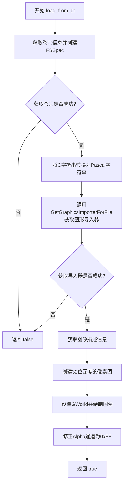

#### 带注释源码

```
//------------------------------------------------------------------------
// I let Quicktime handle image import since it supports most popular
// image formats such as:
// *.psd, *.bmp, *.tif, *.png, *.jpg, *.gif, *.pct, *.pcx
//------------------------------------------------------------------------
bool pixel_map::load_from_qt(const char *filename)
{
    // 文件规范结构体，用于定位文件
    FSSpec						fss;
    // 操作系统错误码
    OSErr						err;
    
    // 获取当前卷宗（应用程序目录）的信息
    // get file specification to application directory
    err = HGetVol(nil, &fss.vRefNum, &fss.parID);
    if (err == noErr)
    {
        // 将C风格字符串转换为Pascal风格字符串（Mac旧API要求）
        CopyCStringToPascal(filename, fss.name);
        
        // 图形导入器组件句柄
        GraphicsImportComponent		gi;
        
        // 根据文件规范获取对应的图形导入器
        // QuickTime会自动识别文件格式并选择合适的导入器
        err = GetGraphicsImporterForFile (&fss, &gi);
        if (err == noErr)
        {
            // 图像描述句柄，包含图像元数据（宽、高、格式等）
            ImageDescriptionHandle		desc;
            
            // 获取图像描述信息
            GraphicsImportGetImageDescription(gi, &desc);
            
            // 为简化处理，所有图像目前都被转换为32位色深
            // create an empty pixelmap
            short depth = 32;
            
            // 创建与原图相同尺寸的32位像素图，背景填充0xFF
            create ((**desc).width, (**desc).height, (org_e)depth, 0xff);
            
            // 释放图像描述句柄
            DisposeHandle ((Handle)desc);
            
            // 设置导入器使用的GWorld（图形世界）为目标像素图
            // let Quicktime draw to pixelmap
            GraphicsImportSetGWorld(gi, m_pmap, nil);
            
            // 执行导入绘制操作，将图像数据写入像素图
            GraphicsImportDraw(gi);
            
            // 特殊处理：QuickTime的图形导入器会为没有Alpha通道的图像
            // 设置Alpha值为0x00，这会导致agg渲染出完全透明的不可见图像
            // Well, this is a hack. The graphics importer sets the alpha channel 
            // of the pixelmap to 0x00 for imported images without alpha channel 
            // but this would cause agg to draw an invisible image.
            
            // 修正Alpha通道：遍历所有像素，将Alpha值设置为0xFF（完全不透明）
            // set alpha channel to 0xff
            unsigned char * buf = m_buf;
            for (unsigned int size = 0; size < m_img_size; size += 4)
            {
                *buf = 0xff;  // 设置Alpha通道为完全不透明
                buf += 4;     // 每4字节（RGBA）移动一次
            }
        }
    }
    
    // 返回是否成功（err为noErr表示成功）
    return err == noErr;
}
```


### `pixel_map::save_as_qt`

该函数用于将像素图保存为QuickTime兼容的PNG图像文件，利用Mac OS的Graphics Export组件将内存中的像素数据导出为标准图像格式。

参数：

- `filename`：`const char *`，要保存的目标文件名（以C字符串形式传入）

返回值：`bool`，如果成功保存返回true，否则返回false

#### 流程图

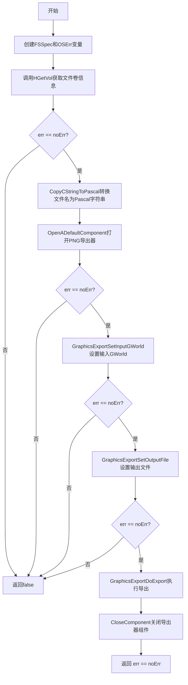

#### 带注释源码

```cpp
//------------------------------------------------------------------------
bool pixel_map::save_as_qt(const char *filename) const
{
    FSSpec                      fss;      // Mac文件规范结构体
    OSErr                       err;      // Mac OS错误码
    
    // 获取文件规范到应用程序目录
    // HGetVol获取当前卷的引用号和父目录ID
    err = HGetVol(nil, &fss.vRefNum, &fss.parID);
    if (err == noErr)
    {
        GraphicsExportComponent    ge;   // 图形导出组件句柄
        // 将C字符串转换为Pascal字符串（Mac旧API要求）
        CopyCStringToPascal(filename, fss.name);
        
        // 选择PNG作为输出图像文件格式
        // 还有其他可用格式，是否应该检查文件后缀来选择图像文件格式？
        err = OpenADefaultComponent(GraphicsExporterComponentType, kQTFileTypePNG, &ge);
        if (err == noErr)
        {
            // 设置导出器的输入为当前GWorld（像素图）
            err = GraphicsExportSetInputGWorld(ge, m_pmap);
            if (err == noErr)
            {
                // 设置输出文件规范
                err = GraphicsExportSetOutputFile(ge, &fss);
                if (err == noErr)
                {
                    // 执行实际的导出操作
                    GraphicsExportDoExport(ge, nil);
                }
            }
            // 关闭导出器组件，释放资源
            CloseComponent(ge);
        }
    }
    
    // 返回是否成功（err == noErr）
    return err == noErr;
}
```


### `pixel_map.buf`

获取像素缓冲区指针，返回指向图像像素数据的内部缓冲区指针。

参数： 无

返回值：`unsigned char*`，指向像素缓冲区首地址的指针，用于直接访问和操作图像像素数据。

#### 流程图

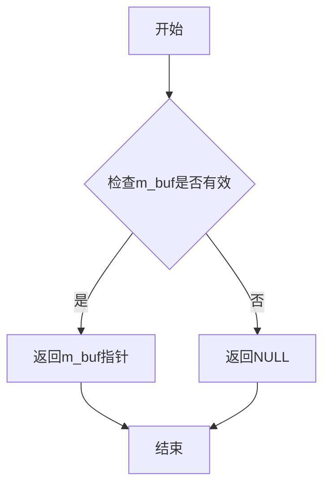

#### 带注释源码

```
//------------------------------------------------------------------------
// 获取像素缓冲区指针
//------------------------------------------------------------------------
unsigned char* pixel_map::buf()
{
    // 返回内部像素缓冲区指针 m_buf
    // 该缓冲区存储图像的像素数据
    return m_buf;
}
```


### `pixel_map.width`

获取像素映射（pixel_map）的图像宽度。

参数：

- （无参数）

返回值：`unsigned`，返回图像的宽度像素值，如果像素映射未初始化（m_pmap 为 nil）则返回 0。

#### 流程图

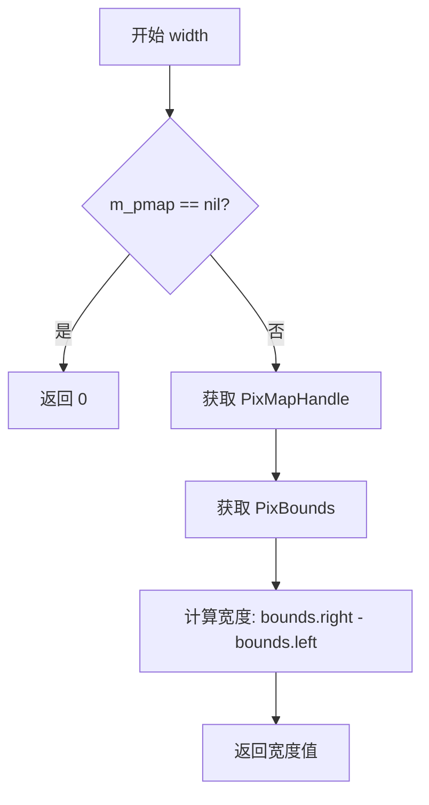

#### 带注释源码

```cpp
//------------------------------------------------------------------------
unsigned pixel_map::width() const
{
    // 检查像素映射是否有效，如果 m_pmap 为 nil 表示未初始化，返回 0
    if(m_pmap == nil) return 0;
    
    // 获取 GWorld 的 PixMap 句柄
    PixMapHandle    pm = GetGWorldPixMap (m_pmap);
    
    // 定义矩形结构用于存储边界信息
    Rect            bounds;
    
    // 获取 PixMap 的边界矩形
    GetPixBounds (pm, &bounds);
    
    // 返回宽度：右侧坐标减去左侧坐标
    return bounds.right - bounds.left;
}
```


### `pixel_map.height`

获取像素地图的高度，返回图像的垂直像素数。

参数：
- （无）

返回值：`unsigned`，返回像素地图的高度（以像素为单位），如果未创建则返回 0。

#### 流程图

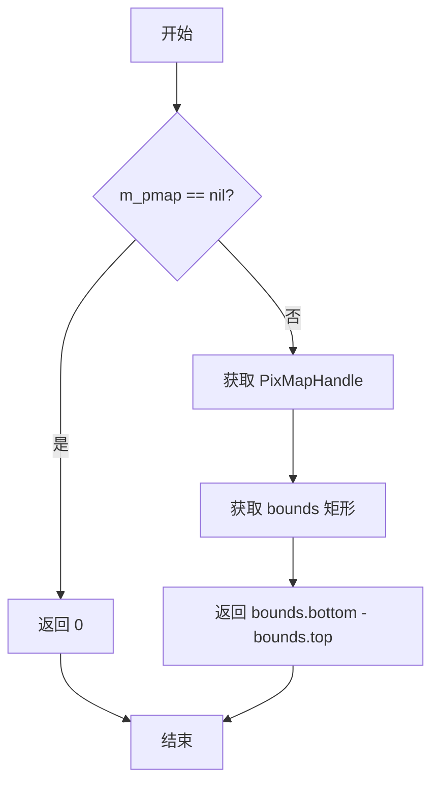

#### 带注释源码

```cpp
//------------------------------------------------------------------------
// 获取像素地图的高度
//------------------------------------------------------------------------
unsigned pixel_map::height() const
{
    // 检查像素图是否已创建（m_pmap 为 nil 表示未创建）
    if(m_pmap == nil) return 0;
    
    // 获取 PixMap 句柄，用于访问像素图数据
    PixMapHandle pm = GetGWorldPixMap (m_pmap);
    
    // 定义矩形结构用于存储边界信息
    Rect bounds;
    
    // 获取像素图的边界矩形
    GetPixBounds (pm, &bounds);
    
    // 返回高度（底部坐标减去顶部坐标）
    return bounds.bottom - bounds.top;
}
```


### `pixel_map.row_bytes`

获取像素图的行字节数（即每行像素占用的字节数），用于图像处理和内存操作。

参数：

- （无参数）

返回值：`int`，返回像素图中每一行像素所占用的字节数，如果像素图未初始化（m_pmap为nil）则返回0。

#### 流程图

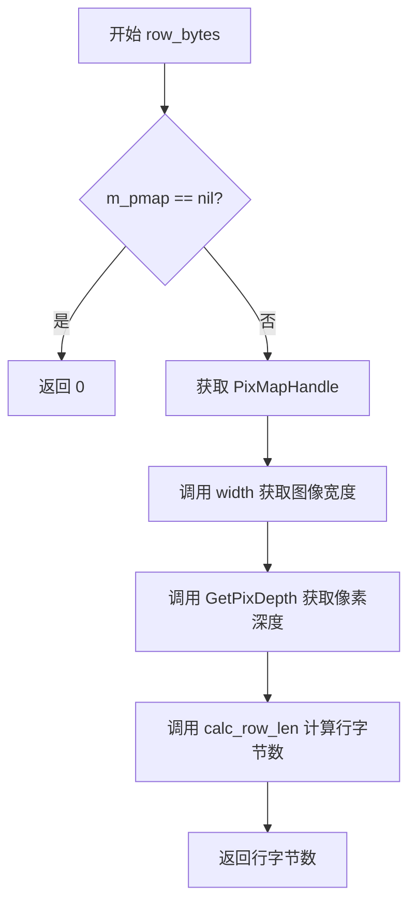

#### 带注释源码

```cpp
//------------------------------------------------------------------------
// 获取像素图的行字节数
//------------------------------------------------------------------------
int pixel_map::row_bytes() const
{
    // 检查像素图是否已初始化
    if(m_pmap == nil) 
        return 0;  // 未初始化则返回0
    
    // 获取GWorld的PixMapHandle
    PixMapHandle pm = GetGWorldPixMap (m_pmap);
    
    // 计算行字节数：使用宽度和像素深度调用calc_row_len函数
    // width()方法获取图像宽度
    // GetPixDepth(pm)获取像素深度（每像素位数）
    return calc_row_len(width(), GetPixDepth(pm));
}
```

#### 相关方法说明

该方法依赖于以下组件：
- **m_pmap**：GWorld指针，存储像素图数据
- **width()**：获取图像宽度的辅助方法
- **GetPixDepth()**：QuickTime函数，获取像素深度
- **calc_row_len()**：静态方法，根据宽度和位深计算行字节数（包含对齐处理）


## 关键组件


### pixel_map 类

pixel_map 类是 AGG 库中用于处理 Mac 平台像素图（Pixel Map）的核心类，负责图像内存分配、GWorld 创建、渲染以及通过 QuickTime 进行图像加载和保存。

### GWorld 图形世界

Mac QuickDraw/GUI 系统的图形世界组件，用于管理像素图设备和像素数据，是 Mac 平台 2D 图形渲染的基础结构。

### PixMap 像素图

Mac QuickDraw 中的像素图数据结构，包含图像的宽度、高度、位深度、颜色调色板等信息，用于图像数据的底层操作。

### QuickTime 图像导入

使用 QuickTime 的 GraphicsImportComponent 实现图像加载功能，支持多种格式（PSD、BMP、TIF、PNG、JPG、GIF、PCT、PCX）的导入。

### QuickTime 图像导出

使用 QuickTime 的 GraphicsExportComponent 实现图像保存功能，默认以 PNG 格式导出图像数据。

### DecompressImage 渲染

使用 QuickTime 的 DecompressImage 函数进行图像绘制和缩放，支持硬件加速的图像渲染。

### 缓冲区管理 (m_buf)

动态分配的像素数据缓冲区，存储图像像素值，支持多种位深度（1/4/8/16/24/32 bpp）。

### calc_row_len 行长度计算

计算符合 Mac QuickDraw 对齐要求的像素行长度，确保行字节数是 4 的倍数，兼容不同位深度的图像格式。

### 图像清空 (clear)

使用 memset 将像素缓冲区设置为指定值（默认为 0xff），用于图像初始化或清除操作。

### 混合绘制 (blend)

支持 alpha 通道的图像混合绘制，当前实现映射到 draw 方法，为未来扩展预留接口。


## 问题及建议


### 已知问题

-   **API过时**：代码大量使用已废弃的Carbon和QuickTime API（如`QTNewGWorldFromPtr`、`GraphicsImportComponent`等），这些API在现代macOS中不再推荐使用
-   **内存泄漏风险**：`load_from_qt()`函数中成功加载图像后未调用`GraphicsImportClose(gi)`释放图形导入器组件
-   **拷贝控制缺失**：类未定义拷贝构造函数和拷贝赋值运算符，可能导致double-free或use-after-free
-   **错误处理不完善**：`save_as_qt()`中`GraphicsExportDoExport`返回错误码未被检查；`load_from_qt()`中多个步骤失败时错误信息不明确
-   **参数未使用**：`draw()`和`blend()`方法中的`device_rect`和`bmp_rect`参数被忽略未使用，函数签名与实现不符
-   **魔法数字**：多处使用硬编码值如`0xff`、`0`等，缺乏有意义的常量定义
-   **性能问题**：`width()`、`height()`、`row_bytes()`每次调用都重新获取PixMap信息，重复调用时效率低下
-   **非const方法返回内部指针**：`buf()`方法返回`m_buf`指针但未提供const版本，破坏了封装性
-   **路径处理问题**：`load_from_qt()`使用`HGetVol`获取默认卷而非使用完整路径，可能导致文件定位失败
-   **位深度强制转换**：`load_from_qt()`中强制将所有图像转换为32位深度，可能导致不必要的内存占用

### 优化建议

-   **迁移到现代API**：将Carbon/QuickTime API迁移至Core Graphics、ImageIO或Core Image框架
-   **实现RULE OF THREE**：添加拷贝构造函数和拷贝赋值运算符，或显式删除它们
-   **完善错误处理**：检查所有QuickTime/Graphics组件函数的返回码，提供详细的错误信息
-   **使用智能指针**：考虑使用`std::unique_ptr`管理GWorld生命周期，避免手动释放
-   **缓存尺寸信息**：在`create()`时缓存width、height、row_bytes，避免重复查询PixMap
-   **添加const方法**：提供`buf() const`重载版本，或返回智能指针包装
-   **定义常量**：将`0xff`、像素深度等定义为枚举或常量，提高可读性和可维护性
-   **实现参数功能**：要么使用`device_rect`和`bmp_rect`参数，要么从函数签名中移除
-   **优化Alpha通道设置**：使用`memset`或`std::fill`替代手动的for循环设置alpha通道
-   **添加日志/调试信息**：在关键失败点添加调试输出，便于问题追踪


## 其它


### 设计目标与约束

本模块旨在为 AGG (Anti-Grain Geometry) 库提供 Mac 平台上的像素图（pixel_map）支持，实现跨平台的图像处理能力。设计目标包括：创建和管理像素内存缓冲区、提供图像绘制能力、支持常见图像格式加载与保存。约束条件：仅支持 Mac OS X 平台，依赖 QuickTime 框架进行图像编解码，假设运行在 32 位色深环境。

### 错误处理与异常设计

代码采用返回值机制报告错误，主要通过 OSErr 类型捕获 Mac 系统错误码。create() 方法在 width 或 height 为 0 时自动调整为 1，避免无效内存分配。load_from_qt() 和 save_as_qt() 方法返回 bool 类型表示操作是否成功，错误码存储在局部变量 err 中。draw() 和 blend() 方法在 m_pmap 为 nil 或 m_buf 为 NULL 时直接返回，不执行绘制操作。所有 QuickTime 操作均检查返回的错误码 (noErr)。

### 数据流与状态机

pixel_map 对象生命周期状态流转：初始状态 (m_pmap=NULL, m_buf=NULL) → 创建状态 (通过 create() 分配内存和 GWorld) → 使用状态 (可进行绘制、加载、保存操作) → 销毁状态 (通过 destroy() 释放资源)。数据流：外部输入 (width, height, filename) → create()/load_from_qt() 处理 → m_buf 缓冲区存储像素数据 → draw()/blend() 输出到 WindowRef → save_as_qt() 输出到文件。

### 外部依赖与接口契约

外部依赖包括：Carbon.h (Mac 传统 API)、QuickTimeComponents.h (图像导入导出)、ImageCompression.h (图像解压缩)、platform/mac/agg_mac_pmap.h (平台相关声明)、agg_basics.h (AGG 基础定义)。接口契约：create() 接受 width, height, org_e (像素格式), clear_val (清屏值)；load_from_qt() / save_as_qt() 接受文件名字符串指针；draw() 接受窗口句柄和矩形区域；所有尺寸查询方法返回 unsigned 类型。

### 内存管理策略

内存分配策略：m_buf 通过 new unsigned char[] 动态分配，大小为 calc_row_len(width, bpp) * height。m_pmap 通过 QTNewGWorldFromPtr() 创建并与 m_buf 缓冲区关联。销毁策略：destroy() 方法先释放 m_buf 数组，再调用 DisposeGWorld() 释放 GWorld。clear() 方法仅使用 memset 清零缓冲区，不释放内存。行对齐采用 4 字节对齐策略 ((n + 3) >> 2) << 2。

### 平台特定实现细节

本代码为 Mac OS X 平台专有实现，使用 QuickTime API 处理图像。GWorld (Graphics World) 是 Mac 传统的图形缓冲区抽象。MakeImageDescriptionForPixMap() 和 DecompressImage() 用于高质量图像绘制。GraphicsImportComponent 和 GraphicsExportComponent 分别处理图像导入导出。HGetVol() 获取默认卷宗信息用于文件操作。

### 线程安全性考虑

本类未实现任何线程同步机制。m_pmap 和 m_buf 成员在多线程环境下可能被并发访问，导致数据竞争。若在多线程环境中使用，建议在调用 create()、destroy()、draw()、load_from_qt()、save_as_qt() 等方法时进行外部同步，或提供线程安全的包装器类。

### 性能考虑与优化空间

性能热点：load_from_qt() 中逐字节设置 alpha 通道 (m_img_size/4 次循环)，可考虑使用 SIMD 优化或批量赋值。draw() 方法每次调用都创建和销毁 ImageDescriptionHandle，可考虑缓存机制。calc_row_len() 使用 switch 分支，可转换为查表方式提升性能。width() 和 height() 方法每次都调用 GetGWorldPixMap() 和 GetPixBounds()，建议缓存尺寸值。

### 兼容性考虑

当前实现依赖 QuickTime，QuickTime 在现代 macOS 版本中已被弃用 (macOS 10.15 后)。建议迁移到 Core Graphics 和 ImageIO 框架。所有图像在加载时被强制转换为 32 位色深，可能导致颜色信息丢失。alpha 通道处理存在 hack：对于无 alpha 通道的图像强制设置为 0xff，可能不符合某些应用场景需求。

    