# `matplotlib\extern\agg24-svn\src\platform\mac\agg_platform_support.cpp` 详细设计文档

该代码是 Anti-Grain Geometry (AGG) 库的 Mac OS Carbon 平台支持模块，封装了窗口管理、Carbon 事件循环、渲染缓冲区操作以及图像 I/O，提供了跨平台的图形应用基础框架。

## 整体流程

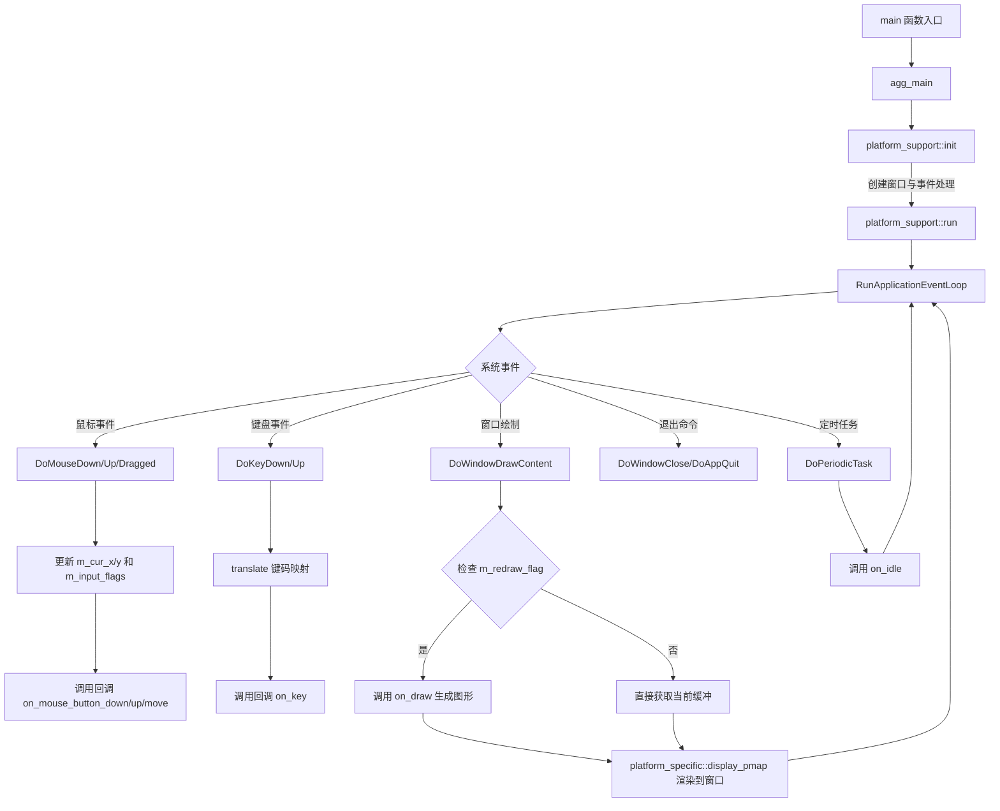

## 类结构

```
platform_support (主控/抽象类)
└── platform_specific (平台实现细节类)
```

## 全局变量及字段


### `platform_specific.m_format`
    
应用程序请求的像素格式

类型：`pix_format_e`
    


### `platform_specific.m_sys_format`
    
Mac系统支持的像素格式

类型：`pix_format_e`
    


### `platform_specific.m_flip_y`
    
是否翻转Y轴坐标

类型：`bool`
    


### `platform_specific.m_bpp`
    
应用程序像素深度

类型：`unsigned`
    


### `platform_specific.m_sys_bpp`
    
系统像素深度

类型：`unsigned`
    


### `platform_specific.m_window`
    
Mac 窗口句柄

类型：`WindowRef`
    


### `platform_specific.m_pmap_window`
    
窗口像素映射对象

类型：`pixel_map`
    


### `platform_specific.m_pmap_img`
    
图像像素映射数组

类型：`array`
    


### `platform_specific.m_keymap`
    
键盘码转换映射表

类型：`array[256]`
    


### `platform_specific.m_last_translated_key`
    
最后一次转换的虚拟键码

类型：`unsigned`
    


### `platform_specific.m_cur_x`
    
当前鼠标X坐标

类型：`int`
    


### `platform_specific.m_cur_y`
    
当前鼠标Y坐标

类型：`int`
    


### `platform_specific.m_input_flags`
    
鼠标/键盘输入状态标志

类型：`unsigned`
    


### `platform_specific.m_redraw_flag`
    
标记是否需要重绘

类型：`bool`
    


### `platform_specific.m_sw_freq`
    
微秒计时器频率

类型：`UnsignedWide`
    


### `platform_specific.m_sw_start`
    
计时器开始时间

类型：`UnsignedWide`
    


### `platform_support.m_specific`
    
指向平台特定实现实例的指针

类型：`platform_specific*`
    


### `platform_support.m_format`
    
像素格式

类型：`pix_format_e`
    


### `platform_support.m_bpp`
    
位深度

类型：`unsigned`
    


### `platform_support.m_window_flags`
    
窗口创建标志

类型：`unsigned`
    


### `platform_support.m_wait_mode`
    
事件循环模式（等待/非阻塞）

类型：`bool`
    


### `platform_support.m_flip_y`
    
Y轴翻转

类型：`bool`
    


### `platform_support.m_caption`
    
窗口标题文本

类型：`char[256]`
    


### `platform_support.m_initial_width`
    
初始窗口宽度

类型：`unsigned`
    


### `platform_support.m_initial_height`
    
初始窗口高度

类型：`unsigned`
    


### `platform_support.m_rbuf_window`
    
窗口主渲染缓冲区

类型：`rendering_buffer`
    


### `platform_support.m_rbuf_img`
    
图像数据缓冲区数组

类型：`array`
    
    

## 全局函数及方法


### `main`

标准C入口点，处理命令行参数和MacOS启动参数(-psn)，过滤掉MacOS系统传递的进程序列号参数后调用agg_main函数执行主逻辑。

参数：

- `argc`：`int`，命令行参数个数
- `argv`：`char*`，指向命令行参数数组的指针

返回值：`int`，返回agg_main函数的返回值，表示程序退出状态

#### 流程图

```mermaid
flowchart TD
    A[程序启动 main] --> B{是否为CodeWarrior编译器}
    B -->|Yes| C[可选: 使用ccommand获取命令行参数]
    B -->|No| D[跳过]
    C --> E{检查-psn参数}
    D --> E
    E --> F{argc >= 2 且 argv[1]以'-psn'开头?}
    F -->|Yes| G[将argc设为1, 移除-psn参数]
    F -->|No| H[保持参数不变]
    G --> I[调用agg_main函数]
    H --> I
    I --> J[返回agg_main的返回值]
```

#### 带注释源码

```c
//----------------------------------------------------------------------------
// 主函数入口
// 处理标准C命令行参数和MacOS特有的启动参数
//----------------------------------------------------------------------------
int main(int argc, char* argv[])
{
#if defined(__MWERKS__)
    // CodeWarrior编译器特定: 用于模拟命令行输入
    // 如果需要命令行支持，取消下面这行的注释
    // argc = ccommand (&argv);
#endif
    
    // 检查是否是MacOS双击启动的情况
    // 当从Finder双击启动时，OSX会传递一个-psn开头的参数
    // 这个参数是进程序列号(Process Serial Number)，格式为-psn_0_xxxxx
    // 如果不处理这个参数，会干扰示例程序中解析图像文件名的逻辑
    if ( argc >= 2 && strncmp (argv[1], "-psn", 4) == 0 ) {
        // 移除-psn参数，只保留程序本身
        argc = 1;
    } 

launch:
    // 跳转到Anti-Grain Geometry库的主函数
    return agg_main(argc, argv);
}
```


### `agg_main`

AGG 应用程序的主入口函数，由标准 main 函数调用。该函数是 AGG 示例应用程序的核心入口点，负责初始化图形环境、处理命令行参数并执行应用程序的主要逻辑。

参数：

- `argc`：`int`，命令行参数的数量
- `argv`：`char*`，命令行参数数组

返回值：`int`，返回应用程序的退出状态码（0 表示成功，非 0 表示错误）

#### 流程图

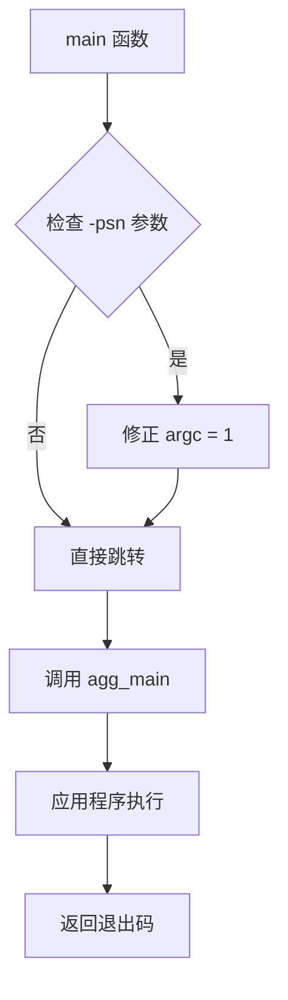

#### 带注释源码

```cpp
//----------------------------------------------------------------------------
// Anti-Grain Geometry - Version 2.4 
// Copyright (C) 2002-2005 Maxim Shemanarev (McSeem)
// ...
//----------------------------------------------------------------------------

// 此函数声明表示 AGG 应用程序的主入口点
// 具体实现由示例应用程序提供，不在本文件中
int agg_main(int argc, char* argv[]);


//----------------------------------------------------------------------------
// Hm. Classic MacOS does not know command line input.
// CodeWarrior provides a way to mimic command line input.
// The function 'ccommand' can be used to get the command
// line arguments.
//----------------------------------------------------------------------------

// 应用程序入口点 - 标准 C/C++ main 函数
int main(int argc, char* argv[])
{
#if defined(__MWERKS__)
    // CodeWarrior 特定：处理命令行输入
    // argc = ccommand (&argv);
#endif
    
    // 检查是否通过双击启动（Mac OS X 特定）
    // 这种情况下会有额外的 -psn 参数，需要移除否则会干扰参数解析
    if ( argc >= 2 && strncmp (argv[1], "-psn", 4) == 0 ) {
        argc = 1;  // 忽略 -psn 参数
    } 

launch:
    // 调用 AGG 应用程序主函数
    return agg_main(argc, argv);
}
```


### `get_key_flags`

将 MacOS 的修饰键状态（Shift/Control）转换为 AGG 的键盘标志位，用于在 MacOS 平台上处理键盘事件时识别用户按下的修饰键。

参数：

- `wflags`：`UInt32`，MacOS 系统的修饰键标志位，包含 shiftKey、controlKey 等状态

返回值：`unsigned`，AGG 定义的键盘修饰键标志位（kbd_shift、kbd_ctrl）

#### 流程图

```mermaid
flowchart TD
    A[开始: 接收 wflags] --> B{检查 wflags & shiftKey}
    B -->|是| C[flags |= kbd_shift]
    B -->|否| D{检查 wflags & controlKey}
    C --> D
    D -->|是| E[flags |= kbd_ctrl]
    D -->|否| F[返回 flags]
    E --> F
```

#### 带注释源码

```cpp
//------------------------------------------------------------------------
// 将 MacOS 修饰键标志转换为 AGG 键盘标志
// 参数: wflags - MacOS 系统的 UInt32 类型修饰键状态标志
// 返回: unsigned 类型的 AGG 键盘修饰键标志
//------------------------------------------------------------------------
static unsigned get_key_flags(UInt32 wflags)
{
    unsigned flags = 0;  // 初始化返回值为 0
    
    // 检查 MacOS 的 shiftKey 标志，若按下则设置 AGG 的 kbd_shift 标志
    if(wflags & shiftKey)   flags |= kbd_shift;
    
    // 检查 MacOS 的 controlKey 标志，若按下则设置 AGG 的 kbd_ctrl 标志
    if(wflags & controlKey) flags |= kbd_ctrl;

    // 返回转换后的 AGG 键盘修饰键标志
    return flags;
}
```


### `DoWindowClose`

处理窗口关闭事件，当用户点击窗口关闭按钮时触发，调用 Carbon 事件循环退出函数终止应用程序，并调用下一个事件处理器。

参数：

- `nextHandler`：`EventHandlerCallRef`，指向下一个事件处理程序的引用，用于事件链传递
- `theEvent`：`EventRef`，触发的事件引用，包含窗口关闭事件的相关信息
- `userData`：`void*`，用户数据指针，此处未使用

返回值：`OSStatus`，返回事件处理状态，通常为 noErr 表示成功

#### 流程图

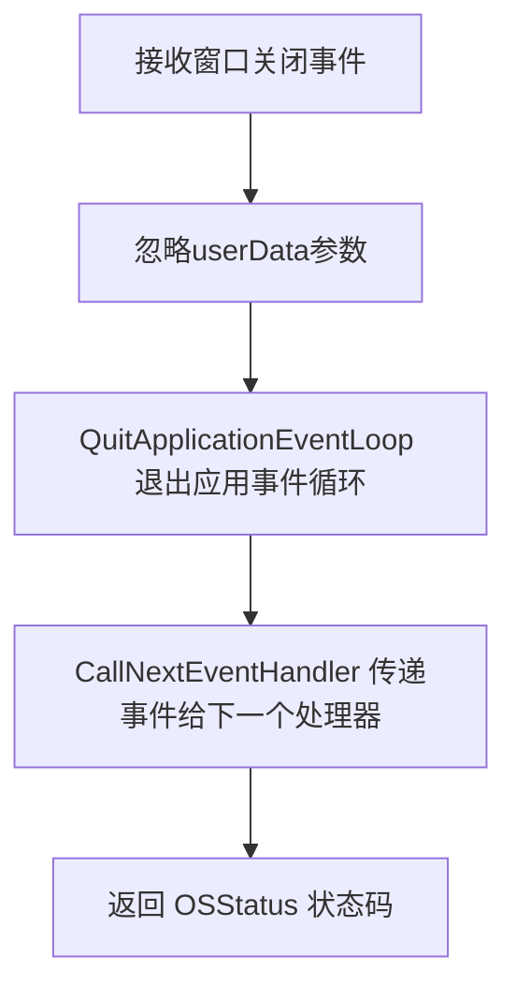

#### 带注释源码

```cpp
//------------------------------------------------------------------------
// 处理窗口关闭事件的事件处理函数
// 当用户点击窗口的关闭按钮时，Carbon 事件系统会调用此函数
//------------------------------------------------------------------------
pascal OSStatus DoWindowClose (EventHandlerCallRef nextHandler, EventRef theEvent, void* userData)
{
    // userData 参数保留以满足函数签名要求，实际未使用
    userData;
    
    // 调用 Carbon API 退出应用程序的事件循环
    // 这会终止 RunApplicationEventLoop() 的执行
    QuitApplicationEventLoop ();

    // 将事件传递给事件处理链中的下一个处理器
    // 这是 Carbon 事件处理的标准做法
    return CallNextEventHandler (nextHandler, theEvent);
}
```


### `DoAppQuit`

处理 Mac Carbon 应用程序退出请求的事件处理函数。当应用程序收到退出事件时，该函数被调用，它简单地调用 `CallNextEventHandler` 将事件传递给链中的下一个处理程序。

参数：

- `nextHandler`：`EventHandlerCallRef`，指向事件处理链中下一个处理程序的引用，用于构建处理程序链
- `theEvent`：`EventRef`，Carbon 事件引用，包含退出事件的相关信息
- `userData`：`void*`，用户数据指针，通常指向 `platform_support` 实例

返回值：`OSStatus`，返回调用下一个事件处理程序的结果，通常为 `noErr` 表示成功

#### 流程图

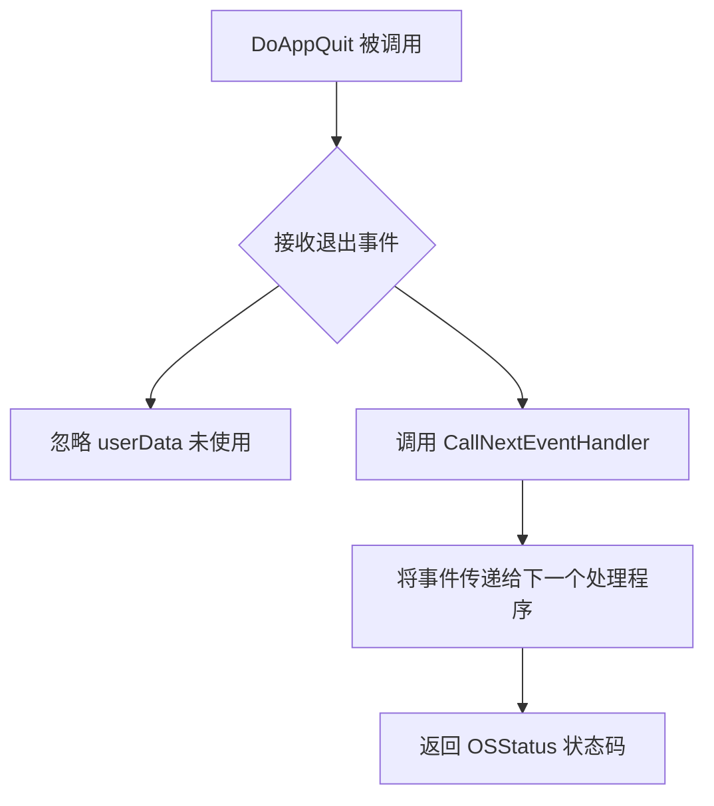

#### 带注释源码

```cpp
//------------------------------------------------------------------------
// Carbon 事件处理程序：DoAppQuit
// 处理应用程序退出事件（kEventAppQuit）
//------------------------------------------------------------------------
pascal OSStatus DoAppQuit (EventHandlerCallRef nextHandler, 
                           EventRef theEvent, 
                           void* userData)
{
    // 标记参数未使用，避免编译器警告
    // 在此处理程序中不需要使用 userData
	userData;
	
    // 调用事件处理链中的下一个处理程序
    // 这是 Carbon 事件处理的标准模式，允许建立处理程序链
	return CallNextEventHandler (nextHandler, theEvent);
}
```

#### 补充说明

该函数是 Anti-Grain Geometry (AGG) 库在 Mac Carbon 平台上的事件处理系统的一部分。在 `platform_support::init()` 方法中，该处理程序通过 `InstallApplicationEventHandler` 安装到应用程序事件队列中，专门监听 `kEventClassApplication` 类的 `kEventAppQuit` 事件。

当用户请求退出应用程序时（点击菜单栏的 Quit 或按下 Command+Q），Carbon 系统会触发退出事件，该处理程序被调用。由于 AGG 的架构设计，这个处理程序只是简单地传递事件给下一个处理者，允许应用程序的默认退出行为继续执行，最终会调用 `QuitApplicationEventLoop()` 来终止事件循环。


### `DoMouseDown`

处理鼠标按下事件，更新鼠标坐标和输入标志，处理控件的鼠标按下事件，若控件被点击则触发控制变更回调并强制重绘，否则传递给应用层的鼠标按钮按下回调。

参数：

- `nextHandler`：`EventHandlerCallRef`，Carbon事件处理链中的下一个处理器引用，用于事件链传递
- `theEvent`：`EventRef`，Carbon鼠标按下事件对象，包含鼠标位置和修饰键信息
- `userData`：`void*`，用户数据指针，在本场景中为`platform_support`类实例指针

返回值：`OSStatus`，返回Carbon事件处理状态，通常为`noErr`表示成功

#### 流程图

```mermaid
flowchart TD
    A[DoMouseDown 开始] --> B[获取鼠标位置参数]
    B --> C[将全局坐标转换为本地坐标]
    C --> D[获取键盘修饰键状态]
    D --> E[从userData获取platform_support实例]
    E --> F[更新m_cur_x为鼠标水平坐标]
    F --> G{flip_y为true?}
    G -->|是| H[计算m_cur_y = 窗口高度 - 鼠标垂直坐标]
    G -->|否| I[直接使用鼠标垂直坐标作为m_cur_y]
    H --> J
    I --> J
    J[设置m_input_flags = mouse_left | get_key_flags]
    J --> K[调用m_ctrls.set_cur设置当前控件]
    K --> L{m_ctrls.on_mouse_button_down返回true?}
    L -->|是| M[调用on_ctrl_change和force_redraw]
    L -->|否| N{m_ctrls.in_rect返回true?}
    N -->|是| O{m_ctrls.set_cur返回true?}
    O -->|是| P[调用on_ctrl_change和force_redraw]
    O -->|否| Q[调用on_mouse_button_down]
    N -->|否| R[调用on_mouse_button_down]
    M --> S[CallNextEventHandler返回]
    P --> S
    Q --> S
    R --> S
    S --> T[DoMouseDown 结束]
```

#### 带注释源码

```c
//------------------------------------------------------------------------
// DoMouseDown - 处理鼠标按下事件
// 参数:
//   nextHandler - 事件处理链中的下一个处理器
//   theEvent    - Carbon鼠标事件引用
//   userData    - platform_support实例指针
// 返回值: OSStatus - 事件处理状态
//------------------------------------------------------------------------
pascal OSStatus DoMouseDown (EventHandlerCallRef nextHandler, 
                              EventRef theEvent, 
                              void* userData)
{
	// 声明本地变量存储鼠标位置和修饰键状态
	Point wheresMyMouse;      // 鼠标位置（QD坐标）
	UInt32 modifier;          // 键盘修饰键状态
	
	// 从事件中获取鼠标位置参数
	GetEventParameter (theEvent, 
	                   kEventParamMouseLocation,  // 参数：鼠标位置
	                   typeQDPoint,               // 类型：QuickDraw点
	                   NULL, 
	                   sizeof(Point), 
	                   NULL, 
	                   &wheresMyMouse);
	
	// 将全局屏幕坐标转换为窗口本地坐标
	GlobalToLocal (&wheresMyMouse);
	
	// 获取键盘修饰键状态（Shift、Control等）
	GetEventParameter (theEvent, 
	                   kEventParamKeyModifiers,   // 参数：修饰键
	                   typeUInt32, 
	                   NULL, 
	                   sizeof(UInt32), 
	                   NULL, 
	                   &modifier);

    // 将userData转换为platform_support指针
    platform_support * app = reinterpret_cast<platform_support*>(userData);

    // 更新当前鼠标X坐标（水平位置）
    app->m_specific->m_cur_x = wheresMyMouse.h;
    
    // 根据flip_y设置计算Y坐标
    if(app->flip_y())
    {
        // 如果需要翻转Y轴（通常是坐标原点在左下角的情况）
        // 计算方式：窗口高度 - 鼠标垂直坐标
        app->m_specific->m_cur_y = app->rbuf_window().height() - wheresMyMouse.v;
    }
    else
    {
        // 直接使用原始垂直坐标
        app->m_specific->m_cur_y = wheresMyMouse.v;
    }
    
    // 设置输入标志：左键按下 + 修饰键状态
    app->m_specific->m_input_flags = mouse_left | get_key_flags(modifier);
    
    // 尝试设置当前控件为鼠标位置处的控件
    app->m_ctrls.set_cur(app->m_specific->m_cur_x, 
                         app->m_specific->m_cur_y);
    
    // 检查是否有控件处理了鼠标按下事件
    if(app->m_ctrls.on_mouse_button_down(app->m_specific->m_cur_x, 
                                         app->m_specific->m_cur_y))
    {
        // 控件处理了事件，触发控制变更回调
        app->on_ctrl_change();
        // 强制重绘界面
        app->force_redraw();
    }
    else
    {
        // 没有控件处理，检查鼠标是否在某个控件矩形内
        if(app->m_ctrls.in_rect(app->m_specific->m_cur_x, 
                                app->m_specific->m_cur_y))
        {
            // 鼠标在控件矩形内，尝试设置当前控件
            if(app->m_ctrls.set_cur(app->m_specific->m_cur_x, 
                                    app->m_specific->m_cur_y))
            {
                // 控件状态改变，触发回调和重绘
                app->on_ctrl_change();
                app->force_redraw();
            }
        }
        else
        {
            // 鼠标不在任何控件内，调用应用层的鼠标按下处理
            app->on_mouse_button_down(app->m_specific->m_cur_x, 
                                      app->m_specific->m_cur_y, 
                                      app->m_specific->m_input_flags);
        }
    }

	// 调用事件处理链中的下一个处理器
	return CallNextEventHandler (nextHandler, theEvent);
}
```


### `DoMouseUp`

处理鼠标抬起事件的回调函数，负责更新鼠标坐标、处理控件状态并触发相应的回调。

参数：

- `nextHandler`：`EventHandlerCallRef`，传递给事件链中下一个处理器的引用
- `theEvent`：`EventRef`，包含鼠标抬起事件的 Carbon 事件对象
- `userData`：`void*`，用户数据指针，此处为 `platform_support` 实例的指针

返回值：`OSStatus`，返回调用下一个事件处理器的结果，通常为 `noErr` 表示成功

#### 流程图

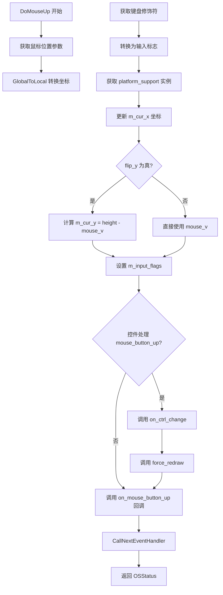

#### 带注释源码

```cpp
//------------------------------------------------------------------------
// 处理鼠标抬起事件
//------------------------------------------------------------------------
pascal OSStatus DoMouseUp (EventHandlerCallRef nextHandler, EventRef theEvent, void* userData)
{
	// 声明局部变量存储鼠标位置和修饰符状态
	Point wheresMyMouse;      // 鼠标位置的 QD 点结构
	UInt32 modifier;          // 键盘修饰符状态位
	
	// 从事件中获取鼠标位置参数
	GetEventParameter (theEvent, kEventParamMouseLocation, typeQDPoint, NULL, sizeof(Point), NULL, &wheresMyMouse);
	// 将全局坐标转换为本地窗口坐标
	GlobalToLocal (&wheresMyMouse);
	// 获取键盘修饰符（Shift、Control 等）
	GetEventParameter (theEvent, kEventParamKeyModifiers, typeUInt32, NULL, sizeof(UInt32), NULL, &modifier);

    // 将 userData 转换为 platform_support 指针
    platform_support * app = reinterpret_cast<platform_support*>(userData);

    // 更新当前鼠标 X 坐标
    app->m_specific->m_cur_x = wheresMyMouse.h;
    // 根据 flip_y 设置计算 Y 坐标（处理翻转）
    if(app->flip_y())
    {
        // 翻转 Y 坐标：窗口高度减去鼠标 Y 位置
        app->m_specific->m_cur_y = app->rbuf_window().height() - wheresMyMouse.v;
    }
    else
    {
        // 直接使用原始 Y 坐标
        app->m_specific->m_cur_y = wheresMyMouse.v;
    }
    // 设置输入标志：左键 + 修饰键状态
    app->m_specific->m_input_flags = mouse_left | get_key_flags(modifier);

    // 检查控件是否处理了鼠标抬起事件
    if(app->m_ctrls.on_mouse_button_up(app->m_specific->m_cur_x, 
                                       app->m_specific->m_cur_y))
    {
        // 控件状态发生变化，触发回调和重绘
        app->on_ctrl_change();
        app->force_redraw();
    }
    // 触发应用程序的鼠标抬起回调（无论控件是否处理）
    app->on_mouse_button_up(app->m_specific->m_cur_x, 
                            app->m_specific->m_cur_y, 
                            app->m_specific->m_input_flags);

	// 调用下一个事件处理器，形成事件处理链
	return CallNextEventHandler (nextHandler, theEvent);
}
```


### `DoMouseDragged`

处理鼠标拖拽事件，更新当前鼠标坐标，处理控件的鼠标移动事件或触发应用的鼠标移动回调。

参数：

- `nextHandler`：`EventHandlerCallRef`，Carbon事件处理链中的下一个处理器
- `theEvent`：`EventRef`，Carbon鼠标拖拽事件对象
- `userData`：`void*`，用户数据指针（实际为`platform_support*`）

返回值：`OSStatus`，Mac OS状态码，返回`CallNextEventHandler`的调用结果

#### 流程图

```mermaid
flowchart TD
    A[DoMouseDragged 开始] --> B[从事件中获取鼠标位置]
    B --> C[获取键盘修饰键状态]
    C --> D[将 userData 转换为 platform_support 指针]
    D --> E[更新 m_cur_x 为鼠标水平坐标]
    E --> F{flip_y 为 true?}
    F -->|是| G[计算 m_cur_y = 窗口高度 - 鼠标垂直坐标]
    F -->|否| H[m_cur_y = 鼠标垂直坐标]
    G --> I
    H --> I
    I[设置 m_input_flags = mouse_left | get_key_flags(modifier)]
    I --> J{控件处理鼠标移动?}
    J -->|是| K[触发 on_ctrl_change]
    K --> L[触发 force_redraw 重绘]
    J -->|否| M[触发 on_mouse_move 应用回调]
    L --> N[调用 CallNextEventHandler]
    M --> N
    N --> O[返回 OSStatus]
```

#### 带注释源码

```cpp
//------------------------------------------------------------------------
// 处理鼠标拖拽事件的回调函数
// 当用户在窗口内拖拽鼠标时调用此函数
//------------------------------------------------------------------------
pascal OSStatus DoMouseDragged (EventHandlerCallRef nextHandler, EventRef theEvent, void* userData)
{
	// 定义鼠标位置和修饰键变量
	Point wheresMyMouse;
	UInt32 modifier;
	
	// 从事件中获取鼠标的全局位置
	GetEventParameter (theEvent, kEventParamMouseLocation, typeQDPoint, NULL, sizeof(Point), NULL, &wheresMyMouse);
	// 将全局坐标转换为窗口本地坐标
	GlobalToLocal (&wheresMyMouse);
	// 获取键盘修饰键状态（Shift、Ctrl等）
	GetEventParameter (theEvent, kEventParamKeyModifiers, typeUInt32, NULL, sizeof(UInt32), NULL, &modifier);

    // 将用户数据转换为平台支持对象指针
    platform_support * app = reinterpret_cast<platform_support*>(userData);

    // 更新当前鼠标X坐标（水平位置）
    app->m_specific->m_cur_x = wheresMyMouse.h;
    
    // 根据flip_y设置计算Y坐标
    if(app->flip_y())
    {
        // 如果需要翻转Y轴（通常用于将坐标系调整为左下角为原点）
        app->m_specific->m_cur_y = app->rbuf_window().height() - wheresMyMouse.v;
    }
    else
    {
        // 保持原坐标系不变
        app->m_specific->m_cur_y = wheresMyMouse.v;
    }
    
    // 设置输入标志：左键按下 + 键盘修饰键状态
    app->m_specific->m_input_flags = mouse_left | get_key_flags(modifier);

    // 尝试让控件处理鼠标移动事件
    if(app->m_ctrls.on_mouse_move(
        app->m_specific->m_cur_x, 
        app->m_specific->m_cur_y,
        // 检查左键是否按下（用于判断是否为拖拽操作）
        (app->m_specific->m_input_flags & mouse_left) != 0))
    {
        // 如果控件处理了该事件，触发控件变化回调
        app->on_ctrl_change();
        // 强制重绘窗口以显示控件更新
        app->force_redraw();
    }
    else
    {
        // 如果控件未处理，调用应用的鼠标移动回调
        app->on_mouse_move(app->m_specific->m_cur_x, 
                           app->m_specific->m_cur_y, 
                           app->m_specific->m_input_flags);
    }

	// 调用事件处理链中的下一个处理器
	return CallNextEventHandler (nextHandler, theEvent);
}
```


### `DoKeyDown`

处理键盘按下事件，解析修饰键状态，翻译键码，触发方向键或功能键逻辑，并将键盘事件分发给平台支持层。

参数：

- `nextHandler`：`EventHandlerCallRef`，指向事件处理链中下一个处理程序的引用
- `theEvent`：`EventRef`，Carbon事件引用，包含键盘事件的相关参数
- `userData`：`void*`，用户数据指针，此处为`platform_support`对象的指针

返回值：`OSStatus`，返回`CallNextEventHandler`的返回值，表示事件处理状态

#### 流程图

```mermaid
flowchart TD
    A[开始 DoKeyDown] --> B[从事件中获取key_code和modifier]
    B --> C[将userData转换为platform_support指针]
    C --> D[重置m_last_translated_key为0]
    D --> E{modifier == controlKey?}
    E -->|是| F[设置m_input_flags |= kbd_ctrl]
    E -->|否| G{modifier == shiftKey?}
    G -->|是| H[设置m_input_flags |= kbd_shift]
    G -->|否| I[调用translate转换key_code]
    F --> J
    H --> J
    I --> J
    J{m_last_translated_key != 0?}
    J -->|否| K[调用CallNextEventHandler返回]
    J -->|是| L{翻译后的键值}
    L -->|key_left| M[left = true]
    L -->|key_up| N[up = true]
    L -->|key_right| O[right = true]
    L -->|key_down| P[down = true]
    L -->|key_f2| Q[截图保存到screenshot]
    M --> R{on_arrow_keys处理?}
    N --> R
    O --> R
    P --> R
    Q --> R
    R -->|true| S[调用on_ctrl_change和force_redraw]
    R -->|false| T[调用on_key回调]
    S --> K
    T --> K
```

#### 带注释源码

```cpp
//------------------------------------------------------------------------
// 处理键盘按下事件
//------------------------------------------------------------------------
pascal OSStatus DoKeyDown (EventHandlerCallRef nextHandler, EventRef theEvent, void* userData)
{
    // 定义变量存储键码和修饰键状态
	char key_code;          // 键盘字符码
	UInt32 modifier;        // 修饰键状态（control、shift等）
	
    // 从事件参数中获取键盘字符码
	GetEventParameter (theEvent, kEventParamKeyMacCharCodes, typeChar, NULL, sizeof(char), NULL, &key_code);
    // 从事件参数中获取修饰键状态
	GetEventParameter (theEvent, kEventParamKeyModifiers, typeUInt32, NULL, sizeof(UInt32), NULL, &modifier);

    // 将userData转换为platform_support指针
	platform_support * app = reinterpret_cast<platform_support*>(userData);

    // 重置最后翻译的键值为0
	app->m_specific->m_last_translated_key = 0;
    
    // 根据修饰键类型设置输入标志
    switch(modifier) 
    {
        case controlKey:           // Ctrl键被按下
            app->m_specific->m_input_flags |= kbd_ctrl;   // 设置Ctrl标志
            break;

        case shiftKey:             // Shift键被按下
            app->m_specific->m_input_flags |= kbd_shift; // 设置Shift标志
            break;

        default:                   // 其他修饰键组合，翻译键码
            app->m_specific->translate(key_code);         // 将Mac键码转换为AGG键码
            break;
    }

    // 检查是否有有效的翻译键值
    if(app->m_specific->m_last_translated_key)
    {
        // 初始化方向标志
        bool left  = false;
        bool up    = false;
        bool right = false;
        bool down  = false;

        // 根据翻译后的键值设置对应的方向标志
        switch(app->m_specific->m_last_translated_key)
        {
        case key_left:             // 左箭头键
            left = true;
            break;

        case key_up:               // 上箭头键
            up = true;
            break;

        case key_right:            // 右箭头键
            right = true;
            break;

        case key_down:             // 下箭头键
            down = true;
            break;

        // Mac系统下截图由系统处理
        case key_f2:               // F2键 - 截图功能
            app->copy_window_to_img(agg::platform_support::max_images - 1);  // 复制窗口到图像缓冲区
            app->save_img(agg::platform_support::max_images - 1, "screenshot"); // 保存为screenshot文件
            break;
        }

        // 尝试让控件处理方向键
        if(app->m_ctrls.on_arrow_keys(left, right, down, up))
        {
            // 控件处理了方向键，触发控制变化和重绘
            app->on_ctrl_change();
            app->force_redraw();
        }
        else
        {
            // 控件未处理，调用虚拟on_key回调处理键盘事件
            app->on_key(app->m_specific->m_cur_x,
                        app->m_specific->m_cur_y,
                        app->m_specific->m_last_translated_key,
                        app->m_specific->m_input_flags);
        }
    }

    // 调用下一个事件处理器并返回状态
	return CallNextEventHandler (nextHandler, theEvent);
}
```


### `DoKeyUp`

处理键盘按键抬起事件，清除修饰键（Ctrl、Shift）的状态标志。

参数：

- `nextHandler`：`EventHandlerCallRef`，Carbon事件处理链中的下一个处理程序引用
- `theEvent`：`EventRef`，Carbon事件引用，包含键盘事件的详细信息
- `userData`：`void*`，用户数据指针，此处指向 `platform_support` 实例

返回值：`OSStatus`，返回调用下一个事件处理程序的结果，通常为 `noErr` 表示成功

#### 流程图

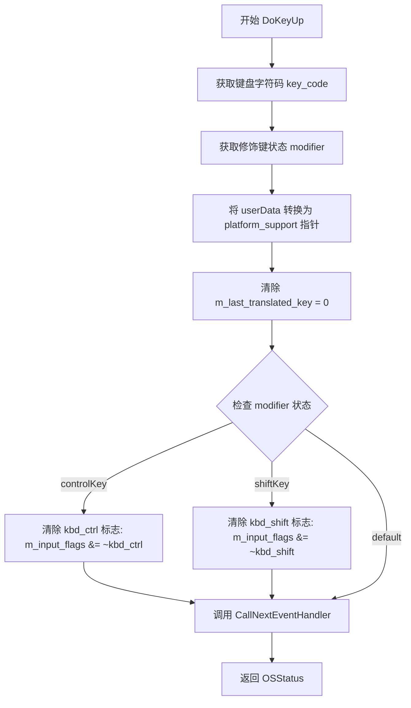

#### 带注释源码

```cpp
//------------------------------------------------------------------------
// 处理键盘按键抬起事件的Carbon事件处理程序
// 当用户释放键盘按键时调用此函数，清除相应的修饰键状态
//------------------------------------------------------------------------
pascal OSStatus DoKeyUp (EventHandlerCallRef nextHandler, EventRef theEvent, void* userData)
{
	// 存储键盘字符码
	char key_code;
	// 存储修饰键状态（Shift、Control、Option等）
	UInt32 modifier;
	
	// 从事件中获取键盘字符码
	GetEventParameter (theEvent, kEventParamKeyMacCharCodes, typeChar, NULL, sizeof(char), NULL, &key_code);
	// 从事件中获取修饰键状态
	GetEventParameter (theEvent, kEventParamKeyModifiers, typeUInt32, NULL, sizeof(UInt32), NULL, &modifier);

	// 将 userData 转换为 platform_support 指针以访问应用程序状态
	platform_support * app = reinterpret_cast<platform_support*>(userData);

    // 重置最后翻译的键值为0，表示没有正在按下的键
    app->m_specific->m_last_translated_key = 0;
    
    // 根据释放的修饰键清除相应的状态标志
    switch(modifier) 
    {
        case controlKey:
            // 清除 Ctrl 修饰键标志
            app->m_specific->m_input_flags &= ~kbd_ctrl;
            break;

        case shiftKey:
            // 清除 Shift 修饰键标志
            app->m_specific->m_input_flags &= ~kbd_shift;
            break;
    }
    
	// 调用事件处理链中的下一个处理程序
	return CallNextEventHandler (nextHandler, theEvent);
}
```


### `DoWindowDrawContent`

处理窗口内容绘制请求的 Carbon 事件回调函数。当窗口需要重绘时调用，首先检查是否需要重绘标记，如果是则调用 `on_draw()` 执行实际的绘制逻辑，然后调用 `display_pmap` 将渲染缓冲区内容显示到窗口上。

参数：

- `nextHandler`：`EventHandlerCallRef`，指向下一个事件处理程序的引用，用于事件链传递
- `theEvent`：`EventRef`，Carbon 事件引用，包含触发此回调的事件信息
- `userData`：`void*`，用户数据指针，在此上下文中为 `platform_support` 类实例的指针

返回值：`OSStatus`，返回 Carbon 事件处理状态，通常返回 `CallNextEventHandler` 的结果表示事件是否被成功处理

#### 流程图

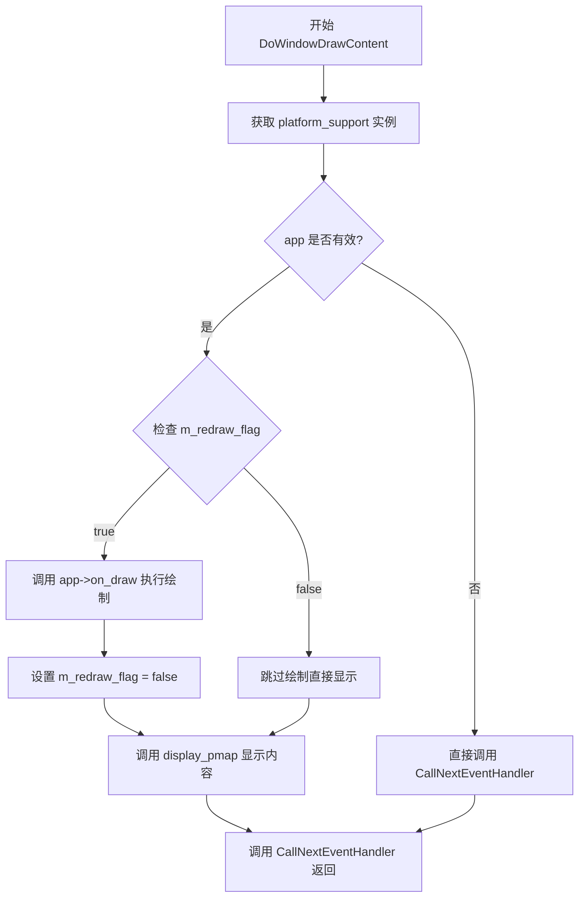

#### 带注释源码

```cpp
//------------------------------------------------------------------------
// 处理窗口绘制内容事件的回调函数
// 当 Mac OS 窗口需要重绘时由 Carbon 事件系统调用
//------------------------------------------------------------------------
pascal OSStatus DoWindowDrawContent (EventHandlerCallRef nextHandler, EventRef theEvent, void* userData)
{
    // 将 userData 转换为 platform_support 指针
    // userData 在事件安装时传入的 this 指针
    platform_support * app = reinterpret_cast<platform_support*>(userData);

    // 检查 platform_support 实例是否有效
    if(app)
    {
        // 检查是否需要重绘标记
        // 该标记在 force_redraw() 或 on_resize() 时被设置为 true
        if(app->m_specific->m_redraw_flag)
        {
            // 调用用户的绘制回调函数
            // 这是应用程序实际执行图形渲染的地方
            app->on_draw();
            
            // 重绘完成后清除标记，避免重复绘制
            app->m_specific->m_redraw_flag = false;
        }
        
        // 将渲染缓冲区中的内容显示到窗口上
        // display_pmap 会处理颜色格式转换和窗口绘制
        app->m_specific->display_pmap(app->m_specific->m_window, &app->rbuf_window());
    }

    // 调用事件链中的下一个处理程序
    // 这是 Carbon 事件处理的标准模式
	return CallNextEventHandler (nextHandler, theEvent);
}
```


### `DoPeriodicTask`

这是一个 Carbon 事件循环（Event Loop）的定时器回调函数。当应用处于“非等待模式”（`wait_mode` 为 false）时，此定时器会周期性触发，并调用 `platform_support` 对象的 `on_idle()` 方法。这通常用于驱动连续渲染循环或执行后台任务，而不会阻塞 Mac OS 的主事件循环。

参数：

- `theTimer`：`EventLoopTimerRef`，Carbon 事件循环定时器的引用，当前函数体内未使用，但这是定时器回调的标配参数。
- `userData`：`void*`，用户数据指针。在本库中，它通常指向 `platform_support` 对象的实例（`this` 指针），用于访问应用的运行时状态。

返回值：`void`，无返回值。

#### 流程图

```mermaid
flowchart TD
    A([定时器触发]) --> B{app->wait_mode() == false?}
    B -- 是 --> C[调用 app->on_idle]
    B -- 否 --> D([直接返回])
    C --> D
```

#### 带注释源码

```cpp
//----------------------------------------------------------------------------
// 定时器回调函数 (DoPeriodicTask)
// 用于在非等待模式下模拟 on_idle 调用
//----------------------------------------------------------------------------
// 参数:
//   theTimer - 指向 EventLoopTimerRef 的引用，当前未使用
//   userData - 指向 platform_support 实例的指针
//----------------------------------------------------------------------------
pascal void DoPeriodicTask (EventLoopTimerRef theTimer, void* userData)
{
    // -------------------------------------------------
    // 1. 获取应用实例
    // userData 是初始化定时器时传入的 platform_support 指针
    // -------------------------------------------------
    platform_support * app = reinterpret_cast<platform_support*>(userData);
    
    // -------------------------------------------------
    // 2. 检查运行模式
    // 如果不是等待模式(wait_mode为false)，则执行空闲任务
    // wait_mode 默认为 true，表示等待事件；设为 false 用于动画循环
    // -------------------------------------------------
    if(!app->wait_mode())
    {
        // 调用用户的空闲处理逻辑（例如重绘画面）
        app->on_idle();
    }
}
```


### `platform_specific::platform_specific` (构造函数)

该函数是 `platform_specific` 类的构造函数，负责初始化平台支持层的基本状态。它接收像素格式和Y轴翻转标志，初始化键位映射表，确定系统支持的像素格式和位深度，并启动高精度计时器。

参数：

-  `format`：`pix_format_e`，应用程序请求的像素格式（如 RGB24, RGBA32 等）。
-  `flip_y`：`bool`，是否翻转Y轴坐标（用于匹配不同坐标系的绘图需求）。

返回值：`void`（构造函数无返回值）

#### 流程图

```mermaid
graph TD
    A([构造函数入口]) --> B[初始化列表: 设置 m_format, m_flip_y, 零值初始化]
    B --> C[函数体: memset 清空 m_keymap 数组]
    C --> D[填充键位映射: 映射 MacOS 按键码 (方向键, Home, Delete 等)]
    D --> E{判断 m_format 类型}
    E -->|Gray8| F[设置系统格式为 Gray8, BPP=8]
    E -->|RGB565/555| G[设置系统格式为 RGB555, BPP=16]
    E -->|RGB24/BGR24| H[设置系统格式为 RGB24, BPP=24]
    E -->|BGRA32/ABGR32/ARGB32/RGBA32| I[设置系统格式为 ARGB32, BPP=32]
    F --> J[调用 ::Microseconds 初始化计时器]
    G --> J
    H --> J
    I --> J
    J --> K([构造函数结束])
```

#### 带注释源码

```cpp
//------------------------------------------------------------------------
platform_specific::platform_specific(pix_format_e format, bool flip_y) :
   	m_format(format),              // 保存应用请求的像素格式
    m_sys_format(pix_format_undefined), // 初始化为未定义，稍后在 switch 中覆盖
    m_flip_y(flip_y),               // 保存 Y 轴翻转标志
    m_bpp(0),                       // 应用位深，初始 0
    m_sys_bpp(0),                  // 系统位深，初始 0
    m_window(nil),                 // 窗口引用，初始为空
    m_last_translated_key(0),      // 上次转换的键值
    m_cur_x(0),                    // 鼠标 X 坐标
    m_cur_y(0),                    // 鼠标 Y 坐标
    m_input_flags(0),              // 输入状态标志
    m_redraw_flag(true)            // 标记需要重绘
{
    // 1. 初始化键位映射表，将 MacOS 虚拟键码映射到 AGG 的键枚举
    memset(m_keymap, 0, sizeof(m_keymap));

    // 键盘映射部分 (注意：文档说明键盘输入尚未完全支持或测试)
    m_keymap[kClearCharCode]      = key_clear;

    // 方向键映射
    m_keymap[kUpArrowCharCode]    = key_up;
    m_keymap[kDownArrowCharCode]  = key_down;
    m_keymap[kRightArrowCharCode] = key_right;
    m_keymap[kLeftArrowCharCode]  = key_left;

    // 功能键映射
    m_keymap[kDeleteCharCode]     = key_delete;
    m_keymap[kHomeCharCode]       = key_home;
    m_keymap[kEndCharCode]        = key_end;
    m_keymap[kPageUpCharCode]     = key_page_up;
    m_keymap[kPageDownCharCode]   = key_page_down;

    // 2. 确定系统支持的像素格式和位深度 (BPP)
    // MacOS Carbon 接口可能不支持所有 AGG 格式，需要映射到最近的兼容格式
    switch(m_format)
    {
    case pix_format_gray8:
        m_sys_format = pix_format_gray8;
        m_bpp = 8;
        m_sys_bpp = 8;
        break;

    case pix_format_rgb565:
    case pix_format_rgb555:
        m_sys_format = pix_format_rgb555; // 映射到 RGB555
        m_bpp = 16;
        m_sys_bpp = 16;
        break;

    case pix_format_rgb24:
    case pix_format_bgr24:
        m_sys_format = pix_format_rgb24;
        m_bpp = 24;
        m_sys_bpp = 24;
        break;

    case pix_format_bgra32:
    case pix_format_abgr32:
    case pix_format_argb32:
    case pix_format_rgba32:
        m_sys_format = pix_format_argb32; // 统一映射到 ARGB32
        m_bpp = 32;
        m_sys_bpp = 32;
        break;
    }
    
    // 3. 初始化高精度计时器，获取频率和起始时间
    ::Microseconds(&m_sw_freq);
    ::Microseconds(&m_sw_start);
}
```


### `platform_specific.create_pmap`

创建指定大小的像素映射（pixel map）并绑定到渲染缓冲区，用于窗口的图形渲染。

参数：

- `width`：`unsigned`，像素映射的宽度
- `height`：`unsigned`，像素映射的高度
- `wnd`：`rendering_buffer*`，指向渲染缓冲区的指针，用于附加创建的像素映射

返回值：`void`，无返回值

#### 流程图

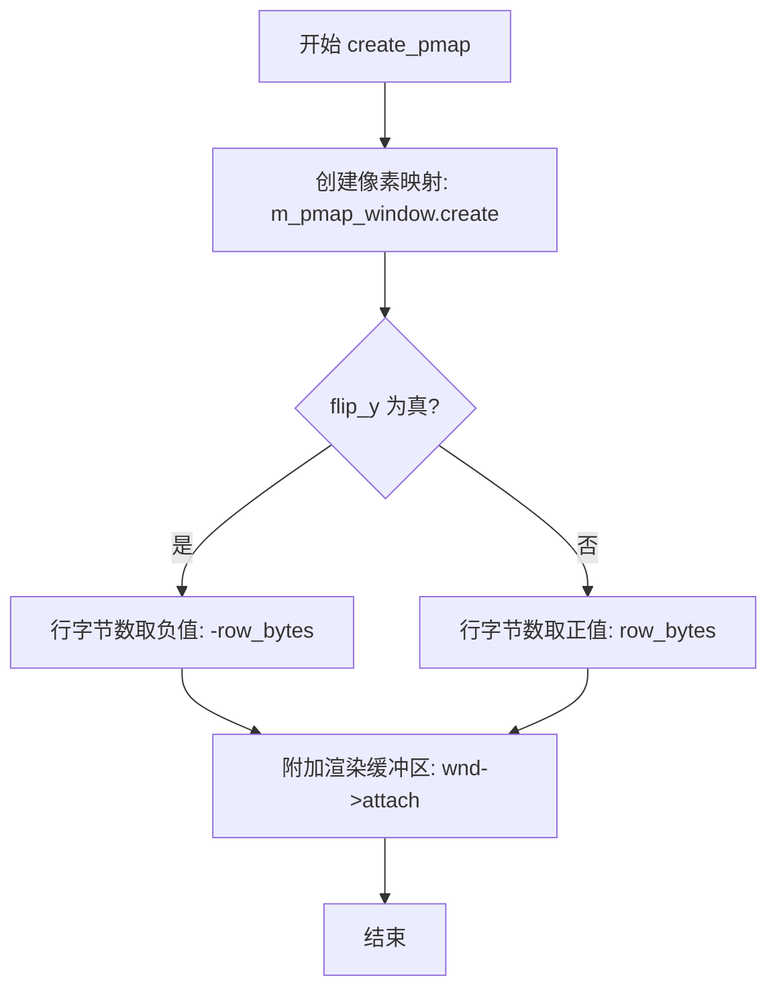

#### 带注释源码

```cpp
//------------------------------------------------------------------------
// 创建像素映射并绑定到渲染缓冲区
//------------------------------------------------------------------------
void platform_specific::create_pmap(unsigned width, 
                                    unsigned height,
                                    rendering_buffer* wnd)
{
    // 使用指定的宽度、高度和像素格式创建窗口像素映射
    // org_e(m_bpp) 将位深度转换为像素格式枚举
    m_pmap_window.create(width, height, org_e(m_bpp));
    
    // 将渲染缓冲区附加到创建的像素映射
    // 参数依次为：像素数据指针、宽度、高度、行字节数
    // 根据 flip_y 标志决定是否翻转 Y 轴坐标
    wnd->attach(m_pmap_window.buf(), 
                m_pmap_window.width(),
                m_pmap_window.height(),
                  m_flip_y ?
                 -m_pmap_window.row_bytes() :  // 翻转Y轴（向下为正）
                  m_pmap_window.row_bytes());   // 正常Y轴（向上为正）
}
```


### `platform_specific.display_pmap`

该函数将渲染缓冲区的内容绘制到Mac窗口，若渲染缓冲区像素格式与系统格式不匹配，则创建临时像素映射进行颜色转换后绘制。

参数：

- `window`：`WindowRef`，Mac窗口引用，指定绘制目标窗口
- `src`：`const rendering_buffer*`，源渲染缓冲区，包含待绘制的像素数据

返回值：`void`，无返回值

#### 流程图

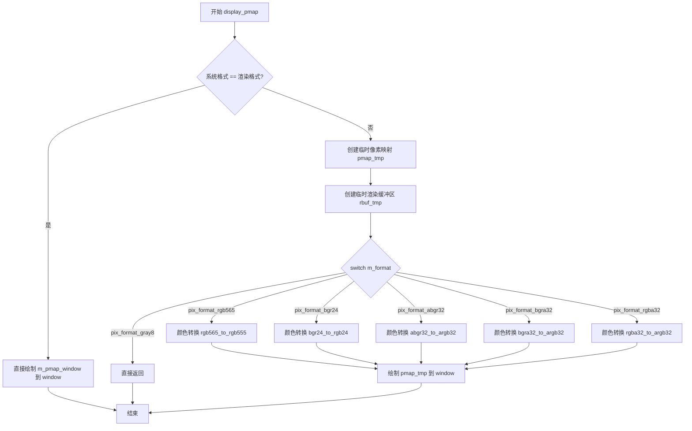

#### 带注释源码

```cpp
//------------------------------------------------------------------------
// 将渲染缓冲区内容绘制到窗口
// 若格式不匹配则进行颜色转换
//------------------------------------------------------------------------
void platform_specific::display_pmap(WindowRef window, const rendering_buffer* src)
{
    // 判断系统像素格式与渲染缓冲区格式是否一致
    if(m_sys_format == m_format)
    {
        // 格式匹配，直接绘制内部像素映射到窗口
        m_pmap_window.draw(window);
    }
    else
    {
        // 格式不匹配，需要进行颜色转换
        // 创建临时像素映射，使用系统支持的格式
        pixel_map pmap_tmp;
        pmap_tmp.create(m_pmap_window.width(), 
                        m_pmap_window.height(),
                        org_e(m_sys_bpp));

        // 创建临时渲染缓冲区关联到临时像素映射
        rendering_buffer rbuf_tmp;
        rbuf_tmp.attach(pmap_tmp.buf(),
                        pmap_tmp.width(),
                        pmap_tmp.height(),
                        m_flip_y ?
                         -pmap_tmp.row_bytes() :
                          pmap_tmp.row_bytes());

        // 根据源格式选择合适的颜色转换器
        switch(m_format)
        {
        case pix_format_gray8:
            // 灰度格式暂不支持转换，直接返回
            return;

        case pix_format_rgb565:
            // RGB565转RGB555
            color_conv(&rbuf_tmp, src, color_conv_rgb565_to_rgb555());
            break;

        case pix_format_bgr24:
            // BGR24转RGB24
            color_conv(&rbuf_tmp, src, color_conv_bgr24_to_rgb24());
            break;

        case pix_format_abgr32:
            // ABGR32转ARGB32
            color_conv(&rbuf_tmp, src, color_conv_abgr32_to_argb32());
            break;

        case pix_format_bgra32:
            // BGRA32转ARGB32
            color_conv(&rbuf_tmp, src, color_conv_bgra32_to_argb32());
            break;

        case pix_format_rgba32:
            // RGBA32转ARGB32
            color_conv(&rbuf_tmp, src, color_conv_rgba32_to_argb32());
            break;
        }
        // 绘制转换后的临时像素映射到窗口
        pmap_tmp.draw(window);
    }
}
```


### platform_specific.load_pmap

从文件加载图像并转换为目标像素格式

参数：
- `fn`：`const char*`，文件名
- `idx`：`unsigned`，图像索引
- `dst`：`rendering_buffer*`，目标渲染缓冲区

返回值：`bool`，成功返回 true，失败返回 false

#### 流程图

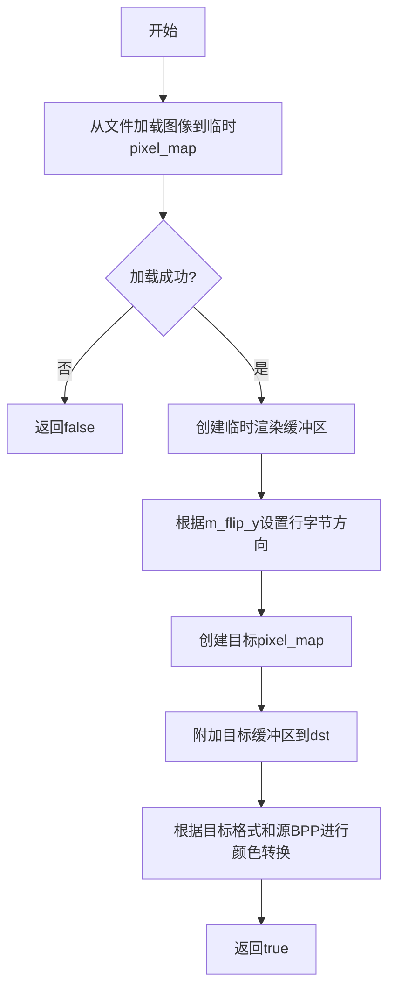

#### 带注释源码

```cpp
    bool platform_specific::load_pmap(const char* fn, unsigned idx, 
                                      rendering_buffer* dst)
    {
        // 创建临时像素映射以加载文件
        pixel_map pmap_tmp;
        // 从QuickTime格式加载图像
        if(!pmap_tmp.load_from_qt(fn)) return false;

        // 创建临时渲染缓冲区
        rendering_buffer rbuf_tmp;
        // 附加临时像素映射的缓冲区，根据flip_y设置行字节
        rbuf_tmp.attach(pmap_tmp.buf(),
                        pmap_tmp.width(),
                        pmap_tmp.height(),
                        m_flip_y ?
                         -pmap_tmp.row_bytes() :
                          pmap_tmp.row_bytes());

        // 使用目标格式创建图像像素映射
        m_pmap_img[idx].create(pmap_tmp.width(), 
                               pmap_tmp.height(), 
                               org_e(m_bpp),
                               0);

        // 附加目标像素映射的缓冲区到输出渲染缓冲区
        dst->attach(m_pmap_img[idx].buf(),
                    m_pmap_img[idx].width(),
                    m_pmap_img[idx].height(),
                    m_flip_y ?
                      -m_pmap_img[idx].row_bytes() :
                       m_pmap_img[idx].row_bytes());

        // 根据目标像素格式和源图像BPP进行颜色转换
        switch(m_format)
        {
        case pix_format_gray8:
            return false;
            break;

        case pix_format_rgb555:
            switch(pmap_tmp.bpp())
            {
            case 16: color_conv(dst, &rbuf_tmp, color_conv_rgb555_to_rgb555()); break;
            case 24: color_conv(dst, &rbuf_tmp, color_conv_rgb24_to_rgb555()); break;
            case 32: color_conv(dst, &rbuf_tmp, color_conv_argb32_to_rgb555()); break;
            }
            break;

        case pix_format_rgb565:
            switch(pmap_tmp.bpp())
            {
            case 16: color_conv(dst, &rbuf_tmp, color_conv_rgb555_to_rgb565()); break;
            case 24: color_conv(dst, &rbuf_tmp, color_conv_rgb24_to_rgb565()); break;
            case 32: color_conv(dst, &rbuf_tmp, color_conv_argb32_to_rgb565()); break;
            }
            break;

        case pix_format_rgb24:
            switch(pmap_tmp.bpp())
            {
            case 16: color_conv(dst, &rbuf_tmp, color_conv_rgb555_to_rgb24()); break;
            case 24: color_conv(dst, &rbuf_tmp, color_conv_rgb24_to_rgb24()); break;
            case 32: color_conv(dst, &rbuf_tmp, color_conv_argb32_to_rgb24()); break;
            }
            break;

        case pix_format_bgr24:
            switch(pmap_tmp.bpp())
            {
            case 16: color_conv(dst, &rbuf_tmp, color_conv_rgb555_to_bgr24()); break;
            case 24: color_conv(dst, &rbuf_tmp, color_conv_rgb24_to_bgr24()); break;
            case 32: color_conv(dst, &rbuf_tmp, color_conv_argb32_to_bgr24()); break;
            }
            break;

        case pix_format_abgr32:
            switch(pmap_tmp.bpp())
            {
            case 16: color_conv(dst, &rbuf_tmp, color_conv_rgb555_to_abgr32()); break;
            case 24: color_conv(dst, &rbuf_tmp, color_conv_rgb24_to_abgr32()); break;
            case 32: color_conv(dst, &rbuf_tmp, color_conv_argb32_to_abgr32()); break;
            }
            break;

        case pix_format_argb32:
            switch(pmap_tmp.bpp())
            {
            case 16: color_conv(dst, &rbuf_tmp, color_conv_rgb555_to_argb32()); break;
            case 24: color_conv(dst, &rbuf_tmp, color_conv_rgb24_to_argb32()); break;
            case 32: color_conv(dst, &rbuf_tmp, color_conv_argb32_to_argb32()); break;
            }
            break;

        case pix_format_bgra32:
            switch(pmap_tmp.bpp())
            {
            case 16: color_conv(dst, &rbuf_tmp, color_conv_rgb555_to_bgra32()); break;
            case 24: color_conv(dst, &rbuf_tmp, color_conv_rgb24_to_bgra32()); break;
            case 32: color_conv(dst, &rbuf_tmp, color_conv_argb32_to_bgra32()); break;
            }
            break;

        case pix_format_rgba32:
            switch(pmap_tmp.bpp())
            {
            case 16: color_conv(dst, &rbuf_tmp, color_conv_rgb555_to_rgba32()); break;
            case 24: color_conv(dst, &rbuf_tmp, color_conv_rgb24_to_rgba32()); break;
            case 32: color_conv(dst, &rbuf_tmp, color_conv_argb32_to_rgba32()); break;
            }
            break;
        }
        
        return true;
    }
```


### `platform_specific.save_pmap`

将渲染缓冲区（rendering_buffer）的内容保存为图像文件（QT格式）。如果系统预设的像素格式（m_sys_format）与当前渲染格式（m_format）一致，则直接保存对应的像素图；否则创建临时像素图进行颜色空间转换后再保存。

参数：
- `fn`：`const char*`，要保存的文件名。
- `idx`：`unsigned`，像素图数组索引，用于指定保存到哪个图像缓冲区（m_pmap_img）。
- `src`：`const rendering_buffer*`，指向包含图像数据的渲染缓冲区的指针。

返回值：`bool`，返回保存操作是否成功。

#### 流程图

```mermaid
flowchart TD
    A([Start save_pmap]) --> B{m_sys_format == m_format?}
    B -- Yes --> C[直接调用 m_pmap_img[idx].save_as_qt]
    C --> D[Return result]
    B -- No --> E[创建临时 pixel_map pmap_tmp]
    E --> F[创建并附加临时 rendering_buffer rbuf_tmp]
    F --> G{Switch m_format}
    G -- pix_format_gray8 --> H[Return false]
    G -- pix_format_rgb565 --> I[color_conv: rgb565 -> rgb555]
    G -- pix_format_rgb24 --> J[color_conv: rgb24 -> bgr24]
    G -- pix_format_abgr32 --> K[color_conv: abgr32 -> bgra32]
    G -- pix_format_argb32 --> L[color_conv: argb32 -> bgra32]
    G -- pix_format_rgba32 --> M[color_conv: rgba32 -> bgra32]
    I --> N[pmap_tmp.save_as_qt]
    J --> N
    K --> N
    L --> N
    M --> N
    N --> D
```

#### 带注释源码

```cpp
//------------------------------------------------------------------------
bool platform_specific::save_pmap(const char* fn, unsigned idx, 
                                  const rendering_buffer* src)
{
    // 判断当前渲染格式是否与系统格式一致
    if(m_sys_format == m_format)
    {
        // 如果格式一致，直接保存对应的像素图数据为 QT 格式
        return m_pmap_img[idx].save_as_qt(fn);
    }
    else
    {
        // 格式不一致，需要进行颜色转换
        
        // 1. 创建临时像素图，尺寸与目标图像一致，像素深度为系统深度
        pixel_map pmap_tmp;
        pmap_tmp.create(m_pmap_img[idx].width(), 
                        m_pmap_img[idx].height(),
                        org_e(m_sys_bpp));

        // 2. 创建临时渲染缓冲区以写入临时像素图
        rendering_buffer rbuf_tmp;
        rbuf_tmp.attach(pmap_tmp.buf(),
                        pmap_tmp.width(),
                        pmap_tmp.height(),
                        m_flip_y ?
                         -pmap_tmp.row_bytes() :
                          pmap_tmp.row_bytes());

        // 3. 根据原始渲染格式 (m_format) 选择合适的颜色转换器进行转换
        switch(m_format)
        {
        case pix_format_gray8:
            // 灰度格式不支持转换保存，返回失败
            return false;

        case pix_format_rgb565:
            // RGB565 转换为 RGB555
            color_conv(&rbuf_tmp, src, color_conv_rgb565_to_rgb555());
            break;

        case pix_format_rgb24:
            // RGB24 转换为 BGR24
            color_conv(&rbuf_tmp, src, color_conv_rgb24_to_bgr24());
            break;

        case pix_format_abgr32:
            // ABGR32 转换为 BGRA32
            color_conv(&rbuf_tmp, src, color_conv_abgr32_to_bgra32());
            break;

        case pix_format_argb32:
            // ARGB32 转换为 BGRA32
            color_conv(&rbuf_tmp, src, color_conv_argb32_to_bgra32());
            break;

        case pix_format_rgba32:
            // RGBA32 转换为 BGRA32
            color_conv(&rbuf_tmp, src, color_conv_rgba32_to_bgra32());
            break;
        }
        
        // 4. 保存转换后的临时像素图
        return pmap_tmp.save_as_qt(fn);
    }
    
    // 注意：此处代码不可达（因为 if-else 分支均已返回），保留原样
    return true;
}
```


### `platform_specific::translate`

将 Mac 系统原始键码（Key Code）转换为 AGG（Anti-Grain Geometry）库定义的虚拟键码（Virtual Key），同时记录最后一次转换的结果。

参数：

- `keycode`：`unsigned`，Mac 原始键码，来自 Carbon 事件处理中的 `kEventParamKeyMacCharCodes` 参数，表示键盘按下时产生的原始字符码。

返回值：`unsigned`，转换后的 AGG 虚拟键码。如果 `keycode` 超出有效范围（> 255），则返回 0。

#### 流程图

```mermaid
flowchart TD
    A[开始 translate] --> B{keycode > 255?}
    B -->|是| C[返回 0]
    B -->|否| D[从 m_keymap 数组查找]
    D --> E[将结果赋值给 m_last_translated_key]
    E --> F[返回 m_keymap[keycode]]
    C --> G[结束]
    F --> G
```

#### 带注释源码

```cpp
//------------------------------------------------------------------------
// 将 Mac 原始键码转换为 AGG 虚拟键码
// 参数: keycode - Mac 系统原始键码 (unsigned)
// 返回值: 转换后的 AGG 虚拟键码 (unsigned)
//------------------------------------------------------------------------
unsigned platform_specific::translate(unsigned keycode)
{
    // 使用三目运算符进行边界检查：
    // - 如果 keycode > 255（超出 m_keymap 数组范围），返回 0
    // - 否则，从 m_keymap[keycode] 查找对应的 AGG 虚拟键码
    // 同时将结果保存到成员变量 m_last_translated_key 供外部使用
    return m_last_translated_key = (keycode > 255) ? 0 : m_keymap[keycode];
}
```

---

#### 关联上下文信息

**类字段关联**：

| 字段名称 | 类型 | 描述 |
|---------|------|------|
| `m_keymap[256]` | `unsigned` | 键码映射表数组，将 Mac 原始键码映射到 AGG 虚拟键码 |
| `m_last_translated_key` | `unsigned` | 保存最后一次转换的结果，供事件处理函数使用 |

**使用场景**：
该方法在 `DoKeyDown` 事件处理函数中被调用：

```cpp
// 当 modifier 不是 controlKey 或 shiftKey 时，调用 translate 进行键码转换
default:
    app->m_specific->translate(key_code);
    break;
```

随后通过检查 `m_last_translated_key` 是否非零来判断是否为有效按键，并传递给 `on_key` 回调函数。


### `platform_support.platform_support`

该构造函数是 `platform_support` 类的初始化方法，用于在 Mac Carbon 平台上初始化 Anti-Grain Geometry 应用程序的运行环境。它创建平台特定对象，设置像素格式、翻转模式和初始窗口参数，并配置默认窗口标题。

参数：

- `format`：`pix_format_e`，指定渲染缓冲区的像素格式（如灰度、RGB565、RGB24、ARGB32 等）
- `flip_y`：`bool`，指示是否翻转 Y 轴坐标（用于不同坐标系的适配）

返回值：`无`（构造函数）

#### 流程图

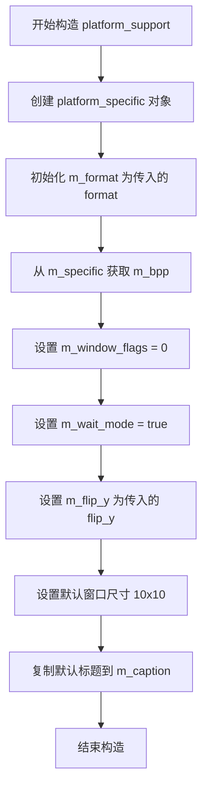

#### 带注释源码

```cpp
//------------------------------------------------------------------------
// platform_support 构造函数
// 参数:
//   format - 像素格式枚举值，决定颜色深度和格式
//   flip_y - 是否翻转Y坐标轴，true表示Y轴向下（窗口坐标系）
//------------------------------------------------------------------------
platform_support::platform_support(pix_format_e format, bool flip_y) :
    // 使用初始化列表创建平台特定对象，传入格式和翻转标志
    m_specific(new platform_specific(format, flip_y)),
    // 保存传入的像素格式
    m_format(format),
    // 从平台特定对象获取实际位深度
    m_bpp(m_specific->m_bpp),
    // 初始化窗口标志为0（无特殊标志）
    m_window_flags(0),
    // 设置等待模式为true（默认使用事件循环等待）
    m_wait_mode(true),
    // 保存Y轴翻转标志
    m_flip_y(flip_y),
    // 设置初始窗口宽度为10像素（占位值，后续init会重置）
    m_initial_width(10),
    // 设置初始窗口高度为10像素（占位值，后续init会重置）
    m_initial_height(10)
{
    // 复制默认窗口标题到成员变量
    // 标题内容为 "Anti-Grain Geometry Application"
    strcpy(m_caption, "Anti-Grain Geometry Application");
}
```


### `platform_support::~platform_support`

该析构函数是 `platform_support` 类的析构方法，负责释放类中持有的平台特定实现对象，防止内存泄漏。它通过删除在构造函数中动态分配的 `platform_specific` 指针来释放所有相关资源（包括窗口、像素映射等 Carbon 对象）。

参数：
- （无）

返回值：`void`，无返回值。

#### 流程图

```mermaid
graph TD
    A[开始] --> B[删除 m_specific 指针]
    B --> C[结束]
```

#### 带注释源码

```cpp
//------------------------------------------------------------------------
// 析构函数：~platform_support
// 职责：释放 platform_support 对象所占用的资源，特别是
//      通过 delete 操作释放 m_specific 指针，该指针指向
//      platform_specific 对象，其中包含了所有平台特定的
//      资源（如 WindowRef、pixel_map 等）。
//------------------------------------------------------------------------
platform_support::~platform_support()
{
    // 释放 platform_specific 对象，这是整个平台支持层的核心资源
    // platform_specific 封装了 Carbon 相关的窗口、图形缓冲等资源
    delete m_specific;
}
```


### `platform_support::caption`

设置窗口标题，更新应用程序窗口的显示文本。

参数：

- `cap`：`const char*`，新的窗口标题文本（以 null 结尾的 ASCII 字符串）

返回值：`void`，无返回值

#### 流程图

```mermaid
flowchart TD
    A[开始 caption 方法] --> B[复制标题文本<br/>strcpy m_caption]
    B --> C{检查窗口是否存在<br/>m_specific->m_window}
    C -->|否| D[结束]
    C -->|是| E[创建 CFString<br/>CFStringCreateWithCStringNoCopy]
    E --> F[调用 Carbon API<br/>SetWindowTitleWithCFString]
    F --> D
```

#### 带注释源码

```cpp
//------------------------------------------------------------------------
// 设置窗口标题
//------------------------------------------------------------------------
void platform_support::caption(const char* cap)
{
    // 将新的标题文本复制到成员变量 m_caption 中保存
    strcpy(m_caption, cap);
    
    // 仅在窗口已创建（存在）时才调用 Carbon API 更新实际窗口标题
    if(m_specific->m_window)
    {
        // 使用 Carbon 的 SetWindowTitleWithCFString 函数设置窗口标题
        // 参数：
        //   - m_specific->m_window: 目标窗口引用
        //   - CFStringCreateWithCStringNoCopy: 创建 CFString 对象
        //       - nil: 默认内存分配器
        //       - cap: 输入的 C 字符串
        //       - kCFStringEncodingASCII: ASCII 编码
        //       - nil: 不需要释放回调
        SetWindowTitleWithCFString (m_specific->m_window, 
            CFStringCreateWithCStringNoCopy (nil, cap, kCFStringEncodingASCII, nil));
    }
}
```


### `platform_support::message`

该函数是 `platform_support` 类的成员方法，负责在 Mac OS (Carbon) 环境下弹出一个标准的系统消息框（Alert Dialog），将传入的文本信息展示给用户。

参数：

- `msg`：`const char*`，要显示的消息内容文本。

返回值：`void`，无返回值。

#### 流程图

```mermaid
graph LR
    A[Start] --> B[将 C 字符串转换为 Pascal 字符串]
    B --> C[调用 StandardAlert 弹出消息框]
    C --> D[End]
```

#### 带注释源码

```cpp
    //------------------------------------------------------------------------
    void platform_support::message(const char* msg)
    {
        // 用于存储用户点击按钮的返回值（当前代码未使用该值）
        SInt16 item;
        // Pascal 字符串类型，最大长度为 255 字节（1字节长度 + 254字节内容）
        Str255 p_msg;
        
        // 调用 Carbon API 将标准的 C 风格字符串转换为 Mac 所需的 Pascal 字符串格式
        // 注意：如果 msg 长度超过 254 字节，可能会导致截断或溢出
        ::CopyCStringToPascal (msg, p_msg);
        
        // 调用系统标准 Alert 对话框
        // 参数说明:
        // kAlertPlainAlert: 表示这是一个纯信息提示框（无图标）
        // "\013AGG Message": 窗口标题。
        //                    使用 Pascal 字符串格式：\013 (八进制 11) 表示标题长度为 11 个字符 "AGG Message"
        // p_msg: 用户传入的消息正文
        // NULL: 传递给按钮的辅助数据 (Auxiliary data)
        // &item: 指向 SInt16 的指针，用于接收用户点击了哪个按钮
        ::StandardAlert (kAlertPlainAlert, (const unsigned char*) "\013AGG Message", p_msg, NULL, &item);
    }
```


### `platform_support.start_timer`

该函数用于启动（或重置）平台支持的内部高性能计时器。它通过调用 MacOS Carbon API `Microseconds` 获取当前的系统时间（以微秒为单位），并将其记录在 `platform_specific` 对象的成员变量 `m_sw_start` 中，作为计算后续 `elapsed_time()`（经过时间）的起始时间戳。

参数：
- （无）

返回值：`void`（无返回值）

#### 流程图

```mermaid
flowchart TD
    A([函数入口]) --> B[调用 Carbon API: Microseconds]
    B --> C[获取当前时间戳]
    C --> D[更新成员变量 m_specific->m_sw_start]
    D --> E([函数结束])
```

#### 带注释源码

```cpp
    //------------------------------------------------------------------------
    // 函数: start_timer
    // 描述: 启动或重置计时器。
    //       该方法不返回任何值，其主要目的是记录当前时刻 T0。
    //       随后可以通过 elapsed_time() 计算 (当前时刻 - T0) 的差值。
    //------------------------------------------------------------------------
    void platform_support::start_timer()
    {
        // 使用 Carbon (MacOS) 的 Microseconds 函数获取高精度的当前系统时间。
        // &m_specific->m_sw_start 是一个指向 UnsignedWide 类型变量的指针，
        // 用于存储当前时间的低32位和高32位。
        // 这个时间作为后续测量经过时间的基准点（Start Time）。
        ::Microseconds (&(m_specific->m_sw_start));
    }
```


### `platform_support.elapsed_time()`

获取自上次调用 `start_timer()` 后经过的时间（以毫秒为单位）。该方法通过读取系统的高精度计时器（Microseconds）来计算时间差，并考虑计时器的频率进行单位转换。

参数：
- 该方法无参数。

返回值：`double`，返回自上次启动计时器以来经过的时间，单位为毫秒。

#### 流程图

```mermaid
graph TD
    A[开始 elapsed_time] --> B[调用 Microseconds 获取当前时间 stop]
    B --> C[计算时间差: stop.lo - m_sw_start.lo]
    C --> D[将差值转换为毫秒: 差值 * 1e6 / m_sw_freq.lo]
    D --> E[返回 double 类型的时间值]
    E --> F[结束]
```

#### 带注释源码

```cpp
//----------------------------------------------------------------------------
// 计算自上次启动计时器后经过的时间（毫秒）
//----------------------------------------------------------------------------
double platform_support::elapsed_time() const
{
    // 用于存储当前时间的结构体
    UnsignedWide stop;
    
    // 调用系统函数 Microseconds 获取当前高精度时间
    ::Microseconds(&stop);
    
    // 计算时间差并转换为毫秒：
    // stop.lo - m_specific->m_sw_start.lo 计算自上次计时以来的微秒差
    // 1e6 用于将微秒转换为毫秒（1毫秒 = 1000微秒，即 10^6 微秒）
    // m_specific->m_sw_freq.lo 是计时器的频率，用于标准化时间计算
    return double(stop.lo - 
                  m_specific->m_sw_start.lo) * 1e6 / 
                  double(m_specific->m_sw_freq.lo);
}
```


### `platform_support::init`

该函数是 Anti-Grain Geometry 库在 Mac OS X (Carbon) 平台上的初始化入口，负责创建应用窗口、注册各类 Carbon 事件处理器（鼠标、键盘、窗口事件）、创建像素映射（pixel map）作为绘图表面，并触发初始化和尺寸调整回调。

参数：

- `width`：`unsigned`，窗口的初始宽度（像素）
- `height`：`unsigned`，窗口的初始高度（像素）
- `flags`：`unsigned`，窗口创建标志（如全屏、隐藏等）

返回值：`bool`，初始化成功返回 `true`，如果系统像素格式未定义或窗口创建失败则返回 `false`

#### 流程图

```mermaid
flowchart TD
    A[开始 init] --> B{检查系统像素格式是否有效}
    B -->|无效| C[返回 false]
    B -->|有效| D[保存窗口标志 flags]
    E[注册应用级事件处理器] --> E1[Quit事件]
    E --> E2[鼠标按下事件 DoMouseDown]
    E --> E3[鼠标释放事件 DoMouseUp]
    E --> E4[鼠标拖动事件 DoMouseDragged]
    E --> E5[键盘按下事件 DoKeyDown]
    E --> E6[键盘释放事件 DoKeyUp]
    E --> E7[键盘重复事件]
    E --> F[创建窗口]
    F --> G{窗口创建成功?}
    G -->|否| C
    G -->|是| H[设置窗口标题]
    H --> I[注册窗口关闭事件 DoWindowClose]
    I --> J[注册窗口重绘事件 DoWindowDrawContent]
    J --> K[安装周期性任务定时器 50ms]
    K --> L[创建像素映射 m_pmap_window]
    L --> M[保存初始宽高]
    M --> N[调用 on_init 回调]
    N --> O[调用 on_resize 回调]
    O --> P[设置重绘标志为 true]
    P --> Q[显示窗口]
    Q --> R[设置当前图形端口]
    R --> S[返回 true]
```

#### 带注释源码

```cpp
//------------------------------------------------------------------------
// 初始化窗口、事件处理器、像素映射
//------------------------------------------------------------------------
bool platform_support::init(unsigned width, unsigned height, unsigned flags)
{
    // 检查系统像素格式是否已定义，若未定义则初始化失败
    if(m_specific->m_sys_format == pix_format_undefined)
    {
        return false;
    }

    // 保存窗口标志
    m_window_flags = flags;

    //============================================================
    // 注册应用级事件处理器 (Application Event Handlers)
    //============================================================
    EventTypeSpec    eventType;
    EventHandlerUPP  handlerUPP;

    //--- 退出事件 ---
    eventType.eventClass = kEventClassApplication;
    eventType.eventKind = kEventAppQuit;
    handlerUPP = NewEventHandlerUPP(DoAppQuit);
    InstallApplicationEventHandler(handlerUPP, 1, &eventType, nil, nil);

    //--- 鼠标事件 ---
    eventType.eventClass = kEventClassMouse;
    eventType.eventKind = kEventMouseDown;    // 鼠标按下
    handlerUPP = NewEventHandlerUPP(DoMouseDown);
    InstallApplicationEventHandler(handlerUPP, 1, &eventType, this, nil);

    eventType.eventKind = kEventMouseUp;     // 鼠标释放
    handlerUPP = NewEventHandlerUPP(DoMouseUp);
    InstallApplicationEventHandler(handlerUPP, 1, &eventType, this, nil);
    
    eventType.eventKind = kEventMouseDragged; // 鼠标拖动
    handlerUPP = NewEventHandlerUPP(DoMouseDragged);
    InstallApplicationEventHandler(handlerUPP, 1, &eventType, this, nil);

    //--- 键盘事件 ---
    eventType.eventClass = kEventClassKeyboard;
    eventType.eventKind = kEventRawKeyDown;   // 键按下
    handlerUPP = NewEventHandlerUPP(DoKeyDown);
    InstallApplicationEventHandler(handlerUPP, 1, &eventType, this, nil);

    eventType.eventKind = kEventRawKeyUp;     // 键释放
    handlerUPP = NewEventHandlerUPP(DoKeyUp);
    InstallApplicationEventHandler(handlerUPP, 1, &eventType, this, nil);

    eventType.eventKind = kEventRawKeyRepeat; // 键重复（映射到按下）
    handlerUPP = NewEventHandlerUPP(DoKeyDown);
    InstallApplicationEventHandler(handlerUPP, 1, &eventType, this, nil);

    //============================================================
    // 创建窗口 (Window Creation)
    //============================================================
    WindowAttributes  windowAttrs;
    Rect              bounds;

    // 设置窗口属性：关闭框、折叠框、标准事件处理器
    windowAttrs = kWindowCloseBoxAttribute | kWindowCollapseBoxAttribute | kWindowStandardHandlerAttribute;
    
    // 设置窗口边界并偏移
    SetRect(&bounds, 0, 0, width, height);
    OffsetRect(&bounds, 100, 100);  // 偏移到屏幕可见区域
    
    // 创建新窗口
    CreateNewWindow(kDocumentWindowClass, windowAttrs, &bounds, &m_specific->m_window);

    // 检查窗口是否创建成功
    if(m_specific->m_window == nil)
    {
        return false;
    }

    // 设置窗口标题（使用 ASCII 编码）
    SetWindowTitleWithCFString(m_specific->m_window, 
        CFStringCreateWithCStringNoCopy(nil, m_caption, kCFStringEncodingASCII, nil));
    
    //============================================================
    // 注册窗口事件处理器 (Window Event Handlers)
    //============================================================
    eventType.eventClass = kEventClassWindow;
    
    // 窗口关闭事件
    eventType.eventKind = kEventWindowClose;
    handlerUPP = NewEventHandlerUPP(DoWindowClose);
    InstallWindowEventHandler(m_specific->m_window, handlerUPP, 1, &eventType, this, NULL);

    // 窗口内容重绘事件
    eventType.eventKind = kEventWindowDrawContent;
    handlerUPP = NewEventHandlerUPP(DoWindowDrawContent);
    InstallWindowEventHandler(m_specific->m_window, handlerUPP, 1, &eventType, this, NULL);
    
    //============================================================
    // 安装周期性任务定时器 (Periodic Task Timer)
    // 用于实现 idle 回调机制，定时间隔为 50 毫秒
    //============================================================
    EventLoopRef      mainLoop;
    EventLoopTimerUPP timerUPP;
    EventLoopTimerRef theTimer;

    mainLoop = GetMainEventLoop();
    timerUPP = NewEventLoopTimerUPP(DoPeriodicTask);
    InstallEventLoopTimer(mainLoop, 0, 50 * kEventDurationMillisecond, timerUPP, this, &theTimer);

    //============================================================
    // 创建像素映射 (Pixel Map Creation)
    // 用于图形渲染的帧缓冲
    //============================================================
    m_specific->create_pmap(width, height, &m_rbuf_window);
    
    // 保存初始窗口尺寸
    m_initial_width = width;
    m_initial_height = height;
    
    // 触发初始化回调
    on_init();
    
    // 触发尺寸调整回调
    on_resize(width, height);
    
    // 设置重绘标志
    m_specific->m_redraw_flag = true;
    
    //============================================================
    // 显示窗口并设置图形端口
    //============================================================
    ShowWindow(m_specific->m_window);
    SetPortWindowPort(m_specific->m_window);
    
    return true;
}
```


### `platform_support.run()`

启动 Carbon 应用程序事件循环，使应用程序进入事件处理状态，处理窗口、鼠标、键盘等事件，直到用户关闭应用程序。

参数：无

返回值：`int`，返回 `true` 表示成功启动事件循环。

#### 流程图

```mermaid
flowchart TD
    A[开始 run] --> B[调用 RunApplicationEventLoop]
    B --> C{事件循环运行中}
    C -->|处理事件| D[处理窗口/鼠标/键盘事件]
    D --> C
    C -->|用户关闭| E[退出事件循环]
    E --> F[返回 true]
    F --> G[结束 run]
```

#### 带注释源码

```cpp
//------------------------------------------------------------------------
// 启动 Carbon 应用程序事件循环
// 该函数调用 Carbon API 的 RunApplicationEventLoop 来进入主事件循环
// 应用程序将持续运行并处理各种 Carbon 事件（鼠标、键盘、窗口等）
// 直到事件循环被终止（通常是用户关闭应用程序窗口）
//------------------------------------------------------------------------
int platform_support::run()
{
    // 调用 Carbon API 的事件循环函数
    // 这是 Mac OS 应用程序的主事件循环入口点
    // 函数会阻塞直到 QuitApplicationEventLoop 被调用
    RunApplicationEventLoop ();
    
    // 事件循环退出后返回 true 表示正常结束
    return true;
}
```


### `platform_support.load_img`

加载图像文件到指定的图像槽位，支持自动添加 `.bmp` 扩展名。

参数：
- `idx`：`unsigned`，图像索引，指定要加载到的图像槽位（需小于 `max_images`）
- `file`：`const char*`，文件名，不区分大小写地检查是否已包含 `.bmp` 扩展名

返回值：`bool`，返回是否加载成功

#### 流程图

```mermaid
flowchart TD
    A[load_img 调用] --> B{idx < max_images?}
    B -->|否| C[返回 true]
    B -->|是| D[复制文件名到 fn]
    D --> E{文件名长度 >= 4?}
    E -->|否| F[添加 .bmp 扩展名]
    E -->|是| G{已包含 .bmp 扩展名?}
    G -->|是| H[不修改]
    G -->|否| F
    H --> I[调用 m_specific->load_pmap]
    I --> J[返回加载结果]
```

#### 带注释源码

```cpp
//------------------------------------------------------------------------
// 加载图像文件
//------------------------------------------------------------------------
bool platform_support::load_img(unsigned idx, const char* file)
{
    // 检查索引是否在有效范围内
    if(idx < max_images)
    {
        char fn[1024];
        strcpy(fn, file);
        int len = strlen(fn);
        
        // 根据编译器判断使用的大小写不敏感比较函数
#if defined(__MWERKS__)
        // Metrowerks CodeWarrior 使用 stricmp
        if(len < 4 || stricmp(fn + len - 4, ".BMP") != 0)
#else
        // 其他平台使用 strncasecmp
        if(len < 4 || strncasecmp(fn + len - 4, ".BMP", 4) != 0)
#endif
        {
            // 如果文件扩展名不是 .bmp，则自动添加
            strcat(fn, ".bmp");
        }
        
        // 调用底层平台特定的加载函数
        return m_specific->load_pmap(fn, idx, &m_rbuf_img[idx]);
    }
    
    // 索引超出范围，返回 true（不报错）
    return true;
}
```

---

### `platform_support.save_img`

保存指定图像槽位的内容到文件，支持自动添加 `.bmp` 扩展名。

参数：
- `idx`：`unsigned`，图像索引，指定要保存的图像槽位（需小于 `max_images`）
- `file`：`const char*`，文件名，不区分大小写地检查是否已包含 `.bmp` 扩展名

返回值：`bool`，返回是否保存成功

#### 流程图

```mermaid
flowchart TD
    A[save_img 调用] --> B{idx < max_images?}
    B -->|否| C[返回 true]
    B -->|是| D[复制文件名到 fn]
    D --> E{文件名长度 >= 4?}
    E -->|否| F[添加 .bmp 扩展名]
    E -->|是| G{已包含 .bmp 扩展名?}
    G -->|是| H[不修改]
    G -->|否| F
    H --> I[调用 m_specific->save_pmap]
    I --> J[返回保存结果]
```

#### 带注释源码

```cpp
//------------------------------------------------------------------------
// 保存图像文件
//------------------------------------------------------------------------
bool platform_support::save_img(unsigned idx, const char* file)
{
    // 检查索引是否在有效范围内
    if(idx < max_images)
    {
        char fn[1024];
        strcpy(fn, file);
        int len = strlen(fn);
        
        // 根据编译器判断使用的大小写不敏感比较函数
#if defined(__MWERKS__)
        // Metrowerks CodeWarrior 使用 stricmp
        if(len < 4 || stricmp(fn + len - 4, ".BMP") != 0)
#else
        // 其他平台使用 strncasecmp
        if(len < 4 || strncasecmp(fn + len - 4, ".BMP", 4) != 0)
#endif
        {
            // 如果文件扩展名不是 .bmp，则自动添加
            strcat(fn, ".bmp");
        }
        
        // 调用底层平台特定的保存函数
        return m_specific->save_pmap(fn, idx, &m_rbuf_img[idx]);
    }
    
    // 索引超出范围，返回 true（不报错）
    return true;
}
```

---

### 相关底层方法

#### `platform_specific.load_pmap`

负责实际加载图像文件并进行颜色格式转换。

#### `platform_specific.save_pmap`

负责实际保存图像文件并进行颜色格式转换。


### `platform_support.create_img`

创建一个空的图像缓冲区（可指定索引、宽度和高度），用于在内存中存储图像数据。如果未指定宽度或高度，则使用窗口图像缓冲区的尺寸。

参数：

- `idx`：`unsigned`，图像索引，指定要创建的图像缓冲区在 `m_pmap_img` 数组中的位置
- `width`：`unsigned`，图像宽度，如果为 0 则使用窗口缓冲区的宽度
- `height`：`unsigned`，图像高度，如果为 0 则使用窗口缓冲区的高度

返回值：`bool`，创建成功返回 `true`，失败返回 `false`（当索引超出 `max_images` 范围时）

#### 流程图

```mermaid
flowchart TD
    A[开始 create_img] --> B{idx < max_images?}
    B -->|否| C[返回 false]
    B -->|是| D{width == 0?}
    D -->|是| E[width = m_pmap_window.width]
    D -->|否| F{height == 0?}
    F -->|是| G[height = m_pmap_window.height]
    F -->|否| H[创建像素图]
    E --> H
    G --> H
    H --> I[m_pmap_img[idx].create]
    I --> J[attach渲染缓冲区]
    K --> K
    J --> K[返回 true]
```

#### 带注释源码

```cpp
//------------------------------------------------------------------------
bool platform_support::create_img(unsigned idx, unsigned width, unsigned height)
{
    // 检查图像索引是否在有效范围内
    if(idx < max_images)
    {
        // 如果未指定宽度，则使用窗口缓冲区的宽度
        if(width  == 0) width  = m_specific->m_pmap_window.width();
        // 如果未指定高度，则使用窗口缓冲区的高度
        if(height == 0) height = m_specific->m_pmap_window.height();
        
        // 使用指定的位深创建像素图对象
        m_specific->m_pmap_img[idx].create(width, height, org_e(m_specific->m_bpp));
        
        // 将渲染缓冲区附加到新创建的像素图
        // 根据 flip_y 标志决定行字节数的正负（控制Y轴翻转）
        m_rbuf_img[idx].attach(m_specific->m_pmap_img[idx].buf(), 
                               m_specific->m_pmap_img[idx].width(),
                               m_specific->m_pmap_img[idx].height(),
                               m_flip_y ?
                               -m_specific->m_pmap_img[idx].row_bytes() :
                                m_specific->m_pmap_img[idx].row_bytes());
        return true;
    }
    return false;
}
```


### `platform_support.force_redraw`

该方法强制重绘窗口内容，通过设置重绘标志位、调用 `on_draw()` 回调函数绘制内容，并使用 `InvalWindowRect` 使窗口区域无效以触发底层系统重绘。

参数：无

返回值：`void`，无返回值

#### 流程图

```mermaid
flowchart TD
    A[开始 force_redraw] --> B[设置 m_specific->m_redraw_flag = true]
    B --> C[调用 on_draw 执行应用层绘制逻辑]
    C --> D[获取窗口渲染缓冲区尺寸]
    D --> E[SetRect 设置无效区域边界]
    E --> F[InvalWindowRect 使窗口区域无效]
    F --> G[结束]
```

#### 带注释源码

```cpp
//------------------------------------------------------------------------
// 强制重绘方法
// 功能：标记需要重绘并触发 on_draw，通知系统更新窗口
//------------------------------------------------------------------------
void platform_support::force_redraw()
{
    Rect	bounds;  // 定义矩形结构用于描述无效区域
    
    // 步骤1：设置重绘标志为 true，标记当前需要重绘
    // platform_specific 使用此标志决定是否调用 on_draw
    m_specific->m_redraw_flag = true;
    
    // 步骤2：调用应用层的绘制回调函数
    // on_draw() 是纯虚函数，由具体应用程序实现绘图逻辑
    // 调用此函数将渲染内容到 m_rbuf_window (窗口渲染缓冲区)
    on_draw();

    // 步骤3：构建无效区域矩形，范围覆盖整个窗口
    SetRect(&bounds, 0, 0, m_rbuf_window.width(), m_rbuf_window.height());
    
    // 步骤4：通知 Carbon 系统该窗口区域需要重绘
    // InvalWindowRect 会将指定区域加入系统重绘队列
    // 系统随后会发送 kEventWindowDrawContent 事件
    InvalWindowRect(m_specific->m_window, &bounds);
}
```


### `platform_support.update_window`

将当前渲染缓冲（m_rbuf_window）显示到窗口，这是 Anti-Grain Geometry 库在 Mac Carbon 平台上的窗口更新核心操作。

参数：无

返回值：`void`，无返回值

#### 流程图

```mermaid
flowchart TD
    A[开始 update_window] --> B[获取平台特定对象 m_specific]
    B --> C[获取窗口引用 m_specific->m_window]
    C --> D[获取当前渲染缓冲区 &m_rbuf_window]
    D --> E[调用 platform_specific.display_pmap]
    E --> F{渲染格式是否与系统格式相同?}
    F -->|是| G[直接绘制 m_pmap_window 到窗口]
    F -->|否| H[创建临时像素映射 pmap_tmp]
    H --> I[根据格式选择颜色转换策略]
    I --> J[执行颜色转换]
    J --> K[绘制转换后的临时像素映射]
    G --> L[结束]
    K --> L
```

#### 带注释源码

```cpp
//------------------------------------------------------------------------
// 将当前渲染缓冲显示到窗口
// 该函数是 Anti-Grain Geometry 在 Mac Carbon 平台上的窗口更新入口
// 它调用 platform_specific 的 display_pmap 方法来完成实际的绘制工作
//------------------------------------------------------------------------
void platform_support::update_window()
{
    // 调用平台特定层的 display_pmap 方法
    // 参数1: m_specific->m_window - Carbon 窗口引用
    // 参数2: &m_rbuf_window - 当前渲染缓冲区的引用
    // 
    // display_pmap 会自动处理:
    // 1. 像素格式转换（当渲染格式与系统格式不同时）
    // 2. 使用 QuickDraw 绘制像素映射到窗口
    m_specific->display_pmap(m_specific->m_window, &m_rbuf_window);
}
```

#### 关键实现细节

`display_pmap` 方法会执行以下操作：

1. **格式匹配检查**：比较 `m_sys_format` 与 `m_format`
2. **直接绘制**：如果格式匹配，直接调用 `m_pmap_window.draw(window)`
3. **格式转换**：如果格式不匹配：
   - 创建临时像素映射 `pmap_tmp`
   - 根据源格式选择合适的颜色转换函数（如 `color_conv_rgb565_to_rgb555()`、`color_conv_bgra32_to_argb32()` 等）
   - 执行颜色转换
   - 绘制转换后的临时像素映射


### `platform_support.on_init`

该函数是 `platform_support` 类的虚回调函数，在应用程序窗口初始化完成后、正式进入事件循环之前被调用。通常用于一次性初始化应用状态（如加载资源、设置默认颜色、初始化控制变量等）。

参数：
- 无

返回值：`void`，无返回值。

#### 流程图

```mermaid
flowchart TD
    A[应用程序启动] --> B[platform_support::init 初始化窗口]
    B --> C{初始化成功?}
    C -- 否 --> D[退出]
    C -- 是 --> E[创建渲染缓冲区]
    E --> F[调用 on_init]
    F --> G[进入事件循环 RunApplicationEventLoop]
```

#### 带注释源码

```cpp
//------------------------------------------------------------------------
// 在 platform_support::init 函数的末尾被调用
// 紧接着调用 on_resize，然后显示窗口
// 用户应在此处实现应用级别的初始化逻辑
void platform_support::on_init() {}
```

---

### `platform_support.on_resize`

该函数是 `platform_support` 类的虚回调函数，当窗口大小发生改变时被调用。在 AGG 中，这通常意味着渲染缓冲区的大小需要调整，或者视口（viewport）需要重新计算。

参数：

- `sx`：`int`，窗口的新宽度（以像素为单位）。
- `sy`：`int`，窗口的新高度（以像素为单位）。

返回值：`void`，无返回值。

#### 流程图

```mermaid
flowchart TD
    A[窗口创建或调整大小] --> B[platform_support::init 或 窗口事件]
    B --> C[调用 on_resize 传递新尺寸]
    C --> D[用户在此调整渲染目标或视图]
```

#### 带注释源码

```cpp
//------------------------------------------------------------------------
// 初始化时被调用一次，之后如果窗口大小改变也应被调用
// 参数 sx, sy 对应新的窗口宽和高
void platform_support::on_resize(int sx, int sy) {}
```

---

### `platform_support.on_idle`

该函数是 `platform_support` 类的虚回调函数，在应用程序的空闲循环中被调用。通过将 `wait_mode` 设置为 `false` 可以激活此回调，常用于实现动画逻辑。

参数：
- 无

返回值：`void`，无返回值。

#### 流程图

```mermaid
flowchart TD
    A[主事件循环] --> B[DoPeriodicTask 定时器触发]
    B --> C{wait_mode 为 false?}
    C -- 是 --> D[调用 on_idle]
    D --> E[执行动画/更新逻辑]
    E --> F[通常调用 force_redraw 触发重绘]
    C -- 否 --> A
```

#### 带注释源码

```cpp
//------------------------------------------------------------------------
// 当 wait_mode 设置为 false 时，每隔约 50ms 会被调用一次
// 常用于更新动画状态或连续计算
// 注意：如果修改了画面，通常需要调用 force_redraw() 请求重绘
void platform_support::on_idle() {}
```

---

### `platform_support.on_draw`

该函数是 `platform_support` 类的核心虚回调函数，负责将应用程序的图形内容绘制到渲染缓冲区。当窗口需要重绘（首次显示、内容更新、覆盖恢复）时被调用。

参数：
- 无

返回值：`void`，无返回值。

#### 流程图

```mermaid
flowchart TD
    A[窗口绘制请求或 force_redraw 调用] --> B[检查 redraw_flag]
    B --> C[调用 on_draw]
    C --> D[用户代码: 清除缓冲区并绘制图形]
    D --> E[重置 redraw_flag]
    E --> F[display_pmap 将缓冲区显示到屏幕]
```

#### 带注释源码

```cpp
//------------------------------------------------------------------------
// 这是用户实现具体绘图逻辑的核心函数。
// 系统会在需要重绘时调用此函数。
// 开发者应在此函数中获取 rbuf_window()，并使用 AGG 的图形原语进行绘制。
// 绘制完成后，platform_support 会自动调用 display_pmap 将其显示在 Carbon 窗口上。
void platform_support::on_draw() {}
```


## 关键组件


### platform_specific 类

Mac平台的特定实现类，负责处理窗口创建、像素映射管理、图像加载保存、键盘映射和事件处理等底层Mac Carbon API调用。

### platform_support 类

平台抽象层类，提供跨平台的图形应用支持接口，封装了窗口管理、图像操作、定时器、事件回调等功能的统一API。

### 事件处理函数集合

包括DoWindowClose、DoAppQuit、DoMouseDown、DoMouseUp、DoMouseDragged、DoKeyDown、DoKeyUp、DoWindowDrawContent和DoPeriodicTask等Carbon事件处理器，负责将Mac系统事件转发给application层。

### 像素格式与颜色转换机制

支持pix_format_gray8、pix_format_rgb565、pix_format_rgb555、pix_format_rgb24、pix_format_bgr24、pix_format_bgra32、pix_format_abgr32、pix_format_argb32、pix_format_rgba32等多种像素格式，并通过color_conv函数进行格式转换。

### 图像加载与保存功能

通过load_pmap和save_pmap函数实现BMP图像的加载和保存，支持Qt格式（.bmp），并根据目标格式进行颜色空间转换。

### 窗口渲染管线

create_pmap创建窗口像素缓冲区，display_pmap负责将渲染缓冲区内容绘制到窗口，支持格式不匹配时的自动转换。

### 输入状态管理

通过m_keymap数组映射键盘扫描码到虚拟键码，m_cur_x/m_cur_y跟踪鼠标位置，m_input_flags记录输入状态标志（鼠标按钮、shift、ctrl等）。

### 定时器与性能测量

使用Carbon的Microseconds函数实现微秒级精度的定时器功能，用于性能测量和周期性任务触发（默认50ms间隔）。


## 问题及建议


### 已知问题

-   **使用过时的 Carbon API**：代码大量使用 Carbon 事件处理系统（EventHandlerUPP、EventLoopTimerUPP 等），这是 Apple 已弃用多年的 API，在现代 macOS 上无法运行。
-   **键盘输入支持不完整**：构造函数中大量键盘映射被注释掉，代码注释明确说明 "Keyboard input is not yet fully supported nor tested"。
-   **内存管理不当**：使用原始 `new`/`delete` 管理 `platform_specific` 对象，未使用智能指针，存在潜在的内存泄漏风险。
-   **字符串编码问题**：使用 `kCFStringEncodingASCII` 硬编码处理窗口标题和消息，无法正确处理非 ASCII 字符（如中文、Unicode）。
-   **硬编码的魔法数值**：
  - 窗口偏移量 `100, 100`
  - 定时器间隔 `50 * kEventDurationMillisecond`
  - 窗口初始大小 `10x10`
-   **不完整的颜色格式转换支持**：`display_pmap` 和 `save_pmap` 函数对 `pix_format_gray8` 直接返回，未实现转换逻辑。
-   **缺乏错误处理**：文件加载/保存、内存分配等操作失败时仅返回布尔值，缺少详细的错误信息。
-   **平台特定代码与业务逻辑耦合**：`platform_support` 类直接包含大量 Carbon API 调用，难以跨平台移植。
-   **使用 pascal 调用约定**：事件处理函数使用 `pascal` 关键字，这是过时的调用约定。
-   **文件扩展名检查不一致**：使用 `#if defined(__MWERKS__)` 条件编译处理不同平台的字符串比较函数。

### 优化建议

-   **迁移到现代 API**：考虑将 Carbon 事件系统迁移到 Cocoa (AppKit) 或使用跨平台的图形框架（如 SDL、SFML、Qt）。
-   **实现智能指针**：使用 `std::unique_ptr` 或 `std::shared_ptr` 管理 `platform_specific` 生命周期。
-   **完善键盘输入**：完成键盘映射表并测试键盘输入功能。
-   **支持 Unicode**：使用 `CFStringCreateWithCString` 指定 `kCFStringEncodingUTF8` 或使用 `CFString` 的完整功能。
-   **提取配置参数**：将硬编码的窗口偏移、计时器间隔等参数提取为可配置的成员变量或构造函数参数。
-   **完善错误处理**：引入异常机制或错误码枚举，提供更详细的错误信息。
-   **使用 RAII 模式**：封装资源获取和释放，确保异常安全。
-   **统一字符串处理**：使用 C++ 标准库字符串或跨平台字符串类，避免平台特定的字符串函数。
-   **添加日志系统**：在关键操作节点添加日志，便于调试和问题追踪。
-   **抽象平台层**：将 Carbon API 调用封装到独立的平台适配层，便于未来迁移到其他平台。


## 其它


### 设计目标与约束

本代码旨在为 Anti-Grain Geometry 库提供 Mac OS X Carbon 平台支持，实现跨平台的图形应用程序框架。设计目标包括：1) 提供与 Win32 平台一致 API 的抽象接口；2) 支持多种像素格式（gray8、rgb565、rgb555、rgb24、bgr24、bgra32、abgr32、argb32、rgba32）；3) 实现窗口管理、事件处理、图像加载保存等功能；4) 支持鼠标、键盘输入事件；5) 提供定时器和帧率控制功能。约束条件包括：仅支持 Carbon API（Mac OS 经典 API），不支持现代 Cocoa；键盘输入功能注释表明未完全测试；仅支持 BMP 图像格式。

### 错误处理与异常设计

代码采用传统 C 风格错误处理，主要模式包括：1) 函数返回 bool 值表示成功/失败，如 load_pmap、save_pmap、load_img、save_img、init 等；2) 返回 nullptr/nil 检查，如窗口创建失败检查；3) 使用条件判断处理错误情况。关键错误处理包括：m_sys_format 为 pix_format_undefined 时 init 返回 false；图像加载失败返回 false；文件扩展名检查和自动添加 .bmp 后缀。异常设计：代码未使用 C++ 异常机制，所有错误通过返回值传递；部分函数使用 assert 或条件检查处理异常情况。

### 数据流与状态机

数据流主要分为三个部分：1) 窗口渲染流程：create_pmap 创建像素缓冲 → on_draw 回调执行渲染 → display_pmap 显示到窗口；2) 图像加载流程：load_pmap 加载外部文件 → 格式转换 → 存储到 m_pmap_img 数组；3) 图像保存流程：rendering_buffer 数据 → 格式转换 → save_pmap 保存到文件。状态机主要体现在：m_redraw_flag 控制是否需要重绘；wait_mode 控制空闲处理；m_ctrls 控件状态管理鼠标交互。关键状态变量包括：m_cur_x/m_cur_y 当前鼠标位置、m_input_flags 输入标志、m_last_translated_key 最后转换的键码。

### 外部依赖与接口契约

外部依赖包括：1) Carbon.h - Mac OS Carbon 核心头文件；2) platform/agg_platform_support.h - 平台支持基类；3) platform/mac/agg_mac_pmap.h - Mac 像素映射实现；4) util/agg_color_conv_rgb8.h - 颜色转换工具。接口契约：platform_support 类提供抽象接口供用户继承实现 on_init、on_resize、on_idle、on_mouse_move、on_mouse_button_down、on_mouse_button_up、on_key、on_ctrl_change、on_draw 等回调方法；m_specific 指针封装平台特定实现；rendering_buffer 提供像素数据访问接口；pixel_map 提供平台相关图像存储。

### 平台特定实现细节

本实现针对 Mac Carbon 平台：1) 使用 Carbon Event Manager 处理窗口和应用程序事件；2) 使用 EventLoopTimer 实现 50ms 周期的空闲任务；3) 像素格式映射：根据请求格式选择对应的系统格式（sys_format）；4) 坐标转换：flip_y 选项影响 Y 轴方向（Mac QuickDraw 坐标系与 AGG 坐标系转换）；5) 窗口创建：使用 CreateNewWindow 创建文档窗口，设置关闭框、折叠框、标准处理器属性；6) 定时器：使用 Microseconds 获取高精度时间用于帧率计算。

### 内存管理策略

内存管理采用以下策略：1) platform_specific 通过 new 分配、delete 释放（见构造函数和析构函数）；2) pixel_map 对象 m_pmap_window 和 m_pmap_img[max_images] 作为成员对象自我管理内存；3) rendering_buffer 仅持有指针，不负责内存分配，通过 attach 关联到 pixel_map 的缓冲区；4) 窗口渲染缓冲区在 create_pmap 中创建并通过 wnd->attach 关联；5) 临时缓冲区（如 display_pmap 中的 pmap_tmp）在函数作用域内创建，函数结束时自动释放。

### 事件处理机制

事件处理基于 Carbon Event Model：1) 安装应用程序级事件处理器：DoAppQuit 处理退出、DoMouseDown/DoMouseUp/DoMouseDragged 处理鼠标、DoKeyDown/DoKeyUp 处理键盘；2) 安装窗口级事件处理器：DoWindowClose 处理关闭、DoWindowDrawContent 处理重绘；3) 事件参数获取使用 GetEventParameter 获取鼠标位置 (kEventParamMouseLocation)、键盘修饰符 (kEventParamKeyModifiers)、键码 (kEventParamKeyMacCharCodes)；4) 修饰符转换使用 get_key_flags 辅助函数将 Carbon 修饰符标志转换为 AGG 定义的 kbd_shift/kbd_ctrl；5) 定期任务通过 50ms 周期的 EventLoopTimer 触发，调用 on_idle 回调。

### 图形渲染流程

渲染流程如下：1) 初始化阶段：create_pmap 创建与窗口尺寸对应的像素缓冲，attach 到 m_rbuf_window；2) 渲染触发：force_redraw 设置 m_redraw_flag 为 true 并调用 InvalWindowRect 触发窗口重绘；3) 绘制执行：DoWindowDrawContent 事件回调检查 m_redraw_flag，若为 true 则调用 on_draw 执行用户自定义渲染，然后设置标志为 false；4) 显示：display_pmap 将渲染缓冲内容显示到窗口，若格式匹配直接绘制，否则创建临时缓冲进行颜色转换后再绘制；5) 更新：update_window 直接调用 display_pmap 刷新显示。

### 性能考虑与优化建议

性能相关实现：1) 时间测量使用 Microseconds 获取高精度时间（百万分之一秒）；2) 空闲处理使用 EventLoopTimer 而非轮询，50ms 周期平衡响应性和 CPU 占用；3) 颜色转换使用专门优化 color_conv 函数处理不同像素格式；4) flip_y 选项通过行字节数取反实现，避免数据拷贝。优化建议：1) 键盘映射表很多条目被注释，未完全支持；2) load_pmap 和 save_pmap 中对 pix_format_gray8 返回 false，应实现灰度图支持；3) 定期任务固定 50ms，应考虑可配置；4) 未使用双缓冲或多缓冲技术，大幅渲染可能闪烁；5) 文件名处理使用固定长度 1024 字节缓冲区，存在溢出风险。

### 兼容性说明

兼容性方面：1) 支持多种编译器：代码使用 __MWERKS__ 条件编译支持 CodeWarrior；2) 像素格式兼容：支持 8/16/24/32 位多种格式，系统格式与请求格式不同时自动转换；3) Mac OS 版本：依赖 Carbon API，支持 Classic Mac OS 到 Mac OS X；4) 字节序：代码依赖 Carbon QuickDraw 类型（如 Point、Rect），假设小端字节序；5) 字符串编码：窗口标题使用 ASCII 编码（kCFStringEncodingASCII），注释建议可改为 MacRoman、ISO Latin1 或 UTF8。


    