# `matplotlib\extern\agg24-svn\src\platform\sdl\agg_platform_support.cpp` 详细设计文档

Anti-Grain Geometry库的SDL平台支持实现，提供基于SDL的窗口管理、事件处理、图像渲染和文件操作功能，是AGG库在不同平台下的抽象适配层。

## 整体流程

```mermaid
graph TD
    A[程序启动 main()] --> B[agg_main()]
    B --> C[platform_support构造函数]
    C --> D[SDL_Init初始化视频子系统]
    D --> E[platform_support::init()]
    E --> F[SDL_SetVideoMode创建主屏幕表面]
    F --> G[SDL_CreateRGBSurface创建窗口渲染表面]
    G --> H[m_rbuf_window.attach绑定像素缓冲区]
    H --> I[platform_support::run()事件循环]
    I --> J{处理SDL事件}
    J --> K[SDL_QUIT退出]
    J --> L[SDL_VIDEORESIZE窗口调整]
    J --> M[SDL_KEYDOWN键盘事件]
    J --> N[SDL_MOUSEMOTION鼠标移动]
    J --> O[SDL_MOUSEBUTTONDOWN鼠标按下]
    J --> P[SDL_MOUSEBUTTONUP鼠标释放]
    L --> Q[重新init并调用on_resize]
    M --> R[调用on_key或控件处理]
    N --> S[调用on_mouse_move]
    O --> T[调用on_mouse_button_down]
    P --> U[调用on_mouse_button_up]
    Q --> I
    R --> I
    S --> I
    T --> I
    U --> I
```

## 类结构

```
agg::platform_specific (SDL平台特定实现类)
└── agg::platform_support (主平台支持抽象类)
```

## 全局变量及字段


### `max_images`
    
最大支持图像数量常量

类型：`int`
    


### `platform_specific.m_format`
    
当前像素格式

类型：`pix_format_e`
    


### `platform_specific.m_sys_format`
    
系统像素格式

类型：`pix_format_e`
    


### `platform_specific.m_flip_y`
    
Y轴翻转标志

类型：`bool`
    


### `platform_specific.m_bpp`
    
位深度

类型：`unsigned`
    


### `platform_specific.m_sys_bpp`
    
系统位深度

类型：`unsigned`
    


### `platform_specific.m_rmask`
    
红色通道掩码

类型：`unsigned`
    


### `platform_specific.m_gmask`
    
绿色通道掩码

类型：`unsigned`
    


### `platform_specific.m_bmask`
    
蓝色通道掩码

类型：`unsigned`
    


### `platform_specific.m_amask`
    
Alpha通道掩码

类型：`unsigned`
    


### `platform_specific.m_update_flag`
    
窗口更新标志

类型：`bool`
    


### `platform_specific.m_resize_flag`
    
窗口调整标志

类型：`bool`
    


### `platform_specific.m_initialized`
    
初始化完成标志

类型：`bool`
    


### `platform_specific.m_surf_screen`
    
SDL主屏幕表面

类型：`SDL_Surface*`
    


### `platform_specific.m_surf_window`
    
SDL窗口渲染表面

类型：`SDL_Surface*`
    


### `platform_specific.m_surf_img`
    
图像表面数组

类型：`SDL_Surface*`
    


### `platform_specific.m_cur_x`
    
当前鼠标X坐标

类型：`int`
    


### `platform_specific.m_cur_y`
    
当前鼠标Y坐标

类型：`int`
    


### `platform_specific.m_sw_start`
    
计时器起始时间

类型：`int`
    


### `platform_support.m_specific`
    
SDL平台特定实现指针

类型：`platform_specific*`
    


### `platform_support.m_format`
    
像素格式枚举

类型：`pix_format_e`
    


### `platform_support.m_bpp`
    
位深度

类型：`unsigned`
    


### `platform_support.m_window_flags`
    
窗口标志

类型：`unsigned`
    


### `platform_support.m_wait_mode`
    
事件等待模式

类型：`bool`
    


### `platform_support.m_flip_y`
    
Y轴翻转标志

类型：`bool`
    


### `platform_support.m_caption`
    
窗口标题

类型：`char[256]`
    


### `platform_support.m_initial_width`
    
初始窗口宽度

类型：`unsigned`
    


### `platform_support.m_initial_height`
    
初始窗口高度

类型：`unsigned`
    


### `platform_support.m_rbuf_window`
    
窗口渲染缓冲区

类型：`renderer_buffer`
    


### `platform_support.m_rbuf_img`
    
图像渲染缓冲区数组

类型：`renderer_buffer`
    


### `platform_support.m_ctrls`
    
控件系统

类型：`ctrl`
    
    

## 全局函数及方法


### `agg_main`

应用主入口函数声明。该函数是用户定义的具体应用程序逻辑入口，在本代码文件中仅提供函数声明，由标准 C/C++ 运行时环境的 `main` 函数调用，以启动整个 AGG（Anti-Grain Geometry）应用程序。

参数：

- `argc`：`int`，命令行参数的数量。
- `argv`：`char* []`，指向命令行参数字符串数组的指针。

返回值：`int`，返回应用程序的退出状态码，0 表示正常退出。

#### 流程图

由于该函数在本代码段中仅有声明而无具体实现，下图展示了调用该函数的上下文逻辑：

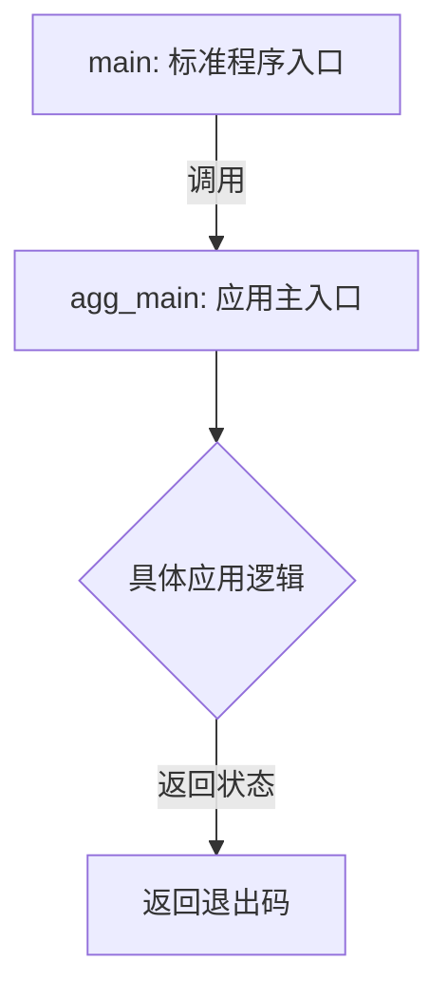

#### 带注释源码

```cpp
//----------------------------------------------------------------------------
// 函数声明：AGG 应用的主入口点
// 此函数的具体实现通常由用户编写，不在此平台支持代码中
//----------------------------------------------------------------------------
int agg_main(int argc, char* argv[]);

//----------------------------------------------------------------------------
// 标准主函数：程序的真正入口
// 它仅仅调用用户实现的 agg_main 函数
//----------------------------------------------------------------------------
int main(int argc, char* argv[])
{
    // 将命令行参数传递给应用主入口函数，并返回其结果作为程序的退出码
    return agg_main(argc, argv);
}
```


### `main`

该函数为C++标准程序入口点，接收命令行参数并将其传递给AGG库的`agg_main`函数执行，是整个应用程序的启动入口。

参数：

- `argc`：`int`，命令行参数个数（包含程序本身名称）
- `argv`：`char*`，指向命令行参数数组的指针

返回值：`int`，返回程序退出状态码给操作系统

#### 流程图

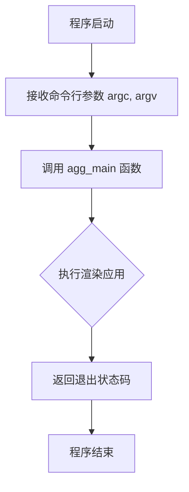

#### 带注释源码

```cpp
// 程序入口函数，C++标准主函数
// argc: 命令行参数个数
// argv: 命令行参数数组指针
int main(int argc, char* argv[])
{
    // 将命令行参数传递给 agg_main 函数并返回其结果
    // agg_main 是 AGG 库的实际主函数实现
    return agg_main(argc, argv);
}
```


### `platform_specific.platform_specific(pix_format_e format, bool flip_y)`

该构造函数是 Anti-Grain Geometry (AGG) 库中 SDL 平台支持类的核心初始化方法，负责根据指定的像素格式和Y轴翻转配置，初始化SDL所需的像素掩码（RGB/A通道）和位深（bpp），为后续的图形渲染创建正确的像素格式环境。

参数：

- `format`：`pix_format_e`，指定目标像素格式（如RGB565、RGBA32等），决定颜色通道的组织方式
- `flip_y`：`bool`，指定是否翻转Y轴坐标，影响后续渲染时的行顺序处理

返回值：无（构造函数）

#### 流程图

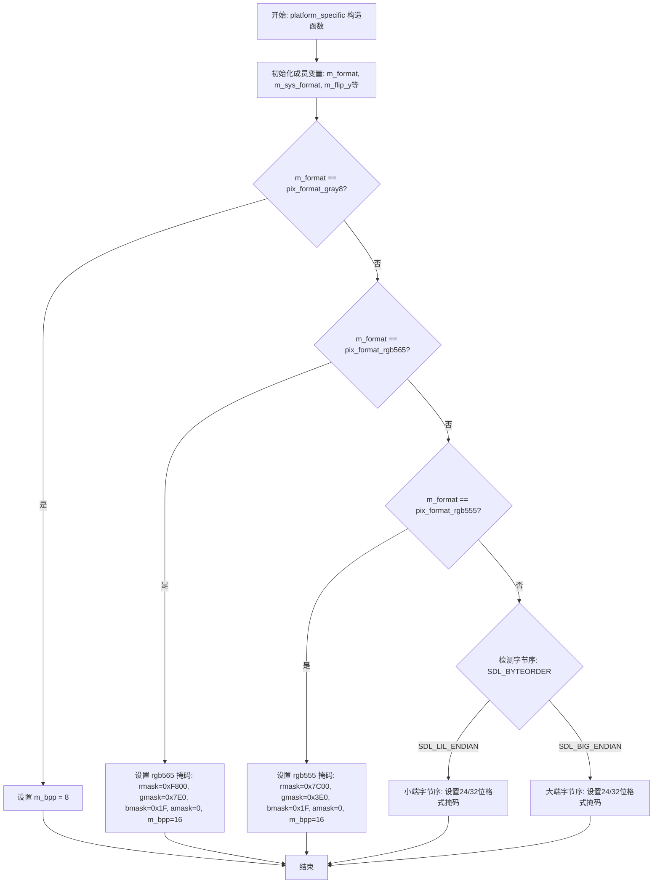

#### 带注释源码

```cpp
//------------------------------------------------------------------------
// platform_specific 构造函数
// 功能: 初始化SDL像素格式和掩码，根据format设置对应的位深和颜色通道掩码
// 参数:
//   format - pix_format_e类型，指定像素格式
//   flip_y - bool类型，指定是否翻转Y轴
//------------------------------------------------------------------------
platform_specific::platform_specific(pix_format_e format, bool flip_y) :
    m_format(format),                      // 保存传入的像素格式
    m_sys_format(pix_format_undefined),    // 初始化系统格式为未定义
    m_flip_y(flip_y),                      // 保存Y轴翻转标志
    m_bpp(0),                               // 初始化位深为0
    m_sys_bpp(0),                           // 初始化系统位深为0
    m_update_flag(true),                   // 设置更新标志为true，需要重绘
    m_resize_flag(true),                   // 设置调整大小标志为true
    m_initialized(false),                  // 标记为未初始化状态
    m_surf_screen(0),                      // 初始化屏幕表面指针为NULL
    m_surf_window(0),                      // 初始化窗口表面指针为NULL
    m_cur_x(0),                             // 初始化当前鼠标X坐标
    m_cur_y(0)                              // 初始化当前鼠标Y坐标
{
    // 初始化图像表面数组为0
    memset(m_surf_img, 0, sizeof(m_surf_img));

    // 根据像素格式设置对应的位深和掩码
    switch(m_format)
    {
        // 8位灰度格式
        case pix_format_gray8:
            m_bpp = 8;  // 设置为8位色深
            break;

        // RGB565 16位格式 (5-6-5)
        case pix_format_rgb565:
            m_rmask = 0xF800;  // 红色掩码: 1111100000000000
            m_gmask = 0x7E0;   // 绿色掩码: 0000011111100000
            m_bmask = 0x1F;    // 蓝色掩码: 0000000000011111
            m_amask = 0;       // 无alpha通道
            m_bpp = 16;        // 16位色深
            break;

        // RGB555 16位格式 (5-5-5)
        case pix_format_rgb555:
            m_rmask = 0x7C00;  // 红色掩码: 0111110000000000
            m_gmask = 0x3E0;   // 绿色掩码: 0000001111100000
            m_bmask = 0x1F;    // 蓝色掩码: 0000000000011111
            m_amask = 0;       // 无alpha通道
            m_bpp = 16;        // 16位色深
            break;
        
        // 以下根据系统字节序处理24/32位格式
#if SDL_BYTEORDER == SDL_LIL_ENDIAN
        // 小端系统 (x86) 的24位格式
        case pix_format_rgb24:
            m_rmask = 0xFF;        // 红色在最低字节
            m_gmask = 0xFF00;      // 绿色在中间字节
            m_bmask = 0xFF0000;    // 蓝色在最高字节
            m_amask = 0;
            m_bpp = 24;
            break;

        case pix_format_bgr24:
            m_rmask = 0xFF0000;    // 红色在最高字节
            m_gmask = 0xFF00;      // 绿色在中间字节
            m_bmask = 0xFF;        // 蓝色在最低字节
            m_amask = 0;
            m_bpp = 24;
            break;

        // 小端系统32位格式
        case pix_format_bgra32:
            m_rmask = 0xFF0000;
            m_gmask = 0xFF00;
            m_bmask = 0xFF;
            m_amask = 0xFF000000;  // alpha在最高字节
            m_bpp = 32;
            break;

        case pix_format_abgr32:
            m_rmask = 0xFF000000;
            m_gmask = 0xFF0000;
            m_bmask = 0xFF00;
            m_amask = 0xFF;        // alpha在最低字节
            m_bpp = 32;
            break;

        case pix_format_argb32:
            m_rmask = 0xFF00;
            m_gmask = 0xFF0000;
            m_bmask = 0xFF000000;
            m_amask = 0xFF;
            m_bpp = 32;
            break;

        case pix_format_rgba32:
            m_rmask = 0xFF;
            m_gmask = 0xFF00;
            m_bmask = 0xFF0000;
            m_amask = 0xFF000000;
            m_bpp = 32;
            break;
#else 
        // 大端系统 (PowerPC/Mac) 的24位格式
        case pix_format_rgb24:
            m_rmask = 0xFF0000;    // 红色在最高字节
            m_gmask = 0xFF00;     // 绿色在中间字节
            m_bmask = 0xFF;       // 蓝色在最低字节
            m_amask = 0;
            m_bpp = 24;
            break;

        case pix_format_bgr24:
            m_rmask = 0xFF;
            m_gmask = 0xFF00;
            m_bmask = 0xFF0000;
            m_amask = 0;
            m_bpp = 24;
            break;

        // 大端系统32位格式
        case pix_format_bgra32:
            m_rmask = 0xFF00;
            m_gmask = 0xFF0000;
            m_bmask = 0xFF000000;
            m_amask = 0xFF;
            m_bpp = 32;
            break;

        case pix_format_abgr32:
            m_rmask = 0xFF;
            m_gmask = 0xFF00;
            m_bmask = 0xFF0000;
            m_amask = 0xFF000000;
            m_bpp = 32;
            break;

        case pix_format_argb32:
            m_rmask = 0xFF0000;
            m_gmask = 0xFF00;
            m_bmask = 0xFF;
            m_amask = 0xFF000000;
            m_bpp = 32;
            break;

        case pix_format_rgba32:
            m_rmask = 0xFF000000;
            m_gmask = 0xFF0000;
            m_bmask = 0xFF00;
            m_amask = 0xFF;
            m_bpp = 32;
            break;
#endif
    }
}
```

### 类的完整信息

**类名：** `platform_specific`

**类描述：** SDL平台特定的实现类，负责管理SDL图形上下文的底层细节，包括表面（Surface）管理、像素格式转换、事件处理和渲染缓冲区的关联。

**类字段（部分关键字段）：**

| 字段名称 | 类型 | 描述 |
|---------|------|------|
| `m_format` | `pix_format_e` | 当前使用的像素格式 |
| `m_sys_format` | `pix_format_e` | 系统原生像素格式 |
| `m_flip_y` | `bool` | Y轴翻转标志 |
| `m_bpp` | `unsigned` | 位深（每像素比特数） |
| `m_rmask` | `unsigned` | 红色通道掩码 |
| `m_gmask` | `unsigned` | 绿色通道掩码 |
| `m_bmask` | `unsigned` | 蓝色通道掩码 |
| `m_amask` | `unsigned` | Alpha通道掩码 |
| `m_update_flag` | `bool` | 窗口需要更新的标志 |
| `m_resize_flag` | `bool` | 窗口调整大小的标志 |
| `m_initialized` | `bool` | 初始化完成标志 |
| `m_surf_screen` | `SDL_Surface*` | 屏幕表面（硬件） |
| `m_surf_window` | `SDL_Surface*` | 窗口表面（用于渲染） |
| `m_surf_img` | `SDL_Surface*[]` | 图像表面数组 |

### 关键组件信息

1. **SDL_Surface**：SDL图形表面结构，用于存储像素数据
2. **pix_format_e**：AGG定义的像素格式枚举，包含gray8、rgb565、rgb555、rgb24、bgr24、bgra32、abgr32、argb32、rgba32等
3. **SDL_BYTEORDER**：SDL字节序宏，用于区分小端和大端系统
4. **颜色掩码 (rmask/gmask/bmask/amask)**：用于SDL_CreateRGBSurface创建表面时指定像素格式

### 潜在技术债务与优化空间

1. **缺少默认分支处理**：switch语句没有default分支，当传入未知格式时，m_bpp保持0，可能导致后续创建表面失败而缺乏明确错误提示
2. **硬编码的掩码值**：颜色通道掩码直接硬编码，缺乏灵活性，应考虑从SDL_PixelFormat动态获取
3. **不支持所有格式**：代码未处理pix_format_undefined等边界情况
4. **缺乏错误处理**：构造函数中的switch设置若失败（如未知格式），没有抛出异常或返回错误状态

### 其它项目

**设计目标：** 提供跨平台的像素格式抽象，使AGG库能够利用SDL在多种操作系统上创建图形窗口和渲染表面。

**约束条件：**
- 依赖于SDL库（1.2版本）
- 必须处理不同CPU架构的字节序差异（little-endian vs big-endian）
- 像素格式必须与SDL支持的格式兼容

**外部依赖：**
- SDL库（SDL.h, SDL_byteorder.h）
- AGG核心库（platform/agg_platform_support.h）
- 标准C库（string.h用于memset和strcpy）


### `platform_specific::~platform_specific()`

析构函数，释放所有SDL表面资源，包括图像表面、窗口表面和屏幕表面，以防止内存泄漏。

参数： 无

返回值： 无（析构函数不返回值）

#### 流程图

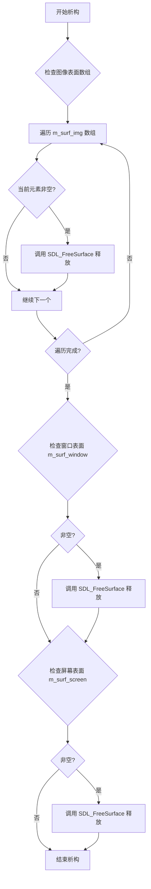

#### 带注释源码

```cpp
//------------------------------------------------------------------------
// 析构函数：platform_specific::~platform_specific()
// 功能：释放所有SDL表面资源，防止内存泄漏
//------------------------------------------------------------------------
platform_specific::~platform_specific()
{
    int i;
    // 遍历所有图像表面（max_images个），从后往前释放
    for(i = platform_support::max_images - 1; i >= 0; --i)
    {
        // 如果图像表面存在，则释放
        if(m_surf_img[i]) SDL_FreeSurface(m_surf_img[i]);
    }
    // 如果窗口表面存在，则释放
    if(m_surf_window) SDL_FreeSurface(m_surf_window);
    // 如果屏幕表面存在，则释放
    if(m_surf_screen) SDL_FreeSurface(m_surf_screen);
}
```


### `platform_support::platform_support`

该构造函数是 Anti-Grain Geometry (AGG) 库平台支持层的入口点，负责初始化 SDL 视频子系统、分配平台特定实现对象（`platform_specific`）以及设置默认的渲染参数（如像素格式、Y轴翻转行为）和窗口标题。

参数：

-  `format`：`pix_format_e`，指定渲染使用的像素格式（如灰度、RGB565、RGBA32等）。
-  `flip_y`：`bool`，指定是否翻转Y轴坐标，以适配不同的坐标系系统。

返回值：`void`（构造函数，无显式返回值，主要功能是初始化对象状态）。

#### 流程图

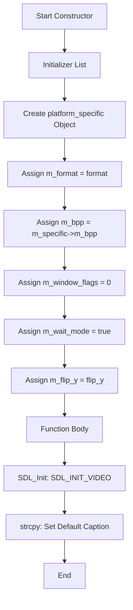

#### 带注释源码

```cpp
//----------------------------------------------------------------------------
// Constructor: platform_support
// Initializes the AGG platform support layer using SDL.
//----------------------------------------------------------------------------
platform_support::platform_support(pix_format_e format, bool flip_y) :
    // 在初始化列表中优先创建平台特定对象，该对象负责解析像素格式
    // 并设置对应的掩码（mask）和位深度（bpp）
    m_specific(new platform_specific(format, flip_y)),
    m_format(format),
    // 从平台特定对象中获取计算出的位深度
    m_bpp(m_specific->m_bpp),
    // 窗口标志默认为0
    m_window_flags(0),
    // 默认进入等待事件模式
    m_wait_mode(true),
    m_flip_y(flip_y)
{
    // 初始化 SDL 视频子系统。如果失败，后续的 init() 调用会处理错误，
    // 但构造函数本身不抛出异常。
    SDL_Init(SDL_INIT_VIDEO);
    
    // 设置默认窗口标题
    strcpy(m_caption, "Anti-Grain Geometry Application");
}
```


### `platform_support::~platform_support()`

该析构函数是 `platform_support` 类的析构函数，负责释放平台支持对象占用的资源，特别是通过删除 `m_specific` 指针来释放底层 `platform_specific` 对象。

参数：无

返回值：无（析构函数不返回值）

#### 流程图

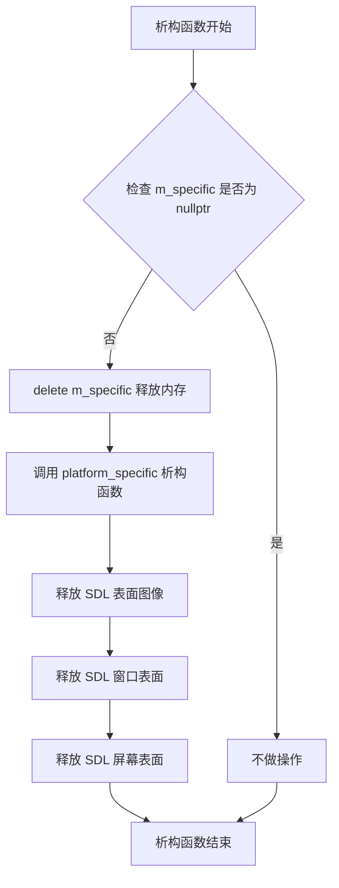

#### 带注释源码

```cpp
//------------------------------------------------------------------------
// platform_support::~platform_support()
// 析构函数，释放平台支持对象
//------------------------------------------------------------------------
platform_support::~platform_support()
{
    // 删除 platform_specific 对象指针
    // 这会触发 platform_specific 的析构函数
    // 该析构函数会负责释放所有 SDL 表面对象
    delete m_specific;
}
```

#### 关联的 `platform_specific` 析构函数

```cpp
//------------------------------------------------------------------------
// platform_specific::~platform_specific()
// 平台特定对象的析构函数，负责释放所有 SDL 表面资源
//------------------------------------------------------------------------
platform_specific::~platform_specific()
{
    int i;
    // 逆序遍历所有图像表面并释放
    for(i = platform_support::max_images - 1; i >= 0; --i)
    {
        if(m_surf_img[i]) SDL_FreeSurface(m_surf_img[i]);
    }
    // 释放窗口表面
    if(m_surf_window) SDL_FreeSurface(m_surf_window);
    // 释放屏幕表面
    if(m_surf_screen) SDL_FreeSurface(m_surf_screen);
}
```

#### 关键点说明

1. **内存管理**：通过 `delete m_specific` 释放堆分配的 `platform_specific` 对象
2. **级联释放**：删除 `m_specific` 会自动调用 `platform_specific` 的析构函数，该函数负责释放所有 SDL 表面
3. **资源清理顺序**：按照逆序（最后创建的最先释放）释放图像表面，然后释放窗口和屏幕表面
4. **空指针检查**：在释放前检查表面指针是否为 `nullptr`，避免重复释放


### platform_support.caption

设置窗口标题，用于更新应用程序窗口的标题栏文本

参数：

- `cap`：`const char*`，新的窗口标题字符串

返回值：`void`，无返回值

#### 流程图

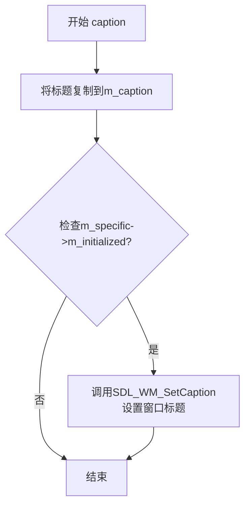

#### 带注释源码

```cpp
//------------------------------------------------------------------------
// 设置窗口标题
// 参数:
//   cap - 指向新窗口标题的C字符串
// 返回值: void
//------------------------------------------------------------------------
void platform_support::caption(const char* cap)
{
    // 使用strcpy将传入的标题字符串复制到成员变量m_caption中保存
    strcpy(m_caption, cap);
    
    // 仅当平台特定层已初始化后才调用SDL函数更新实际窗口标题
    // 这是因为在init()调用之前，SDL窗口尚未创建，无法设置标题
    if(m_specific->m_initialized)
    {
        // 调用SDL_WM_SetCaption设置窗口标题
        // 参数: cap-新标题, 0-不设置图标
        SDL_WM_SetCaption(cap, 0);
    }
}
```


### `platform_support::init`

初始化 SDL 视频模式并创建渲染表面，用于设置窗口尺寸、创建屏幕缓冲区和窗口缓冲区，并将像素数据附加到渲染缓冲区以供后续绘图使用。

参数：

- `width`：`unsigned`，窗口的宽度（像素）
- `height`：`unsigned`，窗口的高度（像素）
- `flags`：`unsigned`，窗口标志位，用于控制硬件加速和窗口可调整大小等特性

返回值：`bool`，初始化成功返回 true，失败返回 false（如视频模式设置失败或表面创建失败）

#### 流程图

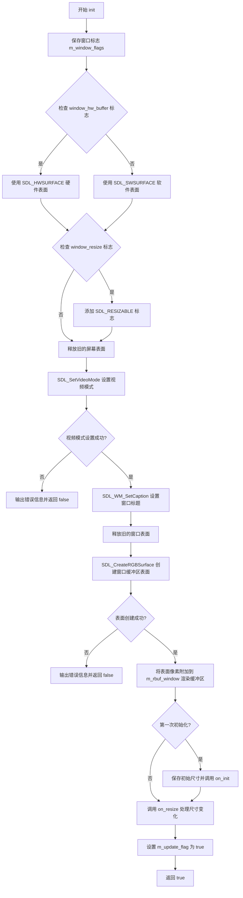

#### 带注释源码

```cpp
//------------------------------------------------------------------------
// 初始化 SDL 视频模式并创建渲染表面
// 参数: width - 窗口宽度, height - 窗口高度, flags - 窗口标志
// 返回: bool - 初始化成功返回 true, 失败返回 false
//------------------------------------------------------------------------
bool platform_support::init(unsigned width, unsigned height, unsigned flags)
{
    // 1. 保存窗口标志位，用于后续窗口操作
    m_window_flags = flags;
    
    // 2. 根据标志位确定 SDL 表面类型
    unsigned wflags = SDL_SWSURFACE;  // 默认使用软件表面

    // 3. 检查是否使用硬件缓冲区（window_hw_buffer 标志）
    if(m_window_flags & window_hw_buffer)
    {
        wflags = SDL_HWSURFACE;  // 切换到硬件表面
    }

    // 4. 检查是否允许调整窗口大小（window_resize 标志）
    if(m_window_flags & window_resize)
    {
        wflags |= SDL_RESIZABLE;  // 添加可调整大小标志
    }

    // 5. 释放已存在的屏幕表面，防止内存泄漏
    if(m_specific->m_surf_screen) SDL_FreeSurface(m_specific->m_surf_screen);

    // 6. 调用 SDL_SetVideoMode 设置视频模式
    // 参数: 宽度, 高度, 颜色深度(位), 表面标志
    m_specific->m_surf_screen = SDL_SetVideoMode(width, height, m_bpp, wflags);
    
    // 7. 检查视频模式设置是否成功
    if(m_specific->m_surf_screen == 0) 
    {
        // 输出错误信息到标准错误流
        fprintf(stderr, 
                "Unable to set %dx%d %d bpp video: %s\n", 
                width, 
                height, 
                m_bpp, 
                ::SDL_GetError());
        return false;  // 初始化失败，返回 false
    }

    // 8. 设置窗口标题（使用之前保存的标题）
    SDL_WM_SetCaption(m_caption, 0);

    // 9. 释放已存在的窗口表面
    if(m_specific->m_surf_window) SDL_FreeSurface(m_specific->m_surf_window);

    // 10. 创建窗口缓冲区表面（用于双缓冲渲染）
    // 使用硬件表面以提高渲染性能
    m_specific->m_surf_window = 
        SDL_CreateRGBSurface(SDL_HWSURFACE, 
                             m_specific->m_surf_screen->w,   // 使用屏幕宽度
                             m_specific->m_surf_screen->h,   // 使用屏幕高度
                             m_specific->m_surf_screen->format->BitsPerPixel,  // 颜色深度
                             m_specific->m_rmask,   // 红色通道掩码
                             m_specific->m_gmask,   // 绿色通道掩码
                             m_specific->m_bmask,   // 蓝色通道掩码
                             m_specific->m_amask);  // Alpha 通道掩码

    // 11. 检查窗口表面创建是否成功
    if(m_specific->m_surf_window == 0) 
    {
        fprintf(stderr, 
                "Unable to create image buffer %dx%d %d bpp: %s\n", 
                width, 
                height, 
                m_bpp, 
                SDL_GetError());
        return false;  // 初始化失败，返回 false
    }

    // 12. 将窗口表面的像素数据附加到渲染缓冲区
    // 根据 m_flip_y 决定是否翻转 Y 轴（用于不同的坐标系）
    m_rbuf_window.attach((unsigned char*)m_specific->m_surf_window->pixels, 
                         m_specific->m_surf_window->w, 
                         m_specific->m_surf_window->h, 
                         m_flip_y ? -m_specific->m_surf_window->pitch : 
                                     m_specific->m_surf_window->pitch);

    // 13. 如果是首次初始化，执行初始化回调
    if(!m_specific->m_initialized)
    {
        m_initial_width = width;   // 保存初始宽度
        m_initial_height = height; // 保存初始高度
        on_init();                 // 调用虚函数，允许子类执行初始化操作
        m_specific->m_initialized = true;  // 标记为已初始化
    }
    
    // 14. 调用尺寸变化回调，通知渲染系统窗口大小已改变
    on_resize(m_rbuf_window.width(), m_rbuf_window.height());
    
    // 15. 设置更新标志，触发首次绘制
    m_specific->m_update_flag = true;
    
    // 16. 初始化成功，返回 true
    return true;
}
```


### `platform_support.update_window`

该函数将窗口表面（offscreen buffer）的渲染内容一次性 blit 到屏幕表面，并通知 SDL 刷新整个显示区域，从而将图形渲染结果最终呈现在用户屏幕上。

参数：空（无参数）

返回值：`void`，无返回值

#### 流程图

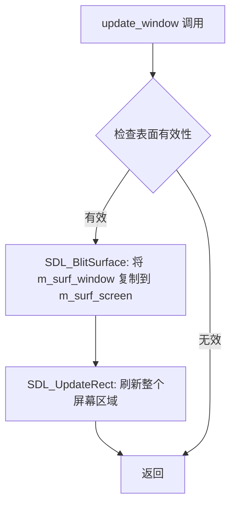

#### 带注释源码

```cpp
//------------------------------------------------------------------------
// 将窗口表面内容更新到屏幕
// 该函数是渲染流程的最后一环，负责将离屏缓冲区（m_surf_window）
// 中的图像数据一次性拷贝到屏幕表面（m_surf_screen），并通知
// SDL 刷新显示。
//------------------------------------------------------------------------
void platform_support::update_window()
{
    // 步骤1: 使用 Blit 操作将窗口表面（离屏渲染缓冲）拷贝到屏幕表面
    // 参数说明:
    //   - m_specific->m_surf_window: 源表面，包含当前帧的完整渲染内容
    //   - 0: 源矩形，NULL 表示复制整个表面
    //   - m_specific->m_surf_screen: 目标表面，即最终显示的屏幕
    //   - 0: 目标矩形位置，NULL 表示复制到目标表面左上角
    SDL_BlitSurface(m_specific->m_surf_window, 0, m_specific->m_surf_screen, 0);

    // 步骤2: 通知 SDL 更新指定矩形区域
    // 参数说明:
    //   - m_specific->m_surf_screen: 要更新的表面
    //   - 0, 0: 更新区域的左上角坐标
    //   - 0, 0: 宽度和高度，0 表示更新整个表面
    // 这一步是必须的，只有调用此函数后内容才会真正显示在屏幕上
    SDL_UpdateRect(m_specific->m_surf_screen, 0, 0, 0, 0);
}
```


### `platform_support.run()`

#### 描述

这是 Anti-Grain Geometry (AGG) 库在 SDL 平台下的核心消息循环（主事件循环）。它负责持续不断地获取 SDL 事件（如窗口调整、键盘输入、鼠标移动），根据事件类型调用对应的虚函数（如 `on_key`, `on_mouse_move`），并管理渲染周期（dirty flag）和空闲处理（idle processing），直到收到退出信号。

#### 参数

该函数为类的成员方法，签名如下：
`int platform_support::run()`

- （无显式参数，仅包含隐式的 `this` 指针）

#### 返回值

- `int`：返回 0 表示程序正常退出（接收到 `SDL_QUIT` 事件）；返回 `false` (通常隐式转换为 0 或在 resize 失败时跳出) 表示异常终止。

#### 流程图

```mermaid
flowchart TD
    A([Start run()]) --> B{ Forever Loop }
    
    B --> C{m_update_flag?}
    C -- Yes --> D[on_draw]
    D --> E[update_window]
    E --> F[Set m_update_flag = false]
    C -- No --> F
    
    F --> G{m_wait_mode?}
    
    G -- Yes --> H[SDL_WaitEvent]
    G -- No --> I{SDL_PollEvent}
    
    H --> J{Event Received?}
    I -- Yes --> J
    I -- No --> K[on_idle]
    K --> B
    
    J -- Yes --> L{Event Type?}
    
    L -- SDL_QUIT --> M[Break Loop]
    L -- SDL_VIDEORESIZE --> N[init / on_resize]
    L -- SDL_KEYDOWN --> O[Process Key / on_key]
    L -- SDL_MOUSEMOTION --> P[Process Motion / on_mouse_move]
    L -- SDL_MOUSEBUTTONDOWN --> Q[Process Down / on_mouse_button_down]
    L -- SDL_MOUSEBUTTONUP --> R[Process Up / on_mouse_button_up]
    
    N --> B
    O --> B
    P --> B
    Q --> B
    R --> B
    
    M --> Z([Return 0])
```

#### 带注释源码

```cpp
//----------------------------------------------------------------------------
// 主事件循环 - platform_support::run()
//----------------------------------------------------------------------------
int platform_support::run()
{
    SDL_Event event;      // SDL 事件结构体
    bool ev_flag = false; // 事件处理标志

    // 无限循环，保持程序运行
    for(;;)
    {
        // 1. 渲染管理：如果标记为需要更新，则执行绘制并刷新窗口
        if(m_specific->m_update_flag)
        {
            on_draw();            // 调用用户的绘制回调
            update_window();      // 将内存 Surface 复制到屏幕
            m_specific->m_update_flag = false; // 重置标志
        }

        ev_flag = false;

        // 2. 事件获取模式：根据 m_wait_mode 决定是阻塞等待还是轮询
        if(m_wait_mode)
        {
            // 阻塞模式：等待用户输入（省CPU）
            SDL_WaitEvent(&event);
            ev_flag = true;
        }
        else
        {
            // 非阻塞模式：处理完当前事件队列后，执行空闲任务
            if(SDL_PollEvent(&event))
            {
                ev_flag = true;
            }
            else
            {
                // 没有事件时触发空闲回调，用于动画或后台任务
                on_idle();
            }
        }

        // 3. 事件分发与处理
        if(ev_flag)
        {
            // 退出事件
            if(event.type == SDL_QUIT)
            {
                break;
            }

            int y; // 临时变量，用于Y轴坐标转换（如果flip_y）
            unsigned flags = 0;

            switch (event.type) 
            {
            // 窗口调整大小
            case SDL_VIDEORESIZE:
                // 重新初始化视频模式
                if(!init(event.resize.w, event.resize.h, m_window_flags)) return false;
                on_resize(m_rbuf_window.width(), m_rbuf_window.height());
                // 更新仿射变换矩阵以适应新窗口
                trans_affine_resizing(event.resize.w, event.resize.h);
                m_specific->m_update_flag = true;
                break;

            // 键盘按下
            case SDL_KEYDOWN:
                {
                    flags = 0;
                    // 检查修饰键
                    if(event.key.keysym.mod & KMOD_SHIFT) flags |= kbd_shift;
                    if(event.key.keysym.mod & KMOD_CTRL)  flags |= kbd_ctrl;

                    bool left  = false;
                    bool up    = false;
                    bool right = false;
                    bool down  = false;

                    // 简单的方向键映射
                    switch(event.key.keysym.sym)
                    {
                    case key_left:  left = true; break;
                    case key_up:    up = true; break;
                    case key_right: right = true; break;
                    case key_down:  down = true; break;
                    }

                    // 优先处理控件（如有）的键盘导航
                    if(m_ctrls.on_arrow_keys(left, right, down, up))
                    {
                        on_ctrl_change();
                        force_redraw();
                    }
                    else
                    {
                        // 否则传递给用户的键盘回调
                        on_key(m_specific->m_cur_x,
                               m_specific->m_cur_y,
                               event.key.keysym.sym,
                               flags);
                    }
                }
                break;

            // 鼠标移动
            case SDL_MOUSEMOTION:
                // 根据是否翻转Y轴调整坐标
                y = m_flip_y ? m_rbuf_window.height() - event.motion.y : event.motion.y;

                m_specific->m_cur_x = event.motion.x;
                m_specific->m_cur_y = y;
                flags = 0;
                // 检查鼠标按键状态
                if(event.motion.state & SDL_BUTTON_LMASK) flags |= mouse_left;
                if(event.motion.state & SDL_BUTTON_RMASK) flags |= mouse_right;

                // 处理控件的拖拽
                if(m_ctrls.on_mouse_move(m_specific->m_cur_x, 
                                         m_specific->m_cur_y,
                                         (flags & mouse_left) != 0))
                {
                    on_ctrl_change();
                    force_redraw();
                }
                else
                {
                    on_mouse_move(m_specific->m_cur_x, 
                                  m_specific->m_cur_y, 
                                  flags);
                }
                // 技术债务/优化点：手动清空事件队列以消除拖影（Hack）
                {
                    SDL_Event eventtrash;
                    while (SDL_PeepEvents(&eventtrash, 1, SDL_GETEVENT, SDL_EVENTMASK(SDL_MOUSEMOTION))!=0){;}
                }
                break;
            
            // 鼠标按下
            case SDL_MOUSEBUTTONDOWN:
                y = m_flip_y
                    ? m_rbuf_window.height() - event.button.y
                    : event.button.y;

                m_specific->m_cur_x = event.button.x;
                m_specific->m_cur_y = y;
                flags = 0;
                switch(event.button.button)
                {
                case SDL_BUTTON_LEFT:
                    {
                        flags = mouse_left;
                        // 处理控件的点击选中
                        if(m_ctrls.on_mouse_button_down(m_specific->m_cur_x, m_specific->m_cur_y))
                        {
                            m_ctrls.set_cur(m_specific->m_cur_x, m_specific->m_cur_y);
                            on_ctrl_change();
                            force_redraw();
                        }
                        else
                        {
                            // 如果没点中控件，检测是否点中了控件区域
                            if(m_ctrls.in_rect(m_specific->m_cur_x, m_specific->m_cur_y))
                            {
                                if(m_ctrls.set_cur(m_specific->m_cur_x, m_specific->m_cur_y))
                                {
                                    on_ctrl_change();
                                    force_redraw();
                                }
                            }
                            else
                            {
                                on_mouse_button_down(m_specific->m_cur_x, m_specific->m_cur_y, flags);
                            }
                        }
                    }
                    break;
                case SDL_BUTTON_RIGHT:
                    flags = mouse_right;
                    on_mouse_button_down(m_specific->m_cur_x, m_specific->m_cur_y, flags);
                    break;
                }
                break;
            
            // 鼠标抬起
            case SDL_MOUSEBUTTONUP:
                y = m_flip_y
                    ? m_rbuf_window.height() - event.button.y
                    : event.button.y;

                m_specific->m_cur_x = event.button.x;
                m_specific->m_cur_y = y;
                flags = 0;
                // 处理控件的鼠标释放
                if(m_ctrls.on_mouse_button_up(m_specific->m_cur_x, m_specific->m_cur_y))
                {
                    on_ctrl_change();
                    force_redraw();
                }
                on_mouse_button_up(m_specific->m_cur_x, m_specific->m_cur_y, flags);
                break;
            }
        }
    }
    return 0;
}
```

### 潜在的技术债务与优化空间

1.  **事件队列清空操作 (Line 189-191)**: 
    `while (SDL_PeepEvents(&eventtrash, 1, SDL_GETEVENT, SDL_EVENTMASK(SDL_MOUSEMOTION))!=0){;})`
    这是一个非常规的“脏处理”方式，用来在鼠标移动时清空事件队列以减少延迟或重影。这种做法依赖于 SDL 内部的细节，且没有注释解释其必要性，代码可读性差，且可能在未来 SDL 版本中行为改变。

2.  **UI 控件逻辑与事件循环的高度耦合**:
    `m_ctrls` (AGG 的控件类) 的事件处理（如 `on_arrow_keys`, `on_mouse_move`）直接硬编码在 `run()` 方法的 `switch` 块中。这使得 `platform_support` 类承担了过多的职责（既是窗口管理，又是 UI 事件路由器）。建议将事件预处理逻辑抽象到单独的类或策略模式中。

3.  **缺乏 Default 分支**:
    `switch` 语句没有 `default` 分支。如果收到未处理的事件类型，代码会悄然忽略，可能导致某些新型输入设备或未来 SDL 版本的兼容性问题。

4.  **错误处理不足**:
    在 `run()` 内部，除了窗口 Resize 失败返回 `false` 外，其他事件处理（如 `on_key`, `on_mouse_move`）均假设总是成功。如果 `on_draw` 或 `on_idle` 抛出异常，程序会直接崩溃。缺少 try-catch 保护。

5.  **硬编码的鼠标按键映射**:
    只处理了 `SDL_BUTTON_LEFT` 和 `SDL_BUTTON_RIGHT`，对于鼠标中键或其他按钮未作处理。


### `platform_support.img_ext()`

该函数是`platform_support`类的常量成员方法，用于获取当前平台支持库所默认使用的图像文件扩展名。在SDL实现中，该方法简单返回BMP格式的扩展名`.bmp`，表明该平台支持类默认处理BMP格式的图像文件加载与保存操作。

参数：无

返回值：`const char*`，返回图像文件的默认扩展名字符串（".bmp"）

#### 流程图

```mermaid
flowchart TD
    A[开始 img_ext] --> B{方法调用}
    B --> C[返回字符串常量 ".bmp"]
    C --> D[结束]
```

#### 带注释源码

```cpp
//------------------------------------------------------------------------
// 获取图像文件扩展名
// 该方法返回平台默认支持的图像文件扩展名
// 对于SDL平台实现，当前仅支持BMP格式
//------------------------------------------------------------------------
const char* platform_support::img_ext() const 
{ 
    // 返回BMP格式的扩展名字符串常量
    // 该字符串为静态分配，无需释放
    return ".bmp"; 
}
```


### `platform_support.full_file_name`

该函数用于获取完整文件名，在当前SDL平台实现中直接返回传入的文件名字符串，不进行任何路径处理或转换。

参数：

- `file_name`：`const char*`，输入的文件名字符串

返回值：`const char*`，返回完整的文件名字符串（在此实现中直接返回原字符串）

#### 流程图

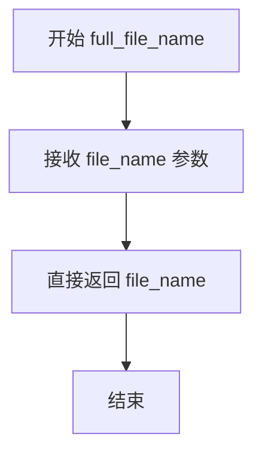

#### 带注释源码

```cpp
//------------------------------------------------------------------------
// 返回完整文件名
// 在SDL平台实现中，直接返回传入的文件名，不做任何处理
// 这是因为SDL版本的platform_support主要用于简单的演示和测试
// 不需要复杂的文件路径处理逻辑
//------------------------------------------------------------------------
const char* platform_support::full_file_name(const char* file_name)
{
    // 直接返回输入的文件名字符串
    // 注释：当前实现仅为占位符，未实现完整的文件路径拼接功能
    return file_name;
}
```


### `platform_support.load_img`

该函数用于将 BMP 格式的图像文件加载到指定的图像槽位中，支持自动添加 `.bmp` 扩展名，并进行像素格式转换以匹配应用程序当前使用的像素格式。加载成功后，图像数据将被附加到内部渲染缓冲区供后续渲染使用。

参数：

- `idx`：`unsigned`，目标图像槽位索引，必须小于 `max_images`
- `file`：`const char*`，要加载的 BMP 文件路径或文件名

返回值：`bool`，成功返回 `true`，失败返回 `false`

#### 流程图

```mermaid
flowchart TD
    A[开始 load_img] --> B{idx < max_images?}
    B -->|否| C[返回 false]
    B -->|是| D{已存在图像?}
    D -->|是| E[释放旧图像表面]
    D -->|否| F[继续]
    E --> F
    F --> G[复制文件名到 fn]
    G --> H{文件名长度 < 4 或<br/>最后4字符不是 '.bmp'?}
    H -->|否| I[继续]
    H -->|是| J[追加 '.bmp' 扩展名]
    J --> I
    I --> K[SDL_LoadBMP 加载文件]
    K --> L{加载成功?}
    L -->|否| M[输出错误信息并返回 false]
    L -->|是| N[创建像素格式结构]
    N --> O[SDL_ConvertSurface 转换格式]
    O --> P{转换成功?}
    P -->|否| Q[释放临时表面并返回 false]
    P -->|是| R[附加像素数据到 m_rbuf_img[idx]]
    R --> S[返回 true]
```

#### 带注释源码

```cpp
//------------------------------------------------------------------------
// 该方法用于将BMP图像加载到指定的图像索引槽位中
// 参数 idx: 图像槽位索引，不能超过max_images-1
// 参数 file: BMP文件路径或文件名
// 返回值: 成功返回true，失败返回false
//------------------------------------------------------------------------
bool platform_support::load_img(unsigned idx, const char* file)
{
    // 检查索引是否在有效范围内
    if(idx < max_images)
    {
        // 如果该槽位已有图像，先释放旧的SDL表面以避免内存泄漏
        if(m_specific->m_surf_img[idx]) SDL_FreeSurface(m_specific->m_surf_img[idx]);

        // 准备文件名缓冲区
        char fn[1024];
        strcpy(fn, file);
        int len = strlen(fn);
        
        // 如果文件名没有扩展名，自动添加.bmp扩展名
        if(len < 4 || strcmp(fn + len - 4, ".bmp") != 0)
        {
            strcat(fn, ".bmp");
        }

        // 使用SDL加载BMP文件
        SDL_Surface* tmp_surf = SDL_LoadBMP(fn);
        if (tmp_surf == 0) 
        {
            // 加载失败时输出错误信息并返回false
            fprintf(stderr, "Couldn't load %s: %s\n", fn, SDL_GetError());
            return false;
        }

        // 创建像素格式结构，配置为目标应用程序的格式
        SDL_PixelFormat format;
        format.palette = 0;
        format.BitsPerPixel = m_bpp;
        format.BytesPerPixel = m_bpp >> 8;
        format.Rmask = m_specific->m_rmask;
        format.Gmask = m_specific->m_gmask;
        format.Bmask = m_specific->m_bmask;
        format.Amask = m_specific->m_amask;
        format.Rshift = 0;
        format.Gshift = 0;
        format.Bshift = 0;
        format.Ashift = 0;
        format.Rloss = 0;
        format.Gloss = 0;
        format.Bloss = 0;
        format.Aloss = 0;
        format.colorkey = 0;
        format.alpha = 0;

        // 将加载的图像转换为应用程序所需的像素格式
        m_surf_img[idx] = SDL_ConvertSurface(tmp_surf, &format, SDL_SWSURFACE);

        // 释放原始加载的临时表面
        SDL_FreeSurface(tmp_surf);
        
        // 检查转换是否成功
        if(m_specific->m_surf_img[idx] == 0) return false;

        // 将像素数据附加到渲染缓冲区，以便AGG库可以使用该图像
        m_rbuf_img[idx].attach(
            (unsigned char*)m_specific->m_surf_img[idx]->pixels, 
            m_specific->m_surf_img[idx]->w, 
            m_specific->m_surf_img[idx]->h, 
            // 根据是否翻转Y轴来设置pitch（行跨度）的正负
            m_flip_y ? -m_specific->m_surf_img[idx]->pitch : 
                       m_specific->m_surf_img[idx]->pitch
        );
        return true;
    }
    // 索引超出范围时返回false
    return false;
}
```


### `platform_support.save_img`

保存图像到BMP文件。该函数接收图像索引和文件名，将指定的图像保存为BMP格式，如果文件名没有`.bmp`后缀则自动添加。

参数：

- `idx`：`unsigned`，图像索引，用于指定要保存的图像（对应 `m_surf_img[idx]`）
- `file`：`const char*`，目标文件名

返回值：`bool`，成功保存返回 `true`，否则返回 `false`

#### 流程图

```mermaid
flowchart TD
    A[开始] --> B{idx < max_images && m_surf_img[idx] 存在?}
    B -->|否| C[返回 false]
    B -->|是| D[复制文件名到 fn]
    D --> E{len < 4 或 fn 不以 '.bmp' 结尾?}
    E -->|是| F[追加 '.bmp' 后缀]
    E -->|否| G[调用 SDL_SaveBMP 保存文件]
    F --> G
    G --> H{SDL_SaveBMP 返回值 == 0?}
    H -->|是| I[返回 true]
    H -->|否| C
```

#### 带注释源码

```cpp
//------------------------------------------------------------------------
// 保存图像到BMP文件
// 参数:
//   idx  - 图像索引，指定要保存的图像
//   file - 目标文件路径
// 返回值:
//   true 表示成功保存，false 表示失败
//------------------------------------------------------------------------
bool platform_support::save_img(unsigned idx, const char* file)
{
    // 检查索引是否在有效范围内且对应的图像表面存在
    if(idx < max_images && m_specific->m_surf_img[idx])
    {
        char fn[1024];                    // 用于存储完整的文件路径
        strcpy(fn, file);                 // 将输入的文件名复制到 fn
        int len = strlen(fn);             // 获取文件名长度
        
        // 如果文件名长度小于4或不以".bmp"结尾，则添加".bmp"后缀
        if(len < 4 || strcmp(fn + len - 4, ".bmp") != 0)
        {
            strcat(fn, ".bmp");           // 追加 ".bmp" 扩展名
        }
        
        // 调用 SDL_SaveBMP 将图像保存为 BMP 格式
        // 成功返回 0，失败返回非零值
        return SDL_SaveBMP(m_specific->m_surf_img[idx], fn) == 0;
    }
    return false;                         // 索引无效或图像不存在，返回 false
}
```


### `platform_support.create_img`

该函数用于在平台支持类中创建一个指定尺寸的空白图像表面（image surface），常用于离屏渲染或图像处理场景。它通过SDL库创建RGB表面，并在成功创建后将其关联到内部的图像缓冲区中。

参数：

- `idx`：`unsigned`，图像索引，用于指定要创建的图像在图像数组中的位置（索引值必须在 `max_images` 范围内）
- `width`：`unsigned`，要创建的图像表面的宽度（以像素为单位）
- `height`：`unsigned`，要创建的图像表面的高度（以像素为单位）

返回值：`bool`，如果成功创建图像表面则返回 `true`，否则返回 `false`（可能是索引越界或SDL表面创建失败）

#### 流程图

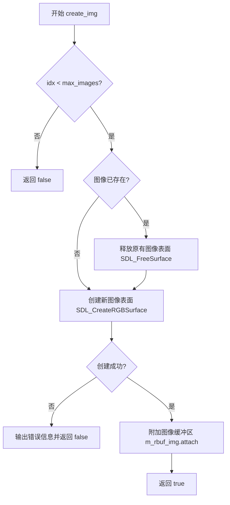

#### 带注释源码

```cpp
//------------------------------------------------------------------------
// 创建一个空白图像表面
// 参数：
//   idx    - 图像索引（必须在 max_images 范围内）
//   width  - 图像宽度（像素）
//   height - 图像高度（像素）
// 返回值：
//   bool   - 成功返回 true，失败返回 false
//------------------------------------------------------------------------
bool platform_support::create_img(unsigned idx, unsigned width, unsigned height)
{
    // 检查索引是否在有效范围内
    if(idx < max_images)
    {
        // 如果该位置已存在图像，先释放旧的表面以避免内存泄漏
        if(m_specific->m_surf_img[idx]) 
            SDL_FreeSurface(m_specific->m_surf_img[idx]);

        // 使用SDL创建RGB表面
        // 参数依次为：表面类型、宽度、高度、位深度、红色掩码、绿色掩码、蓝色掩码、alpha掩码
        m_specific->m_surf_img[idx] = 
            SDL_CreateRGBSurface(SDL_SWSURFACE,  // 软件渲染表面
                                 width,           // 图像宽度
                                 height,          // 图像高度
                                 m_specific->m_surf_screen->format->BitsPerPixel,  // 使用屏幕格式的位深度
                                 m_specific->m_rmask,   // 红色通道掩码
                                 m_specific->m_gmask,   // 绿色通道掩码
                                 m_specific->m_bmask,   // 蓝色通道掩码
                                 m_specific->m_amask);  // Alpha通道掩码

        // 检查表面是否创建成功
        if(m_specific->m_surf_img[idx] == 0) 
        {
            // 输出错误信息到标准错误流
            fprintf(stderr, "Couldn't create image: %s\n", SDL_GetError());
            return false;
        }

        // 将SDL表面附加到AGG的图像缓冲区
        // 参数：像素数据指针、宽度、高度、扫描线间距（pitch）
        // 如果启用了Y轴翻转，则pitch取负值
        m_rbuf_img[idx].attach((unsigned char*)m_specific->m_surf_img[idx]->pixels, 
                               m_specific->m_surf_img[idx]->w, 
                               m_specific->m_surf_img[idx]->h, 
                               m_flip_y ? -m_specific->m_surf_img[idx]->pitch : 
                                           m_specific->m_surf_img[idx]->pitch);

        return true;
    }

    // 索引越界，返回失败
    return false;
}
```


### `platform_support.start_timer`

启动内部计时器，用于测量时间间隔。该函数调用 SDL 的 `SDL_GetTicks()` 获取当前系统时间（以毫秒为单位），并将其存储在平台特定对象的成员变量中，以供后续的 `elapsed_time()` 方法计算经过的时间。

参数：
- （无）

返回值：`void`，无返回值。

#### 流程图

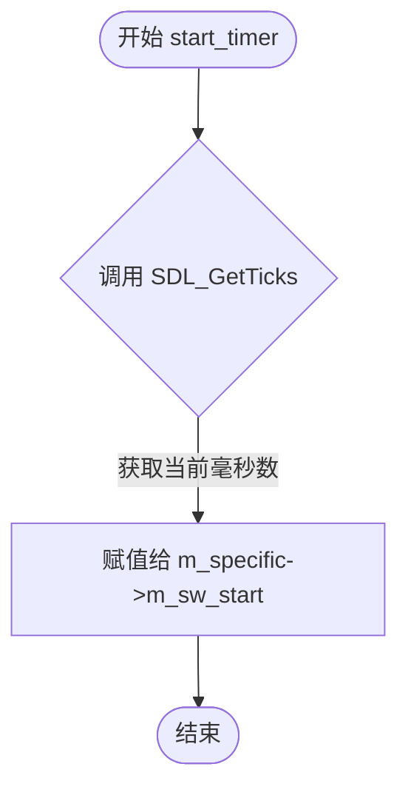

#### 带注释源码

```cpp
//------------------------------------------------------------------------
// 启动计时器
//------------------------------------------------------------------------
void platform_support::start_timer()
{
    // 使用 SDL_GetTicks() 获取从 SDL 库初始化以来的毫秒数
    // 并将其保存到平台特定实现类的成员变量 m_sw_start 中
    // 注意：SDL_GetTicks 返回 Uint32，但目标变量 m_sw_start 定义为 int
    m_specific->m_sw_start = SDL_GetTicks();
}
```


### `platform_support.elapsed_time()`

获取自上次调用 `start_timer()` 以来经过的毫秒数，用于计时性能测量或动画控制。

参数：

- （无参数）

返回值：`double`，返回自上次调用 `start_timer()` 以来经过的毫秒数（毫秒级精度，浮点数）。

#### 流程图

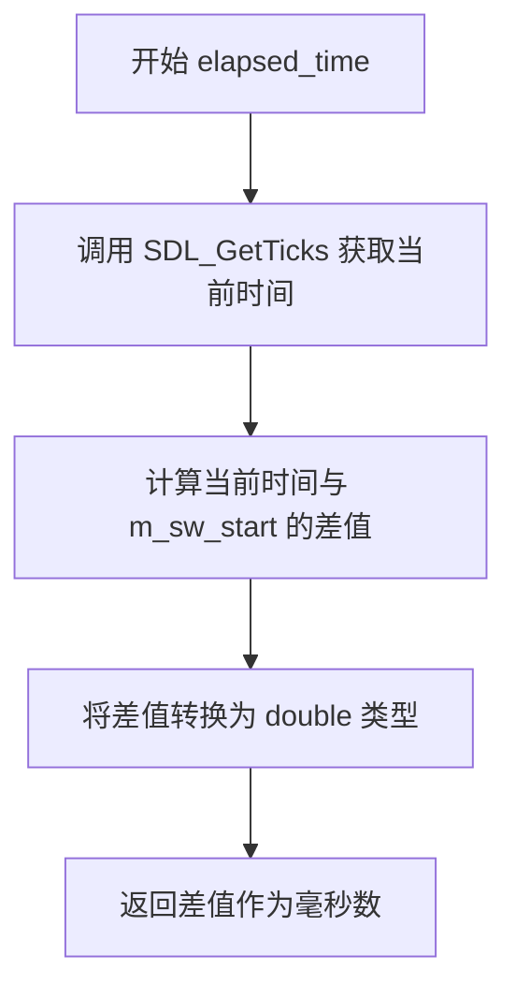

#### 带注释源码

```cpp
//------------------------------------------------------------------------
// 获取自上次调用 start_timer() 以来经过的毫秒数
// 该方法为 const，表明不会修改对象状态
//------------------------------------------------------------------------
double platform_support::elapsed_time() const
{
    // 调用 SDL_GetTicks 获取从 SDL 初始化以来经过的毫秒数
    int stop = SDL_GetTicks();
    
    // 返回当前时间与之前通过 start_timer() 记录的起始时间之差
    // 转换为 double 类型以支持小数毫秒精度
    return double(stop - m_specific->m_sw_start);
}
```

#### 相关上下文源码

```cpp
//------------------------------------------------------------------------
// 计时器启动函数，记录起始时间
//------------------------------------------------------------------------
void platform_support::start_timer()
{
    m_specific->m_sw_start = SDL_GetTicks();
}
```

#### 关键变量信息

| 变量名 | 类型 | 描述 |
|--------|------|------|
| `m_sw_start` | `int` | 存储通过 `start_timer()` 记录的起始时间（SDL 毫秒计数） |

#### 技术说明

1. **时间精度**：使用 `SDL_GetTicks()` 返回毫秒级精度，但返回值转换为 `double` 可以支持更高精度的计时需求（尽管 SDL 本身只提供毫秒级精度）。

2. **线程安全性**：`SDL_GetTicks()` 是线程安全的，但多线程环境下 `m_sw_start` 的访问需要外部同步机制。

3. **依赖外部调用**：此方法依赖于先调用 `start_timer()` 来启动计时器，否则返回值将是自程序启动以来的总时间（因为 `m_specific->m_sw_start` 在构造函数中未被初始化）。


### `platform_support.message`

该方法将指定的字符串消息输出到标准错误流（stderr），并在消息末尾添加换行符，是平台支持类中用于向用户显示错误或状态信息的简单输出机制。

参数：

- `msg`：`const char*`，需要输出的消息字符串指针

返回值：`void`，无返回值

#### 流程图

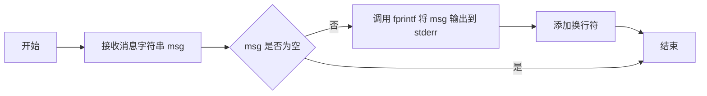

#### 带注释源码

```cpp
//------------------------------------------------------------------------
// 输出消息到标准错误
//------------------------------------------------------------------------
void platform_support::message(const char* msg)
{
    // 使用 fprintf 将消息输出到标准错误流 stderr
    // %s\n 格式说明符确保消息后跟换行符
    fprintf(stderr, "%s\n", msg);
}
```


### `platform_support.force_redraw`

强制重绘标志，将平台支持层的更新标志设置为 true，以便在下一次主循环中触发重绘操作。

参数：無

返回值：`void`，无返回值

#### 流程图

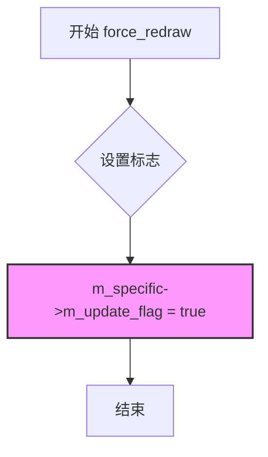

#### 带注释源码

```cpp
//------------------------------------------------------------------------
// 强制重绘标志
// 将平台支持层的更新标志设置为 true，以确保在下一次主循环中
// 调用 on_draw() 并通过 update_window() 更新显示
//------------------------------------------------------------------------
void platform_support::force_redraw()
{
    // 设置更新标志为 true，触发下一次渲染周期
    m_specific->m_update_flag = true;
}
```


### `platform_support::on_init`

这是一个受保护的虚函数（Virtual Function），作为应用程序的初始化回调（Callback），在平台窗口首次初始化完成之后、主事件循环开始之前被调用。它允许子类（应用层）重写此方法，以执行特定的初始化逻辑，例如设置UI控件、加载默认资源或配置渲染状态。

参数：
- （无）

返回值：`void`，无返回值。

#### 流程图

```mermaid
flowchart TD
    A[调用 platform_support.init] --> B{是否是首次初始化?}
    B -->|是| C[设置初始宽高]
    C --> D[调用 on_init]
    D --> E[执行用户自定义初始化代码]
    E --> F[标记已初始化]
    B -->|否| G[跳过 on_init]
    F --> H[调用 on_resize]
    G --> H
```

#### 带注释源码

**1. 函数定义**

该函数在 `platform_support` 类中定义为空实现（Hook），旨在供派生类覆盖。

```cpp
//------------------------------------------------------------------------
// 虚函数定义（空实现）
// 触发条件：在 platform_support::init() 中首次初始化时调用
//------------------------------------------------------------------------
void platform_support::on_init() {}
```

**2. 函数调用点**

调用发生在 `init()` 方法内部，位于窗口创建和缓冲区绑定之后，`m_initialized` 标志设置之前。

```cpp
//------------------------------------------------------------------------
// platform_support::init 方法片段
//------------------------------------------------------------------------
bool platform_support::init(unsigned width, unsigned height, unsigned flags)
{
    // ... (省略视频模式创建代码) ...

    // 绑定窗口渲染缓冲区
    m_rbuf_window.attach((unsigned char*)m_specific->m_surf_window->pixels, 
                         m_specific->m_surf_window->w, 
                         m_specific->m_surf_window->h, 
                         m_flip_y ? -m_specific->m_surf_window->pitch : 
                                     m_specific->m_surf_window->pitch);

    // 仅在第一次运行时调用 on_init
    if(!m_specific->m_initialized)
    {
        m_initial_width = width;
        m_initial_height = height;
        
        // 【调用点】触发初始化回调
        on_init(); 
        
        m_specific->m_initialized = true;
    }
    
    // 每次初始化都会触发 on_resize
    on_resize(m_rbuf_window.width(), m_rbuf_window.height());
    m_specific->m_update_flag = true;
    return true;
}
```


### `platform_support.on_resize`

窗口调整大小回调函数（虚函数），当窗口尺寸发生变化时被调用，用于通知子类窗口大小已改变。

参数：

- `sx`：`int`，窗口的新宽度
- `sy`：`int`，窗口的新高度

返回值：`void`，无返回值

#### 流程图

```mermaid
flowchart TD
    A[窗口尺寸改变事件触发] --> B{平台层是否初始化}
    B -->|是| C[调用 init 重新初始化视窗]
    C --> D[调用 on_resize 回调]
    D --> E[调用 trans_affine_resizing 更新变换矩阵]
    E --> F[设置更新标志位]
    B -->|否| G[仅调用 on_resize 初始化尺寸]
    G --> H[设置初始化标志]
    H --> F
```

#### 带注释源码

```cpp
//------------------------------------------------------------------------
// 虚函数：窗口调整大小回调
// 参数：
//   sx - 窗口的新宽度
//   sy - 窗口的新高度
// 返回值：无
//------------------------------------------------------------------------
void platform_support::on_resize(int sx, int sy) {}

// 该函数在以下位置被调用：
// 1. platform_support::init() - 初始化窗口后调用
//    on_resize(m_rbuf_window.width(), m_rbuf_window.height());
// 2. platform_support::run() - 处理 SDL_VIDEORESIZE 事件时调用
//    on_resize(m_rbuf_window.width(), m_rbuf_window.height());
```


### `platform_support.on_idle`

虚函数，空闲处理回调。当事件循环中没有待处理事件且处于非阻塞模式时调用，用于执行后台任务或动画更新。

参数：  
无

返回值：`void`，无返回值

#### 流程图

```mermaid
flowchart TD
    A[run 主循环] --> B{是否有待处理事件?}
    B -->|是| C[处理 SDL 事件]
    B -->|否| D[调用 on_idle]
    D --> A
    
    C --> C1{事件类型}
    C1 --> C2[SDL_QUIT 退出]
    C1 --> C3[SDL_VIDEORESIZE 处理 resize]
    C1 --> C4[SDL_KEYDOWN 处理键盘]
    C1 --> C5[SDL_MOUSEMOTION 处理鼠标移动]
    C1 --> C6[SDL_MOUSEBUTTONDOWN 处理鼠标按下]
    C1 --> C7[SDL_MOUSEBUTTONUP 处理鼠标释放]
    
    C2 --> E[break 退出循环]
    C3 --> F[调用 on_resize]
    C4 --> G[调用 on_key]
    C5 --> H[调用 on_mouse_move]
    C6 --> I[调用 on_mouse_button_down]
    C7 --> J[调用 on_mouse_button_up]
    
    F --> A
    G --> A
    H --> A
    I --> A
    J --> A
```

#### 带注释源码

```cpp
//------------------------------------------------------------------------
// 虚函数：on_idle
// 功能：空闲处理回调，在事件循环空闲时调用
// 调用场景：当 m_wait_mode 为 false 且 SDL_PollEvent 返回 NULL 时
//          （即没有事件待处理时）被调用
//------------------------------------------------------------------------
void platform_support::on_idle() {}
// 注意：此为空实现（stub），具体行为由子类重写实现
// 在 run() 方法中的调用位置：
// else
// {
//     if(SDL_PollEvent(&event))
//     {
//         ev_flag = true;
//     }
//     else
//     {
//         on_idle();  // <-- 在此处调用
//     }
// }
```


### `platform_support.on_mouse_move`

该函数是 `platform_support` 类的虚函数，作为鼠标移动事件的回调接口。当检测到 SDL 的 `SDL_MOUSEMOTION` 事件时，根据当前鼠标位置和按钮状态触发此回调，供用户在派生类中实现自定义的鼠标移动处理逻辑。

参数：

- `x`：`int`，鼠标在窗口中的 X 坐标（已根据 flip_y 标志调整）
- `y`：`int`，鼠标在窗口中的 Y 坐标（已根据 flip_y 标志调整）
- `flags`：`unsigned`，鼠标按钮状态标志位，可能包含 `mouse_left`（左键）和 `mouse_right`（右键）状态

返回值：`void`，无返回值

#### 流程图

```mermaid
flowchart TD
    A[SDL_MOUSEMOTION 事件触发] --> B[计算 Y 坐标<br/>y = flip_y ? height - y : y]
    B --> C[更新 m_cur_x 和 m_cur_y]
    C --> D{检测鼠标按钮状态}
    D -->|左键按下| E[flags |= mouse_left]
    D -->|右键按下| F[flags |= mouse_right]
    D -->|无按钮| G[flags = 0]
    E --> H{控件处理}
    F --> H
    G --> H
    H -->|控件处理成功| I[on_ctrl_change<br/>force_redraw]
    H -->|控件未处理| J[on_mouse_move callback]
    I --> K[丢弃后续冗余 MOTION 事件]
    J --> K
```

#### 带注释源码

```cpp
// 虚函数定义（在类外实现处）
// 这是 platform_support 类提供的回调接口，
// 用户应在派生类中重写此函数以处理鼠标移动事件
void platform_support::on_mouse_move(int x, int y, unsigned flags) {}

// 调用处（在 run() 方法的 SDL_MOUSEMOTION 处理分支中）
// ---------------------------------------------------
// y 坐标根据 flip_y 标志进行转换（如果 flip_y 为 true，则翻转 Y 坐标）
y = m_flip_y ? 
    m_rbuf_window.height() - event.motion.y : 
    event.motion.y;

// 更新内部保存的鼠标位置
m_specific->m_cur_x = event.motion.x;
m_specific->m_cur_y = y;

// 初始化标志位并检测鼠标按钮状态
flags = 0;
if(event.motion.state & SDL_BUTTON_LMASK) flags |= mouse_left;
if(event.motion.state & SDL_BUTTON_RMASK) flags |= mouse_right;

// 首先尝试让控件系统处理鼠标移动
if(m_ctrls.on_mouse_move(m_specific->m_cur_x, 
                         m_specific->m_cur_y,
                         (flags & mouse_left) != 0))
{
    // 如果控件处理了该事件，触发控件变化回调并强制重绘
    on_ctrl_change();
    force_redraw();
}
else
{
    // 控件未处理时，调用用户的 on_mouse_move 虚函数回调
    on_mouse_move(m_specific->m_cur_x, 
                  m_specific->m_cur_y, 
                  flags);
}

// 丢弃后续冗余的鼠标移动事件以优化性能
SDL_Event eventtrash;
while (SDL_PeepEvents(&eventtrash, 1, SDL_GETEVENT, SDL_EVENTMASK(SDL_MOUSEMOTION))!=0){;}
```


### `platform_support.on_mouse_button_down`

虚函数，鼠标按下回调。当用户按下鼠标按钮时由系统调用，负责将鼠标事件分发给应用程序的鼠标事件处理逻辑。

参数：

- `x`：`int`，鼠标按下时的X坐标（窗口坐标系）
- `y`：`int`，鼠标按下时的Y坐标（窗口坐标系，考虑了flip_y配置）
- `flags`：`unsigned`，鼠标按钮状态标志位，如`mouse_left`（左键）或`mouse_right`（右键）

返回值：`void`，无返回值

#### 流程图

```mermaid
flowchart TD
    A[SDL事件循环检测到SDL_MOUSEBUTTONDOWN] --> B{检查flip_y设置}
    B -->|true| C[计算y = 窗口高度 - event.button.y]
    B -->|false| D[直接使用event.button.y]
    C --> E[更新m_specific->m_cur_x和m_cur_y]
    D --> E
    E --> F{根据button值设置flags}
    F -->|SDL_BUTTON_LEFT| G[flags = mouse_left]
    F -->|SDL_BUTTON_RIGHT| H[flags = mouse_right]
    G --> I{检查是否命中控制器区域}
    H --> I
    I -->|是| J[处理控制器命中逻辑]
    I -->|否| K{检查是否拖拽控制器}
    K -->|是| L[处理控制器拖拽逻辑]
    K -->|否| M[调用on_mouse_button_down回调]
    J --> N[触发on_ctrl_change和force_redraw]
    L --> N
    M --> N
    N[结束事件处理]
```

#### 带注释源码

```cpp
//------------------------------------------------------------------------
// 虚函数声明（基类中的空实现）
//------------------------------------------------------------------------
void platform_support::on_mouse_button_down(int x, int y, unsigned flags) {}

//------------------------------------------------------------------------
// 在run()方法中的调用处（仅展示相关部分）
//------------------------------------------------------------------------
case SDL_MOUSEBUTTONDOWN:
    {
        // 根据flip_y配置计算Y坐标（如果flip_y为true，则进行Y轴翻转）
        y = m_flip_y
            ? m_rbuf_window.height() - event.button.y
            : event.button.y;

        // 更新当前鼠标位置
        m_specific->m_cur_x = event.button.x;
        m_specific->m_cur_y = y;
        
        // 初始化flags为0
        flags = 0;
        
        // 根据按下的是哪个鼠标按钮设置flags
        switch(event.button.button)
        {
        case SDL_BUTTON_LEFT:
            {
                flags = mouse_left;  // 设置左键标志

                // 首先检查是否命中控件区域
                if(m_ctrls.on_mouse_button_down(m_specific->m_cur_x,
                                                m_specific->m_cur_y))
                {
                    // 如果命中控件，设置当前控件并触发回调
                    m_ctrls.set_cur(m_specific->m_cur_x, 
                        m_specific->m_cur_y);
                    on_ctrl_change();
                    force_redraw();
                }
                else
                {
                    // 如果未命中控件，检查是否在某个控件的矩形区域内
                    if(m_ctrls.in_rect(m_specific->m_cur_x, 
                        m_specific->m_cur_y))
                    {
                        // 设置当前控件
                        if(m_ctrls.set_cur(m_specific->m_cur_x, 
                            m_specific->m_cur_y))
                        {
                            on_ctrl_change();
                            force_redraw();
                        }
                    }
                    else
                    {
                        // 调用虚函数on_mouse_button_down，由派生类实现具体逻辑
                        on_mouse_button_down(m_specific->m_cur_x, 
                            m_specific->m_cur_y, 
                            flags);
                    }
                }
            }
            break;
            
        case SDL_BUTTON_RIGHT:
            flags = mouse_right;  // 设置右键标志
            // 右键按下时直接调用回调，不检查控件
            on_mouse_button_down(m_specific->m_cur_x, 
                m_specific->m_cur_y, 
                flags);
            break;
        } //switch(event.button.button)
        break;
    }
```


### `platform_support.on_mouse_button_up`

该方法是 `platform_support` 类中的虚函数，作为鼠标释放事件的回调接口。当用户释放鼠标按钮时，SDL 会捕获 `SDL_MOUSEBUTTONUP` 事件，经过坐标转换和控件处理后，调用此方法通知应用程序鼠标已释放。

参数：

- `x`：`int`，鼠标释放时的 X 坐标（相对于窗口左上角）
- `y`：`int`，鼠标释放时的 Y 坐标（根据 `m_flip_y` 属性可能经过垂直翻转处理）
- `flags`：`unsigned`，鼠标按钮状态标志位，用于表示按下的按钮类型（如 `mouse_left`、`mouse_right`）

返回值：`void`，无返回值

#### 流程图

```mermaid
flowchart TD
    A[用户释放鼠标按钮] --> B[SDL 捕获 SDL_MOUSEBUTTONUP 事件]
    B --> C{flip_y 为 true?}
    C -->|是| D[计算 y = 窗口高度 - 事件.y]
    C -->|否| E[y = 事件.y]
    D --> F[更新 m_cur_x 和 m_cur_y]
    E --> F
    F --> G{控件处理 on_mouse_button_up}
    G -->|true| H[调用 on_ctrl_change 和 force_redraw]
    G -->|否| I[调用平台支持的 on_mouse_button_up 虚函数]
    H --> J[事件处理结束]
    I --> J
```

#### 带注释源码

```cpp
//------------------------------------------------------------------------
// 虚函数：鼠标释放回调
// 参数：
//   x    - 鼠标释放时的 X 坐标
//   y    - 鼠标释放时的 Y 坐标
//   flags - 鼠标按钮标志位（但在此处未使用，始终传入 0）
// 返回值：无
//------------------------------------------------------------------------
void platform_support::on_mouse_button_up(int x, int y, unsigned flags) {}
```

在 `run()` 方法中的调用逻辑：

```cpp
case SDL_MOUSEBUTTONUP:
    // 根据 flip_y 属性计算正确的 Y 坐标
    y = m_flip_y
        ? m_rbuf_window.height() - event.button.y
        : event.button.y;

    // 更新当前鼠标位置
    m_specific->m_cur_x = event.button.x;
    m_specific->m_cur_y = y;
    
    // 初始化标志位（当前未使用）
    flags = 0;
    
    // 先尝试让控件处理鼠标释放事件
    if(m_ctrls.on_mouse_button_up(m_specific->m_cur_x, 
                                  m_specific->m_cur_y))
    {
        // 如果控件处理了该事件，触发控件变化回调并强制重绘
        on_ctrl_change();
        force_redraw();
    }
    
    // 调用平台的虚函数，通知应用程序鼠标已释放
    on_mouse_button_up(m_specific->m_cur_x, 
                       m_specific->m_cur_y, 
                       flags);
    break;
```


### `platform_support.on_key`

该函数是 `platform_support` 类的虚函数，作为键盘事件回调接口，由子类重写以处理键盘按下事件。当用户按下键盘按键时，`run()` 方法捕获 SDL_KEYDOWN 事件并将坐标、键码和修饰键标志传递给此回调函数。

参数：

- `x`：`int`，键盘事件发生时的鼠标 X 坐标（相对于窗口）
- `y`：`int`，键盘事件发生时的鼠标 Y 坐标（考虑是否翻转）
- `key`：`unsigned`，SDL 键码（来自 `event.key.keysym.sym`），标识按下的是哪个键
- `flags`：`unsigned`，键盘修饰键状态标志（如 `kbd_shift`、`kbd_ctrl` 等）

返回值：`void`，无返回值

#### 流程图

```mermaid
flowchart TD
    A[用户按下键盘按键] --> B[SDL 捕获 SDL_KEYDOWN 事件]
    B --> C[解析修饰键状态<br/>flags = kbd_shift | kbd_ctrl]
    C --> D[检查是否为方向键<br/>key_left/right/up/down]
    D --> E{方向键?}
    E -->|是| F[调用 m_ctrls.on_arrow_keys<br/>处理控件导航]
    E -->|否| G[调用 on_key 回调<br/>传递坐标、键码、标志]
    F --> H{控件处理?}
    H -->|是| I[触发 on_ctrl_change<br/>强制重绘]
    H -->|否| J[调用 on_key 回调]
    G --> K[子类处理键盘事件]
    I --> K
    J --> K
```

#### 带注释源码

```cpp
//------------------------------------------------------------------------
// 虚函数：on_key - 键盘事件回调
// 参数：
//   x     - int  类型，键盘事件发生时的 X 坐标
//   y     - int  类型，键盘事件发生时的 Y 坐标
//   key   - unsigned 类型，SDL 键码，标识按下的具体按键
//   flags - unsigned 类型，修饰键标志（如 shift、ctrl）
// 返回值：void，无返回值
// 说明：
//   这是一个空实现的虚函数，由子类重写以处理键盘输入。
//   在 run() 方法的 SDL_KEYDOWN 事件处理中被调用。
//------------------------------------------------------------------------
void platform_support::on_key(int x, int y, unsigned key, unsigned flags) {}
```


### `platform_support.on_ctrl_change`

这是一个虚函数，用作控件变化的回调通知。当用户与界面控件（如滑块、按钮等）进行交互导致控件状态发生变化时，该回调函数会被调用，通知应用程序控件已更改，通常需要重新绘制界面以反映新的控件状态。

参数： 无

返回值：`void`，无返回值

#### 流程图

```mermaid
flowchart TD
    A[用户交互事件] --> B{事件类型?}
    B -->|键盘箭头键| C[m_ctrls.on_arrow_keys]
    B -->|鼠标移动+左键| D[m_ctrls.on_mouse_move]
    B -->|鼠标按下| E[m_ctrls.on_mouse_button_down]
    B -->|鼠标释放| F[m_ctrls.on_mouse_button_up]
    
    C --> G{返回true?}
    D --> G
    E --> G
    G -->|是| H[调用 on_ctrl_change]
    G -->|否| I[调用其他处理函数]
    
    H --> J[调用 force_redraw 设置更新标志]
    J --> K[在下次事件循环中重绘]
    
    I --> L[继续处理其他事件]
```

#### 带注释源码

```cpp
//------------------------------------------------------------------------
// 虚函数：on_ctrl_change
// 用途：控件变化回调函数，当控件状态发生改变时由平台支持层调用
// 这是一个纯虚函数的实现，为子类提供重写的接口
//------------------------------------------------------------------------
void platform_support::on_ctrl_change() {}

// 调用位置1：在 run() 方法中处理键盘方向键时
if(m_ctrls.on_arrow_keys(left, right, down, up))
{
    on_ctrl_change();           // 通知控件已改变
    force_redraw();             // 强制重绘
}

// 调用位置2：在 run() 方法中处理鼠标移动时
if(m_ctrls.on_mouse_move(m_specific->m_cur_x, 
                         m_specific->m_cur_y,
                         (flags & mouse_left) != 0))
{
    on_ctrl_change();           // 通知控件已改变
    force_redraw();             // 强制重绘
}

// 调用位置3：在 run() 方法中处理鼠标按钮按下时
if(m_ctrls.on_mouse_button_down(m_specific->m_cur_x,
                                m_specific->m_cur_y))
{
    m_ctrls.set_cur(m_specific->m_cur_x, 
        m_specific->m_cur_y);
    on_ctrl_change();           // 通知控件已改变
    force_redraw();             // 强制重绘
}

// 调用位置4：在 run() 方法中处理鼠标按钮释放时
if(m_ctrls.on_mouse_button_up(m_specific->m_cur_x, 
                              m_specific->m_cur_y))
{
    on_ctrl_change();           // 通知控件已改变
    force_redraw();             // 强制重绘
}
```


### `platform_support.on_draw`

这是一个虚函数，用作绘制回调。在窗口需要重绘时（`m_update_flag`为true）被`run()`方法调用，具体在`on_draw()`执行后调用`update_window()`将绘制内容更新到屏幕。

参数：无

返回值：`void`，无返回值

#### 流程图

```mermaid
sequenceDiagram
    participant run as run() 主循环
    participant on_draw as on_draw() [虚函数]
    participant update as update_window()
    
    run->>run: 检查 m_update_flag
    alt m_update_flag == true
        run->>on_draw: 调用绘制回调
        on_draw-->>run: 返回 (用户自定义绘制逻辑)
        run->>update: 更新窗口显示
        update-->>run: 完成
        run->>run: 设置 m_update_flag = false
    else m_update_flag == false
        run->>run: 跳过绘制
    end
```

#### 带注释源码

```cpp
//------------------------------------------------------------------------
// 虚函数 on_draw 的声明（在类定义中）
//------------------------------------------------------------------------
void platform_support::on_draw() {}
/*
 * 函数说明：
 * - 这是一个纯虚函数的实现（空实现）
 * - 作为绘制回调函数，在窗口需要重绘时被调用
 * - 用户需要在子类中重写此函数来实现具体的绘制逻辑
 * - 调用位置：在 run() 方法的主循环中，当 m_update_flag 为 true 时
 * - 调用后紧跟着调用 update_window() 将绘制内容刷新到屏幕
 * 
 * 在 run() 方法中的调用示例：
 * if(m_specific->m_update_flag)
 * {
 *     on_draw();          // 调用用户的绘制回调
 *     update_window();    // 更新窗口显示
 *     m_specific->m_update_flag = false;
 * }
 */
```


### `platform_support.on_post_draw`

虚函数，绘制后回调。该函数是一个扩展点，允许子类在主绘制操作完成后执行额外的渲染或处理操作。

参数：

- `raw_handler`：`void*`，原始处理器指针，通常用于传递底层渲染上下文或自定义数据结构

返回值：`void`，无返回值

#### 流程图

```mermaid
flowchart TD
    A[on_post_draw 调用点] --> B{子类是否重写?}
    B -->|否| C[执行默认空实现]
    B -->|是| D[执行子类自定义逻辑]
    C --> E[返回]
    D --> E
```

#### 带注释源码

```cpp
//------------------------------------------------------------------------
// 虚函数：platform_support::on_post_draw
// 功能：绘制完成后的回调函数，供子类重写以执行额外的渲染操作
// 参数：
//   raw_handler - void* 类型，指向原始处理器或渲染上下文的指针
//                可用于传递底层SDL表面或其他渲染相关数据结构
// 返回值：void
//------------------------------------------------------------------------
void platform_support::on_post_draw(void* raw_handler) {}
/*
 * 说明：这是一个空实现的虚函数（stub）。
 * 设计意图：
 *   1. 作为回调钩子(hook)，允许用户在主绘制流程完成后执行自定义逻辑
 *   2. raw_handler参数提供了底层渲染上下文的访问能力
 *   3. 具体功能和用法完全取决于子类的实现
 *
 * 使用场景示例：
 *   - 叠加绘制额外图层
 *   - 执行后期处理效果
 *   - 更新UI控件
 *   - 与其他渲染系统集成
 */
```

## 关键组件


### platform_specific 类

封装 SDL 特定的平台实现细节，管理 SDL 表面(surfaces)、像素格式掩码和图像缓存。

### platform_support 类

主平台支持类，提供窗口初始化、事件循环、图像加载保存和渲染缓冲管理功能。

### 像素格式处理组件

支持多种像素格式（gray8、rgb565、rgb555、rgb24、bgr24、bgra32、abgr32、argb32、rgba32），根据系统字节序处理颜色通道掩码。

### 事件处理系统

SDL 事件循环引擎，处理鼠标移动/点击、键盘按键、窗口大小调整等事件，并转换为 AGG 内部坐标系统。

### 渲染缓冲管理

管理窗口渲染缓冲区（m_rbuf_window）和图像缓冲区（m_rbuf_img[]），通过 pitch 实现 Y 轴翻转支持。

### 图像加载/保存模块

支持加载 BMP 格式图像并进行像素格式转换，同时提供创建新图像表面和保存为 BMP 的功能。

### 计时器系统

基于 SDL_GetTicks() 实现高精度计时功能，支持应用启动计时和经过时间查询。

### 技术债务

1. **潜在内存泄漏**：SDL 事件队列清理逻辑中 m_sw_start 变量命名不规范，易混淆
2. **硬编码路径**：文件扩展名检查固定为 ".bmp"，缺乏灵活性
3. **错误处理不足**：部分函数返回 false 时未提供详细错误上下文
4. **SDL 版本兼容性**：使用已废弃的 SDL 1.2 API（如 SDL_PeepEvents）

## 问题及建议


### 已知问题

- **内存管理原始**：使用裸指针和 `new`/`delete`，未使用智能指针，存在内存泄漏风险
- **缓冲区溢出风险**：大量使用 `strcpy`/`strcat` 而无长度检查（如 `fn[1024]` 缓冲区）
- **SDL 版本过时**：使用已弃用的 SDL 1.2 API（如 `SDL_SetVideoMode`），SDL 2.0 有显著改进但未采用
- **事件循环低效**：鼠标移动时使用 `SDL_PeepEvents` 循环清除事件队列，每次鼠标事件都可能触发多次系统调用
- **位掩码硬编码**：像素格式的 R/G/B/A 掩码值在构造函数中重复定义，维护性差
- **代码重复**：图像加载和创建流程中有多处重复的 `attach` 调用和错误处理逻辑
- **错误处理不完善**：仅输出到 `stderr`，缺少统一的错误码或异常机制
- **类型转换风险**：大量 C 风格指针转换（如 `(unsigned char*)`），缺乏类型安全
- **平台支持单一**：仅支持 SDL，不支持现代图形后端（如 OpenGL/Vulkan/DirectX）
- **路径处理缺失**：`full_file_name` 函数形同虚设，直接返回输入，未处理文件路径
- **缩进格式混乱**：代码中混用 TAB 和空格，影响可读性
- **magic number**：如 `1024`、`max_images` 等常量硬编码，缺乏配置化

### 优化建议

- 引入智能指针（`std::unique_ptr`/`std::shared_ptr`）管理 SDL 表面对象生命周期
- 替换为安全的字符串操作（`snprintf`/`std::string`）防止缓冲区溢出
- 升级至 SDL 2.0，使用 `SDL_CreateWindow`/`SDL_CreateRenderer` 等现代 API
- 重构事件处理逻辑，使用事件过滤或批量处理减少系统调用开销
- 将像素格式掩码提取为配置表或工厂方法，减少代码重复
- 建立统一的错误处理层（错误码枚举或自定义异常类）
- 使用 C++ 类型转换运算符替代 C 风格转换
- 考虑添加平台抽象层，支持多后端渲染
- 统一代码格式，使用工具（如 `clang-format`）规范化缩进
- 将魔数提取为命名常量，提高可读性和可维护性

## 其它


### 设计目标与约束

本模块是Anti-Grain Geometry（AGG）库的SDL平台支持层，核心目标是为AGG图形库提供SDL窗口管理、事件处理和渲染表面管理功能。设计约束包括：必须依赖SDL 1.x库；仅支持BMP图像格式；支持多种像素格式（gray8、rgb565、rgb555、rgb24、bgr24、bgra32、abgr32、argb32、rgba32）；需要处理大端和小端字节序的差异；支持窗口缩放和硬件/软件渲染模式。

### 错误处理与异常设计

本模块采用传统的C风格错误处理机制，不使用异常。主要包括：init()方法在视频模式创建失败时返回false并打印错误信息到stderr；load_img()加载图像失败时返回false；create_img()创建表面失败时返回false并打印错误信息。错误输出使用fprintf(stderr, ...)格式。潜在的改进空间是可以引入更结构化的错误码或异常机制。

### 数据流与状态机

run()方法构成了主事件循环状态机，包含以下状态转换：初始状态→等待事件→事件分发→处理回调→绘制状态→更新窗口→返回等待。事件类型包括SDL_QUIT（退出循环）、SDL_VIDEORESIZE（窗口调整大小）、SDL_KEYDOWN（键盘按下）、SDL_MOUSEMOTION（鼠标移动）、SDL_MOUSEBUTTONDOWN（鼠标按下）、SDL_MOUSEBUTTONUP（鼠标抬起）。m_update_flag标记控制是否需要重新绘制，m_wait_mode控制事件轮询方式（阻塞或轮询）。

### 外部依赖与接口契约

主要外部依赖包括：SDL库（SDL.h、SDL_byteorder.h）用于窗口和事件管理；标准C库（string.h、stdio.h）用于字符串操作和错误输出；AGG核心库（platform/agg_platform_support.h）提供pix_format_e枚举和platform_support基类。接口契约要求：调用者必须提供有效的pix_format_e格式；load_img/save_img仅支持.bmp格式；所有SDL表面创建失败都返回nullptr需要检查；render buffer必须通过attach方法关联到SDL表面像素数据。

### 内存管理

内存管理采用手动方式：platform_specific使用new分配，析构函数中使用delete释放；SDL_Surface使用SDL_FreeSurface释放；render buffer通过attach方法关联到已分配的SDL表面，无独立所有权。m_surf_img数组存储最多max_images个图像表面，析构时逆序释放。潜在的内存泄漏风险：load_img时如果idx已存在表面需先释放；create_img前需检查并释放已存在的表面。

### 线程安全性

本模块不是线程安全的。run()事件循环在主线程中运行；没有提供任何线程同步机制；SDL库本身某些操作也不是线程安全的（需要参考SDL文档）。如果需要在多线程环境中使用，建议在主线程调用所有platform_support方法，或添加适当的互斥锁保护。

### 平台兼容性

平台兼容性主要体现在字节序处理：使用SDL_BYTEORDER宏判断大端/小端系统；针对LIL_ENDIAN和BIG_ENDIAN（PPC）分别设置不同的颜色掩码（rmask/gmask/bmask/amask）。flip_y参数用于处理Y轴翻转，SDL坐标系原点在左上角，而AGG坐标系可以在左下角。需要注意的是，本代码针对SDL 1.x设计，不兼容SDL 2.x。

### 性能考虑

性能优化点包括：支持SDL_HWSURFACE硬件加速表面创建；使用SDL_BlitSurface批量复制图像数据；m_update_flag避免不必要的重绘；SDL_WaitEvent vs SDL_PollEvent选择可平衡响应性和CPU占用；使用SDL_PeepEvents批量处理鼠标事件队列。潜在优化空间：可以添加双缓冲或三缓冲机制；可以预分配图像表面池避免运行时分配。

### 配置与初始化

初始化流程为：构造函数→SDL_Init(SDL_INIT_VIDEO)→strcpy设置默认Caption→用户调用init()设置窗口尺寸和标志。窗口标志支持：window_hw_buffer（硬件缓冲）、window_resize（可调整大小）。像素格式在platform_specific构造时根据m_format确定颜色掩码和位深度。初始宽度/高度保存在m_initial_width/m_initial_height供后续使用。

### 事件处理机制

事件处理采用回调模式，platform_support提供虚函数供用户重写：on_init()初始化时调用；on_resize()窗口大小改变时调用；on_idle()无事件时调用；on_mouse_move()鼠标移动时调用；on_mouse_button_down/up()鼠标按钮事件；on_key()键盘事件；on_ctrl_change()控件变化；on_draw()绘制内容；on_post_draw()绘制后处理。键盘事件处理支持Shift和Ctrl修饰键，方向键触发控件移动。鼠标事件支持左键/右键检测，坐标根据flip_y进行转换。

### 资源生命周期

SDL表面生命周期：m_surf_screen由SDL_SetVideoMode创建，由init()中检查并释放；m_surf_window由SDL_CreateRGBSurface创建，析构时释放；m_surf_img数组元素按需创建，析构时逆序释放。render buffer（m_rbuf_window和m_rbuf_img）通过attach关联到SDL表面像素，不管理像素内存所有权。m_sw_start在start_timer()时设置，elapsed_time()计算时间差。

### 窗口管理

窗口管理功能：caption()设置窗口标题，调用SDL_WM_SetCaption；init()创建视频模式和窗口表面；update_window()将窗口表面blit到屏幕并刷新；支持SDL_VIDEORESIZE事件处理窗口大小动态调整。窗口Caption在init()中会重新设置以确保同步。

### 输入设备管理

鼠标输入：SDL_MOUSEMOTION事件获取坐标和状态，转换为AGG坐标系；SDL_MOUSEBUTTONDOWN/UP处理左右键点击；坐标根据m_flip_y决定是否进行Y轴翻转。键盘输入：SDL_KEYDOWN事件捕获按键sym值；支持修饰键检测（KMOD_SHIFT、KMOD_CTRL）；特殊处理方向键用于控件导航。输入状态保存在m_specific->m_cur_x/y供回调使用。

### 渲染管线

渲染管线采用双表面架构：m_surf_window作为绘图缓冲区（window buffer），应用程序在此表面绘制；m_surf_screen作为显示缓冲区，实际显示在屏幕上；update_window()负责将window buffer复制到screen并刷新显示。render buffer类（m_rbuf_window）封装了SDL表面的像素指针、行距等属性，提供给AGG核心库进行像素操作。flip_y参数影响行距的正负值设置。

### 图像文件操作

图像操作限制：BMP格式专用（.bmp扩展名自动添加）；load_img()支持加载并转换为当前像素格式；save_img()直接保存为BMP；create_img()创建与屏幕格式匹配的表面。图像存储在m_surf_img数组中（下标0到max_images-1），每个都有对应的render buffer（m_rbuf_img）。图像加载时使用SDL_ConvertSurface进行格式转换。

### 计时与性能测量

计时功能：start_timer()调用SDL_GetTicks()记录开始时间；elapsed_time()计算当前Ticks与开始时间的差值并转换为double类型（毫秒级精度）。这是SDL提供的简单计时方式，不适合高精度需求。

### 潜在技术债务

1. 未使用异常机制，错误处理分散且不统一
2. 硬编码的字符串缓冲区大小（如load_img中的1024字符数组）可能导致缓冲区溢出
3. 代码混合了C和C++风格（new/delete与C风格字符串函数混用）
4. 事件处理中部分鼠标事件被意外丢弃（SDL_PeepEvents的用法）
5. 缺乏对SDL 2.x的支持
6. 缺少对高DPI/HiDPI显示器的支持
7. 消息输出使用fprintf而非标准日志系统
8. ctrl相关功能（m_ctrls）的具体实现未在本文件中体现

### 优化建议

1. 将C风格字符串操作替换为std::string以避免缓冲区溢出风险
2. 考虑引入异常处理或统一的错误码枚举
3. 添加RAII封装SDL表面资源
4. 支持更多图像格式（PNG、JPEG等）作为扩展
5. 添加配置选项支持SDL 2.x
6. 将消息输出抽象为可插拔的日志接口
7. 考虑添加多线程安全包装器
8. 优化事件处理逻辑，移除不必要的SDL_PeepEvents批量消费


    