# `matplotlib\extern\agg24-svn\src\platform\win32\agg_platform_support.cpp` 详细设计文档

Anti-Grain Geometry库的Windows平台支持实现，提供窗口管理、消息循环、像素格式转换、图像加载保存以及命令行解析等功能，是AGG图形应用的基础框架。

## 整体流程

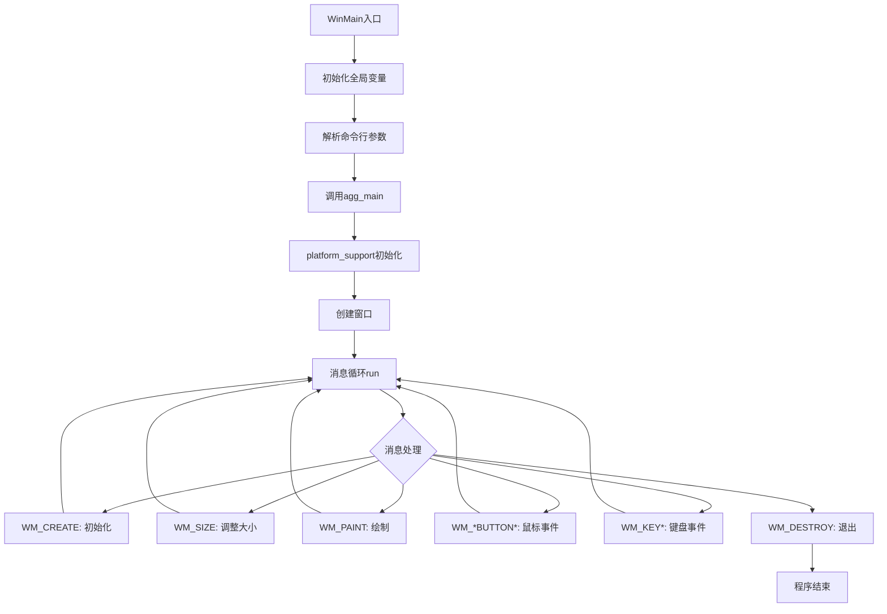

## 类结构

```
Global Variables
├── g_windows_instance
└── g_windows_cmd_show
│
├── platform_specific (Windows平台私有实现)
│   ├── 构造函数: 初始化像素格式、键盘映射
│   ├── create_pmap: 创建像素映射
│   ├── display_pmap: 显示像素映射
│   ├── load_pmap: 加载BMP图像
│   ├── save_pmap: 保存BMP图像
│   └── translate: 键盘翻译
│
├── platform_support (抽象平台接口)
│   ├── 构造函数/析构函数
│   ├── init: 初始化窗口
│   ├── run: 消息循环
│   ├── caption: 设置标题
│   ├── start_timer/elapsed_time: 计时器
│   ├── load_img/save_img/create_img: 图像管理
│   ├── force_redraw/update_window: 渲染控制
│   └── 事件回调: on_init/on_resize/on_draw/on_key...
│
├── tokenizer (命令行解析工具)
│   ├── set_str: 设置待解析字符串
│   └── next_token: 获取下一个标记
│
└── convert_pmap (静态工具函数)
    └── 像素格式转换
```

## 全局变量及字段


### `g_windows_instance`
    
Windows实例句柄

类型：`HINSTANCE`
    


### `g_windows_cmd_show`
    
命令显示参数

类型：`int`
    


### `platform_specific.m_format`
    
当前像素格式

类型：`pix_format_e`
    


### `platform_specific.m_sys_format`
    
系统像素格式

类型：`pix_format_e`
    


### `platform_specific.m_flip_y`
    
Y轴翻转标志

类型：`bool`
    


### `platform_specific.m_bpp`
    
当前位深

类型：`unsigned`
    


### `platform_specific.m_sys_bpp`
    
系统位深

类型：`unsigned`
    


### `platform_specific.m_hwnd`
    
窗口句柄

类型：`HWND`
    


### `platform_specific.m_pmap_window`
    
窗口像素映射

类型：`pixel_map`
    


### `platform_specific.m_pmap_img`
    
图像像素映射数组

类型：`pixel_map[max_images]`
    


### `platform_specific.m_keymap`
    
键盘映射表

类型：`unsigned[256]`
    


### `platform_specific.m_last_translated_key`
    
最后翻译的键值

类型：`unsigned`
    


### `platform_specific.m_cur_x`
    
当前鼠标X坐标

类型：`int`
    


### `platform_specific.m_cur_y`
    
当前鼠标Y坐标

类型：`int`
    


### `platform_specific.m_input_flags`
    
输入标志

类型：`unsigned`
    


### `platform_specific.m_redraw_flag`
    
重绘标志

类型：`bool`
    


### `platform_specific.m_current_dc`
    
当前设备上下文

类型：`HDC`
    


### `platform_specific.m_sw_freq`
    
计时器频率

类型：`LARGE_INTEGER`
    


### `platform_specific.m_sw_start`
    
计时器起始值

类型：`LARGE_INTEGER`
    


### `platform_support.m_specific`
    
平台特定实现指针

类型：`platform_specific*`
    


### `platform_support.m_format`
    
像素格式

类型：`pix_format_e`
    


### `platform_support.m_bpp`
    
位深

类型：`unsigned`
    


### `platform_support.m_window_flags`
    
窗口标志

类型：`unsigned`
    


### `platform_support.m_wait_mode`
    
等待模式

类型：`bool`
    


### `platform_support.m_flip_y`
    
Y轴翻转

类型：`bool`
    


### `platform_support.m_caption`
    
窗口标题

类型：`char[256]`
    


### `platform_support.m_initial_width`
    
初始宽度

类型：`unsigned`
    


### `platform_support.m_initial_height`
    
初始高度

类型：`unsigned`
    


### `platform_support.m_rbuf_window`
    
窗口渲染缓冲

类型：`rendering_buffer`
    


### `platform_support.m_rbuf_img`
    
图像渲染缓冲数组

类型：`rendering_buffer[max_images]`
    


### `platform_support.m_ctrls`
    
控件容器

类型：`control_container`
    


### `tokenizer.m_src_string`
    
源字符串

类型：`const char*`
    


### `tokenizer.m_start`
    
起始位置

类型：`int`
    


### `tokenizer.m_sep`
    
分隔符

类型：`const char*`
    


### `tokenizer.m_trim`
    
修剪字符

类型：`const char*`
    


### `tokenizer.m_quote`
    
引号字符

类型：`const char*`
    


### `tokenizer.m_mask_chr`
    
转义字符

类型：`char`
    


### `tokenizer.m_sep_len`
    
分隔符长度

类型：`unsigned`
    


### `tokenizer.m_sep_flag`
    
分隔标志

类型：`sep_flag`
    
    

## 全局函数及方法


### `convert_pmap`

该函数是静态辅助函数，核心功能是根据指定的像素格式（pix_format_e），将源渲染缓冲区的像素数据转换为目标渲染缓冲区。它通过 switch 语句匹配不同的像素格式，并调用相应的转换函数（convert 模板或 color_conv 函数）完成格式转换。

参数：

- `dst`：`rendering_buffer*`，目标渲染缓冲区，用于存储转换后的像素数据
- `src`：`const rendering_buffer*`，源渲染缓冲区，包含待转换的原始像素数据
- `format`：`pix_format_e`，目标像素格式枚举值，指定要转换成的像素格式类型

返回值：`void`，无返回值。转换结果直接写入目标渲染缓冲区。

#### 流程图

```mermaid
flowchart TD
    A[开始 convert_pmap] --> B{switch format}
    B --> C[pix_format_gray8]
    B --> D[pix_format_gray16]
    B --> E[pix_format_gray32]
    B --> F[pix_format_rgb565]
    B --> G[pix_format_rgbAAA]
    B --> H[pix_format_bgrAAA]
    B --> I[pix_format_rgbBBA]
    B --> J[pix_format_bgrABB]
    B --> K[pix_format_srgb24]
    B --> L[pix_format_rgb24]
    B --> M[pix_format_bgr24]
    B --> N[pix_format_rgb48]
    B --> O[pix_format_bgr48]
    B --> P[pix_format_bgra32]
    B --> Q[pix_format_rgba32]
    B --> R[其他格式...]
    
    C --> C1[convert<pixfmt_sgray8, pixfmt_gray8>]
    D --> D1[convert<pixfmt_sgray8, pixfmt_gray16>]
    E --> E1[convert<pixfmt_sgray8, pixfmt_gray32>]
    F --> F1[color_conv_rgb565_to_rgb555]
    G --> G1[color_conv_rgbAAA_to_bgr24]
    H --> H1[color_conv_bgrAAA_to_bgr24]
    I --> I1[color_conv_rgbBBA_to_bgr24]
    J --> J1[color_conv_bgrABB_to_bgr24]
    K --> K1[color_conv_rgb24_to_bgr24]
    L --> L1[convert<pixfmt_sbgr24, pixfmt_rgb24>]
    M --> M1[convert<pixfmt_sbgr24, pixfmt_bgr24>]
    N --> N1[convert<pixfmt_sbgr24, pixfmt_rgb48>]
    O --> O1[convert<pixfmt_sbgr24, pixfmt_bgr48>]
    P --> P1[convert<pixfmt_sbgr24, pixfmt_bgrx32>]
    Q --> Q1[convert<pixfmt_sbgr24, pixfmt_rgbx32>]
    R --> R1[对应转换函数]
    
    C1 --> Z[结束]
    D1 --> Z
    E1 --> Z
    F1 --> Z
    G1 --> Z
    H1 --> Z
    I1 --> Z
    J1 --> Z
    K1 --> Z
    L1 --> Z
    M1 --> Z
    N1 --> Z
    O1 --> Z
    P1 --> Z
    Q1 --> Z
    R1 --> Z
```

#### 带注释源码

```cpp
//------------------------------------------------------------------------
// 静态函数：convert_pmap
// 功能：将源渲染缓冲区的像素数据转换为指定的格式，并写入目标渲染缓冲区
// 参数：
//   - dst: 目标渲染缓冲区指针
//   - src: 源渲染缓冲区指针（只读）
//   - format: 目标像素格式枚举
// 返回值：无
//------------------------------------------------------------------------
static void convert_pmap(rendering_buffer* dst, 
                         const rendering_buffer* src, 
                         pix_format_e format)
{
    // 根据目标格式进行分支处理
    switch(format)
    {
    // 灰度8位格式转换
    case pix_format_gray8:
        // 使用模板转换函数，将系统灰度格式转换为标准灰度格式
        convert<pixfmt_sgray8, pixfmt_gray8>(dst, src);
        break;

    // 灰度16位格式转换
    case pix_format_gray16:
        convert<pixfmt_sgray8, pixfmt_gray16>(dst, src);
        break;

    // 灰度32位格式转换
    case pix_format_gray32:
        convert<pixfmt_sgray8, pixfmt_gray32>(dst, src);
        break;

    // RGB565格式转换（使用颜色转换器）
    case pix_format_rgb565:
        color_conv(dst, src, color_conv_rgb565_to_rgb555());
        break;

    // RGB AAA格式转换
    case pix_format_rgbAAA:
        color_conv(dst, src, color_conv_rgbAAA_to_bgr24());
        break;

    // BGR AAA格式转换
    case pix_format_bgrAAA:
        color_conv(dst, src, color_conv_bgrAAA_to_bgr24());
        break;

    // RGB BBA格式转换
    case pix_format_rgbBBA:
        color_conv(dst, src, color_conv_rgbBBA_to_bgr24());
        break;

    // BGR ABB格式转换
    case pix_format_bgrABB:
        color_conv(dst, src, color_conv_bgrABB_to_bgr24());
        break;

    // sRGB24格式转换
    case pix_format_srgb24:
        color_conv(dst, src, color_conv_rgb24_to_bgr24());
        break;

    // RGB24格式转换
    case pix_format_rgb24:
        convert<pixfmt_sbgr24, pixfmt_rgb24>(dst, src);
        break;

    // BGR24格式转换
    case pix_format_bgr24:
        convert<pixfmt_sbgr24, pixfmt_bgr24>(dst, src);
        break;

    // RGB48格式转换
    case pix_format_rgb48:
        convert<pixfmt_sbgr24, pixfmt_rgb48>(dst, src);
        break;

    // BGR48格式转换
    case pix_format_bgr48:
        convert<pixfmt_sbgr24, pixfmt_bgr48>(dst, src);
        break;

    // 32位BGRA格式转换
    case pix_format_bgra32:
        convert<pixfmt_sbgr24, pixfmt_bgrx32>(dst, src);
        break;

    // 32位ABGR格式转换
    case pix_format_abgr32:
        convert<pixfmt_sbgr24, pixfmt_xbgr32>(dst, src);
        break;

    // 32位ARGB格式转换
    case pix_format_argb32:
        convert<pixfmt_sbgr24, pixfmt_xrgb32>(dst, src);
        break;

    // 32位RGBA格式转换
    case pix_format_rgba32:
        convert<pixfmt_sbgr24, pixfmt_rgbx32>(dst, src);
        break;

    // 32位预乘Alpha格式转换系列
    case pix_format_sbgra32:
        convert<pixfmt_sbgr24, pixfmt_sbgrx32>(dst, src);
        break;

    case pix_format_sabgr32:
        convert<pixfmt_sbgr24, pixfmt_sxbgr32>(dst, src);
        break;

    case pix_format_sargb32:
        convert<pixfmt_sbgr24, pixfmt_sxrgb32>(dst, src);
        break;

    case pix_format_srgba32:
        convert<pixfmt_sbgr24, pixfmt_srgbx32>(dst, src);
        break;

    // 64位格式转换系列
    case pix_format_bgra64:
        convert<pixfmt_sbgr24, pixfmt_bgrx64>(dst, src);
        break;

    case pix_format_abgr64:
        convert<pixfmt_sbgr24, pixfmt_xbgr64>(dst, src);
        break;

    case pix_format_argb64:
        convert<pixfmt_sbgr24, pixfmt_xrgb64>(dst, src);
        break;

    case pix_format_rgba64:
        convert<pixfmt_sbgr24, pixfmt_rgbx64>(dst, src);
        break;

    // 96位RGB格式转换
    case pix_format_rgb96:
        convert<pixfmt_sbgr24, pixfmt_rgb96>(dst, src);
        break;

    case pix_format_bgr96:
        convert<pixfmt_sbgr24, pixfmt_bgr96>(dst, src);
        break;

    // 128位格式转换系列
    case pix_format_bgra128:
        convert<pixfmt_sbgr24, pixfmt_bgrx128>(dst, src);
        break;

    case pix_format_abgr128:
        convert<pixfmt_sbgr24, pixfmt_xbgr128>(dst, src);
        break;

    case pix_format_argb128:
        convert<pixfmt_sbgr24, pixfmt_xrgb128>(dst, src);
        break;

    case pix_format_rgba128:
        convert<pixfmt_sbgr24, pixfmt_rgbx128>(dst, src);
        break;
    }
}
```


### `get_key_flags`

该函数是一个静态辅助函数，用于将Windows消息的鼠标/键盘标志（wParam）转换为AGG库内部定义的鼠标和键盘标志。通过位运算检查输入标志位，设置对应的AGG标志并返回。

参数：
- `wflags`：`int`，Windows消息的wParam参数，包含鼠标按钮状态（如MK_LBUTTON、MK_RBUTTON）和键盘修饰键状态（如MK_SHIFT、MK_CONTROL）

返回值：`unsigned`，返回AGG定义的鼠标和键盘标志组合，可能的值包括`mouse_left`（鼠标左键）、`mouse_right`（鼠标右键）、`kbd_shift`（Shift键）、`kbd_ctrl`（Ctrl键）

#### 流程图

```mermaid
flowchart TD
    A[开始: 输入 wflags] --> B{检查 wflags & MK_LBUTTON}
    B -->|是| C[flags |= mouse_left]
    B -->|否| D{检查 wflags & MK_RBUTTON}
    C --> D
    D -->|是| E[flags |= mouse_right]
    D -->|否| F{检查 wflags & MK_SHIFT}
    E --> F
    F -->|是| G[flags |= kbd_shift]
    F -->|否| H{检查 wflags & MK_CONTROL}
    G --> H
    H -->|是| I[flags |= kbd_ctrl]
    H -->|否| J[返回 flags]
    I --> J
```

#### 带注释源码

```cpp
//------------------------------------------------------------------------
// 将Windows消息标志转换为AGG内部标志
// 该函数在鼠标事件处理时使用，用于获取当前鼠标按钮和键盘修饰键状态
//------------------------------------------------------------------------
static unsigned get_key_flags(int wflags)
{
    unsigned flags = 0;  // 初始化返回标志为0
    
    // 检查鼠标左键是否按下（MK_LBUTTON）
    if(wflags & MK_LBUTTON) 
        flags |= mouse_left;  // 设置鼠标左键标志
    
    // 检查鼠标右键是否按下（MK_RBUTTON）
    if(wflags & MK_RBUTTON) 
        flags |= mouse_right;  // 设置鼠标右键标志
    
    // 检查Shift键是否按下（MK_SHIFT）
    if(wflags & MK_SHIFT) 
        flags |= kbd_shift;  // 设置键盘Shift标志
    
    // 检查Ctrl键是否按下（MK_CONTROL）
    if(wflags & MK_CONTROL) 
        flags |= kbd_ctrl;  // 设置键盘Ctrl标志
    
    return flags;  // 返回组合后的标志
}
```


### `window_proc`

窗口过程函数（Window Procedure），是Windows消息处理的核心回调函数，负责接收并分发所有与该窗口相关的Windows消息（如鼠标、键盘、绘制等事件），并将事件转发给`platform_support`对象的事件处理方法。

参数：

- `hWnd`：`HWND`，窗口句柄，标识接收消息的窗口
- `msg`：`UINT`，消息类型，指定要处理的消息（如WM_PAINT、WM_KEYDOWN等）
- `wParam`：`WPARAM`，消息的附加信息，具体含义取决于消息类型（如按键码、鼠标状态等）
- `lParam`：`LPARAM`，消息的附加信息，具体含义取决于消息类型（如鼠标坐标等）

返回值：`LRESULT`，表示消息处理的结果，大多数消息返回0

#### 流程图

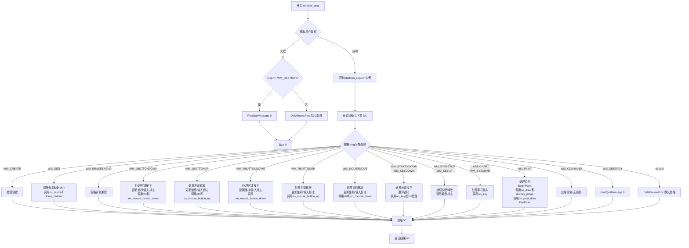

#### 带注释源码

```cpp
//------------------------------------------------------------------------
// 窗口过程函数 - 处理Windows消息分发
//------------------------------------------------------------------------
LRESULT CALLBACK window_proc(HWND hWnd, UINT msg, WPARAM wParam, LPARAM lParam)
{
    PAINTSTRUCT ps;           // 绘制结构，用于WM_PAINT消息
    HDC paintDC;              // 绘制设备上下文

    // 从窗口用户数据中获取platform_support实例指针
    void* user_data = reinterpret_cast<void*>(::GetWindowLongPtr(hWnd, GWLP_USERDATA));
    platform_support* app = 0;

    // 如果存在用户数据，转换为platform_support指针
    if(user_data)
    {
        app = reinterpret_cast<platform_support*>(user_data);
    }

    // 如果没有获取到有效的app实例
    if(app == 0)
    {
        // 处理WM_DESTROY消息，退出消息循环
        if(msg == WM_DESTROY)
        {
            ::PostQuitMessage(0);
            return 0;
        }
        // 其他消息交给默认窗口过程处理
        return ::DefWindowProc(hWnd, msg, wParam, lParam);
    }

    // 获取窗口的设备上下文（用于大多数消息处理）
    HDC dc = ::GetDC(app->m_specific->m_hwnd);
    // 保存当前DC供后续使用
    app->m_specific->m_current_dc = dc;
    LRESULT ret = 0;   // 默认返回值

    // 根据消息类型进行分发处理
    switch(msg) 
    {
    //--------------------------------------------------------------------
    // WM_CREATE: 窗口创建时触发（当前为空实现）
    case WM_CREATE:
        break;
    
    //--------------------------------------------------------------------
    // WM_SIZE: 窗口大小改变时触发
    case WM_SIZE:
        // 重新创建像素映射缓冲区
        app->m_specific->create_pmap(LOWORD(lParam),    // 新宽度
                                     HIWORD(lParam),    // 新高度
                                     &app->rbuf_window());

        // 处理 affine 变换矩阵的 resize
        app->trans_affine_resizing(LOWORD(lParam), HIWORD(lParam));
        // 调用用户的resize回调
        app->on_resize(LOWORD(lParam), HIWORD(lParam));
        // 标记需要重绘
        app->force_redraw();
        break;
    
    //--------------------------------------------------------------------
    // WM_ERASEBKGND: 背景擦除请求（忽略，使用WM_PAINT处理绘制）
    case WM_ERASEBKGND:
        break;
    
    //--------------------------------------------------------------------
    // WM_LBUTTONDOWN: 鼠标左键按下
    case WM_LBUTTONDOWN:
        // 捕获鼠标输入
        ::SetCapture(app->m_specific->m_hwnd);
        // 获取鼠标X坐标
        app->m_specific->m_cur_x = int16(LOWORD(lParam));
        // 根据flip_y设置Y坐标（可能需要翻转）
        if(app->flip_y())
        {
            app->m_specific->m_cur_y = app->rbuf_window().height() - int16(HIWORD(lParam));
        }
        else
        {
            app->m_specific->m_cur_y = int16(HIWORD(lParam));
        }
        // 设置鼠标左键标志和键盘修饰键状态
        app->m_specific->m_input_flags = mouse_left | get_key_flags(wParam);
        
        // 检查是否点击在控件上
        app->m_ctrls.set_cur(app->m_specific->m_cur_x, 
                             app->m_specific->m_cur_y);
        if(app->m_ctrls.on_mouse_button_down(app->m_specific->m_cur_x, 
                                             app->m_specific->m_cur_y))
        {
            app->on_ctrl_change();
            app->force_redraw();
        }
        else
        {
            // 检查是否在控件区域内
            if(app->m_ctrls.in_rect(app->m_specific->m_cur_x, 
                                    app->m_specific->m_cur_y))
            {
                if(app->m_ctrls.set_cur(app->m_specific->m_cur_x, 
                                        app->m_specific->m_cur_y))
                {
                    app->on_ctrl_change();
                    app->force_redraw();
                }
            }
            else
            {
                // 调用用户定义的鼠标按下处理
                app->on_mouse_button_down(app->m_specific->m_cur_x, 
                                          app->m_specific->m_cur_y, 
                                          app->m_specific->m_input_flags);
            }
        }
        break;

    //--------------------------------------------------------------------
    // WM_LBUTTONUP: 鼠标左键释放
    case WM_LBUTTONUP:
        ::ReleaseCapture();   // 释放鼠标捕获
        app->m_specific->m_cur_x = int16(LOWORD(lParam));
        if(app->flip_y())
        {
            app->m_specific->m_cur_y = app->rbuf_window().height() - int16(HIWORD(lParam));
        }
        else
        {
            app->m_specific->m_cur_y = int16(HIWORD(lParam));
        }
        app->m_specific->m_input_flags = mouse_left | get_key_flags(wParam);

        // 处理控件的鼠标释放事件
        if(app->m_ctrls.on_mouse_button_up(app->m_specific->m_cur_x, 
                                           app->m_specific->m_cur_y))
        {
            app->on_ctrl_change();
            app->force_redraw();
        }
        // 调用用户定义的鼠标释放处理
        app->on_mouse_button_up(app->m_specific->m_cur_x, 
                                 app->m_specific->m_cur_y, 
                                 app->m_specific->m_input_flags);
        break;


    //--------------------------------------------------------------------
    // WM_RBUTTONDOWN: 鼠标右键按下
    case WM_RBUTTONDOWN:
        ::SetCapture(app->m_specific->m_hwnd);
        app->m_specific->m_cur_x = int16(LOWORD(lParam));
        if(app->flip_y())
        {
            app->m_specific->m_cur_y = app->rbuf_window().height() - int16(HIWORD(lParam));
        }
        else
        {
            app->m_specific->m_cur_y = int16(HIWORD(lParam));
        }
        // 设置右键标志
        app->m_specific->m_input_flags = mouse_right | get_key_flags(wParam);
        app->on_mouse_button_down(app->m_specific->m_cur_x, 
                                  app->m_specific->m_cur_y, 
                                  app->m_specific->m_input_flags);
        break;

    //--------------------------------------------------------------------
    // WM_RBUTTONUP: 鼠标右键释放
    case WM_RBUTTONUP:
        ::ReleaseCapture();
        app->m_specific->m_cur_x = int16(LOWORD(lParam));
        if(app->flip_y())
        {
            app->m_specific->m_cur_y = app->rbuf_window().height() - int16(HIWORD(lParam));
        }
        else
        {
            app->m_specific->m_cur_y = int16(HIWORD(lParam));
        }
        app->m_specific->m_input_flags = mouse_right | get_key_flags(wParam);
        app->on_mouse_button_up(app->m_specific->m_cur_x, 
                                 app->m_specific->m_cur_y, 
                                 app->m_specific->m_input_flags);
        break;

    //--------------------------------------------------------------------
    // WM_MOUSEMOVE: 鼠标移动
    case WM_MOUSEMOVE:
        app->m_specific->m_cur_x = int16(LOWORD(lParam));
        if(app->flip_y())
        {
            app->m_specific->m_cur_y = app->rbuf_window().height() - int16(HIWORD(lParam));
        }
        else
        {
            app->m_specific->m_cur_y = int16(HIWORD(lParam));
        }
        // 获取键盘修饰键状态
        app->m_specific->m_input_flags = get_key_flags(wParam);

        // 检查控件是否处理了鼠标移动
        if(app->m_ctrls.on_mouse_move(
            app->m_specific->m_cur_x, 
            app->m_specific->m_cur_y,
            (app->m_specific->m_input_flags & mouse_left) != 0))
        {
            app->on_ctrl_change();
            app->force_redraw();
        }
        else
        {
            // 如果不在控件区域内，调用用户的鼠标移动处理
            if(!app->m_ctrls.in_rect(app->m_specific->m_cur_x, 
                                     app->m_specific->m_cur_y))
            {
                app->on_mouse_move(app->m_specific->m_cur_x, 
                                   app->m_specific->m_cur_y, 
                                   app->m_specific->m_input_flags);
            }
        }
        break;

    //--------------------------------------------------------------------
    // WM_SYSKEYDOWN/WM_KEYDOWN: 系统键/普通键按下
    case WM_SYSKEYDOWN:
    case WM_KEYDOWN:
        app->m_specific->m_last_translated_key = 0;
        // 处理Ctrl和Shift修饰键
        switch(wParam) 
        {
            case VK_CONTROL:
                app->m_specific->m_input_flags |= kbd_ctrl;
                break;

            case VK_SHIFT:
                app->m_specific->m_input_flags |= kbd_shift;
                break;

            default:
                // 翻译虚拟键码为AGG自定义键码
                app->m_specific->translate(wParam);
                break;
        }
    
        // 如果有翻译后的键码
        if(app->m_specific->m_last_translated_key)
        {
            bool left  = false;
            bool up    = false;
            bool right = false;
            bool down  = false;

            // 处理特殊功能键
            switch(app->m_specific->m_last_translated_key)
            {
            case key_left:
                left = true;
                break;

            case key_up:
                up = true;
                break;

            case key_right:
                right = true;
                break;

            case key_down:
                down = true;
                break;

            case key_f2:                        
                // F2键：截图保存
                app->copy_window_to_img(agg::platform_support::max_images - 1);
                app->save_img(agg::platform_support::max_images - 1, "screenshot");
                break;
            }

            // 根据窗口标志决定处理方式
            if(app->window_flags() & window_process_all_keys)
            {
                // 处理所有按键事件
                app->on_key(app->m_specific->m_cur_x,
                            app->m_specific->m_cur_y,
                            app->m_specific->m_last_translated_key,
                            app->m_specific->m_input_flags);
            }
            else
            {
                // 首先尝试让控件处理方向键
                if(app->m_ctrls.on_arrow_keys(left, right, down, up))
                {
                    app->on_ctrl_change();
                    app->force_redraw();
                }
                else
                {
                    // 控件不处理，调用用户的按键处理
                    app->on_key(app->m_specific->m_cur_x,
                                app->m_specific->m_cur_y,
                                app->m_specific->m_last_translated_key,
                                app->m_specific->m_input_flags);
                }
            }
        }
        break;

    //--------------------------------------------------------------------
    // WM_SYSKEYUP/WM_KEYUP: 系统键/普通键释放
    case WM_SYSKEYUP:
    case WM_KEYUP:
        app->m_specific->m_last_translated_key = 0;
        // 清除修饰键标志
        switch(wParam) 
        {
            case VK_CONTROL:
                app->m_specific->m_input_flags &= ~kbd_ctrl;
                break;

            case VK_SHIFT:
                app->m_specific->m_input_flags &= ~kbd_shift;
                break;
        }
        break;

    //--------------------------------------------------------------------
    // WM_CHAR/WM_SYSCHAR: 字符输入
    case WM_CHAR:
    case WM_SYSCHAR:
        // 仅当没有翻译键码时处理字符
        if(app->m_specific->m_last_translated_key == 0)
        {
            app->on_key(app->m_specific->m_cur_x,
                        app->m_specific->m_cur_y,
                        wParam,
                        app->m_specific->m_input_flags);
        }
        break;
    
    //--------------------------------------------------------------------
    // WM_PAINT: 窗口绘制请求
    case WM_PAINT:
        paintDC = ::BeginPaint(hWnd, &ps);   // 开始绘制
        app->m_specific->m_current_dc = paintDC;
        // 如果需要重绘
        if(app->m_specific->m_redraw_flag)
        {
            app->on_draw();                   // 调用用户的绘制函数
            app->m_specific->m_redraw_flag = false;
        }
        // 显示像素映射到屏幕
        app->m_specific->display_pmap(paintDC, &app->rbuf_window());
        // 绘制后的后处理（如绘制控件）
        app->on_post_draw(paintDC);
        app->m_specific->m_current_dc = 0;
        ::EndPaint(hWnd, &ps);               // 结束绘制
        break;
    
    //--------------------------------------------------------------------
    // WM_COMMAND: 命令通知（当前为空实现）
    case WM_COMMAND:
        break;
    
    //--------------------------------------------------------------------
    // WM_DESTROY: 窗口销毁
    case WM_DESTROY:
        ::PostQuitMessage(0);
        break;
    
    //--------------------------------------------------------------------
    // default: 默认处理
    default:
        ret = ::DefWindowProc(hWnd, msg, wParam, lParam);
        break;
    }
    
    // 清理：清除当前DC并释放
    app->m_specific->m_current_dc = 0;
    ::ReleaseDC(app->m_specific->m_hwnd, dc);
    return ret;
}
```


### WinMain

Windows应用程序的主入口函数，负责初始化Windows环境、解析命令行参数并调用应用程序主函数`agg_main`。

参数：

- `hInstance`：`HINSTANCE`，当前应用程序实例的句柄
- `hPrevInstance`：`HINSTANCE`，先前实例的句柄（在Win32中始终为NULL，保留用于兼容性）
- `lpszCmdLine`：`LPSTR`，应用程序的命令行字符串（不包含可执行文件名）
- `nCmdShow`：`int`，指定窗口的显示方式（如SW_SHOW、SW_HIDE等）

返回值：`int`，返回应用程序的退出码，由`agg_main`函数返回

#### 流程图

```mermaid
flowchart TD
    A[WinMain开始] --> B[设置全局变量 g_windows_instance = hInstance]
    B --> C[设置全局变量 g_windows_cmd_show = nCmdShow]
    C --> D[分配命令行参数内存 argv_str]
    D --> E[初始化 argv 数组]
    E --> F[创建 tokenizer 对象解析命令行]
    F --> G[设置 argc = 1, argv[0] = 空字符串]
    G --> H{argc < 64?}
    H -->|是| I[获取下一个token]
    I --> J{token有效且长度>0?}
    J -->|是| K[复制token到argv数组]
    K --> L[argc++]
    L --> H
    J -->|否| M[跳出循环]
    M --> N[调用 agg_main函数]
    N --> O[释放argv_str内存]
    O --> P[返回 ret]
```

#### 带注释源码

```cpp
//----------------------------------------------------------------------------
// Windows应用程序主入口函数
//----------------------------------------------------------------------------
int PASCAL WinMain(HINSTANCE hInstance,
                   HINSTANCE hPrevInstance,
                   LPSTR lpszCmdLine,
                   int nCmdShow)
{
    // 1. 保存全局Windows实例句柄，供后续窗口创建使用
    agg::g_windows_instance = hInstance;
    
    // 2. 保存全局显示标志，用于后续窗口显示
    agg::g_windows_cmd_show = nCmdShow;

    // 3. 分配命令行参数内存空间（额外3字节用于处理边界情况）
    char* argv_str = new char [strlen(lpszCmdLine) + 3];
    char* argv_ptr = argv_str;

    // 4. 初始化argv数组，最多支持63个参数
    char* argv[64];
    memset(argv, 0, sizeof(argv));

    // 5. 创建命令行分词器，使用空格作为分隔符
    // 参数说明：
    //   " " - 分隔符为空格
    //   "\"' " - 需去除的首尾空白字符
    //   "\"" - 引用字符为双引号
    //   '\\' - 转义字符为反斜杠
    //   agg::tokenizer::multiple - 多个连续分隔符视为一个
    agg::tokenizer cmd_line(" ", "\"' ", "\"'", '\\', agg::tokenizer::multiple);
    
    // 6. 设置要解析的字符串
    cmd_line.set_str(lpszCmdLine);

    // 7. 初始化argc，第一个参数为空字符串（模拟程序名）
    int argc = 0;
    argv[argc++] = argv_ptr;
    *argv_ptr++ = 0;

    // 8. 循环解析命令行参数，最多解析63个
    while(argc < 64)
    {
        // 获取下一个token
        agg::tokenizer::token tok = cmd_line.next_token();
        
        // 如果没有更多token，退出循环
        if(tok.ptr == 0) break;
        
        // 如果token有效且长度大于0
        if(tok.len)
        {
            // 将token复制到argv数组
            memcpy(argv_ptr, tok.ptr, tok.len);
            argv[argc++] = argv_ptr;
            argv_ptr += tok.len;
            *argv_ptr++ = 0;  // 添加字符串结束符
        }
    }

    // 9. 调用应用程序主函数
    int ret = agg_main(argc, argv);
    
    // 10. 释放动态分配的内存
    delete [] argv_str;

    // 11. 返回应用程序退出码
    return ret;
}
```


### `agg_main`

这是AGG（Anti-Grain Geometry）应用的主入口函数，类似于标准C/C++程序中的`main`函数。该函数由Windows特定的`WinMain`函数调用，在完成命令行参数解析和Windows应用程序初始化后，将控制权传递给用户的应用程序逻辑。

参数：

- `argc`：`int`，命令行参数个数（包含程序名称）
- `argv`：`char*[]`，命令行参数数组，每个元素指向一个以null结尾的字符串

返回值：`int`，应用程序退出码，通常返回0表示正常退出

#### 流程图

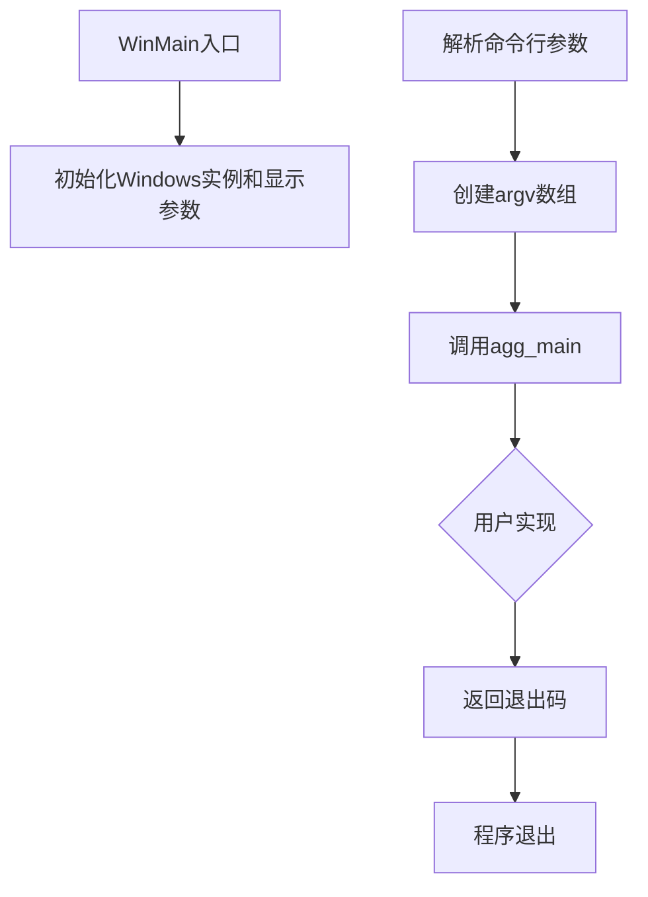

#### 带注释源码

```cpp
//----------------------------------------------------------------------------
// agg_main - AGG应用主函数声明
// 这是一个用户需要实现的函数原型声明
// 实际实现由用户在自己的应用程序中完成
//----------------------------------------------------------------------------

// 函数声明：用户需要在链接时提供此函数的实现
int agg_main(int argc, char* argv[]);


//----------------------------------------------------------------------------
// WinMain - Windows应用程序入口点（已实现）
//----------------------------------------------------------------------------
int PASCAL WinMain(HINSTANCE hInstance,       // 当前实例句柄
                   HINSTANCE hPrevInstance,   // 前一个实例句柄（已废弃）
                   LPSTR lpszCmdLine,         // 命令行参数字符串
                   int nCmdShow)              // 窗口显示方式
{
    // 1. 保存全局Windows实例和显示标志
    agg::g_windows_instance = hInstance;
    agg::g_windows_cmd_show = nCmdShow;

    // 2. 分配命令行参数缓冲区
    char* argv_str = new char [strlen(lpszCmdLine) + 3];
    char* argv_ptr = argv_str;

    // 3. 初始化argv数组（最多64个参数）
    char* argv[64];
    memset(argv, 0, sizeof(argv));

    // 4. 创建命令行分词器，使用空格作为分隔符
    agg::tokenizer cmd_line(" ", "\"' ", "\"'", '\\', agg::tokenizer::multiple);
    cmd_line.set_str(lpszCmdLine);

    // 5. 解析命令行参数
    int argc = 0;
    argv[argc++] = argv_ptr;  // 第一个参数通常是程序名（此处为空字符串）
    *argv_ptr++ = 0;

    // 6. 循环解析所有命令行参数
    while(argc < 64)
    {
        agg::tokenizer::token tok = cmd_line.next_token();
        if(tok.ptr == 0) break;           // 没有更多参数
        if(tok.len)
        {
            memcpy(argv_ptr, tok.ptr, tok.len);
            argv[argc++] = argv_ptr;
            argv_ptr += tok.len;
            *argv_ptr++ = 0;
        }
    }

    // 7. 调用用户实现的agg_main函数
    int ret = agg_main(argc, argv);

    // 8. 清理并返回退出码
    delete [] argv_str;
    return ret;
}
```

---

### 补充说明

#### 设计目标与约束

- **平台限制**：该函数设计仅用于Windows平台，使用`WinMain`作为入口点而非标准的`main`函数
- **参数限制**：最多支持64个命令行参数
- **用户实现**：该函数仅为声明，实际逻辑需要用户在应用程序中实现

#### 错误处理与异常设计

- 如果`agg_main`内部发生异常或错误，通常返回非零值表示异常退出
- `WinMain`本身没有复杂的错误处理，假设`agg_main`会正确处理各种情况

#### 数据流与状态机

```
命令行字符串 → tokenizer解析 → argv数组 → agg_main处理 → 返回退出码
```

#### 外部依赖与接口契约

- **依赖**：`tokenizer`类用于解析Windows命令行（因为Windows不直接提供argc/argv形式的参数）
- **契约**：用户必须实现`agg_main`函数，接收命令行参数并返回整型退出码
- **全局变量依赖**：`agg_main`可以访问AGG库提供的`platform_support`类来创建图形应用程序


### `platform_specific::platform_specific`

该构造函数是 Anti-Grain Geometry 库中 Windows 平台支持类的核心初始化方法，负责根据用户指定的像素格式配置系统级格式、位深度、键盘映射表，并初始化高性能计时器。

参数：

- `format`：`pix_format_e`，用户请求的像素格式（如灰度、RGB、RGBA等）
- `flip_y`：`bool`，是否翻转Y轴坐标

返回值：无（构造函数）

#### 流程图

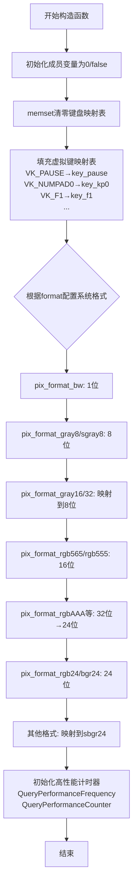

#### 带注释源码

```cpp
//------------------------------------------------------------------------
// platform_specific 构造函数
// 初始化Windows平台特定的所有成员变量和系统配置
//------------------------------------------------------------------------
platform_specific::platform_specific(pix_format_e format, bool flip_y) :
    // 初始化成员变量列表
    m_format(format),                    // 用户请求的像素格式
    m_sys_format(pix_format_undefined),  // 系统实际支持的格式，初始为未定义
    m_flip_y(flip_y),                    // Y轴翻转标志
    m_bpp(0),                             // 用户格式的位深度
    m_sys_bpp(0),                         // 系统格式的位深度
    m_hwnd(0),                            // 窗口句柄，尚未创建
    m_last_translated_key(0),            // 最后转换的虚拟键码
    m_cur_x(0),                           // 当前鼠标X坐标
    m_cur_y(0),                           // 当前鼠标Y坐标
    m_input_flags(0),                     // 输入状态标志
    m_redraw_flag(true),                 // 标记需要重绘
    m_current_dc(0)                      // 当前设备上下文
{
    // 清零键盘映射表数组
    memset(m_keymap, 0, sizeof(m_keymap));

    // 填充Windows虚拟键到AGG自定义键码的映射表
    // 数字小键盘
    m_keymap[VK_PAUSE]      = key_pause;
    m_keymap[VK_CLEAR]      = key_clear;
    m_keymap[VK_NUMPAD0]    = key_kp0;
    m_keymap[VK_NUMPAD1]    = key_kp1;
    m_keymap[VK_NUMPAD2]    = key_kp2;
    m_keymap[VK_NUMPAD3]    = key_kp3;
    m_keymap[VK_NUMPAD4]    = key_kp4;
    m_keymap[VK_NUMPAD5]    = key_kp5;
    m_keymap[VK_NUMPAD6]    = key_kp6;
    m_keymap[VK_NUMPAD7]    = key_kp7;
    m_keymap[VK_NUMPAD8]    = key_kp8;
    m_keymap[VK_NUMPAD9]    = key_kp9;
    m_keymap[VK_DECIMAL]    = key_kp_period;
    m_keymap[VK_DIVIDE]     = key_kp_divide;
    m_keymap[VK_MULTIPLY]   = key_kp_multiply;
    m_keymap[VK_SUBTRACT]   = key_kp_minus;
    m_keymap[VK_ADD]        = key_kp_plus;

    // 方向键和控制键
    m_keymap[VK_UP]         = key_up;
    m_keymap[VK_DOWN]       = key_down;
    m_keymap[VK_RIGHT]      = key_right;
    m_keymap[VK_LEFT]       = key_left;
    m_keymap[VK_INSERT]     = key_insert;
    m_keymap[VK_DELETE]     = key_delete;
    m_keymap[VK_HOME]       = key_home;
    m_keymap[VK_END]        = key_end;
    m_keymap[VK_PRIOR]      = key_page_up;
    m_keymap[VK_NEXT]       = key_page_down;

    // 功能键 F1-F15
    m_keymap[VK_F1]         = key_f1;
    m_keymap[VK_F2]         = key_f2;
    m_keymap[VK_F3]         = key_f3;
    m_keymap[VK_F4]         = key_f4;
    m_keymap[VK_F5]         = key_f5;
    m_keymap[VK_F6]         = key_f6;
    m_keymap[VK_F7]         = key_f7;
    m_keymap[VK_F8]         = key_f8;
    m_keymap[VK_F9]         = key_f9;
    m_keymap[VK_F10]        = key_f10;
    m_keymap[VK_F11]        = key_f11;
    m_keymap[VK_F12]        = key_f12;
    m_keymap[VK_F13]        = key_f13;
    m_keymap[VK_F14]        = key_f14;
    m_keymap[VK_F15]        = key_f15;

    // 锁定键
    m_keymap[VK_NUMLOCK]    = key_numlock;
    m_keymap[VK_CAPITAL]    = key_capslock;
    m_keymap[VK_SCROLL]     = key_scrollock;

    // 根据用户请求的像素格式，配置系统级格式和位深度
    // Windows GDI可能不完全支持所有AGG格式，需要格式转换
    switch(m_format)
    {
    case pix_format_bw:  // 黑白1位
        m_sys_format = pix_format_bw;
        m_bpp = 1;
        m_sys_bpp = 1;
        break;

    case pix_format_gray8:
    case pix_format_sgray8:  // 8位灰度
        m_sys_format = pix_format_sgray8;
        m_bpp = 8;
        m_sys_bpp = 8;
        break;

    case pix_format_gray16:  // 16位灰度映射到8位
        m_sys_format = pix_format_sgray8;
        m_bpp = 16;
        m_sys_bpp = 8;
        break;

    case pix_format_gray32:  // 32位灰度映射到8位
        m_sys_format = pix_format_sgray8;
        m_bpp = 32;
        m_sys_bpp = 8;
        break;

    case pix_format_rgb565:
    case pix_format_rgb555:  // 16位RGB
        m_sys_format = pix_format_rgb555;
        m_bpp = 16;
        m_sys_bpp = 16;
        break;

    case pix_format_rgbAAA:
    case pix_format_bgrAAA:
    case pix_format_rgbBBA:
    case pix_format_bgrABB:  // 32位→24位系统格式
        m_sys_format = pix_format_bgr24;
        m_bpp = 32;
        m_sys_bpp = 24;
        break;

    case pix_format_rgb24:
    case pix_format_bgr24:
    case pix_format_srgb24:
    case pix_format_sbgr24:  // 24位
        m_sys_format = pix_format_sbgr24;
        m_bpp = 24;
        m_sys_bpp = 24;
        break;

    case pix_format_rgb48:
    case pix_format_bgr48:  // 48位→24位
        m_sys_format = pix_format_sbgr24;
        m_bpp = 48;
        m_sys_bpp = 24;
        break;

    case pix_format_rgb96:
    case pix_format_bgr96:  // 96位→24位
        m_sys_format = pix_format_sbgr24;
        m_bpp = 96;
        m_sys_bpp = 24;
        break;

    case pix_format_bgra32:
    case pix_format_abgr32:
    case pix_format_argb32:
    case pix_format_rgba32:
    case pix_format_sbgra32:
    case pix_format_sabgr32:
    case pix_format_sargb32:
    case pix_format_srgba32:  // 32位带Alpha→24位
        m_sys_format = pix_format_sbgr24;
        m_bpp = 32;
        m_sys_bpp = 24;
        break;

    case pix_format_bgra64:
    case pix_format_abgr64:
    case pix_format_argb64:
    case pix_format_rgba64:  // 64位→24位
        m_sys_format = pix_format_sbgr24;
        m_bpp = 64;
        m_sys_bpp = 24;
        break;

    case pix_format_bgra128:
    case pix_format_abgr128:
    case pix_format_argb128:
    case pix_format_rgba128:  // 128位→24位
        m_sys_format = pix_format_sbgr24;
        m_bpp = 128;
        m_sys_bpp = 24;
        break;
    }

    // 初始化Windows高性能计时器用于精确计时
    ::QueryPerformanceFrequency(&m_sw_freq);   // 获取计数器频率
    ::QueryPerformanceCounter(&m_sw_start);     // 记录开始时间
}
```


### `platform_specific.create_pmap`

该函数用于在 Windows 平台上创建像素映射（pixel map），根据指定的宽度和高度分配内存，并将渲染缓冲区附加到该像素映射，以便进行图形渲染操作。

参数：

- `width`：`unsigned`，像素映射的宽度（以像素为单位）
- `height`：`unsigned`，像素映射的高度（以像素为单位）
- `wnd`：`rendering_buffer*`，指向渲染缓冲区的指针，用于附加创建的像素映射数据

返回值：`void`，无返回值

#### 流程图

```mermaid
flowchart TD
    A[开始 create_pmap] --> B[调用 m_pmap_window.create]
    B --> B1[传入 width, height, org_e(m_bpp)]
    B1 --> C{创建成功}
    C -->|是| D[调用 wnd->attach 附加像素数据]
    C -->|否| E[结束]
    D --> D1[附加 m_pmap_window.buf]
    D1 --> D2[附加宽度 m_pmap_window.width]
    D2 --> D3[附加高度 m_pmap_window.height]
    D3 --> D4{判断 m_flip_y}
    D4 -->|true| D5[使用正向 stride]
    D4 -->|false| D6[使用负向 stride]
    D5 --> E[结束]
    D6 --> E
```

#### 带注释源码

```cpp
//------------------------------------------------------------------------
// 创建像素映射函数
// 参数:
//   width  - 像素映射宽度
//   height - 像素映射高度
//   wnd    - 渲染缓冲区指针，用于附加像素数据
//------------------------------------------------------------------------
void platform_specific::create_pmap(unsigned width, 
                                    unsigned height,
                                    rendering_buffer* wnd)
{
    // 使用内部像素格式 m_bpp 创建窗口像素映射
    // m_bpp 在构造函数中根据 pix_format_e 格式确定
    m_pmap_window.create(width, height, org_e(m_bpp));
    
    // 将渲染缓冲区附加到新创建的像素映射
    wnd->attach(m_pmap_window.buf(),          // 像素数据指针
                m_pmap_window.width(),        // 像素映射宽度
                m_pmap_window.height(),       // 像素映射高度
                // 根据 m_flip_y 决定步长(stride)的正负
                // flip_y 为 true 时使用正向 stride，为 false 时使用负向 stride
                // 负向 stride 用于翻转 Y 轴坐标系
                  m_flip_y ?
                  m_pmap_window.stride() :
                 -m_pmap_window.stride());
}
```

#### 相关类信息

**所属类**：`platform_specific`

**类字段说明**：

| 字段名称 | 类型 | 描述 |
|---------|------|------|
| `m_pmap_window` | `pixel_map` | 窗口像素映射对象，存储主窗口的像素数据 |
| `m_bpp` | `unsigned` | 每像素位数，表示像素格式的位深度 |
| `m_flip_y` | `bool` | Y轴翻转标志，决定渲染坐标系的翻转方式 |

**调用关系**：

该函数被以下位置调用：
1. `window_proc` 函数中处理 `WM_SIZE` 消息时（窗口大小改变时）
2. `platform_support::init` 函数中（初始化窗口时）


### `platform_specific.display_pmap`

该方法负责将应用程序内部的渲染缓冲区（`rendering_buffer`）绘制到Windows设备上下文（HDC）上。它首先检查当前像素格式是否与系统支持的格式一致：若一致则直接绘制；若不一致，则创建一个临时像素映射，进行格式转换后再绘制，从而实现不同像素格式图像在屏幕上的正确显示。

参数：
- `dc`：`HDC`，Windows 设备上下文句柄，指定绘制目标窗口或内存设备。
- `src`：`const rendering_buffer*`，指向源渲染缓冲区的指针，包含待显示的像素数据。

返回值：`void`，无返回值。

#### 流程图

```mermaid
flowchart TD
    A([Start display_pmap]) --> B{m_sys_format == m_format?}
    B -- Yes --> C[直接绘制: m_pmap_window.draw(dc)]
    C --> D([End])
    B -- No --> E[创建临时像素映射 pmap_tmp]
    E --> F[创建临时渲染缓冲区 rbuf_tmp 并绑定到 pmap_tmp]
    F --> G[调用 convert_pmap 将 src 转换为 rbuf_tmp]
    G --> H[绘制临时像素映射: pmap_tmp.draw(dc)]
    H --> D
```

#### 带注释源码

```cpp
//----------------------------------------------------------------------------
// 显示像素映射到指定的设备上下文
//----------------------------------------------------------------------------
void platform_specific::display_pmap(HDC dc, const rendering_buffer* src)
{
    // 如果系统像素格式与应用程序当前格式相同，则直接绘制窗口像素映射
    if(m_sys_format == m_format)
    {
        m_pmap_window.draw(dc);
    }
    else
    {
        // 格式不匹配，需要进行颜色空间或深度转换
        // 1. 创建一个临时像素映射，用于存储转换后的图像数据
        pixel_map pmap_tmp;
        pmap_tmp.create(m_pmap_window.width(), 
                        m_pmap_window.height(),
                        org_e(m_sys_bpp));

        // 2. 创建一个临时渲染缓冲区并将其绑定到临时像素映射
        rendering_buffer rbuf_tmp;
        rbuf_tmp.attach(pmap_tmp.buf(),
                        pmap_tmp.width(),
                        pmap_tmp.height(),
                        // 根据垂直翻转设置调整行顺序
                        m_flip_y ?
                          pmap_tmp.stride() :
                         -pmap_tmp.stride());

        // 3. 执行像素格式转换（例如从 Gray8 转换到 RGB24）
        convert_pmap(&rbuf_tmp, src, m_format);
        
        // 4. 将转换后的临时像素映射绘制到设备上下文
        pmap_tmp.draw(dc);
    }
}
```


### `platform_specific::load_pmap`

该函数是 AGG 库中平台支持层的核心图像加载方法。它负责将磁盘上的 BMP 文件读取到内存，首先解析为系统默认的像素格式，然后根据用户请求的目标像素格式（如灰度、RGB 等）进行复杂的颜色空间转换，最后将转换后的数据存储到类内部的图像槽位（`m_pmap_img`）中，并将其绑定到传入的目标渲染缓冲区（`dst`）以供渲染使用。

参数：

- `fn`：`const char*`，要加载的 BMP 图片的文件路径（包含文件名）。
- `idx`：`unsigned`，图像缓冲区的索引，用于指定将图像存储在 `platform_specific` 类的 `m_pmap_img` 数组中的位置。
- `dst`：`rendering_buffer*`，指向目标渲染缓冲区的指针，加载后的图像数据将直接绑定到此缓冲区。

返回值：`bool`，如果成功加载并转换图像则返回 `true`，如果文件不存在或加载失败则返回 `false`。

#### 流程图

```mermaid
flowchart TD
    A[Start: load_pmap] --> B[Load BMP to pmap_tmp]
    B --> C{Load Success?}
    C -->|No| D[Return False]
    C -->|Yes| E[Create temp rbuf_tmp from pmap_tmp]
    E --> F[Create m_pmap_img[idx] with target width/height/bpp]
    F --> G[Attach dst to m_pmap_img[idx]]
    G --> H[Determine Conversion Strategy based on m_format and pmap_tmp.bpp]
    H --> I{Is Conversion Required?}
    I -->|Yes| J[Execute Color Conversion / Format Transform]
    I -->|No| K[Direct Copy]
    J --> L[Return True]
    K --> L
```

#### 带注释源码

```cpp
    //------------------------------------------------------------------------
    bool platform_specific::load_pmap(const char* fn, unsigned idx, 
                                      rendering_buffer* dst)
    {
        // 1. 尝试从文件加载 BMP 到临时像素图
        pixel_map pmap_tmp;
        if(!pmap_tmp.load_from_bmp(fn)) return false;

        // 2. 创建临时渲染缓冲区，指向加载的 BMP 数据
        //    根据 m_flip_y 决定是否翻转行顺序
        rendering_buffer rbuf_tmp;
        rbuf_tmp.attach(pmap_tmp.buf(),
                        pmap_tmp.width(),
                        pmap_tmp.height(),
                        m_flip_y ?
                          pmap_tmp.stride() :
                         -pmap_tmp.stride());

        // 3. 在内部图像数组中创建目标大小的缓冲区
        //    使用应用程序请求的像素深度 (m_bpp)
        m_pmap_img[idx].create(pmap_tmp.width(), 
                               pmap_tmp.height(), 
                               org_e(m_bpp),
                               0);

        // 4. 将传入的渲染缓冲区绑定到内部图像数据
        //    这样外部使用 dst 时，实际操作的就是 m_pmap_img[idx]
        dst->attach(m_pmap_img[idx].buf(),
                    m_pmap_img[idx].width(),
                    m_pmap_img[idx].height(),
                    m_flip_y ?
                       m_pmap_img[idx].stride() :
                      -m_pmap_img[idx].stride());

        // 5. 根据目标格式 (m_format) 和源 BMP 格式 (pmap_tmp.bpp()) 
        //    进行复杂的颜色转换
        switch(m_format)
        {
        case pix_format_sgray8:
            switch(pmap_tmp.bpp())
            {
            //case 16: color_conv(dst, &rbuf_tmp, color_conv_rgb555_to_gray8()); break;
            case 24: color_conv(dst, &rbuf_tmp, color_conv_bgr24_to_gray8()); break;
            //case 32: color_conv(dst, &rbuf_tmp, color_conv_bgra32_to_gray8()); break;
            }
            break;

        case pix_format_gray8:
            switch(pmap_tmp.bpp())
            {
            case 24: convert<pixfmt_gray8, pixfmt_sbgr24>(dst, &rbuf_tmp); break;
            }
            break;

        case pix_format_gray16:
            switch(pmap_tmp.bpp())
            {
            //case 16: color_conv(dst, &rbuf_tmp, color_conv_rgb555_to_gray16()); break;
            case 24: convert<pixfmt_gray16, pixfmt_sbgr24>(dst, &rbuf_tmp); break;
            //case 32: color_conv(dst, &rbuf_tmp, color_conv_bgra32_to_gray16()); break;
            }
            break;

        case pix_format_gray32:
            switch(pmap_tmp.bpp())
            {
            //case 16: color_conv(dst, &rbuf_tmp, color_conv_rgb555_to_gray32()); break;
            case 24: convert<pixfmt_gray32, pixfmt_sbgr24>(dst, &rbuf_tmp); break;
            //case 32: color_conv(dst, &rbuf_tmp, color_conv_bgra32_to_gray32()); break;
            }
            break;

        case pix_format_rgb555:
            switch(pmap_tmp.bpp())
            {
            case 16: color_conv(dst, &rbuf_tmp, color_conv_rgb555_to_rgb555()); break;
            case 24: color_conv(dst, &rbuf_tmp, color_conv_bgr24_to_rgb555()); break;
            case 32: color_conv(dst, &rbuf_tmp, color_conv_bgra32_to_rgb555()); break;
            }
            break;

        case pix_format_rgb565:
            switch(pmap_tmp.bpp())
            {
            case 16: color_conv(dst, &rbuf_tmp, color_conv_rgb555_to_rgb565()); break;
            case 24: color_conv(dst, &rbuf_tmp, color_conv_bgr24_to_rgb565()); break;
            case 32: color_conv(dst, &rbuf_tmp, color_conv_bgra32_to_rgb565()); break;
            }
            break;

        case pix_format_srgb24:
            switch(pmap_tmp.bpp())
            {
            case 16: color_conv(dst, &rbuf_tmp, color_conv_rgb555_to_rgb24()); break;
            case 24: color_conv(dst, &rbuf_tmp, color_conv_bgr24_to_rgb24()); break;
            case 32: color_conv(dst, &rbuf_tmp, color_conv_bgra32_to_rgb24()); break;
            }
            break;

        case pix_format_sbgr24:
            switch(pmap_tmp.bpp())
            {
            case 16: color_conv(dst, &rbuf_tmp, color_conv_rgb555_to_bgr24()); break;
            case 24: color_conv(dst, &rbuf_tmp, color_conv_bgr24_to_bgr24()); break;
            case 32: color_conv(dst, &rbuf_tmp, color_conv_bgra32_to_bgr24()); break;
            }
            break;

        case pix_format_rgb24:
            switch(pmap_tmp.bpp())
            {
            case 24: convert<pixfmt_rgb24, pixfmt_sbgr24>(dst, &rbuf_tmp); break;
            }
            break;

        case pix_format_bgr24:
            switch(pmap_tmp.bpp())
            {
            case 24: convert<pixfmt_bgr24, pixfmt_sbgr24>(dst, &rbuf_tmp); break;
            }
            break;

        case pix_format_rgb48:
            switch(pmap_tmp.bpp())
            {
            //case 16: color_conv(dst, &rbuf_tmp, color_conv_rgb555_to_rgb48()); break;
            case 24: convert<pixfmt_rgb48, pixfmt_sbgr24>(dst, &rbuf_tmp); break;
            //case 32: color_conv(dst, &rbuf_tmp, color_conv_bgra32_to_rgb48()); break;
            }
            break;

        case pix_format_bgr48:
            switch(pmap_tmp.bpp())
            {
            //case 16: color_conv(dst, &rbuf_tmp, color_conv_rgb555_to_bgr48()); break;
            case 24: convert<pixfmt_bgr48, pixfmt_sbgr24>(dst, &rbuf_tmp); break;
            //case 32: color_conv(dst, &rbuf_tmp, color_conv_bgra32_to_bgr48()); break;
            }
            break;

        case pix_format_sabgr32:
            switch(pmap_tmp.bpp())
            {
            case 16: color_conv(dst, &rbuf_tmp, color_conv_rgb555_to_abgr32()); break;
            case 24: color_conv(dst, &rbuf_tmp, color_conv_bgr24_to_abgr32()); break;
            case 32: color_conv(dst, &rbuf_tmp, color_conv_bgra32_to_abgr32()); break;
            }
            break;

        case pix_format_sargb32:
            switch(pmap_tmp.bpp())
            {
            case 16: color_conv(dst, &rbuf_tmp, color_conv_rgb555_to_argb32()); break;
            case 24: color_conv(dst, &rbuf_tmp, color_conv_bgr24_to_argb32()); break;
            case 32: color_conv(dst, &rbuf_tmp, color_conv_bgra32_to_argb32()); break;
            }
            break;

        case pix_format_sbgra32:
            switch(pmap_tmp.bpp())
            {
            case 16: color_conv(dst, &rbuf_tmp, color_conv_rgb555_to_bgra32()); break;
            case 24: color_conv(dst, &rbuf_tmp, color_conv_bgr24_to_bgra32()); break;
            case 32: color_conv(dst, &rbuf_tmp, color_conv_bgra32_to_bgra32()); break;
            }
            break;

        case pix_format_srgba32:
            switch(pmap_tmp.bpp())
            {
            case 16: color_conv(dst, &rbuf_tmp, color_conv_rgb555_to_rgba32()); break;
            case 24: color_conv(dst, &rbuf_tmp, color_conv_bgr24_to_rgba32()); break;
            case 32: color_conv(dst, &rbuf_tmp, color_conv_bgra32_to_rgba32()); break;
            }
            break;

        case pix_format_abgr32:
            switch(pmap_tmp.bpp())
            {
            case 24: convert<pixfmt_abgr32, pixfmt_sbgr24>(dst, &rbuf_tmp); break;
            }
            break;

        case pix_format_argb32:
            switch(pmap_tmp.bpp())
            {
            case 24: convert<pixfmt_argb32, pixfmt_sbgr24>(dst, &rbuf_tmp); break;
            }
            break;

        case pix_format_bgra32:
            switch(pmap_tmp.bpp())
            {
            case 24: convert<pixfmt_bgra32, pixfmt_sbgr24>(dst, &rbuf_tmp); break;
            }
            break;

        case pix_format_rgba32:
            switch(pmap_tmp.bpp())
            {
            case 24: convert<pixfmt_rgba32, pixfmt_sbgr24>(dst, &rbuf_tmp); break;
            }
            break;

        case pix_format_abgr64:
            switch(pmap_tmp.bpp())
            {
            case 24: convert<pixfmt_abgr64, pixfmt_sbgr24>(dst, &rbuf_tmp); break;
            }
            break;

        case pix_format_argb64:
            switch(pmap_tmp.bpp())
            {
            case 24: convert<pixfmt_argb64, pixfmt_sbgr24>(dst, &rbuf_tmp); break;
            }
            break;

        case pix_format_bgra64:
            switch(pmap_tmp.bpp())
            {
            case 24: convert<pixfmt_bgra64, pixfmt_sbgr24>(dst, &rbuf_tmp); break;
            }
            break;

        case pix_format_rgba64:
            switch(pmap_tmp.bpp())
            {
            case 24: convert<pixfmt_rgba64, pixfmt_sbgr24>(dst, &rbuf_tmp); break;
            }
            break;

        case pix_format_rgb96:
            switch(pmap_tmp.bpp())
            {
            case 24: convert<pixfmt_rgb96, pixfmt_sbgr24>(dst, &rbuf_tmp); break;
            }
            break;

        case pix_format_bgr96:
            switch(pmap_tmp.bpp())
            {
            case 24: convert<pixfmt_bgr96, pixfmt_sbgr24>(dst, &rbuf_tmp); break;
            }
            break;

        case pix_format_abgr128:
            switch(pmap_tmp.bpp())
            {
            case 24: convert<pixfmt_abgr128, pixfmt_sbgr24>(dst, &rbuf_tmp); break;
            }
            break;

        case pix_format_argb128:
            switch(pmap_tmp.bpp())
            {
            case 24: convert<pixfmt_argb128, pixfmt_sbgr24>(dst, &rbuf_tmp); break;
            }
            break;

        case pix_format_bgra128:
            switch(pmap_tmp.bpp())
            {
            case 24: convert<pixfmt_bgra128, pixfmt_sbgr24>(dst, &rbuf_tmp); break;
            }
            break;

        case pix_format_rgba128:
            switch(pmap_tmp.bpp())
            {
            case 24: convert<pixfmt_rgba128, pixfmt_sbgr24>(dst, &rbuf_tmp); break;
            }
            break;
        }

        return true;
    }
```


### `platform_specific.save_pmap`

该方法负责将渲染缓冲区中的图像数据保存为 BMP 格式文件，支持图像格式转换，当系统像素格式与目标格式不同时会自动进行色彩空间转换。

参数：

- `fn`：`const char*`，目标文件的完整路径或文件名
- `idx`：`unsigned`，图像索引，用于访问内部图像缓冲区数组
- `src`：`const rendering_buffer*`，指向源渲染缓冲区的指针，包含待保存的图像像素数据

返回值：`bool`，保存成功返回 true，失败返回 false

#### 流程图

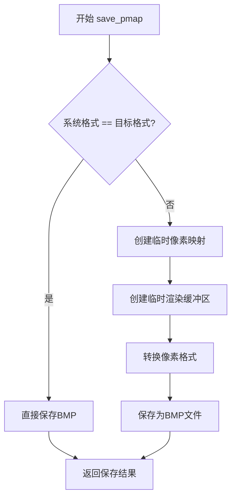

#### 带注释源码

```cpp
//------------------------------------------------------------------------
// 保存像素映射（图像）到BMP文件
// 参数：
//   fn   - 文件名
//   idx  - 图像索引
//   src  - 源渲染缓冲区
// 返回值：保存成功返回true，失败返回false
//------------------------------------------------------------------------
bool platform_specific::save_pmap(const char* fn, unsigned idx, 
                                  const rendering_buffer* src)
{
    // 如果系统像素格式与当前格式相同，直接保存，无需转换
    if(m_sys_format == m_format)
    {
        return m_pmap_img[idx].save_as_bmp(fn);
    }

    // 格式不匹配，需要创建临时像素映射进行格式转换
    pixel_map pmap_tmp;
    // 创建与目标图像相同尺寸的临时像素映射，使用系统支持的位深
    pmap_tmp.create(m_pmap_img[idx].width(), 
                      m_pmap_img[idx].height(),
                      org_e(m_sys_bpp));

    // 创建临时渲染缓冲区并附加到临时像素映射
    rendering_buffer rbuf_tmp;
    rbuf_tmp.attach(pmap_tmp.buf(),
                      pmap_tmp.width(),
                      pmap_tmp.height(),
                      // 根据flip_y标志决定行序方向
                      m_flip_y ?
                      pmap_tmp.stride() :
                      -pmap_tmp.stride());

    // 执行像素格式转换（从当前格式转换为系统格式）
    convert_pmap(&rbuf_tmp, src, m_format);
    
    // 将转换后的图像保存为BMP文件
    return pmap_tmp.save_as_bmp(fn);
}
```


### `platform_specific.translate`

该函数用于将Windows操作系统的虚拟键码（Virtual Key Codes）翻译为Anti-Grain Geometry（AGG）库内部定义的统一键码，是平台相关输入与库无关键值之间的桥梁。

参数：

- `keycode`：`unsigned`，Windows虚拟键码（如VK_UP、VK_F1等），来源于Win32 API的键盘消息

返回值：`unsigned`，AGG库定义的键码常量（如key_up、key_f1等），若键码超出映射范围（>255）则返回0

#### 流程图

```mermaid
flowchart TD
    A[translate函数被调用] --> B{keycode > 255?}
    B -->|是| C[返回0]
    B -->|否| D[访问m_keymap数组]
    D --> E[返回m_keymap[keycode]]
    C --> F[同时赋值给m_last_translated_key]
    E --> F
    F[结束]
```

#### 带注释源码

```cpp
//------------------------------------------------------------------------
// 将Windows虚拟键码转换为AGG库定义的统一键码
//------------------------------------------------------------------------
unsigned platform_specific::translate(unsigned keycode)
{
    // 使用三元运算符进行边界检查：
    // - 若keycode超出255（超出m_keymap数组范围），返回0
    // - 否则查表返回对应的AGG键码
    // 同时将结果保存到m_last_translated_key成员变量
    // 该成员变量在窗口消息处理中用于获取最后翻译的键值
    return m_last_translated_key = (keycode > 255) ? 0 : m_keymap[keycode];
}
```


### `platform_support.platform_support`（构造函数）

该函数是 Anti-Grain Geometry (AGG) 库中 `platform_support` 类的构造函数，负责初始化 Windows 平台下的图形应用程序基础环境，包括像素格式设置、平台特定对象创建、渲染缓冲区初始化以及性能计数器配置等核心工作。

参数：

- `format`：`pix_format_e`，指定渲染缓冲区的像素格式（如灰度、RGB、RGBA 等）
- `flip_y`：`bool`，指定是否翻转 Y 轴坐标（用于不同坐标系系统的转换）

返回值：无（构造函数）

#### 流程图

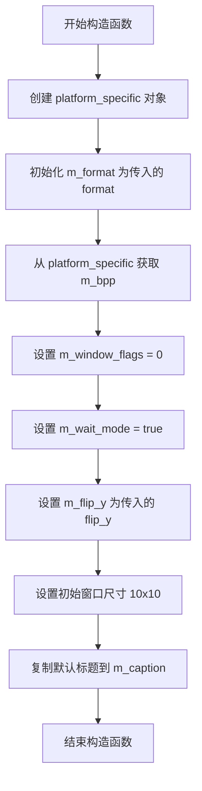

#### 带注释源码

```cpp
//------------------------------------------------------------------------
// platform_support 类的构造函数
// 参数: format - 像素格式枚举, flip_y - 是否翻转Y轴坐标
//------------------------------------------------------------------------
platform_support::platform_support(pix_format_e format, bool flip_y) :
    // 使用初始化列表初始化成员变量
    m_specific(new platform_specific(format, flip_y)),  // 创建平台特定实现对象
    m_format(format),                                   // 保存请求的像素格式
    m_bpp(m_specific->m_bpp),                           // 从平台特定对象获取实际位深度
    m_window_flags(0),                                  // 初始化窗口标志为无
    m_wait_mode(true),                                  // 默认使用等待模式（消息循环阻塞）
    m_flip_y(flip_y),                                   // 保存Y轴翻转标志
    m_initial_width(10),                                // 设置默认初始宽度
    m_initial_height(10)                                // 设置默认初始高度
{
    // 使用函数体中的代码设置窗口标题
    strcpy(m_caption, "Anti-Grain Geometry Application");  // 复制默认窗口标题
}
```


### `platform_support::~platform_support`

析构函数，负责释放平台支持类中分配的资源，删除`m_specific`指针以清理Windows特定的数据。

参数：

- 无参数（析构函数）

返回值：`void`，无返回值

#### 流程图

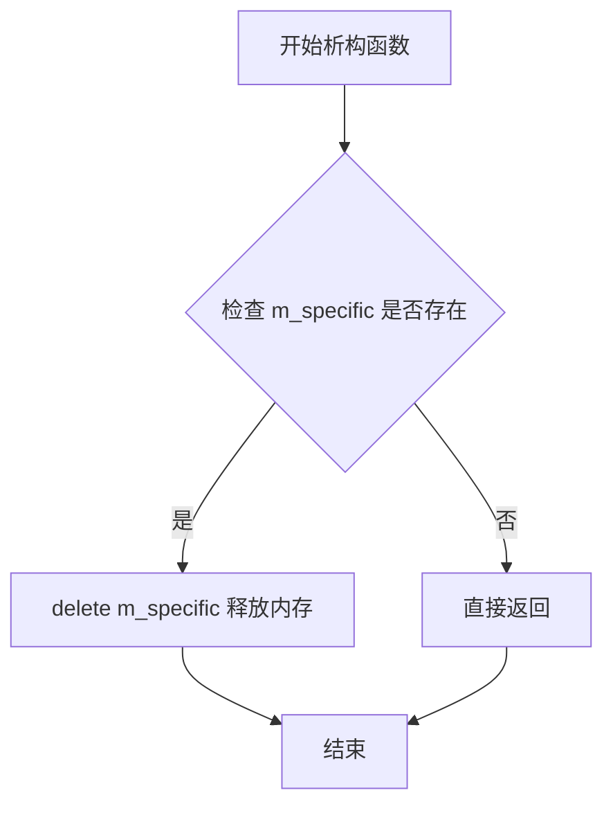

#### 带注释源码

```cpp
//------------------------------------------------------------------------
// 析构函数：释放platform_support类分配的资源
//------------------------------------------------------------------------
platform_support::~platform_support()
{
    // 删除在构造函数中分配的platform_specific对象
    // 该对象包含Windows特定的资源，如窗口句柄、像素映射等
    delete m_specific;
}
```


### `platform_support.init`

该函数是 Anti-Grain Geometry 库中用于初始化 Windows 平台窗口的核心方法，负责注册窗口类、创建窗口句柄、配置像素格式映射、设置窗口尺寸并显示窗口，同时初始化渲染缓冲区。

参数：

- `width`：`unsigned`，窗口的宽度（以像素为单位）
- `height`：`unsigned`，窗口的高度（以像素为单位）
- `flags`：`unsigned`，窗口样式标志（如 `window_resize` 表示允许调整窗口大小）

返回值：`bool`，窗口初始化成功返回 `true`，失败（如系统像素格式未定义或窗口创建失败）返回 `false`

#### 流程图

```mermaid
flowchart TD
    A[开始 init] --> B{系统像素格式是否有效?}
    B -->|否| C[返回 false]
    B -->|是| D[保存窗口标志]
    E[注册窗口类 AGGAppClass] --> F[构建窗口样式标志]
    F --> G{flags 包含 window_resize?}
    G -->|是| H[添加 WS_THICKFRAME | WS_MAXIMIZEBOX]
    G -->|否| I[跳过调整大小样式]
    H --> J[创建窗口]
    I --> J
    J --> K{窗口创建成功?}
    K -->|否| C
    K -->|是| L[获取客户端矩形]
    L --> M[调整窗口位置和大小]
    M --> N[设置窗口用户数据为 this]
    N --> O[创建像素映射]
    O --> P[保存初始宽高度]
    P --> Q[调用 on_init 回调]
    Q --> R[标记需要重绘]
    R --> S[显示窗口]
    S --> T[返回 true]
```

#### 带注释源码

```cpp
//------------------------------------------------------------------------
// 初始化窗口并准备渲染环境
//------------------------------------------------------------------------
bool platform_support::init(unsigned width, unsigned height, unsigned flags)
{
    // 检查系统像素格式是否已定义，若未定义则无法初始化
    if(m_specific->m_sys_format == pix_format_undefined)
    {
        return false;
    }

    // 保存传入的窗口标志（如是否允许调整大小）
    m_window_flags = flags;

    // 设置窗口类风格：自有设备上下文、垂直/水平重绘
    int wflags = CS_OWNDC | CS_VREDRAW | CS_HREDRAW;

    // 定义窗口类结构
    WNDCLASS wc;
    wc.lpszClassName = "AGGAppClass";          // 窗口类名称
    wc.lpfnWndProc = window_proc;              // 窗口消息处理过程
    wc.style = wflags;                          // 窗口类风格
    wc.hInstance = g_windows_instance;         // 应用程序实例句柄
    wc.hIcon = LoadIcon(0, IDI_APPLICATION);   // 默认应用程序图标
    wc.hCursor = LoadCursor(0, IDC_ARROW);    // 默认箭头光标
    wc.hbrBackground = (HBRUSH)(COLOR_WINDOW+1); // 窗口背景画刷
    wc.lpszMenuName = "AGGAppMenu";            // 窗口菜单名称
    wc.cbClsExtra = 0;                         // 类额外字节数
    wc.cbWndExtra = 0;                         // 窗口额外字节数
    
    // 注册窗口类
    ::RegisterClass(&wc);

    // 设置基础窗口样式：重叠式窗口、标题栏、系统菜单、最小化按钮
    wflags = WS_OVERLAPPED | WS_CAPTION | WS_SYSMENU | WS_MINIMIZEBOX;

    // 根据 flags 决定是否添加可调整大小和最大化功能
    if(m_window_flags & window_resize)
    {
        wflags |= WS_THICKFRAME | WS_MAXIMIZEBOX;
    }

    // 创建窗口
    m_specific->m_hwnd = ::CreateWindow("AGGAppClass",
                                        m_caption,              // 窗口标题
                                        wflags,                 // 窗口样式
                                        100,                    // 初始 X 位置
                                        100,                    // 初始 Y 位置
                                        width,                  // 窗口宽度
                                        height,                 // 窗口高度
                                        0,                      // 父窗口句柄
                                        0,                      // 菜单句柄
                                        g_windows_instance,     // 应用程序实例
                                        0);                     // 创建参数

    // 检查窗口是否创建成功
    if(m_specific->m_hwnd == 0)
    {
        return false;
    }

    // 获取窗口客户端区域矩形
    RECT rct;
    ::GetClientRect(m_specific->m_hwnd, &rct);

    // 调整窗口位置和大小，考虑边框和标题栏的尺寸差异
    ::MoveWindow(m_specific->m_hwnd,   // 窗口句柄
                 100,                  // 水平位置
                 100,                  // 垂直位置
                 width + (width - (rct.right - rct.left)),   // 调整后宽度
                 height + (height - (rct.bottom - rct.top)), // 调整后高度
                 FALSE);               // 不重绘
   
    // 将窗口用户数据设置为当前 platform_support 实例指针
    // 这样在窗口过程中可以获取到对象实例
    ::SetWindowLongPtr(m_specific->m_hwnd, GWLP_USERDATA, (LONG)this);
    
    // 创建与窗口关联的像素映射（渲染缓冲区）
    m_specific->create_pmap(width, height, &m_rbuf_window);
    
    // 保存初始窗口尺寸
    m_initial_width = width;
    m_initial_height = height;
    
    // 调用虚函数，允许子类执行初始化操作
    on_init();
    
    // 设置重绘标志，触发首次绘制
    m_specific->m_redraw_flag = true;
    
    // 显示窗口，使用命令行参数指定的显示方式
    ::ShowWindow(m_specific->m_hwnd, g_windows_cmd_show);
    
    return true;
}
```


### `platform_support.run()`

该方法是 Anti-Grain Geometry (AGG) 库中平台支持类的核心成员，负责运行 Windows 消息循环。它根据 `m_wait_mode` 标志位采用不同的消息获取策略：在等待模式下使用 `GetMessage` 阻塞获取消息，在非等待模式下使用 `PeekMessage` 实现轮询并调用空闲处理。方法持续运行直到接收到 `WM_QUIT` 消息，然后返回应用程序的退出代码。

参数：無

返回值：`int`，返回 Windows 消息循环的退出代码（通常为 `msg.wParam`）

#### 流程图

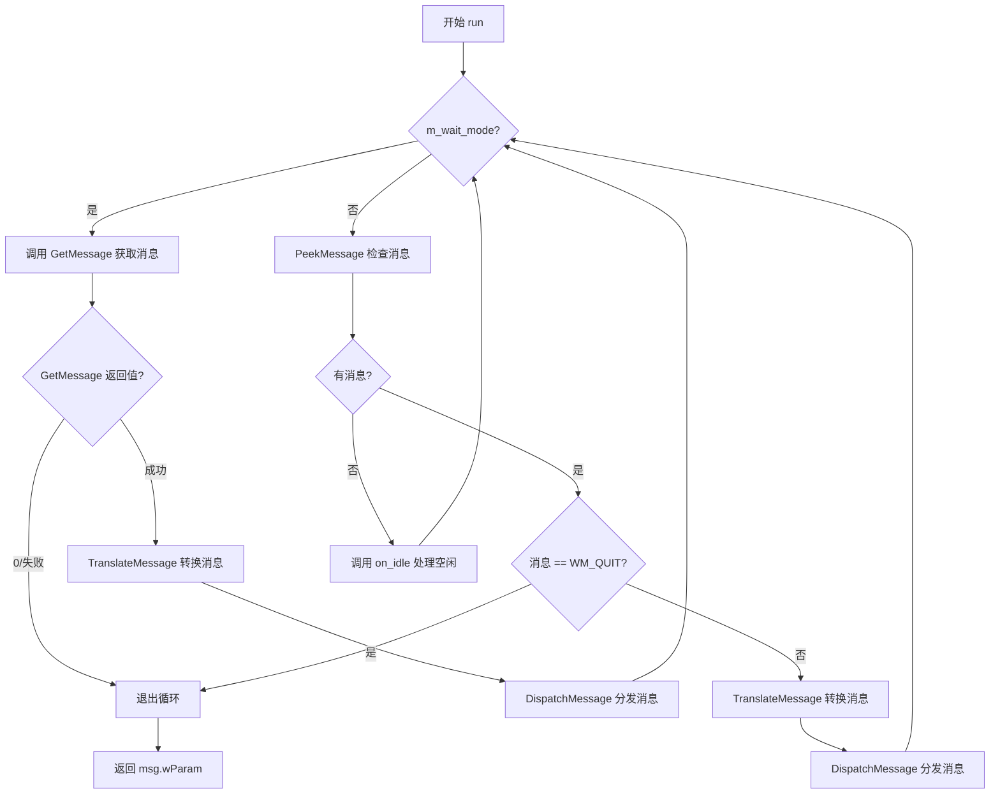

#### 带注释源码

```cpp
//------------------------------------------------------------------------
// 运行消息循环
// 根据 m_wait_mode 决定是阻塞等待还是轮询处理
//------------------------------------------------------------------------
int platform_support::run()
{
    MSG msg;

    // 无限循环，持续处理 Windows 消息直到收到 WM_QUIT
    for(;;)
    {
        // 判断是否为等待模式
        if(m_wait_mode)
        {
            // 等待模式：使用 GetMessage 阻塞获取消息
            // GetMessage 返回 0 表示收到 WM_QUIT 消息
            if(!::GetMessage(&msg, 0, 0, 0))
            {
                // 收到退出消息，跳出循环
                break;
            }
            // 转换键盘消息（将虚拟键码转换为字符消息）
            ::TranslateMessage(&msg);
            // 将消息分发给窗口过程处理
            ::DispatchMessage(&msg);
        }
        else
        {
            // 非等待模式：使用 PeekMessage 检查是否有消息
            // PM_REMOVE 表示取出消息（并从队列中删除）
            if(::PeekMessage(&msg, 0, 0, 0, PM_REMOVE))
            {
                // 转换键盘消息
                ::TranslateMessage(&msg);
                // 检查是否为退出消息
                if(msg.message == WM_QUIT)
                {
                    // 收到退出消息，跳出循环
                    break;
                }
                // 分发消息到窗口过程
                ::DispatchMessage(&msg);
            }
            else
            {
                // 没有消息时调用空闲处理回调
                // 这允许应用程序在空闲时执行后台任务
                on_idle();
            }
        }
    }
    // 返回退出代码（通常是 wParam 参数）
    return (int)msg.wParam;
}
```


### `platform_support.caption`

设置窗口标题栏的文本内容，同时更新内部保存的标题字符串。如果窗口已创建，则立即通过 Windows API 更新窗口显示的标题。

参数：

- `cap`：`const char*`，指向以 null 结尾的字符串，表示要设置的窗口标题文本

返回值：`void`，无返回值

#### 流程图

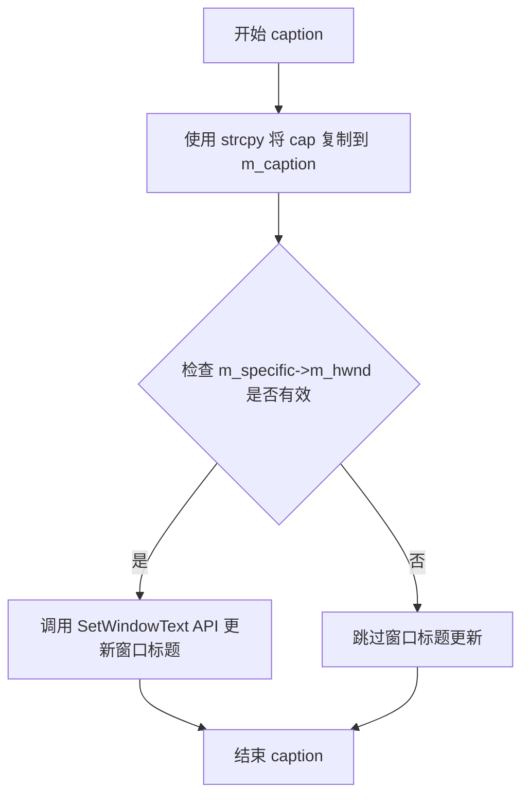

#### 带注释源码

```cpp
//------------------------------------------------------------------------
// 设置窗口标题栏文本
// 参数: cap - 新的窗口标题字符串
//------------------------------------------------------------------------
void platform_support::caption(const char* cap)
{
    // 1. 将传入的标题字符串复制到成员变量 m_caption 中保存
    strcpy(m_caption, cap);
    
    // 2. 检查窗口句柄是否已创建（非零表示窗口已存在）
    if(m_specific->m_hwnd)
    {
        // 3. 调用 Windows API 更新实际窗口的标题栏显示
        SetWindowText(m_specific->m_hwnd, m_caption);
    }
}
```


### `platform_support.start_timer()`

启动高精度计时器，记录当前高性能计数器的值，以便后续通过 `elapsed_time()` 计算经过的时间。该方法利用 Windows 的 `QueryPerformanceCounter` API 实现精确计时。

参数：无

返回值：`void`，无返回值

#### 流程图

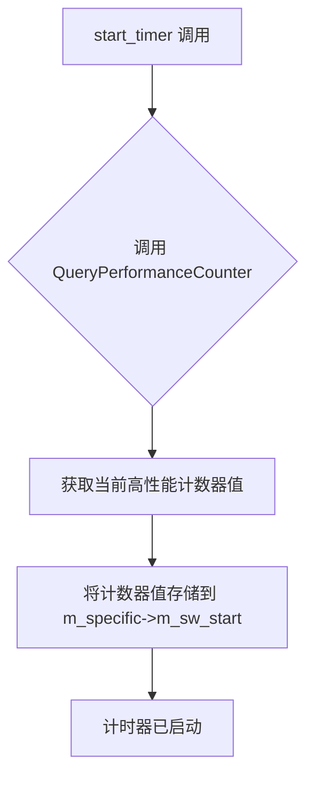

#### 带注释源码

```cpp
//------------------------------------------------------------------------
// 启动高精度计时器
// 使用 Windows 的 QueryPerformanceCounter 获取当前计数器值
// 并将其存储到平台特定数据的 m_sw_start 成员中
// 该方法通常与 elapsed_time() 方法配合使用来计算时间间隔
//------------------------------------------------------------------------
void platform_support::start_timer()
{
    // 调用 Windows API 获取当前高性能计数器的值
    // QueryPerformanceCounter 是一个高精度计时器，精度远高于普通的 GetTickCount
    // m_sw_start 用于保存计时器启动时的计数器值，供后续时间计算使用
    ::QueryPerformanceCounter(&(m_specific->m_sw_start));
}
```


### `platform_support.elapsed_time`

获取自上次调用 `start_timer()` 以来经过的时间（以毫秒为单位）。该方法使用 Windows 高性能计数器来提供高精度的时间测量。

参数：无

返回值：`double`，返回经过的时间，单位为毫秒（ms）

#### 流程图

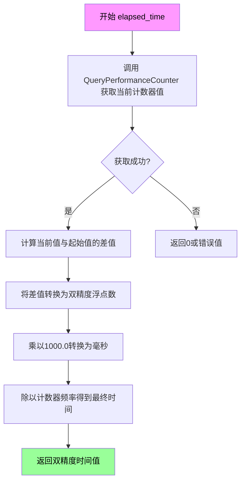

#### 带注释源码

```cpp
//------------------------------------------------------------------------
// 计算并返回自上次调用 start_timer() 以来经过的时间
//------------------------------------------------------------------------
double platform_support::elapsed_time() const
{
    // 定义一个 LARGE_INTEGER 结构体用于存储当前计数器值
    LARGE_INTEGER stop;
    
    // 调用 Windows API 获取当前高性能计数器的值
    ::QueryPerformanceCounter(&stop);
    
    // 计算经过的计数器差值：
    // stop.QuadPart - m_specific->m_sw_start.QuadPart
    // 然后乘以 1000.0 转换为毫秒
    // 最后除以计数器频率 m_specific->m_sw_freq.QuadPart 得到实际时间
    return double(stop.QuadPart - 
                  m_specific->m_sw_start.QuadPart) * 1000.0 / 
                  double(m_specific->m_sw_freq.QuadPart);
}
```

#### 相关上下文信息

- **所属类**: `platform_support`
- **调用关系**: 通常与 `start_timer()` 方法配合使用，先调用 `start_timer()` 记录起始时间，之后调用 `elapsed_time()` 获取经过的时间
- **精度**: 取决于系统硬件，通常为微秒级精度
- **返回值单位**: 毫秒（milliseconds）


### `platform_support.raw_display_handler`

获取当前的原始Windows设备上下文（DC）句柄，用于外部渲染或直接GDI操作。

参数：无

返回值：`void*`，返回当前Windows设备上下文句柄（HDC），如果没有有效的DC则返回0（NULL）

#### 流程图

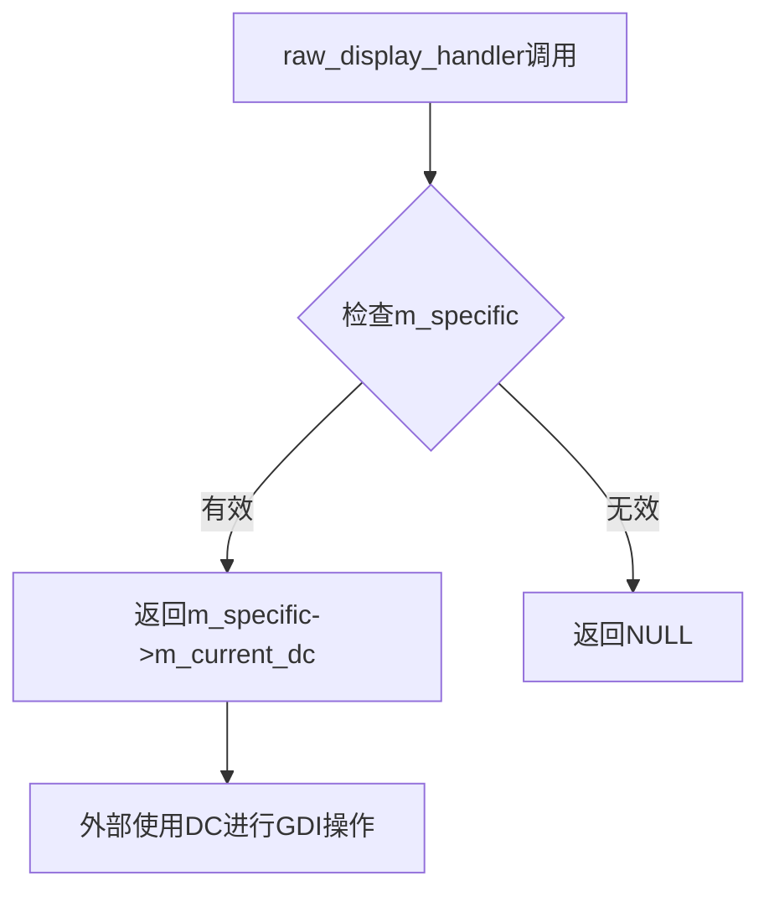

#### 带注释源码

```cpp
//------------------------------------------------------------------------
// 获取原始显示句柄
// 该方法返回当前Windows设备上下文(HDC)的句柄
// 允许外部代码直接使用GDI进行绘制操作
//------------------------------------------------------------------------
void* platform_support::raw_display_handler()
{
    // m_current_dc 在窗口消息处理过程中被设置
    // 在WM_PAINT消息中，BeginPaint返回的DC会被保存
    // 在其他消息处理中，GetDC返回的DC会被保存
    // 处理完毕后会被清零(设为0)
    return m_specific->m_current_dc;
}
```

#### 相关上下文信息

该方法依赖于 `platform_specific` 类中的成员变量：

- **`m_current_dc`**：`HDC` 类型，Windows设备上下文句柄
  - 在 `window_proc` 函数中根据消息类型进行设置和清零
  - `WM_PAINT` 消息：使用 `BeginPaint` 获取并保存
  - 其他消息：使用 `GetDC` 获取并在处理完后通过 `ReleaseDC` 释放
  - 处理完成后会被设置为0，表示当前没有有效的DC

#### 使用场景

此方法主要用于：
1. 允许外部代码（如第三方库）直接使用Windows GDI进行绘制
2. 与现有Windows应用程序集成时进行底层图形操作
3. 需要直接访问设备上下文进行特殊渲染需求

#### 潜在优化空间

1. **线程安全性**：`m_current_dc` 在窗口消息循环的线程上下文中访问，但如果是多线程应用，可能需要额外的同步机制
2. **空值检查**：调用方应该检查返回值是否为NULL，特别是在非WM_PAINT消息期间
3. **生命周期管理**：返回的DC句柄的有效期很短，通常只在消息处理期间有效，外部代码不应长期保存此句柄


### `platform_support.message`

该方法是 Anti-Grain Geometry (AGG) 库中 `platform_support` 类的成员函数，用于在 Windows 平台上显示一个简单的消息框，向用户传递信息。

参数：

- `msg`：`const char*`，要显示的消息内容，以 C 字符串形式传递

返回值：`void`，无返回值

#### 流程图

```mermaid
graph TD
    A[调用 platform_support.message] --> B{检查 m_hwnd 是否有效}
    B -->|是| C[调用 Windows API MessageBox]
    B -->|否| D[MessageBox 使用空父窗口]
    C --> E[显示模态消息框]
    D --> E
    E --> F[用户点击确定按钮]
    F --> G[消息框关闭]
    
    style C fill:#f9f,stroke:#333
    style E fill:#ff9,stroke:#333
```

#### 带注释源码

```cpp
//------------------------------------------------------------------------
// 使用 Windows API 显示一个模态消息框
//------------------------------------------------------------------------
void platform_support::message(const char* msg)
{
    // 调用 Windows 的 MessageBox 函数
    // 参数1: 父窗口句柄 (m_specific->m_hwnd)
    // 参数2: 要显示的消息文本 (msg)
    // 参数3: 消息框标题栏文本 ("AGG Message")
    // 参数4: 消息框样式 (MB_OK - 仅显示"确定"按钮)
    //
    // ::MessageBox 是 Win32 API 函数
    // 用于创建和显示一个模态对话框
    ::MessageBox(m_specific->m_hwnd, msg, "AGG Message", MB_OK);
}
```


### `platform_support::img_ext`

该方法是一个简单的常量成员函数，用于获取当前平台支持的文件图像扩展名，直接返回 BMP 格式的扩展名字符串 ".bmp"，无需任何参数处理或状态检查。

参数：无

返回值：`const char*`，返回图像文件的扩展名，固定为 ".bmp"

#### 流程图

```mermaid
flowchart TD
    A[开始 img_ext] --> B[直接返回常量字符串 ".bmp"]
    B --> C[结束]
```

#### 带注释源码

```cpp
//------------------------------------------------------------------------
// 获取图像文件扩展名
// 该方法为const成员函数，不会修改对象状态
// 返回值固定为BMP格式的扩展名
//------------------------------------------------------------------------
const char* platform_support::img_ext() const 
{ 
    // 直接返回BMP文件扩展名字符串
    return ".bmp"; 
}
```


### `platform_support.full_file_name`

获取完整文件名，根据当前实现直接返回输入的文件名。

参数：
- `file_name`：`const char*`，输入的文件名字符串

返回值：`const char*`，返回完整的文件名字符串（当前实现直接返回输入参数）

#### 流程图

```mermaid
graph LR
    A[开始] --> B[接收file_name参数]
    B --> C[直接返回file_name]
    C --> D[结束]
```

#### 带注释源码

```cpp
//------------------------------------------------------------------------
// 获取完整文件名
// 根据当前实现，该函数直接返回传入的文件名，不做任何处理
// 这可能是为将来平台特定的文件名处理预留的接口
//------------------------------------------------------------------------
const char* platform_support::full_file_name(const char* file_name)
{
    // 直接返回输入的文件名，不添加任何路径前缀
    // TODO: 可考虑在不同平台上添加应用程序路径前缀
    return file_name;
}
```


### `platform_support.load_img`

该函数用于将指定的 BMP 图像文件加载到平台支持类的图像缓冲区中，支持自动添加 `.bmp` 扩展名，并调用底层平台特定实现完成图像加载操作。

参数：

- `idx`：`unsigned`，图像索引，指定要加载到的图像槽位（必须在 `max_images` 范围内）
- `file`：`const char*`，图像文件路径，可以包含或不包含 `.bmp` 扩展名

返回值：`bool`，加载成功返回 `true`，失败返回 `false`；若索引超出范围则返回 `true`（视为无效操作）

#### 流程图

```mermaid
flowchart TD
    A[开始 load_img] --> B{idx < max_images?}
    B -->|否| C[返回 true]
    B -->|是| D[复制文件名到缓冲区 fn]
    D --> E[获取文件名长度 len]
    E --> F{len < 4 或 后4字符 != '.BMP'?}
    F -->|是| G[追加 '.bmp' 扩展名]
    F -->|否| H[不修改文件名]
    G --> I[调用 m_specific->load_pmap 加载图像]
    H --> I
    I --> J{加载成功?}
    J -->|是| K[返回 true]
    J -->|否| L[返回 false]
```

#### 带注释源码

```cpp
//------------------------------------------------------------------------
// 加载图像到指定索引的图像缓冲区
// 参数: idx - 图像索引, file - 图像文件名
// 返回: 成功返回true, 失败返回false
//------------------------------------------------------------------------
bool platform_support::load_img(unsigned idx, const char* file)
{
    // 检查索引是否在有效范围内
    if(idx < max_images)
    {
        // 创建本地文件名缓冲区
        char fn[1024];
        // 复制传入的文件名
        strcpy(fn, file);
        // 获取文件名长度
        int len = strlen(fn);
        
        // 如果文件名长度小于4或扩展名不是.bmp（不区分大小写）
        if(len < 4 || _stricmp(fn + len - 4, ".BMP") != 0)
        {
            // 自动添加.bmp扩展名
            strcat(fn, ".bmp");
        }
        
        // 调用平台特定的加载函数，将图像加载到对应的渲染缓冲区
        return m_specific->load_pmap(fn, idx, &m_rbuf_img[idx]);
    }
    
    // 索引超出范围时返回true（视为无效操作）
    return true;
}
```


### `platform_support.save_img`

该函数用于将指定的图像保存为BMP格式文件，支持自动添加.bmp扩展名，并调用底层平台特定函数完成实际的文件保存操作。

参数：

- `idx`：`unsigned`，图像索引，指定要保存的图像槽位（需小于max_images）
- `file`：`const char*`，文件名，不包含扩展名时会自动添加.bmp

返回值：`bool`，保存成功返回true，索引无效或保存失败返回false

#### 流程图

```mermaid
flowchart TD
    A[开始保存图像] --> B{检查 idx < max_images?}
    B -->|否| C[返回 true]
    B -->|是| D[复制文件名到 fn]
    D --> E[获取文件名长度 len]
    E --> F{len < 4 或 不是.bmp扩展名?}
    F -->|否| G[不添加扩展名]
    F -->|是| H[添加 .bmp 扩展名]
    G --> I
    H --> I[调用 m_specific->save_pmap]
    I --> J{保存是否成功?}
    J -->|否| K[返回 false]
    J -->|是| L[返回 true]
```

#### 带注释源码

```cpp
//------------------------------------------------------------------------
// 保存图像到文件
// 参数:
//   idx  - 图像索引，指定要保存的图像槽位
//   file - 文件名（不含扩展名）
// 返回值:
//   成功返回true，失败返回false
//------------------------------------------------------------------------
bool platform_support::save_img(unsigned idx, const char* file)
{
    // 检查图像索引是否在有效范围内
    if(idx < max_images)
    {
        char fn[1024];                      // 文件名缓冲区
        strcpy(fn, file);                   // 复制传入的文件名
        int len = strlen(fn);               // 获取文件名长度
        
        // 如果文件名长度小于4或最后4个字符不是".BMP"
        if(len < 4 || _stricmp(fn + len - 4, ".BMP") != 0)
        {
            strcat(fn, ".bmp");             // 自动添加.bmp扩展名
        }
        
        // 调用平台特定的保存函数
        // m_rbuf_img[idx] 是图像对应的渲染缓冲区
        return m_specific->save_pmap(fn, idx, &m_rbuf_img[idx]);
    }
    
    // 索引无效时返回true（与load_img保持一致的行为）
    return true;
}
```


### `platform_support.create_img`

该函数用于在应用程序中创建一个指定索引的图像缓冲区，根据提供的宽度和高度（或默认窗口尺寸）初始化像素映射，并将其附加到渲染缓冲区以供后续图形操作使用。

参数：

- `idx`：`unsigned`，图像索引，标识要创建的图像在图像数组中的位置（需小于`max_images`）
- `width`：`unsigned`，图像宽度，如果为0则使用窗口默认宽度
- `height`：`unsigned`，图像高度，如果为0则使用窗口默认高度

返回值：`bool`，成功创建图像返回`true`，否则返回`false`（如索引超出范围）

#### 流程图

```mermaid
flowchart TD
    A[开始 create_img] --> B{idx < max_images?}
    B -->|否| C[返回 false]
    B -->|是| D{width == 0?}
    D -->|是| E[width = m_pmap_window.width]
    D -->|否| F{height == 0?}
    E --> F
    F -->|是| G[height = m_pmap_window.height]
    F -->|否| H[创建像素映射 m_pmap_img[idx]]
    G --> H
    H --> I[attach 渲染缓冲区]
    I --> J[返回 true]
```

#### 带注释源码

```cpp
//------------------------------------------------------------------------
bool platform_support::create_img(unsigned idx, unsigned width, unsigned height)
{
    // 检查索引是否在有效范围内（max_images为平台支持类中定义的最大图像数量）
    if(idx < max_images)
    {
        // 如果宽度为0，则使用窗口的默认宽度
        if(width  == 0) width  = m_specific->m_pmap_window.width();
        // 如果高度为0，则使用窗口的默认高度
        if(height == 0) height = m_specific->m_pmap_window.height();
        
        // 创建指定尺寸和位深的像素映射（图像缓冲区）
        // org_e(m_specific->m_bpp)将位深转换为像素格式枚举
        m_specific->m_pmap_img[idx].create(width, height, org_e(m_specific->m_bpp));
        
        // 将像素映射附加到渲染缓冲区，使其可用于图形渲染
        // 根据m_flip_y决定是否翻转stride方向（用于支持不同坐标系的图像）
        m_rbuf_img[idx].attach(m_specific->m_pmap_img[idx].buf(), 
                               m_specific->m_pmap_img[idx].width(),
                               m_specific->m_pmap_img[idx].height(),
                               m_flip_y ?
                                m_specific->m_pmap_img[idx].stride() :
                               -m_specific->m_pmap_img[idx].stride());
        return true;
    }
    // 索引超出范围，创建失败
    return false;
}
```


### `platform_support.force_redraw`

强制重绘窗口，将重绘标志设置为 true 并使窗口客户区无效，以便触发下一次 WM_PAINT 消息并执行绘制操作。

参数：无

返回值：`void`，无返回值

#### 流程图

```mermaid
flowchart TD
    A[开始 force_redraw] --> B[设置 m_redraw_flag = true]
    B --> C[调用 Windows API InvalidateRect]
    C --> D[使窗口客户区无效]
    D --> E[结束]
    
    style B fill:#f9f,stroke:#333
    style C fill:#ff9,stroke:#333
```

#### 带注释源码

```cpp
//------------------------------------------------------------------------
// 强制重绘函数
// 功能：设置重绘标志为 true，并使窗口客户区无效，触发 WM_PAINT 消息
//------------------------------------------------------------------------
void platform_support::force_redraw()
{
    // 1. 设置内部重绘标志为 true
    //    这个标志在 WM_PAINT 消息处理中会被检查
    m_specific->m_redraw_flag = true;
    
    // 2. 调用 Windows API 使窗口客户区无效
    //    参数说明：
    //    - m_specific->m_hwnd: 窗口句柄
    //    - 0 (lpRect): NULL，表示使整个客户区无效
    //    - FALSE (bErase): 不擦除背景，在 WM_ERASEBKGND 中会忽略
    //    
    //    效果：发送 WM_PAINT 消息到消息队列，触发 on_draw() 回调
    ::InvalidateRect(m_specific->m_hwnd, 0, FALSE);
}
```


### `platform_support.update_window`

该函数用于将内部渲染缓冲区的内容更新显示到窗口上，通过获取窗口设备上下文（DC），调用显示函数将像素图渲染到窗口，然后释放设备上下文完成窗口刷新。

参数：无

返回值：`void`，无返回值

#### 流程图

```mermaid
flowchart TD
    A[开始 update_window] --> B[获取窗口设备上下文DC]
    B --> C{获取成功?}
    C -->|是| D[调用 display_pmap 渲染缓冲区到窗口]
    D --> E[释放窗口设备上下文DC]
    E --> F[结束 update_window]
    C -->|否| F
```

#### 带注释源码

```cpp
//------------------------------------------------------------------------
// 更新窗口显示，将渲染缓冲区内容绘制到窗口
//------------------------------------------------------------------------
void platform_support::update_window()
{
    // 获取窗口的设备上下文句柄（Device Context）
    // DC是Windows图形系统中的核心对象，用于绘制操作
    HDC dc = ::GetDC(m_specific->m_hwnd);
    
    // 调用平台特定的显示函数，将渲染缓冲区内容绘制到窗口
    // 内部会处理颜色格式转换（如需要）和实际的绘制操作
    m_specific->display_pmap(dc, &m_rbuf_window);
    
    // 释放之前获取的设备上下文
    // 重要：每次GetDC必须对应ReleaseDC，否则会导致资源泄漏
    ::ReleaseDC(m_specific->m_hwnd, dc);
}
```


### `platform_support.on_init`

这是 `platform_support` 类的虚函数回调，在窗口初始化完成后被调用，用于用户自定义初始化逻辑。

参数： 无

返回值： `void`，无返回值

#### 流程图

```mermaid
flowchart TD
    A[platform_support.init] --> B[创建窗口和像素映射]
    B --> C[设置窗口用户数据]
    C --> D[调用 on_init 回调]
    D --> E[设置重绘标志]
    E --> F[显示窗口]
    F --> G[返回 true]
    
    D -.-> H[用户自定义初始化逻辑<br/>空实现,需子类重写]
```

#### 带注释源码

```cpp
//------------------------------------------------------------------------
// 虚函数回调: on_init()
// 在 platform_support::init() 方法中被调用
// 当窗口创建完成、像素映射初始化完毕后触发
// 这是一个空实现,设计为钩子函数,允许用户在窗口初始化后
// 执行自定义的初始化逻辑(如加载资源、设置初始状态等)
//------------------------------------------------------------------------
void platform_support::on_init() {}
// 备注: 此函数在 init() 中的调用位置:
// m_specific->create_pmap(width, height, &m_rbuf_window);
// m_initial_width = width;
// m_initial_height = height;
// on_init();  <-- 在此处调用
// m_specific->m_redraw_flag = true;
// ::ShowWindow(m_specific->m_hwnd, g_windows_cmd_show);
```


### `platform_support.on_resize`

该函数是 `platform_support` 类的窗口大小调整回调方法，当窗口尺寸发生变化时由 Windows 消息循环自动调用。它是一个空实现的虚函数/回调函数，旨在让应用程序开发者可以自定义处理窗口大小变化后的逻辑（如重新计算视图、调整渲染缓冲区等）。

参数：

- `sx`：`int`，窗口调整后的新宽度（像素单位）
- `sy`：`int`，窗口调整后的新高度（像素单位）

返回值：`void`，无返回值

#### 流程图

```mermaid
graph TD
    A[WM_SIZE 消息触发] --> B[window_proc 接收消息]
    B --> C[提取新窗口尺寸: LOWORD lParam → sx, HIWORD lParam → sy]
    C --> D[create_pmap 创建新像素映射]
    D --> E[trans_affine_resizing 更新变换矩阵]
    E --> F[on_resize 调用回调]
    F --> G[force_redraw 设置重绘标志]
    G --> H[InvalidateRect 触发 WM_PAINT]
```

#### 带注释源码

```cpp
//------------------------------------------------------------------------
// 窗口大小调整回调 - 在 window_proc 的 WM_SIZE 处理分支中被调用
//------------------------------------------------------------------------
void platform_support::on_resize(int sx, int sy) 
{
    // 空实现 - 供用户重写以自定义处理逻辑
    // 参数 sx: 窗口新宽度
    // 参数 sy: 窗口新高度
}

// 在 window_proc 中的调用位置（完整上下文）：
/*
case WM_SIZE:
    // 创建新的像素映射缓冲区
    app->m_specific->create_pmap(LOWORD(lParam),    // 新宽度
                                 HIWORD(lParam),    // 新高度
                                 &app->rbuf_window());

    // 更新仿射变换矩阵以适应新尺寸
    app->trans_affine_resizing(LOWORD(lParam), HIWORD(lParam));
    
    // 调用用户可重写的 on_resize 回调
    app->on_resize(LOWORD(lParam), HIWORD(lParam));
    
    // 强制标记需要重绘
    app->force_redraw();
    break;
*/
```


### `platform_support.on_idle`

该函数是 `platform_support` 类的空闲回调虚函数，在消息循环检测到没有消息需要处理时被调用，用于执行空闲期间需要做的渲染或计算任务。

参数：
- （无参数）

返回值：`void`，无返回值

#### 流程图

```mermaid
flowchart TD
    A[消息循环开始] --> B{是否有消息?}
    B -->|是| C[处理消息]
    B -->|否| D[调用 on_idle]
    D --> A
    C --> A
```

#### 带注释源码

```cpp
//------------------------------------------------------------------------
// 空闲回调函数 - 在消息队列为空时被调用
// 该函数为虚函数,子类可以重写以实现自定义的空闲处理逻辑
// 例如:连续渲染、后台计算等
//------------------------------------------------------------------------
void platform_support::on_idle() {}
```


### `platform_support.on_mouse_move`

该函数是 Anti-Grain Geometry (AGG) 库中 `platform_support` 类的鼠标移动事件回调虚函数，用于处理鼠标移动事件。当用户在窗口内移动鼠标时，Windows 消息循环会捕获 `WM_MOUSEMOVE` 消息并调用此回调，允许用户应用程序自定义鼠标移动时的行为（如绘制、状态更新等）。当前实现为空的虚函数 stub，实际逻辑在 `window_proc` 的 `WM_MOUSEMOVE` 分支中处理。

参数：

- `x`：`int`，鼠标当前 X 坐标（客户区坐标系）
- `y`：`int`，鼠标当前 Y 坐标（根据 `flip_y` 设置可能已翻转）
- `flags`：`unsigned`，鼠标按钮和键盘修饰符状态标志（如 `mouse_left`、`mouse_right`、`kbd_shift`、`kbd_ctrl` 等）

返回值：`void`，无返回值

#### 流程图

```mermaid
flowchart TD
    A[Windows 消息循环捕获 WM_MOUSEMOVE] --> B[提取鼠标坐标 lParam]
    B --> C{flip_y 为 true?}
    C -->|是| D[计算翻转后的 Y 坐标: height - y]
    C -->|否| E[使用原始 Y 坐标]
    D --> F[使用 get_key_flags 转换 wParam 为输入标志]
    E --> F
    F --> G{控件是否处理鼠标移动?}
    G -->|是| H[触发 on_ctrl_change 和 force_redraw]
    G -->|否| I{鼠标在控件区域内?}
    I -->|是| J[不调用 on_mouse_move]
    I -->|否| K[调用平台支持的 on_mouse_move 回调]
    H --> L[消息处理完成]
    J --> L
    K --> L
```

#### 带注释源码

```
// platform_support::on_mouse_move - 鼠标移动回调函数
// 这是一个虚函数 stub，具体调用在 window_proc 的 WM_MOUSEMOVE 处理中
void platform_support::on_mouse_move(int x, int y, unsigned flags) {}

// --------------------------------------------------------------------
// window_proc 中的 WM_MOUSEMOVE 处理逻辑（实际调用 on_mouse_move 的地方）：
// --------------------------------------------------------------------
case WM_MOUSEMOVE:
    // 从 lParam 提取鼠标 X 坐标（低16位）
    app->m_specific->m_cur_x = int16(LOWORD(lParam));
    
    // 根据 flip_y 设置处理 Y 坐标
    if(app->flip_y())
    {
        // 翻转 Y 轴：窗口高度减去鼠标 Y 坐标
        app->m_specific->m_cur_y = app->rbuf_window().height() - int16(HIWORD(lParam));
    }
    else
    {
        // 直接使用原始 Y 坐标
        app->m_specific->m_cur_y = int16(HIWORD(lParam));
    }
    
    // 从 wParam 提取鼠标按钮和键盘修饰键状态
    app->m_specific->m_input_flags = get_key_flags(wParam);

    // 检查控件系统是否处理鼠标移动事件
    if(app->m_ctrls.on_mouse_move(
        app->m_specific->m_cur_x, 
        app->m_specific->m_cur_y,
        (app->m_specific->m_input_flags & mouse_left) != 0))
    {
        // 如果控件处理了该事件，触发控制变化回调并强制重绘
        app->on_ctrl_change();
        app->force_redraw();
    }
    else
    {
        // 检查鼠标是否在控件区域外
        if(!app->m_ctrls.in_rect(app->m_specific->m_cur_x, 
                                 app->m_specific->m_cur_y))
        {
            // 调用用户的 on_mouse_move 自定义处理逻辑
            app->on_mouse_move(app->m_specific->m_cur_x, 
                               app->m_specific->m_cur_y, 
                               app->m_specific->m_input_flags);
        }
    }
    break;
```


### `platform_support.on_mouse_button_down`

鼠标按下事件回调函数，当用户在窗口中按下鼠标按钮时由Windows消息处理函数调用，用于处理鼠标按下事件或控件状态变化。

参数：
- `x`：`int`，鼠标按下位置的X坐标（相对于窗口客户区）
- `y`：`int`，鼠标按下位置的Y坐标（根据flip_y设置可能经过翻转）
- `flags`：`unsigned`，鼠标按钮状态和键盘修饰符标志（如mouse_left、mouse_right、kbd_shift、kbd_ctrl等）

返回值：`void`，无返回值

#### 流程图

```mermaid
flowchart TD
    A[接收鼠标按下事件] --> B{检查是否点击在控件区域}
    B -->|是| C{调用控件的on_mouse_button_down}
    B -->|否| G[调用platform_support.on_mouse_button_down]
    C --> D{控件返回true?}
    D -->|是| E[触发on_ctrl_change并force_redraw]
    D -->|否| F{设置当前控件?}
    F -->|是| E
    F -->|否| G
    E --> H[结束]
    G --> H
```

#### 带注释源码

```cpp
//------------------------------------------------------------------------
// 虚函数声明（在agg::platform_support类中）
//------------------------------------------------------------------------
void platform_support::on_mouse_button_down(int x, int y, unsigned flags) {}

// 实际调用发生在window_proc函数中，处理WM_LBUTTONDOWN消息：
//--------------------------------------------------------------------
case WM_LBUTTONDOWN:
    ::SetCapture(app->m_specific->m_hwnd);           // 捕获鼠标输入
    app->m_specific->m_cur_x = int16(LOWORD(lParam));  // 获取X坐标
    
    // 根据flip_y设置决定Y坐标是否需要翻转
    if(app->flip_y())
    {
        app->m_specific->m_cur_y = app->rbuf_window().height() - int16(HIWORD(lParam));
    }
    else
    {
        app->m_specific->m_cur_y = int16(HIWORD(lParam));
    }
    
    // 设置输入标志：左键按下 + 键盘修饰符状态
    app->m_specific->m_input_flags = mouse_left | get_key_flags(wParam);
    
    // 尝试将事件传递给控件系统处理
    app->m_ctrls.set_cur(app->m_specific->m_cur_x, 
                         app->m_specific->m_cur_y);
    if(app->m_ctrls.on_mouse_button_down(app->m_specific->m_cur_x, 
                                         app->m_specific->m_cur_y))
    {
        // 控件处理了事件
        app->on_ctrl_change();
        app->force_redraw();
    }
    else
    {
        // 检查鼠标是否在某个控件区域内
        if(app->m_ctrls.in_rect(app->m_specific->m_cur_x, 
                                app->m_specific->m_cur_y))
        {
            if(app->m_ctrls.set_cur(app->m_specific->m_cur_x, 
                                    app->m_specific->m_cur_y))
            {
                app->on_ctrl_change();
                app->force_redraw();
            }
        }
        else
        {
            // 控件未处理，调用平台的虚函数回调
            app->on_mouse_button_down(app->m_specific->m_cur_x, 
                                      app->m_specific->m_cur_y, 
                                      app->m_specific->m_input_flags);
        }
    }
    break;
```


### `platform_support.on_mouse_button_up`

该函数是 `platform_support` 类的虚函数，用于处理鼠标按钮释放事件。当用户在窗口中释放鼠标按钮（如左键或右键）时调用，可被重写以执行自定义操作。

参数：

- `x`：`int`，鼠标释放时的光标 x 坐标（相对于窗口客户区）。
- `y`：`int`，鼠标释放时的光标 y 坐标（根据 `flip_y` 标志可能已翻转）。
- `flags`：`unsigned`，表示鼠标按钮状态和键盘修饰键的标志（如 `mouse_left`、`mouse_right`、`kbd_shift`、`kbd_ctrl` 等）。

返回值：`void`，无返回值。

#### 流程图

```mermaid
graph TD
    A[Windows 消息: WM_LBUTTONUP 或 WM_RBUTTONUP] --> B[调用 ReleaseCapture 释放鼠标捕获]
    B --> C[获取鼠标坐标 lParam, 更新 m_cur_x 和 m_cur_y]
    C --> D{flip_y 是否为真?}
    D -->|是| E[计算 m_cur_y = 窗口高度 - y 坐标]
    D -->|否| F[直接使用 y 坐标]
    E --> G[计算输入标志: m_input_flags = 按钮标志 | get_key_flags(wParam)]
    F --> G
    G --> H{控件是否处理鼠标释放?}
    H -->|是| I[调用 on_ctrl_change 和 force_redraw]
    H -->|否| J[调用 platform_support::on_mouse_button_up]
    I --> J
```

#### 带注释源码

```cpp
//----------------------------------------------------------------------------
// platform_support 虚函数声明（在类定义中）
//----------------------------------------------------------------------------
virtual void on_mouse_button_up(int x, int y, unsigned flags) {}

//----------------------------------------------------------------------------
// 在 window_proc 中调用该函数的代码（处理 WM_LBUTTONUP）
//----------------------------------------------------------------------------
case WM_LBUTTONUP:
    ::ReleaseCapture(); // 释放鼠标捕获
    app->m_specific->m_cur_x = int16(LOWORD(lParam)); // 获取 x 坐标
    if(app->flip_y())
    {
        // 如果垂直翻转，y 坐标从顶部开始计算
        app->m_specific->m_cur_y = app->rbuf_window().height() - int16(HIWORD(lParam));
    }
    else
    {
        app->m_specific->m_cur_y = int16(HIWORD(lParam));
    }
    // 设置输入标志：左键 + 键盘修饰键
    app->m_specific->m_input_flags = mouse_left | get_key_flags(wParam);

    // 先检查内置控件是否处理了该事件
    if(app->m_ctrls.on_mouse_button_up(app->m_specific->m_cur_x, 
                                       app->m_specific->m_cur_y))
    {
        app->on_ctrl_change();
        app->force_redraw();
    }
    // 调用虚函数，传递给用户处理
    app->on_mouse_button_up(app->m_specific->m_cur_x, 
                            app->m_specific->m_cur_y, 
                            app->m_specific->m_input_flags);
    break;

//----------------------------------------------------------------------------
// 处理 WM_RBUTTONUP（右键释放）
//----------------------------------------------------------------------------
case WM_RBUTTONUP:
    ::ReleaseCapture();
    app->m_specific->m_cur_x = int16(LOWORD(lParam));
    if(app->flip_y())
    {
        app->m_specific->m_cur_y = app->rbuf_window().height() - int16(HIWORD(lParam));
    }
    else
    {
        app->m_specific->m_cur_y = int16(HIWORD(lParam));
    }
    app->m_specific->m_input_flags = mouse_right | get_key_flags(wParam);
    app->on_mouse_button_up(app->m_specific->m_cur_x, 
                            app->m_specific->m_cur_y, 
                            app->m_specific->m_input_flags);
    break;
```


### `platform_support.on_key`

该方法是 `platform_support` 类的虚函数，用于处理键盘按键事件。当用户在窗口中按下键盘按键时，Windows消息循环（`window_proc`）会捕获键盘事件（`WM_KEYDOWN`、`WM_SYSKEYDOWN`、`WM_CHAR` 等），经过键码转换和输入标志处理后，调用此回调函数将键盘事件传递给应用程序进行具体处理。

参数：

- `x`：`int`，鼠标当前的X坐标（按键时的光标位置）
- `y`：`int`，鼠标当前的Y坐标（按键时的光标位置）
- `key`：`unsigned`，翻译后的键码（如 `key_left`、`key_f1` 等），对应 Anti-Grain Geometry 定义的虚拟键常量
- `flags`：`unsigned`，输入标志位，组合了鼠标按钮状态（`mouse_left`/`mouse_right`）和键盘修饰键状态（`kbd_shift`/`kbd_ctrl`）

返回值：`void`，无返回值

#### 流程图

```mermaid
flowchart TD
    A[Windows消息循环捕获键盘事件] --> B{消息类型是WM_KEYDOWN/WM_SYSKEYDOWN?}
    B -->|是| C[获取当前光标坐标]
    B -->|否| D{消息类型是WM_CHAR/WM_SYSCHAR?}
    D -->|是| E{last_translated_key为0?}
    D -->|否| F[其他消息不处理]
    E -->|是| G[直接使用wParam作为key]
    E -->|否| H[不处理]
    C --> I[调用platform_specific::translate转换键码]
    I --> J[更新input_flags修饰键状态]
    J --> K{window_flags包含window_process_all_keys?}
    K -->|是| L[直接调用on_key]
    K -->|否| M{方向键或功能键?}
    M -->|是| N[尝试让ctrls处理箭头键]
    M -->|否| O[调用on_key]
    N --> P{ctrls处理成功?}
    P -->|是| Q[触发on_ctrl_change和force_redraw]
    P -->|否| O
    L --> R[应用层处理键盘事件]
    O --> R
    G --> R
    Q --> R
```

#### 带注释源码

```cpp
// platform_support 类中的 on_key 方法声明（虚函数，默认空实现）
// 位置：约第 955 行
void platform_support::on_key(int x, int y, unsigned key, unsigned flags) {}

//----------------------------------------------------------------------------
// 在 window_proc 中的调用逻辑（处理 WM_KEYDOWN/WM_SYSKEYDOWN）
// 位置：约第 697-760 行
case WM_SYSKEYDOWN:
case WM_KEYDOWN:
    app->m_specific->m_last_translated_key = 0;  // 重置翻译后的键码
    switch(wParam) 
    {
        case VK_CONTROL:
            app->m_specific->m_input_flags |= kbd_ctrl;  // 设置Ctrl键标志
            break;

        case VK_SHIFT:
            app->m_specific->m_input_flags |= kbd_shift; // 设置Shift键标志
            break;

        default:
            app->m_specific->translate(wParam);  // 转换虚拟键码为AGG键码
            break;
    }

    // 如果有有效的翻译键码
    if(app->m_specific->m_last_translated_key)
    {
        bool left  = false;
        bool up    = false;
        bool right = false;
        bool down  = false;

        // 判断是否是方向键
        switch(app->m_specific->m_last_translated_key)
        {
        case key_left:   left = true;  break;
        case key_up:     up = true;    break;
        case key_right:  right = true; break;
        case key_down:   down = true;  break;
        case key_f2:     // F2键截图功能
            app->copy_window_to_img(agg::platform_support::max_images - 1);
            app->save_img(agg::platform_support::max_images - 1, "screenshot");
            break;
        }

        // 根据窗口标志决定处理方式
        if(app->window_flags() & window_process_all_keys)
        {
            // 模式1：处理所有键，包括方向键
            app->on_key(app->m_specific->m_cur_x,
                        app->m_specific->m_cur_y,
                        app->m_specific->m_last_translated_key,
                        app->m_specific->m_input_flags);
        }
        else
        {
            // 模式2：方向键优先让控件处理
            if(app->m_ctrls.on_arrow_keys(left, right, down, up))
            {
                app->on_ctrl_change();
                app->force_redraw();
            }
            else
            {
                // 控件不处理时才调用 on_key
                app->on_key(app->m_specific->m_cur_x,
                            app->m_specific->m_cur_y,
                            app->m_specific->m_last_translated_key,
                            app->m_specific->m_input_flags);
            }
        }
    }
    break;

//----------------------------------------------------------------------------
// 在 window_proc 中的调用逻辑（处理 WM_CHAR/WM_SYSCHAR）
// 位置：约第 800-808 行
case WM_CHAR:
case WM_SYSCHAR:
    // 仅当 last_translated_key 为 0 时处理（表示不是特殊键）
    if(app->m_specific->m_last_translated_key == 0)
    {
        app->on_key(app->m_specific->m_cur_x,
                    app->m_specific->m_cur_y,
                    wParam,          // 直接使用字符码
                    app->m_specific->m_input_flags);
    }
    break;
```


### `platform_support.on_ctrl_change`

该方法是 `platform_support` 类的虚函数回调，当用户与界面上的控件（如滑块、按钮等）进行交互导致控件状态发生改变时，由 Windows 消息处理函数 `window_proc` 调用此回调通知应用程序控件已更改，以便应用程序执行相应的重绘或业务逻辑处理。

参数：无

返回值：`void`，无返回值

#### 流程图

```mermaid
flowchart TD
    A[用户交互控件] --> B{检测控件状态变化}
    B -->|是| C[调用 on_ctrl_change]
    C --> D[force_redraw 设置重绘标志]
    D --> E[触发 WM_PAINT 消息]
    E --> F[调用 on_draw 重绘界面]
    B -->|否| G[忽略]
```

#### 带注释源码

```cpp
//------------------------------------------------------------------------
// platform_support::on_ctrl_change
//------------------------------------------------------------------------
// 这是一个虚函数回调，当控件状态改变时被调用
// 在 window_proc 中当检测到控件变化时触发
//------------------------------------------------------------------------
void platform_support::on_ctrl_change() {}

//------------------------------------------------------------------------
// 调用位置示例（在 window_proc 函数中）：
//------------------------------------------------------------------------

// 1. WM_LBUTTONDOWN 消息处理中
/*
if(app->m_ctrls.on_mouse_button_down(app->m_specific->m_cur_x, 
                                     app->m_specific->m_cur_y))
{
    app->on_ctrl_change();    // 控件按下状态改变
    app->force_redraw();      // 强制重绘
}
*/

// 2. WM_LBUTTONUP 消息处理中
/*
if(app->m_ctrls.on_mouse_button_up(app->m_specific->m_cur_x, 
                                   app->m_specific->m_cur_y))
{
    app->on_ctrl_change();    // 控件释放状态改变
    app->force_redraw();      // 强制重绘
}
*/

// 3. WM_MOUSEMOVE 消息处理中（拖拽控件时）
/*
if(app->m_ctrls.on_mouse_move(
    app->m_specific->m_cur_x, 
    app->m_specific->m_cur_y,
    (app->m_specific->m_input_flags & mouse_left) != 0))
{
    app->on_ctrl_change();    // 控件拖拽状态改变
    app->force_redraw();      // 强制重绘
}
*/

// 4. WM_KEYDOWN 消息处理中（使用箭头键控制控件时）
/*
if(app->m_ctrls.on_arrow_keys(left, right, down, up))
{
    app->on_ctrl_change();    // 控件焦点或值改变
    app->force_redraw();      // 强制重绘
}
*/
```


### `platform_support.on_draw`

该函数是 Anti-Grain Geometry (AGG) 库中的绘图回调函数，属于 `platform_support` 类的一部分。它是一个虚函数，在 Windows 窗口收到 `WM_PAINT` 消息时被调用，用于执行具体的图形渲染逻辑。应用程序需要重写此函数来实现自定义的绘图行为。

参数： 无

返回值：`void`，无返回值

#### 流程图

```mermaid
flowchart TD
    A[Windows 窗口消息循环] --> B[收到 WM_PAINT 消息]
    B --> C[BeginPaint 获取设备上下文]
    C --> D{m_redraw_flag 是否为 true?}
    D -->|Yes| E[调用 on_draw 执行图形渲染]
    D -->|No| F[跳过渲染,直接显示缓冲区]
    E --> G[将渲染缓冲区显示到窗口]
    F --> G
    G --> H[on_post_draw 回调]
    H --> I[EndPaint 释放设备上下文]
    I --> J[返回消息循环]
```

#### 带注释源码

```cpp
//------------------------------------------------------------------------
// platform_support::on_draw - 绘图回调函数
// 这是一个虚函数,需要由派生类重写以实现具体的绘图逻辑
// 在 WM_PAINT 消息处理中被调用
//------------------------------------------------------------------------

// 在 platform_support 类中的声明 (位于 agg_platform_support.h 中)
// virtual void platform_support::on_draw() {}

// 在 window_proc 中的调用逻辑:
/*
case WM_PAINT:
    paintDC = ::BeginPaint(hWnd, &ps);           // 获取设备上下文
    app->m_specific->m_current_dc = paintDC;     // 保存当前 DC
    if(app->m_specific->m_redraw_flag)           // 检查是否需要重绘
    {
        app->on_draw();                            // 调用绘图回调 <<<<<<<<
        app->m_specific->m_redraw_flag = false;   // 清除重绘标志
    }
    app->m_specific->display_pmap(paintDC, &app->rbuf_window());  // 显示像素图
    app->on_post_draw(paintDC);                   // 绘制后回调
    app->m_specific->m_current_dc = 0;
    ::EndPaint(hWnd, &ps);                        // 释放设备上下文
    break;
*/

//------------------------------------------------------------------------
// 实际代码实现 - 这是一个空实现,需要用户重写
//------------------------------------------------------------------------
void platform_support::on_draw() {}
// 位置: 代码文件末尾附近,虚函数定义区域
// 功能: 绘图回调的默认空实现,供派生类重写
```

#### 补充说明

| 项目 | 描述 |
|------|------|
| **调用时机** | 当窗口需要重绘时（`WM_PAINT` 消息）且 `m_redraw_flag` 为 `true` |
| **调用者** | `window_proc` 函数（Windows 窗口过程函数） |
| **前置条件** | 渲染缓冲区 (`rbuf_window`) 已创建并包含有效的图形数据 |
| **后置操作** | 调用 `display_pmap` 将渲染缓冲区显示到窗口，然后调用 `on_post_draw` |
| **设计模式** | 模板方法模式 + 观察者模式 |
| **典型用法** | 用户需派生 `platform_support` 类并重写 `on_draw()` 来实现自定义渲染 |


### `platform_support.on_post_draw`

该函数是 `platform_support` 类的虚函数，在窗口绘制完成后被调用，用于在主绘制操作完成后执行额外的绘制或后处理操作（如叠加层、调试信息等）。它接收一个 Windows 设备上下文句柄作为参数。

参数：

- `raw_handler`：`void*`，Windows 设备上下文句柄（HDC），用于执行额外的绘制操作。在实际调用中传入的是 `paintDC`。

返回值：`void`，无返回值。

#### 流程图

```mermaid
flowchart TD
    A[WM_PAINT 消息触发] --> B[BeginPaint 获取设备上下文]
    B --> C{m_redraw_flag 是否为 true?}
    C -->|是| D[调用 on_draw 执行主绘制]
    C -->|否| E[跳过主绘制]
    D --> F[设置 m_redraw_flag = false]
    E --> F
    F --> G[display_pmap 将缓冲区显示到屏幕]
    G --> H[调用 on_post_draw 执行后绘制回调]
    H --> I[清空 m_current_dc]
    I --> J[EndPaint 释放设备上下文]
```

#### 带注释源码

```cpp
//------------------------------------------------------------------------
// on_post_draw - 绘制后回调虚函数
// 参数:
//   raw_handler - void* 类型, 指向 Windows 设备上下文(HDC)的指针
//                在实际调用中传入的是 PAINTSTRUCT 中的 HDC (paintDC)
//                用于在主绘制完成后执行额外的绘制操作
// 返回值: void
//------------------------------------------------------------------------
void platform_support::on_post_draw(void* raw_handler)
{
    // 空实现 - 供用户重写以执行自定义的后绘制逻辑
    // 在 window_proc 的 WM_PAINT 处理中被调用:
    //   case WM_PAINT:
    //       paintDC = ::BeginPaint(hWnd, &ps);
    //       app->m_specific->m_current_dc = paintDC;
    //       if(app->m_specific->m_redraw_flag)
    //       {
    //           app->on_draw();              // 主绘制
    //           app->m_specific->m_redraw_flag = false;
    //       }
    //       app->m_specific->display_pmap(paintDC, &app->rbuf_window());
    //       app->on_post_draw(paintDC);    // <-- 后绘制回调
    //       app->m_specific->m_current_dc = 0;
    //       ::EndPaint(hWnd, &ps);
    //       break;
}
```


### `platform_support.trans_affine_resizing`

该方法在窗口大小改变时被调用，用于根据新的窗口尺寸调整视图的仿射变换矩阵，确保图形内容能够正确地进行缩放和适配。

参数：

- `width`：`unsigned`，新的窗口宽度
- `height`：`unsigned`，新的窗口高度

返回值：`void`（无返回值）

#### 流程图

```mermaid
flowchart TD
    A[WM_SIZE 消息触发] --> B[获取新窗口尺寸 width, height]
    B --> C[调用 trans_affine_resizing]
    C --> D[更新仿射变换矩阵]
    D --> E[调整视图以适配新尺寸]
    E --> F[继续处理 on_resize]
```

#### 带注释源码

```cpp
// 该函数在 platform_support 类中声明但未在此文件中实现
// 它是一个虚函数或回调函数，由子类重写或由用户实现
// 在 WM_SIZE 消息处理中被调用，用于在窗口大小改变时
// 调整图形渲染的仿射变换矩阵

// 调用位置（在 window_proc 中）：
case WM_SIZE:
    app->m_specific->create_pmap(LOWORD(lParam), 
                                 HIWORD(lParam),
                                 &app->rbuf_window());

    // 调用仿射变换调整函数，传入新的宽度和高度
    app->trans_affine_resizing(LOWORD(lParam), HIWORD(lParam));
    
    // 调用用户可重写的 on_resize 回调
    app->on_resize(LOWORD(lParam), HIWORD(lParam));
    app->force_redraw();
    break;

// 预期实现方式（基于 Anti-Grain Geometry 的设计模式）：
// 这是一个纯虚函数或可重写的虚函数
// 子类需要重写此方法以实现自定义的缩放行为
// 典型实现会修改 m_affine 成员变量来调整变换矩阵
```


### `tokenizer.tokenizer`

该构造函数用于初始化 tokenizer 类的实例，设置分词器的分隔符、修剪字符、引号字符、转义字符以及分词模式。

参数：

- `sep`：`const char*`，分词分隔符字符串，指定用于分割文本的字符集
- `trim`：`const char*`，可选的修剪字符集，用于去除每个 token 开头和结尾的指定字符（默认为 null）
- `quote`：`const char*`，引号字符集，用于标识被引号包裹的字符串（默认为 `"\"`）
- `mask_chr`：`char`，转义字符，用于处理引号内的特殊字符（默认为 `'\\'`）
- `sf`：`sep_flag`，分词模式标志，指定分隔符是单个字符、多个字符还是整个字符串匹配（默认为 `multiple`）

返回值：无（构造函数，无返回值）

#### 流程图

```mermaid
flowchart TD
    A[开始构造函数] --> B{sep 是否为空}
    B -->|是| C[设置 m_sep_len = 0]
    B -->|否| D[设置 m_sep_len = strlen(sep)]
    D --> E{m_sep_flag 赋值}
    E -->|sep 不为空| F[m_sep_flag = sf 参数值]
    E -->|sep 为空| G[m_sep_flag = single]
    C --> H[初始化成员变量]
    F --> H
    G --> H
    H --> I[设置 m_src_string = 0]
    H --> J[设置 m_start = 0]
    H --> K[设置 m_sep = sep]
    H --> L[设置 m_trim = trim]
    H --> M[设置 m_quote = quote]
    H --> N[设置 m_mask_chr = mask_chr]
    O[结束构造函数]
```

#### 带注释源码

```cpp
//-----------------------------------------------------------------------
// 构造函数：初始化 tokenizer 对象
// 参数：
//   sep     - 分隔符字符串，用于分割输入文本
//   trim    - 可选的修剪字符集，用于去除 token 两侧的指定字符
//   quote   - 引号字符集，用于标识需要整体保留的字符串
//   mask_chr - 转义字符，用于处理引号内的特殊字符
//   sf      - 分词模式标志，决定分隔符的匹配方式
//-----------------------------------------------------------------------
tokenizer::tokenizer(const char* sep, 
                     const char* trim,
                     const char* quote,
                     char mask_chr,
                     sep_flag sf) :
    // 初始化源字符串指针为 null
    m_src_string(0),
    // 初始化解析起始位置为 0
    m_start(0),
    // 设置分隔符
    m_sep(sep),
    // 设置修剪字符集
    m_trim(trim),
    // 设置引号字符集
    m_quote(quote),
    // 设置转义字符
    m_mask_chr(mask_chr),
    // 计算分隔符长度，如果 sep 为 null 则长度为 0
    m_sep_len(sep ? strlen(sep) : 0),
    // 设置分词模式标志，如果 sep 为 null 则默认为单字符模式
    m_sep_flag(sep ? sf : single)
{
    // 构造函数体为空，所有初始化工作在成员初始化列表中完成
}
```


### `tokenizer.set_str`

设置分词器的源字符串，将传入的字符串设置为待分词的原始文本，并重置分词位置到字符串开头。

参数：

- `str`：`const char*`，要设置的源字符串

返回值：`void`，无返回值

#### 流程图

```mermaid
flowchart TD
    A[开始 set_str] --> B[接收参数 str]
    B --> C{str 是否为空}
    C -->|否| D[将 str 赋值给 m_src_string]
    D --> E[将 m_start 设置为 0]
    E --> F[结束]
    C -->|是| F
```

#### 带注释源码

```cpp
//----------------------------------------------------------------------------
// 设置分词器的源字符串
// 参数: str - 要设置的源字符串
// 返回值: void
//----------------------------------------------------------------------------
inline void tokenizer::set_str(const char* str) 
{ 
    // 将传入的字符串指针赋值给成员变量 m_src_string
    // 该变量保存了待分词的原始文本
    m_src_string = str; 
    
    // 重置分词起始位置为 0
    // 确保下次调用 next_token() 时从字符串开头开始解析
    m_start = 0;
}
```


### `tokenizer.next_token()`

获取下一个标记（token），根据指定的分隔符规则对输入字符串进行词法分析，支持单引号、双引号包裹以及转义字符处理。

参数：该方法无显式参数

返回值：`tokenizer::token`，包含以下两个字段：
- `ptr`：`const char*`，指向当前token起始位置的指针
- `len`：`unsigned int`，当前token的长度

#### 流程图

```mermaid
flowchart TD
    A[开始 next_token] --> B{检查字符串有效性}
    B -->|m_src_string为0或m_start为-1| C[设置m_start=-1]
    C --> D[返回空token]
    B -->|字符串有效| E[获取当前指针pstr]
    E --> F{检查字符串结束}
    F -->|*pstr为0| C
    F -->|字符串未结束| G{m_sep_flag模式}
    G -->|multiple| H[跳过所有分隔符]
    G -->|single/whole_str| I[直接进入下一步]
    H --> J{再次检查结束}
    J -->|*pstr为0| C
    J -->|未结束| K[开始解析token循环]
    I --> K
    K --> L{quote_chr状态}
    L -->|quote_chr==0<br/>不在引号内| M{查找分隔符}
    L -->|quote_chr≠0<br/>在引号内| N{检查转义字符}
    M -->|sep_len==1| O[check_chr单字符匹配]
    M -->|sep_len>1| P[strncmp多字符匹配]
    O --> Q{是否找到分隔符}
    P --> Q
    Q -->|未找到| R[继续处理字符]
    Q -->|找到| S[进行trim处理]
    N --> T{c是否为转义字符}
    T -->|是| U[跳过转义字符和下一字符]
    T -->|否| V{c是否为引号结束符}
    V -->|是| W[设置quote_chr=0]
    V -->|否| R
    U --> K
    W --> K
    R --> X[继续循环count++]
    X --> K
    S --> Y[从前往后trim]
    Y --> Z[从后往前trim]
    Z --> AA[设置token.ptr和len]
    AA --> AB[更新m_start]
    AB --> AC[处理分隔符后的跳转]
    AC --> AD[返回token]
    D --> AD
```

#### 带注释源码

```cpp
//-----------------------------------------------------------------------
// 获取下一个token
//-----------------------------------------------------------------------
tokenizer::token tokenizer::next_token()
{
    unsigned count = 0;          // 当前token的字符计数
    char quote_chr = 0;         // 当前引号字符（如果有）
    token tok;                  // 待返回的token结构

    // 初始化token为空
    tok.ptr = 0;
    tok.len = 0;

    // 检查字符串是否有效
    // 如果源字符串为空或已处理完毕（m_start==-1），直接返回空token
    if(m_src_string == 0 || m_start == -1) return tok;

    // 获取当前处理位置的指针
    const char *pstr = m_src_string + m_start;

    // 检查是否到达字符串末尾
    if(*pstr == 0) 
    {
        m_start = -1;  // 标记为已处理完毕
        return tok;
    }

    // 根据sep_flag确定分隔符长度
    // whole_str模式使用完整分隔符长度，single模式长度为1
    int sep_len = 1;
    if(m_sep_flag == whole_str) sep_len = m_sep_len;

    // multiple模式：跳过所有开头的分隔符字符
    if(m_sep_flag == multiple)
    {
        // 遍历字符串开头所有分隔符字符
        while(*pstr && check_chr(m_sep, *pstr)) 
        {
            ++pstr;
            ++m_start;
        }
    }

    // 再次检查是否到达字符串末尾（跳过所有分隔符后）
    if(*pstr == 0) 
    {
        m_start = -1;
        return tok;
    }

    // 主循环：逐字符解析token
    for(count = 0;; ++count) 
    {
        char c = *pstr;   // 当前字符
        int found = 0;    // 是否找到分隔符

        // ------------------------------------------------------------
        // 如果当前不在引号内，查找分隔符
        // ------------------------------------------------------------
        if(quote_chr == 0)
        {
            if(sep_len == 1)
            {
                // 单字符分隔符匹配
                found = check_chr(m_sep, c);
            }
            else
            {
                // 多字符分隔符匹配
                found = strncmp(m_sep, pstr, m_sep_len) == 0; 
            }
        }

        ++pstr;  // 移动到下一个字符

        // ------------------------------------------------------------
        // 字符为空或找到分隔符：token解析完成
        // ------------------------------------------------------------
        if(c == 0 || found) 
        {
            // 执行trim操作（如果指定了trim字符）
            if(m_trim)
            {
                // 从前面trim
                while(count && 
                      check_chr(m_trim, m_src_string[m_start]))
                {
                    ++m_start;
                    --count;
                }

                // 从后面trim
                while(count && 
                      check_chr(m_trim, m_src_string[m_start + count - 1]))
                {
                    --count;
                }
            }

            // 设置token的指针和长度
            tok.ptr = m_src_string + m_start;
            tok.len = count;

            // 更新m_start为下一个待处理位置
            m_start += count;
            if(c)  // 如果不是因为遇到结束符而退出
            {
                // 跳过分隔符
                m_start += sep_len;
                // multiple模式下，跳过所有后续分隔符
                if(m_sep_flag == multiple)
                {
                    while(check_chr(m_sep, m_src_string[m_start])) 
                    {
                        ++m_start;
                    }
                }
            }
            break;
        }

        // ------------------------------------------------------------
        // 处理引号和转义字符
        // ------------------------------------------------------------
        
        // 如果不在引号内，尝试检测引号开始
        if(quote_chr == 0)
        {
            if(check_chr(m_quote, c)) 
            {
                // 进入引号模式
                quote_chr = c;
                continue;
            }
        }
        else
        {
            // 正在引号内部，处理转义字符
            if(m_mask_chr && c == m_mask_chr)
            {
                // 转义字符：跳过转义字符本身和被转义的字符
                if(*pstr) 
                {
                    ++count;  // 跳过转义字符
                    ++pstr;   // 移动到被转义的字符
                }
                continue; 
            }
            
            // 检查引号结束
            if(c == quote_chr) 
            {
                quote_chr = 0;  // 退出引号模式
                continue;
            }
        }
    }
    return tok;
}
```


### `tokenizer.check_chr`

该函数是 `tokenizer` 类的私有成员方法，用于检查给定的字符是否出现在指定的字符串中。它内部调用 C 标准库函数 `strchr` 来实现字符查找功能，并返回查找结果（字符存在时返回非零值，不存在时返回零）。

参数：

- `str`：`const char*`，要搜索的目标字符串
- `chr`：`char`，需要查找的字符

返回值：`int`，如果字符在字符串中被找到，返回非零值（实际上是该字符在字符串中首次出现位置的指针，非零表示找到）；如果未找到，返回零

#### 流程图

```mermaid
flowchart TD
    A[开始 check_chr] --> B{调用 strchr}
    B -->|找到字符| C[返回非零值]
    B -->|未找到| D[返回零]
    C --> E[结束]
    D --> E
```

#### 带注释源码

```cpp
//-----------------------------------------------------------------------
// 该方法用于检查字符 chr 是否出现在字符串 str 中
// 它是对 C 标准库 strchr 函数的包装
// 参数:
//   str - 要搜索的字符串
//   chr - 要查找的字符
// 返回值:
//   如果找到字符，返回该字符位置的指针（转换为int）
//   如果未找到，返回0
//-----------------------------------------------------------------------
inline int tokenizer::check_chr(const char *str, char chr)
{
    // 使用 strchr 标准库函数进行字符查找
    // strchr 会返回指向 str 中首次出现 chr 的位置的指针
    // 如果未找到，则返回 NULL (在C++中表现为0)
    return int(strchr(str, chr));
}
```

## 关键组件


### platform_specific

Windows平台特定的实现类，负责处理Windows相关的图形和窗口操作，包括像素格式转换、位图创建和显示、键盘映射等功能。

### platform_support

主平台支持类，提供跨平台的窗口管理、渲染缓冲、事件处理和图像加载保存功能，是AGG库在Windows平台上的入口类。

### convert_pmap

静态函数，用于在不同像素格式之间进行转换，支持灰度、RGB、RGBA等多种格式的相互转换，是实现色彩空间适配的核心函数。

### window_proc

Windows窗口过程回调函数，处理所有窗口消息（鼠标、键盘、绘制等），将Windows消息转换为AGG的事件模型。

### tokenizer

命令行参数解析类，用于将Windows命令行字符串分割成argc/argv形式的参数，支持引号和转义符处理。

### pixel_map

像素图管理类，封装Windows设备无关位图（DIB）的创建、加载和保存操作。

### rendering_buffer

渲染缓冲区类，提供对像素内存的直接访问接口，支持.attach()方法关联像素数据。

### 全局变量 g_windows_instance 和 g_windows_cmd_show

Windows应用程序实例句柄和窗口显示标志，用于WinMain入口点的初始化。

### 像素格式映射逻辑

platform_specific构造函数中的switch语句，实现了AGG内部像素格式与Windows系统像素格式的映射关系。

### 图像加载和保存逻辑

load_pmap和save_pmap方法实现了BMP格式图像的加载和保存，并支持多种像素格式的自动转换。

### 事件处理系统

包括鼠标事件（mousedown、mouseup、mousemove）、键盘事件（keydown、keyup）和绘制事件（ondraw）的完整处理流程。

### 性能计时器

使用Windows QueryPerformanceCounter实现高精度计时功能，start_timer和elapsed_time方法用于性能测量。


## 问题及建议


### 已知问题

-   **巨大的 window_proc 函数**：window_proc 函数超过了 400 行，包含了大量重复的鼠标和键盘事件处理代码，违反了单一职责原则，难以维护和调试。
-   **C 风格字符串操作**：大量使用 strcpy、strcat、strlen 等不安全函数，缺乏边界检查，存在潜在的缓冲区溢出风险（如 m_caption 数组操作）。
-   **硬编码值**：窗口类名 "AGGAppClass"、菜单名 "AGGAppMenu"、窗口初始位置 (100, 100) 等均为硬编码，降低了代码的灵活性。
-   **资源管理不当**：使用原始指针和 new/delete 管理内存，缺乏智能指针，容易导致内存泄漏（如 platform_support 类中的 m_specific 指针）。
-   **魔法数字和限制**：argv 数组限制为 64 个参数，图像数量限制为 max_images，缺乏可配置性。
-   **代码重复**：鼠标坐标转换逻辑（在 flip_y 模式下的 Y 坐标计算）在多个地方重复出现。
-   **被注释掉的死代码**：存在大量被注释掉的代码块（如颜色转换函数的部分实现、on_idle 调用等），影响代码可读性。
-   **错误处理不足**：load_pmap 和 save_pmap 等函数在失败时返回 false，但调用者很少检查返回值；文件操作失败没有详细的错误信息。
-   **Windows 平台强耦合**：代码直接依赖 Windows API（HWND、HDC、WNDCLASS 等），无法跨平台，platform_specific 类封装不完整。
-   **缺乏异常处理**：整个代码没有使用 C++ 异常机制，所有错误都通过返回码或标志位处理，容易被忽略。

### 优化建议

-   **重构 window_proc**：将窗口消息处理拆分为更小的处理函数或策略类，每个消息类型对应独立处理方法。
-   **采用现代 C++ 特性**：使用 std::string、std::vector 替代 C 风格字符串；使用 std::unique_ptr 或 std::shared_ptr 管理资源。
-   **提取配置常量**：将硬编码的窗口类名、菜单名、尺寸限制等提取为配置常量或配置类。
-   **消除重复代码**：将鼠标坐标计算、键盘标志获取等重复逻辑提取为独立的辅助函数。
-   **清理死代码**：删除所有被注释掉的无用代码块，保持代码库整洁。
-   **增强错误处理**：为关键操作添加详细的错误日志和异常机制，确保错误能够被上层捕获和处理。
-   **抽象平台层**：将 Windows 特定代码完全隔离在 platform_specific 类中，提供抽象接口以便未来支持其他平台。
-   **优化图像转换**：考虑使用模板元编程或策略模式简化 convert_pmap 和 load_pmap 中的大量 switch-case 逻辑。

## 其它


### 设计目标与约束

本模块是Anti-Grain Geometry (AGG) 库的Windows平台支持层，提供跨平台图形渲染框架在Windows操作系统上的具体实现。核心设计目标包括：1) 为AGG库提供Windows原生窗口管理和图形输出能力；2) 支持多种像素格式的渲染和格式转换；3) 实现事件驱动的消息循环机制；4) 提供统一的平台抽象接口。主要约束包括：仅支持Windows平台、依赖Win32 API、消息循环为阻塞模式。

### 错误处理与异常设计

本模块采用传统的C风格错误处理机制，不使用C++异常。主要错误处理方式包括：1) 窗口创建失败返回false；2) 文件加载/保存失败返回false并设置错误状态；3) Windows API调用失败通过返回值判断；4) 像素格式不支持时返回pix_format_undefined；5) 无异常抛出机制，调用者需检查返回值。关键函数如init()、load_pmap()、save_pmap()均通过bool返回值指示成功/失败。

### 数据流与状态机

本模块采用典型的事件驱动架构，主要数据流包括：1) 用户输入事件(鼠标、键盘)通过Windows消息队列捕获，经window_proc分发至on_mouse_button_down/on_key等回调；2) 渲染数据流为：rendering_buffer → display_pmap() → HDC → BitBlt到屏幕；3) 图像数据流为：BMP文件 → load_pmap() → 格式转换 → rendering_buffer；4) 窗口重绘流程为：WM_PAINT → on_draw() → rendering_buffer → display_pmap() → BitBlt。状态机主要体现在消息循环的wait_mode切换（阻塞/非阻塞）和窗口状态（创建/销毁/重绘）。

### 外部依赖与接口契约

本模块的外部依赖包括：1) Windows API核心：Win32窗口管理(GDI)、消息循环、文件I/O；2) AGG内部模块：agg_pixfmt_*系列像素格式、agg_color_conv颜色转换、util/agg_color_conv_*转换器、rendering_buffer渲染缓冲区；3) 标准库：string.h、windows.h。接口契约方面：platform_support类提供create_pmap()、display_pmap()、load_pmap()、save_pmap()等平台抽象接口；window_proc为Windows消息回调函数指针；平台无关代码通过platform_support基类接口调用平台特定实现。像素格式映射表定义了m_format到m_sys_format的转换关系。

### 线程模型与并发考虑

本模块采用单线程事件驱动模型，不支持多线程并发。所有Windows消息处理、图形渲染、文件操作均在主线程执行。渲染缓冲区(rendering_buffer)和像素映射(pixel_map)的访问均非线程安全的。性能计时使用Windows QueryPerformanceCounter API实现高精度计时器。

### 资源管理与生命周期

主要资源包括：1) Windows GDI资源：HWND窗口句柄、HDC设备上下文、HBITMAP位图对象，由CreateWindow/CreateDIBSection分配，DestroyWindow/DeleteDC释放；2) AGG内部资源：pixel_map对象（m_pmap_window和m_pmap_img数组），通过create()创建，析构时自动释放；3) 堆内存：m_specific智能指针管理的platform_specific对象，在platform_support构造时创建，析构时delete。资源释放遵循谁创建谁释放原则，窗口销毁时触发WM_DESTROY消息。

### 配置与初始化流程

初始化流程为：1) WinMain获取hInstance和nCmdShow存入全局变量；2) 创建platform_specific对象，根据pix_format_e初始化像素格式和系统格式映射；3) 调用init()创建Windows窗口类、窗口实例、设置回调；4) 创建m_pmap_window像素缓冲区；5) 调用on_init()用户初始化回调；6) 进入run()消息循环。支持的像素格式通过m_format指定，系统自动选择最佳匹配m_sys_format进行显示。

### 用户交互与回调机制

本模块提供丰富的用户交互回调接口：1) 鼠标事件：on_mouse_button_down、on_mouse_button_up、on_mouse_move；2) 键盘事件：on_key；3) 窗口事件：on_init、on_resize、on_draw、on_post_draw；4) 控件事件：on_ctrl_change；5) 空闲处理：on_idle。控件系统(m_ctrls)支持箭头键导航和交互。所有回调均为虚函数，用户通过派生platform_support类并重写相关方法实现定制行为。

### 平台特定实现细节

Windows平台特定实现包括：1) 键盘映射：m_keymap[256]数组将Virtual Key Codes映射到AGG定义的key_code_e枚举值；2) 鼠标标志：get_key_flags()将Windows鼠标按键状态转换为AGG的mouse_flags_e；3) 计时器：使用LARGE_INTEGER实现微秒级高精度计时；4) 图像格式：BMP文件格式读写通过pixel_map类封装；5) 颜色空间转换：复杂的多重switch-case实现不同像素格式到系统格式的转换。
    