# `matplotlib\extern\agg24-svn\src\platform\win32\agg_win32_bmp.cpp` 详细设计文档

该代码实现了一个用于Windows平台的像素图管理类(pixel_map)，封装了BITMAPINFO结构和像素缓冲区，提供了位图的创建、销毁、加载、保存、绘制和混合等操作，是AGG图形库中处理Windows设备相关位图的核心组件。

## 整体流程

```mermaid
graph TD
    A[开始] --> B[创建pixel_map对象]
    B --> C{调用create方法?}
    C -- 是 --> D[销毁现有位图]
    D --> E[创建BITMAPINFO结构]
    E --> F[分配像素缓冲区]
    F --> G[创建灰度调色板]
    G --> H{需要清除?}
    H -- 是 --> I[memset清零]
    H -- 否 --> J[继续]
    C -- 否 --> K{调用load_from_bmp?]
    K -- 是 --> L[读取BMP文件头]
    L --> M[读取BITMAPINFO]
    M --> N[创建并加载位图数据]
    K -- 否 --> O{调用draw/blend?]
    O -- 是 --> P[计算源和目标矩形]
    P --> Q{需要缩放?}
    Q -- 是 --> R[使用StretchDIBits]
    Q -- 否 --> S[使用SetDIBitsToDevice]
    O -- 否 --> T[等待其他操作]
```

## 类结构

```
pixel_map (主类)
```

## 全局变量及字段


### `pixel_map.m_bmp`
    
Windows位图信息结构指针

类型：`BITMAPINFO*`
    


### `pixel_map.m_buf`
    
像素数据缓冲区指针

类型：`unsigned char*`
    


### `pixel_map.m_bpp`
    
每像素位数

类型：`unsigned`
    


### `pixel_map.m_is_internal`
    
标记位图内存是否由类内部分配

类型：`bool`
    


### `pixel_map.m_img_size`
    
图像像素区域大小

类型：`unsigned`
    


### `pixel_map.m_full_size`
    
完整位图大小(含头部)

类型：`unsigned`
    
    

## 全局函数及方法


### `pixel_map::~pixel_map()`

析构函数，用于释放 pixel_map 对象中分配的资源，包括 BMP 数据缓冲区和相关内存。

参数：  
- 无参数

返回值：  
- 无返回值（析构函数）

#### 流程图

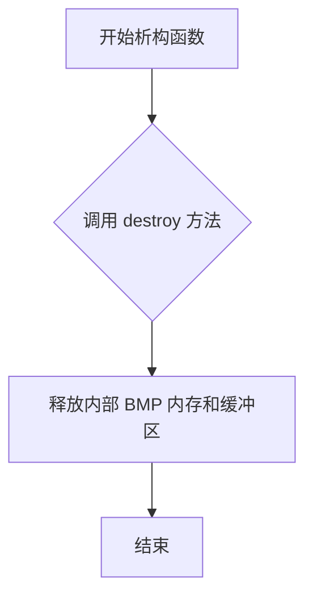

#### 带注释源码

```cpp
//------------------------------------------------------------------------
// pixel_map::~pixel_map()
// 析构函数，在对象生命周期结束时自动调用，释放所有已分配的资源
//------------------------------------------------------------------------
pixel_map::~pixel_map()
{
    destroy(); // 调用 destroy 方法清理资源
}
```


### `pixel_map::pixel_map()`

构造函数，初始化 pixel_map 对象的所有成员变量，将位图指针、缓冲区指针、位深度、内部标志及内存大小等属性设置为默认值或零值。

参数： 无

返回值： 无（构造函数）

#### 流程图

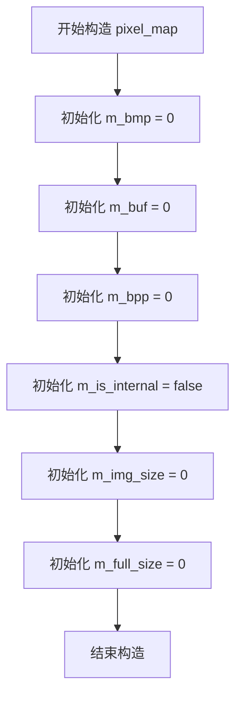

#### 带注释源码

```cpp
//------------------------------------------------------------------------
// pixel_map::pixel_map()
// 构造函数，使用初始化列表初始化所有成员变量
//------------------------------------------------------------------------
pixel_map::pixel_map() :
    m_bmp(0),           // BITMAPINFO*，位图信息结构指针，0表示未关联位图
    m_buf(0),           // unsigned char*，像素数据缓冲区指针，0表示无有效数据
    m_bpp(0),           // unsigned，每像素位数（bits per pixel），0表示未初始化
    m_is_internal(false), // bool，标志位图是否由类内部管理（负责释放）
    m_img_size(0),      // unsigned，像素数据区域大小（字节数）
    m_full_size(0)      // unsigned，完整位图数据大小（包含头信息和调色板）

{
    // 构造函数体为空，所有初始化工作通过初始化列表完成
}
```

#### 成员变量详情

| 变量名称 | 类型 | 描述 |
|---------|------|------|
| `m_bmp` | `BITMAPINFO*` | Windows 位图信息结构指针，指向 BITMAPINFO 及其像素数据 |
| `m_buf` | `unsigned char*` | 像素数据缓冲区指针，指向实际图像像素存储区域 |
| `m_bpp` | `unsigned` | 每像素位数（bits per pixel），如 8、16、24、32 等 |
| `m_is_internal` | `bool` | 标记位图是否由类内部创建和管理，true 表示需在析构时释放 |
| `m_img_size` | `unsigned` | 像素数据区域的字节大小（不含位图头） |
| `m_full_size` | `unsigned` | 完整位图数据的字节大小（含头信息、调色板和像素数据） |


### `pixel_map.destroy()`

销毁位图，释放内部分配的内存，并将内部状态重置为初始值。

参数： （无参数）

返回值：`void`，无返回值

#### 流程图

```mermaid
flowchart TD
    A[开始 destroy] --> B{m_bmp != 0 且 m_is_internal == true?}
    B -->|是| C[delete[] m_bmp 释放内存]
    B -->|否| D[跳过释放]
    C --> E[设置 m_bmp = 0]
    D --> E
    E --> F[设置 m_is_internal = false]
    F --> G[设置 m_buf = 0]
    G --> H[结束 destroy]
```

#### 带注释源码

```cpp
//------------------------------------------------------------------------
// pixel_map::destroy - 销毁位图，释放内部分配的内存
//------------------------------------------------------------------------
void pixel_map::destroy()
{
    // 判断条件：m_bmp指针存在 且 位图由内部创建（m_is_internal为true）
    // 只有内部创建的位图才需要手动释放内存
    if(m_bmp && m_is_internal) 
    {
        // 将m_bmp强制转换为unsigned char*后进行数组删除
        // 释放create()或create_dib_section()中new分配的内存
        delete [] (unsigned char*)m_bmp;
    }
    
    // 重置位图指针为nullptr，避免悬空指针
    m_bmp  = 0;
    
    // 重置内部标志位，表示位图不再由内部管理
    m_is_internal = false;
    
    // 重置像素缓冲区指针为nullptr
    m_buf = 0;
    
    // 注意：m_bpp, m_img_size, m_full_size 未被重置
    // 这些值会在下次create()调用时被覆盖
}
```

#### 关联的类字段信息

| 字段名称 | 类型 | 描述 |
|---------|------|------|
| `m_bmp` | `BITMAPINFO*` | 位图信息结构指针，指向BITMAPINFO结构 |
| `m_buf` | `unsigned char*` | 像素数据缓冲区指针，指向实际图像数据 |
| `m_bpp` | `unsigned int` | 每像素位数（bits per pixel），如8、24、32等 |
| `m_is_internal` | `bool` | 标志位，表示位图是否由类内部分配内存 |
| `m_img_size` | `unsigned int` | 图像数据大小（仅像素部分） |
| `m_full_size` | `unsigned int` | 完整大小（包含BITMAPINFOHEADER和调色板） |


### `pixel_map.create`

**描述**：该方法用于创建并初始化一个指定宽度、高度和像素格式（位深）的位图。它首先清理旧的位图资源，然后分配新的内存（BITMAPINFO结构），设置灰度调色板，并根据 `clear_val` 参数决定是否将像素缓冲区初始化为特定值。

#### 参数

- `width`：`unsigned`，位图的宽度（像素），如果传入0则自动调整为1。
- `height`：`unsigned`，位图的高度（像素），如果传入0则自动调整为1。
- `org`：`org_e`，像素组织方式（枚举类型），决定了位图的位深（bits per pixel），如 8bpp, 16bpp, 24bpp, 32bpp 等。
- `clear_val`：`unsigned`，用于初始化像素缓冲区的值（0-255）。如果超出255，则跳过清空操作。

#### 返回值

`void`，无返回值。该方法通过修改对象的成员变量（如 `m_bmp`, `m_buf`, `m_img_size` 等）来输出结果。

#### 流程图

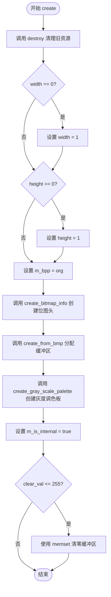

#### 带注释源码

```cpp
//------------------------------------------------------------------------
// 创建指定尺寸的位图
//------------------------------------------------------------------------
void pixel_map::create(unsigned width, 
                       unsigned height, 
                       org_e    org,
                       unsigned clear_val)
{
    // 1. 首先销毁任何已存在的位图数据，防止内存泄漏
    destroy();

    // 2. 参数校验：确保宽高至少为1，防止除零或无效内存分配
    if(width == 0)  width = 1;
    if(height == 0) height = 1;

    // 3. 设置内部位深（Bits Per Pixel）
    m_bpp = org;

    // 4. 创建 BITMAPINFO 结构并分配图像内存
    create_from_bmp(create_bitmap_info(width, height, m_bpp));

    // 5. 为位图创建默认的灰度调色板（仅在 bpp <= 8 时有意义）
    create_gray_scale_palette(m_bmp);

    // 6. 标记该位图由内部自主管理内存（在析构时需要手动释放）
    m_is_internal = true;

    // 7. 如果提供了有效的清空值（0-255），则用该值填充像素缓冲区
    if(clear_val <= 255)
    {
        memset(m_buf, clear_val, m_img_size);
    }
}
```


### `pixel_map.create_dib_section`

创建DIB Section（设备无关位图）并返回HBITMAP句柄，同时初始化像素映射的内部缓冲区和调色板。该方法会先销毁已有的位图资源，然后创建新的DIB Section，如果提供了清除值则将缓冲区初始化为指定值。

参数：

- `h_dc`：`HDC`，设备上下文句柄，用于创建DIB Section
- `width`：`unsigned`，位图宽度，如果为0则默认为1
- `height`：`unsigned`，位图高度，如果为0则默认为1
- `org`：`org_e`，颜色组织方式（位深度），如8位灰度、24位真彩色等
- `clear_val`：`unsigned`，清除值，用于初始化缓冲区，如果值小于等于255则执行清除操作

返回值：`HBITMAP`，创建的DIB Section位图句柄

#### 流程图

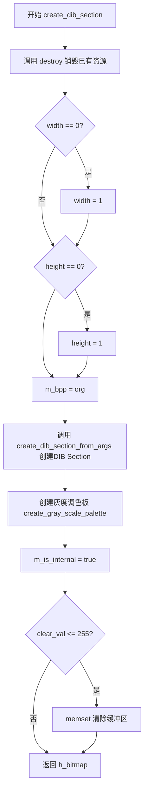

#### 带注释源码

```cpp
//----------------------------------------------------------------------------
// 创建DIB Section并返回HBITMAP句柄
// 参数：
//   h_dc      - 设备上下文句柄
//   width     - 位图宽度
//   height    - 位图高度
//   org       - 颜色组织方式（位深度）
//   clear_val - 清除值，用于初始化缓冲区
// 返回值：创建的DIB Section位图句柄
//----------------------------------------------------------------------------
HBITMAP pixel_map::create_dib_section(HDC h_dc,
                                      unsigned width, 
                                      unsigned height, 
                                      org_e    org,
                                      unsigned clear_val)
{
    // 步骤1：销毁已有的位图资源，防止内存泄漏
    destroy();
    
    // 步骤2：边界检查，确保宽度和高度至少为1
    if(width == 0)  width = 1;
    if(height == 0) height = 1;
    
    // 步骤3：设置位深度（颜色组织方式）
    m_bpp = org;
    
    // 步骤4：调用内部方法创建DIB Section，获取位图句柄
    // 同时会设置 m_bmp、m_buf、m_img_size 等成员变量
    HBITMAP h_bitmap = create_dib_section_from_args(h_dc, width, height, m_bpp);
    
    // 步骤5：如果位图创建成功，创建灰度调色板
    create_gray_scale_palette(m_bmp);
    
    // 步骤6：标记为内部管理的位图
    m_is_internal = true;
    
    // 步骤7：如果清除值在有效范围内（0-255），清除缓冲区
    if(clear_val <= 255)
    {
        // 使用 memset 将缓冲区所有字节设置为 clear_val
        memset(m_buf, clear_val, m_img_size);
    }
    
    // 步骤8：返回创建的位图句柄
    return h_bitmap;
}
```

#### 关键技术细节

1. **资源管理**：函数开始时调用 `destroy()` 确保释放之前分配的任何现有位图资源，避免资源泄漏。

2. **DIB Section创建**：使用 Windows API `CreateDIBSection` 创建DIB Section，这种位图可以直接访问像素数据，适用于高性能图形操作。

3. **内存布局**：`create_dib_section_from_args` 内部会分配 BITMAPINFO 结构，并使用 `CreateDIBSection` 将像素缓冲区直接映射到进程地址空间。

4. **调色板初始化**：对于8位及以下位深的图像，调用 `create_gray_scale_palette` 创建灰度调色板。

5. **缓冲区清除**：使用 `memset` 快速初始化像素缓冲区，适用于需要预设背景色的场景。

#### 相关依赖函数

- `destroy()`：销毁现有位图资源
- `create_dib_section_from_args()`：内部实现，创建BITMAPINFO并调用CreateDIBSection
- `create_gray_scale_palette()`：创建灰度调色板
- `calc_row_len()`：计算行长度（跨距）
- `calc_palette_size()`：计算调色板大小


### `pixel_map.clear`

使用指定值清除像素缓冲区的方法。该方法通过调用 C 标准库函数 `memset` 将像素缓冲区（`m_buf`）的全部内容设置为指定的清除值（`clear_val`），从而实现快速清空图像数据的功能。

参数：

- `clear_val`：`unsigned`，清除像素缓冲区所使用的值，范围通常为 0-255

返回值：`void`，无返回值

#### 流程图

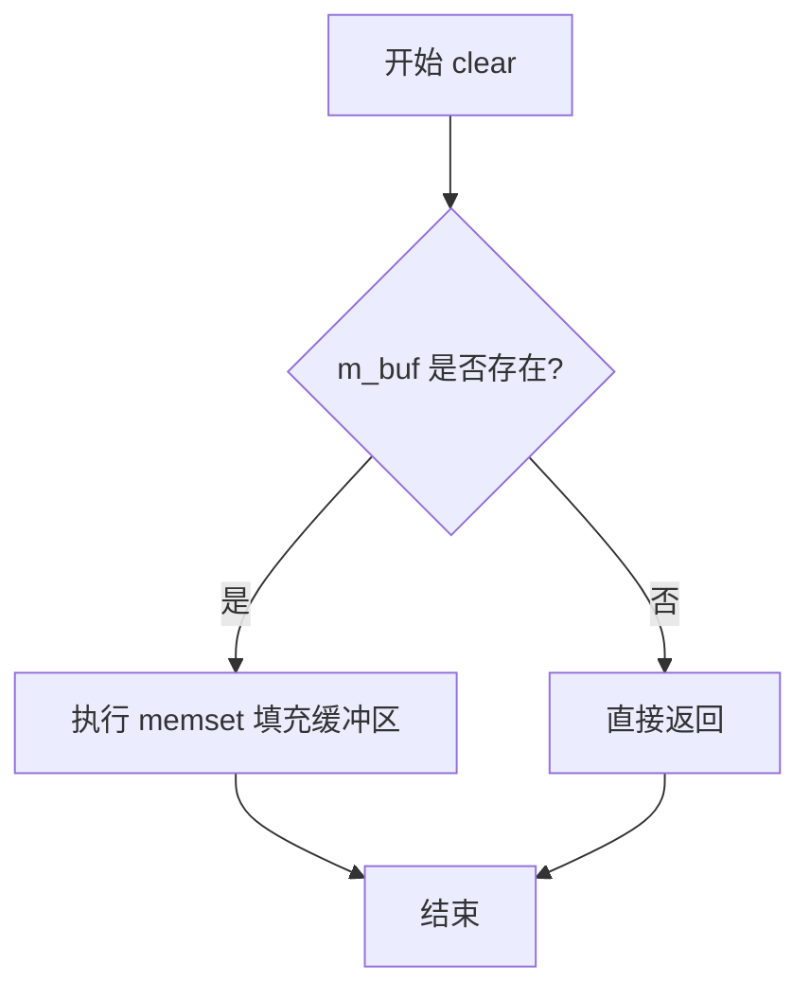

#### 带注释源码

```cpp
//------------------------------------------------------------------------
// 使用指定值清除像素缓冲区
//------------------------------------------------------------------------
void pixel_map::clear(unsigned clear_val)
{
    // 仅当缓冲区指针有效时才执行清除操作
    // m_buf: 指向像素数据缓冲区的指针
    // clear_val: 要填充的字节值（通常为0-255）
    // m_img_size: 像素缓冲区的总大小（字节数）
    if(m_buf) memset(m_buf, clear_val, m_img_size);
}
```


### `pixel_map.attach_to_bmp`

该方法用于将外部传入的 BITMAPINFO 结构附加到 pixel_map 对象中，使其能够使用外部提供的位图数据，而不需要内部自行分配内存。

参数：

- `bmp`：`BITMAPINFO*`，指向外部 BITMAPINFO 结构的指针，用于附加到当前 pixel_map 对象

返回值：`void`，无返回值

#### 流程图

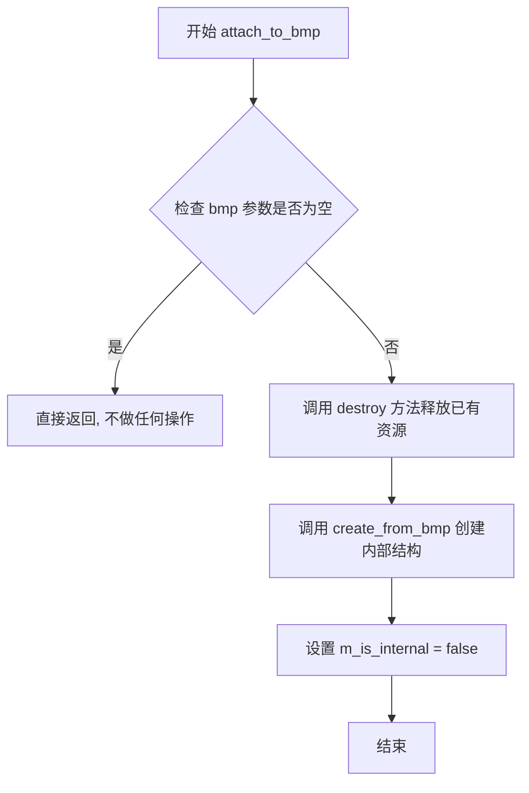

#### 带注释源码

```cpp
//------------------------------------------------------------------------
// 将外部 BITMAPINFO 结构附加到 pixel_map
// 参数: bmp - 指向外部 BITMAPINFO 结构的指针
//------------------------------------------------------------------------
void pixel_map::attach_to_bmp(BITMAPINFO *bmp)
{
    // 检查传入的 bmp 指针是否有效
    if(bmp)
    {
        // 首先销毁已有的内部位图资源
        // 如果之前有内部分配的位图,这里会释放其内存
        destroy();
        
        // 从传入的 BITMAPINFO 创建内部结构
        // 会设置 m_bmp, m_buf, m_img_size, m_full_size 等成员
        create_from_bmp(bmp);
        
        // 标记该位图由外部提供,非内部分配
        // 这样在析构时就不会尝试释放外部传入的内存
        m_is_internal = false;
    }
}
```


### `pixel_map.calc_full_size`

计算位图的完整大小，包括 BITMAPINFOHEADER、调色板和图像数据所需的字节数。

参数：

- `bmp`：`BITMAPINFO*`，指向 BITMAPINFO 结构的指针，包含位图的尺寸、颜色格式等信息。

返回值：`unsigned`，返回位图占用的总字节数；如果 bmp 为空则返回 0。

#### 流程图

```mermaid
flowchart TD
    A[开始] --> B{检查 bmp 是否为空}
    B -->|是| C[返回 0]
    B -->|否| D[计算头部大小: sizeof(BITMAPINFOHEADER)]
    D --> E[计算调色板大小: sizeof(RGBQUAD) * calc_palette_size(bmp)]
    E --> F[获取图像数据大小: bmp->bmiHeader.biSizeImage]
    F --> G[返回 头部大小 + 调色板大小 + 图像数据大小]
```

#### 带注释源码

```cpp
//static
//------------------------------------------------------------------------
unsigned pixel_map::calc_full_size(BITMAPINFO *bmp)
{
    // 如果位图指针为空，直接返回 0，避免空指针访问
    if(bmp == 0) return 0;

    // 计算总大小：头部 + 调色板 + 图像数据
    // 头部大小固定为 BITMAPINFOHEADER 的大小
    // 调色板大小取决于颜色深度和调色板条目数
    // 图像数据大小来自 biSizeImage 字段
    return sizeof(BITMAPINFOHEADER) +
           sizeof(RGBQUAD) * calc_palette_size(bmp) +
           bmp->bmiHeader.biSizeImage;
}
```


### `pixel_map.calc_header_size`

该静态方法用于计算位图文件的头部大小，包括 BITMAPINFOHEADER 和调色板（RGBQUAD 数组）的总字节数。

参数：

- `bmp`：`BITMAPINFO*`，指向 BITMAPINFO 结构的指针，包含位图信息，用于计算头部大小

返回值：`unsigned`，返回位图头部的大小（以字节为单位），如果 bmp 为空则返回 0

#### 流程图

```mermaid
graph TD
    A[开始 calc_header_size] --> B{bmp == 0?}
    B -->|是| C[返回 0]
    B -->|否| D[调用 calc_palette_size 获取调色板大小]
    D --> E[计算 sizeof(BITMAPINFOHEADER) + sizeof(RGBQUAD) * palette_size]
    E --> F[返回计算结果]
```

#### 带注释源码

```cpp
// static
//------------------------------------------------------------------------
// 计算位图头部大小（字节）
//------------------------------------------------------------------------
unsigned pixel_map::calc_header_size(BITMAPINFO *bmp)
{
    // 如果指针为空，返回 0
    if(bmp == 0) return 0;
    
    // 头部大小 = BITMAPINFOHEADER 大小 + 调色板大小
    // 调色板大小 = RGBQUAD 大小 * 调色板条目数
    return sizeof(BITMAPINFOHEADER) + sizeof(RGBQUAD) * calc_palette_size(bmp);
}
```


### `pixel_map.calc_palette_size`

计算给定颜色深度和颜色使用数量下的调色板大小，用于确定BMP图像调色板所需的RGBQUAD数组元素数量。

参数：

- `clr_used`：`unsigned`，调色板中实际使用的颜色数量（来自BMP头部的biClrUsed字段）
- `bits_per_pixel`：`unsigned`，每个像素的位数（1, 4, 8等），决定最大调色板容量

返回值：`unsigned`，返回调色板条目数。如果bits_per_pixel大于8，则返回0（因为24/32位真彩色不需要调色板）。

#### 流程图

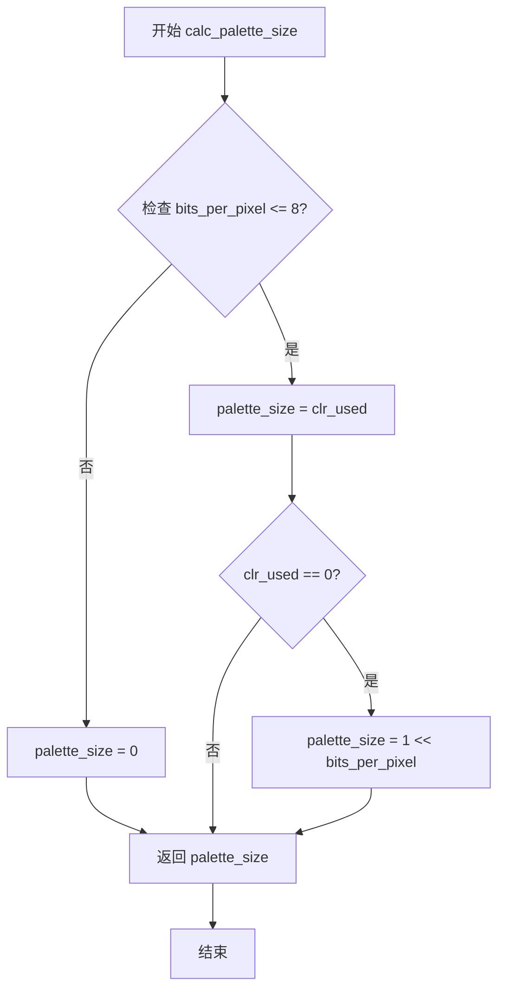

#### 带注释源码

```cpp
//static
//------------------------------------------------------------------------
// 计算调色板大小的静态方法
// 参数:
//   clr_used: BMP头中指定的使用颜色数 (biClrUsed)
//   bits_per_pixel: 像素位深 (biBitCount)
// 返回值:
//   调色板中RGBQUAD条目数量
//------------------------------------------------------------------------
unsigned pixel_map::calc_palette_size(unsigned clr_used, unsigned bits_per_pixel)
{
    // 初始化为0，对于超过8bpp的格式（如16/24/32bpp）直接返回0
    int palette_size = 0;

    // 只有当位深<=8时才需要调色板
    if(bits_per_pixel <= 8)
    {
        // 首先使用BMP头中指定的实际使用颜色数
        palette_size = clr_used;
        
        // 如果BMP头中clr_used为0，则使用该位深下的最大颜色数
        // 例如: 8bpp=256色, 4bpp=16色, 1bpp=2色
        if(palette_size == 0)
        {
            palette_size = 1 << bits_per_pixel;
        }
    }
    
    // 返回计算结果，对于真彩色格式返回0
    return palette_size;
}
```


### `pixel_map.calc_palette_size`

该静态方法根据BITMAPINFO结构计算调色板的大小，通过提取位图头中的颜色数和位深度信息来确定调色板应包含的RGBQUAD元素数量。

参数：

- `bmp`：`BITMAPINFO*`，指向Windows BITMAPINFO结构的指针，从中获取biClrUsed和biBitCount字段用于计算调色板大小

返回值：`unsigned`，返回调色板中RGBQUAD条目的数量。如果bmp为空或位深度大于8（真彩色图像不需要调色板），则返回0。

#### 流程图

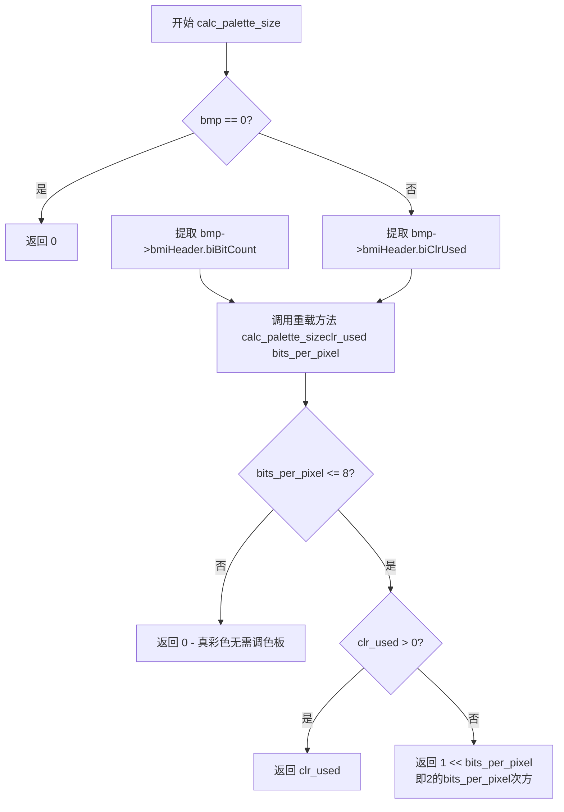

#### 带注释源码

```cpp
//static
//------------------------------------------------------------------------
// pixel_map::calc_palette_size - 从BITMAPINFO计算调色板大小
// 参数: bmp - BITMAPINFO指针，包含位图头信息
// 返回: unsigned - 调色板RGBQUAD元素数量
//------------------------------------------------------------------------
unsigned pixel_map::calc_palette_size(BITMAPINFO *bmp)
{
    // 空指针检查，避免解引用空指针导致崩溃
    if(bmp == 0) return 0;
    
    // 从BITMAPINFOHEADER中提取颜色数和位深度
    // biClrUsed: 调色板中实际使用的颜色数（0表示使用默认值）
    // biBitCount: 每个像素的位数（1, 4, 8, 16, 24, 32等）
    return calc_palette_size(bmp->bmiHeader.biClrUsed, 
                             bmp->bmiHeader.biBitCount);
}

// 重载的静态方法 - 根据颜色数和位深度直接计算调色板大小
//------------------------------------------------------------------------
unsigned pixel_map::calc_palette_size(unsigned clr_used, unsigned bits_per_pixel)
{
    int palette_size = 0;

    // 只有当位深度<=8时才需要调色板
    // 位深度1,4,8对应单色、16色、256色图像
    if(bits_per_pixel <= 8)
    {
        // 如果biClrUsed > 0，使用实际声明的颜色数
        palette_size = clr_used;
        
        // 如果biClrUsed为0，使用2的幂作为默认调色板大小
        // 例如: 1位=2色, 4位=16色, 8位=256色
        if(palette_size == 0)
        {
            palette_size = 1 << bits_per_pixel;  // 2^bits_per_pixel
        }
    }
    
    // 对于16位及以上（真彩色），返回0表示无调色板
    return palette_size;
}
```


### `pixel_map.calc_img_ptr`

该静态方法接收一个 `BITMAPINFO` 指针，通过将 BMP 结构体指针加上头部大小（包含 BITMAPINFOHEADER 和调色板）的偏移量，计算并返回指向 BMP 图像像素数据区域的起始地址。

参数：

- `bmp`：`BITMAPINFO*`，指向 BMP 图像结构体的指针，用于定位像素数据的起始位置

返回值：`unsigned char*`，返回指向 BMP 图像像素数据区域的指针，如果输入指针为 nullptr 则返回 0

#### 流程图

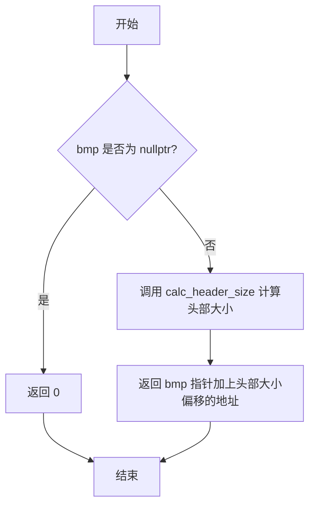

#### 带注释源码

```cpp
//static
//------------------------------------------------------------------------
unsigned char * pixel_map::calc_img_ptr(BITMAPINFO *bmp)
{
    // 如果传入的 BMP 指针为空，直接返回 0
    if(bmp == 0) return 0;
    
    // 计算 BMP 头部大小（包含 BITMAPINFOHEADER 和调色板）
    // 然后将 BMP 结构体指针转换为 unsigned char* 并加上偏移量
    // 得到像素数据区域的起始位置
    return ((unsigned char*)bmp) + calc_header_size(bmp);
}
```


### `pixel_map.create_bitmap_info`

创建 BITMAPINFO 结构体，用于存储 Windows 位图的头信息和像素数据。该函数根据指定的宽度、高度和每像素位数分配内存并初始化 BITMAPINFOHEADER 结构。

参数：

- `width`：`unsigned`，位图的宽度（像素）
- `height`：`unsigned`，位图的高度（像素）
- `bits_per_pixel`：`unsigned`，每像素的位数（如 8、24、32 等）

返回值：`BITMAPINFO*`，指向新创建的 BITMAPINFO 结构指针

#### 流程图

```mermaid
flowchart TD
    A[开始 create_bitmap_info] --> B[计算行长度: calc_row_len]
    B --> C[计算图像大小: line_len × height]
    C --> D[计算调色板大小: calc_palette_size × sizeof RGBQUAD]
    D --> E[计算总内存大小]
    E --> F[分配内存: new unsigned char[full_size]]
    F --> G[初始化 BITMAPINFOHEADER]
    G --> H[设置 biSize]
    H --> I[设置 biWidth 和 biHeight]
    I --> J[设置 biPlanes = 1]
    J --> K[设置 biBitCount]
    K --> L[设置 biCompression = 0]
    L --> M[设置 biSizeImage]
    M --> N[设置 XPelsPerMeter, YPelsPerMeter, ClrUsed, ClrImportant]
    N --> O[返回 BITMAPINFO 指针]
```

#### 带注释源码

```cpp
// static
//------------------------------------------------------------------------
// 创建 BITMAPINFO 结构
// 参数：
//   width - 位图宽度（像素）
//   height - 位图高度（像素）
//   bits_per_pixel - 每像素位数（如 8、24、32）
// 返回值：
//   指向新分配的 BITMAPINFO 结构指针
//------------------------------------------------------------------------
BITMAPINFO* pixel_map::create_bitmap_info(unsigned width, 
                                          unsigned height, 
                                          unsigned bits_per_pixel)
{
    // 计算一行像素所需的字节数（考虑字节对齐）
    unsigned line_len = calc_row_len(width, bits_per_pixel);
    
    // 计算整个图像数据的字节大小
    unsigned img_size = line_len * height;
    
    // 计算调色板大小（字节）
    // 对于 8 位及以下色深需要调色板，其他不需要
    unsigned rgb_size = calc_palette_size(0, bits_per_pixel) * sizeof(RGBQUAD);
    
    // 计算总内存需求：头部 + 调色板 + 图像数据
    unsigned full_size = sizeof(BITMAPINFOHEADER) + rgb_size + img_size;

    // 分配连续内存块用于存储完整的位图信息
    BITMAPINFO *bmp = (BITMAPINFO *) new unsigned char[full_size];

    // 初始化 BITMAPINFOHEADER 结构
    bmp->bmiHeader.biSize   = sizeof(BITMAPINFOHEADER);  // 结构体大小
    bmp->bmiHeader.biWidth  = width;                      // 位图宽度
    bmp->bmiHeader.biHeight = height;                     // 位图高度
    bmp->bmiHeader.biPlanes = 1;                          // 目标设备平面数（必须为1）
    bmp->bmiHeader.biBitCount = (unsigned short)bits_per_pixel; // 每像素位数
    bmp->bmiHeader.biCompression = 0;                     // 压缩模式（0=无压缩）
    bmp->bmiHeader.biSizeImage = img_size;                // 图像数据大小
    bmp->bmiHeader.biXPelsPerMeter = 0;                   // 水平分辨率（未使用）
    bmp->bmiHeader.biYPelsPerMeter = 0;                   // 垂直分辨率（未使用）
    bmp->bmiHeader.biClrUsed = 0;                         // 实际使用的颜色数
    bmp->bmiHeader.biClrImportant = 0;                    // 重要颜色数（全部重要）

    return bmp;  // 返回创建的位图信息结构指针
}
```


### `pixel_map.create_gray_scale_palette`

该静态方法用于为指定的 Windows `BITMAPINFO` 结构创建标准的8位灰度调色板。它通过计算调色板的大小，然后遍历每个调色板条目，将红、绿、蓝三原色的值设置为从黑到白线性递增的亮度，从而实现灰度梯度。

参数：

- `bmp`：`BITMAPINFO *`，指向 Windows 位图信息结构的指针，用于设置其调色板。如果为 `nullptr`，则函数不执行任何操作。

返回值：`void`，该方法没有返回值，直接修改 `bmp` 结构内部的调色板数据。

#### 流程图

```mermaid
flowchart TD
    A([开始 create_gray_scale_palette]) --> B{输入参数 bmp 是否为 nullptr?}
    B -- 是 --> C([结束])
    B -- 否 --> D[计算调色板大小 rgb_size]
    D --> E[获取调色板指针 rgb<br>指向 bmp 数据中 BITMAPINFOHEADER 之后的位置]
    E --> F{循环 i 从 0 到 rgb_size - 1}
    F -- 迭代 --> G[计算亮度值 brightness<br>brightness = (255 * i) / (rgb_size - 1)]
    G --> H[设置调色板颜色<br>rgb->rgbRed = rgb->rgbGreen = rgb->rgbBlue = brightness]
    H --> I[设置保留位 rgb->rgbReserved = 0]
    I --> J[指针 rgb 递增指向下一个调色板条目]
    J --> F
    F -- 循环结束 --> C
```

#### 带注释源码

```cpp
    //static
    //------------------------------------------------------------------------
    // 功能：创建灰度调色板
    // 参数：bmp - BITMAPINFO 指针
    //------------------------------------------------------------------------
    void pixel_map::create_gray_scale_palette(BITMAPINFO *bmp)
    {
        // 1. 安全检查：如果传入的指针为空，则直接返回，不进行任何操作
        if(bmp == 0) return;

        // 2. 计算调色板的大小（条目数量）
        //    调用类的静态方法 calc_palette_size，根据 biClrUsed 或位深计算
        unsigned rgb_size = calc_palette_size(bmp);

        // 3. 获取调色板数据的内存起始位置
        //    调色板位于 BITMAPINFOHEADER 之后
        RGBQUAD *rgb = (RGBQUAD*)(((unsigned char*)bmp) + sizeof(BITMAPINFOHEADER));
        
        unsigned brightness; // 用于存储当前计算的亮度值 (0-255)
        unsigned i;          // 循环计数器

        // 4. 遍历调色板的每一个条目，填充灰度颜色
        for(i = 0; i < rgb_size; i++)
        {
            // 计算当前索引对应的亮度值，实现从黑(0)到白(255)的线性渐变
            // 公式：i / (rgb_size - 1) * 255
            brightness = (255 * i) / (rgb_size - 1);
            
            // 将红、绿、蓝三个通道设置为相同的亮度值，形成灰色
            // 注意：rgb->rgbBlue, rgb->rgbGreen, rgb->rgbRed 依次被赋值
            rgb->rgbBlue =
            rgb->rgbGreen =  
            rgb->rgbRed = (unsigned char)brightness; 
            
            // Windows 位图要求保留位 (rgbReserved) 必须置 0
            rgb->rgbReserved = 0;
            
            // 移动指针到下一个调色板条目
            rgb++;
        }
    }
```


### `pixel_map.calc_row_len`

该静态方法根据给定的图像宽度和每像素位数（bits_per_pixel）计算位图行字节长度，并自动对齐到4字节边界，确保Windows DIB格式的行大小符合4字节对齐要求。

参数：

- `width`：`unsigned`，图像宽度（像素数）
- `bits_per_pixel`：`unsigned`，每像素位数（如1、4、8、16、24、32、48、64、96、128）

返回值：`unsigned`，对齐到4字节后的行字节长度

#### 流程图

```mermaid
flowchart TD
    A[开始 calc_row_len] --> B[输入 width 和 bits_per_pixel]
    B --> C[将 width 赋值给 n]
    C --> D{switch bits_per_pixel}
    
    D -->|1| E[保存原始宽度到 k]
    E --> E1[n = n >> 3<br/>即 n = width / 8]
    E1 --> E2{检查 k & 7<br/>是否有余数}
    E2 -->|是| E3[n++<br/>向上取整到字节]
    E2 -->|否| E4[保持 n]
    
    D -->|4| F[保存原始宽度到 k]
    F --> F1[n = n >> 1<br/>即 n = width / 2]
    F1 --> F2{检查 k & 3<br/>是否有余数}
    F2 -->|是| F3[n++<br/>向上取整到半字节]
    F2 -->|否| F4[保持 n]
    
    D -->|8| G[直接使用 n<br/>每像素1字节]
    D -->|16| H[n = n * 2<br/>每像素2字节]
    D -->|24| I[n = n * 3<br/>每像素3字节]
    D -->|32| J[n = n * 4<br/>每像素4字节]
    D -->|48| K[n = n * 6<br/>每像素6字节]
    D -->|64| L[n = n * 8<br/>每像素8字节]
    D -->|96| M[n = n * 12<br/>每像素12字节]
    D -->|128| N[n = n * 16<br/>每像素16字节]
    D -->|default| O[n = 0<br/>不支持的位深]
    
    E3 --> P[4字节对齐计算]
    E4 --> P
    F3 --> P
    F4 --> P
    G --> P
    H --> P
    I --> P
    J --> P
    K --> P
    L --> P
    M --> P
    N --> P
    O --> P
    
    P --> Q[计算: n = ((n + 3) >> 2) << 2]
    Q --> R[返回对齐后的行长度]
    
    style P fill:#f9f,stroke:#333
    style Q fill:#ff9,stroke:#333
```

#### 带注释源码

```cpp
//static
//------------------------------------------------------------------------
unsigned pixel_map::calc_row_len(unsigned width, unsigned bits_per_pixel)
{
    unsigned n = width;    // 初始为像素宽度
    unsigned k;            // 临时变量，用于存储原始宽度

    // 根据不同的位深度计算字节长度
    switch(bits_per_pixel)
    {
        case  1: // 1位色深（单色）
                 k = n;                // 保存原始宽度用于余数检查
                 n = n >> 3;           // 除以8得到字节数
                 if(k & 7) n++;        // 如果不是8的倍数，向上取整
                 break;

        case  4: // 4位色深（16色）
                 k = n;                // 保存原始宽度用于余数检查
                 n = n >> 1;           // 除以2得到字节数（2像素=1字节）
                 if(k & 3) n++;        // 如果不是4的倍数，向上取整
                 break;

        case  8: // 8位色深（256色）
                 // 每像素1字节，直接使用n
                 break;

        case 16: // 16位色深（高彩色）
                 n *= 2;               // 每像素2字节
                 break;

        case 24: // 24位色深（真彩色）
                 n *= 3;               // 每像素3字节
                 break;

        case 32: // 32位色深
                 n *= 4;               // 每像素4字节
                 break;

        case 48: // 48位色深
                 n *= 6;               // 每像素6字节
                 break;

        case 64: // 64位色深
                 n *= 8;               // 每像素8字节
                 break;

        case 96: // 96位色深
                 n *= 12;              // 每像素12字节
                 break;

        case 128: // 128位色深
                 n *= 16;              // 每像素16字节
                 break;

        default: // 不支持的位深度
                 n = 0;
                 break;
    }
    
    // Windows DIB格式要求行长度对齐到4字节边界
    // 算法：(n + 3) / 4 向上取整，然后乘以4
    // 使用位运算实现：((n + 3) >> 2) << 2
    return ((n + 3) >> 2) << 2;
}
```


### `pixel_map.draw`

绘制位图到Windows设备上下文（Device Context），支持拉伸和直接绘制两种模式。当目标区域尺寸与源位图尺寸不一致时使用StretchDIBits进行拉伸绘制，否则使用SetDIBitsToDevice进行直接绘制。

参数：

- `h_dc`：`HDC`，Windows设备上下文句柄，指定绘制的目标设备
- `device_rect`：`const RECT *`，指向目标设备上绘制区域的矩形指针，如果为nullptr则使用整个位图区域
- `bmp_rect`：`const RECT *`，指向源位图中需要绘制区域的矩形指针，如果为nullptr则使用整个位图

返回值：`void`，无返回值

#### 流程图

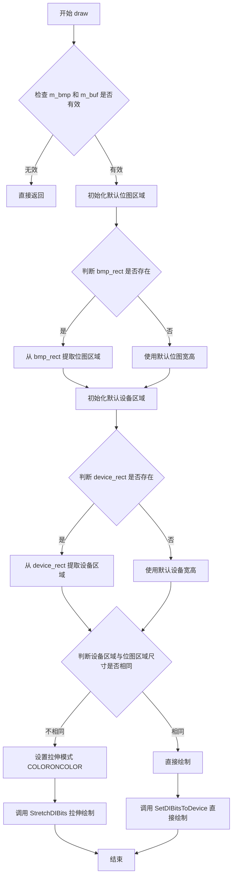

#### 带注释源码

```cpp
//------------------------------------------------------------------------
// 绘制位图到设备上下文
//------------------------------------------------------------------------
void pixel_map::draw(HDC h_dc, const RECT *device_rect, const RECT *bmp_rect) const
{
    // 检查位图数据是否有效，无效则直接返回
    if(m_bmp == 0 || m_buf == 0) return;

    // 初始化位图源区域变量，默认使用整个位图
    unsigned bmp_x = 0;
    unsigned bmp_y = 0;
    unsigned bmp_width  = m_bmp->bmiHeader.biWidth;   // 位图宽度
    unsigned bmp_height = m_bmp->bmiHeader.biHeight;  // 位图高度

    // 初始化目标设备区域变量，默认与位图区域相同
    unsigned dvc_x = 0;
    unsigned dvc_y = 0; 
    unsigned dvc_width  = m_bmp->bmiHeader.biWidth;
    unsigned dvc_height = m_bmp->bmiHeader.biHeight;
    
    // 如果提供了bmp_rect，则从参数中提取位图的绘制区域
    if(bmp_rect) 
    {
        bmp_x      = bmp_rect->left;                  // 位图左上角X坐标
        bmp_y      = bmp_rect->top;                   // 位图左上角Y坐标
        bmp_width  = bmp_rect->right  - bmp_rect->left;  // 位图区域宽度
        bmp_height = bmp_rect->bottom - bmp_rect->top;   // 位图区域高度
    } 

    // 默认设备区域与位图区域相同
    dvc_x      = bmp_x;
    dvc_y      = bmp_y;
    dvc_width  = bmp_width;
    dvc_height = bmp_height;

    // 如果提供了device_rect，则从参数中提取设备上的目标绘制区域
    if(device_rect) 
    {
        dvc_x      = device_rect->left;                    // 目标设备左上角X坐标
        dvc_y      = device_rect->top;                     // 目标设备左上角Y坐标
        dvc_width  = device_rect->right  - device_rect->left;  // 目标区域宽度
        dvc_height = device_rect->bottom - device_rect->top;  // 目标区域高度
    }

    // 判断是否需要拉伸绘制
    if(dvc_width != bmp_width || dvc_height != bmp_height)
    {
        // 设置拉伸模式为COLORONCOLOR，避免灰度渐变带
        ::SetStretchBltMode(h_dc, COLORONCOLOR);
        
        // 使用StretchDIBits进行拉伸绘制
        ::StretchDIBits(
            h_dc,              // 目标设备上下文句柄
            dvc_x,             // 目标矩形左上角X坐标
            dvc_y,             // 目标矩形左上角Y坐标
            dvc_width,         // 目标矩形宽度
            dvc_height,        // 目标矩形高度
            bmp_x,             // 源位图左上角X坐标
            bmp_y,             // 源位图左上角Y坐标
            bmp_width,         // 源位图区域宽度
            bmp_height,        // 源位图区域高度
            m_buf,             // 位图像素数据指针
            m_bmp,             // 位图信息结构指针
            DIB_RGB_COLORS,   // 颜色使用模式：RGB颜色
            SRCCOPY            // 栅格操作代码：直接复制源到目标
        );
    }
    else
    {
        // 尺寸相同，使用SetDIBitsToDevice进行直接绘制（更快）
        ::SetDIBitsToDevice(
            h_dc,              // 目标设备上下文句柄
            dvc_x,             // 目标矩形左上角X坐标
            dvc_y,             // 目标矩形左上角Y坐标
            dvc_width,         // 源矩形宽度
            dvc_height,        // 源矩形高度
            bmp_x,             // 源位图左下角X坐标（Windows DIB原点在左下角）
            bmp_y,             // 源位图左下角Y坐标
            0,                 // 第一个扫描线索引
            bmp_height,        // 扫描线数量
            m_buf,             // 位图像素数据指针
            m_bmp,             // 位图信息结构指针
            DIB_RGB_COLORS     // 颜色使用模式：RGB颜色
        );
    }
}
```


### `pixel_map.draw`

该方法是 `pixel_map` 类的成员函数，用于按比例在指定位置绘制位图。它通过计算缩放后的宽度和高度，构造目标矩形，然后调用另一个重载的 `draw` 方法来执行实际绘制操作。

参数：

- `h_dc`：`HDC`，Windows 设备上下文句柄，指定绘制目标设备
- `x`：`int`，目标绘制位置的 X 坐标（屏幕坐标）
- `y`：`int`，目标绘制位置的 Y 坐标（屏幕坐标）
- `scale`：`double`，位图缩放比例，大于 1 表示放大，小于 1 表示缩小

返回值：`void`，无返回值

#### 流程图

```mermaid
flowchart TD
    A[开始 draw 方法] --> B{检查位图是否有效}
    B -->|无效| C[直接返回]
    B -->|有效| D[计算缩放后的宽度和高度]
    D --> E[创建 RECT 结构]
    E --> F[设置 left = x]
    F --> G[设置 top = y]
    G --> H[设置 right = x + width]
    H --> I[设置 bottom = y + height]
    I --> J[调用重载 draw 方法 draw(h_dc, &rect)]
    J --> K[结束]
```

#### 带注释源码

```cpp
//------------------------------------------------------------------------
// pixel_map::draw - 按比例绘制位图的重载方法
// 参数:
//   h_dc   - HDC，设备上下文句柄
//   x      - int，目标位置的X坐标
//   y      - int，目标位置的Y坐标
//   scale  - double，缩放比例
// 返回值: void
//------------------------------------------------------------------------
void pixel_map::draw(HDC h_dc, int x, int y, double scale) const
{
    // 检查位图数据是否有效，如果无效则不执行绘制
    if(m_bmp == 0 || m_buf == 0) return;

    // 根据缩放比例计算目标绘制区域的宽度和高度
    // 使用无符号整数存储，scale 为 double 类型
    unsigned width  = unsigned(m_bmp->bmiHeader.biWidth * scale);
    unsigned height = unsigned(m_bmp->bmiHeader.biHeight * scale);
    
    // 定义目标设备矩形区域
    RECT rect;
    rect.left   = x;                    // 矩形左上角 X 坐标
    rect.top    = y;                    // 矩形左上角 Y 坐标
    rect.right  = x + width;           // 矩形右下角 X 坐标
    rect.bottom = y + height;          // 矩形右下角 Y 坐标
    
    // 调用另一个重载的 draw 方法执行实际绘制
    // 该方法会根据宽度和高度是否相等决定使用 SetDIBitsToDevice 或 StretchDIBits
    draw(h_dc, &rect);
}
```


### `pixel_map.blend(HDC, const RECT*, const RECT*)`

该函数是 `pixel_map` 类的混合绘制方法，支持 Alpha 通道的图像 blending（混合绘制）。当定义了 `AGG_BMP_ALPHA_BLEND` 宏且像素格式为32位时，使用 Windows GDI 的 `AlphaBlend` 函数实现透明混合绘制；否则回退到普通的 `draw` 方法。

参数：

- `h_dc`：`HDC`，目标设备上下文句柄，用于指定绘制到哪个设备上下文中
- `device_rect`：`const RECT*`，目标设备区域矩形，指定在目标设备上的绘制位置和尺寸，传入 `nullptr` 时使用整个位图区域
- `bmp_rect`：`const RECT*`，位图源区域矩形，指定从位图中读取像素的区域，传入 `nullptr` 时使用整个位图

返回值：`void`，该函数无返回值

#### 流程图

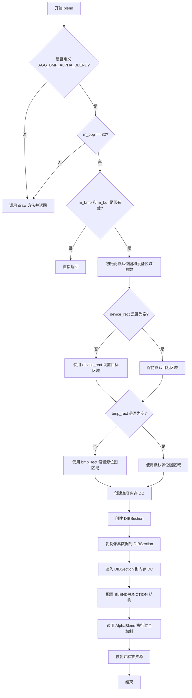

#### 带注释源码

```cpp
//------------------------------------------------------------------------
// 混合绘制函数，支持 Alpha 通道
// h_dc: 目标设备上下文
// device_rect: 目标设备上的绘制区域（可选）
// bmp_rect: 位图源区域（可选）
//------------------------------------------------------------------------
void pixel_map::blend(HDC h_dc, const RECT *device_rect, const RECT *bmp_rect) const
{
#if !defined(AGG_BMP_ALPHA_BLEND)
    // 如果未定义 ALPHA_BLEND 宏，直接回退到普通绘制
    draw(h_dc, device_rect, bmp_rect);
    return;
#else
    // 只有 32 位色深才支持 Alpha 通道，否则回退
    if(m_bpp != 32)
    {
        draw(h_dc, device_rect, bmp_rect);
        return;
    }

    // 检查位图是否有效
    if(m_bmp == 0 || m_buf == 0) return;

    // 初始化位图源区域为完整位图大小
    unsigned bmp_x = 0;
    unsigned bmp_y = 0;
    unsigned bmp_width  = m_bmp->bmiHeader.biWidth;
    unsigned bmp_height = m_bmp->bmiHeader.biHeight;
    
    // 初始化目标区域为完整位图大小
    unsigned dvc_x = 0;
    unsigned dvc_y = 0; 
    unsigned dvc_width  = m_bmp->bmiHeader.biWidth;
    unsigned dvc_height = m_bmp->bmiHeader.biHeight;
    
    // 如果提供了 bmp_rect，则使用其定义源区域
    if(bmp_rect) 
    {
        bmp_x      = bmp_rect->left;
        bmp_y      = bmp_rect->top;
        bmp_width  = bmp_rect->right  - bmp_rect->left;
        bmp_height = bmp_rect->bottom - bmp_rect->top;
    } 

    // 默认目标区域等于源区域
    dvc_x      = bmp_x;
    dvc_y      = bmp_y;
    dvc_width  = bmp_width;
    dvc_height = bmp_height;

    // 如果提供了 device_rect，则使用其定义目标区域
    if(device_rect) 
    {
        dvc_x      = device_rect->left;
        dvc_y      = device_rect->top;
        dvc_width  = device_rect->right  - device_rect->left;
        dvc_height = device_rect->bottom - device_rect->top;
    }

    // 创建与目标 DC 兼容的内存设备上下文
    HDC mem_dc = ::CreateCompatibleDC(h_dc);
    void* buf = 0;
    
    // 创建 DIB Section 用于 Alpha 混合
    HBITMAP bmp = ::CreateDIBSection(
        mem_dc, 
        m_bmp,  
        DIB_RGB_COLORS,
        &buf,
        0,
        0
    );
    
    // 将当前位图数据复制到新创建的 DIB Section
    memcpy(buf, m_buf, m_bmp->bmiHeader.biSizeImage);

    // 将 DIB Section 选入内存 DC
    HBITMAP temp = (HBITMAP)::SelectObject(mem_dc, bmp);

    // 配置 Alpha 混合参数
    BLENDFUNCTION blend;
    blend.BlendOp = AC_SRC_OVER;           // 使用源覆盖模式
    blend.BlendFlags = 0;

#if defined(AC_SRC_ALPHA)
    // 设置 Alpha 格式为源通道包含 Alpha
    blend.AlphaFormat = AC_SRC_ALPHA;
#else 
#error "No appropriate constant for alpha format. Check version of wingdi.h"
#endif

    blend.SourceConstantAlpha = 255;       // 源常量 Alpha 值（完全不透明）
    
    // 执行 Alpha 混合绘制
    ::AlphaBlend(
      h_dc,                                // 目标 DC
      dvc_x,                               // 目标 X 坐标
      dvc_y,                               // 目标 Y 坐标
      dvc_width,                           // 目标宽度
      dvc_height,                          // 目标高度
      mem_dc,                              // 源 DC
      bmp_x,                               // 源 X 坐标
      bmp_y,                               // 源 Y 坐标
      bmp_width,                           // 源宽度
      bmp_height,                          // 源高度
      blend                                // 混合参数
    );

    // 恢复并清理资源
    ::SelectObject(mem_dc, temp);
    ::DeleteObject(bmp);
    ::DeleteObject(mem_dc);
#endif //defined(AGG_BMP_ALPHA_BLEND)
}
```


### `pixel_map.blend(HDC h_dc, int x, int y, double scale)`

该方法是 `pixel_map` 类的混合绘制重载函数，通过给定的缩放比例在指定位置以 Alpha 混合方式绘制位图，内部调用另一个基于 RECT 的 `blend` 重载完成实际绘制工作。

参数：

- `h_dc`：`HDC`，目标设备上下文句柄，指定绘制的目标设备
- `x`：`int`，目标绘制位置的 X 坐标（屏幕坐标）
- `y`：`int`，目标绘制位置的 Y 坐标（屏幕坐标）
- `scale`：`double`，缩放比例，用于计算绘制宽度和高度

返回值：`void`，无返回值

#### 流程图

```mermaid
flowchart TD
    A[开始 blend 方法] --> B{检查 m_bmp 和 m_buf 是否有效}
    B -->|无效| C[直接返回]
    B -->|有效| D[计算缩放后的宽度 width = biWidth * scale]
    E[计算缩放后的高度 height = biHeight * scale] --> D
    D --> F[构建 RECT 结构]
    F --> G[设置 rect.left = x]
    G --> H[设置 rect.top = y]
    H --> I[设置 rect.right = x + width]
    I --> J[设置 rect.bottom = y + height]
    J --> K[调用 blend(h_dc, &rect) 重载方法]
    K --> L[结束]
```

#### 带注释源码

```cpp
//------------------------------------------------------------------------
// 按比例混合绘制位图到指定位置
// 参数:
//   h_dc   - 目标设备上下文句柄
//   x      - 目标绘制位置的 X 坐标
//   y      - 目标绘制位置的 Y 坐标
//   scale  - 缩放比例
//------------------------------------------------------------------------
void pixel_map::blend(HDC h_dc, int x, int y, double scale) const
{
    // 检查位图对象和像素缓冲区是否有效，无效则直接返回
    if(m_bmp == 0 || m_buf == 0) return;

    // 根据缩放比例计算目标绘制宽度
    unsigned width  = unsigned(m_bmp->bmiHeader.biWidth * scale);
    
    // 根据缩放比例计算目标绘制高度
    unsigned height = unsigned(m_bmp->bmiHeader.biHeight * scale);
    
    // 定义目标矩形区域
    RECT rect;
    rect.left   = x;                      // 矩形左上角 X 坐标
    rect.top    = y;                      // 矩形左上角 Y 坐标
    rect.right  = x + width;              // 矩形右下角 X 坐标 = 起始X + 宽度
    rect.bottom = y + height;             // 矩形右下角 Y 坐标 = 起始Y + 高度
    
    // 调用基于 RECT 的 blend 重载方法执行实际混合绘制
    blend(h_dc, &rect);
}
```


### `pixel_map.load_from_bmp`

从文件指针加载BMP图像数据到像素映射对象，解析BMP文件头和信息头，验证文件格式，创建内部位图结构，并管理内存分配。

参数：

- `fd`：`FILE *`，文件指针，指向已打开的BMP文件流

返回值：`bool`，成功加载返回 true，失败返回 false

#### 流程图

```mermaid
flowchart TD
    A[开始 load_from_bmp] --> B[读取 BITMAPFILEHEADER]
    B --> C{bfType == 0x4D42?}
    C -->|否| D[跳转到 bmperr]
    C -->|是| E[计算 bmp_size = bfSize - sizeof BITMAPFILEHEADER]
    E --> F[分配 bmp_size 大小的内存]
    F --> G{读取完整 BMP 数据成功?}
    G -->|否| D
    G -->|是| H[调用 destroy 释放旧资源]
    H --> I[设置 m_bpp = biBitCount]
    I --> J[调用 create_from_bmp 创建位图]
    J --> K[m_is_internal = true]
    K --> L[返回 true]
    D --> M[删除临时分配的 bmi]
    M --> N[返回 false]
```

#### 带注释源码

```cpp
//------------------------------------------------------------------------
// 从文件指针加载BMP图像
//------------------------------------------------------------------------
bool pixel_map::load_from_bmp(FILE *fd)
{
    BITMAPFILEHEADER  bmf;      // BMP文件头结构
    BITMAPINFO       *bmi = 0;  // BMP信息头指针
    unsigned          bmp_size; // BMP数据大小

    // 读取BMP文件头（14字节）
    fread(&bmf, sizeof(bmf), 1, fd);
    
    // 验证BMP文件类型：0x4D42 = 'BM'（小端序）
    if(bmf.bfType != 0x4D42) goto bmperr;

    // 计算BMP数据大小（文件总大小减去文件头）
    bmp_size = bmf.bfSize - sizeof(BITMAPFILEHEADER);

    // 分配足够存储BMP信息头和像素数据的内存
    bmi = (BITMAPINFO*) new unsigned char [bmp_size];
    
    // 读取BMP信息头和像素数据
    if(fread(bmi, 1, bmp_size, fd) != bmp_size) goto bmperr;
    
    // 释放旧的位图数据（如果存在）
    destroy();
    
    // 保存位深度
    m_bpp = bmi->bmiHeader.biBitCount;
    
    // 创建内部位图结构
    create_from_bmp(bmi);
    
    // 标记为由内部分配的内存
    m_is_internal = 1;
    return true;

// 错误处理标签
bmperr:
    // 释放临时分配的内存
    if(bmi) delete [] (unsigned char*) bmi;
    return false;
}
```


### `pixel_map.load_from_bmp(const char *filename)`

该函数是 `pixel_map` 类的公共成员方法，用于从指定的文件路径加载 BMP 格式的图像文件。它内部打开文件、调用文件句柄重载版本执行实际加载逻辑，并确保文件资源正确释放。

参数：

- `filename`：`const char *`，要加载的 BMP 文件的完整路径或相对路径字符串

返回值：`bool`，返回 `true` 表示成功加载 BMP 文件并初始化像素映射；返回 `false` 表示加载失败（文件不存在、格式错误或读取错误）

#### 流程图

```mermaid
flowchart TD
    A[开始 load_from_bmp] --> B[以二进制读取模式打开文件]
    B --> C{文件是否成功打开?}
    C -->|否| D[返回 false]
    C -->|是| E[调用 load_from_bmp&#40;FILE* fd&#41; 执行实际加载]
    E --> F{加载是否成功?}
    F -->|是| G[关闭文件句柄]
    F -->|否| G
    G --> H[返回加载结果]
    
    subgraph "load_from_bmp(FILE*) 内部逻辑"
    E --> I[读取 BITMAPFILEHEADER]
    I --> J{bfType 是否为 0x4D42?}
    J -->|否| K[跳转到错误处理]
    J -->|是| L[计算 BMP 数据大小]
    L --> M[分配内存并读取 BITMAPINFO]
    M --> N[调用 destroy 销毁旧数据]
    N --> O[设置 m_bpp 为 biBitCount]
    O --> P[调用 create_from_bmp 初始化]
    P --> Q[设置 m_is_internal = true]
    Q --> R[返回 true]
    end
```

#### 带注释源码

```cpp
//------------------------------------------------------------------------
// 从指定文件名加载 BMP 图像
// 参数: filename - BMP 文件路径（UTF-8 编码字符串）
// 返回: true 表示成功加载, false 表示失败
//------------------------------------------------------------------------
bool pixel_map::load_from_bmp(const char *filename)
{
    // 以二进制读取模式打开文件 ("rb" = read binary)
    FILE *fd = fopen(filename, "rb");
    
    // 初始化返回值为 false（失败状态）
    bool ret = false;
    
    // 检查文件是否成功打开
    if(fd)
    {
        // 调用重载的 load_from_bmp(FILE*) 执行实际加载逻辑
        ret = load_from_bmp(fd);
        
        // 无论加载成功与否，都需要关闭文件句柄以释放资源
        fclose(fd);
    }
    
    // 返回加载结果（成功为 true，失败为 false）
    return ret;
}

//------------------------------------------------------------------------
// 内部实现：从已打开的文件句柄加载 BMP 图像
// 参数: fd - 已打开的 FILE 文件指针（必须以二进制模式打开）
// 返回: true 表示成功, false 表示失败
//------------------------------------------------------------------------
bool pixel_map::load_from_bmp(FILE *fd)
{
    // 定义 BMP 文件头结构
    BITMAPFILEHEADER  bmf;
    // 定义 BMP 信息头指针（初始为 nullptr）
    BITMAPINFO       *bmi = 0;
    // BMP 数据大小
    unsigned          bmp_size;

    // 从文件读取 BMP 文件头（14 字节）
    fread(&bmf, sizeof(bmf), 1, fd);
    
    // 验证 BMP 文件标识（"BM" = 0x4D42）
    // 如果不是有效的 BMP 文件，跳转到错误处理标签
    if(bmf.bfType != 0x4D42) goto bmperr;

    // 计算 BMP 数据大小（文件总大小减去文件头大小）
    bmp_size = bmf.bfSize - sizeof(BITMAPFILEHEADER);

    // 为 BITMAPINFO 分配内存（包含信息头、调色板和像素数据）
    bmi = (BITMAPINFO*) new unsigned char [bmp_size];
    
    // 读取 BMP 信息头和像素数据
    // 读取字节数必须等于 bmp_size，否则视为读取失败
    if(fread(bmi, 1, bmp_size, fd) != bmp_size) goto bmperr;
    
    // 销毁现有的位图数据（如果有）
    // 释放旧内存、复位内部标志
    destroy();
    
    // 从 BMP 信息头中获取位深度（如 8、24、32 等）
    m_bpp = bmi->bmiHeader.biBitCount;
    
    // 根据读取的 BMP 信息创建像素映射
    // 内部设置 m_bmp、m_buf、m_img_size、m_full_size
    create_from_bmp(bmi);
    
    // 标记 BMP 数据由内部分配（析构时需手动释放）
    m_is_internal = 1;
    
    // 成功加载，返回 true
    return true;

// 错误处理标签：释放已分配内存并返回 false
bmperr:
    if(bmi) delete [] (unsigned char*) bmi;
    return false;
}
```

---

**补充说明**：
- 该方法依赖文件系统的 `fopen`/`fclose`/`fread` C 标准库函数
- 内部调用 `create_from_bmp()` 设置成员变量 `m_bmp`、`m_buf`、`m_img_size`、`m_full_size`
- 错误处理使用 `goto` 语句跳转到 `bmperr` 标签，这是早期 C++ 代码的常见模式
- 加载成功后，像素数据存储在 `m_buf` 中，可通过 `buf()` 方法获取原始指针


### `pixel_map.save_as_bmp`

将像素图数据保存为BMP格式到给定的文件指针中。该函数首先检查像素图是否有效，然后构造BMP文件头和位图信息，最后将数据写入文件。

参数：

- `fd`：`FILE *`，文件指针，指向已打开的BMP文件用于写入数据

返回值：`bool`，表示是否成功保存BMP文件。成功返回true，失败返回false

#### 流程图

```mermaid
flowchart TD
    A[开始] --> B{m_bmp是否为nullptr?}
    B -->|是| C[返回false]
    B -->|否| D[创建BITMAPFILEHEADER]
    D --> E[设置bfType为0x4D42]
    E --> F[计算bfOffBits = calc_header_size + sizeof BITMAPFILEHEADER]
    F --> G[计算bfSize = bfOffBits + m_img_size]
    G --> H[设置bfReserved1和bfReserved2为0]
    H --> I[使用fwrite写入BITMAPFILEHEADER]
    I --> J[使用fwrite写入m_bmp数据]
    J --> K[返回true]
```

#### 带注释源码

```cpp
//------------------------------------------------------------------------
// 保存像素图为BMP格式到文件指针
//------------------------------------------------------------------------
bool pixel_map::save_as_bmp(FILE *fd) const
{
    // 检查像素图是否有效，如果无效则返回false
    if(m_bmp == 0) return 0;

    // 定义BMP文件头结构
    BITMAPFILEHEADER bmf;

    // 设置BMP文件标识符 'BM' (0x4D42)
    bmf.bfType      = 0x4D42;
    // 计算数据偏移量：BMP头大小 + 位图文件头大小
    bmf.bfOffBits   = calc_header_size(m_bmp) + sizeof(bmf);
    // 计算总文件大小：偏移量 + 图像数据大小
    bmf.bfSize      = bmf.bfOffBits + m_img_size;
    // 保留字段，初始化为0
    bmf.bfReserved1 = 0;
    bmf.bfReserved2 = 0;

    // 将BMP文件头写入文件
    fwrite(&bmf, sizeof(bmf), 1, fd);
    // 将完整的位图信息（包括头、颜色表、像素数据）写入文件
    fwrite(m_bmp, m_full_size, 1, fd);
    
    // 成功保存，返回true
    return true;
}
```


### `pixel_map.save_as_bmp`

将像素图保存为BMP格式文件

参数：

- `filename`：`const char*`，要保存的BMP文件路径

返回值：`bool`，表示是否成功保存文件

#### 流程图

```mermaid
flowchart TD
    A[开始 save_as_bmp] --> B[以二进制写模式打开文件 filename]
    B --> C{文件是否成功打开?}
    C -->|是| D[调用 save_as_bmp fd 保存到文件句柄]
    D --> E[关闭文件句柄]
    E --> F[返回保存结果]
    C -->|否| G[返回 false]
    F --> G
    G --> H[结束]
```

#### 带注释源码

```cpp
//------------------------------------------------------------------------
// 将像素图保存为BMP文件
//------------------------------------------------------------------------
bool pixel_map::save_as_bmp(const char *filename) const
{
    // 以二进制写入模式打开文件
    FILE *fd = fopen(filename, "wb");
    // 初始化返回值为 false
    bool ret = false;
    // 检查文件是否成功打开
    if(fd)
    {
        // 调用重载的 save_as_bmp(FILE*) 方法写入 BMP 数据
        ret = save_as_bmp(fd);
        // 关闭文件句柄
        fclose(fd);
    }
    // 返回操作结果（成功为 true，失败为 false）
    return ret;
}
```


### `pixel_map.buf()`

获取像素缓冲区指针，用于直接访问底层像素数据

参数：

- （无）

返回值：`unsigned char*`，指向像素数据缓冲区的指针

#### 流程图

```mermaid
graph TD
    A[开始] --> B{检查 m_buf 是否存在}
    B -->|是| C[返回 m_buf 指针]
    B -->|否| D[返回 nullptr]
    C --> E[结束]
    D --> E
```

#### 带注释源码

```cpp
//------------------------------------------------------------------------
// 获取像素缓冲区指针
// 用于直接访问和操作像素数据
//------------------------------------------------------------------------
unsigned char* pixel_map::buf()
{
    // 返回内部维护的像素缓冲区指针
    // 调用者可以使用此指针进行直接的像素读写操作
    // 注意：在调用 create 方法后 buf 才会返回有效指针
    return m_buf;
}
```


### `pixel_map.width`

获取位图对象的宽度（像素单位）。

参数：无

返回值：`unsigned`，返回位图的宽度，以像素为单位。

#### 流程图

```mermaid
flowchart TD
    A[开始] --> B{检查m_bmp是否为空}
    B -->|是| C[返回0或未定义行为]
    B -->|否| D[读取m_bmp->bmiHeader.biWidth]
    D --> E[返回宽度值]
    E --> F[结束]
```

*注：由于该方法为 const 方法且实现简单，常规流程为直接返回 m_bmp->bmiHeader.biWidth。上图仅为逻辑流程展示。*

#### 带注释源码

```cpp
//------------------------------------------------------------------------
// 返回位图的宽度（以像素为单位）
//------------------------------------------------------------------------
unsigned pixel_map::width() const
{
    // 直接从 BMP 信息头中获取宽度值并返回
    // m_bmp 指向 BITMAPINFO 结构体
    // bmiHeader.biWidth 存储了位图的宽度
    return m_bmp->bmiHeader.biWidth;
}
```


### `pixel_map.height()`

获取位图的高度（以像素为单位）。该函数是一个常量成员函数，直接从关联的 Windows `BITMAPINFO` 结构中读取 `biHeight` 字段。

参数：  
无（该方法不接受任何显式参数）

返回值：`unsigned`，返回位图的高度（以像素为单位）。如果位图未正确创建（`m_bmp` 为空），此操作可能导致未定义行为（通常为程序崩溃）。

#### 流程图

```mermaid
graph TD
    A([开始执行 height]) --> B{检查 m_bmp 状态}
    %% 注意：实际代码中并未显式检查 m_bmp 是否为空，
    %% 此处展示逻辑流程与潜在风险。
    B -- m_bmp 有效 --> C[读取 m_bmp->bmiHeader.biHeight]
    C --> D([返回高度值])
    B -- m_bmp 为空 --> E([导致访问违例/程序崩溃])
```

#### 带注释源码

```cpp
    //------------------------------------------------------------------------
    // 获取位图高度
    // 返回值: unsigned int 位图高度
    //------------------------------------------------------------------------
    unsigned pixel_map::height() const
    {
        // 直接解引用 m_bmp 指针以获取 BITMAPINFOHEADER 中的高度字段。
        // 警告：此方法未检查 m_bmp 是否为 NULL。
        // 调用者应确保在调用此方法前，像素图已通过 create() 或 load_from_bmp() 成功初始化。
        return m_bmp->bmiHeader.biHeight;
    }
```


### `pixel_map.stride()`

获取像素Map的行跨度（每行像素占用的字节长度），用于计算图像在内存中相邻两行之间的字节偏移量。

参数：

- （无参数）

返回值：`int`，返回图像每行占用的字节数（行跨度），该值经过4字节对齐处理。

#### 流程图

```mermaid
flowchart TD
    A[开始 stride] --> B[获取位图宽度 m_bmp->bmiHeader.biWidth]
    B --> C[获取位深度 m_bmp->bmiHeader.biBitCount]
    C --> D[调用 calc_row_len 计算行长度]
    D --> E[返回行跨度值]
    E --> F[结束]
    
    D --> D1[根据位深度计算原始行字节数]
    D1 --> D2[1位色: 8像素=1字节]
    D1 --> D3[4位色: 2像素=1字节]
    D1 --> D4[8位色: 1像素=1字节]
    D1 --> D5[16位色: 1像素=2字节]
    D1 --> D6[24位色: 1像素=3字节]
    D1 --> D7[32位色: 1像素=4字节]
    D2 --> D8[结果进行4字节对齐]
    D3 --> D8
    D4 --> D8
    D5 --> D8
    D6 --> D8
    D7 --> D8
```

#### 带注释源码

```cpp
    //------------------------------------------------------------------------
    // 获取行跨度（行字节长度）
    // 说明：返回图像中相邻两行像素之间的字节偏移量，用于内存中图像数据的遍历
    // 注意：返回值已经过4字节对齐处理
    //------------------------------------------------------------------------
    int pixel_map::stride() const
    {
        // 调用静态方法 calc_row_len 计算行长度
        // 参数1: 位图宽度 (像素数)
        // 参数2: 位深度 (每像素位数，如8、24、32等)
        // 返回值: 经过4字节对齐后的行字节数
        return calc_row_len(m_bmp->bmiHeader.biWidth, 
                            m_bmp->bmiHeader.biBitCount);
    }
```

#### 相关联的 `calc_row_len` 方法源码

```cpp
    //------------------------------------------------------------------------
    // 计算行长度（静态方法）
    // 根据宽度和位深度计算一行像素占用的字节数，并进行4字节对齐
    //------------------------------------------------------------------------
    unsigned pixel_map::calc_row_len(unsigned width, unsigned bits_per_pixel)
    {
        unsigned n = width;
        unsigned k;

        switch(bits_per_pixel)
        {
            case  1: k = n;                              // 保存原始宽度
                     n = n >> 3;                         // 8像素=1字节
                     if(k & 7) n++;                      // 不足1字节按1字节计
                     break;

            case  4: k = n;                              // 保存原始宽度
                     n = n >> 1;                         // 2像素=1字节
                     if(k & 3) n++;                      // 不足1字节按1字节计
                     break;

            case  8:                                     // 1像素=1字节
                     break;

            case 16: n *= 2;                             // 1像素=2字节
                     break;

            case 24: n *= 3;                            // 1像素=3字节
                     break;

            case 32: n *= 4;                            // 1像素=4字节
                     break;

            case 48: n *= 6;                            // 1像素=6字节
                     break;

            case 64: n *= 8;                            // 1像素=8字节
                     break;

            case 96: n *= 12;                          // 1像素=12字节
                     break;

            case 128: n *= 16;                          // 1像素=16字节
                     break;

            default: n = 0;                             // 不支持的位深度
                     break;
        }
        // 4字节对齐：(n + 3) / 4 * 4 等价于 (n + 3) >> 2 << 2
        return ((n + 3) >> 2) << 2;
    }
```

#### 使用场景说明

该方法主要用于：
1. **图像遍历**：在遍历图像像素时，需要根据stride而非width来计算下一行的起始位置
2. **内存操作**：在进行memcpy等内存操作时，需要使用stride作为行拷贝的大小
3. **缓冲区访问**：访问非标准位深度的图像数据时，stride提供了正确的内存偏移量


### `pixel_map.create_from_bmp`

该私有方法负责从传入的 `BITMAPINFO` 结构体中提取图像尺寸、计算内存大小，并初始化 `pixel_map` 类的内部状态（包含位图指针、像素缓冲区和内存大小）。

参数：

- `bmp`：`BITMAPINFO*`，指向 Windows BMP 图像信息结构的指针，用于初始化内部状态

返回值：`void`，无直接返回值，但会修改对象的内部成员变量（`m_bmp`、`m_buf`、`m_img_size`、`m_full_size`）

#### 流程图

```mermaid
flowchart TD
    A[开始 create_from_bmp] --> B{检查 bmp 是否为空}
    B -->|是| C[直接返回，不做任何操作]
    B -->|否| D[计算图像行长度: calc_row_len]
    D --> E[计算图像内存大小: m_img_size = 行长度 × 高度]
    F[计算完整大小: m_full_size = calc_full_size] --> G[保存位图指针: m_bmp = bmp]
    G --> H[计算图像数据指针: m_buf = calc_img_ptr]
    E --> F
    H --> I[结束]
```

#### 带注释源码

```cpp
//------------------------------------------------------------------------
// private 成员函数：从 BITMAPINFO 结构初始化内部状态
//------------------------------------------------------------------------
void pixel_map::create_from_bmp(BITMAPINFO *bmp)
{
    // 检查传入的 BITMAPINFO 指针是否有效
    if(bmp)
    {
        // 计算并保存图像内存大小：行长度 × 高度
        // 使用 calc_row_len 确保行对齐到 4 字节边界
        m_img_size  = calc_row_len(bmp->bmiHeader.biWidth, 
                                   bmp->bmiHeader.biBitCount) * 
                      bmp->bmiHeader.biHeight;

        // 计算并保存完整位图大小（包含头信息、调色板和图像数据）
        m_full_size = calc_full_size(bmp);
        
        // 保存传入的 BITMAPINFO 指针到成员变量
        m_bmp       = bmp;
        
        // 计算并保存图像数据起始指针（跳过头信息和调色板）
        m_buf       = calc_img_ptr(bmp);
    }
}
```


### `pixel_map.create_dib_section_from_args`

私有方法，用于根据指定的宽度、高度和位深度创建Windows DIB Section，并初始化内部位图结构和管理缓冲区。

参数：
- `h_dc`：`HDC`，设备上下文句柄，传递给Windows API用于创建DIB Section。
- `width`：`unsigned int`，要创建的位图宽度（像素）。
- `height`：`unsigned int`，要创建的位图高度（像素）。
- `bits_per_pixel`：`unsigned int`，每个像素的位数（如8、24、32等）。

返回值：`HBITMAP`，成功返回创建的DIB Section句柄，失败返回NULL。

#### 流程图

```mermaid
flowchart TD
    A[开始] --> B[计算行长度: line_len = calc_row_len width, bits_per_pixel]
    B --> C[计算图像大小: img_size = line_len * height]
    C --> D[计算调色板大小: rgb_size = calc_palette_size 0, bits_per_pixel * sizeofRGBQUAD]
    D --> E[计算总大小: full_size = sizeofBITMAPINFOHEADER + rgb_size]
    E --> F[分配内存: new unsigned charfull_size 并转换为BITMAPINFO]
    F --> G[初始化BITMAPINFOHEADER结构体字段]
    G --> H[调用Windows API CreateDIBSection创建DIB Section]
    H --> I{img_ptr是否有效?}
    I -->|是| J[设置成员变量: m_img_size, m_bmp, m_buf]
    I -->|否| K[不设置成员变量, 保留原值]
    J --> L[返回h_bitmap句柄]
    K --> L
```

#### 带注释源码

```cpp
//private
//------------------------------------------------------------------------
HBITMAP pixel_map::create_dib_section_from_args(HDC h_dc,
                                                unsigned width, 
                                                unsigned height, 
                                                unsigned bits_per_pixel)
{
    // 计算位图每行的字节长度，对齐到4字节边界
    unsigned line_len  = calc_row_len(width, bits_per_pixel);
    // 计算图像数据总大小：行长度 * 高度
    unsigned img_size  = line_len * height;
    // 计算调色板RGB数据大小：调色板条目数 * RGBQUAD结构大小
    unsigned rgb_size  = calc_palette_size(0, bits_per_pixel) * sizeof(RGBQUAD);
    // 计算BITMAPINFO结构总大小：头部 + 调色板
    unsigned full_size = sizeof(BITMAPINFOHEADER) + rgb_size;
    
    // 为BITMAPINFO结构分配内存（注意：这里没有分配图像数据内存，图像数据由DIB Section管理）
    BITMAPINFO *bmp = (BITMAPINFO *) new unsigned char[full_size];
    
    // 初始化BITMAPINFOHEADER结构
    bmp->bmiHeader.biSize   = sizeof(BITMAPINFOHEADER);
    bmp->bmiHeader.biWidth  = width;
    bmp->bmiHeader.biHeight = height;
    bmp->bmiHeader.biPlanes = 1;
    bmp->bmiHeader.biBitCount = (unsigned short)bits_per_pixel;
    bmp->bmiHeader.biCompression = 0; // BI_RGB
    bmp->bmiHeader.biSizeImage = img_size;
    bmp->bmiHeader.biXPelsPerMeter = 0;
    bmp->bmiHeader.biYPelsPerMeter = 0;
    bmp->bmiHeader.biClrUsed = 0;
    bmp->bmiHeader.biClrImportant = 0;
    
    // 指向图像数据的指针，由CreateDIBSection填充
    void*   img_ptr  = 0;
    // 调用Windows API创建DIB Section，获取位图句柄
    HBITMAP h_bitmap = ::CreateDIBSection(h_dc, bmp, DIB_RGB_COLORS, &img_ptr, NULL, 0);
    
    // 如果创建成功（img_ptr不为空），则初始化成员变量
    if(img_ptr)
    {
        // 重新计算图像大小（与上面相同，但为确保一致性）
        m_img_size  = calc_row_len(width, bits_per_pixel) * height;
        m_full_size = 0; // DIB Section由系统管理内存，full_size设为0
        m_bmp       = bmp; // 保存BITMAPINFO指针
        m_buf       = (unsigned char *) img_ptr; // 保存图像数据指针
    }
    
    // 返回创建的DIB Section句柄，供调用者使用
    return h_bitmap;
}
```

## 关键组件


### pixel_map 类

AGG 库中的核心位图管理类，负责 Windows DIB（设备独立位图）的创建、内存管理、绘制和文件 I/O 操作。

### 内存管理机制

包含 create()、destroy() 和 create_from_bmp() 方法，负责位图内存的分配与释放，通过 m_is_internal 标志区分内部分配和外部附加的位图资源。

### 位图创建工厂

create_bitmap_info() 和 create_dib_section_from_args() 静态方法分别创建内存位图和 DIB Section，支持不同位深（1-128位）的位图创建。

### 调色板管理

create_gray_scale_palette() 为位图生成灰度调色板，calc_palette_size() 计算所需的调色板条目数。

### 图像绘制引擎

draw() 方法支持普通位图绘制和缩放绘制，blend() 方法在 AGG_BMP_ALPHA_BLEND 宏定义下支持 alpha 通道混合绘制。

### 文件 I/O 操作

load_from_bmp() 和 save_as_bmp() 方法支持 BMP 格式图像的加载与保存，包括文件头和位图数据的读写。

### 尺寸计算工具

calc_full_size()、calc_header_size()、calc_row_len() 等静态方法计算位图各部分大小和行跨度，确保正确的内存布局。

### 访问器方法

width()、height()、stride()、buf() 等方法提供位图基本属性的只读访问。


## 问题及建议


### 已知问题

- **内存管理缺陷**：`create_dib_section_from_args`函数中创建了`BITMAPINFO`结构体，但函数返回后调用者无法获取该指针进行释放，存在内存泄漏风险；`m_full_size`在DIB Section模式下被设为0，导致`destroy()`函数无法正确释放资源
- **错误处理不完善**：`load_from_bmp`中使用`fread`读取数据但未检查返回值是否与预期读取量匹配；`create_bitmap_info`和`create_dib_section_from_args`使用`new`分配内存但缺少异常捕获机制
- **代码重复**：多个成员函数存在大量重复代码逻辑，如`create`与`create_dib_section`、`draw`的两个重载函数、`blend`的两个重载函数、`save_as_bmp`和`load_from_bmp`的FILE*和const char*版本
- **类型安全隐患**：多处使用C风格强制类型转换（如`(unsigned char*)m_bmp`、`(BITMAPINFO *) new unsigned char`），且`memcpy`在`blend`函数中直接使用`biSizeImage`作为拷贝大小，未验证`m_buf`的有效性
- **参数校验缺失**：`create`和`create_dib_section`函数对`org`（颜色深度）参数未做合法性校验，可能导致后续计算错误
- **API使用不当**：`create_dib_section_from_args`中`CreateDIBSection`最后一个参数设为0应为`DDS_DIRECT`，且未处理函数调用失败返回NULL的情况
- **资源泄漏风险**：`blend`函数中创建GDI对象（mem_dc、bmp）后，即使发生异常也可能在某些代码路径下无法正确释放
- **边界条件处理**：`calc_palette_size`函数当`rgb_size`为0时（`bits_per_pixel`大于8），除法操作`(255 * i) / (rgb_size - 1)`会导致除零错误

### 优化建议

- 重构内存管理逻辑，统一使用智能指针或RAII模式管理BITMAPINFO生命周期，确保所有分配的资源都能被正确释放
- 为所有文件操作添加错误检查和异常处理机制，使用`if(fread(...) != ...)`验证读取完整性
- 提取公共逻辑到私有辅助函数中，消除`create`/`create_dib_section`、`draw`/`blend`等函数中的重复代码
- 用`static_cast`、`reinterpret_cast`等C++类型转换替代C风格转换，提高类型安全
- 添加参数有效性验证，在函数入口处检查`org`参数是否在合理范围内（如1、4、8、16、24、32、48、64、96、128）
- 修复`create_dib_section_from_args`中`m_full_size`的赋值逻辑，应记录实际分配的BITMAPINFO大小以便后续释放
- 为`blend`函数添加异常安全保证，使用RAII包装GDI对象或使用`try-finally`结构确保资源释放
- 在`create_gray_scale_palette`中添加`rgb_size`为0的防护检查，避免除零错误
- 考虑将Win32平台相关代码抽象为独立层，提高代码的可移植性和可测试性


## 其它


### 设计目标与约束

该代码的主要设计目标是提供一个跨平台的BMP图像像素图管理类，支持Windows平台下的BMP图像创建、加载、保存和渲染操作。核心约束包括：仅支持Windows平台（使用了Win32 API），支持多种像素深度（1/4/8/16/24/32/48/64/96/128 bpp），内部管理内存分配与释放，提供基本的图像渲染能力。

### 错误处理与异常设计

代码采用传统的C风格错误处理方式：不抛出异常，而是通过返回bool值表示操作成功与否。load_from_bmp和save_as_bmp方法返回true表示成功，false表示失败。关键操作如文件读写、内存分配失败时返回nullptr或false。destroy方法在析构时安全处理空指针。错误场景包括：文件打开失败、文件格式错误（BMP文件头验证）、内存分配失败、无效的BMP对象操作等。

### 数据流与状态机

pixel_map对象有以下状态：空状态（m_bmp=null, m_buf=null）、有效状态（m_bmp和m_buf均非空）、内部管理状态（m_is_internal=true表示对象自身负责内存释放）、外部附件状态（m_is_internal=false表示BMP数据由外部管理）。状态转换通过以下方法触发：create()创建内部BMP并进入内部管理状态，attach_to_bmp()附加外部BMP进入外部管理状态，destroy()释放内存回到空状态，load_from_bmp()从文件加载进入内部管理状态。

### 外部依赖与接口契约

主要外部依赖包括：Win32 API（HBITMAP, HDC, CreateDIBSection, StretchDIBits等）、C标准库（FILE, fopen, fread, fwrite, memset, memcpy）、AGG库基础组件（agg::org_e枚举）。接口契约方面：create()方法要求width和height为有效值（若为0则默认为1），clear_val参数必须在0-255范围内，draw()和blend()方法要求m_bmp和m_buf均非空，calc_full_size()和calc_header_size()等静态方法接受nullptr但返回0。

### 线程安全性考虑

该类是非线程安全的。m_bmp、m_buf、m_is_internal等成员变量在多线程环境下直接访问可能导致数据竞争。如果需要在多线程环境使用，建议在外部进行同步控制，或者为每个线程创建独立的pixel_map实例。

### 内存管理策略

内存管理采用单一所有权模式：m_is_internal标志决定内存所有权归属。内部创建（create、load_from_bmp）时设置m_is_internal=true，析构或destroy时释放；外部附加（attach_to_bmp）时设置m_is_internal=false，不负责释放。BMP内存布局遵循Windows BMP格式：BITMAPINFOHEADER + RGBQUAD调色板 + 像素数据。create_bitmap_info()一次性分配完整内存块，create_dib_section()使用DIBSection创建可绘制位图。

### 平台特定实现

该代码明确依赖Windows平台：使用Win32 API函数（CreateDIBSection, SetStretchBltMode, StretchDIBits, SetDIBitsToDevice, AlphaBlend, CreateCompatibleDC），使用Windows数据类型（HBITMAP, HDC, BITMAPINFO, BITMAPINFOHEADER, RGBQUAD, RECT, BLENDFUNCTION），使用Windows常量（DIB_RGB_COLORS, SRCCOPY, AC_SRC_OVER, AC_SRC_ALPHA）。代码通过#if defined(AGG_BMP_ALPHA_BLEND)条件编译开关控制是否启用alpha混合功能。

### 性能考虑与优化空间

性能热点包括：draw()方法中根据是否需要缩放选择StretchDIBits或SetDIBitsToDevice；blend()方法中每次调用都创建和销毁内存DC和DIBSection，频繁调用时可考虑缓存；memset用于清零图像区域，大图像时可能影响性能。优化空间：blend()方法的DC和DIBSection可以缓存复用；可以添加内存池管理避免频繁小内存分配；可以添加图像数据直接访问接口减少内存拷贝。

### 测试策略建议

应测试的关键场景包括：创建各种像素深度的图像（1/4/8/16/24/32 bpp），加载正确和损坏的BMP文件，保存和重新加载图像数据完整性，渲染到不同尺寸的设备上下文，alpha混合功能（32bpp图像），边界条件（width=0, height=0, clear_val边界值），内存泄漏检测（多次创建/销毁循环），多线程并发访问场景。

    