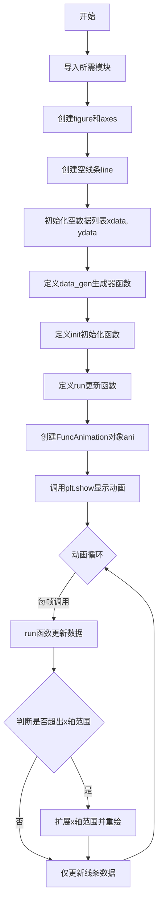
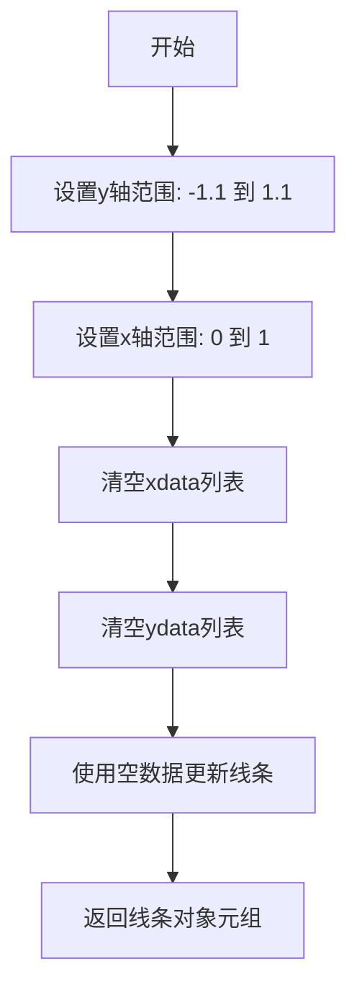

# `matplotlib\galleries\examples\animation\animate_decay.py` 详细设计文档

这是一个matplotlib动画示例，展示如何使用生成器驱动动画并在动画过程中动态调整坐标轴范围，模拟一个衰减的正弦波信号的可视化过程。

## 整体流程



## 类结构

```
Python内置模块
├── itertools (itertools.count)
├── matplotlib.pyplot (plt.subplots, plt.show)
├── numpy (np.sin, np.pi, np.exp)
└── matplotlib.animation (animation.FuncAnimation)

用户定义函数 (无自定义类)
├── data_gen (生成器函数)
├── init (初始化函数)
└── run (动画更新函数)
```

## 全局变量及字段


### `fig`
    
matplotlib Figure对象，图形容器

类型：`matplotlib.figure.Figure`
    


### `ax`
    
matplotlib Axes对象，坐标轴

类型：`matplotlib.axes.Axes`
    


### `line`
    
matplotlib Line2D对象，绘制的曲线

类型：`matplotlib.lines.Line2D`
    


### `xdata`
    
存储x轴数据点

类型：`list`
    


### `ydata`
    
存储y轴数据点

类型：`list`
    


### `ani`
    
FuncAnimation对象，动画控制器

类型：`matplotlib.animation.FuncAnimation`
    


    

## 全局函数及方法


### `data_gen`

该函数是一个无限迭代的生成器函数，用于生成时间序列 `t` 和对应的衰减正弦波值 `y`，驱动 Matplotlib 动画的实时更新。

参数：无

返回值：`tuple[float, float]`，返回当前时间点 `t` 和对应的衰减正弦波计算结果 `y` 组成的元组

#### 流程图

```mermaid
flowchart TD
    A([开始]) --> B[启动 itertools.count 无限计数器]
    B --> C[获取计数器当前值 cnt]
    C --> D[计算时间: t = cnt / 10]
    E[计算衰减正弦波: y = sin(2πt) × e^(-t/10)]
    D --> E
    E --> F[yield 返回元组 (t, y)]
    F --> C
```

#### 带注释源码

```python
def data_gen():
    """
    生成器函数，生成时间 t 和对应的衰减正弦波值
    
    该函数是一个无限迭代器，用于驱动动画的每一帧更新
    """
    # 使用 itertools.count() 创建无限计数器，从 0 开始递增
    for cnt in itertools.count():
        # 计算时间值：cnt 除以 10，转换为秒（动画帧率假设为 10fps）
        t = cnt / 10
        # 生成衰减正弦波：
        # - np.sin(2*np.pi*t): 周期为 1 的正弦波
        # - np.exp(-t/10): 指数衰减因子，10秒衰减到 1/e
        yield t, np.sin(2*np.pi*t) * np.exp(-t/10.)
```


### `init`

描述：初始化函数，用于在动画开始前重置坐标轴范围（y轴-1.1到1.1，x轴0到1）并清空数据列表，同时将线条数据重置为空，准备动画的初始状态。

参数：无

返回值：`tuple`，返回包含线条对象的元组，用于动画更新时重置线条。

#### 流程图



#### 带注释源码

```python
def init():
    """
    初始化函数，用于重置坐标轴和数据，准备动画初始帧。
    """
    ax.set_ylim(-1.1, 1.1)  # 设置y轴显示范围为-1.1到1.1
    ax.set_xlim(0, 1)       # 设置x轴显示范围为0到1
    del xdata[:]            # 清空x轴数据列表
    del ydata[:]            # 清空y轴数据列表
    line.set_data(xdata, ydata)  # 使用空数据更新线条对象
    return line,            # 返回线条对象元组，供动画框架使用
```


### `run`

该函数是动画的核心更新函数，每帧被调用以更新线条数据和动态调整坐标轴范围，确保数据点在可视化过程中始终保持在视图内。

参数：

-  `data`：`tuple`，来自生成器 `data_gen()` 的元组 `(t, y)`，其中 `t` 为时间值，`y` 为对应的正弦衰减值

返回值：`tuple`，返回包含 `line` 对象的元组，用于 `FuncAnimation` 的帧更新

#### 流程图

```mermaid
flowchart TD
    A[开始: run 函数] --> B[解包数据: t, y = data]
    B --> C[追加数据: xdata.append<br/>ydata.append]
    C --> D[获取X轴范围: xmin, xmax = ax.get_xlim]
    D --> E{判断: t >= xmax?}
    E -->|是| F[扩大X轴范围: ax.set_xlim<br/>ax.figure.canvas.draw]
    E -->|否| G[跳过范围更新]
    F --> H[更新线条数据: line.set_data]
    G --> H
    H --> I[返回: (line,)]
    I --> J[结束]
```

#### 带注释源码

```python
def run(data):
    """
    动画每帧调用的更新函数
    
    参数:
        data: tuple, 来自生成器的 (t, y) 元组
              t: float, 时间值
              y: float, 对应的函数值 (正弦衰减)
    
    返回:
        tuple: 包含更新后的线条对象，用于动画渲染
    """
    # 从数据元组中解包时间 t 和对应的 y 值
    t, y = data
    
    # 将新数据点追加到数据列表中
    xdata.append(t)   # 存储时间序列
    ydata.append(y)  # 存储对应的函数值
    
    # 获取当前 axes 的 X 轴范围
    xmin, xmax = ax.get_xlim()
    
    # 检查当前时间点是否超出 X 轴最大范围
    if t >= xmax:
        # 动态扩展 X 轴范围为当前范围的 2 倍
        ax.set_xlim(xmin, 2*xmax)
        # 强制重绘 canvas 以更新显示
        ax.figure.canvas.draw()
    
    # 使用更新后的数据重新绘制线条
    line.set_data(xdata, ydata)
    
    # 返回线条对象元组，供 FuncAnimation 更新帧使用
    return line,
```


## 关键组件


### data_gen

生成器函数，用于持续产生动画所需的时间序列数据和对应的衰减正弦波值，每帧调用时递增时间参数并计算新的数据点。

### init

动画初始化函数，设置坐标轴的初始范围，清空数据缓冲区，并将线条数据重置为空，准备开始动画。

### run

动画帧更新函数，接收生成器产生的数据，更新x和y数据列表，当时间超出当前x轴范围时自动扩展坐标轴范围并重绘画布。

### xdata, ydata

全局列表变量，用于存储动画过程中积累的x轴（时间）和y轴（衰减正弦值）数据点。

### fig, ax

全局变量，分别表示matplotlib的Figure对象和Axes对象，是动画绑定的图形和坐标轴容器。

### line

全局变量，表示Axes对象上绘制的线条对象，通过set_data方法更新数据以实现动画效果。

### ani

全局变量，表示FuncAnimation动画对象，负责管理动画的帧更新、计时器和保存功能。

### animation.FuncAnimation

matplotlib动画类，接收图形、回调函数、生成器和配置参数，创建并控制动画的播放逻辑。


## 问题及建议


### 已知问题

-   **全局变量滥用**：`xdata`, `ydata`, `fig`, `ax`, `line` 均定义为全局变量，`init()` 和 `run()` 函数依赖这些外部状态，导致代码耦合度高，难以测试和复用
-   **变量引用顺序问题**：`init()` 函数使用了在其后定义的 `ax` 和 `line` 变量，虽然Python闭包机制使其能运行，但这种模式容易造成混淆和潜在的运行时错误
-   **内存泄漏风险**：`xdata` 和 `ydata` 列表无限增长，长期运行的动画会导致内存持续占用，最终可能导致系统资源耗尽
-   **硬编码配置**：动画参数如 `interval=100`、`save_count=100`、x轴初始范围等均为硬编码，缺乏灵活配置
-   **缺少错误处理**：对 `data_gen` 生成的数据没有验证机制，未对数值计算边界进行保护
-   **函数副作用**：`run()` 函数修改外部列表 `xdata.append()` 和 `ydata.append()`，违反函数式编程原则，使代码行为难以预测
-   **类型注解缺失**：所有函数均无类型注解，降低了代码的可读性和IDE支持
-   **代码组织混乱**：数据生成、初始化、动画更新逻辑混杂在一起，缺乏清晰的职责划分

### 优化建议

-   **封装为类**：将全局变量和函数封装到 `DecayAnimation` 类中，使用实例属性替代全局变量，提高代码内聚性和可测试性
-   **限制数据点数量**：实现数据窗口机制，如使用 `collections.deque` 限制保存的数据点数量，或在达到一定阈值后清除旧数据
-   **配置参数化**：将硬编码参数提取为类属性或配置文件，添加 setter 方法或构造函数参数以提高灵活性
-   **添加类型注解**：为所有函数添加参数和返回值的类型注解，提升代码可维护性
-   **解耦数据生成**：将 `data_gen` 设计为可配置，支持自定义数据生成函数和参数
-   **添加错误处理**：对数据生成和数值计算添加 try-except 异常处理，提高代码健壮性
-   **优化坐标轴更新**：添加 x 轴扩展上限，避免无限扩展；同时考虑根据数据动态调整 y 轴范围
-   **分离关注点**：将数据管理、渲染逻辑、配置管理分离到不同模块或方法中


## 其它


### 设计目标与约束

本示例旨在展示matplotlib动画的两个核心功能：使用生成器驱动动画、以及在动画过程中动态修改坐标轴 limits。设计约束包括：动画需要无限运行但仅保存最近100帧，动画间隔为100毫秒，x轴采用自适应扩展策略（当数据达到当前xmax时将xmax翻倍）。

### 错误处理与异常设计

代码未实现显式的错误处理机制。潜在的异常情况包括：data_gen生成器可能抛出异常导致动画停止；plt.show()在无图形界面环境下会阻塞失败；canvas.draw()在某些后端可能失败。建议在run函数中添加try-except块捕获异常，并考虑添加重连机制或错误日志记录。

### 数据流与状态机

数据流为：data_gen生成器 → FuncAnimation → run回调函数 → 更新xdata/ydata列表 → line.set_data更新图形。状态机包含三个状态：初始化状态（init函数执行）、运行状态（run函数循环执行）、停止状态（关闭图形窗口或达到save_count）。x轴扩展状态由t >= xmax条件触发。

### 外部依赖与接口契约

核心依赖包括：matplotlib.pyplot（图形绑定）、numpy（数学计算）、itertools（计数生成器）、matplotlib.animation（动画引擎）。data_gen生成器契约为返回(t, y)元组，其中t为浮点数时间戳，y为浮点数函数值。run函数契约为接收data元组参数，返回包含line的元组以供blit优化使用。

### 性能考虑

save_count=100限制了内存中保存的帧数，但data_gen会无限生成数据导致xdata/ydata列表持续增长，可能造成内存泄漏。建议定期清理历史数据或使用固定大小的 deque 替代列表。interval=100ms约等于10fps，对于简单线图足够但复杂图形可能需要优化。blit=True可提升渲染效率（本例未启用）。

### 配置与参数说明

FuncAnimation关键参数：fig（图形对象）、run（帧更新回调）、data_gen（数据生成器）、interval=100（帧间隔100ms）、init_func=init（初始化函数）、save_count=100（缓存帧数）。动态x轴扩展阈值为当前xmax，扩展倍数为2倍。

### 使用示例与运行方式

直接运行脚本即可启动交互式动画窗口。导出方式：ani.save('decay.gif', writer='pillow')可保存为GIF；ani.to_jshtml()可生成HTML5动画。headless环境需使用Agg后端：matplotlib.use('Agg')。

### 局限性与适用场景

局限性包括：依赖图形界面后端（Windows/Qt/Agg等）、无限生成数据导致内存持续增长、不支持数据回放。适用场景为实时数据可视化、传感器数据绘图、物理过程模拟演示。不适用于大规模历史数据分析或需要精确帧控制的场景。

    