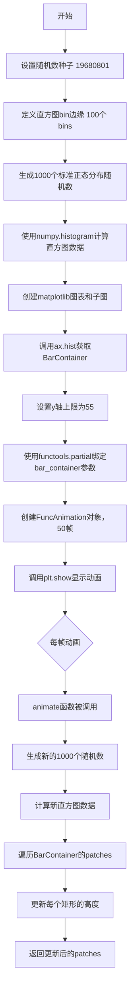

# `matplotlib\galleries\examples\animation\animated_histogram.py` 详细设计文档

这是一个使用matplotlib和numpy实现的动态直方图动画示例，通过生成随机正态分布数据并每帧更新直方图矩形高度来展示数据分布随时间变化的可视化效果。

## 整体流程



## 类结构

```
无类定义（脚本式代码）
主要模块: matplotlib.animation
主要模块: matplotlib.pyplot
主要模块: numpy
```

## 全局变量及字段


### `rng`
    
随机数生成器，用于生成可复现的随机数

类型：`numpy.random.Generator`
    


### `HIST_BINS`
    
直方图的bin边缘数组，范围从-4到4，共100个

类型：`numpy.ndarray`
    


### `data`
    
初始生成的1000个标准正态分布随机数

类型：`numpy.ndarray`
    


### `n`
    
直方图每个bin的计数数组

类型：`numpy.ndarray`
    


### `fig`
    
matplotlib图形对象

类型：`matplotlib.figure.Figure`
    


### `ax`
    
matplotlib坐标轴对象

类型：`matplotlib.axes.Axes`
    


### `bar_container`
    
包含直方图矩形块的容器

类型：`matplotlib.container.BarContainer`
    


### `anim`
    
绑定bar_container参数的animate函数

类型：`functools.partial`
    


### `ani`
    
动画对象

类型：`matplotlib.animation.FuncAnimation`
    


    

## 全局函数及方法


### `animate`

该函数是直方图动画的核心更新回调。它在每一帧被调用，模拟生成新的随机数据，计算直方图频数，然后遍历并更新 `BarContainer` 中每个矩形补丁的高度，最后返回更新后的补丁集合以供动画渲染使用。

参数：

-  `frame_number`：`int`，由 `FuncAnimation` 传递的当前动画帧序号。
-  `bar_container`：`matplotlib.container.BarContainer`，通过 `functools.partial` 预绑定的直方图矩形容器对象。

返回值：`list[matplotlib.patches.Rectangle]`，返回 `bar_container.patches` 列表。在 `blit=True` 模式下，动画管理器仅重绘此返回的矩形集合以优化性能。

#### 流程图

```mermaid
flowchart TD
    A([函数入口 animate]) --> B[输入: frame_number, bar_container]
    B --> C[生成新数据: rng.standard_normal(1000)]
    C --> D[计算直方图: np.histogram -> n]
    D --> E{遍历 频数n 与 矩形patches}
    E -->|每一步| F[取出当前频数 count 与 矩形 rect]
    F --> G[更新矩形高度: rect.set_height(count)]
    G --> E
    E -->|遍历结束| H[返回 bar_container.patches]
    H --> I([函数结束])
```

#### 带注释源码

```python
def animate(frame_number, bar_container):
    """
    动画更新函数。

    参数:
        frame_number (int): 动画的当前帧数。
        bar_container (BarContainer): 包含直方图矩形补丁的容器。
    """
    # 模拟新数据到达：生成1000个标准正态分布的随机数
    data = rng.standard_normal(1000)
    # 使用预定义的bins计算这一帧数据的直方图频数
    n, _ = np.histogram(data, HIST_BINS)

    # 遍历直方图容器中的每一个矩形补丁
    # 使用 zip 将频数数组 n 和 补丁列表配对
    for count, rect in zip(n, bar_container.patches):
        # 根据新的频数更新矩形的高度
        rect.set_height(count)

    # 返回更新后的补丁列表，这是 blit 模式工作的关键
    return bar_container.patches
```

## 关键组件


### 动画直方图核心功能

使用matplotlib的FuncAnimation和BarContainer实现动态直方图动画，通过周期性生成新的随机数据并更新直方图矩形高度来展示数据分布的变化。

### 随机数据生成器

使用numpy的default_rng创建确定性随机数生成器，生成1000个标准正态分布的随机数用于直方图更新。

### 直方图计算组件

使用numpy.histogram函数计算数据的频数分布，配合固定的bin边界(-4到4，100个区间)进行数据离散化。

### BarContainer矩形容器

matplotlib的BarContainer类实例，包含多个Rectangle patches，用于管理直方图的各个矩形条，支持通过patches属性遍历和更新高度。

### animate动画更新函数

接收frame_number和bar_container参数，生成新随机数据并计算直方图，然后遍历BarContainer中的每个Rectangle patch更新其高度，返回更新的patches列表用于blit优化。

### FuncAnimation动画引擎

matplotlib.animation.FuncAnimation类，创建基于函数的动画，配置50帧、禁用重复、启用blit优化，通过functools.partial固定bar_container参数。

### functools.partial偏函数

用于固定animate函数的bar_container参数，使得FuncAnimation只需要传递frame_number参数，实现参数绑定。


## 问题及建议


### 已知问题

-   **硬编码的魔法数字**: 代码中存在多个硬编码的数值（如1000、50、55、19680801），分散在各处，缺乏统一的配置管理，降低了代码的可维护性和可读性。
-   **重复数据生成逻辑**: `data = rng.standard_normal(1000)` 在全局作用域和 `animate` 函数中重复出现，且样本数量1000未被提取为常量。
-   **缺少类型注解**: 所有函数参数、返回值和全局变量都缺乏类型注解，不利于静态分析和IDE支持。
-   **文档不完整**: `animate` 函数没有文档字符串（docstring），仅依赖注释说明其功能。
-   **资源管理不完善**: 没有显式的资源清理逻辑（如关闭图形、停止动画），可能存在资源泄漏风险。
-   **错误处理缺失**: 没有对输入参数（如 `bar_container` 为 `None`）或 `hist` 返回值进行验证。
-   **动画返回值冗余**: `animate` 函数返回 `bar_container.patches`，当 `blit=True` 时每次调用都会创建新的列表对象，增加内存开销。
-   **配置与逻辑混合**: 数据生成、直方图计算和动画展示逻辑耦合在一起，难以独立测试或复用。

### 优化建议

-   **提取配置常量**: 将样本数量、帧数、y轴限制、随机种子等参数提取为模块级常量或配置类。
-   **添加类型注解**: 为 `animate` 函数的参数和返回值添加类型提示，如 `bar_container: BarContainer`。
-   **完善文档**: 为 `animate` 函数添加完整的docstring，说明参数、返回值和副作用。
-   **优化返回值**: 考虑使用生成器模式或直接修改 `bar_container.patches` 而不复制列表。
-   **添加错误处理**: 对关键操作添加输入验证和异常处理。
-   **分离关注点**: 将数据生成、直方图计算和动画逻辑解耦为独立函数或类，提高可测试性。
-   **考虑上下文管理器**: 使用 `plt.close(fig)` 或在类中实现 `__enter__`/`__exit__` 来管理资源生命周期。
-   **移除不必要的blit**: 在某些后端环境下 `blit=True` 可能导致兼容性问题，如非必要可考虑关闭或提供配置选项。


## 其它


### 设计目标与约束

本代码的设计目标是创建一个动态直方图动画，通过实时生成随机数据并更新直方图矩形高度来可视化数据分布的变化。约束条件包括：使用固定随机种子确保可重现性，动画帧数为50帧，使用blit=True优化渲染性能，直方图bins固定为100个，y轴上限固定为55以确保所有数据可见。

### 错误处理与异常设计

代码在错误处理方面存在不足。当前实现未包含异常捕获机制，主要风险点包括：np.histogram可能抛出维度不匹配错误；rng.standard_normal在极端情况下可能产生内存问题；matplotlib绘图可能因后端问题失败。建议添加try-except块捕获KeyError、MemoryError和RuntimeError，并在异常情况下输出有意义的错误信息而非直接崩溃。

### 数据流与状态机

数据流首先从numpy随机数生成器开始，产生1000个标准正态分布的随机数，然后通过np.histogram转换为直方图计数，最后通过animate函数更新BarContainer中每个Rectangle的高度。状态机包含三个状态：初始化状态（创建Figure、Axes和初始直方图）、动画状态（每帧更新数据并重绘）和结束状态（动画完成或用户关闭窗口）。每帧调用animate函数时，frame_number从0递增到49。

### 外部依赖与接口契约

本代码依赖三个主要外部库：numpy提供数值计算功能，matplotlib提供绘图和动画功能，functools提供partial函数用于参数绑定。关键接口包括：animate(frame_number, bar_container)函数接受帧号和BarContainer对象，无返回值但修改bar_container.patches的高度；ax.hist()返回三个值(_, _, bar_container)，其中bar_container.patches是Rectangle对象列表；FuncAnimation(fig, anim, 50, repeat=False, blit=True)接受图形、动画函数、帧数、重复标志和blit标志作为参数。

### 配置参数汇总

代码中的可配置参数包括：随机种子19680801确保可重现性，HIST_BINS的边界(-4, 4)和数量(100)定义直方图范围和精度，每次生成的数据点数量1000，动画帧数50，y轴显示上限55，直方图样式参数lw=1、ec="yellow"、fc="green"、alpha=0.5。建议将这些硬编码值提取为常量或配置字典以提高代码灵活性。

### 性能考虑与优化空间

当前实现使用blit=True进行渲染优化，这是正确的选择。但仍存在优化空间：每次animate调用都重新生成1000个数据点，可以考虑使用预生成的数据池；np.histogram计算可以缓存结果避免重复计算；Rectangle.set_height()的批量更新可以进一步优化。建议使用numba或numpy向量化操作提升计算性能，并考虑使用generator替代每次完整生成新数据。

### 代码可测试性分析

代码的可测试性较低，主要因为：animate函数依赖全局状态rng和HIST_BINS；图形对象(fig, ax)的创建与业务逻辑紧密耦合；动画循环的异步特性增加了测试难度。建议使用依赖注入模式将rng和HIST_BINS作为参数传入，提取数据生成逻辑为独立函数便于单元测试，考虑使用mock对象模拟matplotlib组件以实现自动化测试。

### 用户交互与可视化行为

动画创建后通过plt.show()显示，用户可以看到直方图矩形高度随每帧变化。由于设置了repeat=False，动画播放50帧后自动停止。用户可以通过matplotlib交互式界面（取决于后端）进行缩放、平移等操作，但当前代码未定义额外的键盘或鼠标交互回调。如果需要添加暂停/播放功能，可以绑定键盘事件到animation.event_handles。

    