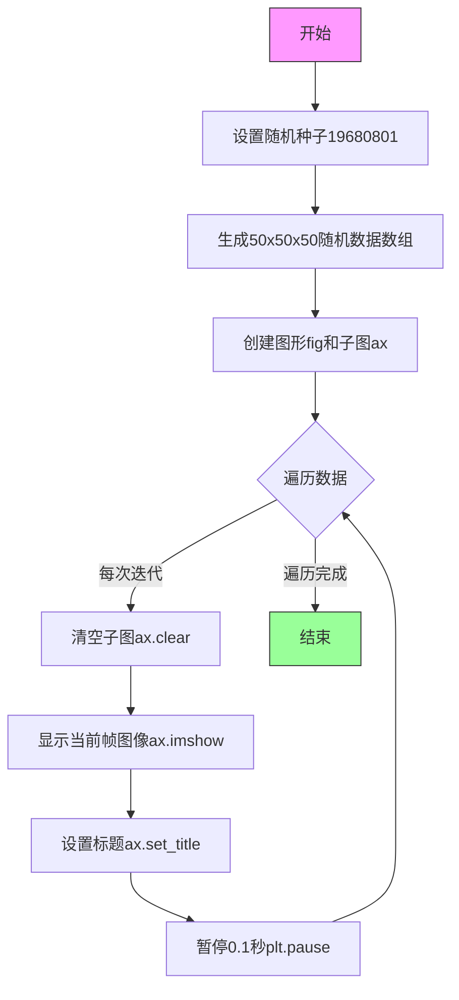
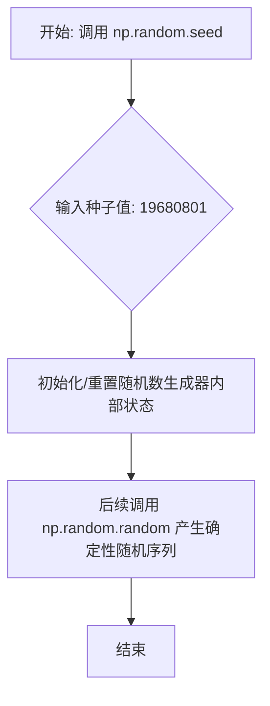
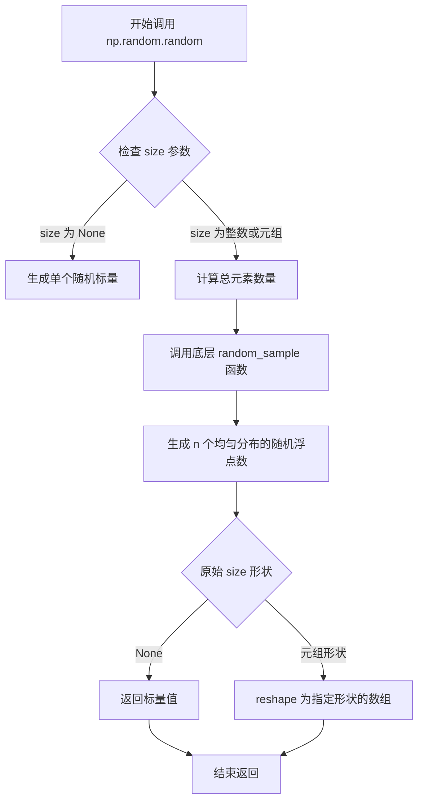
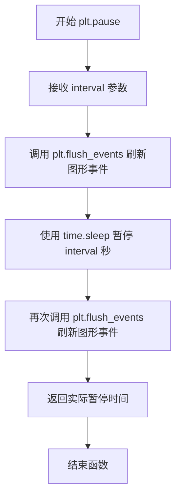
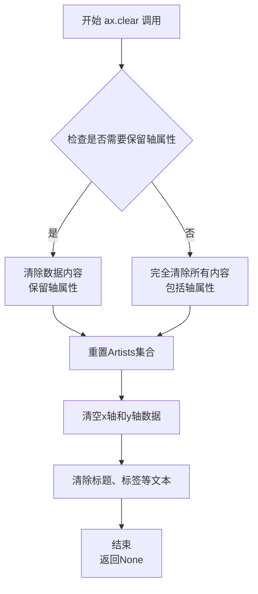
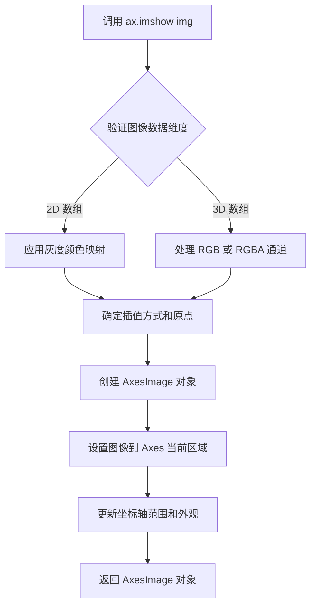
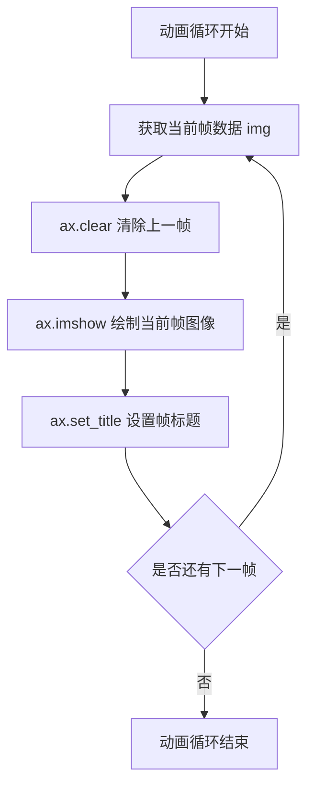

# `matplotlib\galleries\examples\animation\animation_demo.py` 详细设计文档

该脚本通过循环调用matplotlib的pause函数实现简单的帧动画演示，生成50帧随机图像并逐帧显示，每帧间隔0.1秒更新到图形窗口。

## 整体流程



## 类结构

```
该脚本为过程式代码，无类定义
主要依赖模块：
├── matplotlib.pyplot (绘图库)
└── numpy (数值计算库)
```

## 全局变量及字段


### `data`
    
50x50x50三维随机数组，存储动画帧数据

类型：`numpy.ndarray`
    


### `fig`
    
图形对象，管理整个图形窗口

类型：`matplotlib.figure.Figure`
    


### `ax`
    
子图对象，负责绘制和显示图像

类型：`matplotlib.axes.Axes`
    


    

## 全局函数及方法


### `np.random.seed`

该函数用于初始化 NumPy 随机数生成器的种子。在本段代码中，通过设定特定种子值（19680801），确保后续生成的随机数据 `data` 在每次程序运行时刻保持一致，从而使动画的输出结果是可复现的。

参数：

- `seed`：`int` 或 `array_like`，用于初始化随机数生成器的种子值。

返回值：`None`，该函数无返回值，仅修改全局随机数生成器的内部状态。

#### 流程图



#### 带注释源码

```python
# 导入数值计算库
import numpy as np

# 调用 np.random.seed 函数
# 这里的 seed 是一个全局配置，用于控制随机数生成器的起始点
# 19680801 是一个特定的整数值，选择它是为了与 Matplotlib 示例的历史兼容性
np.random.seed(19680801)

# 由于上面设置了种子，这里生成的随机数在程序每次运行时都是完全相同的
data = np.random.random((50, 50, 50))

# ...后续绘图代码使用 data 进行渲染...
```


### `np.random.random`

生成指定形状的随机浮点数数组，返回值在 [0.0, 1.0) 半开区间内均匀分布的随机数。

参数：

- `size`：`int` 或 `int` 的元组，可选，输出数组的形状。如果为 `None`（默认值），则返回一个标量值

返回值：`ndarray`，指定形状的随机浮点数数组，元素值域为 [0.0, 1.0)

#### 流程图



#### 带注释源码

```python
def random(size=None):
    """
    random(size=None)
    
    返回半开区间 [0.0, 1.0) 内的随机浮点数
    
    Parameters
    ----------
    size : int or tuple of ints, optional
        输出形状。例如，如果给定形状为 (m, n, k)，则生成 m * n * k 个样本。
        默认为 None，此时返回单个标量值。
    
    Returns
    -------
    out : ndarray
        随机值数组
    
    Examples
    --------
    >>> np.random.random()           # 无参数调用，返回单个随机数
    0.471085479953
    >>> np.random.random((5,))       # 返回 5 个随机数的一维数组
    array([ 0.357, 0.377, 0.988, 0.734, 0.88 ])
    >>> np.random.random((5,1))      # 返回 5x1 的二维数组
    >>> np.random.random((2,2))      # 返回 2x2 的二维数组
    """
    # 实际调用底层 random_sample 函数实现
    # random_sample 是 NumPy 随机数生成的核心函数
    return random_sample(size)
```

#### 补充说明

| 项目 | 说明 |
|------|------|
| **所属模块** | `numpy.random` |
| **底层实现** | 内部调用 `numpy.random._generator.random_sample` |
| **随机数生成器** | 使用 PCG64 (默认) 或其他配置的 BitGenerator |
| **分布类型** | 均匀分布 (Uniform Distribution) |
| **线程安全** | 是（每个线程独立的 RNG 状态） |
| **可复现性** | 可通过 `np.random.seed()` 设置种子 |

#### 潜在技术债务与优化空间

1. **全局状态问题**：使用全局 `np.random` 生成器可能导致难以追踪的副作用，在多线程/多模块场景下建议使用 `numpy.random.Generator`
2. **性能考虑**：对于大规模随机数生成需求，可考虑使用 `numpy.random.Generator.integers` 或直接操作 BitGenerator
3. **弃用警告**：较新版本 NumPy 推荐使用 `default_rng()` 而非传统的 `np.random` 函数


### `plt.subplots`

`plt.subplots` 是 Matplotlib 库中的一个函数，用于创建一个新的图形窗口（Figure）以及一个或多个子图（Axes），并返回图形对象和轴对象的元组，是 Matplotlib 中最常用的图形创建方式之一。

参数：

- `nrows`：`int`，默认值：1，子图的行数
- `ncols`：`int`，默认值：1，子图的列数
- `sharex`：`bool` 或 `{'none', 'all', 'row', 'col'}`，默认值：False，是否共享 x 轴
- `sharey`：`bool` 或 `{'none', 'all', 'row', 'col'}`，默认值：False，是否共享 y 轴
- `squeeze`：`bool`，默认值：True，是否压缩返回的轴数组维度
- `width_ratios`：`array-like`，长度为 ncols，各列的宽度相对比例
- `height_ratios`：`array-like`，长度为 nrows，各行的相对高度比例
- `subplot_kw`：`dict`，创建子图的关键字参数，传递给 `add_subplot`
- `gridspec_kw`：`dict`，GridSpec 关键字参数
- `**fig_kw`：额外关键字参数，传递给 `figure` 函数

返回值：`tuple(Figure, Axes or array of Axes)`，返回图形对象和轴对象（或轴对象数组）

#### 流程图

```mermaid
flowchart TD
    A[调用 plt.subplots] --> B{传入参数?}
    B -->|是| C[解析 nrows, ncols 等参数]
    B -->|否| D[使用默认值 nrows=1, ncols=1]
    C --> E[调用 plt.figure 创建 Figure 对象]
    E --> F[使用 GridSpec 或 add_subplot 创建子图布局]
    F --> G{是否需要共享轴?}
    G -->|是| H[配置 sharex/sharey]
    G -->|否| I[保持各子图独立]
    H --> J{是否 squeeze=True?}
    I --> J
    J -->|是且只有1个子图| K[返回单个 Axes 对象]
    J -->|否| L[返回 Axes 数组]
    K --> M[返回 (fig, ax) 元组]
    L --> M
```

#### 带注释源码

```python
# plt.subplots 的核心实现逻辑（简化版）

def subplots(nrows=1, ncols=1,          # 子图布局配置
             sharex=False,               # x轴共享策略
             sharey=False,               # y轴共享策略  
             squeeze=True,               # 是否压缩维度
             width_ratios=None,          # 列宽比例
             height_ratios=None,         # 行高比例
             subplot_kw=None,            # 子图创建参数
             gridspec_kw=None,           # 网格布局参数
             **fig_kw):                  # 图形创建参数
    
    # 1. 创建 Figure 对象
    fig = figure(**fig_kw)
    
    # 2. 创建 GridSpec 网格布局
    gs = GridSpec(nrows, ncols, 
                  width_ratios=width_ratios,
                  height_ratios=height_ratios,
                  **(gridspec_kw or {}))
    
    # 3. 创建子图并收集 Axes 对象
    axarr = np.empty((nrows, ncols), dtype=object)
    
    for i in range(nrows):
        for j in range(ncols):
            # 使用 subplot_kw 创建每个子图
            ax = fig.add_subplot(gs[i, j], **(subplot_kw or {}))
            axarr[i, j] = ax
    
    # 4. 配置共享轴
    if sharex or sharey:
        # 根据策略共享坐标轴...
        pass
    
    # 5. 处理返回值
    if squeeze and nrows == 1 and ncols == 1:
        # 压缩为单个 Axes 对象
        return fig, axarr[0, 0]
    else:
        # 返回 Axes 数组
        return fig, axarr


# === 示例代码中的调用 ===
fig, ax = plt.subplots()

# 相当于:
# fig = plt.figure()
# ax = fig.add_subplot(111)
# 返回 (Figure对象, Axes对象)
```


### `plt.pause`

该函数是matplotlib.pyplot模块中的暂停函数，用于在绘图后暂停指定秒数并刷新图形，从而实现简单的动画效果。它通过在暂停前后调用图形刷新事件来实现动画的流畅显示。

参数：

- `interval`：`float`，暂停的秒数，指定动画每帧之间的时间间隔

返回值：`float`，实际暂停的时间（秒）

#### 流程图



#### 带注释源码

```python
def pause(interval):
    """
    暂停指定秒数并刷新图形，实现动画效果。
    
    Parameters
    ----------
    interval : float
        暂停的秒数，表示动画每帧之间的时间间隔。
    
    Returns
    -------
    float
        实际暂停的时间（秒）。
    
    Notes
    -----
    该函数比使用 time.sleep 更适合动画，因为它会在暂停期间
    刷新图形事件处理器，允许图形进行必要的重绘和交互。
    """
    # 获取当前图形对象
    manager = _pylab_helpers.Gcf.get_active()
    
    # 如果存在图形管理器，则刷新事件队列
    if manager is not None:
        # 处理待处理的图形事件（如鼠标点击、键盘事件等）
        manager.canvas.flush_events()
    
    # 开始计时
    start = time.time()
    
    # 暂停指定的时间（使图形保持显示状态）
    time.sleep(interval)
    
    # 再次刷新事件队列，确保图形完全更新
    if manager is not None:
        manager.canvas.flush_events()
    
    # 计算并返回实际暂停的时间
    end = time.time()
    return end - start
```


### `ax.clear`（或 `Axes.clear`）

该方法是 Matplotlib 中 Axes 类的成员函数，用于清除当前子图的所有内容（包括数据、线条、文本、图像等），为绘制新一帧动画或更新图表内容做准备。在动画循环中，每次迭代前调用此方法可确保上一帧的图形被完全清除，从而避免新数据与旧数据叠加。

参数：

- 无参数

返回值：`None`，无返回值

#### 流程图



#### 带注释源码

```python
# Axes.clear() 方法的核心实现逻辑（基于 Matplotlib 源码简化）
def clear(self, keep_inset=False):
    """
    清除坐标轴内容
    
    参数:
        keep_inset: bool, 可选
            如果为 True，保留嵌入的子图（inset axes）
    
    返回值:
        None
    """
    
    # 1. 清空子图上所有的艺术家对象（Artists）
    # 包括线条、散点、图像等可视化元素
    self.artists = []
    self.collections = []
    self.images = []
    self.lines = []
    self.patches = []
    
    # 2. 清空文本对象（标题、标签等）
    self.texts = []
    
    # 3. 清空图例
    if self.legend_ is not None:
        self.legend_.remove()
        self.legend_ = None
    
    # 4. 重置坐标轴数据
    # 清空 x 轴和 y 轴的数据源
    self.xaxis.cla()
    self.yaxis.cla()
    
    # 5. 重置视图范围
    self.set_xlim(0, 1)
    self.set_ylim(0, 1)
    
    # 6. 可选：保留嵌入子图
    if not keep_inset:
        self.inset_axes = []
    
    # 7. 重置标题为空字符串
    self.set_title('')
    
    # 8. 触发重新绘制
    self.stale_callbacks.process('stale', self)
    
    return None
```

---

### 补充信息

#### 关键组件信息

| 组件名称 | 一句话描述 |
|---------|-----------|
| `matplotlib.pyplot` | 提供 MATLAB 风格的绘图接口 |
| `Axes.clear()` | 清除子图内容，为新帧绘制做准备 |
| `ax.imshow()` | 在子图中显示图像数据 |
| `plt.pause()` | 暂停指定秒数并刷新显示 |

#### 潜在的技术债务或优化空间

1. **性能瓶颈**：在每一帧调用 `ax.clear()` 会导致频繁的内存分配和释放，对于高性能动画需求，建议使用 `animation` 模块或 `set_data()` 方法更新数据而非完全清除重绘。

2. **资源管理**：当前示例中未显式关闭图形窗口，可能导致资源泄漏。

3. **缺乏错误处理**：未对数据维度不匹配、图像格式错误等情况进行处理。

#### 其它项目

- **设计目标**：演示如何使用 `pyplot.pause` 创建简单动画
- **约束**：仅适用于简单、低性能需求的场景
- **错误处理**：代码未包含异常捕获机制
- **外部依赖**：NumPy、Matplotlib


### `Axes.imshow`

在子图中显示图像数据，将数组数据渲染为图像，并支持颜色映射、坐标轴设置等可视化选项。

参数：

-  `X`：`numpy.ndarray` 或类似数组对象，表示图像数据。可以是 2D 数组（灰度图像）或 3D 数组（RGB 或 RGBA 图像）。在代码中，`img` 是一个 50x50 的 2D 数组。

返回值：`matplotlib.image.AxesImage`，返回创建的图像对象，可用于进一步自定义（如设置颜色条）。

#### 流程图



#### 带注释源码

```python
# img 是来自 data 的一个 50x50 切片，类型为 numpy.ndarray
for i, img in enumerate(data):
    ax.clear()  # 清除当前子图内容
    ax.imshow(img)  # 在子图中显示图像数据，img 作为 X 参数
    ax.set_title(f"frame {i}")  # 设置子图标题
    plt.pause(0.1)  # 暂停以更新显示
```


### `ax.set_title`

设置子图标题，显示当前帧序号。在动画循环中，每次调用 `clear()` 清除当前图像后，使用 `set_title` 为新帧设置标题，用于标识当前的帧编号。

参数：

- `label`：`str`，标题文本内容，此处为格式化字符串 `f"frame {i}"`，其中 `i` 为当前帧的序号（从 0 开始递增）
- `**kwargs`：`Any`，可选参数，用于传递文本样式属性（如字体大小、颜色、字体粗细等），此处未使用

返回值：`Text`，返回设置的标题文本对象（matplotlib 的 `matplotlib.text.Text` 类型），可进一步用于设置标题样式或获取标题属性

#### 流程图



#### 带注释源码

```python
# 代码上下文：matplotlib 动画循环中的标题设置
for i, img in enumerate(data):          # 遍历数据帧，i 为帧序号（0-49）
    ax.clear()                           # 清除当前 axes 的内容（清除上一帧图像）
    ax.imshow(img)                      # 显示当前帧的图像数据
    ax.set_title(f"frame {i}")          # 设置子图标题，显示当前帧序号
    # 参数说明：
    #   - label: 字符串类型，格式化为 "frame 0", "frame 1", ... "frame 49"
    #   - 返回值: Text 对象，可用于后续样式设置
    # 注意：每次循环都会更新标题，而非创建新标题对象
    plt.pause(0.1)                       # 暂停 0.1 秒以显示动画效果
```

#### 技术说明

| 属性 | 值 |
|------|-----|
| 所属类 | `matplotlib.axes.Axes` |
| 方法签名 | `set_title(label, fontdict=None, loc=None, pad=None, *, y=None, **kwargs)` |
| 文档链接 | [matplotlib.axes.Axes.set_title](https://matplotlib.org/stable/api/_as_gen/matplotlib.axes.Axes.set_title.html) |

## 关键组件


### 一段话描述

该代码是一个简单的matplotlib动画示例，通过创建50x50x50的3D随机数据数组，然后逐帧显示2D切片并使用plt.pause()控制动画播放速度，实现基本的图像序列动画功能。

### 文件的整体运行流程

1. 导入matplotlib.pyplot和numpy模块
2. 设置随机种子以确保可重现性
3. 生成50x50x50的3D随机数据数组
4. 创建图形窗口和坐标轴
5. 遍历数据数组的每一层（50帧）
6. 每帧清除坐标轴内容，显示当前2D切片
7. 设置标题显示当前帧号
8. 调用plt.pause(0.1)暂停以形成动画效果

### 全局变量和全局函数详细信息

**全局变量：**
- **data**：numpy.ndarray类型，三维随机数据数组，形状为(50, 50, 50)，存储用于动画的所有帧数据
- **fig**：matplotlib.figure.Figure类型，图形对象，表示整个图形窗口
- **ax**：matplotlib.axes.Axes类型，坐标轴对象，用于绑制图像和标题

**全局函数：**
- **np.random.random**：参数为shape元组，返回指定形状的numpy.ndarray，包含[0,1)区间内的随机浮点数
- **plt.subplots**：无参数，返回(fig, ax)元组，创建一个新的图形窗口和坐标轴
- **ax.clear**：无参数，无返回值，清除坐标轴内容为下一帧做准备
- **ax.imshow**：参数为img (numpy.ndarray类型)，无返回值，在坐标轴上显示图像数据
- **ax.set_title**：参数为title (str类型)，无返回值，设置坐标轴标题显示当前帧号
- **plt.pause**：参数为interval (float类型)，返回float值（暂停时长），暂停执行指定秒数以实现动画效果

### 关键组件信息

**数据生成器**：使用numpy.random.random生成三维随机数据数组，为动画提供原始素材

**图像渲染器**：通过ax.imshow()将二维数组渲染为可视化图像，支持自动色彩映射

**动画控制器**：利用plt.pause()实现帧间暂停，是实现动画效果的核心机制

**帧迭代器**：使用enumerate遍历三维数组的第三维度，实现逐帧显示逻辑

### 潜在的技术债务或优化空间

1. **性能瓶颈**：每帧都调用ax.clear()和ax.imshow()，对于高性能需求应用效率较低，应考虑使用animation模块
2. **内存占用**：一次性生成完整3D数组占用较多内存，对于大规模数据应考虑惰性加载或生成器模式
3. **硬编码参数**：帧率(0.1)和数据维度(50)硬编码，缺乏配置灵活性
4. **缺少错误处理**：没有对空数据、数据类型异常等情况进行处理
5. **色彩映射**：使用默认色彩映射，可能不适合特定数据可视化需求
6. **资源释放**：动画结束后没有显式关闭图形，缺少资源管理代码

### 其它项目

**设计目标与约束**：
- 目标：演示pyplot动画基本用法，适合简单低性能场景
- 约束：不能使用time.sleep替代plt.pause，必须使用matplotlib的pause函数

**错误处理与异常设计**：
- 缺少对data为空或维度不足的检查
- 缺少对matplotlib后端可用性的检查
- 缺少对图形窗口关闭的响应处理

**数据流与状态机**：
- 数据流：随机数组 → 逐帧切片 → 图像渲染 → 显示更新
- 状态：初始化 → 帧渲染循环 → 动画结束

**外部依赖与接口契约**：
- 依赖matplotlib.pyplot模块的pause函数
- 依赖numpy库的random模块
- 依赖matplotlib的imshow显示功能


## 问题及建议


### 已知问题

-   **性能低下**：在循环中每次调用`ax.clear()`和`ax.imshow()`都会重新创建Artist对象，对于50帧图像（50x50x50数据）效率较低，应使用matplotlib.animation模块的FuncAnimation或ArtistAnimation
-   **阻塞式动画**：使用`plt.pause()`实现动画是阻塞式的，无法交互控制播放/暂停，不适合复杂应用场景
-   **资源未释放**：代码结束时未显式调用`plt.close(fig)`，可能导致图形窗口和内存资源未及时释放
-   **硬编码参数**：暂停时间0.1、随机种子19680801、数据维度50等均为硬编码，缺乏配置灵活性
-   **无错误处理**：缺少对数据格式、空数据、图形创建失败等异常情况的处理
-   **不支持保存**：代码无法将动画保存为视频或GIF文件
-   **无类型提示**：代码未使用Python类型注解，降低了可维护性和IDE支持
-   **注释误导**：文档注释提到使用Animation.to_jshtml但实际代码未使用

### 优化建议

-   使用`matplotlib.animation.FuncAnimation`替代循环+pause方式，设置`blit=True`提升渲染性能
-   使用`ax.imshow()`返回的图像对象，调用`set_data()`而非每次重新创建
-   添加参数配置选项（帧率、数据路径、保存路径等），提高代码复用性
-   使用上下文管理器或显式`plt.close()`确保资源释放
-   添加try-except异常处理，捕获数据异常、图形异常等情况
-   添加类型提示（typing.Optional, typing.List等）提高代码质量
-   考虑使用`functools.partial`或lambda封装回调函数，支持更灵活的动画控制
-   根据文档注释，如果需要JSHTML输出，应使用Animation.to_jshtml()方法


## 其它


### 设计目标与约束

本代码的核心目标是演示如何使用matplotlib的pyplot.pause()函数创建简单动画。设计约束包括：仅适用于低性能需求的简单动画场景，不适合高质量或高帧率要求的应用；依赖matplotlib.pyplot和numpy两个外部库；动画帧数受限于data数组的维度（50帧）。

### 错误处理与异常设计

代码未包含显式的错误处理机制。潜在的异常情况包括：data数组为空或维度不符合(50,50,50)时会导致imshow显示异常；plt.pause()在某些后端（如非交互式后端）可能不支持而无声失败；内存不足时可能引发MemoryError。建议添加数据验证、异常捕获机制以及对后端可用性的检查。

### 数据流与状态机

数据流：外部传入的3D numpy数组data → 循环迭代取出一帧2D数组img → ax.clear()清除上一帧 → ax.imshow(img)渲染新帧 → ax.set_title()更新标题 → plt.pause(0.1)显示并等待。状态机简化为两个状态：渲染状态（绘制当前帧）和暂停状态（等待0.1秒）。

### 外部依赖与接口契约

主要依赖包括：matplotlib.pyplot模块（提供fig、ax创建及pause函数）、numpy模块（提供随机数生成和数组操作）。接口契约：data必须为三维numpy数组，形状为(n,n,n)；plt.pause()参数为暂停秒数（浮点数）；返回值仅为None。

### 性能考虑与优化空间

当前实现每次循环都调用ax.clear()和ax.imshow()，性能较低。优化方向包括：使用animation.Animation类替代手动循环；使用blit=True参数减少重绘区域；考虑使用FuncAnimation进行更高效的动画渲染；对于大数据集考虑降采样或使用专门的可视化工具。

### 资源管理与内存泄漏

代码未显式管理资源。潜在问题：长时间运行可能导致内存累积（虽然本例中data已预加载）；fig和ax对象在函数返回后应适当关闭。建议使用with语句或显式调用plt.close()管理图形对象生命周期。

### 代码可维护性与扩展性

代码作为演示示例，缺乏模块化设计。扩展方向：将动画逻辑封装为函数，参数化帧数据源、暂停间隔、标题格式等；添加回调函数支持以响应用户交互；支持不同后端的适配。

### 测试策略建议

建议添加的测试包括：验证data数组形状符合预期；验证fig和ax对象成功创建；验证循环迭代次数与data第一维长度一致；验证在支持的后端上pause函数被正确调用；验证异常情况下的行为（如空数据、错误数据类型等）。

### 平台兼容性

代码依赖matplotlib的交互式功能，在某些平台（如某些headless服务器环境、某些IDE的绘图输出模式）可能无法正常工作。plt.pause()的行为受matplotlib后端影响，在Agg等非交互式后端下会退化为time.sleep()的等效行为或完全不起作用。

### 安全性考虑

代码本身不涉及用户输入、文件操作或网络通信，安全性风险较低。但需注意：随机种子固定（19680801）为便于复现的硬编码值，生产环境可能需要动态生成；data数组大小固定，可能存在内存溢出风险。


    