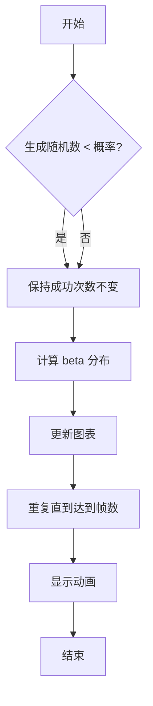
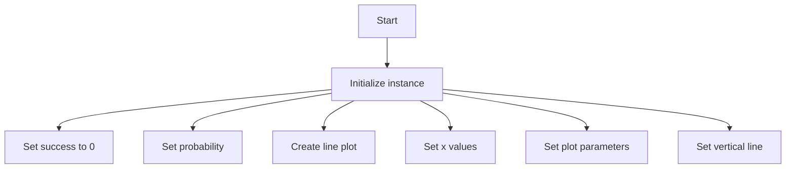
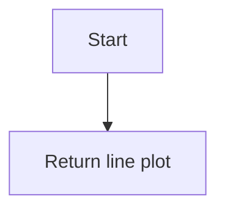
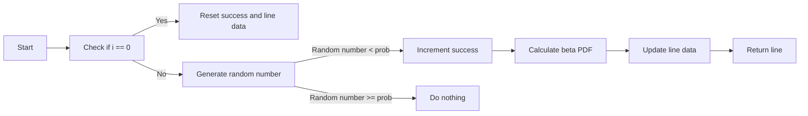

# `matplotlib\galleries\examples\animation\bayes_update.py` 详细设计文档

This code simulates a Bayesian update process, visualizing the posterior estimate updates as new data arrives. It uses a beta probability density function to model the success probability and updates the distribution accordingly.

## 整体流程



## 类结构

```
UpdateDist (类)
```

## 全局变量及字段


### `np`
    
The NumPy module for numerical operations.

类型：`module`
    


### `plt`
    
The Matplotlib module for plotting.

类型：`module`
    


### `math`
    
The built-in math module for mathematical functions.

类型：`module`
    


### `FuncAnimation`
    
The Matplotlib animation class for creating animations.

类型：`class`
    


### `UpdateDist.success`
    
The number of successful trials in the Bayesian update process.

类型：`int`
    


### `UpdateDist.prob`
    
The probability of success in each trial of the Bayesian update process.

类型：`float`
    


### `UpdateDist.line`
    
The line object representing the plot in the animation.

类型：`matplotlib.lines.Line2D`
    


### `UpdateDist.x`
    
The x-axis values for the plot.

类型：`numpy.ndarray`
    


### `UpdateDist.ax`
    
The axes object for the plot where the animation is displayed.

类型：`matplotlib.axes._subplots.AxesSubplot`
    


### `UpdateDist.success`
    
The number of successful trials in the Bayesian update process.

类型：`int`
    


### `UpdateDist.prob`
    
The probability of success in each trial of the Bayesian update process.

类型：`float`
    


### `UpdateDist.line`
    
The line object representing the plot in the animation.

类型：`matplotlib.lines.Line2D`
    


### `UpdateDist.x`
    
The x-axis values for the plot.

类型：`numpy.ndarray`
    


### `UpdateDist.ax`
    
The axes object for the plot where the animation is displayed.

类型：`matplotlib.axes._subplots.AxesSubplot`
    
    

## 全局函数及方法


### beta_pdf

The `beta_pdf` function calculates the probability density function (PDF) for the beta distribution.

参数：

- `x`：`float`，The value at which the PDF is evaluated.
- `a`：`float`，The first shape parameter of the beta distribution.
- `b`：`float`，The second shape parameter of the beta distribution.

返回值：`float`，The probability density at the value `x`.

#### 流程图

```mermaid
graph LR
A[Start] --> B{Calculate x^(a-1)}
B --> C{Calculate (1-x)^(b-1)}
C --> D{Calculate gamma(a+b)}
D --> E{Calculate gamma(a)}
E --> F{Calculate gamma(b)}
F --> G[Calculate beta_pdf = (x^(a-1) * (1-x)^(b-1) * gamma(a+b) / (gamma(a) * gamma(b)))]
G --> H[End]
```

#### 带注释源码

```python
def beta_pdf(x, a, b):
    # Calculate the probability density function for the beta distribution
    return (x**(a-1) * (1-x)**(b-1) * math.gamma(a + b)
            / (math.gamma(a) * math.gamma(b)))
```


### UpdateDist.__init__

This method initializes an instance of the `UpdateDist` class, setting up the initial parameters and plot for the Bayesian update animation.

参数：

- `ax`：`matplotlib.axes.Axes`，The axes object to plot on.
- `prob`：`float`，The initial probability of success.

返回值：`None`

#### 流程图



#### 带注释源码

```python
def __init__(self, ax, prob=0.5):
    self.success = 0  # The number of successful trials
    self.prob = prob  # The initial probability of success
    self.line, = ax.plot([], [], 'k-')  # The line plot for the distribution
    self.x = np.linspace(0, 1, 200)  # The x values for the plot
    self.ax = ax  # The axes object

    # Set up plot parameters
    self.ax.set_xlim(0, 1)
    self.ax.set_ylim(0, 10)
    self.ax.grid(True)

    # This vertical line represents the theoretical value, to
    # which the plotted distribution should converge.
    self.ax.axvline(prob, linestyle='--', color='black')
```


### UpdateDist.start

This method initializes the animation by returning the initial state of the line plot.

参数：

- `self`：`UpdateDist`，The instance of the UpdateDist class.

返回值：`tuple`，A tuple containing the line plot object.

#### 流程图



#### 带注释源码

```python
def start(self):
    # Used for the *init_func* parameter of FuncAnimation; this is called when
    # initializing the animation, and also after resizing the figure.
    return self.line,
```


### UpdateDist.__call__

This method updates the plot with new data points and recalculates the beta probability density function (PDF) for the given success and trial counts.

参数：

- `i`：`int`，当前迭代的帧数。它用于计算beta PDF的参数。

返回值：`tuple`，包含更新后的线对象。

#### 流程图



#### 带注释源码

```python
def __call__(self, i):
    # This way the plot can continuously run and we just keep
    # watching new realizations of the process
    if i == 0:
        self.success = 0
        self.line.set_data([], [])
        return self.line,

    # Choose success based on exceed a threshold with a uniform pick
    if np.random.rand() < self.prob:
        self.success += 1
    y = beta_pdf(self.x, self.success + 1, (i - self.success) + 1)
    self.line.set_data(self.x, y)
    return self.line,
```


## 关键组件


### 张量索引与惰性加载

张量索引与惰性加载是用于在动画中动态更新分布函数的关键组件，它允许在每次迭代中仅计算和更新必要的部分，从而提高性能。

### 反量化支持

反量化支持是用于将概率分布转换为可可视化的数据点的组件，它确保了分布函数的准确性和可解释性。

### 量化策略

量化策略是用于确定在每次迭代中更新分布函数时使用的参数值的组件，它决定了分布的形状和收敛速度。


## 问题及建议


### 已知问题

-   **代码重复性**：`beta_pdf` 函数在代码中被重复调用，可以考虑将其移动到全局函数或类方法中，以减少代码重复。
-   **随机数生成**：`np.random.rand()` 在每次迭代中都被调用，这可能导致性能问题，特别是在动画中。可以考虑使用一个预先生成的随机数数组来避免重复调用。
-   **异常处理**：代码中没有异常处理机制，如果出现错误（例如，matplotlib版本不兼容），程序可能会崩溃。应该添加异常处理来提高代码的健壮性。
-   **代码注释**：代码中缺少详细的注释，这可能会使得其他开发者难以理解代码的工作原理。

### 优化建议

-   **重构 `beta_pdf` 函数**：将 `beta_pdf` 函数移动到全局函数或类方法中，以便在需要时重用。
-   **使用预生成的随机数数组**：在动画开始之前生成一个随机数数组，并在每次迭代中使用该数组，以减少计算量。
-   **添加异常处理**：在关键代码段周围添加异常处理，以确保程序在遇到错误时能够优雅地处理。
-   **添加代码注释**：为代码添加详细的注释，以提高代码的可读性和可维护性。
-   **性能优化**：考虑使用更高效的绘图方法，例如使用 `blit=False` 来减少重绘次数，或者使用更快的绘图库。
-   **代码风格**：遵循一致的代码风格指南，以提高代码的可读性和一致性。


## 其它


### 设计目标与约束

- 设计目标：实现一个贝叶斯更新动画，展示随着新数据的到来，后验估计如何更新。
- 约束条件：使用matplotlib库进行绘图，动画输出为HTML格式。

### 错误处理与异常设计

- 错误处理：确保代码在输入参数错误时能够抛出异常，并提供清晰的错误信息。
- 异常设计：使用try-except语句捕获可能出现的异常，并进行相应的处理。

### 数据流与状态机

- 数据流：数据从随机数生成开始，通过贝叶斯公式计算后验概率分布，最终在图表上展示。
- 状态机：动画的状态包括初始化、更新、绘制等。

### 外部依赖与接口契约

- 外部依赖：matplotlib库用于绘图和动画。
- 接口契约：函数beta_pdf计算贝塔概率密度函数，UpdateDist类用于创建动画。


    