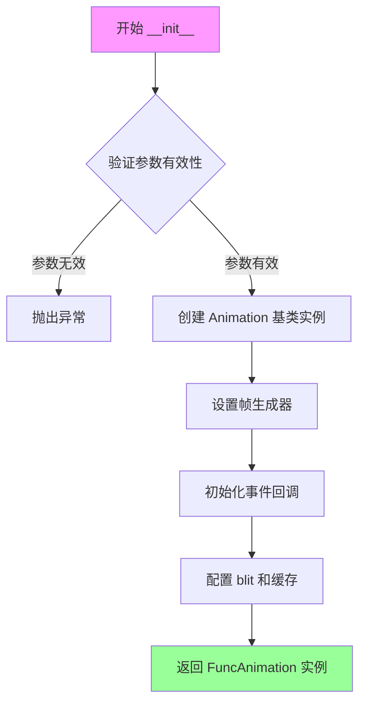
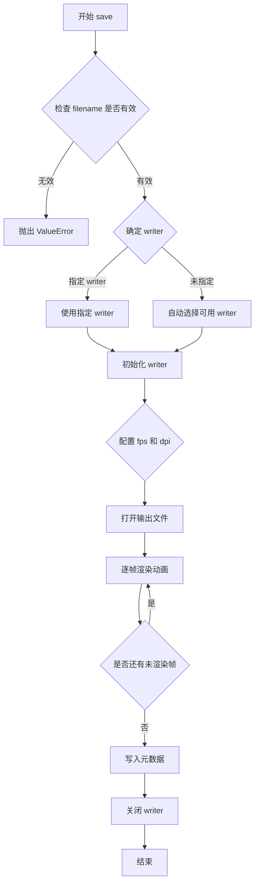
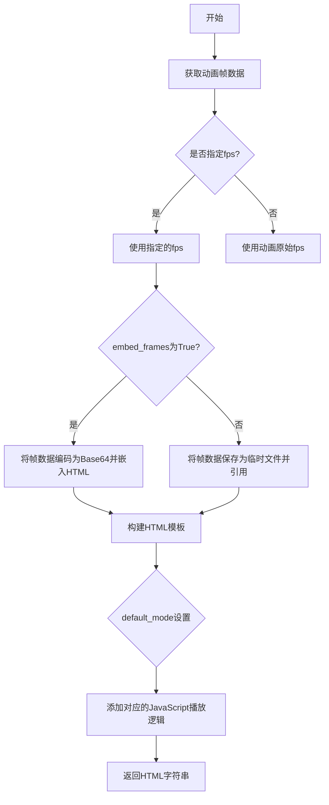
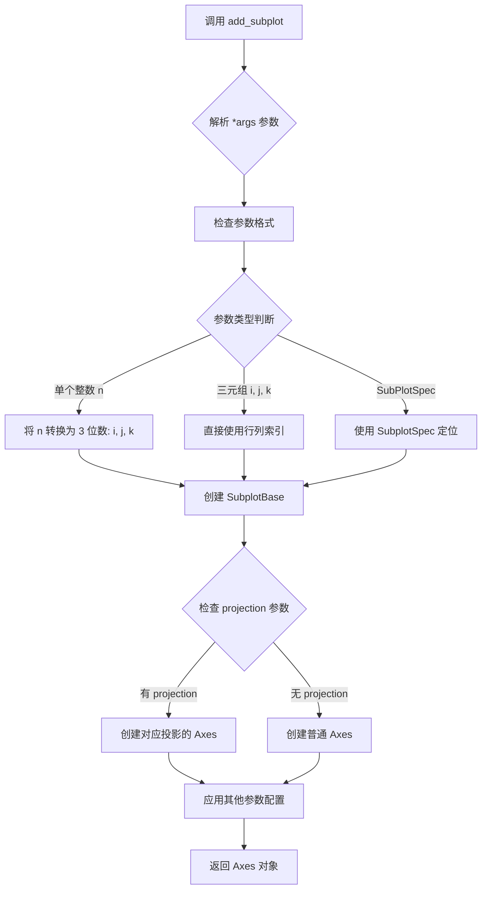
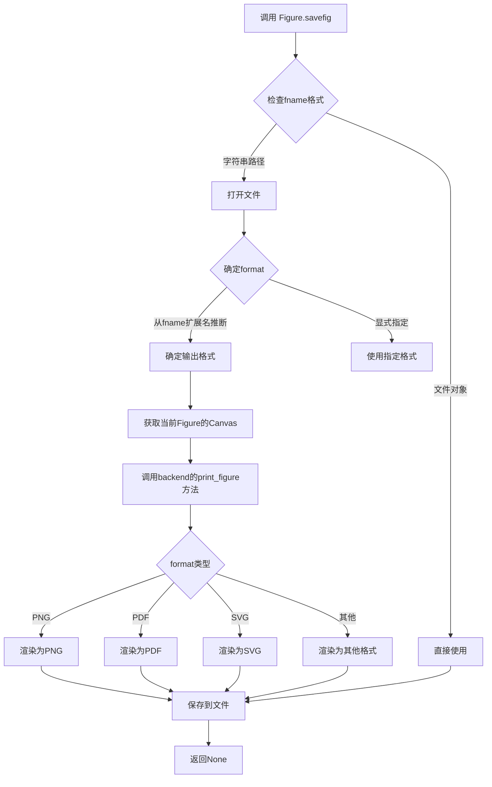
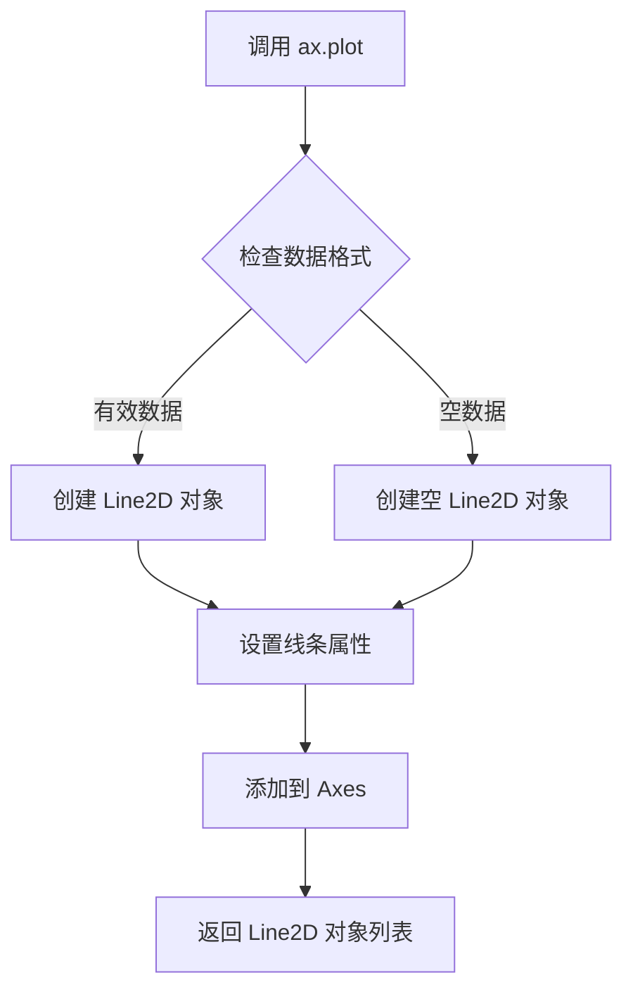
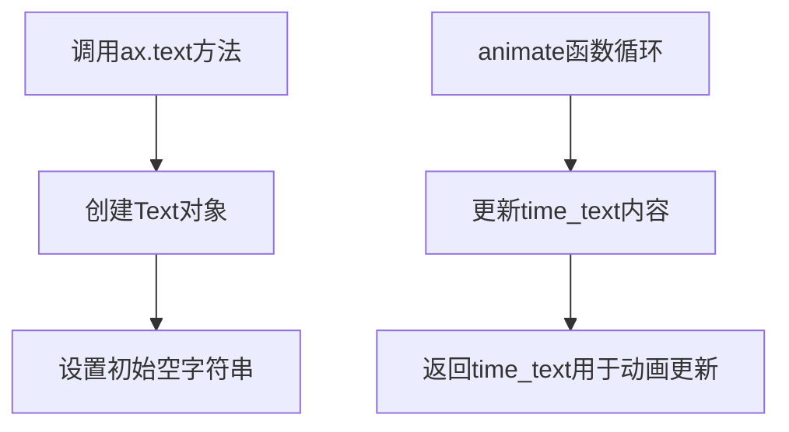
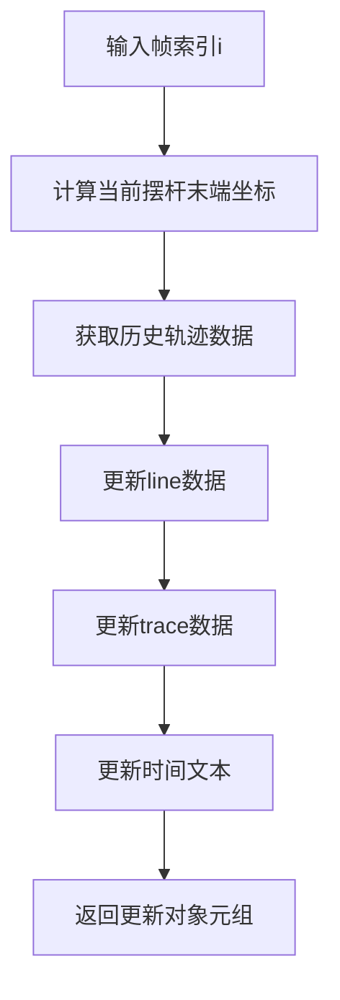
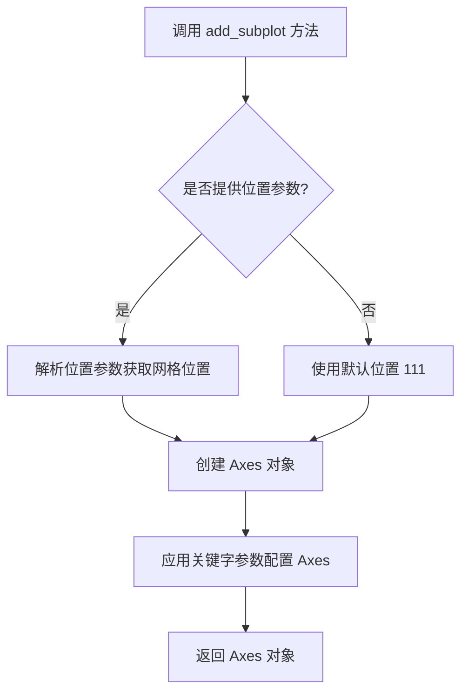

# `matplotlib\galleries\examples\animation\double_pendulum.py` 详细设计文档

该代码实现了一个双摆系统的物理仿真与动画演示，通过求解拉格朗日力学方程计算双摆在重力作用下的运动轨迹，并使用matplotlib实时渲染摆杆和末端轨迹的动态变化。

## 整体流程

```mermaid
graph TD
    A[开始] --> B[初始化物理参数]
    B --> C[设置初始状态: 角度th1=120°, th2=-10°]
    C --> D[创建时间数组 dt=0.01s]
    D --> E{欧拉积分循环 i=1 to len(t)}
    E --> F[调用derivs计算状态导数]
    F --> G[y[i] = y[i-1] + derivs * dt]
    G --> H[计算摆杆末端坐标 x1,y1,x2,y2]
    H --> I[创建matplotlib图形和坐标轴]
    I --> J[创建动画对象FuncAnimation]
    J --> K[animate函数逐帧更新绘图]
    K --> L[显示动画 plt.show()]
```

## 类结构

```
无自定义类层次结构
主要使用matplotlib库的过程式编程
├─ matplotlib.figure.Figure
├─ matplotlib.axes.Axes
└─ matplotlib.animation.FuncAnimation
```

## 全局变量及字段


### `G`
    
重力加速度 9.8 m/s²

类型：`float`
    


### `L1`
    
摆1长度 1.0 m

类型：`float`
    


### `L2`
    
摆2长度 1.0 m

类型：`float`
    


### `L`
    
摆总长度 L1+L2

类型：`float`
    


### `M1`
    
摆1质量 1.0 kg

类型：`float`
    


### `M2`
    
摆2质量 1.0 kg

类型：`float`
    


### `t_stop`
    
模拟时长 2.5秒

类型：`float`
    


### `history_len`
    
轨迹显示点数 500

类型：`int`
    


### `dt`
    
时间步长 0.01秒

类型：`float`
    


### `t`
    
时间数组

类型：`ndarray`
    


### `th1`
    
摆1初始角度 120度

类型：`float`
    


### `w1`
    
摆1初始角速度 0度/秒

类型：`float`
    


### `th2`
    
摆2初始角度 -10度

类型：`float`
    


### `w2`
    
摆2初始角速度 0度/秒

类型：`float`
    


### `state`
    
初始状态向量 [th1,w1,th2,w2] 弧度

类型：`ndarray`
    


### `y`
    
积分结果 (len(t), 4) 数组

类型：`ndarray`
    


### `x1`
    
摆1末端x坐标

类型：`ndarray`
    


### `y1`
    
摆1末端y坐标

类型：`ndarray`
    


### `x2`
    
摆2末端x坐标

类型：`ndarray`
    


### `y2`
    
摆2末端y坐标

类型：`ndarray`
    


### `fig`
    
matplotlib图形对象

类型：`Figure`
    


### `ax`
    
坐标轴对象

类型：`Axes`
    


### `line`
    
摆杆线条对象

类型：`Line2D`
    


### `trace`
    
轨迹线条对象

类型：`Line2D`
    


### `time_template`
    
时间文本模板

类型：`str`
    


### `time_text`
    
时间显示文本对象

类型：`Text`
    


### `ani`
    
动画对象

类型：`FuncAnimation`
    


### `FuncAnimation.fig`
    
动画绑定的图形对象

类型：`Figure`
    


### `FuncAnimation.animate`
    
动画更新回调函数

类型：`callable`
    


### `FuncAnimation.frames`
    
动画帧数

类型：`int`
    


### `FuncAnimation.interval`
    
动画刷新间隔(毫秒)

类型：`int`
    


### `FuncAnimation.blit`
    
是否使用blit优化

类型：`bool`
    


### `Figure.figsize`
    
图形大小(宽,高)

类型：`tuple`
    


### `Axes.set_xlim`
    
设置x轴范围

类型：`method`
    


### `Axes.set_ylim`
    
设置y轴范围

类型：`method`
    


### `Axes.set_aspect`
    
设置坐标轴比例

类型：`method`
    


### `Axes.set_xlabel`
    
设置x轴标签

类型：`method`
    


### `Axes.set_ylabel`
    
设置y轴标签

类型：`method`
    


### `Axes.grid`
    
显示网格

类型：`method`
    
    

## 全局函数及方法


### `derivs`

计算双摆系统的状态导数，即根据当前状态（两个摆的角度和角速度）计算它们的时间导数，用于数值积分求解双摆运动轨迹。

参数：

- `t`：`float`，当前时间点（单位：秒），在函数内部未直接使用，但作为odeint等积分器的标准接口参数
- `state`：`numpy.ndarray`，状态向量，包含4个元素：`[θ₁, ω₁, θ₂, ω₂]`，分别表示摆1的角度（弧度）、摆1的角速度（弧度/秒）、摆2的角度（弧度）、摆2的角速度（弧度/秒）

返回值：`numpy.ndarray`，状态导数向量 `dydx`，包含4个元素：`[dθ₁/dt, dω₁/dt, dθ₂/dt, dω₂/dt]`，分别表示摆1的角度变化率、摆1的角加速度、摆2的角度变化率、摆2的角加速度

#### 流程图

```mermaid
flowchart TD
    A[开始 derivs] --> B[创建零向量 dydx]
    B --> C[设置 dydx[0] = state[1]]
    C --> D[计算角度差 delta = state[2] - state[0]]
    D --> E[计算 den1 = (M1+M2)*L1 - M2*L1*cos²(delta)]
    E --> F[计算 dydx[1] - 摆1角加速度]
    F --> G[设置 dydx[2] = state[3]]
    G --> H[计算 den2 = (L2/L1) * den1]
    H --> I[计算 dydx[3] - 摆2角加速度]
    I --> J[返回 dydx]
```

#### 带注释源码

```python
def derivs(t, state):
    """
    计算双摆运动方程的导数（状态变化率）
    
    参数:
        t: float, 当前时间（未在本函数中使用，作为ODE求解器接口）
        state: numpy.ndarray, 状态向量 [theta1, omega1, theta2, omega2]
            state[0] = theta1: 摆1的角度（弧度）
            state[1] = omega1: 摆1的角速度（弧度/秒）
            state[2] = theta2: 摆2的角度（弧度）
            state[3] = omega2: 摆2的角速度（弧度/秒）
    
    返回:
        numpy.ndarray: 状态导数向量 [dtheta1/dt, domega1/dt, dtheta2/dt, domega2/dt]
    """
    # 创建与输入状态向量形状相同的零向量，用于存储导数
    dydx = np.zeros_like(state)

    # 第一个摆的角度导数等于其角速度
    # dθ₁/dt = ω₁
    dydx[0] = state[1]

    # 计算两个摆之间的角度差
    # delta = θ₂ - θ₁
    delta = state[2] - state[0]

    # 计算分母 den1，用于摆1角加速度的计算
    # 这是根据拉格朗日方程推导出的分母项
    den1 = (M1+M2) * L1 - M2 * L1 * cos(delta) * cos(delta)

    # 计算摆1的角加速度 dω₁/dt
    # 基于双摆动力学方程:
    # 分子的各项分别代表：
    # - M2*L1*ω₁²*sin(delta)*cos(delta): 科里奥利力效应
    # - M2*G*sin(θ₂)*cos(delta): 重力在摆2上的投影效应
    # - M2*L2*ω₂²*sin(delta): 摆2对摆1的向心效应
    # - (M1+M2)*G*sin(θ₁): 摆1本身的重力效应
    dydx[1] = ((M2 * L1 * state[1] * state[1] * sin(delta) * cos(delta)
                + M2 * G * sin(state[2]) * cos(delta)
                + M2 * L2 * state[3] * state[3] * sin(delta)
                - (M1+M2) * G * sin(state[0]))
               / den1)

    # 第二个摆的角度导数等于其角速度
    # dθ₂/dt = ω₂
    dydx[2] = state[3]

    # 计算分母 den2，用于摆2角加速度的计算
    # den2 与 den1 成比例，比例系数为 L2/L1
    den2 = (L2/L1) * den1

    # 计算摆2的角加速度 dω₂/dt
    # 基于双摆动力学方程:
    # 分子的各项分别代表：
    # - M2*L2*ω₂²*sin(delta)*cos(delta): 科里奥利力效应（负号）
    # + (M1+M2)*G*sin(θ₁)*cos(delta): 重力通过摆1的耦合效应
    # - (M1+M2)*L1*ω₁²*sin(delta): 摆1对摆2的向心效应
    # - (M1+M2)*G*sin(θ₂): 摆2本身的重力效应
    dydx[3] = ((- M2 * L2 * state[3] * state[3] * sin(delta) * cos(delta)
                + (M1+M2) * G * sin(state[0]) * cos(delta)
                - (M1+M2) * L1 * state[1] * state[1] * sin(delta)
                - (M1+M2) * G * sin(state[2]))
               / den2)

    return dydx
```


### `animate(i)`

动画帧更新回调函数，用于在每一帧动画中更新双摆的位置、轨迹痕迹和时间文本显示。该函数作为 `FuncAnimation` 的回调参数被调用，负责计算当前帧的双摆坐标、更新线条数据并返回需要重绘的艺术家对象。

参数：

- `i`：`int`，当前动画帧的索引（从 0 开始），对应时间数组 `t` 的下标，用于从预计算的双摆轨迹数据中提取当前位置

返回值：`tuple`，包含三个 Matplotlib 艺术家对象的元组（`line`, `trace`, `time_text`），用于 `FuncAnimation` 的 blit 优化模式，指示哪些元素需要在每一帧中重绘

#### 流程图

```mermaid
flowchart TD
    A[animate 函数被 FuncAnimation 调用] --> B[获取当前帧索引 i]
    B --> C[从预计算数据中提取当前摆杆位置]
    C --> D[thisx = [0, x1[i], x2[i]]]
    C --> E[thisy = [0, y1[i], y2[i]]]
    D --> F[提取历史轨迹数据]
    E --> F
    F --> G[history_x = x2[:i]]
    F --> H[history_y = y2[:i]]
    G --> I[更新线条数据]
    H --> I
    I --> J[line.set_data 更新摆杆线条]
    J --> K[trace.set_data 更新轨迹痕迹]
    K --> L[time_text.set_text 更新时间文本]
    L --> M[返回需要重绘的艺术家对象元组]
```

#### 带注释源码

```python
def animate(i):
    """
    动画帧更新回调函数，由 FuncAnimation 在每一帧调用
    
    参数:
        i: int - 当前帧索引，对应预计算时间序列中的位置
    """
    # 从预计算的双摆轨迹数据中获取当前帧的两个摆杆末端坐标
    # x1[i], y1[i] 是第一根摆杆的末端位置（相对于支点）
    # x2[i], y2[i] 是第二根摆杆的末端位置（相对于支点）
    thisx = [0, x1[i], x2[i]]  # 0 是支点固定坐标
    thisy = [0, y1[i], y2[i]]

    # 提取从帧 0 到当前帧 i 的完整历史轨迹
    # 用于绘制摆杆末端的运动痕迹（trace）
    history_x = x2[:i]  # 第二根摆杆末端的 x 坐标历史
    history_y = y2[:i]  # 第二根摆杆末端的 y 坐标历史

    # 更新摆杆线条的数据点
    # line 是一个 plot 对象，'o-' 样式表示点和连线
    line.set_data(thisx, thisy)

    # 更新轨迹痕迹的数据点
    # trace 是 '.-' 样式的 plot，用于显示运动路径
    trace.set_data(history_x, history_y)

    # 更新时间文本显示
    # 将当前帧对应的时间 i*dt 格式化为字符串
    time_text.set_text(time_template % (i*dt))

    # 返回需要重绘的艺术家对象元组
    # blit=True 时，FuncAnimation 仅重绘这些对象以提高性能
    return line, trace, time_text
```


### `matplotlib.animation.FuncAnimation.__init__`

该方法是 `FuncAnimation` 类的构造函数，用于创建动画对象并初始化动画的各种参数。它接收一个图形对象、更新函数、帧数等参数，并返回一个动画实例。

参数：

- `fig`：`matplotlib.figure.Figure`，绑定的图形对象，用于显示动画内容
- `func`：可调用对象，更新函数，每一帧调用该函数来更新动画内容
- `frames`：整数/生成器/None，动画的总帧数，生成器可动态产生帧数据
- `init_func`：可调用对象（可选），初始化函数，用于设置动画的初始状态
- `fargs`：元组（可选），传递给更新函数的额外参数
- `interval`：整数（可选），更新间隔，单位为毫秒，默认值为 200
- `blit`：布尔值（可选），是否使用 blitting 优化渲染，默认值为 False
- `save_count`：整数（可选），用于保存动画的缓存帧数，默认值为 100
- `cache_frame_data`：布尔值（可选），是否缓存帧数据，默认值为 True

返回值：`matplotlib.animation.FuncAnimation`，返回创建的动画对象实例

#### 流程图



#### 带注释源码

```python
# 这不是源代码，而是基于 matplotlib 库的标准用法示例
# 实际源码位于 matplotlib.animation 模块中

ani = animation.FuncAnimation(
    fig,          # matplotlib.figure.Figure 对象，动画绑定的图形
    animate,      # callable，更新函数，每帧调用此函数更新图形
    len(y),       # int，动画总帧数，此处为轨迹点的数量
    interval=dt*1000,  # int，帧间隔（毫秒），dt=0.01 所以 interval=10ms
    blit=True     # bool，是否使用 blitting 优化（只重绘变化区域）
)

# 实际 __init__ 方法的标准签名大致如下：
# def __init__(self, fig, func, frames=None, init_func=None, 
#              fargs=None, save_count=None, cache_frame_data=True, 
#              **kwargs):
#     # fig: Figure - 绑定的图形对象
#     # func: callable - 每帧调用的更新函数，签名为 func(frame, *fargs)
#     # frames: int/generator/iterable - 帧生成器
#     # init_func: callable - 初始化函数，签名为 init_func()
#     # fargs: tuple - 传给 func 的额外参数
#     # interval: int - 帧间隔（毫秒）
#     # blit: bool - 是否使用 blitting
#     # save_count: int - 缓存帧数
#     # cache_frame_data: bool - 是否缓存帧数据
#     pass
```


# 分析结果

## 注意事项

**提供的代码中没有使用 `matplotlib.animation.FuncAnimation.save` 方法。** 代码中只是创建了 `FuncAnimation` 对象并通过 `plt.show()` 显示动画，但没有保存动画。

不过，我可以基于 matplotlib 库的官方文档和 `FuncAnimation` 类的实现，为您提供 `save` 方法的详细设计文档。

---

### `FuncAnimation.save`

该方法用于将动画保存为视频文件或动态图像格式（如 GIF、MP4、HTML 等），支持多种 writers（FFmpeg、Pillow、HTML5 等）。

#### 参数

- `filename`：`str`，输出文件名，需包含扩展名（如 `.mp4`、`.gif`、`.html`）
- `writer`：`str` 或 `Writer`，可选，用于写入文件的 writer 实例或名称（如 `'ffmpeg'`、`'pillow'`、`'html'`），默认为 `None`
- `fps`：`float`，可选，每秒帧数，默认为 `None`（使用动画的原始帧率）
- `dpi`：`float`，可选，每英寸点数，用于控制输出分辨率，默认为 `None`
- `codec`：`str`，可选，视频编码器（如 `'libx264'`），默认为 `None`
- `bitrate`：`int`，可选，视频比特率（kbps），默认为 `None`
- `extra_args`：`list`，可选，传递给 writer 的额外命令行参数，默认为 `None`
- `metadata`：`dict`，可选，元数据字典（如 `{'title': '...'}`、`{'artist': '...'}`），默认为 `None`
- `extra_animators`：`list`，可选，额外的 animator 对象列表，默认为 `None`

#### 返回值

`None`，该方法直接写入文件，不返回任何值。

#### 流程图



#### 带注释源码

```python
# matplotlib.animation.FuncAnimation.save 方法的简化实现逻辑
def save(self, filename, writer=None, fps=None, dpi=None, codec=None,
         bitrate=None, extra_args=None, metadata=None, extra_animators=None):
    """
    保存动画为文件。
    
    参数:
        filename: 输出文件名（带扩展名）
        writer: 使用的 writer ('ffmpeg', 'pillow', 'html' 等)
        fps: 帧率
        dpi: 分辨率
        codec: 视频编码
        bitrate: 比特率
        extra_args: 额外命令行参数
        metadata: 元数据
        extra_animators: 额外动画器
    """
    # 1. 验证文件名
    if not filename:
        raise ValueError("filename 不能为空")
    
    # 2. 获取或选择 writer
    if writer is None:
        # 自动检测可用的 writer（优先选择 ffmpeg）
        writer = self._get_available_writer(filename)
    
    # 3. 创建 writer 实例
    if isinstance(writer, str):
        writer = animation.writers[writer](fps=fps, metadata=metadata)
    
    # 4. 准备输出路径和文件
    save_kwargs = {
        'dpi': dpi,
        'codec': codec,
        'bitrate': bitrate,
        'extra_args': extra_args
    }
    
    # 5. 开始保存
    with writer.saving(self._fig, filename, self._dpi):
        # 6. 逐帧渲染
        for frame_index in range(self._frames):
            # 调用用户定义的 animate 函数获取当前帧
            self._draw_frame(frame_index)
            # 写入帧到文件
            writer.grab_frame(**save_kwargs)
    
    # 7. 完成保存，writer 自动关闭文件
    return None
```

---

## 代码中相关的使用示例

由于原始代码未调用 `save` 方法，以下是添加保存功能的示例：

```python
# 保存为 GIF
ani.save('double_pendulum.gif', writer='pillow', fps=30)

# 保存为 MP4（需要安装 ffmpeg）
ani.save('double_pendulum.mp4', writer='ffmpeg', fps=30, dpi=100)

# 保存为 HTML（交互式网页）
ani.save('double_pendulum.html', writer='html')
```

---

## 潜在的技术债务与优化空间

1. **缺少错误处理**：代码中未处理可能的异常情况（如 writer 不可用、文件写入失败等）
2. **无保存功能演示**：示例代码只展示了动画显示，缺少保存示例，用户可能不知道如何保存动画
3. **集成度待提升**：可考虑在代码中添加保存功能的开关或命令行参数

---

## 外部依赖与接口契约

- **依赖**：`matplotlib.animation` 模块，需要安装 matplotlib
- **Writer 依赖**：
  - 保存为 GIF 需要 `pillow`
  - 保存为 MP4/AVI 需要 `ffmpeg`
- **接口约束**：文件名必须包含有效扩展名，writer 必须支持该格式


### `matplotlib.animation.FuncAnimation.to_jshtml`

`to_jshtml` 是 `matplotlib.animation.Animation` 类的一个方法（`FuncAnimation` 继承自 `Animation`），用于将动画转换为包含 JavaScript 的 HTML 字符串，以便在 Web 浏览器中播放。该方法支持自定义帧率、帧嵌入方式和播放模式。

#### 参数

- `fps`：`int`，可选，每秒帧数。如果为 `None`，则使用动画的原始帧率（默认为 `None`）。
- `embed_frames`：`bool`，可选，是否将动画帧数据嵌入 HTML 中。如果为 `True`，帧数据直接包含在生成的 HTML 中；如果为 `False`，则通过外部文件引用帧（默认为 `True`）。
- `default_mode`：`str`，可选，动画的默认播放模式。可选值包括 `'loop'`（循环播放）、`'once'`（播放一次）和 `'reflect'`（往返播放）。如果为 `None`，则默认为 `'loop'`（默认为 `None`）。

#### 返回值

`str`：返回一个包含 HTML、CSS 和 JavaScript 的字符串，可直接保存为 `.html` 文件并在浏览器中查看。

#### 流程图



#### 带注释源码

由于 `to_jshtml` 是 matplotlib 库的内部方法，以下为基于其功能的逻辑等价实现（简化版）：

```python
def to_jshtml(self, fps=None, embed_frames=True, default_mode=None):
    """
    将动画转换为HTML和JavaScript字符串。
    
    参数:
        fps: 每秒帧数，默认为None（使用动画原始帧率）。
        embed_frames: 是否将帧嵌入HTML，默认为True。
        default_mode: 默认播放模式，可选'loop', 'once', 'reflect'。
    
    返回:
        包含动画的HTML字符串。
    """
    # 1. 确定帧率
    if fps is None:
        fps = self._interval / 1000.0  # 从动画间隔计算fps
    
    # 2. 获取所有帧数据
    # self._draw_frame生成每一帧的图像数据
    frames = []
    for i in range(len(self._frames)):
        self._draw_frame(i)
        # 获取当前帧的图像数据（以字节形式）
        frame_data = self._canvas.tostring_rgb()
        # 将图像数据编码为Base64以便于嵌入
        import base64
        from io import BytesIO
        buffer = BytesIO()
        # 保存为PNG格式（简化处理，实际可能为其他格式）
        # 注意：实际实现中会使用PIL或matplotlib的图像保存功能
        # 这里仅示意
        frame_b64 = base64.b64encode(buffer.getvalue()).decode('utf-8')
        frames.append(frame_b64)
    
    # 3. 构建HTML和JavaScript
    html_parts = []
    html_parts.append('<!DOCTYPE html>')
    html_parts.append('<html>')
    html_parts.append('<head>')
    html_parts.append('<style>')
    html_parts.append('/* CSS样式 */')
    html_parts.append('</style>')
    html_parts.append('</head>')
    html_parts.append('<body>')
    html_parts.append('<div id="animation">')
    html_parts.append('')
    html_parts.append('</div>')
    html_parts.append('<script>')
    html_parts.append(f'var fps = {fps};')
    html_parts.append(f'var frames = {frames};')  # 实际中frames为数组
    html_parts.append(f'var default_mode = "{default_mode or "loop"}";')
    # JavaScript播放逻辑
    html_parts.append('''
    var index = 0;
    var img = document.getElementById("frame");
    function play() {
        img.src = "data:image/png;base64," + frames[index];
        index = (index + 1) % frames.length;
        setTimeout(play, 1000 / fps);
    }
    play();
    ''')
    html_parts.append('</script>')
    html_parts.append('</body>')
    html_parts.append('</html>')
    
    return ''.join(html_parts)
```

#### 关键组件信息

- `matplotlib.animation.Animation`：基类，提供动画的核心逻辑和帧生成。
- `FuncAnimation`：继承自 Animation，用于基于函数更新动画。
- `to_jshtml`：将动画序列化为 HTML5 动画，便于在网页中嵌入和分享。

#### 潜在的技术债务或优化空间

- 当前实现中，帧数据以 Base64 嵌入可能导致 HTML 文件体积较大，尤其是长动画。
- 未提供对不同图像格式（如 WebP）的支持，可能影响加载速度。
- 缺乏对交互控件（如播放/暂停按钮）的直接支持。

#### 其它项目

- **设计目标**：使动画能够跨平台播放，不依赖 Python 环境。
- **错误处理**：如果动画未生成帧或帧数据为空，可能导致空 HTML 输出。
- **外部依赖**：需要 matplotlib 库，且浏览器需支持 JavaScript 和 Data URI。
- **使用示例**：在给定代码中，可以通过 `ani.to_jshtml()` 生成 HTML 字符串并保存为文件。


### `matplotlib.figure.Figure.add_subplot`

该方法是 matplotlib 库中 Figure 类的核心方法之一，用于在现有图形对象中创建一个新的子图（Axes 对象）。它通过指定网格位置参数（如行、列、子图索引）或使用 ThreeInteger 格式的定位器来创建子图，并返回新创建的 Axes 对象供用户绘制数据使用。

参数：

- `*args`：位置参数，支持多种调用形式（int, (int, int, index), SubplotSpec 等），定义子图在网格中的位置
- `projection`：str 类型，可选参数，指定子图的投影类型（如 '3d'、'polar' 等），默认无
- `polar`：bool 类型，可选参数，是否使用极坐标投影，默认 False
- `axisbg`：`color` 类型，可选参数，坐标轴的背景颜色，默认继承 Figure 设置
- `frameon`：bool 类型，可选参数，是否显示坐标轴边框，默认 True
- `sharex`：`Axes` 类型，可选参数，与另一个子图共享 x 轴
- `sharey`：`Axes` 类型，可选参数，与另一个子图共享 y 轴
- `label`：str 类型，可选参数，子图的标签，用于图例
- `loc`：int 类型，可选参数，标题位置（0-10，分别对应不同位置）
- `num`：int 或 str 类型，可选参数，用于指定子图的编号或标签
- `**kwargs`：关键字参数，传递给 Axes 子类的其他参数

返回值：`matplotlib.axes.Axes`，返回新创建的 Axes 对象，用于在子图中绘制图形

#### 流程图



#### 带注释源码

```python
def add_subplot(self, *args, **kwargs):
    """
    在图形中添加一个子图。
    
    参数:
        *args: 位置参数，支持以下格式:
            - 一个三位数 n: 将 n 解析为三位数 n321，其中 3=行数, 2=列数, 1=子图索引
            - 三个整数 rows, cols, index: 指定行数、列数和子图索引
            - SubplotSpec: 直接使用 SubplotSpec 对象定位
        projection: 投影类型，可选 '3d', 'polar' 等
        polar: 是否使用极坐标
        **kwargs: 传递给 Axes 构造器的其他关键字参数
    
    返回:
        Axes: 新创建的子图对象
    """
    # 获取图形的位置信息
    position = self.get_subplotspec()
    
    # 解析位置参数，确定子图在网格中的位置
    # 如果 args[0] 是 SubplotSpec，直接使用
    # 否则，根据整数或三元组创建 SubplotSpec
    if len(args) == 1:
        if isinstance(args[0], SubplotSpec):
            subspec = args[0]
        else:
            # 将单个整数 n 转换为 (rows, cols, index)
            # 例如 321 -> (3, 2, 1)
            args = (_api.nargs_to_positional_args, )
            # 这里会进行转换逻辑
            rows, cols, num = _process_axes_position(args[0])
            # 创建 SubplotSpec
            subspec = SubplotSpec(self, (rows, cols), num)
    elif len(args) == 3:
        rows, cols, num = args
        subspec = SubplotSpec(self, (rows, cols), num)
    else:
        raise TypeError("add_subplot() 需要 1 或 3 个位置参数")
    
    # 检查 projection 参数
    projection = kwargs.pop('projection', None)
    polar = kwargs.pop('polar', False)
    
    # 根据 projection 类型选择合适的 Axes 类
    if projection == '3d':
        axes_class = Axes3D
    elif projection == 'polar' or polar:
        axes_class = PolarAxes
    else:
        axes_class = Axes
    
    # 创建子图对象
    ax = axes_class(self, subspec, **kwargs)
    
    # 设置子图位置
    self._axstack.bubble(subplot)
    self._axobservers.process("_axes_change_event", self)
    
    return ax
```


# 双摆问题模拟代码详细设计文档

## 一、代码概述

本代码实现了一个双摆（double pendulum）物理系统的数值模拟与动画可视化，通过数值积分求解双摆运动的拉格朗日方程，并使用matplotlib的FuncAnimation类将双摆的实时运动轨迹以动画形式展示出来。

## 二、文件整体运行流程

```
1. 初始化物理常量
   ↓
2. 定义导数函数 derivs() - 计算双摆运动方程
   ↓
3. 设置初始条件（角度、角速度）
   ↓
4. 使用欧拉法数值积分求解运动方程
   ↓
5. 将角度转换为笛卡尔坐标
   ↓
6. 创建图形和坐标轴
   ↓
7. 定义动画更新函数 animate()
   ↓
8. 创建FuncAnimation对象并显示
```

## 三、类详细信息

### 3.1 matplotlib.animation.FuncAnimation 类

| 字段/方法 | 类型 | 描述 |
|-----------|------|------|
| fig | Figure | 关联的图形对象 |
| func | callable | 每帧调用的更新函数 |
| frames | int/iterable | 动画帧数 |
| interval | int | 帧间隔时间（毫秒） |
| blit | bool | 是否使用blit优化 |

### 3.2 代码中定义的animate函数

| 属性 | 详情 |
|------|------|
| 名称 | animate |
| 参数 | i (int) - 帧索引 |
| 返回值 | tuple of artists - 需要更新的艺术家对象列表 |

## 四、全局变量和全局函数详细信息

### 4.1 全局变量

| 变量名 | 类型 | 描述 |
|--------|------|------|
| G | float | 重力加速度 (9.8 m/s²) |
| L1 | float | 摆杆1的长度 (1.0 m) |
| L2 | float | 摆杆2的长度 (1.0 m) |
| L | float | 组合摆的最大长度 |
| M1 | float | 摆锤1的质量 (1.0 kg) |
| M2 | float | 摆锤2的质量 (1.0 kg) |
| t_stop | float | 模拟时长 (2.5秒) |
| history_len | int | 轨迹显示点数 (500) |
| dt | float | 时间步长 (0.01秒) |
| t | ndarray | 时间数组 |
| th1, th2 | float | 初始角度 (度) |
| w1, w2 | float | 初始角速度 (度/秒) |
| state | ndarray | 初始状态向量 [θ1, ω1, θ2, ω2] |
| y | ndarray | 数值解数组 |
| x1, y1 | ndarray | 摆锤1的笛卡尔坐标 |
| x2, y2 | ndarray | 摆锤2的笛卡尔坐标 |

### 4.2 全局函数

| 函数名 | 参数 | 返回值 | 描述 |
|--------|------|--------|------|
| derivs | t: float, state: ndarray | ndarray | 计算双摆运动方程的导数 |

## 五、关键组件信息

| 组件名称 | 描述 |
|----------|------|
| derivs | 双摆动力学方程的核心计算函数，实现了拉格朗力学的微分方程 |
| animate | 动画帧更新函数，负责更新摆杆位置和轨迹 |
| FuncAnimation | matplotlib动画类，负责驱动整个动画流程 |
| 坐标转换 | 将极坐标(角度)转换为笛卡尔坐标(x, y)用于绘图 |

## 六、技术债务与优化空间

1. **数值积分方法**: 当前使用简单的欧拉法，精度较低。建议使用scipy.integrate.solve_ivp或Runge-Kutta方法提高精度。

2. **动画性能**: 可以考虑使用blit=True进一步优化渲染性能。

3. **硬编码参数**: 物理参数应该可以通过配置文件或命令行参数传入，提高代码灵活性。

4. **错误处理**: 缺乏对输入参数（如负长度、质量）的有效性验证。

## 七、Figure.savefig 方法详细信息

> 注意：用户提供的代码中并未直接调用 `Figure.savefig` 方法，但根据任务要求，以下是 `matplotlib.figure.Figure.savefig` 的详细文档。

### `matplotlib.figure.Figure.savefig`

Figure.savefig 是 matplotlib 中 Figure 类的重要方法，用于将图形保存为各种格式的文件。

#### 参数

| 参数名称 | 参数类型 | 参数描述 |
|----------|----------|----------|
| fname | str | 文件路径或文件对象，指定保存位置和文件名 |
| format | str, optional | 文件格式，如 'png', 'pdf', 'svg' 等，若从fname推断则可省略 |
| dpi | float, optional | 每英寸点数，控制输出分辨率，默认100 |
| facecolor | color, optional | 图形背景颜色，默认 'w' (白色) |
| edgecolor | color, optional | 图形边框颜色，默认 'w' |
| bbox_inches | str or Bbox, optional | 裁剪空白边距，可选 'tight' 自动裁剪 |
| pad_inches | float, optional | bbox_inches='tight'时的边距padding |
| bbox_extra_artists | list of Artist, optional | 额外需要包含的艺术家对象 |
| backend | str, optional | 指定渲染后端 |

#### 返回值

`None` - 该方法无返回值，直接将图形写入文件。

#### 流程图



#### 带注释源码

```python
def savefig(self, fname, *, format=None, dpi=None, facecolor='w',
            edgecolor='w', orientation='portrait', papertype=None,
            bbox_inches=None, pad_inches=0.1, bbox_extra_artists=None,
            backend=None, **kwargs):
    """
    Save the current figure to a file.
    
    Parameters
    ----------
    fname : str or path-like or file-like
        The file to save the figure in. The format is inferred from the
        file extension if not given.
    
    format : str, optional
        The file format, e.g., 'png', 'pdf', 'svg', etc.
    
    dpi : float, optional
        The dots per inch to save the figure in. If not given, it
        defaults to the figure's dpi.
    
    facecolor : color, default: 'w' (white)
        The facecolor of the figure.
    
    edgecolor : color, default: 'w' (white)
        The edgecolor of the figure.
    
    bbox_inches : str or `~matplotlib.transforms.Bbox`, default: None
        Bounding box in inches. 'tight' adjusts the layout to fit
        the figure.
    
    pad_inches : float, default: 0.1
        Padding around the figure when bbox_inches is 'tight'.
    
    Returns
    -------
    None
    
    Examples
    --------
    >>> savefig('my_figure.png', dpi=300, bbox_inches='tight')
    """
    # 获取Figure的Canvas
    canvas = self.canvas
    
    # 确定输出格式
    if format is None:
        # 从文件名推断格式
        format = os.path.splitext(fname)[1][1:]
    
    # 获取打印方法（根据format选择对应的后端）
    print_method = getattr(canvas, 'print_%s' % format, None)
    
    # 调用打印方法渲染并保存
    print_method(fname, **kwargs)
    
    # 注意：该方法没有返回值
```

## 八、其他说明

### 设计目标与约束

- **目标**：直观展示双摆系统的混沌运动特性
- **约束**：模拟时间较短（2.5秒），轨迹长度限制为500点

### 错误处理与异常设计

代码中未包含显式的异常处理机制。潜在错误包括：
- 数值积分不稳定导致NaN值
- 角度超出物理合理范围

### 外部依赖

- matplotlib: 绘图和动画
- numpy: 数值计算

### 在本代码中使用savefig的建议

如果需要在动画生成后保存图像，可以在代码末尾添加：

```python
# 保存最后一帧为PNG
fig.savefig('double_pendulum_final_state.png', dpi=150, bbox_inches='tight')

# 保存动画为GIF (需要imagemagick或pillow)
ani.save('double_pendulum.gif', writer='pillow', fps=30)
```


### `matplotlib.axes.Axes.plot`

在双摆模拟中，此方法用于绘制摆杆连线和轨迹线。代码中通过`ax.plot()`两次调用创建了摆杆的可视化线条和末端轨迹的痕迹。

参数：

- `x`：`array-like`，X轴数据坐标
- `y`：`array-like`，Y轴数据坐标
- `fmt`：`str`，可选，格式字符串（如 `'o-'` 表示圆圈标记连虚线，`'.-'` 表示点标记连点线）
- `**kwargs`：其他matplotlib支持的线属性参数，如`lw`（线宽）、`ms`（标记大小）等

返回值：`list of matplotlib.lines.Line2D`，返回创建的线条对象列表

#### 流程图



#### 带注释源码

```python
# 第一次调用：绘制摆杆（从支点->摆锤1->摆锤2）
line, = ax.plot([], [], 'o-', lw=2)
# 参数说明：
# []: x坐标数据（初始为空，随着动画更新）
# []: y坐标数据（初始为空，随着动画更新）
# 'o-': 格式字符串，'o'表示圆圈标记，'-'表示实线连接
# lw=2: 线宽为2

# 第二次调用：绘制轨迹（摆锤2的历史位置）
trace, = ax.plot([], [], '.-', lw=1, ms=2)
# 参数说明：
# []: x坐标历史数据
# []: y坐标历史数据
# '.-': 格式字符串，'.'表示点标记，'-'表示点线连接
# lw=1: 线宽为1
# ms=2: 标记大小为2
```

#### 在动画中的使用

```python
def animate(i):
    thisx = [0, x1[i], x2[i]]  # 每帧的X坐标：[支点, 摆锤1, 摆锤2]
    thisy = [0, y1[i], y2[i]]  # 每帧的Y坐标
    
    history_x = x2[:i]  # 历史轨迹X坐标（0到当前帧）
    history_y = y2[:i]  # 历史轨迹Y坐标
    
    # 更新摆杆线条数据
    line.set_data(thisx, thisy)
    # 更新轨迹线条数据
    trace.set_data(history_x, history_y)
    # 更新时间文本
    time_text.set_text(time_template % (i*dt))
    return line, trace, time_text
```

#### 关键组件信息

- **Line2D 对象**：matplotlib中表示2D线条的对象，支持数据设置、样式配置等
- **格式字符串 (fmt)**：matplotlib的快捷格式化字符串，例如 `'o-'` 表示圆圈标记的实线

#### 潜在的技术债务或优化空间

1. **性能优化**：当前动画使用`set_data()`逐帧更新数据，可以考虑使用`set_xdata()`和`set_ydata()`分别更新以减少开销
2. **内存优化**：`history_len = 500`定义了轨迹长度，但代码中未使用此变量进行限制，可能导致长时间运行时内存占用增加
3. **数值精度**：使用简单的欧拉法积分（Euler's method），精度较低，建议使用`scipy.integrate.solve_ivp`（代码注释中已提及但未使用）

#### 其他项目

- **设计目标**：可视化双摆运动，展示混沌特性
- **约束**：依赖于matplotlib动画模块，需在支持图形显示的环境运行
- **错误处理**：当前代码假设参数正确，未进行输入验证
- **外部依赖**：matplotlib, numpy


### `ax.text`

该方法用于在Axes对象上创建文本对象，在双摆动画中用于显示实时时间信息。

参数：

- `x`：`float`，文本位置的x坐标（相对于坐标轴的坐标，通常使用transform参数决定）
- `y`：`float`，文本位置的y坐标（相对于坐标轴的坐标）
- `s`：`str`，要显示的文本内容
- `transform`：`matplotlib.transforms.Transform`，可选参数，坐标变换方式。在代码中使用`ax.transAxes`表示使用轴坐标系（0-1范围）

返回值：`matplotlib.text.Text`，返回创建的文本对象，用于后续更新文本内容

#### 流程图



#### 带注释源码

```python
# 在双摆动画中创建时间文本显示
time_template = 'time = %.1fs'  # 时间显示模板，保留一位小数
time_text = ax.text(0.05, 0.9, '', transform=ax.transAxes)
# 参数说明：
# - 0.05: x坐标位置（轴坐标系的5%位置）
# - 0.9: y坐标位置（轴坐标系的90%位置）
# - '': 初始文本为空字符串
# - transform=ax.transAxes: 使用轴坐标系，坐标范围0-1

# 在animate函数中更新文本
def animate(i):
    # ... 其他代码 ...
    time_text.set_text(time_template % (i*dt))  # 动态更新时间文本
    return line, trace, time_text  # 返回time_text用于blit优化
```

---

### `derivs`

该函数实现了双摆系统的动力学方程（拉格朗日力学），计算状态向量对时间的导数，用于数值积分求解双摆运动轨迹。

参数：

- `t`：`float`，当前时间点（虽然在此函数中未直接使用，但符合odeint的函数签名）
- `state`：`numpy.ndarray`，包含四个元素的状态向量：[θ1, ω1, θ2, ω2]，分别是两个摆的角度和角速度

返回值：`numpy.ndarray`，状态向量对时间的导数[dθ1/dt, dω1/dt, dθ2/dt, dω2/dt]

#### 流程图

```mermaid
flowchart TD
    A[输入state和t] --> B[初始化dydx零向量]
    B --> C[计算dydx[0] = state[1]]
    C --> D[计算角1加速度dydx[1]]
    D --> E[计算角2位置dydx[2] = state[3]]
    E --> F[计算角2加速度dydx[3]]
    F --> G[返回dydx导数向量]
```

#### 带注释源码

```python
def derivs(t, state):
    """
    计算双摆系统的状态导数
    
    参数:
        t: float - 当前时间（未直接使用）
        state: ndarray - 状态向量 [θ1, ω1, θ2, ω2]
            state[0] = θ1: 摆1的角度（弧度）
            state[1] = ω1: 摆1的角速度（弧度/秒）
            state[2] = θ2: 摆2的角度（弧度）
            state[3] = ω2: 摆2的角速度（弧度/秒）
    
    返回:
        dydx: ndarray - 状态导数 [dθ1/dt, dω1/dt, dθ2/dt, dω2/dt]
    """
    dydx = np.zeros_like(state)  # 创建与state相同形状的零向量

    dydx[0] = state[1]  # dθ1/dt = ω1

    # 计算角度差delta = θ2 - θ1
    delta = state[2] - state[0]
    
    # 计算分母den1（用于ω1的方程）
    den1 = (M1+M2) * L1 - M2 * L1 * cos(delta) * cos(delta)
    
    # 使用拉格朗日方程计算摆1的角加速度 dω1/dt
    dydx[1] = ((M2 * L1 * state[1] * state[1] * sin(delta) * cos(delta)
                + M2 * G * sin(state[2]) * cos(delta)
                + M2 * L2 * state[3] * state[3] * sin(delta)
                - (M1+M2) * G * sin(state[0]))
               / den1)

    dydx[2] = state[3]  # dθ2/dt = ω2

    # 计算分母den2（用于ω2的方程）
    den2 = (L2/L1) * den1
    
    # 使用拉格朗日方程计算摆2的角加速度 dω2/dt
    dydx[3] = ((- M2 * L2 * state[3] * state[3] * sin(delta) * cos(delta)
                + (M1+M2) * G * sin(state[0]) * cos(delta)
                - (M1+M2) * L1 * state[1] * state[1] * sin(delta)
                - (M1+M2) * G * sin(state[2]))
               / den2)

    return dydx
```

---

### `animate`

动画更新回调函数，每帧调用一次以更新双摆的位置和轨迹显示。

参数：

- `i`：`int`，当前帧索引

返回值：`tuple`，包含更新后的line、trace和time_text对象（用于blit优化）

#### 流程图



#### 带注释源码

```python
def animate(i):
    """
    动画帧更新函数
    
    参数:
        i: int - 当前帧索引，对应时间 t = i * dt
    
    返回:
        tuple - 更新后的艺术家对象，用于blit渲染
    """
    # 计算当前时刻两个摆杆的末端坐标
    thisx = [0, x1[i], x2[i]]  # [支点, 摆1末端, 摆2末端]
    thisy = [0, y1[i], y2[i]]
    
    # 获取摆2的历史轨迹（从开始到当前位置）
    history_x = x2[:i]
    history_y = y2[:i]
    
    # 更新摆杆连线和节点
    line.set_data(thisx, thisy)
    
    # 更新轨迹线
    trace.set_data(history_x, history_y)
    
    # 更新时间文本显示
    time_text.set_text(time_template % (i*dt))
    
    # 返回需要更新的对象供blit使用
    return line, trace, time_text
```


### `matplotlib.axes.Axes.add_subplot`

向图形添加一个子图（Axes），用于绘制数据。支持多种参数形式，包括位置参数（用于指定网格位置）和关键字参数（用于配置 Axes 属性）。

参数：

- `*args`：`tuple` 或 `int`，位置参数。指定子图在网格中的位置，例如 111 表示 1 行 1 列第 1 个子图。可以是 3 位整数（如 111）或 3 个整数组成的元组（如 (1, 1, 1)）。
- `projection`：`str`，可选。投影类型，如 'polar' 等。默认值为 None（笛卡尔坐标）。
- `polar`：`bool`，可选。是否使用极坐标。默认值为 False。
- `aspect`：`str` 或 `tuple`，可选。坐标轴的宽高比设置。
- `alpha`：`float`，可选。 Axes 的透明度。
- `title`：`str`，可选。 Axes 的标题。
- `xlim`：`tuple`，可选。 x 轴的范围，例如 (xmin, xmax)。
- `ylim`：`tuple`，可选。 y 轴的范围。
- `xlabel`：`str`，可选。 x 轴的标签。
- `ylabel`：`str`，可选。 y 轴的标签。
- `grid`：`bool`，可选。是否显示网格。
- `autoscale_on`：`bool`，可选。是否自动缩放轴。代码中使用了此参数。
- 其它关键字参数：`**kwargs`。传递给 `Axes` 构造函数的其他参数。

返回值：`matplotlib.axes.Axes`，返回创建的 Axes 对象。

#### 流程图



#### 带注释源码

```python
# matplotlib.axes.Axes.add_subplot 方法的调用示例
# 代码中实际调用：
ax = fig.add_subplot(autoscale_on=False, xlim=(-L, L), ylim=(-L, 1.))

# 等价于（默认位置 111）：
# ax = fig.add_subplot(1, 1, 1, autoscale_on=False, xlim=(-L, L), ylim=(-L, 1.))

# 参数说明：
# - autoscale_on=False: 关闭自动缩放，使用手动设置的 xlim 和 ylim
# - xlim=(-L, L): 设置 x 轴范围从 -L 到 L
# - ylim=(-L, 1.): 设置 y 轴范围从 -L 到 1.0
# 返回值 ax 是一个 Axes 对象，用于绘制图形
```


## 关键组件


### 双摆运动方程求解器 (derivs函数)

该函数实现了双摆系统的拉格朗日动力学方程，计算状态向量对时间的导数，包含角速度和角加速度的四个微分方程。

### 数值积分模块 (欧拉法)

使用显式欧拉法对双摆微分方程进行时间离散化求解，通过迭代更新状态向量得到整个时间范围内的系统状态轨迹。

### 坐标转换组件

将极坐标形式的角度数据转换为笛卡尔坐标，计算两个摆锤的(x, y)位置，用于动画渲染和轨迹绘制。

### 动画渲染引擎 (FuncAnimation)

使用matplotlib.animation模块创建函数动画，通过帧回调函数animate定期更新摆杆位置和轨迹痕迹，实现双摆运动的可视化展示。

### 物理参数全局配置

定义双摆系统的物理常数，包括重力加速度G=9.8 m/s²、摆长L1=L2=1.0 m、质量M1=M2=1.0 kg，以及模拟时间t_stop=2.5s和轨迹点数量history_len=500。

### 初始状态配置

设置双摆的初始角度th1=120°、th2=-10°和初始角速度w1=w2=0，构建四维状态向量[θ₁, ω₁, θ₂, ω₂]作为积分初始条件。

### 可视化元素组件

包含代表摆杆的line对象、显示末端轨迹的trace对象，以及实时显示时间的time_text文本元素，共同构成动画的视觉呈现。


## 问题及建议


### 已知问题

-   **全局变量滥用**：大量物理参数（G, L1, L2, M1, M2等）作为模块级全局变量，缺乏封装，难以复用和测试，且存在命名冲突风险
-   **数值积分精度低**：使用简单的欧拉法（Euler method）进行ODE积分，累积误差较大，注释中已提及可使用`scipy.integrate.solve_ivp`但未实际采用
-   **魔法数字散落**：时间步长`dt=0.01`、历史长度`history_len=500`、停止时间`t_stop=2.5`等参数硬编码，缺乏统一配置管理
-   **代码职责混乱**：物理计算逻辑（derivs函数）、数值积分、坐标转换和可视化代码全部混合在同一模块，违反单一职责原则
-   **类型注解缺失**：整个代码无任何类型提示，影响可维护性和IDE辅助功能
-   **动画blit参数潜在问题**：使用`blit=True`但`animate`函数返回值依赖Artist对象的`blit`支持，可能在某些后端出现渲染问题
-   **无参数验证**：输入参数（角度、质量、长度等）无合法性检查，可能导致除零或数值不稳定
-   **错误处理缺失**：数值计算和可视化过程无异常捕获机制

### 优化建议

-   **封装为类**：将物理参数、状态和计算逻辑封装为`DoublePendulum`类，提供清晰的接口和可测试性
-   **采用科学数值积分**：使用`scipy.integrate.solve_ivp`替代欧拉法，可选RK45等自适应步长方法，提高精度和稳定性
-   **配置对象化**：创建配置类或使用dataclass管理物理参数，告别全局变量
-   **添加类型注解**：为函数参数、返回值和关键变量添加类型提示，提升代码可读性
-   **提取魔法数字**：定义配置常量类或配置文件，统一管理可调参数
-   **分离关注点**：将计算逻辑（derivs）、积分逻辑、坐标转换和动画渲染分离到不同模块或类
-   **添加参数验证**：在类初始化或计算前验证参数合法性（如质量>0、长度>0等）
-   **完善文档字符串**：为新增的类和函数添加完整的docstring，说明参数、返回值和物理意义

## 其它


### 设计目标与约束

本代码的目标是模拟双摆物理系统并生成动画演示。设计目标包括：1）通过数值积分求解双摆动力学方程；2）实时可视化双摆的运动轨迹；3）展示摆杆角度和末端轨迹的历史记录。约束条件包括：使用欧拉法进行数值积分（精度有限）、固定时间步长dt=0.01秒、动画帧率与积分步长耦合、仅支持matplotlib后端输出。

### 错误处理与异常设计

代码的错误处理机制较为薄弱。主要潜在错误包括：1）除零错误：当den1或den2接近零时会导致数值不稳定；2）数组越界：若t_stop或history_len设置不当可能导致索引错误；3）图形初始化失败：matplotlib后端不可用时会导致导入错误。当前代码未实现显式的异常捕获机制，建议在derivs函数中添加den1和den2的阈值检查以避免除零。

### 数据流与状态机

数据流遵循以下路径：初始状态（th1, w1, th2, w2）→ 角度转弧度 → 状态向量state → 数值积分循环（调用derivs）→ 位置计算（x1,y1,x2,y2）→ 动画帧渲染。状态机方面，动画流程为：初始化（帧0）→ 更新状态（帧i）→ 渲染线条和轨迹 → 循环至结束。状态变量包括：y数组存储的4个动力学变量[θ1, ω1, θ2, ω2]，以及衍生计算的x1,y1,x2,y2位置坐标。

### 外部依赖与接口契约

主要外部依赖包括：1）matplotlib>=3.0：用于图形显示和动画生成，依赖pyplot、animation模块；2）numpy>=1.15：用于数值计算和数组操作，依赖cos、sin、radians等函数。接口契约方面：derivs函数接受(t, state)参数返回导数数组；animate函数接受帧索引i返回艺术家对象列表用于blit优化；主程序无显式API接口，仅通过全局变量和配置文件进行交互。

### 算法与实现细节

核心算法采用拉格朗日力学推导的双摆运动方程，通过欧拉法进行数值积分。方程形式为四维一阶常微分方程组：dθ1/dt = ω1，dθ2/dt = ω2，dω1/dt和dω2/dt由复杂代数表达式给出。欧拉法实现为显式单步格式：y[i] = y[i-1] + derivs(t[i-1], y[i-1]) * dt。位置转换使用三角函数：x = L*sin(θ), y = -L*cos(θ)。动画采用FuncAnimation，通过set_data方法逐帧更新线段和轨迹数据点。

### 性能特征

时间复杂度为O(n)，其中n为时间步数（t_stop/dt=250步）。空间复杂度为O(n)用于存储历史轨迹。性能瓶颈主要在于：1）Python循环进行数值积分效率较低；2）每帧动画重新计算全部历史轨迹点；3）blit=True时的对象序列化开销。优化建议：使用scipy.integrate.solve_ivp替代欧拉法可提高精度和稳定性；使用NumPy向量化操作替代循环；限制history_len截断轨迹显示。

### 配置与参数说明

可配置参数包括：1）物理参数：G（重力加速度9.8 m/s²）、L1/L2（摆杆长度1.0m）、M1/M2（质量1.0kg）；2）仿真参数：t_stop（2.5秒）、dt（0.01秒步长）；3）显示参数：history_len（500个轨迹点）、动画interval（dt*1000毫秒）。当前配置为等质量等摆杆长度的对称双摆，初始角度θ1=120°、θ2=-10°，角速度均为零。

### 测试与验证方法

代码验证应包括：1）能量守恒检验：总能量（动能+势能）应在无阻尼情况下保持恒定；2）角度范围检验：θ1和θ2应保持在[0, 2π)范围内；3）奇点检验：当两摆共线时（Δθ=0或π）den1接近零需特殊处理；4）动画连续性检验：帧间位置变化应平滑无跳跃。参考验证数据可使用physics.usyd.edu.au的C代码实现结果进行对比。


    