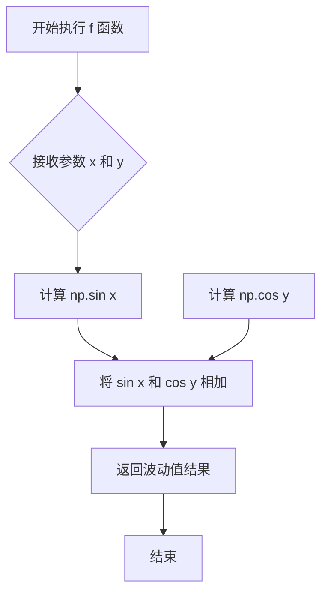
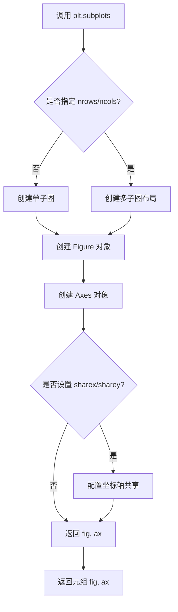
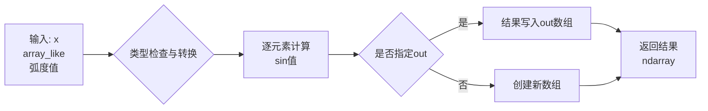
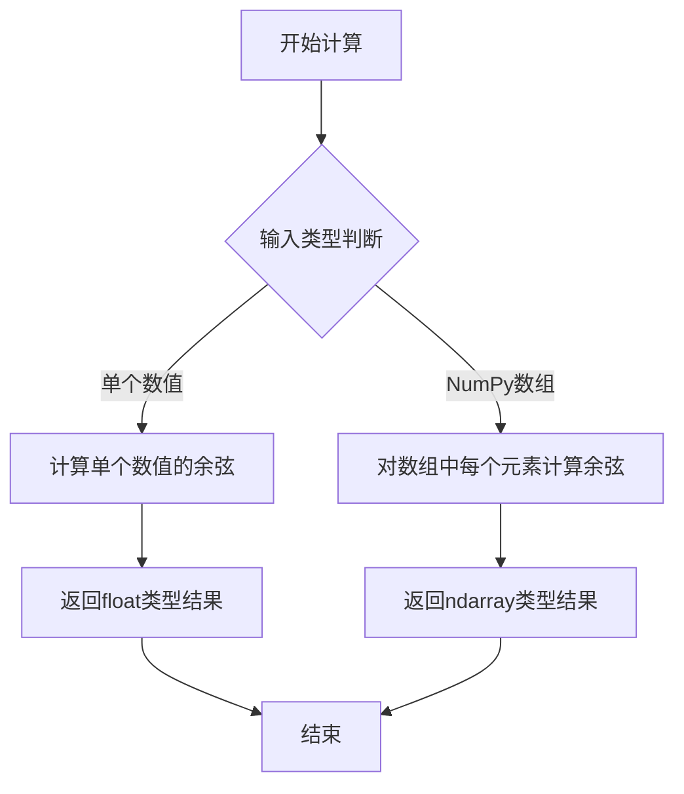
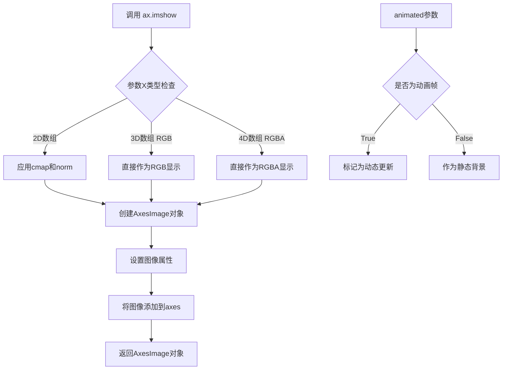
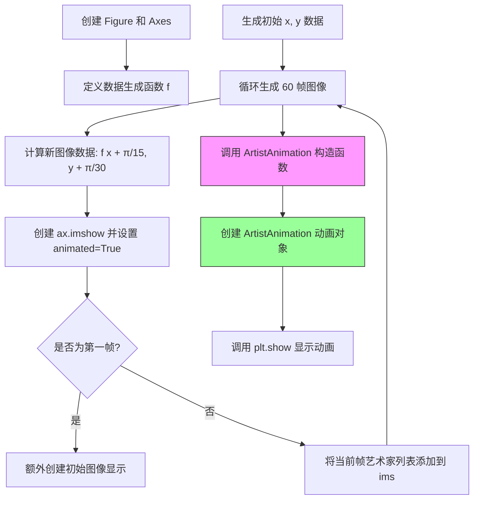
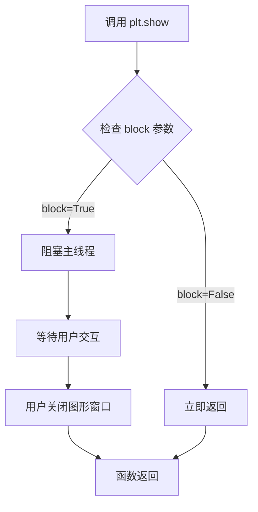
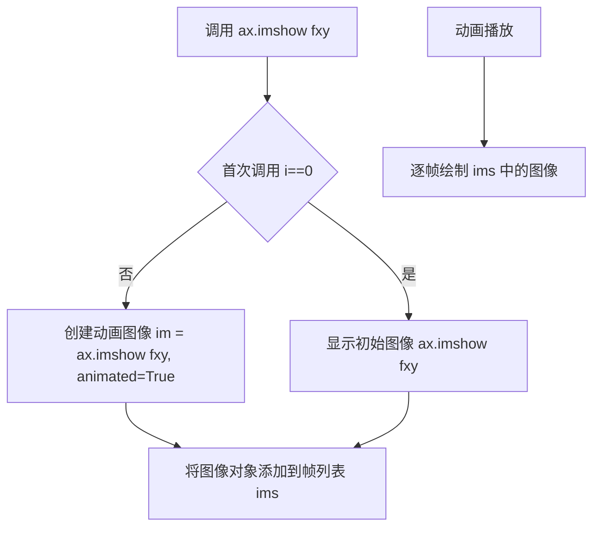

# `matplotlib\galleries\examples\animation\dynamic_image.py` 详细设计文档

该代码使用matplotlib的ArtistAnimation类创建了一个动态图像动画，通过预计算60帧连续的sin(x)+cos(y)函数图像，展示了一个随时间平滑变化的波动效果的可视化程序。

## 整体流程

```mermaid
graph TD
A[开始] --> B[导入模块]
B --> C[创建图形和坐标轴 fig, ax]
C --> D[定义数学函数 f(x,y) = sin(x) + cos(y)]
D --> E[初始化数据 x, y]
E --> F{循环 i 从 0 到 59}
F -->|每次迭代| G[更新 x 和 y 值]
G --> H[创建当前帧图像 im]
H --> I{是否为第一帧?}
I -- 是 --> J[显示初始图像]
I -- 否 --> K[跳过]
J --> L[将图像添加到帧列表]
K --> L
L --> M[循环结束?]
M -- 否 --> F
M -- 是 --> N[创建 ArtistAnimation 对象]
N --> O[调用 plt.show() 显示动画]
O --> P[结束]
```

## 类结构

```
matplotlib.pyplot (模块)
├── Figure (类)
└── Axes (类)
numpy (模块)
├── linspace (函数)
└── reshape (函数)
matplotlib.animation (模块)
└── ArtistAnimation (类)
```

## 全局变量及字段


### `fig`
    
matplotlib Figure 对象，动画的主图形

类型：`matplotlib.figure.Figure`
    


### `ax`
    
matplotlib Axes 对象，坐标轴对象

类型：`matplotlib.axes.Axes`
    


### `x`
    
numpy 数组，x轴数据，范围0到2π，共120个点

类型：`numpy.ndarray`
    


### `y`
    
numpy 数组，y轴数据，范围0到2π，reshaped为(100,1)

类型：`numpy.ndarray`
    


### `ims`
    
列表，存储动画的所有帧，每帧是一个包含图像的列表

类型：`list`
    


### `ani`
    
ArtistAnimation 对象，整个动画对象

类型：`matplotlib.animation.ArtistAnimation`
    


### `f`
    
计算函数，返回 np.sin(x) + np.cos(y)

类型：`function`
    


    

## 全局函数及方法


### `f(x, y)`

该函数是一个数学辅助函数，用于计算两个输入值的正弦和余弦之和，生成波动值，常用于动态可视化场景中产生周期性波动效果。

参数：

-  `x`：`numpy.ndarray` 或 `float`，输入角度（弧度），作为`np.sin()`的输入参数
-  `y`：`numpy.ndarray` 或 `float`，输入角度（弧度），作为`np.cos()`的输入参数

返回值：`numpy.ndarray` 或 `float`，返回`np.sin(x) + np.cos(y)`的计算结果，表示由正弦和余弦组合而成的波动值

#### 流程图



#### 带注释源码

```python
def f(x, y):
    """
    数学函数，计算 np.sin(x) + np.cos(y)，返回波动值
    
    参数:
        x: 输入角度（弧度），可以是数值或数组
        y: 输入角度（弧度），可以是数值或数组
    
    返回:
        np.sin(x) + np.cos(y) 的计算结果
    """
    return np.sin(x) + np.cos(y)  # 计算正弦与余弦之和，返回波动结果
```


### `plt.subplots()`

创建图形窗口及其关联的坐标轴对象，是 matplotlib 中初始化绘图环境的核心函数。

#### 参数

- `nrows`：`int`，默认值 1，子图的行数
- `ncols`：`int`，默认值 1，子图的列数
- `sharex`：`bool` 或 `str`，默认值 False，如果为 True，则所有子图共享 x 轴
- `sharey`：`bool` 或 `str`，默认值 False，如果为 True，则所有子图共享 y 轴
- `squeeze`：`bool`，默认值 True，如果为 True，则返回的坐标轴数组维度会被压缩
- `width_ratios`：`array-like`，可选，各列的宽度比例
- `height_ratios`：`array-like`，可选，各行的高度比例
- `subplot_kw`：`dict`，可选，创建子图的额外关键字参数
- `gridspec_kw`：`dict`，可选，GridSpec 的额外关键字参数
- `**fig_kw`：创建 Figure 的额外关键字参数（如 figsize, dpi 等）

#### 返回值

- `fig`：`matplotlib.figure.Figure`，图形对象，表示整个图形窗口
- `ax`：`matplotlib.axes.Axes` 或 `numpy.ndarray`，坐标轴对象或坐标轴数组

#### 流程图



#### 带注释源码

```python
# 代码中的调用方式
fig, ax = plt.subplots()

# 等效的完整调用（包含默认参数）
fig, ax = plt.subplots(
    nrows=1,        # 默认创建 1 行子图
    ncols=1,        # 默认创建 1 列子图
    sharex=False,   # 不共享 x 轴
    sharey=False,   # 不共享 y 轴
    squeeze=True,   # 压缩返回的坐标轴维度
    width_ratios=None,   # 列宽度比例（未指定）
    height_ratios=None,  # 行高度比例（未指定）
    subplot_kw=None,     # 子图额外参数（无）
    gridspec_kw=None,    # GridSpec 额外参数（无）
    **{}                 # Figure 额外参数（空字典）
)

# 详细注释：
# 1. fig 是 Figure 对象，代表整个图形窗口容器
# 2. ax 是 Axes 对象，代表图形中的绘图区域
# 3. 在此代码中，ax 用于后续的 ax.imshow() 调用来显示动画图像帧
```


### `np.linspace`

`np.linspace` 是 NumPy 库中的一个核心函数，用于在指定的间隔内生成等间距的数值序列，返回一个一维数组。该函数在数值计算、数据可视化、信号处理等领域广泛应用，能够方便地创建均匀分布的采样点。

参数：

- `start`：`scalar`，序列的起始值
- `stop`：`scalar`，序列的结束值（除非 `endpoint` 为 `False`）
- `num`：`int`，默认为 50，生成样本的数量
- `endpoint`：`bool`，默认为 `True`，如果为 `True`，则 `stop` 是最后一个样本；否则不包括在内
- `retstep`：`bool`，默认为 `False`，如果为 `True`，则返回 `(samples, step)`，其中 `step` 是样本之间的间距
- `dtype`：`dtype`，输出数组的数据类型，如果没有指定，则从 `start` 和 `stop` 推断
- `axis`：`int`，结果中存储样本的轴（如果 `start`、`stop` 或 `stop - start` 是数组_like），仅当 `start` 或 `stop` 是数组_like 时使用

返回值：`ndarray`，返回等间距的样本数组

#### 流程图

```mermaid
flowchart TD
    A[开始] --> B{检查 start 和 stop 参数}
    B --> C{是否提供 dtype?}
    C -->|是| D[使用提供的 dtype]
    C -->|否| E[从 start 和 stop 推断 dtype]
    D --> F{retstep 是否为 True?}
    E --> F
    F -->|是| G[返回 samples 和 step]
    F -->|否| H[仅返回 samples]
    G --> I[结束]
    H --> I
    
    J[计算 step] --> F
    K{endpoint 是否为 True?}
    K -->|是| L[step = (stop - start) / (num - 1)]
    K -->|否| M[step = (stop - start) / num]
    L --> J
    M --> J
```

#### 带注释源码

```python
def linspace(start, stop, num=50, endpoint=True, retstep=False, dtype=None, axis=0):
    """
    在指定的间隔内返回等间距的数字序列。
    
    参数:
    -----------
    start : array_like
        序列的起始值。
    stop : array_like
        序列的结束值，除非 endpoint 为 False。
    num : int, optional
        要生成的样本数量。默认为 50。
    endpoint : bool, optional
        如果为 True，stop 是最后一个样本。否则，不包括在内。默认为 True。
    retstep : bool, optional
        如果为 True，返回 (samples, step)，其中 step 是样本之间的间距。
    dtype : dtype, optional
        输出数组的类型。
    axis : int, optional
        结果中存储样本的轴（如果 start 或 stop 是数组）。
    
    返回:
    -------
    samples : ndarray
        如果 retstep 为 False，则返回等间距的样本。
    step : float
        如果 retstep 为 True，则额外返回样本之间的间距。
    """
    
    # 将 start 和 stop 转换为 NumPy 数组
    start = asanyarray(start)
    stop = asanyarray(stop)
    
    # 计算样本数量
    if num <= 0:
        return array([], dtype=dtype)
    
    # 计算步长
    if endpoint:
        if num == 1:
            # 只有一个样本时，返回 start
            if retstep:
                return array([start[0]]), zeros_like(start[0])
            return array([start[0]])
        step = (stop - start) / (num - 1)
    else:
        step = (stop - start) / num
    
    # 构建结果数组
    if dtype is None:
        # 推断数据类型
        dtype = _find_common_dtype(start, stop, step)
    
    # 使用步长创建数组
    y = _arange(num, dtype=dtype) * step + start
    
    # 如果 axis 不为 0，调整结果的形状
    if axis != 0:
        y = y.reshape([1] * axis + list(y.shape))
    
    if retstep:
        return y, step
    return y
```


### `np.sin()` / `numpy.sin`

正弦函数，计算输入数组中每个元素的正弦值（假设输入为弧度制）。该函数是NumPy库提供的三角函数之一，常用于数学计算、信号处理、动画生成等场景。

参数：

- `x`：`array_like`，输入角度值（单位为弧度），可以是标量、列表或NumPy数组
- `out`：`ndarray, None, or tuple of ndarray, optional`，可选的输出数组，用于存储结果
- `where`：`array_like, optional`，可选的条件数组，指定哪些位置需要计算
- `dtype`：`data-type, optional`，指定输出的数据类型
- `subok`：`bool, optional`，是否允许生成子类
- `signature`：`string, optional`，用于Generic柳叶刀函数的签名

返回值：`ndarray`，返回输入数组每个元素的正弦值组成的数组，值的范围在[-1, 1]之间

#### 流程图



#### 带注释源码

```python
def f(x, y):
    """
    计算二维函数的组合值
    
    参数:
        x: x坐标数组
        y: y坐标数组
    返回:
        正弦和余弦的组合值
    """
    # np.sin(x): 计算x数组中每个元素的正弦值
    # np.cos(y): 计算y数组中每个元素的余弦值
    # 两者相加得到组合结果
    return np.sin(x) + np.cos(y)

# 在动画循环中调用f函数生成每一帧的图像数据
for i in range(60):
    x += np.pi / 15   # 每次增加π/15弧度
    y += np.pi / 30   # 每次增加π/30弧度
    im = ax.imshow(f(x, y), animated=True)  # 显示计算结果
    if i == 0:
        ax.imshow(f(x, y))  # 显示初始帧
    ims.append([im])
```


### `np.cos`

这是NumPy库提供的余弦函数，用于计算输入数组或数值的余弦值。在给定代码中，f(x, y)函数使用np.cos(y)来计算y的余弦值，然后与np.sin(x)相加生成波动图案。

参数：

-  `y`：`numpy.ndarray` 或 `float`，输入的角度值（弧度制），可以是单个数值或NumPy数组

返回值：`numpy.ndarray` 或 `float`，返回输入值的余弦结果，类型与输入相同

#### 流程图



#### 带注释源码

```python
# 定义函数 f(x, y)，计算波动图案的数值
def f(x, y):
    # 返回 x 的正弦值加上 y 的余弦值
    # np.sin(x): 计算 x 的正弦值
    # np.cos(y): 计算 y 的余弦值，这是我们要提取的函数
    # 参数 y 可以是单个数值或 NumPy 数组
    # 返回值是与输入类型相同的余弦计算结果
    return np.sin(x) + np.cos(y)

# 在主程序中，x 和 y 是 NumPy 数组
x = np.linspace(0, 2 * np.pi, 120)
y = np.linspace(0, 2 * np.pi, 100).reshape(-1, 1)

# 调用 f(x, y) 时，内部会执行 np.cos(y)
# y 是一个 (100, 1) 形状的数组
# np.cos(y) 会对数组中每个元素计算余弦值
im = ax.imshow(f(x, y), animated=True)
```


### `matplotlib.axes.Axes.imshow`

在 matplotlib 的 Axes 对象上显示图像数据，支持多种颜色映射、归一化和插值方法，并返回用于后续操作的 AxesImage 对象。

参数：

-  `X`：数组-like，图像数据，可以是 MxN（亮度）、MxNx3（RGB）或 MxNx4（RGBA）
-  `cmap`：str 或 `Colormap`，可选，颜色映射名称，默认为 `rcParams["image.cmap"]`
-  `norm`：`Normalize`，可选，数据归一化实例
-  `aspect`：float 或 'auto'，可选，图像的纵横比
-  `interpolation`：str，可选，插值方法（如 'nearest', 'bilinear', 'bicubic' 等）
-  `vmin`, `vmax`：float，可选，归一化的最小值和最大值
-  `origin`：{'upper', 'lower'}，可选，图像方向的起始位置
-  `extent`：floats (left, right, bottom, top)，可选，数据坐标中图像的范围
-  `filternorm`：bool，可选，是否过滤归一化
-  `filterrad`：float，可选过滤器半径
-  `resample`：bool，可选，是否重采样
-  `url`：str，可选，设置axes属性以引用指定URL的资源
-  `**kwargs`：`Artist` 关键字参数，用于控制显示的各个方面

返回值：`matplotlib.image.AxesImage`，返回创建的 AxesImage 对象，用于后续对图像的修改或查询

#### 流程图



#### 带注释源码

```python
# 代码中的实际调用示例

# 第一次调用：在循环中创建动画帧
# f(x, y) 计算正弦和余弦的叠加值，返回一个2D数组
im = ax.imshow(f(x, y), animated=True)
# 参数说明：
#   - f(x, y): 2D数组，作为图像的亮度数据
#   - animated=True: 标记此图像为动画帧，用于blit加速渲染

if i == 0:
    # 第二次调用：在第一帧显示初始图像作为背景
    ax.imshow(f(x, y))  
    # 参数说明：
    #   - 无animated参数，默认为False，作为静态背景层
    #   - 这样动画运行时，静态背景保持不变

# imshow 内部处理流程：
# 1. 接收图像数据 X（可以是2D、3D或4D数组）
# 2. 根据数组维度判断显示模式：
#    - 2D: 使用cmap颜色映射显示灰度图
#    - MxNx3: 直接显示RGB彩色图像
#    - MxNx4: 直接显示RGBA带透明通道的图像
# 3. 创建AxesImage对象并配置
# 4. 将图像添加到Axes的艺术家集合中
# 5. 调整Axes的视图范围以适应图像
# 6. 返回AxesImage对象供后续操作
```


### `animation.ArtistAnimation`

这是 matplotlib.animation 模块中的类，用于通过预计算的艺术 家图像列表创建动画。它接受一个图形对象和一个图像列表（在每个帧中要绘制的艺术家列表），然后生成一个可播放的动画对象。

参数：

- `fig`：`matplotlib.figure.Figure`，要在其中进行动画绑定的图形对象
- `ims`：列表的列表（List[List[Artist]]），每个子列表包含在当前帧要绘制的艺术家对象列表，这里是每帧的图像
- `interval`：`int`，帧之间的延迟时间（毫秒），默认 200
- `repeat_delay`：`int`，动画重复播放前的延迟时间（毫秒），默认 0
- `repeat`：`bool`，是否循环播放动画，默认 True
- `blit`：`bool`，是否使用 blitting 优化绘制（只重绘变化的像素），默认 False
- `cache_frame_data`：`bool`，是否缓存帧数据以提高性能，默认 True
- `init_func`：可调用对象（可选），用于初始化动画的函数
- `**kwargs`：其他关键字参数，传递给父类 FuncAnimation

返回值：`matplotlib.animation.ArtistAnimation`，生成的动画对象，可以调用 `save()` 保存或 `show()` 显示

#### 流程图



#### 带注释源码

```python
import matplotlib.pyplot as plt
import numpy as np
import matplotlib.animation as animation

# 创建一个新的图形和坐标轴
fig, ax = plt.subplots()

# 定义一个二维函数，用于生成图像数据
def f(x, y):
    return np.sin(x) + np.cos(y)

# 生成初始的 x 和 y 数据
# x: 0 到 2π 之间的 120 个点
# y: 0 到 2π 之间的 100 个点，重塑为列向量
x = np.linspace(0, 2 * np.pi, 120)
y = np.linspace(0, 2 * np.pi, 100).reshape(-1, 1)

# ims 是一个列表的列表，每行是在当前帧要绘制的艺术家列表
# 这里每帧只动画一个艺术家：图像
ims = []

# 循环生成 60 帧动画
for i in range(60):
    # 更新 x 和 y 的相位，产生动态效果
    x += np.pi / 15
    y += np.pi / 30
    
    # 使用 ax.imshow 创建图像艺术家
    # animated=True 参数使该图像参与动画绘制
    im = ax.imshow(f(x, y), animated=True)
    
    # 如果是第一帧，先显示一个初始图像（不参与动画）
    if i == 0:
        ax.imshow(f(x, y))  # 显示初始帧
    
    # 将当前帧的艺术家列表添加到 ims
    # 注意：必须包装为列表 [im]，因为 ArtistAnimation
    # 期望每个元素是一个艺术家列表
    ims.append([im])

# 创建 ArtistAnimation 动画对象
# 参数说明：
# - fig: 绑定的图形对象
# - ims: 帧艺术家列表
# - interval=50: 每帧间隔 50 毫秒
# - blit=True: 使用 blitting 优化，只重绘变化的像素
# - repeat_delay=1000: 动画结束后延迟 1000 毫秒再重复
ani = animation.ArtistAnimation(
    fig,               # 图形对象
    ims,               # 图像列表
    interval=50,       # 帧间隔（毫秒）
    blit=True,         # 启用 blit 优化
    repeat_delay=1000  # 重复延迟（毫秒）
)

# 显示动画
plt.show()
```


### `plt.show()`

`plt.show()` 是 Matplotlib 库中的顶层显示函数，用于将所有打开的图形窗口显示在屏幕上，并进入交互式显示模式。该函数会阻塞程序执行（除非设置了 `block=False`），直到用户关闭图形窗口或关闭所有窗口。

参数：

- `block`：`bool`，可选参数。默认为 `True`，表示阻塞程序执行直到图形窗口关闭；若设置为 `False`，则立即返回，允许程序继续执行。

返回值：`None`，无返回值。该函数主要作用是触发图形渲染和显示，不返回任何数据。

#### 流程图



#### 带注释源码

```python
# 导入 matplotlib.pyplot 模块，用于绑图和显示
import matplotlib.pyplot as plt
import numpy as np
import matplotlib.animation as animation

# 创建一个新的图形窗口和坐标系
fig, ax = plt.subplots()

# 定义一个二维函数 f(x, y) = sin(x) + cos(y)
def f(x, y):
    return np.sin(x) + np.cos(y)

# 生成 x 和 y 的取值范围
x = np.linspace(0, 2 * np.pi, 120)
y = np.linspace(0, 2 * np.pi, 100).reshape(-1, 1)

# 创建一个空列表，用于存储每一帧的图像
ims = []
# 循环生成 60 帧动画
for i in range(60):
    # 更新 x 和 y 的值，实现动画效果
    x += np.pi / 15
    y += np.pi / 30
    # 创建当前帧的图像，animated=True 表示这是动画帧
    im = ax.imshow(f(x, y), animated=True)
    # 第一帧额外显示一个初始图像
    if i == 0:
        ax.imshow(f(x, y))  # show an initial one first
    # 将当前帧的图像添加到列表中（注意需要包装成列表）
    ims.append([im])

# 创建 ArtistAnimation 对象
# fig: 图形对象
# ims: 帧列表
# interval=50: 每帧间隔 50 毫秒
# blit=True: 使用 blit 优化渲染
# repeat_delay=1000: 动画结束后等待 1000 毫秒再重复
ani = animation.ArtistAnimation(fig, ims, interval=50, blit=True,
                                repeat_delay=1000)

# ================================================
# 核心函数调用：plt.show()
# ================================================
# 显示所有打开的图形窗口，进入交互模式
# 默认 block=True，会阻塞主线程直到用户关闭窗口
plt.show()

# %%
# .. tags:: component: animation
```


### `Axes.imshow`

在matplotlib中，`Axes.imshow` 是Axes类的一个核心方法，用于在二维坐标轴上显示图像或矩阵数据。该方法接收一个2D数组（灰度图像）或3D数组（RGB/RGBA图像），并将其渲染为坐标系中的图像，同时支持多种颜色映射、插值方式和显示参数配置。

参数：

- `X`：ndarray，要显示的图像数据，可以是2D（灰度）或3D（RGB/RGBA）数组
- `cmap`：str 或 Colormap，可选，颜色映射名称，默认为None（使用默认灰度或viridis）
- `norm`：Normalize，可选，数据归一化对象，用于将数据值映射到颜色范围
- `aspect`：float 或 'auto'，可选，控制图像的纵横比
- `interpolation`：str，可选，插值方法（如 'bilinear', 'nearest', 'bicubic' 等）
- `alpha`：float，可选，透明度值，范围0-1
- `vmin, vmax`：float，可选，颜色映射的最小/最大值范围
- `origin`：{'upper', 'lower'}，可选，图像原点的位置
- `extent`：list，可选，图像在 Axes 坐标系中的范围 [left, right, bottom, top]
- `animated`：bool，可选，如果为True，该图像对象将用于动画制作

返回值：`matplotlib.image.AxesImage`，返回创建的图像对象，可用于进一步操作（如获取数据、设置属性等）

#### 流程图



#### 带注释源码

```python
# 导入必要的库
import matplotlib.pyplot as plt
import numpy as np
import matplotlib.animation as animation

# 创建图形和坐标轴
fig, ax = plt.subplots()

# 定义计算函数：返回 sinx + cosy 的结果矩阵
def f(x, y):
    return np.sin(x) + np.cos(y)

# 生成网格数据
x = np.linspace(0, 2 * np.pi, 120)  # x轴数据点
y = np.linspace(0, 2 * np.pi, 100).reshape(-1, 1)  # y轴数据点，reshape为列向量

# 初始化动画帧列表
ims = []

# 循环生成60帧动画
for i in range(60):
    # 更新x和y的值，产生动态效果
    x += np.pi / 15
    y += np.pi / 30
    
    # 调用 imshow 方法显示图像
    # 参数: f(x, y) - 计算得到的2D矩阵数据
    # animated=True - 标记为动画帧，提升渲染性能
    im = ax.imshow(f(x, y), animated=True)
    
    # 首次迭代时额外显示一个静态初始图像
    if i == 0:
        ax.imshow(f(x, y))  # show an initial one first
    
    # 将当前帧的图像对象添加到列表中（imshow返回AxesImage对象）
    ims.append([im])

# 创建 ArtistAnimation 动画对象
# fig: 绑定的图形对象
# ims: 动画帧列表
# interval=50: 每帧间隔50毫秒
# blit=True: 使用位图绘制优化，提高性能
# repeat_delay=1000: 动画结束后延迟1秒再重复
ani = animation.ArtistAnimation(fig, ims, interval=50, blit=True,
                                repeat_delay=1000)

# 显示图形
plt.show()
```

#### 关键组件信息

| 组件名称 | 一句话描述 |
|---------|-----------|
| `AxesImage` | matplotlib中表示Axes上图像的艺术家对象，由imshow返回 |
| `ArtistAnimation` | 基于艺术家对象列表的动画类，管理动画帧的渲染和播放 |
| `f(x, y)` | 计算正弦和余弦之和的函数，生成动态变化的2D矩阵数据 |

#### 潜在的技术债务或优化空间

1. **数据重复计算**：在循环中，`f(x, y)` 被计算了两次——一次用于 `im = ax.imshow(f(x, y), animated=True)`，一次在 `if i == 0` 分支中。可以优化为先计算一次并复用。
2. **内存占用**：所有帧的图像数据都存储在 `ims` 列表中，对于长时间动画可能导致内存问题，考虑使用 `FuncAnimation` 代替按需生成帧。
3. **魔法数字**：代码中包含多个魔数（如 `120`, `100`, `60`, `π/15`, `π/30`, `50`, `1000`），应提取为常量或配置参数。

#### 其它项目

**设计目标与约束**：
- 目标：创建一个展示动态变化数学函数图像的动画
- 约束：使用 `ArtistAnimation` 而非 `FuncAnimation`，因为它更简单直接

**错误处理与异常设计**：
- 如果 `f(x, y)` 返回的数组维度不符合要求（如空数组），imshow将抛出 ValueError
- 如果数据包含 NaN 或 Inf 值，图像显示可能异常

**数据流与状态机**：
- 状态流：初始化 → 数据更新 → 图像渲染 → 帧收集 → 动画播放
- 动画使用 `blit=True` 优化，仅重绘变化的像素区域

**外部依赖与接口契约**：
- 依赖：`matplotlib`, `numpy`
- 接口：imshow 接收 ndarray，返回 AxesImage 对象


## 关键组件


### 图像生成函数 f(x, y)

使用numpy的sin和cos函数计算图像像素值，生成动态变化的数学函数可视化数据

### 坐标数组 x, y

创建基于linspace的网格坐标，x为120个点的一维数组，y为100个点的列向量，用于生成二维图像网格

### 动画帧列表 ims

存储每一帧要绘制的图像对象列表，每帧包含一个imshow生成的图像艺术家对象

### ArtistAnimation 动画类

matplotlib.animation.ArtistAnimation是核心动画类，接收fig画布、ims帧列表和动画参数创建动画对象

### ax.imshow 图像显示

在坐标轴上显示二维数组作为彩色图像，animated=True参数确保在动画中逐帧更新

### 动画参数配置

interval设置帧间隔50ms，blit=True启用高效重绘优化，repeat_delay设置1000ms的重播延迟

### 图形与坐标轴对象 fig, ax

plt.subplots()创建的Figure对象和Axes对象，作为动画的容器和图像显示的画布


## 问题及建议


### 已知问题

-   **变量重复计算浪费资源**：循环中 `f(x, y)` 被计算了两次（`im = ax.imshow(f(x, y))` 和 `if i == 0: ax.imshow(f(x, y))`），每次迭代都会产生冗余计算
-   **魔法数字缺乏可读性**：代码中多处使用硬编码数值（如 `120`, `100`, `60`, `50`, `1000`, `pi/15`, `pi/30`），缺乏常量定义，可维护性差
-   **全局变量污染**：函数 `f` 和数据 `x`, `y` 在模块级别定义，可能与其他模块产生命名冲突
-   **内存占用风险**：`ims` 列表存储全部60帧的图像对象，对于更长的动画序列会导致显著的内存压力
-   **缺少输入参数校验**：没有对数据范围、数组维度等进行校验，可能在异常输入下产生难以追踪的错误
-   **未使用的导入**：`np` 导入但部分功能可通过其他方式实现，存在冗余依赖
-   **注释代码未清理**：保存动画的示例代码被注释保留在代码中，影响代码整洁度

### 优化建议

-   将所有魔法数字提取为模块级常量（如 `FRAMES = 60`, `INTERVAL_MS = 50`, `X_POINTS = 120` 等），提升可维护性
-   重构循环逻辑，仅计算一次 `f(x, y)` 并复用结果，避免重复计算
-   考虑使用 `FuncAnimation` 替代 `ArtistAnimation`，按需计算帧数据而非预生成全部帧，以降低内存占用
-   将函数 `f` 封装进类或使用命名空间模块，避免全局作用域污染
-   添加输入参数范围校验和数据类型检查，提升代码健壮性
-   清理注释掉的保存代码，或将其移至独立的工具函数中
-   考虑添加类型注解（type hints），增强代码可读性和 IDE 支持
-   将 `plt.show()` 包装在 `if __name__ == "__main__":` 块中，支持模块导入时不被执行


## 其它


### 设计目标与约束

本代码的目标是使用matplotlib的ArtistAnimation类创建一个基于预计算图像列表的动画。设计约束包括：动画使用blit=True以提高渲染性能，帧间隔为50毫秒，重复延迟为1000毫秒，动画数据存储在内存中（ims列表），适用于中小型动画场景。

### 错误处理与异常设计

代码主要依赖matplotlib和numpy库。潜在异常包括：ImportError（缺少依赖库）、MemoryError（图像数据过大导致内存不足）、RuntimeError（动画创建失败）。当前代码未实现显式异常处理，建议在生产环境中添加try-except块捕获异常，特别是动画创建和显示阶段。

### 数据流与状态机

数据流：输入参数(x, y网格) → f(x,y)函数计算 → 生成2D数组 → ax.imshow()渲染 → 添加到ims列表 → ArtistAnimation组合 → plt.show()显示。状态机包含：初始化状态（创建图形）→ 帧生成状态（循环计算60帧）→ 动画就绪状态 → 显示状态。

### 外部依赖与接口契约

主要依赖：matplotlib>=3.0、numpy>=1.16。关键接口：animation.ArtistAnimation(fig, ims, interval, blit, repeat_delay)构造函数参数包括fig（图形对象）、ims（帧列表）、interval（帧间隔毫秒）、blit（是否使用blit优化）、repeat_delay（重复延迟毫秒）。返回值是Animation对象。

### 性能考虑与优化空间

当前实现每次循环都重新计算完整的f(x,y)，可考虑预先计算所有帧数据。blit=True已启用性能优化。内存使用：60帧 × 100×120 数组，建议对长动画使用生成器或内存映射。当前代码未实现保存功能的具体调用，需要时可启用FFMpegWriter。

### 安全性考虑

代码为纯客户端可视化代码，无用户输入验证需求，无敏感数据处理，无网络通信，安全风险较低。主要安全考虑在于依赖库的版本管理和第三方动画编写器的使用。

### 配置参数说明

关键配置参数：x = np.linspace(0, 2*np.pi, 120)（x轴120个采样点）、y = np.linspace(0, 2*np.pi, 100).reshape(-1, 1)（y轴100个采样点）、range(60)（生成60帧动画）、interval=50（每帧50毫秒）、repeat_delay=1000（动画结束后延迟1秒重复）。这些参数可根据需求调整。

### 使用示例和注意事项

保存为视频：ani.save("movie.mp4", writer='ffmpeg', fps=15）。保存为GIF：ani.save("animation.gif", writer='pillow'）。注意：在某些后端（如Qt5Agg）可能不支持blit=True。初始帧通过i==0条件额外显示一次，确保动画开始前有图像显示。plt.show()会阻塞主线程，动画在显示窗口中播放。

### 潜在改进建议

当前代码将所有帧存储在内存中，大型动画会导致内存问题，建议使用FuncAnimation替代实现流式生成。f(x,y)函数可考虑使用numba加速。动画保存功能代码被注释，应提供配置选项启用。缺少文档字符串和类型注解，建议添加以提高可维护性。可添加进度回调函数用于监控动画生成进度。

    