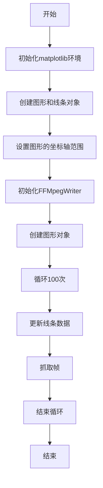
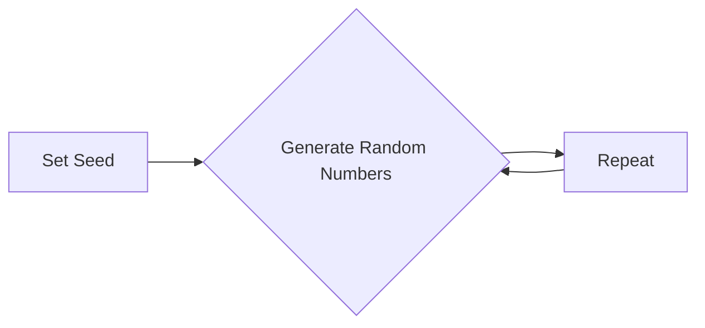
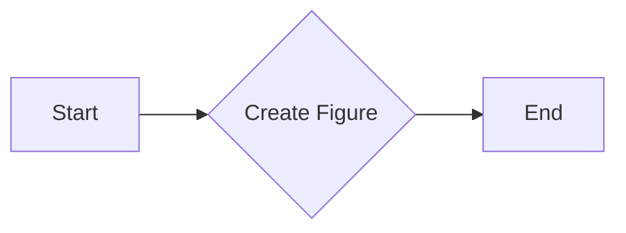
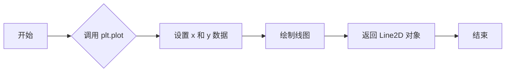
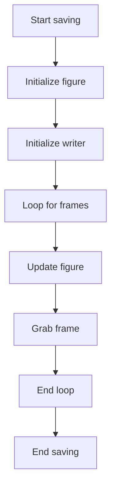
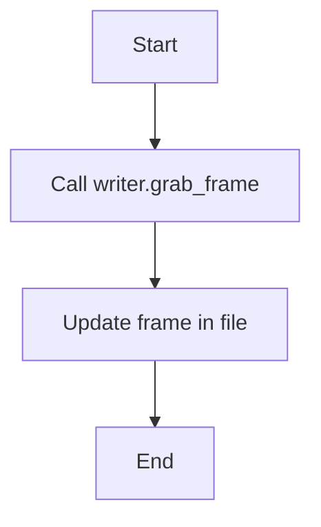
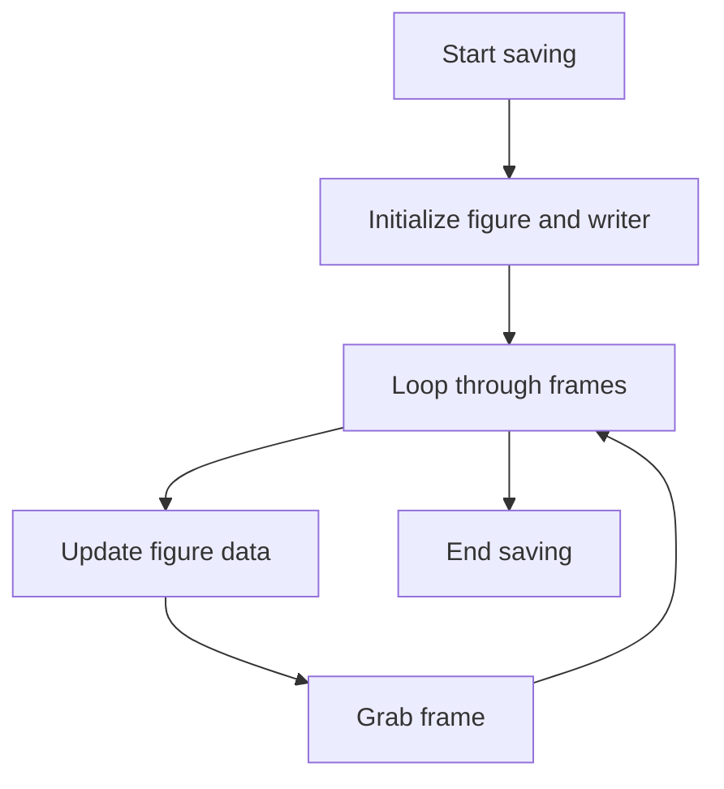
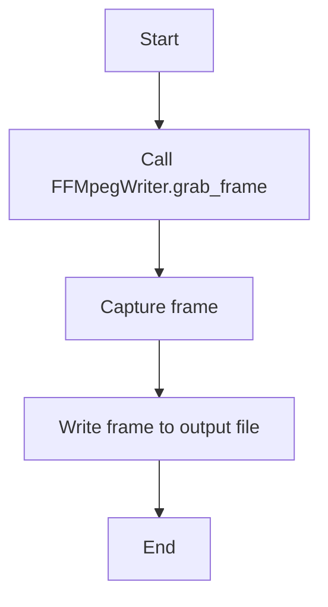
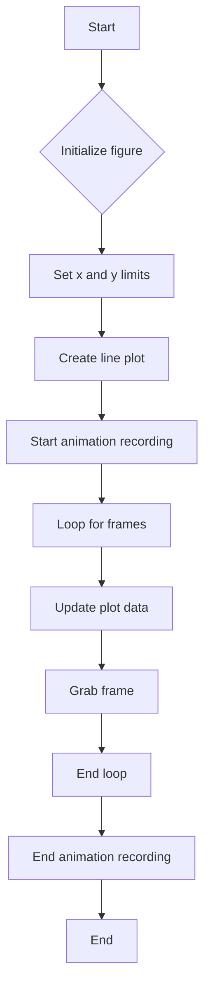

# `matplotlib\galleries\examples\animation\frame_grabbing_sgskip.py` 详细设计文档

This code captures individual frames from a plot and writes them to a file using the FFMpegWriter from matplotlib's animation module.

## 整体流程



## 类结构

```
matplotlib.pyplot (matplotlib模块)
├── FFMpegWriter (动画模块)
│   ├── fig (matplotlib.figure.Figure对象)
│   ├── filename (字符串)
│   ├── fps (浮点数)
│   ├── metadata (字典)
│   └── ...
└── figure (matplotlib.figure.Figure对象)
    ├── l (matplotlib.lines.Line2D对象)
    ├── xlim (元组)
    ├── ylim (元组)
    └── ... 
```

## 全局变量及字段


### `metadata`
    
Dictionary containing metadata for the movie.

类型：`dict`
    


### `writer`
    
FFMpegWriter instance for writing frames to a file.

类型：`FFMpegWriter`
    


### `fig`
    
Matplotlib figure object.

类型：`figure`
    


### `l`
    
Line2D object representing the plot line.

类型：`line2d`
    


### `x0`
    
Initial x-coordinate of the line.

类型：`float`
    


### `y0`
    
Initial y-coordinate of the line.

类型：`float`
    


### `FFMpegWriter.fig`
    
The figure object to which the writer is saving frames.

类型：`figure`
    


### `FFMpegWriter.filename`
    
The filename to which the movie will be saved.

类型：`str`
    


### `FFMpegWriter.fps`
    
The frames per second of the movie.

类型：`int`
    


### `FFMpegWriter.metadata`
    
Metadata for the movie.

类型：`dict`
    


### `figure.l`
    
The line2d object that is plotted on the figure.

类型：`line2d`
    


### `figure.xlim`
    
The x-axis limits of the plot.

类型：`tuple`
    


### `figure.ylim`
    
The y-axis limits of the plot.

类型：`tuple`
    
    

## 全局函数及方法


### np.random.seed

设置NumPy随机数生成器的种子，以确保每次运行代码时生成的随机数序列相同。

参数：

- `seed`：`int`，用于初始化随机数生成器的种子值。

返回值：无

#### 流程图



#### 带注释源码

```python
# Fixing random state for reproducibility
np.random.seed(19680801)
```


### matplotlib.use

`matplotlib.use` 是一个全局函数，用于设置 Matplotlib 的后端。

{描述}

参数：

- `backend`：`str`，指定 Matplotlib 应该使用的后端。例如，"Agg" 是一个不依赖于图形界面的后端，适用于脚本和服务器环境。

返回值：`None`，该函数没有返回值。

#### 流程图

```mermaid
graph TD
    A[Start] --> B[Set backend to "Agg"]
    B --> C[Continue with Matplotlib operations]
```

#### 带注释源码

```python
"""
Set the Matplotlib backend to use.

Parameters:
    backend: str
        The backend to use for Matplotlib.

Returns:
    None
"""
import matplotlib

matplotlib.use("Agg")
```


### plt.figure()

`plt.figure()` 是 Matplotlib 库中的一个函数，用于创建一个新的图形窗口。

参数：

- 无

返回值：`Figure`，表示创建的新图形窗口。

#### 流程图



#### 带注释源码

```python
fig = plt.figure()  # 创建一个新的图形窗口
```


### plt.plot

`plt.plot` 是 Matplotlib 库中用于绘制二维线图的函数。

参数：

- `x`：`array_like`，x 轴的数据点。
- `y`：`array_like`，y 轴的数据点。
- `fmt`：`str`，用于指定线型、标记和颜色。

返回值：`Line2D` 对象，表示绘制的线。

#### 流程图



#### 带注释源码

```python
l, = plt.plot([], [], 'k-o')  # 创建一个空的 Line2D 对象，用于后续绘制
```


### plt.xlim

设置当前轴的x轴限制。

#### 描述

`plt.xlim` 是一个全局函数，用于设置当前轴的x轴限制。它接受两个参数，分别代表x轴的最小值和最大值。

#### 参数

- `xmin`：`float`，x轴的最小值。
- `xmax`：`float`，x轴的最大值。

#### 返回值

无返回值。

#### 流程图

```mermaid
graph LR
A[开始] --> B{调用 plt.xlim(xmin, xmax) }
B --> C[设置x轴限制]
C --> D[结束]
```

#### 带注释源码

```python
# 设置x轴限制为-5到5
plt.xlim(-5, 5)
```


### plt.ylim

`plt.ylim` 是一个用于设置当前轴的 y 轴限制的函数。

参数：

- `ymin`：`float`，y 轴的最小值。
- `ymax`：`float`，y 轴的最大值。

参数描述：

- `ymin` 和 `ymax` 是设置 y 轴显示范围的边界值。

返回值：`None`

返回值描述：`plt.ylim` 函数没有返回值。

#### 流程图

```mermaid
graph LR
A[Start] --> B{Call plt.ylim(ymin, ymax)}
B --> C[End]
```

#### 带注释源码

```
plt.ylim(-5, 5)
```

在这段代码中，`plt.ylim(-5, 5)` 被用来设置当前轴的 y 轴限制为从 -5 到 5。


### writer.saving

`writer.saving` is a method of the `FFMpegWriter` class that is used to start the saving process of a movie to a file.

参数：

- `fig`：`matplotlib.figure.Figure`，The figure to save the movie from.
- `filename`：`str`，The filename of the movie to save.
- `interval`：`int`，The interval between frames in milliseconds.

参数描述：

- `fig`：指定要保存的图像。
- `filename`：指定保存电影的文件名。
- `interval`：指定帧之间的间隔时间。

返回值：`None`

返回值描述：该方法不返回任何值，它用于启动保存电影的过程。

#### 流程图



#### 带注释源码

```python
with writer.saving(fig, "writer_test.mp4", 100):
    for i in range(100):
        x0 += 0.1 * np.random.randn()
        y0 += 0.1 * np.random.randn()
        l.set_data([x0], [y0])
        writer.grab_frame()
```

在这个源码中，`writer.saving` 方法被用来启动保存电影的过程。它接受一个图像对象 `fig`，一个文件名 `filename`，以及帧之间的间隔时间 `interval`。然后，它进入一个循环，在这个循环中，图像被更新，帧被捕获，直到循环结束。


### for i in range(100):

该代码段是一个for循环，用于迭代100次。

参数：

- 无

返回值：无

#### 流程图


#### 带注释源码

```
for i in range(100):
    # 循环100次
```


### l.set_data

`l.set_data` 是一个方法，用于更新 matplotlib 图形对象的 x 和 y 数据。

参数：

- `x`：`numpy.ndarray`，x 轴数据点。
- `y`：`numpy.ndarray`，y 轴数据点。

返回值：无

#### 流程图

```mermaid
graph LR
A[开始] --> B{调用 l.set_data(x, y)}
B --> C[更新图形数据]
C --> D[结束]
```

#### 带注释源码

```python
l, = plt.plot([], [], 'k-o')  # 创建一个图形对象 l

# 更新图形数据
l.set_data([x0], [y0])  # x0 和 y0 是随机生成的数据点
```


### writer.grab_frame

`writer.grab_frame` 是一个方法，用于从动画中捕获当前帧并将其写入文件。

参数：

- 无

返回值：`None`，该方法不返回任何值，但会更新动画的帧文件。

#### 流程图



#### 带注释源码

```python
# 在以下代码块中，writer.grab_frame 被调用以捕获并写入当前帧
with writer.saving(fig, "writer_test.mp4", 100):
    for i in range(100):
        x0 += 0.1 * np.random.randn()
        y0 += 0.1 * np.random.randn()
        l.set_data([x0], [y0])
        # 调用 grab_frame 方法来捕获当前帧
        writer.grab_frame()
```


### FFMpegWriter.__init__

初始化FFMpegWriter对象，设置视频的帧率和其他元数据。

参数：

- `fps`：`int`，视频的帧率。
- `metadata`：`dict`，视频的元数据，如标题、艺术家和注释。

返回值：`None`，无返回值。

#### 流程图

```mermaid
classDiagram
    FFMpegWriter
    FFMpegWriter <|-- FFMpegWriter: +fps: int
    FFMpegWriter <|-- FFMpegWriter: +metadata: dict
    FFMpegWriter <|-- FFMpegWriter: +__init__(fps: int, metadata: dict)
```

#### 带注释源码

```python
class FFMpegWriter:
    def __init__(self, fps, metadata):
        # 初始化FFMpegWriter对象
        # fps: 视频的帧率
        # metadata: 视频的元数据
        pass
``` 


### writer.saving

`writer.saving` is a method of the `FFMpegWriter` class that is used to start the saving process of a movie to a file.

参数：

- `fig`：`matplotlib.figure.Figure`，The figure to save.
- `filename`：`str`，The filename of the movie to save.
- `interval`：`int`，The interval between frames in milliseconds.

参数描述：

- `fig`：指定要保存的matplotlib图形。
- `filename`：指定保存电影的文件名。
- `interval`：指定帧之间的间隔时间，以毫秒为单位。

返回值：`None`

返回值描述：该方法不返回任何值，它用于启动保存过程。

#### 流程图



#### 带注释源码

```python
with writer.saving(fig, "writer_test.mp4", 100):
    for i in range(100):
        x0 += 0.1 * np.random.randn()
        y0 += 0.1 * np.random.randn()
        l.set_data([x0], [y0])
        writer.grab_frame()
```


### FFMpegWriter.grab_frame

This function is used to capture a single frame from the animation being created by the FFMpegWriter object.

参数：

- `frame`: `matplotlib.animation.Frame`，The frame to be captured. This is typically the current frame of the animation.

返回值：`None`，This function does not return a value. It captures the frame and writes it to the output file.

#### 流程图



#### 带注释源码

```
# Capture a single frame from the animation and write it to the output file.
writer.grab_frame()
```


### figure.__init__

初始化matplotlib图形对象。

参数：

- `fig`：`matplotlib.figure.Figure`，matplotlib图形对象，用于创建和保存动画。

返回值：无

#### 流程图



#### 带注释源码

```python
import numpy as np
import matplotlib
matplotlib.use("Agg")
import matplotlib.pyplot as plt
from matplotlib.animation import FFMpegWriter

# Fixing random state for reproducibility
np.random.seed(19680801)

metadata = dict(title='Movie Test', artist='Matplotlib',
                comment='Movie support!')
writer = FFMpegWriter(fps=15, metadata=metadata)

fig = plt.figure()
l, = plt.plot([], [], 'k-o')

plt.xlim(-5, 5)
plt.ylim(-5, 5)

x0, y0 = 0, 0

with writer.saving(fig, "writer_test.mp4", 100):
    for i in range(100):
        x0 += 0.1 * np.random.randn()
        y0 += 0.1 * np.random.randn()
        l.set_data([x0], [y0])
        writer.grab_frame()
```


## 关键组件


### 张量索引

张量索引用于访问和操作多维数组（张量）中的元素。

### 惰性加载

惰性加载是一种延迟计算或资源分配的策略，直到实际需要时才进行。

### 反量化支持

反量化支持允许在量化过程中对某些操作进行非量化处理，以保持精度。

### 量化策略

量化策略定义了如何将浮点数转换为固定点数表示，以减少计算资源消耗。


## 问题及建议


### 已知问题

-   {问题1}：代码中使用了全局变量 `metadata` 和 `writer`，这可能导致在多线程环境中出现竞态条件。
-   {问题2}：代码中使用了 `matplotlib` 库，这可能导致与其他图形库的兼容性问题。
-   {问题3}：代码中使用了 `FFmpegWriter`，这要求系统上安装了 `ffmpeg`，增加了部署的复杂性。

### 优化建议

-   {建议1}：将全局变量封装在类中，以避免在多线程环境中的竞态条件。
-   {建议2}：考虑使用更通用的图形库，如 `Pillow` 或 `OpenCV`，以提高与其他图形库的兼容性。
-   {建议3}：在代码中添加对 `ffmpeg` 的检查，如果未安装则提供明确的错误信息，以简化部署过程。
-   {建议4}：考虑使用生成器或异步编程来处理动画帧的生成和写入，以提高代码的效率和响应性。
-   {建议5}：在代码中添加日志记录，以便于调试和监控动画生成过程。


## 其它


### 设计目标与约束

- 设计目标：实现一个简单的帧捕获功能，将动画帧写入文件。
- 约束条件：避免使用事件循环集成，确保在Agg后端也能工作；不推荐用于交互式环境。

### 错误处理与异常设计

- 错误处理：代码中未包含显式的错误处理机制。
- 异常设计：应考虑添加异常处理来捕获可能发生的错误，如文件写入失败、绘图库初始化失败等。

### 数据流与状态机

- 数据流：数据流从随机生成的x和y坐标开始，通过matplotlib的绘图功能将它们绘制在图上，并使用FFmpegWriter将帧写入文件。
- 状态机：代码中没有明确的状态机，但存在一个循环，用于生成和保存帧。

### 外部依赖与接口契约

- 外部依赖：代码依赖于numpy、matplotlib和FFmpeg库。
- 接口契约：matplotlib的`FFmpegWriter`类用于帧的捕获和写入，其接口契约应遵循matplotlib的规范。


    