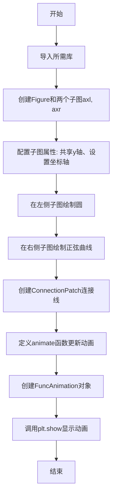
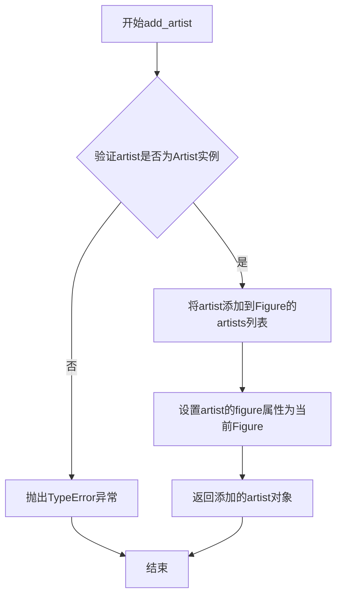
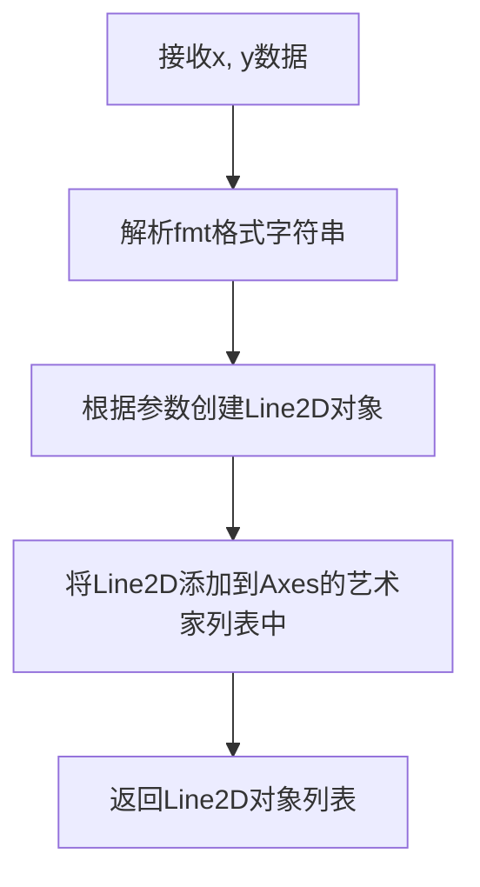
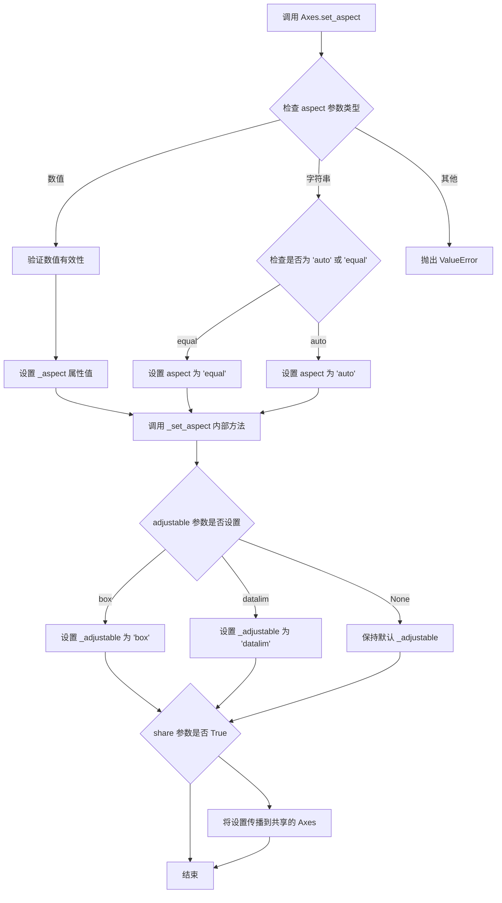
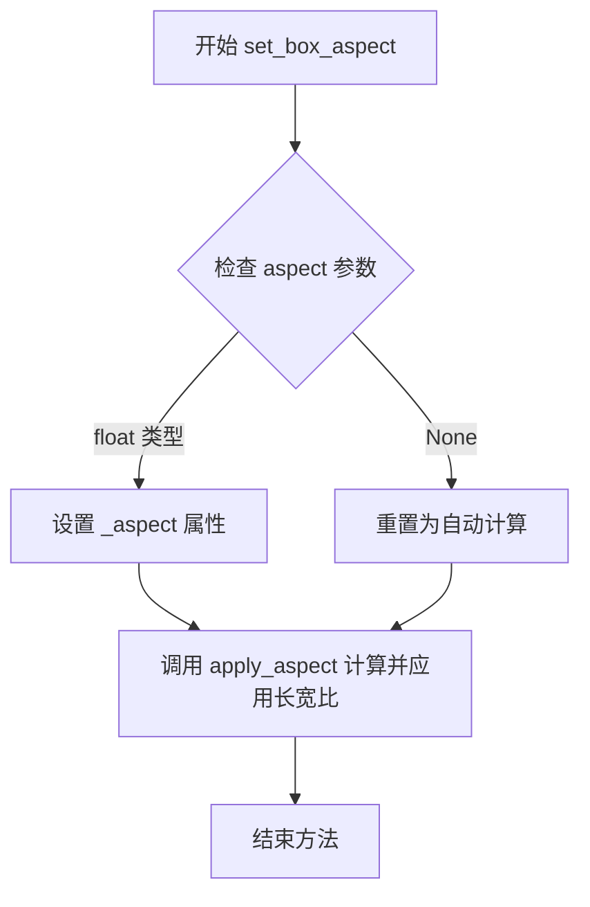
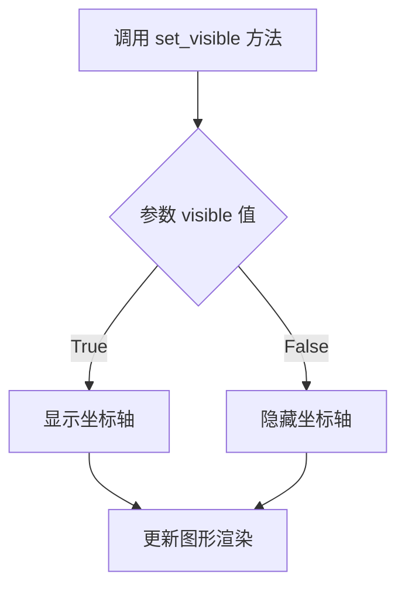
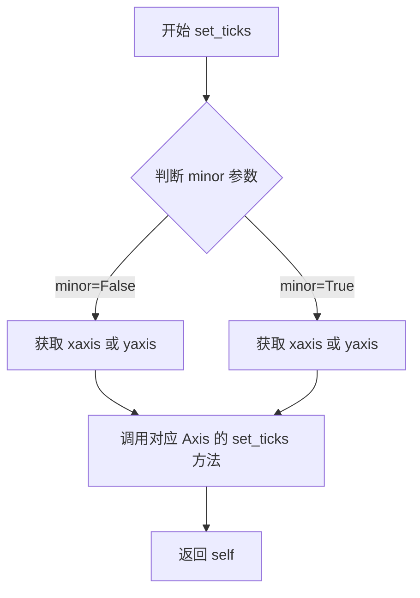

# `matplotlib\galleries\examples\animation\multiple_axes.py` 详细设计文档

这是一个matplotlib多子图动画示例，展示了如何在两个共享y轴的子图间创建协调动画——左侧显示圆周运动，右侧显示对应的正弦曲线，并通过ConnectionPatch在两图之间绘制动态连接线。

## 整体流程



## 类结构

```
Python脚本 (无类层次结构)
├── 导入模块
│   ├── matplotlib.pyplot (plt)
│   ├── numpy (np)
│   ├── matplotlib.animation
│   └── matplotlib.patches.ConnectionPatch
└── 主要执行流程
    ├── 图表初始化 (fig, axl, axr)
    ├── 图形元素 (point, sine, con)
    ├── 动画函数 (animate)
    └── 动画对象 (ani)
```

## 全局变量及字段


### `fig`
    
Figure对象，整个图表容器

类型：`matplotlib.figure.Figure`
    


### `axl`
    
左侧Axes对象，左侧子图

类型：`matplotlib.axes.Axes`
    


### `axr`
    
右侧Axes对象，右侧子图

类型：`matplotlib.axes.Axes`
    


### `x`
    
numpy数组，0到2π的等差数列

类型：`numpy.ndarray`
    


### `point`
    
Line2D对象，圆形上移动的点

类型：`matplotlib.lines.Line2D`
    


### `sine`
    
Line2D对象，正弦曲线

类型：`matplotlib.lines.Line2D`
    


### `con`
    
ConnectionPatch对象，连接线

类型：`matplotlib.patches.ConnectionPatch`
    


### `ani`
    
FuncAnimation对象，动画控制器

类型：`matplotlib.animation.FuncAnimation`
    


### `ConnectionPatch.xy1`
    
连接线起点坐标

类型：`tuple`
    


### `ConnectionPatch.xy2`
    
连接线终点坐标

类型：`tuple`
    
    

## 全局函数及方法


### `animate(i)`

这是 matplotlib `FuncAnimation` 的核心回调函数。它接收帧索引作为输入，计算当前帧下圆上的点、正弦曲线的数据以及连接线的坐标，并将这些需要更新的图形对象（Artist）返回给动画引擎，以实现两个子图之间的联动效果。

参数：

- `i`：`float`，帧索引。在本例中，它代表动画过程中的自变量（角度值 `x`），范围从 0 到 $2\pi$。

返回值：`tuple[matplotlib.artist.Artist]`，需要重绘的艺术家对象列表。本例返回包含左侧轴上的点 `point`、右侧轴上的正弦曲线 `sine` 以及连接线 `ConnectionPatch` 的元组。

#### 流程图

```mermaid
graph TD
    A([开始: 接收帧索引 i]) --> B[生成数据序列: x = np.linspace<br/>(0, i, points_count)]
    B --> C[更新右侧曲线: sine.set_data<br/>(x, np.sin(x))]
    C --> D[计算圆周坐标: x, y = np.cos(i), np.sin(i)]
    D --> E[更新左侧点位置: point.set_data<br/>([x], [y])]
    E --> F[更新连接线端点: 设置 con.xy1 为圆上坐标<br/>设置 con.xy2 为曲线坐标]
    F --> G[返回对象列表: return point, sine, con]
```

#### 带注释源码

```python
def animate(i):
    """
    动画帧更新回调函数。
    参数 i 是由 FuncAnimation 的 frames 参数生成的当前帧数值（此处为角度/弧度）。
    """
    # 1. 根据当前帧索引 i 生成新的 x 轴数据（从 0 到 i）
    # 计算插值点数，保持曲线密度一致
    x = np.linspace(0, i, int(i * 25 / np.pi))
    
    # 2. 更新右侧子图中正弦曲线的数据
    # set_data 方法接受 x, y 两个数组
    sine.set_data(x, np.sin(x))
    
    # 3. 计算圆周运动点在单位圆上的 (x, y) 坐标
    x, y = np.cos(i), np.sin(i)
    
    # 4. 更新左侧子图中标记点的位置
    # set_data 需要接受数组形式，即使只有一个点
    point.set_data([x], [y])
    
    # 5. 更新连接线 (ConnectionPatch) 的两端坐标
    # xy1 是连接到左侧轴 (axesA) 的坐标，即圆上的点
    con.xy1 = x, y
    # xy2 是连接到右侧轴 (axesB) 的坐标，即曲线上的点 (i, y)
    con.xy2 = i, y
    
    # 6. 返回需要重绘的艺术家对象
    # 如果 blit=True，动画引擎仅重绘这里返回的对象以提高性能
    # 注意：即使 blit=False，也必须返回可迭代对象
    return point, sine, con
```


### Figure.add_artist

将给定的Artist对象添加到图形中，是matplotlib中向Figure添加可视化元素的核心方法。

参数：

- `artist`：`Artist`类型，要添加到图形中的Artist对象（如ConnectionPatch、Text、Line2D等）

返回值：`Artist`，返回已添加的Artist对象，以便进行进一步修改或配置

#### 流程图



#### 带注释源码

```python
# 代码示例来自matplotlib动画示例
# 调用Figure.add_artist方法将ConnectionPatch添加到图形中

# 创建两个子图
fig, (axl, axr) = plt.subplots(
    ncols=2,
    sharey=True,
    figsize=(6, 2),
    gridspec_kw=dict(width_ratios=[1, 3], wspace=0),
)

# 创建连接线对象（在两个坐标轴之间绘制连接）
con = ConnectionPatch(
    (1, 0),      # xy1: 第一个坐标点 (x, y)
    (0, 0),      # xy2: 第二个坐标点 (x, y)
    "data",      # coordsA: 第一个点的坐标系
    "data",      # coordsB: 第二个点的坐标系
    axesA=axl,   # axesA: 第一个点所在的axes
    axesB=axr,   # axesB: 第二个点所在的axes
    color="C0",  # color: 连接线颜色
    ls="dotted", # ls: 连接线样式（虚线）
)

# 调用Figure.add_artist方法将ConnectionPatch添加到图形中
# 参数：con - ConnectionPatch对象
# 返回值：返回添加的ConnectionPatch对象
fig.add_artist(con)
```


### matplotlib.axes.Axes.plot

用于在二维坐标轴上绘制线条、标记或两者兼有的方法，通过格式字符串或关键字参数定制线条样式、颜色和标记，并返回创建的线条对象列表。

参数：
- `x`：array-like，x轴数据序列，表示线条的横坐标。
- `y`：array-like，y轴数据序列，表示线条的纵坐标。
- `fmt`：str，可选，格式字符串，定义线条样式、颜色和标记（如 `"k"` 表示黑色线条，`"o"` 表示圆圈标记）。
- `**kwargs`：可变关键字参数，支持 Line2D 的属性，如 `lw`（线宽）、`color`（颜色）、`marker`（标记样式）等。

返回值：`list of matplotlib.lines.Line2D`，返回创建的线条对象列表，每个对象代表一条线或一组标记。

#### 流程图



#### 带注释源码

```python
# 在左轴axl上绘制圆
axl.plot(np.cos(x), np.sin(x), "k", lw=0.3)
# 参数说明：
#   - np.cos(x): x轴数据，余弦值
#   - np.sin(x): y轴数据，正弦值
#   - "k": 格式字符串，表示黑色线条
#   - lw=0.3: 关键字参数，线宽为0.3

# 在左轴axl上绘制单个点
axl.plot(0, 0, "o")
# 参数说明：
#   - 0: x坐标
#   - 0: y坐标
#   - "o": 格式字符串，表示圆圈标记

# 在右轴axr上绘制正弦曲线
axr.plot(x, np.sin(x))
# 参数说明：
#   - x: x轴数据
#   - np.sin(x): y轴数据，正弦值
```


### `Axes.set_aspect`

设置 Axes 的纵横比（aspect ratio），用于控制数据单位在 x 和 y 方向上的显示比例关系。

参数：

- `aspect`：`str` 或 `float`，要设置的纵横比值。可以是 `'auto'`（自动调整）、`'equal'`（使数据单位在 x 和 y 方向相等）或具体的数值（如 1 表示 1:1 的纵横比）
- `adjustable`：`str` 或 `None`，可选参数，指定哪个参数被调整以适应纵横比变化。可以是 `'box'`（调整 axes 框）、`'datalim'`（调整数据限制）或 `None`
- `fill`：`bool`，可选参数，当为 `True` 时，允许 axes 框填充整个可用空间，默认为 `False`
- `share`：`bool`，可选参数，如果为 `True`，则将设置传播到共享的 axes，默认为 `False`
- `pkg`：`str`，可选参数，指定纵横比计算使用的坐标系，可以是 `'data'`（数据坐标）或 `'box'`（ axes 框坐标），默认为 `'data'`

返回值：`None`，该方法直接修改 Axes 对象的状态，不返回任何值。

#### 流程图



#### 带注释源码

```python
def set_aspect(self, aspect, adjustable=None, fill=False, share=False, pkg='data'):
    """
    设置 Axes 的纵横比。
    
    参数:
    aspect : {'auto', 'equal'} 或 float
        - 'auto': 自动化调整，使 axes 填充可用空间
        - 'equal': 相等的数据单位，即 1 个 x 单位 = 1 个 y 单位
        - float: 自定义纵横比 (height / width)
    
    adjustable : {'box', 'datalim'}, optional
        调整哪个参数以适应纵横比:
        - 'box': 调整 axes 框的大小
        - 'datalim': 调整数据限制
    
    fill : bool, optional
        是否允许 axes 框填充整个 axes 位置区域。
    
    share : bool, optional
        是否将设置传播到所有共享的 axes。
    
    pkg : {'data', 'box'}, optional
        纵横比应用的坐标系:
        - 'data': 基于数据坐标（默认）
        - 'box': 基于 axes 框的归一化坐标
    
    返回:
    None
    """
    # 1. 验证 aspect 参数的有效性
    if pkg not in ['data', 'box']:
        raise ValueError("'pkg' must be 'data' or 'box'")
    
    # 2. 处理 'equal' 情况的特殊逻辑
    if aspect == 'equal':
        # 'equal' 实际上在内部存储为数值 1.0
        aspect = 1.0
    
    # 3. 设置内部的 _aspect 属性
    self._aspect = aspect
    
    # 4. 设置 adjustable 参数
    if adjustable is not None:
        self._adjustable = adjustable
    
    # 5. 如果 fill 为 True，设置相关标志
    if fill:
        self._fill = True
    
    # 6. 如果 share 为 True，传播设置到共享的 axes
    if share:
        for ax in self._shared_axes['xy'].values():
            if ax is not self:
                ax.set_aspect(aspect, adjustable=adjustable, fill=fill, share=False, pkg=pkg)
    
    # 7. 触发图形重绘（通常在实际应用中通过 stale 标志）
    self.stale = True
```


### `Axes.set_box_aspect`

设置 Axes 的长宽比（box aspect），用于控制坐标轴区域的显示比例。

参数：

-  `aspect`：`float` 或 `None`，要设置的宽高比值。如果为 `None`，则重置为自动计算。传入数值（如 `1/3`）表示宽度是高度的多少倍。

返回值：`None` 或 `~matplotlib.artist.Artist`，通常返回 `None`，但在某些 Matplotlib 版本中可能返回用于设置长宽比的艺术家对象。

#### 流程图



#### 带注释源码

```python
def set_box_aspect(self, aspect=None):
    """
    Set the axes aspect with respect to the figure size of the axes.

    Parameters
    ----------
    aspect : float or None
        The aspect ratio of the axes.  If None, the aspect ratio is
        automatically adjusted based on the data limits.
        If a float, it is the ratio of the width to the height.

    Examples
    --------
    >>> ax.set_box_aspect(1)  # Square axes
    >>> ax.set_box_aspect(2)  # Width twice the height
    >>> ax.set_box_aspect(1/3)  # Height three times the width
    """
    # aspect 存储在 Axes 对象的私有属性中
    self._aspect = aspect
    
    # 调用 apply_aspect 方法根据新设置的 aspect 重新计算并应用长宽比
    # 这个方法会考虑 figure 的尺寸、axes 的位置以及数据限制
    self.apply_aspect()
```


### `Axis.set_visible`

在提供的代码中，直接调用的是 `axr.yaxis.set_visible(False)`，这是 `matplotlib.axis.Axis` 类（而非 `Axes` 类）的 `set_visible` 方法。该方法用于控制坐标轴（X轴或Y轴）的可见性，属于matplotlib的坐标轴管理功能。

参数：

-  `visible`：`bool`，设置坐标轴是否可见。`True` 表示显示坐标轴，`False` 表示隐藏坐标轴

返回值：`None`，该方法无返回值，直接修改坐标轴的可见性状态

#### 流程图



#### 带注释源码

```python
# 在提供的代码中，实际调用如下：
axr.yaxis.set_visible(False)
# axr: 右侧的 Axes 对象
# yaxis: 获取该 Axes 对象的 Y 轴实例（Axis 类实例）
# set_visible(False): 调用方法，参数为 False，表示隐藏 Y 轴

# 方法原型（基于 matplotlib 源码）：
# def set_visible(self, b):
#     """
#     Set the visibility of the axis.
#     
#     Parameters
#     ----------
#     b : bool
#         Whether to show the axis.
#     """
#     self._visible = b
#     # 触发重新绘制
#     self.stale_callback(self)

# 在本例中，set_visible 用于：
# - 隐藏右侧子图的 Y 轴（因为两个子图共享 Y 轴，右侧不需要重复显示）
# - 这是通过 sharey=True 参数实现的子图共享 Y 轴策略的一部分
```

---

### 补充说明

#### 关键组件信息

- **Axis 类**：表示图表的坐标轴（X轴或Y轴），管理刻度、标签、刻度线等元素
- **Axes.yaxis**：获取当前 Axes 的 Y 轴实例
- **set_visible()**：Axis 类的方法，控制坐标轴整体的可见性

#### 技术债务与优化空间

- 当前代码使用 `set_visible` 隐藏 Y 轴是一种常见做法，但可以通过更高级的 API（如 `plt.axis('off')`）或 Gridspec 参数进一步简化
- 动画中每次调用 `set_data` 而不重新创建对象是良好的性能实践

#### 错误处理与异常设计

- `set_visible` 参数必须为布尔类型，非布尔值可能导致不可预期行为
- 隐藏坐标轴后，相关的标签和刻度将不再渲染，需确保数据展示不受影响


### Axes.set_ticks

设置 Axes 的刻度位置和可选标签。该方法是对 XAxis.set_ticks 和 YAxis.set_ticks 的包装，用于同时设置主刻度或次要刻度。

参数：

- `ticks`：array_like 或 TickLocationArray，刻度位置数组
- `labels`：array_like，可选，刻度标签数组
- `minor`：bool，可选，False 表示设置主刻度，True 表示设置次要刻度，默认为 False

返回值：`self`，返回 Axes 对象以支持链式调用

#### 流程图



#### 带注释源码

```python
def set_ticks(self, ticks, labels=None, *, minor=False):
    """
    Set the x or y axis tick locations and optionally labels.
    
    To set tick labels, use the *labels* argument.
    
    To set only the tick labels, use `set_ticklabels` instead.
    
    Parameters
    ----------
    ticks : array-like
        List of tick locations. The axis `.Axis` may be autoscaled if the
        limits are not set explicitly.
    labels : array-like, optional
        List of tick labels. If not set, the labels will be set to the
        empty string when ``minor=False``.
    minor : bool, default: False
        If ``False``, get/set the major ticks/labels; if ``True``, the minor
        ticks/labels.
    
    Returns
    -------
    self : Axes
        The axes.
    
    Notes
    -----
    This method is a wrapper for `~.axis.Axis.set_ticks` that allows
    setting ticks for both x and y axis at once.
    """
    # 根据调用的是 xaxis 还是 yaxis 获取对应的 Axis 对象
    xaxis = isinstance(self, matplotlib.axes.Axes) and self.xaxis
    yaxis = isinstance(self, matplotlib.axes.Axes) and self.yaxis
    
    # 如果是 x 轴，设置 xaxis 的刻度
    if xaxis:
        xaxis.set_ticks(ticks, labels=labels, minor=minor)
    # 如果是 y 轴，设置 yaxis 的刻度
    if yaxis:
        yaxis.set_ticks(ticks, labels=labels, minor=minor)
    
    # 返回 self 以支持链式调用
    return self
```


## 关键组件


### matplotlib.pyplot.subplots

创建包含两列子图的Figure对象，左侧子图(axl)显示圆形轨迹，右侧子图(axr)显示正弦曲线，两个子图共享y轴。

### matplotlib.patches.ConnectionPatch

在两个Axes之间绘制连接线的图形对象，将左侧圆上的点与右侧正弦曲线上的对应点视觉连接，支持坐标转换（data到data）。

### matplotlib.animation.FuncAnimation

创建动画的核心类，通过指定fig、animate函数、帧间隔等参数生成动画对象，管理动画的播放、更新和渲染流程。

### animate 函数 (局部函数)

动画更新回调函数，接收帧索引i作为参数，更新正弦曲线数据、圆上点的位置、连接线的端点坐标，返回需要重绘的艺术家对象集合。

### ConnectionPatch.xy1 / xy2 属性

动态更新连接线的起止坐标，xy1对应左侧子图中圆上点的位置，xy2对应右侧子图中正弦曲线上对应点的位置，实现两个视图的视觉同步。

### axes 设置 (axl, axr)

axl设置aspect为1保持圆形，axr设置box_aspect为1/3并隐藏y轴刻度，x轴设置特定刻度位置["0", "$\pi$", "$2\pi$"]，实现定制化的坐标轴显示。

### 数据对象 (x, sine, point, con)

x存储角度范围数据，sine为右侧正弦曲线线条对象，point为左侧圆上移动的点，con为连接线对象，这些对象在animate函数中被动态更新。


## 问题及建议


### 已知问题

-   `frames=x` 使用了numpy数组作为frames参数，但x是浮点数数组（np.linspace(0, 2*pi, 50)），这会导致动画帧数不可预测，frames应该是整数或整数生成器
-   在`animate`函数中每次都重新计算`x = np.linspace(0, i, int(i * 25 / np.pi))`，重复计算效率低下
-   `blit=False`导致每次重绘都需要重绘整个图形，性能较差，虽然注释说明是因为Figure artists的限制，但可以设计为不使用ConnectionPatch而使用其他方式实现连接线从而启用blit
-   `ConnectionPatch`的`xy1`和`xy2`属性在每帧手动赋值，这种直接修改对象内部属性的方式较为主流且缺乏封装
-   使用了魔术字符串`"data"`作为ConnectionPatch的参数，不够直观且容易出错
-   变量命名过于简略（如`axl`, `axr`, `con`, `ani`），可读性较差
-   缺少错误处理机制，如对空数组或无效输入的检查
-   `repeat_delay=100`和`interval=50`的值是硬编码的，缺乏灵活性

### 优化建议

-   将`frames`参数改为整数，如`frames=100`，或使用`range(int(2*np.pi))`生成合适的帧序列
-   预先计算好x值数组，避免在animate函数中重复调用`np.linspace`
-   考虑使用`blit=True`并通过其他方式实现连接线（如在animate中绘制线条对象），以提升渲染性能
-   将ConnectionPatch的坐标更新封装成方法，或使用更明确的API
-   使用更清晰的变量命名，如`left_ax`, `right_ax`, `connection_line`, `animation`
-   添加参数验证和默认值处理逻辑
-   将动画参数提取为配置常量或可传入的参数，提高代码复用性
-   考虑使用类型注解提高代码可维护性


## 其它


### 设计目标与约束

本示例旨在展示matplotlib中多子图动画的实现方式，核心目标是在两个共享y轴的子图间建立视觉连接，一个显示单位圆上的点运动，另一个显示对应的正弦波形。设计约束包括：必须使用matplotlib.animation模块，动画需要通过ConnectionPatch保持两个子图同步，且由于使用了Figure级别的artist（ConnectionPatch），blit参数必须设为False以避免渲染错误。

### 错误处理与异常设计

代码本身未包含显式的异常处理机制，主要依赖matplotlib库的内部错误处理。潜在风险点包括：frames参数使用x变量（numpy数组）可能导致帧数计算不准确；ConnectionPatch的xy1/xy2属性在每一帧直接赋值修改，缺乏边界检查；若i值超出[0, 2π]范围可能导致绘图异常。建议添加参数验证和边界条件检查。

### 数据流与状态机

动画数据流遵循以下流程：初始状态（i=0）→ 计算当前i对应的cos(i)、sin(i)值 → 更新left子图中的圆点位置 → 更新right子图中的正弦曲线数据 → 更新ConnectionPatch的两个连接端点 → 返回需要重绘的artist对象。状态转换由FuncAnimation的frames参数驱动，每帧传递新的i值触发animate函数执行。

### 外部依赖与接口契约

主要依赖包括：matplotlib.pyplot（图形创建）、numpy（数值计算）、matplotlib.animation（动画功能）、matplotlib.patches.ConnectionPatch（连接线绘制）。关键接口契约：animate函数必须返回可迭代的artist序列以支持blit模式（本例返回tuple）；ConnectionPatch需要指定axesA/axesB建立子图关联；FuncAnimation的frames参数接受iterable或整数。

### 性能考虑与优化空间

当前实现使用blit=False，这对包含Figure级别artist的动画是必需的但影响性能。frames参数使用numpy数组linspace(0, 2π, 50)，实际产生50帧，每帧间隔50ms。优化空间：可考虑使用blitting优化其他artist；对于长时间运行的可考虑添加缓存机制；repeat_delay=1000ms可调整以平衡用户体验与资源消耗。

### 可扩展性与模块化建议

当前代码以脚本形式存在，可扩展方向包括：将动画封装为可复用的类；支持自定义更新函数；添加交互控件（如播放/暂停按钮）。模块化建议：将animate函数改为可配置的形式，接收参数化配置；将绘图初始化逻辑与动画逻辑分离；添加类型提示提高代码可维护性。

### 配置参数说明

关键配置参数包括：interval=50（帧间隔50ms）、blit=False（禁用blit）、frames=x（使用x数组作为帧序列）、repeat_delay=1000（动画结束后延迟1秒重复）。其中frames=x的用法较为特殊，x是numpy数组，这种设计允许非等间距的帧序列，但可能影响动画的时间一致性。

### 可视化效果与用户体验

动画效果展示了一个点在单位圆上运动，对应的正弦值在右侧子图中实时绘制，两个子图通过虚线连接线保持视觉同步。x轴使用数学符号标记（0, π, 2π）增强可读性。用户体验方面：默认自动播放，repeat_delay提供清晰的动画循环分隔；共享y轴设计便于观察数值对应关系。

    