# `matplotlib\galleries\examples\animation\pause_resume.py` 详细设计文档

This code defines a class that creates an animation using Matplotlib and allows the user to pause and resume the animation by clicking on the plot.

## 整体流程

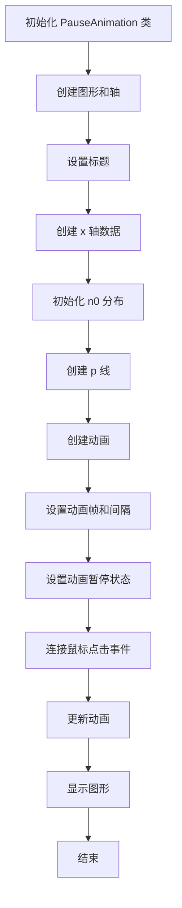

## 类结构

```
PauseAnimation (主类)
```

## 全局变量及字段


### `matplotlib.pyplot`
    
Matplotlib's pyplot module for creating static, interactive, and animated visualizations in Python.

类型：`module`
    


### `numpy`
    
NumPy is the fundamental package for scientific computing with Python.

类型：`module`
    


### `matplotlib.animation`
    
Matplotlib's animation module for creating dynamic images and videos from data.

类型：`module`
    


### `plt`
    
Matplotlib's pyplot module for creating static, interactive, and animated visualizations in Python.

类型：`module`
    


### `np`
    
NumPy's module for numerical operations in Python.

类型：`module`
    


### `animation`
    
Matplotlib's Animation class for creating animations.

类型：`class`
    


### `FuncAnimation`
    
Matplotlib's function for animating a plot over time.

类型：`function`
    


### `FuncAnimation`
    
Matplotlib's function for animating a plot over time.

类型：`function`
    


### `FuncAnimation`
    
Matplotlib's function for animating a plot over time.

类型：`function`
    


### `PauseAnimation.fig`
    
The figure object containing the plot.

类型：`matplotlib.figure.Figure`
    


### `PauseAnimation.ax`
    
The axes object containing the plot.

类型：`matplotlib.axes._subplots.AxesSubplot`
    


### `PauseAnimation.x`
    
The x-axis data for the plot.

类型：`numpy.ndarray`
    


### `PauseAnimation.n0`
    
The initial y-axis data for the plot, representing a normal distribution.

类型：`numpy.ndarray`
    


### `PauseAnimation.p`
    
The line plot object representing the data.

类型：`matplotlib.lines.Line2D`
    


### `PauseAnimation.animation`
    
The animation object controlling the plot updates.

类型：`matplotlib.animation.FuncAnimation`
    


### `PauseAnimation.paused`
    
A boolean flag indicating whether the animation is paused or not.

类型：`bool`
    
    

## 全局函数及方法


### plt.subplots

`plt.subplots` 是 Matplotlib 库中用于创建一个图形和轴对象的函数。

参数：

- `figsize`：`tuple`，图形的大小（宽度和高度），默认为 (6, 4)。
- `dpi`：`int`，图形的分辨率，默认为 100。
- `facecolor`：`color`，图形的背景颜色，默认为 'white'。
- `num`：`int`，要创建的轴的数量，默认为 1。
- `gridspec_kw`：`dict`，用于定义网格规格的字典。
- `constrained_layout`：`bool`，是否启用约束布局，默认为 `False`。

返回值：`Figure` 对象和 `Axes` 对象的元组。

#### 流程图

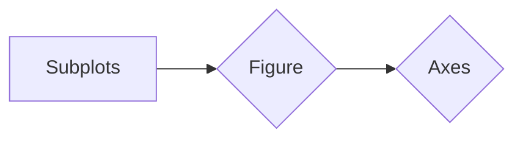

#### 带注释源码

```python
import matplotlib.pyplot as plt

fig, ax = plt.subplots()
```


### PauseAnimation.update

`PauseAnimation.update` 是 `PauseAnimation` 类的一个方法，用于更新动画的每一帧。

参数：

- `i`：`int`，当前帧的索引。

返回值：`tuple`，包含更新后的轴对象。

#### 流程图

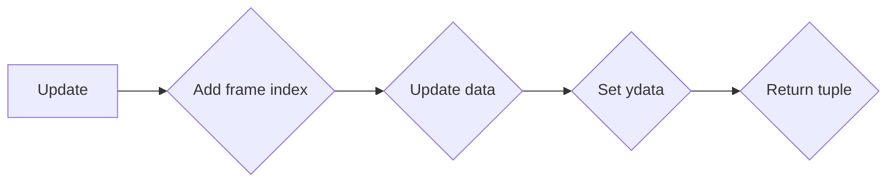

#### 带注释源码

```python
def update(self, i):
    self.n0 += i / 100 % 5
    self.p.set_ydata(self.n0 % 20)
    return (self.p,)
```


### PauseAnimation.toggle_pause

`PauseAnimation.toggle_pause` 是 `PauseAnimation` 类的一个方法，用于切换动画的暂停和继续状态。

参数：

- `*args`：任意数量的位置参数。
- `**kwargs`：任意数量的关键字参数。

返回值：无。

#### 流程图

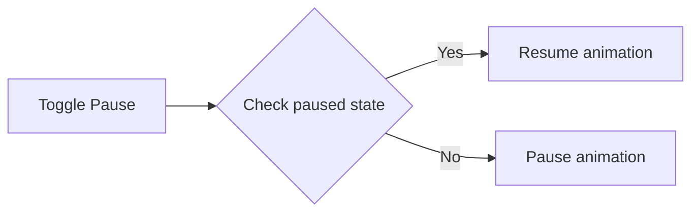

#### 带注释源码

```python
def toggle_pause(self, *args, **kwargs):
    if self.paused:
        self.animation.resume()
    else:
        self.animation.pause()
    self.paused = not self.paused
```


### PauseAnimation

`PauseAnimation` 是一个类，用于创建和管理一个可以暂停和继续的动画。

类字段：

- `fig`：`Figure` 对象，图形对象。
- `ax`：`Axes` 对象，轴对象。
- `x`：`ndarray`，x 轴的数据。
- `n0`：`float`，初始的 y 轴数据。
- `p`：`Line2D` 对象，线对象。
- `animation`：`FuncAnimation` 对象，动画对象。
- `paused`：`bool`，动画的暂停状态。

类方法：

- `__init__`：初始化方法，创建图形、轴和动画。
- `toggle_pause`：切换动画的暂停和继续状态。
- `update`：更新动画的每一帧。

全局变量和全局函数：

- `plt`：`pyplot` 模块，用于创建图形和轴。
- `np`：`numpy` 模块，用于数值计算。
- `animation`：`animation` 模块，用于创建动画。

#### 潜在的技术债务或优化空间

- 动画的数据更新逻辑可以进一步优化，例如使用更高效的数据结构或算法。
- 可以考虑添加更多的交互功能，如调整动画的速度或改变动画的样式。
- 代码中使用了硬编码的数值，可以考虑使用配置文件或参数化来提高代码的灵活性。

#### 设计目标与约束

- 设计目标是创建一个可以暂停和继续的动画。
- 约束是使用 Matplotlib 库创建动画。

#### 错误处理与异常设计

- 代码中没有显式的错误处理机制。
- 可以考虑添加异常处理来提高代码的健壮性。

#### 数据流与状态机

- 数据流：从初始化到更新动画的每一帧，数据通过类字段和方法在对象之间传递。
- 状态机：动画的暂停和继续状态通过 `paused` 字段管理。

#### 外部依赖与接口契约

- 外部依赖：Matplotlib 和 NumPy 库。
- 接口契约：`PauseAnimation` 类提供了初始化、暂停和更新动画的方法。
```


### ax.set_title

设置轴的标题。

参数：

- `title`：`str`，要设置的标题文本。

返回值：`None`，没有返回值。

#### 流程图

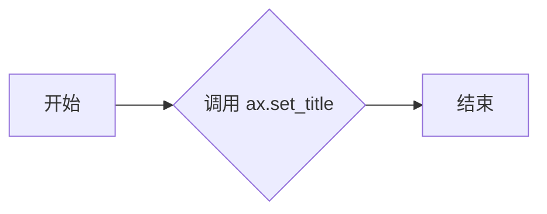

#### 带注释源码

```python
# 在 PauseAnimation 类的 __init__ 方法中调用
ax.set_title('Click to pause/resume the animation')
```


### np.linspace

`np.linspace` 是 NumPy 库中的一个函数，用于生成线性间隔的数字数组。

参数：

- `start`：`float` 或 `int`，线性间隔数组的起始值。
- `stop`：`float` 或 `int`，线性间隔数组的结束值。
- `num`：`int`，线性间隔数组的元素数量。默认为 50。

返回值：`numpy.ndarray`，包含线性间隔的数字数组。

#### 流程图

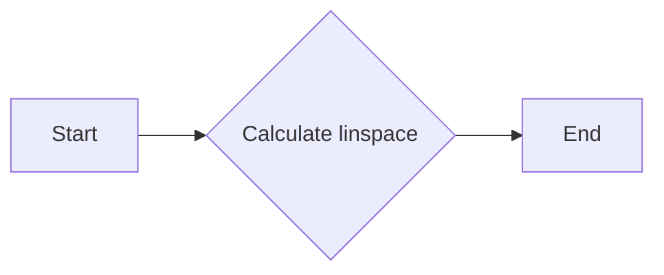

#### 带注释源码

```python
import numpy as np

# 生成从 -0.1 到 0.1 的 1000 个线性间隔的数字数组
x = np.linspace(-0.1, 0.1, 1000)
```


### np.exp

计算自然指数函数的值。

参数：

- `x`：`numpy.ndarray`，输入数组，表示要计算自然指数的值。

返回值：`numpy.ndarray`，输出数组，包含输入数组中每个元素的自然指数值。

#### 流程图

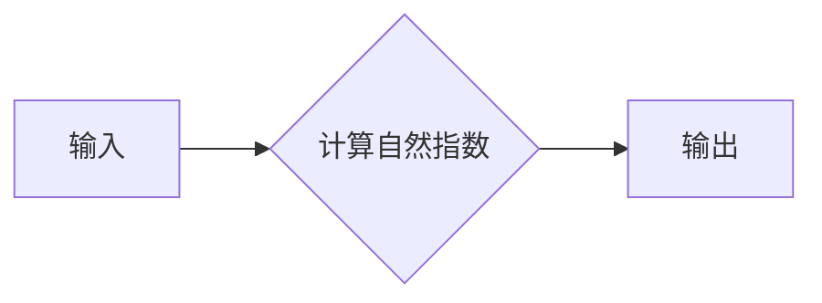

#### 带注释源码

```python
import numpy as np

def np_exp(x):
    """
    计算自然指数函数的值。

    参数：
    - x：numpy.ndarray，输入数组，表示要计算自然指数的值。

    返回值：numpy.ndarray，输出数组，包含输入数组中每个元素的自然指数值。
    """
    return np.exp(x)
```


### np.sqrt

计算数值的平方根。

参数：

- `x`：`numpy.ndarray`，输入的数值数组，可以是任意形状的数组。

返回值：`numpy.ndarray`，输入数组中每个元素的平方根。

#### 流程图

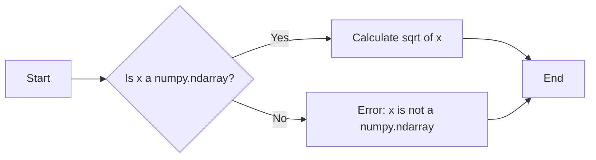

#### 带注释源码

```python
import numpy as np

def np_sqrt(x):
    """
    Calculate the square root of a numerical value.

    Parameters:
    - x: numpy.ndarray, the input numerical array, which can be an array of any shape.

    Returns:
    - numpy.ndarray, the square root of the input array.
    """
    return np.sqrt(x)
```


### PauseAnimation.update

更新动画帧的数据。

参数：

- `i`：`int`，当前帧的索引。

返回值：`tuple`，包含更新后的plot对象。

#### 流程图

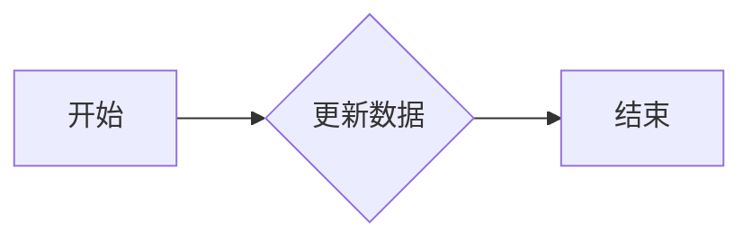

#### 带注释源码

```python
def update(self, i):
    # 更新数据
    self.n0 += i / 100 % 5
    self.p.set_ydata(self.n0 % 20)
    # 返回更新后的plot对象
    return (self.p,)
```


### PauseAnimation.toggle_pause()

Toggle the pause state of the animation.

参数：

- `*args`：任意数量的位置参数，用于传递额外的参数，这里未使用。
- `**kwargs`：任意数量的关键字参数，用于传递额外的参数，这里未使用。

返回值：无

#### 流程图

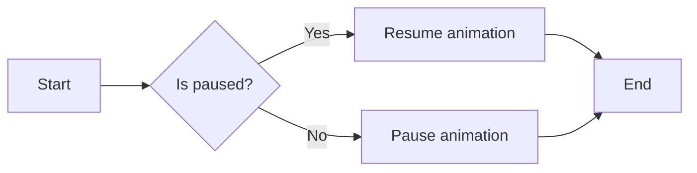

#### 带注释源码

```python
def toggle_pause(self, *args, **kwargs):
    if self.paused:
        self.animation.resume()
    else:
        self.animation.pause()
    self.paused = not self.paused
```


### fig.canvas.mpl_connect

连接一个事件处理函数到matplotlib画布的特定事件。

参数：

- `event`: `str`，指定要连接的事件类型，例如 'button_press_event'。
- `func`: `callable`，事件发生时调用的函数。

返回值：`None`

#### 流程图

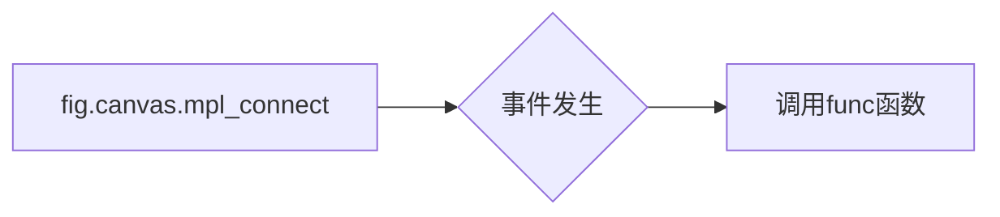

#### 带注释源码

```python
fig.canvas.mpl_connect('button_press_event', self.toggle_pause)
```

在这段代码中，`fig.canvas.mpl_connect` 被用来将 `self.toggle_pause` 函数连接到 `fig` 对象的画布上，当用户按下鼠标按钮时（'button_press_event'），`toggle_pause` 函数将被调用。这是实现动画暂停和恢复功能的关键部分，因为它允许用户通过鼠标点击来控制动画的播放状态。


### PauseAnimation.toggle_pause

This method toggles the pause state of the animation.

参数：

- `*args`：`tuple`，Additional positional arguments passed to the event handler.
- `**kwargs`：`dict`，Additional keyword arguments passed to the event handler.

返回值：`None`，This method does not return a value.

#### 流程图


#### 带注释源码

```python
def toggle_pause(self, *args, **kwargs):
    # Check if the animation is paused
    if self.paused:
        # Resume the animation if it is paused
        self.animation.resume()
    else:
        # Pause the animation if it is not paused
        self.animation.pause()
    # Toggle the paused state
    self.paused = not self.paused
```


### PauseAnimation.update

This method updates the animation frame by modifying the data of the plot.

参数：

- `i`：`int`，当前帧的索引，从0开始。

返回值：`tuple`，包含一个matplotlib.pyplot Line2D对象，用于更新图表。

#### 流程图

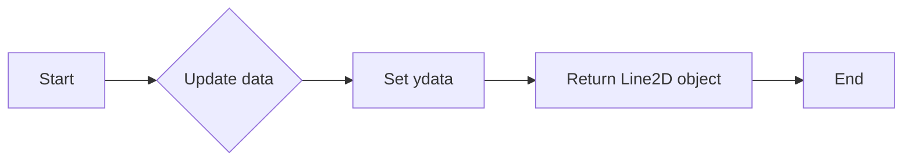

#### 带注释源码

```python
def update(self, i):
    # Increment the noise value over time
    self.n0 += i / 100 % 5
    # Update the y-data of the plot line
    self.p.set_ydata(self.n0 % 20)
    # Return the plot line object for updating
    return (self.p,)
```


### plt.show()

`plt.show()` 是 Matplotlib 库中的一个全局函数，用于显示图形窗口。

参数：

- 无

返回值：无

该函数没有返回值，它的作用是显示由 `matplotlib.pyplot` 生成的图形窗口。

#### 流程图

```mermaid
graph LR
A[plt.show()] --> B{显示图形窗口}
B --> C[结束]
```

#### 带注释源码

```
plt.show()  # 显示图形窗口
```

### 关键组件信息

- `matplotlib.pyplot`: 用于创建和显示图形。
- `matplotlib.animation.FuncAnimation`: 用于创建动画。
- `PauseAnimation`: 一个类，用于控制动画的暂停和恢复。

### 潜在的技术债务或优化空间

- 代码中使用了 `matplotlib.animation.FuncAnimation`，这是一个相对复杂的动画创建方法。可以考虑使用更简单的动画创建方法，如果动画需求不是特别复杂的话。
- 代码中使用了 `blit=True`，这可以减少动画重绘时的性能开销，但可能会增加代码的复杂性。

### 设计目标与约束

- 设计目标是创建一个可以暂停和恢复的动画。
- 约束是使用 Matplotlib 库来创建动画。

### 错误处理与异常设计

- 代码中没有显式的错误处理或异常设计。在实际应用中，应该添加适当的错误处理来确保程序的健壮性。

### 数据流与状态机

- 数据流：用户通过点击事件来暂停和恢复动画。
- 状态机：动画有两种状态：暂停和运行。

### 外部依赖与接口契约

- 外部依赖：Matplotlib 库。
- 接口契约：`matplotlib.animation.FuncAnimation` 接口。


### PauseAnimation.__init__

初始化PauseAnimation类，创建动画并设置初始状态。

参数：

- `self`：`PauseAnimation`对象，当前实例

返回值：无

#### 流程图

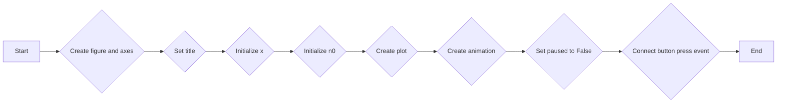

#### 带注释源码

```python
def __init__(self):
    fig, ax = plt.subplots()  # 创建图形和坐标轴
    ax.set_title('Click to pause/resume the animation')  # 设置标题
    x = np.linspace(-0.1, 0.1, 1000)  # 初始化x值

    # Start with a normal distribution
    self.n0 = (1.0 / ((4 * np.pi * 2e-4 * 0.1) ** 0.5) * np.exp(-x ** 2 / (4 * 2e-4 * 0.1)))  # 初始化n0值
    self.p, = ax.plot(x, self.n0)  # 创建图形

    self.animation = animation.FuncAnimation(  # 创建动画
        fig, self.update, frames=200, interval=50, blit=True)
    self.paused = False  # 设置paused为False

    fig.canvas.mpl_connect('button_press_event', self.toggle_pause)  # 连接按钮点击事件
```


### PauseAnimation.toggle_pause

This method toggles the pause state of the animation.

参数：

- `*args`：`tuple`，Additional positional arguments, if any.
- `**kwargs`：`dict`，Additional keyword arguments, if any.

返回值：`None`，This method does not return a value.

#### 流程图


#### 带注释源码

```python
def toggle_pause(self, *args, **kwargs):
    # Check if the animation is currently paused
    if self.paused:
        # If paused, resume the animation
        self.animation.resume()
    else:
        # If not paused, pause the animation
        self.animation.pause()
    # Toggle the paused state
    self.paused = not self.paused
```


### PauseAnimation.update

`PauseAnimation.update` is a method of the `PauseAnimation` class that updates the animation frame.

参数：

- `i`：`int`，当前帧的索引，从0开始。

返回值：`tuple`，包含一个matplotlib `Line2D`对象，用于更新动画的当前帧。

#### 流程图

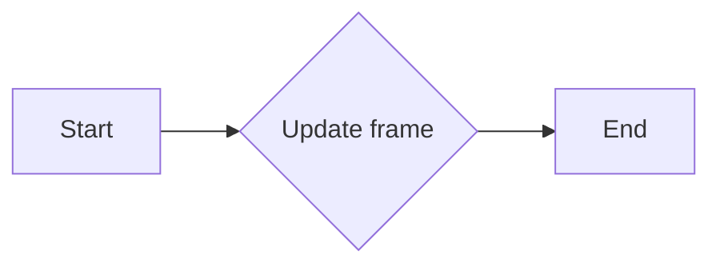

#### 带注释源码

```python
def update(self, i):
    # Increment the noise value over time
    self.n0 += i / 100 % 5
    # Update the y-data of the plot line with the new noise value
    self.p.set_ydata(self.n0 % 20)
    # Return the plot line for updating the animation
    return (self.p,)
```


## 关键组件


### 张量索引与惰性加载

张量索引与惰性加载允许在动画更新过程中动态地修改数据，而不需要预先计算整个数据集。

### 反量化支持

反量化支持确保动画中的数值变化是平滑和连续的，即使在数据更新时也能保持动画的流畅性。

### 量化策略

量化策略决定了动画中数值的精度，以及如何处理数值的增减，以确保动画的视觉效果符合预期。


## 问题及建议


### 已知问题

-   **全局状态管理**：`PauseAnimation` 类中的 `paused` 字段用于控制动画的暂停和恢复，但这个状态是全局的，可能会在多线程环境中引起问题。
-   **代码重复**：`toggle_pause` 方法中重复调用了 `self.animation.pause()` 和 `self.animation.resume()`，这可能导致代码冗余。
-   **异常处理**：代码中没有异常处理机制，如果动画在更新过程中出现错误，可能会导致程序崩溃。

### 优化建议

-   **引入线程安全机制**：如果需要在多线程环境中使用该动画，应该考虑引入线程锁或其他同步机制来保证 `paused` 状态的线程安全。
-   **重构代码以减少重复**：可以将暂停和恢复动画的逻辑封装到一个单独的方法中，并在 `toggle_pause` 方法中调用这个方法，以减少代码重复。
-   **添加异常处理**：在 `update` 方法中添加异常处理，确保在动画更新过程中出现错误时能够优雅地处理异常，而不是直接崩溃。
-   **代码注释**：代码中缺少必要的注释，建议添加注释来解释代码的功能和逻辑，提高代码的可读性和可维护性。
-   **性能优化**：`update` 方法中的 `self.n0 += i / 100 % 5` 和 `self.p.set_ydata(self.n0 % 20)` 可能会导致不必要的计算，可以考虑优化这些计算以提高性能。


## 其它


### 设计目标与约束

- 设计目标：实现一个动画暂停和恢复的功能，通过用户交互（点击事件）控制动画的暂停和恢复。
- 约束条件：使用Matplotlib库进行动画绘制，确保动画效果符合预期。

### 错误处理与异常设计

- 错误处理：在代码中未发现明显的错误处理机制，但应确保在动画更新过程中不会出现异常。
- 异常设计：未设计特定的异常处理机制，但应确保在发生异常时能够优雅地处理。

### 数据流与状态机

- 数据流：动画的更新数据通过`update`方法传递给绘图函数，并实时更新图形。
- 状态机：动画的状态由`paused`变量控制，用于判断动画是否处于暂停状态。

### 外部依赖与接口契约

- 外部依赖：代码依赖于Matplotlib和NumPy库。
- 接口契约：`PauseAnimation`类提供了一个接口，用于创建和管理动画，包括暂停和恢复动画的功能。


    