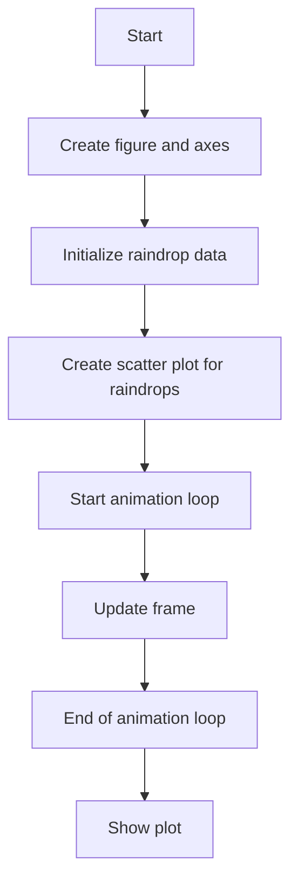
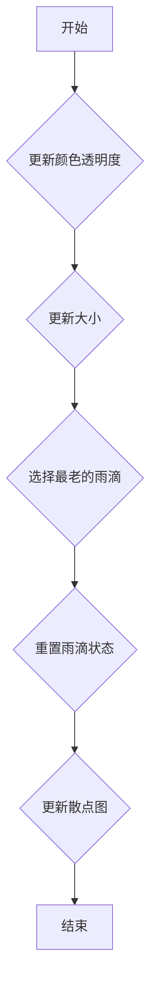
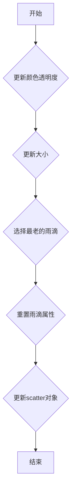

# `matplotlib\galleries\examples\animation\rain.py` 详细设计文档

Simulates the effect of raindrops on a surface using matplotlib for visualization.

## 整体流程



## 类结构

```
RainSimulation (主类)
├── rain_drops (numpy array)
│   ├── position (numpy array)
│   ├── size (numpy array)
│   ├── growth (numpy array)
│   └── color (numpy array)
```

## 全局变量及字段


### `fig`
    
The main figure object for the plot.

类型：`matplotlib.figure.Figure`
    


### `ax`
    
The axes object for the plot.

类型：`matplotlib.axes._subplots.AxesSubplot`
    


### `rain_drops`
    
Array containing the properties of the raindrops.

类型：`numpy.ndarray`
    


### `scat`
    
The scatter plot collection representing the raindrops.

类型：`matplotlib.collections.PathCollection`
    


### `animation`
    
The animation object for the rain simulation.

类型：`matplotlib.animation.FuncAnimation`
    


### `numpy.ndarray.rain_drops`
    
Array containing the properties of the raindrops, including position, size, growth, and color.

类型：`numpy.ndarray`
    


### `numpy.ndarray.position`
    
The position of the raindrops on the plot.

类型：`numpy.ndarray`
    


### `numpy.ndarray.size`
    
The size of the raindrops.

类型：`numpy.ndarray`
    


### `numpy.ndarray.growth`
    
The growth rate of the raindrops.

类型：`numpy.ndarray`
    


### `numpy.ndarray.color`
    
The color of the raindrops.

类型：`numpy.ndarray`
    


### `numpy.ndarray.current_index`
    
The index of the oldest raindrop to be updated in each frame.

类型：`int`
    


### `matplotlib.collections.PathCollection.scat`
    
The scatter plot collection representing the raindrops.

类型：`matplotlib.collections.PathCollection`
    


### `matplotlib.animation.FuncAnimation.interval`
    
The interval between frames in milliseconds.

类型：`int`
    


### `matplotlib.animation.FuncAnimation.save_count`
    
The number of frames to save before starting the animation.

类型：`int`
    


### `matplotlib.animation.FuncAnimation.blit`
    
Whether to use blitting for the animation to improve performance.

类型：`bool`
    
    

## 全局函数及方法


### update(frame_number)

更新动画中的雨滴状态。

参数：

- `frame_number`：`int`，当前动画帧的编号。

返回值：`[scat]`，更新后的散点图对象列表。

#### 流程图



#### 带注释源码

```python
def update(frame_number):
    # Get an index which we can use to re-spawn the oldest raindrop.
    current_index = frame_number % n_drops

    # Make all colors more transparent as time progresses.
    rain_drops['color'][:, 3] -= 1.0/len(rain_drops)
    rain_drops['color'][:, 3] = np.clip(rain_drops['color'][:, 3], 0, 1)

    # Make all circles bigger.
    rain_drops['size'] += rain_drops['growth']

    # Pick a new position for oldest rain drop, resetting its size,
    # color and growth factor.
    rain_drops['position'][current_index] = np.random.uniform(0, 1, 2)
    rain_drops['size'][current_index] = 5
    rain_drops['color'][current_index] = (0, 0, 0, 1)
    rain_drops['growth'][current_index] = np.random.uniform(50, 200)

    # Update the scatter collection, with the new colors, sizes and positions.
    scat.set_edgecolors(rain_drops['color'])
    scat.set_sizes(rain_drops['size'])
    scat.set_offsets(rain_drops['position'])
    return [scat]
```


### update(frame_number)

更新雨滴动画的函数。

参数：

- `frame_number`：`int`，当前动画帧的编号。

返回值：`[scat]`，更新后的matplotlib scatter对象列表。

#### 流程图



#### 带注释源码

```python
def update(frame_number):
    # Get an index which we can use to re-spawn the oldest raindrop.
    current_index = frame_number % n_drops

    # Make all colors more transparent as time progresses.
    rain_drops['color'][:, 3] -= 1.0/len(rain_drops)
    rain_drops['color'][:, 3] = np.clip(rain_drops['color'][:, 3], 0, 1)

    # Make all circles bigger.
    rain_drops['size'] += rain_drops['growth']

    # Pick a new position for oldest rain drop, resetting its size,
    # color and growth factor.
    rain_drops['position'][current_index] = np.random.uniform(0, 1, 2)
    rain_drops['size'][current_index] = 5
    rain_drops['color'][current_index] = (0, 0, 0, 1)
    rain_drops['growth'][current_index] = np.random.uniform(50, 200)

    # Update the scatter collection, with the new colors, sizes and positions.
    scat.set_edgecolors(rain_drops['color'])
    scat.set_sizes(rain_drops['size'])
    scat.set_offsets(rain_drops['position'])
    return [scat]
```


## 关键组件


### 张量索引与惰性加载

张量索引与惰性加载用于在动画更新函数中访问和更新雨滴数据，而不需要预先计算所有雨滴的状态。

### 反量化支持

反量化支持允许雨滴的大小和颜色随时间动态变化，而不需要预先定义所有可能的值。

### 量化策略

量化策略用于控制雨滴的颜色透明度和大小增长，确保动画的流畅性和视觉效果。


## 问题及建议


### 已知问题

-   **性能问题**：代码中使用了`FuncAnimation`来创建动画，每次更新都会重新计算所有雨滴的位置、大小和颜色，这可能导致性能瓶颈，尤其是在雨滴数量较多或动画帧率较高时。
-   **代码可读性**：代码中使用了大量的全局变量和全局函数，这可能会降低代码的可读性和可维护性。
-   **错误处理**：代码中没有明显的错误处理机制，如果出现异常，可能会导致程序崩溃。

### 优化建议

-   **使用更高效的数据结构**：可以考虑使用更高效的数据结构来存储和管理雨滴信息，例如使用类来封装雨滴的属性和行为。
-   **优化动画更新函数**：可以优化`update`函数，减少不必要的计算，例如预先计算一些值或使用缓存。
-   **引入错误处理**：在代码中添加异常处理机制，确保程序在遇到错误时能够优雅地处理。
-   **模块化代码**：将代码分解成更小的模块或函数，提高代码的可读性和可维护性。
-   **使用面向对象编程**：将全局变量和全局函数封装成类，提高代码的封装性和可重用性。


## 其它


### 设计目标与约束

- 设计目标：实现一个简单的雨滴动画，模拟雨滴在表面上的效果。
- 约束条件：使用matplotlib库进行绘图，动画帧间隔为10毫秒，保存100帧动画。

### 错误处理与异常设计

- 错误处理：代码中未包含显式的错误处理机制，但通过使用numpy的clip函数确保颜色透明度值在0到1之间。
- 异常设计：未设计特定的异常处理机制，因为代码逻辑简单，且使用numpy等库时已内置错误处理。

### 数据流与状态机

- 数据流：雨滴数据通过numpy数组存储，包括位置、大小、增长率和颜色。
- 状态机：动画通过更新函数不断迭代，每个雨滴的状态（位置、大小、颜色等）在每一帧更新。

### 外部依赖与接口契约

- 外部依赖：matplotlib库用于绘图和动画，numpy库用于数值计算。
- 接口契约：matplotlib的FuncAnimation类用于创建动画，需要提供update函数来更新动画帧。


    