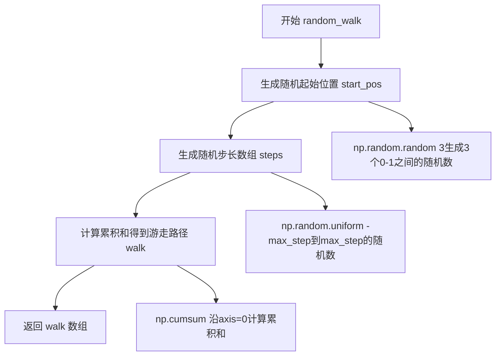

# `matplotlib\galleries\examples\animation\random_walk.py` 详细设计文档

该代码使用matplotlib和numpy创建了一个3D随机游走动画，通过生成40条随机路径并在三维坐标系中动态展示其演变过程，每条路径包含30个步骤。

## 整体流程

```mermaid
graph TD
    A[开始] --> B[设置随机种子确保可重复性]
    B --> C[定义random_walk函数生成3D随机游走数据]
    C --> D[定义update_lines函数更新动画帧]
    E[数据准备] --> F[生成40个随机游走数组]
    F --> G[创建Figure和3D Axes]
    G --> H[初始化40条空3D线条]
    H --> I[设置Axes的x/y/z轴范围和标签]
    I --> J[创建FuncAnimation动画对象]
    J --> K[调用plt.show()显示动画]
    K --> L[结束]
    E -.-> C
```

## 类结构

```
此代码为过程式脚本，无类层次结构
主要包含两个全局函数:
- random_walk: 生成随机游走数据
- update_lines: 更新动画帧
```

## 全局变量及字段


### `np`
    
NumPy库别名，用于数值计算和数组操作

类型：`numpy module`
    


### `plt`
    
Matplotlib库别名，用于创建可视化图表

类型：`matplotlib.pyplot module`
    


### `animation`
    
Matplotlib动画模块，用于创建动态可视化

类型：`matplotlib.animation module`
    


### `num_steps`
    
随机游走的总步数，设为30

类型：`int`
    


### `walks`
    
存储40个三维随机游走路径的列表，每个数组形状为(num_steps, 3)

类型：`list of numpy.ndarray`
    


### `fig`
    
Matplotlib图形对象，作为所有绘图内容的容器

类型：`matplotlib.figure.Figure`
    


### `ax`
    
三维坐标轴对象，用于绘制三维图形

类型：`matplotlib.axes.Axes`
    


### `lines`
    
存储40条三维线条对象的列表，用于表示各随机游走轨迹

类型：`list of matplotlib.lines.Line3D`
    


### `ani`
    
函数动画对象，控制动画的更新和播放

类型：`matplotlib.animation.FuncAnimation`
    


    

## 全局函数及方法


### `random_walk`

生成3D随机游走数据，返回一个包含指定步数的3D坐标序列的numpy数组。

参数：

- `num_steps`：`int`，随机游走的总步数
- `max_step`：`float`，可选参数，默认为0.05，每一步的最大步长范围

返回值：`numpy.ndarray`，形状为(num_steps, 3)的numpy数组，表示3D随机游走的坐标序列

#### 流程图



#### 带注释源码

```python
def random_walk(num_steps, max_step=0.05):
    """Return a 3D random walk as (num_steps, 3) array."""
    # 生成随机起始位置，使用np.random.random(3)生成3个[0,1)之间的随机数
    # 作为3D空间的初始坐标(x, y, z)
    start_pos = np.random.random(3)
    
    # 生成步长数组，形状为(num_steps, 3)
    # 每个步长在[-max_step, max_step]范围内随机选择
    # 这样保证了每一步的位移不会超过max_step
    steps = np.random.uniform(-max_step, max_step, size=(num_steps, 3))
    
    # 使用np.cumsum沿axis=0计算累积和
    # 将起始位置加上累积步长，得到完整的游走路径
    # 结果是一个(num_steps, 3)的数组，每一行是一个时间点的3D坐标
    walk = start_pos + np.cumsum(steps, axis=0)
    
    # 返回生成的3D随机游走数组
    return walk
```


### `update_lines`

动画更新回调函数，用于在每一帧动画中更新3D线条的位置数据。该函数接收当前帧索引，从随机游走数据中提取对应帧的坐标，并通过`set_data_3d`方法更新每条3D曲线的显示内容。

参数：

- `num`：`int`，当前动画帧的索引，用于确定从随机游走数据中提取多少个点
- `walks`：`list`，包含40个随机游走数据的列表，每个元素是一个`(num_steps, 3)`形状的numpy数组
- `lines`：`list`，包含matplotlib 3D线条对象的列表，与walks一一对应

返回值：`list`，返回更新后的线条对象列表，供matplotlib动画系统使用

#### 流程图

```mermaid
flowchart TD
    A[开始 update_lines] --> B[接收参数: num, walks, lines]
    B --> C[遍历 lines 和 walks]
    C --> D{遍历结束?}
    D -->|否| E[根据当前帧数 num 截取 walk 数据: walk[:num, :]]
    E --> F[转置数据: .T]
    F --> G[调用 line.set_data_3d 更新3D线条数据]
    G --> C
    D -->|是| H[返回更新后的 lines 列表]
    H --> I[结束]
```

#### 带注释源码

```python
def update_lines(num, walks, lines):
    """
    动画更新回调函数，每帧调用一次以更新3D线条数据。
    
    Parameters:
        num (int): 当前帧索引，从0到num_steps-1
        walks (list): 随机游走数据列表，包含40个(n, 3)的numpy数组
        lines (list): matplotlib 3D线条对象列表
    
    Returns:
        list: 更新后的线条对象列表
    """
    # 遍历每一条线条和对应的随机游走数据
    # 使用zip同时迭代lines和walks两个列表
    for line, walk in zip(lines, walks):
        # 提取前num个位置点的坐标数据
        # walk[:num, :] 获取从起点到当前帧的所有位置
        # .T 进行转置，从(num_points, 3)变为(3, num_points)
        # 以符合set_data_3d方法的输入格式要求
        line.set_data_3d(walk[:num, :].T)
    
    # 返回线条对象列表，这是matplotlib动画FuncAnimation的要求
    # 返回值用于动画系统的内部处理
    return lines
```

## 关键组件


### random_walk 函数

生成3D随机游走数据，返回一个(num_steps, 3)的numpy数组，起始位置随机，每步在[-max_step, max_step]范围内随机偏移

### update_lines 函数

动画更新回调函数，用于更新3D线条的数据，在每一帧被调用时将线条的数据设置为随机游走在当前帧之前的所有点

### walks 数据列表

包含40个随机游走数据，每个游走是一个(num_steps, 3)的numpy数组，表示3D空间中的轨迹点

### 3D坐标轴配置

设置3D Axes的属性，包括X、Y、Z轴的取值范围(0,1)和对应的标签

### ani 动画对象

matplotlib.animation.FuncAnimation实例，负责驱动整个动画的播放，每100毫秒更新一帧

### lines 线条列表

包含40个3D线条对象，每个对象对应一个随机游走的可视化表现，初始时为空数据


## 问题及建议


### 已知问题

- **硬编码参数过多**：步数(30)、最大步长(0.05)、随机游走数量(40)、动画间隔(100ms)等参数全部硬编码，缺乏灵活配置
- **无参数验证**：`random_walk`函数未对输入参数进行有效性检查
- **缺少类型注解**：所有函数均无类型提示，降低代码可读性和IDE支持
- **动画无法保存**：代码仅展示动画，缺少保存为HTML视频或其他格式的逻辑
- **缺乏错误处理**：未对matplotlib导入、数组操作等可能失败的操作进行异常捕获
- **全局状态依赖**：`np.random.seed(19680801)`使用全局随机种子，降低了代码的可测试性
- **重复计算**：每次更新时都执行`walk[:num, :].T`，可预先计算或优化

### 优化建议

- **提取配置类或参数对象**：将硬编码参数封装为配置类或使用配置字典
- **添加类型注解**：为函数参数和返回值添加`typing`模块的类型提示
- **增强错误处理**：添加try-except块处理可能的异常情况
- **添加动画保存功能**：使用`ani.to_html5_video()`或`ani.save()`支持保存
- **改进随机数管理**：将随机种子作为可选参数传入，便于测试和复现
- **优化渲染性能**：考虑使用`blit=True`结合`init_func`提升动画流畅度
- **模块化设计**：考虑将功能封装为类，提高代码可维护性和可测试性
- **添加文档字符串**：完善模块级和函数级文档说明

## 其它


### 设计目标与约束

本代码的核心设计目标是创建一个可视化3D随机行走过程的动画演示程序。设计约束包括：使用matplotlib作为唯一的可视化依赖库，确保代码的简洁性和可移植性；动画帧数固定为30帧，每帧间隔100毫秒；随机行走范围限制在[0,1]的立方体内；使用固定随机种子(19680801)确保结果可复现。

### 错误处理与异常设计

代码采用防御式编程风格，主要潜在错误包括：参数类型错误（如num_steps非整数）、matplotlib绘图上下文未正确初始化、内存不足导致大数据集生成失败。目前代码未实现显式的异常捕获机制，属于最小可行实现(MVP)。建议在生产环境中添加参数校验、绘图失败回退逻辑以及内存检查。

### 外部依赖与接口契约

主要外部依赖包括：matplotlib>=3.0.0（用于3D绘图和动画生成）、numpy>=1.15.0（用于数值计算和随机数生成）。接口契约方面，`random_walk(num_steps, max_step)`函数接受整数步数和浮点最大步长参数，返回(num_steps, 3)的numpy数组；`update_lines(num, walks, lines)`函数为动画回调函数，接受当前帧索引、随机行走数据列表和图形线条列表，无返回值。

### 性能考虑与优化

当前实现存在以下性能瓶颈：每帧重新设置所有线条数据（set_data_3d调用40次），对于大规模动画可能导致帧率下降。优化方向包括：使用blit=True参数加速渲染、预先分配数组内存、考虑使用FuncAnimation的blit功能仅重绘变化区域。30帧*40条线的规模下，当前实现性能可接受，但扩展到数百条线时需优化。

### 配置参数说明

代码中的可配置参数包括：num_steps（默认30）- 动画总帧数；max_step（默认0.05）- 单步最大位移；walks数量（默认40）- 同时显示的随机行走轨迹数；interval（默认100）- 帧间隔毫秒数；随机种子（19680801）- 用于结果复现。这些参数可通过变量修改或函数参数化实现配置化。

### 使用示例与调用方式

代码可直接运行生成动画窗口。编程调用方式：导入模块后，可通过ani.save('output.gif', writer='pillow')保存为GIF，或使用ani.to_jshtml()生成HTML5动画。典型调用流程：设置参数→生成数据→创建图形→初始化线条→创建动画对象→显示或保存。

### 兼容性考虑

代码兼容Python 3.6+和matplotlib 3.0+环境。在Jupyter Notebook中需使用%matplotlib notebook或%matplotlib widget魔法命令显示动画。在无图形界面的服务器环境需预先设置matplotlib后端（如Agg）再进行绘图操作。

### 代码维护性与扩展性

当前代码为单文件脚本形式，耦合度低但复用性有限。扩展建议：将random_walk和update_lines封装为类；添加命令行参数解析支持；实现数据生成器模式支持流式数据；增加单元测试覆盖。代码遵循PEP8风格，命名清晰，注释适当，维护性良好。

    