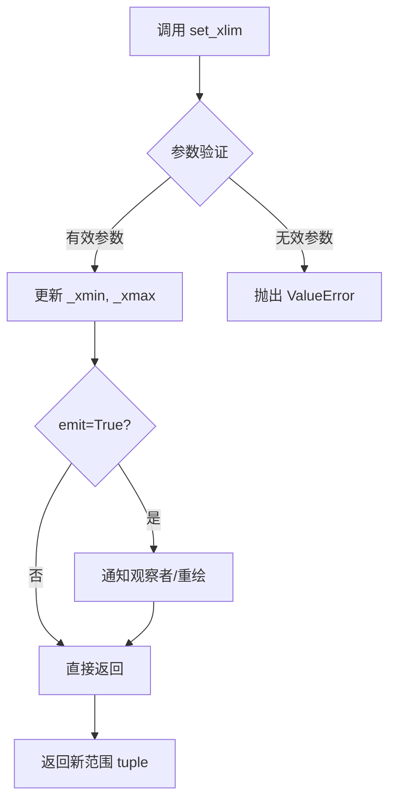
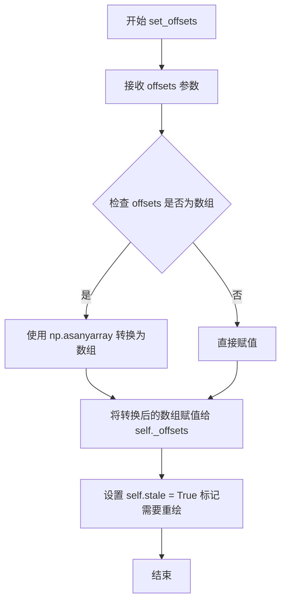

# `matplotlib\galleries\examples\animation\simple_scatter.py` 详细设计文档

该代码使用matplotlib.animation模块创建了一个简单的动画散点图，通过FuncAnimation类定时调用animate函数更新散点位置，将静态的散点图转变为动态演示，最终通过plt.show()展示动画效果。

## 整体流程

```mermaid
graph TD
    A[开始] --> B[导入必要的库: matplotlib.pyplot, numpy, matplotlib.animation]
B --> C[创建图形窗口和子图: plt.subplots()]
C --> D[设置子图x轴范围: ax.set_xlim(0, 10)]
D --> E[创建初始散点图: ax.scatter(1, 0)]
E --> F[生成x轴数据: np.linspace(0, 10)]
F --> G[定义动画更新函数: animate(i)]
G --> H[创建FuncAnimation动画对象]
H --> I[可选：保存为GIF]
I --> J[显示动画: plt.show()]
J --> K[结束]
```

## 类结构

```
模块层级
├── matplotlib.pyplot (plt)
│   └── Figure, Axes
├── numpy (np)
│   └── linspace函数
└── matplotlib.animation (animation)
    └── FuncAnimation

代码元素层级
├── 全局变量
│   ├── fig (Figure对象)
│   ├── ax (Axes对象)
│   ├── scat (PathCollection对象)
│   ├── x (numpy数组)
│   └── ani (FuncAnimation对象)
└── 全局函数
    └── animate(i)
```

## 全局变量及字段


### `fig`
    
matplotlib Figure对象，表示整个图形窗口

类型：`matplotlib.figure.Figure`
    


### `ax`
    
matplotlib Axes对象，表示图形中的坐标轴区域

类型：`matplotlib.axes.Axes`
    


### `scat`
    
散点图对象，用于在坐标轴中显示数据点

类型：`matplotlib.collections.PathCollection`
    


### `x`
    
从0到10的等间距数组，用于动画帧的x坐标

类型：`numpy.ndarray`
    


### `ani`
    
FuncAnimation对象，控制动画的播放和帧更新

类型：`matplotlib.animation.FuncAnimation`
    


    

## 全局函数及方法


### `animate`

这是动画更新回调函数，根据当前帧索引更新散点图的位置。

参数：

- `i`：`int`，当前帧的索引，用于从数组 `x` 中获取对应的 x 坐标值

返回值：`tuple`，返回包含散点艺术家对象的元组，用于通知 matplotlib 哪些对象需要重绘

#### 流程图

```mermaid
flowchart TD
    A[开始 animate 函数] --> B[接收帧索引 i]
    B --> C[从数组 x 获取 x[i] 值]
    C --> D[调用 scat.set_offsets 更新散点位置为 x[i], 0]
    D --> E[返回包含 scat 的元组]
    E --> F[结束]
```

#### 带注释源码

```python
def animate(i):
    """
    动画更新回调函数，每一帧调用一次
    
    参数:
        i: int, 当前帧的索引
        
    返回:
        tuple: 包含散点对象的元组，用于动画系统重绘
    """
    # 根据当前帧索引 i 从数组 x 中获取对应的 x 坐标
    # 设置散点在新位置 (x[i], 0)，y 坐标始终为 0
    scat.set_offsets((x[i], 0))
    
    # 返回包含需要重绘的艺术家的元组
    # FuncAnimation 需要这个返回值来确定哪些对象需要更新
    return (scat,)
```


### `Axes.set_xlim`

设置 Axes 对象的 x 轴显示范围（ limites），用于控制 x 轴的最小值和最大值，决定图表在水平方向上的显示区间。

参数：

- `left`：`float` 或 `int`，x 轴范围的左边界（最小值）
- `right`：`float` 或 `int`，x 轴范围的右边界（最大值）
- `*args`：可变参数，用于兼容旧版本 API
- `**kwargs`：关键字参数，可传递 `emit`、`auto`、`xmin`、`xmax` 等额外配置

返回值：`tuple`，返回新的 x 轴范围 `(left, right)`，或者在某些调用方式下返回 `None`

#### 流程图



#### 带注释源码

```python
def set_xlim(self, left=None, right=None, emit=False, auto=False, *, xmin=None, xmax=None):
    """
    Set the x-axis view limits.
    
    Parameters
    ----------
    left : float
        The left xlim (data coordinates).  May be None to leave the
        limit unchanged.
    right : float
        The right xlim (data coordinates).  May be None to leave the
        limit unchanged.
    emit : bool
        Whether to notify observers of limit change (default: False).
    auto : bool
        Whether to turn on autoscaling after the limit is set.
        The default of False defers to the ``rcParam[“axes.autolimit_mode”]``.
    xmin, xmax : float
        These arguments are deprecated and will be removed in a future
        version.  Use *left* and *right* instead.
    
    Returns
    -------
    left, right : float
        The new x-axis limits in data coordinates.
    
    Notes
    -----
    The axis limits may be inverted if the requested range is reversed
    (i.e., left > right).
    """
    # 兼容旧版本参数 xmin/xmax
    if xmin is not None:
        if left is not None:
            raise TypeError("Cannot pass both 'xmin' and 'left'.")
        left = xmin
    if xmax is not None:
        if right is not None:
            raise TypeError("Cannot pass both 'xmax' and 'right'.")
        right = xmax
    
    # 获取当前范围（如果参数为 None）
    left = left if left is not None else self._xmin
    right = right if right is not None else self._xmax
    
    # 验证参数有效性
    if left is None or right is None:
        raise ValueError("Setting limits requires both left and right.")
    
    # 更新内部状态
    self._xmin = left
    self._xmax = right
    
    # 发出事件通知（如果 emit=True）
    if emit:
        self._request_scalextick()
    
    # 返回新的范围元组
    return (left, right)
```


### PathCollection.set_offsets

设置散点图中每个点的位置偏移量，用于更新散点图的坐标位置。

参数：

- `offsets`：`array-like (N, 2)`，一个 N×2 的二维数组，每行表示一个点的 (x, y) 坐标偏移量

返回值：`None`，该方法直接修改对象内部状态，无返回值

#### 流程图



#### 带注释源码

```python
def set_offsets(self, offsets):
    """
    Set the offsets for the collection.

    Parameters
    ----------
    offsets : array-like (N, 2)
        The offsets for the collection. Each row should be of the form
        (x, y) specifying the coordinates of a point.
    """
    # 将 offsets 转换为 NumPy 数组并赋值给内部属性 _offsets
    # np.asanyarray 保留数组的子类属性（如 masked array）
    self._offsets = np.asanyarray(offsets)
    
    # 将 stale 标记设为 True，通知 matplotlib 该artist需要重新绘制
    # 这会触发下次绘图时的重绘操作
    self.stale = True
```

## 关键组件


### matplotlib.pyplot 图形初始化

创建图形窗口和坐标轴对象，设置x轴显示范围为0到10，为后续散点图动画提供画布基础。

### ax.scatter 散点图对象

初始化散点图对象，初始位置为(1, 0)，用于在动画过程中动态更新点的位置。

### numpy x数组

使用linspace生成0到10的等间距数组，共50个点，作为动画帧的x坐标数据源。

### animate 动画更新函数

接收帧索引i作为参数，更新散点图的偏移位置到(x[i], 0)，返回散点图对象元组供动画系统更新渲染。

### animation.FuncAnimation 动画控制器

创建动画对象，配置重复播放、总帧数为x数组长度减1、帧间隔为50毫秒，驱动整个动画的播放流程。

### plt.show 图形显示

调用matplotlib显示最终生成的动画窗口，呈现散点从左向右移动的动态效果。


## 问题及建议


### 已知问题

- **硬编码参数**：动画参数（如 `frames=len(x)-1`、`interval=50`、`repeat=True`）直接写死在代码中，缺乏可配置性
- **动画函数逻辑不完整**：`animate` 函数中散点仅沿 x 轴移动，y 坐标始终为 0，动画效果单一
- **未使用的代码块**：`PillowWriter` 保存 GIF 的代码被注释掉，若功能不需要应删除，若需要则应保留以便后续使用
- **缺乏输入验证**：未对 `x` 数组长度、`frames` 参数进行有效性检查，可能导致索引越界
- **类型注解缺失**：函数参数和返回值均无类型注解，影响代码可读性和维护性
- **全局变量暴露**：`fig`、`ax`、`scat`、`x`、`ani` 均为全局变量，容易产生命名冲突和意外修改
- **plt.show() 阻塞**：`plt.show()` 会阻塞当前线程，若需后台运行或批量处理会导致问题

### 优化建议

- 将动画相关参数提取为配置常量或配置文件，提高可维护性
- 补充 `animate` 函数的文档字符串，说明参数含义和返回值
- 保留或删除保存 GIF 的代码块，不宜长期保留注释状态
- 添加类型注解，如 `def animate(i: int) -> list:` 等
- 使用类封装或函数返回值管理动画对象生命周期，避免全局变量污染
- 考虑添加 `plt.close(fig)` 或使用上下文管理器管理图形资源
- 若需要更高性能，可考虑使用 `blit=True` 参数减少重绘区域

## 其它


### 设计目标与约束

本代码旨在创建一个简单的动画散点图，展示散点沿x轴从0到10的移动过程。设计约束包括：使用matplotlib.animation模块实现动画，控制帧率为20fps（interval=50ms），动画默认重复播放。

### 错误处理与异常设计

代码主要依赖matplotlib和numpy库，应处理ImportError异常（库未安装）、RuntimeError（动画创建失败）、以及save()方法调用时的IOError（文件写入失败）。当前代码未包含显式异常处理机制。

### 数据流与状态机

数据流：numpy.linspace生成x坐标数组 → animate函数接收帧索引i → 更新散点对象位置 → 返回散点元组。状态机包含：初始化状态（创建图形和散点）、动画状态（FuncAnimation管理）、结束状态（plt.show()阻塞或save()完成）。

### 外部依赖与接口契约

外部依赖：matplotlib>=3.0、numpy>=1.16、Pillow（保存GIF时需要）。接口契约：animate函数必须返回可迭代对象（包含Artist），FuncAnimation参数frames应小于len(x)。

### 配置与参数说明

核心参数：interval=50（帧间隔50ms）、repeat=True（循环播放）、frames=len(x)-1（帧数）、x数组长度决定动画步长。当前配置可生成流畅的20fps动画。

### 性能考虑与优化空间

当前实现使用FuncAnimation默认后端，对于简单散点动画性能足够。优化空间：1）大量帧时可考虑blitting=True加速渲染；2）save()时可调整bitrate和fps平衡文件大小与质量；3）可添加frames参数范围限制实现特定区间动画。

### 平台兼容性

代码可在Windows、Linux、macOS上运行，需确保DISPLAY环境变量可用（无头环境需使用Agg后端）。Python版本需3.6+。

### 版本与兼容性信息

代码基于matplotlib动画API设计，兼容matplotlib 3.x系列。PillowWriter用于GIF导出，需安装Pillow库。

    