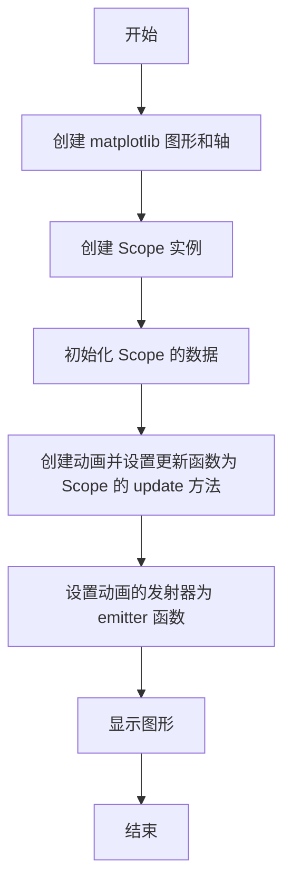
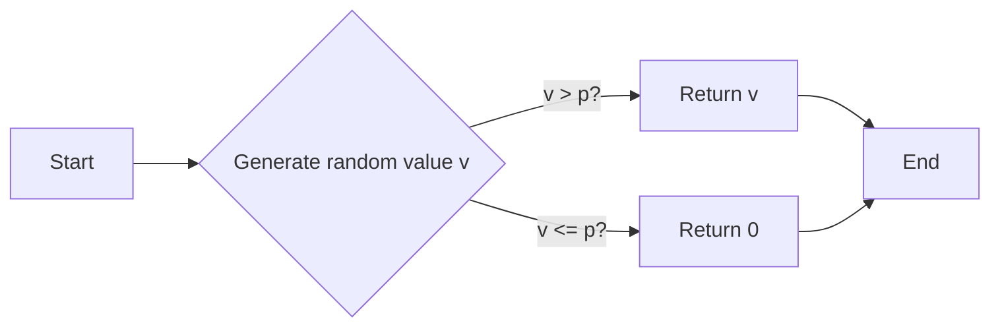
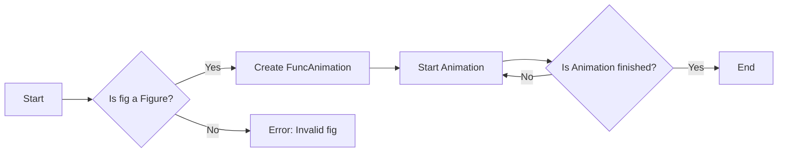
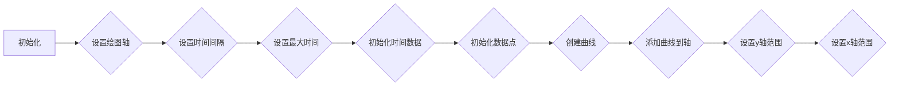

# `matplotlib\galleries\examples\animation\strip_chart.py` 详细设计文档

This code emulates an oscilloscope using matplotlib for plotting and numpy for numerical operations. It generates a dynamic plot of a signal over time, with the ability to reset the plot and simulate signal generation with a probability-based emitter function.

## 整体流程



## 类结构

```
Scope (类)
├── matplotlib.pyplot (全局变量)
│   ├── plt (全局变量)
│   └── subplots() (全局函数)
└── numpy (全局变量)
    └── np (全局变量)
```

## 全局变量及字段


### `fig`
    
The main figure object for the oscilloscope plot.

类型：`matplotlib.figure.Figure`
    


### `ax`
    
The axes object where the oscilloscope plot is drawn.

类型：`matplotlib.axes._subplots.AxesSubplot`
    


### `scope`
    
An instance of the Scope class representing the oscilloscope.

类型：`Scope`
    


### `ani`
    
The animation object that updates the plot over time.

类型：`matplotlib.animation.FuncAnimation`
    


### `np`
    
The NumPy library, used for numerical operations.

类型：`numpy`
    


### `plt`
    
The Matplotlib library, used for plotting and visualizations.

类型：`matplotlib.pyplot`
    


### `Scope.ax`
    
The axes object where the oscilloscope plot is drawn.

类型：`matplotlib.axes._subplots.AxesSubplot`
    


### `Scope.dt`
    
The time step for updating the oscilloscope plot.

类型：`float`
    


### `Scope.maxt`
    
The maximum time for the oscilloscope plot.

类型：`float`
    


### `Scope.tdata`
    
The list of time data points for the oscilloscope plot.

类型：`list`
    


### `Scope.ydata`
    
The list of y data points for the oscilloscope plot.

类型：`list`
    


### `Scope.line`
    
The line object representing the plot in the oscilloscope.

类型：`matplotlib.lines.Line2D`
    


### `Scope.emitter`
    
A generator function that yields random values for the oscilloscope plot.

类型：`generator`
    
    

## 全局函数及方法


### emitter()

Return a random value in [0, 1) with probability p, else 0.

参数：

- `p`：`float`，The probability that a random value in [0, 1) is returned. The value is clamped between 0 and 1.

返回值：`float`，A random value in [0, 1) with probability p, else 0.

#### 流程图



#### 带注释源码

```python
def emitter(p=0.1):
    """Return a random value in [0, 1) with probability p, else 0."""
    while True:
        v = np.random.rand()  # Generate a random value between 0 and 1
        if v > p:  # If the random value is greater than p, return it
            yield v
        else:  # Otherwise, return 0
            yield 0.
```


### animation.FuncAnimation

`FuncAnimation` 是 `matplotlib.animation` 模块中的一个函数，用于创建动画。

参数：

- `fig`：`matplotlib.figure.Figure`，动画的父图。
- `func`：`callable`，每次动画帧更新时调用的函数。
- `frames`：`iterable`，生成器或可迭代对象，包含每次动画帧的输入数据。
- `interval`：`int` 或 `float`，动画帧之间的时间间隔（毫秒）。
- `blit`：`bool`，是否使用 `blit` 模式，这可以减少每次动画帧的重绘。
- `save_count`：`int`，保存动画帧的数量。

返回值：`matplotlib.animation.FuncAnimation`，动画对象。

#### 流程图



#### 带注释源码

```python
ani = animation.FuncAnimation(fig, scope.update, emitter, interval=50,
                              blit=True, save_count=100)
```

在这段代码中，`FuncAnimation` 被用来创建一个动画，该动画使用 `scope.update` 方法作为更新函数，`emitter` 生成器作为数据源，动画帧之间的间隔设置为 50 毫秒，使用 `blit` 模式来优化性能，并保存 100 个动画帧。


### `Scope.__init__`

初始化Scope对象，设置绘图轴、时间间隔、最大时间、时间数据、数据点和曲线。

参数：

- `ax`：`matplotlib.axes.Axes`，绘图轴对象。
- `maxt`：`float`，最大时间，默认为2秒。
- `dt`：`float`，时间间隔，默认为0.02秒。

返回值：无

#### 流程图



#### 带注释源码

```python
def __init__(self, ax, maxt=2, dt=0.02):
    # 设置绘图轴
    self.ax = ax
    # 设置时间间隔
    self.dt = dt
    # 设置最大时间
    self.maxt = maxt
    # 初始化时间数据
    self.tdata = [0]
    # 初始化数据点
    self.ydata = [0]
    # 创建曲线
    self.line = Line2D(self.tdata, self.ydata)
    # 添加曲线到轴
    self.ax.add_line(self.line)
    # 设置y轴范围
    self.ax.set_ylim(-.1, 1.1)
    # 设置x轴范围
    self.ax.set_xlim(0, self.maxt)
``` 


### Scope.update

This method updates the data for the oscilloscope plot.

参数：

- `y`：`float`，The new value of the signal to be plotted.

返回值：`Line2D`，The updated line object for the plot.

#### 流程图

```mermaid
graph LR
A[Start] --> B{Check if lastt >= tdata[0] + maxt}
B -- Yes --> C[Reset arrays]
B -- No --> D[Calculate t]
D --> E[Append t to tdata]
E --> F[Append y to ydata]
F --> G[Set line data]
G --> H[Return line]
H --> I[End]
```

#### 带注释源码

```python
def update(self, y):
    lastt = self.tdata[-1]
    if lastt >= self.tdata[0] + self.maxt:  # reset the arrays
        self.tdata = [self.tdata[-1]]
        self.ydata = [self.ydata[-1]]
        self.ax.set_xlim(self.tdata[0], self.tdata[0] + self.maxt)
        self.ax.figure.canvas.draw()

    # This slightly more complex calculation avoids floating-point issues
    # from just repeatedly adding `self.dt` to the previous value.
    t = self.tdata[0] + len(self.tdata) * self.dt

    self.tdata.append(t)
    self.ydata.append(y)
    self.line.set_data(self.tdata, self.ydata)
    return self.line,
```


## 关键组件


### 张量索引与惰性加载

用于在更新函数中索引和添加新的时间戳和值到数据数组，而不是预先计算整个数组。

### 反量化支持

通过在更新函数中使用`self.tdata[0] + len(self.tdata) * self.dt`来避免浮点数累积问题，从而支持反量化。

### 量化策略

通过设置`self.ax.set_ylim(-.1, 1.1)`和`self.ax.set_xlim(0, self.maxt)`来限制显示的y轴和x轴的范围，实现量化显示策略。


## 问题及建议


### 已知问题

-   **全局变量和函数的随机性**: `emitter` 函数使用了全局变量 `np.random`，这可能导致代码在不同运行之间产生不一致的结果。虽然这里设置了随机种子，但全局变量的使用通常不是最佳实践。
-   **动画性能**: 动画使用 `FuncAnimation`，其中 `interval=50` 可能不是最佳值，这取决于目标设备和显示器的刷新率。没有进行性能测试来确定最佳的动画间隔。
-   **代码重用性**: `Scope` 类和 `emitter` 函数是紧密耦合的，这限制了代码的重用性。如果需要在不同上下文中使用这些功能，可能需要重构代码。

### 优化建议

-   **使用局部变量**: 将 `np.random` 替换为局部变量，以避免全局状态的影响。
-   **性能测试**: 对动画进行性能测试，以确定最佳的动画间隔，并确保动画在不同设备上都能流畅运行。
-   **代码重构**: 将 `Scope` 类和 `emitter` 函数重构为更通用的组件，以便它们可以在不同的上下文中重用。例如，可以将 `Scope` 类转换为生成器，以便它可以与任何数据源一起使用。
-   **异常处理**: 添加异常处理来确保在出现错误时，程序能够优雅地处理异常，而不是直接崩溃。
-   **文档和注释**: 为代码添加更详细的文档和注释，以提高代码的可读性和可维护性。


## 其它


### 设计目标与约束

- 设计目标：实现一个模拟示波器的功能，能够实时显示信号波形。
- 约束条件：使用matplotlib库进行绘图，动画显示信号波形。

### 错误处理与异常设计

- 错误处理：在代码中未发现明显的错误处理机制。
- 异常设计：未定义特定的异常处理逻辑，但应考虑在数据更新或绘图过程中可能出现的异常。

### 数据流与状态机

- 数据流：数据通过`emitter`生成器产生，然后通过`Scope`类的`update`方法更新到图表中。
- 状态机：`Scope`类负责管理示波器的状态，包括时间戳和波形数据。

### 外部依赖与接口契约

- 外部依赖：代码依赖于matplotlib和numpy库。
- 接口契约：`Scope`类提供了一个`update`方法，用于更新波形数据；`emitter`函数生成随机信号数据。

### 测试与验证

- 测试策略：应编写单元测试来验证`Scope`类和`emitter`函数的正确性。
- 验证方法：通过手动测试和自动化测试来验证示波器的功能。

### 性能考量

- 性能考量：动画的帧率取决于`interval`参数，应根据实际需求调整以优化性能。

### 安全性考量

- 安全性考量：代码中未涉及用户输入，因此安全性风险较低。

### 可维护性与可扩展性

- 可维护性：代码结构清晰，易于维护。
- 可扩展性：可以通过添加新的信号处理函数或数据源来扩展功能。

### 文档与注释

- 文档：提供详细的设计文档和代码注释，以便于其他开发者理解和维护代码。
- 注释：代码中应包含必要的注释，解释关键代码段的功能。


    