# `matplotlib\galleries\examples\animation\unchained.py` 详细设计文档

这是一个使用 matplotlib.animation 创建的脉冲星频率信号动画，模拟了 Joy Division 专辑《Unknown Pleasures》封面的经典视觉效果，通过随机数据生成多层叠加的正态分布曲线并动态更新。

## 整体流程

```mermaid
graph TD
    A[开始] --> B[创建黑色背景的 Figure]
    B --> C[创建无边框的 Axes 子图]
    C --> D[生成随机数据 data 和高斯曲线 G]
    D --> E[循环创建 64 条白色曲线]
    E --> F[设置坐标轴范围和隐藏刻度]
    F --> G[添加双层标题 'MATPLOTLIB UNCHAINED']
    G --> H[定义 update 动画更新函数]
    H --> I[创建 FuncAnimation 对象]
    I --> J[调用 plt.show() 显示动画]
```

## 类结构

```
Python 内置模块
├── numpy (数值计算)
│   └── np.random.uniform, np.linspace, np.exp
└── matplotlib (数据可视化)
    ├── pyplot (绘图接口)
    │   ├── plt.figure, plt.subplot, plt.show
    │   └── ax.plot, ax.set_ylim, ax.set_xticks, ax.set_yticks, ax.text
    └── animation (动画模块)
        └── FuncAnimation
```

## 全局变量及字段


### `fig`
    
matplotlib Figure 对象，图形画布，黑色背景

类型：`matplotlib.figure.Figure`
    


### `ax`
    
Axes 对象，坐标轴子图，无边框显示

类型：`matplotlib.axes.Axes`
    


### `data`
    
numpy 数组，存储64行75列的随机脉冲数据

类型：`numpy.ndarray (64, 75)`
    


### `X`
    
numpy 数组，-1到1区间等间距采样点

类型：`numpy.ndarray`
    


### `G`
    
numpy 数组，高斯分布曲线包络

类型：`numpy.ndarray`
    


### `lines`
    
列表，存储64条Line2D曲线对象

类型：`list[matplotlib.lines.Line2D]`
    


### `i`
    
循环计数器，用于遍历数据行

类型：`int`
    


### `xscale`
    
曲线X轴缩放因子，随索引递减制造透视效果

类型：`float`
    


### `lw`
    
曲线线宽，随索引递减制造层次感

类型：`float`
    


### `line`
    
Line2D对象，单条曲线实例

类型：`matplotlib.lines.Line2D`
    


### `anim`
    
FuncAnimation对象，动画实例控制动画播放

类型：`matplotlib.animation.FuncAnimation`
    


### `Figure.facecolor`
    
Figure对象的背景色属性，此处设为黑色

类型：`str`
    
    

## 全局函数及方法


### `np.random.seed`

该函数用于固定NumPy的随机数生成器的种子，确保每次运行代码时生成相同的随机数序列，从而实现结果的可复现性。在代码中通过`np.random.seed(19680801)`调用，确保后续使用`np.random.uniform`生成的随机数据在每次程序运行时保持一致。

参数：

- `seed`：`int` 或 `None`，随机种子值。代码中传入`19680801`，这是一个特定的整数，用于初始化随机数生成器。

返回值：`None`，该函数没有返回值，作用是修改随机数生成器的内部状态。

#### 流程图

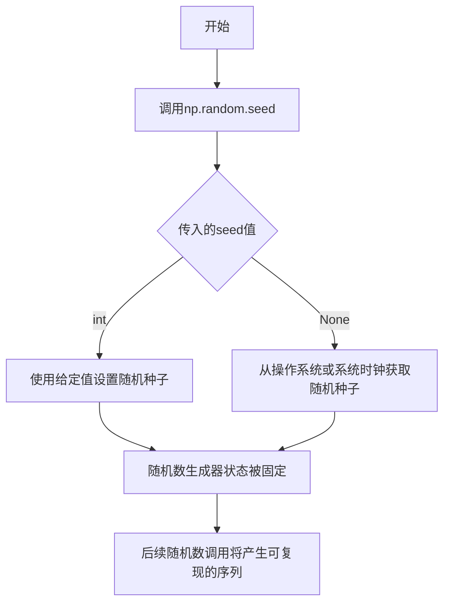

#### 带注释源码

```python
# Fixing random state for reproducibility
# 这行代码调用NumPy的随机种子函数，传入固定值19680801
# 作用：初始化随机数生成器，确保后续的np.random.uniform调用
# 每次运行时生成相同的随机数序列，从而保证程序结果的可复现性
np.random.seed(19680801)
```


### `np.random.uniform`

生成均匀分布的随机数，从连续均匀分布中抽取样本。

参数：

- `low`：`float`，可选，下界（包含），默认值为 `0.0`
- `high`：`float`，可选，上界（不包含），默认值为 `1.0`
- `size`：`int` 或 `tuple of ints`，可选，输出形状，默认为 `None`（返回单个值）

返回值：`ndarray` 或 `scalar`，返回指定形状的随机值，在 `[low, high)` 区间内均匀分布

#### 流程图

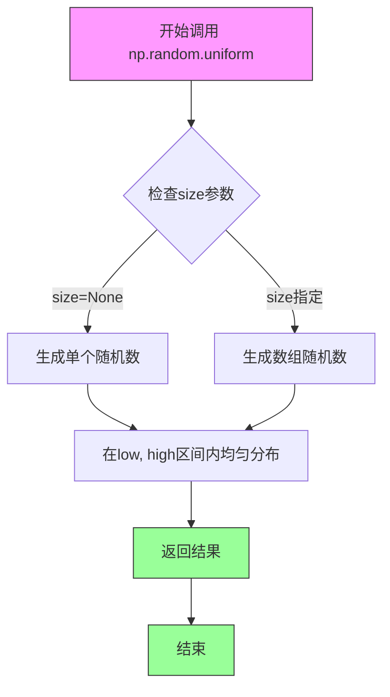

#### 带注释源码

```python
# ============================================================
# np.random.uniform 函数使用示例（来自 matplotlib unchained 代码）
# ============================================================

# -------------------------------------------------
# 第一次使用：生成初始数据矩阵
# -------------------------------------------------
# 生成形状为 (64, 75) 的随机数据矩阵
# 每个元素在 [0, 1) 区间内均匀分布
data = np.random.uniform(0, 1, (64, 75))

# 参数说明：
#   - 第一个参数 0：下界（low），包含0
#   - 第二个参数 1：上界（high），不包含1
#   - 第三个参数 (64, 75)：输出形状，生成64行75列的矩阵
#
# 返回值：64x75 的 numpy 数组，元素值为浮点数

# -------------------------------------------------
# 第二次使用（在update函数中）：更新数据列
# -------------------------------------------------
# 生成 len(data) 个随机数，即 64 个随机数
# 赋值给 data 数组的第一列（索引为 0）
data[:, 0] = np.random.uniform(0, 1, len(data))

# 参数说明：
#   - 第一个参数 0：下界（low）
#   - 第二个参数 1：上界（high）  
#   - 第三个参数 len(data)：生成 64 个随机数
#
# 返回值：长度为 64 的一维数组，赋值给 data 的第一列

# ============================================================
# 函数原理说明
# ============================================================
# numpy.random.uniform 基于 Mersenne Twister 算法生成随机数
# 均匀分布的概率密度函数为：
#   f(x) = 1 / (high - low), 其中 low <= x < high
#
# 在代码中的作用：
#   1. 初始化生成 pulsar 信号的随机噪声数据
#   2. 每帧动画更新时生成新的随机噪声列
#   3. 配合高斯核 G = 1.5 * exp(-4*X^2) 创建视觉特效
```


### `np.linspace`

生成线性间隔的数组，在指定区间内返回均匀间隔的样本值。

参数：

-  `start`：`array_like`，序列的起始值
-  `stop`：`array_like`，序列的结束值（当 endpoint=False 时不包含）
-  `num`：`int`，生成的样本数量，默认值为 50
-  `endpoint`：`bool`，若为 True，则 stop 为最后一个样本，默认值为 True
-  `retstep`：`bool`，若为 True，返回 (samples, step)，默认值为 False
-  `dtype`：`dtype`，输出数组的数据类型，默认根据 start 和 stop 推断
-  `axis`：`int`，结果数组中存储样本的轴（仅当 start 或 stop 为数组时有效），默认值为 0

返回值：`ndarray`，返回 num 个均匀分布在指定区间内的样本点

#### 流程图

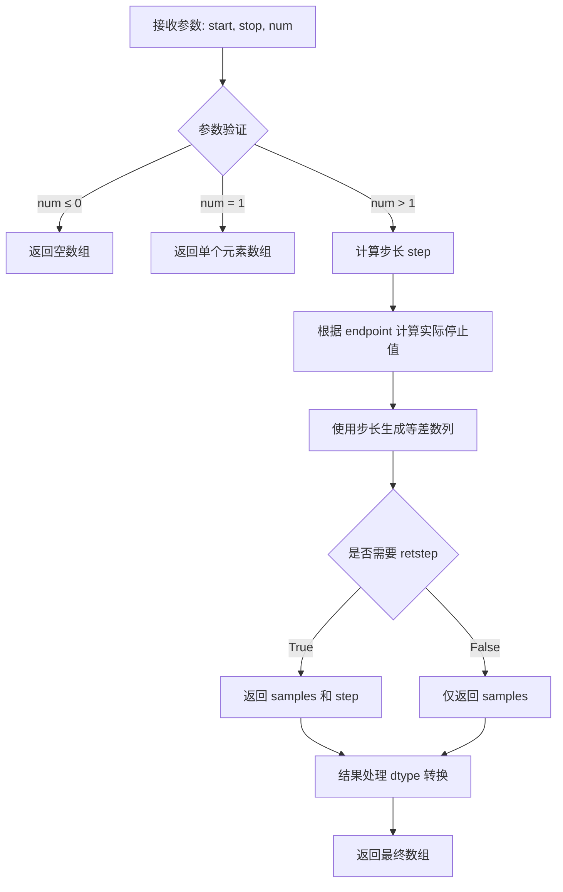

#### 带注释源码

```python
def linspace(start, stop, num=50, endpoint=True, retstep=False, dtype=None, axis=0):
    """
    生成线性间隔的数组
    
    参数:
        start: array_like
            序列的起始值
        stop: array_like
            序列的结束值
        num: int
            生成的样本数量，默认50
        endpoint: bool
            是否包含终点，默认True
        retstep: bool
            是否返回步长，默认False
        dtype: dtype, optional
            输出数据类型
        axis: int
            样本存储的轴，默认0
    
    返回:
        ndarray 或 tuple
            均匀分布的样本数组，或(samples, step)元组
    """
    # 参数验证
    num = int(num)
    if num < 0:
        raise ValueError("Number of samples must be non-negative")
    
    # 处理边界情况
    if num == 0:
        return _empty(num, dtype)
    elif num == 1:
        # 单样本情况特殊处理
        if endpoint:
            return _arange(start, stop, 1, dtype=dtype)[-1:]
        else:
            return _arange(start, stop, 1, dtype=dtype)[:1]
    
    # 计算步长
    step = (stop - start) / (num - 1 if endpoint else num)
    
    # 生成数组
    if retstep:
        return _arange(num, dtype=dtype) * step + start, step
    else:
        return _arange(num, dtype=dtype) * step + start
```


### `np.exp`

计算输入数组中所有元素的指数函数值（即e^x，其中e≈2.71828）。这是NumPy的数学函数，用于对数组或标量进行逐元素计算。

参数：

- `x`：`array_like`，输入值，可以是标量、列表或NumPy数组，表示需要计算指数的数值

返回值：`ndarray` 或 `scalar`，返回输入值的指数函数结果，类型与输入相同

#### 流程图

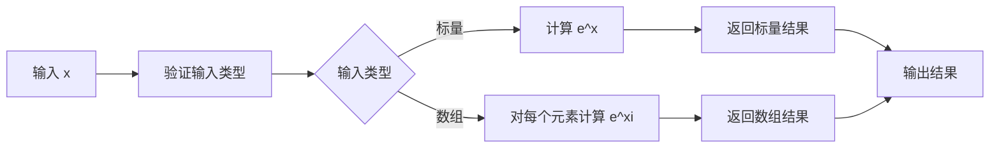

#### 带注释源码

```python
# 导入NumPy库
import numpy as np

# 示例：在代码中实际使用np.exp
# 创建X轴数据点，从-1到1
X = np.linspace(-1, 1, data.shape[-1])

# 使用np.exp计算高斯函数的核心部分
# np.exp(-4 * X ** 2) 计算 e^(-4x²)
# 这创建一个倒置的高斯曲线（钟形曲线）
G = 1.5 * np.exp(-4 * X ** 2)

# 详细解释：
# 1. X ** 2 - 计算X中每个元素的平方
# 2. -4 * (X ** 2) - 将结果乘以-4（取负）
# 3. np.exp(...) - 计算e的幂次方
# 4. 1.5 * ... - 乘以1.5进行幅度缩放
# 结果：生成一个峰值在X=0处，值为1.5的高斯曲线

# 在动画更新函数中使用
def update(*args):
    # ... 其他代码 ...
    
    # 使用G乘以data[i]来调制每条线的振幅
    # 创造随机的"波浪"效果，模拟音频信号
    lines[i].set_ydata(i + G * data[i])
    
    # ... 其他代码 ...
```


### `plt.figure`

该函数是 Matplotlib 库中用于创建新图形画布的核心函数，在代码中用于初始化一个具有黑色背景的图形窗口，为后续的子图添加和动画绘制提供画布基础。

参数：

- `figsize`：`<class 'tuple'>`，图形的宽和高，代码中传入 `(8, 8)` 表示 8x8 英寸的画布
- `facecolor`：`<class 'str'>`，图形的背景颜色，代码中传入 `"black"` 表示黑色背景
- `dpi`：`<class 'int'>`，可选参数，每英寸点数（分辨率），代码中未使用
- `frameon`：`<class 'bool'>`，可选参数，是否显示框架，代码中未使用（但后续 `plt.subplot(frameon=False)` 中使用了该参数）

返回值：`<class 'matplotlib.figure.Figure'>`，返回一个 Figure 对象（图形画布对象），代码中赋值给变量 `fig`，用于后续添加子图、绑定动画和显示图形。

#### 流程图

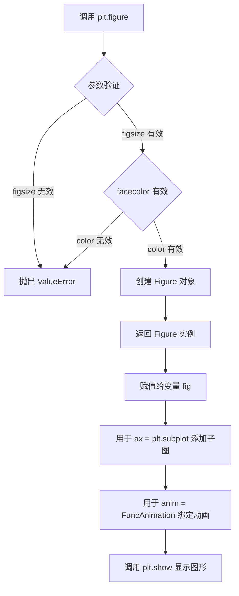

#### 带注释源码

```python
# 创建新 Figure，黑色背景
# figsize=(8, 8) 设置图形尺寸为 8x8 英寸
# facecolor="black" 设置背景颜色为黑色
fig = plt.figure(figsize=(8, 8), facecolor="black")

# 参数说明：
# - figsize: tuple 类型 (width, height)，单位为英寸
#   width: 图形宽度（水平方向）
#   height: 图形高度（垂直方向）
# - facecolor: str 类型，支持颜色名称如 'black', 'red' 或十六进制如 '#000000'
# 
# 返回值：
# - fig: matplotlib.figure.Figure 对象
#   代表整个图形画布，可以包含一个或多个子图
#   可用于添加子图、保存图像、绑定动画等操作
#
# 内部逻辑（简化）：
# 1. 验证并处理 figsize 和 facecolor 参数
# 2. 创建 FigureCanvas 对象（画布底层）
# 3. 创建 Figure 对象（容器）
# 4. 配置图形属性（背景色、尺寸等）
# 5. 返回 Figure 实例供后续操作使用
```


### `plt.subplot`

在matplotlib中，`plt.subplot`函数用于创建子图（Axes），使其成为当前活动坐标轴。该代码中使用`plt.subplot(frameon=False)`创建了一个没有边框和坐标轴刻度的子图，作为后续绘制多条线条和显示动态动画的容器。

参数：

- `*args`：位置参数，可接受多种格式（如3位整数111表示1行1列第1个位置，或直接传递nrows, ncols, plot_number）
- `frameon`：`bool`，可选参数，控制是否显示坐标轴边框和背景，设置为`False`时移除边框
- `**kwargs`：其他关键字参数传递给`Axes`构造函数，可包括`projection`（投影类型）、`polar`（极坐标）等

返回值：`matplotlib.axes.Axes`对象，返回创建的子图坐标轴对象，后续用于plot()、text()等绘图方法

#### 流程图

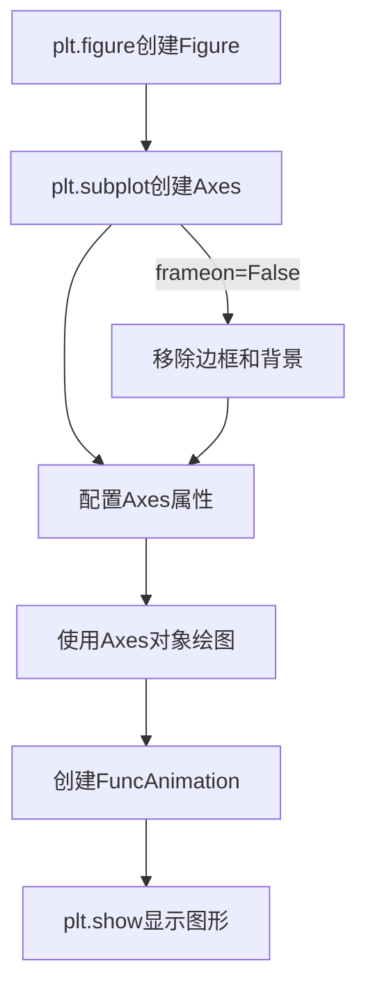

#### 带注释源码

```python
# 在matplotlib中创建子图的核心调用
# frameon=False 参数移除坐标轴边框，创建"浮动"效果
ax = plt.subplot(frameon=False)

# 下方是plt.subplot在matplotlib中的简化实现原理：
# 1. 解析位置参数确定子图网格位置
# 2. 创建Axes对象（无frame模式）
# 3. 设置当前Axes为活动状态
# 4. 返回Axes对象供后续绘图使用

# 实际使用示例：
# ax.plot(x, y)  # 在子图上绘制线条
# ax.text(x, y, "text")  # 添加文本
# ax.set_xticks([])  # 移除刻度
```

#### 关键组件信息

- `plt.figure`：创建顶级图形容器（Figure对象）
- `ax.plot()`：在子图上创建线条对象
- `animation.FuncAnimation`：创建动画控制器
- `update`函数：动画帧更新回调，修改线条数据
- `lines`列表：存储所有线条对象用于批量更新

#### 潜在技术债务与优化空间

1. **硬编码参数**：子图尺寸、颜色、字体大小等都是硬编码，缺乏配置灵活性
2. **魔法数值**：如`i / 200.0`、`i / 100.0`等magic numbers缺乏文档说明
3. **数据生成方式**：`np.random.uniform`每次生成新数据，可考虑使用更平滑的噪声函数
4. **性能优化**：每帧重新计算所有线条数据，可考虑增量更新
5. **动画保存**：`save_count=100`可能导致长动画丢失帧

#### 其它项目

**设计目标与约束**：
- 目标：复刻Joy Division《Unknown Pleasures》专辑封面的脉冲星频谱效果
- 约束：使用纯matplotlib实现，无需额外可视化库

**错误处理与异常设计**：
- 未包含显式错误处理
- 依赖matplotlib内置的错误提示（如数据维度不匹配时）

**数据流与状态机**：
- 初始状态：生成64x75的随机数据矩阵
- 更新状态：`update`函数每10ms更新一次数据
- 渲染状态：FuncAnimation驱动blit更新

**外部依赖与接口契约**：
- `numpy`：数值计算
- `matplotlib`：绘图与动画
- 无自定义接口，纯脚本执行


### `ax.plot`

在循环中调用 `matplotlib.axes.Axes.plot` 方法绘制多条线条，每条线条使用不同的 X 轴缩放比例和线宽，形成叠加的曲线效果，模拟脉冲星信号的视觉呈现。

参数：

- `x`：`numpy.ndarray` 或类似数组类型，X 轴数据，值为 `xscale * X`，其中 `X = np.linspace(-1, 1, data.shape[-1])`
- `y`：`numpy.ndarray` 或类似数组类型，Y 轴数据，值为 `i + G * data[i]`，其中 `G = 1.5 * np.exp(-4 * X ** 2)`
- `color`：`str`，线条颜色，此处固定为 `"w"`（白色）
- `lw`：`float`，线条宽度，随循环索引 `i` 变化，公式为 `1.5 - i / 100.0`

返回值：`matplotlib.lines.Line2D`，返回绘制的线条对象，用于后续通过 `set_ydata()` 方法更新数据

#### 流程图

```mermaid
flowchart TD
    A[开始 plot 调用] --> B[接收 x 数据<br/>xscale * X]
    --> C[接收 y 数据<br/>i + G * data[i]]
    --> D[应用样式参数<br/>color='w', lw=value]
    --> E[Matplotlib 渲染引擎]
    --> F[创建 Line2D 对象]
    --> G[返回线条对象<br/>用于后续更新]
```

#### 带注释源码

```python
# 在循环中为每个数据索引创建一条曲线
for i in range(len(data)):
    # 计算 X 轴缩放比例，产生透视效果（底部线条更宽）
    xscale = 1 - i / 200.
    
    # 计算线条宽度（底部更粗，顶部更细）
    lw = 1.5 - i / 100.0
    
    # 调用 ax.plot 绘制曲线
    # 参数1: xscale * X - 缩放后的 X 坐标
    # 参数2: i + G * data[i] - Y 坐标（G 是高斯衰减系数）
    # 参数3: color="w" - 白色线条
    # 参数4: lw=lw - 动态线宽
    line, = ax.plot(xscale * X, i + G * data[i], color="w", lw=lw)
    
    # 将每条线条对象添加到列表
    lines.append(line)
```

#### 关键组件信息

| 组件名称 | 一句话描述 |
|---------|-----------|
| `ax` (Axes 对象) | matplotlib 的子图对象，负责管理和渲染图形元素 |
| `Line2D` | 表示 2D 线条的图形对象，由 plot 方法返回 |
| `xscale` | X 轴缩放因子，随索引递增产生透视效果 |
| `lw` (linewidth) | 线条宽度参数，随索引递减产生层次感 |

#### 潜在技术债务与优化空间

1. **魔法数字**：代码中使用了大量硬编码数值（如 `1.5`、`200`、`100`、`64`、`75`），建议提取为常量或配置参数
2. **循环效率**：在 `update` 函数中逐个更新线条的 `set_ydata`，对于大量线条可以考虑批量更新
3. **缺乏类型标注**：代码未使用 Python 类型注解，建议添加以提升可维护性
4. **动画保存策略**：`save_count=100` 的设置可能不适合长动画，存在数据丢失风险

#### 其它项目

- **设计目标**：创建视觉上吸引人的脉冲星信号动画效果，致敬 Joy Division 专辑封面
- **约束条件**：黑色背景、无坐标轴刻度、多层叠加曲线
- **错误处理**：代码未包含显式错误处理，依赖 matplotlib 内部异常机制
- **数据流**：`data` 数组存储信号数据，`update` 函数每帧更新数据并刷新线条显示
- **外部依赖**：matplotlib、numpy


### `ax.set_ylim`

该方法用于配置 `matplotlib.axes.Axes` 实例的 Y 轴视图极限（View Limits），设定数据坐标系的上下界。在动画初始化阶段调用此方法是为了防止因线条粗细导致首行数据被视图裁剪，从而保证可视化效果的完整性。

参数：

-  `bottom`：`float` 或 `int`，Y 轴的下限值（数据坐标）。
-  `top`：`float` 或 `int`，Y 轴的上限值（数据坐标）。

返回值：`list`，返回新的 Y 轴极限 `[ymin, ymax]`。

#### 流程图

```mermaid
graph TD
    A([开始: 调用 set_ylim]) --> B[输入参数: bottom, top]
    B --> C{参数有效性检查}
    C -->|有效| D[更新 Axes 对象的 yaxis limits]
    C -->|无效| E[抛出 ValueError 或保持原状]
    D --> F{emit 参数检查}
    F -->|True| G[通知观察者(如: 重新绘制)]
    F -->|False| H[跳过通知]
    G --> I[返回新 limits: [ymin, ymax]]
    H --> I
    E --> I
```

#### 带注释源码

```python
# 设置 y 轴的限制范围。
# 原因：数据索引 i 的范围是 0 到 63，加上高斯分布 G * data[i] 的增量，
# 需要留出足够的顶部空间；同时为了避免线条厚度导致首行被裁剪，
# 将下限设为 -1。
ax.set_ylim(-1, 70)
```


### `matplotlib.axes.Axes.set_xticks` 和 `matplotlib.axes.Axes.set_yticks`

这两个方法用于设置坐标轴的刻度位置和可选的刻度标签，从而控制坐标轴上刻度线的显示。在代码中，通过传入空列表 `[]` 来隐藏坐标轴上的所有刻度线。

参数：

- `ticks`：`list`，刻度位置的数组，用于指定刻度线在坐标轴上的位置
- `labels`：`list`（可选），刻度标签的数组，用于为每个刻度位置指定显示的文本标签
- `**kwargs`：关键字参数，用于传递给 `matplotlib.axis.XTick` 或 `matplotlib.axis.YTick` 构造函数，以自定义刻度线的外观属性（如颜色、宽度等）

返回值：`list`，返回 `matplotlib.axis.Tick` 对象的列表，表示设置的所有刻度线对象

#### 流程图

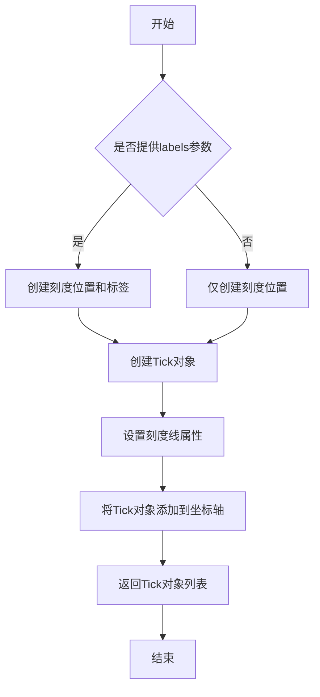

#### 带注释源码

```python
def set_xticks(self, ticks, labels=None, *, minor=False, **kwargs):
    """
    设置x轴的刻度位置和可选的标签。
    
    参数:
        ticks: 刻度位置的数组
        labels: 刻度标签的数组（可选）
        minor: 是否设置次要刻度（默认False）
        **kwargs: 传递给Tick的额外参数
    
    返回值:
        Tick对象的列表
    """
    # 获取x轴对象
    ax = self.xaxis
    
    # 设置刻度位置
    ax.set_ticks(ticks, minor=minor)
    
    # 如果提供了标签，则设置标签
    if labels is not None:
        ax.set_ticklabels(labels, **kwargs)
    elif kwargs:
        # 即使没有标签，也应用kwargs到刻度
        ax.set_ticklabels(ax.get_ticklabels(), **kwargs)
    
    # 返回创建的刻度对象
    return ax.get_ticklines(minor=minor)

def set_yticks(self, ticks, labels=None, *, minor=False, **kwargs):
    """
    设置y轴的刻度位置和可选的标签。
    
    参数:
        ticks: 刻度位置的数组
        labels: 刻度标签的数组（可选）
        minor: 是否设置次要刻度（默认False）
        **kwargs: 传递给Tick的额外参数
    
    返回值:
        Tick对象的列表
    """
    # 获取y轴对象
    ax = self.yaxis
    
    # 设置刻度位置
    ax.set_ticks(ticks, minor=minor)
    
    # 如果提供了标签，则设置标签
    if labels is not None:
        ax.set_ticklabels(labels, **kwargs)
    elif kwargs:
        # 即使没有标签，也应用kwargs到刻度
        ax.set_ticklabels(ax.get_ticklabels(), **kwargs)
    
    # 返回创建的刻度对象
    return ax.get_ticklines(minor=minor)
```

在示例代码中的实际使用：

```python
# No ticks - 隐藏坐标轴刻度
ax.set_xticks([])  # 设置空的刻度位置列表，移除x轴所有刻度
ax.set_yticks([])  # 设置空的刻度位置列表，移除y轴所有刻度
```


### `ax.text`

该代码中通过 `ax.text()` 方法在 Matplotlib 图表的坐标轴区域添加了两个不同字体的文本标签，分别显示"MATPLOTLIB "和"UNCHAINED"，实现了分层标题的视觉效果。

参数：

- `x`：`float`，文本的 x 坐标位置（在此代码中为 0.5，表示水平居中）
- `y`：`float`，文本的 y 坐标位置（在此代码中为 1.0，表示靠近顶部）
- `s`：`str`，要显示的文本字符串（"MATPLOTLIB "或"UNCHAINED"）
- `transform`：`matplotlib.transforms.Transform`，坐标变换方式（`ax.transAxes` 表示使用轴坐标系统，范围 0-1）
- `ha`：`str`，水平对齐方式（"right"或"left"）
- `va`：`str`，垂直对齐方式（"bottom"）
- `color`：`str`，文本颜色（"w"即白色）
- `family`：`str`，字体系列（"sans-serif"无衬线体）
- `fontweight`：`str`，字体粗细（"light"细体或"bold"粗体）
- `fontsize`：`int`，字体大小（16）

返回值：`matplotlib.text.Text`，返回创建的文本对象，可用于后续修改或动画更新

#### 流程图

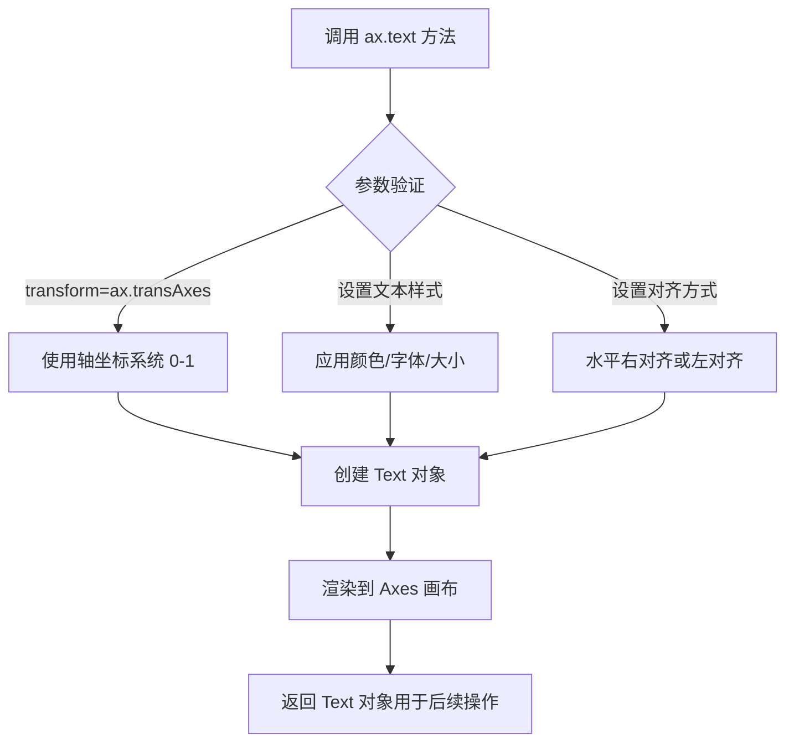

#### 带注释源码

```python
# 第一个文本标签：右对齐显示 "MATPLOTLIB "（细体）
ax.text(
    0.5,                      # x: 水平位置 0.5（50%处）
    1.0,                      # y: 垂直位置 1.0（顶部）
    "MATPLOTLIB ",            # s: 要显示的文本内容
    transform=ax.transAxes,   # transform: 使用轴坐标系（0-1范围）
    ha="right",               # ha: horizontalalignment，水平右对齐
    va="bottom",              # va: verticalalignment，垂直底部对齐
    color="w",                # color: 文本颜色，'w' 代表白色
    family="sans-serif",     # family: 字体系列，无衬线字体
    fontweight="light",      # fontweight: 字重，细体（较浅）
    fontsize=16              # fontsize: 字体大小 16 磅
)

# 第二个文本标签：左对齐显示 "UNCHAINED"（粗体）
ax.text(
    0.5,                      # x: 水平位置 0.5（与第一个标签相同位置）
    1.0,                      # y: 垂直位置 1.0（完全重叠）
    "UNCHAINED",              # s: 要显示的文本内容
    transform=ax.transAxes,   # transform: 同样使用轴坐标系
    ha="left",                # ha: 水平左对齐（与第一个标签相反）
    va="bottom",              # va: 垂直底部对齐
    color="w",                # color: 同样为白色
    family="sans-serif",     # family: 同样使用无衬线字体
    fontweight="bold",       # fontweight: 字重，粗体（与第一个形成对比）
    fontsize=16              # fontsize: 同样 16 磅
)
```

---

## 完整设计文档

### 一段话描述

该脚本是一个 Matplotlib 可视化演示程序，通过生成随机数据模拟脉冲星信号的频率可视化效果，使用动画展示数据动态变化，并在图表顶部通过重叠的文本标签展示"MATPLOTLIB UNCHAINED"标题。

### 文件的整体运行流程

1. **初始化阶段**：设置随机种子确保可复现性，创建黑色背景的 Figure 和无边框的子图
2. **数据生成阶段**：生成 64x75 的随机数据矩阵，计算高斯衰减曲线 G
3. **可视化创建阶段**：循环创建 64 条水平线条，颜色为白色，线宽随索引递减形成透视效果
4. **文本标签阶段**：调用 `ax.text()` 在图表顶部添加两个重叠的标题文本
5. **动画配置阶段**：配置坐标轴范围、隐藏刻度线、创建 FuncAnimation 动画对象
6. **显示阶段**：调用 `plt.show()` 展示最终动画效果

### 类的详细信息

| 名称 | 类型 | 描述 |
|------|------|------|
| `fig` | `matplotlib.figure.Figure` | 主图表对象，8x8 英寸，黑色背景 |
| `ax` | `matplotlib.axes.Axes` | 子图坐标轴对象，无边框 |
| `data` | `numpy.ndarray` | 64x75 的随机浮点数数组，模拟脉冲星信号数据 |
| `X` | `numpy.ndarray` | 从 -1 到 1 的线性空间，用于横坐标 |
| `G` | `numpy.ndarray` | 高斯衰减曲线数组，用于调制线条幅度 |
| `lines` | `list` | 存储 64 个 Line2D 对象的列表 |
| `anim` | `matplotlib.animation.FuncAnimation` | 动画对象，控制数据更新频率 |

### 关键组件信息

| 名称 | 一句话描述 |
|------|------------|
| `matplotlib.pyplot.figure()` | 创建具有指定尺寸和背景色的图表容器 |
| `matplotlib.axes.Axes.text()` | 在坐标轴指定位置添加文本标签 |
| `numpy.random.uniform()` | 生成指定范围内的均匀分布随机数 |
| `matplotlib.animation.FuncAnimation()` | 创建基于更新函数的动画对象 |

### 潜在的技术债务或优化空间

1. **硬编码参数**：字体大小、颜色、对齐方式等参数直接硬编码，建议提取为配置常量
2. **魔法数字**：数据维度（64、75）、坐标限制（-1, 70）等数值缺乏明确语义
3. **重复代码**：两个 `ax.text()` 调用存在大量重复参数，可封装为辅助函数
4. **动画性能**：`save_count=100` 可能不足以保存完整动画，且未设置 `blit=True` 优化渲染
5. **缺少错误处理**：随机数生成和动画更新缺乏边界检查

### 其它项目

**设计目标与约束**：
- 目标：创建视觉上引人注目的脉冲星频率可视化动画
- 约束：黑色背景、白色线条、无坐标轴刻度

**错误处理与异常设计**：
- 代码未包含显式异常处理，依赖 Matplotlib 默认行为

**数据流与状态机**：
- 初始化 → 静态渲染 → 动画循环（update 函数每 10ms 更新数据并重绘线条）

**外部依赖与接口契约**：
- 依赖 `matplotlib`、`numpy` 两个第三方库
- `update` 函数签名兼容 `FuncAnimation` 的参数传递机制（*args）


### `animation.FuncAnimation`

创建函数动画是Matplotlib中用于生成基于更新函数的可视化动画的核心类。它通过重复调用用户定义的更新函数来修改图形中的艺术家（artist）对象，从而产生动态效果。

参数：

- `fig`：`matplotlib.figure.Figure`，创建动画的图形对象
- `func`：更新函数，每帧调用该函数来更新艺术家对象
- `frames`：可选，生成器/迭代器/整数，动画的帧数
- `init_func`：可选，初始化函数，用于在第一帧前设置背景
- `interval`：可选，整数，每帧之间的时间间隔（毫秒），默认为200
- `save_count`：可选，整数，用于保存动画的缓存帧数，默认为100
- `cache_frame_data`：可选，布尔值，是否缓存帧数据，默认为True

返回值：`matplotlib.animation.FuncAnimation`，返回创建的动画对象

#### 流程图

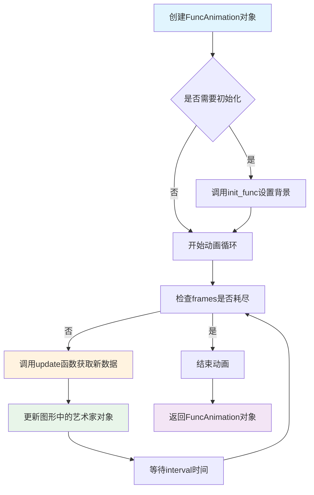

#### 带注释源码

```python
# 创建动画对象的示例代码
# 这是Matplotlib中FuncAnimation的典型使用模式

# 1. 创建图形对象（黑色背景）
fig = plt.figure(figsize=(8, 8), facecolor='black')

# 2. 创建子图（无边框）
ax = plt.subplot(frameon=False)

# 3. 准备动画数据
# 生成64行75列的随机数据，范围在0到1之间
data = np.random.uniform(0, 1, (64, 75))

# 4. 定义更新函数（动画的核心）
def update(*args):
    """
    每一帧调用此函数来更新数据
    
    参数:
        *args: 传递的额外参数（通常用于帧索引）
    
    返回值:
        list: 返回需要重绘的艺术家对象列表
    """
    # 将所有数据向右移动一列
    # data[:, 1:] = data[:, :-1] 表示将第1列到最后一列的数据
    # 移动到第0列到倒数第二列
    data[:, 1:] = data[:, :-1]
    
    # 在第一列填充新的随机值
    data[:, 0] = np.random.uniform(0, 1, len(data))
    
    # 更新每条线的Y轴数据
    for i in range(len(data)):
        # 使用高斯函数G与数据data[i]的乘积加上偏移i
        lines[i].set_ydata(i + G * data[i])
    
    # 返回修改过的艺术家对象，供动画系统重绘
    return lines

# 5. 创建FuncAnimation动画对象
# 参数说明：
# - fig: 图形对象
# - update: 更新函数，每帧调用
# - interval=10: 每帧间隔10毫秒
# - save_count=100: 缓存100帧数据用于保存
anim = animation.FuncAnimation(fig, update, interval=10, save_count=100)

# 6. 显示动画
plt.show()

# 动画工作原理：
# 1. FuncAnimation内部创建定时器（基于interval）
# 2. 每次定时器触发，调用update函数
# 3. update函数返回需要更新的艺术家对象列表
# 4. 动画系统仅重绘返回的艺术家（优化性能）
# 5. 重复执行直到动画结束或窗口关闭
```

#### 关键组件信息

- **Figure对象**：Matplotlib中的图形容器，承载所有视觉元素
- **艺术家对象（Artist）**：图形中可见的元素，如线条、文本、坐标轴等
- **更新函数（update）**：用户定义的回调函数，返回需要重绘的对象
- **定时器机制**：基于interval参数控制帧率

#### 潜在的技术债务或优化空间

1. **性能优化**：当艺术家对象较多时，可以使用`blit=True`参数仅重绘变化区域
2. **内存管理**：save_count设置过大可能占用较多内存
3. **跨平台兼容性**：在某些后端（如Agg）上可能不支持交互式动画
4. **错误处理**：缺少对update函数返回值为None的处理

#### 其它项目

- **设计目标**：提供轻量级、易用的动画创建接口
- **约束**：
  - 更新函数必须返回艺术家对象列表（或空列表）
  - interval不能太小，否则可能导致性能问题
- **错误处理**：
  - 如果update函数抛出异常，动画会停止
  - 如果frames迭代器耗尽，动画自动结束
- **数据流**：数据在update函数中就地修改，动画系统读取并渲染
- **外部依赖**：NumPy用于数值计算，Matplotlib后端（如Qt、Tkinter）用于显示


### `update`

动画帧更新回调函数，负责在每一帧动画中更新数据并重绘线条。该函数将数据向右移动，生成新的随机值填充左侧，并更新所有线条的显示数据。

参数：

- `*args`：`tuple`，可变参数，接收来自动画系统的额外参数（通常为帧索引），此处未使用但必须保留以符合动画回调接口。

返回值：`list`，返回修改后的线条对象列表，供动画系统用于渲染更新。

#### 流程图

```mermaid
flowchart TD
    A[update 函数被调用] --> B[将数据矩阵列向右移动<br/>data[:, 1:] = data[:, :-1]]
    B --> C[生成新随机值<br/>data[:, 0] = random]
    C --> D{遍历所有数据行}
    D -->|第 i 行| E[更新第 i 条线条的 Y 数据<br/>lines[i].set_ydata]
    E --> D
    D --> F[返回修改后的线条列表]
    
    style A fill:#f9f,stroke:#333
    style F fill:#9f9,stroke:#333
```

#### 带注释源码

```python
def update(*args):
    # Shift all data to the right
    # 将数据矩阵的所有列向右移动一位
    # 原先的第0列被第1列覆盖，第1列被第2列覆盖，以此类推
    # 最后一列的数据被丢弃
    data[:, 1:] = data[:, :-1]

    # Fill-in new values
    # 在数据矩阵的第一列（最左侧）填充新的随机数值
    # 这些新值将作为每一帧动画的起始数据点
    data[:, 0] = np.random.uniform(0, 1, len(data))

    # Update data
    # 遍历所有线条，根据新的数据更新其Y轴坐标
    # 每一行的数据乘以高斯包络G后加上行索引i，形成脉冲星效果的波形
    for i in range(len(data)):
        lines[i].set_ydata(i + G * data[i])

    # Return modified artists
    # 返回所有被修改的线条对象列表
    # FuncAnimation 需要返回这些对象来确定哪些部分需要重绘
    return lines
```


### `Line2D.set_ydata`

更新曲线 Y 轴数据的方法，用于在动画中动态修改折线图的 Y 坐标值。

参数：

- `y`：`numpy.ndarray` 或类数组对象，新的 Y 轴数据点序列

返回值：`None`，该方法无返回值（in-place 修改）

#### 流程图

```mermaid
flowchart TD
    A[开始 update 函数] --> B[生成随机数据 data[:, 0]]
    B --> C[遍历每条曲线 lines[i]]
    D[调用 set_ydata 方法] --> E[接收新 Y 数据: i + G * data[i]]
    E --> F[更新 Line2D 对象内部状态]
    F --> G[返回修改的 artists 列表]
    
    C -->|第 i 条曲线| D
    G --> H[动画帧渲染]
```

#### 带注释源码

```python
# 在动画更新函数中调用 set_ydata
def update(*args):
    """
    动画更新回调函数，每帧调用一次
    
    参数:
        *args: 可变参数，由 FuncAnimation 传递的额外参数
    
    返回:
        list: 修改后的 Line2D 对象列表，用于动画渲染
    """
    # 将数据列向右移动一位（制造波动效果）
    data[:, 1:] = data[:, :-1]
    
    # 在第一列填充新的随机数值 (0-1之间的均匀分布)
    data[:, 0] = np.random.uniform(0, 1, len(data))
    
    # 遍历所有曲线，更新 Y 轴数据
    for i in range(len(data)):
        # 计算新的 Y 值: 基础高度 i + 高斯衰减 * 数据
        # 调用 set_ydata 方法更新第 i 条曲线的 Y 坐标
        lines[i].set_ydata(i + G * data[i])
    
    # 返回所有线条对象，供 FuncAnimation 用于渲染更新
    return lines

# lines[i].set_ydata() 的调用示例:
# lines[i].set_ydata(i + G * data[i])
# 参数: y - numpy.ndarray 类型，包含新的 Y 坐标值
# 返回: None (直接修改 Line2D 对象的内部 _y 数据属性)
```


### `plt.show`

显示一个或多个图形窗口。该函数会阻塞程序执行（除非设置了 `block=False`），直到用户关闭图形窗口或调用 `plt.close()`。

参数：

- `block`：`bool` 或 `None`，可选参数。控制是否阻塞调用线程。默认为 `None`，在交互式后端下通常会阻塞；在非交互式后端下可能不阻塞。设置为 `True` 强制阻塞，设置为 `False` 则立即返回。

返回值：`None`，无返回值。

#### 流程图

```mermaid
flowchart TD
    A[调用 plt.show] --> B{检查图形是否已保存?}
    B -->|否| C[调用 show() 方法在当前所有图形上]
    B -->|是| D[可能不显示或显示已保存的图形]
    C --> E{block 参数值?}
    E -->|True| F[阻塞调用线程]
    E -->|False| G[非阻塞返回]
    E -->|None| H{当前后端类型?}
    H -->|交互式后端| F
    H -->|非交互式后端| G
    F --> I[等待用户关闭图形窗口]
    I --> J[函数返回]
    G --> J
```

#### 带注释源码

```python
# matplotlib.pyplot.show() 的简化实现逻辑
def show(*, block=None):
    """
    显示所有打开的图形窗口。
    
    参数:
        block: bool, optional
            是否阻塞执行以等待图形窗口关闭。
            - True: 始终阻塞
            - False: 立即返回
            - None: 根据后端自动决定（默认）
    """
    
    # 获取当前所有的图形对象
    figs = get_fignums()  # 获取所有图形编号
    
    for fig_num in figs:
        # 获取每个图形对象
        fig = figure(fig_num)
        
        # 调用图形对象的 show() 方法
        # 这会根据不同的后端（如 Qt, Tk, Agg 等）调用对应的显示逻辑
        fig.show()
    
    # 处理阻塞逻辑
    if block is None:
        # 根据是否为交互式后端决定是否阻塞
        # 交互式后端（如 Qt, Tk）通常需要阻塞
        # 非交互式后端（如 Agg 用于保存文件）通常不阻塞
        block = is_interactive()
    
    if block:
        # 在阻塞模式下，程序会停在这里
        # 等待用户关闭图形窗口
        # 通常通过事件循环实现
        _show_block()
    else:
        # 非阻塞模式，函数立即返回
        # 图形窗口仍然显示，但程序继续执行
        pass
    
    return None
```

> **说明**：在实际 matplotlib 库中，`plt.show()` 的实现更加复杂，涉及后端管理、事件循环处理、警告管理等。在这段示例代码中，它负责显示之前通过 `FuncAnimation` 创建的动画图形，使图形窗口可见并进入交互状态。


### `Axes.plot`

`Axes.plot` 是 Matplotlib 库中 Axes 类的核心绘图方法，用于在坐标系中创建线图或散点图。该方法接受 x 和 y 坐标数据以及可选的格式字符串或关键字参数，创建一个或多个 Line2D 对象并将其添加到当前 axes 中。

参数：

-  `x`：array-like 或 scalar，x 轴数据，支持列表、NumPy 数组或单个标量值
-  `y`：array-like 或 scalar，y 轴数据，支持列表、NumPy 数组或单个标量值
-  `fmt`：str，可选的格式字符串，定义线条颜色、标记和样式（如 "r--" 表示红色虚线）
-  `**kwargs`：可变关键字参数，用于设置 Line2D 的各种属性（如 color、linewidth、marker 等）

返回值：`list of matplotlib.lines.Line2D`，返回创建的 Line2D 对象列表

#### 流程图

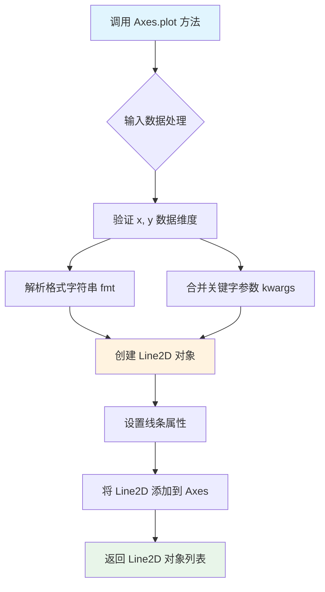

#### 带注释源码

```python
# 示例代码中的 plot 调用
line, = ax.plot(xscale * X, i + G * data[i], color="w", lw=lw)

# 详细解析：
# ax.plot() 是 Axes 对象的 plot 方法
# 
# 参数说明：
# - xscale * X: 经过缩放的 x 坐标数据
#   - xscale = 1 - i / 200.0  (随索引递减的缩放因子，创建透视效果)
#   - X = np.linspace(-1, 1, data.shape[-1])  (从 -1 到 1 的等间距数组)
# 
# - i + G * data[i]: y 坐标数据
#   - i: 当前线条的垂直偏移量（行索引）
#   - G = 1.5 * np.exp(-4 * X ** 2)  (高斯包络函数)
#   - data[i]: 第 i 行随机数据
# 
# 关键字参数：
# - color="w": 线条颜色为白色 (white)
# - lw=lw: 线宽，lw = 1.5 - i / 100.0 (随索引递减，底部线条更粗)
#
# 返回值：
# - line: 单个 Line2D 对象 (因为使用了逗号解包)
# - lines 列表存储所有创建的 Line2D 对象
```

#### 核心技术细节

```python
# matplotlib.axes.Axes.plot 方法的简化签名
def plot(self, *args, **kwargs):
    """
    Plot y versus x as lines and/or markers.
    
    调用方式:
    - plot(x, y)                    # 基本调用
    - plot(x, y, format_string)     # 带格式字符串
    - plot(x, y, **kwargs)          # 带关键字参数
    - plot(y)                       # 仅 y 数据，x 自动生成
    """
```

#### 关联信息

- **所属类**：`matplotlib.axes.Axes`
- **返回类型**：`list[matplotlib.lines.Line2D]`
- **调用对象**：`ax` (通过 `plt.subplot()` 创建的 Axes 对象)
- **典型用途**：创建静态或动态线图，支持自定义线条颜色、样式、标记等
- **性能考量**：大量线条时考虑使用 `LineCollection` 优化渲染


### `Axes.set_ylim`

设置 Axes 对象的 y 轴显示范围，限制数据在 y 方向的显示区间。

参数：

- `bottom`：`float` 或 `int`，y 轴范围的最小值
- `top`：`float` 或 `int` 或 `None`，y 轴范围的最大值，默认为 None
- `**kwargs`：其他关键字参数，用于传递给底层方法

返回值：`tuple`，返回新的 y 轴范围 `(bottom, top)`

#### 流程图

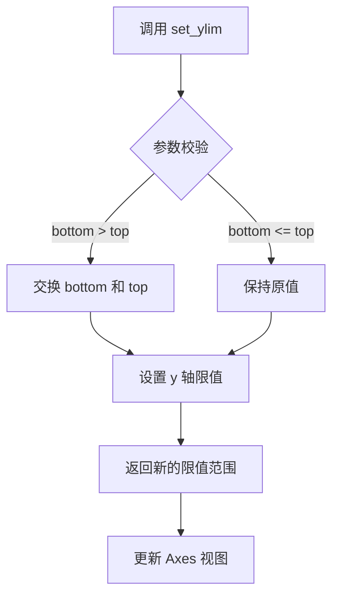

#### 带注释源码

```python
# 代码中的调用示例
ax.set_ylim(-1, 70)

# 解释：
# - 设置 y 轴的显示范围从 -1 到 70
# - 这样可以防止第一行因线条粗细而被裁剪
# - ax 是通过 plt.subplot() 创建的 Axes 对象
# - set_ylim 是 Axes 类的成员方法，用于设置 y 轴的限值
```


### `Axes.set_xticks`

设置x轴刻度线的位置。当使用空列表调用时（如代码中所示），它会移除x轴上所有的刻度线。

参数：

- `ticks`：`array-like`，x轴刻度线的位置列表
- `labels`：`array-like`，可选，刻度线的标签文字
- `emit`：`bool`，可选，是否通知观察者限值变化，默认为True
- `auto`：`bool`，可选，是否让定位器确定限值，默认为False
- `minor`：`bool`，可选，如果为False则操作主刻度，为True则操作次刻度，默认为False

返回值：`list`，生成的刻度位置列表

#### 流程图

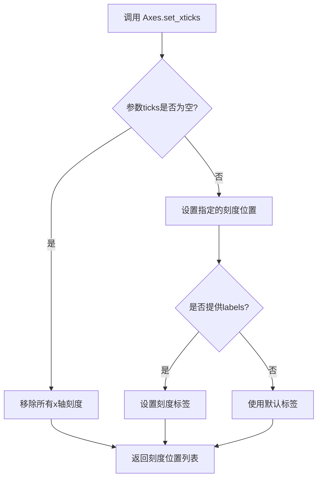

#### 带注释源码

```python
# 在代码中的调用：
ax.set_xticks([])

# 方法签名（参考matplotlib源码）
def set_xticks(self, ticks, *, labels=None, emit=True, auto=False, minor=False):
    """
    Set the x ticks with list of ticks
    
    参数:
        ticks: array-like - x轴刻度位置列表
        labels: array-like, optional - 刻度标签
        emit: bool - 是否通知观察者限值变化
        auto: bool - 是否自动确定限值
        minor: bool - 是否为次刻度
    
    返回:
        list: 刻度位置列表
    """
    # ... 实际实现省略
    # 当ticks为空列表时，此调用会清除所有x轴刻度
```


我需要分析给定的代码。代码中使用了`ax.set_yticks([])`，这是对matplotlib库中Axes类方法的调用。让我为您提取这个方法的信息。


### `Axes.set_yticks`

该方法用于设置Y轴的刻度位置。在给定的代码中，`ax.set_yticks([])`被调用以移除Y轴上的所有刻度线，这是为了创建"无 ticks"的视觉效果，常用于艺术性或装饰性的图表展示。

参数：

-  `ticks`：`list`，刻度位置的数组。如果为空列表，则移除所有刻度线。
-  `labels`：`list`，可选参数，用于指定每个刻度位置的标签。
-  `minor`：`bool`，可选参数，指定是否设置次要刻度线，默认为False。

返回值：`None`，该方法直接修改Axes对象，不返回任何值。

#### 流程图

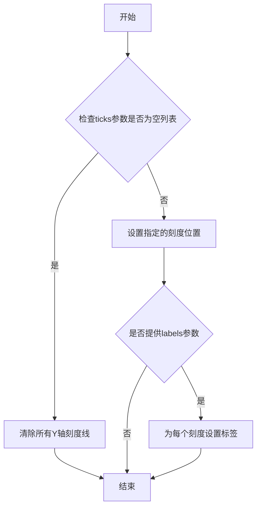

#### 带注释源码

```python
# 在给定的代码中，该方法的调用方式如下：
ax.set_yticks([])  # 传入空列表以移除所有Y轴刻度线

# 完整的方法签名（参考matplotlib源码）：
# def set_yticks(self, ticks, labels=None, *, minor=False, **kwargs):
#     """
#     Set the y-ticks of the axes.
#     
#     Parameters
#     ----------
#     ticks : array-like
#         List of y-axis tick locations.
#     labels : array-like, optional
#         List of y-axis tick labels.
#     minor : bool, default: False
#         If False, get/set major ticks; if True, minor ticks.
#     
#     Returns
#     -------
#     ticks : list of tick locations
#     """
#     pass  # 实现细节在matplotlib库中
```


### Axes.text

该方法是 matplotlib 库中 `matplotlib.axes.Axes` 类的文本绘制方法，用于在坐标轴的指定位置添加文本标签。在代码中通过 `ax.text()` 调用了两次，分别用于显示 "MATPLOTLIB" 和 "UNCHAINED" 标题，采用了不同的字体粗细（light 和 bold）来实现视觉层次感。

参数：

- `x`：`float`，文本显示的 x 坐标位置
- `y`：`float`，文本显示的 y 坐标位置
- `s`：`str`，要显示的文本内容
- `transform`：`matplotlib.transforms.Transform`，坐标变换对象，用于指定坐标系统（代码中使用 `ax.transAxes` 表示使用轴坐标系统，即归一化坐标）
- `ha`：`str`，水平对齐方式（'left'、'right'、'center'）
- `va`：`str`，垂直对齐方式（'top'、'bottom'、'center'、'baseline'）
- `color`：`str` 或 `tuple`，文本颜色（代码中 "w" 表示白色）
- `family`：`str`，字体系列（'serif'、'sans-serif'、monospace' 等）
- `fontweight`：`str` 或 `int`，字体粗细（'light'、'bold'、'normal' 或数值）
- `fontsize`：`int` 或 `float`，字体大小

返回值：`matplotlib.text.Text`，返回创建的 Text 对象，可用于后续对文本进行修改或动画更新

#### 流程图

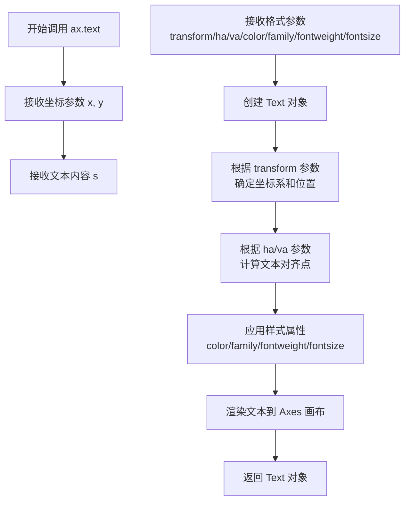

#### 带注释源码

```python
# 第一次调用：显示 "MATPLOTLIB" 标题，右侧对齐，细体字
ax.text(
    0.5,                              # x: 水平位置（0.5 表示轴中心）
    1.0,                              # y: 垂直位置（1.0 表示轴顶部）
    "MATPLOTLIB ",                    # s: 要显示的文本内容
    transform=ax.transAxes,          # transform: 使用轴坐标系（归一化坐标）
    ha="right",                       # ha: 水平右对齐
    va="bottom",                      # va: 垂直底部对齐
    color="w",                        # color: 白色
    family="sans-serif",              # family: 无衬线字体
    fontweight="light",               # fontweight: 细体
    fontsize=16                       # fontsize: 16号字体
)

# 第二次调用：显示 "UNCHAINED" 标题，左侧对齐，粗体字
ax.text(
    0.5,                              # x: 水平位置（0.5 表示轴中心）
    1.0,                              # y: 垂直位置（1.0 表示轴顶部）
    "UNCHAINED",                      # s: 要显示的文本内容
    transform=ax.transAxes,          # transform: 使用轴坐标系
    ha="left",                        # ha: 水平左对齐
    va="bottom",                      # va: 垂直底部对齐
    color="w",                        # color: 白色
    family="sans-serif",              # family: 无衬线字体
    fontweight="bold",                # fontweight: 粗体
    fontsize=16                       # fontsize: 16号字体
)
```


### `Line2D.set_ydata`

此方法是 matplotlib 库中 `Line2D` 类的成员方法，用于设置线条对象的 y 轴数据。在动画更新函数中，通过调用每个线条的 `set_ydata` 方法来动态更新脉冲星的频率数据，实现 Joy Division 风格的黑白频谱动画效果。

参数：

- `y`：`array_like`，要设置的新的 y 轴数据，可以是 Python 列表、numpy 数组或任何类似数组的对象

返回值：`None`，无返回值（该方法直接修改 Line2D 对象的内部状态）

#### 流程图

```mermaid
flowchart TD
    A[调用 set_ydata 方法] --> B{输入数据有效性检查}
    B -->|数据有效| C[转换输入数据为numpy数组]
    B -->|数据无效| D[抛出异常]
    C --> E[更新Line2D对象内部_y数据属性]
    E --> F[标记数据已修改标志]
    F --> G[触发redraw需求标志]
    G --> H[方法返回None]
```

#### 带注释源码

```python
# Line2D.set_ydata 方法的典型实现逻辑（基于matplotlib库）
def set_ydata(self, y):
    """
    设置线条的y轴数据
    
    参数:
        y: array-like - 新的y数据点
    
    返回:
        None
    """
    # 将输入转换为numpy数组（如果还不是）
    y = np.asanyarray(y)
    
    # 检查数据维度是否合法
    if y.ndim != 1:
        raise ValueError('y data must be 1D')
    
    # 更新内部数据存储
    self._y = y
    
    # 设置标记表示数据已更改，需要重绘
    self.stale = True
    
    # 返回None
    return None

# 在示例代码中的实际调用方式：
for i in range(len(data)):
    # i + G * data[i] 计算新的y值
    # G 是高斯衰减包络，data[i] 是第i行的随机数据
    lines[i].set_ydata(i + G * data[i])
```

#### 在项目中的使用上下文

```python
def update(*args):
    """
    动画更新函数，每帧调用一次
    """
    # 将所有数据向右平移
    data[:, 1:] = data[:, :-1]
    
    # 在第一列填充新随机值
    data[:, 0] = np.random.uniform(0, 1, len(data))
    
    # 关键：使用 set_ydata 更新每条线条的y值
    # 实现脉冲星信号的动态效果
    for i in range(len(data)):
        lines[i].set_ydata(i + G * data[i])
    
    # 返回修改的艺术家对象列表，供动画系统重绘
    return lines
```


## 关键组件


### Figure与Axes组件

创建黑色背景的Figure对象和不含边框的子图Axes，用于承载动画内容

### 数据生成组件

使用numpy生成64x75的随机均匀分布数据，并计算高斯衰减包络G用于创建标志性波形

### 多线条绘制组件

循环创建75条水平线条，每条线条具有不同的X轴缩放比例和线宽，产生透视效果和层次感

### 动画更新函数组件

update函数实现数据右移和新值填充的逻辑，驱动每一帧的动画更新

### FuncAnimation动画构建组件

使用Matplotlib的FuncAnimation类将更新函数与图形绑定，设置10毫秒间隔和100帧保存计数


## 问题及建议


### 已知问题

- **硬编码配置参数**：figure大小(8,8)、颜色"w"、lw计算公式中的系数等大量参数直接写在代码中，缺乏配置管理
- **全局变量缺乏封装**：data、X、G、lines等变量使用全局作用域，违反模块化设计原则，降低代码可维护性和可测试性
- **魔法数字问题**：64、75、19680801、100、200等数值散落各处，缺乏有意义的命名常量
- **缺少类型注解**：Python代码未使用类型提示(Type Hints)，降低代码可读性和IDE支持
- **update函数重复计算**：每次更新都计算`G * data[i]`，其中G在每帧保持不变，可预先计算
- **动画对象引用丢失**：anim对象创建后未保存引用，可能导致动画对象被垃圾回收
- **缺乏错误处理**：没有异常捕获机制，网络或资源相关操作可能引发未处理异常
- **注释掉的代码标签**：`# %%`和`.. tags::`为Sphinx/Gallery生成标记，但缺少实际文档说明

### 优化建议

- **提取配置常量**：将尺寸、颜色、随机种子等参数抽取为模块级常量或配置类
- **面向对象重构**：将相关功能封装为类(如PulsarAnimation类)，管理状态和生命周期
- **添加类型注解**：为函数参数和返回值添加类型提示，提升代码可靠性
- **性能优化**：预先计算不变量(如G * data[i]的结果缓存)，减少每帧计算量
- **消除魔法数字**：定义有意义的常量如`NUM_LINES = 64`、`NUM_POINTS = 75`等
- **完善文档**：为update函数和关键代码块添加docstring说明功能和使用方式


## 其它


### 设计目标与约束

本代码的设计目标是创建一个可视化动画，模拟脉冲星的频率波形（灵感来自Joy Division的Unknown Pleasures专辑封面）。主要约束包括：使用matplotlib的FuncAnimation实现动画效果；要求Python 3.x环境；依赖numpy和matplotlib库；动画需要保持流畅的帧率（10ms间隔）；需要兼容主流操作系统。

### 错误处理与异常设计

代码目前缺乏显式的错误处理机制。主要需要关注的异常场景包括：数据数组维度不匹配时可能导致IndexError；plt.show()在无图形后端环境下可能失败；np.random.uniform在参数非法时可能抛出异常。建议添加数据验证、异常捕获机制以及图形后端可用性检查。

### 数据流与状态机

数据流主要分为三个阶段：初始化阶段（生成随机数据矩阵、计算高斯核G、创建线条对象）；更新阶段（update函数实现数据右移、新值填充、线条数据更新）；渲染阶段（matplotlib自动调用update函数并重绘）。状态机包含：就绪状态（初始化完成）、运行状态（动画播放中）、结束状态（窗口关闭）。

### 外部依赖与接口契约

核心依赖包括：numpy>=1.0（用于数值计算和随机数生成）；matplotlib>=3.0（用于绑图和动画）；Python>=3.6（支持f-string等语法）。接口契约：update函数签名必须符合FuncAnimation的回调要求（接受任意参数、返回可迭代的艺术对象集合）；fig对象需保持引用否则会被垃圾回收；动画使用interval参数控制帧间隔（单位毫秒）。

### 性能考虑与优化建议

当前实现每次更新都重新计算所有线条数据，存在优化空间。建议：预先分配数据缓冲区避免重复内存分配；使用blit=True加速渲染；考虑使用FuncAnimation的init_func参数优化首帧渲染；对于大数据量可考虑降采样或使用Line2D的set_xdata/set_ydata而非全量重绘。

### 兼容性说明

代码在Windows、Linux、macOS三大平台均可运行；Python版本建议3.6以上；matplotlib后端支持Qt5Agg、TkAgg、AGG等；numpy随机种子19680801确保结果可复现；动画生成的HTML需要浏览器支持JavaScript。

### 使用示例与扩展

基础调用只需运行脚本即可显示动画；可通过anim.save()保存为GIF或MP4；可通过anim.to_jshtml()生成网页动画；可通过修改data数组形状调整波形密度；可通过修改G参数调整高斯核宽度改变波形形态；可通过修改lw和xscale参数调整透视效果强度。

### 部署与运行环境要求

运行方式：直接执行python脚本或通过Jupyter Notebook运行；显示需要图形界面环境（本地或X11转发）；无头服务器环境需设置matplotlib后端为Agg；推荐内存至少4GB以支持动画流畅运行。

    