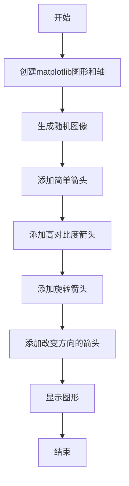
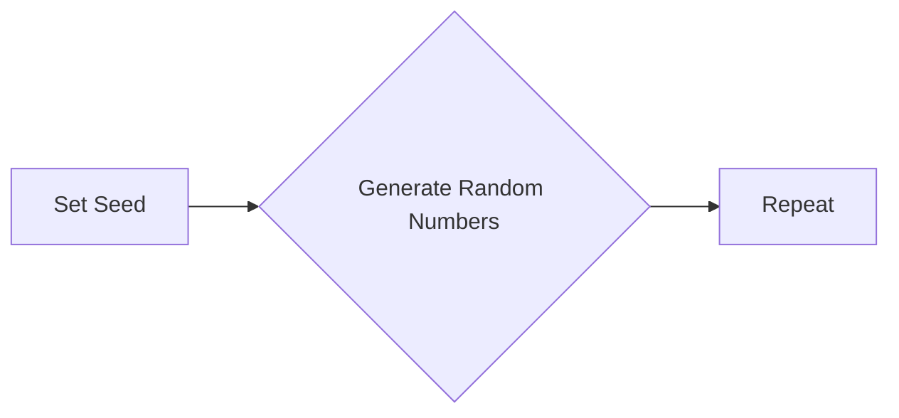
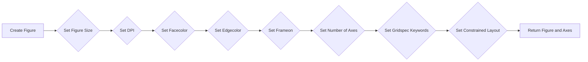
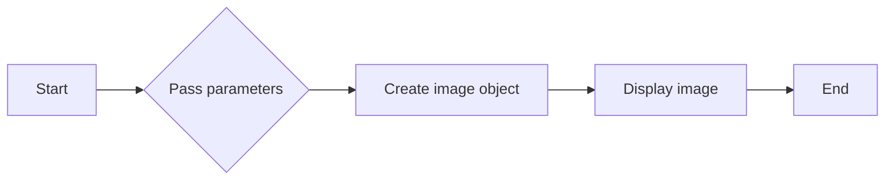
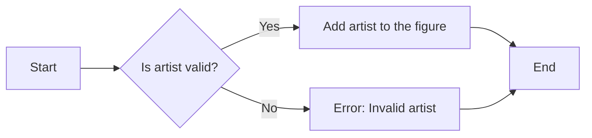
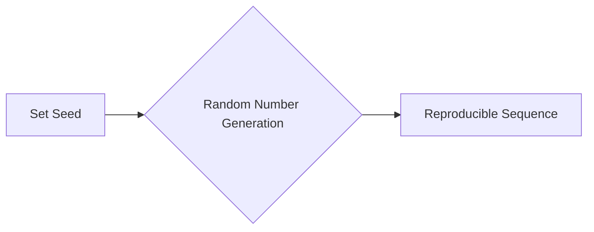
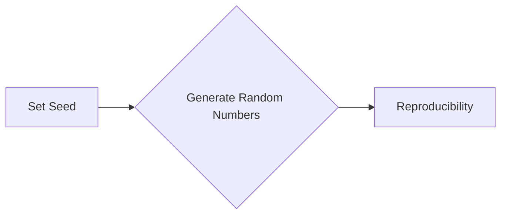
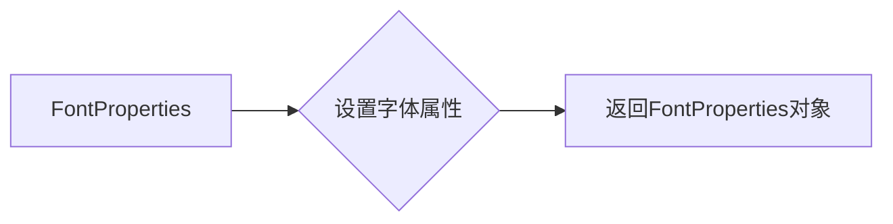
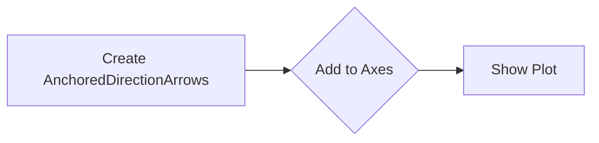

# `matplotlib\galleries\examples\axes_grid1\demo_anchored_direction_arrows.py` 详细设计文档

This code generates various anchored direction arrows on a matplotlib plot, demonstrating different styles and configurations.

## 整体流程



## 类结构

```
matplotlib.pyplot (全局模块)
├── np (全局模块)
│   ├── random (全局函数)
│   └── seed (全局函数)
├── matplotlib.font_manager (全局模块)
│   └── FontProperties (类)
├── mpl_toolkits.axes_grid1.anchored_artists (全局模块)
│   └── AnchoredDirectionArrows (类)
└── Anchored_Direction_Arrow (主模块)
```

## 全局变量及字段


### `fig`
    
The main figure object for the plot.

类型：`matplotlib.figure.Figure`
    


### `ax`
    
The axes object on which the plot is drawn.

类型：`matplotlib.axes._subplots.AxesSubplot`
    


### `simple_arrow`
    
An arrow anchored at a specific location in the axes.

类型：`mpl_toolkits.axes_grid1.anchored_artists.AnchoredDirectionArrows`
    


### `high_contrast_part_1`
    
An arrow with high contrast properties.

类型：`mpl_toolkits.axes_grid1.anchored_artists.AnchoredDirectionArrows`
    


### `high_contrast_part_2`
    
An arrow with high contrast properties and different text properties.

类型：`mpl_toolkits.axes_grid1.anchored_artists.AnchoredDirectionArrows`
    


### `rotated_arrow`
    
An arrow with a rotated angle and specific font properties.

类型：`mpl_toolkits.axes_grid1.anchored_artists.AnchoredDirectionArrows`
    


### `a1`
    
An arrow with altered direction properties.

类型：`mpl_toolkits.axes_grid1.anchored_artists.AnchoredDirectionArrows`
    


### `a2`
    
An arrow with altered direction properties and aspect ratio.

类型：`mpl_toolkits.axes_grid1.anchored_artists.AnchoredDirectionArrows`
    


### `a3`
    
An arrow with altered direction properties and aspect ratio.

类型：`mpl_toolkits.axes_grid1.anchored_artists.AnchoredDirectionArrows`
    


### `matplotlib.pyplot.fig`
    
The main figure object for the plot.

类型：`matplotlib.figure.Figure`
    


### `matplotlib.pyplot.ax`
    
The axes object on which the plot is drawn.

类型：`matplotlib.axes._subplots.AxesSubplot`
    
    

## 全局函数及方法


### matplotlib.pyplot.subplots

创建一个新的图形和轴对象。

描述：

该函数用于创建一个新的图形和轴对象，用于绘制图形。

参数：

- `figsize`：`tuple`，图形的大小（宽度和高度）。
- `dpi`：`int`，图形的分辨率（每英寸点数）。
- `facecolor`：`color`，图形的背景颜色。
- `edgecolor`：`color`，图形的边缘颜色。
- `frameon`：`bool`，是否显示图形的边框。
- `num`：`int`，图形的编号。
- `clear`：`bool`，是否清除图形中的所有内容。
- `figclass`：`class`，图形的类。
- `gridspec_kw`：`dict`，用于定义网格的参数。
- `constrained_layout`：`bool`，是否启用约束布局。

返回值：`Figure`，图形对象。

#### 流程图


#### 带注释源码

```
fig, ax = plt.subplots()
```

### matplotlib.pyplot.imshow

显示图像。

描述：

该函数用于显示一个图像。

参数：

- `data`：`array`，图像数据。
- `interpolation`：`str`，插值方法。
- `origin`：`str`，图像的起始位置。
- `cmap`：`str`，颜色映射。
- `vmin`：`float`，最小值。
- `vmax`：`float`，最大值。
- `aspect`：`str`，图像的纵横比。
- `extent`：`tuple`，图像的边界。
- `zorder`：`float`，图像的z顺序。

返回值：`AxesImage`，图像对象。

#### 流程图


#### 带注释源码

```
ax.imshow(np.random.random((10, 10)))
```

### mpl_toolkits.axes_grid1.anchored_artists.AnchoredDirectionArrows

创建一个方向箭头。

描述：

该函数用于创建一个方向箭头，可以附加到轴对象上。

参数：

- `transform`：`Transform`，转换对象。
- `direction`：`str`，方向字符串。
- `text`：`str`，文本字符串。
- `loc`：`str`，位置。
- `arrow_props`：`dict`，箭头属性。
- `text_props`：`dict`，文本属性。
- `color`：`color`，颜色。
- `angle`：`float`，角度。
- `fontproperties`：`FontProperties`，字体属性。

返回值：`AnchoredDirectionArrows`，方向箭头对象。

#### 流程图


#### 带注释源码

```
simple_arrow = AnchoredDirectionArrows(ax.transAxes, 'X', 'Y')
```

### matplotlib.pyplot.show

显示图形。

描述：

该函数用于显示图形。

参数：

- `block`：`bool`，是否阻塞程序执行。

返回值：无。

#### 流程图


#### 带注释源码

```
plt.show()
```


### np.random.seed

设置NumPy随机数生成器的种子，以确保每次运行代码时生成的随机数序列相同。

参数：

- `seed`：`int`，用于初始化随机数生成器的种子值。

返回值：`None`，该函数没有返回值。

#### 流程图



#### 带注释源码

```python
# Fixing random state for reproducibility
np.random.seed(19680801)
```


### plt.subplots()

`subplots` 是 `matplotlib.pyplot` 模块中的一个函数，用于创建一个图形和一个轴（Axes）对象。

#### 描述

`subplots` 函数用于创建一个图形和一个轴（Axes）对象，可以用于绘制图形。

#### 参数：

- `figsize`：`tuple`，图形的大小，默认为 (6, 4)。
- `dpi`：`int`，图形的分辨率，默认为 100。
- `facecolor`：`color`，图形的背景颜色，默认为 'white'。
- `edgecolor`：`color`，图形的边缘颜色，默认为 'none'。
- `frameon`：`bool`，是否显示图形的边框，默认为 True。
- `num`：`int`，轴的数量，默认为 1。
- `gridspec_kw`：`dict`，用于定义网格的参数，默认为 None。
- `constrained_layout`：`bool`，是否启用约束布局，默认为 False。

#### 返回值：

- `fig`：`Figure` 对象，图形对象。
- `ax`：`Axes` 对象，轴对象。

#### 流程图



#### 带注释源码

```python
fig, ax = plt.subplots(figsize=(6, 4), dpi=100, facecolor='white', edgecolor='none', frameon=True, num=1, gridspec_kw=None, constrained_layout=False)
```


### `imshow`

`matplotlib.pyplot.imshow` 是一个用于在 Matplotlib 图形中显示图像的函数。

参数：

- `data`：`numpy.ndarray`，图像数据，通常是一个二维数组。
- `interpolation`：`str`，插值方法，用于在显示图像时对像素进行插值。
- `cmap`：`str` 或 `Colormap`，颜色映射，用于将像素值映射到颜色。
- `vmin` 和 `vmax`：`float`，图像的显示范围的最小值和最大值。
- `aspect`：`str` 或 `float`，图像的纵横比。
- `origin`：`str`，图像的起始位置，可以是 'upper' 或 'lower'。
- `extent`：`tuple`，图像的显示范围，格式为 (x_min, x_max, y_min, y_max)。
- `shrink`：`float`，图像的缩放比例。
- `clip`：`bool`，是否将图像裁剪到轴的界限内。

返回值：`AxesImage`，图像对象。

#### 流程图



#### 带注释源码

```python
import matplotlib.pyplot as plt
import numpy as np

fig, ax = plt.subplots()
ax.imshow(np.random.random((10, 10)))
```


### matplotlib.pyplot.add_artist

matplotlib.pyplot.add_artist 是一个用于向 matplotlib 图形中添加艺术家的函数。

参数：

- `artist`：`matplotlib.artist.Artist`，要添加到图形中的艺术家对象。

返回值：无

#### 流程图



#### 带注释源码

```python
# 假设以下代码块是 matplotlib.pyplot 模块的一部分

def add_artist(self, artist):
    """
    Add an artist to the figure.

    Parameters
    ----------
    artist : matplotlib.artist.Artist
        The artist to add to the figure.

    Returns
    -------
    None
    """
    # 检查艺术家是否有效
    if not isinstance(artist, Artist):
        raise ValueError("Invalid artist")

    # 将艺术家添加到图形中
    self._artists.append(artist)
```


### plt.show()

显示当前图形。

参数：

- 无

返回值：无

#### 流程图

```mermaid
graph LR
A[开始] --> B{调用plt.show()}
B --> C[结束]
```

#### 带注释源码

```
plt.show()
```

该函数用于显示当前matplotlib图形窗口。当调用此函数时，matplotlib会打开一个图形窗口，并显示所有已添加到当前图形的元素，包括图像、箭头、文本等。此函数没有返回值，它仅用于显示图形。在代码的最后，调用`plt.show()`确保图形窗口在脚本执行完毕后仍然可见。


### np.random.seed

设置随机数生成器的种子，以确保每次运行代码时生成的随机数序列相同。

参数：

- `seed`：`int`，用于初始化随机数生成器的种子值。

返回值：无

#### 流程图



#### 带注释源码

```python
# Fixing random state for reproducibility
np.random.seed(19680801)
```


### np.seed

设置NumPy随机数生成器的种子，以确保每次运行代码时生成的随机数序列相同。

参数：

- `seed`：`int`，用于初始化随机数生成器的种子值。

返回值：`None`，该函数没有返回值。

#### 流程图



#### 带注释源码

```python
# Fixing random state for reproducibility
np.random.seed(19680801)
```


### matplotlib.font_manager.FontProperties

FontProperties 是一个用于设置文本属性的类，它允许用户自定义字体家族、大小、样式等。

参数：

- `family`：`str`，指定字体家族，如 'serif', 'sans-serif', 'monospace' 等。
- `size`：`int` 或 `float`，指定字体大小。
- `style`：`str`，指定字体样式，如 'normal', 'italic', 'oblique' 等。
- `weight`：`str`，指定字体粗细，如 'normal', 'bold', 'light' 等。
- `variant`：`str`，指定字体变体，如 'normal', 'small-caps' 等。
- `stretch`：`str`，指定字体拉伸，如 'ultra-condensed', 'condensed', 'semi-condensed', 'normal', 'semi-expanded', 'expanded', 'ultra-expanded' 等。

返回值：`FontProperties` 对象，用于设置文本的字体属性。

#### 流程图



#### 带注释源码

```python
import matplotlib.font_manager as fm

# 创建FontProperties对象
fontprops = fm.FontProperties(family='serif', size=12, style='italic', weight='bold', variant='small-caps', stretch='expanded')

# 使用FontProperties对象设置文本属性
text = plt.text(0.5, 0.5, 'Hello, World!', fontproperties=fontprops)
```


### `AnchoredDirectionArrows`

`AnchoredDirectionArrows` 是一个用于在matplotlib图形中添加锚定方向箭头的类。

参数：

- `ax`: `matplotlib.axes.Axes`，表示要添加箭头的坐标轴。
- `xy`: `tuple`，表示箭头指向的坐标位置，格式为 `(x, y)`。
- `direction`: `str`，表示箭头的方向，可以是 'X', 'Y', 'XY' 或 'None'。
- `loc`: `str`，表示箭头的位置，可以是 'upper left', 'upper right', 'lower left', 'lower right', 'center' 等。
- `arrow_props`: `dict`，表示箭头的属性，如颜色、线宽等。
- `text_props`: `dict`，表示文本的属性，如颜色、线宽等。
- `color`: `color`，表示箭头和文本的颜色。
- `angle`: `float`，表示箭头的角度。
- `fontproperties`: `matplotlib.font_manager.FontProperties`，表示文本的字体属性。
- `length`: `float`，表示箭头的长度。
- `sep_x`: `float`，表示箭头和文本在x轴上的间隔。
- `sep_y`: `float`，表示箭头和文本在y轴上的间隔。
- `aspect_ratio`: `float`，表示箭头和文本的宽高比。

返回值：`AnchoredDirectionArrows` 对象，表示创建的箭头。

#### 流程图



#### 带注释源码

```python
import matplotlib.pyplot as plt
import numpy as np
from mpl_toolkits.axes_grid1.anchored_artists import AnchoredDirectionArrows

fig, ax = plt.subplots()
ax.imshow(np.random.random((10, 10)))

simple_arrow = AnchoredDirectionArrows(ax.transAxes, 'X', 'Y')
ax.add_artist(simple_arrow)

plt.show()
```


## 关键组件


### 张量索引与惰性加载

张量索引与惰性加载是用于在代码中处理和操作多维数组（张量）的技术，它允许在需要时才计算或加载数据，从而提高效率。

### 反量化支持

反量化支持是指代码能够处理和解释量化后的数据，通常用于优化模型大小和加速推理过程。

### 量化策略

量化策略是用于将浮点数数据转换为低精度表示（如整数）的方法，以减少模型大小和加速计算。


## 问题及建议


### 已知问题

-   **代码重复性**：代码中多次使用相同的`AnchoredDirectionArrows`类来创建箭头，并且每次都设置了不同的属性。这可能导致维护困难，因为任何对`AnchoredDirectionArrows`类的修改都需要在多个地方进行。
-   **全局变量和函数**：代码中没有使用全局变量或函数，但如果有需要，应该避免使用全局变量，并考虑使用类或模块来封装功能。
-   **异常处理**：代码中没有异常处理机制。如果`matplotlib`或其他库在执行过程中抛出异常，程序可能会崩溃。

### 优化建议

-   **封装重复代码**：将创建箭头的代码封装到一个函数中，这样可以减少代码重复，并使代码更易于维护。
-   **使用类封装**：如果功能更加复杂，可以考虑使用类来封装相关的属性和方法，这样可以提高代码的可读性和可维护性。
-   **添加异常处理**：在关键操作周围添加异常处理，以确保程序在遇到错误时能够优雅地处理异常，而不是直接崩溃。
-   **代码注释**：添加必要的注释来解释代码的功能和目的，这有助于其他开发者理解代码。
-   **代码风格**：遵循一致的代码风格指南，以提高代码的可读性。


## 其它


### 设计目标与约束

- 设计目标：实现一个可定制的锚定方向箭头，用于在matplotlib图形中添加方向箭头。
- 约束条件：箭头样式和位置需灵活可配置，以适应不同的图形展示需求。

### 错误处理与异常设计

- 错误处理：在代码中添加异常处理机制，确保在出现错误时能够给出明确的错误信息，并尝试恢复或终止程序。
- 异常设计：定义自定义异常类，用于处理特定错误情况。

### 数据流与状态机

- 数据流：数据流从matplotlib图形对象开始，通过锚定方向箭头类进行配置和添加到图形中。
- 状态机：锚定方向箭头类在创建和配置过程中可能经历不同的状态，如初始化、配置、添加到图形中等。

### 外部依赖与接口契约

- 外部依赖：代码依赖于matplotlib和numpy库。
- 接口契约：定义锚定方向箭头类的接口，包括构造函数、配置方法和添加到图形的方法。


    