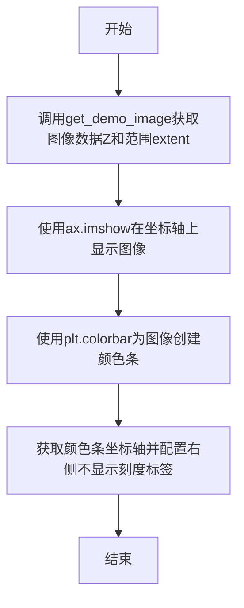
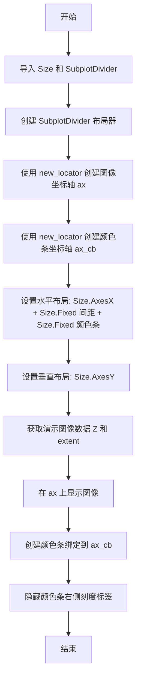
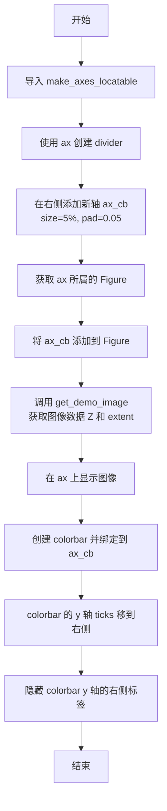
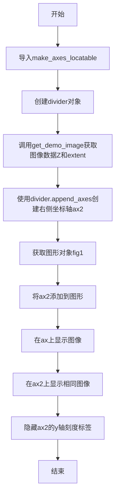
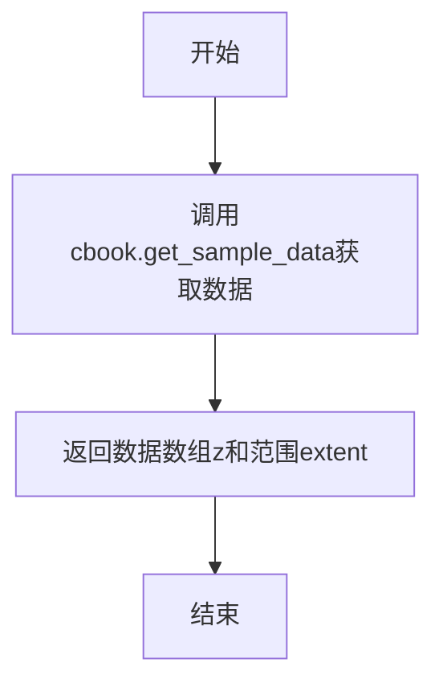
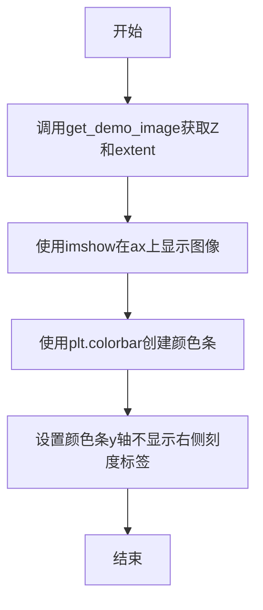
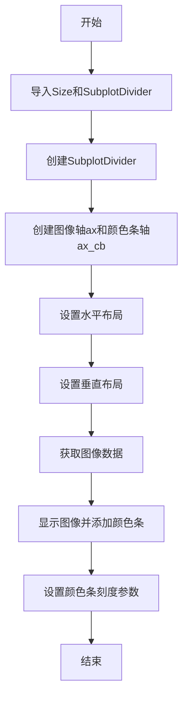
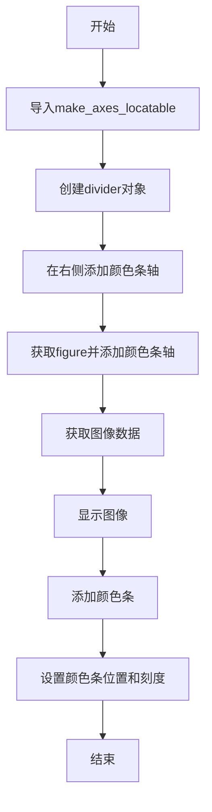
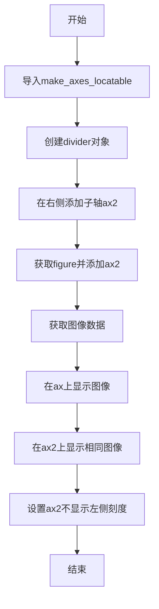
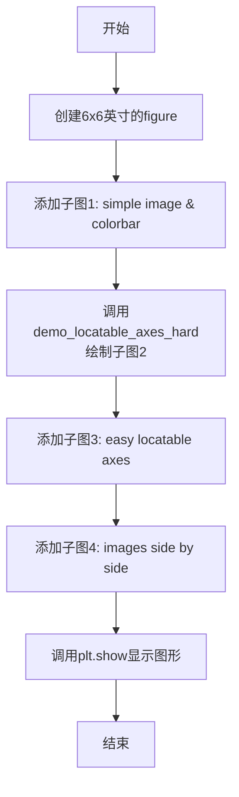

# `matplotlib\galleries\examples\axes_grid1\demo_axes_divider.py` 详细设计文档

该代码是matplotlib的Axes divider演示程序，展示了如何使用axes_grid1工具箱中的SubplotDivider和make_axes_locatable来计算Axes位置并创建分割器，实现图像与颜色条的科学布局定位。

## 整体流程

```mermaid
graph TD
    A[开始] --> B[调用demo()函数]
    B --> C[创建6x6英寸的Figure]
    C --> D[添加子图1: demo_simple_image]
    D --> E[获取示例图像数据]
    E --> F[使用imshow显示图像]
    F --> G[添加颜色条]
    G --> H[添加子图2: demo_locatable_axes_hard]
    H --> I[创建SubplotDivider]
    I --> J[设置水平和垂直分割器]
    J --> K[添加图像axes和颜色条axes]
    K --> L[添加子图3: demo_locatable_axes_easy]
    L --> M[使用make_axes_locatable]
    M --> N[append_axes添加颜色条]
    N --> O[添加子图4: demo_images_side_by_side]
    O --> P[并排添加两个图像]
    P --> Q[调用plt.show()显示]
```

## 类结构

```
无类定义 (纯函数式模块)
└── 全局函数集合
    ├── get_demo_image
    ├── demo_simple_image
    ├── demo_locatable_axes_hard
    ├── demo_locatable_axes_easy
    ├── demo_images_side_by_side
    └── demo
```

## 全局变量及字段


### `z`
    
15x15的二维数组，包含双变量正态分布的示例图像数据

类型：`numpy.ndarray`
    


### `extent`
    
图像的坐标范围，格式为(xmin, xmax, ymin, ymax)

类型：`tuple`
    


### `Z`
    
从get_demo_image返回的图像数据数组

类型：`numpy.ndarray`
    


### `im`
    
AxesImage对象，用于在Axes上显示图像

类型：`matplotlib.image.AxesImage`
    


### `cb`
    
颜色条对象，用于显示图像的色彩映射

类型：`matplotlib.colorbar.Colorbar`
    


### `divider`
    
Axes布局分割器，用于计算和管理子Axes的位置

类型：`mpl_toolkits.axes_grid1.axes_divider.AxesDivider`
    


### `ax`
    
主坐标轴对象，用于显示图像

类型：`matplotlib.axes.Axes`
    


### `ax_cb`
    
颜色条坐标轴对象，用于显示颜色条

类型：`matplotlib.axes.Axes`
    


### `ax2`
    
第二个图像坐标轴，用于并排显示图像

类型：`matplotlib.axes.Axes`
    


### `fig`
    
图形窗口对象，包含所有坐标轴

类型：`matplotlib.figure.Figure`
    


    

## 全局函数及方法


### `get_demo_image`

该函数是Matplotlib示例代码中的辅助函数，用于获取演示用的双变量正态分布样本数据（15x15的二维数组）及其坐标范围信息。

参数： 无

返回值：`tuple`，返回包含样本数据数组和坐标范围元组的二元组
- 第一个元素：`numpy.ndarray`，15x15的双变量正态分布数据
- 第二个元素：`tuple`，坐标范围元组 (-3, 4, -4, 3)，分别表示 (xmin, xmax, ymin, ymax)

#### 流程图

```mermaid
flowchart TD
    A[开始 get_demo_image] --> B[调用 cbook.get_sample_data<br/>获取样本数据 'axes_grid/bivariate_normal.npy']
    B --> C[构建坐标范围元组<br/>(-3, 4, -4, 3)]
    C --> D[返回数据数组和范围元组]
    D --> E[结束]
```

#### 带注释源码

```python
def get_demo_image():
    """
    获取演示用的双变量正态分布样本数据。
    
    该函数从matplotlib的样本数据中加载预计算的双变量正态分布数组，
    用于演示axes_grid工具的各种功能（如图像显示、颜色条定位等）。
    
    Returns:
        tuple: 包含以下两个元素的元组:
            - z (numpy.ndarray): 15x15的双变量正态分布数据矩阵
            - extent (tuple): 坐标范围 (xmin, xmax, ymin, ymax)，即 (-3, 4, -4, 3)
    """
    # 使用cbook.get_sample_data加载样本数据文件
    # 数据文件位于axes_grid目录下，名为bivariate_normal.npy
    # 这是一个预生成的15x15二维numpy数组
    z = cbook.get_sample_data("axes_grid/bivariate_normal.npy")  # 15x15 array
    
    # 返回数据数组和对应的坐标范围
    # extent元组定义: (left, right, bottom, top)
    # x轴范围: -3 到 4
    # y轴范围: -4 到 3
    return z, (-3, 4, -4, 3)
```


### `demo_simple_image`

该函数用于在给定的matplotlib坐标轴上显示一个示例图像，并为其添加颜色条，同时配置颜色条右侧不显示刻度标签。

参数：

- `ax`：`matplotlib.axes.Axes`，要在其上显示图像的坐标轴对象

返回值：`None`，该函数无返回值，仅执行绘图副作用操作

#### 流程图



#### 带注释源码

```python
def demo_simple_image(ax):
    """
    在给定坐标轴上显示示例图像并添加颜色条
    
    参数:
        ax: matplotlib坐标轴对象
    """
    # 获取示例图像数据和图像范围边界
    # 返回值: Z为15x15的二维数组, extent为(-3, 4, -4, 3)的元组
    Z, extent = get_demo_image()

    # 使用imshow在坐标轴上绘制图像
    # extent参数指定图像在坐标轴上的显示范围
    im = ax.imshow(Z, extent=extent)
    
    # 为图像创建颜色条
    # 颜色条会自动根据图像数据映射颜色
    cb = plt.colorbar(im)
    
    # 配置颜色条右侧不显示刻度标签
    # 使颜色条外观更简洁
    cb.ax.yaxis.set_tick_params(labelright=False)
```


### `demo_locatable_axes_hard`

该函数演示了如何使用 SubplotDivider 和 Size 类手动创建可定位的坐标轴，实现图像与其颜色条在绘图时的精确定位布局，这是 matplotlib 中处理图像和颜色条布局的"硬方式"。

参数：

- `fig`：`matplotlib.figure.Figure`，传入的 matplotlib 图形对象，用于创建子图和布局

返回值：`None`，该函数无返回值，执行副作用（创建坐标轴并显示图像）

#### 流程图



#### 带注释源码

```python
def demo_locatable_axes_hard(fig):
    """
    演示使用 SubplotDivider 进行硬编码的坐标轴定位
    
    参数:
        fig: matplotlib Figure 对象
    """
    # 从 axes_grid1 工具包导入尺寸和子图分割器类
    from mpl_toolkits.axes_grid1 import Size, SubplotDivider

    # 创建 SubplotDivider
    # 参数: fig, 2, 2, 2 表示创建 2x2 网格中的第 2 个子图, aspect=True 表示保持宽高比
    divider = SubplotDivider(fig, 2, 2, 2, aspect=True)

    # 使用分割器的新定位器创建图像坐标轴
    # nx=0, ny=0 表示定位到网格的第 0 列第 0 行
    ax = fig.add_subplot(axes_locator=divider.new_locator(nx=0, ny=0))
    
    # 创建颜色条的坐标轴
    # nx=2, ny=0 表示定位到右侧区域
    ax_cb = fig.add_subplot(axes_locator=divider.new_locator(nx=2, ny=0))

    # 设置水平布局
    # Size.AxesX(ax): 主图像坐标轴宽度
    # Size.Fixed(0.05): 固定间距 0.05 英寸
    # Size.Fixed(0.2): 颜色条宽度 0.2 英寸
    divider.set_horizontal([
        Size.AxesX(ax),  # main Axes
        Size.Fixed(0.05),  # padding, 0.1 inch
        Size.Fixed(0.2),  # colorbar, 0.3 inch
    ])
    
    # 设置垂直布局 - 高度由主坐标轴决定
    divider.set_vertical([Size.AxesY(ax)])

    # 获取演示图像数据
    Z, extent = get_demo_image()

    # 在主坐标轴上显示图像
    im = ax.imshow(Z, extent=extent)
    
    # 创建颜色条,指定颜色条坐标轴
    plt.colorbar(im, cax=ax_cb)
    
    # 隐藏颜色条右侧的刻度标签
    ax_cb.yaxis.set_tick_params(labelright=False)
```


### `demo_locatable_axes_easy`

该函数演示了使用`mpl_toolkits.axes_grid1`中的`make_axes_locatable`工具，通过简便的方式在现有轴旁边创建一个可定位的colorbar轴，实现图像与颜色条的水平排列布局。

参数：

- `ax`：`matplotlib.axes.Axes`，主轴对象，传入需要添加colorbar的图像轴

返回值：`None`，该函数无返回值，执行副作用（创建新的colorbar轴并显示图像）

#### 流程图



#### 带注释源码

```python
def demo_locatable_axes_easy(ax):
    """
    使用简便方法创建可定位的colorbar轴
    
    参数:
        ax: 主轴对象，用于显示图像
    """
    # 从 mpl_toolkits.axes_grid1 导入 make_axes_locatable 函数
    # 该函数用于创建一个可定位的轴分割器
    from mpl_toolkits.axes_grid1 import make_axes_locatable

    # 使用 make_axes_locatable 为输入轴 ax 创建分割器
    # 这个分割器可以智能计算子轴的位置和大小
    divider = make_axes_locatable(ax)

    # 在主轴的右侧创建一个新轴用于放置 colorbar
    # 参数 "right" 表示位置在右侧
    # size="5%" 表示新轴宽度为主轴宽度的5%
    # pad=0.05 表示新轴与主轴之间的间距（英寸）
    ax_cb = divider.append_axes("right", size="5%", pad=0.05)
    
    # 获取 ax 所属的 Figure 对象
    fig = ax.get_figure()
    
    # 将新创建的 colorbar 轴添加到 Figure 中
    # 注意：append_axes 已经将轴添加到 divider，但需要确保添加到 figure
    fig.add_axes(ax_cb)

    # 调用 get_demo_image 获取示例图像数据
    # 返回图像数组 Z 和图像范围 extent
    Z, extent = get_demo_image()
    
    # 在主轴 ax 上显示图像
    # extent 参数指定图像的坐标范围 [xmin, xmax, ymin, ymax]
    im = ax.imshow(Z, extent=extent)

    # 创建颜色条并绑定到 colorbar 轴 ax_cb
    # cax 参数指定颜色条显示的轴
    plt.colorbar(im, cax=ax_cb)
    
    # 将 colorbar 的 y 轴刻度移到右侧
    ax_cb.yaxis.tick_right()
    
    # 隐藏 colorbar y 轴右侧的刻度标签
    ax_cb.yaxis.set_tick_params(labelright=False)
```


### `demo_images_side_by_side`

该函数用于在matplotlib中创建两个并排显示的图像子图，通过使用axes_grid1工具的make_axes_locatable方法动态调整坐标轴布局，实现固定间距的双图像展示效果。

参数：

- `ax`：`matplotlib.axes.Axes`，matplotlib的子图对象，作为创建并排图像的基准坐标轴

返回值：`None`，该函数无返回值，直接在传入的坐标轴对象上进行图形渲染

#### 流程图



#### 带注释源码

```python
def demo_images_side_by_side(ax):
    """
    创建两个并排显示的图像子图
    
    Parameters:
        ax: matplotlib Axes对象，作为基准坐标轴
    """
    # 导入axes_grid1工具中的make_axes_locatable函数
    # 用于动态计算和调整坐标轴布局
    from mpl_toolkits.axes_grid1 import make_axes_locatable

    # 使用make_axes_locatable为ax创建一个divider对象
    # divider用于管理坐标轴的定位和大小
    divider = make_axes_locatable(ax)

    # 获取演示图像数据
    # Z: 15x15的numpy数组，包含图像像素值
    # extent: 图像的坐标范围(-3, 4, -4, 3)
    Z, extent = get_demo_image()

    # 在右侧创建新的坐标轴ax2
    # "right": 位置在右侧
    # size="100%": 宽度与主坐标轴相同
    # pad=0.05: 坐标轴之间的间距
    ax2 = divider.append_axes("right", size="100%", pad=0.05)

    # 获取ax所属的图形对象
    fig1 = ax.get_figure()

    # 将新创建的ax2坐标轴添加到图形中
    fig1.add_axes(ax2)

    # 在主坐标轴ax上显示图像
    ax.imshow(Z, extent=extent)

    # 在右侧坐标轴ax2上显示相同的图像
    ax2.imshow(Z, extent=extent)

    # 隐藏ax2的左侧y轴刻度标签
    # 因为两个坐标轴并排，右侧坐标轴不需要左侧标签
    ax2.yaxis.set_tick_params(labelleft=False)
```


### `get_demo_image`

获取示例图像数据，用于演示Axes divider功能。该函数从matplotlib的示例数据中加载一个15x15的双变量正态分布数组，并返回图像数据及其范围。

参数：无

返回值：`tuple`，返回包含图像数据数组和范围元组的元组 `(z, extent)`，其中 z 是 15x15 的二维数组，extent 是表示图像显示范围的四元组 `(-3, 4, -4, 3)`

#### 流程图



#### 带注释源码

```python
def get_demo_image():
    # 从matplotlib的示例数据中获取bivariate_normal.npy文件
    # 返回一个15x15的二维数组
    z = cbook.get_sample_data("axes_grid/bivariate_normal.npy")
    
    # 返回图像数据z和图像显示范围extent
    # extent格式为(left, right, bottom, top)
    return z, (-3, 4, -4, 3)
```

---

### `demo_simple_image`

演示最简单的图像和颜色条显示方式。该函数接收一个Axes对象，在其上显示图像并添加颜色条，但不进行复杂的定位操作。

参数：

- `ax`：`matplotlib.axes.Axes`，用于显示图像的Axes对象

返回值：`None`，无返回值，该函数仅执行绘图操作

#### 流程图



#### 带注释源码

```python
def demo_simple_image(ax):
    # 获取示例图像数据和显示范围
    Z, extent = get_demo_image()

    # 使用imshow在Axes上显示图像数据
    # extent参数定义了图像的坐标范围
    im = ax.imshow(Z, extent=extent)
    
    # 为图像创建颜色条
    # 颜色条使用图像的映射信息
    cb = plt.colorbar(im)
    
    # 设置颜色条y轴的刻度参数
    # labelright=False表示不显示右侧的刻度标签
    cb.ax.yaxis.set_tick_params(labelright=False)
```

---

### `demo_locatable_axes_hard`

演示使用SubplotDivider进行硬编码方式的可定位轴布局。该方法通过手动设置布局参数来同时显示图像和颜色条，需要较多的布局代码。

参数：

- `fig`：`matplotlib.figure.Figure`，用于创建子图的Figure对象

返回值：`None`，无返回值，该函数仅执行绘图操作

#### 流程图



#### 带注释源码

```python
def demo_locatable_axes_hard(fig):
    # 从mpl_toolkits.axes_grid1导入布局管理所需的类
    from mpl_toolkits.axes_grid1 import Size, SubplotDivider

    # 创建SubplotDivider
    # 参数: fig对象, 行数2, 列数2, 索引位置2, aspect=True保持宽高比
    divider = SubplotDivider(fig, 2, 2, 2, aspect=True)

    # 使用divider.new_locator创建定位器并添加子图
    # nx=0, ny=0指定定位器位置
    ax = fig.add_subplot(axes_locator=divider.new_locator(nx=0, ny=0))
    ax_cb = fig.add_subplot(axes_locator=divider.new_locator(nx=2, ny=0))

    # 设置水平布局数组
    # Size.AxesX(ax): 主图像轴的宽度
    # Size.Fixed(0.05): 固定间距0.05英寸
    # Size.Fixed(0.2): 颜色条宽度0.2英寸
    divider.set_horizontal([
        Size.AxesX(ax),  # main Axes
        Size.Fixed(0.05),  # padding, 0.1 inch
        Size.Fixed(0.2),  # colorbar, 0.3 inch
    ])
    
    # 设置垂直布局数组
    # 只包含主图像轴的高度
    divider.set_vertical([Size.AxesY(ax)])

    # 获取示例图像数据
    Z, extent = get_demo_image()

    # 在主轴上显示图像
    im = ax.imshow(Z, extent=extent)
    
    # 在颜色条轴上添加颜色条
    # cax参数指定颜色条显示的轴
    plt.colorbar(im, cax=ax_cb)
    
    # 设置颜色条y轴不显示右侧刻度标签
    ax_cb.yaxis.set_tick_params(labelright=False)
```

---

### `demo_locatable_axes_easy`

演示使用make_axes_locatable进行简单方式的可定位轴布局。该方法通过mpl_toolkits.axes_grid1提供的便捷函数自动处理布局，比硬编码方式更简洁。

参数：

- `ax`：`matplotlib.axes.Axes`，用于创建可定位布局的Axes对象

返回值：`None`，无返回值，该函数仅执行绘图操作

#### 流程图



#### 带注释源码

```python
def demo_locatable_axes_easy(ax):
    # 导入便捷的轴定位工具函数
    from mpl_toolkits.axes_grid1 import make_axes_locatable

    # 使用make_axes_locatable为ax创建可定位的divider
    # 这会自动处理布局计算
    divider = make_axes_locatable(ax)

    # 在主轴的右侧添加一个子轴作为颜色条
    # size="5%": 宽度为主轴的5%
    # pad=0.05: 间距为主轴宽度的5%
    ax_cb = divider.append_axes("right", size="5%", pad=0.05)
    
    # 获取ax所属的figure对象
    fig = ax.get_figure()
    
    # 将新创建的颜色条轴添加到figure中
    fig.add_axes(ax_cb)

    # 获取示例图像数据
    Z, extent = get_demo_image()
    
    # 在主轴上显示图像
    im = ax.imshow(Z, extent=extent)

    # 为图像添加颜色条，指定颜色条轴
    plt.colorbar(im, cax=ax_cb)
    
    # 将颜色条y轴的刻度移动到右侧
    ax_cb.yaxis.tick_right()
    
    # 设置右侧刻度不显示标签
    ax_cb.yaxis.set_tick_params(labelright=False)
```

---

### `demo_images_side_by_side`

演示并排显示两个图像的功能。该函数创建一个可定位的divider，并在主轴右侧添加一个相同大小的子轴，同时显示两幅图像。

参数：

- `ax`：`matplotlib.axes.Axes`，用于创建可定位布局的Axes对象

返回值：`None`，无返回值，该函数仅执行绘图操作

#### 流程图



#### 带注释源码

```python
def demo_images_side_by_side(ax):
    # 导入便捷的轴定位工具函数
    from mpl_toolkits.axes_grid1 import make_axes_locatable

    # 创建可定位的divider
    divider = make_axes_locatable(ax)

    # 获取示例图像数据
    Z, extent = get_demo_image()
    
    # 在右侧添加一个子轴，宽度与主轴相同(pad=0.05)
    ax2 = divider.append_axes("right", size="100%", pad=0.05)
    
    # 获取figure对象
    fig1 = ax.get_figure()
    
    # 将新创建的轴添加到figure
    fig1.add_axes(ax2)

    # 在第一个轴上显示图像
    ax.imshow(Z, extent=extent)
    
    # 在第二个轴上显示相同的图像
    ax2.imshow(Z, extent=extent)
    
    # 设置第二个轴的y轴不显示左侧刻度
    # 因为两个图像并排，左侧轴已经显示了y轴刻度
    ax2.yaxis.set_tick_params(labelleft=False)
```

---

### `demo`

主演示函数，协调展示四种不同的轴布局方式。该函数创建一个6x6英寸的figure，并在四个位置分别展示：简单图像+颜色条、硬编码方式的可定位轴、简单方式的可定位轴、并排图像。

参数：无

返回值：`None`，无返回值，该函数仅执行绘图操作

#### 流程图



#### 带注释源码

```python
def demo():
    # 创建一个6x6英寸的figure对象
    fig = plt.figure(figsize=(6, 6))

    # PLOT 1
    # 简单图像和颜色条演示
    # 在2x2网格的第1个位置添加子图
    ax = fig.add_subplot(2, 2, 1)
    # 调用demo_simple_image函数绘制
    demo_simple_image(ax)

    # PLOT 2
    # 图像和颜色条，使用硬编码方式实现draw-time定位
    # 直接传入figure对象
    demo_locatable_axes_hard(fig)

    # PLOT 3
    # 图像和颜色条，使用简单方式实现draw-time定位
    # 在2x2网格的第3个位置添加子图
    ax = fig.add_subplot(2, 2, 3)
    # 调用demo_locatable_axes_easy函数绘制
    demo_locatable_axes_easy(ax)

    # PLOT 4
    # 两个图像并排显示，固定间距
    # 在2x2网格的第4个位置添加子图
    ax = fig.add_subplot(2, 2, 4)
    # 调用demo_images_side_by_side函数绘制
    demo_images_side_by_side(ax)

    # 显示图形窗口
    plt.show()


# 调用demo函数启动演示
demo()
```


## 关键组件


### get_demo_image()

获取示例图像数据函数，从 matplotlib 的样本数据中加载一个 15x15 的二维数组（双变量正态分布数据），返回数据数组和对应的坐标范围 (-3, 4, -4, 3)。

### demo_simple_image(ax)

简单图像显示函数，接收一个 axes 对象作为参数，在给定的 axes 上显示图像并添加颜色条，关闭颜色条右侧的刻度标签显示。

### demo_locatable_axes_hard(fig)

使用 SubplotDivider 进行硬编码定位的演示函数，通过手动创建 SubplotDivider、设置水平和垂直分割器、添加主 axes 和颜色条 axes 来实现图像和颜色条的精确定位布局。

### demo_locatable_axes_easy(ax)

使用 make_axes_locatable 进行简单定位的演示函数，通过 mpl_toolkits.axes_grid1 模块的 make_axes_locatable 工具轻松创建可定位的 axes 布局，在主 axes 右侧添加颜色条 axes。

### demo_images_side_by_side(ax)

并排显示两个图像的演示函数，使用 make_axes_locatable 在右侧创建第二个 axes，两个 axes 共享相同的图像数据，关闭左侧 axes 的刻度标签。

### demo()

主演示函数，创建 6x6 大小的 figure 窗口，按 2x2 网格布局调用四个不同的演示函数，依次展示：简单图像与颜色条、硬定位方式、简单定位方式、以及并排图像显示。

### mpl_toolkits.axes_grid1 模块

matplotlib 的 axes 网格工具模块，提供 Size（尺寸控制）、SubplotDivider（子图分割器）和 make_axes_locatable（可定位 axes 制造工具）等组件，用于实现灵活的 axes 布局和定位。


## 问题及建议


### 已知问题

-   **函数内导入模块**：在多个函数内部进行局部导入（`from mpl_toolkits.axes_grid1 import ...`），增加了运行时开销，且不利于代码可读性和模块依赖的全局把握
-   **变量命名不一致**：`demo_images_side_by_side` 函数中使用 `fig1` 作为变量名，而其他函数统一使用 `fig`，命名风格不统一
-   **重复代码**：获取图像数据 `Z, extent = get_demo_image()` 在 `demo_simple_image`、`demo_locatable_axes_hard`、`demo_locatable_axes_easy`、`demo_images_side_by_side` 四个函数中重复出现
-   **冗余的 axes 添加**：`demo_locatable_axes_easy` 函数中 `fig.add_axes(ax_cb)` 是多余的，因为 `append_axes` 已经将新 axes 添加到 figure 中
-   **硬编码数值**：颜色条宽度(`0.2`)、间距(`0.05`)等数值硬编码，缺乏可配置性
-   **缺少错误处理**：没有对 `get_demo_image()` 返回值进行验证，若文件不存在或数据损坏会导致程序崩溃
-   **魔法数字**：如 `Size.Fixed(0.05)`、 `size="5%"` 等数值缺乏解释，可读性差
-   **过时的 API 使用方式**：使用 `axes_locator` 参数创建子图的方式在新版 matplotlib 中已被更现代的 API 取代

### 优化建议

-   **顶层导入**：将所有 `mpl_toolkits.axes_grid1` 的导入移至文件顶部统一管理，提高性能和代码清晰度
-   **提取公共函数**：将 `Z, extent = get_demo_image()` 的调用封装到一个公共函数中，消除重复代码
-   **统一变量命名**：将 `fig1` 改为 `fig`，保持命名风格一致
-   **移除冗余代码**：删除 `demo_locatable_axes_easy` 和 `demo_images_side_by_side` 中不必要的 `fig.add_axes()` 调用
-   **添加配置参数**：为演示函数添加尺寸、间距等参数的默认值配置，提高函数灵活性
-   **增加错误处理**：在 `get_demo_image()` 调用处添加 try-except 块，处理文件不存在或数据加载异常
-   **添加文档字符串**：为每个函数添加详细的 docstring，说明参数、返回值和功能
-   **考虑类型注解**：为函数添加类型提示，提高代码的可维护性和 IDE 支持
-   **使用 dataclass 或配置类**：将硬编码的配置值封装到配置对象中，提高可维护性


## 其它


### 设计目标与约束

本代码旨在演示matplotlib中Axes divider的功能，帮助开发者实现axes的精确定位和布局。设计目标包括：1）提供灵活的axes定位机制，支持在运行时计算axes位置；2）简化colorbar与主图的布局管理；3）支持多axes的并排显示。约束条件包括：依赖matplotlib 1.0以上版本，需要mpl_toolkits.axes_grid1模块支持，且主要针对2D图像可视化场景。

### 错误处理与异常设计

代码中主要依赖matplotlib自身的异常处理机制。当get_demo_image()无法加载样本数据时，会抛出FileNotFoundError或KeyError。fig.add_subplot()在传入无效参数时会抛出ValueError。Size类参数为负数时可能导致布局异常。改进建议：添加数据加载失败的降级处理，为无效的axes_locator参数提供验证，对负数尺寸参数进行边界检查。

### 数据流与状态机

数据流主要分为三个阶段：初始化阶段创建Figure对象并设置尺寸；布局计算阶段通过Divider类计算各axes的位置和大小；渲染阶段调用imshow()和colorbar()进行绘图。状态转换从空Figure开始，经过add_subplot()创建axes，到divider计算布局，最后完成渲染。没有复杂的状态机设计，属于单向流程。

### 外部依赖与接口契约

主要依赖包括：matplotlib.pyplot用于图形创建和显示，matplotlib.cbook用于样本数据加载，mpl_toolkits.axes_grid1模块提供Size、SubplotDivider和make_axes_locatable等核心类。接口契约方面：get_demo_image()返回元组(array, extent)，其中array为15x15的numpy数组，extent为四元组表示坐标范围；demo_*函数接受ax或fig对象作为参数，无返回值；Size类接受浮点数表示英寸尺寸。

### 性能考虑

代码性能瓶颈主要在于图像渲染和colorbar创建。imshow()在大图像时会消耗较多内存和渲染时间，colorbar()涉及额外的axes创建和渲染。建议：对于大图像考虑下采样或使用渐进式加载；固定尺寸的Size.Fixed比Size.AxesX/Y性能更好；避免频繁调用set_horizontal()和set_vertical()，应一次性设置完成。

### 安全性考虑

代码安全性风险较低，主要涉及文件加载和用户输入。get_demo_image()使用cbook.get_sample_data()加载预置样本，不存在路径遍历风险。fig.add_subplot()的参数应进行范围验证，防止传入负数或超出网格范围的索引。colorbar()的cax参数应确保是有效的axes对象。

### 兼容性考虑

代码需要matplotlib 1.0以上版本，推荐2.0以上以获得完整的axes_grid1功能。部分API在matplotlib 3.x中有细微变化：tick_params()的参数名和行为略有调整，SubplotDivider的构造函数参数顺序保持一致。Python版本兼容性方面，支持Python 2.7（部分）和Python 3.5以上版本。

### 配置说明

关键配置参数包括：figure(figsize=(6, 6))设置画布大小为6x6英寸；Size.Fixed(0.05)设置固定宽度为0.05英寸；Size.Fixed(0.2)设置colorbar宽度为0.2英寸；pad参数控制axes间距，如pad=0.05表示5%的相对间距；aspect参数控制axes宽高比，aspect=True表示保持原始比例。

### 术语表

Axes Divider：matplotlib中用于计算和管理axes布局的类；SubplotDivider：针对subplot的divider实现；Locator：定位器，用于确定axes在figure中的位置；Colorbar：颜色条，用于显示图像的数值与颜色映射；Extent：图像的坐标范围，格式为(xmin, xmax, ymin, ymax)；Numpy Array：NumPy库的多维数组对象，用于存储图像数据。

### 参考文献

matplotlib官方文档中关于axes_grid1的工具包说明；Matplotlib Artist教程中关于axes定位的内容；SciPy会议论文中关于科学可视化布局的讨论；matplotlib examples中的axes_grid教程和colorbar定位示例。


    