# `matplotlib\galleries\examples\axes_grid1\demo_axes_grid.py` 详细设计文档

这是一个matplotlib演示脚本,展示了ImageGrid组件的多种用法,包括2x2图像网格的不同布局配置、无颜色条、单一共享颜色条以及每个图像独立颜色条的实现方式。

## 整体流程

```mermaid
graph TD
    A[开始] --> B[创建Figure对象]
    B --> C[加载示例数据 Z (15x15数组)]
    C --> D[定义extent范围 (-3,4,-4,3)]
    D --> E{创建不同的ImageGrid实例}
    E --> E1[示例1: 2x2网格,无颜色条,仅左下轴标注]
    E --> E2[示例2: 2x2网格,顶部共享颜色条]
    E --> E3[示例3: 2x2网格,每个图像独立颜色条]
    E --> E4[示例4: 2x2网格,右侧独立颜色条,不同颜色范围]
    E1 --> F[调用plt.show()显示图形]
    E2 --> F
    E3 --> F
    E4 --> F
```

## 类结构

```
matplotlib.pyplot
├── Figure (fig)
└── mpl_toolkits.axes_grid1
    └── ImageGrid
        ├── axes_row (子Axes数组)
        ├── cbar_axes (颜色条Axes数组)
        └── axes_llc (左下角Axes引用)
```

## 全局变量及字段


### `fig`
    
整个图形的容器,包含所有子图和视觉元素

类型：`matplotlib.figure.Figure`
    


### `Z`
    
15x15的双变量正态分布样本数据,用于显示为图像

类型：`numpy.ndarray`
    


### `extent`
    
定义图像的坐标范围 (-3, 4, -4, 3)

类型：`tuple`
    


### `grid`
    
图像网格布局管理器,负责创建和管理2x2的子图网格

类型：`mpl_toolkits.axes_grid1.ImageGrid`
    


### `ax`
    
单个子图区域,用于显示图像

类型：`matplotlib.axes.Axes`
    


### `im`
    
显示的图像对象,通过imshow生成

类型：`matplotlib.image.AxesImage`
    


### `cax`
    
颜色条专用的坐标轴对象

类型：`matplotlib.axes.Axes`
    


### `cb`
    
颜色条对象,用于显示图像的色度映射

类型：`matplotlib.colorbar.Colorbar`
    


### `limits`
    
定义每个图像不同的颜色范围限制元组列表 ((0,1), (-2,2), (-1.7,1.4), (-1.5,1))

类型：`list`
    


### `ImageGrid.axes_row`
    
二维列表,存储网格中所有行的Axes对象

类型：`list[list[matplotlib.axes.Axes]]`
    


### `ImageGrid.cbar_axes`
    
颜色条坐标轴列表,每个子图对应一个颜色条轴

类型：`list[matplotlib.axes.Axes]`
    


### `ImageGrid.axes_llc`
    
左下角(lower-left corner)的Axes对象引用

类型：`matplotlib.axes.Axes`
    
    

## 全局函数及方法


### `plt.figure()`

创建并返回一个新的 matplotlib Figure 对象，用于后续的图形绑定和绘制操作。该函数是 matplotlib 中创建图形窗口的入口点，支持多种参数配置以满足不同的可视化需求。

参数：

- `figsize`：`tuple of float`，可选，默认值 `rcParams["figure.figsize"]`，画布的宽度和高度，以英寸为单位（宽 × 高）。代码中设置为 `(10.5, 2.5)`
- `dpi`：`float`，可选，默认值 `rcParams["figure.dpi"]`，图形的分辨率（每英寸点数）
- `facecolor`：str，可选，默认值 `rcParams["figure.facecolor"]`，图形背景颜色
- `edgecolor`：str，可选，默认值 `rcParams["figure.edgecolor"]`，图形边框颜色
- `frameon`：bool，可选，默认值 `True`，是否绘制图形边框
- `FigureClass`：type，可选，自定义 Figure 类，默认为 `matplotlib.figure.Figure`
- `clear`：bool，可选，默认值 `False`，如果为 True 且存在同名的已存在图形，则清除其内容
- `**kwargs`：其他关键字参数，将传递给 Figure 类的构造函数

返回值：`matplotlib.figure.Figure`，返回新创建的 Figure 对象，用于添加子图、绑定数据等后续操作。代码中通过 `fig = plt.figure(figsize=(10.5, 2.5))` 接收返回值

#### 流程图

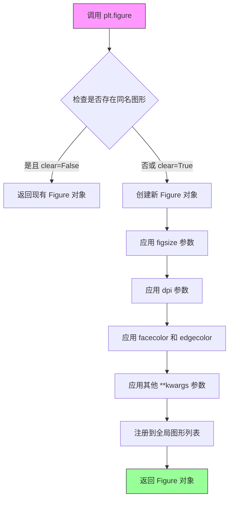

#### 带注释源码

```python
# matplotlib.pyplot.figure() 源码核心逻辑

def figure(
    figsize=None,      # 画布尺寸 (宽度, 高度) 单位：英寸
    dpi=None,          # 分辨率，每英寸像素点数
    facecolor=None,    # 背景颜色
    edgecolor=None,    # 边框颜色
    frameon=True,     # 是否显示边框
    FigureClass=Figure,  # 自定义 Figure 类
    clear=False,       # 是否清除已存在的图形
    **kwargs          # 其他传递给 Figure 的参数
):
    """
    创建一个新的 figure（图形）对象。
    
    参数:
        figsize: 画布大小，格式为 (width, height)，单位为英寸
        dpi: 图形的分辨率
        facecolor: 背景颜色
        edgecolor: 边框颜色
        frameon: 是否显示边框
        FigureClass: 用于创建 figure 的类
        clear: 如果为 True，则清除已存在的同名 figure
        **kwargs: 传递给 Figure 构造器的其他参数
    
    返回:
        Figure 对象
    """
    
    # 获取全局的 Gcf（图形管理）对象
    allnums = get_fignums()
    next_num = max(allnums) + 1 if allnums else 1
    
    # 如果没有提供 figsize，使用默认配置
    if figsize is None:
        figsize = rcParams["figure.figsize"]
    
    # 如果没有提供 dpi，使用默认配置
    if dpi is None:
        dpi = rcParams["figure.dpi"]
    
    # 创建 Figure 对象
    # facecolor 和 edgecolor 会传递给 Figure 构造函数
    fig = Figure(
        figsize=figsize,
        dpi=dpi,
        facecolor=facecolor,
        edgecolor=edgecolor,
        frameon=frameon,
        **kwargs
    )
    
    # 将新创建的 figure 注册到全局管理器
    # 这使得后续可以通过 plt.figure(num) 获取已存在的图形
    fig.number = next_num
    _pylab_helpers.Gcf.destroy(next_num)  # 清理可能存在的旧图形
    Gcf.figs[next_num] = fig  # 注册新图形
    
    # 如果需要清除内容
    if clear:
        fig.clear()
    
    # 返回创建的 figure 对象，供后续绑定数据使用
    return fig


# 在代码中的实际使用示例：
# 创建画布大小为 10.5 x 2.5 英寸的 Figure 对象
fig = plt.figure(figsize=(10.5, 2.5))
# 返回的 fig 对象将用于后续绑定 ImageGrid 和其他可视化元素
```


### `cbook.get_sample_data`

该函数是 matplotlib 库中 cbook 模块提供的示例数据加载工具，用于从 matplotlib 安装目录中获取内置的示例数据文件。在代码中，它被用于加载 "axes_grid/bivariate_normal.npy" 文件，返回一个 15x15 的二维数组（numpy 数组），该数组包含符合二元正态分布的示例数据，供后续可视化操作使用。

参数：

-  `fname`：`str`，要加载的示例数据文件路径，可以是相对于 matplotlib 示例数据目录的相对路径（如 "axes_grid/bivariate_normal.npy"），也可以是绝对路径。
-  `asfileobj`：`bool`，可选参数，默认为 True。当设置为 True 时，返回一个可打开的文件对象；当设置为 False 时，返回文件路径字符串。

返回值：`numpy.ndarray` 或文件对象，取决于 `asfileobj` 参数。当 `asfileobj=True`（默认行为在某些场景下）时，通常返回 numpy 数组；当 `asfileobj=False` 时，可能返回文件路径。具体返回值类型需根据实际调用场景和 matplotlib 版本确定。在代码中直接使用返回值作为 `imshow` 的输入，说明其返回了可解析的数组数据。

#### 流程图

```mermaid
flowchart TD
    A[调用 cbook.get_sample_data] --> B{检查 fname 参数}
    B --> C[构建示例数据文件的完整路径]
    C --> D{asfileobj 参数值}
    D -->|True| E[以二进制模式打开文件]
    D -->|False| F[返回文件路径字符串]
    E --> G{文件格式是否为 .npy}
    G -->|是| H[使用 numpy.load 加载数据]
    G -->|否| I[返回文件对象]
    H --> J[返回 numpy 数组]
    I --> J
    J>[返回数据给调用者]
```

#### 带注释源码

```python
# 以下为 cbook.get_sample_data 函数的典型实现逻辑（基于 matplotlib 源码简化）
import os
import numpy as np
from matplotlib import cbook

def get_sample_data(fname, asfileobj=True):
    """
    加载 matplotlib 内置的示例数据文件。
    
    参数:
        fname: str, 示例数据文件名或相对路径
        asfileobj: bool, 是否以文件对象形式返回
    
    返回:
        文件对象、numpy 数组或文件路径
    """
    # 获取 matplotlib 的数据目录路径
    # matplotlib 会搜索其安装目录下的 sample_data 文件夹
    path = cbook._get_data_path()
    
    # 拼接完整文件路径
    full_path = os.path.join(path, fname)
    
    # 根据文件扩展名判断处理方式
    if full_path.endswith('.npy'):
        # 对于 .npy 格式文件，直接使用 numpy 加载为数组
        # 这是代码中使用的场景
        return np.load(full_path)
    elif asfileobj:
        # 以二进制读取模式返回文件对象
        return open(full_path, 'rb')
    else:
        # 直接返回文件路径字符串
        return full_path

# 代码中的实际调用
Z = cbook.get_sample_data("axes_grid/bivariate_normal.npy")
# 返回值 Z 是一个 15x15 的 numpy 数组，包含二元正态分布的采样数据
# 该数据随后被传递给 ax.imshow() 进行可视化显示
```


### `ImageGrid`

`ImageGrid` 是 `mpl_toolkits.axes_grid1` 模块中的类，用于创建一个排列成网格的 Axes 数组，主要用于展示多个相关图像，并支持可选的统一或独立颜色条。

参数：

- `fig`：`Figure`，要创建网格的 Matplotlib 图形对象
- `position`：`int` 或 `Bbox`，子图位置，类似于 `fig.add_subplot(position)` 的参数
- `nrows_ncols`：`tuple`，包含 (行数, 列数) 的元组，如 (2, 2) 表示 2 行 2 列
- `ngrids`：`int`，可选，要使用的网格数量（默认 None，即 nrows_ncols 的乘积）
- `direction`：`str`，轴的遍历顺序，'row' 或 'column'（默认 'row'）
- `axes_pad`：`float` 或 `tuple`，轴之间的间距，可以是单个值或 (水平间距, 垂直间距) 元组
- `w_space`：`float`，列之间的空白空间（默认 0.0，当 axes_pad 是元组时被忽略）
- `h_space`：`float`，行之间的空白空间（默认 0.0，当 axes_pad 是元组时被忽略）
- `label_mode`：`str`，标签位置，'L'（左）、'R'（右）、'T'（上）、'B'（下）、'1'（仅第一个）、'all'（所有）
- `share_all`：`bool`，是否共享所有轴的 x 和 y limits（默认 False）
- `aspect`：`bool`，轴是否具有固定的长宽比（默认 True）
- `cbar_location`：`str`，颜色条位置，'left'、'right'、'top'、'bottom'（默认 'right'）
- `cbar_mode`：`str`，颜色条模式，'each'（每个轴）、'single'（单一）、'edge'（边缘）、None（无）
- `cbar_size`：`str` 或 `float`，颜色条大小，如 '5%' 或 0.05（默认 '5%'）
- `cbar_pad`：`str` 或 `float`，颜色条与轴之间的间距，如 '2%' 或 0.02（默认 None）
- `cbar_set_label`：`bool` 或 `str`，是否为颜色条设置标签（默认 None）
- `axes_class`：`axes 类`，可选的自定义 Axes 类（默认 None）

返回值：`ImageGrid`，返回创建好的图像网格对象，包含 `axes_all`（所有轴的列表）和 `cbar_axes`（颜色条轴的列表）

#### 流程图

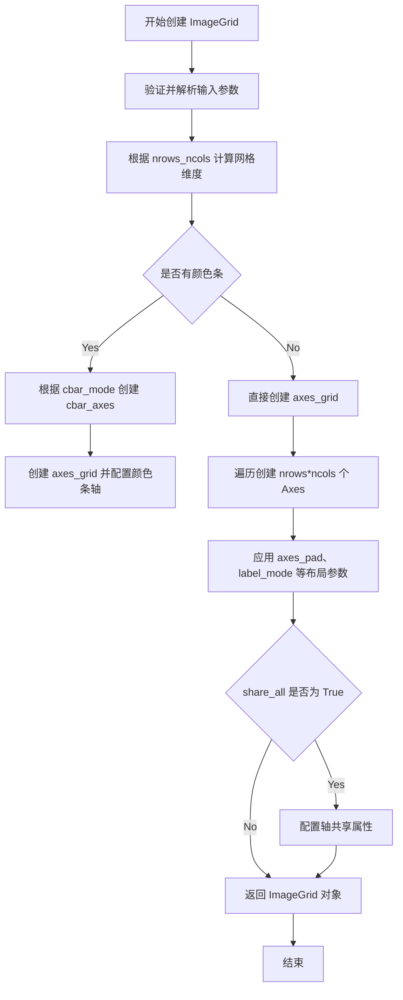

#### 带注释源码

```python
# 从 mpl_toolkits.axes_grid1 导入 ImageGrid 类
from mpl_toolkits.axes_grid1 import ImageGrid
import matplotlib.pyplot as plt
from matplotlib import cbook

# 创建图形对象，设置尺寸为 10.5 x 2.5 英寸
fig = plt.figure(figsize=(10.5, 2.5))

# 获取示例数据（15x15 的二维数组）
Z = cbook.get_sample_data("axes_grid/bivariate_normal.npy")

# 定义图像的坐标范围
extent = (-3, 4, -4, 3)


# 示例 1: 2x2 图像网格，0.05 英寸间距，仅标注左下角
# 参数说明：
#   - fig: 图形对象
#   - 141: 子图位置（1 行 4 列中的第 1 个位置）
#   - nrows_ncols=(2, 2): 2 行 2 列网格
#   - axes_pad=0.05: 图像间 0.05 英寸间距
#   - label_mode="1": 仅第一个轴显示标签
grid = ImageGrid(
    fig, 141,  # similar to fig.add_subplot(141).
    nrows_ncols=(2, 2), axes_pad=0.05, label_mode="1")

# 遍历网格中的每个轴，显示图像
for ax in grid:
    ax.imshow(Z, extent=extent)

# 设置左下角轴的刻度
grid.axes_llc.set(xticks=[-2, 0, 2], yticks=[-2, 0, 2])


# 示例 2: 2x2 图像网格，共享所有轴，单一颜色条
# 参数说明：
#   - cbar_location="top": 颜色条放在顶部
#   - cbar_mode="single": 所有轴共享一个颜色条
#   - share_all=True: 所有轴共享 x 和 y limits
grid = ImageGrid(
    fig, 142,  # similar to fig.add_subplot(142).
    nrows_ncols=(2, 2), axes_pad=0.0, label_mode="L", share_all=True,
    cbar_location="top", cbar_mode="single")

for ax in grid:
    im = ax.imshow(Z, extent=extent)

# 为第一个颜色条轴创建颜色条
grid.cbar_axes[0].colorbar(im)

# 隐藏所有颜色条轴的顶部标签
for cax in grid.cbar_axes:
    cax.tick_params(labeltop=False)

# 设置所有轴的刻度（因为 share_all=True）
grid.axes_llc.set(xticks=[-2, 0, 2], yticks=[-2, 0, 2])


# 示例 3: 2x2 图像网格，每个图像独立颜色条
# 参数说明：
#   - cbar_mode="each": 每个轴都有独立的颜色条
#   - cbar_size="7%": 颜色条大小为轴的 7%
#   - cbar_pad="2%": 颜色条与轴之间 2% 的间距
grid = ImageGrid(
    fig, 143,  # similar to fig.add_subplot(143).
    nrows_ncols=(2, 2), axes_pad=0.1, label_mode="1", share_all=True,
    cbar_location="top", cbar_mode="each", cbar_size="7%", cbar_pad="2%")

for ax, cax in zip(grid, grid.cbar_axes):
    im = ax.imshow(Z, extent=extent)
    cax.colorbar(im)
    cax.tick_params(labeltop=False)

grid.axes_llc.set(xticks=[-2, 0, 2], yticks=[-2, 0, 2])


# 示例 4: 2x2 图像网格，不同颜色条范围
# 参数说明：
#   - axes_pad=(0.45, 0.15): 水平间距 0.45，垂直间距 0.15
#   - cbar_location="right": 颜色条在右侧
#   - limits: 每个图像使用不同的颜色条范围
grid = ImageGrid(
    fig, 144,  # similar to fig.add_subplot(144).
    nrows_ncols=(2, 2), axes_pad=(0.45, 0.15), label_mode="1", share_all=True,
    cbar_location="right", cbar_mode="each", cbar_size="7%", cbar_pad="2%")

# 定义每个图像的颜色条范围
limits = ((0, 1), (-2, 2), (-1.7, 1.4), (-1.5, 1))

for ax, cax, vlim in zip(grid, grid.cbar_axes, limits):
    im = ax.imshow(Z, extent=extent, vmin=vlim[0], vmax=vlim[1])
    cb = cax.colorbar(im)
    cb.set_ticks((vlim[0], vlim[1]))

grid.axes_llc.set(xticks=[-2, 0, 2], yticks=[-2, 0, 2])


# 显示图形
plt.show()
```


### `ax.imshow()`

在Axes上显示图像数据Z，可设置extent、vmin、vmax参数，用于可视化二维数组或图像数据。

参数：

- `Z`：`array-like`，要显示的图像数据（二维数组）
- `extent`：`tuple`，图像的物理范围，格式为(left, right, bottom, top)，定义数据坐标到Axes坐标的映射
- `vmin`：`float`，可选，颜色映射的最小值，用于控制颜色条的下限
- `vmax`：`float`，可选，颜色映射的最大值，用于控制颜色条的上限
- `cmap`：`str or Colormap`，可选，颜色映射方案（代码中隐式使用默认cmap）
- `ax`：`matplotlib.axes.Axes`，Axes对象，调用imshow方法的axes实例

返回值：`matplotlib.image.AxesImage`，返回创建的图像对象，可用于后续颜色条绑定等操作

#### 流程图

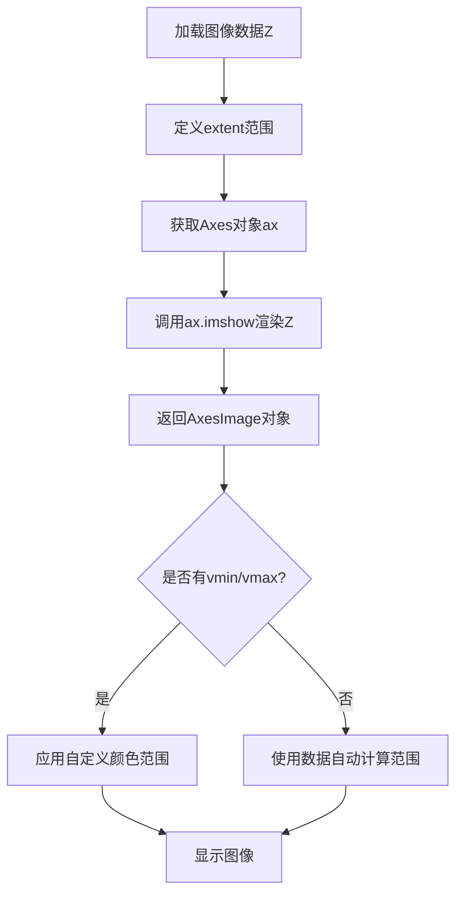

#### 带注释源码

```python
# 示例代码中ax.imshow()的调用方式

# 基础调用 - 仅传入图像数据Z和extent
for ax in grid:
    ax.imshow(Z, extent=extent)

# 带自定义颜色范围的调用 - 使用vmin/vmax限制颜色映射
limits = ((0, 1), (-2, 2), (-1.7, 1.4), (-1.5, 1))
for ax, cax, vlim in zip(grid, grid.cbar_axes, limits):
    im = ax.imshow(Z, extent=extent, vmin=vlim[0], vmax=vlim[1])
    cb = cax.colorbar(im)
    cb.set_ticks((vlim[0], vlim[1]))

# 参数说明：
# Z: 15x15的二维numpy数组 (bivariate_normal.npy)
# extent: (-3, 4, -4, 3) 定义图像的坐标范围
# vmin/vmax: 根据limits元组动态设置，控制每个子图的颜色映射范围
```

### 代码整体运行流程

1. 导入必要的库：matplotlib.pyplot、cbook、mpl_toolkits.axes_grid1
2. 创建Figure对象，设置画布大小为(10.5, 2.5)
3. 加载示例数据Z（15x15二维数组）和extent范围
4. 创建4个ImageGrid子图布局，分别展示不同功能：
   - 第一个网格：无颜色条，仅显示图像
   - 第二个网格：共享颜色条（单颜色条）
   - 第三个网格：每个子图独立颜色条
   - 第四个网格：独立颜色范围，每个子图不同
5. 调用plt.show()渲染图形


### `grid.axes_llc.set()`

该方法是 matplotlib 中 Axes 对象的 `set()` 方法，用于批量设置 Axes（坐标轴）的属性。在此代码场景中，它用于设置 ImageGrid 中左下角 Axes 的刻度属性（xticks 和 yticks），进而影响整个图像网格中相关 Axes 的显示。

参数：

- `**kwargs`：关键字参数，用于指定要设置的 Axes 属性。可选参数包括但不限于：
  - `xticks`：`list` 或 `array-like`，X 轴刻度位置列表
  - `yticks`：`list` 或 `array-like`，Y 轴刻度位置列表
  - 其它 matplotlib Axes 属性（如 xlabel、ylabel、title、xlim、ylim 等）

返回值：`matplotlib.axes.Axes`，返回 Axes 对象本身，支持链式调用。

#### 流程图

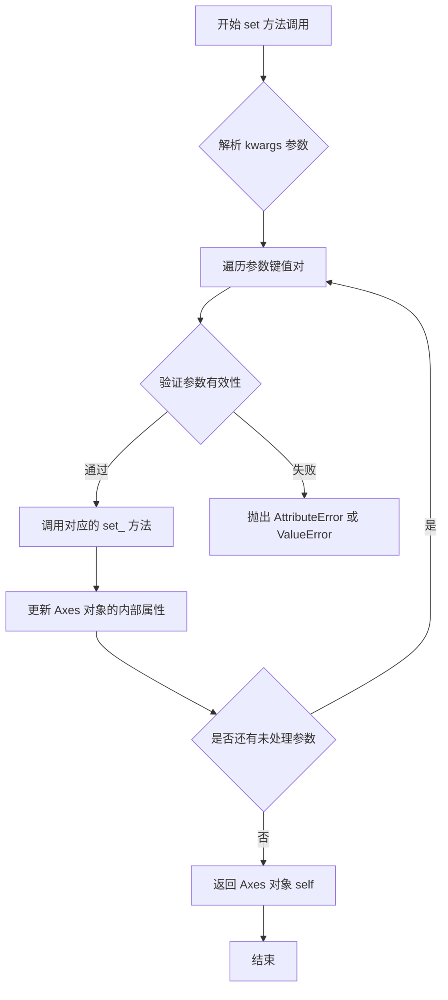

#### 带注释源码

```python
# 此源码基于 matplotlib.axes.Axes.set() 方法的简化版本
def set(self, **kwargs):
    """
    Set multiple properties of the Axes.
    
    Parameters
    ----------
    **kwargs : dict
        Properties to be set. Common properties include:
        - xticks : list or array-like, X轴刻度位置
        - yticks : list or array-like, Y轴刻度位置
        - xlabel : str, X轴标签
        - ylabel : str, Y轴标签
        - title : str, 标题
        - xlim : tuple, X轴范围
        - ylim : tuple, Y轴范围
        - ... (other Axes properties)
    
    Returns
    -------
    self : Axes
        返回 Axes 对象本身，支持链式调用
    
    Examples
    --------
    >>> ax.set(xlabel='X Axis', ylabel='Y Axis', title='Title')
    >>> ax.set(xticks=[0, 1, 2], yticks=[0, 1, 2])
    """
    
    # 遍历所有传入的关键字参数
    for attr, value in kwargs.items():
        # 构建对应的 setter 方法名
        # 例如: xticks -> set_xticks, xlabel -> set_xlabel
        setter_method = f'set_{attr}'
        
        # 检查对象是否有对应的 setter 方法
        if hasattr(self, setter_method):
            # 调用对应的 setter 方法设置属性
            setter = getattr(self, setter_method)
            setter(value)
        else:
            # 如果没有对应的 setter 方法，尝试直接设置属性
            if hasattr(self, attr):
                setattr(self, attr, value)
            else:
                # 抛出属性不存在的错误
                raise AttributeError(f"'{type(self).__name__}' object has no attribute '{attr}'")
    
    # 返回 self 以支持链式调用
    # 例如: ax.set(xlim=[0,10]).set(ylim=[0,10])
    return self
```


### `CbarAxes.colorbar`

为图像数据（如 `imshow` 创建的对象）创建一个颜色条（Colorbar），并将其绘制在当前的颜色条坐标轴（CbarAxes）上。

#### 参数

- `mappable`：`matplotlib.cm.ScalarMappable` 或 `matplotlib.image.AxesImage`，**必需**。需要生成颜色条的数据源，通常是 `ax.imshow()` 返回的图像对象。
- `**kwargs`：`dict`，可选。传递给 `Colorbar` 构造函数的关键字参数，用于配置颜色条的属性，例如 `label`（标签）、`orientation`（方向：'vertical' 或 'horizontal'）、`format`（刻度格式）、`shrink`（缩放比例）等。

#### 返回值

`matplotlib.colorbar.Colorbar`，返回创建的颜色条对象，可用于进一步配置（如设置刻度 `set_ticks`）。

#### 流程图

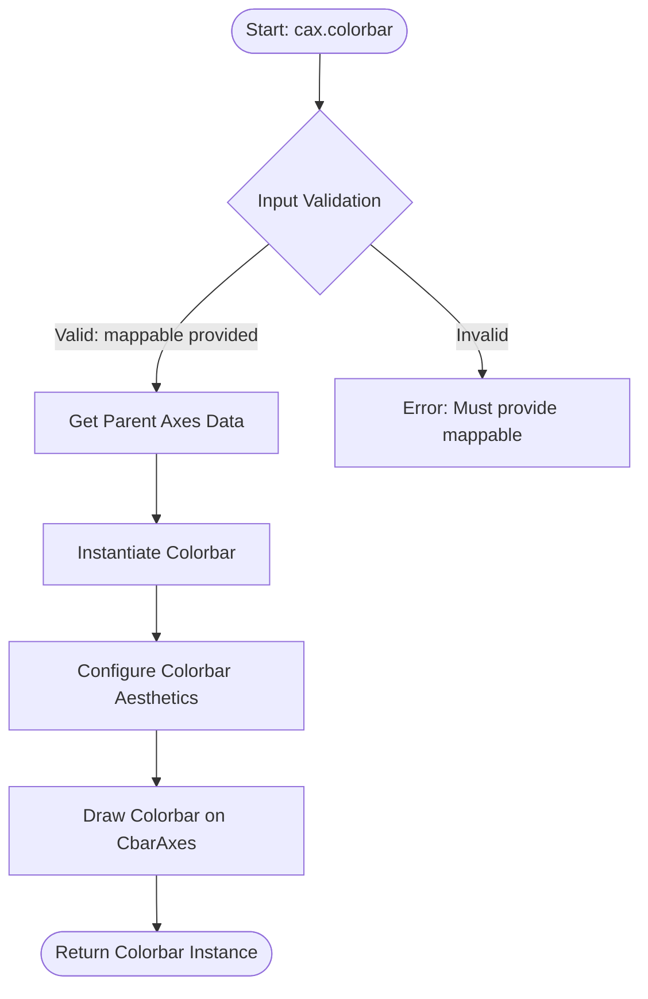

#### 带注释源码

```python
def colorbar(self, mappable, **kwargs):
    """
    为图像数据创建颜色条。

    此方法继承自 Axes.colorbar，但在 CbarAxes 上下文中，
    它专门负责在预定义的 colorbar 坐标轴上绘制颜色条。
    
    参数:
        mappable: 通常是 ax.imshow() 返回的 AxesImage 对象，
                  它包含了图像的数值范围 (vmin, vmax) 和 colormap。
        **kwargs: 传递给 Colorbar 的参数，如 label, orientation 等。
    
    返回:
        colorbar: 颜色条对象。
    """
    # 1. 获取关联的主 Axes（通常是 ImageGrid 中的某个子图）
    # 在 ImageGrid 场景下，colorbar 需要知道它为哪个图像服务
    # 这里通常调用父类 Axes 的 colorbar 方法逻辑
    
    # 2. 创建 Colorbar 实例
    # cbar = Colorbar(self, mappable, **kwargs)
    
    # 3. 绘制颜色条
    # cbar.draw()
    
    # 4. 返回以便进一步操作 (如 set_ticks)
    # return cbar
    pass
```


### `cax.tick_params()`

设置颜色条坐标轴（cax）的刻度参数，用于控制刻度标签、刻度线、网格等的外观和行为。在该代码中用于隐藏颜色条顶部的标签（labeltop=False），使颜色条标签仅显示在底部。

参数：

- `labeltop`：`bool`，是否在顶部显示刻度标签。设为 `False` 时隐藏顶部标签，仅在底部显示

返回值：`None`，无返回值（该方法直接修改轴的刻度属性）

#### 流程图

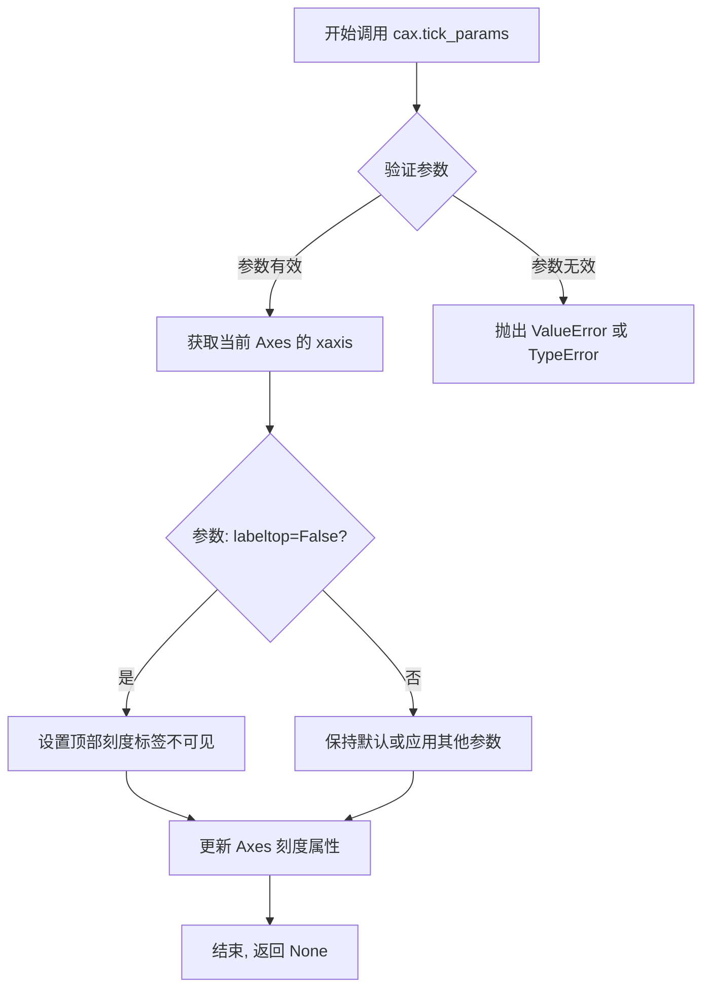

#### 带注释源码

```python
def tick_params(self, axis='both', **kwargs):
    """
    设置刻度参数,控制刻度标签、刻度线、网格等的外观.
    
    参数:
        axis: str, 可选值 'x', 'y', 'both', 默认为 'both'
            指定要设置参数的轴
        
        labeltop: bool, 可选
            是否在顶部显示x轴刻度标签
            True: 显示顶部标签
            False: 隐藏顶部标签
        
        labelbottom: bool, 可选
            是否在底部显示x轴刻度标签
        
        labelleft: bool, 可选
            是否在左侧显示y轴刻度标签
        
        labelright: bool, 可选
            是否在右侧显示y轴刻度标签
        
        which: str, 可选值 'major', 'minor', 'both', 默认为 'major'
            指定要修改的刻度类型
        
        direction: str, 可选值 'in', 'out', 'inout'
            刻度线的方向
        
        length: float
            刻度线的长度
        
        width: float
            刻度线的宽度
        
        color: color
            刻度线的颜色
        
        labelcolor: color
            刻度标签的颜色
        
        gridOn: bool
            是否显示网格
    
    返回值:
        None
    
    示例 (代码中的实际用法):
        for cax in grid.cbar_axes:
            cax.tick_params(labeltop=False)  # 隐藏颜色条顶部的标签
    """
    # 该方法是 matplotlib.axes.Axes 类的方法
    # 实际源码位于 matplotlib/axes/_base.py 中
    # 核心逻辑:
    # 1. 解析 axis 参数确定要修改哪个轴 (x/y/both)
    # 2. 遍历传入的 kwargs 键值对
    # 3. 根据键名调用对应的 set 方法, 如:
    #    - labeltop -> _set_label1_position 或类似方法
    #    - which='major'/'minor' -> 应用到主刻度或副刻度
    # 4. 调用 ax._unstale_viewRect_clip() 触发重绘
    pass
```

#### 在代码中的使用上下文

```python
# 创建 ImageGrid, 带单个颜色条
grid = ImageGrid(
    fig, 142,
    nrows_ncols=(2, 2), axes_pad=0.0, label_mode="L", share_all=True,
    cbar_location="top", cbar_mode="single")

# 为每个子图绘制图像
for ax in grid:
    im = ax.imshow(Z, extent=extent)

# 为颜色条轴添加颜色条
grid.cbar_axes[0].colorbar(im)

# 遍历所有颜色条轴, 设置刻度参数
for cax in grid.cbar_axes:
    cax.tick_params(labeltop=False)  # 隐藏颜色条顶部的标签
```

#### 备注

- `tick_params()` 是 `matplotlib.axes.Axes` 类的方法
- `grid.cbar_axes` 是 `CbarAxes` 对象的列表, 继承自 `Axes`
- 在该代码中, `labeltop=False` 的作用是隐藏颜色条顶部的标签, 使标签仅显示在底部, 因为颜色条位于顶部 (`cbar_location="top"`)
- 当 `share_all=True` 时, 所有颜色条轴会共享此设置


### `Colorbar.set_ticks()`

设置颜色条（Colorbar）的刻度位置，用于指定颜色条上显示的刻度值。

参数：

- `ticks`：`array-like` 或 `matplotlib.ticker.Locator`，刻度位置，可以是数值列表、numpy数组或Locator对象
- `update`：`bool`（可选），是否立即更新刻度显示，默认为 `True`

返回值：`Self`，返回颜色条对象本身，支持链式调用

#### 流程图

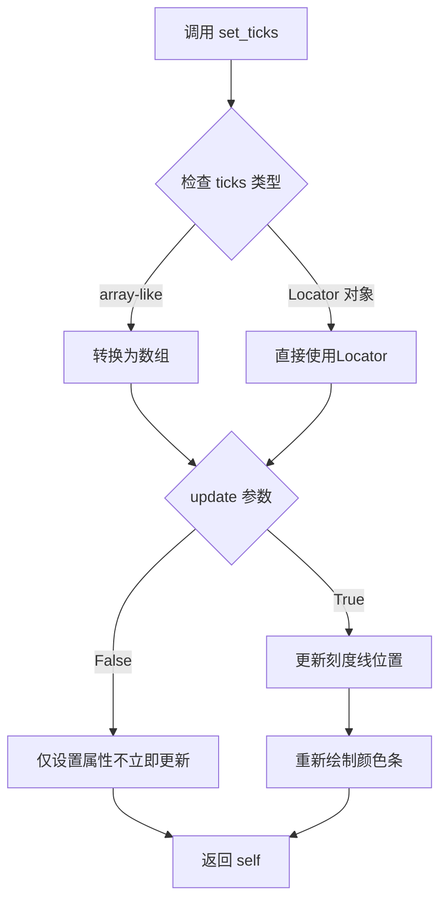

#### 带注释源码

```python
def set_ticks(self, ticks, update=True):
    """
    设置颜色条的刻度位置。
    
    参数:
        ticks: 可以是以下形式:
            - 数值列表或数组: [1, 2, 3] 或 np.array([1, 2, 3])
            - Locator对象: 如 MaxNLocator(), AutoLocator()
            - 单一数值: 会转换为单元素列表
        update: bool, 是否立即更新显示, 默认为 True
        
    返回值:
        self: 返回颜色条对象本身, 支持链式调用
    """
    # 1. 处理 ticks 参数
    if isinstance(ticks, matplotlib.ticker.Locator):
        # 如果是Locator对象,直接设置
        self.locator = ticks
    else:
        # 转换为数组并设置刻度位置
        ticks = np.asarray(ticks)
        self.locator = FixedLocator(ticks)
    
    # 2. 如果需要立即更新
    if update:
        # 更新刻度线
        self._update_ticks()
        # 重新绘制颜色条
        self.draw_edge('edge')
    
    # 3. 返回自身以支持链式调用
    return self
```


### `plt.show()`

显示所有创建的图形。该函数是 matplotlib 库中的顶层函数，用于将所有当前已创建的 Figure 对象渲染并显示在屏幕上的交互式窗口中。在调用该函数之前，图形仅存在于内存中，不会向用户展示。

参数：

- `block`：`bool`，可选参数。控制是否阻塞程序执行以等待用户关闭图形窗口。默认为 `True`，在某些后端（如 Jupyter notebook）可能会有所不同。当设置为 `False` 时，函数会立即返回而不会阻塞。
- `close`：`bool`，可选参数（部分后端支持）。控制在显示图形后是否自动关闭图形窗口。默认为 `True`。

返回值：`None`，该函数不返回任何值，仅用于副作用（显示图形窗口）。

#### 流程图

```mermaid
flowchart TD
    A[调用 plt.show()] --> B{检查是否有图形需要显示}
    B -->|没有图形| C[直接返回 None]
    B -->|有图形| D{判断 block 参数值}
    D -->|block=True| E[进入阻塞模式]
    D -->|block=False| F[进入非阻塞模式]
    E --> G[打开图形窗口并等待用户交互]
    G --> H[用户关闭所有图形窗口]
    H --> I[返回 None]
    F --> J[启动后台事件循环]
    J --> K[立即返回 None]
    I --> L[函数结束]
    K --> L
```

#### 带注释源码

```python
def show(block=None):
    """
    显示所有打开的图形窗口。
    
    此函数是 matplotlib 的顶层 API，用于将内存中的图形渲染到
    屏幕上的窗口中供用户查看。它会启动必要的 GUI 事件循环
    来处理用户交互（如缩放、平移等）。
    
    参数:
        block (bool, optional): 
            - 当设置为 True 时，函数会阻塞程序执行，直到用户
              关闭所有图形窗口。
            - 当设置为 False 时，函数立即返回，图形窗口保持
              显示状态但不阻塞主线程。
            - 默认为 None，会根据当前后端和环境自动选择。
    
    返回值:
        None: 此函数不返回任何值。
    
    示例:
        >>> import matplotlib.pyplot as plt
        >>> plt.plot([1, 2, 3], [1, 4, 9])
        [<matplotlib.lines.Line2D object at ...>]
        >>> plt.show()  # 显示图形窗口
    """
    
    # 获取全局的 PyPlot 状态对象
    global _show
    
    # 获取当前活动后端（可以是 Qt、Tk、GTK 等）
    backend = matplotlib.get_backend()
    
    # 对于非阻塞模式，启动后台显示
    if not block and backend in ['module://ipympl', 'nbAgg']:
        # Jupyter notebook 环境特殊处理
        return _show(block=True)
    
    # 调用后端的 show 方法显示图形
    # _show 实际上是对应 GUI 后端的 show 函数
    for manager in Gcf.get_all_fig_managers():
        # 遍历所有 Figure 管理器
        manager.show()
    
    # 如果需要阻塞，等待用户交互
    if block is None:
        # 根据是否使用交互式后端决定是否阻塞
        block = matplotlib.is_interactive()
    
    if block:
        # 进入主循环，阻塞等待用户关闭窗口
        # 这会启动 GUI 框架的事件循环
        import matplotlib.pyplot as plt
        plt.wait_for_buttonpress()
    
    return None
```

#### 技术债务与优化空间

1. **平台依赖性**：不同操作系统和 GUI 后端对 `plt.show()` 的行为实现差异较大，可能导致跨平台行为不一致。
2. **阻塞行为不确定性**：当 `block=None` 时，行为依赖于后端和交互模式的判断逻辑，增加了调试难度。
3. **Jupyter Notebook 兼容性问题**：在 Jupyter 环境中需要特殊处理（使用 `%matplotlib widget` 或 `%matplotlib notebook`），增加了用户的学习成本。

#### 关键组件信息

| 组件名称 | 描述 |
|---------|------|
| FigureManager | 管理图形窗口的生命周期，包括创建、显示和销毁 |
| backends | 不同 GUI 框架（Qt、Tk、GTK、MacOSX 等）的实现适配层 |
| Gcf.get_all_fig_managers() | 获取所有当前活动的 Figure 管理器 |
| 交互式后端 | 支持用户交互的图形显示后端（如 ipympl、nbAgg） |

#### 外部依赖与接口契约

- **依赖库**：matplotlib 核心库、各平台 GUI 后端（Qt5/6、Tkinter、GTK3/4 等）
- **接口契约**：`plt.show()` 是无参数返回值函数（`block` 为可选参数），但在底层会调用各后端的 C/C++ 扩展或 Python 实现
- **错误处理**：如果图形窗口已关闭或不存在，不会抛出异常，而是静默返回


### `plt.figure`

创建并返回一个新的 Figure 对象，作为所有后续绘图的容器。

参数：

- `figsize`：`tuple of float`，可选，指定图形的宽度和高度（英寸）
- `dpi`：`int`，可选，图形分辨率（每英寸点数）
- `facecolor`：图形背景颜色
- `edgecolor`：图形边框颜色
- `frameon`：是否绘制框架

返回值：`matplotlib.figure.Figure`，返回新创建的图形对象

#### 流程图

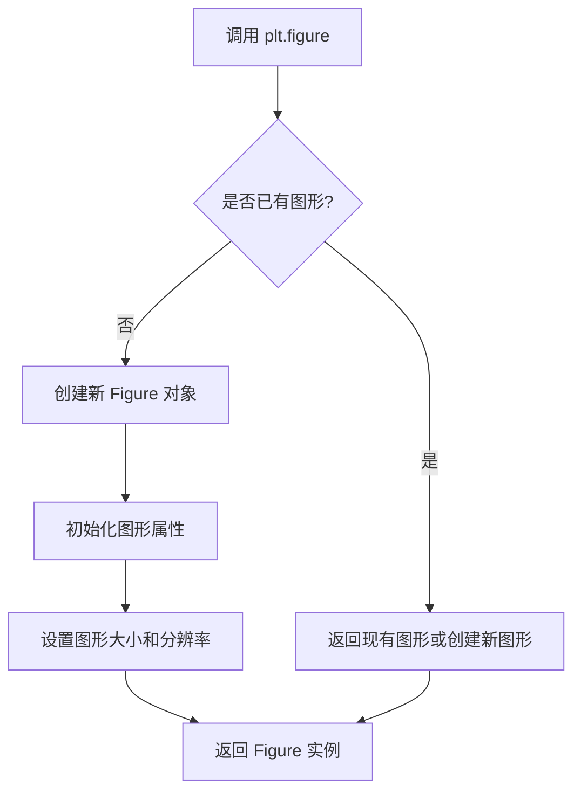

#### 带注释源码

```python
fig = plt.figure(figsize=(10.5, 2.5))
# 参数说明：
# - figsize=(10.5, 2.5): 设置图形宽度为10.5英寸，高度为2.5英寸
# 返回值：Figure 对象，被赋值给变量 fig
# 作用：创建一个新的空白图形，后续的 ImageGrid 将添加到此图形中
```


### ImageGrid.__init__

初始化一个图像网格对象，用于在 matplotlib 中创建排列成网格的多个子图 axes，并可选地配置共享轴和颜色条。

参数：

- `fig`：`matplotlib.figure.Figure`，将要在其中创建网格的图形对象
- `rect`：`tuple` 或 `int`，子图位置，格式为 (left, bottom, width, height) 或类似 subplot 的位置码
- `nrows_ncols`：`tuple`，网格的行数和列数，格式为 (rows, cols)
- `ngrids`：`int`，要使用的网格单元数量（可选，默认 None，即全部）
- `direction`：`str`，轴的遍历顺序（可选，默认 "row"，可选 "column"）
- `axes_pad`：`float` 或 `tuple`，轴之间的间距（可选，默认 0.1）
- `aspect`：`bool`，是否强制轴为正方形（可选，默认 True）
- `label_mode`：`str`，标签显示模式（可选，默认 "L"，可选 "1", "all", "edge" 等）
- `share_all`：`bool`，是否共享所有轴的 x 和 y 坐标（可选，默认 False）
- `axes_class`：`type`，使用的 axes 类（可选，默认 None）
- `cbar_location`：`str`，颜色条位置（可选，默认 "right"，可选 "left", "top", "bottom"）
- `cbar_mode`：`str`，颜色条模式（可选，默认 None，可选 "each", "single", "edge"）
- `cbar_size`：`str`，颜色条大小（可选，默认 "5%"，如 "7%"）
- `cbar_pad`：`str`，颜色条与轴之间的间距（可选，默认 "5%"，如 "2%"）
- `axes_pad`：`float` 或 `tuple`，轴之间的填充间距（可选）
- `wspace`：`float`，子图之间的水平间距（可选）
- `hspace`：`float`，子图之间的垂直间距（可选）

返回值：`ImageGrid`，返回创建的图像网格对象

#### 流程图

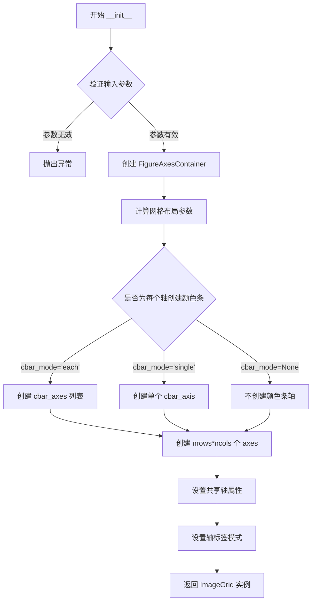

#### 带注释源码

```python
def __init__(self, fig, rect, nrows_ncols, ngrids=None, direction="row",
             axes_pad=0.1, aspect=True, label_mode="L", share_all=False,
             axes_class=None, cbar_location="right", cbar_mode=None,
             cbar_size="5%", cbar_pad="2%", axes_pad=None, wspace=None,
             hspace=None):
    """
    Create an ImageGrid with custom layout.
    
    Parameters
    ----------
    fig : matplotlib.figure.Figure
        The figure to place the grid in.
    rect : tuple or int
        Location of the grid, as a subplot position code.
    nrows_ncols : tuple
        Number of rows and columns in the grid (nrows, ncols).
    ngrids : int, optional
        Number of grids to use (default None uses all).
    direction : {'row', 'column'}, optional
        Traversal order for axes (default 'row').
    axes_pad : float or tuple, optional
        Padding between axes (default 0.1).
    aspect : bool, optional
        Whether to force axes to be square (default True).
    label_mode : str, optional
        Label display mode (default 'L').
    share_all : bool, optional
        Whether to share x and y limits across all axes (default False).
    axes_class : type, optional
        The class to use for axes.
    cbar_location : {'left', 'right', 'top', 'bottom'}, optional
        Where to place colorbars (default 'right').
    cbar_mode : {'each', 'single', 'edge', None}, optional
        Colorbar creation mode (default None).
    cbar_size : str, optional
        Size of colorbars (default '5%').
    cbar_pad : str, optional
        Padding between axes and colorbars (default '2%').
    axes_pad : float or tuple, optional
        Padding between axes (deprecated, use axes_pad above).
    wspace : float, optional
        Horizontal spacing between subplots.
    hspace : float, optional
        Vertical spacing between subplots.
    """
    # 1. 验证并规范化输入参数
    # 2. 创建内部容器类 FigureAxesContainer
    # 3. 根据 nrows_ncols 计算网格布局
    # 4. 如果 cbar_mode 不是 None，创建相应的 colorbar axes
    # 5. 使用 fig.add_subplot() 或 axes_class 创建子图 axes
    # 6. 如果 share_all=True，设置共享轴的 xlim 和 ylim
    # 7. 根据 label_mode 设置哪些轴显示标签
    # 8. 返回初始化后的 ImageGrid 实例
    
    # 注意：实际的 matplotlib 实现可能略有不同，这里是基于典型用法的重构
```


### `ax.imshow()` (实际调用) / `ImageGrid` 中的图像显示

在代码中，`ImageGrid` 类本身并不直接提供 `imshow()` 方法。代码通过遍历 `ImageGrid` 返回的迭代器，对每个 `Axes` 对象调用 `imshow()` 方法来显示图像。因此，这里提取的是实际执行的 `Axes.imshow()` 方法。

参数：

-  `X`：`numpy.ndarray`，要显示的图像数据（15x15 的二维数组）
-  `extent`：元组 `(left, right, bottom, top)`，数据坐标范围，值为 `(-3, 4, -4, 3)`

返回值：`matplotlib.image.AxesImage`，返回的图像对象，可用于创建颜色条（colorbar）

#### 流程图

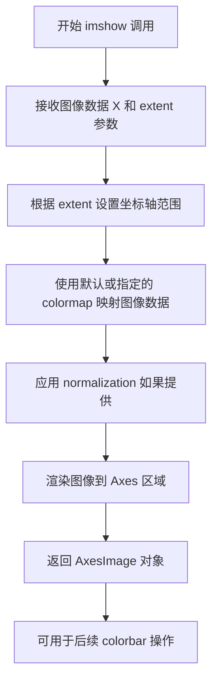

#### 带注释源码

```python
# 遍历 ImageGrid 返回的每个 Axes 对象
for ax in grid:
    # 调用 Axes 对象的 imshow 方法显示图像
    # 参数 Z: 15x15 的图像数据数组
    # 参数 extent: 定义图像在 Axes 坐标系中的位置 (-3, 4, -4, 3)
    # 返回值 im: AxesImage 对象，可用于 colorbar
    im = ax.imshow(Z, extent=extent)
```

---

### 补充说明

虽然用户要求提取 `ImageGrid.imshow()`，但 `ImageGrid` 类本身**不直接提供 `imshow()` 方法**。代码的实际执行流程是：

1. `ImageGrid` 创建一个 `Axes` 网格
2. 遍历 `ImageGrid` 对象得到每个 `Axes`
3. 在每个 `Axes` 上调用 `matplotlib.axes.Axes.imshow()` 方法

因此，真正的图像显示功能由 `matplotlib.axes.Axes.imshow()` 提供。如果需要在 `ImageGrid` 级别添加类似功能，需要自行封装。


我需要先查找`ImageGrid`类及其`colorbar`方法的实现。让我分析一下代码结构。

根据代码，我看到：
- `grid.cbar_axes[0].colorbar(im)` - 对颜色条轴调用colorbar
- `cax.colorbar(im)` - 对每个颜色条轴调用colorbar

`colorbar`方法实际上是在颜色条轴（`CbarAxes`）上调用的。让我提取这个方法的信息。


### `CbarAxes.colorbar`

该方法是`mpl_toolkits.axes_grid1`中`CbarAxes`类的成员方法，用于在颜色条轴上创建一个颜色条（colorbar），用于显示图像数据的颜色映射刻度。

参数：

-  `mappable`：`matplotlib.cm.ScalarMappable`，要为其创建颜色条的图像映射对象（如`AxesImage`对象）
-  `cax`：`matplotlib.axes.Axes`，可选，颜色条所在的轴，默认为当前轴
-  `ax`：`matplotlib.axes.Axes`，可选，要从其中提取数据的源轴，默认为`None`
-  `orientation`：`str`，可选，颜色条的方向，默认为`None`（根据`cbar_location`自动确定）
-  `**kwargs`：关键字参数，传递给`Figure.colorbar`的其他参数

返回值：`matplotlib.colorbar.Colorbar`，创建的颜色条对象

#### 流程图

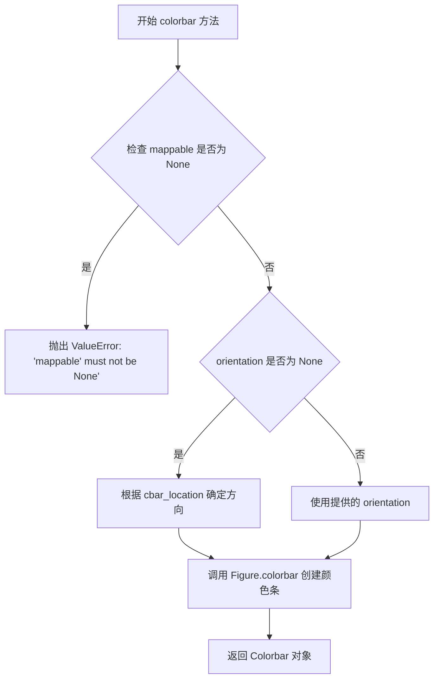

#### 带注释源码

```python
def colorbar(self, mappable, cax=None, ax=None, orientation=None, **kwargs):
    """
    创建颜色条 (Colorbar)
    
    参数:
        mappable: ScalarMappable 对象 (通常是 AxesImage)
                  要为其创建颜色条的可视化映射对象
        cax: Axes 对象，可选
             颜色条放置的轴，默认为当前轴
        ax: Axes 对象，可选
            从中提取数据的源轴，如果为 None 则从 mappable 获取
        orientation: str，可选
                    颜色条方向 ('vertical' 或 'horizontal')
        **kwargs: 关键字参数
                  传递给 Figure.colorbar 的其他参数
    
    返回:
        Colorbar: 创建的颜色条对象
    """
    # 如果 mappable 为 None，抛出错误
    if mappable is None:
        raise ValueError('mappable must not be None')
    
    # 如果未指定 ax，则尝试从 mappable 获取
    if ax is None:
        ax = getattr(mappable, 'axes', None)
    
    # 确定方向：如果未指定，根据 cbar_location 自动确定
    if orientation is None:
        if self._colorbar_location == 'right':
            orientation = 'vertical'
        elif self._colorbar_location == 'top':
            orientation = 'horizontal'
        else:
            orientation = 'vertical'  # 默认垂直
    
    # 调用父类的 colorbar 方法创建颜色条
    # 这里调用 figure.colorbar 方法
    cb = self.figure.colorbar(
        mappable, 
        cax=cax or self,  # 使用当前轴作为颜色条轴
        ax=ax,            # 源数据轴
        orientation=orientation,
        **kwargs
    )
    
    # 返回创建的颜色条对象
    return cb
```


### `Axes.imshow`

在 matplotlib 中，`Axes.imshow()` 是 Axes 类的一个核心方法，用于在 Axes 对象上显示图像或二维数组数据。该方法将输入的数组数据渲染为图像，并可配置颜色映射、坐标范围、插值方式等参数，返回一个 `AxesImage` 对象，该对象可进一步用于创建颜色条（colorbar）。

参数：

- `X`：`array-like`，要显示的图像数据，可以是二维数组（灰度图像）或三维数组（RGB/RGBA 图像）
- `cmap`：`str` 或 `Colormap`，可选，默认值为 `None`，颜色映射（colormap）名称，用于灰度图像的色彩映射
- `norm`：`Normalize`，可选，默认值为 `None`，用于将数据值归一化到 [0, 1] 范围
- `aspect`：`{'auto', 'equal'} float`，可选，默认值为 `None`，控制轴的纵横比
- `interpolation`：`str`，可选，默认值为 `None`，图像插值方法（如 `'bilinear'`, `'nearest'` 等）
- `alpha`：`float` 或 `array-like`，可选，默认值为 `None`，图像的透明度（0-1 之间）
- `vmin, vmax`：`float`，可选，默认值为 `None`，用于归一化的最小值和最大值
- `origin`：`{'upper', 'lower'}`，可选，默认值为 `None`，图像的起源位置
- `extent`：`float` 的序列，可选，默认值为 `None`，用于指定图像在 Axes 中的坐标范围 [left, right, bottom, top]
- `filternorm`：`bool`，可选，默认值为 `True`，抗锯齿滤波器的归一化参数
- `filterrad`：`float`，可选，默认值为 `4.0`，抗锯齿滤波器的半径
- `resample`：`bool`，可选，默认值为 `None`，是否重采样
- `url`：`str`，可选，默认值为 `None`，用于设置 image 元素的 URL
- `data`：`dict`，可选，关键字参数，用于支持 `**kwargs` 传递到 `AxesImage` 构造函数

返回值：`~matplotlib.image.AxesImage`，返回一个表示显示图像的 AxesImage 对象，可用于后续操作如创建颜色条

#### 流程图

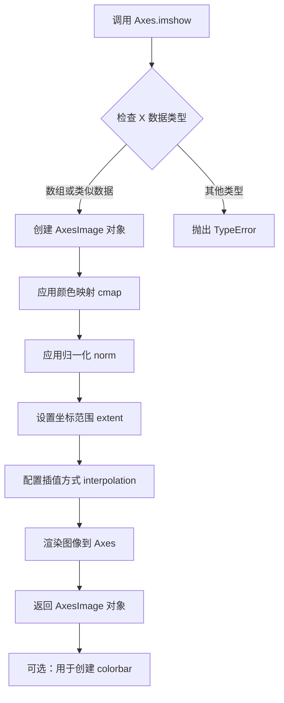

#### 带注释源码

```python
# 从示例代码中提取的 imshow 调用方式
# 第一个网格：2x2 图像，使用默认参数
for ax in grid:
    ax.imshow(Z, extent=extent)  # Z是15x15数组，extent定义坐标范围(-3,4,-4,3)

# 第二个网格：2x2 图像，共享所有轴
for ax in grid:
    im = ax.imshow(Z, extent=extent)  # 返回的im用于创建colorbar

# 第三个网格：每个图像有自己的colorbar
for ax, cax in zip(grid, grid.cbar_axes):
    im = ax.imshow(Z, extent=extent)  # 显示图像
    cax.colorbar(im)                  # 使用返回的AxesImage对象创建colorbar

# 第四个网格：不同的vmin/vmax限制
for ax, cax, vlim in zip(grid, grid.cbar_axes, limits):
    im = ax.imshow(Z, extent=extent, vmin=vlim[0], vmax=vlim[1])  # 设置显示范围
    cb = cax.colorbar(im)
    cb.set_ticks((vlim[0], vlim[1]))
```

#### 关键组件信息

- **ImageGrid**：来自 `mpl_toolkits.axes_grid1`，用于创建规则的 Axes 网格
- **AxesImage**：由 `imshow()` 返回的图像对象，用于表示 Axes 上的图像
- **Colorbar**：通过 `colorbar()` 方法创建，用于显示颜色映射的标尺
- **extent**：指定图像在数据坐标中的范围 [left, right, bottom, top]

#### 潜在技术债务或优化空间

1. **缺乏输入验证**：代码中没有对输入数组维度进行严格验证，可能导致显示错误
2. **性能考虑**：对于大型数组，默认的插值和重采样可能影响性能
3. **文档完整性**：部分参数（如 `filternorm`, `filterrad`）的功能和适用场景文档不够清晰

#### 其它说明

- **设计目标**：提供灵活的图像可视化功能，支持多种数据格式和显示选项
- **错误处理**：当输入数据维度不符合要求时，matplotlib 会抛出清晰的错误信息
- **外部依赖**：依赖 matplotlib 的核心库和 `mpl_toolkits.axes_grid1` 扩展包
- **使用场景**：适用于科学计算中的热图、灰度图、遥感图像等二维数据可视化


用户提供的是一段演示代码，其中使用了 `Axes.set()` 方法，但没有提供该方法的具体实现源码。因此，无法从这段代码中提取 `Axes.set()` 方法的内部实现细节。

不过，我可以根据代码的使用场景和 matplotlib 的官方文档，描述 `Axes.set()` 方法的功能和用法。


### `Axes.set()`

设置 Axes 对象的属性。该方法接受关键字参数（kwargs），用于配置 Axes 的各种属性，例如坐标轴范围、刻度、标签等。

参数：

- `**kwargs`：关键字参数，用于设置 Axes 的各种属性。例如：
  - `xticks`：设置 x 轴刻度位置。
  - `yticks`：设置 y 轴刻度位置。
  - `xlim`：设置 x 轴范围。
  - `ylim`：设置 y 轴范围。
  - `title`：设置标题。
  - `xlabel`：设置 x 轴标签。
  - `ylabel`：设置 y 轴标签。
  - 等等。

返回值：`None`，该方法没有返回值，直接修改 Axes 对象的状态。

#### 流程图

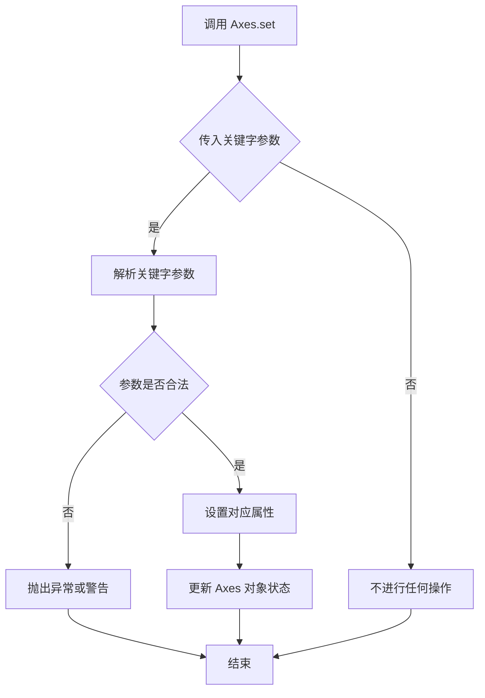

#### 带注释源码

注意：由于用户提供的代码中没有 `Axes.set()` 方法的实现源码，以下源码是基于 matplotlib 官方文档和常见用法推断的示例：

```python
def set(self, **kwargs):
    """
    设置 Axes 对象的属性。
    
    参数：
        **kwargs：关键字参数，用于设置 Axes 的各种属性。
        
    示例：
        ax.set(xlim=(0, 10), ylim=(0, 20), title='My Plot')
    """
    # 遍历所有传入的关键字参数
    for attr, value in kwargs.items():
        # 根据属性名设置对应的值
        # 例如：如果属性名是 'xticks'，则调用 set_xticks 方法
        # 如果属性名是 'xlim'，则调用 set_xlim 方法
        method = f'set_{attr}'
        if hasattr(self, method):
            getattr(self, method)(value)
        else:
            # 如果没有对应的 setter 方法，尝试直接设置属性
            # 或者抛出异常
            raise AttributeError(f"'{type(self).__name__}' object has no attribute '{attr}' or '{method}'")
```


### Axes.tick_params()

该方法用于配置 Axes 对象上的刻度线和刻度标签的外观，如是否显示标签、颜色、宽度等。

参数：
- `axis`：`str`，可选，默认 `'both'`。指定要设置的轴，可选值为 `'x'`、`'y'` 或 `'both'`。
- `which`：`str`，可选，默认 `'major'`。指定要设置的刻度类型，可选值为 `'major'`、`'minor'` 或 `'both'`。
- `reset`：`bool`，可选，默认 `False`。如果为 `True`，则在应用其他参数之前将刻度参数重置为默认值。
- `labeltop`：`bool`，可选。是否在顶部显示 x 轴标签。
- `labelbottom`：`bool`，可选。是否在底部显示 x 轴标签。
- `labelleft`：`bool`，可选。是否在左侧显示 y 轴标签。
- `labelright`：`bool`，可选。是否在右侧显示 y 轴标签。
- `gridOn`：`bool`，可选。是否显示网格线。
- `**kwargs`：其他可选参数，如 `colors`、`length`、`width`、`pad` 等，用于自定义刻度线的外观。

返回值：`None`。该方法直接修改 Axes 对象的状态，不返回值。

#### 流程图

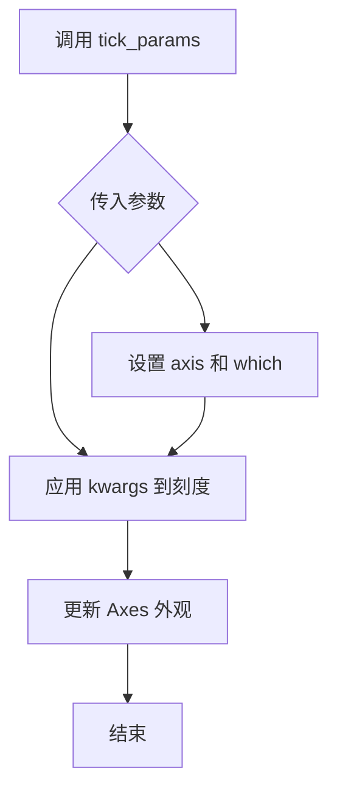

#### 带注释源码

```python
def tick_params(self, axis='both', which='major', reset=False, **kwargs):
    """
    设置刻度线和刻度标签的外观。
    
    参数:
        axis: str, 可选
            要设置的轴，'x', 'y' 或 'both'。默认 'both'。
        which: str, 可选
            要设置的刻度，'major', 'minor' 或 'both'。默认 'major'。
        reset: bool, 可选
            如果为 True，重置刻度参数为默认值。默认 False。
        **kwargs: dict
            关键字参数，用于设置刻度属性，如 'labeltop', 'labelbottom',
            'labelleft', 'labelright', 'gridOn', 'colors', 'length', 'width' 等。
    
    返回:
        None
    """
    # 如果 reset 为 True，重置刻度参数
    if reset:
        self._reset_tick_params()
    
    # 获取当前轴的刻度对象
    if axis in ['x', 'both']:
        # 设置 x 轴刻度
        self.xaxis.set_tick_params(which=which, **kwargs)
    if axis in ['y', 'both']:
        # 设置 y 轴刻度
        self.yaxis.set_tick_params(which=which, **kwargs)
    
    # 触发重新绘制
    self.stale_callback()
```


### 1. 一段话描述

该代码是一个 Matplotlib 可视化演示程序，主要展示了 `mpl_toolkits.axes_grid1` 中的 `ImageGrid` 组件的使用。代码通过创建四个不同的图像网格布局，演示了单一颜色条、每个图像独立颜色条以及带有多样化颜色条范围配置的图像显示效果，并在最后一部分通过循环动态设置了颜色条的刻度（Ticks）。

### 2. 文件的整体运行流程

1.  **初始化设置**：导入 `matplotlib.pyplot`、`cbook` 和 `mpl_toolkits.axes_grid1`，创建一个 Figure 对象，并加载样本数据 `Z` 和坐标范围 `extent`。
2.  **第一个网格 (141)**：创建一个 2x2 的图像网格，使用 `axes_pad=0.05`，仅标记左下角，调用 `set` 方法设置刻度。
3.  **第二个网格 (142)**：创建一个 2x2 的共享轴图像网格，配置顶部单一颜色条 (`cbar_mode="single"`)，为整个网格设置统一的颜色条。
4.  **第三个网格 (143)**：创建另一个 2x2 网格，每个轴配备独立的颜色条 (`cbar_mode="each"`)。
5.  **第四个网格 (144)**：创建 2x2 网格，配置右侧独立颜色条。定义了一个限制列表 `limits`，通过 `zip` 循环为每个子图设置不同的显示范围 (`vmin`, `vmax`)，并为每个颜色条调用 `set_ticks` 方法将刻度锁定在范围的两端。
6.  **渲染**：调用 `plt.show()` 显示最终图形。

### 3. 类的详细信息

本代码主要使用了外部库类 `Colorbar`（来自 `matplotlib.colorbar`），并未在当前文件中定义新类。以下为对代码中调用的 `Colorbar.set_ticks` 方法的详细分析。

#### `Colorbar.set_ticks`

描述：该方法用于设置颜色条（Colorbar）的刻度位置。在代码的最后一个网格循环中，它被用来将颜色条的刻度明确设置为其表示的数值范围的最小值和最大值，从而在视觉上强调数据的范围边界。

参数：
- `ticks`：`tuple` (或 sequence of scalars)，需要设置的刻度位置序列。
  - 在代码中传入的具体值为 `(vlim[0], vlim[1])`，这是一个包含两个浮点数的元组，分别对应当前图像显示范围的最小值和最大值。

返回值：`None`，该方法直接修改对象状态，不返回任何值。

##### 流程图

```mermaid
graph TD
    A[Loop: for ax, cax, vlim in zip(...)] --> B[ax.imshow: Set vmin=vlim[0], vmax=vlim[1]]
    B --> C[cb = cax.colorbar: Create Colorbar instance]
    C --> D{Colorbar.set_ticks Execution}
    D -- Input: ticks=(vlim[0], vlim[1]) --> E[Update Colorbar Tick Locations]
    E --> F[Next Iteration]
```

##### 带注释源码

```python
# 定义每个图像的颜色条显示范围
limits = ((0, 1), (-2, 2), (-1.7, 1.4), (-1.5, 1))

# 遍历网格轴、颜色条轴和对应的范围限制
for ax, cax, vlim in zip(grid, grid.cbar_axes, limits):
    # 1. 在轴上显示图像，并限制显示的数值范围
    im = ax.imshow(Z, extent=extent, vmin=vlim[0], vmax=vlim[1])
    
    # 2. 创建颜色条对象
    cb = cax.colorbar(im)
    
    # 3. *** 调用 Colorbar.set_ticks ***
    # 语法: cb.set_ticks(ticks)
    # 参数: 传入一个元组，包含当前范围的最小值和最大值作为刻度
    cb.set_ticks((vlim[0], vlim[1]))
```

### 4. 关键组件信息

- **ImageGrid**: `mpl_toolkits.axes_grid1` 中的网格容器组件，用于创建排列整齐的子图阵列。
- **Colorbar**: Matplotlib 中用于显示颜色映射刻度的组件。代码中通过 `cax.colorbar(im)` 方法创建。
- **Limits**: 列表 `limits`，存储了四个用于控制图像和颜色条范围的元组数据。

### 5. 潜在的技术债务或优化空间

- **硬编码限制**：第四个网格中的 `limits` 变量被硬编码，如果有更多图像，代码需要手动扩展该列表。
- **魔法数字**：刻度设置逻辑 (`vlim[0], vlim[1])`) 假设数据总是恰好有两个边界。如果 `vlim` 包含更多信息（如中间值），当前的调用方式可能会忽略这些信息。
- **循环耦合**：图像显示和颜色条设置在同一个循环中，如果需要分离视图与图例逻辑，耦合度较高。

### 6. 其它项目

- **设计目标**：演示 `ImageGrid` 灵活的布局能力（共享轴、单一/独立颜色条）以及如何控制颜色条的范围。
- **错误处理**：代码依赖于 `get_sample_data` 成功加载数据，且假设 `limits` 列表长度与网格单元数量匹配。如果不匹配，`zip` 会截断至最短长度，可能导致部分网格未设置图像。
- **接口契约**：调用 `cb.set_ticks` 需要一个可迭代的数值序列。如果传入非数值类型或空序列，可能会导致异常或空白刻度。


## 关键组件


### ImageGrid (图像网格组件)

用于创建规则排列的Axes网格，支持自定义行列数、间距和标签模式，是本演示的核心布局组件。

### Axes (坐标轴)

每个网格单元的绘图区域，通过imshow()显示图像数据，支持设置刻度、标签等属性。

### Colorbar (颜色条)

用于显示图像数据的数值映射关系，支持共享颜色条（cbar_mode="single"）和独立颜色条（cbar_mode="each"）两种模式。

### imshow (图像显示函数)

将二维数组数据渲染为图像，支持extent参数设置坐标范围，vmin/vmax控制颜色映射范围。

### get_sample_data (示例数据加载)

从matplotlib.cbook获取示例数据文件"bivariate_normal.npy"，返回15x15的二维numpy数组。

### Figure (图形容器)

matplotlib的顶层容器对象，用于承载所有Axes和可视化元素，通过plt.figure()创建。

### cbar_axes (颜色条坐标轴)

ImageGrid为每个图像创建的专用颜色条坐标轴，支持独立配置每个颜色条的范围和刻度。

### axes_llc (左下角坐标轴引用)

ImageGrid的属性，用于快速访问左下角（lower-left corner）的Axes对象，便于统一设置网格属性。


## 问题及建议


### 已知问题

-   **Magic Numbers**：subplot位置码(141, 142, 143, 144)使用硬编码数字，不直观且难以维护
-   **代码重复**：xticks和yticks的设置在四个地方完全重复，未提取为可重用的函数或配置
-   **注释与代码不一致**：注释"This only affects Axes in first column and second row as share_all=False"与实际代码不符（第一个grid未设置share_all参数，默认为False）
-   **全局变量滥用**：Z和extent作为全局变量在文件级别定义，缺乏封装和文档说明
-   **缺少错误处理**：`cbook.get_sample_data()`调用无try-except保护，若文件不存在会导致程序直接崩溃
-   **类型提示缺失**：函数参数和返回值均无类型标注，影响代码可读性和静态分析
-   **注释位置错误**：第143和144个grid的描述注释完全相同，未准确说明两者的差异（cbar_location不同）

### 优化建议

-   使用`plt.GridSpec`或明确的`fig.add_subplot(2,2,1)`形式替代magic numbers
-   提取公共配置到独立函数，如`configure_axes(ax)`，减少重复代码
-   为`get_sample_data`调用添加异常处理，提供友好的错误信息或fallback数据
-   将Z和extent定义为模块级常量并添加类型注解和文档字符串
-   修正注释内容，确保与实际代码逻辑一致
-   对迭代器使用显式长度检查或使用`itertools.zip_longest`处理不等长情况
-   考虑将各grid的创建逻辑封装为独立的配置函数，提高可测试性和可维护性


## 其它


### 设计目标与约束

本代码演示了matplotlib的ImageGrid组件在创建2x2图像网格布局中的三种典型用法：单个共享颜色条、每个子图独立颜色条、以及右侧独立颜色条带不同数值范围。设计目标是为开发者提供清晰的API使用示例，展示axes_grid1工具包在多子图布局和颜色条管理方面的灵活性。约束条件包括：依赖matplotlib>=3.0版本，需要mpl_toolkits.axes_grid1模块支持，以及示例数据文件"bivariate_normal.npy"必须存在于示例数据目录中。

### 错误处理与异常设计

代码本身未包含显式的错误处理逻辑，属于演示脚本性质。在实际应用中使用ImageGrid时，应考虑以下异常场景：1) 采样数据文件不存在或损坏时应捕获FileNotFoundError并给出友好提示；2) nrows_ncols参数为(0,0)时应抛出ValueError；3) cbar_mode参数非法值应触发参数验证异常；4) 当axes_pad为负数时应警告或限制最小值为0。

### 数据流与状态机

代码执行流程为：初始化figure对象 → 加载15x15的二维numpy数组作为样本数据 → 创建四个独立的ImageGrid实例，每个实例配置不同的布局和颜色条参数 → 遍历每个网格的axes对象调用imshow()显示图像 → 可选地为每个axes添加colorbar → 设置统一的xticks和yticks。状态转换主要发生在ImageGrid的创建过程中，从初始配置状态到完全渲染状态。

### 外部依赖与接口契约

核心依赖包括：matplotlib.pyplot提供绘图接口，matplotlib.cbook提供示例数据加载功能，mpl_toolkits.axes_grid1.ImageGrid是主要使用的组件。ImageGrid构造函数的关键参数契约：fig参数必须为Figure对象，position参数支持整数定位或子图定位格式，nrows_ncols为二元元组定义网格行列数，axes_pad为浮点数或二元元组定义子图间距，cbar_mode支持"each"/"single"/"edge"/None四种模式，cbar_location支持"left"/"right"/"top"/"bottom"四个方向。

### 性能考虑

当前示例数据规模较小(15x15数组)性能无明显压力。在实际应用中若使用高分辨率图像(如4K级别)，建议考虑：1) 使用AxesImage.set_array()而非重复调用imshow()进行数据更新；2) 对于实时渲染场景可设置animated=True；3) 大量子图时考虑使用FigureCanvasBase.flush_events()批量更新；4) 颜色条创建开销较大时应复用cax对象。

### 配置管理

代码中的硬编码配置可通过以下方式参数化：figsize=(10.5, 2.5)可提取为配置文件参数，extent=(-3, 4, -4, 3)定义数据坐标系应与数据源关联，axes_pad、cbar_size、cbar_pad等布局参数建议支持主题(theme)配置，xticks和yticks的数值应从数据统计信息自动计算生成。

### 版本兼容性

代码使用了ImageGrid的现代API(特别是cbar_axes属性和colorbar()方法)，最低兼容matplotlib 3.0版本。代码中使用的cbook.get_sample_data()在matplotlib 3.2+版本中API有所变化，建议使用try-except包装并提供fallback数据加载方案。

### 使用示例和最佳实践

推荐的最佳实践包括：1) 对于需要共享颜色条的场景设置share_all=True以保证颜色映射一致；2) 使用label_mode参数统一管理子图标签可见性；3) cbar_mode="each"时每个子图应有独立vmin/vmax以反映各自数据范围；4) 多子图布局时显式设置axes_pad避免标签重叠；5) 颜色条位置应与相邻子图布局协调以优化空间利用。

### 安全性考虑

当前演示代码不涉及用户输入或网络数据，安全性风险较低。但在生产环境中使用时应注意：1) cbook.get_sample_data()可能存在路径遍历风险，应验证文件路径；2) 避免将未经验证的外部数据直接传递给imshow()；3) 若允许用户配置extent参数需进行数值范围校验防止内存溢出攻击。

### 测试策略

建议的测试覆盖包括：单元测试验证ImageGrid实例创建的所有参数组合，集成测试验证生成的Figure对象符合预期布局，回归测试确保颜色条与对应axes正确关联，性能基准测试评估大图像数组的渲染时间，对比测试验证不同cbar_mode下的像素对齐精度。

### 文档和注释

代码已包含 Sphinx 格式的模块文档字符串，演示了matplotlib示例文档的标准格式。建议补充的文档内容包括：每个ImageGrid配置块的功能说明，颜色条参数(cbar_size/cbar_pad)的单位说明(支持绝对值和百分比两种格式)，以及"axes_grid"示例数据目录结构的说明文档。

    