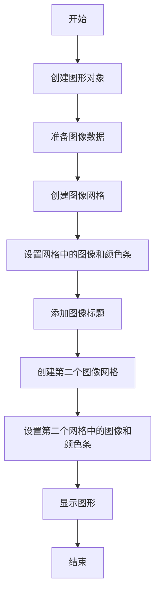
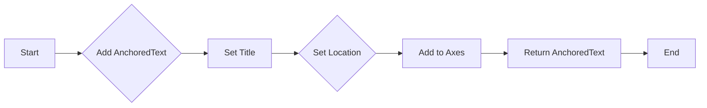
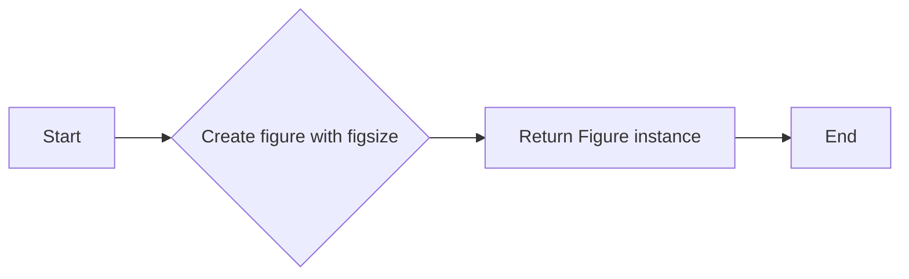
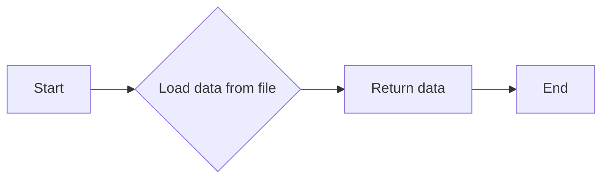
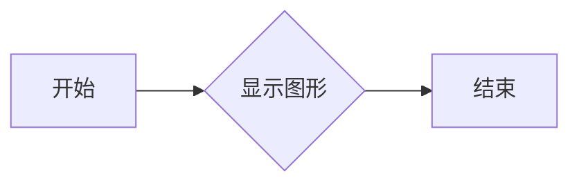
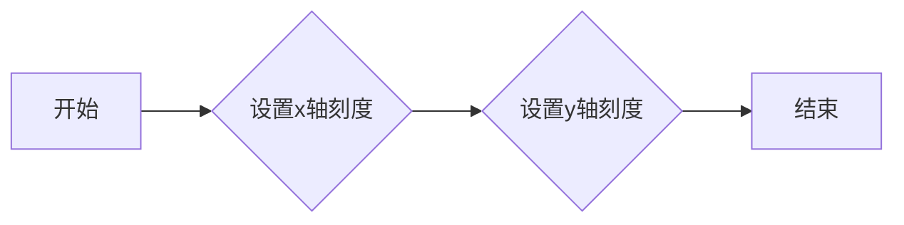
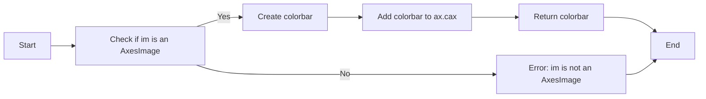

# `matplotlib\galleries\examples\axes_grid1\demo_axes_grid2.py` 详细设计文档

This code demonstrates the use of matplotlib's ImageGrid to create a grid of images with shared xaxis and yaxis, including colorbars for each image and a shared colorbar for a subset of images.

## 整体流程



## 类结构

```
matplotlib.pyplot (matplotlib模块)
├── fig (图形对象)
│   ├── ImageGrid (图像网格类)
│   ├── ax (子图对象)
│   └── cax (颜色条轴对象)
└── np (numpy模块)
    └── Z (图像数据)
```

## 全局变量及字段


### `fig`
    
The main figure object where all subplots are added.

类型：`matplotlib.figure.Figure`
    


### `Z`
    
The 2D numpy array containing the data to be visualized.

类型：`numpy.ndarray`
    


### `extent`
    
The extent of the data in the form (xmin, xmax, ymin, ymax).

类型：`tuple`
    


### `ZS`
    
A list of numpy arrays, each representing a section of the original data Z.

类型：`list of numpy.ndarray`
    


### `clim`
    
The data limits for the colormap, in the form (min, max).

类型：`tuple`
    


### `grid`
    
The ImageGrid object for the first demo, containing subplots for the images.

类型：`mpl_toolkits.axes_grid1.imagegrid.ImageGrid`
    


### `grid2`
    
The ImageGrid object for the second demo, containing subplots for the images with a shared colorbar.

类型：`mpl_toolkits.axes_grid1.imagegrid.ImageGrid`
    


### `ax.cax`
    
The axes object containing the colorbar for the image in the first demo.

类型：`matplotlib.axes.Axes`
    


### `at`
    
The AnchoredText object used to add an inner title to the axes.

类型：`matplotlib.offsetbox.AnchoredText`
    


### `prop`
    
The properties dictionary for the text in the AnchoredText object.

类型：`dict`
    


### `at`
    
The AnchoredText object used to add an inner title to the axes.

类型：`matplotlib.offsetbox.AnchoredText`
    


### `matplotlib.figure.Figure.fig`
    
The main figure object where all subplots are added.

类型：`matplotlib.figure.Figure`
    


### `ImageGrid.nrows_ncols`
    
The number of rows and columns of subplots in the grid.

类型：`tuple`
    


### `ImageGrid.axes_pad`
    
The padding between subplots in the grid.

类型：`float`
    


### `ImageGrid.label_mode`
    
The label mode for the subplots in the grid.

类型：`str`
    


### `ImageGrid.share_all`
    
Whether all subplots in the grid share the same axes properties.

类型：`bool`
    


### `ImageGrid.cbar_location`
    
The location of the colorbar in the grid.

类型：`str`
    


### `ImageGrid.cbar_mode`
    
The mode of the colorbar in the grid.

类型：`str`
    


### `ImageGrid.cbar_size`
    
The size of the colorbar in the grid.

类型：`str`
    


### `ImageGrid.cbar_pad`
    
The padding around the colorbar in the grid.

类型：`float`
    


### `AnchoredText.title`
    
The title text for the AnchoredText object.

类型：`str`
    


### `AnchoredText.loc`
    
The location of the AnchoredText object relative to the axes.

类型：`str`
    


### `AnchoredText.prop`
    
The properties dictionary for the text in the AnchoredText object.

类型：`dict`
    


### `AnchoredText.pad`
    
The padding around the text in the AnchoredText object.

类型：`float`
    


### `AnchoredText.borderpad`
    
The padding around the border of the AnchoredText object.

类型：`float`
    


### `AnchoredText.frameon`
    
Whether to draw a frame around the AnchoredText object.

类型：`bool`
    


### `AnchoredText.kwargs`
    
Additional keyword arguments for the AnchoredText object.

类型：`dict`
    
    

## 全局函数及方法


### add_inner_title

This function adds an inner title to a given axes object using an AnchoredText object from matplotlib.

参数：

- `ax`：`matplotlib.axes.Axes`，The axes object to which the title will be added.
- `title`：`str`，The title text to be added.
- `loc`：`str`，The location of the title within the axes.
- `**kwargs`：`dict`，Additional keyword arguments to be passed to the AnchoredText constructor.

返回值：`matplotlib.offsetbox.AnchoredText`，The AnchoredText object representing the title.

#### 流程图



#### 带注释源码

```python
def add_inner_title(ax, title, loc, **kwargs):
    from matplotlib.offsetbox import AnchoredText
    from matplotlib.patheffects import withStroke
    prop = dict(path_effects=[withStroke(foreground='w', linewidth=3)],
                size=plt.rcParams['legend.fontsize'])
    at = AnchoredText(title, loc=loc, prop=prop,
                      pad=0., borderpad=0.5,
                      frameon=False, **kwargs)
    ax.add_artist(at)
    return at
```


### plt.figure

`plt.figure` is a function from the Matplotlib library that creates a new figure and returns a Figure instance. It is used to create a new plotting area.

参数：

- `figsize`：`tuple`，指定图形的大小，例如 `(6, 6)` 表示图形的宽度和高度分别为 6 英寸。

返回值：`matplotlib.figure.Figure`，返回创建的图形实例。

#### 流程图



#### 带注释源码

```python
fig = plt.figure(figsize=(6, 6))
```


### cbook.get_sample_data

获取样本数据，通常用于测试或演示。

参数：

- `filename`：`str`，样本数据的文件名，默认为"axes_grid/bivariate_normal.npy"，该文件包含一个二维正态分布的样本数据。

返回值：`numpy.ndarray`，样本数据的numpy数组。

#### 流程图



#### 带注释源码

```python
def get_sample_data(filename="axes_grid/bivariate_normal.npy"):
    """
    Load sample data from a file.

    Parameters
    ----------
    filename : str, optional
        The name of the file to load the data from. Default is
        'axes_grid/bivariate_normal.npy'.

    Returns
    -------
    data : numpy.ndarray
        The loaded sample data.
    """
    # Load data from file
    data = np.load(filename)
    return data
```


### plt.show()

显示当前图形。

参数：

- 无

返回值：无

#### 流程图



#### 带注释源码

```python
plt.show()
```


### ImageGrid.set

`ImageGrid.set` 方法用于设置图像网格的属性。

参数：

- `ax`：`Axes` 对象，图像网格中的轴对象。
- `xticks`：`list` 或 `np.ndarray`，x轴的刻度值。
- `yticks`：`list` 或 `np.ndarray`，y轴的刻度值。

返回值：无

#### 流程图



#### 带注释源码

```python
def set(self, ax, xticks=None, yticks=None):
    """
    Set the x and y ticks for the given axes in the image grid.

    Parameters:
    - ax: Axes object, the axis object in the image grid.
    - xticks: list or np.ndarray, the tick values for the x-axis.
    - yticks: list or np.ndarray, the tick values for the y-axis.

    Returns:
    - None
    """
    ax.set_xticks(xticks)
    ax.set_yticks(yticks)
```


### ImageGrid.imshow

The `imshow` method is used to display an image on an axes object in the Matplotlib library.

参数：

- `z`：`numpy.ndarray`，The image data to be displayed.
- `origin`：`str`，The origin of the image data. It can be either 'upper' or 'lower'.
- `extent`：`tuple`，The extent of the image data in the form (xmin, xmax, ymin, ymax).

返回值：`matplotlib.image.AxesImage`，The image object that has been added to the axes.

#### 流程图


#### 带注释源码

```python
for i, (ax, z) in enumerate(zip(grid, ZS)):
    im = ax.imshow(z, origin="lower", extent=extent)
    # ...
```


### ImageGrid.colorbar

This function adds a colorbar to the specified axes object in an ImageGrid layout.

参数：

- `im`：`matplotlib.image.AxesImage`，The image to which the colorbar is added.
- ...

返回值：`matplotlib.colorbar.Colorbar`，The colorbar object added to the axes.

#### 流程图



#### 带注释源码

```python
cb = ax.cax.colorbar(im)
# Changing the colorbar ticks
if i in [1, 2]:
    cb.set_ticks([-1, 0, 1])
```


### add_inner_title

This function adds an inner title to a given axes object using an AnchoredText object from matplotlib.

参数：

- `ax`：`matplotlib.axes.Axes`，The axes object to which the title will be added.
- `title`：`str`，The title text to be added.
- `loc`：`str`，The location of the title within the axes.
- `**kwargs`：`dict`，Additional keyword arguments to be passed to the AnchoredText constructor.

返回值：`matplotlib.offsetbox.AnchoredText`，The AnchoredText object representing the title.

#### 流程图


#### 带注释源码

```python
def add_inner_title(ax, title, loc, **kwargs):
    from matplotlib.offsetbox import AnchoredText
    from matplotlib.patheffects import withStroke
    prop = dict(path_effects=[withStroke(foreground='w', linewidth=3)],
                size=plt.rcParams['legend.fontsize'])
    at = AnchoredText(title, loc=loc, prop=prop,
                      pad=0., borderpad=0.5,
                      frameon=False, **kwargs)
    ax.add_artist(at)
    return at
```


### AnchoredText.__init__

初始化AnchoredText对象，用于在matplotlib轴上添加文本注释。

参数：

- `title`：`str`，要显示的标题文本。
- `loc`：`str`，文本注释的位置。
- `prop`：`dict`，文本属性的字典，例如字体大小、颜色等。
- `pad`：`float`，文本与轴边缘的距离。
- `borderpad`：`float`，边框与文本的距离。
- `frameon`：`bool`，是否显示边框。
- `kwargs`：`dict`，传递给matplotlib的额外关键字参数。

返回值：`None`

#### 流程图


#### 带注释源码

```python
from matplotlib.offsetbox import AnchoredText

def add_inner_title(ax, title, loc, **kwargs):
    from matplotlib.offsetbox import AnchoredText
    from matplotlib.patheffects import withStroke
    prop = dict(path_effects=[withStroke(foreground='w', linewidth=3)],
                size=plt.rcParams['legend.fontsize'])
    at = AnchoredText(title, loc=loc, prop=prop,
                      pad=0., borderpad=0.5,
                      frameon=False, **kwargs)
    ax.add_artist(at)
    return at
```


## 关键组件


### 张量索引与惰性加载

张量索引与惰性加载允许在图像网格中按需加载和显示图像数据，而不是一次性加载所有数据，从而提高内存效率和性能。

### 反量化支持

反量化支持确保图像数据在显示时能够正确地反量化，以保持图像的准确性和可读性。

### 量化策略

量化策略定义了图像数据在显示前的量化方法，以确保图像数据在有限的显示精度内保持最佳的可视效果。


## 问题及建议


### 已知问题

-   **代码重复性**：在两个不同的图像网格示例中，`add_inner_title` 函数被重复调用，并且每个图像的标题都是硬编码的。这可能导致维护困难，如果需要更改标题格式或位置。
-   **全局变量**：`fig` 变量被声明为全局变量，这可能会在代码的其他部分中引起意外的副作用，尤其是在大型项目中。
-   **硬编码值**：图像网格的配置（如 `nrows_ncols`, `axes_pad`, `cbar_location`, `cbar_mode`, `cbar_size`, `cbar_pad`）是硬编码的，这限制了代码的灵活性和可重用性。

### 优化建议

-   **减少代码重复性**：将标题添加逻辑封装到一个单独的函数中，并传递图像标题作为参数，这样可以在不同的图像网格中重用该函数。
-   **避免全局变量**：将 `fig` 变量移到函数内部，或者使用类来封装图像创建逻辑，以避免全局变量的使用。
-   **使用配置对象**：创建一个配置对象来存储图像网格的配置，这样可以在不同的示例中重用这些配置，并允许更灵活的定制。
-   **异常处理**：添加异常处理来捕获可能发生的错误，例如在图像加载或绘图过程中。
-   **代码注释**：增加代码注释来解释复杂的逻辑或配置选项，以提高代码的可读性和可维护性。
-   **单元测试**：编写单元测试来验证图像网格的配置和功能，确保代码的稳定性和可靠性。


## 其它


### 设计目标与约束

- 设计目标：实现一个图像网格，共享x轴和y轴，并支持不同布局和颜色条显示。
- 约束条件：使用matplotlib库进行图像绘制，确保兼容性和易用性。

### 错误处理与异常设计

- 错误处理：在图像加载和绘制过程中，捕获可能出现的异常，如文件读取错误、图像格式不正确等。
- 异常设计：提供清晰的错误信息，便于用户定位和解决问题。

### 数据流与状态机

- 数据流：从文件加载图像数据，通过matplotlib进行图像绘制，并显示在图形界面中。
- 状态机：程序运行过程中，根据用户操作和系统状态进行相应的图像布局和颜色条显示。

### 外部依赖与接口契约

- 外部依赖：matplotlib库，用于图像绘制和显示。
- 接口契约：遵循matplotlib库的API规范，确保代码的兼容性和可维护性。

### 安全性与隐私保护

- 安全性：确保代码在运行过程中不会对系统造成损害。
- 隐私保护：不涉及用户隐私数据，不收集或传输敏感信息。

### 性能优化

- 性能优化：优化图像加载和绘制过程，提高程序运行效率。
- 内存管理：合理使用内存资源，避免内存泄漏。

### 可维护性与可扩展性

- 可维护性：代码结构清晰，易于理解和修改。
- 可扩展性：支持添加新的图像布局和颜色条显示功能。

### 用户界面与交互设计

- 用户界面：使用matplotlib库提供的图形界面，直观展示图像网格和颜色条。
- 交互设计：提供简单的操作方式，方便用户进行图像布局和颜色条调整。

### 测试与验证

- 测试：编写单元测试，确保代码功能的正确性和稳定性。
- 验证：通过实际运行和用户反馈，验证程序的性能和用户体验。

### 文档与帮助

- 文档：提供详细的设计文档和用户手册，帮助用户了解和使用程序。
- 帮助：在程序中添加帮助信息，方便用户获取帮助和支持。

### 代码规范与风格

- 代码规范：遵循Python代码规范，确保代码的可读性和可维护性。
- 代码风格：使用PEP 8编码风格，提高代码的可读性。

### 项目管理

- 项目管理：使用版本控制系统，如Git，管理代码版本和变更。
- 代码审查：定期进行代码审查，确保代码质量。

### 部署与发布

- 部署：将程序打包成可执行文件，方便用户安装和使用。
- 发布：将程序发布到官方网站或应用商店，方便用户获取。

### 售后服务与支持

- 售后服务：提供技术支持和故障排除服务。
- 用户反馈：收集用户反馈，不断改进和优化程序。


    