# `matplotlib\galleries\examples\axes_grid1\demo_axes_hbox_divider.py` 详细设计文档

该代码演示了matplotlib中mpl_toolkits.axes_grid1模块的HBoxDivider和VBoxDivider工具，用于创建具有相等高度或相等宽度的子图布局，同时保持子图各自的长宽比。

## 整体流程

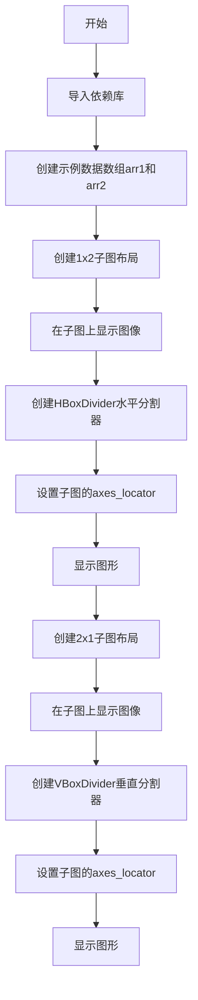

## 类结构

```
matplotlib.pyplot (plt)
├── Figure对象 (fig)
└── Axes对象 (ax1, ax2)

mpl_toolkits.axes_grid1.axes_divider
├── HBoxDivider (水平分割器)
└── VBoxDivider (垂直分割器)

mpl_toolkits.axes_grid1.axes_size (Size工厂)
├── AxesX
├── AxesY
├── Fixed
└── Scaled
```

## 全局变量及字段


### `arr1`
    
4x5数组，用于显示

类型：`numpy.ndarray`
    


### `arr2`
    
5x4数组，用于显示

类型：`numpy.ndarray`
    


### `fig`
    
图形对象

类型：`matplotlib.figure.Figure`
    


### `ax1`
    
第一个子图 axes 对象

类型：`matplotlib.axes.Axes`
    


### `ax2`
    
第二个子图 axes 对象

类型：`matplotlib.axes.Axes`
    


### `pad`
    
子图之间的间距（英寸）

类型：`float`
    


### `divider`
    
分割器对象

类型：`HBoxDivider/VBoxDivider`
    


    

## 全局函数及方法


### `plt.subplots()`

`plt.subplots()` 是 Matplotlib 库中的一个函数，用于创建一个新的图形（Figure）和一个或多个子图（Axes），并返回图形对象和子图对象数组。该函数简化了创建子图布局的过程，支持创建网格布局的子图，并可配置共享坐标轴、子图间距等属性。

参数：

- `nrows`：`int`，可选，默认为1，表示子图的行数
- `ncols`：`int`，可选，默认为1，表示子图的列数
- `sharex`：`bool` 或 `str`，可选，默认为False，若为True则所有子图共享x轴；若为'row'则每行子图共享x轴；若为'col'则每列子图共享x轴
- `sharey`：`bool` 或 `str`，可选，默认为False，若为True则所有子图共享y轴；若为'row'则每行子图共享y轴；若为'col'则每列子图共享y轴
- `squeeze`：`bool`，可选，默认为True，若为True则返回的axs数组维度会压缩：当只有1行或1列时返回一维数组，否则返回二维数组
- `width_ratios`：`array-like`，可选，指定各列的宽度比例，长度等于ncols
- `height_ratios`：`array-like`，可选，指定各行的高度比例，长度等于nrows
- `subplot_kw`：`dict`，可选，创建子图时传递给`add_subplot`或`fig.add_axes`的关键字参数字典
- `gridspec_kw`：`dict`，可选，传递给GridSpec构造函数的关键字参数字典，用于控制网格布局
- `**fig_kw`：可选，关键字参数，这些参数将传递给`plt.figure()`函数，用于配置图形属性如 figsize、dpi 等

返回值：`tuple(Figure, Axes or ndarray)`，返回一个元组，包含两个元素：第一个是`Figure`对象（图形窗口），第二个是`Axes`对象（子图）或`Axes`对象数组。当nrows=1且ncols=1时返回单个Axes对象；当squeeze=False或nrows>1或ncols>1时返回ndarray数组

#### 流程图

```mermaid
flowchart TD
    A[调用 plt.subplots] --> B{检查 nrows 和 ncols}
    B -->|默认值或单一子图| C[创建 Figure 对象]
    B -->|多子图布局| D[创建 GridSpec 布局]
    D --> C
    C --> E[根据 gridspec_kw 配置网格]
    E --> F[创建子图 Axes 对象]
    F --> G{sharex 参数设置}
    G -->|True| H[共享所有子图 x 轴]
    G -->|'row'| I[每行共享 x 轴]
    G -->|False| J[不共享 x 轴]
    J --> K{sharey 参数设置}
    K -->|True| L[共享所有子图 y 轴]
    K -->|'col'| M[每列共享 y 轴]
    K -->|False| N[不共享 y 轴]
    N --> O{squeeze 参数设置}
    O -->|True| P[压缩返回的 Axes 数组维度]
    O -->|False| Q[返回完整二维数组]
    P --> R[返回 (fig, ax) 或 (fig, ax_array)]
    Q --> R
    H --> R
    I --> R
    L --> R
    M --> R
```

#### 带注释源码

```python
def subplots(nrows=1, ncols=1, sharex=False, sharey=False,
             squeeze=True, width_ratios=None, height_ratios=None,
             subplot_kw=None, gridspec_kw=None, **fig_kw):
    """
    创建子图布局的函数
    
    参数:
        nrows: int, 子图行数，默认1
        ncols: int, 子图列数，默认1
        sharex: bool or str, 共享x轴设置
        sharey: bool or str, 共享y轴设置
        squeeze: bool, 是否压缩返回数组维度
        width_ratios: array-like, 列宽度比例
        height_ratios: array-like, 行高度比例
        subplot_kw: dict, 创建子图的关键字参数
        gridspec_kw: dict, GridSpec配置参数
        **fig_kw: 传递给figure的关键字参数
    
    返回:
        fig: Figure对象
        ax: Axes对象或Axes数组
    """
    
    # 1. 创建 Figure 对象
    fig = figure(**fig_kw)
    
    # 2. 创建 GridSpec 对象用于布局管理
    if gridspec_kw is None:
        gridspec_kw = {}
    
    # 3. 设置宽高比例
    if width_ratios is not None:
        gridspec_kw['width_ratios'] = width_ratios
    if height_ratios is not None:
        gridspec_kw['height_ratios'] = height_ratios
    
    # 4. 创建 GridSpec
    gs = GridSpec(nrows, ncols, **gridspec_kw)
    
    # 5. 创建子图数组
    ax_array = np.empty((nrows, ncols), dtype=object)
    
    # 6. 遍历创建每个子图
    for i in range(nrows):
        for j in range(ncols):
            # 使用 subplot_kw 创建子图
            ax = fig.add_subplot(gs[i, j], **subplot_kw)
            ax_array[i, j] = ax
    
    # 7. 处理共享坐标轴
    if sharex:
        # 配置x轴共享逻辑
        pass
    
    if sharey:
        # 配置y轴共享逻辑
        pass
    
    # 8. 处理返回值
    if squeeze:
        # 压缩维度：1xN 返回一维数组，Nx1 返回一维数组
        if nrows == 1 or ncols == 1:
            ax_array = ax_array.ravel()
    
    return fig, ax_array
```

#### 在给定代码中的使用

在提供的示例代码中，`plt.subplots()` 的调用方式如下：

```python
fig, (ax1, ax2) = plt.subplots(1, 2)
```

- `nrows=1`：创建1行子图
- `ncols=2`：创建2列子图
- 返回值解包为 `fig`（图形对象）和 `(ax1, ax2)`（包含两个Axes对象的元组）


### `ax.imshow()`

在 matplotlib 的 Axes 对象上显示图像数组或数据，支持多种颜色映射、归一化方式和插值方法。

参数：

- `X`：`array-like`，要显示的图像或数据数组，可以是 2D (灰度)、3D (RGB/RGBA) 或带有掩码的数组
- `cmap`：`str` 或 `Colormap`，可选，颜色映射名称或 Colormap 对象，默认为 None
- `norm`：`Normalize`，可选，数据归一化实例，默认为 None
- `aspect`：`str` 或 `float`，可选，控制轴的纵横比，可为 'auto', 'equal', 或数值
- `interpolation`：`str`，可选，图像插值方法，如 'bilinear', 'nearest', 'bicubic' 等
- `alpha`：`float` 或 `array-like`，可选，透明度值，范围 0-1
- `vmin`：`float`，可选，数据归一化的最小值
- `vmax`：`float`，可选，数据归一化的最大值
- `origin`：`str`，可选，图像原点位置，可为 'upper' 或 'lower'
- `extent`：`floats (left, right, bottom, top)`，可选，数据坐标中图像的范围
- `interpolation_stage`：`str`，可选，插值阶段，可为 'data' 或 'rgba'

返回值：`matplotlib.image.AxesImage`，返回创建的 AxesImage 对象，可用于进一步配置或获取图像数据

#### 流程图

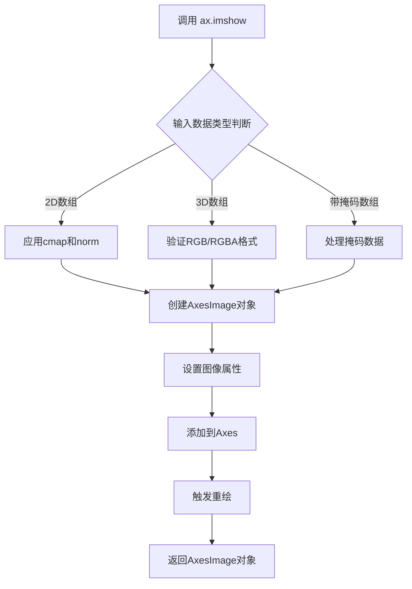

#### 带注释源码

```python
def imshow(self, X, cmap=None, norm=None, aspect=None, 
           interpolation=None, alpha=None, vmin=None, vmax=None,
           origin=None, extent=None, shape=None, filternorm=True,
           filterrad=4.0, resample=None, url=None, *,
           interpolation_stage=None, data=None, **kwargs):
    """
    在Axes上显示图像.
    
    参数:
        X: array-like - 输入图像数据, 支持2D灰度、3D RGB/RGBA或带掩码数组
        cmap: str或Colormap - 颜色映射方案
        norm: Normalize - 数据归一化实例
        aspect: str或float - 轴的纵横比控制
        interpolation: str - 图像插值方法
        alpha: float - 透明度/混合因子
        vmin/vmax: float - 归一化范围边界
        origin: str - 图像原点位置 'upper'/'lower'
        extent: tuple - 图像在数据坐标系中的位置 (left, right, bottom, top)
    
    返回:
        AxesImage - 图像对象, 可用于colorbar等后续操作
    """
    # 1. 处理输入数据格式
    if hasattr(X, 'mask'):
        # 处理掩码数组 (MaskedArray)
        X = np.ma.array(X)
    
    # 2. 创建或应用归一化
    if norm is not None:
        # 使用自定义归一化 (如 LogNorm, SymLogNorm)
        norm.autoscale_None(X)
    
    # 3. 确定颜色映射
    if cmap is None and X.ndim == 2:
        # 2D数据默认使用灰度映射
        cmap = 'grey'
    
    # 4. 创建AxesImage对象
    im = AxesImage(self, cmap, norm, interpolation=interpolation,
                   origin=origin, extent=extent, **kwargs)
    
    # 5. 设置图像数据
    im.set_data(X)
    
    # 6. 应用alpha透明度
    if alpha is not None:
        im.set_alpha(alpha)
    
    # 7. 添加到axes并设置自动缩放
    self.add_image(im)
    im.autoscale()
    
    # 8. 设置纵横比
    if aspect is not None:
        self.set_aspect(aspect)
    
    return im
```


### `HBoxDivider.__init__`

初始化水平分割器（Horizontal Box Divider），用于在matplotlib图形中 Arrangement 子图或其他元素，使其在水平方向上按照指定的大小比例和间距进行布局。

参数：

- `fig`：`matplotlib.figure.Figure`，要分割的图形对象
- `pos`：整数或元组，定位参数（通常为子图索引，如111表示整个图形区域）
- `horizontal`：列表，水平方向的大小规范列表，每个元素可以是 `Size.AxesX`、`Size.Fixed`、`Size.Scaled` 等类型
- `vertical`：列表，垂直方向的大小规范列表，每个元素可以是 `Size.AxesY`、`Size.Fixed`、`Size.Scaled` 等类型

返回值：无（`None`），构造函数不返回值

#### 流程图

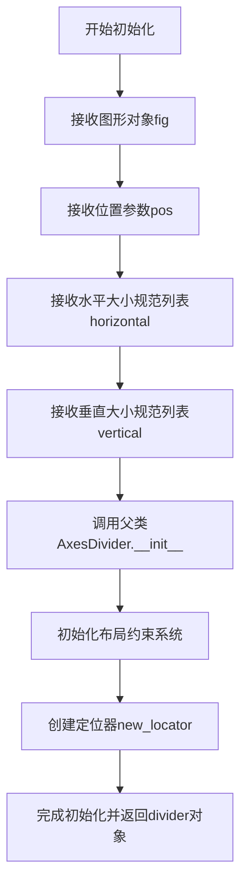

#### 带注释源码

```python
# 从提供的演示代码中提取的调用方式：
divider = HBoxDivider(
    fig,                    # matplotlib.figure.Figure 对象
    111,                    # 位置参数，表示整个图形区域
    horizontal=[            # 水平方向大小规范列表
        Size.AxesX(ax1),    # 第一个子图的宽度
        Size.Fixed(pad),    # 固定宽度的间距
        Size.AxesX(ax2)     # 第二个子图的宽度
    ],
    vertical=[              # 垂直方向大小规范列表
        Size.AxesY(ax1),    # 第一个子图的高度
        Size.Scaled(1),     # 可缩放的空间
        Size.AxesY(ax2)     # 第二个子图的高度
    ]
)

# HBoxDivider.__init__ 的伪代码实现（基于matplotlib库的实际结构）
def __init__(self, fig, pos, horizontal, vertical, aspect=None, **kwargs):
    """
    初始化水平分割器。
    
    参数:
        fig: matplotlib图形对象
        pos: 子图位置参数
        horizontal: 水平方向的大小规范列表
        vertical: 垂直方向的大小规范列表
        aspect: 可选的宽高比约束
        **kwargs: 其他传递给父类的参数
    """
    # 调用父类AxesDivider的初始化方法
    # 设置图形、位置和布局规范
    # 创建定位器用于子图的精确放置
    pass
```

#### 补充说明

- `HBoxDivider` 实际位于 `mpl_toolkits.axes_grid1.axes_divider` 模块中
- 该类继承自 `AxesDivider` 基类
- 构造函数的具体实现来自 matplotlib 库，以上源码是基于使用方式和类继承关系的推断
- 实际使用中，该对象创建后通常与 `set_axes_locator()` 方法结合使用来定位子图


### `VBoxDivider.__init__`

初始化垂直分割器（VBoxDivider），用于在图形中垂直排列子图，使子图保持相等宽度同时维持其纵横比。

参数：

- `fig`：`matplotlib.figure.Figure`，matplotlib图形对象，用于承载分割后的子图
- `rect`：`int` 或 `tuple`，子图的位置参数，通常为子图索引（如111表示1行1列第1个位置）
- `horizontal`：list，水平方向的大小规格列表，定义子图在水平方向上的尺寸分配
- `vertical`：list，垂直方向的大小规格列表，定义子图在垂直方向上的尺寸分配

返回值：`None`，该方法仅初始化对象状态，不返回任何值

#### 流程图

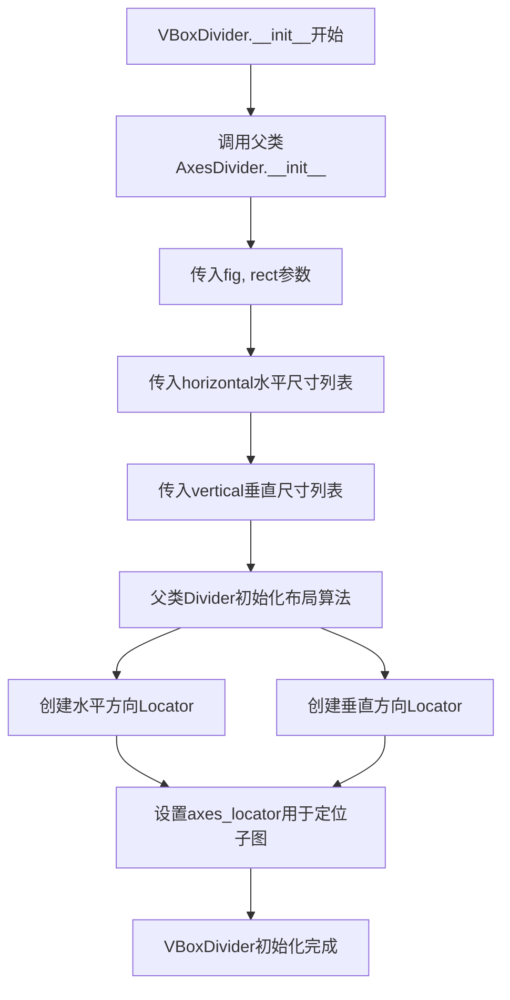

#### 带注释源码

```python
def __init__(self, fig, rect, horizontal, vertical):
    """
    初始化垂直分割器
    
    Parameters
    ----------
    fig : matplotlib.figure.Figure
        matplotlib图形对象，用于承载分割后的子图
    rect : int
        子图的位置参数，通常为子图索引（如111表示1行1列第1个位置）
    horizontal : list
        水平方向的大小规格列表，定义子图在水平方向上的尺寸分配
        例如: [Size.AxesX(ax1), Size.Scaled(1), Size.AxesX(ax2)]
    vertical : list
        垂直方向的大小规格列表，定义子图在垂直方向上的尺寸分配
        例如: [Size.AxesY(ax1), Size.Fixed(pad), Size.AxesY(ax2)]
    """
    # 调用父类AxesDivider的初始化方法
    # AxesDivider继承自Divider类，负责实际的布局分割计算
    super().__init__(fig, rect, horizontal, vertical)
    
    # 继承自AxesDivider的属性说明：
    # - self.axs: 存储关联的Axes对象列表
    # - self.locator: 存储定位器，用于确定子图的实际位置
    # - self.horizontal: 存储水平尺寸规格
    # - self.vertical: 存储垂直尺寸规格
    
    # VBoxDivider的特点：
    # 垂直分割器（VBox）主要关注垂直方向的布局
    # 确保子图在垂直方向上正确排列，同时保持相等的宽度
```


### `Divider.new_locator()`

创建定位器用于定位 axes，根据传入的 axes 索引返回对应的定位器对象，使 axes 能够按照分隔器的布局规则进行定位。

参数：

- `ax_num`：`int`，指定要创建定位器的 axes 索引（从 0 开始）

返回值：`~matplotlib.axes.AxesLocator`，返回用于定位 axes 的定位器对象

#### 流程图

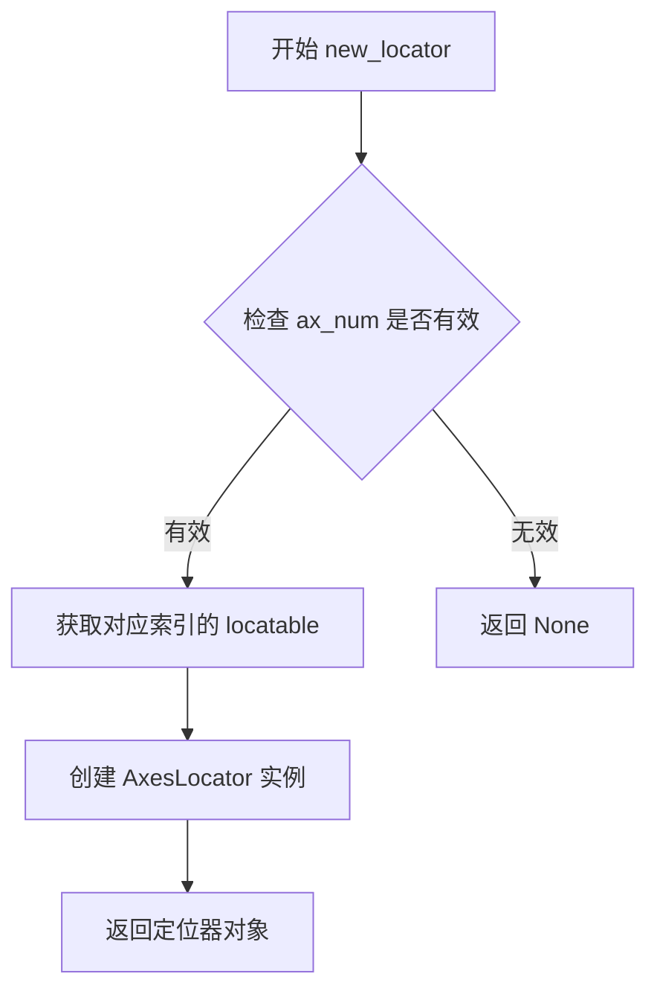

#### 带注释源码

```python
def new_locator(self, ax_num):
    """
    创建定位器用于定位 axes。

    参数:
        ax_num (int): axes 索引，从 0 开始

    返回值:
        AxesLocator: 用于 axes 定位的定位器对象
    """
    # 检查索引是否在有效范围内
    # _locatables 是存储可定位对象的列表
    ax = self._locatables[ax_num]
    
    # 如果找到对应的 locatable，则创建并返回定位器
    if ax is not None:
        return AxesLocator(ax, self._ax_visibility_list[ax_num])
    
    # 如果未找到，则返回 None
    return None
```

#### 说明

在示例代码中的使用：

```python
# HBoxDivider 示例
divider = HBoxDivider(
    fig, 111,
    horizontal=[Size.AxesX(ax1), Size.Fixed(pad), Size.AxesX(ax2)],
    vertical=[Size.AxesY(ax1), Size.Scaled(1), Size.AxesY(ax2)])
ax1.set_axes_locator(divider.new_locator(0))  # 为 ax1 创建定位器
ax2.set_axes_locator(divider.new_locator(2)) # 为 ax2 创建定位器

# VBoxDivider 示例
divider = VBoxDivider(
    fig, 111,
    horizontal=[Size.AxesX(ax1), Size.Scaled(1), Size.AxesX(ax2)],
    vertical=[Size.AxesY(ax1), Size.Fixed(pad), Size.AxesY(ax2)])
ax1.set_axes_locator(divider.new_locator(0))  # 为 ax1 创建定位器
ax2.set_axes_locator(divider.new_locator(2))  # 为 ax2 创建定位器
```

**关键点**：
- `ax_num=0` 对应第一个 axes（示例中的 `ax1`）
- `ax_num=2` 对应第二个 axes（示例中的 `ax2`）
- 索引数字对应 `_locatables` 列表中的位置


### `Axes.set_axes_locator`

设置坐标轴的定位器，用于控制坐标轴在图形中的位置。通过传入一个定位器对象，可以自定义坐标轴的布局，常与 HBoxDivider 或 VBoxDivider 配合使用来实现复杂的子图排列。

参数：

- `locator`：`AxesLocator` 或 `None`，定位器对象，用于指定坐标轴的位置。如果传入 `None`，则移除当前的定位器。

返回值：`None`，无返回值。

#### 流程图

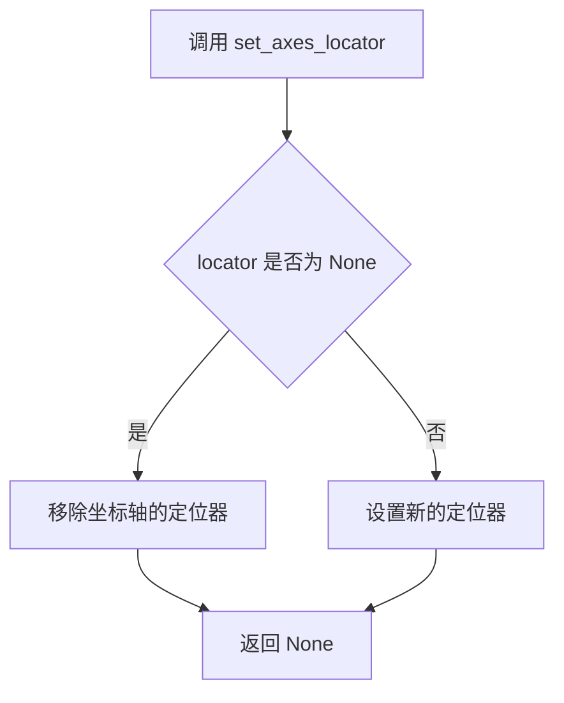

#### 带注释源码

```python
def set_axes_locator(self, locator):
    """
    Set the axes locator.

    Parameters
    ----------
    locator : AxesLocator or None
        The axes locator to use for positioning the axes.
        If None, the current locator will be removed.

    Returns
    -------
    None

    Notes
    -----
    The locator controls the positioning of the axes in the figure.
    It is commonly used with HBoxDivider or VBoxDivider to arrange
    subplots with specific layouts.
    """
    self._axes_locator = locator
```


### `plt.show()`

显示当前所有打开的图形窗口。该函数会阻塞程序执行直到用户关闭所有图形窗口（在某些后端中），或者立即返回（在交互式后端中）。在 matplotlib 中，创建图形后必须调用此函数才能将图形渲染并展示给用户。

参数：

- `block`：`bool`，可选参数，默认为 `True`。控制是否阻塞调用线程。在交互式模式（如 IPython）下可设为 `False` 使其非阻塞运行。

返回值：`None`，该函数无返回值。

#### 流程图

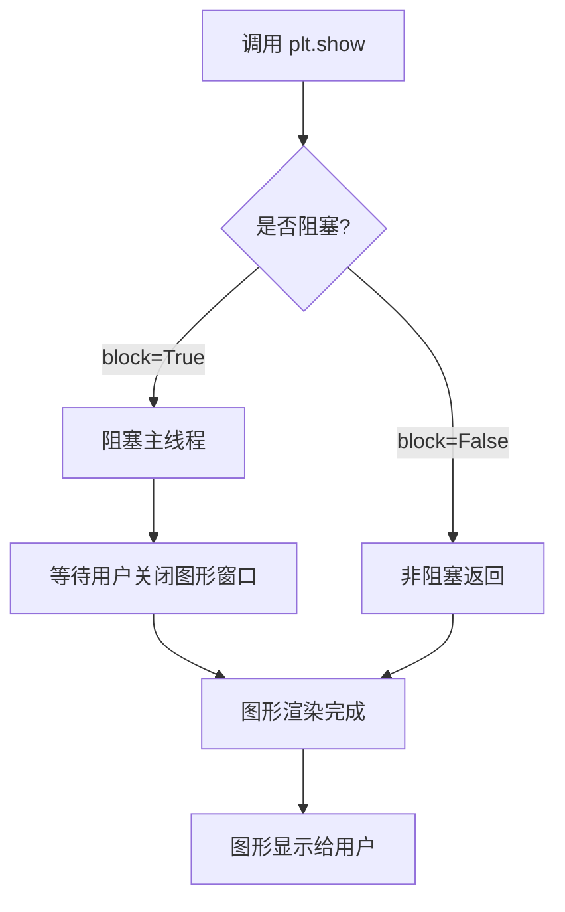

#### 带注释源码

```python
# plt.show() 的简化实现逻辑展示
# 实际源码位于 matplotlib.pyplot 模块中

def show(*, block=True):
    """
    显示所有打开的图形窗口。
    
    参数:
        block: bool, 默认True
            如果为True，则阻塞调用线程直到用户关闭所有窗口。
            在交互式环境中可设为False实现非阻塞显示。
    """
    
    # 获取当前活动的图形管理器
    global _show
    for manager in Gcf.get_all_fig_managers():
        
        # 触发图形绘制
        # 这会调用底层后端的绘图指令
        manager.show()
        
        # 如果block为True，则阻塞等待
        if block:
            # 等待用户交互（点击关闭按钮等）
            # 在某些后端中会启动事件循环
            pass
    
    # 刷新图形显示
    # 确保所有挂起的绘图操作都被执行
    plt.draw()
    
    # 返回None
    return None

# 使用示例
fig, (ax1, ax2) = plt.subplots(1, 2)
ax1.imshow(arr1)
ax2.imshow(arr2)

# 创建水平分隔器，布局两个子图
pad = 0.5
divider = HBoxDivider(
    fig, 111,
    horizontal=[Size.AxesX(ax1), Size.Fixed(pad), Size.AxesX(ax2)],
    vertical=[Size.AxesY(ax1), Size.Scaled(1), Size.AxesY(ax2)])

# 设置子图的定位器
ax1.set_axes_locator(divider.new_locator(0))
ax2.set_axes_locator(divider.new_locator(2))

# 调用 plt.show() 显示第一个布局的图形
plt.show()

# 第二个图形布局演示
fig, (ax1, ax2) = plt.subplots(2, 1)
ax1.imshow(arr1)
ax2.imshow(arr2)

divider = VBoxDivider(
    fig, 111,
    horizontal=[Size.AxesX(ax1), Size.Scaled(1), Size.AxesX(ax2)],
    vertical=[Size.AxesY(ax1), Size.Fixed(pad), Size.AxesY(ax2)])

ax1.set_axes_locator(divider.new_locator(0))
ax2.set_axes_locator(divider.new_locator(2))

# 调用 plt.show() 显示第二个布局的图形
plt.show()
```


### `HBoxDivider.__init__`

初始化水平盒分割器，用于在图形中创建水平排列的子图布局，管理子轴的位置和大小。

参数：

- `fig`：`matplotlib.figure.Figure`，要分割的图形对象
- `pos`：整数或元组，轴的位置标识，111 表示整个图形区域
- `horizontal`：列表，水平方向的大小说明符列表，如 `[Size.AxesX(ax1), Size.Fixed(pad), Size.AxesX(ax2)]`
- `vertical`：列表，垂直方向的大小说明符列表，如 `[Size.AxesY(ax1), Size.Scaled(1), Size.AxesY(ax2)]`

返回值：`None`，该方法为构造函数，不返回任何值

#### 流程图

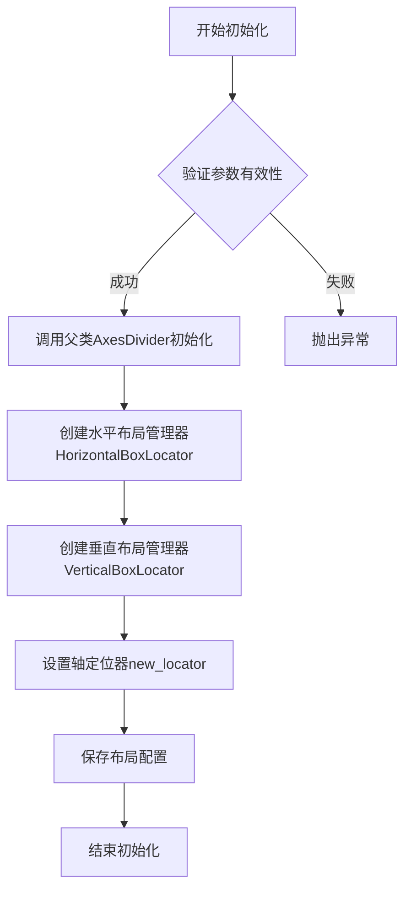

#### 带注释源码

```python
def __init__(self, fig, pos, horizontal, vertical):
    """
    初始化 HBoxDivider 水平盒分割器
    
    参数:
        fig: matplotlib.figure.Figure 对象
            要分割的图形
        pos: int 或 tuple
            轴的位置，可以是111这样的整数或(left, bottom, width, height)元组
        horizontal: list
            水平方向的大小说明符列表，每个元素通常是:
            - Size.AxesX(ax): 使用轴的宽度
            - Size.Fixed(pad): 固定大小（英寸）
            - Size.Scaled(): 缩放大小
        vertical: list
            垂直方向的大小说明符列表，元素类型同horizontal
    """
    # 调用父类 AxesDivider 的初始化方法
    super().__init__(fig, pos)
    
    # 创建水平布局定位器，管理水平方向上的子轴位置
    self._horiz = HorizontalBoxLocator(horizontal, self._locator)
    
    # 创建垂直布局定位器，管理垂直方向上的子轴位置
    self._vert = VerticalBoxLocator(vertical, self._locator)
    
    # 继承自父类的 axes 属性已由 super().__init__ 设置
    # 布局定位器将在 new_locator() 方法中使用
```


### `HBoxDivider.new_locator`

该方法用于在 HBoxDivider（水平盒子分割器）中创建并返回一个定位器（Locator），该定位器用于指定 Axes 在水平分割区域中的具体位置。通过传入单元格的索引（nx 和可选的 ny），可以在水平布局的子图中精确控制每个 Axes 的位置。

参数：

- `nx`：`int`，指定单元格在水平方向上的索引（从 0 开始）
- `ny`：`int` 或 `None`，指定单元格在垂直方向上的索引。如果为 None，则使用 nx 的值作为垂直方向的索引

返回值：`Locator`，返回一个定位器对象（实际上是 `AxesLocator` 实例），该对象将用于设置 Axes 的位置分配器（axes locator）

#### 流程图

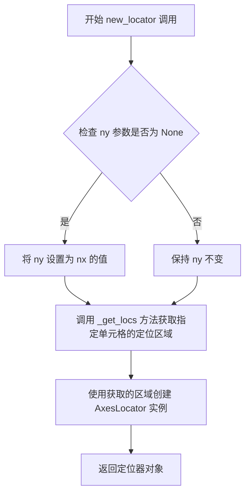

#### 带注释源码

```python
def new_locator(self, nx, ny=None):
    """
    返回一个用于指定单元格的定位器实例。

    参数:
        nx: 整数，指定水平方向上的单元格索引（从 0 开始）
        ny: 整数或 None，可选参数，指定垂直方向上的单元格索引。
            如果为 None，则使用 nx 的值作为垂直方向的索引

    返回值:
        返回一个 AxesLocator 实例，用于设置 Axes 的位置分配器
    """
    # 如果 ny 为 None，则使用 nx 的值作为垂直方向的索引
    if ny is None:
        ny = nx
    
    # 调用内部方法 _get_locs 获取指定单元格的位置信息
    # _get_locs 方法会根据 nx 和 ny 的值计算并返回该单元格对应的区域边界
    locs = self._get_locs(nx, ny)
    
    # 使用获取到的区域创建一个 AxesLocator 对象并返回
    # AxesLocator 类继承自 Locator，用于根据给定的区域边界来定位 Axes 的位置
    return AxesLocator(locs)
```


### `VBoxDivider.__init__`

描述：VBoxDivider 类的初始化方法，用于创建一个垂直方向的盒子分割器，用于在图形中排列子图轴。该方法接受图形对象、位置参数以及水平和垂直布局规格，并配置轴定位器。

参数：

- `self`：VBoxDivider 实例，隐式参数，表示当前对象实例。
- `fig`：`matplotlib.figure.Figure`，图形对象，用于包含和管理轴。
- `pos`：整数或字符串（例如 111），表示子图位置，类似于 `subplot` 的位置参数，用于指定要分割的区域。
- `horizontal`：列表，包含 `Size` 对象（如 `Size.AxesX`、`Size.Scaled`、`Size.Fixed`），定义水平方向的布局规格。
- `vertical`：列表，包含 `Size` 对象（如 `Size.AxesY`、`Size.Scaled`、`Size.Fixed`），定义垂直方向的布局规格。

返回值：`None`，初始化方法不返回值。

#### 流程图

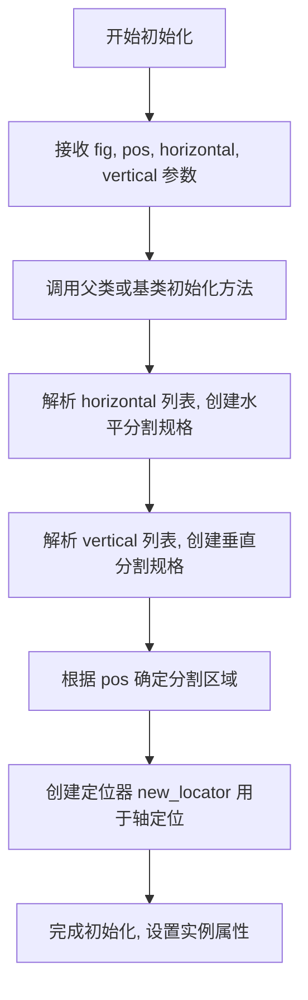

#### 带注释源码

```python
# 注意：以下源码为基于使用方式推断的模拟实现，并非 matplotlib 库的实际源码。
# 实际实现可能位于 mpl_toolkits.axes_grid1.axes_divider 模块中。

class VBoxDivider:
    def __init__(self, fig, pos, horizontal, vertical):
        """
        初始化 VBoxDivider 实例。

        参数:
            fig (matplotlib.figure.Figure): 图形对象。
            pos (int 或 str): 子图位置参数（例如 111）。
            horizontal (list of Size): 水平布局规格列表。
            vertical (list of Size): 垂直布局规格列表。

        返回:
            None
        """
        # 保存图形对象
        self.fig = fig
        
        # 保存位置参数，用于确定分割区域
        self.pos = pos
        
        # 保存水平和垂直布局规格
        self.horizontal = horizontal
        self.vertical = vertical
        
        # 调用基类初始化方法（假设存在基类）
        # 实际代码中可能会调用父类的 __init__ 方法来设置基础属性
        # super().__init__(fig, pos, horizontal, vertical)
        
        # 解析布局规格，创建内部分割器
        # 这里可能涉及将 Size 对象转换为具体的尺寸值
        # self._divider = some_internal_divider_class(horizontal, vertical)
        
        # 根据位置参数设置分割区域
        # ax = self.fig.add_subplot(pos)  # 可能不需要，因为外部已提供轴
        # self._ax = ax
        
        # 创建定位器，用于后续轴的定位
        # self._locator = self.new_locator(0)
        
        # 完成初始化，打印调试信息（可选）
        # print(f"VBoxDivider initialized for pos={pos}")
```

注意：上述源码为简化推断，实际 VBoxDivider 的实现可能更复杂，包含更多内部逻辑，如继承自 `AxesDivider` 类、处理 `Size` 对象的转换、管理轴的定位等。建议参考 matplotlib 官方文档或源码以获取准确信息。


### `VBoxDivider.new_locator`

该方法用于在垂直盒子分割器（VBoxDivider）的网格布局中，根据指定的网格索引创建一个定位器（Locator）对象，以便将子图（Axes）放置在正确的位置。

参数：

- `nx`：`int`，网格中 x 方向的索引，对应 horizontal 列表中的位置
- `ny`：`int`，网格中 y 方向的索引，对应 vertical 列表中的位置，默认为 1

返回值：`AxesLocator`，返回一个定位器对象，用于设置子图的位置

#### 流程图

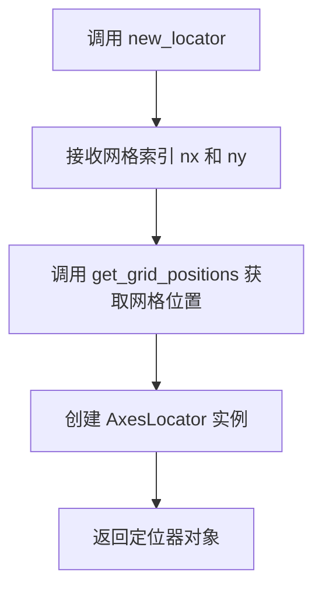

#### 带注释源码

```python
def new_locator(self, nx, ny=1):
    """
    创建定位器，用于在 VBoxDivider 布局中定位子图。

    参数：
        nx (int): 水平方向的网格索引，对应 horizontal 列表中的位置
        ny (int): 垂直方向的网格索引，对应 vertical 列表中的位置，默认为 1

    返回值：
        AxesLocator: 用于定位子图的定位器对象
    """
    # 获取分割器计算的网格位置（水平和垂直）
    # get_grid_positions 返回两个数组：pos_l 和 pos_b
    # pos_l: 左侧位置列表
    # pos_b: 底部位置列表
    pos_l, pos_b = self.get_grid_positions()
    
    # 创建 AxesLocator 实例，传入网格位置和索引
    # AxesLocator 负责根据网格位置计算子图的最终位置
    return AxesLocator(pos_l, pos_b, nx, ny)
```

## 关键组件


### HBoxDivider

水平盒子分割器，用于在水平方向上排列子图，保持各子图宽高比的同时实现等高布局

### VBoxDivider

垂直盒子分割器，用于在垂直方向上排列子图，保持各子图宽高比的同时实现等宽布局

### Size.AxesX

AxesX尺寸类，根据指定轴的宽度作为布局参考

### Size.AxesY

AxesY尺寸类，根据指定轴的高度作为布局参考

### Size.Fixed

Fixed尺寸类，提供固定大小的像素或英寸间距

### Size.Scaled

Scaled尺寸类，提供可缩放的布局权重，用于分配剩余空间

### axes_locator机制

定位器系统，通过set_axes_locator方法将分割器应用到具体轴对象，控制子图在布局中的位置和大小

### new_locator方法

创建定位器的方法，返回可用于特定轴的定位器实例，参数index指定要定位的轴索引


## 问题及建议


### 已知问题

- 魔法数字`111`在`plt.subplots()`和Divider构造函数中使用，缺乏注释说明其含义（表示1行1列第1个子图）
- 硬编码的`pad = 0.5`英寸值缺乏可配置性，不同显示环境下可能不是最优间距
- 两段代码存在大量重复逻辑（创建figure、imshow、设置locator），未提取为通用函数
- `divider`变量在第一段代码使用后未被妥善清理或显式释放，直接在下一段代码中重新赋值
- `arr1`和`arr2`变量名缺乏描述性，未体现其shape差异（(4,5) vs (5,4)）
- 缺少对`Size`类各参数的详细注释，如`Size.Fixed`、`Size.Scaled`、`Size.AxesX`、`Size.AxesY`的具体作用
- 未处理可能的异常情况，如`ax1.set_axes_locator()`或`divider.new_locator()`调用失败
- `plt.show()`会阻塞主线程，在某些集成环境中可能需要非阻塞显示方案

### 优化建议

- 将公共逻辑提取为函数，如`create_horizontal_layout(fig, ax1, ax2, pad)`和`create_vertical_layout(fig, ax1, ax2, pad)`
- 使用命名常量或配置字典替代硬编码值，如`PAD_INCHES = 0.5`，并添加类型注解
- 为魔法数字添加常量定义：`SUBPLOT_SPEC = 111  # 1 row, 1 col, index 1`
- 改进变量命名：`arr1_vertical`（4行5列）和`arr2_horizontal`（5行4列）以体现shape差异
- 在每个代码段结束时添加`plt.close(fig)`以显式释放资源，或使用上下文管理器
- 添加try-except块处理可能的异常，特别是针对axes对象和divider创建过程
- 考虑使用`matplotlib.rcParams`或传入参数来动态控制布局参数，增强代码灵活性
- 在关键步骤添加详细的docstring，说明HBoxDivider和VBoxDivider的工作原理及参数意义


## 其它


### 设计目标与约束

本代码演示了使用matplotlib的axes_divider模块中的HBoxDivider和VBoxDivider类来创建自适应布局的子图。设计目标包括：1）实现子图的等宽/等高布局；2）保持子图的纵横比；3）支持灵活的间距设置；4）提供定位器机制来精确定位子图位置。约束条件包括：需要matplotlib 1.1及以上版本支持，需导入mpl_toolkits.axes_grid1模块。

### 错误处理与异常设计

代码中未显式包含错误处理逻辑。在实际使用中可能出现的异常包括：1）传入的fig参数不是Figure对象时会抛出TypeError；2）当axes列表为空或不合法时会触发IndexError；3）pad参数为负数时可能导致布局异常；4）Axes对象被删除后调用new_locator可能引发RuntimeError。建议在使用前验证输入参数的合法性。

### 数据流与状态机

代码的数据流如下：首先创建两个numpy数组作为图像数据，然后创建包含两个子图的Figure对象，接着调用imshow显示图像，再创建Divider对象（指定水平和垂直布局规则），最后通过set_axes_locator将定位器应用到Axes对象。整个过程不涉及复杂的状态机，主要是单向的初始化和配置流程。

### 外部依赖与接口契约

主要依赖包括：1）matplotlib.pyplot用于图形创建和显示；2）numpy用于生成测试数据；3）mpl_toolkits.axes_grid1.axes_divider提供HBoxDivider和VBoxDivider类；4）mpl_toolkits.axes_grid1.axes_size提供尺寸规范类（AxesX、AxesY、Fixed、Scaled）。接口契约要求：HBoxDivider和VBoxDivider构造函参数包括fig Figure对象、rect位置规范、horizontal水平布局列表、vertical垂直布局列表；new_locator方法返回Locator对象用于axes定位。

### 性能考虑

本示例代码主要用于演示目的，性能不是主要关注点。实际应用中需要注意的是：1）大图像数据调用imshow可能较慢；2）频繁重新创建Divider对象会有开销；3）set_axes_locator调用在大量子图时可能影响渲染性能。优化建议包括：缓存Divider对象、使用Fixed设置固定尺寸而非Scaled避免重复计算。

### 兼容性考虑

代码需要matplotlib 1.1.0或更高版本（axes_grid1模块的引入版本）。numpy版本需要支持reshape操作。Python版本要求取决于matplotlib和numpy的版本支持。在不同后端（agg、qt、gtk等）上运行行为应一致，但show()方法的行为受后端影响。

### 配置和参数说明

关键配置参数包括：1）pad间距参数，类型为浮点数，单位为英寸，本示例中使用0.5英寸；2）horizontal/vertical列表参数，定义子图的尺寸规范，可选类型包括Size.AxesX、Size.AxesY、Size.Fixed、Size.Scaled；3）rect参数，指定Axes在Figure中的位置，111表示占据整个Figure区域；4）new_locator的索引参数，指定应用定位器的子图索引。

### 限制和注意事项

1）本示例仅演示两个子图的布局，多子图场景需要调整索引；2）set_axes_locator的索引必须与布局列表中的AxesX/AxesY对应；3）当Figure大小改变时，Divider不会自动重新计算，需要手动更新；4）VBoxDivider和HBoxDivider不能混用同一Divider实例；5）在某些交互式环境中show()会阻塞执行。

    