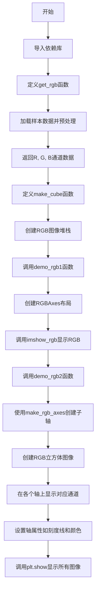
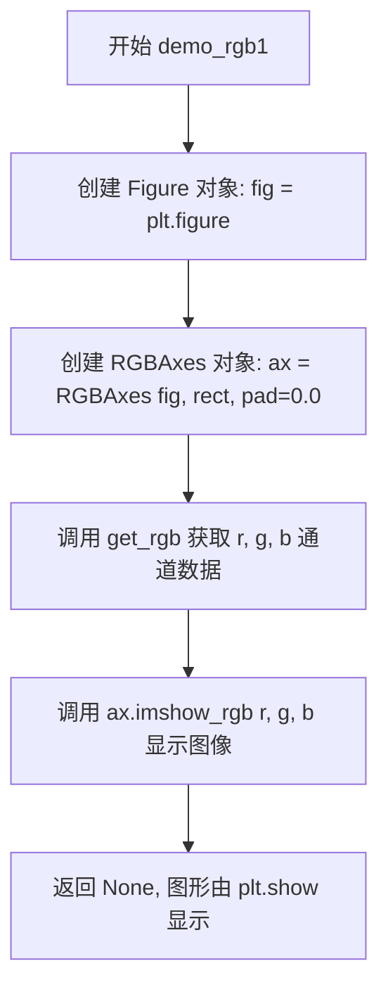
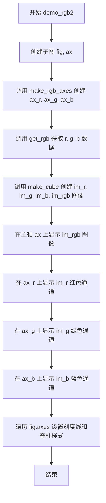

# `matplotlib\galleries\examples\axes_grid1\demo_axes_rgb.py` 详细设计文档

该代码演示了如何使用matplotlib的RGBAxes和make_rgb_axes工具来显示RGB图像通道，包括一个综合的RGB图像和三个分离的R、G、B通道图像。

## 整体流程



## 类结构

```
无自定义类
主要使用mpl_toolkits.axes_grid1.axes_rgb模块
├── RGBAxes (外部类 - 用于创建RGB布局)
└── make_rgb_axes (外部函数 - 用于创建RGB轴)
```

## 全局变量及字段


### `Z`
    
样本数据（二元正态分布数据）

类型：`numpy.ndarray`
    


### `R`
    
红色通道数据（Z的前13x13切片）

类型：`numpy.ndarray`
    


### `G`
    
绿色通道数据（Z从第2行第2列开始的切片）

类型：`numpy.ndarray`
    


### `B`
    
蓝色通道数据（Z的前13行第2列开始的切片）

类型：`numpy.ndarray`
    


### `RGB`
    
合并的RGB彩色图像

类型：`numpy.ndarray`
    


### `r`
    
红色通道切片（get_rgb返回）

类型：`numpy.ndarray`
    


### `g`
    
绿色通道切片（get_rgb返回）

类型：`numpy.ndarray`
    


### `b`
    
蓝色通道切片（get_rgb返回）

类型：`numpy.ndarray`
    


### `ny`
    
数组行数

类型：`int`
    


### `nx`
    
数组列数

类型：`int`
    


### `fig`
    
图形对象

类型：`matplotlib.figure.Figure`
    


### `ax`
    
主轴（RGB图像显示）

类型：`matplotlib.axes.Axes`
    


### `ax_r`
    
红色通道显示轴

类型：`matplotlib.axes.Axes`
    


### `ax_g`
    
绿色通道显示轴

类型：`matplotlib.axes.Axes`
    


### `ax_b`
    
蓝色通道显示轴

类型：`matplotlib.axes.Axes`
    


### `im_r`
    
红色通道图像对象

类型：`matplotlib.image.AxesImage`
    


### `im_g`
    
绿色通道图像对象

类型：`matplotlib.image.AxesImage`
    


### `im_b`
    
蓝色通道图像对象

类型：`matplotlib.image.AxesImage`
    


### `im_rgb`
    
RGB合并后的图像对象

类型：`matplotlib.image.AxesImage`
    


    

## 全局函数及方法


### `get_rgb`

该函数从matplotlib的示例数据中加载二维正态分布数据，进行归一化处理，并从中提取三个不同的子区域作为RGB通道的红色、绿色和蓝色分量数据。

参数： 无

返回值：`tuple`，返回三个numpy数组(R, G, B)，分别代表RGB图像的红色、绿色和蓝色通道数据

#### 流程图

```mermaid
flowchart TD
    A[开始 get_rgb] --> B[从cbook获取样本数据]
    B --> C[将负值设为0]
    C --> D[归一化数据到0-1范围]
    D --> E[提取R通道: Z[:13, :13]]
    E --> F[提取G通道: Z[2:, 2:]]
    F --> G[提取B通道: Z[:13, 2:]]
    G --> H[返回 R, G, B 三个通道数据]
```

#### 带注释源码

```python
def get_rgb():
    """
    获取RGB通道数据
    
    从示例数据中加载二维正态分布数据，经过处理后
    提取三个不同的区域作为RGB三个通道返回
    """
    # 从matplotlib的cbook获取样本数据文件
    # 文件路径为 axes_grid/bivariate_normal.npy
    Z = cbook.get_sample_data("axes_grid/bivariate_normal.npy")
    
    # 将数据中小于0的值设为0，去除负值
    Z[Z < 0] = 0.
    
    # 归一化数据，将数据缩放到0-1范围
    Z = Z / Z.max()

    # 提取红色通道数据：取左上角13x13区域
    R = Z[:13, :13]
    
    # 提取绿色通道数据：取右下角偏移后的区域
    G = Z[2:, 2:]
    
    # 提取蓝色通道数据：取左下角区域
    B = Z[:13, 2:]

    # 返回三个通道的二维数组
    return R, G, B
```


### `make_cube`

该函数接收三个分别代表红、绿、蓝通道的二维数组（R、G、B），并将它们组合成一个三维的彩色图像数据立方体（RGB），同时生成单独显示各通道的图像副本。

参数：

- `r`：`numpy.ndarray`，表示红色通道的二维灰度图像数据。
- `g`：`numpy.ndarray`，表示绿色通道的二维灰度图像数据。
- `b`：`numpy.ndarray`，表示蓝色通道的二维灰度图像数据。

返回值：`Tuple[numpy.ndarray, numpy.ndarray, numpy.ndarray, numpy.ndarray]`，返回一个包含4个三维数组的元组：
- `R`：仅包含红色通道数据的RGB格式图像（其他通道为0）。
- `G`：仅包含绿色通道数据的RGB格式图像（其他通道为0）。
- `B`：仅包含蓝色通道数据的RGB格式图像（其他通道为0）。
- `RGB`：由R、G、B通道叠加而成的复合彩色图像。

#### 流程图

```mermaid
flowchart TD
    A[输入: r, g, b] --> B{获取维度}
    B -->|ny, nx = r.shape| C[创建R数组]
    C -->|np.zeros((ny, nx, 3))<br>填充 R[:,:,0] = r| D[创建G数组]
    D -->|np.zeros_like(R)<br>填充 G[:,:,1] = g| E[创建B数组]
    E -->|np.zeros_like(R)<br>填充 B[:,:,2] = b| F[生成RGB]
    F -->|RGB = R + G + B| G[返回: R, G, B, RGB]
```

#### 带注释源码

```python
def make_cube(r, g, b):
    """
    根据输入的三个通道数据生成RGB图像立方体。

    参数:
        r (numpy.ndarray): 红色通道数据 (2D数组)。
        g (numpy.ndarray): 绿色通道数据 (2D数组)。
        b (numpy.ndarray): 蓝色通道数据 (2D数组)。

    返回:
        tuple: 包含 (R, G, B, RGB) 四个numpy数组的元组。
    """
    # 1. 获取输入图像的维度（高度和宽度）
    # 假设r, g, b拥有相同的形状，这里使用r的shape作为标准
    ny, nx = r.shape

    # 2. 初始化红色通道图像 R
    # 创建一个 (ny, nx, 3) 的全零数组， dtype通常继承自r
    R = np.zeros((ny, nx, 3))
    # 将输入的r数据填充到R数组的第一个通道（索引0）
    R[:, :, 0] = r

    # 3. 初始化绿色通道图像 G
    # 使用 zeros_like 创建与R形状和类型一致的数组，提高效率
    G = np.zeros_like(R)
    # 将输入的g数据填充到G数组的第二个通道（索引1）
    G[:, :, 1] = g

    # 4. 初始化蓝色通道图像 B
    B = np.zeros_like(R)
    # 将输入的b数据填充到B数组的第三个通道（索引2）
    B[:, :, 2] = b

    # 5. 合成最终的全彩图像 RGB
    # 通过矩阵加法将三个通道叠加。注意：在图像处理中，如果通道值较大
    # （如uint8），直接相加可能导致溢出，此处得益于上游数据已被归一化处理。
    RGB = R + G + B

    # 6. 返回四个图像数组
    return R, G, B, RGB
```


### `demo_rgb1`

该函数演示如何使用 RGBAxes 布局在四个坐标轴中显示 RGB 图像及其 R、G、B 通道。它创建一个图形窗口，初始化 RGBAxes，获取示例 RGB 数据，并调用 imshow_rgb 方法将合并后的图像和分离的通道显示在布局中。

参数：

- 无

返回值：`None`，无返回值，仅用于显示图形

#### 流程图



#### 带注释源码

```python
def demo_rgb1():
    """
    演示使用 RGBAxes 显示 RGB 通道的函数
    
    该函数展示如何利用 RGBAxes 类创建一个包含主 RGB 图像
    和三个独立 R、G、B 通道的布局
    
    参数:
        无
        
    返回值:
        None: 本函数不返回任何值,仅生成可视化图形
    """
    # 创建新的图形窗口/画布
    fig = plt.figure()
    
    # 创建 RGBAxes 实例
    # 参数说明:
    #   fig: 父图形对象
    #   [0.1, 0.1, 0.8, 0.8]: 坐标轴在图形中的位置 [左, 下, 宽, 高]
    #   pad=0.0: 坐标轴之间的填充距离
    ax = RGBAxes(fig, [0.1, 0.1, 0.8, 0.8], pad=0.0)
    
    # 获取 RGB 通道的样本数据
    # 返回三个二维数组分别代表 R、G、B 通道
    r, g, b = get_rgb()
    
    # 使用 RGBAxes 的 imshow_rgb 方法显示 RGB 图像
    # 该方法会自动在布局中显示:
    #   - 右上角: 合并后的 RGB 图像
    #   - 左下角: R 通道
    #   - 右下角: G 通道
    #   - 左上角: B 通道
    ax.imshow_rgb(r, g, b)
```


### `demo_rgb2`

该函数演示了如何使用 `make_rgb_axes` 方式创建 RGBAxes 布局，通过手动创建子 Axes 来分别显示 RGB 图像及其 R、G、B 三个通道，并统一设置坐标轴样式。

参数：

- 该函数无参数

返回值：`None`，无返回值，仅执行绘图操作

#### 流程图



#### 带注释源码

```python
def demo_rgb2():
    """
    演示使用 make_rgb_axes 方式显示 RGB 通道
    
    该函数展示了如何手动创建子 Axes 来分别显示 RGB 图像
    及其 R、G、B 三个通道，这是一种更灵活的 RGBAxes 使用方式
    """
    # 创建包含单个子图的Figure对象和Axes对象
    fig, ax = plt.subplots()
    
    # 使用 make_rgb_axes 在主轴周围创建三个辅助轴
    # 用于显示 R、G、B 通道，pad 参数控制轴间距
    ax_r, ax_g, ax_b = make_rgb_axes(ax, pad=0.02)

    # 调用 get_rgb 函数获取样本 RGB 数据
    r, g, b = get_rgb()
    
    # 将分离的 R、G、B 数据转换为立方体图像格式
    # 返回四个图像：R通道图、G通道图、B通道图、合并的RGB图
    im_r, im_g, im_b, im_rgb = make_cube(r, g, b)
    
    # 在主轴上显示合并后的 RGB 彩色图像
    ax.imshow(im_rgb)
    
    # 分别在三个辅助轴上显示 R、G、B 单通道图像
    ax_r.imshow(im_r)  # 红色通道
    ax_g.imshow(im_g)  # 绿色通道
    ax_b.imshow(im_b)  # 蓝色通道

    # 遍历 Figure 中的所有 Axes，统一设置样式
    for ax in fig.axes:
        # 设置刻度线方向向内，颜色为白色
        ax.tick_params(direction='in', color='w')
        # 设置所有脊柱的颜色为白色
        ax.spines[:].set_color("w")
```

## 关键组件


### RGBAxes

用于创建包含RGB图像和R、G、B通道布局的类，提供一体化展示功能。

### make_rgb_axes

用于在现有Axes上创建三个独立Axes分别显示R、G、B通道的辅助函数。

### get_rgb

从样本数据中获取并预处理R、G、B通道数据，返回三个二维数组。

### make_cube

将R、G、B通道数据转换为RGB彩色图像，返回通道分量和合成后的RGB图像。

### demo_rgb1

演示函数，使用RGBAxes布局自动展示RGB图像及其R、G、B通道。

### demo_rgb2

演示函数，使用make_rgb_axes手动布局展示RGB图像及单独通道。


## 问题及建议


### 已知问题

-   **魔法数字与硬编码**：代码中存在多处硬编码的数值（如 `Z[:13, :13]`、`Z[2:, 2:]`、布局参数 `[0.1, 0.1, 0.8, 0.8]`、`pad=0.02` 等），缺乏解释性注释，可维护性差
-   **缺乏错误处理**：未对 `cbook.get_sample_data` 返回值进行校验；未处理 `Z.max()` 为零导致的除零错误；未验证数组形状兼容性
-   **代码重复**：`get_rgb()` 调用和图像显示逻辑在 `demo_rgb1()` 与 `demo_rgb2()` 中重复，未实现 DRY 原则
-   **内存效率低下**：`make_cube()` 函数先创建三个独立数组 R、G、B，再相加生成 RGB，可优化为直接操作 RGB 数组减少内存分配
-   **类型标注缺失**：无任何函数参数和返回值的类型注解，影响代码可读性和 IDE 支持
-   **函数命名不够描述性**：`get_rgb`、`make_cube`、`demo_rgb1` 等名称过于简短，未能清晰表达其功能意图
-   **全局函数缺乏封装**：所有代码以模块级函数形式存在，未使用类或模块进行组织，不利于代码复用和测试
-   **Plot 风格设置重复**：在 `demo_rgb2()` 中遍历所有 axes 设置 tick_params 和 spines 的逻辑可封装为工具函数

### 优化建议

-   将硬编码的数值提取为具名常量或配置参数，并添加解释性注释
-   为关键函数添加输入验证和异常处理，特别是涉及文件加载和数值计算的部分
-   考虑将通用逻辑抽取为独立的辅助函数或类，减少代码重复
-   重构 `make_cube()` 为内存优化版本，直接构造 RGB 数组避免中间变量
-   添加类型注解提升代码可读性和可维护性
-   考虑使用 argparse 或配置文件实现可配置的演示参数
-   将相关的演示功能封装为类，提供更清晰的接口和更好的可测试性


## 其它


### 设计目标与约束

本示例旨在演示如何使用matplotlib的RGBAxes和make_rgb_axes组件来显示RGB图像及其R、G、B通道。设计目标包括：提供两种不同的RGB通道可视化方法（集成式RGBAxes和分离式make_rgb_axes），展示如何在单个图表中同时显示完整RGB图像和单独的红色、绿色、蓝色通道。约束条件包括：需要matplotlib 1.0以上版本，支持numpy数组操作，依赖mpl_toolkits.axes_grid1插件。

### 错误处理与异常设计

代码中主要涉及以下错误处理场景：1) Z[Z < 0] = 0. 负责处理负值数据，将负值裁剪为0；2) Z = Z / Z.max() 在Z.max()为0时会产生除零警告，建议添加判断处理；3) 数组形状不匹配时（如r、g、b维度不一致）可能导致图像显示异常，当前demo中通过固定取片范围保证维度一致；4) 文件加载失败时cbook.get_sample_data会抛出异常，当前未做捕获。

### 数据流与状态机

数据流主要分为两条路径：路径1（demo_rgb1）中，get_rgb()返回R、G、B三个数组 → RGBAxes对象创建 → imshow_rgb()方法内部合成RGB图像并分别显示；路径2（demo_rgb2）中，get_rgb()返回原始数据 → make_cube()将单通道扩展为三通道RGB数组 → 分别在四个Axes上显示原始RGB图像和R、G、B通道图像。状态机较为简单，主要状态包括：初始化状态（创建figure和axes）→ 数据准备状态（获取和处理数据）→ 渲染状态（显示图像）→ 交互状态（plt.show()等待用户操作）。

### 外部依赖与接口契约

本代码依赖以下外部包：1) matplotlib.pyplot - 用于创建图形和显示图像，版本需≥1.0；2) numpy - 用于数值计算和数组操作，版本需≥1.0；3) matplotlib.cbook - 用于获取样本数据，get_sample_data()接口接受文件路径参数，返回可加载的数据对象；4) mpl_toolkits.axes_grid1.axes_rgb - RGBAxes类接受fig、position参数和pad参数，make_rgb_axes()接受父axes和pad参数。接口契约：get_rgb()返回三个numpy数组(R,G,B)；make_cube()接受三个numpy数组参数返回四个numpy数组；demo_rgb1()和demo_rgb2()无参数无返回值。

### 性能考虑

当前实现性能基本满足演示需求。潜在优化点：1) make_cube函数中创建了多个零数组，可考虑预分配或使用numpy的stack/ concatenate操作；2) demo_rgb2中多次调用imshow可考虑是否需要显式调用draw_idle；3) 对于大图像处理，Z[Z < 0] = 0的布尔索引操作可优化为np.clip()；4) 当前重复调用get_rgb()两次，可考虑缓存结果复用。

### 安全性考虑

代码为演示脚本，不涉及用户输入或网络交互，安全性风险较低。但需注意：1) cbook.get_sample_data()加载文件时应验证文件路径安全性；2) 数组索引操作Z[:13, :13]等应添加边界检查防止索引越界；3) plt.show()调用时在某些后端可能存在资源泄露风险，建议在生产环境中显式关闭figure。

### 测试策略

建议添加以下测试用例：1) 测试get_rgb()返回值的形状一致性和非负性；2) 测试make_cube()输出RGB数组的形状正确性；3) 测试RGBAxes对象的创建和imshow_rgb方法的基本功能；4) 测试make_rgb_axes返回的三个子axes是否存在；5) 测试数组形状不匹配时的错误处理；6) 测试空数组或全零数组输入的边界情况。

### 版本兼容性

代码兼容matplotlib 1.0+和numpy 1.0+版本。注意事项：1) axes_grid1工具包在不同matplotlib版本中可能存在API变化；2) tick_params的direction='in'参数在某些旧版本中可能不支持；3) spines[:]语法要求matplotlib≥1.5；4) plt.subplots()返回值的解包方式在matplotlib 1.4+版本中才支持；5) 建议在requirements.txt中明确指定matplotlib>=1.5, numpy>=1.10以确保全部功能正常。

    