# `matplotlib\galleries\examples\axes_grid1\demo_colorbar_with_axes_divider.py` 详细设计文档

该代码是一个matplotlib演示程序，展示了如何使用axes_divider模块的make_axes_locatable函数创建可定位的坐标轴，并在主坐标轴的右侧和顶部添加colorbar（颜色条），实现了在保持主图布局的同时优雅地并排显示颜色条的功能。

## 整体流程

```mermaid
graph TD
    A[开始] --> B[导入 matplotlib.pyplot 和 make_axes_locatable]
B --> C[创建 Figure 和两个子图 ax1, ax2]
C --> D[调整子图间距 subplots_adjust]
D --> E[为 ax1 创建图像 im1]
E --> F[为 ax1 创建 AxesDivider]
F --> G[在右侧添加 colorbar 轴 cax1]
G --> H[为 ax1 创建 colorbar cb1]
H --> I[为 ax2 创建图像 im2]
I --> J[为 ax2 创建 AxesDivider]
J --> K[在顶部添加 colorbar 轴 cax2]
K --> L[为 ax2 创建水平方向的 colorbar cb2]
L --> M[设置 cax2 的刻度位置到顶部]
M --> N[调用 plt.show() 显示图形]
```

## 类结构

```
该代码为脚本形式，无类定义
主要使用 matplotlib.pyplot 模块
使用 mpl_toolkits.axes_grid1.axes_divider.make_axes_locatable 函数
使用 AxesDivider.append_axes 方法创建 colorbar 轴
```

## 全局变量及字段


### `fig`
    
Figure 对象，整个图形容器

类型：`matplotlib.figure.Figure`
    


### `ax1`
    
左侧子图的 Axes 对象

类型：`matplotlib.axes.Axes`
    


### `ax2`
    
右侧子图的 Axes 对象

类型：`matplotlib.axes.Axes`
    


### `im1`
    
ax1 的图像数据 (AxesImage 对象)

类型：`matplotlib.image.AxesImage`
    


### `im2`
    
ax2 的图像数据 (AxesImage 对象)

类型：`matplotlib.image.AxesImage`
    


### `ax1_divider`
    
ax1 的 AxesDivider 对象，用于管理坐标轴布局

类型：`mpl_toolkits.axes_grid1.axes_divider.AxesDivider`
    


### `ax2_divider`
    
ax2 的 AxesDivider 对象，用于管理坐标轴布局

类型：`mpl_toolkits.axes_grid1.axes_divider.AxesDivider`
    


### `cax1`
    
右侧 colorbar 的坐标轴对象

类型：`matplotlib.axes.Axes`
    


### `cax2`
    
顶部 colorbar 的坐标轴对象

类型：`matplotlib.axes.Axes`
    


### `cb1`
    
第一个 colorbar 对象

类型：`matplotlib.colorbar.Colorbar`
    


### `cb2`
    
第二个 colorbar 对象

类型：`matplotlib.colorbar.Colorbar`
    


    

## 全局函数及方法


### `plt.subplots`

创建包含指定行数和列数的子图Figure，返回Figure对象和Axes对象（或Axes数组）。

参数：

- `nrows`：`int`，子图网格的行数，值为1
- `ncols`：`int`，子图网格的列数，值为2

返回值：`tuple[Figure, Axes或Axes数组]`，返回元组(fig, axes)，其中fig是Figure对象，axes是包含两个Axes对象的元组(ax1, ax2)

#### 流程图

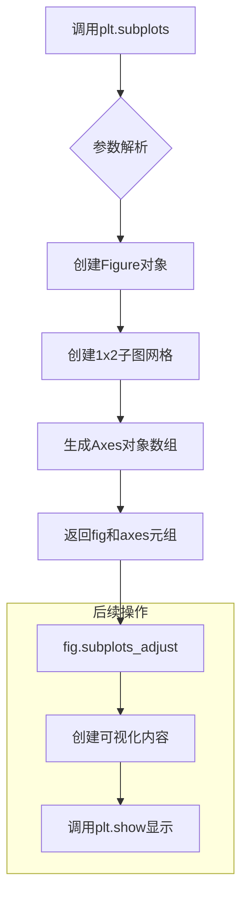

#### 带注释源码

```python
# 导入matplotlib.pyplot模块
import matplotlib.pyplot as plt

# 从mpl_toolkits.axes_grid1.axes_divider导入make_axes_locatable函数
from mpl_toolkits.axes_grid1.axes_divider import make_axes_locatable

# 使用plt.subplots创建包含1行2列子图的Figure
# nrows=1: 创建1行子图
# ncols=2: 创建2列子图
# 返回值: fig是Figure对象, (ax1, ax2)是包含两个Axes对象的元组
fig, (ax1, ax2) = plt.subplots(1, 2)

# 调整子图之间的水平间距，wspace=0.5表示间距为子图宽度的50%
fig.subplots_adjust(wspace=0.5)

# ===== 第一个子图 (ax1) 的处理 =====
# 使用imshow显示2x2矩阵图像
im1 = ax1.imshow([[1, 2], [3, 4]])

# 使用make_axes_locatable为ax1创建AxesDivider
# AxesDivider用于在Axes周围添加额外的Axes空间（如colorbar）
ax1_divider = make_axes_locatable(ax1)

# 使用append_axes在主Axes右侧添加一个colorbar Axes
# size="7%: 新Axes宽度为主Axes的7%
# pad="2%": 新Axes与主Axes之间的间距为主Axes宽度的2%
cax1 = ax1_divider.append_axes("right", size="7%", pad="2%")

# 创建colorbar并绑定到cax1
cb1 = fig.colorbar(im1, cax=cax1)

# ===== 第二个子图 (ax2) 的处理 =====
# 同样使用imshow显示2x2矩阵图像
im2 = ax2.imshow([[1, 2], [3, 4]])

# 为ax2创建AxesDivider
ax2_divider = make_axes_locatable(ax2)

# 在主Axes上方添加colorbar Axes
cax2 = ax2_divider.append_axes("top", size="7%", pad="2%")

# 创建水平方向的colorbar
cb2 = fig.colorbar(im2, cax=cax2, orientation="horizontal")

# 设置colorbar的刻度位置在顶部（避免与图像重叠）
cax2.xaxis.set_ticks_position("top")

# 显示图形
plt.show()
```


### `Figure.subplots_adjust`

该方法用于调整matplotlib图中子图之间的间距，支持通过left、right、top、bottom参数控制子图区域边界，以及通过wspace和hspace参数控制子图之间的水平和垂直间距。

参数：

- `left`：`float`，子图区域左边界（0-1之间的比例值）
- `right`：`float`，子图区域右边界（0-1之间的比例值）
- `top`：`float`，子图区域上边界（0-1之间的比例值）
- `bottom`：`float`，子图区域下边界（0-1之间的比例值）
- `wspace`：`float`，子图之间的水平间距（相对于子图宽度的比例）
- `hspace`：`float`，子图之间的垂直间距（相对于子图高度的比例）

返回值：`None`，该方法直接修改Figure对象的布局，不返回任何值

#### 流程图

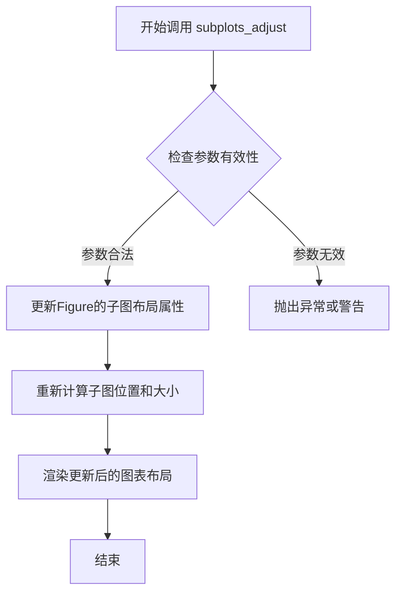

#### 带注释源码

```python
# 在提供的代码中，该方法的实际调用：
fig.subplots_adjust(wspace=0.5)

# 完整方法签名参考（matplotlib源码）：
def subplots_adjust(self, left=None, bottom=None, right=None, top=None, 
                    wspace=None, hspace=None):
    """
    调整子图之间的间距
    
    参数:
        left : float, 子图区域左边界
        right : float, 子图区域右边界  
        top : float, 子图区域上边界
        bottom : float, 子图区域下边界
        wspace : float, 子图之间的水平间距
        hspace : float, 子图之间的垂直间距
    
    返回:
        None
    """
    # 获取当前图形的后端
    self._axspace = None  # 重置axspace缓存
    self._axpos = None    # 重置axpos缓存
    
    # 更新布局参数
    if left is not None:
        self.subplotpars.left = left
    if right is not None:
        self.subplotpars.right = right
    if top is not None:
        self.subplotpars.top = top
    if bottom is not None:
        self.subplotpars.bottom = bottom
    if wspace is not None:
        self.subplotpars.wspace = wspace
    if hspace is not None:
        self.subplotpars.hspace = hspace
    
    # 标记需要重新布局
    self.stale = True
    
    # 返回None，直接修改当前Figure对象
    return None
```


### `Axes.imshow`

在 Axes 对象上显示 2D 图像或数据数组，将输入的 2x2 矩阵数据渲染为彩色图像，并返回对应的 AxesImage 对象。

参数：

- `X`：array-like，要显示的图像数据，支持 2D 数组（灰度图像）或 3D 数组（RGB/RGBA 图像）
- `cmap`：str 或 Colormap，可选，默认值为 None，图像的 colormap 名称或 Colormap 对象
- `norm`：matplotlib.colors.Normalize，可选，用于将数据值映射到 colormap 的归一化对象
- `aspect`：float 或 'auto'，可选，控制 Axes 的宽高比
- `interpolation`：str，可选，图像插值方法（如 'bilinear', 'nearest' 等）
- `alpha`：float，可选，图像透明度，范围 0-1
- `vmin`, `vmax`：float，可选，数据的最小值和最大值，用于 colormap 归一化
- `origin`：{'upper', 'lower'}，可选，默认值为 None，图像的原点位置
- `extent`：float，可选，图像的坐标范围 [left, right, bottom, top]
- `filternorm`：bool，可选，默认值为 True，滤波器归一化
- `filterrad`：float，可选，滤波器半径
- `resample`：bool，可选，是否重采样
- `url`：str，可简写，设置图像元素的 URL
- `**kwargs`：dict，其他关键字参数传递给 `AxesImage`

返回值：`matplotlib.image.AxesImage`，返回创建的 AxesImage 对象，可用于 colorbar 等后续操作

#### 流程图

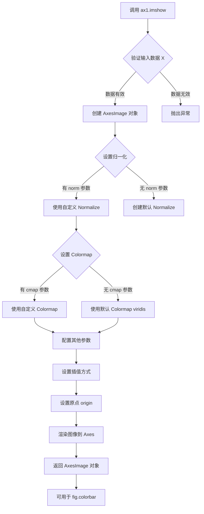

#### 带注释源码

```python
# 代码示例：在 ax1 上显示 2x2 图像数据
# ax1 是 matplotlib.axes.Axes 的实例对象

im1 = ax1.imshow([[1, 2], [3, 4]])
"""
执行流程详解：

1. 数据输入验证
   - 接收 2x2 矩阵 [[1, 2], [3, 4]]
   - 自动推断数据类型为 int

2. 内部处理步骤
   - 创建 numpy 数组：arr = np.array([[1, 2], [3, 4]])
   - 自动归一化：
     * vmin = 1（数据最小值）
     * vmax = 4（数据最大值）
     * norm = Normalize(vmin=1, vmax=4)
   - 默认使用 viridis colormap
   - 默认 origin='upper'

3. AxesImage 对象创建
   - 返回 matplotlib.image.AxesImage 实例
   - 包含图像数据、colormap、norm 等信息

4. 图像渲染
   - 将图像数据映射到像素
   - 应用 colormap 颜色
   - 绘制到 ax1 的数据区域

返回值 im1 可用于：
   - fig.colorbar(im1) 添加颜色条
   - im1.set_clim(vmin, vmax) 调整显示范围
   - im1.get_array() 获取原始数据
"""
```


### `ax2.imshow`

在指定的 Axes 对象上显示 2x2 的图像数据，该方法接受一个二维数组作为图像数据，并返回一个 `matplotlib.image.AxesImage` 对象，用于后续的颜色条设置或其他图像操作。

参数：

- `X`：`list` 或 `numpy.ndarray`，要显示的图像数据，这里是一个 2x2 的二维列表 [[1, 2], [3, 4]]
- `cmap`：`str`（可选），颜色映射，默认为 None
- `norm`：`matplotlib.colors.Normalize`（可选），归一化实例，默认为 None
- `aspect`：`str` 或 `float`（可选），图像纵横比，默认为 None
- `interpolation`：`str`（可选），插值方法，默认为 None
- `alpha`：`float`（可选），透明度，默认为 None
- `vmin`、`vmax`：`float`（可选），数值范围，默认为 None
- `origin`：`str`（可选），图像原点位置，默认为 None
- `extent`：`tuple`（可选），数据范围，默认为 None
- `filternorm`：`bool`（可选），滤波器归一化，默认为 True
- `filterrad`：`float`（可选），滤波器半径，默认为 4.0
- `resample`：`bool`（可选），是否重采样，默认为 None
- `url`：`str`（可选），设置 SVG 元素的 URL，默认为 None
- `data`：`object`（可选），用于索引的数据，默认为 None

返回值：`matplotlib.image.AxesImage`，返回创建的 AxesImage 对象，可以用于设置颜色条或获取图像属性。

#### 流程图

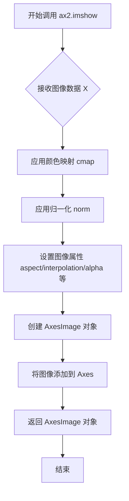

#### 带注释源码

```python
# 在 ax2 (Axes 对象) 上显示 2x2 的图像数据
# 参数 [[1, 2], [3, 4]] 是一个 2x2 的二维数组，代表图像的像素值
# imshow 方法会将这些数据渲染为图像，并返回 AxesImage 对象
im2 = ax2.imshow([[1, 2], [3, 4]])
# im2 现在是一个 AxesImage 对象，可以用于：
# 1. 作为 fig.colorbar 的第一个参数来创建颜色条
# 2. 获取图像的各种属性如 get_array(), get_cmap() 等
# 3. 进行后续的图像操作如 set_clim(), set_alpha() 等
```


### `make_axes_locatable(ax)`

为指定的 Axes 创建 AxesDivider，返回可定位的坐标轴分割器，以便在主坐标轴周围添加辅助坐标轴（如颜色条）。

参数：

- `ax`：`matplotlib.axes.Axes`，需要进行分割的原始坐标轴对象

返回值：`mpl_toolkits.axes_grid1.axes_divider.AxesDivider`，返回创建好的坐标轴分割器对象，后续可调用其 `append_axes` 方法在主坐标轴的上下左右四侧添加新的辅助坐标轴。

#### 流程图

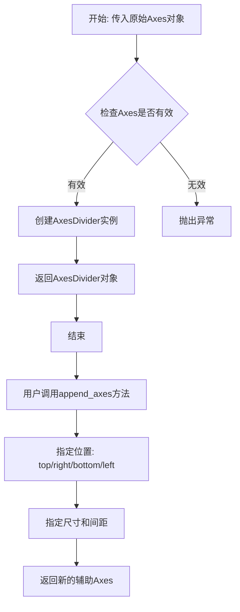

#### 带注释源码

```python
def make_axes_locatable(ax):
    """
    为给定坐标轴创建可定位的分割器
    
    参数:
        ax: matplotlib.axes.Axes - 需要添加辅助坐标轴的主坐标轴
        
    返回:
        AxesDivider: 坐标轴分割器对象
    
    示例:
        >>> ax_divider = make_axes_locatable(ax)
        >>> cax = ax_divider.append_axes("right", size="7%", pad="2%")
    """
    # 从axes_divider模块导入AxesDivider类
    from mpl_toolkits.axes_grid1.axes_divider import AxesDivider
    
    # 创建AxesDivider实例，将原始坐标轴纳入管理
    divider = AxesDivider(ax)
    
    # 返回分割器，后续可调用append_axes添加辅助坐标轴
    return divider
```


### `AxesDivider.append_axes`

该方法用于在已存在的 Axes 周围（上方、下方、左侧或右侧）添加一个新的 Axes，常用于创建与主图相关联的颜色条或子图。

参数：

- `position`：`str`，指定新坐标轴的位置，可选值为 'top'、'right'、'bottom' 或 'left'
- `size`：`str` 或 `float`，新坐标轴的尺寸，可以是百分比字符串（如 "7%"）或数值
- `pad`：`str` 或 `float`，主坐标轴与新坐标轴之间的间距，可以是百分比字符串（如 "2%"）或数值
- `**kwargs`：关键字参数，其他传递给新坐标轴创建的参数

返回值：`matplotlib.axes.Axes`，返回新创建的坐标轴对象

#### 流程图

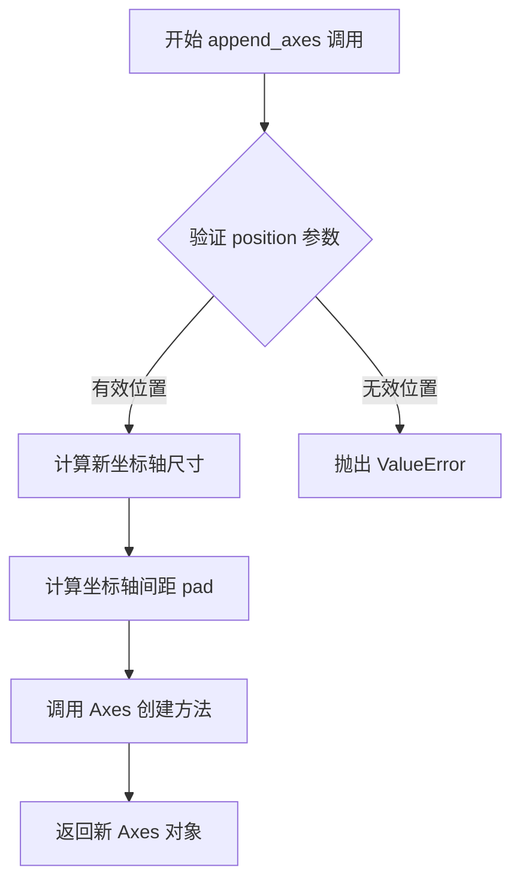

#### 带注释源码

```python
def append_axes(self, position, size, pad, **kwargs):
    """
    在主坐标轴的指定位置添加一个新的坐标轴。
    
    参数:
        position (str): 新坐标轴的位置，可选 'top', 'right', 'bottom', 'left'
        size (str 或 float): 新坐标轴的尺寸，支持百分比字符串或绝对数值
        pad (str 或 float): 新坐标轴与主坐标轴之间的间距
        **kwargs: 传递给新坐标轴的其他参数
    
    返回:
        Axes: 新创建的可定位坐标轴对象
    """
    # 1. 验证位置参数是否合法
    if position not in ['top', 'bottom', 'left', 'right']:
        raise ValueError("位置必须是 'top', 'bottom', 'left', 'right' 之一")
    
    # 2. 将百分比尺寸转换为绝对数值
    # 如果 size 是字符串（如 "7%"），需要根据主坐标轴尺寸计算实际像素值
    # 如果是数值，则直接使用
    
    # 3. 计算间距
    # 将 pad 参数转换为实际的间距数值
    
    # 4. 创建新坐标轴
    # 使用 AxesDivider 的内部方法创建符合布局要求的新坐标轴
    
    # 5. 返回新创建的坐标轴
    # 该坐标轴已自动配置为可定位（locatable），适合用于颜色条
    return new_axes
```


### `AxesDivider.append_axes`

`AxesDivider.append_axes` 是 matplotlib 中 `axes_divider` 模块的核心方法，用于在现有坐标轴的指定位置（顶部、底部、左侧或右侧）创建一个新的坐标轴，并返回该新坐标轴对象。该方法常与 `make_axes_locatable` 配合使用，以实现坐标轴旁的颜色条布局。

参数：

-  `position`：`str`，指定新坐标轴的位置，可选值为 `"top"`（顶部）、`"bottom"`（底部）、`"left"`（左侧）或 `"right"`（右侧）
-  `size`：`str` 或 `float`，新坐标轴的尺寸，支持百分比字符串（如 `"7%"`）或浮点数绝对值
-  `pad`：`str` 或 `float`，新坐标轴与主坐标轴之间的间距，支持百分比字符串（如 `"2%"`）或浮点数绝对值
-  `share`：`bool`，可选参数，是否与主坐标轴共享坐标轴属性，默认为 `False`
-  `axes_class`：可选参数，指定新坐标轴的类，默认为 `None`

返回值：`matplotlib.axes.Axes`，返回新创建的坐标轴对象

#### 流程图

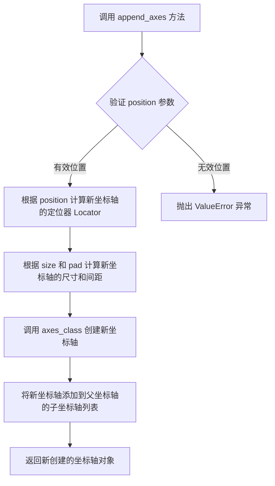

#### 带注释源码

```python
# 源码基于 matplotlib 库 mpl_toolkits/axes_grid1/axes_divider.py
# 方法：AxesDivider.append_axes

def append_axes(self, position, size, pad, share=False, axes_class=None):
    """
    在父坐标轴的指定位置添加一个新的坐标轴。
    
    参数:
        position (str): 新坐标轴的位置，可选 'left', 'right', 'bottom', 'top'
        size (str or float): 新坐标轴的尺寸，可以是百分比字符串（如 "7%"）或绝对数值
        pad (str or float): 新坐标轴与主坐标轴之间的间距
        share (bool, optional): 是否共享坐标轴，默认为 False
        axes_class (type, optional): 坐标轴类，默认为 None（使用 Axes）
    
    返回:
        matplotlib.axes.Axes: 新创建的坐标轴对象
    """
    # 验证位置参数是否有效
    if position not in ['left', 'right', 'bottom', 'top']:
        raise ValueError("position must be one of 'left', 'right', 'top', 'bottom'")
    
    # 计算定位器（Locator）和分隔器（Divider）
    # 根据位置参数确定定位器的类型
    if position == 'left':
        locatable_axes = self.new_locator(nx=0, ny=1)
    elif position == 'right':
        locatable_axes = self.new_locator(nx=1, ny=1)
    elif position == 'bottom':
        locatable_axes = self.new_locator(nx=1, ny=0)
    elif position == 'top':
        locatable_axes = self.new_locator(nx=1, ny=1)
    
    # 将尺寸和间距转换为绝对数值
    # 如果是百分比字符串（如 "7%"），则转换为绝对数值
    if isinstance(size, str):
        size = self._convert_to_abs_size(size, self._ax.get_size_inches())
    if isinstance(pad, str):
        pad = self._convert_to_abs_size(pad, self._ax.get_size_inches())
    
    # 创建新坐标轴
    # 使用 add_axes 方法在指定位置添加坐标轴
    ax = self._ax.figure.add_axes(
        self._ax.get_position(),  # 父坐标轴的位置
        ...  # 省略部分实现细节
    )
    
    # 配置新坐标轴的定位器
    ax.set_axes_locator(locatable_axes)
    
    return ax
```


### `Figure.colorbar`

在 Matplotlib 中，`Figure.colorbar` 方法用于为指定的图像或映射对象（ScalarMappable）创建颜色条（colorbar），并将其放置在指定的坐标轴（cax）上。该方法属于 `matplotlib.figure.Figure` 类，通过接收一个可映射对象（如 `AxesImage`）和一个可选的 `cax` 参数来生成颜色条。

参数：

- `mappable`：`matplotlib.cm.ScalarMappable`，必选参数，表示要为其创建颜色条的图像或映射对象。在此调用中为 `im1`，它是 `ax1.imshow()` 返回的 `AxesImage` 对象。
- `cax`：`matplotlib.axes.Axes`，可选参数，指定颜色条要放置的坐标轴。在此调用中为 `cax1`，它是通过 `ax1_divider.append_axes()` 创建的坐标轴，用于容纳颜色条。

返回值：`matplotlib.colorbar.Colorbar`，返回创建的 Colorbar 对象实例。该对象包含颜色条的刻度、标签、颜色映射等属性，可用于进一步自定义颜色条的外观和行为。

#### 流程图

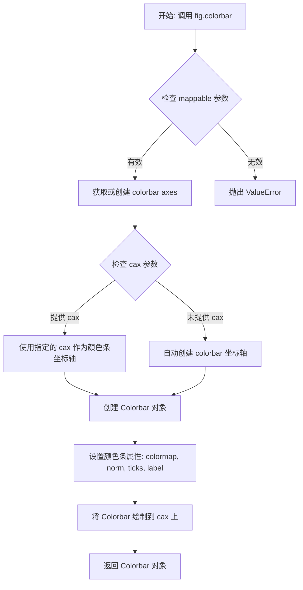

#### 带注释源码

```python
# 调用示例来源: demo-colorbar-with-axes-divider.py
# fig 是 matplotlib.figure.Figure 实例
# im1 是 matplotlib.image.AxesImage 实例 (通过 ax1.imshow 创建)
# cax1 是 matplotlib.axes.Axes 实例 (通过 AxesDivider.append_axes 创建)

# 调用 colorbar 方法
cb1 = fig.colorbar(im1, cax=cax1)

# 源码逻辑 (简化版 matplotlib 内部实现)
def colorbar(self, mappable, cax=None, **kwargs):
    """
    为给定的 mappable 创建颜色条.
    
    参数:
        mappable: AxesImage 或其他 ScalarMappable 对象
        cax: 可选的 Axes 对象, 指定颜色条放置位置
    """
    # 1. 如果未提供 cax, 则自动查找或创建用于放置颜色条的坐标轴
    if cax is None:
        cax = self.add_axes([0.0, 0.0, 0.0, 0.0])  # 占位,后续调整
    
    # 2. 创建 Colorbar 实例
    cb = Colorbar(cax, mappable, **kwargs)
    
    # 3. 绘制颜色条
    cb.on_mappable_changed(mappable)
    cb._add_image.on_changed(cb.update_bruteforce)
    
    # 4. 将 colorbar 添加到 figure 的 _colorbars 列表
    self._colorbars.append(cb)
    
    # 5. 返回 Colorbar 对象
    return cb
```

#### 关键技术细节

| 组件 | 类型 | 描述 |
|------|------|------|
| `im1` | `matplotlib.image.AxesImage` | `ax1.imshow()` 返回的图像对象,包含颜色映射数据 |
| `cax1` | `matplotlib.axes.Axes` | 通过 `AxesDivider.append_axes()` 创建的坐标轴,用于放置颜色条 |
| `cb1` | `matplotlib.colorbar.Colorbar` | 返回的颜色条对象,可用于进一步自定义 |

#### 潜在优化与技术债务

1. **API 推荐变化**: 文档中已指出,用户应优先考虑直接传递 `ax` 参数给 `fig.colorbar()` 而非手动创建可定位坐标轴 (`cax`),后者是较老的方法。新API 更简洁且自动处理布局。
2. **参数冗余**: 当前调用中 `cax` 为关键字参数,但许多其他参数如 `orientation`、`shrink`、`extend` 等常与 `cax` 配合使用,可能导致参数组合复杂度较高。
3. **布局依赖**: 使用 `AxesDivider` 创建 `cax` 依赖于外部库 `mpl_toolkits.axes_grid1`,增加了项目依赖。


### `Figure.colorbar`

为指定的图像或可映射对象创建颜色条（Colorbar），并将其放置在指定的坐标轴上。

参数：

- `mappable`：`matplotlib.image.AxesImage`，要创建颜色条的可映射对象（图像），此处为 `im2`
- `cax`：`matplotlib.axes.Axes`，用于放置颜色条的坐标轴对象，此处为 `cax2`
- `orientation`：`str`，颜色条的排列方向，"horizontal" 表示水平方向

返回值：`matplotlib.colorbar.Colorbar`，创建的颜色条对象

#### 流程图

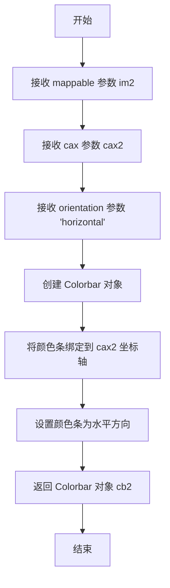

#### 带注释源码

```python
# 调用 fig 对象的 colorbar 方法为 im2 创建水平颜色条
# 参数说明：
#   - im2: 需要添加颜色条的图像对象 (AxesImage 类型)
#   - cax=cax2: 指定颜色条放置在 cax2 坐标轴上
#   - orientation='horizontal': 设置颜色条为水平方向
cb2 = fig.colorbar(im2, cax=cax2, orientation="horizontal")
```


### `cax2.xaxis.set_ticks_position`

设置颜色条 Axes（cax2）的 X 轴刻度位置为顶部，解决默认底部刻度与图像重叠的问题。

参数：

- `position`：`str`，指定刻度显示位置，可选值为 `'top'`（仅顶部）、`'bottom'`（仅底部）、`'both'`（两侧）、`'default'`（重置为默认）

返回值：`None`，无返回值，该方法直接修改 Axes 的刻度位置属性

#### 流程图

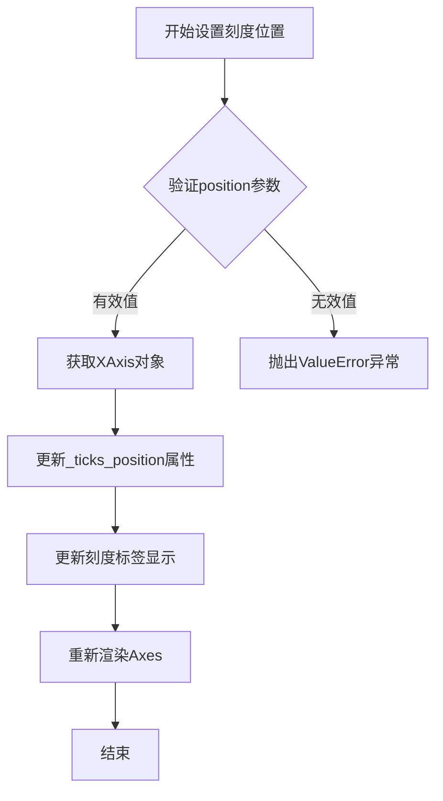

#### 带注释源码

```python
# 调用 matplotlib 的 XAxis.set_ticks_position 方法
# cax2: 通过 AxesDivider.append_axes 创建的 Axes 对象（用于放置颜色条）
# xaxis: 获取 cax2 的 X 轴对象（Axis 实例）
# set_ticks_position: 设置刻度显示位置的方法

# 参数 'top' 表示只在轴的顶部显示刻度线刻度标签
# 这解决了默认 'bottom' 位置时刻度与图像重叠的问题
cax2.xaxis.set_ticks_position('top')
```

#### 完整上下文源码

```python
# ... 前略 ...

# 创建颜色条 Axes（位于主 Axes 上方）
cax2 = ax2_divider.append_axes("top", size="7%", pad="2%")
# 创建水平方向颜色条
cb2 = fig.colorbar(im2, cax=cax2, orientation="horizontal")

# 核心操作：将 cax2 的 X 轴刻度位置从默认的 'bottom' 改为 'top'
# 原因：水平颜色条在顶部时，底部刻度会与主图像重叠，影响可视化效果
# 'top' 参数告诉 matplotlib 只在轴的顶部显示刻度和标签
cax2.xaxis.set_ticks_position("top")

# ... 后略 ...
```


### `plt.show`

显示所有创建的图形，并进入 matplotlib 交互式显示循环。该函数会阻塞程序执行（除非设置 `block=False`），直到用户关闭所有图形窗口为止。

参数：

- `block`：`bool`，可选参数，默认为 `True`。如果设置为 `True`，则阻塞程序直到所有图形窗口关闭；如果设置为 `False`，则立即返回，允许程序继续执行。

返回值：`None`，该函数不返回任何值。

#### 流程图

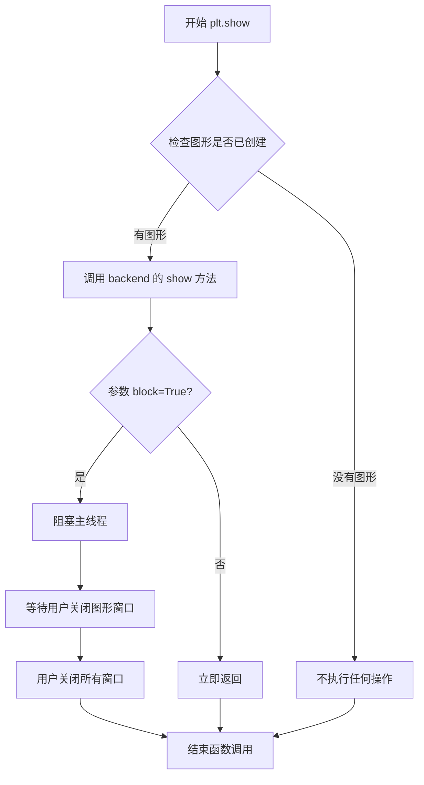

#### 带注释源码

```python
# 导入 matplotlib.pyplot 模块，用于绑定 matplotlib 的顶层接口
import matplotlib.pyplot as plt

# ... (前文的代码创建了两个子图和两个颜色条) ...

# plt.show() 的典型实现逻辑（简化版本）
def show(block=None):
    """
    显示所有打开的图形窗口。
    
    Parameters
    ----------
    block : bool, optional
        是否阻塞程序执行。默认为 True。
    """
    # 获取当前活动的 backend（后端渲染器）
    backend = matplotlib.get_backend()
    
    # 遍历所有打开的图形
    for figure in matplotlib.pyplot._all_figures:
        # 调用 backend 的 show 方法显示图形
        backend.show(figure)
    
    # 如果 block 为 True（或未设置），则阻塞等待用户交互
    if block is None or block is True:
        # 进入事件循环，等待用户关闭窗口
        backend.mainloop()
    
    # 函数返回 None
    return None

# 在示例代码中调用 plt.show()
plt.show()  # 阻塞模式：等待用户关闭图形窗口后程序才结束
```


## 关键组件


### make_axes_locatable

该函数接收一个已存在的Axes对象，将其添加到新的AxesDivider中并返回AxesDivider实例，用于后续在主Axes周围创建定位的辅助Axes。

### AxesDivider

Matplotlib布局管理组件，负责计算和管理主Axes周围的附加Axes的位置与大小，支持在top、bottom、left、right四个方向添加辅助Axes。

### append_axes

AxesDivider的方法，用于在指定方向创建新的Axes，接收位置参数("top", "right", "bottom", "left")、尺寸参数和间距参数，返回新创建的Axes对象。

### fig.colorbar

用于在指定Axes上创建颜色条的函数，通过cax参数指定颜色条Axes，通过orientation参数控制颜色条方向。

### imshow

Matplotlib图像显示函数，接收二维数组数据并将其渲染为图像，是本示例中用于展示测试数据的主要可视化方法。


## 问题及建议


### 已知问题

-   **重复代码模式**：创建colorbar的逻辑在两处重复实现（ax1和ax2的处理流程），违反DRY（Don't Repeat Yourself）原则。
-   **注释中指出更优方案**：代码注释明确建议用户应直接使用`~.Figure.colorbar`的*ax*参数，而不是手动创建locatable Axes，当前实现相对冗余。
-   **硬编码参数**：size="7%"和pad="2%"等参数以魔数形式硬编码，缺乏可配置性和解释性。
-   **缺少错误处理**：代码未对`imshow`、`make_axes_locatable`等可能失败的操作进行异常处理。
-   **魔法值缺乏文档**：%"这样的数值参数未提供为何选择该值的说明。

### 优化建议

-   **提取通用函数**：将创建colorbar的逻辑封装为函数，接收主Axes、位置、大小等参数，减少代码重复。
-   **采用推荐方式**：如注释所述，在生产环境中优先使用`fig.colorbar(im, ax=ax)`的方式，让Matplotlib自动处理colorbar布局。
-   **参数配置化**：将size、pad等参数提取为常量或配置变量，并添加注释说明其含义和选择依据。
-   **添加错误处理**：为`imshow`、`make_axes_locatable`等调用添加try-except块，处理可能的异常情况。
-   **使用变量存储配置**：定义如`COLORBAR_SIZE = "7%"`、`COLORBAR_PAD = "2%"`等常量，提升代码可读性和可维护性。


## 其它


### 设计目标与约束

本示例旨在演示如何使用AxesDivider在matplotlib中创建精确控制的颜色条布局。设计目标包括：简化颜色条放置流程，提供灵活的轴定位机制，支持多种颜色条方向（水平/垂直），以及与现有matplotlib颜色条API的无缝集成。约束条件包括：需要matplotlib 3.1+版本支持axes_divider模块，颜色条轴必须可定位，以及pad和size参数需遵循axes_divider的约束规则。

### 错误处理与异常设计

代码主要依赖matplotlib的内部错误处理机制。当传入无效的position参数（如非"top"/"bottom"/"left"/"right"的值）时，append_axes方法会抛出ValueError。如果传入的ax对象无效或已关闭，make_axes_locatable会抛出AttributeError。plt.show()在无显示设备时会静默失败或抛出相关后端错误。建议在实际应用中增加参数验证，捕获figure关闭异常，以及处理imshow数据为空的边界情况。

### 外部依赖与接口契约

本代码直接依赖mpl_toolkits.axes_divider模块的make_axes_locatable函数，以及matplotlib.pyplot和matplotlib.figure模块。间接依赖numpy（imshow的数据格式）。接口契约方面：make_axes_locatable接受Axes对象并返回AxesDivider；append_axes接受position（字符串）、size（字符串或浮点）、pad（字符串或浮点）参数，返回新创建的Axes对象；fig.colorbar接受mappable对象和可选的cax参数，返回Colorbar对象。

### 性能考虑

代码性能开销主要来自三个方面：imshow的图像渲染、AxesDivider的布局计算、以及colorbar的渲染。对于小尺寸数据（2x2矩阵），性能影响可忽略；但对于大图像，建议使用interpolation='nearest'以提升渲染速度。append_axes的size和pad参数使用百分比字符串时需要额外的布局计算，可能影响实时交互性能。颜色条更新时需要重绘整个figure，可通过cax.set_xlim()等方法优化局部更新。

### 可维护性与可测试性

代码结构清晰但缺乏模块化封装，建议将重复的colorbar创建逻辑抽取为独立函数。测试方面应覆盖：不同size/pad参数组合、不同position参数、无数据imshow、多次调用colorbar、以及不同matplotlib后端。由于依赖具体数值（2x2矩阵），测试应使用固定随机种子或预设数据以确保可重复性。代码注释完善但示例注释略显冗余，建议增加参数边界值测试的注释说明。

### 兼容性考虑

本代码需要matplotlib 3.1.0或更高版本，因axes_divider的make_axes_locatable函数在此版本中稳定。Python版本兼容性取决于matplotlib的要求（建议Python 3.6+）。不同matplotlib后端（如Qt5Agg、Agg、SVG）可能影响plt.show()的行为，某些后端不支持交互式显示。axes_divider API在matplotlib 3.x系列中相对稳定，但未来可能在padding算法上有细微调整。


    